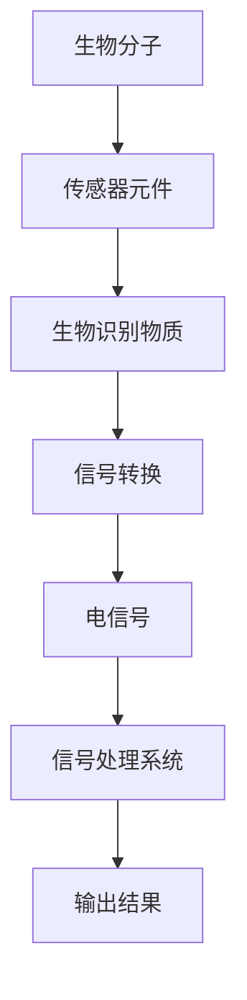
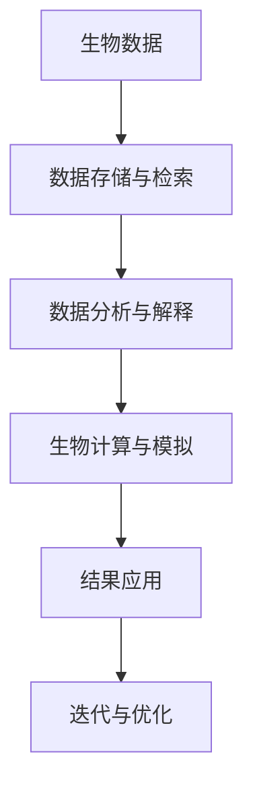

                 

### 引言

#### 1.1 生物黑客概述

生物黑客，通常指的是那些精通生物学、计算机科学、工程学和其他技术领域的人，他们通过利用、修改和增强自然系统的知识来推动科技创新。生物黑客的定义可以追溯到20世纪70年代，当时一群对计算机技术充满热情的程序员开始探索硬件和软件的极限，他们中的一些人逐渐将这种热情扩展到了生物学领域。

### 1.1.1 生物黑客的定义

生物黑客的定义并不是一成不变的。在广义上，生物黑客可以被描述为那些对生命科学和技术充满好奇心，并积极实践和探索的人。他们的动机各异，有的出于学术研究，有的出于技术创新，有的则是为了改善人类健康和生活质量。生物黑客通常具有以下特点：

- 熟悉生物学和计算机科学的基础知识；
- 掌握编程、硬件和软件开发的技能；
- 善于使用开放源代码工具和开源硬件；
- 具有强烈的好奇心和创新精神；
- 通常活跃于生物黑客空间（biohacking spaces）或在线社区。

### 1.1.2 生物黑客的历史与发展

生物黑客的历史可以追溯到20世纪70年代的计算机黑客文化，当时黑客们通过计算机软件和硬件的逆向工程来发现新功能。随着时间的推移，黑客文化逐渐扩展到了生物学领域。20世纪90年代，随着基因编辑技术和生物工程学的快速发展，生物黑客开始出现并开始利用这些技术进行创新。

早期的生物黑客活动主要集中在合成生物学和基因工程领域，例如，1998年，纽约大学的合成生物学实验室创造了世界上第一个由人工合成设计的细菌。随后，生物黑客开始涉足更广泛的领域，包括神经科学、认知增强、人体增强等。

### 1.1.3 生物黑客的主要领域

生物黑客的主要领域包括但不限于以下几个方面：

- **基因编辑**：如CRISPR-Cas9等技术的发展，使得生物黑客能够精确地修改DNA序列，从而治疗遗传病或增强特定性状。
- **神经科学与认知增强**：利用脑机接口技术，生物黑客正在探索如何通过增强大脑功能来提高认知能力、记忆力和注意力。
- **人体增强**：通过生物技术和医疗器械，生物黑客正在尝试改善人的生理功能和身体素质。
- **合成生物学**：生物黑客利用基因编辑、细胞培养等技术创造新的生物体，如人工合成生命。
- **人体改造**：通过植入生物传感器、增强现实设备和机器人等，生物黑客正在探索人体的扩展和增强。

#### 1.2 人体增强的概念

人体增强，通常指的是通过生物技术、医疗器械和其他手段来增强人类的生理、心理和能力。人体增强的概念并不是新事物，早在古代，人类就通过使用工具和衣物来增强自身的能力。然而，随着科学技术的进步，现代人体增强的概念和技术有了长足的发展。

### 1.2.1 人体增强的定义

人体增强的定义因领域和目标的不同而有所差异。在广义上，人体增强可以被描述为通过生物技术、医学工程、医疗器械和其他手段来提升人类的生理、心理和能力。人体增强的目标包括但不限于：

- 增强肌肉力量和耐力；
- 提高认知能力和记忆力；
- 增强感官能力，如视力、听力等；
- 恢复失去的生理功能；
- 增强免疫系统；
- 延缓衰老过程。

### 1.2.2 人体增强的历史与现状

人体增强的历史可以追溯到古代，当时人类通过使用工具和衣物来增强自身的能力。例如，古代文明中的弓箭手使用弓和箭来增强狩猎和战斗能力。随着时间的推移，科技进步带来了新的可能性。

- **20世纪**：随着医疗器械和生物技术的出现，人体增强进入了一个新的阶段。心脏起搏器、人工关节和义肢等技术的应用，使得人体增强成为可能。
- **21世纪**：基因编辑、神经科学、生物传感器和脑机接口等技术的突破，进一步推动了人体增强的发展。例如，CRISPR-Cas9基因编辑技术的出现，使得基因层面的增强成为现实。

目前，人体增强的应用领域不断扩大，从医疗保健到军事、体育和娱乐等领域都有涉及。随着技术的不断进步，人体增强的未来前景令人期待。

### 1.2.3 人体增强的目标与挑战

人体增强的目标多样且复杂，包括但不限于以下几方面：

- **改善健康状况**：通过基因编辑和生物医学工程，人体增强可以治疗遗传病、延缓衰老、提高免疫能力等。
- **提高生活质量**：通过增强肌肉力量、提高感官能力和认知能力，人体增强可以改善人们的生活质量。
- **增强运动能力**：通过生物传感器和机械辅助设备，人体增强可以增强运动员的竞技能力。
- **增强军事能力**：通过人体增强技术，士兵可以具备更高的战斗力和耐力。

然而，人体增强也面临着诸多挑战：

- **技术难题**：基因编辑、脑机接口等技术虽然取得了一定的突破，但仍需进一步研究和发展。
- **伦理问题**：人体增强技术的应用引发了关于人体尊严、公平性和隐私等方面的伦理问题。
- **安全性**：人体增强技术的长期影响和潜在风险仍需进一步研究和评估。
- **社会接受度**：人体增强技术的普及可能面临社会接受度的问题，尤其是那些涉及基因编辑和大脑增强的技术。

#### 1.3 生物黑客与人体增强的关系

生物黑客与人体增强之间存在密切的关系。生物黑客通过利用和开发新兴技术，不断推动人体增强的发展。以下从三个方面探讨生物黑客如何推动人体增强，以及人体增强为生物黑客带来的机遇与挑战。

### 1.3.1 生物黑客如何推动人体增强

生物黑客通过以下几种方式推动人体增强：

- **技术创新**：生物黑客通过逆向工程和自主创新，不断开发新的生物技术和医疗器械，为人体增强提供技术支持。
- **开源合作**：生物黑客通常积极参与开源项目，通过共享知识和资源，加速人体增强技术的发展。
- **探索前沿领域**：生物黑客经常涉足前沿领域，如基因编辑、脑机接口和神经科学，为人体增强开辟新的方向。

### 1.3.2 人体增强为生物黑客带来的机遇与挑战

人体增强为生物黑客带来了巨大的机遇，同时也带来了诸多挑战：

**机遇**：

- **技术创新**：人体增强技术的发展为生物黑客提供了新的研究方向和应用场景，激发了他们的创新潜力。
- **市场潜力**：随着人体增强技术的逐渐成熟，市场对相关产品和服务的需求不断增加，为生物黑客创造了广阔的商业机会。
- **社会影响**：人体增强技术的普及将带来深远的社会影响，生物黑客有机会参与塑造人类未来的发展方向。

**挑战**：

- **伦理问题**：人体增强技术引发了关于人体尊严、公平性和隐私等方面的伦理问题，生物黑客需要对此进行深入思考和负责任地行动。
- **技术风险**：人体增强技术的长期影响和潜在风险仍需进一步研究和评估，生物黑客需要谨慎对待技术创新。
- **监管压力**：随着人体增强技术的发展，监管机构可能会加强对相关技术的监管，生物黑客需要遵守相关法律法规。

### 1.3.3 生物黑客与人体增强的未来前景

随着科技的不断进步，生物黑客与人体增强的未来前景令人期待：

- **技术创新**：生物黑客将继续推动人体增强技术的发展，探索更多的新技术和新应用。
- **多元化应用**：人体增强技术将在医疗、体育、军事和娱乐等领域得到广泛应用，带来更多社会效益。
- **社会接受度**：随着技术的成熟和社会教育，人体增强技术将逐渐被社会接受，推动人类文明的发展。

总之，生物黑客与人体增强之间的关系将越来越紧密，共同塑造人类未来的发展方向。生物黑客将在这个过程中发挥重要作用，为人体增强带来创新和变革。

#### 生物黑客与人体增强的未来前景

随着科技的不断进步，生物黑客与人体增强的未来前景令人期待。从技术创新、多元化应用和社会接受度等多个角度来看，这两个领域将继续相互促进，共同塑造人类未来的发展方向。

### 2.1 生物传感器

生物传感器是一种能够检测和测量生物信息并将其转换为电信号的装置。它们在人体增强技术中扮演着至关重要的角色，因为它们能够实时监测人体内部的各种生物活动，如血糖水平、心率、体温等。生物传感器的应用不仅限于医疗监测，还包括运动监测、健康管理等众多领域。

### 2.1.1 生物传感器的基本原理

生物传感器的工作原理通常涉及三个主要部分：传感器元件、转换器和信号处理系统。传感器元件与生物识别物质（如酶、抗体、DNA等）结合，可以检测特定的生物分子或信号。当生物分子与传感器元件结合时，会引起物理或化学性质的变化，这种变化通过转换器转化为可测量的电信号。最后，信号处理系统对转换器输出的信号进行放大、滤波和数字化处理，以便进一步分析和应用。

### 2.1.2 生物传感器的种类与应用

生物传感器的种类繁多，根据其工作原理和应用场景，可以分为以下几类：

- **酶促传感器**：这类传感器利用酶催化反应的特性来检测生物分子。例如，血糖监测仪就是利用酶促传感器来检测血液中的葡萄糖浓度。
- **免疫传感器**：这类传感器利用抗原-抗体特异性结合反应来检测特定生物分子。它们在疾病的早期诊断和治疗监测中具有重要应用。
- **DNA传感器**：这类传感器利用DNA杂交反应来检测DNA或RNA序列。它们在遗传疾病的检测、生物药物的开发等领域具有重要应用。
- **电化学传感器**：这类传感器利用生物分子与电极之间的电子转移反应来检测生物分子。它们在血糖监测、药物检测和环境污染监测等领域具有广泛应用。

### 2.1.3 生物传感器的发展趋势

随着技术的进步，生物传感器的发展趋势主要体现在以下几个方面：

- **集成化与微型化**：生物传感器正朝着集成化和微型化的方向发展，以便更方便地应用于各种场景。例如，柔性生物传感器和纳米生物传感器的研究正在取得重要突破。
- **智能化与网络化**：结合人工智能和物联网技术，生物传感器正在朝着智能化和网络化的方向发展。这将为个性化医疗和远程健康监测提供新的解决方案。
- **高通量与实时监测**：随着检测技术的发展，生物传感器正朝着高通量与实时监测的方向发展。这将为疾病的早期诊断和实时监测提供技术支持。
- **多功能与交叉学科**：生物传感器正与其他领域（如生物医学工程、材料科学等）进行交叉融合，产生新的应用和解决方案。

### 2.2 生物工程材料

生物工程材料是指那些在生物体内能够执行特定功能，如替代、修复或增强生物组织的材料。它们在人体增强技术中发挥着至关重要的作用，因为它们可以与生物体实现良好的生物相容性，并在特定的生理环境下发挥功能。

### 2.2.1 生物工程材料的基本概念

生物工程材料的基本概念包括以下几个方面：

- **生物相容性**：生物工程材料需要具有良好的生物相容性，即在生物体内不会引起显著的免疫反应或组织排斥。
- **机械性能**：生物工程材料需要具备足够的机械强度和弹性，以满足生物体的力学需求。
- **降解性**：某些生物工程材料需要在体内降解，以便为新生组织提供空间。
- **功能性**：生物工程材料需要具备特定的功能性，如导电性、光学性、生物活性等，以实现特定的生物增强目标。

### 2.2.2 生物工程材料的分类与应用

生物工程材料可以分为以下几类：

- **生物降解材料**：如聚乳酸（PLA）、聚乙二醇（PEG）等，它们在体内可降解，常用于组织工程和药物输送系统。
- **生物活性材料**：如羟基磷灰石（HA）、硅橡胶等，它们可以与生物体实现良好的生物结合，常用于骨修复和软组织工程。
- **导电材料**：如石墨烯、导电聚合物等，它们在神经修复和电子皮肤等领域具有广泛应用。
- **智能材料**：如形状记忆合金、响应性聚合物等，它们可以根据外部刺激（如温度、pH值、电场等）改变自身的形态和性质，具有广泛的应用前景。

### 2.2.3 生物工程材料的发展趋势

生物工程材料的发展趋势主要体现在以下几个方面：

- **多功能与复合化**：生物工程材料正朝着多功能与复合化的方向发展，以实现更复杂的生物增强目标。例如，将生物降解材料与生物活性材料结合，可以同时实现生物降解和生物结合。
- **智能化与可控化**：结合人工智能和纳米技术，生物工程材料正朝着智能化与可控化的方向发展，以便更好地满足生物增强的需求。例如，通过控制材料的结构和组成，实现智能化的药物输送系统。
- **生物3D打印**：生物3D打印技术的快速发展为生物工程材料的应用提供了新的可能性。通过3D打印技术，可以精确地制造出具有复杂结构的生物组织工程支架，为人体增强提供更多选择。
- **生物相容性与生物降解性**：随着环保意识的提高，生物工程材料正朝着更环保、可持续的方向发展。生物相容性和生物降解性的研究成为热点，以实现材料的绿色制造和生物降解。

### 2.3 生物信息技术

生物信息技术是指应用计算机科学、信息科学和生命科学的知识，对生物信息进行采集、存储、处理、分析和解释的技术。生物信息技术在人体增强领域发挥着重要作用，因为它们可以帮助研究人员更好地理解人体生物机制，从而开发出更有效的人体增强技术。

### 2.3.1 生物信息技术的定义与作用

生物信息技术的定义可以概括为：利用计算机技术、信息技术和生物科学的方法，对生物数据进行处理和分析的技术。生物信息技术的核心作用包括：

- **数据存储与检索**：生物信息技术可以帮助存储和检索大量的生物数据，如基因组数据、蛋白质结构和代谢途径数据等。
- **数据分析与解释**：生物信息技术可以对生物数据进行深度分析，提取有用的信息，帮助研究人员理解生物机制和疾病机理。
- **生物计算与模拟**：生物信息技术可以用于生物计算和模拟，如蛋白质折叠模拟、药物设计等，为人体增强技术的研发提供支持。

### 2.3.2 生物信息技术的分类与应用

生物信息技术可以分为以下几类：

- **基因组学**：基因组学是研究基因组结构、功能和演化规律的科学。生物信息技术在基因组学中的应用包括基因测序、基因组组装、基因注释等。
- **蛋白质组学**：蛋白质组学是研究蛋白质组成、表达和相互作用规律的科学。生物信息技术在蛋白质组学中的应用包括蛋白质测序、蛋白质表达谱分析、蛋白质相互作用网络分析等。
- **代谢组学**：代谢组学是研究细胞内所有代谢物组成和变化规律的科学。生物信息技术在代谢组学中的应用包括代谢物检测、代谢通路分析、代谢网络建模等。
- **生物信息学工具**：生物信息学工具是用于生物数据分析和解释的软件和算法。常见的生物信息学工具包括序列比对工具、基因注释工具、蛋白质结构预测工具等。

### 2.3.3 生物信息技术的发展趋势

生物信息技术的发展趋势主要体现在以下几个方面：

- **大数据与云计算**：随着生物数据的爆炸性增长，大数据和云计算技术在生物信息技术中的应用越来越广泛。通过大数据分析，可以揭示生物机制的复杂性和多样性；通过云计算，可以提供强大的计算能力和存储能力，为生物信息分析提供支持。
- **人工智能与机器学习**：人工智能和机器学习技术在生物信息技术中的应用越来越成熟。通过深度学习和神经网络，可以实现对生物数据的自动分析和模式识别，从而提高生物信息分析的效率和准确性。
- **生物计算与模拟**：生物计算和模拟技术在生物信息技术中的应用越来越重要。通过生物计算，可以模拟生物过程的动态变化，从而预测生物系统的行为；通过生物模拟，可以揭示生物机制的内在规律，为人体增强技术的研发提供理论支持。
- **个性化医疗**：随着生物信息技术的进步，个性化医疗逐渐成为现实。通过分析个体的基因组、蛋白质组和代谢组数据，可以为个体定制个性化的治疗方案和保健方案，从而提高治疗效果和预防疾病。

### 2.4 生物电子学

生物电子学是生物科学与电子工程的交叉学科，它致力于研究和开发能够与生物体相互作用的电子系统。生物电子学在人体增强技术中具有广泛应用，例如脑机接口、生物传感器和电子皮肤等。

### 2.4.1 生物电子学的基本原理

生物电子学的基本原理涉及将生物信号转换为电信号，或将电信号转换为生物信号，从而实现生物体与电子系统之间的交互。生物电子学的主要原理包括以下几个方面：

- **生物信号检测**：生物信号检测是生物电子学的基础。通过使用传感器和放大器等电子设备，可以将微弱的生物信号（如脑电信号、心电信号等）放大并转换为电信号。
- **信号处理**：信号处理是生物电子学的核心。通过对生物信号进行滤波、放大、数字化和压缩等处理，可以提高信号的质量和可靠性。
- **电刺激**：电刺激是生物电子学的重要应用。通过将电信号转换为生物刺激（如电刺激神经、肌肉等），可以实现对人体功能的调节和控制。
- **系统集成**：系统集成是生物电子学的关键。通过将生物信号检测、信号处理和电刺激等功能集成到一个小型化、便携化的电子系统中，可以实现高效的生物体-电子系统交互。

### 2.4.2 生物电子学的应用领域

生物电子学的应用领域非常广泛，主要包括以下几个方面：

- **脑机接口**：脑机接口是一种能够将人脑信号直接转换为电信号，从而实现人与计算机或其他设备之间通信的技术。脑机接口在神经康复、智能辅助和增强现实等领域具有广泛应用。
- **生物传感器**：生物传感器是一种能够检测和测量生物信息并将其转换为电信号的装置。生物传感器在医疗监测、健康管理和环境监测等领域具有重要应用。
- **电子皮肤**：电子皮肤是一种能够模拟人体皮肤触觉和力觉的电子系统。电子皮肤在智能穿戴设备、机器人控制和虚拟现实等领域具有广泛应用。
- **神经调节**：神经调节是一种通过电刺激或其他方式调节神经活动的技术。神经调节在治疗神经疾病、改善运动功能和增强认知能力等方面具有重要应用。

### 2.4.3 生物电子学的发展趋势

生物电子学的发展趋势主要体现在以下几个方面：

- **集成化与微型化**：随着纳米技术和微电子技术的进步，生物电子学正朝着集成化和微型化的方向发展。通过将多种功能集成到一个小型化、便携化的设备中，可以实现更高效、更便捷的生物体-电子系统交互。
- **智能化与网络化**：结合人工智能和物联网技术，生物电子学正朝着智能化和网络化的方向发展。通过智能化算法和网络化通信，可以实现更精准、更智能的生物信号检测和电刺激控制。
- **生物相容性与生物降解性**：生物电子学的发展越来越注重生物相容性和生物降解性。通过开发生物相容性更好、生物降解性更高的生物电子材料，可以提高生物电子系统的安全性和可持续性。
- **跨学科融合**：生物电子学与生物学、医学、材料科学、计算机科学等多个学科进行跨学科融合，产生新的应用和解决方案。这种跨学科融合将进一步推动生物电子学的发展，为人体增强技术提供更多可能性。

### 2.5 生物医学工程

生物医学工程是一门跨学科领域，结合工程学、生物学和医学的知识，研究和开发用于诊断、治疗和增强人体功能的技术和设备。生物医学工程在人体增强技术中发挥着关键作用，通过设计和开发各种生物医学设备，可以显著提高人类的生活质量和健康水平。

### 2.5.1 生物医学工程的基本概念

生物医学工程的基本概念包括以下几个方面：

- **生物医学设备**：生物医学设备是指用于诊断、治疗和增强人体功能的设备和系统。常见的生物医学设备包括心脏起搏器、人工关节、胰岛素泵等。
- **生物材料**：生物材料是指与生物体接触后能够实现特定功能的一类材料。生物材料需要具备良好的生物相容性、机械性能和生物降解性。常见的生物材料包括聚合物、陶瓷、金属材料等。
- **生物信号处理**：生物信号处理是指对生物信号进行采集、放大、滤波、数字化和压缩等处理的技术。生物信号处理在医疗监测、诊断和治疗中具有重要意义。
- **生物力学**：生物力学是研究生物体力学行为的一门学科。生物力学的研究有助于理解生物体的运动规律和生理功能，为生物医学设备和技术的研发提供理论支持。

### 2.5.2 生物医学工程的应用领域

生物医学工程的应用领域非常广泛，主要包括以下几个方面：

- **医疗监测**：生物医学工程在医疗监测中发挥着重要作用。例如，心电图（ECG）、脑电图（EEG）和血压监测等设备可以实时监测人体的生理参数，为疾病的诊断和治疗提供依据。
- **诊断和治疗**：生物医学工程在疾病的诊断和治疗中具有广泛应用。例如，CT、MRI和超声波等成像技术可以无创地观察人体内部结构，帮助医生做出准确的诊断；而心脏起搏器、人工关节和胰岛素泵等设备则可以用于治疗各种疾病。
- **人体增强**：生物医学工程在人体增强中具有广泛的应用。例如，人工心脏和人工肺等设备可以替代人体心脏和肺的功能，使患者能够继续生活；而增强现实（AR）和虚拟现实（VR）技术则可以增强人的感知能力和认知能力。
- **组织工程**：生物医学工程在组织工程中具有重要作用。通过生物医学工程的技术，可以制造出人工组织、器官和生物支架，用于修复和替代受损的组织和器官。

### 2.5.3 生物医学工程的发展趋势

生物医学工程的发展趋势主要体现在以下几个方面：

- **智能化与个性化**：随着人工智能和大数据技术的发展，生物医学工程正朝着智能化和个性化的方向发展。通过智能算法和个性化建模，可以实现对患者的精准诊断和治疗。
- **微型化与便携化**：随着纳米技术和微电子技术的进步，生物医学工程正朝着微型化和便携化的方向发展。通过微型化设计，可以实现更高效、更便捷的生物医学检测和治疗。
- **生物相容性与生物降解性**：生物医学工程越来越注重生物相容性和生物降解性。通过开发新型生物材料和生物降解材料，可以提高生物医学设备的安全性和可持续性。
- **跨学科融合**：生物医学工程与生物学、医学、材料科学、计算机科学等多个学科进行跨学科融合，产生新的应用和解决方案。这种跨学科融合将进一步推动生物医学工程的发展，为人体增强技术提供更多可能性。

#### 第三部分：人体增强创业

随着科技的不断进步，人体增强技术正在逐渐走向商业化和市场化。人体增强创业已经成为一个热门领域，吸引了大量创业者、投资者和研究人员。本节将探讨人体增强创业的概述，包括创业的定义与特征、成功的要素、面临的挑战与机遇，以及创业策略与实践。

### 3.1 创业概述

#### 3.1.1 创业的定义与特征

创业是指创建一个新的企业或组织的过程。在人体增强领域，创业通常涉及开发和应用新兴的生物技术、医疗器械和智能设备，以满足人们对于健康、功能和感官提升的需求。人体增强创业具有以下几个特征：

- **技术创新**：人体增强创业的核心在于技术创新。创业者需要不断探索和应用新的生物技术、智能设备和材料，以满足市场需求和用户期望。
- **高风险与高回报**：人体增强领域涉及复杂的科学研究和临床验证，因此创业风险相对较高。然而，如果创业成功，可能带来巨大的商业回报和社会影响。
- **市场需求**：人体增强创业需要密切关注市场需求。创业者需要了解用户的需求和痛点，开发出具有市场竞争力的产品和服务。
- **法规与伦理**：人体增强创业涉及复杂的法规和伦理问题。创业者需要遵守相关法律法规，同时关注伦理问题，确保产品和服务符合社会和道德标准。

#### 3.1.2 创业的成功要素

成功的创业通常需要以下几个关键要素：

- **团队**：一个优秀的团队是创业成功的关键。团队成员需要具备互补的技能和经验，共同应对创业过程中的挑战。
- **资金**：充足的资金是创业的保障。创业者需要寻找投资者和融资渠道，确保项目能够持续进行。
- **市场研究**：深入了解市场需求和竞争状况，有助于创业者制定合适的战略和产品定位。
- **技术创新**：技术创新是创业的核心。创业者需要不断探索和应用新的技术和解决方案，以满足市场需求。
- **商业模式**：一个可行的商业模式是创业成功的重要保障。创业者需要制定清晰的商业模式，确保项目能够实现盈利和可持续发展。

#### 3.1.3 创业的挑战与机遇

人体增强创业面临诸多挑战和机遇：

- **技术挑战**：人体增强技术涉及复杂的科学研究和临床验证，需要解决技术难题和实现技术突破。
- **法规挑战**：人体增强领域涉及复杂的法规和伦理问题，需要创业者遵守相关法律法规，确保产品和服务符合规范。
- **市场需求**：人体增强市场需求庞大，但同时也存在市场竞争和用户认知问题。
- **投资机会**：人体增强创业吸引了大量投资者，为创业者提供了丰富的融资机会。
- **社会影响**：人体增强技术可能带来深远的社会影响，包括伦理、隐私和公平性等问题。

#### 3.1.4 生物黑客与人体增强创业的关系

生物黑客与人体增强创业之间存在密切的关系。生物黑客通过自主创新和技术探索，为人体增强创业提供了创新动力和前沿技术。以下从两个方面探讨生物黑客与人体增强创业的关系：

- **技术创新**：生物黑客通过利用和开发新兴技术，不断推动人体增强技术的发展。他们的技术创新为创业者提供了新的研究方向和应用场景，激发了创业者的创新潜力。
- **创业支持**：生物黑客通常积极参与人体增强创业，为创业者提供技术支持、资源共享和合作机会。他们的开放性和协作精神有助于推动人体增强创业的发展。

总之，生物黑客与人体增强创业之间存在紧密的联系。生物黑客通过技术创新和创业支持，为人体增强创业提供了强大的动力和基础。同时，人体增强创业为生物黑客提供了广阔的应用场景和商业机会，推动了生物黑客技术的商业化和市场化。

#### 3.2 创业案例

为了更深入地了解人体增强创业的现状和趋势，本节将介绍几个成功的创业案例，并进行分析。

### 3.2.1 成功创业案例介绍

**案例一： Neuralink**

Neuralink是一家专注于脑机接口技术的创业公司，由知名企业家伊隆·马斯克（Elon Musk）于2016年创立。Neuralink的目标是通过脑机接口技术实现人机融合，提升人类的认知能力和生活质量。

**案例二： SENS Research Foundation**

SENS Research Foundation是一家致力于延缓和逆转人类衰老的慈善组织。虽然它不是一家商业公司，但其研究和成果对商业创业具有重要的指导意义。SENS Research Foundation致力于研究和推广各种抗衰老技术，包括基因编辑、干细胞治疗和生物修复等。

**案例三： Blackrock Robotics**

Blackrock Robotics是一家专注于生物机械人技术和人体增强设备的创业公司。其研发的机器人辅助设备旨在帮助残障人士和老年人恢复行动能力，提高生活质量。

### 3.2.2 创业案例分析

**Neuralink的案例分析**

Neuralink的成功在于其对脑机接口技术的创新应用。Neuralink研发了一种名为“Neural lace”的柔性电子设备，可以将大脑与计算机直接连接，实现高速的数据传输和互动。这种技术有望在未来用于治疗神经系统疾病、提高人类认知能力和实现人机融合。

- **技术创新**：Neuralink的技术创新是其成功的关键。通过研发柔性电子设备和脑机接口算法，Neuralink实现了人脑与计算机之间的直接通信。
- **市场前景**：脑机接口技术在医疗、军事和娱乐等领域具有广阔的市场前景。Neuralink的市场策略是首先在医疗领域展开，逐步拓展到其他领域。
- **挑战与机遇**：尽管Neuralink面临技术风险、伦理争议和监管挑战，但其在脑机接口领域的领先地位和强大的资金支持为其发展提供了机遇。

**SENS Research Foundation的案例分析**

SENS Research Foundation的研究成果为抗衰老技术和人体增强提供了重要的理论基础。SENS Research Foundation的研究成果已被多家商业公司采用，推动了抗衰老技术的商业化和市场化。

- **技术创新**：SENS Research Foundation的研究创新为抗衰老技术提供了新的思路和方法。其研究涉及基因编辑、干细胞治疗和生物修复等多个领域。
- **市场前景**：抗衰老技术和人体增强市场巨大，但同时也存在技术风险和伦理问题。SENS Research Foundation的市场策略是推动科研成果的应用和商业化。
- **挑战与机遇**：SENS Research Foundation面临的技术挑战包括实现抗衰老技术的临床应用和克服伦理争议。然而，其在抗衰老领域的研究成果为商业创业提供了机遇。

**Blackrock Robotics的案例分析**

Blackrock Robotics的机器人辅助设备为残障人士和老年人提供了新的解决方案。其研发的机器人辅助设备旨在提高他们的生活质量，减少对护理服务的依赖。

- **技术创新**：Blackrock Robotics的技术创新体现在其机器人辅助设备的研发和应用。其设备利用先进的生物机械人技术，实现了对残障人士和老年人的精准辅助。
- **市场前景**：随着人口老龄化趋势的加剧，机器人辅助设备在医疗和养老领域具有广阔的市场前景。Blackrock Robotics的市场策略是逐步拓展其产品线，满足不同用户的需求。
- **挑战与机遇**：Blackrock Robotics面临的挑战包括技术成熟度、市场接受度和监管问题。然而，其在人体增强领域的创新和实际应用为商业创业提供了机遇。

### 3.2.3 创业经验与启示

从上述创业案例中，我们可以得出以下几点创业经验与启示：

1. **技术创新是核心**：成功的创业公司通常具备强大的技术创新能力。在人体增强领域，创业者需要不断探索和应用新的生物技术、智能设备和材料，以满足市场需求和用户期望。
2. **市场前景至关重要**：人体增强技术在医疗、军事、体育和娱乐等领域具有广阔的市场前景。创业者需要关注市场动态，找准市场需求，制定合适的市场策略。
3. **法规与伦理需重视**：人体增强领域涉及复杂的法规和伦理问题。创业者需要遵守相关法律法规，同时关注伦理问题，确保产品和服务符合社会和道德标准。
4. **跨学科合作是关键**：人体增强创业需要跨学科的知识和技能。创业者需要组建多元化的团队，利用不同学科的知识和资源，推动技术创新和产品开发。
5. **持续创新是动力**：人体增强技术正处于快速发展阶段。创业者需要保持持续创新的精神，不断推动技术进步和产品升级，以保持竞争优势。

总之，人体增强创业具有巨大的潜力和挑战。通过借鉴成功创业案例的经验与启示，创业者可以更好地应对挑战，抓住机遇，推动人体增强技术的商业化和市场化。

### 3.3 创业策略

在人体增强创业过程中，制定合理的创业策略是至关重要的。创业策略包括市场调研与定位、资金筹措与风险控制等方面。以下将详细探讨这些关键要素。

#### 3.3.1 创业策略制定

创业策略制定是创业过程的起点。创业者需要明确以下问题：

- **目标定位**：确定创业公司的目标市场、目标用户和核心产品。在人体增强领域，目标市场可以是医疗、军事、体育或娱乐等领域。
- **技术路线**：选择合适的技术路线，明确技术研发的重点和优先级。在人体增强领域，可能涉及基因编辑、脑机接口、生物传感器等关键技术。
- **商业模式**：制定可行的商业模式，确保创业公司能够实现盈利和可持续发展。例如，可以通过销售产品、提供服务或建立生态系统等方式实现商业模式。

#### 3.3.2 市场调研与定位

市场调研与定位是创业策略制定的关键步骤。创业者需要了解以下几个方面：

- **市场需求**：通过调查和数据分析，了解目标市场的需求、用户痛点和潜在需求。在人体增强领域，可能需要关注用户对健康、功能提升和感官增强的需求。
- **竞争分析**：分析竞争对手的产品、技术、市场份额和竞争优势。了解竞争对手的优势和劣势，有助于制定合适的竞争策略。
- **目标用户**：明确目标用户群体，了解其特征、需求和偏好。在人体增强领域，目标用户可以是医疗患者、运动员、老年人等。
- **市场趋势**：关注行业趋势和新兴技术，了解市场的发展方向和机遇。在人体增强领域，可能需要关注人工智能、物联网、生物降解材料等新兴技术的应用。

#### 3.3.3 资金筹措与风险控制

资金筹措与风险控制是创业过程中不可或缺的环节。以下是一些关键策略：

- **融资渠道**：探索多种融资渠道，包括天使投资、风险投资、政府资助、银行贷款等。创业者需要根据自身情况选择合适的融资方式。
- **资金规划**：制定详细的资金规划，明确资金用途、资金需求和资金回收计划。在人体增强领域，可能需要大量资金用于技术研发、产品开发和市场推广。
- **风险控制**：评估创业过程中可能面临的风险，并制定相应的风险控制措施。在人体增强领域，可能面临技术风险、市场风险、法律风险和伦理风险等。
- **风险管理**：建立风险管理体系，定期评估和监控风险，确保创业公司能够及时应对风险。

#### 3.3.4 创业实践中的策略调整

在创业实践过程中，创业者需要根据实际情况及时调整创业策略。以下是一些策略调整的建议：

- **灵活应变**：根据市场变化和用户反馈，灵活调整产品定位和商业模式。在人体增强领域，可能需要不断改进产品，满足用户需求。
- **持续创新**：保持持续创新的精神，不断推动技术进步和产品升级。在人体增强领域，技术创新是核心竞争力，创业者需要不断探索和应用新技术。
- **合作与共享**：与合作伙伴建立紧密的合作关系，共享资源和信息。在人体增强领域，跨学科合作和产业链整合有助于推动技术创新和产品开发。
- **社会责任**：关注社会责任，确保创业行为符合法律法规和伦理标准。在人体增强领域，社会责任尤为重要，创业者需要关注用户隐私、数据安全和公平性等问题。

总之，制定合理的创业策略是人体增强创业成功的关键。通过市场调研与定位、资金筹措与风险控制等方面的策略调整，创业者可以更好地应对挑战，抓住机遇，推动人体增强技术的商业化和市场化。

### 3.4 创业实践

在人体增强创业的实践中，创业者需要经历多个关键步骤，包括开发环境搭建、源代码实现和代码解读与分析等。以下将详细探讨这些步骤，并提供实际案例。

#### 3.4.1 开发环境搭建

开发环境搭建是人体增强创业的第一步。创业者需要选择合适的开发工具和软件，搭建一个稳定、高效的开发环境。以下是搭建开发环境的一些关键步骤：

1. **选择开发工具**：根据项目需求，选择合适的开发工具，如编程语言（Python、C++、Java等）、集成开发环境（IDE，如Visual Studio、Eclipse等）、版本控制工具（Git等）。
2. **搭建开发环境**：安装并配置开发工具和软件，确保它们能够正常工作。例如，安装Python环境和相关库，配置IDE的调试工具等。
3. **搭建测试环境**：建立测试环境，用于测试和验证代码的功能和性能。测试环境可以包括模拟器、仿真器或实际设备。

**实际案例**：

假设创业者正在开发一款基于脑机接口的虚拟现实游戏。他们需要选择Python作为主要编程语言，使用PyCharm作为IDE，安装相关的库（如PyQt、OpenCV等）来处理脑电信号和图形渲染。

```python
# 安装PyQt和OpenCV
pip install PyQt5
pip install opencv-python
```

#### 3.4.2 源代码实现

在开发环境搭建完成后，创业者需要编写源代码实现人体增强技术的核心功能。以下是源代码实现的一些关键步骤：

1. **需求分析**：明确项目需求，包括功能、性能和用户界面等。
2. **模块划分**：将项目划分为多个模块，每个模块负责不同的功能。
3. **编写代码**：根据需求分析和模块划分，编写源代码，实现各个模块的功能。
4. **代码调试**：在编写代码过程中，进行调试和测试，确保代码的正确性和稳定性。

**实际案例**：

以下是一个简单的脑电信号处理模块的伪代码：

```python
# 脑电信号处理模块

def process_eeg_signal(eeg_data):
    # 数据预处理
    preprocessed_data = preprocess(eeg_data)
    
    # 特征提取
    features = extract_features(preprocessed_data)
    
    # 分类
    classification_result = classify(features)
    
    return classification_result

# 数据预处理
def preprocess(eeg_data):
    # 实现数据预处理算法
    return preprocessed_data

# 特征提取
def extract_features(preprocessed_data):
    # 实现特征提取算法
    return features

# 分类
def classify(features):
    # 实现分类算法
    return classification_result
```

#### 3.4.3 代码解读与分析

在源代码实现完成后，创业者需要对代码进行解读与分析，确保其符合技术要求和使用规范。以下是代码解读与分析的一些关键步骤：

1. **代码审查**：对源代码进行审查，检查代码的正确性、可读性和可维护性。
2. **性能分析**：对代码的性能进行评估，包括运行时间、内存占用和资源消耗等。
3. **安全性分析**：检查代码是否存在安全漏洞，如缓冲区溢出、SQL注入等。
4. **文档编写**：编写代码文档，包括代码的功能描述、接口定义和测试用例等。

**实际案例**：

以下是对上述脑电信号处理模块的代码进行分析：

- **功能描述**：该模块负责接收和处理脑电信号，提取特征并进行分类。
- **性能分析**：预处理算法和特征提取算法的运行时间较短，分类算法的运行时间较长。可以通过优化算法或增加硬件资源来提高性能。
- **安全性分析**：代码中没有明显的安全漏洞，但应定期进行安全审查，确保代码的稳定性。
- **文档编写**：编写详细的代码文档，包括每个函数的输入、输出和作用等。

```python
# 代码文档

def process_eeg_signal(eeg_data):
    """
    处理脑电信号。
    
    参数：
    - eeg_data：脑电信号数据。
    
    返回：
    - classification_result：分类结果。
    """
    preprocessed_data = preprocess(eeg_data)
    features = extract_features(preprocessed_data)
    classification_result = classify(features)
    
    return classification_result
```

总之，人体增强创业的实践涉及多个关键步骤，包括开发环境搭建、源代码实现和代码解读与分析等。创业者需要通过实际案例来理解和应用这些步骤，确保项目能够顺利进行。

### 3.4.4 创业过程中的常见问题与解决方法

在人体增强创业过程中，创业者可能会遇到各种常见问题。以下将列举一些主要问题，并提供相应的解决方法。

#### 1. 技术难题

**问题**：人体增强技术的研发涉及复杂的生物科学、电子工程和计算机科学等领域，技术难题难以克服。

**解决方法**：

- **跨学科合作**：组建跨学科的团队，集合不同领域的专家，共同攻克技术难题。
- **持续学习**：鼓励团队成员持续学习和关注前沿技术，提升技术水平和创新能力。
- **开放合作**：与其他研究机构和公司建立合作关系，共享资源和技术，共同推动技术进步。

#### 2. 资金短缺

**问题**：人体增强创业通常需要大量资金投入，而初创企业往往面临资金短缺的问题。

**解决方法**：

- **多渠道融资**：探索多种融资渠道，如天使投资、风险投资、政府资助和银行贷款等。
- **成本控制**：优化项目成本，降低研发和生产成本。
- **商业合作**：寻找商业合作伙伴，通过合作开发和共享资源来降低资金压力。

#### 3. 法规与伦理问题

**问题**：人体增强技术的应用涉及复杂的法规和伦理问题，如隐私保护、数据安全和人体实验等。

**解决方法**：

- **合规性审查**：在项目启动前，进行全面的合规性审查，确保项目符合相关法律法规和伦理标准。
- **伦理咨询**：聘请伦理顾问，为项目提供伦理咨询和建议，确保项目的道德合法性。
- **用户教育**：加强对用户的宣传教育，提高他们对人体增强技术的认知和接受度。

#### 4. 市场推广难题

**问题**：人体增强产品在市场上的推广面临困难，如用户认知不足、市场竞争激烈等。

**解决方法**：

- **市场调研**：深入了解市场需求和用户需求，制定合适的营销策略。
- **品牌建设**：加强品牌宣传，提升品牌知名度和影响力。
- **合作推广**：与医疗机构、体育机构和媒体等建立合作关系，共同推广人体增强产品。

#### 5. 人才短缺

**问题**：人体增强创业企业往往面临人才短缺的问题，特别是高素质的科技人才。

**解决方法**：

- **招聘渠道**：拓展招聘渠道，通过线上招聘、猎头公司和校园招聘等方式吸引高素质人才。
- **培训提升**：加强对现有员工的培训，提高他们的技能和素质。
- **人才激励机制**：建立有效的激励机制，吸引和留住高素质人才。

总之，人体增强创业过程中会遇到各种问题，但通过科学的管理和有效的解决方法，创业者可以克服这些困难，推动人体增强技术的发展和应用。

### 3.4.5 创业实践的经验与教训

在人体增强创业的实践中，创业者积累了丰富的经验和教训。以下将从团队管理、技术创新、市场推广和风险管理等方面总结这些经验和教训。

#### 团队管理

**经验**：

- **多元化团队**：组建多元化的团队，集合不同领域的专家，如生物科学家、电子工程师、软件工程师和市场营销人员，可以更好地应对创业过程中的各种挑战。
- **明确职责**：明确团队成员的职责和任务，确保每个成员都能在自己的领域内发挥最大价值。
- **灵活沟通**：保持团队成员之间的有效沟通，鼓励开放和坦诚的交流，提高团队的协作效率。

**教训**：

- **缺乏管理经验**：对于初次创业的团队来说，管理经验不足可能导致团队内部矛盾和效率低下。
- **缺乏激励机制**：缺乏有效的激励机制可能导致团队成员的积极性和创造力不足。

#### 技术创新

**经验**：

- **持续创新**：保持持续创新的精神，不断探索和应用新技术，以满足市场需求和用户期望。
- **跨学科合作**：与不同领域的专家合作，借鉴其他学科的研究方法和成果，有助于推动技术创新。
- **用户反馈**：重视用户反馈，根据用户需求和市场变化调整产品和技术方向。

**教训**：

- **技术过快发展**：技术过快发展可能导致产品和技术不成熟，需要更多时间和资源进行完善。
- **忽视市场需求**：忽视市场需求可能导致产品无法满足用户需求，影响市场推广和销售。

#### 市场推广

**经验**：

- **精准营销**：通过市场调研，了解目标用户的需求和偏好，制定精准的营销策略。
- **品牌建设**：加强品牌宣传，提升品牌知名度和影响力，增加用户的信任和认可。
- **合作推广**：与相关机构和公司建立合作关系，共同推广产品和服务。

**教训**：

- **市场推广不足**：市场推广不足可能导致产品在市场上缺乏竞争力，难以获得用户的认可。
- **忽视用户反馈**：忽视用户反馈可能导致产品与市场需求不符，影响用户体验和满意度。

#### 风险管理

**经验**：

- **风险评估**：在项目启动前进行全面的评估，识别和评估潜在的风险，制定相应的风险应对策略。
- **风险分散**：通过多样化的投资和项目组合，分散风险，降低创业失败的风险。
- **合规经营**：遵守相关法律法规和伦理标准，确保项目的合法性和合规性。

**教训**：

- **忽视风险管理**：忽视风险管理可能导致项目面临巨大风险，甚至导致创业失败。
- **缺乏风险意识**：缺乏风险意识可能导致创业者对风险的认识不足，无法及时采取应对措施。

总之，人体增强创业过程中积累了宝贵的经验和教训。通过总结这些经验和教训，创业者可以更好地应对挑战，推动人体增强技术的商业化和市场化。

### 第四部分：人体增强的未来

#### 4.1 人体增强技术的未来发展趋势

人体增强技术的未来发展趋势充满了机遇和挑战。随着科技的不断进步，生物医学、信息技术、材料科学等领域的突破将为人体增强技术带来前所未有的发展潜力。以下从技术创新、应用拓展和社会影响三个方面探讨人体增强技术的未来发展趋势。

#### 4.1.1 技术进步与人体增强

1. **基因编辑技术**：基因编辑技术，如CRISPR-Cas9，将继续发展，实现更精准的基因修改。这将为治疗遗传病、增强特定性状和改善人类健康带来新的可能性。

2. **脑机接口技术**：脑机接口技术将朝着更高效、更稳定的方向发展。通过开发新型传感器和算法，脑机接口可以实现更高的数据传输速度和更低的延迟，为神经修复、智能辅助和认知增强提供技术支持。

3. **生物材料和植入物**：随着生物材料和植入物技术的发展，将出现更多具有生物相容性、生物降解性和功能性的人体增强设备。这些设备将能够更好地模拟人体组织的结构和功能，提高人体增强的效果和安全性。

4. **智能穿戴设备**：智能穿戴设备将在人体增强中发挥更重要的作用。通过集成传感器、计算和处理能力，智能穿戴设备可以实现实时监测、分析和反馈，为个性化健康管理和生活辅助提供支持。

#### 4.1.2 未来人体增强技术的预测

1. **个性化医疗**：随着基因组学和生物信息学的进步，个性化医疗将成为人体增强技术的一个重要方向。通过分析个体的基因组、蛋白质组和代谢组数据，可以为个体定制化的人体增强方案，提高治疗效果和健康水平。

2. **认知增强**：脑机接口技术和神经科学的结合将推动认知增强技术的发展。通过直接增强大脑功能，认知增强技术有望提升人类的记忆、学习、决策和创造力。

3. **身体增强**：生物机械人和增强现实技术的融合将使身体增强成为现实。通过植入生物传感器、增强现实设备和机械辅助设备，人类的感官、力量和耐力将得到显著提升。

4. **生物电子皮肤**：生物电子皮肤技术的发展将使得人类能够像动物一样感知和响应外部环境。这种技术将为智能机器人、人机交互和康复治疗带来新的可能性。

#### 4.1.3 人体增强技术的潜在影响

1. **医疗领域**：人体增强技术将显著改变医疗领域。通过基因编辑、脑机接口和生物电子设备，医疗技术将更加精准、高效，为治疗疾病、康复和健康监测提供全新的手段。

2. **军事领域**：人体增强技术在军事领域具有巨大潜力。通过生物机械人和脑机接口技术，士兵的身体素质和作战能力将得到大幅提升，从而提高军事效能。

3. **体育领域**：人体增强技术将为运动员提供前所未有的优势。通过增强肌肉力量、耐力和速度，运动员可以在竞技场上创造更好的成绩。

4. **社会文化**：人体增强技术的发展将对社会文化产生深远影响。人们对身体、健康和自我认知的观念将发生改变，同时也会引发关于人类本质、公平性和伦理的讨论。

总之，人体增强技术的未来发展趋势令人期待。随着技术的不断进步，人体增强技术将在医疗、军事、体育和社会文化等多个领域发挥重要作用，为人类带来更多机遇和挑战。

### 4.2 社会与伦理问题

随着人体增强技术的不断发展，社会和伦理问题日益凸显。这些技术不仅带来了巨大的社会变革潜力，也引发了关于人类本质、公平性、隐私和伦理的深刻讨论。以下从社会问题、伦理问题和应对策略三个方面探讨人体增强技术引发的社会与伦理问题。

#### 4.2.1 社会问题

1. **隐私问题**：人体增强技术通常涉及对个人生物信息的采集和分析，如基因组数据、脑电信号等。这些信息的隐私保护成为重要议题。如果没有严格的数据保护措施，个人隐私可能会受到侵犯，从而导致数据滥用和身份盗窃。

2. **公平性问题**：人体增强技术的普及可能导致社会阶层分化。那些无法负担人体增强技术的人群可能会感到被边缘化，加剧社会不平等。此外，一些技术可能会被滥用，导致“增强鸿沟”现象，即只有少数人能够享受到技术带来的优势。

3. **劳动力市场**：人体增强技术的应用可能对劳动力市场产生深远影响。那些不需要人体增强的劳动者可能会面临就业压力，而需要技术支持的工作岗位可能会增加。此外，一些职业可能会因为人体增强技术的普及而消失，如运动员、飞行员等。

4. **社会规范**：人体增强技术的普及可能会对现有的社会规范和价值观产生冲击。例如，对于基因编辑技术的应用，一些人可能会质疑“自然”和“人工”的区别，以及基因改造对后代的影响。

#### 4.2.2 伦理问题

1. **基因编辑**：基因编辑技术，如CRISPR-Cas9，引发了关于人类基因改造的伦理讨论。一些人担心，基因编辑可能会导致基因多样性的减少，甚至可能带来不可预测的副作用和伦理问题。

2. **脑机接口**：脑机接口技术可能引发关于意识和自我意识的伦理问题。例如，通过脑机接口直接增强大脑功能，可能会改变人的意识和认知过程，但对其长期影响和伦理影响尚不清楚。

3. **身体改造**：随着生物机械人和电子皮肤技术的发展，身体改造的伦理问题也日益突出。例如，对于那些进行极端身体改造的人来说，如何平衡个人自由和公共安全成为关键问题。

4. **人工智能与自主性**：在人体增强技术的应用中，人工智能将扮演重要角色。然而，人工智能的自主性和伦理问题也备受关注。例如，当人体增强设备依赖于人工智能进行决策时，如何确保其决策的伦理性和安全性成为关键议题。

#### 4.2.3 应对策略

1. **法律法规**：制定和实施相关的法律法规，保护个人隐私和数据安全，确保人体增强技术的合规性。例如，建立严格的基因数据保护法和个人隐私保护法。

2. **伦理审查**：建立伦理审查委员会，对涉及人体增强技术的研究和应用进行伦理评估，确保技术符合伦理标准。例如，基因编辑技术的伦理审查应确保其不会对后代造成不可预测的负面影响。

3. **公众教育**：加强对公众的教育和宣传，提高人们对人体增强技术的认识和理解。通过科普教育和公共讨论，促进社会对技术的接受和认可。

4. **社会责任**：企业和社会应承担起社会责任，确保人体增强技术的研发和应用符合社会价值观和伦理标准。例如，企业应制定伦理守则，确保其产品的安全性、可靠性和公平性。

5. **国际合作**：国际合作在解决人体增强技术的社会与伦理问题中至关重要。通过国际交流和合作，可以共同制定全球性的标准和规范，确保人体增强技术的公平、安全和可持续发展。

总之，人体增强技术引发了诸多社会与伦理问题。通过法律法规、伦理审查、公众教育和国际合作等多种策略，可以应对这些挑战，确保人体增强技术的健康、安全和可持续发展。

### 4.3 人体增强与人类文明

人体增强技术的兴起不仅带来了技术和生活方式的变革，也对人类文明产生了深远的影响。从历史上看，人体增强技术经历了多个发展阶段，从简单的工具使用到现代的生物技术和信息技术，每一次技术的进步都深刻地改变了人类社会的面貌。以下从人体增强技术对人类文明的影响、人类文明与人体增强技术的互动以及未来发展的展望三个方面探讨人体增强与人类文明的关系。

#### 4.3.1 人体增强技术对人类文明的影响

1. **医学进步**：人体增强技术，如基因编辑、生物医学工程和生物电子学，使得医学领域取得了巨大的进步。通过基因编辑技术，人类可以治疗遗传病，延长寿命；通过生物医学工程，人类可以修复和替换受损的组织和器官；通过生物电子学，人类可以实时监测健康状况，实现个性化医疗。这些技术的应用极大地提升了人类的健康水平和生活质量。

2. **社会结构**：人体增强技术改变了人类的社会结构。例如，通过基因编辑和生物机械人技术，人类可以增强自己的认知能力和运动能力，这可能导致劳动市场、教育体系和社会阶层的重新定义。那些无法负担人体增强技术的人群可能会面临被边缘化的风险，加剧社会不平等。

3. **伦理观念**：人体增强技术的应用挑战了传统的伦理观念。例如，基因编辑技术引发了关于自然与人工、人类尊严和基因多样性的讨论。这些讨论不仅关乎技术的应用，也关乎人类对于自身本质的理解和认同。

4. **文化和艺术**：人体增强技术对文化和艺术领域也产生了影响。通过增强人类的感官和认知能力，人体增强技术为艺术家和创作者提供了新的创作手段和表现形式。例如，增强现实（AR）和虚拟现实（VR）技术为艺术创作和体验提供了新的维度。

#### 4.3.2 人类文明与人体增强技术的互动

1. **技术创新与文化适应**：人类文明的发展推动了人体增强技术的创新，同时人体增强技术的进步也要求人类文明不断适应新的技术环境和生活方式。例如，随着生物技术的进步，人类需要建立新的伦理和法律框架来规范技术的应用。

2. **文化交流与融合**：人体增强技术在不同文化背景下具有不同的应用和接受度。通过国际交流和合作，不同文化之间的交流与融合促进了人体增强技术的传播和发展。

3. **教育和培训**：为了适应人体增强技术的发展，人类文明需要不断进行教育和培训，提高公众对技术的认知和理解。这不仅包括科学知识的普及，还包括伦理、法律和社会责任的培养。

4. **社会政策和立法**：随着人体增强技术的广泛应用，人类文明需要建立和完善相关的社会政策和立法，确保技术的公平、安全和可持续发展。例如，制定基因编辑技术的伦理审查标准和隐私保护法。

#### 4.3.3 人体增强技术的未来展望

1. **科技融合**：未来，人体增强技术将与人工智能、物联网、虚拟现实和区块链等技术深度融合，产生更多的创新应用。例如，智能穿戴设备将更加普及，成为人们日常生活中的重要伙伴。

2. **个性化医疗**：个性化医疗将成为人体增强技术的重要发展方向。通过分析个体的基因组、蛋白质组和代谢组数据，可以为个体定制化的人体增强方案，提高治疗效果和健康水平。

3. **社会公平**：为了应对人体增强技术带来的社会不平等问题，人类文明需要采取措施确保技术的公平应用。例如，通过教育和培训提高公众的科技素养，通过政策和立法保障弱势群体的权益。

4. **伦理与法律**：随着人体增强技术的不断发展，人类文明需要不断完善伦理和法律框架，确保技术的安全和可持续发展。例如，建立全球性的基因编辑伦理审查机制，制定数据隐私保护法。

总之，人体增强技术对人类文明产生了深远的影响，同时也与人类文明互动发展。未来，随着科技的不断进步，人体增强技术将继续推动人类文明的进步，带来新的机遇和挑战。人类文明需要不断适应和调整，以实现技术与伦理的和谐发展。

### 附录

#### 附录 A：相关资源与参考文献

**A.1 网络资源**

- 生物黑客空间（Biohacking Space）官网：[https://www.biohackspace.org/](https://www.biohackspace.org/)
- 美国国家生物技术信息中心（NCBI）：[https://www.ncbi.nlm.nih.gov/](https://www.ncbi.nlm.nih.gov/)
- 生物医学工程学会（BMES）：[https://www.bmes.org/](https://www.bmes.org/)

**A.2 学术期刊**

- **《自然-生物技术》（Nature Biotechnology）**：[https://www.nature.com/nbt/](https://www.nature.com/nbt/)
- **《生物医学工程学杂志》（Journal of Biomedical Engineering）**：[https://journals.sagepub.com/home/bme](https://journals.sagepub.com/home/bme)
- **《合成生物学杂志》（Journal of Synthetic Biology）**：[https://www.syntheticbiology.com/journal](https://www.syntheticbiology.com/journal)

**A.3 书籍推荐**

- **《生物黑客：改变未来的生物科技》（Biohacking: A Beginner's Guide to Biohacking）**，作者：Steve Sparkes
- **《生物医学工程导论》（Introduction to Biomedical Engineering）**，作者：Judith Blacksher、David Frakes
- **《人类增强：技术、伦理与社会》（Human Enhancement: Technology, Ethics, and Social Implications）**，作者：Suzanne Pollak

#### 附录 B：Mermaid 流程图

**B.1 生物传感器工作原理**



**B.2 生物信息技术流程**



**B.3 生物医学工程应用领域**

```mermaid
graph TD
    A[医疗监测] --> B{诊断和治疗}
    B --> C[人体增强]
    B --> D[组织工程]
    C --> E[康复与护理]
    C --> F[运动与体育]
    D --> G[医疗设备]
    D --> H[生物材料}
```

