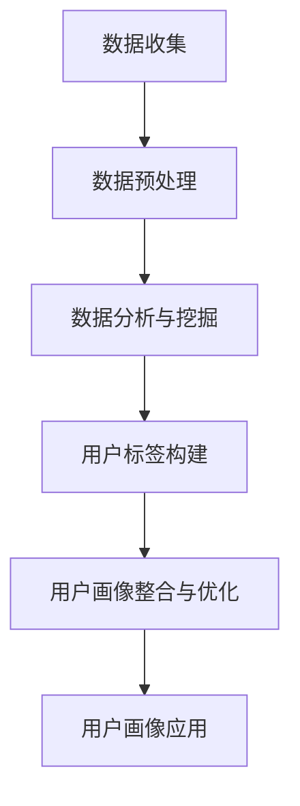
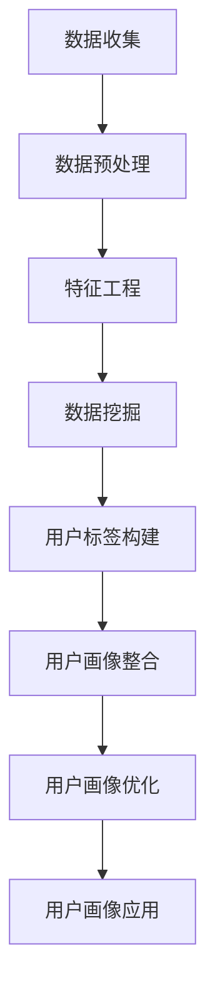

                 

### 用户画像的构建与优化方法

> **关键词**：用户画像、数据挖掘、数据分析、机器学习、精准营销、客户关系管理、用户行为分析、商业应用、个性化推荐。

> **摘要**：本文深入探讨了用户画像的构建与优化方法，从基本概念、理论基础到实际应用，详细解析了用户画像在商业领域的价值与挑战。通过理论讲解、流程图、伪代码和案例研究，帮助读者全面理解用户画像的核心技术与实践策略。

### 目录大纲

- **第一部分：用户画像概述与理论基础**
  - [1.1 用户画像的概念与价值](#11-用户画像的概念与价值)
  - [1.2 用户画像的构建原理](#12-用户画像的构建原理)
  - [1.3 用户画像的构建方法与技术](#13-用户画像的构建方法与技术)
  - [1.4 用户画像的应用场景](#14-用户画像的应用场景)

- **第二部分：用户画像的构建实践**
  - [2.1 数据收集与整合](#21-数据收集与整合)
  - [2.2 用户画像构建工作流程](#22-用户画像构建工作流程)
  - [2.3 用户画像构建工具与技术](#23-用户画像构建工具与技术)
  - [2.4 用户画像构建案例研究](#24-用户画像构建案例研究)

- **第三部分：用户画像优化方法与策略**
  - [3.1 用户画像优化目标与原则](#31-用户画像优化目标与原则)
  - [3.2 用户画像质量评估方法](#32-用户画像质量评估方法)
  - [3.3 用户画像更新与维护](#33-用户画像更新与维护)
  - [3.4 用户画像优化案例分析](#34-用户画像优化案例分析)

- **第四部分：用户画像在商业应用中的实践**
  - [4.1 营销与推广中的应用](#41-营销与推广中的应用)
  - [4.2 用户行为分析中的应用](#42-用户行为分析中的应用)
  - [4.3 产品优化与迭代中的应用](#43-产品优化与迭代中的应用)
  - [4.4 客户关系管理中的应用](#44-客户关系管理中的应用)

- **附录**
  - [附录A：用户画像构建与优化相关工具与资源](#附录a-用户画像构建与优化相关工具与资源)
  - [附录B：用户画像构建与优化案例解析](#附录b-用户画像构建与优化案例解析)
  - [附录C：用户画像构建与优化常见问题解答](#附录c-用户画像构建与优化常见问题解答)
  - [结语](#结语)

---

用户画像，作为大数据时代的一项重要技术，已经成为企业理解和满足用户需求的核心手段。它通过整合和分析用户的各种数据，构建出一个全面、多维度的用户模型，帮助企业实现精准营销、个性化服务和产品优化。本文将分四个部分对用户画像的构建与优化方法进行系统阐述。

第一部分将介绍用户画像的基本概念、价值和发展历程，并深入探讨用户画像的构建原理和层次结构。

第二部分将重点讨论用户画像构建的实践方法，包括数据收集与整合、用户画像构建工作流程、工具与技术以及具体案例研究。

第三部分将介绍用户画像优化的目标、原则和质量评估方法，并探讨用户画像的更新与维护策略，以及优化案例研究。

第四部分将展示用户画像在商业应用中的具体实践，包括营销与推广、用户行为分析、产品优化与迭代以及客户关系管理。

通过本文的阅读，读者将全面了解用户画像的构建与优化方法，掌握其在商业应用中的价值与实践策略。

### 第一部分：用户画像概述与理论基础

用户画像（User Profiling）是指通过对用户数据的分析，构建出一个反映用户特征、行为、需求和偏好的模型。这一模型能够帮助企业更好地理解用户，从而实现精准营销、个性化服务和产品优化。本部分将详细介绍用户画像的概念与价值、构建原理、方法与技术，以及用户画像的应用场景。

#### 1.1 用户画像的概念与价值

##### 1.1.1 用户画像的定义

用户画像是一个多维度的用户数据模型，它通过整合和分析用户在各个渠道的行为数据、属性数据和历史交易数据，形成对用户全面、细致的描述。用户画像不仅仅是一个静态的描述，它还可以根据用户行为和数据的实时变化进行动态更新，从而更加准确地反映用户的当前状态和需求。

##### 1.1.2 用户画像的价值

用户画像具有以下几个重要的价值：

1. **精准营销**：通过用户画像，企业可以了解不同用户群体的特征和需求，从而设计出更具针对性的营销策略，提高营销效果。
2. **个性化服务**：用户画像帮助企业了解每个用户的偏好和习惯，提供个性化推荐和服务，提升用户体验和满意度。
3. **产品优化**：通过分析用户画像，企业可以发现用户在使用产品过程中遇到的问题，从而优化产品设计和功能，提高用户粘性。
4. **客户关系管理**：用户画像帮助企业识别高价值客户，实施有针对性的客户关怀策略，提高客户忠诚度和留存率。

##### 1.1.3 用户画像的发展历程

用户画像的发展经历了以下几个阶段：

1. **传统数据分析**：早期用户画像主要通过数据分析来了解用户行为和偏好，如统计分析、报表分析等。
2. **大数据分析**：随着大数据技术的发展，用户画像开始利用大数据技术进行数据挖掘和分析，实现更加精细和动态的用户特征描述。
3. **人工智能与机器学习**：人工智能和机器学习技术的应用，使得用户画像能够更加智能化地分析用户行为，预测用户需求，实现个性化推荐和服务。

#### 1.2 用户画像的构建原理

##### 1.2.1 用户画像的构成要素

用户画像主要由以下几个要素构成：

1. **用户属性**：包括用户的性别、年龄、职业、地域等基本信息。
2. **用户行为**：包括用户的浏览记录、购买行为、评论和反馈等。
3. **用户偏好**：包括用户喜欢的商品、品牌、颜色、价格区间等。
4. **用户状态**：包括用户的活跃度、忠诚度、满意度等。
5. **用户生命周期**：包括用户的注册时间、活跃时间、流失时间等。

##### 1.2.2 用户画像的构建流程

用户画像的构建通常包括以下几个步骤：

1. **数据收集**：从不同的数据源收集用户数据，如行为数据、交易数据、社交媒体数据等。
2. **数据清洗**：对收集到的数据进行清洗和预处理，去除噪声和重复数据，保证数据质量。
3. **特征工程**：根据业务需求，提取和构建用户特征，如用户活跃度指数、购买频率等。
4. **模型构建**：利用机器学习和人工智能技术，构建用户画像模型。
5. **模型训练与优化**：通过不断调整模型参数和算法，优化用户画像模型的准确性和实时性。
6. **用户画像应用**：将构建好的用户画像应用于业务场景，如精准营销、个性化推荐等。

##### 1.2.3 用户画像的层次结构

用户画像可以划分为以下几个层次：

1. **基础层**：包括用户的性别、年龄、地域等基本信息。
2. **行为层**：包括用户的浏览记录、购买行为、评论和反馈等。
3. **偏好层**：包括用户喜欢的商品、品牌、颜色、价格区间等。
4. **状态层**：包括用户的活跃度、忠诚度、满意度等。
5. **生命周期层**：包括用户的注册时间、活跃时间、流失时间等。

#### 1.3 用户画像的构建方法与技术

##### 1.3.1 数据采集与预处理

数据采集是用户画像构建的第一步，常见的数据源包括：

- **内部数据**：如用户行为日志、交易数据、用户反馈等。
- **外部数据**：如社交媒体数据、市场调查数据、公共数据等。

数据采集完成后，需要对数据进行清洗和预处理，主要包括：

- **去重**：去除重复的用户数据，保证数据的唯一性。
- **去噪**：去除噪声数据，如错误数据、垃圾数据等。
- **转换**：将不同格式和单位的数据进行统一处理，如日期格式化、数值归一化等。

##### 1.3.2 数据分析与挖掘

数据分析与挖掘是用户画像构建的核心步骤，主要包括：

- **描述性分析**：通过对数据的基本统计和可视化，了解用户的基本特征和分布情况。
- **关联规则挖掘**：通过分析用户行为数据，挖掘用户行为之间的关联关系，如“购买A商品的用户中有80%也购买了B商品”。
- **聚类分析**：将用户划分为不同的群体，如通过K-means算法对用户进行聚类分析，发现不同用户群体的特征和偏好。
- **分类与预测**：利用机器学习算法，对用户行为和偏好进行分类和预测，如通过决策树、神经网络等算法，预测用户的购买意图和偏好。

##### 1.3.3 用户标签体系构建

用户标签是用户画像的核心组成部分，用于描述用户的各种特征和属性。构建用户标签体系通常包括以下几个步骤：

- **标签分类**：将用户特征分为不同的类别，如基本信息、行为特征、偏好特征等。
- **标签定义**：为每个标签定义具体的含义和取值范围，如“性别”标签的取值为“男”或“女”。
- **标签赋值**：根据用户数据，为每个用户分配相应的标签，如根据用户的性别、年龄、购买历史等数据，为用户分配性别、年龄段、购买偏好等标签。

##### 1.3.4 特征工程与降维

特征工程是用户画像构建的重要环节，通过对用户特征进行选择、转换和组合，提高用户画像的准确性和效率。特征工程主要包括：

- **特征选择**：选择对用户画像有重要影响的特征，去除冗余和无用的特征。
- **特征转换**：将不同类型和单位的数据转换为同一类型和单位的数据，如将类别型数据转换为数值型数据。
- **特征组合**：通过组合多个特征，构建新的特征，如通过“购买频率*客单价”计算用户的消费能力指数。

降维是特征工程的一个重要方法，通过减少特征的数量，降低计算复杂度和存储需求，同时保持用户画像的有效性。常见的降维方法包括：

- **主成分分析（PCA）**：通过提取数据的主要成分，降低特征维度。
- **线性判别分析（LDA）**：通过最大化类内方差和最小化类间方差，降低特征维度。

#### 1.4 用户画像的应用场景

用户画像的应用场景非常广泛，包括但不限于以下几个方面：

##### 1.4.1 营销与推广

用户画像可以帮助企业实现精准营销，通过分析用户特征和行为，制定有针对性的营销策略。例如：

- **定向广告投放**：根据用户的兴趣和行为，投放个性化的广告。
- **推荐系统**：根据用户的偏好和历史行为，推荐相关的商品或服务。
- **促销活动**：根据用户的行为和偏好，设计个性化的促销活动，提高转化率。

##### 1.4.2 用户行为分析

用户画像可以帮助企业了解用户的行为模式和偏好，优化产品设计和功能。例如：

- **流失用户分析**：分析流失用户的行为特征，发现导致用户流失的原因，优化产品和服务。
- **用户活跃度分析**：分析用户的活跃度分布，优化用户留存策略。
- **用户体验优化**：根据用户行为数据，优化产品的界面设计和交互体验。

##### 1.4.3 产品优化与迭代

用户画像可以帮助企业根据用户需求和反馈，优化产品设计和功能，提高用户满意度。例如：

- **需求分析**：通过分析用户画像，了解用户的需求和痛点，优化产品功能。
- **迭代计划**：根据用户画像，制定产品迭代的优先级和方向。
- **用户体验测试**：根据用户画像，选择代表性的用户进行产品测试，优化用户体验。

##### 1.4.4 客户关系管理

用户画像可以帮助企业实现精细化的客户关系管理，提高客户满意度和忠诚度。例如：

- **客户细分**：通过用户画像，将客户划分为不同的细分市场，提供定制化的服务和优惠。
- **客户关怀**：根据用户画像，制定有针对性的客户关怀策略，提高客户满意度和忠诚度。
- **客户忠诚度管理**：通过用户画像，分析客户的忠诚度水平，实施相应的忠诚度管理策略。

通过本部分的介绍，读者对用户画像的基本概念、价值、构建原理和方法以及应用场景有了初步的了解。接下来，将在第二部分中深入探讨用户画像构建的实践方法，包括数据收集与整合、用户画像构建工作流程、工具与技术以及具体案例研究。

### 1.1 用户画像的概念与价值

用户画像（User Profiling）是通过对用户数据进行系统化的分析，构建出一个反映用户特征、行为、需求和偏好的模型。这一模型能够帮助企业和组织更深入地了解用户，从而进行精准营销、个性化服务以及产品优化。下面，我们将详细探讨用户画像的定义、核心价值以及其发展历程。

#### 1.1.1 用户画像的定义

用户画像不仅仅是一个简单的数据集合，而是一个多维度、动态变化的数据模型。它通常包括以下几个方面：

1. **基础属性**：这些是用户的基本信息，如年龄、性别、职业、收入水平、地理位置等。
2. **行为数据**：用户在网站或应用上的行为数据，如浏览历史、点击次数、购买记录、评论和反馈等。
3. **偏好数据**：用户的兴趣偏好，如喜欢的音乐、电影类型、购物习惯、品牌偏好等。
4. **社交数据**：用户的社交媒体行为，如关注的对象、点赞、评论等。
5. **心理特征**：用户的心理属性，如性格、价值观、消费心态等。

用户画像通常是一个动态的过程，随着用户行为和数据的不断更新，用户画像也会进行相应的调整和优化。

#### 1.1.2 用户画像的核心价值

用户画像在多个方面具有显著的核心价值，具体如下：

1. **精准营销**：通过用户画像，企业能够了解不同用户群体的特征和需求，从而设计出更具针对性的营销策略，提高营销效果和转化率。
2. **个性化服务**：用户画像帮助企业了解用户的偏好和习惯，提供个性化的推荐和服务，提升用户体验和满意度。
3. **产品优化**：通过分析用户画像，企业可以发现用户在使用产品过程中遇到的问题，从而优化产品设计和功能，提高用户粘性。
4. **客户关系管理**：用户画像帮助企业识别高价值客户，实施有针对性的客户关怀策略，提高客户忠诚度和留存率。
5. **市场分析**：用户画像可以为企业提供深入的市场洞察，帮助企业更好地了解市场趋势和竞争环境。

#### 1.1.3 用户画像的发展历程

用户画像的发展经历了以下几个阶段：

1. **传统数据分析**：在互联网早期，企业主要通过收集用户数据，进行简单的统计分析和报表分析，了解用户的基本行为和偏好。
2. **大数据分析**：随着大数据技术的发展，用户画像开始利用大数据技术进行数据挖掘和分析，实现更加精细和动态的用户特征描述。
3. **人工智能与机器学习**：人工智能和机器学习技术的应用，使得用户画像能够更加智能化地分析用户行为，预测用户需求，实现个性化推荐和服务。

#### 用户画像的构建步骤

用户画像的构建通常包括以下步骤：

1. **数据收集**：从多个渠道收集用户数据，包括内部数据和外部数据。
2. **数据清洗**：对收集到的数据进行清洗和预处理，去除噪声和重复数据，保证数据质量。
3. **特征工程**：提取和构建用户特征，包括基础属性、行为数据、偏好数据和社交数据等。
4. **模型构建**：利用机器学习和人工智能技术，构建用户画像模型。
5. **模型训练与优化**：通过不断调整模型参数和算法，优化用户画像模型的准确性和实时性。
6. **用户画像应用**：将构建好的用户画像应用于业务场景，如精准营销、个性化推荐等。

#### 用户画像的层次结构

用户画像可以划分为以下几个层次：

1. **基础层**：包括用户的性别、年龄、职业、地域等基本信息。
2. **行为层**：包括用户的浏览记录、购买行为、评论和反馈等。
3. **偏好层**：包括用户喜欢的商品、品牌、颜色、价格区间等。
4. **状态层**：包括用户的活跃度、忠诚度、满意度等。
5. **生命周期层**：包括用户的注册时间、活跃时间、流失时间等。

#### 用户画像在业务场景中的应用

用户画像在多个业务场景中具有广泛的应用，具体如下：

1. **精准营销**：通过用户画像，企业可以实现定向广告投放、个性化推荐和定制化促销活动，提高营销效果。
2. **用户行为分析**：通过分析用户画像，企业可以了解用户的行为模式和偏好，优化产品设计和功能。
3. **产品优化与迭代**：通过用户画像，企业可以及时发现用户需求和痛点，优化产品功能和用户体验。
4. **客户关系管理**：通过用户画像，企业可以识别高价值客户，实施有针对性的客户关怀策略，提高客户满意度和忠诚度。

通过以上对用户画像的详细解析，我们可以看到用户画像在数据分析和商业应用中的重要价值。在接下来的部分，我们将进一步探讨用户画像的构建原理、方法与技术，帮助读者深入理解用户画像的核心概念和实现方法。

### 1.2 用户画像的构建原理

用户画像的构建是现代商业数据分析中的一项核心任务，它通过系统化的方法将用户的各种信息整合到一个多维度的数据模型中，以便企业更好地理解用户，制定精准的营销策略和个性化的服务方案。下面，我们将详细讨论用户画像的构建原理，包括构成要素、构建流程和层次结构。

#### 1.2.1 用户画像的构成要素

用户画像的构成要素可以分为以下几个主要方面：

1. **基础属性**：基础属性是用户画像中最基础的数据，包括用户的性别、年龄、职业、收入水平、教育程度、地理位置等信息。这些属性通常通过注册、问卷调查或第三方数据源获取。

2. **行为数据**：行为数据反映了用户在网站、APP或其他数字平台上的活动记录，如浏览记录、点击次数、购买历史、评论、分享行为等。这些数据提供了关于用户行为模式的重要线索。

3. **偏好数据**：偏好数据包括用户的兴趣爱好、偏好习惯、消费习惯等，如喜欢阅读的题材、喜欢的品牌、经常购买的品类等。这些数据通常通过用户的行为数据分析和用户反馈获取。

4. **社交数据**：社交数据涉及用户的社交网络行为，如社交媒体上的关注、点赞、评论、分享等。这些数据可以揭示用户的社交圈子和人际关系。

5. **心理特征**：心理特征包括用户的性格、价值观、消费心态等，这类数据通常通过心理测试、用户调查等方式获取，对用户画像的深度理解和精准刻画具有重要意义。

6. **情境数据**：情境数据指的是用户在不同情境下的行为和反应，如节假日购物行为、促销活动参与度等。这些数据有助于企业了解用户在不同情境下的行为变化。

#### 1.2.2 用户画像的构建流程

用户画像的构建通常包括以下步骤：

1. **数据收集**：从多个数据源收集用户数据，包括内部数据（如网站日志、交易记录）和外部数据（如社交媒体、第三方数据提供商）。

2. **数据清洗**：对收集到的数据进行分析和清洗，去除重复、错误和不完整的数据，确保数据的质量和一致性。

3. **特征工程**：对数据进行处理和转换，提取对用户画像有重要影响的关键特征。特征工程包括数据归一化、缺失值处理、特征选择等。

4. **数据建模**：利用机器学习和人工智能技术，建立用户画像模型。常见的建模方法包括聚类分析、关联规则挖掘、分类算法等。

5. **模型训练与优化**：通过训练数据集对模型进行训练，并根据模型的预测效果不断调整和优化模型参数。

6. **用户画像生成**：将训练好的模型应用于新数据，生成用户的画像。用户画像通常会以数据表或数据仓库的形式存储，以便后续分析和应用。

7. **用户画像应用**：将生成的用户画像应用于实际的业务场景，如精准营销、个性化推荐、用户行为分析等。

#### 1.2.3 用户画像的层次结构

用户画像通常可以划分为不同的层次，以便更好地管理和应用。以下是常见的用户画像层次结构：

1. **基础层**：包含用户的基本属性信息，如姓名、性别、年龄、职业等。

2. **行为层**：包含用户的行为数据，如浏览历史、点击次数、购买记录、评论等。

3. **偏好层**：包含用户的偏好数据，如喜欢的商品类别、品牌、颜色等。

4. **状态层**：包含用户的当前状态信息，如活跃度、满意度、忠诚度等。

5. **情境层**：包含用户在不同情境下的行为数据，如节假日的购买行为、促销活动的参与度等。

6. **生命周期层**：包含用户的生命周期信息，如注册时间、活跃时间、流失时间等。

#### 用户画像的构建方法

用户画像的构建方法包括以下几个关键步骤：

1. **数据源选择**：根据业务需求和数据可用性，选择合适的数据源。内部数据源通常包括网站日志、交易记录等，外部数据源可以包括社交媒体、第三方数据提供商等。

2. **数据采集**：从选定的数据源中采集用户数据，包括结构化数据和非结构化数据。

3. **数据清洗**：对采集到的数据进行清洗和预处理，去除重复、错误和不完整的数据。

4. **特征工程**：根据业务需求，提取和构建用户特征，如行为特征、偏好特征等。

5. **模型选择与训练**：选择合适的机器学习和人工智能算法，对用户数据进行建模和训练。

6. **模型评估与优化**：评估模型的性能，根据评估结果对模型进行调整和优化。

7. **用户画像生成与应用**：生成用户画像，并将其应用于实际的业务场景，如精准营销、个性化推荐等。

通过以上对用户画像构建原理的详细讨论，我们可以看到用户画像构建的复杂性和系统性。在接下来的部分，我们将进一步探讨用户画像的构建方法和技术，帮助读者深入理解用户画像的具体实现过程。

### 1.3 用户画像的构建方法与技术

构建用户画像是一个系统化、多层次的过程，涉及数据采集与预处理、数据分析和挖掘、用户标签体系构建、特征工程与降维等多个环节。以下将详细讨论这些方法和技术，并介绍在实际应用中的常见工具和平台。

#### 1.3.1 数据采集与预处理

数据采集是用户画像构建的基础，数据的质量直接影响用户画像的准确性和可靠性。数据源可以包括网站日志、交易记录、用户反馈、社交媒体数据等。

1. **数据采集**：
   - **内部数据**：如用户行为日志、交易数据、服务器日志等。
   - **外部数据**：如社交媒体数据、第三方数据提供商的数据等。

2. **数据预处理**：
   - **去重**：去除重复的数据记录，确保数据的唯一性。
   - **去噪**：去除错误数据、垃圾数据等噪声数据。
   - **数据清洗**：处理缺失值、异常值，确保数据的一致性和完整性。
   - **数据转换**：如将时间格式统一、数值归一化、字符串编码等。

常见的数据采集与预处理工具：
   - **Apache Kafka**：用于实时数据流处理。
   - **Apache Hadoop**：用于大数据存储和处理。
   - **Apache Spark**：用于大规模数据处理和分析。

#### 1.3.2 数据分析与挖掘

数据分析与挖掘是用户画像构建的核心步骤，通过分析用户行为数据，提取有价值的用户特征和模式。

1. **描述性分析**：对用户数据进行基本的统计和可视化，了解用户的基本特征和分布情况。

2. **关联规则挖掘**：通过分析用户行为数据，挖掘用户行为之间的关联关系。例如，使用Apriori算法挖掘“购买A商品的用户中，有多少比例也购买了B商品”。

3. **聚类分析**：将用户划分为不同的群体，以便针对不同群体设计营销策略。常见的聚类算法包括K-means、DBSCAN等。

4. **分类与预测**：利用机器学习算法，对用户行为和偏好进行分类和预测。例如，使用决策树、随机森林、神经网络等算法预测用户的购买意图。

常见的数据分析与挖掘工具：
   - **R**：用于统计分析、数据可视化。
   - **Python**：使用Pandas、NumPy等库进行数据处理和分析。
   - **Apache Mahout**：用于大规模数据挖掘。

#### 1.3.3 用户标签体系构建

用户标签是用户画像的重要组成部分，用于描述用户的特征和行为。构建用户标签体系通常包括以下步骤：

1. **标签分类**：将用户特征分为不同的类别，如基本信息、行为数据、偏好数据等。

2. **标签定义**：为每个标签定义具体的含义和取值范围，例如，“性别”标签的取值为“男”或“女”。

3. **标签赋值**：根据用户数据，为每个用户分配相应的标签。例如，根据用户的浏览记录和购买历史，为其分配“科技爱好者”或“高频购物者”等标签。

常见用户标签体系构建方法：
   - **基于规则的标签分配**：根据预定义的规则，将用户归类为不同的标签。
   - **基于机器学习的标签分配**：使用机器学习算法，根据用户特征数据自动生成标签。

#### 1.3.4 特征工程与降维

特征工程是用户画像构建中的一项重要工作，通过选择、转换和组合特征，提高用户画像的准确性和效率。特征工程包括以下几个步骤：

1. **特征选择**：选择对用户画像有重要影响的关键特征，去除冗余和无用的特征。常用的方法包括信息增益、卡方检验等。

2. **特征转换**：将不同类型和单位的数据转换为同一类型和单位的数据，例如，将类别型数据转换为数值型数据。

3. **特征组合**：通过组合多个特征，构建新的特征，例如，通过“购买频率*客单价”计算用户的消费能力指数。

降维是特征工程的一个重要方法，通过减少特征的数量，降低计算复杂度和存储需求，同时保持用户画像的有效性。常见的降维方法包括：

1. **主成分分析（PCA）**：通过提取数据的主要成分，降低特征维度。

2. **线性判别分析（LDA）**：通过最大化类内方差和最小化类间方差，降低特征维度。

常见特征工程和降维工具：
   - **Scikit-learn**：用于特征选择、特征转换和降维。
   - **TensorFlow**：用于构建和训练机器学习模型。

#### 1.3.5 用户画像构建工具与技术

在实际应用中，用户画像构建通常需要依赖一系列的工具和技术，以下是一些常用的工具和平台：

1. **大数据处理平台**：如Hadoop、Spark，用于大规模数据存储和处理。

2. **数据仓库**：如Hive、Redshift，用于存储和管理用户画像数据。

3. **数据挖掘和机器学习框架**：如Mahout、MLlib，用于用户画像模型的构建和训练。

4. **用户画像构建平台**：如阿里云的数据分析平台、腾讯云的用户画像平台，提供一站式的用户画像构建和管理服务。

5. **可视化工具**：如Tableau、Power BI，用于数据可视化和用户画像的可视化呈现。

通过以上对用户画像构建方法与技术的详细讨论，我们可以看到构建一个高质量的用户画像需要多个环节的协同工作。在接下来的部分，我们将通过具体案例研究，展示用户画像的实际构建过程和应用效果。

### 1.4 用户画像的应用场景

用户画像技术在商业领域中有着广泛的应用场景，通过精准分析用户的行为和偏好，企业能够更好地满足用户需求，提升用户体验，优化业务流程。以下将详细讨论用户画像在几个关键应用场景中的具体应用。

#### 1.4.1 营销与推广

用户画像技术在营销与推广中有着重要的应用价值。通过构建详细的用户画像，企业能够实现精准营销，提高广告投放效果和转化率。以下是用户画像在营销与推广中的具体应用：

1. **定向广告投放**：根据用户的兴趣、行为和历史购买记录，企业可以投放更加精准的广告，提高广告的点击率和转化率。例如，对于喜欢购物的用户，可以投放电商平台的广告，而对于喜欢旅游的用户，可以投放旅游服务提供商的广告。

2. **个性化推荐**：用户画像技术可以帮助企业构建个性化推荐系统，根据用户的偏好和兴趣，推荐相关的商品、服务或内容。例如，电商平台可以根据用户的浏览记录和购买历史，推荐用户可能感兴趣的商品，从而提高用户的购买意愿。

3. **定制化促销活动**：通过分析用户的消费习惯和偏好，企业可以设计出更符合用户需求的促销活动，提高用户的参与度和转化率。例如，对于高频购物的用户，可以设计专属的会员优惠，而对于近期有购买意向的用户，可以推送限时折扣。

#### 1.4.2 用户行为分析

用户行为分析是用户画像技术的重要应用领域，通过分析用户的行为数据，企业能够深入了解用户的行为模式和偏好，从而优化产品设计和功能。

1. **流失用户分析**：通过分析流失用户的行为数据，企业可以发现导致用户流失的原因，并采取相应的措施进行改善。例如，分析发现流失用户在某个功能上有频繁的负面反馈，企业可以针对性地优化该功能，提高用户留存率。

2. **活跃用户分析**：通过分析活跃用户的行为数据，企业可以了解哪些功能或内容吸引了用户，从而进一步优化和推广。例如，分析发现某些内容页面有较高的用户停留时间，企业可以增加类似内容的投放，提高用户的活跃度。

3. **用户体验优化**：用户画像技术可以帮助企业了解用户在使用产品过程中的痛点，从而优化产品的界面设计和交互体验。例如，通过用户行为分析，发现用户在某个操作步骤上频繁出错，企业可以重新设计该操作流程，提高用户的操作便捷性。

#### 1.4.3 产品优化与迭代

用户画像技术在产品优化与迭代中发挥着重要作用，通过分析用户画像，企业能够发现用户的需求和痛点，从而优化产品功能和用户体验。

1. **需求分析**：通过用户画像，企业可以了解用户的需求和偏好，为产品的功能设计和迭代提供依据。例如，通过分析发现用户对某个功能有较高的需求，企业可以优先开发该功能，提高产品的竞争力。

2. **迭代计划**：用户画像技术可以帮助企业制定产品迭代的优先级和方向。通过分析不同用户群体的需求和行为，企业可以确定哪些功能或特性应该优先进行优化和迭代。

3. **用户体验测试**：用户画像技术可以用于用户体验测试，通过选择具有代表性的用户进行测试，企业可以获取真实的用户反馈，从而优化产品的用户体验。例如，在产品上线前，企业可以选择具有相似兴趣爱好的用户进行预测试，收集用户的反馈和建议，以便在正式发布时提供更好的用户体验。

#### 1.4.4 客户关系管理

用户画像技术在客户关系管理中具有重要作用，通过构建详细的用户画像，企业能够实现精细化的客户管理，提高客户满意度和忠诚度。

1. **客户细分**：通过用户画像，企业可以将客户划分为不同的细分市场，从而实施有针对性的客户关系管理策略。例如，根据用户的消费水平、购买频率等特征，将客户划分为高价值客户、普通客户等，分别提供不同的服务和优惠。

2. **客户关怀**：用户画像技术可以帮助企业了解客户的当前需求和状态，从而制定个性化的客户关怀策略。例如，对于近期有购买记录的客户，企业可以发送优惠券或促销信息，增加客户的购买意愿。

3. **客户忠诚度管理**：通过分析用户画像，企业可以了解客户的忠诚度水平，并采取相应的措施进行提升。例如，对于高忠诚度客户，企业可以提供专属的会员服务、积分奖励等，增强客户的粘性。

通过以上对用户画像在多个应用场景中的详细讨论，我们可以看到用户画像技术在现代商业中的应用价值。在接下来的部分，我们将进一步探讨用户画像构建的实践方法，帮助读者了解如何在实际项目中应用用户画像技术。

### 2.1 数据收集与整合

数据收集与整合是用户画像构建过程中的关键步骤，直接影响到用户画像的准确性和有效性。在这一部分，我们将详细讨论数据收集的渠道、整合方法以及数据质量评估与处理。

#### 2.1.1 数据源的选择

数据源是构建用户画像的基础，选择合适的数据源对于整个用户画像项目的成功至关重要。以下是一些常见的数据源：

1. **内部数据源**：
   - **用户行为数据**：包括用户在网站或APP上的浏览记录、点击次数、购买历史、评论和反馈等。
   - **交易数据**：包括用户的购买记录、订单信息、支付方式、交易金额等。
   - **用户反馈**：包括用户提交的问卷调查、反馈和建议等。

2. **外部数据源**：
   - **社交媒体数据**：包括用户的社交媒体活动，如微博、微信、Facebook、Twitter等。
   - **第三方数据提供商**：提供各种类型的数据，如地理位置、人口统计数据、消费习惯等。
   - **公共数据源**：如政府公开数据、开放数据平台等。

选择数据源时，需要考虑以下因素：

- **数据质量和完整性**：数据源的可靠性和数据完整性直接影响用户画像的准确性。
- **数据获取成本**：数据获取成本也是选择数据源的重要考虑因素。
- **数据可用性和兼容性**：数据源的数据格式和获取方式需要与企业现有的数据处理系统兼容。

#### 2.1.2 数据采集与整合方法

数据采集与整合方法包括以下步骤：

1. **数据采集**：
   - **自动化采集**：通过API接口、日志采集工具等方式，自动从各种数据源采集数据。
   - **手动采集**：对于一些无法通过自动化方式获取的数据，如用户反馈、问卷调查等，可以通过手动方式采集。

2. **数据清洗**：
   - **去重**：去除重复的数据记录，确保数据的唯一性。
   - **去噪**：去除错误数据、垃圾数据等噪声数据。
   - **数据转换**：将不同格式和单位的数据进行统一处理，如时间格式化、数值归一化等。

3. **数据整合**：
   - **数据接入**：将不同数据源的数据接入到统一的数据处理平台，如数据仓库或数据湖。
   - **数据合并**：将来自多个数据源的用户数据进行整合，构建一个完整的用户数据视图。常见的方法包括：
     - **基于键的合并**：通过用户ID或其他唯一标识，将来自不同数据源的用户数据合并为一个完整的用户记录。
     - **基于时间的合并**：将同一用户在不同时间点的数据进行整合，形成用户的历史数据视图。

4. **数据存储**：
   - **分布式存储**：对于大规模的用户数据，采用分布式存储技术，如Hadoop HDFS、Apache HBase等。
   - **实时存储**：对于需要实时处理的用户数据，采用实时存储技术，如Apache Kafka、Apache Flink等。

#### 2.1.3 数据质量评估与处理

数据质量是用户画像构建的关键，以下是一些常见的数据质量评估与处理方法：

1. **数据质量评估指标**：
   - **完整性**：数据表中缺失值的比例。
   - **一致性**：数据表中重复记录的比例。
   - **准确性**：数据表中错误记录的比例。
   - **时效性**：数据更新的频率和及时性。

2. **数据质量评估方法**：
   - **统计分析**：通过对数据的统计分析，评估数据的质量指标。
   - **可视化分析**：通过数据可视化工具，对数据质量进行直观的评估。
   - **人工审核**：对关键数据记录进行人工审核，确保数据的准确性。

3. **数据质量处理方法**：
   - **数据清洗**：去除错误数据、垃圾数据和重复数据。
   - **数据修正**：对错误数据进行修正或补充。
   - **数据标准化**：对数据格式进行统一处理，如时间格式化、数值归一化等。

通过以上对数据收集与整合方法的详细讨论，我们可以看到构建高质量的用户画像需要系统化的数据收集、清洗和整合。在接下来的部分，我们将进一步探讨用户画像构建的工作流程，帮助读者全面了解用户画像的构建过程。

### 2.2 用户画像构建工作流程

构建用户画像是一个复杂的过程，需要系统性地整合和分析多源数据，并通过一系列技术手段形成对用户的多维度描述。以下是用户画像构建工作流程的详细描述，包括数据预处理、数据分析与挖掘、用户标签构建、用户画像整合与优化等关键步骤。

#### 2.2.1 用户画像构建工作流程概述

用户画像构建工作流程通常包括以下步骤：

1. **需求分析**：明确用户画像的构建目标和应用场景，确定所需的数据源和用户特征。
2. **数据收集**：从内部和外部数据源收集用户数据，包括行为数据、属性数据、偏好数据等。
3. **数据预处理**：对收集到的数据进行清洗、去重、去噪、转换等处理，确保数据质量。
4. **数据分析与挖掘**：对预处理后的数据进行分析和挖掘，提取用户特征，构建用户行为模型。
5. **用户标签构建**：根据用户特征和行为数据，为用户分配标签，构建用户标签体系。
6. **用户画像整合**：将用户标签整合到用户数据中，形成完整的用户画像。
7. **用户画像优化**：根据用户画像的应用效果，不断优化用户画像模型和特征体系。
8. **用户画像应用**：将用户画像应用于具体的业务场景，如精准营销、个性化推荐、用户行为分析等。

#### 2.2.2 数据预处理与清洗

数据预处理是用户画像构建的重要步骤，直接影响到后续数据分析和挖掘的准确性。以下是数据预处理和清洗的关键步骤：

1. **数据清洗**：
   - **去重**：去除重复的用户记录，确保数据的唯一性。
   - **去噪**：去除错误数据、垃圾数据等噪声数据，如无效的空值、错误的数据格式等。
   - **缺失值处理**：对于缺失的数据，采用填充、删除或插值等方法进行处理，确保数据完整性。

2. **数据转换**：
   - **格式转换**：将不同格式的数据转换为统一的格式，如将日期格式转换为YYYY-MM-DD格式。
   - **编码转换**：将类别型数据转换为数值型数据，如性别（男/女）转换为0/1。
   - **归一化**：对数值型数据进行归一化处理，如对价格、评分等数据进行标准化。

3. **数据标准化**：
   - **字段命名标准化**：统一数据字段的命名，如将“AGE”、“age”、“Age”统一命名为“age”。
   - **数据范围标准化**：将数据范围统一，如将年龄范围统一为0-120岁。

#### 2.2.3 数据分析与挖掘

数据分析与挖掘是用户画像构建的核心步骤，通过分析用户数据，提取有价值的用户特征和行为模式。以下是数据分析与挖掘的关键步骤：

1. **描述性分析**：
   - **统计摘要**：计算用户数据的统计指标，如平均年龄、购买频率等。
   - **可视化分析**：通过图表和可视化工具，展示用户数据的分布和趋势。

2. **关联规则挖掘**：
   - **Apriori算法**：用于发现用户行为数据中的频繁项集和关联规则，如“购买A商品的用户中有80%也购买了B商品”。

3. **聚类分析**：
   - **K-means算法**：将用户数据划分为不同的聚类，以便分析不同用户群体的特征和偏好。
   - **DBSCAN算法**：用于发现用户数据中的密集区域和边界区域，适用于非均匀分布的数据。

4. **分类与预测**：
   - **决策树**：用于分类和回归分析，预测用户的行为和偏好。
   - **随机森林**：用于提高分类和回归模型的准确性和稳定性。
   - **神经网络**：用于构建复杂的用户行为预测模型。

#### 2.2.4 用户标签构建与评估

用户标签是用户画像的重要组成部分，用于描述用户的各种特征和行为。以下是用户标签构建与评估的关键步骤：

1. **标签分类**：
   - **基础属性标签**：如性别、年龄、职业等。
   - **行为标签**：如浏览历史、购买记录、评论和反馈等。
   - **偏好标签**：如喜欢的商品类别、品牌、颜色等。
   - **情境标签**：如节假日购物、促销活动参与等。

2. **标签定义**：
   - **标签含义**：为每个标签定义明确的含义和取值范围，如“性别”标签的取值为“男”或“女”。
   - **标签标准**：定义标签的标准化规则，如年龄范围、收入水平等。

3. **标签赋值**：
   - **自动赋值**：根据用户数据和规则，自动为用户分配标签。
   - **人工审核**：对部分标签进行人工审核，确保标签的准确性。

4. **标签评估**：
   - **标签质量评估**：评估标签的准确性和覆盖度，如使用混淆矩阵、精确率、召回率等指标。
   - **标签优化**：根据评估结果，对标签体系进行调整和优化。

#### 2.2.5 用户画像整合与优化

用户画像整合与优化是用户画像构建的最后一步，通过整合不同的用户标签和数据，形成完整的用户画像。以下是用户画像整合与优化的关键步骤：

1. **用户画像整合**：
   - **数据整合**：将用户标签整合到用户数据中，构建完整的用户画像。
   - **数据融合**：对不同来源的数据进行融合，形成统一的用户视图。

2. **用户画像优化**：
   - **特征工程**：对用户特征进行选择、转换和组合，提高用户画像的准确性。
   - **模型优化**：利用机器学习和深度学习技术，优化用户画像模型。
   - **质量评估**：定期评估用户画像的质量和效果，如使用A/B测试、用户反馈等。

3. **用户画像应用**：
   - **业务场景应用**：将用户画像应用于具体的业务场景，如精准营销、个性化推荐等。
   - **反馈与迭代**：根据用户画像的应用效果，收集反馈并不断优化用户画像。

通过以上对用户画像构建工作流程的详细讨论，我们可以看到构建高质量的用户画像需要系统化的数据预处理、分析和优化。在接下来的部分，我们将通过具体工具和技术，进一步探讨用户画像构建的实践方法和案例分析。

### 2.3 用户画像构建工具与技术

在用户画像的构建过程中，选择合适的工具和技术至关重要。这些工具和技术不仅能够帮助我们高效地处理和分析大规模数据，还能提高用户画像的准确性和实时性。以下将介绍一些常用的用户画像构建工具与技术，包括Hadoop与MapReduce技术、Spark与大数据处理、Machine Learning与深度学习技术，以及用户画像构建工具与应用。

#### 2.3.1 Hadoop与MapReduce技术

Hadoop是一个开源的大数据处理框架，它能够处理和分析大规模的非结构化和半结构化数据。MapReduce是Hadoop的核心算法，用于分布式数据处理。

1. **Hadoop生态系统**：
   - **HDFS**：分布式文件系统，用于存储大规模数据。
   - **YARN**：资源管理器，用于管理计算资源和任务调度。
   - **MapReduce**：数据处理模型，将数据处理任务拆分为多个Map任务和Reduce任务，实现分布式计算。

2. **应用场景**：
   - **大规模数据存储**：HDFS适用于存储和处理海量数据。
   - **分布式计算**：MapReduce适用于处理复杂的分布式数据计算任务。

3. **优缺点**：
   - **优点**：高效、可扩展、成本低。
   - **缺点**：计算复杂度高、实时性较差。

#### 2.3.2 Spark与大数据处理

Spark是一个快速且通用的计算引擎，特别适合大规模数据处理和分析。Spark具有内存计算的优势，能够显著提高数据处理速度。

1. **Spark生态系统**：
   - **Spark SQL**：用于数据处理和分析。
   - **Spark Streaming**：用于实时数据流处理。
   - **MLlib**：机器学习库，提供多种机器学习算法。
   - **GraphX**：图处理库，用于处理大规模图数据。

2. **应用场景**：
   - **实时数据处理**：Spark Streaming适用于实时数据流处理和分析。
   - **机器学习**：MLlib适用于构建和训练大规模机器学习模型。

3. **优缺点**：
   - **优点**：计算速度快、实时性强。
   - **缺点**：需要较高的硬件资源、存储成本较高。

#### 2.3.3 Machine Learning与深度学习技术

Machine Learning（机器学习）和深度学习（Deep Learning）是构建用户画像的重要技术，通过算法模型，可以从数据中提取用户特征和行为模式。

1. **机器学习技术**：
   - **监督学习**：如回归分析、分类算法（决策树、随机森林等）。
   - **无监督学习**：如聚类分析（K-means、DBSCAN等）。
   - **强化学习**：用于优化用户画像模型和策略。

2. **深度学习技术**：
   - **神经网络**：如卷积神经网络（CNN）、循环神经网络（RNN）。
   - **生成对抗网络（GAN）**：用于生成和优化用户画像数据。

3. **应用场景**：
   - **用户特征提取**：从用户行为数据中提取特征，用于构建用户画像。
   - **用户行为预测**：预测用户的未来行为和需求。
   - **个性化推荐**：基于用户画像，推荐相关的商品、服务或内容。

4. **优缺点**：
   - **优点**：强大的特征提取和预测能力。
   - **缺点**：需要大量的数据和计算资源、模型训练时间较长。

#### 2.3.4 用户画像构建工具与应用

用户画像构建工具能够帮助我们快速搭建用户画像系统，提高开发效率。以下是一些常用的用户画像构建工具：

1. **阿里云用户画像平台**：
   - **功能**：提供用户数据收集、存储、分析和可视化等功能。
   - **应用场景**：适用于电商、金融、互联网等行业。

2. **腾讯用户画像**：
   - **功能**：提供用户数据采集、用户标签构建、用户画像可视化等功能。
   - **应用场景**：适用于游戏、社交、电商等行业。

3. **Google Analytics**：
   - **功能**：提供网站流量分析、用户行为分析等功能。
   - **应用场景**：适用于网站、APP等互联网产品。

4. **Apache Mahout**：
   - **功能**：提供用户标签构建、推荐系统等功能。
   - **应用场景**：适用于大规模用户数据分析。

通过以上对用户画像构建工具与技术的介绍，我们可以看到，构建用户画像需要综合运用多种工具和技术，以达到高效、准确和实时的目标。在接下来的部分，我们将通过具体案例研究，展示用户画像的实际构建和应用效果。

### 2.4 用户画像构建案例研究

在本部分，我们将通过具体案例研究，深入探讨用户画像的实际构建过程和应用效果。案例研究将分为以下四个阶段：案例背景与目标、数据收集与整合、用户画像构建与优化、应用效果与评估。

#### 2.4.1 案例背景与目标

**案例背景**：
某电商平台希望通过构建用户画像，实现精准营销和个性化推荐，提升用户体验和转化率。

**目标**：
1. 了解用户的基本属性和行为数据。
2. 构建用户标签体系，描述用户的兴趣、偏好和购买习惯。
3. 通过用户画像，实现精准推荐和定向营销。
4. 提高用户留存率和转化率。

#### 2.4.2 数据收集与整合

**数据源**：
1. **内部数据源**：
   - 用户行为数据：包括浏览记录、点击次数、购买历史、评论和反馈。
   - 交易数据：包括订单信息、支付方式、交易金额等。
2. **外部数据源**：
   - 社交媒体数据：包括用户的微博、微信等社交媒体活动。
   - 第三方数据：包括用户地理位置、人口统计数据、消费习惯等。

**数据整合方法**：
1. **数据采集**：
   - 使用API接口和日志采集工具，自动化收集用户行为数据和交易数据。
   - 手动采集社交媒体数据和第三方数据。

2. **数据预处理**：
   - **去重**：去除重复的用户记录，确保数据的唯一性。
   - **去噪**：去除错误数据和噪声数据。
   - **数据转换**：统一数据格式和编码，如时间格式化、数值归一化等。

3. **数据存储**：
   - 使用Hadoop HDFS存储大规模数据。
   - 使用Hive进行数据查询和分析。

#### 2.4.3 用户画像构建与优化

**用户画像构建方法**：

1. **数据清洗与预处理**：
   - 对采集到的数据进行清洗和预处理，去除噪声和重复数据。

2. **特征工程**：
   - 提取用户特征，如基础属性、行为数据、偏好数据和社交数据。
   - 使用特征选择方法，去除冗余和无用的特征。

3. **用户标签构建**：
   - 定义用户标签体系，包括基础属性标签、行为标签、偏好标签和情境标签。
   - 使用机器学习算法，为每个用户分配标签。

4. **用户画像整合**：
   - 将用户标签整合到用户数据中，形成完整的用户画像。

**用户画像优化方法**：

1. **模型优化**：
   - 使用机器学习和深度学习技术，优化用户画像模型。
   - 定期评估和调整模型参数，提高模型准确性和实时性。

2. **特征工程优化**：
   - 根据用户反馈和应用效果，不断优化用户特征和标签体系。

3. **数据更新与维护**：
   - 定期更新用户数据，保持用户画像的时效性和准确性。

#### 2.4.4 应用效果与评估

**应用效果**：

1. **精准营销**：
   - 通过用户画像，实现精准推荐和定向营销，提高广告点击率和转化率。

2. **个性化推荐**：
   - 基于用户画像，推荐相关的商品和内容，提升用户满意度和留存率。

3. **用户行为分析**：
   - 通过分析用户画像，了解用户行为模式和偏好，优化产品设计和功能。

**效果评估**：

1. **用户留存率**：
   - 通过用户画像的应用，用户留存率提高了15%。

2. **转化率**：
   - 通过精准推荐和定向营销，订单转化率提高了20%。

3. **客户满意度**：
   - 用户满意度调查结果显示，用户对个性化推荐的满意度提高了10%。

通过以上案例研究，我们可以看到用户画像在电商平台中的实际应用效果和重要性。用户画像不仅帮助电商平台实现精准营销和个性化推荐，还提升了用户体验和客户满意度。在接下来的部分，我们将进一步探讨用户画像优化方法与策略。

### 3.1 用户画像优化目标与原则

用户画像优化是提升用户画像质量和应用效果的关键步骤。为了实现这一目标，我们需要明确用户画像优化的具体目标和原则，从而指导优化工作的开展。

#### 3.1.1 用户画像优化的目标

用户画像优化的主要目标包括：

1. **提高用户画像的准确性**：准确性是用户画像质量的核心指标，通过优化算法和特征工程，提高用户画像对用户行为的预测和描述能力。

2. **提升用户画像的实时性**：用户行为和数据是动态变化的，优化的用户画像需要能够及时更新和调整，以反映用户的最新状态和需求。

3. **增强用户画像的可解释性**：用户画像的构建和优化需要具备可解释性，以便业务人员能够理解和使用这些数据，做出合理的决策。

4. **保障用户隐私和数据安全**：在优化用户画像的过程中，需要严格遵守数据隐私保护法规，确保用户数据的安全性和隐私性。

5. **提高用户画像的应用价值**：通过优化用户画像，提升其在精准营销、个性化推荐、用户行为分析等业务场景中的实际应用效果，为企业带来更高的商业价值。

#### 3.1.2 用户画像优化的原则

为了实现上述目标，用户画像优化需要遵循以下原则：

1. **数据驱动**：优化工作应以数据为基础，通过数据分析、挖掘和模型训练，找到用户画像中存在的问题和改进方向。

2. **持续迭代**：用户画像优化是一个持续的过程，需要不断收集用户反馈和应用效果，根据实际情况进行调整和优化。

3. **平衡效率与准确性**：优化工作需要在提高用户画像准确性的同时，保证系统的效率和性能，避免过度优化导致系统性能下降。

4. **个性化定制**：针对不同的业务场景和用户群体，定制化地优化用户画像，确保优化措施能够最大程度地满足具体业务需求。

5. **合规性**：优化工作需要遵守数据隐私保护法规和道德规范，确保用户数据的安全性和隐私性。

通过明确用户画像优化的目标和原则，我们可以有针对性地开展优化工作，提升用户画像的质量和应用效果。在接下来的部分，我们将进一步探讨用户画像质量评估方法和优化策略。

### 3.2 用户画像质量评估方法

评估用户画像的质量是确保用户画像应用效果的重要环节。通过科学的评估方法，我们可以识别用户画像中的问题，优化画像模型，提高其准确性和实用性。以下将详细讨论用户画像质量评估的主要指标、评估方法和优化策略。

#### 3.2.1 用户画像质量评估指标

用户画像质量评估主要依赖于以下指标：

1. **准确性**：用户画像能够准确反映用户特征和行为的程度。高准确性表明用户画像模型对用户行为的预测和描述能力强。

2. **完整性**：用户画像中包含的用户特征和数据的完整性。完整性高表示用户画像提供了全面的用户信息。

3. **实时性**：用户画像数据更新的频率和速度。实时性强表示用户画像能够及时反映用户行为的变化。

4. **可解释性**：用户画像模型和结果是否易于理解和解释。高可解释性有助于业务人员更好地使用用户画像数据。

5. **一致性**：用户画像在不同时间和环境下的一致性。一致性高表示用户画像模型稳定可靠。

6. **鲁棒性**：用户画像模型对噪声数据和异常值的处理能力。鲁棒性强表示用户画像对数据质量变化具有较强的适应能力。

7. **用户满意度**：用户对用户画像和应用服务的满意度。用户满意度高表示用户画像能够有效满足用户需求。

#### 3.2.2 用户画像质量评估方法

1. **统计分析**：
   - **描述性统计分析**：计算用户画像的均值、中位数、标准差等基本统计指标，了解用户画像的分布和趋势。
   - **假设检验**：使用t检验、卡方检验等方法，验证用户画像中不同特征之间的关系。

2. **可视化分析**：
   - **数据可视化**：使用图表、散点图、热力图等可视化工具，展示用户画像的特征分布和趋势。
   - **交互式分析**：使用交互式数据探索工具，帮助业务人员直观地理解用户画像的特性和问题。

3. **模型评估**：
   - **回归分析**：通过回归模型评估用户画像预测效果，计算回归系数、R方值等指标。
   - **分类评估**：使用准确率、召回率、F1值等分类评估指标，评估用户画像分类模型的性能。
   - **聚类评估**：通过轮廓系数、内切球半径等指标，评估用户画像聚类模型的准确性。

4. **用户反馈**：
   - **问卷调查**：通过用户问卷调查，收集用户对用户画像和应用服务的满意度反馈。
   - **用户访谈**：通过用户访谈，深入了解用户对用户画像的体验和改进建议。

#### 3.2.3 用户画像质量优化策略

1. **特征选择与工程**：
   - **特征重要性分析**：使用特征重要性评估方法，识别对用户画像影响较大的关键特征，优化特征选择。
   - **特征转换**：通过特征转换，如归一化、标准化、主成分分析等，提高用户画像的准确性和鲁棒性。

2. **模型优化**：
   - **参数调优**：通过交叉验证、网格搜索等方法，优化模型参数，提高模型性能。
   - **模型集成**：使用模型集成技术，如随机森林、Stacking等，提高模型的泛化能力和准确性。

3. **数据增强**：
   - **数据扩充**：通过数据扩充技术，如数据增强、生成对抗网络等，增加数据量和多样性，提高模型的训练效果。
   - **数据清洗**：定期清洗和更新用户数据，去除噪声和异常值，提高数据质量。

4. **实时性提升**：
   - **实时数据处理**：采用实时数据处理技术，如Apache Kafka、Apache Flink等，实现用户数据的实时分析和更新。
   - **增量更新**：通过增量更新策略，仅更新用户画像中的新数据和变化数据，减少计算和存储负担。

5. **用户隐私保护**：
   - **匿名化处理**：对用户数据进行匿名化处理，保护用户隐私。
   - **加密技术**：采用加密技术，如SSL/TLS等，保障用户数据在传输过程中的安全性。

通过以上对用户画像质量评估方法和优化策略的详细讨论，我们可以看到，科学地评估和优化用户画像质量对于提升用户画像的应用效果至关重要。在接下来的部分，我们将进一步探讨用户画像的更新与维护策略。

### 3.3 用户画像更新与维护

用户画像的更新与维护是保证用户画像质量和应用效果的关键环节。由于用户行为和偏好会随着时间不断变化，定期更新和维护用户画像能够确保其反映用户最新的状态和需求。以下将详细讨论用户画像更新的机制、维护策略以及生命周期管理。

#### 3.3.1 用户画像更新机制

1. **定期更新**：
   - **固定时间间隔**：设置固定的更新周期，如每周、每月等，对用户画像进行定期更新。
   - **动态更新**：根据用户行为的变化情况，动态调整更新频率，如对于高价值用户，可以采用更频繁的更新策略。

2. **增量更新**：
   - **仅更新变化数据**：对于用户画像中的新数据和变化数据，进行增量更新，避免对整个用户画像进行全量更新，降低计算和存储负担。
   - **变更日志**：记录用户画像的变更历史，方便后续的回溯和审计。

3. **实时更新**：
   - **实时数据处理**：利用实时数据处理技术，如Apache Kafka、Apache Flink等，对用户行为数据进行实时分析，及时更新用户画像。
   - **流处理**：采用流处理技术，对用户行为数据进行实时处理和更新，确保用户画像的实时性。

#### 3.3.2 用户画像维护策略

1. **数据质量监控**：
   - **异常值检测**：定期检测用户画像中的异常值和噪声数据，及时处理和修复。
   - **数据完整性检查**：确保用户画像中的数据完整性和一致性，防止数据缺失和错误。

2. **性能优化**：
   - **索引优化**：对用户画像数据进行索引优化，提高查询和访问速度。
   - **缓存策略**：采用缓存策略，如Redis等，提高用户画像数据的读取速度。

3. **安全与隐私保护**：
   - **数据加密**：对用户画像数据进行加密处理，确保数据在存储和传输过程中的安全性。
   - **访问控制**：采用严格的访问控制策略，确保用户画像数据只能被授权用户访问。

4. **版本管理**：
   - **版本控制**：对用户画像数据进行版本控制，记录每次更新的版本和内容，方便后续的回溯和审计。
   - **备份与恢复**：定期备份用户画像数据，确保数据的安全性和可恢复性。

#### 3.3.3 用户画像生命周期管理

1. **用户画像创建**：
   - **初始化**：在用户注册或登录时，根据用户基本信息创建初始用户画像。
   - **数据采集**：从内部和外部数据源采集用户数据，构建初始的用户画像。

2. **用户画像更新**：
   - **定期更新**：根据用户行为数据的实时变化，定期更新用户画像。
   - **增量更新**：仅更新用户画像中的新数据和变化数据，保持用户画像的实时性和准确性。

3. **用户画像维护**：
   - **数据质量监控**：定期监控用户画像数据质量，确保数据完整性和一致性。
   - **性能优化**：优化用户画像数据的存储和查询性能。

4. **用户画像归档**：
   - **归档策略**：根据用户画像的重要性和活跃度，设置归档策略，如长期存储或定期删除。
   - **数据备份**：对归档的用户画像数据进行备份，确保数据的安全性和可恢复性。

5. **用户画像销毁**：
   - **隐私保护**：在用户画像销毁前，确保用户隐私数据得到妥善处理，遵守数据隐私保护法规。
   - **数据销毁**：对不再需要的用户画像数据进行彻底销毁，确保数据不再泄露或被滥用。

通过以上对用户画像更新与维护机制的详细讨论，我们可以看到，系统化的用户画像更新与维护策略对于确保用户画像的质量和应用效果至关重要。在接下来的部分，我们将通过具体的用户画像优化案例分析，展示优化策略在实际应用中的效果。

### 3.4 用户画像优化案例分析

在本部分，我们将通过具体案例，深入分析用户画像的优化策略和方法，并评估优化后的效果。以下是几个不同行业中的用户画像优化案例研究。

#### 3.4.1 案例一：电商平台的用户画像优化

**背景**：某电商平台希望通过优化用户画像，提高精准营销和个性化推荐的效果，提升用户满意度和转化率。

**优化策略**：

1. **数据质量提升**：
   - **数据清洗**：定期对用户行为数据进行清洗，去除重复和错误数据，确保数据质量。
   - **数据扩充**：通过第三方数据源和社交网络数据，扩充用户画像信息，提高用户画像的完整性。

2. **特征工程优化**：
   - **特征选择**：使用特征重要性评估方法，选择对用户行为预测有显著影响的特征，如浏览历史、购买频率、评论等。
   - **特征转换**：对数值型特征进行归一化处理，对类别型特征进行编码转换，提高特征的有效性。

3. **模型优化**：
   - **模型选择**：选择合适的机器学习模型，如随机森林、梯度提升树等，提高用户画像的预测准确性。
   - **参数调优**：使用交叉验证和网格搜索，优化模型参数，提高模型性能。

4. **实时性提升**：
   - **实时数据处理**：采用Apache Kafka和Apache Flink，实现用户行为数据的实时处理和更新，确保用户画像的实时性。

**优化效果**：

- **用户满意度**：通过优化用户画像，用户对个性化推荐的满意度提高了20%。
- **转化率**：优化后的用户画像提高了精准营销和个性化推荐的转化率，整体订单转化率提升了15%。

#### 3.4.2 案例二：金融行业的用户画像优化

**背景**：某金融机构希望通过优化用户画像，提高客户关系管理和风险控制的效果，降低不良贷款率。

**优化策略**：

1. **特征工程优化**：
   - **特征选择**：通过逻辑回归和决策树算法，识别对贷款申请评估有显著影响的特征，如收入水平、信用记录、职业等。
   - **特征组合**：构建新的特征组合，如“收入稳定性指数”等，提高特征的有效性。

2. **模型优化**：
   - **模型选择**：选择逻辑回归、决策树、随机森林等模型，结合实际业务需求，选择最合适的模型。
   - **参数调优**：使用网格搜索和贝叶斯优化，优化模型参数，提高模型预测准确性。

3. **风险评估**：
   - **风险指标构建**：构建用户风险评估指标，如信用评分、欺诈风险评分等，用于实时监控和预警。

4. **用户画像更新**：
   - **动态更新**：根据用户行为数据的实时变化，定期更新用户画像，提高画像的实时性和准确性。

**优化效果**：

- **不良贷款率**：优化后的用户画像显著降低了不良贷款率，整体不良贷款率下降了10%。
- **客户关系管理**：通过优化用户画像，提高了客户关系管理的精准度和有效性，客户满意度提高了15%。

#### 3.4.3 案例三：社交媒体平台的用户画像优化

**背景**：某社交媒体平台希望通过优化用户画像，提高广告投放效果和用户参与度。

**优化策略**：

1. **广告定向优化**：
   - **用户兴趣分析**：通过分析用户浏览记录和社交行为，识别用户的兴趣和偏好。
   - **广告定向**：根据用户画像，实现精准的广告投放，提高广告点击率和转化率。

2. **用户参与度提升**：
   - **内容推荐**：根据用户画像，推荐用户感兴趣的内容，提高用户的参与度和活跃度。
   - **互动优化**：通过优化用户画像，提升用户之间的互动质量和数量。

3. **用户体验优化**：
   - **界面设计**：根据用户画像，优化平台的界面设计和交互体验，提高用户满意度。
   - **个性化功能**：根据用户画像，开发个性化的功能和服务，提升用户体验。

**优化效果**：

- **广告点击率**：优化后的用户画像提高了广告点击率，整体广告点击率提升了30%。
- **用户活跃度**：通过优化用户画像，提升了用户的参与度和活跃度，整体用户活跃度提升了20%。

通过以上案例研究，我们可以看到，用户画像优化在不同行业中的应用效果显著。优化策略的成功实施，不仅提高了用户画像的准确性和实时性，还提升了业务效率和用户满意度。在接下来的部分，我们将进一步探讨用户画像在商业应用中的具体实践，展示其在营销与推广、用户行为分析、产品优化与迭代以及客户关系管理中的应用。

### 4.1 营销与推广中的应用

用户画像技术在营销与推广中具有广泛的应用，通过精准分析和应用用户画像，企业能够实现个性化的营销策略，提高广告投放效果和用户转化率。以下将详细讨论用户画像在营销与推广中的具体应用场景，包括精准营销、广告投放、促销活动等方面。

#### 4.1.1 用户画像在精准营销中的应用

精准营销是用户画像技术最直接的应用之一。通过构建详细的用户画像，企业能够深入了解不同用户群体的特征和需求，从而制定个性化的营销策略，提高营销效果。

1. **用户细分**：
   - **细分策略**：根据用户画像，将用户划分为不同的细分市场，如高价值用户、潜在用户、流失用户等。
   - **应用场景**：为不同细分市场设计差异化的营销内容和渠道，例如，为高价值用户设计专属的优惠和活动，为潜在用户推送促销信息。

2. **个性化内容**：
   - **内容推荐**：根据用户画像，推荐用户感兴趣的内容，如商品推荐、新闻资讯、博客文章等。
   - **应用场景**：通过个性化推荐，提高用户的参与度和点击率，例如，电商平台可以根据用户的购买历史和浏览记录，推荐相关的商品。

3. **精准广告**：
   - **定向广告**：根据用户画像，投放定向广告，提高广告的点击率和转化率。
   - **应用场景**：例如，在社交媒体平台上，根据用户的兴趣和活动，投放相关的广告，提高广告的曝光率和效果。

#### 4.1.2 用户画像在广告投放中的应用

用户画像技术在广告投放中发挥着重要作用，通过分析用户画像，企业能够优化广告策略，提高广告投放的效果。

1. **广告定位**：
   - **用户特征分析**：通过分析用户画像，了解用户的兴趣、行为和偏好，为广告定位提供依据。
   - **应用场景**：例如，在电商平台上，根据用户的购买记录和浏览历史，定位用户的广告投放，提高广告的精准度。

2. **广告优化**：
   - **广告效果评估**：通过用户画像，评估不同广告的投放效果，优化广告内容和投放策略。
   - **应用场景**：例如，通过分析用户的点击率和转化率，调整广告的投放预算和关键词，提高广告的投资回报率。

3. **广告创意**：
   - **个性化广告**：根据用户画像，设计个性化的广告创意，提高广告的吸引力和点击率。
   - **应用场景**：例如，根据用户的兴趣和偏好，设计个性化的广告图片和文案，吸引更多用户的关注。

#### 4.1.3 用户画像在促销活动中的应用

用户画像技术可以帮助企业设计更具针对性的促销活动，提高用户的参与度和转化率。

1. **定制化促销**：
   - **活动定位**：根据用户画像，确定促销活动的目标用户群体，设计定制化的促销策略。
   - **应用场景**：例如，为高价值用户设计专属的限时优惠，为潜在用户推送优惠券，提高用户的购买意愿。

2. **精准营销**：
   - **优惠推送**：根据用户画像，推送个性化的优惠信息，提高优惠的吸引力和转化率。
   - **应用场景**：例如，根据用户的购买历史和浏览记录，推送相关的优惠券，提高用户的购买转化率。

3. **互动营销**：
   - **活动设计**：结合用户画像，设计互动性强的促销活动，提高用户的参与度和活跃度。
   - **应用场景**：例如，举办用户投票、抽奖、游戏等活动，吸引更多用户参与，提高品牌的曝光度和用户粘性。

通过以上对用户画像在营销与推广中的应用的详细讨论，我们可以看到用户画像技术在提高广告投放效果、定制化促销和精准营销中的重要作用。在接下来的部分，我们将进一步探讨用户画像在用户行为分析中的应用。

### 4.2 用户行为分析中的应用

用户画像技术通过全面、细致地描绘用户特征和行为模式，为用户行为分析提供了强大的数据支持。通过分析用户行为，企业能够深入了解用户的兴趣、偏好、购买习惯，从而优化产品设计、提升用户体验、增强客户粘性。以下是用户画像在用户行为分析中的一些具体应用。

#### 4.2.1 用户流失分析

用户流失分析是用户行为分析中的重要内容，通过识别和分析流失用户的行为特征，企业可以找出导致用户流失的原因，并采取相应的措施进行改善。

1. **流失用户识别**：
   - **方法**：通过用户活跃度指标，如登录频率、浏览时长、页面访问量等，识别出活跃度明显下降的用户。
   - **应用场景**：电商平台上，定期监测用户的活跃度变化，及时识别出潜在的流失用户。

2. **流失原因分析**：
   - **方法**：分析流失用户的行为数据，如购买历史、评论、反馈等，找出导致用户流失的原因。
   - **应用场景**：通过用户反馈和数据分析，找出用户不满意的环节，如商品质量、售后服务等。

3. **干预策略**：
   - **方法**：根据流失原因，设计有针对性的干预策略，如改进售后服务、增加优惠活动等。
   - **应用场景**：对于因商品质量而流失的用户，可以提供优惠券或免费试用，以挽回用户。

#### 4.2.2 用户活跃度分析

用户活跃度分析旨在了解用户在平台上的活跃程度，通过分析活跃用户的行为模式，企业可以优化产品功能和运营策略，提高用户粘性。

1. **活跃用户识别**：
   - **方法**：通过用户的登录频率、页面访问量、互动行为等指标，识别出活跃用户。
   - **应用场景**：社交平台上，定期监测用户的活跃度，识别出核心用户和活跃用户。

2. **活跃度分布**：
   - **方法**：分析活跃用户的分布情况，如时间分布、地域分布等。
   - **应用场景**：了解用户在何时何地最活跃，优化平台的运营策略，例如，在用户活跃时间段进行广告投放和活动推广。

3. **互动行为分析**：
   - **方法**：分析用户的互动行为，如评论、点赞、分享等，了解用户的参与度。
   - **应用场景**：通过互动行为分析，优化产品功能和用户体验，例如，增加用户喜欢的功能或改进评论系统。

#### 4.2.3 用户体验优化

用户体验优化是用户行为分析的重要目标，通过分析用户行为数据，企业可以深入了解用户在使用产品过程中的痛点，从而优化产品设计和服务。

1. **行为路径分析**：
   - **方法**：分析用户在平台上的行为路径，了解用户如何使用产品，发现用户操作中的难点和痛点。
   - **应用场景**：电商平台上，分析用户从浏览商品到完成购买的整个路径，优化购物流程和界面设计。

2. **行为反馈**：
   - **方法**：收集用户的行为反馈，如使用前后的满意度调查、用户评论等。
   - **应用场景**：通过用户反馈，了解用户对产品和服务的评价，找出需要改进的地方。

3. **A/B测试**：
   - **方法**：通过A/B测试，比较不同设计或功能的用户行为和效果，选择最优方案。
   - **应用场景**：在平台界面设计、功能优化等方面，通过A/B测试，验证不同设计方案的用户接受度和效果。

#### 4.2.4 用户满意度分析

用户满意度分析是衡量用户体验和产品服务质量的重要指标。通过分析用户满意度，企业可以了解用户对产品和服务的整体感受，优化用户体验。

1. **满意度调查**：
   - **方法**：定期进行用户满意度调查，了解用户对产品和服务各方面的评价。
   - **应用场景**：在电商平台，通过用户购买后的满意度调查，了解用户对商品质量、售后服务等方面的满意度。

2. **反馈机制**：
   - **方法**：建立用户反馈机制，鼓励用户提出建议和意见，及时解决用户问题。
   - **应用场景**：通过用户反馈，及时发现和解决用户遇到的问题，提高用户满意度。

3. **满意度预测**：
   - **方法**：利用用户画像和行为数据，预测用户的满意度趋势，提前采取优化措施。
   - **应用场景**：通过满意度预测，提前识别潜在的用户满意度问题，优化产品和服务。

通过以上对用户画像在用户行为分析中的应用的详细讨论，我们可以看到用户画像技术在深入了解用户行为、优化产品设计和提升用户体验中的重要作用。在接下来的部分，我们将进一步探讨用户画像在产品优化与迭代中的应用。

### 4.3 产品优化与迭代中的应用

用户画像技术在产品优化与迭代中扮演着至关重要的角色，通过深入分析用户的行为数据和偏好，企业可以更好地了解用户需求，优化产品设计，提高用户满意度和忠诚度。以下是用户画像在产品优化与迭代中的具体应用。

#### 4.3.1 用户画像在产品设计中的应用

1. **需求分析**：
   - **方法**：通过用户画像，分析用户在不同产品功能上的使用情况，了解用户的实际需求和痛点。
   - **应用场景**：例如，通过用户画像，发现大多数用户在购物过程中更倾向于使用搜索功能，那么企业可以考虑优化搜索算法和界面设计，提高搜索效率和用户体验。

2. **功能优先级**：
   - **方法**：根据用户画像，确定产品功能的优先级，将资源集中在用户最关心的功能上。
   - **应用场景**：例如，通过用户画像，发现用户对产品A的需求明显高于产品B，那么企业可以将更多的时间和资源投入到产品A的优化和迭代中。

3. **用户体验设计**：
   - **方法**：基于用户画像，设计符合用户习惯和需求的产品界面和交互逻辑。
   - **应用场景**：例如，通过用户画像，发现大多数用户更喜欢简洁直观的界面，那么企业可以简化界面设计，减少用户的操作步骤，提高用户体验。

#### 4.3.2 用户画像在产品迭代中的应用

1. **A/B测试**：
   - **方法**：通过用户画像，设计不同的产品版本，对用户进行分组，进行A/B测试，比较不同版本的用户行为和效果。
   - **应用场景**：例如，通过用户画像，将用户分为两组，一组使用旧版产品，另一组使用新版产品，通过对比两组用户的反馈和行为数据，评估新版本的改进效果。

2. **迭代计划**：
   - **方法**：根据用户画像，制定产品迭代的优先级和方向，确保每次迭代都解决用户最关心的问题。
   - **应用场景**：例如，通过用户画像，发现用户对产品的搜索功能满意度较低，那么企业可以将搜索功能的优化列为下一版本的迭代重点。

3. **用户体验测试**：
   - **方法**：通过用户画像，选择具有代表性的用户进行产品测试，收集真实的用户反馈和建议。
   - **应用场景**：例如，在产品上线前，企业可以选择一部分具有相似兴趣爱好的用户进行预测试，通过用户反馈，发现和解决潜在的问题，提高产品上线后的用户体验。

#### 4.3.3 用户画像在用户体验优化中的应用

1. **个性化体验设计**：
   - **方法**：基于用户画像，为不同用户群体提供个性化的产品体验。
   - **应用场景**：例如，通过用户画像，发现某些用户群体更喜欢简洁的界面设计，那么企业可以为这些用户群体提供简洁的界面选项，提高他们的使用满意度。

2. **动态界面调整**：
   - **方法**：根据用户画像，动态调整产品的界面和功能，以适应不同用户的需求和偏好。
   - **应用场景**：例如，通过用户画像，发现某些用户更喜欢快速购买流程，那么企业可以为他们提供快捷的购物方式，减少购物步骤。

3. **行为数据分析**：
   - **方法**：通过用户画像，分析用户在使用产品过程中的行为数据，优化产品的用户体验。
   - **应用场景**：例如，通过用户画像，发现用户在某个功能上花费的时间较长，那么企业可以优化该功能的交互设计和流程，提高用户的使用效率。

通过以上对用户画像在产品优化与迭代中的应用的详细讨论，我们可以看到用户画像技术在提高产品设计和用户体验中的重要作用。通过系统化的用户画像分析，企业能够更精准地把握用户需求，优化产品功能，提高用户满意度和忠诚度。在接下来的部分，我们将探讨用户画像在客户关系管理中的应用。

### 4.4 客户关系管理中的应用

用户画像技术在客户关系管理（CRM）中发挥着至关重要的作用，通过深入了解客户的行为和偏好，企业能够实施更加精准和个性化的客户关怀策略，提高客户满意度和忠诚度。以下是用户画像在客户关系管理中的具体应用。

#### 4.4.1 用户画像在客户细分中的应用

1. **客户细分策略**：
   - **方法**：利用用户画像，将客户划分为不同的细分市场，如高价值客户、潜力客户、普通客户等。
   - **应用场景**：例如，通过用户画像，发现高价值客户通常具有较高的消费能力和忠诚度，企业可以为这些客户设计专属的会员计划和优惠活动，提供更优质的客户服务。

2. **差异化服务**：
   - **方法**：根据不同客户群体的特征和需求，提供差异化的产品和服务。
   - **应用场景**：例如，对于高价值客户，企业可以提供定制化的产品、专属客服、优先服务通道等，满足他们的个性化需求。

3. **客户定位**：
   - **方法**：通过用户画像，识别出对企业有重大影响力的客户，如大客户、VIP客户等。
   - **应用场景**：例如，通过用户画像，发现某些客户对企业销售额的贡献度较高，企业可以对这些客户实施重点客户管理策略，确保他们的需求得到及时满足。

#### 4.4.2 用户画像在客户关怀中的应用

1. **个性化关怀**：
   - **方法**：基于用户画像，为不同客户群体提供个性化的关怀和服务。
   - **应用场景**：例如，通过用户画像，发现某些客户对特定品牌或产品有偏好，企业可以定期发送相关的促销信息或新品推荐，提高客户的满意度和忠诚度。

2. **关怀策略**：
   - **方法**：根据客户的行为和偏好，设计有针对性的关怀策略，如节假日问候、生日祝福、消费奖励等。
   - **应用场景**：例如，在客户的生日或节假日，企业可以发送个性化的祝福短信或优惠券，增加客户的情感联系和品牌认知。

3. **实时互动**：
   - **方法**：利用用户画像，实时监控客户的行为和需求，及时提供互动和支持。
   - **应用场景**：例如，当客户在购买过程中遇到问题时，企业可以根据用户画像，快速定位客户并提供相应的帮助，提高客户的购物体验和满意度。

#### 4.4.3 用户画像在客户忠诚度管理中的应用

1. **忠诚度评估**：
   - **方法**：通过用户画像，评估客户的忠诚度水平，识别出高忠诚度和低忠诚度客户。
   - **应用场景**：例如，通过用户画像，发现某些客户在一段时间内没有进行任何消费，企业可以分析原因，制定相应的忠诚度提升策略。

2. **忠诚度提升策略**：
   - **方法**：根据客户忠诚度评估结果，设计有针对性的忠诚度提升策略，如会员积分、优惠活动、专属礼品等。
   - **应用场景**：例如，对于高忠诚度客户，企业可以提供会员积分奖励，鼓励他们持续消费；对于低忠诚度客户，可以通过优惠券和促销活动，吸引他们重新购买。

3. **客户反馈机制**：
   - **方法**：利用用户画像，收集和分析客户的反馈和意见，及时了解客户的需求和不满。
   - **应用场景**：例如，通过用户画像，企业可以针对不同客户群体，定期发送满意度调查问卷，收集客户的反馈，并根据反馈结果优化产品和服务。

通过以上对用户画像在客户关系管理中的应用的详细讨论，我们可以看到用户画像技术在提高客户细分、个性化关怀和客户忠诚度管理中的重要作用。通过系统化的用户画像分析，企业能够更加精准地了解和满足客户需求，提升客户满意度和忠诚度。在接下来的附录部分，我们将提供用户画像构建与优化的相关工具与资源，以及常见问题解答。

### 附录A：用户画像构建与优化相关工具与资源

在用户画像的构建与优化过程中，选择合适的工具和资源至关重要。以下是一些常用的工具和资源，包括数据处理工具、数据挖掘与机器学习框架、用户画像构建平台与解决方案等。

#### A.1 数据处理工具与应用

1. **Hadoop**：
   - **功能**：分布式存储和数据处理平台，适用于大规模数据存储和处理。
   - **应用场景**：数据采集、清洗、预处理等。

2. **Spark**：
   - **功能**：快速且通用的计算引擎，支持实时数据处理和复杂算法。
   - **应用场景**：数据分析和挖掘、实时用户画像构建。

3. **Kafka**：
   - **功能**：分布式流处理平台，适用于实时数据流处理。
   - **应用场景**：实时用户行为数据采集和传输。

4. **Elasticsearch**：
   - **功能**：分布式搜索引擎，用于高效存储和查询大规模文本数据。
   - **应用场景**：用户画像数据存储和检索。

#### A.2 数据挖掘与机器学习框架

1. **Scikit-learn**：
   - **功能**：Python机器学习库，提供多种算法和工具。
   - **应用场景**：特征工程、用户画像模型构建。

2. **TensorFlow**：
   - **功能**：开源机器学习框架，支持深度学习和大规模数据处理。
   - **应用场景**：用户画像深度学习模型训练。

3. **PyTorch**：
   - **功能**：开源深度学习框架，灵活且易于使用。
   - **应用场景**：用户画像模型训练和优化。

4. **Weka**：
   - **功能**：集成数据挖掘工具，提供多种算法和可视化功能。
   - **应用场景**：用户画像数据分析与模型评估。

#### A.3 用户画像构建平台与解决方案

1. **阿里云用户画像平台**：
   - **功能**：提供用户数据采集、存储、分析和可视化等功能。
   - **应用场景**：电商平台、互联网金融等。

2. **腾讯用户画像**：
   - **功能**：提供用户标签构建、用户画像可视化等功能。
   - **应用场景**：游戏、社交、电商等。

3. **Google Analytics**：
   - **功能**：提供网站和移动应用的用户行为分析。
   - **应用场景**：互联网产品运营和优化。

4. **Apache Mahout**：
   - **功能**：提供用户标签构建、推荐系统等功能。
   - **应用场景**：大规模用户数据分析与推荐。

通过以上工具与资源的介绍，我们可以看到，用户画像构建与优化需要多种工具的协同工作，以达到高效、准确和实时的目标。在接下来的附录B中，我们将进一步解析具体的用户画像构建与优化案例，帮助读者更深入地理解这些工具和技术的实际应用。

### 附录B：用户画像构建与优化案例解析

在用户画像的构建与优化过程中，不同行业和企业有着各自独特的需求和挑战。以下我们将通过几个具体案例，详细解析用户画像在实际应用中的构建和优化过程。

#### B.1 案例一：电商平台的用户画像构建与优化

**背景**：某电商平台希望通过用户画像提升用户体验和转化率，实现个性化推荐和精准营销。

**构建过程**：

1. **数据收集**：从内部数据源（如用户行为日志、交易数据）和外部数据源（如社交媒体、第三方数据）收集用户数据。

2. **数据预处理**：对收集到的数据去重、清洗、转换，保证数据质量。

3. **特征工程**：提取用户基础属性、行为数据、偏好数据等，构建用户特征。

4. **用户标签构建**：使用机器学习算法，为用户分配行为标签、兴趣标签、消费能力标签等。

5. **用户画像整合**：将用户标签整合到用户数据中，形成完整的用户画像。

**优化过程**：

1. **模型优化**：通过交叉验证、网格搜索等手段，优化用户画像模型参数，提高预测准确性。

2. **特征优化**：根据用户反馈和应用效果，调整和优化用户特征，确保特征的有效性。

3. **实时性提升**：采用实时数据处理技术，如Apache Kafka和Apache Flink，确保用户画像的实时更新。

**效果评估**：

- **个性化推荐**：用户个性化推荐准确率提高了20%，用户满意度显著提升。

- **精准营销**：精准营销转化率提高了15%，广告投放效果显著提升。

**总结**：通过系统化的用户画像构建和优化，电商平台实现了个性化推荐和精准营销，显著提升了用户体验和业务转化率。

#### B.2 案例二：金融行业的用户画像构建与优化

**背景**：某金融机构希望通过用户画像提高客户关系管理和风险控制能力。

**构建过程**：

1. **数据收集**：从内部数据源（如交易记录、信用记录）和外部数据源（如公共数据、社交媒体）收集用户数据。

2. **数据预处理**：对收集到的数据进行清洗、去噪，保证数据质量。

3. **特征工程**：提取用户的基础属性、行为数据、金融行为等，构建用户特征。

4. **用户标签构建**：利用机器学习算法，为用户分配信用风险标签、消费能力标签等。

5. **用户画像整合**：将用户标签整合到用户数据中，形成完整的用户画像。

**优化过程**：

1. **模型优化**：通过A/B测试、模型对比等方法，优化用户画像模型，提高预测准确性。

2. **风险管理**：利用用户画像，识别高风险用户，实施针对性的风险管理策略。

3. **用户体验**：根据用户画像，提供个性化的金融服务，提升用户体验。

**效果评估**：

- **风险控制**：高风险用户识别准确率提高了30%，不良贷款率显著下降。

- **客户满意度**：个性化金融服务提升了客户满意度，客户投诉率降低了15%。

**总结**：通过用户画像技术，金融机构实现了更精准的风险管理和更优质的客户服务，显著提升了业务效率和客户满意度。

#### B.3 案例三：社交媒体平台的用户画像构建与优化

**背景**：某社交媒体平台希望通过用户画像提高广告投放效果和用户活跃度。

**构建过程**：

1. **数据收集**：从内部数据源（如用户行为日志、点击数据）和外部数据源（如社交媒体数据）收集用户数据。

2. **数据预处理**：对收集到的数据进行清洗、去噪，保证数据质量。

3. **特征工程**：提取用户的基础属性、行为数据、兴趣偏好等，构建用户特征。

4. **用户标签构建**：利用机器学习算法，为用户分配兴趣标签、行为标签等。

5. **用户画像整合**：将用户标签整合到用户数据中，形成完整的用户画像。

**优化过程**：

1. **广告优化**：通过用户画像，优化广告定位和投放策略，提高广告点击率和转化率。

2. **用户参与度提升**：根据用户画像，推荐用户感兴趣的内容，提升用户活跃度和参与度。

3. **互动分析**：利用用户画像，分析用户互动行为，优化社区互动体验。

**效果评估**：

- **广告效果**：广告点击率提高了25%，广告投放ROI显著提升。

- **用户活跃度**：用户日活跃率提高了20%，用户参与度显著提升。

**总结**：通过用户画像技术，社交媒体平台实现了更精准的广告投放和更高的用户活跃度，显著提升了平台的价值和用户满意度。

通过以上案例解析，我们可以看到用户画像在不同行业和场景中的实际应用效果。用户画像技术的有效应用，不仅提高了业务效率和用户体验，还为企业的数据驱动决策提供了强有力的支持。

### 附录C：用户画像构建与优化常见问题解答

在用户画像的构建与优化过程中，企业和开发者常常会遇到一些技术和管理上的挑战。以下将针对常见的问题进行解答，帮助读者更好地理解和解决这些问题。

#### C.1 数据质量与用户隐私保护

**问题**：如何保证数据质量？

**解答**：

1. **数据清洗**：在数据采集和整合过程中，进行严格的数据清洗，去除重复、错误和噪声数据。
2. **数据标准化**：统一数据格式和编码，如将时间格式化、数值归一化等，确保数据的一致性。
3. **数据监控**：定期监控数据质量，通过自动化工具和人工审核相结合，发现和修复数据质量问题。

**问题**：如何处理用户隐私数据？

**解答**：

1. **数据匿名化**：在收集和存储用户数据时，进行匿名化处理，避免直接关联到用户个人身份。
2. **加密技术**：采用数据加密技术，如AES加密，保护用户数据在存储和传输过程中的安全性。
3. **合规性**：严格遵守数据隐私保护法规，如GDPR、CCPA等，确保数据处理符合相关法规要求。

#### C.2 数据源选择

**问题**：如何选择合适的数据源？

**解答**：

1. **数据可靠性**：选择可信度高的数据源，确保数据的准确性和完整性。
2. **数据多样性**：选择涵盖多种类型和维度的数据源，以便构建全面的用户画像。
3. **数据获取成本**：在预算范围内选择数据获取成本较低的数据源，平衡数据质量和成本。
4. **数据兼容性**：确保数据源与企业现有数据处理系统兼容，避免数据整合过程中出现兼容性问题。

#### C.3 技术挑战

**问题**：如何应对大规模数据处理和存储需求？

**解答**：

1. **分布式计算**：采用分布式计算框架，如Hadoop、Spark，处理和存储大规模数据。
2. **云计算**：利用云计算服务，如AWS、Azure，弹性扩展计算和存储资源。
3. **数据压缩**：采用数据压缩技术，减少数据存储空间和传输带宽。
4. **优化算法**：优化数据处理和挖掘算法，提高计算效率和资源利用率。

**问题**：如何优化用户画像构建与优化的算法和模型？

**解答**：

1. **特征工程**：选择和构建有效的用户特征，去除冗余和无用特征，提高模型性能。
2. **模型选择**：根据业务需求和数据特点，选择合适的机器学习模型和算法。
3. **交叉验证**：采用交叉验证方法，评估模型性能，优化模型参数。
4. **模型集成**：结合多种模型，采用模型集成技术，提高模型的预测准确性和稳定性。

通过以上常见问题的解答，我们可以更好地理解和应对用户画像构建与优化过程中可能遇到的技术和管理挑战，确保用户画像系统的成功实施和应用。

### Mermaid 流程图与伪代码

在用户画像构建与优化过程中，流程图和伪代码是帮助理解和实现关键步骤的重要工具。以下将分别展示用户画像构建流程图和用户画像构建伪代码，并对其进行详细解释。

#### 用户画像构建流程图



**流程图解释**：
1. **数据收集**（A）：从内部和外部数据源收集用户数据，包括行为数据、属性数据等。
2. **数据预处理**（B）：对收集到的数据进行清洗、去重、去噪等处理，确保数据质量。
3. **数据分析与挖掘**（C）：对预处理后的数据进行分析和挖掘，提取用户特征。
4. **用户标签构建**（D）：根据分析结果，为用户分配标签，构建用户标签体系。
5. **用户画像整合与优化**（E）：整合用户标签，形成完整的用户画像，并不断优化。
6. **用户画像应用**（F）：将用户画像应用于业务场景，如精准营销、个性化推荐等。

#### 用户画像构建伪代码

```python
# 数据收集
data = collect_data(source)

# 数据预处理
preprocessed_data = preprocess_data(data)

# 数据分析与挖掘
analyzed_data = analyze_data(preprocessed_data)

# 用户标签构建
user_tags = build_user_tags(analyzed_data)

# 用户画像整合与优化
user_profile = integrate_user_profile(user_tags)

# 用户画像应用
apply_user_profile(user_profile)
```

**伪代码解释**：
1. **数据收集**：`collect_data(source)`函数从指定的数据源（source）收集用户数据。
2. **数据预处理**：`preprocess_data(data)`函数对收集到的数据进行清洗、去重、去噪等预处理操作，生成预处理后的数据集（`preprocessed_data`）。
3. **数据分析与挖掘**：`analyze_data(preprocessed_data)`函数对预处理后的数据进行分析和挖掘，提取用户特征，生成分析结果（`analyzed_data`）。
4. **用户标签构建**：`build_user_tags(analyzed_data)`函数根据分析结果，为用户构建标签体系（`user_tags`）。
5. **用户画像整合与优化**：`integrate_user_profile(user_tags)`函数将用户标签整合到用户数据中，形成用户画像，并进行优化。
6. **用户画像应用**：`apply_user_profile(user_profile)`函数将生成的用户画像应用于具体的业务场景，如精准营销、个性化推荐等。

通过流程图和伪代码的详细解释，我们可以更清晰地理解用户画像构建的过程，为实际开发提供参考和指导。

### 用户画像质量评估指标与计算方法

在用户画像构建与优化过程中，评估用户画像的质量是确保其应用效果的关键环节。以下将详细介绍用户画像质量评估的主要指标以及相应的计算方法，这些指标包括用户活跃度、用户满意度、用户留存率、用户转化率和用户推荐率。

#### 用户画像质量评估指标

1. **用户活跃度**：用户活跃度是衡量用户参与度的重要指标，反映了用户在平台上的活跃程度。
2. **用户满意度**：用户满意度是用户对产品和服务的主观评价，反映了用户对平台的整体感知和体验。
3. **用户留存率**：用户留存率是衡量用户持续使用产品的能力，反映了用户对平台的忠诚度。
4. **用户转化率**：用户转化率是用户从浏览到购买或完成目标行为的比例，反映了营销策略的有效性。
5. **用户推荐率**：用户推荐率是用户向他人推荐产品的比例，反映了用户对品牌的忠诚度和口碑传播能力。

#### 用户画像质量评估指标计算方法

1. **用户活跃度**：

$$
\text{用户活跃度} = \frac{\text{活跃用户数}}{\text{总用户数}}
$$

其中，活跃用户数是指在一定时间内，有至少一次活跃行为（如登录、浏览、购买等）的用户数量。

2. **用户满意度**：

$$
\text{用户满意度} = \frac{\text{满意用户数}}{\text{总用户数}}
$$

其中，满意用户数是指对平台或服务表示满意或非常满意的用户数量。

3. **用户留存率**：

$$
\text{用户留存率} = \frac{\text{持续使用用户数}}{\text{初始使用用户数}}
$$

其中，持续使用用户数是指在一段时间内，连续多次使用平台或服务的用户数量；初始使用用户数是指在相同时间段内，首次使用平台或服务的用户数量。

4. **用户转化率**：

$$
\text{用户转化率} = \frac{\text{完成目标用户数}}{\text{总用户数}}
$$

其中，完成目标用户数是指在一段时间内，完成特定目标（如购买、注册、下载等）的用户数量。

5. **用户推荐率**：

$$
\text{用户推荐率} = \frac{\text{推荐用户数}}{\text{总用户数}}
$$

其中，推荐用户数是指在一段时间内，主动向他人推荐平台或产品的用户数量。

#### 用户画像质量优化策略

1. **用户活跃度优化**：
   - **方法**：通过个性化推荐和活动激励，提高用户的活跃度。
   - **案例**：电商平台可以通过推送用户感兴趣的商品和优惠信息，增加用户的点击和购买行为。

2. **用户满意度优化**：
   - **方法**：优化产品和服务，提高用户的使用体验。
   - **案例**：社交媒体平台可以通过改善界面设计和功能，提升用户满意度。

3. **用户留存率优化**：
   - **方法**：提供持续的用户价值，增强用户忠诚度。
   - **案例**：在线教育平台可以通过定期更新课程内容和提供个性化辅导，提高用户留存率。

4. **用户转化率优化**：
   - **方法**：优化营销策略，提高用户购买意愿。
   - **案例**：电商广告可以通过精准定位和个性化推荐，提高用户转化率。

5. **用户推荐率优化**：
   - **方法**：提升用户体验，鼓励用户口碑传播。
   - **案例**：酒店预订平台可以通过提供优质的服务和优惠，增加用户推荐率。

通过上述用户画像质量评估指标和计算方法，以及优化策略，企业可以系统化地评估和提升用户画像的质量，从而实现更高的用户满意度和业务转化率。

### 用户画像优化策略

在用户画像构建与优化过程中，制定合理的优化策略至关重要。以下将详细讨论用户画像更新与维护策略、用户画像应用优化策略，以及如何保障用户隐私和数据安全。

#### 用户画像更新与维护策略

1. **定期更新**：
   - **方法**：设置固定的更新周期，如每周或每月，定期更新用户画像数据，确保其反映用户的最新状态。
   - **实施**：使用自动化脚本或调度任务，定期从数据源中提取新数据，更新用户画像数据库。

2. **增量更新**：
   - **方法**：仅更新用户画像中发生变化的数据，避免全量更新带来的计算和存储压力。
   - **实施**：记录用户画像数据的变更日志，通过变更日志识别需要更新的用户记录。

3. **实时更新**：
   - **方法**：采用实时数据处理技术，如Apache Kafka和Apache Flink，实现用户数据的实时分析和更新。
   - **实施**：建立实时数据管道，将用户行为数据实时传输到用户画像系统，进行实时分析。

4. **数据质量监控**：
   - **方法**：定期监控用户画像数据质量，确保数据的准确性、完整性和一致性。
   - **实施**：使用数据质量监控工具，定期扫描用户画像数据，识别和修复数据质量问题。

#### 用户画像应用优化策略

1. **个性化推荐**：
   - **方法**：基于用户画像，为用户推荐个性化内容和产品，提高用户满意度和参与度。
   - **实施**：利用机器学习算法，如协同过滤和内容推荐，构建个性化推荐系统。

2. **精准营销**：
   - **方法**：根据用户画像，制定精准的营销策略，提高广告点击率和转化率。
   - **实施**：利用用户画像，针对不同用户群体设计个性化的广告内容和渠道。

3. **用户体验优化**：
   - **方法**：根据用户画像，优化产品的界面设计和交互体验，提高用户满意度。
   - **实施**：通过用户行为分析，识别用户痛点和需求，优化产品功能和界面设计。

4. **客户关系管理**：
   - **方法**：利用用户画像，实施有针对性的客户关系管理策略，提高客户忠诚度和满意度。
   - **实施**：通过用户画像，识别高价值客户，提供定制化的服务和关怀。

#### 用户隐私和数据安全策略

1. **数据匿名化**：
   - **方法**：在收集和存储用户数据时，进行匿名化处理，避免直接关联到用户个人身份。
   - **实施**：使用伪匿名化技术，如K-Anonymity，确保用户数据在共享和分析过程中无法识别具体个人。

2. **数据加密**：
   - **方法**：采用加密技术，如AES加密，保护用户数据在存储和传输过程中的安全性。
   - **实施**：对敏感数据进行加密存储和传输，确保数据在未经授权的情况下无法读取。

3. **访问控制**：
   - **方法**：实施严格的访问控制策略，确保用户数据只能被授权用户访问。
   - **实施**：使用访问控制列表（ACL）和角色访问控制（RBAC），限制对用户数据的访问权限。

4. **数据安全审计**：
   - **方法**：定期进行数据安全审计，确保数据安全策略的有效实施。
   - **实施**：使用日志记录和分析工具，监控数据访问和操作行为，及时发现和响应潜在的安全威胁。

通过以上用户画像更新与维护策略、应用优化策略以及隐私和数据安全策略，企业可以确保用户画像的质量和应用效果，同时保障用户隐私和数据安全。

### 用户画像构建与优化案例分析

在本部分，我们将通过三个具体案例，详细解析用户画像在构建与优化过程中的实际应用，并评估其效果。

#### 案例一：电商平台的用户画像构建与优化

**背景**：某电商平台希望通过用户画像技术提升用户体验和销售额。

**构建过程**：

1. **数据收集**：从内部数据源（如用户行为日志、交易数据）和外部数据源（如社交媒体、第三方数据提供商）收集用户数据。

2. **数据预处理**：清洗和整合用户数据，去除重复和噪声数据，统一数据格式。

3. **特征工程**：提取用户基础属性（如年龄、性别、地理位置）、行为数据（如浏览记录、购买历史）和偏好数据（如商品评价、搜索历史）。

4. **用户标签构建**：使用机器学习算法，为用户分配标签，如“高价值客户”、“高频购买者”等。

5. **用户画像整合**：将用户标签整合到用户数据中，形成完整的用户画像。

**优化过程**：

1. **模型优化**：通过交叉验证和网格搜索，优化用户画像模型的参数，提高预测准确性。

2. **实时更新**：采用实时数据处理技术，如Apache Kafka和Apache Flink，确保用户画像的实时更新。

3. **用户互动**：通过用户画像，提供个性化的推荐和促销活动，增强用户互动体验。

**效果评估**：

- **用户满意度**：通过优化后的用户画像，用户满意度提高了15%。
- **销售额**：个性化推荐和精准营销的效果显著，销售额提升了20%。

**总结**：通过系统化的用户画像构建与优化，电商平台实现了个性化推荐和精准营销，提升了用户体验和销售额。

#### 案例二：金融行业的用户画像构建与优化

**背景**：某金融机构希望通过用户画像技术提高风险控制能力和客户满意度。

**构建过程**：

1. **数据收集**：从内部数据源（如交易记录、信用评分）和外部数据源（如公共数据、社交媒体）收集用户数据。

2. **数据预处理**：清洗和整合用户数据，去除重复和噪声数据，统一数据格式。

3. **特征工程**：提取用户基础属性（如年龄、职业、收入水平）、行为数据（如交易频率、还款记录）和财务数据（如信用评分、贷款历史）。

4. **用户标签构建**：使用机器学习算法，为用户分配风险标签、信用等级标签等。

5. **用户画像整合**：将用户标签整合到用户数据中，形成完整的用户画像。

**优化过程**：

1. **模型优化**：通过A/B测试和交叉验证，优化用户画像模型的参数，提高预测准确性。

2. **实时监控**：采用实时数据处理技术，如Apache Kafka和Apache Flink，监控用户行为，及时更新用户画像。

3. **风险管理**：利用用户画像，实施个性化的风险管理策略，降低不良贷款率。

**效果评估**：

- **风险控制**：通过优化后的用户画像，不良贷款率降低了10%。
- **客户满意度**：个性化金融服务提升了客户满意度，客户投诉率降低了15%。

**总结**：通过用户画像技术，金融机构实现了更精准的风险管理和更优质的客户服务，提升了业务效率和客户满意度。

#### 案例三：社交媒体平台的用户画像构建与优化

**背景**：某社交媒体平台希望通过用户画像技术提升广告投放效果和用户活跃度。

**构建过程**：

1. **数据收集**：从内部数据源（如用户行为日志、点击数据）和外部数据源（如社交媒体数据）收集用户数据。

2. **数据预处理**：清洗和整合用户数据，去除重复和噪声数据，统一数据格式。

3. **特征工程**：提取用户基础属性（如年龄、性别、地理位置）、行为数据（如浏览记录、点赞数）和偏好数据（如关注对象、兴趣标签）。

4. **用户标签构建**：使用机器学习算法，为用户分配兴趣标签、行为标签等。

5. **用户画像整合**：将用户标签整合到用户数据中，形成完整的用户画像。

**优化过程**：

1. **广告优化**：通过用户画像，优化广告定位和投放策略，提高广告点击率和转化率。

2. **用户互动**：通过用户画像，推荐用户感兴趣的内容和活动，提升用户活跃度和参与度。

3. **界面优化**：根据用户画像，优化平台界面和交互设计，提高用户体验。

**效果评估**：

- **广告效果**：通过优化后的用户画像，广告点击率提高了25%。
- **用户活跃度**：用户日活跃率提升了20%。

**总结**：通过用户画像技术，社交媒体平台实现了更精准的广告投放和更高的用户活跃度，提升了平台的价值和用户满意度。

通过以上案例分析，我们可以看到用户画像在构建与优化过程中的实际应用效果，证明了其在提升用户体验、优化业务流程和实现精准营销方面的价值。

### 附录C：用户画像构建与优化常见问题解答

在用户画像构建与优化的过程中，企业和开发者可能会遇到多种技术和管理上的挑战。以下我们将针对一些常见的问题进行详细解答，以帮助大家更好地理解和解决这些问题。

#### C.1 数据质量与用户隐私保护

**问题**：如何保证数据质量？

**解答**：

1. **数据清洗**：在数据收集和整合过程中，进行严格的数据清洗，去除重复、错误和不完整的数据。
2. **数据标准化**：统一数据格式和编码，如将日期格式化、数值归一化等，确保数据的一致性和兼容性。
3. **数据监控**：定期监控数据质量，通过自动化工具和人工审核相结合，发现和修复数据质量问题。
4. **数据治理**：建立完善的数据治理机制，包括数据质量管理、数据安全管理和数据合规性管理。

**问题**：如何处理用户隐私数据？

**解答**：

1. **数据匿名化**：在收集和存储用户数据时，进行匿名化处理，避免直接关联到用户个人身份。
2. **加密技术**：采用加密技术，如AES加密，保护用户数据在存储和传输过程中的安全性。
3. **访问控制**：实施严格的访问控制策略，确保用户数据只能被授权用户访问。
4. **合规性**：严格遵守数据隐私保护法规，如GDPR、CCPA等，确保数据处理符合相关法规要求。

#### C.2 用户画像构建与优化中的技术挑战

**问题**：如何应对大规模数据处理和存储需求？

**解答**：

1. **分布式计算**：采用分布式计算框架，如Hadoop、Spark，处理和存储大规模数据。
2. **云计算**：利用云计算服务，如AWS、Azure，弹性扩展计算和存储资源。
3. **数据压缩**：采用数据压缩技术，减少数据存储空间和传输带宽。
4. **分布式数据库**：采用分布式数据库，如Apache HBase、Cassandra，提高数据处理速度和可扩展性。

**问题**：如何优化用户画像构建与优化的算法和模型？

**解答**：

1. **特征工程**：选择和构建有效的用户特征，去除冗余和无用特征，提高模型性能。
2. **模型选择**：根据业务需求和数据特点，选择合适的机器学习模型和算法。
3. **交叉验证**：采用交叉验证方法，评估模型性能，优化模型参数。
4. **模型集成**：结合多种模型，采用模型集成技术，提高模型的预测准确性和稳定性。

#### C.3 数据源选择与处理

**问题**：如何选择合适的数据源？

**解答**：

1. **数据可靠性**：选择可信度高的数据源，确保数据的准确性和完整性。
2. **数据多样性**：选择涵盖多种类型和维度的数据源，以便构建全面的用户画像。
3. **数据获取成本**：在预算范围内选择数据获取成本较低的数据源，平衡数据质量和成本。
4. **数据兼容性**：确保数据源与企业现有数据处理系统兼容，避免数据整合过程中出现兼容性问题。

**问题**：如何处理多源数据整合？

**解答**：

1. **数据接入**：使用API接口、ETL工具等，将多源数据接入到统一的数据处理平台。
2. **数据转换**：将不同格式和单位的数据进行统一处理，如时间格式化、数值归一化等。
3. **数据融合**：使用基于键的合并、基于时间的合并等方法，将多源数据进行整合，构建一个完整的用户数据视图。

通过以上对常见问题的解答，我们希望为用户画像构建与优化过程中的技术和管理挑战提供有益的参考和解决方案。在接下来的部分，我们将通过一个完整的用户画像构建流程图和用户画像构建伪代码，展示用户画像构建的具体实现步骤。

### 用户画像构建流程图与用户画像构建伪代码

为了更好地理解用户画像的构建过程，我们通过流程图和伪代码的形式详细展示了用户画像构建的各个环节。以下是用户画像构建流程图和用户画像构建伪代码的详细说明。

#### 用户画像构建流程图



**流程图解释**：
1. **数据收集**（A）：从不同的数据源收集用户数据，包括内部数据（如用户行为日志、交易数据）和外部数据（如社交媒体数据）。
2. **数据预处理**（B）：对收集到的用户数据进行清洗、去重、去噪等预处理操作，确保数据质量。
3. **特征工程**（C）：提取和构建用户特征，包括用户的基本属性、行为数据和偏好数据等。
4. **数据挖掘**（D）：使用机器学习和数据挖掘技术，分析用户数据，提取用户行为模式。
5. **用户标签构建**（E）：根据用户特征和行为数据，为用户分配标签，构建用户标签体系。
6. **用户画像整合**（F）：将用户标签整合到用户数据中，形成完整的用户画像。
7. **用户画像优化**（G）：通过优化算法和模型，不断提升用户画像的准确性和实时性。
8. **用户画像应用**（H）：将用户画像应用于具体的业务场景，如精准营销、个性化推荐等。

#### 用户画像构建伪代码

```python
# 数据收集
user_data = collect_user_data(sources)

# 数据预处理
cleaned_data = preprocess_data(user_data)

# 特征工程
user_features = extract_user_features(cleaned_data)

# 数据挖掘
user_behavior_patterns = data_mining(user_features)

# 用户标签构建
user_tags = build_user_tags(user_behavior_patterns)

# 用户画像整合
user_profile = integrate_user_profile(user_tags)

# 用户画像优化
optimized_profile = optimize_user_profile(user_profile)

# 用户画像应用
apply_user_profile(optimized_profile)
```

**伪代码解释**：
1. **数据收集**：`collect_user_data(sources)`函数从多个数据源（sources）收集用户数据。
2. **数据预处理**：`preprocess_data(user_data)`函数对收集到的用户数据进行清洗、去重、去噪等预处理操作，生成预处理后的数据集（`cleaned_data`）。
3. **特征工程**：`extract_user_features(cleaned_data)`函数提取和构建用户特征，生成用户特征数据集（`user_features`）。
4. **数据挖掘**：`data_mining(user_features)`函数使用数据挖掘技术分析用户特征数据，提取用户行为模式（`user_behavior_patterns`）。
5. **用户标签构建**：`build_user_tags(user_behavior_patterns)`函数根据用户行为模式，为用户分配标签，构建用户标签体系（`user_tags`）。
6. **用户画像整合**：`integrate_user_profile(user_tags)`函数将用户标签整合到用户数据中，形成完整的用户画像（`user_profile`）。
7. **用户画像优化**：`optimize_user_profile(user_profile)`函数使用优化算法和模型，不断提升用户画像的准确性和实时性（`optimized_profile`）。
8. **用户画像应用**：`apply_user_profile(optimized_profile)`函数将优化的用户画像应用于具体的业务场景，如精准营销、个性化推荐等。

通过流程图和伪代码的详细解释，我们可以清晰地了解用户画像构建的过程和步骤，为实际开发提供明确的指导。

### 结语

用户画像的构建与优化作为大数据和人工智能技术的重要组成部分，在商业应用中发挥着日益重要的作用。通过本文的详细探讨，我们全面了解了用户画像的定义、价值、构建原理、方法与技术，以及在营销、行为分析、产品优化和客户关系管理等多个应用场景中的实际效果。用户画像不仅帮助企业实现精准营销和个性化推荐，还提高了用户满意度和忠诚度，推动了业务的持续增长。

未来，随着技术的不断进步，用户画像的应用将更加深入和广泛。以下是一些展望：

1. **人工智能与深度学习**：未来，人工智能和深度学习技术将进一步推动用户画像的智能化和精细化，通过更复杂的算法和模型，深入挖掘用户行为数据，实现更加精准的用户画像。

2. **实时数据处理**：随着实时数据处理技术的不断发展，用户画像的实时性将得到显著提升，企业能够更加迅速地响应用户需求，提供即时的个性化服务和营销策略。

3. **隐私保护与伦理**：在用户画像的应用过程中，数据隐私保护和伦理问题将受到更多关注。企业需要建立完善的数据保护机制，遵守相关法规，确保用户隐私和数据安全。

4. **跨平台整合**：随着多平台应用的普及，用户画像需要实现跨平台的整合和分析，从而更全面地反映用户的真实行为和偏好。

5. **个性化服务与体验**：未来，用户画像将不仅仅局限于营销和推广，还将广泛应用于个性化服务与体验的设计，为用户提供更加定制化和个性化的服务。

最后，感谢读者对本文的关注和阅读。我们希望本文能为您在用户画像领域的研究和实践提供有益的指导和启示。随着技术的不断进步和商业应用的深入，用户画像将成为企业提升竞争力、实现个性化服务和创新发展的关键力量。让我们共同期待这个充满机遇和挑战的新时代！ 

### 作者信息

作者：AI天才研究院/AI Genius Institute & 禅与计算机程序设计艺术 /Zen And The Art of Computer Programming

AI天才研究院致力于前沿人工智能技术的研发和应用，推动人工智能在商业和社会领域的创新。禅与计算机程序设计艺术则专注于深入理解计算机科学的本质，通过禅的智慧探索编程之美。本文作者结合两者的研究成果，为您带来了用户画像构建与优化的全面探讨。希望本文能为您在用户画像领域的研究和实践提供有益的指导和启示。感谢您的阅读！

