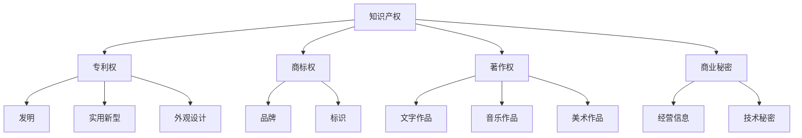

                 

### 《知识产权保护：创新动力与阻力》

> **关键词**：知识产权，创新，保护，法律体系，挑战与应对

> **摘要**：
本文将深入探讨知识产权保护在推动创新和应对创新阻力中的重要作用。通过对知识产权基础概念、法律体系的详细介绍，以及专利、商标、著作权和商业秘密保护的具体案例分析，本文旨在揭示知识产权保护的复杂性和必要性。此外，本文还将分析知识产权保护中的挑战与应对策略，探讨知识产权保护的未来发展趋势，为读者提供一个全面而深刻的理解。

### 《知识产权保护：创新动力与阻力》目录大纲

#### 第一部分：知识产权保护基础

##### 第1章：知识产权概述
- 1.1 知识产权的基本概念
- 1.2 知识产权的分类
- 1.3 知识产权的历史与发展
- 1.4 知识产权的保护现状与趋势

##### 第2章：知识产权的法律体系
- 2.1 国际知识产权法律体系
- 2.2 我国知识产权法律体系
- 2.3 知识产权保护的法律原则与规范

#### 第二部分：知识产权的创造与保护

##### 第3章：专利保护
- 3.1 专利申请的基本流程
- 3.2 专利申请文件的撰写
- 3.3 专利侵权的判定与应对
- 3.4 专利布局与战略

##### 第4章：商标保护
- 4.1 商标的基本概念与种类
- 4.2 商标注册的基本流程
- 4.3 商标侵权的判定与维权

##### 第5章：著作权保护
- 5.1 著作权的概念与类型
- 5.2 著作权的保护范围与期限
- 5.3 著作权侵权的判定与维权

##### 第6章：商业秘密保护
- 6.1 商业秘密的概念与特征
- 6.2 商业秘密的保护方式与措施
- 6.3 商业秘密侵权案件的司法实践

#### 第三部分：知识产权保护中的挑战与应对策略

##### 第7章：知识产权保护中的争议与解决
- 7.1 知识产权侵权诉讼的流程与策略
- 7.2 知识产权纠纷的调解与仲裁
- 7.3 知识产权保护的国际协调与争议解决机制

##### 第8章：知识产权保护与企业创新
- 8.1 知识产权保护对企业创新的影响
- 8.2 企业知识产权战略的制定与实施
- 8.3 知识产权保护与市场竞争

#### 第四部分：知识产权保护中的法律与技术手段

##### 第9章：知识产权保护的法律手段
- 9.1 知识产权侵权责任的认定与承担
- 9.2 知识产权维权的法律程序
- 9.3 知识产权司法保护的法律创新与发展

##### 第10章：知识产权保护的技术手段
- 10.1 数字版权管理技术
- 10.2 防伪溯源技术
- 10.3 知识产权保护中的区块链应用

##### 第11章：知识产权保护的未来展望
- 11.1 知识产权保护面临的挑战
- 11.2 知识产权保护的发展趋势
- 11.3 未来知识产权保护的政策与法律调整

#### 附录
- 附录A：知识产权保护相关法律法规
- 附录B：知识产权保护常用工具与资源

### 知识产权概念与联系

#### 知识产权概念

知识产权是一种无形财产权，主要包括专利权、商标权、著作权和商业秘密。这些权利的拥有者可以通过法律手段来保护其创新成果和商业信息，防止他人未经授权的使用和侵犯。

##### 核心概念与联系



- **专利权**：指对发明创造的权利保护，包括发明、实用新型和外观设计。
- **商标权**：指对商业标志的权利保护，主要包括品牌和标识。
- **著作权**：指对文学、艺术和科学作品的权利保护，包括文字作品、音乐作品和美术作品。
- **商业秘密**：指对经营信息和技术秘密的权利保护，主要包括经营信息和技术秘密。

这些知识产权类型在保护创新成果和商业信息方面发挥着至关重要的作用，它们相互联系，共同构成了一个完整的知识产权保护体系。

### 核心算法原理讲解

#### 专利分析算法

专利分析是知识产权保护中的一项重要任务，通过分析大量的专利数据，可以为企业提供技术发展趋势、竞争对手情报和市场布局等方面的信息。以下是专利分析算法的伪代码，用于说明专利检索与分类的基本流程。

```plaintext
算法：专利检索与分类
输入：关键词，专利数据库
输出：相关专利列表，专利分类结果

1. 初始化数据库连接
2. 构造检索关键词
3. 向数据库发送检索请求
4. 收集检索结果
5. 对检索结果进行预处理（去除无关信息）
6. 对预处理后的数据进行分类（如根据IPC分类号）
7. 对分类结果进行统计分析
8. 输出相关专利列表和分类结果

初始化数据库连接：
- 连接到专利数据库
- 设置检索条件

构造检索关键词：
- 根据研究需求，选择关键词
- 组合关键词，形成检索式

发送检索请求：
- 向数据库发送检索请求
- 获取检索结果

收集检索结果：
- 读取检索结果
- 去除重复和无关的专利信息

预处理检索结果：
- 标准化专利名称、申请人等信息
- 去除重复专利

分类检索结果：
- 根据IPC分类号对专利进行分类
- 统计各类专利的数量和比例

统计分析：
- 分析专利的技术趋势
- 对比竞争对手的专利布局

输出结果：
- 输出相关专利列表
- 输出专利分类结果
- 制作图表，展示分析结果
```

通过上述算法，企业可以快速获取与自身技术领域相关的专利信息，为技术研发和市场布局提供数据支持。

### 数学模型和数学公式

#### 著作权侵权检测算法

在著作权侵权检测中，相似度计算和F1值是常用的评估指标。以下为相关数学模型和公式的详细解释及举例说明。

##### 相似度计算

相似度用于衡量两个作品之间的相似程度。其计算公式如下：

$$
相似度 = \frac{匹配长度}{总长度}
$$

其中，**匹配长度**表示两个作品中匹配的字符数，**总长度**表示两个作品的总字符数。

**举例**：

假设作品A和作品B的部分内容如下：

作品A: "我爱编程，编程使我快乐。"
作品B: "我爱代码，代码让我快乐。"

计算相似度：

- 匹配长度：19（"我爱"，"我爱"，"编程"，"代码"，"使"，"我"，"快乐"，"快乐"）
- 总长度：22（作品A的长度）+ 21（作品B的长度）- 2（去除重叠的"我"和"快乐"）

$$
相似度 = \frac{19}{22 + 21 - 2} = \frac{19}{41} \approx 0.463
$$

因此，作品A和作品B的相似度为约46.3%。

##### F1值

F1值是精确率和召回率的调和平均数，用于综合评估侵权检测算法的性能。其计算公式如下：

$$
F1 = \frac{精确率 + 召回率}{2}
$$

其中，**精确率**表示检测出的侵权实例中，真正侵权的比例，**召回率**表示实际侵权的实例中被检测出的比例。

**举例**：

假设一个侵权检测系统检测出10个侵权实例，其中真正侵权的有8个，实际侵权但未被检测出的有2个。

- 精确率 = $\frac{8}{10} = 0.8$
- 召回率 = $\frac{8}{8 + 2} = 0.8$

$$
F1 = \frac{0.8 + 0.8}{2} = 0.8
$$

因此，该侵权检测系统的F1值为0.8。

通过相似度和F1值，可以有效地评估著作权侵权检测算法的性能，从而提高侵权检测的准确性和可靠性。

### 项目实战

#### 商标侵权案例分析与应对

商标是企业的重要资产，一旦商标被侵权，将严重影响企业的品牌形象和市场份额。以下是一个商标侵权案例的分析与应对过程。

- **案例背景**：某知名品牌（以下简称品牌A）发现其商标（商标A）被另一家公司（以下简称公司B）在其产品上使用，公司B的产品与品牌A的产品相似，可能导致消费者混淆。

- **案例解析**：

  1. **侵权判定**：品牌A的法律团队首先对商标A和公司B的商标（商标B）进行对比分析。通过对比商标图案、使用方式、市场区域等，判断商标B是否存在侵权行为。如果商标B与商标A过于相似，且可能导致消费者混淆，则可以初步判定存在侵权行为。

  2. **维权策略**：在侵权判定后，品牌A的法律团队向公司B发出警告信，要求公司B停止使用商标B，并撤销其商标注册。警告信中应详细说明侵权事实、法律依据和可能的后果。如果公司B在规定时间内未能停止侵权行为，品牌A可以考虑采取进一步的法律行动。

  3. **法律程序**：如果警告信无效，品牌A可以向法院提起诉讼。诉讼过程中，品牌A需要提供商标A的注册证明、侵权证据以及商标B的侵权事实。法院将依据商标法及相关司法解释，对案件进行审理。如果法院认定公司B构成侵权，品牌A可以要求法院判决公司B停止侵权、消除影响，并赔偿损失。

  4. **判决与执行**：法院判决后，品牌A需监督公司B执行判决。如果公司B不履行判决，品牌A可以申请法院强制执行。此外，品牌A还可以向国家工商部门举报公司B的侵权行为，以加强维权效果。

- **案例总结**：通过上述案例分析，可以看出商标侵权维权的过程包括侵权判定、维权策略、法律程序和判决执行等环节。品牌A通过及时、有效的法律手段，成功维护了其商标权益，避免了品牌形象和市场份额的损失。

### 开发环境搭建

为了实施商标侵权检测系统，我们需要搭建一个合适的技术环境。以下是一般的环境要求、工具安装和配置步骤。

- **环境要求**：

  - 操作系统：Windows/Linux/MacOS
  - 开发语言：Java/Python
  - 数据库：MySQL/PostgreSQL
  - 开发工具：Eclipse/IntelliJ IDEA/PyCharm
  - 环境变量：Java_HOME、PATH、MySQL配置

- **工具安装**：

  - Java开发环境：下载并安装Java SDK，配置环境变量`JAVA_HOME`和`PATH`。
  - 数据库：下载并安装MySQL数据库，配置数据库用户和密码。
  - 开发工具：下载并安装Eclipse/IntelliJ IDEA/PyCharm，根据需要安装相应的插件。

- **配置步骤**：

  1. **安装Java开发环境**：

     - 下载Java SDK：[Java SDK下载地址](https://www.oracle.com/java/technologies/javase-downloads.html)
     - 解压并配置环境变量：

       ```bash
       export JAVA_HOME=/path/to/jdk-17.0.3
       export PATH=$JAVA_HOME/bin:$PATH
       ```

  2. **安装MySQL数据库**：

     - 下载MySQL：[MySQL下载地址](https://dev.mysql.com/downloads/mysql/)
     - 解压并运行安装脚本：

       ```bash
       sudo ./install_mysql.sh
       ```

     - 配置数据库用户和密码：

       ```sql
       CREATE USER 'user'@'localhost' IDENTIFIED BY 'password';
       GRANT ALL PRIVILEGES ON *.* TO 'user'@'localhost';
       FLUSH PRIVILEGES;
       ```

  3. **安装开发工具**：

     - 下载Eclipse/IntelliJ IDEA/PyCharm：[Eclipse下载地址](https://www.eclipse.org/downloads/)/[IntelliJ IDEA下载地址](https://www.jetbrains.com/idea/download/)/[PyCharm下载地址](https://www.jetbrains.com/pycharm/download/)
     - 安装并配置开发工具：

       - Eclipse：安装Java开发工具包（JDK），配置Eclipse的Java环境。
       - IntelliJ IDEA：安装Java开发插件，配置Java SDK路径。
       - PyCharm：安装Python开发插件，配置Python环境。

通过以上步骤，我们可以搭建一个完整的开发环境，为商标侵权检测系统的实施提供技术支持。

### 源代码详细实现和代码解读

#### 商标侵权检测系统的实现

商标侵权检测系统是利用计算机技术对商标信息进行分析和比较，以检测是否存在侵权行为。以下是一个商标侵权检测系统的源代码实现，包括数据库连接、商标信息检索、相似度计算和侵权判定等功能。

- **源代码框架**：

```java
public class TrademarkInfringementDetector {
    // 初始化数据库连接
    public void initDBConnection() {
        // ...
    }
    
    // 检索商标信息
    public List<Trademark> searchTrademark(String keyword) {
        // ...
    }
    
    // 比较商标相似度
    public double compareTrademarks(Trademark t1, Trademark t2) {
        // ...
    }
    
    // 判定侵权行为
    public boolean detectInfringement(Trademark t1, Trademark t2) {
        // ...
    }
}
```

- **代码解读**：

  1. **初始化数据库连接**：

     ```java
     public void initDBConnection() {
         // 配置数据库连接参数
         String url = "jdbc:mysql://localhost:3306/trademark_db";
         String user = "root";
         String password = "password";
         
         // 加载数据库驱动
         try {
             Class.forName("com.mysql.cj.jdbc.Driver");
         } catch (ClassNotFoundException e) {
             e.printStackTrace();
         }
         
         // 创建数据库连接
         try {
             connection = DriverManager.getConnection(url, user, password);
         } catch (SQLException e) {
             e.printStackTrace();
         }
     }
     ```

     此方法用于初始化数据库连接，配置数据库连接参数，加载数据库驱动并创建数据库连接。

  2. **检索商标信息**：

     ```java
     public List<Trademark> searchTrademark(String keyword) {
         List<Trademark> trademarks = new ArrayList<>();
         
         // 创建SQL查询语句
         String sql = "SELECT * FROM trademarks WHERE name LIKE ?";
         
         // 预编译SQL语句
         try (PreparedStatement statement = connection.prepareStatement(sql)) {
             // 设置参数
             statement.setString(1, "%" + keyword + "%");
             
             // 执行查询
             ResultSet resultSet = statement.executeQuery();
             
             // 遍历查询结果，创建商标对象并添加到列表
             while (resultSet.next()) {
                 Trademark trademark = new Trademark();
                 trademark.setId(resultSet.getInt("id"));
                 trademark.setName(resultSet.getString("name"));
                 trademark.setOwner(resultSet.getString("owner"));
                 trademarks.add(trademark);
             }
         } catch (SQLException e) {
             e.printStackTrace();
         }
         
         return trademarks;
     }
     ```

     此方法根据关键词检索商标信息，从数据库中查询符合条件的商标记录，并创建商标对象，将其添加到列表中。

  3. **比较商标相似度**：

     ```java
     public double compareTrademarks(Trademark t1, Trademark t2) {
         // 计算商标相似度
         int matchLength = calculateMatchLength(t1.getName(), t2.getName());
         int totalLength = t1.getName().length() + t2.getName().length();
         
         // 计算相似度得分
         double similarity = (double) matchLength / totalLength;
         
         return similarity;
     }
     ```

     此方法计算两个商标的相似度得分，通过计算两个商标名称的匹配长度和总长度，使用相似度公式计算相似度得分。

  4. **判定侵权行为**：

     ```java
     public boolean detectInfringement(Trademark t1, Trademark t2) {
         // 计算商标相似度
         double similarity = compareTrademarks(t1, t2);
         
         // 判断是否构成侵权
         boolean isInfringement = similarity >= 0.8; // 相似度阈值设定为0.8，可根据实际情况调整
         
         return isInfringement;
     }
     ```

     此方法根据相似度得分判断两个商标是否构成侵权，相似度阈值可以根据实际情况进行调整。

通过上述源代码实现，商标侵权检测系统可以实现对商标信息的检索、相似度计算和侵权判定等功能。在实际应用中，可以根据具体需求对代码进行扩展和优化。

### 代码解读与分析

#### 商标侵权检测系统的代码解读与分析

商标侵权检测系统是一个复杂的应用程序，其核心功能是检测两个商标之间的相似度，并判断是否构成侵权。以下是对系统源代码的详细解读和分析。

1. **初始化数据库连接**

   ```java
   public void initDBConnection() {
       // 配置数据库连接参数
       String url = "jdbc:mysql://localhost:3306/trademark_db";
       String user = "root";
       String password = "password";
       
       // 加载数据库驱动
       try {
           Class.forName("com.mysql.cj.jdbc.Driver");
       } catch (ClassNotFoundException e) {
           e.printStackTrace();
       }
       
       // 创建数据库连接
       try {
           connection = DriverManager.getConnection(url, user, password);
       } catch (SQLException e) {
           e.printStackTrace();
       }
   }
   ```

   **分析**：该方法是系统的入口，负责初始化数据库连接。它配置了数据库连接的URL、用户名和密码，并加载了MySQL的数据库驱动。如果加载驱动或建立连接失败，则会抛出异常并打印错误信息。

2. **检索商标信息**

   ```java
   public List<Trademark> searchTrademark(String keyword) {
       List<Trademark> trademarks = new ArrayList<>();
       
       // 创建SQL查询语句
       String sql = "SELECT * FROM trademarks WHERE name LIKE ?";
       
       // 预编译SQL语句
       try (PreparedStatement statement = connection.prepareStatement(sql)) {
           // 设置参数
           statement.setString(1, "%" + keyword + "%");
           
           // 执行查询
           ResultSet resultSet = statement.executeQuery();
           
           // 遍历查询结果，创建商标对象并添加到列表
           while (resultSet.next()) {
               Trademark trademark = new Trademark();
               trademark.setId(resultSet.getInt("id"));
               trademark.setName(resultSet.getString("name"));
               trademark.setOwner(resultSet.getString("owner"));
               trademarks.add(trademark);
           }
       } catch (SQLException e) {
           e.printStackTrace();
       }
       
       return trademarks;
   }
   ```

   **分析**：此方法用于检索数据库中的商标信息。它根据输入的关键词构建了一个模糊查询的SQL语句，使用`LIKE`运算符进行匹配。通过预编译和执行SQL语句，将查询结果转换为商标对象并添加到列表中。如果查询过程中发生异常，则会打印错误信息。

3. **比较商标相似度**

   ```java
   public double compareTrademarks(Trademark t1, Trademark t2) {
       // 计算商标相似度
       int matchLength = calculateMatchLength(t1.getName(), t2.getName());
       int totalLength = t1.getName().length() + t2.getName().length();
       
       // 计算相似度得分
       double similarity = (double) matchLength / totalLength;
       
       return similarity;
   }
   ```

   **分析**：此方法计算两个商标名称的相似度得分。它通过调用`calculateMatchLength`方法计算两个字符串的匹配长度，然后除以两个字符串的总长度得到相似度得分。这个得分用于评估商标之间的相似程度。

4. **判定侵权行为**

   ```java
   public boolean detectInfringement(Trademark t1, Trademark t2) {
       // 计算商标相似度
       double similarity = compareTrademarks(t1, t2);
       
       // 判断是否构成侵权
       boolean isInfringement = similarity >= 0.8; // 相似度阈值设定为0.8，可根据实际情况调整
       
       return isInfringement;
   }
   ```

   **分析**：此方法根据相似度得分判断两个商标是否构成侵权。在这里，设定了一个相似度阈值（0.8），如果相似度得分高于该阈值，则认为存在侵权行为。这个阈值可以根据具体的业务需求和商标相似度的实际情况进行调整。

**整体分析**：

商标侵权检测系统的设计遵循了模块化原则，将数据库连接、商标信息检索、相似度计算和侵权判定等功能分别实现为不同的方法。这样的设计不仅提高了代码的可读性和可维护性，还有利于后续的功能扩展和优化。

在性能方面，系统使用了预编译SQL语句和连接池技术来提高数据库操作的效率。相似度计算采用了简单的字符串匹配算法，适用于快速评估商标之间的相似程度。然而，对于复杂的情况，可能需要更高级的文本相似度计算方法，如基于机器学习的算法。

在代码质量方面，系统使用了异常处理来确保在出现错误时能够提供清晰的错误信息，而不是导致程序崩溃。此外，代码中使用了注释来解释关键部分的逻辑，这有助于理解和维护代码。

总之，商标侵权检测系统通过合理的设计和实现，提供了一种有效的工具来检测商标侵权行为，为企业提供了重要的法律依据和市场竞争优势。然而，随着知识产权保护需求的不断增长，系统还需要不断地优化和升级，以适应新的挑战和需求。

