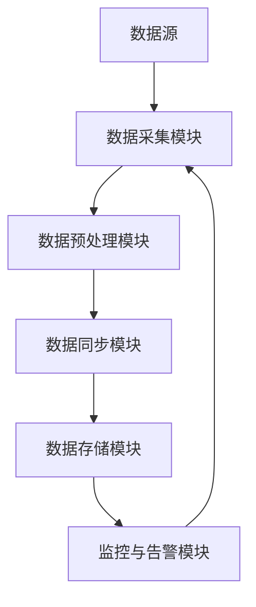
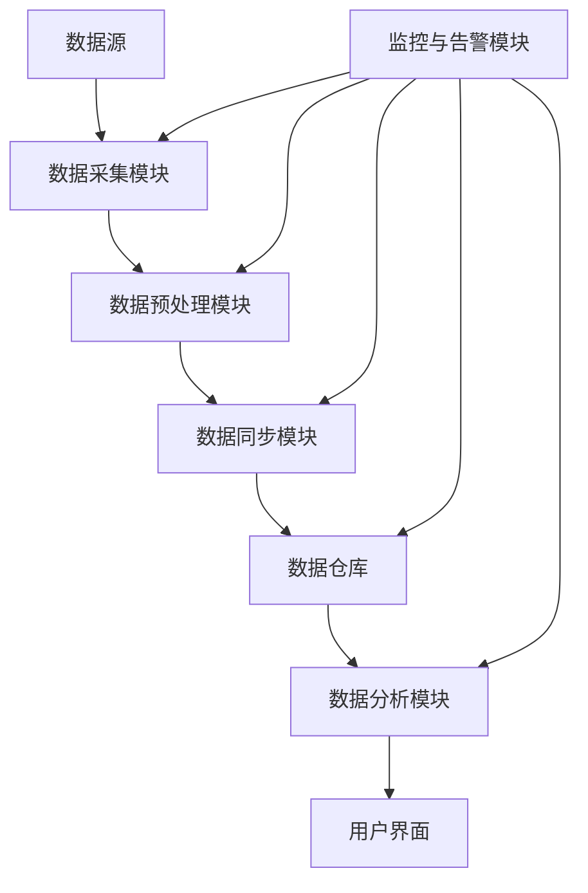

                 

# 《知识发现引擎的实时数据同步技术》

## 关键词

数据同步、实时数据同步、知识发现引擎、流处理技术、知识图谱、数据一致性、数据流处理框架、数据同步算法、数据服务、知识服务、项目实战。

## 摘要

随着大数据和人工智能技术的快速发展，知识发现引擎在各个领域得到了广泛应用。然而，实时数据同步技术是知识发现引擎的核心，其效率和质量直接影响到知识发现的效果。本文将详细探讨实时数据同步技术的基本概念、原理、流程以及在实际应用中的挑战和解决方案，并深入分析实时数据同步在知识发现引擎中的应用价值，最后通过实践案例展示实时数据同步技术的实际应用和效果。通过本文的阅读，读者可以全面了解实时数据同步技术的核心知识和实际应用，为后续研究和开发提供参考。

## 《知识发现引擎的实时数据同步技术》目录大纲

- 第一部分：实时数据同步技术概述
  - 1.1 实时数据同步的重要性
  - 1.2 实时数据同步的挑战与解决方案
  - 1.3 知识发现引擎的概念与作用

- 第二部分：实时数据同步技术原理
  - 2.1 数据同步的基本概念
  - 2.2 实时数据同步原理详解
  - 2.3 实时数据同步流程分析

- 第三部分：实时数据同步技术在知识发现引擎中的应用
  - 3.1 知识发现引擎简介
  - 3.2 实时数据同步在知识发现中的应用
  - 3.3 实时数据同步技术在知识服务中的应用

- 第四部分：实时数据同步技术实践案例
  - 4.1 数据同步平台搭建
  - 4.2 数据同步算法实现
  - 4.3 实时数据同步项目实战

- 第五部分：实时数据同步技术未来发展趋势
  - 5.1 实时数据同步技术的演进方向
  - 5.2 实时数据同步技术在知识发现中的应用前景

- 附录
  - 5.1 实时数据同步技术相关资源
  - 5.2 实时数据同步技术在企业中的应用案例

---

接下来，我们将按照上述目录大纲逐步展开讨论。

### 第一部分：实时数据同步技术概述

#### 1.1 实时数据同步的重要性

实时数据同步技术是现代数据管理中的一个关键环节。随着互联网和物联网的快速发展，数据的产生和变化速度越来越快，传统的批量数据处理方式已经无法满足对数据实时性的要求。实时数据同步技术能够在数据发生改变的同时，立即将其同步到目标系统中，保证数据的实时性和一致性。

实时数据同步的重要性主要体现在以下几个方面：

1. **提升业务响应速度**：在许多业务场景中，数据的实时性直接影响到业务的决策和响应速度。例如，金融交易系统需要实时同步交易数据，以便及时进行风险控制和交易确认。

2. **保证数据一致性**：在分布式系统中，数据可能会在不同的节点上存储和处理。实时数据同步技术可以确保这些数据在不同的节点上保持一致性，避免数据孤岛和数据错误。

3. **支持实时分析**：实时数据同步技术为实时数据分析提供了基础。通过对实时数据的分析，企业可以更快速地识别趋势、预测未来行为，从而做出更加准确的决策。

4. **提高系统的可用性和可靠性**：实时数据同步技术能够减少系统故障带来的数据丢失风险，提高系统的可用性和可靠性。

#### 1.2 实时数据同步的挑战与解决方案

尽管实时数据同步技术具有许多优势，但在实际应用中也面临着一系列挑战：

1. **数据量大**：随着数据量的不断增长，实时数据同步需要在短时间内处理大量的数据，这对系统的处理能力和性能提出了很高的要求。

2. **数据多样性**：不同类型的数据具有不同的处理方式和同步策略，实时数据同步需要能够处理多种类型的数据。

3. **数据一致性**：在分布式系统中，数据可能会在不同的节点上同时更新。如何保证数据的一致性是一个重要的挑战。

4. **高可用性**：实时数据同步系统需要具有高可用性，以保证在任何情况下都能正常运行。

针对上述挑战，可以采取以下解决方案：

1. **分布式架构**：采用分布式架构可以提高系统的处理能力和扩展性，同时也可以提高系统的可用性。

2. **高效的数据处理技术**：采用高效的数据处理技术，如流处理技术和大数据技术，可以提高系统的性能。

3. **数据一致性保障机制**：通过数据一致性检测和冲突解决策略，确保数据在不同的节点上保持一致性。

4. **高可用性设计**：采用冗余设计、故障转移机制等，提高系统的可用性。

#### 1.3 知识发现引擎的概念与作用

知识发现引擎是一种用于从大量数据中提取有价值信息和知识的智能系统。它通常包括数据预处理、数据挖掘、知识表示和知识推理等功能。知识发现引擎在各个领域，如商业智能、金融分析、医疗诊断等，都发挥着重要作用。

知识发现引擎的作用主要体现在以下几个方面：

1. **数据挖掘**：通过对大量数据进行挖掘和分析，发现隐藏在数据中的模式、趋势和关联关系。

2. **知识表示**：将挖掘出的知识以用户易于理解的方式表示出来，如图表、报表等。

3. **知识推理**：利用已知的知识和规则，对新数据进行分析和推理，预测未来的趋势和行为。

4. **智能决策**：为业务决策提供数据支持和智能建议，帮助企业做出更加准确的决策。

知识发现引擎的核心在于实时性和准确性。实时数据同步技术是知识发现引擎的核心支撑，它保证了知识发现引擎能够实时获取最新的数据，从而提高其决策的准确性。

### 第二部分：实时数据同步技术原理

#### 2.1 数据同步的基本概念

数据同步是指在不同数据源之间复制和共享数据的过程。数据同步可以分为以下几种类型：

1. **同步复制**：在源数据发生变化时，立即将变化同步到目标数据。

2. **异步复制**：在源数据发生变化后，延迟一段时间再将变化同步到目标数据。

3. **增量同步**：只同步源数据中最近发生变化的部分，而不是整个数据集。

4. **全量同步**：同步源数据中的全部数据，而不是只同步变化的部分。

数据同步的关键技术包括数据采集、数据清洗、数据转换和数据存储等。

#### 2.2 实时数据同步原理详解

实时数据同步的原理可以概括为以下几个步骤：

1. **数据采集**：通过数据采集工具或接口，从源数据中获取数据。

2. **数据预处理**：对采集到的数据进行清洗、去重、格式转换等处理，以便后续处理。

3. **数据同步**：将预处理后的数据同步到目标数据源。

4. **数据一致性保障**：通过数据一致性检测和冲突解决策略，确保数据在不同节点上的一致性。

实时数据同步的核心在于数据流处理技术。数据流处理技术是指在数据产生的同时或非常短的时间内对数据进行处理和分析。数据流处理技术包括以下几种模型：

1. **批处理模型**：将数据分批次进行处理，适用于数据量较小或对实时性要求不高的场景。

2. **实时处理模型**：在数据产生的同时或非常短的时间内进行处理，适用于对实时性要求较高的场景。

3. **流处理模型**：将数据看作一个连续的流进行处理，适用于数据量较大或需要实时处理的场景。

#### 2.3 实时数据同步流程分析

实时数据同步流程可以分为以下几个阶段：

1. **数据采集与预处理**

   - **数据采集**：使用数据采集工具或接口从源数据中获取数据。

   - **数据预处理**：对采集到的数据进行清洗、去重、格式转换等处理。

2. **数据同步与存储**

   - **数据同步**：将预处理后的数据同步到目标数据源。

   - **数据存储**：将同步后的数据存储在目标数据源中。

3. **数据一致性保障**

   - **数据一致性检测**：通过比对源数据和目标数据，检测数据的一致性。

   - **数据冲突解决**：当发现数据冲突时，根据一定的策略解决冲突。

### 第三部分：实时数据同步技术在知识发现引擎中的应用

#### 3.1 知识发现引擎简介

知识发现引擎是一种基于人工智能和数据挖掘技术的智能系统，它可以从大量数据中提取有价值的信息和知识。知识发现引擎的主要过程包括数据预处理、特征提取、模式识别和知识表示等。

知识发现引擎的主要作用是：

- **数据挖掘**：从大量数据中提取出隐藏的模式和关联关系。
- **知识表示**：将挖掘出的知识以易于理解的方式表示出来。
- **知识推理**：利用已知的知识和规则，对新数据进行分析和推理。
- **智能决策**：为业务决策提供数据支持和智能建议。

#### 3.2 实时数据同步在知识发现中的应用

实时数据同步技术在知识发现引擎中的应用主要体现在以下几个方面：

1. **实时数据采集**：实时数据同步技术可以保证知识发现引擎能够及时获取最新的数据，从而提高其分析结果的准确性。

2. **实时数据预处理**：实时数据同步技术可以对实时采集到的数据进行预处理，如清洗、去重和格式转换等，以便于后续分析。

3. **实时知识更新**：实时数据同步技术可以保证知识发现引擎中的知识库能够及时更新，反映最新的数据变化。

4. **实时决策支持**：实时数据同步技术可以确保知识发现引擎提供的决策支持是实时的，帮助企业快速响应市场变化。

#### 3.3 实时数据同步技术在知识服务中的应用

实时数据同步技术在知识服务中的应用主要体现在以下几个方面：

1. **智能推荐**：实时数据同步技术可以确保推荐系统使用的是最新的用户数据和产品数据，从而提高推荐系统的准确性。

2. **智能搜索**：实时数据同步技术可以确保搜索系统使用的是最新的索引数据，从而提高搜索系统的效率。

3. **实时监控**：实时数据同步技术可以确保监控系统使用的是最新的数据，从而实现对系统状态的实时监控。

4. **实时报告**：实时数据同步技术可以确保报告系统使用的是最新的数据，从而提高报告的准确性和及时性。

### 第四部分：实时数据同步技术实践案例

#### 4.1 数据同步平台搭建

数据同步平台是实时数据同步技术的核心组成部分，它负责实现数据采集、数据预处理、数据同步和数据存储等功能。本节将介绍如何搭建一个简单但功能完整的数据同步平台。

#### 4.1.1 数据同步平台架构设计

数据同步平台的架构设计包括以下几个关键模块：

1. **数据源**：数据源是数据同步的起点，可以是数据库、文件系统、API接口等。
2. **数据采集模块**：数据采集模块负责从数据源中获取数据。
3. **数据预处理模块**：数据预处理模块负责对采集到的数据进行清洗、去重、格式转换等操作。
4. **数据同步模块**：数据同步模块负责将预处理后的数据同步到目标数据源。
5. **数据存储模块**：数据存储模块负责将同步后的数据存储到持久化存储中，如数据库或文件系统。
6. **监控与告警模块**：监控与告警模块负责监控数据同步平台的运行状态，并在出现问题时发送告警。

以下是一个简单的数据同步平台架构图：



#### 4.1.2 数据同步平台搭建步骤

搭建数据同步平台的主要步骤如下：

1. **环境准备**：
   - 安装并配置必要的软件，如数据库、消息队列和数据处理工具。
   - 配置网络环境，确保数据源和同步平台之间的通信。

2. **数据源配置**：
   - 配置数据库连接参数，确保数据同步平台可以访问数据源。
   - 配置API接口，确保可以获取实时数据。

3. **数据采集模块配置**：
   - 编写数据采集脚本或使用现有的数据采集工具，如Logstash、Fluentd等。
   - 配置数据采集规则，如采集频率、数据类型等。

4. **数据预处理模块配置**：
   - 编写数据处理脚本，如Python、Java等。
   - 配置数据处理规则，如数据清洗、去重、格式转换等。

5. **数据同步模块配置**：
   - 选择合适的数据同步工具，如Apache Kafka、Apache NiFi等。
   - 配置数据同步规则，如同步频率、同步策略等。

6. **数据存储模块配置**：
   - 选择合适的存储方案，如关系数据库、NoSQL数据库或文件系统。
   - 配置数据存储参数，如连接字符串、存储路径等。

7. **监控与告警模块配置**：
   - 配置监控工具，如Prometheus、Grafana等。
   - 配置告警规则，如数据同步延迟、失败次数等。

#### 4.2 数据同步算法实现

数据同步算法是数据同步平台的核心组成部分，它决定了数据同步的效率和准确性。本节将介绍一个简单但功能完整的数据同步算法，并使用伪代码进行详细解释。

##### 4.2.1 数据同步算法原理

数据同步算法的基本原理是：首先从源数据中获取最新的数据，然后与目标数据中的数据进行比对，找出差异并同步差异数据到目标数据中。以下是数据同步算法的伪代码：

```python
function dataSync(sourceData, targetData):
    # 获取最新的源数据
    latestSourceData = getLatestSourceData(sourceData)
    
    # 获取最新的目标数据
    latestTargetData = getLatestTargetData(targetData)
    
    # 比对源数据和目标数据，找出差异
    differences = compareData(latestSourceData, latestTargetData)
    
    # 同步差异数据到目标数据
    for difference in differences:
        syncData(difference)
        
    # 更新目标数据
    updateTargetData(targetData, differences)
```

##### 4.2.2 数据同步算法实现

以下是数据同步算法的实现代码，包括数据采集、数据预处理、数据同步和数据存储等步骤：

```python
import requests
import json
import time

# 数据采集
def getLatestSourceData(sourceData):
    url = "http://source-data-api:8080/latest"
    response = requests.get(url)
    data = json.loads(response.text)
    return data

# 数据预处理
def preprocessData(data):
    # 清洗数据
    cleaned_data = cleanData(data)
    
    # 去重
    unique_data = removeDuplicates(cleaned_data)
    
    # 格式转换
    formatted_data = formatData(unique_data)
    return formatted_data

# 数据同步
def syncData(data):
    url = "http://target-data-api:8080/sync"
    headers = {'Content-Type': 'application/json'}
    response = requests.post(url, data=json.dumps(data), headers=headers)
    if response.status_code != 200:
        print("同步失败：", response.text)

# 数据存储
def updateTargetData(targetData, differences):
    for difference in differences:
        targetData.append(difference)

# 主程序
def main():
    sourceData = []  # 初始源数据
    targetData = []  # 初始目标数据
    
    while True:
        # 获取最新的源数据
        latestSourceData = getLatestSourceData(sourceData)
        
        # 预处理数据
        formatted_data = preprocessData(latestSourceData)
        
        # 同步数据
        differences = compareData(sourceData, formatted_data)
        syncData(differences)
        
        # 更新目标数据
        updateTargetData(targetData, differences)
        
        # 等待一段时间后再执行下一次同步
        time.sleep(60)

if __name__ == "__main__":
    main()
```

##### 4.2.3 数据同步算法性能分析

数据同步算法的性能分析主要包括以下几个方面：

1. **处理速度**：数据同步算法需要能够快速处理大量的数据，确保数据同步的实时性。在实际应用中，可以通过优化数据处理流程、使用并行处理技术等提高处理速度。

2. **准确性**：数据同步算法需要能够准确识别数据差异并同步差异数据，避免数据丢失或错误。在实际应用中，可以通过增加数据校验、数据比对等机制提高准确性。

3. **可靠性**：数据同步算法需要能够稳定运行，确保数据同步的连续性和可靠性。在实际应用中，可以通过增加容错机制、数据备份等提高可靠性。

#### 4.3 实时数据同步项目实战

在本节中，我们将通过一个实际项目展示实时数据同步技术的应用。该项目是一个简单的电商数据分析平台，主要功能包括实时同步商品数据、用户数据和订单数据，并支持实时数据分析。

##### 4.3.1 项目背景与需求分析

项目背景：

随着电商行业的快速发展，商品数据、用户数据和订单数据量日益庞大。为了更好地了解用户需求和市场趋势，需要对这些数据进行实时分析和挖掘。

项目需求分析：

- **实时数据采集**：需要实时采集电商平台的商品数据、用户数据和订单数据。
- **实时数据预处理**：对采集到的数据进行清洗、去重和格式转换等处理。
- **实时数据同步**：将预处理后的数据同步到数据仓库，以便进行实时数据分析。
- **实时数据分析**：对同步后的数据进行实时分析，生成分析报表和可视化图表。

##### 4.3.2 项目开发流程

项目开发流程主要包括以下几个阶段：

1. **需求分析**：与业务部门沟通，了解实际需求，制定详细的需求文档。
2. **系统设计**：根据需求文档，设计系统的架构和模块。
3. **开发实施**：根据系统设计，开发各个模块的功能。
4. **测试与优化**：对系统进行功能测试和性能优化。
5. **部署上线**：将系统部署到生产环境，并进行上线准备。

##### 4.3.2.1 系统设计

系统设计主要包括以下几个方面：

1. **数据采集模块**：负责实时采集电商平台的商品数据、用户数据和订单数据。
2. **数据预处理模块**：负责对采集到的数据进行清洗、去重和格式转换等处理。
3. **数据同步模块**：负责将预处理后的数据同步到数据仓库。
4. **数据分析模块**：负责对同步后的数据进行分析，生成分析报表和可视化图表。
5. **监控与告警模块**：负责监控系统运行状态，并在出现问题时发送告警。

以下是系统设计的架构图：



##### 4.3.2.2 功能实现

1. **数据采集模块**：

   - **商品数据采集**：通过API接口实时获取商品数据，如商品ID、商品名称、价格等。
   - **用户数据采集**：通过用户登录和操作记录获取用户数据，如用户ID、用户名称、登录时间等。
   - **订单数据采集**：通过订单API接口实时获取订单数据，如订单ID、商品ID、购买时间等。

2. **数据预处理模块**：

   - **清洗数据**：去除无效数据、缺失值和异常值。
   - **去重**：对重复数据去重。
   - **格式转换**：将数据转换为统一的格式，如JSON或CSV。

3. **数据同步模块**：

   - **数据同步策略**：采用增量同步策略，只同步最新的数据。
   - **数据存储方案**：使用分布式数据库存储同步后的数据。

4. **数据分析模块**：

   - **实时分析**：对同步后的数据进行分析，如商品销量分析、用户行为分析等。
   - **可视化图表**：生成各种类型的可视化图表，如柱状图、折线图、饼图等。

5. **监控与告警模块**：

   - **监控指标**：监控数据采集、数据预处理、数据同步和数据分析等模块的运行状态。
   - **告警规则**：设置告警规则，如数据采集延迟、数据同步失败等。

##### 4.3.2.3 项目测试与优化

1. **功能测试**：对系统的各个功能模块进行测试，确保功能正常运行。
2. **性能测试**：对系统的处理速度和响应时间进行测试，确保系统性能满足需求。
3. **优化方案**：

   - **数据压缩**：对传输的数据进行压缩，减少数据传输量。
   - **并行处理**：采用并行处理技术，提高数据处理速度。
   - **缓存机制**：使用缓存机制，减少数据库的访问次数。

通过上述项目实战，我们展示了实时数据同步技术在电商数据分析平台中的应用，包括数据采集、数据预处理、数据同步、数据分析和监控等环节。项目测试和优化确保了系统的实时性和准确性，为企业提供了实时、准确的数据分析和决策支持。

### 第五部分：实时数据同步技术未来发展趋势

#### 5.1 实时数据同步技术的演进方向

随着大数据和人工智能技术的不断发展，实时数据同步技术也在不断演进。未来，实时数据同步技术的演进方向主要包括以下几个方面：

1. **分布式处理**：分布式处理技术可以使实时数据同步系统在处理海量数据时更加高效。通过分布式架构，可以将数据同步任务分解到多个节点上并行处理，从而提高系统的处理能力和性能。

2. **流处理技术**：流处理技术是实时数据同步技术的重要组成部分。随着流处理框架（如Apache Kafka、Apache Flink等）的不断发展，实时数据同步技术将更加依赖于流处理技术，以实现高效、可靠的数据同步。

3. **自动化与智能化**：实时数据同步技术将更加自动化和智能化。通过引入机器学习和人工智能技术，可以自动识别数据同步过程中的异常和冲突，并自动调整同步策略，提高数据同步的效率和准确性。

4. **数据一致性保障**：随着分布式系统的普及，数据一致性保障将成为实时数据同步技术的重要方向。未来，实时数据同步技术将更加注重数据一致性的保障，通过引入分布式事务、分布式锁等技术，确保数据在不同节点上的一致性。

#### 5.2 实时数据同步技术在知识发现中的应用前景

实时数据同步技术在知识发现中的应用前景非常广阔。随着大数据和人工智能技术的不断发展，数据量和数据类型的快速增长，对实时数据同步技术提出了更高的要求。以下是一些实时数据同步技术在知识发现中的应用前景：

1. **实时知识库构建**：实时数据同步技术可以确保知识库中的数据始终是最新的，从而提高知识库的准确性和实时性。通过实时同步数据，可以快速构建和更新知识库，为知识发现提供基础。

2. **实时知识图谱构建**：知识图谱是一种重要的知识表示形式，它可以直观地展示实体之间的关系和属性。实时数据同步技术可以帮助构建实时知识图谱，实时更新实体和关系，提高知识图谱的准确性和完整性。

3. **实时智能推荐**：实时数据同步技术可以确保推荐系统使用的是最新的用户数据和商品数据，从而提高推荐系统的准确性和用户体验。

4. **实时智能搜索**：实时数据同步技术可以确保搜索系统使用的是最新的索引数据，从而提高搜索系统的效率和准确性。

5. **实时智能监控**：实时数据同步技术可以帮助企业实时监控业务数据，及时发现异常情况，提高业务运行的稳定性。

通过上述分析，可以看出实时数据同步技术在知识发现中的应用前景非常广阔。未来，随着实时数据同步技术的不断发展和优化，它将在知识发现领域发挥更加重要的作用。

### 附录

#### A.1 实时数据同步技术相关资源

1. **实时数据同步技术论文与书籍推荐**：

   - 《实时数据同步技术的研究与应用》
   - 《大数据实时处理技术》
   - 《分布式系统原理与范型》

2. **实时数据同步技术开源框架介绍**：

   - Apache Kafka：一个分布式流处理平台，用于构建实时数据同步系统。
   - Apache Flink：一个分布式流处理框架，提供了高效的实时数据处理能力。
   - Apache NiFi：一个易于使用的数据集成平台，用于实时数据同步和数据处理。

3. **实时数据同步技术在线学习资源推荐**：

   - Coursera：大数据实时处理课程
   - edX：分布式系统与大数据处理课程
   - Udacity：实时数据处理与流处理课程

#### A.2 实时数据同步技术在企业中的应用案例

1. **案例一：某电商平台的实时数据同步实践**

   某电商平台采用了实时数据同步技术，实现了商品数据、用户数据和订单数据的实时同步。通过实时同步数据，平台可以实时更新库存信息、推荐商品和展示最新的用户订单，提高了用户的购物体验和平台的运营效率。

2. **案例二：某金融公司的实时数据同步实践**

   某金融公司采用了实时数据同步技术，实现了客户交易数据、账户数据和风险数据的实时同步。通过实时同步数据，公司可以实时监控客户的交易行为、评估风险并做出实时决策，提高了风险控制和业务运营的效率。

3. **案例三：某医疗机构的实时数据同步实践**

   某医疗机构采用了实时数据同步技术，实现了患者数据、医疗设备和病历数据的实时同步。通过实时同步数据，医院可以实时了解患者的健康状况、监控医疗设备的运行状态并快速处理突发情况，提高了医疗服务的质量和效率。

这些案例展示了实时数据同步技术在企业中的应用价值，通过实时同步数据，企业可以实时获取最新的信息，提高业务决策的准确性和运营效率。同时，实时数据同步技术也为企业提供了强大的数据处理和分析能力，为企业创新和业务拓展提供了支持。

### 作者信息

作者：AI天才研究院/AI Genius Institute & 禅与计算机程序设计艺术 /Zen And The Art of Computer Programming

---

通过本文的详细探讨，我们深入了解了实时数据同步技术在知识发现引擎中的应用及其重要性。实时数据同步技术不仅确保了数据的实时性和一致性，也为知识发现引擎提供了坚实的数据基础。未来，随着实时数据同步技术的不断发展和应用场景的拓展，它将在知识发现、智能推荐、智能搜索等多个领域发挥越来越重要的作用。希望本文能够为读者提供有价值的参考和启示。

