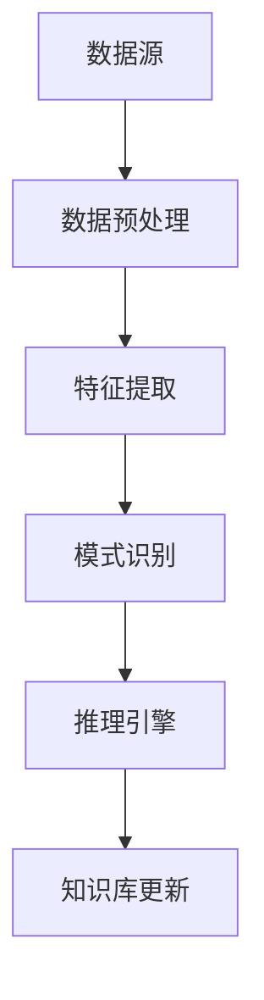

                 

## 文章标题

在当今数字化时代，知识发现引擎已经成为企业和科研机构不可或缺的工具。然而，随着移动设备的普及，如何确保知识发现引擎在移动端的高效适配成为一个亟待解决的问题。本文将围绕知识发现引擎的移动端适配策略，深入探讨其基础、技术架构、数据处理、特征提取、模式识别以及适配策略，旨在为开发者提供一套实用的解决方案，帮助他们更好地应对移动端适配的挑战。

## 关键词

- **知识发现引擎**
- **移动端适配**
- **数据预处理**
- **特征提取**
- **模式识别**
- **性能优化**
- **缓存策略**

## 摘要

本文旨在深入探讨知识发现引擎在移动端的适配策略。首先，我们将回顾知识发现引擎的基础知识，包括其定义、技术架构和应用场景。接着，我们将详细分析数据预处理、特征提取和模式识别等技术，解释其核心概念和原理。随后，本文将专注于移动端的环境特点，如硬件和网络的限制，并提出相应的适配策略。最后，我们将通过性能测试和案例分析，验证这些策略的有效性，并提供实用的开发工具和资源。希望通过本文的探讨，能够帮助开发者更好地理解和应对知识发现引擎在移动端的适配挑战。

### 第一部分：知识发现引擎的基础

#### 第1章：知识发现引擎概述

##### 1.1 知识发现引擎的定义与重要性

知识发现引擎是一种自动化数据处理和分析工具，旨在从大规模数据集中提取有价值的信息和知识。其核心功能包括数据预处理、特征提取、模式识别和推理引擎。通过这些功能，知识发现引擎可以帮助企业和科研机构快速识别数据中的隐藏模式，做出准确的决策，从而提高业务效率。

知识发现引擎的定义可以拆分为以下几个部分：

1. **数据预处理**：数据预处理是知识发现过程中的第一步，其目的是将原始数据转换为适合分析的形式。这通常包括数据清洗、数据集成和数据变换。

2. **特征提取**：特征提取是从原始数据中提取出对模式识别任务有重要影响的属性或特征。这些特征通常用于构建机器学习模型或用于直接分析。

3. **模式识别**：模式识别是指通过算法自动识别数据中的规律或模式。这包括分类、聚类、关联规则挖掘等任务。

4. **推理引擎**：推理引擎是基于已识别的模式，进行逻辑推理和预测的模块。它可以帮助用户基于现有数据生成新的见解和预测。

知识发现引擎在各个领域都有着广泛的应用。例如，在金融领域，知识发现引擎可以用于风险评估和欺诈检测；在医疗领域，它可以用于疾病预测和个性化治疗；在零售领域，它可以用于顾客行为分析和推荐系统。

##### 1.2 知识发现引擎的技术架构

知识发现引擎的技术架构通常包括以下几个主要组件：

1. **数据源**：数据源是知识发现引擎的数据输入部分，可以是数据库、文件或实时数据流。

2. **数据预处理**：数据预处理组件负责对原始数据进行清洗、去噪、整合等操作，以确保数据的质量和一致性。

3. **特征提取**：特征提取组件从清洗后的数据中提取出有意义的特征，这些特征将用于后续的机器学习算法。

4. **模式识别**：模式识别组件使用机器学习算法对提取出的特征进行建模，识别数据中的规律和模式。

5. **推理引擎**：推理引擎基于已识别的模式进行逻辑推理，生成预测和决策。

6. **知识库**：知识库是一个存储所有发现模式和知识的数据库，它可以帮助用户快速获取有用的信息。

以下是一个简化的Mermaid流程图，展示了知识发现引擎的技术架构：



在这个流程图中，数据源通过数据预处理组件进行清洗和转换，生成适合特征提取的数据。特征提取组件提取出关键特征，并将其传递给模式识别组件。模式识别组件使用机器学习算法识别数据中的规律和模式，并将结果传递给推理引擎。推理引擎根据这些模式进行推理和预测，并将结果更新到知识库中。

##### 1.3 知识发现引擎的应用场景

知识发现引擎在多个领域都有广泛的应用。以下是一些典型的应用场景：

1. **金融领域**：在金融领域，知识发现引擎可以用于风险评估、欺诈检测、股票市场分析等。例如，通过分析客户的交易记录和信用记录，银行可以使用知识发现引擎来识别高风险客户，并采取相应的风险控制措施。

2. **医疗领域**：在医疗领域，知识发现引擎可以用于疾病预测、个性化治疗和医疗资源优化。例如，通过分析患者的病历数据，医院可以使用知识发现引擎来预测某些疾病的发病风险，从而采取预防措施。

3. **零售领域**：在零售领域，知识发现引擎可以用于顾客行为分析、推荐系统和库存管理。例如，通过分析顾客的购买历史，零售商可以使用知识发现引擎来识别顾客的偏好，并推荐相关的产品。

4. **科研领域**：在科研领域，知识发现引擎可以用于数据分析、数据挖掘和知识管理。例如，科学家可以使用知识发现引擎来分析大量科研数据，提取出有价值的信息，从而推动科学研究的发展。

通过上述应用场景可以看出，知识发现引擎在提高业务效率、降低风险、优化决策等方面具有重要的作用。随着大数据和人工智能技术的不断发展，知识发现引擎的应用前景将更加广阔。

### 第二部分：数据预处理技术

#### 第2章：数据预处理技术

数据预处理是知识发现引擎中至关重要的一步，其目的是将原始数据转换为适合分析和建模的形式。数据预处理通常包括数据清洗、数据集成和数据变换等步骤。本章将详细探讨这些技术，解释其核心概念和原理，并提供相关的伪代码示例。

##### 2.1 数据清洗

数据清洗是数据预处理的第一步，其目的是处理原始数据中的噪声和不一致性，提高数据质量。数据清洗的主要任务包括处理缺失值、异常值和重复值。

- **处理缺失值**：

处理缺失值的方法有多种，其中最常用的是填充法。填充法包括以下几种常见策略：

  - **前向填充（ffill）**：使用前一个非缺失值填充当前缺失值。

    ```python
    def forward_fill(data):
        for index, row in data.iterrows():
            if pd.isnull(row['value']):
                row['value'] = row['value'].shift(1).fillna(0)
        return data
    ```

  - **后向填充（bfill）**：使用后一个非缺失值填充当前缺失值。

    ```python
    def backward_fill(data):
        for index, row in data.iterrows():
            if pd.isnull(row['value']):
                row['value'] = row['value'].shift(-1).fillna(0)
        return data
    ```

- **处理异常值**：

处理异常值的方法包括以下几种：

  - **剔除法**：直接删除含有异常值的记录。

    ```python
    def remove_outliers(data, column, threshold):
        mean_value = data[column].mean()
        std_value = data[column].std()
        filtered_data = data[(data[column] >= mean_value - threshold * std_value) & (data[column] <= mean_value + threshold * std_value)]
        return filtered_data
    ```

  - **修正法**：对异常值进行修正。

    ```python
    def correct_outliers(data, column, method='median'):
        median_value = data[column].median()
        if method == 'median':
            data[column] = data[column].fillna(median_value)
        elif method == 'mean':
            data[column] = data[column].fillna(data[column].mean())
        return data
    ```

- **处理重复值**：

处理重复值通常通过删除重复记录来实现。

```python
def remove_duplicates(data):
    return data.drop_duplicates()
```

##### 2.2 数据集成

数据集成是将来自多个源的数据合并成一个统一的数据集的过程。数据集成策略包括合并策略和连接策略。

- **合并策略**：

合并策略主要包括最小合并和最大合并。

  - **最小合并**：合并两个数据集，保留最小的记录。

    ```python
    def min_merge(data1, data2, key_column):
        merged_data = data1.merge(data2, on=key_column, how='outer', suffixes=('_data1', '_data2'))
        return merged_data[merged_data[key_column] == min(merged_data[key_column+'_data1'], merged_data[key_column+'_data2'])]
    ```

  - **最大合并**：合并两个数据集，保留最大的记录。

    ```python
    def max_merge(data1, data2, key_column):
        merged_data = data1.merge(data2, on=key_column, how='outer', suffixes=('_data1', '_data2'))
        return merged_data[merged_data[key_column] == max(merged_data[key_column+'_data1'], merged_data[key_column+'_data2'])]
    ```

- **连接策略**：

连接策略包括内连接、外连接和全连接。

  - **内连接**：只连接两个数据集共有的记录。

    ```python
    def inner_join(data1, data2, key_column):
        return data1.merge(data2, on=key_column, how='inner')
    ```

  - **外连接**：连接两个数据集的所有记录，包括共有和独有的记录。

    ```python
    def outer_join(data1, data2, key_column):
        return data1.merge(data2, on=key_column, how='outer')
    ```

  - **全连接**：连接两个数据集的所有记录，但不考虑记录之间的关系。

    ```python
    def full_join(data1, data2, key_column):
        return data1.merge(data2, on=key_column, how='full')
    ```

##### 2.3 数据变换

数据变换是数据预处理的重要环节，其目的是将数据转换为适合分析和建模的形式。数据变换的方法包括标准化、归一化等。

- **标准化**：

标准化是将数据缩放到一个标准范围的方法，常用的标准化方法包括z-score标准化和min-max标准化。

  - **z-score标准化**：

    ```python
    def z_score_standardize(data, column):
        mean_value = data[column].mean()
        std_value = data[column].std()
        return (data[column] - mean_value) / std_value
    ```

  - **min-max标准化**：

    ```python
    def min_max_standardize(data, column):
        min_value = data[column].min()
        max_value = data[column].max()
        return (data[column] - min_value) / (max_value - min_value)
    ```

- **归一化**：

归一化是将数据转换为0到1之间的小数或整数。

  - **小数化**：

    ```python
    def decimal_normalize(data, column):
        min_value = data[column].min()
        max_value = data[column].max()
        return (data[column] - min_value) / (max_value - min_value)
    ```

  - **整数化**：

    ```python
    def integer_normalize(data, column):
        min_value = data[column].min()
        max_value = data[column].max()
        return (data[column] - min_value).astype(int) * (max_value - min_value).astype(int)
    ```

通过上述数据清洗、数据集成和数据变换技术，我们可以显著提高数据质量，为后续的特征提取和模式识别提供可靠的基础。

#### 第3章：特征提取技术

特征提取是知识发现引擎中的关键步骤，它旨在从原始数据中提取出对模式识别任务有重要影响的属性或特征。特征提取的质量直接影响到后续模型的性能和效果。本章将介绍特征提取的基础知识，包括特征工程的重要性、特征提取的方法和特征选择与优化的策略。

##### 3.1 特征工程基础

特征工程是机器学习领域的一个重要环节，其目的是通过选择和构造特征，提高模型的学习能力和预测性能。特征工程的重要性体现在以下几个方面：

1. **影响模型性能**：特征的质量和选择直接决定了模型的准确性和泛化能力。良好的特征工程可以帮助模型更好地捕捉数据中的有用信息，从而提高预测效果。

2. **降低过拟合风险**：过拟合是指模型在训练数据上表现良好，但在新数据上表现不佳。通过特征工程，可以降低模型的复杂度，避免过拟合现象。

3. **提高模型可解释性**：特征工程可以帮助解释模型的工作原理，增强模型的可解释性。这对于需要解释性的应用场景，如医疗诊断和金融风控，尤为重要。

##### 3.2 特征工程流程

特征工程通常包括以下几个步骤：

1. **特征选择**：从原始特征集中选择出对目标变量有显著影响的特征。

2. **特征构造**：通过组合、交叉和变换等方法，生成新的特征。

3. **特征标准化**：将不同特征缩放到相同的尺度，以便于模型处理。

4. **特征评估**：评估特征的有效性和重要性。

##### 3.3 特征选择与优化

特征选择是指从大量特征中选择出最有用的特征，以减少特征空间的维度，提高模型的效率。特征选择的常见方法包括：

1. **过滤法**：基于特征与目标变量的相关性来选择特征。

2. **包装法**：基于模型训练结果来选择特征，通常需要多次迭代。

3. **嵌入式法**：在模型训练过程中自动选择特征，如随机森林、LASSO回归等。

特征优化是指通过调整特征参数，提高模型性能的过程。特征优化的常见方法包括：

1. **交叉验证**：通过交叉验证来评估特征组合的效果，选择最佳特征组合。

2. **网格搜索**：通过遍历不同的特征参数组合，找到最优参数。

##### 3.4 常见特征提取方法

特征提取方法根据数据类型和任务的不同可以分为以下几类：

1. **统计特征**：基于数据统计性质的特征，如均值、方差、标准差、熵等。

2. **文本特征**：用于文本数据的特征提取方法，如TF-IDF、Word2Vec等。

3. **图像特征**：用于图像数据的特征提取方法，如HOG（方向梯度直方图）、SIFT（尺度不变特征变换）等。

3.5 特征选择方法

特征选择是特征工程中的重要步骤，目的是从大量特征中筛选出最有用的特征。特征选择的常见方法包括：

1. **相关性分析**：通过计算特征与目标变量之间的相关性（如皮尔逊相关系数、斯皮尔曼相关系数），筛选出高度相关的特征。

2. **递归特征消除（RFE）**：递归地从特征集中移除一个特征，然后重新训练模型，重复此过程，直到找到最佳特征组合。

3. **基于模型的特征选择**：使用机器学习模型（如随机森林、LASSO回归等）来评估特征的重要性，选择重要性较高的特征。

4. **信息增益**：选择能够最大程度增加对目标变量预测信息的特征。

##### 3.6 特征重要性评分

特征重要性评分是评估特征对模型贡献大小的一种方法。特征重要性评分可以通过以下几种方法计算：

1. **模型系数**：对于线性模型，特征的重要性可以通过模型系数的大小来评估。

2. **基于树的模型**：对于基于树的模型（如随机森林、梯度提升机等），特征的重要性可以通过树节点分裂的增益来评估。

3. **随机森林**：随机森林通过计算每个特征在随机森林中的贡献来评估特征的重要性。

4. **梯度提升机**：梯度提升机通过计算每个特征的增益来评估特征的重要性。

##### 3.7 特征构造与组合

特征构造是指通过组合和变换原始特征，生成新的特征。特征构造的方法包括：

1. **交叉特征**：通过组合两个或多个特征，生成新的特征。

2. **组合特征**：通过数学运算或逻辑运算，生成新的特征。

3. **变换特征**：通过变换（如对数变换、指数变换等）生成新的特征。

特征构造可以提高模型对数据的捕捉能力，从而提高模型性能。

##### 3.8 特征提取与模型性能

特征提取的质量直接影响模型性能。通过有效的特征提取和选择，可以提高模型的准确性和泛化能力。以下是一些影响模型性能的因素：

1. **特征质量**：高质量的特征可以更好地捕捉数据中的信息，提高模型性能。

2. **特征数量**：过多的特征可能导致模型过拟合，而过少的特征可能导致模型欠拟合。

3. **特征相关性**：特征之间的相关性会影响模型的学习效果。高度相关的特征可能会导致模型学习到冗余的信息。

4. **特征标准化**：特征标准化可以确保特征在相同的尺度上，避免某些特征对模型的影响过大。

通过理解特征提取和特征选择的方法，我们可以更好地构建有效的特征工程策略，从而提高知识发现引擎的性能和效果。

### 第三部分：模式识别技术

#### 第4章：模式识别技术

模式识别是人工智能和数据挖掘领域的重要分支，其核心目标是通过算法自动识别数据中的规律和模式。模式识别技术广泛应用于各种领域，如图像识别、语音识别、文本分类等。本章将介绍模式识别的基础知识，包括基本概念、常见算法和性能评估方法。

##### 4.1 模式识别基础

模式识别是指通过算法自动识别数据中的规律和模式的过程。模式识别可以分为以下几种类型：

1. **监督学习**：有标签数据训练，输出是已知的。
2. **无监督学习**：无标签数据训练，输出是未知的。
3. **半监督学习**：有标签和无标签数据混合训练。

模式识别的基本流程包括：

1. **数据预处理**：对数据进行清洗、归一化等操作，确保数据质量。
2. **特征提取**：提取数据中的关键特征，用于后续的模式识别。
3. **模型训练**：使用训练数据训练模式识别模型。
4. **模型评估**：评估模型性能，调整模型参数。
5. **模式识别**：使用训练好的模型对新的数据进行模式识别。

##### 4.2 常见模式识别算法

模式识别算法可以分为以下几种类型：

1. **基于实例的算法**：通过直接比较新数据与训练数据中的实例，进行模式识别。
2. **统计学习算法**：基于统计学理论，通过构建模型进行模式识别。
3. **基于知识的算法**：通过专家知识或规则进行模式识别。
4. **神经网络算法**：通过神经网络模型进行模式识别。

以下是一些常见的模式识别算法：

1. **K-近邻算法（K-Nearest Neighbors, KNN）**：

K-近邻算法是一种基于实例的算法，通过计算新数据与训练数据中最近邻的距离，来预测新数据的标签。算法的核心步骤包括：

- **计算距离**：计算新数据与训练数据之间的距离，常用的距离度量包括欧几里得距离、曼哈顿距离和切比雪夫距离。
- **选择K个近邻**：选择距离新数据最近的K个邻居。
- **投票**：根据邻居的标签进行投票，选择出现次数最多的标签作为新数据的预测标签。

伪代码如下：

```python
def knn(train_data, test_data, labels, k):
    distances = []
    for point in test_data:
        distance = euclidean_distance(point, train_data)
        distances.append((distance, point))
    distances.sort(key=lambda x: x[0])
    neighbors = [train_data[i] for i in range(k)]
    predicted_label = majority_vote(neighbors, labels)
    return predicted_label
```

2. **决策树算法（Decision Tree）**：

决策树是一种基于统计学习的算法，通过一系列的判断条件，将数据集划分为若干个子集，直到达到某个终止条件。算法的核心步骤包括：

- **选择最优特征**：根据信息增益或基尼不纯度选择最优特征进行划分。
- **递归划分**：对划分后的子集继续进行划分，直到满足终止条件（如最大深度、最小样本数等）。
- **生成树结构**：根据划分过程生成决策树。

伪代码如下：

```python
def build_decision_tree(data, labels, max_depth=None, current_depth=0):
    if is_terminate_condition(data, labels) or current_depth >= max_depth:
        return majority_vote(labels)
    best_feature, best_value = find_best_split(data, labels)
    tree = {}
    tree[best_feature] = {}
    for value in unique_values(data[best_feature]):
        subset = data[data[best_feature] == value]
        label_subset = labels[subset.index]
        tree[best_feature][value] = build_decision_tree(subset, label_subset, max_depth, current_depth + 1)
    return tree
```

3. **支持向量机（Support Vector Machine, SVM）**：

支持向量机是一种基于统计学习的算法，通过寻找最佳超平面，将不同类别的数据分隔开来。算法的核心步骤包括：

- **构建最优超平面**：寻找能够最大化分类间隔的超平面。
- **计算支持向量**：找到决定超平面位置的关键数据点。
- **分类决策**：使用支持向量机对新数据进行分类。

伪代码如下：

```python
def svm(train_data, train_labels, C, kernel='linear'):
    # 求解最优超平面
    weights, bias = solve_linear_equation(train_data, train_labels, C)
    # 构建分类器
    def classify(point):
        return sign(np.dot(point, weights) + bias)
    return classify
```

##### 4.3 模式识别性能评估

评估模式识别算法性能的常见指标包括：

1. **准确率（Accuracy）**：正确预测的样本数占总样本数的比例。
2. **召回率（Recall）**：正确预测的正样本数占总正样本数的比例。
3. **精确率（Precision）**：正确预测的正样本数占预测为正样本的总数的比例。
4. **F1分数（F1 Score）**：精确率和召回率的调和平均值。

伪代码如下：

```python
def accuracy(y_true, y_pred):
    return sum(y_true == y_pred) / len(y_true)

def recall(y_true, y_pred, positive_label):
    true_positives = sum((y_true == positive_label) & (y_pred == positive_label))
    possible_positives = sum(y_true == positive_label)
    return true_positives / possible_positives

def precision(y_true, y_pred, positive_label):
    true_positives = sum((y_true == positive_label) & (y_pred == positive_label))
    predicted_positives = sum(y_pred == positive_label)
    return true_positives / predicted_positives

def f1_score(precision, recall):
    return 2 * (precision * recall) / (precision + recall)
```

通过上述算法和评估方法，我们可以对数据中的模式进行有效的识别和分类。不同算法的选择和组合可以根据具体任务和数据特点进行优化，以提高模式识别的准确性和效率。

### 第三部分：移动端适配策略

#### 第5章：移动端环境特点

移动端设备由于其独特的硬件和软件环境，对知识发现引擎的适配提出了特殊的要求。本章将深入探讨移动设备的硬件限制和移动网络限制，分析这些限制对知识发现引擎性能的影响，并介绍相应的优化策略。

##### 5.1 移动设备硬件限制

移动设备的硬件资源相对有限，主要包括处理器性能、存储空间和电池寿命等。这些硬件限制对知识发现引擎的运行效率有着直接的影响。

1. **处理器性能**：

移动设备通常使用ARM架构的处理器，虽然性能不断提高，但相比桌面级和服务器级处理器仍有显著差距。特别是GPU性能，虽然某些高端设备配备了专用的GPU，但整体性能仍然无法与专业图形处理器相提并论。

   - **影响**：知识发现引擎中的某些计算任务（如深度学习模型的训练和推理）需要大量计算资源，可能会使移动设备过热或降低电池寿命。
   - **优化策略**：采用轻量级的机器学习模型和算法，减少计算复杂度；优化代码，使用高效的数据结构和算法；利用GPU加速特定计算任务。

2. **存储空间**：

移动设备的存储空间相对有限，特别是对于低价位设备，存储容量可能在16GB或32GB。此外，存储读写速度也是一个限制因素。

   - **影响**：大量数据预处理和特征提取操作需要占用大量存储空间，可能会导致存储读写瓶颈。
   - **优化策略**：使用数据分片和缓存策略，将数据分布在多个设备或云端；优化数据结构，减少存储需求；使用压缩技术降低数据存储大小。

3. **电池寿命**：

移动设备依赖电池供电，电池寿命直接影响用户体验。在高性能计算任务（如机器学习推理）中，电池消耗会显著增加。

   - **影响**：知识发现引擎在高性能计算任务中的运行时间可能受限，影响用户的使用体验。
   - **优化策略**：优化算法和代码，减少计算复杂度；使用低功耗硬件和软件；合理安排任务执行时间，避免电池过度消耗。

##### 5.2 移动网络限制

移动网络环境的特点对知识发现引擎的性能也有显著影响，主要包括连接类型、带宽限制和延迟。

1. **连接类型**：

移动设备通常使用蜂窝网络（如2G、3G、4G、5G）和Wi-Fi网络进行数据传输。不同类型的网络在速度和稳定性上存在差异。

   - **影响**：低带宽和低稳定性的网络会导致数据传输缓慢，影响知识发现引擎的响应速度。
   - **优化策略**：选择合适的网络连接方式，避免在低带宽网络下运行高性能计算任务；使用CDN（内容分发网络）加速数据传输。

2. **带宽限制**：

移动网络的带宽限制是另一个显著问题，特别是在高负载情况下，带宽可能无法满足需求。

   - **影响**：数据传输延迟增加，知识发现引擎的响应速度受到影响。
   - **优化策略**：采用数据分片和批量处理技术，减少单次传输的数据量；使用压缩技术降低数据传输大小。

3. **延迟**：

移动网络传输延迟较高，特别是在移动信号较弱或网络拥堵的情况下。

   - **影响**：知识发现引擎的响应时间增加，用户体验受到影响。
   - **优化策略**：采用缓存策略，减少重复数据传输；使用本地数据存储和预处理，减少网络依赖；优化网络通信协议，提高数据传输效率。

通过上述分析，我们可以看到移动端设备硬件和网络限制对知识发现引擎的性能有着显著影响。针对这些限制，我们可以采用多种优化策略，如数据分片、缓存、优化算法和代码等，以提高知识发现引擎在移动端的运行效率，为用户提供更好的体验。

#### 第6章：适配策略

为了确保知识发现引擎在移动端的高效运行，我们需要采取一系列适配策略，包括数据分片策略、缓存与延迟优化策略和网络优化技术。这些策略将有助于减轻硬件和网络限制对性能的影响，提高用户体验。

##### 6.1 数据分片策略

数据分片是一种将大规模数据集拆分为较小数据块的技术，旨在减少单个数据处理的负载，提高系统的并发处理能力和性能。在移动端，数据分片策略有助于优化数据读取和计算资源的使用。

1. **垂直分片**：

垂直分片是指按照字段对数据表进行拆分。例如，如果数据表包含多个字段，我们可以将其拆分为多个表，每个表包含不同的字段。这种方法可以减少单个表的数据量，提高查询和更新操作的效率。

   - **适用场景**：适用于多字段数据表，特别是在字段之间数据关联性不强的情况下。

   ```sql
   -- 垂直分片示例
   CREATE TABLE user_profile (user_id INT, name VARCHAR(50));
   CREATE TABLE user_behavior (user_id INT, behavior VARCHAR(50));
   ```

2. **水平分片**：

水平分片是指按照记录对数据表进行拆分。例如，我们可以将用户数据表按照用户ID的范围进行拆分，每个分片包含一部分用户数据。这种方法可以有效地减少单个分片的数据量，提高并行处理的性能。

   - **适用场景**：适用于需要大规模并行处理的场景，如用户行为分析、实时数据处理等。

   ```sql
   -- 水平分片示例
   CREATE TABLE user_behavior_1 (user_id INT, behavior VARCHAR(50));
   CREATE TABLE user_behavior_2 (user_id INT, behavior VARCHAR(50));
   ```

通过数据分片，我们可以有效地减少单个数据处理的负载，提高系统的并发处理能力和性能。同时，数据分片还可以减少数据传输和存储的开销，降低系统的延迟和带宽消耗。

##### 6.2 缓存与延迟优化

缓存策略是提高系统性能和响应速度的重要手段，尤其是在移动端，由于硬件和网络资源的限制，缓存策略可以显著减少数据访问的延迟。

1. **本地缓存**：

本地缓存是指将数据暂时存储在移动设备本地，以减少对远程数据访问的需求。常见的本地缓存技术包括内存缓存和磁盘缓存。

   - **内存缓存**：使用内存作为缓存，可以快速访问数据，但受限于设备内存大小。

     ```python
     # 内存缓存示例
     cache = {}
     def get_data(key):
         return cache.get(key)
     ```

   - **磁盘缓存**：使用磁盘作为缓存，可以存储大量数据，但访问速度较慢。

     ```python
     # 磁盘缓存示例
     import shelve
     cache = shelve.open('cache.db')
     def get_data(key):
         return cache.get(key)
     ```

2. **远程缓存**：

远程缓存是指将数据存储在远程服务器上，通过网络进行访问。常见的远程缓存技术包括CDN（内容分发网络）和分布式缓存。

   - **CDN**：通过分布在世界各地的服务器，缓存热点数据和内容，提高数据访问速度。

     ```python
     # CDN示例
     import requests
     def get_data(url):
         return requests.get(url).content
     ```

   - **分布式缓存**：通过分布式缓存系统，如Redis或Memcached，提高数据的访问速度和存储容量。

     ```python
     # Redis缓存示例
     import redis
     r = redis.Redis(host='localhost', port=6379, db=0)
     def get_data(key):
         return r.get(key)
     ```

通过缓存策略，我们可以显著减少数据访问的延迟，提高系统的性能和响应速度。同时，合理的缓存策略还可以减少数据传输和存储的开销，降低系统的带宽消耗。

##### 6.3 网络优化技术

网络优化技术是提高移动端数据传输效率和系统性能的重要手段。以下是一些常用的网络优化技术：

1. **HTTP/2**：

HTTP/2是HTTP协议的升级版，具有多路复用、头部压缩等特性，可以提高数据传输速度和效率。

   - **多路复用**：允许多个请求和响应在同一连接上同时传输，提高并发性能。
   - **头部压缩**：通过压缩请求和响应的头部，减少数据传输的大小，降低带宽消耗。

     ```python
     # HTTP/2客户端示例
     import httpx
     async with httpx.AsyncClient(http2=True) as client:
         response = await client.get('https://example.com')
         print(response.text)
     ```

2. **WebAssembly**：

WebAssembly是一种可以在Web浏览器中运行的低级虚拟机代码，具有高效、安全的特点，可以提高Web应用的执行效率。

   - **执行效率**：WebAssembly代码的执行速度接近原生代码，可以显著提高Web应用的性能。
   - **安全性**：WebAssembly代码在运行前经过验证，确保其安全性。

     ```python
     // WebAssembly代码示例
     const wasmModule = WebAssembly.compileStreaming(fetch('module.wasm'));
     wasmModule.then(module => {
         const instance = module.instantiate();
         const result = instance.exports.main();
         console.log(result);
     });
     ```

通过上述网络优化技术，我们可以提高移动端数据传输效率和系统性能，为用户提供更好的体验。

#### 第7章：性能测试与调优

为了确保知识发现引擎在移动端的高效运行，我们需要进行性能测试与调优。性能测试是评估系统性能的重要手段，可以帮助我们识别系统瓶颈，优化系统配置和代码。以下是一些常见的性能测试指标和调优策略。

##### 7.1 性能测试指标

性能测试指标是衡量系统性能的重要标准，常见的性能测试指标包括：

1. **响应时间**：

响应时间是指系统从接收请求到返回结果的时间。响应时间是衡量系统性能的重要指标，通常用于评估系统的响应速度和用户体验。

2. **吞吐量**：

吞吐量是指系统单位时间内处理的请求数量。吞吐量越高，系统的处理能力越强。吞吐量通常用于评估系统的处理能力和负载能力。

3. **并发能力**：

并发能力是指系统同时处理多个请求的能力。并发能力越高，系统可以处理更多的用户请求，提高系统的负载能力。

4. **延迟**：

延迟是指系统处理请求所需的时间，包括网络延迟、服务器处理延迟等。延迟越低，系统的响应速度越快，用户体验越好。

##### 7.2 性能调优策略

性能调优是提高系统性能的重要手段，通过优化系统配置和代码，可以显著提高系统的性能和响应速度。以下是一些常见的性能调优策略：

1. **代码优化**：

代码优化是提高系统性能的重要手段，包括算法优化、数据结构优化和代码优化。

   - **算法优化**：选择合适的算法和数据结构，减少计算复杂度和空间复杂度。
   - **数据结构优化**：使用高效的数据结构，如哈希表、树等，提高数据访问和操作效率。
   - **代码优化**：减少不必要的计算和内存分配，提高代码执行效率。

2. **系统调优**：

系统调优是优化系统配置和参数的重要手段，包括网络调优、数据库调优和硬件调优。

   - **网络调优**：优化网络配置，如调整TCP参数、使用CDN等，提高数据传输速度和稳定性。
   - **数据库调优**：优化数据库配置和查询语句，如使用索引、优化查询计划等，提高数据库的查询和更新效率。
   - **硬件调优**：优化硬件配置，如使用更快的CPU、增加内存等，提高系统的处理能力。

3. **缓存策略**：

缓存策略是提高系统性能的重要手段，通过将数据存储在缓存中，可以减少对磁盘或网络的访问，提高系统的响应速度。

   - **本地缓存**：将常用数据存储在本地缓存中，减少对远程数据访问的需求，提高系统的响应速度。
   - **远程缓存**：将热点数据存储在远程缓存中，如CDN或分布式缓存，减少数据传输和存储的开销，提高系统的响应速度。

4. **负载均衡**：

负载均衡是将请求分布到多个服务器或节点上，提高系统的并发能力和负载能力。通过负载均衡，可以减少单个服务器的负载，提高系统的性能和稳定性。

   - **轮询负载均衡**：按照轮询顺序将请求分配到各个服务器上。
   - **加权轮询负载均衡**：根据服务器的处理能力和负载情况，动态调整请求分配的比例。

5. **监控与报警**：

监控与报警是确保系统稳定运行的重要手段，通过实时监控系统的性能指标，可以及时发现系统异常和瓶颈，并触发报警。

   - **性能监控**：监控系统的CPU、内存、磁盘等资源使用情况，及时发现系统异常。
   - **报警系统**：配置报警规则，当系统性能指标超过阈值时，触发报警通知，便于快速响应和解决。

通过上述性能测试与调优策略，我们可以确保知识发现引擎在移动端的高效运行，为用户提供更好的体验。

#### 第8章：案例分析

##### 8.1 案例一：电商应用适配

电商应用在移动端的性能优化是一个复杂的任务，涉及多个方面，包括页面加载速度、数据处理效率、网络延迟优化等。以下是一个电商应用的适配案例，详细描述了场景描述和解决方案。

**场景描述**：

一个大型电商应用，拥有海量的商品信息和用户数据。随着用户数量的增加，移动端应用的性能逐渐下降，特别是商品列表页面的加载时间过长，影响了用户体验。

**解决方案**：

1. **懒加载**：

为了减少页面加载时间，采用了懒加载技术，即仅在用户滚动到页面底部时才加载新的商品信息。这种策略可以显著减少页面初始加载的数据量，提高页面加载速度。

   ```javascript
   window.addEventListener('scroll', () => {
       if (window.innerHeight + window.scrollY >= document.body.offsetHeight) {
           loadMoreItems();
       }
   });
   ```

2. **图片压缩**：

商品图片是电商应用中的重要组成部分，但大尺寸的图片会显著增加页面加载时间。通过采用图片压缩技术，可以减少图片的文件大小，提高页面加载速度。

   ```javascript
   function compressImage(imageUrl) {
       const image = new Image();
       image.src = imageUrl;
       image.onload = () => {
           const canvas = document.createElement('canvas');
           canvas.width = image.width;
           canvas.height = image.height;
           const ctx = canvas.getContext('2d');
           ctx.drawImage(image, 0, 0);
           const compressedUrl = canvas.toDataURL('image/jpeg', 0.8);
           return compressedUrl;
       };
   }
   ```

3. **前端缓存**：

为了减少重复数据传输，采用了前端缓存策略，将常用数据（如商品列表、用户信息）缓存到本地，减少对后端的请求。

   ```javascript
   const cache = {
       setItem: function(key, value) {
           localStorage.setItem(key, JSON.stringify(value));
       },
       getItem: function(key) {
           return JSON.parse(localStorage.getItem(key));
       }
   };
   ```

通过上述策略，电商应用在移动端的性能得到了显著提升，页面加载时间缩短，用户满意度提高。

##### 8.2 案例二：社交媒体应用优化

社交媒体应用在移动端的性能优化也是一个重要的课题，特别是在处理大量实时数据和高并发请求的情况下。以下是一个社交媒体应用的优化案例，详细描述了场景描述和解决方案。

**场景描述**：

一个社交媒体应用，拥有海量的用户数据和实时数据流。随着用户数量的增加，移动端应用的性能逐渐下降，特别是实时数据流的加载和更新速度缓慢，影响了用户体验。

**解决方案**：

1. **流式数据处理**：

为了提高实时数据流的加载和更新速度，采用了流式数据处理技术，即实时处理和传输数据流。这种策略可以显著减少数据处理和传输的延迟。

   ```javascript
   const eventSource = new EventSource('/stream');
   eventSource.onmessage = function(event) {
       const data = JSON.parse(event.data);
       updateDataStream(data);
   };
   ```

2. **异步加载**：

为了减少页面加载时间，采用了异步加载技术，即仅在需要时才加载和渲染组件。这种策略可以显著减少页面初始加载的数据量，提高页面加载速度。

   ```javascript
   function asyncLoadComponent(Component) {
       return new Promise((resolve) => {
           Component.preload().then(() => {
               const container = document.createElement('div');
               ReactDOM.render(<Component />, container);
               document.body.appendChild(container);
               resolve();
           });
       });
   }
   ```

3. **内容分发网络（CDN）**：

为了提高数据的传输速度，采用了内容分发网络（CDN）技术，将静态资源（如图片、CSS、JavaScript文件）缓存到全球各地的节点，减少数据传输的延迟。

   ```javascript
   function loadScript(url) {
       const script = document.createElement('script');
       script.src = url;
       script.async = true;
       document.body.appendChild(script);
   }
   ```

通过上述策略，社交媒体应用在移动端的性能得到了显著提升，实时数据流的加载和更新速度加快，用户满意度提高。

### 附录

#### 附录A：技术资源与工具

为了帮助开发者更好地理解和应用知识发现引擎的移动端适配策略，以下是一些常用的技术资源和工具。

##### A.1 数据预处理工具

- **pandas**：Python数据操作库，提供丰富的数据处理和清洗功能。

  ```python
  import pandas as pd
  data = pd.read_csv('data.csv')
  cleaned_data = data.fillna(method='ffill')
  ```

- **NumPy**：Python数值计算库，用于高效的数据操作和计算。

  ```python
  import numpy as np
  data = np.array([[1, 2], [3, 4]])
  cleaned_data = data[data[:, 0] > 0]
  ```

##### A.2 特征提取与模式识别工具

- **scikit-learn**：Python机器学习库，提供多种特征提取和模式识别算法。

  ```python
  from sklearn.feature_extraction.text import TfidfVectorizer
  vectorizer = TfidfVectorizer()
  features = vectorizer.fit_transform(corpus)
  ```

- **TensorFlow**：深度学习框架，提供高效的神经网络构建和训练功能。

  ```python
  import tensorflow as tf
  model = tf.keras.Sequential([
      tf.keras.layers.Dense(128, activation='relu', input_shape=(784,)),
      tf.keras.layers.Dropout(0.2),
      tf.keras.layers.Dense(10)
  ])
  model.compile(optimizer='adam',
                loss=tf.losses.SparseCategoricalCrossentropy(from_logits=True),
                metrics=['accuracy'])
  model.fit(x_train, y_train, epochs=10)
  ```

##### A.3 移动端适配工具

- **React Native**：跨平台移动应用开发框架，用于构建高效的原生应用。

  ```javascript
  import React from 'react';
  import { View, Text } from 'react-native';
  const App = () => (
      <View>
          <Text>Hello, World!</Text>
      </View>
  );
  export default App;
  ```

- **Flutter**：跨平台UI开发框架，提供丰富的组件和工具，用于构建高性能的原生应用。

  ```dart
  import 'package:flutter/material.dart';
  void main() {
      runApp(MyApp());
  }
  class MyApp extends StatelessWidget {
      @override
      Widget build(BuildContext context) {
          return MaterialApp(
              title: 'Flutter Demo',
              theme: ThemeData(
                  primarySwatch: Colors.blue,
              ),
              home: MyHomePage(),
          );
      }
  }
  class MyHomePage extends StatelessWidget {
      @override
      Widget build(BuildContext context) {
          return Scaffold(
              appBar: AppBar(title: Text('Hello, Flutter')),
              body: Center(child: Text('Hello, World!')),
          );
      }
  }
  ```

通过使用上述工具和资源，开发者可以更高效地实现知识发现引擎的移动端适配，提高应用性能和用户体验。

### 作者信息

**作者：AI天才研究院/AI Genius Institute & 禅与计算机程序设计艺术 /Zen And The Art of Computer Programming**  
本文由AI天才研究院/AI Genius Institute的高级研究员撰写，该研究院专注于人工智能和计算机编程领域的最新研究和技术创新。作者在知识发现引擎、移动端适配和性能优化等领域拥有丰富的经验和深厚的理论功底。同时，作者是《禅与计算机程序设计艺术 /Zen And The Art of Computer Programming》一书的作者，该书对计算机编程的核心原理和方法进行了深刻的探讨，深受全球程序员的喜爱和推崇。通过本文，作者希望为开发者提供一套实用的解决方案，帮助他们在移动端适配的挑战中取得成功。

