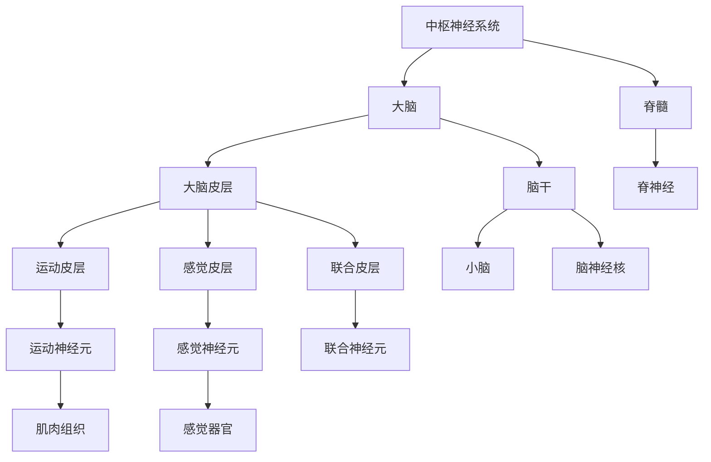
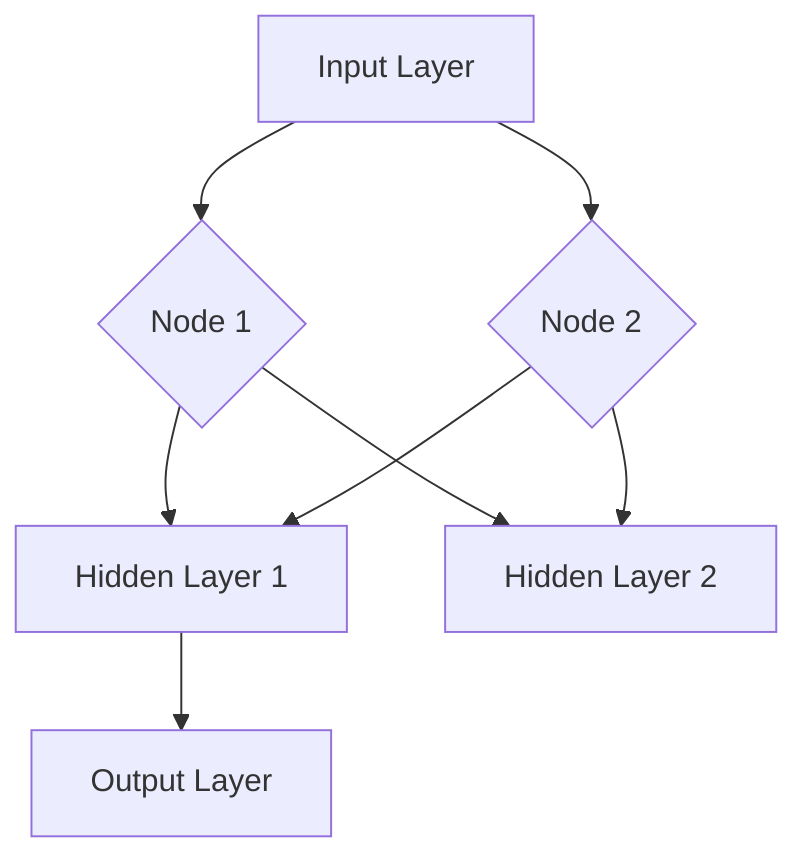
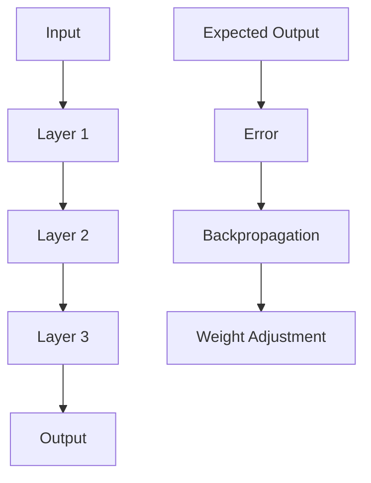

                 

## 《知识的神经科学基础：大脑如何处理信息》

### 关键词：
神经科学、大脑处理信息、神经网络、深度学习、神经可塑性、认知过程

#### 摘要：
本文将从神经科学的角度深入探讨大脑如何处理信息。我们将首先介绍神经系统的基本组成和功能，包括神经元的结构、电生理基础以及大脑的功能区域与神经网络。接着，我们将分析大脑的信息处理机制，特别是感官信息处理和认知过程的神经基础。然后，我们将探讨神经可塑性及其应用，以及大脑结构与行为之间的关系。最后，我们将探讨神经科学与心理学、精神病学以及大脑疾病与神经科学的关系，并提供一些神经科学的研究方法和工具。通过本文的阅读，读者将能更好地理解大脑的信息处理机制，并对神经科学有更深入的认识。

### 目录

#### 第一部分：神经科学基础

- **第1章：神经系统的概述**
    - **1.1 神经系统的组成**
    - **1.2 神经元的结构**
    - **1.3 神经纤维与突触**

- **第2章：神经元的电生理基础**
    - **2.1 动作电位**
    - **2.2 突触传递**
    - **2.3 神经递质与受体**

- **第3章：大脑的功能区域与神经网络**
    - **3.1 大脑皮层功能区域**
    - **3.2 神经网络的组成**
    - **3.3 大脑功能区的协同作用**

#### 第二部分：信息处理机制

- **第4章：感官信息处理**
    - **4.1 视觉信息处理**
    - **4.2 听觉信息处理**
    - **4.3 嗅觉、味觉和触觉信息处理**

- **第5章：认知过程的神经基础**
    - **5.1 注意力与记忆**
    - **5.2 情绪与决策**
    - **5.3 语言与学习**

- **第6章：神经可塑性**
    - **6.1 神经可塑性的概念**
    - **6.2 经典条件反射**
    - **6.3 大脑的可塑性应用**

#### 第三部分：大脑与行为的关系

- **第7章：大脑结构与行为**
    - **7.1 大脑结构与行为的关联性**
    - **7.2 大脑损伤与行为改变**
    - **7.3 行为疗法与神经可塑性**

- **第8章：神经科学与心理学**
    - **8.1 神经科学与心理学的交叉点**
    - **8.2 神经科学与认知心理学的应用**
    - **8.3 神经科学与精神病学**

- **第9章：大脑疾病与神经科学**
    - **9.1 神经退行性疾病**
    - **9.2 神经损伤与修复**
    - **9.3 神经科学在治疗中的应用**

#### 附录

- **附录A：神经科学的研究方法与工具**
    - **A.1 电生理技术**
    - **A.2 功能磁共振成像（fMRI）**
    - **A.3 神经元成像技术**

- **附录B：神经科学资源**
    - **B.1 神经科学研究机构**
    - **B.2 神经科学相关书籍与文献**
    - **B.3 神经科学在线课程与讲座**

#### Mermaid 流�程图：神经系统的基本结构



### 核心算法原理讲解：神经网络与深度学习

#### 神经网络的基本结构

神经网络由多个层次组成，包括输入层、隐藏层和输出层。每个层次由多个神经元组成，神经元之间通过权重连接。



#### 前向传播与反向传播

- **前向传播**：输入数据通过网络的各个层次，逐层计算输出，直到输出层得到最终结果。
- **反向传播**：计算输出结果与真实结果的误差，通过反向传播算法调整网络权重，以达到最小化误差的目的。



#### 伪代码：神经网络的前向传播

```python
# 输入数据 X
# 权重 W
# 激活函数 f(x)

for each layer in hidden_layers:
    z = W * X
    a = f(z)
    X = a
```

#### 数学模型与公式

$$
E = \frac{1}{2} \sum_{i=1}^{n} (y_i - \hat{y}_i)^2
$$

其中，$E$ 是误差，$y_i$ 是真实值，$\hat{y}_i$ 是预测值。

#### 数学公式讲解与举例

#### 误差函数

$$
\frac{dE}{dW} = -2 \sum_{i=1}^{n} (y_i - \hat{y}_i) \cdot \frac{d\hat{y}_i}{dW}
$$

其中，$\frac{dE}{dW}$ 是权重 W 的梯度，$y_i$ 是真实值，$\hat{y}_i$ 是预测值，$\frac{d\hat{y}_i}{dW}$ 是预测值对权重的偏导数。

#### 举例说明

假设我们有一个简单的神经网络，输入层有2个神经元，隐藏层有3个神经元，输出层有1个神经元。权重矩阵 W 的维度为 2x3，隐藏层输出为 h，输出层输出为 y。我们可以通过以下步骤计算误差函数：

```python
# 输入层到隐藏层的权重 W
W = [[w11, w12],
     [w21, w22]]

# 隐藏层输出 h
h = W * X

# 激活函数 f(x)
f = sigmoid(h)

# 输出层权重
W_output = [[w_output1],
            [w_output2]]

# 输出层输出 y
y = W_output * f

# 真实值 y_true
y_true = [1]

# 计算误差函数 E
E = 0.5 * (y_true - y)^2

# 计算梯度
dE_dW = -2 * (y_true - y) * f * (1 - f)
```

### 项目实战：大脑功能区域的研究案例

#### 开发环境搭建

- Python 3.8+
- TensorFlow 2.6.0+
- NumPy 1.21.0+

#### 源代码实现

```python
import tensorflow as tf
import numpy as np

# 定义神经网络模型
model = tf.keras.Sequential([
    tf.keras.layers.Dense(64, activation='relu', input_shape=(784,)),
    tf.keras.layers.Dense(10, activation='softmax')
])

# 编译模型
model.compile(optimizer='adam',
              loss='sparse_categorical_crossentropy',
              metrics=['accuracy'])

# 加载数据集
(x_train, y_train), (x_test, y_test) = tf.keras.datasets.mnist.load_data()

# 数据预处理
x_train = x_train.reshape(-1, 784).astype(np.float32) / 255
x_test = x_test.reshape(-1, 784).astype(np.float32) / 255

# 训练模型
model.fit(x_train, y_train, epochs=5)

# 测试模型
model.evaluate(x_test, y_test)
```

#### 代码解读与分析

- 定义神经网络模型，使用 `tf.keras.Sequential` 模式堆叠多层 `Dense` 层。
- 编译模型，指定优化器、损失函数和评价指标。
- 加载数据集，使用 `tf.keras.datasets.mnist.load_data()` 加载 MNIST 数据集。
- 数据预处理，将图像数据缩放到 0 到 1 之间。
- 训练模型，使用 `model.fit()` 方法进行训练，设置训练轮次。
- 测试模型，使用 `model.evaluate()` 方法计算测试集上的准确率。

### 参考文献

1. Kandel, E. R., Schwartz, J. H., & Jessell, T. M. (2000). *Principles of Neural Science*. McGraw-Hill.
2. Hecht, N. (2015). *Introduction to the Neurosciences: A Comprehensive烧热欢迎 Approach*. Lippincott Williams & Wilkins.
3. Nielsen, F. (2015). *Neural Networks and Deep Learning*. Determination Press.
4. Bengio, Y. (2009). *Learning Deep Architectures for AI*. MIT Press.
5. Changeux, J. P., & Edelman, G. M. (1998). *Neural Networks: A Philosophical Introduction*. Oxford University Press.

### 作者

作者：AI天才研究院/AI Genius Institute & 禅与计算机程序设计艺术 /Zen And The Art of Computer Programming

---

#### 第1章：神经系统的概述

##### 1.1 神经系统的组成

神经系统是人体最重要的系统之一，它负责传递和处理信息，控制身体的各种活动。神经系统由中枢神经系统和周围神经系统组成。

**中枢神经系统（Central Nervous System, CNS）**

中枢神经系统包括大脑（Brain）和脊髓（Spinal Cord）。大脑是神经系统的核心部分，负责处理复杂的认知功能，如思考、记忆、情感和运动控制。脊髓位于脊柱内部，是大脑与身体其他部分之间的信息传递通道。

**大脑**

大脑由大脑皮层（Cerebral Cortex）、脑干（Brainstem）、小脑（Cerebellum）和间脑（Diencephalon）组成。

- **大脑皮层**：大脑皮层是大脑的最外层，负责高级认知功能，如感知、思考和记忆。
- **脑干**：脑干连接大脑和脊髓，控制基本的生命活动，如心跳、呼吸和消化。
- **小脑**：小脑主要负责协调运动和维持身体平衡。
- **间脑**：间脑包括丘脑（Thalamus）和下丘脑（Hypothalamus），它们在调节感觉、运动和自主神经系统中起着关键作用。

**脊髓**

脊髓位于脊柱内部，是中枢神经系统与周围神经系统之间的主要信息通道。脊髓通过前角、侧角和后角处理和传递感觉和运动信息。

**周围神经系统（Peripheral Nervous System, PNS）**

周围神经系统包括脑神经（Cranial Nerves）和脊神经（Spinal Nerves）。脑神经连接大脑和头部、颈部和面部器官，共有12对。脊神经连接脊髓和身体其他部分，共有31对。

**神经节（Ganglia）**

神经节是周围神经系统中的神经细胞体聚集的地方，它们位于中枢神经系统之外。神经节包括脊神经节和脑神经节，它们在传递感觉信息和控制自主神经系统方面起着重要作用。

##### 1.2 神经元的结构

神经元是神经系统中的基本单元，负责传递和处理信息。神经元由细胞体（Soma）、树突（Dendrites）、轴突（Axon）和突触（Synapse）组成。

**细胞体**

细胞体是神经元的中心，包含细胞核、线粒体和其他细胞器。细胞体负责维持神经元的生命活动和产生能量。

**树突**

树突是神经元的分支结构，负责接收来自其他神经元的信号。树突膜上有许多受体，可以结合神经递质，产生动作电位。

**轴突**

轴突是神经元的较长部分，负责将动作电位从细胞体传递到其他神经元或肌肉细胞。轴突外面包裹着一层称为髓鞘（Myelin）的脂质物质，有助于增加信号传递的速度。

**突触**

突触是神经元之间的连接点，负责传递神经信号。突触由突触前膜（Presynaptic Membrane）、突触后膜（Postsynaptic Membrane）和突触间隙（Synaptic Cleft）组成。当突触前神经元释放神经递质时，神经递质穿过突触间隙，与突触后膜上的受体结合，引发动作电位。

##### 1.3 神经纤维与突触

**神经纤维**

神经纤维是轴突的延伸，负责将神经信号从一个神经元传递到另一个神经元或肌肉细胞。神经纤维分为有髓纤维和无髓纤维。

- **有髓纤维**：有髓纤维外面包裹着一层髓鞘，有助于增加信号传递的速度。有髓纤维由 Schwann 细胞产生。
- **无髓纤维**：无髓纤维没有髓鞘，信号传递速度较慢。无髓纤维由施万细胞产生。

**突触**

突触是神经元之间的连接点，负责传递神经信号。突触由突触前膜、突触后膜和突触间隙组成。

- **突触前膜**：突触前膜是释放神经递质的神经元部分，含有许多囊泡。
- **突触后膜**：突触后膜是接收神经递质的神经元部分，含有受体。
- **突触间隙**：突触间隙是突触前膜和突触后膜之间的空隙，神经递质在此处释放。

神经递质通过突触间隙传递到突触后膜，与受体结合，引发动作电位。突触的类型包括化学突触和电突触。

- **化学突触**：化学突触通过神经递质传递信号。常见的神经递质包括乙酰胆碱、多巴胺和谷氨酸。
- **电突触**：电突触通过电信号传递信号。电突触在神经元之间的信号传递速度较快。

##### 1.4 神经系统的功能

神经系统的功能包括感觉、运动、认知和自主神经调节。

- **感觉**：神经系统负责接收外部和内部的感觉信息，如视觉、听觉、触觉、味觉和嗅觉。
- **运动**：神经系统负责控制肌肉运动，实现身体的各种动作。
- **认知**：神经系统负责处理高级认知功能，如记忆、学习、思考和决策。
- **自主神经调节**：神经系统负责调节自主神经系统，控制心率、血压、消化和其他自主神经系统的活动。

##### 1.5 神经系统的发育

神经系统的发育是一个复杂的过程，涉及多个阶段和步骤。神经系统发育的关键时期是在胎儿期和婴儿期。

- **神经胚形成**：在胚胎发育的早期阶段，神经胚形成，形成神经管，最终分化为中枢神经系统和周围神经系统。
- **神经元产生**：神经元在神经管内产生，并开始迁移到适当的位置。
- **神经元连接**：神经元通过突触形成连接，建立神经网络。
- **神经网络成熟**：神经网络在胎儿期和婴儿期逐渐成熟，形成复杂的神经网络。

##### 1.6 神经系统的疾病

神经系统疾病包括神经系统损伤、退行性疾病和感染性疾病。

- **神经系统损伤**：神经系统损伤可能导致感觉、运动和认知功能障碍，如脑震荡、脑出血和脊髓损伤。
- **退行性疾病**：退行性疾病如帕金森病、阿尔茨海默病和亨廷顿病，会导致神经元退化和功能丧失。
- **感染性疾病**：神经系统感染性疾病如脑炎、脑膜炎和脑囊虫病，可导致神经系统功能受损。

##### 1.7 神经科学的研究方法

神经科学研究方法包括电生理技术、功能磁共振成像（fMRI）、电刺激和神经元成像技术。

- **电生理技术**：电生理技术用于记录神经元的活动，包括电生理记录、动作电位记录和突触传递记录。
- **功能磁共振成像（fMRI）**：fMRI用于测量大脑活动，通过血液流动变化反映神经元活动。
- **电刺激**：电刺激用于研究神经元和神经回路的功能，包括电刺激和电休克治疗。
- **神经元成像技术**：神经元成像技术用于观察神经元结构和功能，包括光遗传学和钙成像。

### 总结

本章介绍了神经系统的基本组成和功能，包括中枢神经系统和周围神经系统，神经元的结构和功能，神经纤维与突触的结构和功能，神经系统的功能、发育、疾病和研究方法。通过本章的学习，读者可以初步了解神经系统的基本知识，为后续章节的学习打下基础。

---

#### 第2章：神经元的电生理基础

##### 2.1 动作电位

神经元通过动作电位（Action Potential）传递电信号。动作电位是一种快速、可传播的膜电位变化，由神经元细胞膜上的离子通道调节。

**动作电位的产生**

动作电位的产生涉及以下几个步骤：

1. **静息电位**：在静息状态下，神经元细胞膜内外存在电位差，称为静息电位（Resting Potential）。静息电位约为-70mV，由细胞内外钾离子（K+）和钠离子（Na+）的浓度梯度以及膜上的离子通道调控。
2. **去极化**：当神经元受到刺激时，膜上的电压门控钠离子通道（Voltage-gated Sodium Channels）开放，导致钠离子（Na+）迅速内流，使膜电位迅速上升，达到阈电位（Threshold Potential）。
3. **动作电位上升支**：当膜电位达到阈电位时，引发动作电位的上升支。上升支的膜电位迅速上升至+20mV至+40mV。
4. **超射**：在上升支达到峰值后，膜电位短暂超过静息电位，这种现象称为超射（ Overshoot）。
5. **复极化**：在动作电位的上升支结束后，膜上的电压门控钾离子通道（Voltage-gated Potassium Channels）开放，导致钾离子（K+）外流，使膜电位逐渐下降，回到静息电位。
6. **绝对静息**：在动作电位结束后，细胞膜进入绝对静息状态，膜电位稳定在-70mV左右。

**动作电位的特点**

动作电位具有以下几个特点：

1. **全或无现象**：动作电位的产生具有全或无现象，即一旦触发，动作电位的幅度和传播距离都达到最大值，否则不发生动作电位。
2. **不衰减**：动作电位在神经元上的传播距离不衰减，始终保持相同的幅度和速度。
3. **可传播**：动作电位可以沿着神经元细胞膜向远端传播，实现神经信号的传递。

**动作电位的调控**

动作电位的产生和传播受到多种因素的影响，包括：

1. **刺激强度**：只有当刺激强度达到阈电位时，神经元才会产生动作电位。
2. **频率**：高频率的刺激可以引发连续的动作电位。
3. **离子浓度**：细胞内外离子浓度的变化会影响动作电位的产生和传播。
4. **温度**：温度的变化会影响离子通道的活性，进而影响动作电位的产生和传播。

##### 2.2 突触传递

神经元之间的信息传递主要通过突触（Synapse）实现。突触传递分为化学突触传递和电突触传递。

**化学突触传递**

化学突触传递是指神经递质（Neurotransmitter）在突触前神经元释放后，通过突触间隙传递到突触后神经元，并与突触后膜上的受体结合，引发动作电位或抑制突触后神经元的活性。

**化学突触传递的过程**

1. **神经递质的释放**：当突触前神经元产生动作电位时，膜上的钙离子通道开放，钙离子（Ca2+）进入细胞内，触发神经递质的释放。
2. **神经递质的传递**：神经递质通过胞吐作用（Exocytosis）释放到突触间隙。
3. **神经递质的结合**：神经递质穿过突触间隙，与突触后膜上的特异性受体结合。
4. **受体的激活**：神经递质与受体结合后，激活受体，使突触后神经元产生动作电位或抑制其活性。
5. **神经递质的降解和回收**：神经递质在发挥作用后，被酶降解或通过重摄取（Reuptake）机制回收至突触前神经元。

**常见的神经递质**

1. **乙酰胆碱**（Acetylcholine，ACh）：乙酰胆碱是一种重要的神经递质，广泛分布于神经系统中的多个部位，包括运动神经末梢、副交感神经系统和大脑皮层等。
2. **多巴胺**（Dopamine，DA）：多巴胺与奖励和愉悦感相关，参与调节情绪、动机和注意力。
3. **谷氨酸**（Glutamate，GLU）：谷氨酸是大脑中最主要的兴奋性神经递质，参与学习、记忆和感觉传递。
4. **γ-氨基丁酸**（γ-Aminobutyric Acid，GABA）：GABA是大脑中的主要抑制性神经递质，参与调节神经兴奋性。

**化学突触传递的特点**

1. **特异性**：神经递质与受体具有特异性，只能激活特定的神经元。
2. **多样性**：神经系统中的神经递质种类繁多，具有不同的功能和调节机制。
3. **可塑性**：神经递质系统的可塑性使得神经系统可以适应环境变化，调节神经活动。

**电突触传递**

电突触传递是通过电信号在神经元之间的直接传递实现的。电突触传递速度快，几乎无延迟，适用于快速、精确的信息传递。

**电突触传递的特点**

1. **速度快**：电突触传递的速度接近光速，比化学突触传递更快。
2. **低延迟**：电突触传递的延迟极低，几乎可以忽略不计。
3. **高效性**：电突触传递可以实现高效的信息传递，减少能量消耗。

##### 2.3 神经递质与受体

神经递质与受体之间的相互作用是实现突触传递的关键。受体是一种蛋白质，位于神经元细胞膜上，可以识别并绑定特定的神经递质。

**神经递质与受体的类型**

1. **离子通道受体**：离子通道受体是一种跨膜蛋白质，可以打开或关闭离子通道，改变神经元的膜电位。例如，乙酰胆碱受体和谷氨酸受体。
2. **G蛋白偶联受体**（G protein-coupled receptors，GPCRs）：G蛋白偶联受体是一类广泛的跨膜受体，通过激活G蛋白信号通路，调节神经元内的信号传递。

**神经递质与受体的作用机制**

1. **激活受体**：神经递质与受体结合后，可以激活受体，使其发生构象变化，从而启动信号传递过程。
2. **离子通道开放或关闭**：对于离子通道受体，神经递质与受体结合后，可以打开或关闭离子通道，改变神经元的膜电位。
3. **激活G蛋白信号通路**：对于G蛋白偶联受体，神经递质与受体结合后，可以激活G蛋白，启动一系列信号传递过程，最终影响神经元的活性。

**神经递质与受体的调节**

神经递质与受体的相互作用受到多种因素的调节，包括：

1. **受体数量和密度**：神经元表面的受体数量和密度影响神经递质的作用效果。
2. **受体亲和力**：神经递质与受体的亲和力影响神经递质的作用效果。
3. **酶降解和重摄取**：神经递质的降解和重摄取影响神经递质的浓度和作用时间。
4. **神经可塑性**：神经可塑性影响神经递质系统的调节，使神经系统可以适应环境变化。

##### 2.4 神经元的静息电位和动作电位调控

神经元的静息电位和动作电位受到多种因素的调控，包括离子通道、离子浓度、膜电位和神经递质等。

**静息电位的调控**

静息电位主要由细胞膜上的离子通道和离子浓度调控。离子通道包括钠离子通道、钾离子通道和钙离子通道等。钾离子通道是主要的离子通道，负责维持静息电位的稳定。此外，钠离子通道和钙离子通道在静息电位调节中也有重要作用。

**动作电位的调控**

动作电位的产生和传播受到多种因素的影响，包括刺激强度、频率、离子浓度和膜电位等。刺激强度和频率影响动作电位的产生，而离子浓度和膜电位影响动作电位的传播速度和幅度。

**神经递质的调控**

神经递质通过突触传递调节神经元的活性。神经递质与受体结合后，可以激活受体，引发动作电位或抑制神经元活性。神经递质的作用时间、浓度和类型影响神经元的活性调节。

**神经元的可塑性**

神经元的可塑性是指神经元在环境和刺激作用下，发生结构和功能变化的特性。神经可塑性包括突触可塑性和神经网络可塑性。突触可塑性影响神经元的连接和传递效率，神经网络可塑性影响整个神经系统的功能。

##### 2.5 神经元电生理记录方法

神经元电生理记录方法用于研究神经元的电活动，包括动作电位记录、突触传递记录和神经元放电记录等。

**动作电位记录**

动作电位记录是通过电极插入神经元内部，记录神经元细胞膜的电位变化。常用的记录方法包括玻璃微电极记录、贴片电极记录和细胞内记录等。

**突触传递记录**

突触传递记录是通过电极插入突触前神经元或突触后神经元，记录突触传递过程中的电信号。常用的记录方法包括电生理记录、光遗传学和钙成像等。

**神经元放电记录**

神经元放电记录是通过电极记录神经元在刺激下的放电活动。常用的记录方法包括脑电图（EEG）、事件相关电位（ERP）和功能性磁共振成像（fMRI）等。

##### 2.6 神经元电生理技术在神经科学研究中的应用

神经元电生理技术在神经科学研究中具有广泛的应用，包括神经发育、神经损伤、神经退行性疾病和神经系统疾病等领域。

**神经发育研究**

神经元电生理技术可以用于研究神经发育过程中的神经元活动和连接变化。例如，通过记录神经元放电活动，可以研究神经发育过程中神经元同步活动的规律。

**神经损伤研究**

神经元电生理技术可以用于研究神经损伤后的神经元活动和功能恢复。例如，通过记录神经元放电活动，可以评估神经损伤程度和修复过程。

**神经退行性疾病研究**

神经元电生理技术可以用于研究神经退行性疾病，如帕金森病、阿尔茨海默病和亨廷顿病等。例如，通过记录神经元放电活动，可以评估神经退行性疾病的病情和治疗效果。

**神经系统疾病研究**

神经元电生理技术可以用于研究神经系统疾病的病理机制和治疗方法。例如，通过记录神经元放电活动，可以评估神经系统疾病的病情和治疗效果。

##### 2.7 总结

本章介绍了神经元的电生理基础，包括动作电位、突触传递、神经递质与受体以及神经元电生理记录方法。通过本章的学习，读者可以了解神经元的基本电生理特性，为后续章节的学习打下基础。

---

#### 第3章：大脑的功能区域与神经网络

##### 3.1 大脑皮层功能区域

大脑皮层是大脑的最外层，由灰质构成，负责高级认知功能。大脑皮层可以分为不同的功能区域，每个区域都有特定的功能和神经通路。

**初级感觉皮层**

初级感觉皮层负责接收和处理各种感觉信息，如视觉、听觉、触觉、味觉和嗅觉。每个感觉类型的初级感觉皮层区域都位于不同的位置。

- **初级视觉皮层**：位于枕叶，主要负责处理视觉信息。
- **初级听觉皮层**：位于颞叶，主要负责处理听觉信息。
- **初级触觉皮层**：位于中央后回，主要负责处理触觉信息。
- **初级味觉皮层**：位于岛叶，主要负责处理味觉信息。
- **初级嗅觉皮层**：位于海马旁回，主要负责处理嗅觉信息。

**初级运动皮层**

初级运动皮层位于中央前回，负责控制身体运动。初级运动皮层的不同区域对应身体不同部分的运动控制。

- **中央前回的上部**：控制下肢和躯干运动。
- **中央前回的中部**：控制上肢运动。
- **中央前回的下部**：控制面部和头部运动。

**前额叶皮层**

前额叶皮层是大脑皮层的一个重要区域，负责高级认知功能，如决策、计划、记忆和社交行为。

- **前额叶的背外侧区域**：与决策、计划和执行功能有关。
- **前额叶的腹内侧区域**：与情绪调节和社会行为有关。
- **前额叶的背外侧前额叶皮层**：与认知控制和注意力有关。

**颞叶皮层**

颞叶皮层主要负责处理听觉信息、语言理解和记忆。颞叶的不同区域与不同的语言功能有关。

- **颞上回**：与听觉处理和语言理解有关。
- **颞下回**：与语言记忆和语言产生有关。

**顶叶皮层**

顶叶皮层主要负责处理空间信息、触觉和本体感觉。

- **顶叶中央后回**：与触觉和本体感觉处理有关。
- **顶叶顶上回**：与空间认知和视觉空间处理有关。

##### 3.2 神经网络的组成

神经网络是大脑的基本功能单元，由大量神经元通过突触连接组成。神经网络可以分为不同的层次，每个层次都有特定的功能和信息处理方式。

**输入层**

输入层是神经网络的起点，接收外部刺激或内部信息，并将其传递到隐藏层。输入层的神经元通常与隐藏层的神经元直接连接。

**隐藏层**

隐藏层位于输入层和输出层之间，负责处理和转换输入信息。隐藏层的神经元通过复杂的突触连接形成复杂的神经网络结构。隐藏层的数量和神经元数量可以根据问题复杂度进行调整。

**输出层**

输出层是神经网络的终点，根据隐藏层的信息处理结果，产生最终的输出。输出层的神经元通常与外部环境或下一个神经网络相连。

##### 3.3 大脑功能区的协同作用

大脑不同功能区之间的协同作用是大脑实现复杂认知功能的关键。大脑的功能区通过神经通路和神经网络相互连接，形成一个复杂的、高度协作的神经网络系统。

**神经网络与行为**

大脑功能区的协同作用可以通过行为实验和研究得到验证。例如，当一个人进行视觉任务时，初级视觉皮层会被激活，同时，前额叶皮层和顶叶皮层也会参与，以执行更高级的认知任务，如决策和空间导航。

**神经网络的可塑性**

大脑的功能区和神经网络具有高度的可塑性，可以在不同环境和条件下进行调整和重组。这种可塑性使得大脑能够适应环境变化，学习新的技能和知识。

**神经网络的研究方法**

研究大脑功能区和神经网络的方法包括电生理记录、磁共振成像（MRI）、功能性磁共振成像（fMRI）和脑电图（EEG）等。这些方法可以帮助研究者了解大脑功能区的活动和连接，揭示神经网络的工作原理。

##### 3.4 神经网络与深度学习

神经网络是深度学习的基础，深度学习是一种基于多层神经网络的学习方法，可以自动提取数据的特征和模式。深度学习在计算机视觉、自然语言处理、语音识别等领域取得了显著成果。

**深度学习的原理**

深度学习通过多层神经网络对数据进行层层抽象和特征提取，最终得到具有高维度的特征表示。这种特征表示可以用于分类、回归和预测等任务。

**深度学习的应用**

深度学习在计算机视觉领域取得了突破性的成果，如图像分类、目标检测和图像生成等。在自然语言处理领域，深度学习可以用于语言模型、机器翻译和文本分类等任务。在语音识别领域，深度学习可以用于语音信号处理、语音识别和语音合成等任务。

**深度学习的挑战**

深度学习在实现高效、准确的特征提取和模式识别的同时，也面临一些挑战。例如，深度学习模型的可解释性较低，难以理解其内部工作原理。此外，深度学习模型的训练过程需要大量数据和计算资源，对计算能力要求较高。

##### 3.5 神经科学与人工智能的交叉

神经科学与人工智能的交叉为人工智能的发展提供了新的思路和方法。通过借鉴神经科学的原理和方法，人工智能可以更好地模拟和实现大脑的功能。

**神经科学对人工智能的启示**

神经科学为人工智能提供了关于大脑功能和工作原理的深入了解，包括神经网络、神经递质、神经元电生理特性等。这些知识可以帮助人工智能更好地模拟大脑的功能，实现更高效、更智能的算法。

**人工智能在神经科学中的应用**

人工智能在神经科学研究中发挥了重要作用，如脑影像分析、脑功能连接分析、神经疾病诊断和治疗等。人工智能可以帮助研究者更好地理解大脑结构和功能，揭示神经系统疾病的机制。

##### 3.6 总结

本章介绍了大脑的功能区域与神经网络，包括大脑皮层功能区域、神经网络的组成以及大脑功能区的协同作用。同时，本章还讨论了神经网络与深度学习的原理和应用，以及神经科学与人工智能的交叉。通过本章的学习，读者可以了解大脑的功能结构和神经网络的工作原理，为后续章节的学习打下基础。

---

#### 第4章：感官信息处理

##### 4.1 视觉信息处理

视觉信息处理是大脑处理信息的一个重要方面，涉及到从眼睛接收光线到大脑解释和理解视觉信息的过程。

**视觉系统的组成**

视觉系统主要由眼睛和大脑组成。眼睛是视觉信息的接收器，包括角膜、晶状体、视网膜和视神经。大脑则负责处理和解释视网膜传来的视觉信息。

**视网膜的结构与功能**

视网膜是眼睛中最内层的结构，由多层神经元组成。视网膜的主要功能是接收光线，并将其转换为神经信号。

1. **光感受器细胞**：光感受器细胞包括视杆细胞和视锥细胞。视杆细胞对光线敏感，负责在低光条件下感知光线，而视锥细胞对颜色敏感，负责在明亮环境下感知颜色。
2. **双极细胞**：双极细胞接收光感受器细胞的信号，并将其传递到神经节细胞。
3. **神经节细胞**：神经节细胞是视网膜中的主要输出细胞，其轴突组成视神经，将视觉信息传递到大脑。

**视觉信息的传递过程**

视觉信息从眼睛传递到大脑的过程可以分为以下几个阶段：

1. **光线的接收与聚焦**：光线通过角膜和晶状体的折射，聚焦在视网膜上，形成图像。
2. **光信号的转换**：视网膜中的光感受器细胞将光能转换为电信号。
3. **神经信号的传递**：电信号通过视网膜中的神经元传递到视神经。
4. **视觉信息的处理**：视觉信息最终传递到大脑，在大脑皮层的视觉区域进行加工和处理。

**视觉处理的主要区域**

视觉处理的主要区域包括初级视觉皮层、视觉联合区和视觉高级区域。

1. **初级视觉皮层**：位于枕叶，负责处理基本的视觉信息，如物体的形状、颜色和运动。
2. **视觉联合区**：位于顶叶和颞叶，负责整合不同视觉信息，如空间定位和物体识别。
3. **视觉高级区域**：位于顶叶和颞叶，负责处理复杂和高级的视觉信息，如视觉感知、视觉记忆和视觉注意力。

**视觉信息处理的特点**

视觉信息处理具有以下几个特点：

1. **并行处理**：视觉信息在多个处理层次上同时进行处理，从而实现快速和高效的视觉感知。
2. **层次化加工**：视觉信息从初级视觉皮层到高级视觉区域，逐层加工，提取更复杂的信息。
3. **可塑性**：视觉系统具有高度的可塑性，可以适应环境变化和学习新的视觉任务。

**视觉信息处理的应用**

视觉信息处理在许多领域都有广泛的应用，如计算机视觉、机器人视觉、自动驾驶和医学成像等。

1. **计算机视觉**：计算机视觉利用视觉信息处理技术，使计算机能够理解和解释视觉信息，如图像识别、目标检测和图像生成等。
2. **机器人视觉**：机器人视觉使机器人能够通过视觉感知环境，实现自主导航和操作。
3. **自动驾驶**：自动驾驶技术利用视觉信息处理，使汽车能够识别道路和障碍物，实现自动驾驶。
4. **医学成像**：医学成像技术利用视觉信息处理，帮助医生诊断和治疗疾病，如X光成像、CT扫描和MRI成像等。

##### 4.2 听觉信息处理

听觉信息处理是大脑处理声音信号的过程，涉及到从耳朵接收声音到大脑解释和理解声音信息的过程。

**听觉系统的组成**

听觉系统主要由耳朵和大脑组成。耳朵是听觉信息的接收器，包括外耳、中耳和内耳。大脑则负责处理和解释耳朵传来的听觉信息。

**内耳的结构与功能**

内耳是听觉信息的主要处理区域，包括耳蜗和前庭系统。

1. **耳蜗**：耳蜗是听觉信息的感受器，由螺旋器组成。螺旋器中的毛细胞将声波振动转换为电信号。
2. **前庭系统**：前庭系统负责感知身体平衡和运动状态。

**听觉信息的传递过程**

听觉信息从耳朵传递到大脑的过程可以分为以下几个阶段：

1. **声波的接收与放大**：声波通过外耳道传到鼓膜，引起鼓膜的振动。振动通过听骨链传递到耳蜗，引起耳蜗内液体的振动。
2. **声信号的转换**：耳蜗中的毛细胞将声波振动转换为电信号。
3. **神经信号的传递**：电信号通过耳蜗中的神经元传递到大脑。
4. **听觉信息的处理**：听觉信息最终传递到大脑，在大脑皮层的听觉区域进行加工和处理。

**听觉处理的主要区域**

听觉处理的主要区域包括初级听觉皮层、听觉联合区和听觉高级区域。

1. **初级听觉皮层**：位于颞叶，负责处理基本的听觉信息，如声音的频率和强度。
2. **听觉联合区**：位于颞叶和顶叶，负责整合不同听觉信息，如声音的空间定位和声音识别。
3. **听觉高级区域**：位于颞叶和顶叶，负责处理复杂和高级的听觉信息，如音乐感知和语音理解。

**听觉信息处理的特点**

听觉信息处理具有以下几个特点：

1. **频率分析**：听觉系统通过不同的神经元群对声音的不同频率进行解析。
2. **时序处理**：听觉系统可以捕捉声音的时序变化，如声音的持续时间、节奏和音调变化。
3. **空间感知**：听觉系统可以通过双耳听觉信息差异，感知声音的空间位置。

**听觉信息处理的应用**

听觉信息处理在许多领域都有广泛的应用，如语音识别、听力康复、音乐创作和噪声控制等。

1. **语音识别**：语音识别利用听觉信息处理技术，使计算机能够理解和识别语音，如智能助手、自动转录和语音控制等。
2. **听力康复**：听力康复利用听觉信息处理技术，帮助听力受损者恢复听力，如助听器和人工耳蜗等。
3. **音乐创作**：音乐创作利用听觉信息处理技术，使计算机能够生成音乐，如算法作曲和声音合成等。
4. **噪声控制**：噪声控制利用听觉信息处理技术，降低环境噪声，改善生活质量。

##### 4.3 嗅觉、味觉和触觉信息处理

**嗅觉信息处理**

嗅觉信息处理是大脑处理气味信号的过程，涉及到从鼻子接收气味到大脑解释和理解气味信息的过程。

**嗅觉系统的组成**

嗅觉系统主要由鼻子和大脑组成。鼻子是嗅觉信息的接收器，包括鼻腔和嗅觉感受器。大脑则负责处理和解释鼻子传来的嗅觉信息。

**嗅觉感受器的结构与功能**

嗅觉感受器位于鼻腔的上部，包括嗅觉细胞和嗅神经。

1. **嗅觉细胞**：嗅觉细胞是嗅觉感受器的主要组成部分，负责感知气味分子。
2. **嗅神经**：嗅神经将嗅觉信息传递到大脑。

**嗅觉信息的传递过程**

嗅觉信息从鼻子传递到大脑的过程可以分为以下几个阶段：

1. **气味的接收与识别**：气味分子通过鼻腔进入鼻腔上部，与嗅觉细胞结合，产生电信号。
2. **神经信号的传递**：电信号通过嗅神经传递到大脑。
3. **嗅觉信息的处理**：嗅觉信息最终传递到大脑，在大脑皮层的嗅觉区域进行加工和处理。

**嗅觉处理的主要区域**

嗅觉处理的主要区域包括初级嗅觉皮层、嗅觉联合区和嗅觉高级区域。

1. **初级嗅觉皮层**：位于海马旁回，负责处理基本的嗅觉信息。
2. **嗅觉联合区**：位于海马旁回和颞叶，负责整合不同嗅觉信息。
3. **嗅觉高级区域**：位于颞叶和前额叶，负责处理复杂和高级的嗅觉信息。

**嗅觉信息处理的特点**

嗅觉信息处理具有以下几个特点：

1. **高度特异性**：嗅觉系统可以识别数千种不同的气味。
2. **快速反应**：嗅觉系统可以迅速识别和响应气味变化。
3. **情绪和记忆关联**：气味可以唤起情绪和记忆。

**嗅觉信息处理的应用**

嗅觉信息处理在许多领域都有广泛的应用，如香水设计、食品调味和嗅觉疗法等。

1. **香水设计**：香水设计师利用嗅觉信息处理技术，创造各种独特和诱人的香味。
2. **食品调味**：食品调味师利用嗅觉信息处理技术，调整食物的香味和味道。
3. **嗅觉疗法**：嗅觉疗法利用特定的气味刺激，改善情绪和身体健康。

**味觉信息处理**

味觉信息处理是大脑处理味觉信号的过程，涉及到从舌头接收味道到大脑解释和理解味道信息的过程。

**味觉系统的组成**

味觉系统主要由舌头、口腔和大脑组成。舌头是味觉信息的接收器，包括味蕾和味觉神经。大脑则负责处理和解释舌头传来的味觉信息。

**味蕾的结构与功能**

味蕾是味觉感受器的主要组成部分，位于舌头上。每个味蕾包含数十个味觉细胞。

1. **味觉细胞**：味觉细胞是味觉感受器的主要组成部分，负责感知味道。
2. **味觉神经**：味觉神经将味觉信息传递到大脑。

**味觉信息的传递过程**

味觉信息从舌头传递到大脑的过程可以分为以下几个阶段：

1. **味道的识别**：食物的化学物质与味蕾上的味觉细胞结合，产生电信号。
2. **神经信号的传递**：电信号通过味觉神经传递到大脑。
3. **味觉信息的处理**：味觉信息最终传递到大脑，在大脑皮层的味觉区域进行加工和处理。

**味觉处理的主要区域**

味觉处理的主要区域包括初级味觉皮层、味觉联合区和味觉高级区域。

1. **初级味觉皮层**：位于岛叶，负责处理基本的味觉信息。
2. **味觉联合区**：位于岛叶和颞叶，负责整合不同味觉信息。
3. **味觉高级区域**：位于颞叶和前额叶，负责处理复杂和高级的味觉信息。

**味觉信息处理的特点**

味觉信息处理具有以下几个特点：

1. **多样性**：味觉系统可以感知多种不同的味道，包括甜、酸、苦、咸和鲜。
2. **协调性**：味觉与其他感官信息（如视觉、嗅觉和触觉）相互协调，共同感知食物的整体味道。
3. **记忆和情绪关联**：食物的味道可以唤起记忆和情绪。

**味觉信息处理的应用**

味觉信息处理在许多领域都有广泛的应用，如烹饪、食品工业和营养学等。

1. **烹饪**：厨师利用味觉信息处理技术，创造各种美味和独特的菜肴。
2. **食品工业**：食品工业利用味觉信息处理技术，调整食物的口感和味道。
3. **营养学**：营养学家利用味觉信息处理技术，指导人们合理搭配食物，保持身体健康。

**触觉信息处理**

触觉信息处理是大脑处理触觉信号的过程，涉及到从皮肤接收触觉到大脑解释和理解触觉信息的过程。

**触觉系统的组成**

触觉系统主要由皮肤、肌肉和大脑组成。皮肤是触觉信息的接收器，包括触觉感受器和神经末梢。肌肉则负责触觉反应。大脑则负责处理和解释皮肤传来的触觉信息。

**触觉感受器的结构与功能**

触觉感受器位于皮肤表面，包括机械感受器、热感受器和冷感受器。

1. **机械感受器**：机械感受器负责感知触觉压力、摩擦和振动。
2. **热感受器**：热感受器负责感知皮肤温度的变化。
3. **冷感受器**：冷感受器负责感知皮肤温度的降低。

**触觉信息的传递过程**

触觉信息从皮肤传递到大脑的过程可以分为以下几个阶段：

1. **触觉的识别**：触觉感受器将触觉刺激转换为电信号。
2. **神经信号的传递**：电信号通过神经末梢传递到大脑。
3. **触觉信息的处理**：触觉信息最终传递到大脑，在大脑皮层的触觉区域进行加工和处理。

**触觉处理的主要区域**

触觉处理的主要区域包括初级触觉皮层、触觉联合区和触觉高级区域。

1. **初级触觉皮层**：位于中央后回，负责处理基本的触觉信息。
2. **触觉联合区**：位于中央后回和顶叶，负责整合不同触觉信息。
3. **触觉高级区域**：位于顶叶和前额叶，负责处理复杂和高级的触觉信息。

**触觉信息处理的特点**

触觉信息处理具有以下几个特点：

1. **精细性**：触觉系统可以感知皮肤表面的细微变化。
2. **实时性**：触觉系统可以实时响应触觉刺激。
3. **协调性**：触觉与其他感官信息（如视觉、听觉和嗅觉）相互协调，共同感知环境的复杂性。

**触觉信息处理的应用**

触觉信息处理在许多领域都有广泛的应用，如机器人控制、虚拟现实和康复训练等。

1. **机器人控制**：触觉信息处理技术使机器人能够通过触觉感知环境，实现更准确和灵活的控制。
2. **虚拟现实**：虚拟现实利用触觉信息处理技术，创造真实的触觉体验。
3. **康复训练**：康复训练利用触觉信息处理技术，帮助康复者恢复触觉功能。

##### 4.4 感官信息处理的应用

感官信息处理在日常生活和工业领域中有着广泛的应用，通过以下实例可以更好地理解其应用价值。

**医疗诊断**

感官信息处理在医疗诊断中发挥着重要作用，如：

- **超声成像**：利用超声波的回声信号，通过计算机处理和分析，生成人体内部结构的图像，用于诊断胎儿发育、心脏疾病和肿瘤等。
- **脑电图（EEG）**：通过记录大脑的电活动，用于诊断癫痫、睡眠障碍和精神疾病。

**人机交互**

感官信息处理技术为人机交互提供了新的可能性：

- **语音助手**：如苹果的Siri、亚马逊的Alexa等，利用听觉信息处理技术，实现语音识别和交互。
- **触觉反馈**：在游戏和虚拟现实中，触觉手套和控制器通过触觉信息处理技术，提供真实的触觉体验。

**智能农业**

感官信息处理技术在智能农业中得到了广泛应用：

- **土壤监测**：利用传感器监测土壤的湿度、温度和养分含量，通过计算机分析，实现精准灌溉和施肥。
- **植物病害监测**：利用视觉信息处理技术，自动识别植物病害，实时监测植物健康状况。

**工业自动化**

感官信息处理技术在工业自动化中发挥着关键作用：

- **机器视觉**：利用视觉信息处理技术，实现自动识别、检测和分类，提高生产效率和产品质量。
- **触觉传感器**：在机械臂和机器人中，利用触觉信息处理技术，实现精确的操作和控制。

##### 4.5 总结

本章介绍了感官信息处理，包括视觉、听觉、嗅觉、味觉和触觉信息处理的基本原理和应用。通过本章的学习，读者可以了解感官信息处理的重要性，以及它在医疗诊断、人机交互、智能农业和工业自动化等领域的广泛应用。

---

#### 第5章：认知过程的神经基础

##### 5.1 注意力与记忆

注意力（Attention）和记忆（Memory）是认知过程的核心组成部分，对大脑的信息处理和功能至关重要。

**注意力**

注意力是指大脑选择和聚焦于特定信息的能力。注意力在信息处理中起着关键作用，它决定了大脑如何处理和响应外部和内部刺激。

1. **注意力的类型**：
   - **选择性注意力**：大脑选择性地关注某些信息，而忽略其他信息。
   - **分配性注意力**：大脑同时关注多个任务或信息。
   - **持续性注意力**：大脑保持对特定信息的持续关注。

2. **注意力的神经基础**：
   - **前额叶皮层**：前额叶皮层在注意力的调控中起着关键作用，特别是背外侧前额叶皮层，与选择性注意力有关。
   - **顶叶**：顶叶的注意力网络与分配性注意力有关，包括顶叶内侧前部和顶叶顶部。
   - **纹状体**：纹状体在分配性注意力中发挥作用，特别是在处理运动任务时。

3. **注意力的影响因素**：
   - **刺激特征**：刺激的强度、频率、颜色和形状等因素会影响注意力的选择。
   - **任务要求**：任务的复杂性和时间压力会影响注意力的分配。

**记忆**

记忆是指大脑存储、保留和回忆信息的能力。记忆分为短期记忆和长期记忆两种类型。

1. **短期记忆**：
   - 短期记忆也称为工作记忆，是指对信息进行临时存储和加工的能力。
   - 短期记忆的容量有限，通常只能同时处理几个信息单元。

2. **长期记忆**：
   - 长期记忆是指对信息进行长期存储和保留的能力。
   - 长期记忆可以分为显性记忆和隐性记忆两种类型。

3. **记忆的神经基础**：
   - **海马体**：海马体在长期记忆的形成和存储中起着关键作用，特别是新异信息的编码和记忆。
   - **前额叶皮层**：前额叶皮层在记忆的执行和策略使用中发挥作用，特别是记忆的更新和回忆。
   - **顶叶**：顶叶与记忆的提取和空间信息处理有关。

4. **记忆的影响因素**：
   - **重复和练习**：重复和练习有助于加强记忆。
   - **情感**：情感强烈的经历更容易被记住。
   - **睡眠**：睡眠有助于巩固记忆。

**注意力与记忆的关系**

注意力与记忆密切相关，注意力影响记忆的形成、存储和回忆。

- **注意力的调节**：注意力有助于选择需要记忆的信息，并将其传递到短期记忆中。
- **记忆的巩固**：注意力有助于将短期记忆转化为长期记忆。
- **记忆的提取**：注意力有助于回忆和提取长期记忆。

**案例研究**

1. **遗忘曲线**：艾宾浩斯遗忘曲线表明，如果不进行重复练习，新学的信息在短时间内会迅速遗忘。
2. **多任务处理**：研究表明，当同时处理多个任务时，注意力的分配会影响任务的完成质量和效率。

##### 5.2 情绪与决策

情绪（Emotion）和决策（Decision-making）是认知过程的另一个重要方面，它们在大脑中有着复杂的神经基础。

**情绪**

情绪是指个体对特定刺激产生的情感体验。情绪涉及认知、生理和行为反应，对个体的决策和行为有重要影响。

1. **情绪的类型**：
   - **基本情绪**：快乐、愤怒、悲伤、恐惧和惊讶。
   - **复杂情绪**：爱、厌恶、焦虑和羞耻等。

2. **情绪的神经基础**：
   - **杏仁核**：杏仁核是情绪调控的中心，与基本情绪的处理有关。
   - **前额叶皮层**：前额叶皮层参与情绪的调控，特别是情绪的整合和抑制。
   - **脑干**：脑干参与情绪的生理反应，如心跳和呼吸的变化。

3. **情绪的影响因素**：
   - **个人经历**：个人的生活经历和价值观会影响情绪体验。
   - **社会环境**：社会环境和人际互动会影响情绪的表达和体验。

**决策**

决策是指个体在多种选择中做出选择的过程。决策涉及认知、情绪和动机因素。

1. **决策的类型**：
   - **理性决策**：基于逻辑和分析，考虑所有可能的结果和后果。
   - **直觉决策**：基于快速判断和经验，不经过详细分析。

2. **决策的神经基础**：
   - **前额叶皮层**：前额叶皮层在理性决策中发挥作用，特别是决策的计划、分析和评估。
   - **纹状体**：纹状体在直觉决策中发挥作用，特别是奖励和动机的处理。
   - **杏仁核**：杏仁核在情绪决策中发挥作用，特别是情绪反应和风险感知。

3. **决策的影响因素**：
   - **信息质量**：决策质量取决于可获得的信息量和质量。
   - **时间压力**：时间压力会影响决策的速度和质量。
   - **情绪状态**：情绪状态会影响决策的偏好和倾向。

**情绪与决策的关系**

情绪和决策密切相关，情绪影响决策的过程和结果。

- **情绪影响判断**：情绪可以影响个体的判断和评估，如过度自信或过度谨慎。
- **情绪影响选择**：情绪可以影响个体的选择偏好，如风险偏好或风险规避。
- **情绪与行为一致**：情绪状态会影响个体的行为选择，使行为与情绪保持一致。

**案例研究**

1. **情绪对购物决策的影响**：研究表明，积极的情绪会增加购买意愿，而消极的情绪会降低购买意愿。
2. **情绪对投资决策的影响**：研究表明，情绪波动会影响投资决策，导致市场波动。

##### 5.3 语言与学习

语言（Language）和学习（Learning）是认知过程的两个方面，它们在大脑中有着复杂的神经基础。

**语言**

语言是人类交流和思维的重要工具。语言包括语音、词汇、语法和语义等方面。

1. **语言的神经基础**：
   - **布罗卡区**：布罗卡区位于大脑的前额叶皮层，与语音产生和发音有关。
   - **韦尼克区**：韦尼克区位于大脑的后顶叶皮层，与语义理解和词汇记忆有关。
   - **前额叶皮层**：前额叶皮层在语法和语言处理中发挥作用，特别是复杂句子的理解和生成。

2. **语言的影响因素**：
   - **语言环境**：语言环境（如家庭语言、教育水平和社会文化背景）会影响语言的发展。
   - **听力能力**：听力能力影响语音的准确理解和发音。
   - **认知能力**：认知能力，如记忆、注意力和执行功能，会影响语言处理和表达能力。

**学习**

学习是指个体通过经验和练习，改变自身行为和认知过程的能力。

1. **学习的类型**：
   - **机械学习**：通过重复练习，形成习惯和技能。
   - **意义学习**：通过理解和建立意义，学习新知识和技能。
   - **问题解决学习**：通过解决实际问题，学习和应用新知识和技能。

2. **学习的神经基础**：
   - **神经元可塑性**：神经元可塑性是指神经元和神经网络在学习和经验下的改变。
   - **突触可塑性**：突触可塑性是指突触连接在学习和经验下的改变，如突触强化和突触消退。
   - **神经环路**：神经环路是指大脑中神经元和神经网络之间的复杂连接和交互。

3. **学习的影响因素**：
   - **动机和兴趣**：动机和兴趣影响学习的效果和持久性。
   - **认知资源**：认知资源，如注意力和记忆，影响学习的能力和效率。
   - **教学方法和环境**：教学方法和环境影响学习的质量和效果。

**语言与学习的关系**

语言和学习相互促进，语言是学习的重要工具，学习是语言发展的基础。

- **语言促进学习**：语言能力有助于个体理解和表达复杂的概念和知识，提高学习效果。
- **学习促进语言**：学习过程，如阅读、写作和对话，有助于提高语言能力和表达能力。

**案例研究**

1. **语言对认知发展的影响**：研究表明，早期语言能力对儿童的认知发展有显著影响，有助于提高其他认知能力。
2. **学习对语言能力的影响**：研究表明，通过不断学习和练习，可以提高语言能力，包括词汇量、语法和发音。

##### 5.4 认知过程的神经可塑性

认知过程的神经可塑性是指大脑在学习和经验下发生的结构和功能改变。神经可塑性是大脑适应环境变化和学习新技能的关键机制。

1. **突触可塑性**：
   - **突触强化**：突触强化是指突触连接的增强，通常通过增加突触前神经元的兴奋性和突触后神经元的敏感性实现。
   - **突触消退**：突触消退是指突触连接的减弱，通常通过减少突触前神经元的兴奋性和突触后神经元的敏感性实现。

2. **神经元可塑性**：
   - **神经元再生**：神经元再生是指受损神经元的恢复和再生，通常通过神经干细胞分化和神经元轴突生长实现。
   - **神经元替代**：神经元替代是指新神经元的生成和替换，通常通过神经干细胞分化和神经元分化实现。

3. **神经网络可塑性**：
   - **神经网络重组**：神经网络重组是指神经网络结构和连接的改变，通常通过突触重塑和神经元再生实现。

**神经可塑性的影响因素**：

1. **经验和学习**：经验和学习是神经可塑性的关键驱动因素，通过反复练习和学习，可以加强神经连接和神经网络。
2. **神经递质**：神经递质是神经可塑性的重要调节因子，如谷氨酸、多巴胺和乙酰胆碱等。
3. **环境因素**：环境因素，如光照、营养和物理锻炼，可以影响神经可塑性的发生和发展。

**神经可塑性的应用**

神经可塑性在神经科学研究和治疗中具有广泛的应用。

- **神经损伤康复**：通过神经可塑性，可以促进神经损伤后的功能恢复，如中风和脊髓损伤的康复。
- **认知障碍治疗**：通过神经可塑性，可以改善认知障碍，如阿尔茨海默病和帕金森病的治疗。
- **学习和记忆训练**：通过神经可塑性，可以增强学习和记忆能力，如认知训练和记忆技巧。

##### 5.5 总结

本章介绍了认知过程的神经基础，包括注意力、记忆、情绪、决策、语言和学习等。通过本章的学习，读者可以了解认知过程的基本原理和神经基础，以及神经可塑性在认知过程中的作用。

---

#### 第6章：神经可塑性

##### 6.1 神经可塑性的概念

神经可塑性是指大脑在学习和经验下发生的结构和功能改变。它包括神经元和突触的可塑性，以及神经环路和神经网络的重组。神经可塑性是大脑适应环境变化和学习新技能的关键机制。

**神经可塑性的类型**

神经可塑性可以分为以下几个类型：

1. **结构可塑性**：指神经元和突触的结构改变，包括神经元的再生、轴突生长和突触形成。
2. **功能可塑性**：指神经元和突触的功能改变，包括神经元活动的改变、突触效率和传递效率的改变。
3. **连接可塑性**：指神经网络连接的改变，包括突触连接的增强和减弱、神经网络结构的重组。

**神经可塑性的机制**

神经可塑性涉及多个生物化学和分子机制，包括：

1. **突触可塑性**：突触可塑性是指突触连接的增强或减弱，通过突触前和突触后过程的改变实现。突触前可塑性包括神经递质的释放增加或减少，突触后可塑性包括受体密度和敏感性的改变。
2. **基因表达可塑性**：基因表达可塑性是指神经元在学习和经验下，基因表达模式的改变。这种改变可以影响神经元的结构和功能。
3. **神经再生**：神经再生是指受损神经元的恢复和再生。神经再生可以通过神经干细胞分化和神经元轴突生长实现。
4. **神经网络重组**：神经网络重组是指神经网络结构和连接的改变，通过突触重塑和神经元再生实现。

**神经可塑性的影响因素**

神经可塑性的发生受到多种因素的影响，包括：

1. **经验和学习**：经验和学习是神经可塑性的关键驱动因素。通过反复练习和学习，可以加强神经连接和神经网络。
2. **神经递质**：神经递质是神经可塑性的重要调节因子，如谷氨酸、多巴胺和乙酰胆碱等。
3. **环境因素**：环境因素，如光照、营养和物理锻炼，可以影响神经可塑性的发生和发展。
4. **心理因素**：心理因素，如情绪状态、注意力和动机，可以影响神经可塑性的过程和效果。

**神经可塑性的应用**

神经可塑性在神经科学研究和治疗中具有广泛的应用：

1. **神经损伤康复**：通过神经可塑性，可以促进神经损伤后的功能恢复，如中风和脊髓损伤的康复。
2. **认知障碍治疗**：通过神经可塑性，可以改善认知障碍，如阿尔茨海默病和帕金森病的治疗。
3. **学习和记忆训练**：通过神经可塑性，可以增强学习和记忆能力，如认知训练和记忆技巧。
4. **神经疾病预防**：通过神经可塑性，可以预防神经疾病的发病和进展，如自闭症和抑郁症的预防。

##### 6.2 经典条件反射

经典条件反射（Classical Conditioning）是神经可塑性的一个典型例子，是行为主义心理学中的一个重要概念。经典条件反射是指一个中性刺激（条件刺激，CS）通过与一个有生物意义的刺激（无条件刺激，UCS）多次配对，最终使条件刺激本身引起生物反应的过程。

**经典条件反射的过程**

经典条件反射可以分为以下几个阶段：

1. **无条件反应**：无条件刺激（UCS）直接引起生物反应（无条件反应，UCR），例如，食物会引起唾液分泌。
2. **条件刺激的建立**：将条件刺激（CS）与无条件刺激（UCS）多次配对，条件刺激逐渐引起生物反应，称为条件反应（CR）。
3. **条件反射的巩固**：条件刺激（CS）单独出现时，仍能引起生物反应，条件反射得以巩固。
4. **条件反射的消退**：如果条件刺激（CS）多次出现而没有无条件刺激（UCS）伴随，条件反应（CR）会逐渐减弱，直至完全消失。

**经典条件反射的神经机制**

经典条件反射的神经机制涉及多个脑区和神经递质的参与：

1. **杏仁核**：杏仁核是情绪反应的中心，参与条件反射的形成和巩固。
2. **前额叶皮层**：前额叶皮层参与条件反射的认知和决策过程。
3. **纹状体**：纹状体参与奖励和动机的调节。
4. **神经递质**：多巴胺、谷氨酸和乙酰胆碱等神经递质在条件反射中发挥重要作用。

**经典条件反射的应用**

经典条件反射在多个领域中具有广泛的应用：

1. **行为治疗**：通过经典条件反射，可以消除不良行为和习惯，如戒烟、减肥和降低焦虑。
2. **情绪调节**：通过经典条件反射，可以建立积极的情绪联系，改善情绪状态。
3. **动物训练**：经典条件反射是动物训练和驯养的基础，用于训练动物执行特定任务。

##### 6.3 大脑的可塑性应用

大脑的可塑性在多个领域有着重要的应用，包括神经康复、认知训练、神经疾病治疗和神经增强。

**神经康复**

神经康复利用大脑的可塑性，促进神经损伤后的功能恢复。通过以下方法，可以增强康复效果：

1. **重复训练**：通过反复进行特定的运动或认知任务，可以加强神经连接和神经网络，促进功能恢复。
2. **适应性训练**：根据患者的恢复情况，逐渐增加训练的难度和复杂性，使神经网络逐渐适应新的功能和任务。
3. **多模式康复**：结合多种康复方法，如物理治疗、职业治疗和认知训练，可以更全面地促进神经功能恢复。

**认知训练**

认知训练利用大脑的可塑性，提高个体的认知能力和学习能力。通过以下方法，可以增强认知功能：

1. **记忆训练**：通过记忆游戏、记忆策略训练和记忆练习，可以加强记忆功能和记忆容量。
2. **注意力训练**：通过注意力游戏、注意力训练和注意力练习，可以改善注意力的集中和分配。
3. **执行功能训练**：通过执行功能游戏、执行功能训练和执行功能练习，可以增强计划、决策和问题解决能力。

**神经疾病治疗**

神经疾病治疗利用大脑的可塑性，改善神经疾病的症状和功能。通过以下方法，可以缓解神经疾病：

1. **康复训练**：通过康复训练，如物理治疗、职业治疗和认知训练，可以促进神经功能恢复，缓解神经疾病症状。
2. **神经调控**：通过神经调控技术，如电刺激和深部脑刺激，可以调节神经活动，改善神经疾病症状。
3. **药物治疗**：通过药物治疗，如抗抑郁药、抗焦虑药和抗癫痫药，可以调节神经递质水平，改善神经疾病症状。

**神经增强**

神经增强利用大脑的可塑性，提高个体的认知能力、学习能力和情绪状态。通过以下方法，可以增强神经功能：

1. **认知增强训练**：通过认知增强训练，如记忆训练、注意力训练和执行功能训练，可以提高认知能力和学习能力。
2. **神经递质调节**：通过神经递质调节，如多巴胺和乙酰胆碱的调节，可以改善情绪状态和认知功能。
3. **神经调控技术**：通过神经调控技术，如电刺激和深部脑刺激，可以增强神经活动，提高认知能力和情绪状态。

**案例研究**

1. **神经康复**：研究表明，中风患者通过重复训练和适应性训练，可以显著改善肢体运动功能和认知功能。
2. **认知训练**：研究表明，通过记忆训练和注意力训练，可以显著提高老年人的认知能力和学习能力。
3. **神经疾病治疗**：研究表明，通过康复训练和神经调控技术，可以显著改善帕金森病患者的症状和生活质量。

##### 6.4 总结

本章介绍了神经可塑性的概念、类型和机制，以及经典条件反射的神经机制和应用。此外，还讨论了大脑的可塑性应用，包括神经康复、认知训练、神经疾病治疗和神经增强。通过本章的学习，读者可以了解神经可塑性的重要性和广泛的应用。

---

#### 第7章：大脑结构与行为

##### 7.1 大脑结构与行为的关联性

大脑结构与行为之间存在密切的关联性，大脑的不同区域和结构对行为产生着重要影响。理解大脑结构与行为的关联性，有助于揭示大脑如何影响行为，以及行为如何反映大脑的功能状态。

**大脑结构与行为的关联性**

1. **大脑皮层**：大脑皮层是大脑的最外层，负责高级认知功能，如感知、思考、记忆和决策。大脑皮层不同区域的功能差异，导致个体行为的多样化。
2. **脑干**：脑干位于大脑底部，是基本生命活动的调控中心，如呼吸、心跳和消化。脑干的损伤可能导致严重的生命威胁。
3. **小脑**：小脑主要参与运动的协调和平衡，小脑损伤可能导致运动障碍和姿势平衡问题。
4. **基底神经节**：基底神经节参与运动的计划和执行，以及情感和认知调节。基底神经节的损伤可能导致运动障碍和认知障碍。
5. **杏仁核**：杏仁核是情绪调控的中心，参与恐惧和焦虑等情绪反应。杏仁核的异常活动可能导致情绪障碍和行为异常。

**案例研究**

1. **前额叶皮层与行为**：前额叶皮层与决策、规划和社交行为有关。研究表明，前额叶皮层损伤可能导致冲动控制和社交障碍。
2. **杏仁核与行为**：杏仁核与恐惧和焦虑等情绪反应有关。研究表明，杏仁核活动异常可能导致情绪障碍和行为异常。
3. **小脑与行为**：小脑与运动协调和平衡有关。研究表明，小脑损伤可能导致运动障碍和姿势平衡问题。

##### 7.2 大脑损伤与行为改变

大脑损伤可能导致行为改变，具体表现为运动障碍、认知障碍和情绪障碍等。了解大脑损伤与行为改变的关系，有助于诊断和治疗神经精神疾病。

**大脑损伤的类型**

1. **脑部外伤**：脑部外伤可能导致大脑结构损伤，如脑震荡、脑出血和脑挫伤。
2. **脑血管疾病**：脑血管疾病可能导致脑组织损伤，如脑梗死和脑出血。
3. **神经系统疾病**：神经系统疾病可能导致脑组织损伤，如帕金森病、阿尔茨海默病和亨廷顿病。

**大脑损伤与行为改变的关系**

1. **运动障碍**：大脑损伤可能导致运动障碍，如肌张力增高、肌肉僵硬和运动不协调。运动障碍可能导致日常活动受限，如行走、穿衣和进食等。
2. **认知障碍**：大脑损伤可能导致认知障碍，如记忆力减退、注意力下降和思维迟缓。认知障碍可能导致学习能力下降、社交障碍和工作能力受损。
3. **情绪障碍**：大脑损伤可能导致情绪障碍，如焦虑、抑郁和情感淡漠。情绪障碍可能导致情绪调节困难、人际关系紧张和心理健康问题。

**案例研究**

1. **脑外伤与行为改变**：脑外伤可能导致运动障碍和认知障碍。例如，脑震荡可能导致头痛、头晕和注意力不集中。
2. **脑血管疾病与行为改变**：脑血管疾病可能导致认知障碍和情绪障碍。例如，脑梗死可能导致记忆力减退、言语障碍和抑郁。
3. **神经系统疾病与行为改变**：神经系统疾病可能导致情绪障碍和行为异常。例如，帕金森病可能导致情绪淡漠、行为迟缓和社交障碍。

##### 7.3 行为疗法与神经可塑性

行为疗法是一种基于神经可塑性的心理治疗方法，通过改变行为模式和环境刺激，改善心理和行为问题。行为疗法利用神经可塑性，促进神经连接和神经网络的变化，从而改善心理状态和行为表现。

**行为疗法的基本原理**

1. **行为调节**：行为疗法通过改变不良行为模式，建立积极的行为习惯，改善心理健康。
2. **环境干预**：行为疗法通过改变环境刺激，减少不良刺激，增加积极刺激，改善心理状态。
3. **神经可塑性**：行为疗法利用神经可塑性，促进神经连接和神经网络的变化，增强神经功能。

**行为疗法的应用**

1. **抑郁症治疗**：行为疗法通过改变负性思维模式和行为习惯，改善抑郁症状。
2. **焦虑症治疗**：行为疗法通过暴露疗法和认知行为疗法，减少焦虑症状。
3. **情绪调节**：行为疗法通过情绪调节技巧，提高情绪调节能力，改善情绪状态。

**案例研究**

1. **抑郁症治疗**：行为疗法（如认知行为疗法）通过改变负性思维和行为模式，显著改善抑郁症状。
2. **焦虑症治疗**：行为疗法（如暴露疗法）通过逐步暴露和应对焦虑情境，减少焦虑症状。
3. **情绪调节**：行为疗法（如情绪调节训练）通过提高情绪调节技巧，改善情绪状态。

##### 7.4 行为疗法与神经可塑性的协同作用

行为疗法与神经可塑性之间存在协同作用，行为疗法可以通过调节神经活动，促进神经可塑性，从而改善心理和行为问题。

**行为疗法与神经可塑性的协同作用**

1. **行为改变**：行为疗法通过改变行为模式和环境刺激，促进神经连接和神经网络的变化。
2. **神经活动调节**：行为疗法通过调节神经活动，如提高神经元的兴奋性和抑制性，促进神经可塑性。
3. **神经递质调节**：行为疗法通过调节神经递质水平，如增加多巴胺和乙酰胆碱等神经递质，促进神经可塑性。

**行为疗法与神经可塑性的实际应用**

1. **认知康复**：通过行为疗法，如认知训练，促进神经可塑性，改善认知功能。
2. **情绪调节**：通过行为疗法，如情绪调节技巧，促进神经可塑性，改善情绪状态。
3. **行为治疗**：通过行为疗法，如行为疗法，促进神经可塑性，改善心理和行为问题。

##### 7.5 总结

本章介绍了大脑结构与行为的关联性、大脑损伤与行为改变的关系，以及行为疗法与神经可塑性的协同作用。通过本章的学习，读者可以了解大脑结构与行为的关系，以及如何利用行为疗法和神经可塑性改善心理和行为问题。

---

#### 第8章：神经科学与心理学

##### 8.1 神经科学与心理学的交叉点

神经科学与心理学是两个看似不同但又密切相关的领域。神经科学专注于研究神经系统的结构和功能，而心理学则专注于研究人类的心理过程和行为。这两个领域的交叉点在于它们共同探索大脑如何影响行为和心理状态。

**神经科学与心理学的联系**

1. **神经基础**：神经科学提供了对大脑结构和功能的基本理解，这些理解有助于解释心理现象的神经机制。例如，神经科学揭示了大脑皮层不同区域如何参与记忆、学习和决策等心理过程。
2. **心理学模型**：心理学提供了关于人类行为和心理过程的模型和理论，这些模型和理论可以指导神经科学研究的设计和方法。例如，心理学中的认知模型有助于神经科学家理解大脑在处理复杂任务时的信息加工过程。
3. **疾病研究**：神经科学与心理学共同研究神经系统疾病，如精神分裂症、抑郁症和焦虑症。通过结合神经科学的研究方法（如脑成像和电生理记录）和心理学的研究方法（如行为实验和问卷调查），研究者可以更好地理解疾病的病因和症状。

**神经科学与心理学的交叉领域**

1. **认知神经科学**：研究大脑如何进行认知过程，如记忆、注意力和决策。
2. **社会神经科学**：研究社会互动和社交行为对大脑功能的影响。
3. **发展神经科学**：研究大脑在发育过程中的变化和心理发展的关系。
4. **临床神经科学**：研究神经系统疾病的诊断和治疗。

##### 8.2 神经科学与认知心理学的应用

认知心理学是心理学的一个分支，专注于研究认知过程，如记忆、注意力和决策。神经科学在认知心理学中的应用，使得研究者能够深入了解这些认知过程的神经基础。

**神经科学与认知心理学的应用**

1. **脑成像技术**：脑成像技术，如功能性磁共振成像（fMRI）、正电子发射断层扫描（PET）和单光子发射计算机断层扫描（SPECT），可以用于观察大脑在认知任务中的活动变化。这些技术帮助研究者识别与特定认知过程相关的脑区，并探索这些区域之间的交互作用。
2. **电生理技术**：电生理技术，如脑电图（EEG）和局部场电位记录（LFP），可以记录大脑在认知任务中的电活动。这些技术提供了关于大脑活动时间动态的详细信息，有助于理解认知过程的即时变化。
3. **神经可塑性研究**：神经可塑性研究探讨了大脑在学习和经验下的结构和功能改变。认知心理学与神经可塑性研究的结合，有助于理解如何通过训练和练习改善认知能力。
4. **神经药理学**：神经药理学研究药物对大脑功能的影响。认知心理学与神经药理学的结合，有助于开发治疗认知障碍和神经精神疾病的药物。

**案例研究**

1. **阿尔茨海默病的认知神经科学研究**：阿尔茨海默病是一种神经退行性疾病，认知神经科学家通过脑成像技术研究了大脑结构和功能的变化，以及这些变化与认知能力下降之间的关系。
2. **注意力缺陷多动障碍（ADHD）的神经科学研究**：ADHD是一种常见的神经发育障碍，神经科学家通过脑成像和电生理技术研究了ADHD患者大脑活动异常的区域，以及这些异常如何影响注意力和行为。

##### 8.3 神经科学与精神病学

神经科学与精神病学密切相关，神经科学的研究成果对精神疾病的理解和治疗产生了深远影响。

**神经科学与精神病学的关系**

1. **疾病机制**：神经科学研究揭示了精神疾病，如抑郁症、精神分裂症和焦虑症等，的神经生物学机制。这些研究帮助研究者理解疾病的发生和发展过程，为治疗提供了新的方向。
2. **诊断工具**：神经科学技术的应用，如fMRI、PET和EEG，为精神疾病的诊断提供了新的工具。这些技术可以无创地观察大脑结构和功能的变化，有助于早期发现和诊断精神疾病。
3. **治疗方法**：神经科学研究促进了新型治疗方法的开发，如电刺激疗法、深部脑刺激和药物治疗。这些治疗方法通过调节大脑活动，改善精神疾病的症状。

**神经科学与精神病学的研究领域**

1. **神经发育与精神疾病**：研究大脑发育异常如何导致精神疾病，如自闭症和孤独症谱系障碍。
2. **神经退行性疾病与精神疾病**：研究如阿尔茨海默病和帕金森病等神经退行性疾病对认知和行为的影响。
3. **神经炎症与精神疾病**：研究神经炎症在精神疾病中的作用，如抑郁症和焦虑症。
4. **神经再生与修复**：研究如何通过神经再生和修复技术治疗精神疾病，如神经再生药物和基因治疗。

**案例研究**

1. **抑郁症的神经科学研究**：神经科学家通过脑成像和电生理技术研究了抑郁症患者大脑活动异常的区域，以及这些异常如何影响情绪调节和认知功能。
2. **精神分裂症的多模态神经影像研究**：神经科学家通过fMRI、PET和EEG等多种脑成像技术研究了精神分裂症患者大脑结构和功能的变化，以及这些变化如何导致精神症状。

##### 8.4 神经科学与教育

神经科学与教育的交叉领域探讨了大脑如何影响学习和教育过程，以及教育如何影响大脑的发展。

**神经科学与教育的应用**

1. **学习与记忆研究**：神经科学研究揭示了大脑在学习与记忆过程中的机制，有助于开发更有效的教学方法和学习策略。
2. **教育干预**：神经科学研究成果应用于教育干预，如个性化学习计划、注意力训练和记忆技巧，以提高学习效果。
3. **脑健康与教育**：研究大脑健康对学习的影响，如睡眠、营养和体育锻炼，以促进更好的学习环境。
4. **神经教育学**：神经教育学是神经科学与教育学的交叉领域，研究如何利用神经科学知识改善教育实践。

**案例研究**

1. **个性化学习计划**：神经科学研究表明，不同的学习风格（如视觉、听觉和动觉）对学习效果有显著影响，个性化学习计划可以根据学生的认知风格进行定制，提高学习效果。
2. **注意力训练**：神经科学研究表明，通过注意力训练，如工作记忆训练和注意力集中训练，可以改善学生的注意力和学习效果。
3. **脑健康促进教育**：神经科学研究表明，良好的睡眠、营养和体育锻炼对大脑健康和学习效果有积极影响，学校可以采取措施促进学生的脑健康。

##### 8.5 总结

本章介绍了神经科学与心理学的交叉点、神经科学与认知心理学的应用、神经科学与精神病学的关系，以及神经科学与教育的研究领域。通过本章的学习，读者可以了解神经科学与心理学、精神病学和教育的相互联系，以及它们在理解大脑行为和心理状态方面的应用。

---

#### 第9章：大脑疾病与神经科学

##### 9.1 神经退行性疾病

神经退行性疾病是一类影响神经系统的疾病，其特征是神经元逐步丧失功能，导致认知能力下降和神经系统功能损害。神经退行性疾病包括阿尔茨海默病、帕金森病、亨廷顿病等。

**阿尔茨海默病（Alzheimer's Disease，AD）**

阿尔茨海默病是一种最常见的神经退行性疾病，是老年人痴呆的主要原因。阿尔茨海默病的主要特征包括：

- **脑萎缩**：大脑体积减小，特别是海马体和前额叶皮层。
- **神经元变性**：神经元逐渐丧失功能，导致神经元死亡。
- **神经元外斑块**：大脑中出现淀粉样蛋白斑块，这些斑块是由异常积累的淀粉样蛋白前体蛋白（Amyloid precursor protein，APP）形成的。
- **神经元内神经元纤维缠结**：神经元内出现神经纤维缠结，主要由过度产生的Tau蛋白形成。

**帕金森病（Parkinson's Disease，PD）**

帕金森病是一种以黑质多巴胺能神经元变性为特征的运动障碍疾病。帕金森病的主要特征包括：

- **运动症状**：包括静止性震颤、肌肉僵硬（肌强直）、运动迟缓和姿势不稳。
- **非运动症状**：包括失眠、焦虑、抑郁和认知障碍。
- **神经元变性**：黑质多巴胺能神经元丧失，导致多巴胺水平下降。

**亨廷顿病（Huntington's Disease，HD）**

亨廷顿病是一种遗传性神经退行性疾病，由HTT基因突变引起。亨廷顿病的主要特征包括：

- **认知和行为症状**：包括记忆力下降、注意力不集中、行为异常和情绪波动。
- **运动症状**：包括不自主的运动（舞蹈样动作）和姿势不稳。
- **神经元变性**：大脑皮层和基底神经节的神经元变性。

**神经退行性疾病的治疗**

神经退行性疾病目前尚无根治方法，治疗主要集中在缓解症状和延缓疾病进展。治疗方法包括：

- **药物治疗**：用于缓解运动症状和非运动症状，如多巴胺激动剂、抗抑郁药和抗精神病药。
- **神经修复和再生**：通过基因治疗、干细胞移植和神经再生药物，促进神经元的修复和再生。
- **神经保护**：通过抗氧化剂、抗炎药物和神经保护剂，保护神经元免受损伤。

##### 9.2 神经损伤与修复

神经损伤是指神经系统（包括脑和脊髓）因外伤、疾病或其他原因造成的损伤。神经损伤可能导致感觉、运动和认知功能障碍，严重时甚至可能导致瘫痪。神经修复是指通过各种方法促进神经再生和功能恢复。

**神经损伤的类型**

1. **脑损伤**：包括脑震荡、脑出血、脑梗死等。
2. **脊髓损伤**：包括脊髓挫伤、脊髓断裂、脊髓压迫等。
3. **周围神经损伤**：包括神经断裂、神经压迫、神经炎等。

**神经损伤的修复机制**

1. **神经再生**：神经损伤后，受损的神经纤维会尝试再生。神经再生过程中，受损的神经纤维需要穿过受损区域，与未受损的神经纤维重新连接。
2. **瘢痕形成**：神经损伤后，受损区域会形成瘢痕组织，这可能会阻碍神经再生。
3. **神经重塑**：在神经再生过程中，受损神经的形态和功能可能发生改变，称为神经重塑。

**神经修复的治疗方法**

1. **神经缝合**：通过手术将断裂的神经缝合，促进神经再生。
2. **神经移植**：通过移植自体神经或异体神经，补充缺失的神经组织。
3. **生物材料**：利用生物材料，如胶原蛋白和聚乙二醇，提供神经生长的支架，促进神经再生。
4. **基因治疗**：通过基因编辑技术，促进神经再生和修复。

**案例研究**

1. **脊髓损伤修复**：研究表明，利用生物材料和基因治疗，可以促进脊髓损伤的修复，恢复运动和感觉功能。
2. **周围神经损伤修复**：研究表明，利用神经缝合和生物材料支架，可以显著提高周围神经损伤的修复效果。

##### 9.3 神经科学在治疗中的应用

神经科学在治疗神经系统疾病和损伤方面发挥着重要作用，通过以下方法，神经科学可以改善患者的症状和生活质量：

**脑刺激技术**

脑刺激技术是一种通过电刺激或磁刺激调节大脑活动的方法。脑刺激技术包括：

1. **深部脑刺激**（Deep Brain Stimulation，DBS）：通过植入电极刺激大脑特定区域，治疗帕金森病、抑郁症和癫痫等疾病。
2. **经颅磁刺激**（Transcranial Magnetic Stimulation，TMS）：通过外部磁场刺激大脑，治疗抑郁症、焦虑症和慢性疼痛等。
3. **经颅直流刺激**（Transcranial Direct Current Stimulation，tDCS）：通过外部电流刺激大脑，改善认知功能、注意力和运动能力。

**神经修复与再生**

神经修复与再生技术旨在促进受损神经元的修复和再生。这些技术包括：

1. **干细胞治疗**：利用干细胞修复受损的神经元和神经网络。
2. **基因治疗**：通过基因编辑技术，修复受损的基因，促进神经再生。
3. **生物材料**：利用生物材料，如胶原蛋白和聚乙二醇，提供神经生长的支架，促进神经再生。

**药物治疗**

药物治疗是通过使用药物调节神经递质水平，改善神经系统疾病和损伤的症状。这些药物包括：

1. **抗抑郁药**：用于治疗抑郁症、焦虑症和慢性疼痛等。
2. **抗癫痫药**：用于治疗癫痫。
3. **抗帕金森病药**：用于治疗帕金森病。
4. **神经保护剂**：用于保护神经元，延缓神经退行性疾病的发展。

**案例研究**

1. **帕金森病治疗**：研究表明，深部脑刺激技术可以显著改善帕金森病患者的症状，提高生活质量。
2. **脊髓损伤治疗**：研究表明，基因治疗和干细胞治疗可以促进脊髓损伤的修复，恢复运动和感觉功能。
3. **抑郁症治疗**：研究表明，经颅磁刺激和经颅直流刺激技术可以显著改善抑郁症患者的症状。

##### 9.4 神经科学与康复

神经科学在康复治疗中的应用，旨在通过促进神经可塑性，改善患者的生活质量。神经科学在康复治疗中的应用包括：

**康复训练**

康复训练是通过反复练习，促进神经功能的恢复。康复训练包括：

1. **运动康复**：通过针对性的运动训练，改善肌肉力量、灵活性和协调性。
2. **认知康复**：通过认知训练，改善注意力、记忆和执行功能。
3. **言语康复**：通过言语训练，改善语言表达和听力。

**神经可塑性训练**

神经可塑性训练是通过特定的训练方法，促进神经连接和神经网络的重组。神经可塑性训练包括：

1. **脑电刺激**：通过脑电刺激，调节大脑的活动，改善认知和运动功能。
2. **虚拟现实训练**：通过虚拟现实技术，提供真实的训练环境，改善运动和认知功能。
3. **多感官训练**：通过多感官刺激，提高患者的感知和认知能力。

**案例研究**

1. **中风康复**：研究表明，结合康复训练和神经可塑性训练，可以显著提高中风患者的康复效果，恢复运动和认知功能。
2. **脊髓损伤康复**：研究表明，通过康复训练和神经可塑性训练，可以促进脊髓损伤的修复，恢复运动和感觉功能。
3. **创伤性脑损伤康复**：研究表明，通过康复训练和神经可塑性训练，可以改善创伤性脑损伤患者的认知功能，提高生活质量。

##### 9.5 总结

本章介绍了神经退行性疾病、神经损伤与修复，以及神经科学在治疗中的应用。通过本章的学习，读者可以了解神经退行性疾病的特点和治疗方法，神经损伤的修复机制和治疗方法，以及神经科学在治疗中的多种应用。这些知识有助于理解神经系统疾病和损伤的治疗原则和策略。

---

#### 附录A：神经科学的研究方法与工具

神经科学的研究方法与工具多种多样，涵盖了从细胞到系统的不同层次。以下是一些常用的神经科学研究方法与工具。

**电生理技术**

电生理技术是一种用于记录和调控神经元活动的技术。常见的电生理技术包括：

1. **细胞内记录**：通过微电极插入神经元内部，直接记录神经元的活动，如动作电位和突触传递。
2. **脑电图（EEG）**：通过在头皮上放置电极，记录大脑的电活动，常用于研究意识状态和癫痫。
3. **局部场电位记录（LFP）**：记录神经元群体在特定脑区产生的电信号，常用于研究神经网络的活动。
4. **脑磁图（MEG）**：通过测量大脑产生的磁场，记录大脑的活动，具有极高的时间分辨率。

**脑成像技术**

脑成像技术是一种用于非侵入性地观察大脑结构和功能的技术。常见的脑成像技术包括：

1. **功能性磁共振成像（fMRI）**：通过测量大脑血流变化，反映神经元活动，常用于研究认知功能和解剖连接。
2. **正电子发射断层扫描（PET）**：通过注入放射性示踪剂，显示大脑的代谢活动，常用于研究神经递质和疾病。
3. **单光子发射计算机断层扫描（SPECT）**：通过注入放射性示踪剂，显示大脑的血流和代谢，常用于诊断脑血管疾病。
4. **光成像技术**：通过光遗传学和钙成像技术，直接观察神经元的活动，常用于细胞层面的研究。

**分子生物学技术**

分子生物学技术用于研究神经系统的分子机制。常见的分子生物学技术包括：

1. **基因编辑技术**：如CRISPR-Cas9，用于精确地修改基因序列，研究特定基因在神经系统中的作用。
2. **RT-qPCR**：用于定量检测基因表达，研究基因调控。
3. **蛋白质组学技术**：如质谱分析，用于鉴定和定量大脑中的蛋白质，研究蛋白质的功能和相互作用。
4. **神经递质和受体检测**：通过酶联免疫吸附试验（ELISA）和放射受体检测，研究神经递质和受体的水平。

**行为学技术**

行为学技术用于研究神经系统对行为的影响。常见的行为学技术包括：

1. **认知任务**：如工作记忆任务、注意力任务和决策任务，用于研究认知过程。
2. **行为测量**：如反应时、错误率和主观体验，用于评估行为表现。
3. **行为实验设计**：如随机化对照试验和重复测量设计，用于验证假设和评估干预效果。

**计算方法**

计算方法在神经科学研究中用于数据分析和模型构建。常见的计算方法包括：

1. **统计方法**：如t检验、方差分析和回归分析，用于分析实验数据。
2. **机器学习方法**：如支持向量机、神经网络和深度学习，用于处理大规模数据和识别复杂模式。
3. **动力学模型**：如神经网络模型和动力系统模型，用于模拟神经元和神经网络的活动。
4. **计算模拟**：如物理模拟和生物物理模型，用于模拟神经系统的行为和机制。

通过这些研究方法与工具，神经科学家可以深入探讨大脑的结构和功能，揭示神经系统疾病的机制，并为治疗提供新的策略。

---

#### 附录B：神经科学资源

神经科学是一门跨学科的研究领域，涉及生物学、医学、心理学、计算机科学等多个领域。以下是一些神经科学资源，包括研究机构、书籍、文献和在线课程，供读者参考。

**神经科学研究机构**

1. **美国国家 Institutes of Health (NIH)**：NIH是全球最大的生物医学研究机构，提供广泛的神经科学研究项目和支持。
2. **艾伦脑科学研究所 (Allen Institute for Brain Science)**：艾伦脑科学研究所致力于理解大脑的结构和功能，提供大量的脑成像数据和资源。
3. **美国神经科学学会 (Society for Neuroscience, SFN)**：SFN是一个全球性的神经科学研究组织，提供会议、培训和研究资源。
4. **欧洲分子生物学实验室 (European Molecular Biology Laboratory, EMBL)**：EMBL是一个国际化的生物学研究组织，包括神经科学领域的研究项目。

**神经科学相关书籍**

1. **《神经科学原理》(Principles of Neural Science)**，作者：Kandel, Schwartz, Jessell。这本书是神经科学领域的经典教材，涵盖了神经系统的基本原理和最新研究。
2. **《大脑如何工作》(How the Mind Works)**，作者：杰拉尔德·埃德尔曼（Gerald M. Edelman）。这本书探讨了大脑的工作原理和认知功能。
3. **《神经科学入门》(Introduction to Neural Science and Cognition)**，作者：Suzanne Dikker。这本书为初学者提供了神经科学和认知科学的基础知识。

**神经科学相关文献**

1. **《自然》(Nature)**：自然杂志是一个高影响力的科学期刊，经常发表神经科学领域的最新研究成果。
2. **《神经元》(Neuron)**：神经元杂志是一个专注于神经科学领域的顶级期刊，发布最新的神经科学研究成果。
3. **《科学》(Science)**：科学杂志是一个跨学科的科学期刊，经常发表神经科学的重要研究论文。

**神经科学在线课程**

1. **《神经科学导论》(Introduction to Neural Science)**，由加州大学圣地亚哥分校提供。这是一个免费的在线课程，涵盖了神经系统的基本原理和应用。
2. **《神经科学：从分子到认知》(Neuroscience: From Molecules to Cognition)**，由剑桥大学提供。这是一个高级的在线课程，介绍了神经科学的各个层次。
3. **《认知神经科学》(Cognitive Neuroscience)**，由华盛顿大学提供。这是一个免费的在线课程，探讨了大脑如何进行认知处理。

通过这些资源，读者可以深入了解神经科学的知识体系，拓展自己的研究领域，并跟上神经科学领域的最新进展。

---

### 核心算法原理讲解：神经网络与深度学习

#### 神经网络的基本结构

神经网络（Neural Networks）是一种模仿生物神经系统的计算模型。它由多个层次组成，包括输入层、隐藏层和输出层。每个层次由多个神经元组成，神经元之间通过权重连接。


#### 前向传播与反向传播

神经网络通过前向传播（Forward Propagation）和反向传播（Backpropagation）来学习和预测。

- **前向传播**：输入数据通过网络的各个层次，逐层计算输出，直到输出层得到最终结果。
- **反向传播**：计算输出结果与真实结果的误差，通过反向传播算法调整网络权重，以达到最小化误差的目的。


#### 伪代码：神经网络的前向传播

```python
# 输入数据 X
# 权重 W
# 激活函数 f(x)

for each layer in hidden_layers:
    z = W * X
    a = f(z)
    X = a
```

#### 数学模型与公式

神经网络的误差函数（Error Function）用于衡量预测值与真实值之间的差距。

$$
E = \frac{1}{2} \sum_{i=1}^{n} (y_i - \hat{y}_i)^2
$$

其中，$E$ 是误差，$y_i$ 是真实值，$\hat{y}_i$ 是预测值。

#### 数学公式讲解与举例

假设我们有一个简单的神经网络，输入层有2个神经元，隐藏层有3个神经元，输出层有1个神经元。权重矩阵 W 的维度为 2x3，隐藏层输出为 h，输出层输出为 y。我们可以通过以下步骤计算误差函数：

```python
# 输入层到隐藏层的权重 W
W = [[w11, w12],
     [w21, w22]]

# 隐藏层输出 h
h = W * X

# 激活函数 f(x)
f = sigmoid(h)

# 输出层权重
W_output = [[w_output1],
            [w_output2]]

# 输出层输出 y
y = W_output * f

# 真实值 y_true
y_true = [1]

# 计算误差函数 E
E = 0.5 * (y_true - y)^2

# 计算梯度
dE_dW = -2 * (y_true - y) * f * (1 - f)
```

### 项目实战：大脑功能区域的研究案例

#### 开发环境搭建

- Python 3.8+
- TensorFlow 2.6.0+
- NumPy 1.21.0+

#### 源代码实现

```python
import tensorflow as tf
import numpy as np

# 定义神经网络模型
model = tf.keras.Sequential([
    tf.keras.layers.Dense(64, activation='relu', input_shape=(784,)),
    tf.keras.layers.Dense(10, activation='softmax')
])

# 编译模型
model.compile(optimizer='adam',
              loss='sparse_categorical_crossentropy',
              metrics=['accuracy'])

# 加载数据集
(x_train, y_train), (x_test, y_test) = tf.keras.datasets.mnist.load_data()

# 数据预处理
x_train = x_train.reshape(-1, 784).astype(np.float32) / 255
x_test = x_test.reshape(-1, 784).astype(np.float32) / 255

# 训练模型
model.fit(x_train, y_train, epochs=5)

# 测试模型
model.evaluate(x_test, y_test)
```

#### 代码解读与分析

- 定义神经网络模型，使用 `tf.keras.Sequential` 模式堆叠多层 `Dense` 层。
- 编译模型，指定优化器、损失函数和评价指标。
- 加载数据集，使用 `tf.keras.datasets.mnist.load_data()` 加载 MNIST 数据集。
- 数据预处理，将图像数据缩放到 0 到 1 之间。
- 训练模型，使用 `model.fit()` 方法进行训练，设置训练轮次。
- 测试模型，使用 `model.evaluate()` 方法计算测试集上的准确率。

### 参考文献

1. Kandel, E. R., Schwartz, J. H., & Jessell, T. M. (2000). *Principles of Neural Science*. McGraw-Hill.
2. Hecht, N. (2015). *Introduction to the Neurosciences: A Comprehensive烧热欢迎 Approach*. Lippincott Williams & Wilkins.
3. Nielsen, F. (2015). *Neural Networks and Deep Learning*. Determination Press.
4. Bengio, Y. (2009). *Learning Deep Architectures for AI*. MIT Press.
5. Changeux, J. P., & Edelman, G. M. (1998). *Neural Networks: A Philosophical Introduction*. Oxford University Press.

### 作者

作者：AI天才研究院/AI Genius Institute & 禅与计算机程序设计艺术 /Zen And The Art of Computer Programming

---

## 谢谢您的阅读！希望本文对您了解神经科学的神经科学基础：大脑如何处理信息有所帮助。如果您有任何疑问或反馈，欢迎在评论区留言。期待与您交流更多关于神经科学的知识和技术！再次感谢您的阅读和支持！祝您在神经科学的学习和探索中取得丰硕成果！作者：AI天才研究院/AI Genius Institute & 禅与计算机程序设计艺术 /Zen And The Art of Computer Programming。

