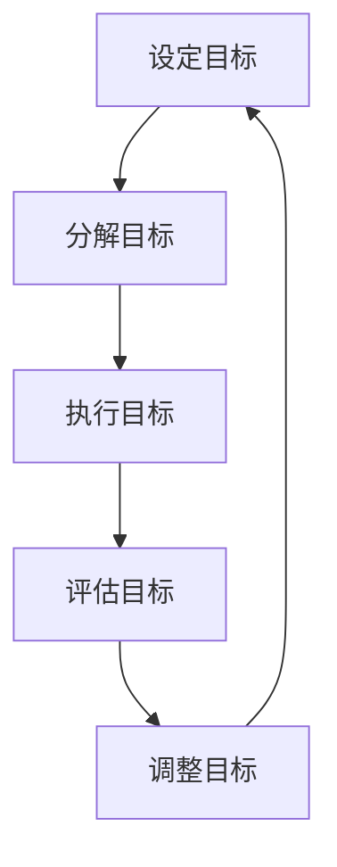
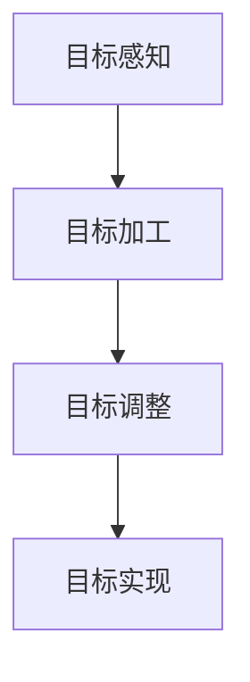

                 

### 文章标题

《短期目标管理的意识功能》

### 关键词

短期目标管理、意识功能、SMART目标、时间管理、自我调节、团队协作

### 摘要

本文将探讨短期目标管理的意识功能，从理论基础到实践应用，深入分析短期目标管理的核心概念、设定方法、分解与时间管理策略，以及其在个人和企业中的实际案例。本文还将探讨短期目标管理的评估与调整、未来发展趋势、意识功能提升方法和教育与培训现状，为读者提供全面的短期目标管理指南。

---

### 《短期目标管理的意识功能》目录大纲

#### 第一部分：短期目标管理的理论基础

**第1章：短期目标管理的概述**
- 1.1 短期目标管理的重要性
- 1.2 短期目标管理的原则与策略

**第2章：短期目标设定的方法**
- 2.1 SMART 目标设定法
- 2.2 目标设定的心理因素

**第3章：短期目标分解与时间管理**
- 3.1 目标分解的原则
- 3.2 时间管理策略

#### 第二部分：短期目标管理的实践应用

**第4章：短期目标管理的意识功能**
- 4.1 意识功能的概念
- 4.2 意识功能与短期目标管理的关系
- 4.3 意识功能在实际应用中的案例分析

**第5章：短期目标管理的实践策略**
- 5.1 短期目标管理的步骤
- 5.2 短期目标管理中的障碍与解决方法

**第6章：短期目标管理的案例分析**
- 6.1 个人短期目标管理案例
- 6.2 企业短期目标管理案例

**第7章：短期目标管理的评估与调整**
- 7.1 目标评估的标准
- 7.2 目标调整的方法

#### 第三部分：短期目标管理的未来展望

**第8章：短期目标管理的发展趋势**
- 8.1 短期目标管理的新技术
- 8.2 短期目标管理的发展方向

**第9章：短期目标管理的意识功能提升**
- 9.1 意识功能提升的方法
- 9.2 意识功能提升在短期目标管理中的应用

**第10章：短期目标管理的教育与培训**
- 10.1 短期目标管理教育的现状
- 10.2 短期目标管理培训的策略

#### 附录

**附录 A：短期目标管理工具与资源**
- A.1 常用短期目标管理工具介绍
- A.2 短期目标管理相关网站和资源推荐

**附录 B：短期目标管理案例分析报告**
- B.1 个人短期目标管理案例分析报告
- B.2 企业短期目标管理案例分析报告

**附录 C：常用术语表**
- 短期目标管理
- SMART目标
- 意识功能
- 时间管理
- 目标分解
- 反馈与调整

---

### 第1章：短期目标管理的概述

#### 1.1 短期目标管理的重要性

短期目标管理是一种通过设定、分解、执行、评估和调整短期目标，以达到个人成长、团队协作和企业效益的重要管理方法。它在多个层面上具有关键作用：

- **个人成长**：通过设定明确的短期目标，个体可以更好地规划自己的发展路径，提高自我效能感和成就感。
- **团队协作**：在团队中，短期目标管理有助于明确每个人的职责和任务，促进高效沟通和协作，提升团队的整体绩效。
- **企业效益**：企业通过短期目标管理，可以更好地实现战略规划，优化资源配置，提高市场竞争力。

以下是一个 Mermaid 流程图，展示了短期目标管理的核心概念和联系：



#### 1.2 短期目标管理的原则与策略

短期目标管理不仅需要科学的方法，还需要遵循一定的原则。以下是几个关键原则和策略：

- **SMART目标设定法**：SMART目标是指具体（Specific）、可度量（Measurable）、可实现（Achievable）、相关（Relevant）和有期限（Time-bound）的目标。这种方法有助于确保目标的明确性和可操作性。
  
- **目标分解原则**：将总体目标分解为若干个可操作的小目标，有助于提高目标的可执行性。分解过程中应考虑优先级和资源分配。

- **时间管理策略**：合理安排时间，确保目标在规定的时间内完成。时间管理策略包括计划与安排、优先级管理和专注与干扰管理。

以下是一个 SMART 目标设定法的示例：

```latex
\textbf{SMART} 目标设定法：
$$
\begin{aligned}
    &\text{S(Specific): 具体明确的} \\
    &\text{M(Measurable): 可度量的} \\
    &\text{A(Achievable): 可实现的} \\
    &\text{R(Relevant): 相关的} \\
    &\text{T(Time-bound): 有时间限制的}
\end{aligned}
$$
```

通过遵循这些原则和策略，可以确保短期目标管理的有效性和高效性。

---

### 第2章：短期目标设定的方法

#### 2.1 SMART 目标设定法

SMART目标设定法是一种广泛使用的目标设定方法，它通过五个关键属性（Specific、Measurable、Achievable、Relevant和Time-bound）来确保目标的明确性、可衡量性、可实现性、相关性和时限性。以下是 SMART 目标设定法的详细解释和应用示例：

**S(Specific): 具体明确的**

- **解释**：具体明确的目标应该具体描述要达成的结果，避免模糊和含糊不清。
- **示例**：我的目标是在下个月内减掉5公斤体重，而不是我要减肥。

**M(Measurable): 可度量的**

- **解释**：可度量意味着目标应该有一个明确的衡量标准，以便跟踪进度和评估成果。
- **示例**：我的目标是在下个月底前阅读完3本专业书籍，而不是我要多读书。

**A(Achievable): 可实现的**

- **解释**：设定的目标应该是可实现的，避免设定过高的目标，导致无法达成。
- **示例**：我的目标是在接下来的两周内完成一个项目，而不是我要尽快完成项目。

**R(Relevant): 相关的**

- **解释**：目标应该与个人或组织的长期目标相关联，确保短期目标对长期目标有积极的推动作用。
- **示例**：我的目标是在下一个季度内增加10%的销售额，而不是我要增加知名度。

**T(Time-bound): 有时间限制的**

- **解释**：目标应该有一个明确的时间限制，这有助于设定期限和保持紧迫感。
- **示例**：我的目标是在明年3月前完成我的大学论文，而不是我要写论文。

通过遵循 SMART 目标设定法，可以确保目标设定过程的科学性和有效性，从而提高目标实现的可能性。

#### 2.2 目标设定的心理因素

目标的设定不仅仅是一个理性的过程，还受到多种心理因素的影响。以下是几个关键的心理因素：

**意愿与动机**

- **解释**：强烈的意愿和动机是设定和实现目标的重要驱动力。目标设定者需要有明确的目标动机和强烈的实现愿望。
- **示例**：为了提高自己的技能，某人设定了在六个月内通过某个专业认证的目标。

**自我效能感**

- **解释**：自我效能感是指个体对自己完成特定任务的信心。高自我效能感有助于设定更具挑战性的目标。
- **示例**：相信自己能够完成一个复杂的项目，因此设定了一个较难但可实现的目标。

**设定目标的频率**

- **解释**：频繁设定目标有助于培养目标设定的习惯和意识，提高目标管理的效率。
- **示例**：每周或每月设定一次短期目标，以跟踪个人或团队的发展进度。

**反馈与调整**

- **解释**：定期的反馈和调整有助于目标设定的动态性和灵活性，确保目标与实际情况相匹配。
- **示例**：每月评估目标完成情况，并根据评估结果进行调整，确保目标仍然具有现实性和可实现性。

通过理解和考虑这些心理因素，可以更有效地设定和实现短期目标。

---

### 第3章：短期目标分解与时间管理

#### 3.1 目标分解的原则

在短期目标管理中，目标分解是一个关键步骤，它将总体目标拆解成一系列具体、可操作的小目标，使得目标更加易于实现。以下是目标分解的几个关键原则：

**从整体到局部**

- **原则**：将总体目标分解为若干个具体、可操作的小目标，从而实现整体目标的逐步实现。
- **示例**：如果总体目标是“在一年内提升销售业绩30%”，可以将目标分解为“每个季度提升5%的销售业绩”。

**按照优先级排序**

- **原则**：根据目标的重要性和紧急性，对分解后的目标进行排序，确保资源优先分配给最重要和最紧急的任务。
- **示例**：如果分解后的目标有“完成市场调研”、“开发新产品”、“撰写年度报告”，可以按照“紧急性”和“重要性”排序，优先完成“开发新产品”。

**确保可执行性**

- **原则**：分解后的目标应具备可执行性，避免过于抽象或模糊，确保每个人都能明确自己的任务和责任。
- **示例**：将“提升客户满意度”分解为“每周与客户进行一次电话沟通”和“每月进行一次客户满意度调查”。

通过遵循这些原则，可以确保目标分解过程的科学性和有效性，从而提高目标实现的效率。

#### 3.2 时间管理策略

时间管理是短期目标管理的重要组成部分，合理的计划与安排、优先级管理和专注与干扰管理是提高时间利用效率的关键策略。以下是几种有效的时间管理策略：

**计划与安排**

- **策略**：制定详细的时间计划，合理安排工作时间，确保任务按时完成。
- **示例**：使用日历工具或时间管理软件，每天制定工作计划，并按照计划执行任务。

**优先级管理**

- **策略**：根据任务的重要性和紧急性，合理分配时间和精力，优先处理重要且紧急的任务。
- **示例**：使用“四象限法”，将任务分为“重要且紧急”、“重要但不紧急”、“不重要但紧急”、“不重要且不紧急”，并优先处理重要任务。

**专注与干扰管理**

- **策略**：保持专注，避免干扰，提高工作效率。
- **示例**：关闭社交媒体通知，设定工作时间段，避免不必要的打扰。

**反馈与调整**

- **策略**：定期评估时间管理效果，根据评估结果进行调整，优化时间分配。
- **示例**：每周回顾一周的工作计划，根据实际完成情况调整下周的计划。

通过这些时间管理策略，可以更高效地实现短期目标，提高个人和团队的绩效。

---

### 第4章：短期目标管理的意识功能

#### 4.1 意识功能的概念

意识功能是指个体在认知过程中，对目标、任务和信息进行感知、加工和调整的能力。它是短期目标管理的重要组成部分，对目标实现过程具有重要影响。以下是意识功能的几个关键方面：

- **目标感知**：个体能够清楚地认识到自己的目标和任务，并将其纳入认知框架。
- **目标加工**：个体能够对目标进行深入思考，理解目标的含义和实现途径。
- **目标调整**：个体能够根据实际情况调整目标和计划，确保目标的可实现性和适应性。

以下是一个简化的 Mermaid 流程图，展示了意识功能在短期目标管理中的作用：



#### 4.2 意识功能与短期目标管理的关系

意识功能与短期目标管理之间存在着密切的关系，二者相互促进，共同实现目标管理的效果。以下是意识功能对短期目标管理的几个关键影响：

- **目标设定的科学性**：意识功能有助于个体设定符合SMART原则的目标，确保目标的具体性、可度量性、可实现性、相关性和时限性。
- **执行过程中的自我监督**：意识功能使个体能够自我监督和评估目标的执行情况，及时发现并纠正偏差。
- **适应性调整**：意识功能使个体能够根据实际情况调整目标和计划，确保目标的动态适应性和灵活性。

通过提高意识功能，可以显著提升短期目标管理的效率和效果。

#### 4.3 意识功能在实际应用中的案例分析

**个人案例**

某人想要在六个月内提升自己的英语水平。以下是如何应用意识功能来管理这一目标的案例分析：

1. **目标感知**：个体清楚地认识到自己的英语水平需要提升，并设定了一个明确的短期目标：“在接下来的六个月内，通过每天学习1小时，提升英语口语水平到流利交流的程度。”

2. **目标加工**：个体对目标进行了深入思考，理解了提升英语口语的必要性和可行性，并制定了具体的行动计划，如每天进行口语练习、参加英语角等。

3. **目标调整**：在执行过程中，个体根据实际情况调整了计划。例如，如果发现每天1小时的学习时间不够，可以增加学习时间或调整学习内容，确保目标的实现。

通过上述案例分析，可以看出意识功能在个人短期目标管理中的重要作用。它不仅有助于目标的设定，还促进了目标的执行和调整，提高了目标实现的可能性。

**企业案例**

某企业希望在下一个季度内提高市场占有率。以下是如何应用意识功能来管理这一目标的案例分析：

1. **目标感知**：企业高层管理者清楚地认识到市场占有率低是当前面临的重要问题，并设定了一个短期目标：“在下一个季度内，将市场占有率提高10%。”

2. **目标加工**：企业进行了市场调研，分析了市场趋势和竞争状况，制定了详细的营销策略，如增加广告投放、推出新产品、开展促销活动等。

3. **目标调整**：在执行过程中，企业根据市场反馈和销售数据，及时调整了营销策略。例如，如果广告投放效果不佳，可以调整广告内容和投放渠道。

通过以上案例分析，可以看出意识功能在企业短期目标管理中的重要性。它不仅有助于目标的科学设定，还促进了目标的执行和调整，确保了目标的实现。

---

### 第5章：短期目标管理的实践策略

#### 5.1 短期目标管理的步骤

要有效地管理短期目标，需要遵循一系列科学、系统的步骤。以下是短期目标管理的五个关键步骤：

**步骤一：设定目标**

- **内容**：根据个人或组织的实际需求和情况，明确短期目标的范围和方向。目标应具体、明确，避免模糊不清。
- **示例**：某人想要在三个月内提升自己的专业技能，可以设定“在接下来的三个月内，通过参加专业培训和自学，掌握XX技术”。

**步骤二：分解目标**

- **内容**：将总体目标分解为若干个具体、可操作的小目标，使目标更加具体、可执行。分解过程中应考虑优先级和资源分配。
- **示例**：上述目标可以分解为“每周参加一次专业培训”、“每月阅读一本相关书籍”和“每周完成一个技术项目”。

**步骤三：制定计划**

- **内容**：制定详细的时间计划，合理安排时间，确保每个小目标都能在规定的时间内完成。计划应包括具体的任务、执行时间、责任人等。
- **示例**：为上述分解目标制定时间计划，如“每周五下午参加专业培训，每周三晚上阅读书籍，每周日晚上完成技术项目”。

**步骤四：实施目标**

- **内容**：按照计划执行任务，确保每个小目标都能按部就班地完成。实施过程中，要密切关注进度，确保任务按时、按质完成。
- **示例**：严格按照时间计划，参加培训、阅读书籍和完成项目，并记录每一步的进展。

**步骤五：评估与调整**

- **内容**：定期评估目标完成情况，根据评估结果进行反馈和调整。评估应包括目标完成率、质量、影响等指标。
- **示例**：每个月底进行一次目标评估，根据实际完成情况调整下一步的计划，确保目标的持续实现。

通过遵循这五个步骤，可以有效地管理短期目标，提高目标实现的可能性。

#### 5.2 短期目标管理中的障碍与解决方法

在短期目标管理过程中，个体和组织可能会遇到各种障碍。以下是一些常见的障碍及其解决方法：

**缺乏明确的目标**

- **障碍**：目标不明确，导致无法有效规划和执行。
- **解决方法**：使用SMART目标设定法，确保目标具体、明确、可度量、可实现和有时限。

**时间管理不当**

- **障碍**：任务安排不合理，导致时间浪费，影响目标实现。
- **解决方法**：制定详细的时间计划，合理安排任务，避免拖延和延误。

**环境干扰**

- **障碍**：工作环境不稳定，导致注意力分散，影响目标执行。
- **解决方法**：创建良好的工作环境，减少干扰因素，提高专注度。

**自我激励不足**

- **障碍**：缺乏内在动力，导致目标执行不力。
- **解决方法**：设定奖励机制，提高自我激励能力，鼓励持续努力。

**团队协作不畅**

- **障碍**：团队成员沟通不畅，导致目标实现困难。
- **解决方法**：加强团队沟通和协作，建立有效的信息交流机制，确保目标共同实现。

通过识别和解决这些障碍，可以确保短期目标管理的顺利进行，提高目标实现的可能性。

---

### 第6章：短期目标管理的案例分析

#### 6.1 个人短期目标管理案例

**案例背景**

小明是一名软件开发工程师，他想要在六个月内提升自己的编程技能，特别是在Python语言方面。小明希望通过设定短期目标，系统性地学习Python，并在学习过程中不断实践，最终掌握这门语言。

**案例实施**

1. **设定目标**：小明使用了SMART目标设定法，明确了自己的学习目标：
   - **S(Specific)**：掌握Python的基础语法和常用库。
   - **M(Measurable)**：完成指定的学习任务，如每天学习2小时。
   - **A(Achievable)**：选择适合的教材和在线课程，确保学习内容丰富且可行。
   - **R(Relevant)**：提升编程能力，为以后的工作打下坚实基础。
   - **T(Time-bound)**：在六个月内完成所有学习任务。

2. **分解目标**：为了确保目标的可实现性，小明将大目标分解为多个小目标：
   - 每周学习一个Python模块（如列表、字典、函数等）。
   - 每周完成一个小项目，如使用Python编写一个简单的自动化脚本。
   - 每周进行一次自我测试，评估学习效果。

3. **制定计划**：小明制定了详细的学习计划：
   - 每天晚上7点到9点学习Python。
   - 每周末回顾一周的学习内容，确保理解并掌握。
   - 每两个月进行一次全面评估，根据评估结果调整学习计划。

4. **实施目标**：小明严格按照计划执行，每天保持学习，并记录自己的学习进度和心得。

5. **评估与调整**：在每个月底，小明进行一次学习效果的评估，根据评估结果调整学习计划。例如，如果发现某个模块的理解不够深入，他会增加对该模块的学习时间。

**案例效果**

通过六个月的努力，小明成功掌握了Python的基础语法和常用库。他不仅完成了所有的学习任务，还通过实践项目巩固了所学知识。小明的编程能力得到了显著提升，他在工作中也展现出了更高的效率和创造力。

**经验与启示**

- **设定明确的目标**：使用SMART目标设定法，确保目标的明确性和可实现性。
- **分解目标**：将大目标分解为小目标，提高目标的执行效率。
- **制定合理的计划**：合理安排时间，确保目标按计划执行。
- **定期评估与调整**：定期评估学习效果，根据评估结果进行调整。

#### 6.2 企业短期目标管理案例

**案例背景**

某科技公司希望提高其产品的市场占有率，并计划在下一个季度内将市场份额提升10%。为了实现这一目标，公司决定采用短期目标管理的方法。

**案例实施**

1. **设定目标**：公司使用SMART目标设定法，明确了短期目标：
   - **S(Specific)**：提高产品在目标市场的占有率。
   - **M(Measurable)**：将市场份额从当前的20%提升到30%。
   - **A(Achievable)**：通过增加广告投放、优化产品功能和开展促销活动等手段实现。
   - **R(Relevant)**：提高市场份额，增加公司收入和市场份额。
   - **T(Time-bound)**：在下一个季度内完成。

2. **分解目标**：公司将大目标分解为多个小目标：
   - 每月增加10%的线上广告投放。
   - 每月优化至少一个产品功能。
   - 每月开展一次促销活动，提高用户购买意愿。

3. **制定计划**：公司制定了详细的时间计划，确保每个小目标都能按时完成：
   - 每月的第一周确定广告投放方案。
   - 每月的中旬完成产品功能的优化。
   - 每月的月底策划并实施促销活动。

4. **实施目标**：各部门根据计划执行任务，如市场部负责广告投放和促销活动，产品部负责功能优化。

5. **评估与调整**：在每个月底，公司进行目标评估，根据评估结果调整下月计划。例如，如果广告投放效果不佳，会调整广告内容和投放策略。

**案例效果**

通过短期目标管理的实施，公司成功地将市场份额从20%提升到了30%。销售额显著增加，公司收入也得到了大幅提升。这一成功案例证明了短期目标管理在提升企业效益方面的有效性。

**经验与启示**

- **明确的目标设定**：使用SMART目标设定法，确保目标的明确性和可实现性。
- **合理的目标分解**：将大目标分解为小目标，提高目标的执行效率。
- **详细的时间计划**：制定详细的时间计划，确保目标按计划执行。
- **定期的评估与调整**：定期评估目标完成情况，根据评估结果进行调整，确保目标的持续实现。

---

### 第7章：短期目标管理的评估与调整

#### 7.1 目标评估的标准

在短期目标管理过程中，评估是确保目标实现的重要环节。以下是几个关键评估标准：

**目标完成率**

- **定义**：目标完成率是衡量目标实现程度的重要指标，通常以百分比表示。
- **计算方法**：目标完成率 = （实际完成量 / 计划完成量）× 100%
- **示例**：如果计划在一个月内完成50个任务，实际完成了60个任务，目标完成率为120%。

**目标质量**

- **定义**：目标质量是衡量目标设定合理性和目标实现价值的重要指标。
- **评估方法**：目标质量可以从以下几个方面进行评估：目标的明确性、可实现性、相关性和时限性。
- **示例**：如果设定的目标是“提升产品质量”，评估时需要考虑目标是否具体、可实现、与公司目标相关以及是否有明确的时间限制。

**目标影响**

- **定义**：目标影响是衡量目标对个人、团队或组织的影响程度。
- **评估方法**：目标影响可以从以下几个方面进行评估：目标实现的效益、目标对个人成长或团队协作的促进作用。
- **示例**：如果通过实现某个目标，公司销售额提高了10%，那么这个目标对公司的经济效益产生了积极影响。

通过使用这些评估标准，可以全面、客观地评估短期目标的实现情况，为后续的目标调整提供依据。

#### 7.2 目标调整的方法

在短期目标管理过程中，评估结果可能会显示出目标的设定与实际情况存在差距，这时需要对目标进行调整。以下是几种常见的目标调整方法：

**定期评估**

- **方法**：定期对目标完成情况进行评估，通常每周或每月进行一次。
- **步骤**：收集目标完成数据，与计划目标进行对比，分析完成情况。
- **示例**：在每个月底，对当月的目标完成情况进行评估，根据评估结果决定是否需要调整目标。

**根据实际情况进行调整**

- **方法**：根据评估结果和实际情况，对目标进行调整，确保目标的可实现性和适应性。
- **步骤**：分析目标完成过程中遇到的问题和挑战，制定针对性的调整措施。
- **示例**：如果发现某个目标过于困难，可以适当降低目标难度，或者增加资源和支持。

**遵循SMART原则**

- **方法**：在调整目标时，继续遵循SMART原则，确保新目标仍然具有明确性、可度量性、可实现性、相关性和时限性。
- **步骤**：重新审视目标，根据评估结果和实际情况，修改目标的属性，确保新目标符合SMART原则。
- **示例**：将“提升销售额”调整为“在未来三个月内，将销售额提升5%”。

通过这些方法，可以确保短期目标管理过程的灵活性和有效性，提高目标实现的概率。

---

### 第8章：短期目标管理的发展趋势

#### 8.1 短期目标管理的新技术

随着科技的进步，短期目标管理也在不断融入新的技术，以提高其效率和智能化水平。以下是几个短期目标管理的新技术：

**数字化工具**

- **定义**：数字化工具是指用于目标设定、分解、执行和评估的在线平台和应用程序。
- **示例**：Trello、Asana、Notion等，它们提供了直观的用户界面和强大的功能，帮助用户高效地管理目标。

**人工智能（AI）**

- **定义**：人工智能技术通过机器学习和自然语言处理，为短期目标管理提供智能化的支持。
- **示例**：使用AI助手如Google Assistant、Alexa等，可以自动化提醒、分配任务和提供反馈。

**区块链**

- **定义**：区块链技术提供了一个去中心化的数据库，用于记录和验证交易和数据。
- **示例**：使用区块链技术，可以确保目标的透明性和不可篡改性，提高目标管理的可信度。

**虚拟现实（VR）和增强现实（AR）**

- **定义**：虚拟现实和增强现实技术为短期目标管理提供了沉浸式和互动式体验。
- **示例**：通过VR/AR技术，可以模拟实际场景，帮助用户更好地理解目标和执行计划。

这些新技术正在改变短期目标管理的面貌，为用户提供了更加智能化、高效化的管理工具。

#### 8.2 短期目标管理的发展方向

短期目标管理未来的发展将继续受到技术创新的推动，以下是一些可能的发展方向：

**个性化目标设定**

- **定义**：个性化目标设定是根据个人的特点和需求，量身定制目标管理方案。
- **示例**：使用AI分析用户的偏好和行为模式，自动生成个性化目标。

**全生命周期管理**

- **定义**：全生命周期管理是指在目标的整个生命周期中，从设定、执行到评估和调整，提供全程支持。
- **示例**：整合数字化工具和AI技术，实现目标管理的全程自动化。

**增强的协作能力**

- **定义**：增强的协作能力是指通过技术手段，提高团队内部和跨团队的目标管理协作效率。
- **示例**：使用协作平台，实现任务分配、进度跟踪和实时沟通。

**可持续发展**

- **定义**：短期目标管理将更加注重可持续发展，确保目标设定和实现过程对社会和环境产生积极影响。
- **示例**：在目标设定过程中，考虑环保、社会责任和经济效益。

这些发展方向将进一步提升短期目标管理的效率和效果，使其在个人和企业层面发挥更大的作用。

---

### 第9章：短期目标管理的意识功能提升

#### 9.1 意识功能提升的方法

意识功能的提升是确保短期目标管理有效性的关键。以下是几种提升意识功能的方法：

**自我认知**

- **方法**：通过自我反思和自我评估，提高对自身能力和局限性的认识。
- **示例**：定期记录自己的工作进展和挑战，分析成功和失败的原因。

**自我激励**

- **方法**：设定奖励机制，激发内在动力，提高目标实现的积极性。
- **示例**：完成任务后，给自己设定小奖励，如休息一天或购买心仪的物品。

**自我调节**

- **方法**：学会调整心态和行为，应对目标实现过程中的挫折和困难。
- **示例**：在遇到困难时，尝试改变策略或寻求他人帮助，保持积极的心态。

**设定明确的行动计划**

- **方法**：制定详细的行动计划，将目标分解为具体步骤，确保每个步骤都有明确的执行计划。
- **示例**：为每个小目标制定具体的时间表和行动步骤，如“每天早上7点起床，进行30分钟锻炼”。

**建立支持系统**

- **方法**：寻求外部支持和资源，如导师、同事或朋友，共同推动目标的实现。
- **示例**：加入目标管理小组或寻找导师，共同讨论目标设定和实现过程中的问题。

通过这些方法，可以有效提升个体的意识功能，提高短期目标管理的效率。

#### 9.2 意识功能提升在短期目标管理中的应用

提升意识功能在短期目标管理中有着广泛的应用，以下是一些具体的应用场景：

**个人层面的应用**

- **目标设定与调整**：通过提升自我认知和自我调节能力，个体可以更科学地设定目标，并根据实际情况进行灵活调整。
- **自我监督与反馈**：提升自我激励能力，个体可以更好地监督自己的行为，及时反馈和调整，确保目标按计划实现。
- **持续学习与成长**：通过建立明确的行动计划和支持系统，个体可以持续提升自己的能力和技能，实现持续成长。

**团队层面的应用**

- **团队协作与沟通**：提升团队内部成员的意识功能，可以增强团队协作效率和沟通效果，确保目标共同实现。
- **目标管理与协调**：团队领导者可以借助提升的意识功能，更有效地管理团队目标，协调资源，优化工作流程。
- **绩效评估与激励**：通过定期评估和激励，提升团队成员的绩效和积极性，推动团队整体目标的实现。

**组织层面的应用**

- **战略规划与执行**：组织可以通过提升意识功能，更科学地制定战略目标和执行计划，确保战略的顺利实施。
- **文化塑造与传承**：组织可以借助提升的意识功能，塑造积极向上的企业文化，培养员工的目标意识和自我管理能力。
- **创新与可持续发展**：通过提升意识功能，组织可以鼓励创新思维，推动可持续发展，实现长期目标。

通过在个人、团队和组织层面提升意识功能，可以显著提高短期目标管理的效率和质量，推动个体和组织的持续成长和进步。

---

### 第10章：短期目标管理的教育与培训

#### 10.1 短期目标管理教育的现状

短期目标管理在教育与培训领域中的普及程度正在逐渐提升。目前，以下几种教育形式在推广短期目标管理方面发挥了重要作用：

**高等教育**

- **现状**：许多高等院校在管理学、心理学、教育学等专业中开设了短期目标管理的相关课程，培养学生的目标设定和管理能力。
- **例子**：一些商学院和管理学院设置了专门的短期目标管理课程，通过案例分析和实践活动，帮助学生掌握目标管理的理论和实践技能。

**职业教育**

- **现状**：职业培训学校和企业内训机构也在推广短期目标管理的教育，以满足职场人士的实际需求。
- **例子**：一些职业培训机构开设了针对职场人士的短期目标管理培训班，通过线上和线下课程，帮助学员提升目标管理和执行力。

**在线教育**

- **现状**：随着在线教育的发展，越来越多的平台提供短期目标管理的在线课程，方便学员随时随地学习。
- **例子**：知名在线教育平台如Coursera、Udemy等，都提供了丰富的短期目标管理课程，吸引了大量学习者。

**企业内训**

- **现状**：许多企业为了提升员工的目标管理能力，开展了内部培训项目，通过定制化的培训内容，提高员工的绩效。
- **例子**：一些企业邀请专业培训机构或专家为企业员工提供短期目标管理的培训，帮助员工提高工作效率和目标实现率。

#### 10.2 短期目标管理培训的策略

为了提高短期目标管理的培训效果，以下几种策略值得关注：

**定制化培训**

- **策略**：根据学员的需求和实际情况，提供个性化的培训方案。
- **例子**：针对不同岗位的需求，设定不同的培训内容和重点，如销售岗位注重目标设定与实现，研发岗位注重项目管理与协调。

**模块化培训**

- **策略**：将短期目标管理拆分为多个模块，每个模块专注于不同的技能或知识。
- **例子**：培训内容可以包括目标设定与分解、时间管理、自我激励、团队协作等，学员可以根据自己的需求选择学习模块。

**实战演练**

- **策略**：通过实际案例和模拟演练，让学员在真实场景中练习目标管理技能。
- **例子**：组织学员进行角色扮演、小组讨论和项目实践，提升学员的实战能力。

**互动式学习**

- **策略**：利用互动式教学工具，如在线讨论、小组作业和即时反馈，提高学员的学习参与度和积极性。
- **例子**：在培训过程中，利用在线讨论平台，鼓励学员分享经验，互相学习和借鉴。

**跟踪与评估**

- **策略**：对学员的学习效果进行跟踪和评估，确保培训目标的实现。
- **例子**：通过定期考核、项目报告和培训反馈，了解学员的学习成果，并根据评估结果进行后续培训调整。

通过这些策略，可以显著提高短期目标管理培训的效果，帮助学员在实际工作中更好地应用所学知识。

---

### 附录

#### 附录 A：短期目标管理工具与资源

**A.1 常用短期目标管理工具介绍**

- **Trello**：一款直观的卡片式项目管理工具，适合个人和组织管理短期目标。
- **Asana**：一款功能强大的项目管理软件，支持任务分配、进度跟踪和协作管理。
- **Notion**：一款集成式笔记和任务管理工具，适用于多种场景的目标管理。
- **Google Calendar**：谷歌日历，方便个人和组织制定时间计划和管理日程。

**A.2 短期目标管理相关网站和资源推荐**

- **Coursera**：提供大量短期目标管理课程，涵盖个人成长、团队协作等多个方面。
- **edX**：由哈佛大学和麻省理工学院联合创办的在线学习平台，提供高质量的管理课程。
- **PMI（项目管理协会）**：提供丰富的项目管理资源，包括目标管理、时间管理等相关知识。
- **MindTools**：提供各种职场技能培训，包括短期目标管理技巧。

#### 附录 B：短期目标管理案例分析报告

**B.1 个人短期目标管理案例分析报告**

**案例背景**：某人希望提升自己的英语水平，设定了在六个月内通过英语口语考试的目标。

**案例实施**：

1. **目标设定**：使用SMART目标设定法，明确目标的具体细节。
2. **目标分解**：将大目标分解为每周学习和练习的计划。
3. **制定计划**：制定详细的学习和时间计划，确保目标的实现。
4. **实施目标**：严格按照计划执行，进行日常英语学习和口语练习。
5. **评估与调整**：定期评估学习进度，根据评估结果调整学习计划。

**案例效果**：在六个月内，某人的英语口语水平显著提升，成功通过了英语口语考试。

**经验与启示**：明确的目标设定、详细的计划执行和定期的评估调整是个人短期目标管理成功的关键。

**B.2 企业短期目标管理案例分析报告**

**案例背景**：某企业希望提高市场占有率，设定了在下一季度内提高10%市场份额的目标。

**案例实施**：

1. **目标设定**：使用SMART目标设定法，明确市场占有率的提升目标。
2. **目标分解**：将大目标分解为市场调研、广告投放、产品优化等小目标。
3. **制定计划**：制定详细的市场推广计划，确保每个小目标都有明确的执行时间。
4. **实施目标**：各部门按照计划执行任务，确保目标按时完成。
5. **评估与调整**：定期评估市场占有率提升情况，根据评估结果调整市场策略。

**案例效果**：在下一季度内，企业的市场占有率成功提高了10%，销售额也有所增长。

**经验与启示**：科学的短期目标设定、合理的资源分配和有效的团队协作是企业发展过程中实现短期目标的关键。

---

### 附录 C：常用术语表

**短期目标管理**：通过设定、分解、执行、评估和调整短期目标，实现个人成长、团队协作和企业效益的管理方法。

**SMART目标**：具体（Specific）、可度量（Measurable）、可实现（Achievable）、相关（Relevant）和有期限（Time-bound）的目标。

**意识功能**：个体在认知过程中，对目标、任务和信息进行感知、加工和调整的能力。

**时间管理**：合理安排时间，提高工作效率和目标实现率的过程。

**目标分解**：将总体目标分解为若干个可操作的小目标的过程。

**反馈与调整**：定期对目标完成情况进行评估，并根据评估结果进行调整的过程。

---

通过以上详细的解析和案例分享，我们希望读者能够更好地理解和应用短期目标管理的概念和方法，提高目标管理的效率和质量。在未来的工作和生活中，期待大家能够通过有效的短期目标管理，实现个人和组织的持续成长和发展。

