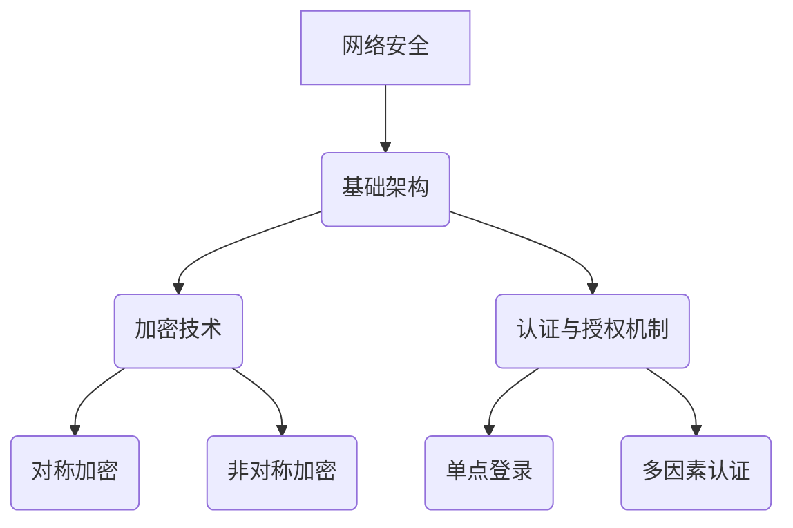
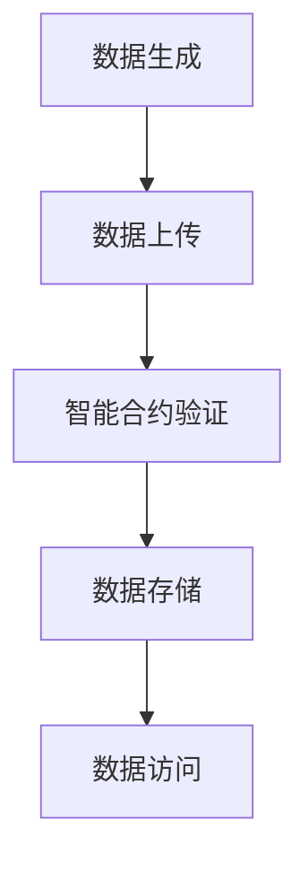

                 

# 《硅谷网络安全新技术的发展方向》

## 关键词

网络安全、硅谷、新技术、加密技术、人工智能、数据隐私

## 摘要

随着互联网技术的飞速发展和大数据时代的到来，网络安全问题日益突出。硅谷作为全球科技创新的领军地区，不断涌现出新的网络安全技术，为解决网络安全挑战提供了有力支持。本文将深入探讨硅谷网络安全新技术的发展方向，从背景与挑战、核心技术与原理、前沿安全防护技术、实战案例分析、网络安全策略与合规、以及网络安全人才培养与未来展望等多个方面进行详细分析，旨在为读者提供一个全面、系统的网络安全技术发展图景。

## 第一部分：硅谷网络安全背景与挑战

### 1. 硅谷网络安全的发展历程

硅谷网络安全的发展历程可谓跌宕起伏。从20世纪80年代早期的计算机病毒，到90年代的网络攻击，再到21世纪初的DDoS攻击和近年来日益严峻的数据泄露问题，网络安全挑战不断演变。硅谷的网络安全产业正是在这样的背景下不断成长和演进，形成了如今成熟且富有创新力的网络安全生态系统。

#### 1.1 硅谷网络安全的关键事件

- 1988年，莫里斯蠕虫病毒首次攻击互联网，成为网络安全领域的里程碑事件。
- 2001年，9/11事件后，网络安全成为政府和企业关注的焦点。
- 2007年，iPhone的发布标志着移动设备的普及，网络安全问题随之扩展到移动领域。
- 2013年，斯诺登事件曝光了全球范围的监听和网络间谍活动，引发对网络隐私的广泛关注。
- 2017年，全球范围内爆发的WannaCry勒索病毒事件，凸显了网络安全威胁的严重性。

#### 1.2 硅谷网络安全的主要发展趋势

- 从传统防护向智能防护转型：随着攻击手段的日益复杂，传统的防火墙和入侵检测系统已无法满足需求，智能防护技术逐渐成为主流。
- 云安全成为焦点：随着云计算的普及，云环境的安全问题日益突出，硅谷网络安全企业纷纷推出云安全解决方案。
- 移动安全发展迅速：随着移动设备的广泛应用，移动安全成为网络安全领域的新兴热点。
- 区块链技术在安全领域应用：区块链技术以其去中心化和不可篡改的特性，在数据安全和身份验证方面展现出巨大潜力。
- 威胁情报共享：为了更有效地应对网络安全威胁，硅谷企业之间逐渐建立起威胁情报共享机制，共同抵御网络攻击。

#### 1.3 硅谷网络安全面临的挑战

- 复杂的网络环境：随着网络技术的发展，网络环境和应用场景变得愈发复杂，这为网络安全带来了新的挑战。
- 威胁多样化：网络攻击手段日益多样化和复杂化，从传统的病毒和木马到高级持续性威胁（APT），安全防护面临巨大压力。
- 数据隐私保护：随着大数据和人工智能的普及，数据隐私保护成为网络安全的重要议题。
- 人才短缺：网络安全领域的快速发展对人才的需求大幅增加，但现有的人才培养体系尚无法满足需求，人才短缺成为行业瓶颈。

## 第二部分：网络安全核心技术与原理

### 2. 网络安全基础

#### 2.1 网络安全基础知识

网络安全是指通过各种技术和管理手段保护计算机网络系统中的硬件、软件和数据不受未经授权的访问、攻击、篡改和破坏。网络安全涉及多个层次，包括网络基础架构、操作系统、应用程序和用户数据等。

#### 2.2 加密技术原理与应用

加密技术是网络安全的核心技术之一，用于保护数据在传输和存储过程中的机密性和完整性。加密技术主要分为对称加密和非对称加密两种。

- **对称加密**：对称加密使用相同的密钥对数据进行加密和解密。常见的对称加密算法包括AES、DES和RSA。
  
  **AES加密算法原理：**
  $$plaintext = AES_{Encryption}(M, K)$$
  $$cipherText = AES_{Decryption}(C, K)$$

- **非对称加密**：非对称加密使用一对密钥（公钥和私钥）进行加密和解密。公钥用于加密，私钥用于解密。

  **RSA加密算法原理：**
  $$plaintext = RSA_{Encryption}(M, PubKey)$$
  $$cipherText = RSA_{Decryption}(C, PrivKey)$$

#### 2.3 认证与授权机制

认证与授权机制用于确保只有授权用户才能访问网络资源和应用程序。常见的认证机制包括密码认证、双因素认证和多因素认证。

- **密码认证**：用户通过输入密码来证明自己的身份。
- **双因素认证**：用户需要提供两个不同类型的身份验证信息，如密码和手机验证码。
- **多因素认证**：用户需要提供多个类型的身份验证信息，如密码、指纹和面部识别。

### 第三部分：硅谷前沿网络安全技术

#### 3. 前沿安全防护技术

随着网络安全威胁的日益复杂，硅谷网络安全技术也在不断创新和进步。以下是一些硅谷前沿的安全防护技术：

#### 3.1 云安全与容器安全

- **云安全**：随着云计算的普及，云安全成为网络安全的重要议题。云安全解决方案包括云访问安全、云数据保护和云应用安全。
- **容器安全**：容器技术的广泛应用使得容器安全成为新的热点。容器安全主要关注容器镜像的安全性、容器网络的安全性和容器运行时的监控。

#### 3.2 人工智能在网络安全中的应用

- **威胁检测**：人工智能技术可以用于检测和识别网络攻击，提高威胁检测的准确性和效率。
- **行为分析**：通过分析用户和系统的行为，人工智能技术可以发现异常行为，及时预警潜在的网络威胁。
- **安全决策**：人工智能技术可以帮助安全专家快速做出决策，提高安全响应的效率。

#### 3.3 网络流量分析与威胁检测

- **网络流量分析**：通过分析网络流量数据，可以发现异常流量和潜在的网络威胁。
- **威胁检测**：利用机器学习和深度学习技术，可以对网络流量进行实时分析和检测，识别未知威胁。

### 第四部分：硅谷网络安全实战案例分析

#### 4. 案例研究

以下是一些硅谷网络安全实战案例：

#### 4.1 案例一：硅谷某知名企业遭受DDoS攻击

某知名硅谷企业在一次DDoS攻击中遭受了重大损失。攻击者通过大量僵尸网络设备向企业服务器发送海量请求，导致服务器过载，无法正常提供服务。为了应对攻击，企业采取了以下措施：

- **流量清洗**：通过与第三方安全服务提供商合作，对进入企业服务器的流量进行清洗，过滤掉恶意流量。
- **动态调整资源**：根据攻击流量变化，动态调整服务器资源，确保服务器能够承受攻击流量。
- **应急响应**：组建应急响应团队，及时响应攻击事件，快速恢复服务。

#### 4.2 案例二：硅谷某初创公司利用区块链技术进行数据安全防护

某硅谷初创公司开发了一个基于区块链的数据共享平台，旨在提高数据安全性和透明度。平台采用区块链技术进行数据存储和访问控制，确保数据的完整性和安全性。以下为平台实现的关键步骤：

- **设计区块链架构**：根据业务需求，设计区块链架构，包括数据生成、数据上传、智能合约验证和数据存储等模块。
- **编写智能合约**：使用Solidity智能合约开发框架，编写数据上传和数据访问的智能合约。
- **部署智能合约**：使用Truffle框架部署智能合约到Ethereum区块链，并记录合约地址。

#### 4.3 案例三：硅谷某大型互联网公司如何应对新型网络威胁

某大型硅谷互联网公司在面对新型网络威胁时，采取了以下策略：

- **威胁情报共享**：与行业内其他企业建立威胁情报共享机制，共同抵御网络攻击。
- **威胁检测与响应**：采用人工智能和机器学习技术，对网络流量进行实时分析和检测，及时发现和应对新型威胁。
- **安全培训与演练**：定期对员工进行网络安全培训，并组织安全演练，提高员工的安全意识和应对能力。

### 第五部分：网络安全策略与合规

#### 5. 网络安全策略与合规性

网络安全策略是企业保护其信息和网络安全的重要手段。以下是一些网络安全策略和合规性要求：

#### 5.1 网络安全政策与流程

- **安全意识培训**：定期对员工进行网络安全意识培训，提高员工的安全意识和防范能力。
- **访问控制**：实施严格的访问控制策略，确保只有授权用户才能访问敏感数据和系统。
- **数据备份与恢复**：定期进行数据备份，确保在数据丢失或损坏时能够快速恢复。

#### 5.2 数据隐私法规与合规

- **GDPR**：遵守欧盟通用数据保护条例（GDPR），确保用户数据的安全和隐私。
- **CCPA**：遵守加利福尼亚州消费者隐私法案（CCPA），保护消费者的个人信息。

#### 5.3 国际网络安全法规与标准

- **ISO/IEC 27001**：遵循国际信息安全管理体系标准（ISO/IEC 27001），确保企业信息安全管理体系的建立和运行。
- **NIST Cybersecurity Framework**：遵循美国国家标准与技术研究院（NIST）的网络安全框架，提高企业的网络安全能力。

### 第六部分：网络安全人才培养与未来展望

#### 6. 硅谷网络安全人才发展

网络安全人才是网络安全发展的基石。硅谷网络安全行业对人才的需求量巨大，以下是一些网络安全人才培养模式和发展趋势：

#### 6.1 网络安全人才培养模式

- **学历教育**：高校和科研机构开设网络安全专业，培养高水平的专业人才。
- **职业培训**：网络安全企业和社会培训机构开展网络安全培训，提升从业人员的专业技能。
- **在线教育**：利用互联网和在线学习平台，提供丰富的网络安全教育资源。

#### 6.2 硅谷网络安全行业发展趋势

- **网络安全市场持续增长**：随着网络安全威胁的日益严峻，网络安全市场将持续增长，为人才提供更多机会。
- **人工智能在网络安全中的应用**：人工智能技术将在网络安全领域发挥更大作用，提高威胁检测和响应的效率。
- **国际网络安全合作**：全球范围内的网络安全合作将加强，共同应对跨国网络威胁。

#### 6.3 网络安全未来的创新方向

- **量子计算安全**：量子计算技术的快速发展将对传统加密算法构成威胁，量子计算安全成为未来创新的重要方向。
- **区块链技术**：区块链技术在数据安全和身份验证方面的应用将不断扩展，为网络安全提供新的解决方案。
- **5G安全**：随着5G网络的普及，5G安全将成为网络安全领域的重要议题，确保5G网络的可靠性和安全性。

### 第七部分：附录

#### 7.1 网络安全工具与资源

- **网络安全工具**：
  - Wireshark：网络流量分析工具
  - Kali Linux：渗透测试操作系统
  - OpenVAS：漏洞扫描工具

- **网络安全资源**：
  - OWASP：开放网络应用安全项目
  - CVE：公共漏洞和暴露项目
  - NIST：美国国家标准与技术研究院

#### 7.2 网络安全书籍与论文推荐

- **书籍推荐**：
  - 《黑客攻防技术宝典：系统实战篇》
  - 《网络安全评估与测试》
  - 《深入浅出区块链》

- **论文推荐**：
  - “Attacking Bitcoin from the Future: A Formal Treatment of Bitcoin Security” by Alex Biryukov et al.
  - “Quantum Computing and Quantum Cryptography” by Daniel J. Seplowitz

#### 7.3 网络安全标准与法规参考资料

- **国际标准**：
  - ISO/IEC 27001：信息安全管理系统
  - ISO/IEC 27002：信息安全管理系统实施指南

- **美国标准**：
  - NIST Special Publication 800-53：信息安全控制系统

- **欧洲标准**：
  - GDPR：通用数据保护条例

### 核心概念与联系

#### **网络安全核心概念与架构 Mermaid 流程图：**



### 核心算法原理讲解

#### **加密算法原理与伪代码：**

#### 对称加密算法（AES）：

```plaintext
plaintext
输入：明文消息M、密钥K
输出：密文C

初始化密钥：K = AES-Key-Generation(K)

加密：
C = AES-Encryption(M, K)

解密：
M' = AES-Decryption(C, K)
```

#### 非对称加密算法（RSA）：

```plaintext
plaintext
输入：明文消息M、公钥(PubKey)、私钥(PrivKey)
输出：密文C、签名S

加密：
C = RSA-Encryption(M, PubKey)

签名：
S = RSA-Signature(M, PrivKey)

验证：
verified = RSA-Verification(M, S, PubKey)
```

### 数学模型和数学公式详细讲解

#### **加密算法的数学模型：**

#### 对称加密（AES）的数学模型：

$$
AES_{128}(Ek, Dk) = E_{k}^{-1} \cdot D_{k}^{-1} \cdot AES_{128}(M, K)
$$

其中，\(E_{k}\) 和 \(D_{k}\) 分别代表加密和解密函数，\(M\) 是明文消息，\(K\) 是密钥。

#### 非对称加密（RSA）的数学模型：

$$
RSA_{Encryption}(M, PubKey) = M^e \mod n
$$

$$
RSA_{Decryption}(C, PrivKey) = C^d \mod n
$$

$$
RSA_{Signature}(M, PrivKey) = H(M) \cdot r \mod n
$$

$$
RSA_{Verification}(M, S, PubKey) = H(M) \cdot r^{-1} \mod n
$$

其中，\(M\) 是明文消息，\(e\) 和 \(d\) 分别是公钥和私钥的指数，\(n\) 是模数，\(H(M)\) 是消息的哈希值，\(r\) 是随机数。

### 项目实战

#### **实战：使用区块链技术进行数据安全防护**

##### **1. 项目背景：**

某硅谷初创公司开发了一个基于区块链的数据共享平台，旨在提高数据安全性和透明度。平台采用区块链技术进行数据存储和访问控制，确保数据的完整性和安全性。

##### **2. 开发环境：**

- **语言**：Go
- **区块链平台**：Ethereum
- **智能合约开发框架**：Solidity

##### **3. 实现步骤：**

**（1）设计区块链架构：**



**（2）编写智能合约：**

```solidity
pragma solidity ^0.8.0;

contract DataSecurity {
    mapping(address => mapping(string => string)) dataStore;

    function uploadData(string memory dataID, string memory data) public {
        require(dataStore[msg.sender][dataID] == "", "Data already exists");
        dataStore[msg.sender][dataID] = data;
    }

    function fetchData(string memory dataID) public view returns (string memory) {
        return dataStore[msg.sender][dataID];
    }
}
```

**（3）部署智能合约：**

- 使用Truffle框架部署智能合约到Ethereum区块链
- 部署成功后，记录合约地址

##### **4. 代码解读与分析：**

**（1）数据上传：**

```solidity
function uploadData(string memory dataID, string memory data) public {
    require(dataStore[msg.sender][dataID] == "", "Data already exists");
    dataStore[msg.sender][dataID] = data;
}
```

上传数据前，先检查是否已经存在相同的数据ID，防止重复上传。如果不存在，将数据存储到合约中。

**（2）数据访问：**

```solidity
function fetchData(string memory dataID) public view returns (string memory) {
    return dataStore[msg.sender][dataID];
}
```

用户可以通过调用`fetchData`函数获取自己上传的数据，确保数据的安全性和隐私性。

##### **5. 部署与测试：**

- 使用Truffle进行智能合约部署
- 在测试网络中运行测试用例，验证智能合约的功能

### 项目实战总结

使用区块链技术进行数据安全防护，能够确保数据在传输和存储过程中的安全性和透明度。通过智能合约的部署和执行，实现了数据的可信存储和访问控制。这个项目展示了区块链技术在网络安全领域的重要应用，为未来的数据安全防护提供了新的思路和解决方案。

### 作者

**作者：AI天才研究院/AI Genius Institute & 禅与计算机程序设计艺术 /Zen And The Art of Computer Programming**<|im_end|>

