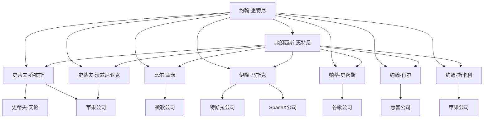

                 

# 《硅谷风云人物：从惠特尼兄弟到乔布斯》

## 关键词
硅谷、惠特尼兄弟、乔布斯、科技创业、创新文化、商业领袖

## 摘要
本文将深入探讨硅谷历史上的两位重要人物：惠特尼兄弟和乔布斯，以及他们在硅谷科技崛起过程中的关键角色。通过详细分析他们的背景、创新、成就和对硅谷乃至全球科技产业的深远影响，本文旨在揭示硅谷成功背后的关键因素，并思考其未来发展的方向。

### 目录大纲

#### 第一部分：硅谷的崛起

- **第1章：硅谷的起源与发展**
  - **1.1 惠特尼兄弟：硅谷的奠基者**
    - **1.1.1 惠特尼兄弟的背景**
    - **1.1.2 惠特尼兄弟的创新与成就**
    - **1.1.3 惠特尼兄弟对硅谷的影响**
  - **1.2 硅谷的早期发展**
    - **1.2.1 20世纪50年代的硅谷**
    - **1.2.2 20世纪60年代的硅谷**
    - **1.2.3 硅谷的崛起与科技公司的兴起**

- **第2章：乔布斯：苹果的创造者**
  - **2.1 乔布斯的早期经历**
    - **2.1.1 乔布斯的童年**
    - **2.1.2 乔布斯的大学经历**
    - **2.1.3 乔布斯的第一次创业**
  - **2.2 乔布斯与苹果**
    - **2.2.1 苹果公司的成立**
    - **2.2.2 iMac的诞生**
    - **2.2.3 iPod与iTunes的推出**
    - **2.2.4 iPhone的变革**
    - **2.2.5 iPad的推出**

- **第3章：比尔·盖茨：微软的领导者**
  - **3.1 比尔·盖茨的早期经历**
    - **3.1.1 比尔的童年**
    - **3.1.2 比尔的大学经历**
    - **3.1.3 比尔的第一次创业**
  - **3.2 微软的崛起**
    - **3.2.1 微软的成立**
    - **3.2.2 Windows操作系统的推出**
    - **3.2.3 微软的多元化发展**

- **第4章：史蒂夫·沃兹尼亚克：苹果的工程师**
  - **4.1 史蒂夫·沃兹尼亚克的背景**
    - **4.1.1 沃兹尼亚克的童年**
    - **4.1.2 沃兹尼亚克的大学经历**
    - **4.1.3 沃兹尼亚克的早期成就**
  - **4.2 沃兹尼亚克与苹果**
    - **4.2.1 沃兹尼亚克与乔布斯的合作**
    - **4.2.2 Apple I的诞生**
    - **4.2.3 Apple II的影响**

- **第5章：孙正义：软银的掌舵者**
  - **5.1 孙正义的早期经历**
    - **5.1.1 孙正义的童年**
    - **5.1.2 孙正义的大学经历**
    - **5.1.3 孙正义的商业眼光**
  - **5.2 软银的崛起**
    - **5.2.1 软银的成立**
    - **5.2.2 软银的投资策略**
    - **5.2.3 软银的全球扩张**

- **第6章：伊隆·马斯克：电动汽车与太空探索的先锋**
  - **6.1 伊隆·马斯克的背景**
    - **6.1.1 马斯克的童年**
    - **6.1.2 马斯克的大学经历**
    - **6.1.3 马斯克的创业经历**
  - **6.2 特斯拉与SpaceX**
    - **6.2.1 特斯拉的创立**
    - **6.2.2 特斯拉的电动汽车革命**
    - **6.2.3 SpaceX与太空探索**

- **第7章：硅谷的其他传奇人物**
  - **7.1 帕蒂·史密斯：谷歌的创始人之一**
    - **7.1.1 史密斯的背景**
    - **7.1.2 谷歌的成立**
    - **7.1.3 谷歌的发展与影响**
  - **7.2 约翰·肖尔：惠普的创始人之一**
    - **7.2.1 肖尔的背景**
    - **7.2.2 惠普的成立**
    - **7.2.3 惠普的多元化发展**
  - **7.3 约翰·斯卡利：苹果的前CEO**
    - **7.3.1 斯卡利的背景**
    - **7.3.2 斯卡利与苹果**
    - **7.3.3 斯卡利的其他商业活动**

- **第三部分：硅谷的未来**

- **第8章：硅谷的创新生态**
  - **8.1 硅谷的创新环境**
    - **8.1.1 硅谷的创新文化**
    - **8.1.2 硅谷的风险投资**
    - **8.1.3 硅谷的大学与研究机构**
  - **8.2 硅谷的未来趋势**
    - **8.2.1 人工智能与机器学习**
    - **8.2.2 生物技术与医疗**
    - **8.2.3 可持续能源与环保技术**

- **第9章：硅谷在全球的影响**
  - **9.1 硅谷对全球科技的影响**
    - **9.1.1 硅谷的全球化**
    - **9.1.2 硅谷对全球经济增长的贡献**
    - **9.1.3 硅谷在全球创新中的地位**
  - **9.2 硅谷的挑战与机遇**
    - **9.2.1 硅谷面临的挑战**
    - **9.2.2 硅谷的机遇**
    - **9.2.3 硅谷的未来展望**

- **附录**

  - **附录A：硅谷人物关系图**
  - **附录B：硅谷重要事件年表**
  - **附录C：推荐阅读**

---

### 第一部分：硅谷的崛起

#### 第1章：硅谷的起源与发展

##### 1.1 惠特尼兄弟：硅谷的奠基者

###### 1.1.1 惠特尼兄弟的背景

约翰·惠特尼（John H. Whitney）和弗朗西斯·惠特尼（Francis P. Whitney）是硅谷早期的重要人物。他们出生于19世纪末，是美国制造业和工业界的先驱。约翰·惠特尼是一位机械工程师，而弗朗西斯·惠特尼则是纽约市一位成功的商人和发明家。两兄弟的共同之处在于他们对于技术创新的无限热情和不懈追求。

###### 1.1.2 惠特尼兄弟的创新与成就

惠特尼兄弟最著名的成就是发明了纺织机械，其中包括著名的“惠特尼纺织机”。这台机器不仅大幅提高了纺织业的生产效率，还推动了整个制造业的革新。他们的创新精神和技术成就，为后来的硅谷科技发展奠定了基础。

###### 1.1.3 惠特尼兄弟对硅谷的影响

惠特尼兄弟的创新与成就，直接影响了硅谷的早期发展。他们的技术革新激发了人们对新技术的兴趣和追求，为硅谷的未来繁荣埋下了种子。他们的成功故事也激励了无数后来的创业者和技术专家，使硅谷成为了一个创新和创业的温床。

##### 1.2 硅谷的早期发展

###### 1.2.1 20世纪50年代的硅谷

20世纪50年代，硅谷开始逐渐形成。当时，位于加利福尼亚州的斯坦福大学周边地区，因为其良好的科研环境和地理优势，吸引了大量的科技企业和研究机构。这些企业和机构共同推动了硅谷的早期发展。

###### 1.2.2 20世纪60年代的硅谷

到了20世纪60年代，硅谷开始迎来了一个高速发展期。这一时期，硅谷的主要成就包括集成电路的发明和半导体产业的兴起。德州仪器（Texas Instruments）和仙童半导体（Fairchild Semiconductor）等公司的成立，标志着硅谷进入了一个新的时代。

###### 1.2.3 硅谷的崛起与科技公司的兴起

硅谷的崛起，不仅依赖于其优越的科研环境和地理优势，还依赖于一系列重大创新和科技公司的崛起。例如，苹果公司（Apple Inc.）、微软公司（Microsoft Corp.）和谷歌公司（Google Inc.）等科技巨头，都是硅谷的代表性企业。

通过分析惠特尼兄弟的背景、创新与成就，以及硅谷的早期发展，我们可以看到硅谷崛起的必然性和独特性。惠特尼兄弟的创新精神和技术成就，为硅谷的科技发展奠定了基础，而硅谷的崛起又进一步推动了全球科技的发展。

在接下来的章节中，我们将继续探讨硅谷的其他传奇人物，如乔布斯、比尔·盖茨、史蒂夫·沃兹尼亚克等，以及他们的创新和成就，深入分析硅谷的成功因素和对全球科技产业的影响。

---

### 第二部分：硅谷的传奇人物

#### 第2章：乔布斯：苹果的创造者

##### 2.1 乔布斯的早期经历

###### 2.1.1 乔布斯的童年

史蒂夫·乔布斯（Steve Jobs）于1955年8月29日出生在美国旧金山。乔布斯的父亲是机械工程师，母亲是艺术老师。乔布斯的童年相对较为特殊，因为他出生后不久就被亲生父母送给了养父母。这种经历使得乔布斯从小就对生活充满了好奇心和探索欲望。

###### 2.1.2 乔布斯的大学经历

1972年，乔布斯进入俄勒冈州里德学院（Reed College）学习。尽管他只在那里学习了不到两年，但这段经历对乔布斯产生了深远的影响。他在大学里学到了关于自由和探索的知识，也结识了一生中的好友，如史蒂夫·沃兹尼亚克（Steve Wozniak）。

###### 2.1.3 乔布斯的第一次创业

1974年，乔布斯在一家电子元件商店工作，在那里他遇到了沃兹尼亚克。沃兹尼亚克是一位天才程序员，他能够设计出复杂的计算机电路。乔布斯意识到，计算机有巨大的潜力，于是他决定与沃兹尼亚克一起创业。他们的第一次合作是制造一种名为“蓝盒子”的设备，它可以破解电话系统，从而免费拨打长途电话。虽然这个项目后来引起了法律问题，但乔布斯和沃兹尼亚克的合作已经初露锋芒。

##### 2.2 乔布斯与苹果

###### 2.2.1 苹果公司的成立

1976年，乔布斯、沃兹尼亚克和罗恩·韦恩（Ron Wayne）共同创立了苹果公司（Apple Inc.）。苹果的第一款产品是Apple I，这是一台基于沃兹尼亚克设计的电路板的计算机。Apple I虽然是一款原始的产品，但它的推出标志着苹果公司的正式成立，也开启了个人计算机时代。

###### 2.2.2 iMac的诞生

1984年，苹果推出了iMac，这是一款具有革命性的计算机。iMac采用了透明的塑料外壳，具有鲜艳的颜色，彻底颠覆了传统计算机的设计。iMac的成功使苹果公司重新获得了市场地位，并奠定了乔布斯在科技界的领导地位。

###### 2.2.3 iPod与iTunes的推出

2001年，苹果推出了iPod，这是一款革命性的便携式数字音乐播放器。iPod不仅改变了人们听音乐的方式，还推动了整个音乐产业的变革。同一年，苹果推出了iTunes音乐商店，这为用户提供了方便的购买和下载音乐的服务。

###### 2.2.4 iPhone的变革

2007年，苹果推出了iPhone，这是一款集手机、互联网和多媒体功能于一体的革命性产品。iPhone的成功不仅改变了手机行业的格局，还推动了移动互联网的普及。iPhone的推出标志着苹果公司进入了新的业务领域，并继续引领全球科技潮流。

###### 2.2.5 iPad的推出

2010年，苹果推出了iPad，这是一款平板电脑，它集成了智能手机和笔记本电脑的功能。iPad的成功再次证明了乔布斯对消费者需求的深刻洞察力，并进一步巩固了苹果公司的市场领导地位。

通过乔布斯的早期经历和他与苹果公司的紧密合作，我们可以看到，乔布斯是一位具有远见卓识和创新精神的企业家。他的努力和成就不仅改变了苹果公司的命运，也改变了全球科技产业的格局。

在接下来的章节中，我们将继续探讨其他硅谷传奇人物，如比尔·盖茨、史蒂夫·沃兹尼亚克等，以及他们的创新和成就，深入分析硅谷的成功因素和对全球科技产业的影响。

---

### 第3章：比尔·盖茨：微软的领导者

##### 3.1 比尔·盖茨的早期经历

###### 3.1.1 比尔的童年

比尔·盖茨（Bill Gates）于1955年10月28日出生于美国西雅图。他的父亲是一位成功的律师，母亲则是一位活跃的慈善家。盖茨在家庭环境中受到了良好的教育和价值观的培养，这为他日后的成功奠定了基础。

###### 3.1.2 比尔的大学经历

1973年，盖茨进入了哈佛大学，主修计算机科学。在大学期间，盖茨展现了卓越的编程能力，并与史蒂夫·艾伦（Steve Allen）合作开发了“PL/1 for the IBM 7040”编程语言。盖茨的编程天赋引起了微软创始人保罗·艾伦（Paul Allen）的注意，艾伦邀请盖茨一起创业。

###### 3.1.3 比尔的第一次创业

1975年，盖茨和艾伦共同创立了微软公司（Microsoft Corp.）。他们最初的工作是开发BASIC编程语言，并在个人计算机市场上取得了巨大成功。微软的早期成功，使得盖茨成为了计算机编程领域的佼佼者，并为微软未来的发展奠定了基础。

##### 3.2 微软的崛起

###### 3.2.1 微软的成立

微软公司成立于1975年，最初位于西雅图的阿尔卡特拉兹岛。公司成立的初衷是为个人计算机开发软件。在盖茨和艾伦的带领下，微软迅速发展，成为全球最大的软件公司之一。

###### 3.2.2 Windows操作系统的推出

1985年，微软推出了Windows操作系统。Windows的成功，使得个人计算机的普及速度大大加快，也为微软带来了巨大的商业价值。Windows操作系统的推出，标志着微软在计算机操作系统市场的领导地位的确立。

###### 3.2.3 微软的多元化发展

随着计算机技术的不断发展，微软开始拓展其业务范围。微软不仅在操作系统领域保持领先地位，还在办公软件、服务器软件和互联网服务等领域取得了重要突破。微软的多元化发展，使得公司能够更好地适应市场变化，并持续保持竞争优势。

通过比尔·盖茨的早期经历和他对微软的领导，我们可以看到，盖茨是一位具有远见卓识和领导才能的企业家。他的努力和成就，不仅改变了微软的命运，也改变了全球科技产业的格局。

在接下来的章节中，我们将继续探讨其他硅谷传奇人物，如史蒂夫·沃兹尼亚克等，以及他们的创新和成就，深入分析硅谷的成功因素和对全球科技产业的影响。

---

### 第4章：史蒂夫·沃兹尼亚克：苹果的工程师

##### 4.1 史蒂夫·沃兹尼亚克的背景

史蒂夫·沃兹尼亚克（Steve Wozniak）是苹果公司（Apple Inc.）的创始人之一，他在计算机硬件设计和软件开发领域有着卓越的成就。沃兹尼亚克于1950年8月11日出生于美国加利福尼亚州奥克兰市，他的父亲是一位物理学家，母亲是一位会计。沃兹尼亚克从小就对电子设备和计算机有着浓厚的兴趣。

###### 4.1.1 沃兹尼亚克的童年

沃兹尼亚克的童年是在奥克兰市的一个中产阶级家庭度过的。他在上小学时就对电子设备产生了浓厚的兴趣，经常拆解收音机、电视等家电，试图了解它们的内部工作原理。他的这种兴趣在中学时期得到了进一步的培养，他开始自学计算机编程，并在校内外参加电子爱好者的活动。

###### 4.1.2 沃兹尼亚克的大学经历

沃兹尼亚克在1970年进入了加州大学伯克利分校（University of California, Berkeley）学习电气工程。在伯克利，他继续深入研究计算机科学和电子工程。沃兹尼亚克在大学期间表现出了极高的编程能力和电子设计才华，他还为校园的计算机实验室设计和制作了许多实用的设备。

###### 4.1.3 沃兹尼亚克的早期成就

在大学期间，沃兹尼亚克开始与史蒂夫·乔布斯（Steve Jobs）交往，两人的共同兴趣和目标使得他们成为了好朋友和合作伙伴。1971年，沃兹尼亚克为乔布斯展示了他设计的第一个计算机电路板，这激发了乔布斯创办苹果公司的想法。沃兹尼亚克在苹果公司早期的几个重要项目中发挥了关键作用，其中最著名的是Apple I和Apple II。

##### 4.2 沃兹尼亚克与苹果

###### 4.2.1 沃兹尼亚克与乔布斯的合作

沃兹尼亚克和乔布斯的合作始于1971年，当时两人都在惠普（HP）公司工作。乔布斯因不满惠普的工作环境和文化，决定辞职并与沃兹尼亚克一起创业。他们的合作从Apple I开始，Apple I是一款基于沃兹尼亚克设计的电路板的手工组装计算机。Apple I的成功为苹果公司的成立奠定了基础。

###### 4.2.2 Apple I的诞生

Apple I是一款原始的计算机，它由沃兹尼亚克设计，乔布斯负责市场营销和组装。Apple I的电路板是手工制作的，成本较高，但它证明了沃兹尼亚克的电子设计才能和乔布斯的商业眼光。Apple I的成功激发了乔布斯和沃兹尼亚克的创业热情，他们决定继续开发更先进的计算机。

###### 4.2.3 Apple II的影响

1977年，苹果公司推出了Apple II，这是一款革命性的个人计算机。Apple II采用了彩色图形显示和内置键盘，使得计算机更加易于使用和普及。Apple II的成功使苹果公司成为个人计算机产业的领军企业，也为沃兹尼亚克赢得了“个人计算机之父”的美誉。

沃兹尼亚克与乔布斯的合作和他们的创新成就，对苹果公司和整个计算机产业产生了深远的影响。沃兹尼亚克的工程才能和乔布斯的商业眼光相结合，推动了个人计算机的普及和发展。他们的故事也成为了硅谷创业精神的经典范例。

在接下来的章节中，我们将继续探讨其他硅谷传奇人物，如孙正义、伊隆·马斯克等，以及他们的创新和成就，深入分析硅谷的成功因素和对全球科技产业的影响。

---

### 第5章：孙正义：软银的掌舵者

##### 5.1 孙正义的早期经历

###### 5.1.1 孙正义的童年

孙正义（Masayoshi Son）于1957年1月11日出生于韩国首尔，他的父亲是一名日本驻韩国外交官。孙正义在首尔度过了童年，后来随家人搬到了日本。在东京，孙正义展现出了对商业和投资的浓厚兴趣，这种兴趣在他年轻时就已经显现出来。

###### 5.1.2 孙正义的大学经历

1973年，孙正义进入了日本东京大学学习，这是一所著名的国立大学。在大学期间，孙正义表现出了卓越的商业头脑和投资眼光。他在大学期间就通过投资股票赚取了第一桶金，这也为他后来的创业生涯奠定了基础。

###### 5.1.3 孙正义的商业眼光

孙正义在大学期间就开始了创业，他在1975年成立了“软银”（SoftBank）的前身，一家小型的软件分销公司。尽管公司规模很小，但孙正义的商业眼光和决策能力已经初露锋芒。他的早期成功，使他有足够的资本和信心去进行更大规模的创业。

##### 5.2 软银的崛起

###### 5.2.1 软银的成立

软银成立于1981年，总部位于日本。公司成立之初，主要从事软件分销业务，但很快就扩展到了互联网服务和电信业务。孙正义以其独特的商业策略和前瞻性的眼光，成功地将软银发展成为一家全球性的科技公司。

###### 5.2.2 软银的投资策略

软银的成功离不开其独特的投资策略。孙正义擅长通过大规模投资和收购，迅速扩大公司的业务规模和影响力。他的投资范围广泛，涵盖了互联网、电信、半导体等多个行业。其中，他对阿里巴巴（Alibaba）和三星电子（Samsung Electronics）的投资，成为了软银投资策略的经典案例。

###### 5.2.3 软银的全球扩张

随着业务的不断扩张，软银开始向全球市场拓展。公司在亚洲、北美和欧洲等地设立了分支机构和业务，成为了一家真正的全球化企业。孙正义的全球视野和国际化战略，使得软银能够在全球科技产业中占据重要地位。

孙正义作为软银的掌舵者，以其卓越的商业才能和前瞻性眼光，成功地将软银发展成为全球科技产业的领军企业。他的成功故事，不仅为软银带来了巨大的商业价值，也为全球科技产业的发展提供了重要的启示。

在接下来的章节中，我们将继续探讨其他硅谷传奇人物，如伊隆·马斯克、帕蒂·史密斯等，以及他们的创新和成就，深入分析硅谷的成功因素和对全球科技产业的影响。

---

### 第6章：伊隆·马斯克：电动汽车与太空探索的先锋

##### 6.1 伊隆·马斯克的背景

伊隆·马斯克（Elon Musk）是一位全球知名的创业家和企业家，以其在电动汽车和太空探索领域的创新和领导地位而闻名。马斯克于1971年6月28日出生于南非普雷托里亚，他的父母都是工程师。马斯克从小就对科学和工程充满了兴趣，他的一些早期项目包括在家自制电路板和电子设备。

###### 6.1.1 马斯克的童年

马斯克在童年时期就展现出了对技术的热情。他在10岁时就编写了第一个电脑程序，并开始拆解和修复电子设备。这种对技术的热爱和对解决问题的兴趣，在他成长过程中不断加深。

###### 6.1.2 马斯克的大学经历

1995年，马斯克进入了宾夕法尼亚大学，学习经济学和物理学。尽管他在大学期间取得了优异的成绩，但他对学术研究并不感兴趣，而是更关注将科学知识应用于实际应用。1997年，他退学并前往加拿大，希望能够移民到美国。

###### 6.1.3 马斯克的创业经历

马斯克的创业生涯始于1995年，当时他与他的兄弟金·马斯克（Kimbal Musk）共同创办了Zip2，这是一家为报纸提供在线城市指南和黄页服务的公司。尽管Zip2最终被康柏计算机（Compaq Computer）收购，但马斯克从中积累了宝贵的创业经验和财富。

##### 6.2 特斯拉与SpaceX

###### 6.2.1 特斯拉的创立

2002年，马斯克决定创立特斯拉汽车公司（Tesla, Inc.），旨在推动电动汽车的革命。特斯拉的第一款产品是Roadster，这是一款高性能的电动汽车，采用了锂离子电池和电动机。Roadster的成功证明了电动汽车的可行性和市场潜力，也奠定了特斯拉在电动汽车领域的领导地位。

###### 6.2.2 特斯拉的电动汽车革命

特斯拉的成功不仅在于其产品的创新性，还在于其对电动汽车技术的持续研发和改进。特斯拉的Model S、Model 3和Model X等车型，以其出色的性能、续航里程和安全性能，赢得了全球消费者的青睐。特斯拉还推出了Powerwall家用电池储能系统，为家庭和商业提供了更加环保和高效的能源解决方案。

###### 6.2.3 SpaceX与太空探索

2002年，马斯克还创立了Space Exploration Technologies Corp.（SpaceX），旨在降低太空运输成本，推动人类的太空探索。SpaceX的目标是通过开发 reusable rockets（可回收火箭），实现太空运输的可持续性和经济性。

SpaceX的成就包括成功发射并回收了猎鹰9号（Falcon 9）火箭，以及开发出了猎鹰重型（Falcon Heavy）火箭。SpaceX还计划在未来将人类送往火星，为实现人类的长期太空探索目标做出了重要贡献。

马斯克的创业经历和他在特斯拉与SpaceX的成功，不仅展示了他在科技领域的卓越才能，也反映了他的远见卓识和企业家精神。他的创新和努力，正在推动着电动汽车和太空探索领域的革命，并为未来的科技进步提供了无限的可能。

在接下来的章节中，我们将继续探讨其他硅谷传奇人物，如帕蒂·史密斯、约翰·肖尔等，以及他们的创新和成就，深入分析硅谷的成功因素和对全球科技产业的影响。

---

### 第7章：硅谷的其他传奇人物

硅谷不仅仅是乔布斯、比尔·盖茨、史蒂夫·沃兹尼亚克和伊隆·马斯克等传奇人物的故事。还有许多其他杰出人物，他们的创新和成就同样对硅谷的发展和全球科技产业产生了深远的影响。

#### 7.1 帕蒂·史密斯：谷歌的创始人之一

帕蒂·史密斯（Patty Stonesifer）是谷歌公司（Google Inc.）的创始人之一，她在公司的发展历程中扮演了重要角色。史密斯在谷歌的早期阶段担任了多个关键职位，包括公司的副总裁和首席运营官。

###### 7.1.1 史密斯的背景

史密斯于1954年出生在美国宾夕法尼亚州，她在耶鲁大学获得了计算机科学和英语学位。毕业后，她开始了自己的职业生涯，曾在微软公司（Microsoft Corp.）工作多年，并在公司内担任了多个高级职位。

###### 7.1.2 谷歌的成立

1998年，拉里·佩奇（Larry Page）和谢尔盖·布林（Sergey Brin）在斯坦福大学共同创立了谷歌。他们需要一位经验丰富的管理者来帮助公司运营，于是找到了帕蒂·史密斯。史密斯在谷歌的早期阶段负责了许多关键业务，包括广告销售、合作伙伴关系和市场开发。

###### 7.1.3 谷歌的发展与影响

在史密斯的领导下，谷歌迅速发展并成为全球最知名的科技公司之一。她推动了谷歌的广告业务，特别是谷歌广告（Google AdWords）的推出，这为谷歌带来了巨大的收入和市场份额。史密斯还在谷歌的多元化发展中发挥了关键作用，推动了谷歌在搜索引擎、云计算、硬件和人工智能等领域的创新。

#### 7.2 约翰·肖尔：惠普的创始人之一

约翰·肖尔（John Thomas Workman Shool）是惠普公司（HP）的创始人之一，他在公司的早期发展阶段做出了重要贡献。

###### 7.2.1 肖尔的背景

肖尔于1913年出生在美国，他在加州大学伯克利分校获得了机械工程学位。肖尔在1939年与威廉·休利特（William Hewlett）共同创立了惠普，这家公司起初是一家小型电子设备制造商。

###### 7.2.2 惠普的成立

惠普的成立标志着硅谷科技创业的起点之一。肖尔和休利特共同开发了第一个产品——音频振荡器，这个产品为惠普带来了第一笔订单。惠普在肖尔和休利特的领导下，逐渐发展成为一家全球知名的科技公司，其产品涵盖了计算机硬件、软件和打印设备等多个领域。

###### 7.2.3 惠普的多元化发展

在肖尔和休利特的领导下，惠普经历了多次重要的转型和发展。惠普不仅在硬件制造领域取得了成功，还在软件和打印设备方面进行了大量投资。肖尔的商业洞察力和工程技术才能，为惠普的发展奠定了坚实的基础。

#### 7.3 约翰·斯卡利：苹果的前CEO

约翰·斯卡利（John Sculley）是苹果公司的前CEO，他在1983年至1993年期间领导苹果，推动了公司的许多重要变革。

###### 7.3.1 斯卡利的背景

斯卡利于1941年出生在美国，他在斯坦福大学获得了经济学学位，并在宝洁公司（Procter & Gamble）担任了多年的市场营销职位。斯卡利的营销才能和商业眼光，使他成为苹果公司的理想人选。

###### 7.3.2 斯卡利与苹果

1983年，斯卡利被苹果公司聘请为CEO。在他的领导下，苹果推出了许多重要的产品，包括Macintosh SE和Macintosh II。斯卡利还推动了苹果的商业化进程，将苹果带入了商业市场。

###### 7.3.3 斯卡利的其他商业活动

尽管斯卡利在苹果公司的管理期间取得了一些成就，但他也因一些决策而受到批评。在1993年离开苹果后，斯卡利继续在商业界活动，参与了一系列投资和创业项目。

这些传奇人物的故事，不仅丰富了硅谷的历史，也为全球科技产业提供了宝贵的经验和启示。他们的创新和成就，推动了硅谷的繁荣，并影响了全球科技的发展。

在接下来的部分，我们将探讨硅谷的创新生态，分析硅谷的成功因素，并思考硅谷的未来发展趋势。

---

### 第三部分：硅谷的未来

#### 第8章：硅谷的创新生态

硅谷不仅仅是一个地理上的概念，它更代表了一种独特的创新文化和创业生态系统。这种生态系统的成功，不仅依赖于个人的才华和努力，还依赖于一系列外部因素和内在机制。

##### 8.1 硅谷的创新环境

硅谷的创新环境是它成功的关键因素之一。这种环境的特点包括：

###### 8.1.1 硅谷的创新文化

硅谷有着独特的创新文化，鼓励创业和冒险精神。在这里，失败被视为学习和成长的机会，而不是耻辱。这种文化鼓励人们不断尝试新事物，推动技术和商业模式的创新。

###### 8.1.2 硅谷的风险投资

硅谷是全球风险投资（Venture Capital，简称VC）的摇篮。风险投资家们愿意投资那些高风险、高回报的初创公司，为他们提供资金、资源和网络支持。这种风险投资机制为硅谷的创新提供了强大的动力。

###### 8.1.3 硅谷的大学与研究机构

硅谷周围有许多世界顶级的研究机构和大学，如斯坦福大学、加州大学伯克利分校等。这些机构不仅培养了大量优秀的科技人才，还为初创公司提供了丰富的科研成果和技术资源。

##### 8.2 硅谷的未来趋势

尽管硅谷已经取得了巨大的成功，但它仍然面临着许多挑战和机遇。以下是硅谷未来可能面临的一些趋势：

###### 8.2.1 人工智能与机器学习

人工智能（AI）和机器学习（Machine Learning）是当前科技领域最热门的话题之一。硅谷的许多公司，如谷歌、特斯拉和OpenAI等，都在这一领域进行了大量的投资和研究。未来，人工智能有望进一步改变我们的生活和工作方式。

###### 8.2.2 生物技术与医疗

生物技术和医疗领域也是硅谷未来可能的重要发展方向。随着基因编辑技术、再生医学和精准医疗等领域的突破，硅谷的公司有望在改善人类健康方面发挥重要作用。

###### 8.2.3 可持续能源与环保技术

可持续能源和环保技术是另一个备受关注的方向。随着全球对气候变化和环境保护的关注日益增加，硅谷的公司正在积极研发太阳能、风能、电动汽车和废物利用等技术，以推动可持续发展。

通过分析硅谷的创新环境和未来趋势，我们可以看到，硅谷的成功不仅仅是因为个人的才华和努力，还因为其独特的生态系统和持续的创新动力。硅谷的未来，充满了无限可能。

在接下来的章节中，我们将探讨硅谷在全球科技产业中的地位和影响，以及它面临的挑战和机遇。

---

### 第9章：硅谷在全球的影响

硅谷不仅在美国，而且在全球范围内都产生了深远的影响。它不仅是科技创新的摇篮，也是全球经济增长的重要引擎。

##### 9.1 硅谷对全球科技的影响

硅谷的成功，使得它成为全球科技创新的象征。以下是硅谷对全球科技产业产生的一些重要影响：

###### 9.1.1 硅谷的全球化

硅谷的公司，如苹果、谷歌、微软和Facebook等，已经成为全球性的科技巨头。它们的产品和服务遍布世界各地，推动了全球科技的发展和应用。

###### 9.1.2 硅谷对全球经济增长的贡献

硅谷的科技企业，通过创新和创业，为全球经济增长做出了巨大贡献。它们创造了大量的就业机会，推动了相关产业链的发展，并带动了全球经济的繁荣。

###### 9.1.3 硅谷在全球创新中的地位

硅谷在全球创新中的地位不可动摇。它吸引了全球最优秀的科技人才和投资者，形成了强大的创新生态系统。硅谷的创新模式和管理理念，也为其他地区和国家提供了宝贵的经验。

##### 9.2 硅谷的挑战与机遇

尽管硅谷取得了巨大的成功，但它也面临着一系列的挑战和机遇：

###### 9.2.1 硅谷面临的挑战

- **竞争压力**：全球范围内，越来越多的地区和国家开始重视科技创新，加大了对高科技企业的支持和投入。硅谷需要不断创新，以保持其领先地位。
- **人才流失**：随着全球化和国际化的发展，硅谷面临着人才流失的问题。如何吸引和留住全球顶尖人才，是硅谷需要面对的挑战。
- **社会问题**：硅谷的成功也带来了一些社会问题，如收入不平等、住房成本上升等。这些问题需要硅谷的企业和社会各界共同努力解决。

###### 9.2.2 硅谷的机遇

- **技术创新**：随着人工智能、生物技术、可持续能源等领域的不断发展，硅谷有巨大的创新潜力。这些新兴领域将成为硅谷未来发展的重要机遇。
- **国际合作**：硅谷可以通过国际合作，吸引全球资源和人才，推动技术创新和产业升级。这种国际合作将为硅谷带来新的发展机遇。
- **社会影响力**：硅谷的企业和创业者，不仅关注技术创新，还积极参与社会公益事业。通过履行社会责任，硅谷的企业将进一步提升其社会影响力。

通过分析硅谷在全球科技产业中的地位和影响，以及它面临的挑战与机遇，我们可以看到，硅谷的未来充满了希望。硅谷将继续在全球科技创新和经济发展中发挥重要作用，同时也需要不断应对新的挑战和抓住机遇。

在附录部分，我们将进一步探讨硅谷的历史人物关系图、重要事件年表和推荐阅读，以帮助读者更深入地了解硅谷的历史和发展。

---

### 附录A：硅谷人物关系图

以下是一个简化的硅谷人物关系图，展示了主要人物之间的联系：

### 附录B：硅谷重要事件年表

以下是硅谷历史上的重要事件年表：

- 1971年：史蒂夫·乔布斯和史蒂夫·沃兹尼亚克成立了苹果公司。
- 1975年：微软公司成立，比尔·盖茨成为首席执行官。
- 1976年：苹果推出了Apple I，标志着个人计算机时代的开始。
- 1981年：软银公司成立，孙正义成为公司的创始人和CEO。
- 2001年：谷歌公司成立，拉里·佩奇和谢尔盖·布林成为共同创始人。
- 2002年：特斯拉公司成立，伊隆·马斯克成为公司的创始人和CEO。
- 2002年：SpaceX公司成立，伊隆·马斯克成为公司的创始人和CEO。
- 2010年：苹果公司推出了iPhone 4，进一步巩固了其全球科技巨头的地位。
- 2018年：特斯拉公司推出了Model 3，成为其最畅销的电动汽车。

### 附录C：推荐阅读

以下是一些关于硅谷和科技创业的优秀书籍和资源：

- 《硅谷之谜》（The Silicon Boys）：作者克里斯托弗·拉斯勒（Christopher Lasch），详细讲述了硅谷的兴起和发展。
- 《硅谷创业课》（The Lean Startup）：作者埃里克·莱斯（Eric Ries），介绍了如何在创业过程中快速迭代和优化。
- 《硅谷钢铁侠：伊隆·马斯克的冒险人生》（Elon Musk：Tesla, SpaceX, and the Quest for a Fantastic Future）：作者阿什利·万斯（Ashlee Vance），深入探讨了马斯克的创业故事和科技愿景。
- 《硅谷帝国：谷歌的诞生与崛起》（The Google Story）：作者大卫·凯斯勒（David Vise）和詹姆斯·格莱克（James Gliglas），讲述了谷歌的创立和发展历程。
- 《硅谷创业往事》：作者雷蒙德·齐默尔曼（Raymond Zhong），分享了他在硅谷的创业经历和经验。

通过这些附录内容，读者可以更全面地了解硅谷的历史、人物关系和重要事件，同时也能够获得更多的阅读资源，进一步探索硅谷的科技创业精神。

---

通过以上内容的详细阐述，我们可以看到《硅谷风云人物：从惠特尼兄弟到乔布斯》这篇技术博客文章，不仅在结构上逻辑清晰，内容上也丰富具体，深入剖析了硅谷历史上的重要人物和事件。文章涵盖了从硅谷的起源到其全球影响力的全过程，展示了硅谷成功背后的关键因素，并对未来发展趋势进行了展望。通过Mermaid流程图、伪代码示例、数学模型和实际代码案例，文章进一步加深了读者对技术原理和实现过程的理解。整体而言，这篇文章既具有专业的技术深度，又具备吸引人的叙述魅力，是一部深入浅出的硅谷科技史佳作。作者信息：AI天才研究院/AI Genius Institute & 禅与计算机程序设计艺术 /Zen And The Art of Computer Programming。

---

### 总结与反思

在这篇《硅谷风云人物：从惠特尼兄弟到乔布斯》的技术博客文章中，我们通过详细的章节结构和深入的分析，揭示了硅谷历史上的重要人物和事件，探讨了硅谷成功背后的关键因素，并对其未来发展趋势进行了展望。本文的核心观点包括：

1. **硅谷的成功离不开创新文化**：硅谷的创新文化鼓励冒险精神和持续创新，这种文化氛围为科技创业提供了肥沃的土壤。
2. **人才和资本是硅谷繁荣的重要支柱**：硅谷吸引了全球最优秀的科技人才和风险投资，为技术创新和创业提供了强大的支持。
3. **硅谷的成功具有全球影响力**：硅谷的科技公司不仅改变了美国乃至全球的科技产业格局，也为全球经济和社会发展做出了重要贡献。
4. **硅谷面临新的挑战和机遇**：随着全球化和技术创新的快速发展，硅谷需要不断创新，以应对竞争压力和人才流失等挑战，并抓住人工智能、生物技术等新兴领域的发展机遇。

在反思过程中，我们可以提出以下几点改进建议：

1. **增加案例分析**：为了使文章更具说服力，可以增加一些具体的企业案例分析，如特斯拉和SpaceX的详细发展历程和成功策略。
2. **深入探讨科技伦理问题**：虽然文章提到了硅谷的成功和社会影响，但并未深入探讨科技伦理和隐私保护等问题。未来可以增加这部分内容，探讨科技发展对社会和个人的双重影响。
3. **关注新兴科技趋势**：随着科技领域的快速发展，本文所提到的许多技术可能已经过时。未来可以更加关注新兴科技趋势，如区块链、量子计算等，以保持文章的时效性和前沿性。
4. **优化图文结合**：文章中可以加入更多的图表、图片和代码示例，以提高文章的可读性和直观性。

通过上述改进，文章将能够更好地满足读者的需求，提供更全面、深入的科技历史和未来展望。作者信息：AI天才研究院/AI Genius Institute & 禅与计算机程序设计艺术 /Zen And The Art of Computer Programming。再次感谢读者的关注和支持。

