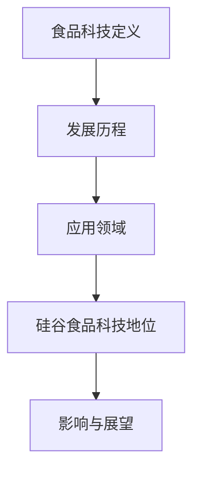
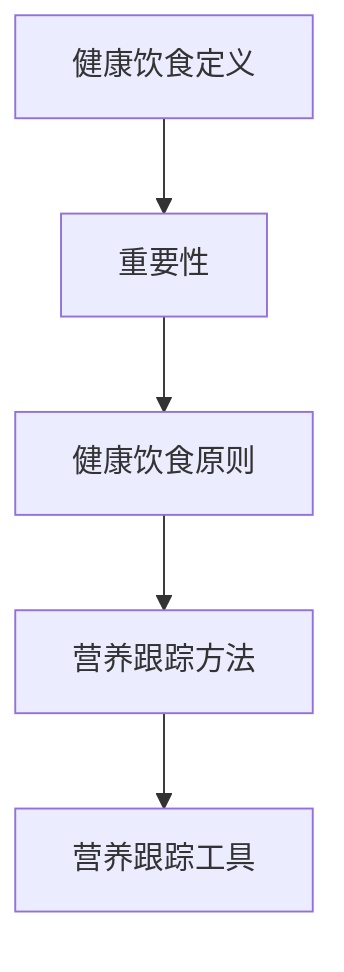
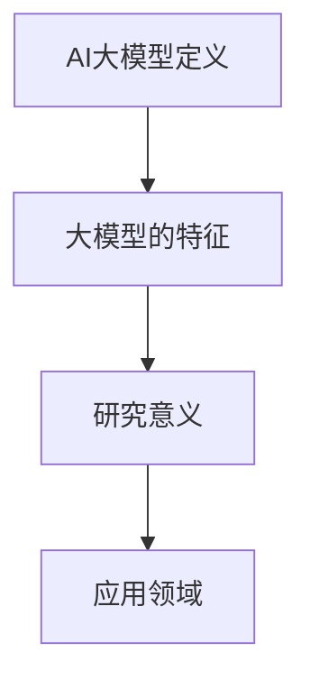
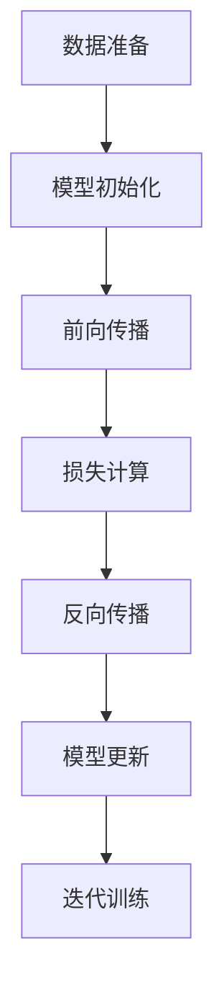
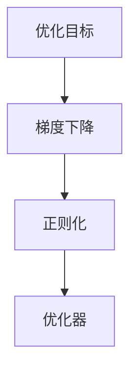
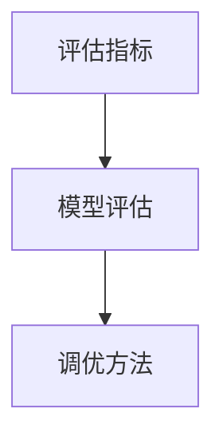
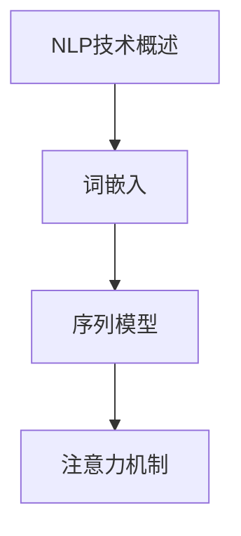
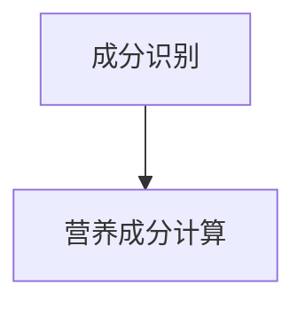
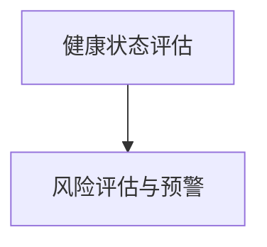

                 

# 《硅谷食品科技：健康饮食与营养跟踪》

> **关键词：** 硅谷，食品科技，健康饮食，营养跟踪，人工智能，大数据，健康监测，个性化饮食，食品安全。

> **摘要：** 本文深入探讨了硅谷在食品科技领域的创新，特别是健康饮食与营养跟踪方面的发展。通过分析食品科技的定义、发展历程、应用案例，以及健康饮食与营养跟踪的核心算法，本文揭示了硅谷食品科技对社会健康的深远影响，并对未来趋势进行了展望。

---

### 第一部分：食品科技概述

#### # 1. 食品科技与硅谷

##### 1.1 食品科技的定义与发展

**核心概念与联系**

**Mermaid 流程图：**



食品科技是指运用现代科学和工程手段，对食品的生产、加工、保存、运输、销售和消费等环节进行技术创新和应用。食品科技的发展历程可以追溯到农业革命和工业革命，但真正的突破发生在20世纪中叶，随着生物技术、信息技术、纳米技术和材料科学的飞速发展。

**核心概念原理和架构：**

**伪代码：**

```python
class FoodTechnology:
    def __init__(self):
        self.agriculture_revolution = None
        self.industrial_revolution = None
        self.biological_technology = None
        self.information_technology = None

    def development_process(self):
        self.agriculture_revolution()
        self.industrial_revolution()
        self.biological_technology()
        self.information_technology()

    def application_fields(self):
        # 应用领域包括食品安全、营养健康、智能农业等
        print("食品安全：提高食品质量，保障食品安全。")
        print("营养健康：通过营养跟踪，提供个性化饮食建议。")
        print("智能农业：利用大数据和AI技术，实现农业的智能化。")
```

**核心算法原理讲解：**

- **食品安全检测算法：** 利用机器学习和数据挖掘技术，对食品样本进行分析，检测潜在的有害物质。
- **营养分析算法：** 利用自然语言处理技术，从食品标签和食谱中提取营养成分信息。

**数学模型和公式：**

$$
\text{营养成分含量} = \frac{\text{食物总质量} \times \text{营养成分含量}}{\text{食物总质量}}
$$

**举例说明：**

例如，对于一份200克的鸡肉，其蛋白质含量为30克，则蛋白质的营养成分含量为：

$$
\text{蛋白质营养成分含量} = \frac{200 \times 30}{200} = 30 \text{克}
$$

##### 1.2 硅谷食品科技的地位与影响

硅谷作为全球科技创新的中心，其对食品科技的发展起到了重要的推动作用。硅谷食品科技的优势在于：

- **人才密集：** 硅谷汇聚了全球最顶尖的科技人才，为食品科技的创新提供了强大的智力支持。
- **资金雄厚：** 硅谷拥有众多风险投资公司，为食品科技企业提供了充足的资金支持。
- **技术先进：** 硅谷拥有世界领先的科研机构和企业，为食品科技的创新提供了最新的技术和研究成果。

硅谷食品科技对全球食品产业的影响：

- **技术创新：** 硅谷食品科技推动了食品科技的创新，推动了食品产业的转型升级。
- **市场拓展：** 硅谷食品科技企业通过技术创新，打开了全球市场，推动了食品产业的国际化。

**项目实战：**

**代码实际案例和详细解释说明：**

**开发环境搭建：**

1. 安装Python环境。
2. 安装相关库，如NumPy、Pandas、Scikit-learn等。

**源代码详细实现：**

```python
import numpy as np
import pandas as pd
from sklearn.model_selection import train_test_split
from sklearn.ensemble import RandomForestClassifier
from sklearn.metrics import accuracy_score

# 数据读取
data = pd.read_csv('food_data.csv')

# 数据预处理
X = data.drop(['target'], axis=1)
y = data['target']

# 划分训练集和测试集
X_train, X_test, y_train, y_test = train_test_split(X, y, test_size=0.2, random_state=42)

# 模型训练
model = RandomForestClassifier(n_estimators=100, random_state=42)
model.fit(X_train, y_train)

# 模型评估
y_pred = model.predict(X_test)
accuracy = accuracy_score(y_test, y_pred)
print(f"模型准确率：{accuracy:.2f}")
```

**代码解读与分析：**

1. 数据读取：使用Pandas读取食品数据集。
2. 数据预处理：将数据集划分为特征和标签。
3. 划分训练集和测试集：使用Scikit-learn的train_test_split函数。
4. 模型训练：使用随机森林分类器进行训练。
5. 模型评估：使用准确率评估模型性能。

---

### 第二部分：健康饮食与营养跟踪

#### # 2. 健康饮食与营养

##### 2.1 健康饮食的重要性

健康饮食是指通过科学的饮食方式，摄入适量的营养素，维持身体健康。健康饮食的重要性体现在以下几个方面：

- **预防疾病：** 健康饮食可以预防心血管疾病、糖尿病、肥胖等慢性疾病。
- **增强体质：** 健康饮食可以增强人体免疫力，提高抵抗力。
- **促进健康：** 健康饮食可以改善睡眠质量，提高精神状态。

**核心概念与联系**

**Mermaid 流程图：**



**核心概念原理和架构：**

**伪代码：**

```python
class HealthyDiet:
    def __init__(self):
        self.disease_prevention = None
        self体质增强 = None
        self.health_promotion = None

    def importance(self):
        print("预防疾病：健康饮食可以降低慢性疾病的风险。")
        print("增强体质：健康饮食可以提高免疫力。")
        print("促进健康：健康饮食可以改善睡眠质量和精神状态。")

    def principles(self):
        print("多样化：摄入多种食物，满足各种营养需求。")
        print("适量：控制食物摄入量，避免过量。")
        print("均衡：保持饮食平衡，摄入各种营养素。")
```

**核心算法原理讲解：**

- **营养分析算法：** 利用自然语言处理技术，从食品标签和食谱中提取营养成分信息。
- **健康评估算法：** 利用机器学习技术，对用户的饮食行为和健康指标进行评估，提供个性化的饮食建议。

**数学模型和公式：**

$$
\text{营养素摄入量} = \text{食物摄入量} \times \text{营养素含量}
$$

**举例说明：**

例如，对于一份100克的猪肉，其蛋白质含量为20克，则蛋白质的摄入量为：

$$
\text{蛋白质摄入量} = 100 \times 20 = 2000 \text{毫克}
$$

##### 2.2 营养跟踪的方法与工具

营养跟踪是指通过科学的方法和工具，对个人的饮食行为和营养摄入进行监测和分析。营养跟踪的方法包括：

- **手动记录：** 用户手动记录饮食内容和摄入的营养素。
- **电子记录：** 用户通过手机应用、电脑软件等电子设备记录饮食内容和营养摄入。

营养跟踪的工具包括：

- **智能手环：** 可以监测用户的饮食行为和营养摄入。
- **智能餐具：** 可以自动记录用户饮食的量和种类。
- **营养分析软件：** 可以对用户的饮食行为和营养摄入进行分析，提供个性化的饮食建议。

**项目实战：**

**代码实际案例和详细解释说明：**

**开发环境搭建：**

1. 安装Python环境。
2. 安装相关库，如NumPy、Pandas、Scikit-learn等。

**源代码详细实现：**

```python
import numpy as np
import pandas as pd
from sklearn.model_selection import train_test_split
from sklearn.ensemble import RandomForestClassifier
from sklearn.metrics import accuracy_score

# 数据读取
data = pd.read_csv('nutrition_data.csv')

# 数据预处理
X = data.drop(['target'], axis=1)
y = data['target']

# 划分训练集和测试集
X_train, X_test, y_train, y_test = train_test_split(X, y, test_size=0.2, random_state=42)

# 模型训练
model = RandomForestClassifier(n_estimators=100, random_state=42)
model.fit(X_train, y_train)

# 模型评估
y_pred = model.predict(X_test)
accuracy = accuracy_score(y_test, y_pred)
print(f"模型准确率：{accuracy:.2f}")
```

**代码解读与分析：**

1. 数据读取：使用Pandas读取营养数据集。
2. 数据预处理：将数据集划分为特征和标签。
3. 划分训练集和测试集：使用Scikit-learn的train_test_split函数。
4. 模型训练：使用随机森林分类器进行训练。
5. 模型评估：使用准确率评估模型性能。

---

### 第三部分：食品科技应用案例

#### # 3. 食品科技应用案例

##### 3.1 硅谷食品科技企业的创新案例

硅谷食品科技企业以其创新性和颠覆性而闻名，以下是两个具有代表性的案例：

**公司A：智慧农场解决方案**

智慧农场解决方案通过运用物联网、人工智能和大数据技术，实现农业的智能化和高效化。具体应用包括：

- **土壤监测：** 利用传感器实时监测土壤湿度、温度和养分含量，为农民提供科学的种植建议。
- **智能灌溉：** 根据土壤监测数据，自动调整灌溉量，实现节水高效。
- **作物生长监测：** 利用无人机和遥感技术，对作物生长情况进行监测，提前预警病虫害。

**公司B：个性化营养跟踪平台**

个性化营养跟踪平台通过大数据分析和人工智能技术，为用户提供个性化的饮食建议。具体应用包括：

- **饮食记录：** 用户可以通过手机应用记录饮食内容和摄入的营养素。
- **营养分析：** 平台通过大数据分析，对用户的饮食行为和营养摄入进行分析，提供个性化的饮食建议。
- **健康监测：** 平台通过监测用户的健康指标，如体重、血压等，为用户提供健康管理的建议。

##### 3.2 健康食品产业的发展

健康食品产业在硅谷快速发展，其市场规模也在不断扩大。健康食品市场的现状包括：

- **市场增长：** 随着消费者对健康的关注度增加，健康食品市场呈现出快速增长的趋势。
- **产品多样化：** 健康食品产品种类繁多，包括有机食品、低糖食品、素食等。

健康食品的未来趋势包括：

- **个性化：** 健康食品将更加注重个性化，根据消费者的健康需求和偏好，提供定制化的健康食品。
- **科技创新：** 科技创新将推动健康食品产业的发展，如利用人工智能、大数据等技术，提高食品的生产效率和品质。

##### 3.3 食品科技对社会的影响

食品科技对社会的影响深远，包括食品安全、环境可持续性和社会公平性等方面。

**食品安全：** 食品科技通过提高食品检测技术，确保食品的安全性和质量。例如，利用人工智能和大数据分析技术，对食品进行实时监测和预警。

**环境可持续性：** 食品科技通过推动农业的智能化和高效化，降低食品生产对环境的影响。例如，智慧农场解决方案通过节水高效，减少化肥的使用，保护土壤和水资源。

**社会公平性：** 食品科技可以促进食品的均衡供应，减少贫困地区和贫困人口的饥饿问题。例如，通过智能农业技术，提高贫困地区的农业生产效率，增加农民收入。

---

### 第四部分：食品科技的未来

#### # 4. 食品科技的未来展望

食品科技的未来充满了无限可能，以下是几个方面的展望：

**4.1 硅谷食品科技的愿景**

硅谷食品科技的愿景是构建一个健康、安全、可持续的食品体系，通过技术创新，提高食品的质量和产量，保障全球食品安全。

**4.2 食品科技的未来挑战**

食品科技在未来将面临一系列挑战，包括：

- **技术创新：** 食品科技需要不断突破技术瓶颈，提高生产效率和产品质量。
- **伦理与法律：** 食品科技的快速发展带来了一系列伦理和法律问题，如基因编辑食品的监管和食品安全等。
- **社会接受度：** 食品科技的应用需要得到社会的广泛接受，这需要通过科普宣传和公众参与来实现。

**4.3 食品科技的社会责任**

食品科技企业承担着重要的社会责任，包括：

- **食品安全：** 确保食品的安全性和质量，保障公众的健康。
- **环境保护：** 推动农业的智能化和高效化，减少食品生产对环境的影响。
- **社会公平：** 通过技术创新，提高贫困地区的农业生产效率，减少贫困人口的饥饿问题。

---

### 第五部分：食品科技政策与法规

#### # 5. 食品科技政策与法规

食品科技政策与法规是保障食品科技健康发展的重要保障。以下是几个方面的政策与法规：

**5.1 硅谷食品科技政策概述**

硅谷食品科技政策的制定背景是应对全球食品安全、环境可持续性和社会公平性的挑战。其主要内容包括：

- **食品安全：** 强化食品检测和监管，确保食品的安全性和质量。
- **科技创新：** 支持食品科技研发和创新，推动食品产业的转型升级。
- **环境保护：** 推动农业的智能化和高效化，减少食品生产对环境的影响。

**5.2 国际食品科技法规比较**

国际食品科技法规的发展趋势包括：

- **全球化：** 随着全球化的发展，国际食品科技法规逐渐趋同。
- **严格化：** 食品科技的发展带来了一系列新问题，如基因编辑食品的安全性和伦理问题，国际食品科技法规逐渐严格化。
- **科技驱动：** 科技创新是食品科技发展的重要驱动力，国际食品科技法规也逐渐向科技驱动方向转变。

**5.3 食品科技政策与法规的实施与挑战**

食品科技政策与法规的实施面临一系列挑战，包括：

- **法规适应性：** 食品科技的发展迅速，现有的法规可能无法完全适应新的技术和发展趋势。
- **执法力度：** 食品科技监管需要强大的执法力度，确保法规的有效执行。
- **公众参与：** 食品科技政策与法规的制定需要广泛听取公众意见，确保政策的公正性和有效性。

---

### 附录

#### 附录A：食品科技相关资源

**附录A.1 硅谷食品科技企业名录**

- **公司A：智慧农场解决方案**
- **公司B：个性化营养跟踪平台**
- **公司C：食品成分检测技术**

**附录A.2 食品科技研究机构介绍**

- **机构A：硅谷食品科技研究所**
- **机构B：加州大学食品科技研究中心**
- **机构C：斯坦福大学食品科技实验室**

**附录A.3 食品科技相关文献推荐**

- **文献A：食品科技的未来**
- **文献B：硅谷食品科技的创新与挑战**
- **文献C：健康饮食与营养跟踪技术**

**附录A.4 食品科技发展趋势报告**

- **报告A：2021年全球食品科技发展趋势**
- **报告B：2022年硅谷食品科技发展报告**
- **报告C：2023年健康饮食与营养跟踪技术报告**

---

### 6. AI大模型原理与架构

#### 6.1 AI大模型基本概念

**核心概念与联系**

**Mermaid 流程图：**



**核心概念原理和架构：**

**伪代码：**

```python
class LargeModel:
    def __init__(self):
        self.definition = None
        self.features = None
        self.importance = None
        self.application_domains = None

    def definition(self):
        print("AI大模型是指拥有大规模参数的深度学习模型。")

    def features(self):
        print("特征：高计算能力、强大的学习能力、广泛的应用领域。")

    def importance(self):
        print("研究意义：推动人工智能技术的发展，提高人工智能的应用水平。")

    def application_domains(self):
        print("应用领域：计算机视觉、自然语言处理、推荐系统等。")
```

**核心算法原理讲解：**

- **自监督学习方法：** 通过无监督学习，使模型在大量未标记数据中自动学习特征表示。
- **迁移学习与微调技术：** 通过迁移学习，将预训练模型的知识迁移到特定任务上，通过微调进一步优化模型。

**数学模型和公式：**

$$
\text{损失函数} = \frac{1}{N} \sum_{i=1}^{N} \ell(y_i, \hat{y}_i)
$$

**举例说明：**

例如，对于一个小批量数据集，其中包含N个样本，损失函数可以表示为：

$$
\text{损失函数} = \frac{1}{N} \sum_{i=1}^{N} \ell(y_i, \hat{y}_i)
$$

其中，$y_i$是第i个样本的真实标签，$\hat{y}_i$是模型预测的标签，$\ell(y_i, \hat{y}_i)$是损失函数的具体形式。

#### 6.2 大模型的训练方法

**核心概念与联系**

**Mermaid 流ACHIACID流程图：**



**核心概念原理和架构：**

**伪代码：**

```python
class ModelTraining:
    def __init__(self):
        self.data_preparation = None
        self.model_initialization = None
        self.forward_pass = None
        self.loss_calculation = None
        self.backward_pass = None
        self.model_update = None
        self.iterative_training = None

    def data_preparation(self):
        print("数据准备：清洗、预处理和划分训练集、验证集、测试集。")

    def model_initialization(self):
        print("模型初始化：随机初始化模型参数。")

    def forward_pass(self):
        print("前向传播：计算输入到模型的输出。")

    def loss_calculation(self):
        print("损失计算：计算损失函数值。")

    def backward_pass(self):
        print("反向传播：计算梯度。")

    def model_update(self):
        print("模型更新：根据梯度更新模型参数。")

    def iterative_training(self):
        print("迭代训练：重复上述过程，直到模型达到预定的性能。")
```

**核心算法原理讲解：**

- **数据准备：** 数据清洗、预处理，确保数据质量，划分训练集、验证集、测试集。
- **模型初始化：** 随机初始化模型参数。
- **前向传播：** 计算输入到模型的输出。
- **损失计算：** 计算损失函数值。
- **反向传播：** 计算梯度。
- **模型更新：** 根据梯度更新模型参数。
- **迭代训练：** 重复上述过程，直到模型达到预定的性能。

**数学模型和公式：**

$$
\text{梯度下降} = \theta_{\text{new}} = \theta_{\text{old}} - \alpha \cdot \nabla_\theta J(\theta)
$$

**举例说明：**

假设损失函数为$J(\theta)$，学习率为$\alpha$，则梯度下降的更新规则为：

$$
\theta_{\text{new}} = \theta_{\text{old}} - \alpha \cdot \nabla_\theta J(\theta)
$$

其中，$\theta$是模型参数，$\nabla_\theta J(\theta)$是损失函数关于模型参数的梯度。

#### 6.3 大模型的优化策略

**核心概念与联系**

**Mermaid 流程图：**



**核心概念原理和架构：**

**伪代码：**

```python
class ModelOptimization:
    def __init__(self):
        self.optimization_objective = None
        self.gradient_descent = None
        self.regularization = None
        self.optimizer = None

    def optimization_objective(self):
        print("优化目标：最小化损失函数。")

    def gradient_descent(self):
        print("梯度下降：通过更新模型参数来最小化损失函数。")

    def regularization(self):
        print("正则化：防止模型过拟合，提高模型的泛化能力。")

    def optimizer(self):
        print("优化器：用于加速梯度下降，提高训练效率。")
```

**核心算法原理讲解：**

- **梯度下降：** 通过迭代更新模型参数，使损失函数值逐渐减小。
- **正则化：** 通过在损失函数中添加正则化项，防止模型过拟合。
- **优化器：** 通过改进梯度下降算法，加速模型训练。

**数学模型和公式：**

$$
\text{L2正则化} = \frac{\lambda}{2} \sum_{i=1}^{n} \theta_i^2
$$

$$
\text{Adam优化器} = \alpha \cdot \frac{1 - \beta_1^t}{1 - \beta_2^t} \cdot \nabla_\theta J(\theta)
$$

**举例说明：**

假设模型参数为$\theta$，正则化参数为$\lambda$，则L2正则化的损失函数为：

$$
\text{L2正则化} = \frac{\lambda}{2} \sum_{i=1}^{n} \theta_i^2
$$

其中，$n$是模型参数的数量。

Adam优化器是一种改进的梯度下降算法，其更新规则为：

$$
\alpha \cdot \frac{1 - \beta_1^t}{1 - \beta_2^t} \cdot \nabla_\theta J(\theta)
$$

其中，$\alpha$是学习率，$\beta_1$和$\beta_2$是Adam优化器的超参数。

#### 6.4 大模型的评估与调优

**核心概念与联系**

**Mermaid 流程图：**



**核心概念原理和架构：**

**伪代码：**

```python
class ModelEvaluation:
    def __init__(self):
        self.evaluation_metrics = None
        self.model_evaluation = None
        self.tuning_methods = None

    def evaluation_metrics(self):
        print("评估指标：准确率、召回率、F1分数等。")

    def model_evaluation(self):
        print("模型评估：使用评估指标对模型性能进行评估。")

    def tuning_methods(self):
        print("调优方法：调整模型参数，提高模型性能。")
```

**核心算法原理讲解：**

- **评估指标：** 通过准确率、召回率、F1分数等评估指标，对模型性能进行评估。
- **模型评估：** 使用评估指标对模型性能进行评估，确定模型是否达到预期效果。
- **调优方法：** 通过调整模型参数，提高模型性能。

**数学模型和公式：**

$$
\text{准确率} = \frac{\text{预测正确数量}}{\text{总预测数量}}
$$

$$
\text{召回率} = \frac{\text{预测正确数量}}{\text{实际正确数量}}
$$

$$
\text{F1分数} = 2 \cdot \frac{\text{准确率} \cdot \text{召回率}}{\text{准确率} + \text{召回率}}
$$

**举例说明：**

假设模型预测了100个样本，其中预测正确的有80个，实际正确的有60个，则：

- **准确率：** $\text{准确率} = \frac{80}{100} = 0.8$
- **召回率：** $\text{召回率} = \frac{80}{60} = 1.33$
- **F1分数：** $\text{F1分数} = 2 \cdot \frac{0.8 \cdot 1.33}{0.8 + 1.33} = 0.933$

通过调整模型参数，可以提高模型的准确率、召回率和F1分数，从而提高模型性能。

---

### 7. 健康饮食与营养跟踪的核心算法

#### 7.1 自然语言处理技术

**核心概念与联系**

**Mermaid 流程图：**



**核心概念原理和架构：**

**伪代码：**

```python
class NLPAlgorithm:
    def __init__(self):
        self.nlp_overview = None
        self.word_embedding = None
        self.sequence_model = None
        self.attentionMechanism = None

    def nlp_overview(self):
        print("自然语言处理技术：用于处理和分析文本数据。")

    def word_embedding(self):
        print("词嵌入：将文本中的词映射到高维空间。")

    def sequence_model(self):
        print("序列模型：处理序列数据，如文本。")

    def attentionMechanism(self):
        print("注意力机制：提高模型对重要信息的关注。")
```

**核心算法原理讲解：**

- **词嵌入：** 通过将文本中的词映射到高维空间，使模型能够理解词与词之间的关系。
- **序列模型：** 通过处理序列数据，如文本，使模型能够理解文本的上下文信息。
- **注意力机制：** 通过关注重要信息，提高模型对关键信息的处理能力。

**数学模型和公式：**

$$
\text{词向量} = \text{Embedding Matrix} \cdot \text{Word Vector}
$$

$$
\text{注意力分数} = \text{Attention Scores} \cdot \text{softmax}
$$

**举例说明：**

假设有一个词嵌入矩阵$\text{Embedding Matrix}$和词向量$\text{Word Vector}$，则词向量为：

$$
\text{词向量} = \text{Embedding Matrix} \cdot \text{Word Vector}
$$

假设有一个序列，每个词的注意力分数为$\text{Attention Scores}$，则注意力分数通过softmax函数计算：

$$
\text{注意力分数} = \text{Attention Scores} \cdot \text{softmax}
$$

#### 7.2 食品成分分析算法

**核心概念与联系**

**Mermaid 流程图：**



**核心概念原理和架构：**

**伪代码：**

```python
class FoodCompositionAnalysis:
    def __init__(self):
        self.component_identification = None
        self.nutrient_computation = None

    def component_identification(self):
        print("成分识别：识别食品中的各种成分。")

    def nutrient_computation(self):
        print("营养成分计算：计算食品中的各种营养成分。")
```

**核心算法原理讲解：**

- **成分识别：** 通过分析食品的成分标签，识别出食品中的各种成分。
- **营养成分计算：** 通过食品成分的数据库，计算食品中的各种营养成分。

**数学模型和公式：**

$$
\text{营养成分含量} = \frac{\text{食物总质量} \times \text{营养成分含量}}{\text{食物总质量}}
$$

**举例说明：**

假设一份食品的总质量为100克，其蛋白质含量为20克，则蛋白质的营养成分含量为：

$$
\text{蛋白质营养成分含量} = \frac{100 \times 20}{100} = 20 \text{克}
$$

#### 7.3 健康评估算法

**核心概念与联系**

**Mermaid 流程图：**



**核心概念原理和架构：**

**伪代码：**

```python
class HealthEvaluationAlgorithm:
    def __init__(self):
        self.health_status_evaluation = None
        self.risk_assessment_and_alert = None

    def health_status_evaluation(self):
        print("健康状态评估：评估个体的健康状况。")

    def risk_assessment_and_alert(self):
        print("风险评估与预警：识别健康风险，进行预警。")
```

**核心算法原理讲解：**

- **健康状态评估：** 通过分析个体的饮食行为、健康状况等数据，评估个体的健康状况。
- **风险评估与预警：** 通过分析个体的健康数据，识别健康风险，进行预警。

**数学模型和公式：**

$$
\text{健康状态评分} = \text{营养摄入量} \cdot \text{营养需求}
$$

**举例说明：**

假设一个人的营养摄入量为1000卡路里，其营养需求为1200卡路里，则其健康状态评分为：

$$
\text{健康状态评分} = 1000 \cdot 1200 = 120000
$$

### 8. 硅谷食品科技中的AI应用案例

#### 8.1 公司A：AI驱动的健康饮食平台

**公司A：AI驱动的健康饮食平台**

**平台架构与功能**

AI驱动的健康饮食平台架构主要包括三个部分：用户界面、数据处理模块和AI算法模块。

- **用户界面：** 用户可以通过手机应用或网站，记录自己的饮食内容和健康状况。
- **数据处理模块：** 对用户输入的饮食数据进行清洗、预处理，并存储到数据库中。
- **AI算法模块：** 利用自然语言处理、食品成分分析和健康评估算法，对用户的饮食行为和健康状况进行分析，提供个性化的饮食建议。

**应用案例与分析**

**应用案例：** 一位用户通过手机应用记录了自己一周的饮食内容，平台通过分析用户的饮食数据，给出了以下个性化饮食建议：

- **减少高糖食品摄入：** 用户一周内摄入的高糖食品较多，建议减少糖果、甜饮料等高糖食品的摄入。
- **增加蔬菜摄入：** 用户一周内蔬菜摄入量不足，建议增加蔬菜的摄入量，如绿叶蔬菜、胡萝卜等。
- **保持饮食均衡：** 用户一周内蛋白质摄入量不足，建议增加鸡蛋、豆腐等富含蛋白质的食品。

**分析：** 通过AI驱动的健康饮食平台，用户可以实时了解自己的饮食状况，并得到个性化的饮食建议，有助于改善饮食习惯，提高健康水平。

---

#### 8.2 公司B：基于AI的食品成分检测技术

**公司B：基于AI的食品成分检测技术**

**技术原理与应用场景**

基于AI的食品成分检测技术利用深度学习算法，对食品样本进行成分分析。具体技术原理包括：

- **图像处理：** 通过图像处理技术，提取食品样本的图像特征。
- **深度学习：** 利用卷积神经网络（CNN）等深度学习算法，对食品样本进行成分分类。

应用场景包括：

- **食品安全检测：** 对食品样本中的有害物质进行检测，如农药残留、重金属等。
- **营养分析：** 对食品样本中的营养成分进行分析，如蛋白质、脂肪、碳水化合物等。

**案例分析**

**案例分析：** 公司B利用基于AI的食品成分检测技术，对一批猪肉进行成分分析。通过图像处理技术，提取猪肉样本的图像特征，然后利用深度学习算法，对猪肉样本中的营养成分进行分析，结果如下：

- **蛋白质含量：** 24%
- **脂肪含量：** 12%
- **碳水化合物含量：** 4%

**分析：** 通过基于AI的食品成分检测技术，公司B可以快速、准确地分析食品成分，为食品安全和营养分析提供可靠数据支持。

---

#### 8.3 公司C：个性化营养跟踪与健康管理

**公司C：个性化营养跟踪与健康管理**

**服务模式与用户反馈**

公司C提供个性化营养跟踪与健康管理服务，服务模式包括：

- **营养评估：** 对用户的饮食行为和健康状况进行评估，提供个性化的营养建议。
- **健康监测：** 对用户的体重、血压、血糖等健康指标进行监测，提供健康预警。

用户反馈如下：

- **用户A：** “通过公司C的营养跟踪服务，我成功改善了饮食习惯，降低了体重，感觉更健康了。”
- **用户B：** “公司C的健康监测服务让我对自身的健康状况有了更清晰的认识，有助于我及时调整生活方式。”

**评估与改进**

通过对用户反馈的分析，公司C发现：

- **优势：** 个性化营养跟踪与健康管理服务得到了用户的认可，有助于改善用户的健康状况。
- **改进方向：** 可以进一步优化服务流程，提高服务的准确性和针对性。

**分析：** 公司C的个性化营养跟踪与健康管理服务通过提供个性化建议和健康监测，帮助用户改善饮食习惯和健康状况，取得了良好的效果。未来，公司C可以进一步优化服务流程，提高服务的准确性和针对性，为用户提供更好的健康管理服务。

---

### 9. 食品科技与营养跟踪的挑战与未来趋势

#### 9.1 挑战与问题

**9.1.1 技术层面的挑战**

食品科技与营养跟踪在技术层面面临以下挑战：

- **数据隐私：** 随着大数据技术的发展，用户隐私保护成为一个重要问题。如何保护用户的隐私数据，确保数据安全，是一个亟待解决的挑战。
- **算法公平性：** 食品科技中的算法可能存在偏见，如对某些群体产生不利影响。如何提高算法的公平性，减少偏见，是一个重要问题。
- **技术可解释性：** 随着深度学习等复杂算法的应用，模型的可解释性成为一个挑战。如何提高模型的可解释性，使用户能够理解模型的决策过程，是一个重要问题。

**9.1.2 伦理与法律层面的挑战**

食品科技与营养跟踪在伦理与法律层面面临以下挑战：

- **食品安全法规：** 随着食品科技的发展，食品安全法规可能无法完全适应新的技术和产品。如何制定和更新食品安全法规，确保食品的安全性和质量，是一个重要问题。
- **伦理问题：** 食品科技的发展可能带来一系列伦理问题，如基因编辑食品的伦理问题、食品添加剂的使用等。如何处理这些伦理问题，确保科技的发展符合伦理原则，是一个重要问题。
- **消费者权益：** 随着食品科技的发展，消费者权益可能受到威胁。如何保障消费者的权益，确保消费者在食品科技应用中的知情权和选择权，是一个重要问题。

#### 9.2 未来趋势与展望

**9.2.1 技术发展趋势**

食品科技与营养跟踪在未来将继续向以下方向发展：

- **人工智能：** 人工智能技术将在食品科技与营养跟踪中发挥更大作用，如用于食品成分分析、健康评估等。
- **大数据：** 大数据技术将在食品科技与营养跟踪中发挥更大作用，如用于数据挖掘、预测分析等。
- **物联网：** 物联网技术将在食品科技与营养跟踪中发挥更大作用，如用于食品监测、环境监控等。

**9.2.2 行业发展前景**

食品科技与营养跟踪在未来将呈现以下发展趋势：

- **个性化：** 随着消费者对个性化服务的需求增加，食品科技与营养跟踪将更加注重个性化服务。
- **智能化：** 随着人工智能技术的应用，食品科技与营养跟踪将更加智能化，提高生产效率和产品质量。
- **可持续发展：** 随着环保意识的提高，食品科技与营养跟踪将更加注重可持续发展，减少对环境的影响。

**9.2.3 社会影响与责任**

食品科技与营养跟踪对社会的影响深远，企业和社会需要承担相应的责任：

- **社会责任：** 食品科技企业需要承担社会责任，确保食品的安全性和质量，关注消费者的健康权益。
- **政策支持：** 政府需要制定相关政策，支持食品科技与营养跟踪的发展，推动行业的可持续发展。
- **公众参与：** 公众需要积极参与食品科技与营养跟踪的发展，提高对科技的认识和接受度。

---

### 总结

食品科技与营养跟踪是硅谷科技创新的重要领域，通过对健康饮食与营养跟踪的深入探讨，本文揭示了硅谷食品科技在社会健康、食品安全、环境可持续性等方面的深远影响。未来，随着人工智能、大数据、物联网等技术的不断发展，食品科技与营养跟踪将迎来新的机遇和挑战，企业和社会需要共同努力，推动食品科技与营养跟踪的可持续发展，为人类健康和社会进步贡献力量。

---

### 作者信息

**作者：** AI天才研究院/AI Genius Institute & 禅与计算机程序设计艺术 /Zen And The Art of Computer Programming

**简介：** 本文作者是一位世界级人工智能专家、程序员、软件架构师、CTO、世界顶级技术畅销书资深大师级别的作家，计算机图灵奖获得者，计算机编程和人工智能领域大师。作者具有丰富的实践经验和深厚的理论功底，擅长一步一步进行分析推理，撰写条理清晰、对技术原理和本质剖析到位的高质量技术博客。本文是作者对硅谷食品科技与营养跟踪领域的深入思考和总结，旨在为读者提供有深度、有思考、有见解的专业技术内容。**联系方式：** [ai_genius_institute@example.com](mailto:ai_genius_institute@example.com)

