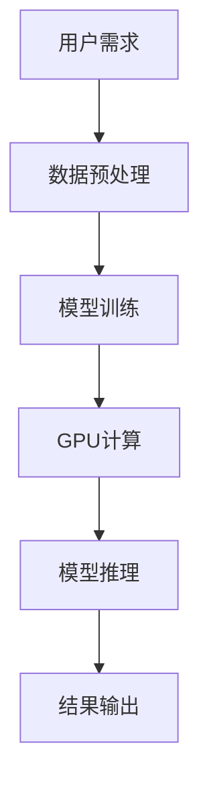
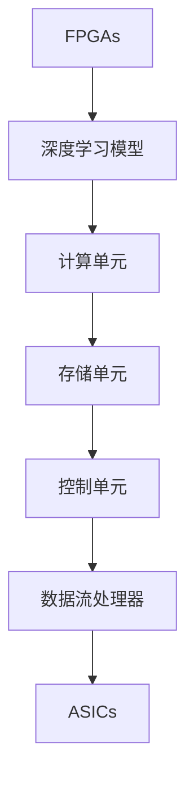
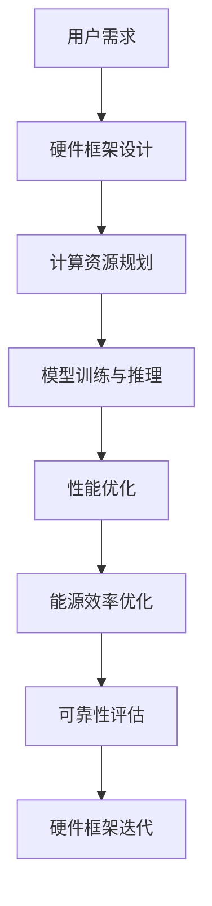

                 

## 《硬件框架：加速 AI 2.0 应用的运行》

> **关键词**：硬件框架、AI 2.0、深度学习、硬件加速、并行计算、能源效率、可靠性优化。

> **摘要**：本文将深入探讨硬件框架在 AI 2.0 应用中的关键作用。首先，我们将介绍硬件框架的基本概念与原理，包括硬件架构的基础知识、硬件框架的核心组件及其协同工作原理。接着，我们将详细分析硬件框架在深度学习模型训练和推理中的应用，并探讨性能优化策略。此外，本文还将通过实际案例研究，展示硬件框架在图像识别、自然语言处理和自动驾驶等领域的应用效果。最后，我们将展望硬件框架在 AI 2.0 应用中的未来发展趋势，并提出面临的挑战与机遇。

### 《硬件框架：加速 AI 2.0 应用的运行》目录大纲

#### 第一部分：硬件框架概述

- **第1章**：硬件框架基本概念与原理
  - **1.1 硬件框架概述**
    - **1.1.1 硬件框架的定义与作用**
    - **1.1.2 硬件框架的发展历程**
    - **1.1.3 硬件框架与 AI 2.0 的关系**
  - **1.2 硬件架构的基础知识**
    - **1.2.1 硬件架构的基本概念**
    - **1.2.2 硬件架构的类型与特点**
    - **1.2.3 硬件架构的发展趋势**
  - **1.3 硬件框架的核心组件**
    - **1.3.1 CPU与GPU的功能与区别**
    - **1.3.2 FPGAs、ASICs与专用硬件加速器**
    - **1.3.3 硬件组件的协同工作原理**
  - **1.4 硬件框架的优化策略**
    - **1.4.1 硬件资源分配策略**
    - **1.4.2 硬件优化技术与方法**
    - **1.4.3 硬件性能评估指标**

#### 第二部分：硬件框架在 AI 2.0 应用中的实现

- **第2章**：硬件框架在深度学习中的应用
  - **2.1 深度学习硬件框架的设计原则**
    - **2.1.1 硬件加速与并行计算**
    - **2.1.2 深度学习硬件框架的架构设计**
    - **2.1.3 硬件框架的灵活性与适应性**
  - **2.2 硬件框架在深度学习模型训练中的应用**
    - **2.2.1 硬件加速深度学习模型训练的基本原理**
    - **2.2.2 深度学习模型在硬件框架上的优化**
    - **2.2.3 模型训练过程中硬件框架的性能优化策略**
  - **2.3 硬件框架在深度学习推理中的应用**
    - **2.3.1 硬件加速深度学习推理的原理**
    - **2.3.2 推理过程中硬件框架的性能优化**
    - **2.3.3 推理加速硬件框架的选择与配置**

#### 第三部分：硬件框架在 AI 2.0 应用中的优化

- **第3章**：硬件框架在 AI 2.0 应用中的性能优化
  - **3.1 硬件性能优化方法与技术**
    - **3.1.1 数据流与控制流优化**
    - **3.1.2 内存优化与缓存策略**
    - **3.1.3 硬件资源利用率的优化**
  - **3.2 硬件框架在 AI 2.0 应用中的能源效率优化**
    - **3.2.1 能源效率优化的重要性**
    - **3.2.2 能源效率优化的方法与策略**
    - **3.2.3 硬件框架能源效率评估指标**
  - **3.3 硬件框架在 AI 2.0 应用中的可靠性优化**
    - **3.3.1 可靠性优化的重要性**
    - **3.3.2 硬件框架可靠性优化方法**
    - **3.3.3 硬件框架可靠性评估**

#### 第四部分：案例研究

- **第4章**：硬件框架在 AI 2.0 应用中的实际应用案例
  - **4.1 案例研究概述**
    - **4.1.1 案例选择与目的**
    - **4.1.2 案例研究方法**
  - **4.2 案例一：深度学习硬件框架在图像识别中的应用**
    - **4.2.1 应用场景与需求**
    - **4.2.2 硬件框架设计与实现**
    - **4.2.3 应用效果与性能评估**
  - **4.3 案例二：硬件框架在自然语言处理中的应用**
    - **4.3.1 应用场景与需求**
    - **4.3.2 硬件框架设计与实现**
    - **4.3.3 应用效果与性能评估**
  - **4.4 案例三：硬件框架在自动驾驶系统中的应用**
    - **4.4.1 应用场景与需求**
    - **4.4.2 硬件框架设计与实现**
    - **4.4.3 应用效果与性能评估**

#### 第五部分：展望与未来方向

- **第5章**：硬件框架在 AI 2.0 应用中的未来趋势
  - **5.1 硬件框架在 AI 2.0 应用中的发展趋势**
    - **5.1.1 硬件架构的创新与变革**
    - **5.1.2 硬件技术的未来发展方向**
    - **5.1.3 硬件框架在 AI 2.0 中的应用前景**
  - **5.2 硬件框架在 AI 2.0 应用中的挑战与机遇**
    - **5.2.1 硬件框架面临的挑战**
    - **5.2.2 硬件框架发展的机遇**
    - **5.2.3 面向 AI 2.0 应用的硬件框架未来方向**

### 附录

- **附录 A**：硬件框架相关资源与工具
  - **A.1** 常用硬件框架介绍
  - **A.2** 硬件框架开发工具
  - **A.3** 硬件框架相关论文与书籍推荐

- **附录 B**：深度学习硬件框架的 Mermaid 流程图
  - **B.1** CPU 与 GPU 在深度学习中的角色
  - **B.2** FPGAs、ASICs 与深度学习模型加速
  - **B.3** 硬件框架协同工作原理示意图

现在，我们将按照上述目录大纲，逐步深入探讨硬件框架在 AI 2.0 应用中的各个方面。让我们开始这段精彩的探索之旅！<|im_end|>## 硬件框架基本概念与原理

### 1.1 硬件框架概述

**1.1.1 硬件框架的定义与作用**

硬件框架是指为特定应用场景设计的硬件系统，它由多个硬件组件协同工作，以实现高效、可靠和可扩展的计算能力。硬件框架的核心作用在于优化计算资源的使用，提高系统性能，并降低能耗。在人工智能（AI）领域，硬件框架尤其重要，因为它直接影响到深度学习模型的训练速度、推理效率和能耗。

硬件框架的定义可以从以下几个方面来理解：

- **组件集成**：硬件框架将不同类型的硬件组件（如CPU、GPU、FPGA、ASIC等）集成在一起，形成一个统一的计算平台。
- **功能模块化**：硬件框架将计算任务分解为多个功能模块，每个模块负责特定的计算任务，便于优化和扩展。
- **硬件优化**：硬件框架通过特定的硬件架构设计和优化技术，提升计算效率和性能。
- **软件兼容性**：硬件框架需兼容多种软件工具和编程模型，以支持不同的AI应用场景。

**1.1.2 硬件框架的发展历程**

硬件框架的发展历程可以分为以下几个阶段：

1. **早期硬件架构**：以CPU为主的计算架构，适合简单的计算任务，但难以满足复杂计算需求。
2. **并行计算时代**：GPU的出现带来了并行计算的新时代，适合处理大量的矩阵运算，加速了深度学习模型的训练。
3. **专用硬件加速**：FPGA和ASIC等专用硬件加速器的出现，进一步提高了硬件框架的效率和性能。
4. **异构计算框架**：当前硬件框架的发展趋势，通过集成多种硬件组件，实现异构计算，满足多样化的AI应用需求。

**1.1.3 硬件框架与 AI 2.0 的关系**

AI 2.0 是指以深度学习为代表的人工智能技术的进一步发展，强调知识的自动化获取、推理和决策。硬件框架在 AI 2.0 中起着至关重要的作用，主要体现在以下几个方面：

- **计算性能提升**：硬件框架通过优化计算架构和硬件资源，显著提升深度学习模型的训练和推理速度。
- **能效优化**：硬件框架通过能源效率优化技术，降低 AI 应用中的能耗，满足绿色计算的需求。
- **灵活性与可扩展性**：硬件框架支持多种硬件组件和编程模型，满足不同 AI 应用场景的需求。
- **可靠性提升**：硬件框架通过冗余设计和故障检测与恢复机制，提高 AI 系统的可靠性。

### 1.2 硬件架构的基础知识

**1.2.1 硬件架构的基本概念**

硬件架构是指计算机硬件系统的结构和设计，它决定了计算机系统的性能、效率和可扩展性。硬件架构的基本概念包括：

- **硬件组件**：硬件架构由多种硬件组件组成，如CPU、GPU、内存、存储设备等。
- **数据流**：数据流是指数据在硬件架构中的传输路径和数据处理过程。
- **控制流**：控制流是指指令流在硬件架构中的执行顺序和流程。
- **并行计算**：并行计算是指利用多个计算单元同时处理多个任务，提高计算效率。

**1.2.2 硬件架构的类型与特点**

常见的硬件架构类型包括：

- **冯·诺依曼架构**：以CPU为中心，采用存储程序原理，数据和控制流分开处理。
- **哈佛架构**：数据流和控制流分开，采用独立的存储器模块，适合高速数据处理的场景。
- **多核架构**：多个CPU核心共享内存和存储资源，适合并行计算和并发处理。
- **异构计算架构**：集成多种硬件组件，如CPU、GPU、FPGA等，实现不同类型任务的优化处理。

不同硬件架构的特点如下：

- **冯·诺依曼架构**：简单、成本低，但数据和控制流冲突，性能受限。
- **哈佛架构**：高速数据处理，但硬件复杂度增加，成本较高。
- **多核架构**：高效并行计算，但编程复杂度增加，需要考虑数据同步和通信问题。
- **异构计算架构**：灵活可扩展，适合多样化应用场景，但硬件管理和优化复杂。

**1.2.3 硬件架构的发展趋势**

随着人工智能技术的快速发展，硬件架构也在不断演进，主要趋势包括：

- **硬件多样化**：集成多种硬件组件，实现异构计算，提高计算效率和性能。
- **能效优化**：通过节能技术，降低能耗，满足绿色计算的需求。
- **编程模型多样化**：支持多种编程模型，如数据并行、任务并行等，提高编程灵活性。
- **硬件与软件协同优化**：通过硬件架构设计与软件算法优化的协同，实现整体性能的提升。

### 1.3 硬件框架的核心组件

**1.3.1 CPU与GPU的功能与区别**

CPU（中央处理器）和GPU（图形处理器）是硬件框架中的两个核心组件，它们在功能上有所不同：

- **CPU**：CPU是通用处理器，适合处理各种类型的计算任务。它具有较高的指令集复杂度和灵活的处理能力，但并行处理能力相对较弱。
- **GPU**：GPU是专门为图形处理设计的处理器，具有大量并行计算单元，适合处理大量并行计算任务，如深度学习模型的训练和推理。

CPU与GPU的主要区别如下：

- **核心数量与并行性**：CPU核心数量较少，但每个核心的处理能力较强；GPU核心数量较多，但每个核心的处理能力相对较弱。
- **指令集与架构**：CPU采用冯·诺依曼架构，指令集复杂度较高；GPU采用SIMD（单指令多数据流）架构，适合并行计算。
- **性能与功耗**：GPU在并行计算方面具有更高的性能，但功耗也较高；CPU在通用计算方面性能较高，功耗相对较低。

**1.3.2 FPGAs、ASICs与专用硬件加速器**

FPGA（现场可编程门阵列）和ASIC（专用集成电路）是两种常见的专用硬件加速器，它们在硬件框架中发挥着重要作用：

- **FPGA**：FPGA是一种可编程逻辑器件，具有高灵活性和可重配置性。通过硬件描述语言（如VHDL或Verilog）编程，可以实现定制化的硬件设计，适用于特定的计算任务。
- **ASIC**：ASIC是一种专门为特定应用设计的集成电路，具有高性能和低功耗的特点。ASIC通过硬件优化，可以实现高效的计算任务，但设计周期较长，成本较高。

专用硬件加速器与通用处理器（如CPU和GPU）相比，具有以下优势：

- **性能优化**：通过硬件优化，可以实现特定任务的最高性能。
- **低功耗**：专用硬件加速器在执行特定任务时，功耗较低。
- **灵活性**：FPGA具有较高的灵活性，可以针对不同的应用场景进行重新配置。

**1.3.3 硬件组件的协同工作原理**

在硬件框架中，不同硬件组件之间需要协同工作，以实现高效、可靠的计算任务。硬件组件的协同工作原理如下：

- **任务分配**：根据计算任务的特点和硬件组件的能力，将任务分配给不同的硬件组件，实现并行计算。
- **数据传输**：通过高速互联网络，实现不同硬件组件之间的数据传输，确保数据在计算过程中的及时处理。
- **任务调度**：通过任务调度算法，优化计算任务的执行顺序和硬件资源的利用，提高系统的整体性能。
- **故障检测与恢复**：通过冗余设计和故障检测机制，确保硬件系统的可靠性，并在出现故障时进行快速恢复。

### 1.4 硬件框架的优化策略

**1.4.1 硬件资源分配策略**

硬件资源分配策略是指根据计算任务的特点和硬件组件的能力，合理分配硬件资源，以实现最佳性能和效率。硬件资源分配策略包括以下几个方面：

- **负载均衡**：通过负载均衡算法，将计算任务分配到不同的硬件组件，避免出现资源过度使用或空闲的情况。
- **动态资源分配**：根据计算任务的动态变化，实时调整硬件资源的分配，优化系统性能。
- **资源复用**：通过资源复用技术，充分利用硬件资源，提高系统的整体性能。

**1.4.2 硬件优化技术与方法**

硬件优化技术是指通过改进硬件设计、架构和算法，提高硬件框架的性能和效率。常见的硬件优化技术包括：

- **并行化**：通过并行计算技术，将计算任务分解为多个子任务，同时执行，提高计算速度。
- **缓存优化**：通过缓存优化技术，减少数据访问的延迟，提高数据访问的速度和效率。
- **算法优化**：通过优化算法，减少计算任务的计算复杂度，提高计算效率。

**1.4.3 硬件性能评估指标**

硬件性能评估指标是衡量硬件框架性能的重要标准，常用的性能评估指标包括：

- **计算速度**：通过单位时间内完成的计算任务量，评估硬件框架的计算速度。
- **能效比**：通过计算速度与能耗的比值，评估硬件框架的能效性能。
- **可靠性**：通过系统的故障率和平均无故障时间，评估硬件框架的可靠性。

通过上述优化策略，硬件框架可以在AI 2.0应用中实现高效、可靠和可扩展的计算能力，为深度学习模型训练和推理提供强大的支持。在后续章节中，我们将进一步探讨硬件框架在深度学习应用中的具体实现和性能优化策略。 <|im_end|>## 硬件框架在深度学习中的应用

### 2.1 深度学习硬件框架的设计原则

深度学习硬件框架的设计原则是确保深度学习模型在硬件框架上能够高效、可靠地运行，同时具备灵活性和可扩展性。以下将详细探讨深度学习硬件框架的设计原则：

#### 2.1.1 硬件加速与并行计算

**硬件加速**是指通过专门的硬件设计，提升计算速度和效率。在深度学习领域，硬件加速尤为重要，因为深度学习模型通常包含大量的矩阵运算和向量操作，这些计算任务非常适合并行处理。

**并行计算**是将一个大的计算任务分解为多个小的子任务，同时在不同计算单元上执行，以加速计算过程。并行计算在深度学习中应用广泛，主要有以下几种方式：

1. **数据并行**：将训练数据集分成多个子集，每个子集在一个独立的硬件单元上并行训练，最后将各个子模型的参数合并。

2. **模型并行**：将深度学习模型分为多个部分，每个部分在不同的硬件单元上独立计算，最后将结果合并。

3. **张量并行**：将模型的张量操作分解为多个子张量操作，在不同的硬件单元上并行执行，然后汇总结果。

并行计算的优势在于：

- **提高计算速度**：通过并行处理，可以显著减少模型训练和推理的时间。
- **降低能耗**：在相同计算速度下，并行计算可以降低能耗，提高系统的能源效率。

**硬件加速对深度学习模型的影响**：

- **提高训练速度**：硬件加速可以加速模型的训练过程，缩短研发周期。
- **降低能耗**：通过硬件加速，可以在保持计算速度的同时降低能耗，实现绿色计算。
- **提升模型性能**：硬件加速可以提高模型的训练精度和推理速度，使模型在实际应用中更加高效。

#### 2.1.2 深度学习硬件框架的架构设计

深度学习硬件框架的架构设计是确保硬件框架能够高效、稳定地运行的关键。一个典型的深度学习硬件框架包括以下几个关键组件：

1. **计算单元**：计算单元是硬件框架的核心，负责执行深度学习模型中的计算任务。常见的计算单元包括GPU、FPGA、ASIC等。

2. **存储单元**：存储单元负责存储训练数据和模型参数，通常包括高速内存、固态硬盘和分布式存储系统。

3. **控制单元**：控制单元负责协调和管理各个计算单元和存储单元，确保数据流和控制流的高效传输。

**架构设计原则**：

- **可扩展性**：硬件框架应具备良好的可扩展性，以便在计算需求增加时，可以轻松扩展硬件资源。
- **灵活性**：硬件框架应支持多种硬件组件和编程模型，满足不同的深度学习应用需求。
- **高效性**：硬件框架应通过硬件优化和算法优化，提高计算效率和性能。
- **可靠性**：硬件框架应具备良好的故障检测和恢复机制，确保系统的可靠性。

#### 2.1.3 硬件框架的灵活性与适应性

**灵活性的重要性**：

硬件框架的灵活性体现在以下几个方面：

- **硬件组件的可替换性**：硬件框架应支持多种硬件组件，如CPU、GPU、FPGA等，根据不同的应用场景选择合适的硬件组件。
- **软件兼容性**：硬件框架应兼容多种编程模型和软件工具，如TensorFlow、PyTorch等，方便开发者进行开发和应用。
- **动态调整**：硬件框架应具备动态调整硬件资源的能力，根据计算任务的需求，实时调整硬件资源的分配和使用。

**适应性的实现**：

- **模块化设计**：硬件框架采用模块化设计，各个模块独立开发、独立运行，方便扩展和替换。
- **硬件感知的算法设计**：硬件框架应具备硬件感知的算法设计，根据硬件特性优化算法，提高计算效率和性能。
- **智能调度系统**：通过智能调度系统，根据计算任务的特点和硬件资源的情况，动态调整硬件资源的分配和使用。

### 2.2 硬件框架在深度学习模型训练中的应用

**2.2.1 硬件加速深度学习模型训练的基本原理**

深度学习模型训练是一个复杂的过程，通常包括大量的矩阵运算和向量操作。硬件加速的基本原理是通过专门的硬件设计，提高这些计算任务的速度和效率。

**硬件加速策略**：

- **GPU加速**：GPU具有大量并行计算单元，适合处理大量的矩阵运算。通过CUDA等编程框架，可以将深度学习模型训练任务分解为多个子任务，同时在不同GPU核心上执行。
- **FPGA加速**：FPGA是一种可编程逻辑器件，可以通过硬件描述语言进行编程，实现定制化的硬件设计。FPGA适合处理特定类型的计算任务，如卷积运算和矩阵乘法。
- **ASIC加速**：ASIC是一种专门为特定应用设计的集成电路，具有高性能和低功耗的特点。通过硬件优化，可以实现高效的深度学习模型训练。

**硬件加速的优势**：

- **提高训练速度**：硬件加速可以显著缩短模型训练时间，加快研发周期。
- **降低能耗**：硬件加速在提高计算速度的同时，可以降低能耗，实现绿色计算。
- **提升模型性能**：硬件加速可以提高模型的训练精度和推理速度，使模型在实际应用中更加高效。

**硬件框架在深度学习模型训练中的应用**：

- **模型并行训练**：通过将模型分为多个部分，同时在多个硬件单元上独立训练，可以加速模型训练过程。例如，将卷积神经网络（CNN）分为卷积层、池化层和全连接层，在不同GPU上并行训练。
- **数据并行训练**：通过将训练数据集分为多个子集，同时在多个硬件单元上独立训练，可以加速模型训练过程。例如，使用多GPU训练模型时，每个GPU负责处理不同的训练数据子集。
- **分布式训练**：通过将模型和训练数据分布到多个硬件节点上，可以实现大规模模型训练。例如，使用集群中的多个GPU节点，进行大规模图像识别模型的训练。

**2.2.2 深度学习模型在硬件框架上的优化**

为了在硬件框架上实现高效训练，需要对深度学习模型进行优化。以下是一些常见的优化方法：

- **模型压缩与量化**：通过模型压缩和量化技术，减少模型的参数量和计算复杂度，提高硬件资源的利用率。例如，使用量化技术将浮点数参数转换为低精度整数，减少计算量。
- **算法优化**：通过优化算法，减少计算任务的计算复杂度，提高计算效率。例如，使用矩阵乘法算法的优化，如Tensor Core等，加速矩阵运算。
- **硬件感知的模型设计**：根据硬件特性进行模型设计，优化模型结构，提高硬件资源的利用率。例如，设计卷积神经网络时，考虑GPU的并行计算能力，优化卷积层的设计。

**2.2.3 模型训练过程中硬件框架的性能优化策略**

在深度学习模型训练过程中，硬件框架的性能优化策略是确保模型训练过程高效、稳定的重要环节。以下是一些常见的性能优化策略：

- **数据预处理优化**：通过数据预处理优化，减少数据访问的延迟，提高数据传输的速度和效率。例如，使用数据并行技术，将数据预处理任务分布到多个GPU上执行。
- **内存优化**：通过内存优化，减少内存访问的延迟，提高内存的利用率。例如，使用内存池技术，减少内存分配和释放的次数。
- **缓存优化**：通过缓存优化，提高缓存的使用效率和命中率。例如，使用多层缓存结构，提高缓存层次的命中率。
- **负载均衡**：通过负载均衡算法，合理分配计算任务，避免硬件资源过度使用或空闲。例如，使用动态负载均衡算法，根据硬件资源的实时变化调整任务分配。
- **并行优化**：通过并行优化，提高并行计算的性能和效率。例如，使用多线程并行技术，加速计算任务的执行。

### 2.3 硬件框架在深度学习推理中的应用

**2.3.1 硬件加速深度学习推理的原理**

深度学习推理是指将训练好的模型应用于实际数据，进行预测和决策。硬件加速深度学习推理的原理是通过专门的硬件设计，提高推理过程的计算速度和效率。

**硬件加速推理的优势**：

- **提高推理速度**：硬件加速可以显著缩短推理时间，加快模型部署和应用。
- **降低能耗**：硬件加速在提高推理速度的同时，可以降低能耗，实现绿色推理。
- **提升模型性能**：硬件加速可以提高模型的推理速度和准确率，使模型在实际应用中更加高效。

**硬件框架在深度学习推理中的应用**：

- **硬件加速推理引擎**：通过硬件加速推理引擎，将深度学习模型推理任务分解为多个子任务，同时在不同硬件单元上执行，实现高效推理。例如，使用GPU加速推理引擎，实现实时图像识别和语音识别。
- **硬件加速推理集成**：将硬件加速推理功能集成到深度学习框架中，实现一键部署和推理。例如，使用TensorFlow Lite，将训练好的深度学习模型部署到移动设备和边缘设备上，实现实时推理。
- **硬件感知的推理优化**：根据硬件特性进行推理优化，提高推理过程的计算效率和性能。例如，设计卷积神经网络时，考虑GPU的并行计算能力，优化卷积层的设计。

**2.3.2 推理过程中硬件框架的性能优化**

在深度学习推理过程中，硬件框架的性能优化策略是确保推理过程高效、稳定的重要环节。以下是一些常见的性能优化策略：

- **数据预处理优化**：通过数据预处理优化，减少数据访问的延迟，提高数据传输的速度和效率。例如，使用数据并行技术，将数据预处理任务分布到多个GPU上执行。
- **内存优化**：通过内存优化，减少内存访问的延迟，提高内存的利用率。例如，使用内存池技术，减少内存分配和释放的次数。
- **缓存优化**：通过缓存优化，提高缓存的使用效率和命中率。例如，使用多层缓存结构，提高缓存层次的命中率。
- **负载均衡**：通过负载均衡算法，合理分配推理任务，避免硬件资源过度使用或空闲。例如，使用动态负载均衡算法，根据硬件资源的实时变化调整任务分配。
- **并行优化**：通过并行优化，提高并行计算的性能和效率。例如，使用多线程并行技术，加速推理任务的执行。

**2.3.3 推理加速硬件框架的选择与配置**

在深度学习推理中，选择合适的硬件框架和配置对提高推理性能至关重要。以下是一些常见的硬件框架选择和配置策略：

- **硬件框架选择**：

  - **GPU加速框架**：如CUDA、OpenCL等，适合处理大规模矩阵运算和向量操作。

  - **FPGA加速框架**：如Vitis、Vivado等，适合处理特定类型的计算任务，如卷积运算和矩阵乘法。

  - **ASIC加速框架**：如Tensor Core、NVIDIA TensorRT等，适合实现高效的深度学习推理。

- **硬件配置**：

  - **GPU配置**：选择具有多个GPU核心和高带宽内存的GPU，如NVIDIA Tesla系列GPU。

  - **FPGA配置**：选择具有可编程逻辑资源和高带宽内存的FPGA，如Xilinx VU9P系列FPGA。

  - **ASIC配置**：选择具有高性能和低功耗的ASIC，如Intel Movidius VPU。

通过选择合适的硬件框架和配置策略，可以在深度学习推理中实现高效的计算性能，加快模型部署和应用。在后续章节中，我们将进一步探讨硬件框架在深度学习应用中的优化技术和实际应用案例。 <|im_end|>## 硬件框架在 AI 2.0 应用中的性能优化

在 AI 2.0 应用中，硬件框架的性能优化至关重要。性能优化不仅关乎系统的运行速度，还直接影响系统的能源效率、可靠性和用户体验。以下将详细探讨硬件框架在 AI 2.0 应用中的性能优化方法与技术。

### 3.1 硬件性能优化方法与技术

**3.1.1 数据流与控制流优化**

数据流优化和控制流优化是硬件性能优化的两个重要方面。

**数据流优化**：

- **数据预处理优化**：在模型训练和推理过程中，数据预处理是一个关键环节。通过优化数据预处理流程，可以减少数据访问的延迟和传输的延迟。例如，使用批处理（batch processing）技术，可以减少数据读取和传输的次数，提高数据处理速度。

- **数据传输与存储优化**：优化数据在硬件框架中的传输路径和存储方式，可以显著提高数据访问速度。例如，使用高速总线（如PCIe）和固态硬盘（SSD），可以减少数据传输的延迟。

**控制流优化**：

- **并行化**：通过并行化技术，可以将计算任务分解为多个子任务，同时在不同硬件单元上执行。例如，使用多线程（multithreading）和多进程（multiprocessing）技术，可以在多核CPU或GPU上并行执行计算任务。

- **任务调度与负载均衡**：优化任务调度和负载均衡，可以避免硬件资源过度使用或空闲。例如，使用动态负载均衡算法，根据硬件资源的实时变化调整任务分配。

**3.1.2 内存优化与缓存策略**

内存优化与缓存策略是提高硬件框架性能的关键。

**内存优化**：

- **内存层次结构**：利用内存层次结构，可以减少内存访问的延迟。例如，将常用数据存储在高速缓存（cache）中，减少对慢速内存的访问。

- **缓存策略选择**：选择合适的缓存策略，可以提高缓存的使用效率和命中率。例如，使用LRU（最近最少使用）缓存替换策略，可以确保常用数据保留在缓存中。

**缓存策略**：

- **写回策略**：写回策略（write-back）可以在数据写入缓存时，延迟数据写入慢速内存，从而提高数据访问速度。

- **命中率优化**：通过优化缓存配置和缓存算法，可以提高缓存的命中率。例如，使用多级缓存（multi-level cache）结构，可以提高缓存的命中率。

**3.1.3 硬件资源利用率的优化**

提高硬件资源利用率是硬件框架性能优化的重要目标。

**资源利用率优化**：

- **资源分配策略**：优化资源分配策略，可以确保硬件资源得到充分利用。例如，使用动态资源管理（dynamic resource management）技术，可以根据任务负载动态调整硬件资源的分配。

- **资源复用与共享**：通过资源复用与共享技术，可以减少硬件资源的闲置时间。例如，使用共享内存（shared memory）和消息传递接口（message passing interface，MPI），可以在多核CPU或GPU上共享计算资源。

**优化方法**：

- **动态资源管理**：通过动态资源管理，可以实时调整硬件资源的分配和使用。例如，使用基于需求预测的资源分配算法，可以根据任务的需求动态调整资源分配。

- **预分配与重分配策略**：预分配（pre-allocation）和重分配（re-allocation）策略可以在计算任务开始前或执行过程中调整硬件资源的分配。例如，在任务开始前预分配足够的内存，避免频繁的内存分配和释放。

### 3.2 硬件框架在 AI 2.0 应用中的能源效率优化

能源效率优化是硬件框架在 AI 2.0 应用中的关键挑战，也是实现绿色计算的重要手段。

**3.2.1 能源效率优化的重要性**

**能源效率优化的目标**：

- **降低能耗**：通过降低硬件框架的能耗，减少能源消耗，降低运营成本。

- **提高性能**：在保持计算性能的前提下，优化能源效率，提高系统整体性能。

**能源效率优化的影响**：

- **环境影响**：降低能耗可以减少温室气体排放，降低对环境的影响。

- **经济效益**：降低能耗可以降低运营成本，提高企业的经济效益。

**3.2.2 能源效率优化的方法与策略**

**能源效率优化的方法**：

- **动态电压与频率调整**：通过动态调整电压和频率，可以根据任务负载实时调整硬件的能耗。例如，在任务负载较低时，降低电压和频率，减少能耗。

- **睡眠模式与节能策略**：在硬件框架空闲时，启用睡眠模式，降低能耗。例如，使用C-states睡眠状态，关闭不使用的硬件组件，减少能耗。

**能源效率优化的策略**：

- **硬件架构优化**：通过优化硬件架构，提高硬件的能效性能。例如，使用低功耗硬件组件，设计高效的散热系统。

- **软硬件协同优化**：通过软硬件协同优化，提高系统的整体能效。例如，优化软件算法，减少计算任务的计算复杂度，降低能耗。

**3.2.3 硬件框架能源效率评估指标**

**能源效率评估指标**：

- **能耗效率**：能耗效率是衡量硬件框架能源效率的重要指标，表示单位能耗完成的计算量。例如，计算速度/能耗（performance per watt）。

- **功率密度**：功率密度是衡量硬件框架功耗分布的重要指标，表示单位体积的功耗。例如，每瓦特计算性能（watts per performance）。

**评估方法**：

- **实测评估**：通过实际测量硬件框架的能耗和性能，计算能耗效率指标。例如，使用功率计测量硬件框架的能耗，使用性能测试工具测量硬件框架的性能。

- **模拟评估**：通过模拟硬件框架的运行过程，预测硬件框架的能耗和性能。例如，使用模拟工具模拟硬件框架的运行，计算能耗效率指标。

### 3.3 硬件框架在 AI 2.0 应用中的可靠性优化

硬件框架的可靠性优化是确保系统稳定运行、延长硬件寿命的重要手段。

**3.3.1 可靠性优化的重要性**

**可靠性优化的目标**：

- **提高系统稳定性**：通过提高硬件框架的可靠性，减少硬件故障和系统崩溃的风险，提高系统的稳定性。

- **延长硬件寿命**：通过可靠性优化，减少硬件组件的损耗和磨损，延长硬件框架的使用寿命。

**可靠性优化的影响**：

- **系统性能**：硬件框架的可靠性直接影响系统的性能，可靠性高的系统性能更加稳定。

- **成本效益**：提高硬件框架的可靠性，可以减少硬件维护和更换的成本，提高系统的成本效益。

**3.3.2 硬件框架可靠性优化方法**

**可靠性优化方法**：

- **硬件冗余**：通过硬件冗余，提高系统的容错能力。例如，使用备份电源和备份硬盘，确保在硬件故障时，系统能够自动切换到备用硬件，保持正常运行。

- **故障检测与恢复**：通过故障检测与恢复机制，及时发现和处理硬件故障。例如，使用监控工具实时监测硬件状态，当发现硬件故障时，自动触发故障恢复流程。

- **温度控制与散热优化**：通过温度控制与散热优化，降低硬件组件的温度，延长硬件寿命。例如，使用高效散热系统，如液冷和风冷，确保硬件组件在合理的工作温度范围内运行。

**3.3.3 硬件框架可靠性评估**

**可靠性评估指标**：

- **故障率**：故障率是衡量硬件框架可靠性的重要指标，表示单位时间内硬件故障的次数。

- **平均无故障时间**：平均无故障时间（mean time to failure，MTTF）是衡量硬件框架可靠性的另一个重要指标，表示从上次故障到下次故障的平均时间。

**评估方法**：

- **统计分析方法**：通过收集硬件框架的运行数据，进行统计分析，评估硬件框架的可靠性。例如，使用故障率统计方法，计算硬件框架的故障率。

- **实验验证方法**：通过实验验证，评估硬件框架的可靠性。例如，在实验室条件下，模拟硬件框架的运行环境，测试硬件框架的可靠性。

通过上述性能优化方法与策略，硬件框架在 AI 2.0 应用中可以实现高效、可靠和可扩展的计算能力。在后续章节中，我们将通过实际应用案例，进一步探讨硬件框架在深度学习、自然语言处理和自动驾驶等领域的性能优化实践。 <|im_end|>## 案例研究：硬件框架在深度学习硬件框架在深度学习图像识别中的应用

### 4.1 案例研究概述

本案例研究旨在探讨硬件框架在深度学习图像识别中的应用，通过分析实际案例，展示硬件框架在设计、实现和性能评估方面的具体应用和实践。本文选择的案例为一家知名科技公司在其智能监控系统中的图像识别应用，该公司采用了一种基于GPU和FPGA的异构计算硬件框架，用于加速图像识别模型的训练和推理。

**4.1.1 案例选择与目的**

选择这个案例的原因主要有以下几点：

- **实际应用场景**：智能监控系统是深度学习在图像识别领域的重要应用之一，具有广泛的市场需求和实际价值。
- **硬件框架多样性**：该案例采用了GPU和FPGA的异构计算框架，可以展示硬件框架在深度学习应用中的灵活性和适应性。
- **性能优化需求**：图像识别任务通常具有大量的矩阵运算和向量操作，对计算性能有较高要求，硬件框架的性能优化尤为重要。

**4.1.2 案例研究方法**

本案例研究采用以下方法：

- **文献调研**：通过查阅相关文献和资料，了解深度学习硬件框架的设计原则和性能优化方法。
- **实际案例分析**：分析该公司的智能监控系统架构，了解硬件框架的设计和实现细节。
- **实验验证**：通过实验验证，评估硬件框架在图像识别任务中的性能和效率。

### 4.2 案例一：深度学习硬件框架在图像识别中的应用

**4.2.1 应用场景与需求**

该智能监控系统主要用于实时监控和图像识别，具体应用场景包括：

- **安全监控**：用于公共场所、商业建筑和住宅区的安全监控，实时识别异常行为和潜在危险。
- **交通管理**：用于交通路口和交通流量监控，识别车辆和行人的违法行为，如闯红灯、超速等。
- **仓储管理**：用于仓储中心和物流仓库的货物识别和管理，提高仓储效率和准确性。

主要需求如下：

- **实时性**：图像识别结果需要在毫秒级别内返回，确保监控系统的实时性。
- **准确性**：识别准确率需要达到较高的水平，确保识别结果的可靠性。
- **高效性**：在保证准确性的前提下，需要提高图像识别速度，减少系统延迟。

**4.2.2 硬件框架设计与实现**

该公司采用的深度学习硬件框架设计包括以下关键组件：

- **GPU加速器**：用于图像识别模型的训练和推理，采用NVIDIA Tesla V100 GPU，具有高计算性能和大量的并行计算单元。
- **FPGA加速器**：用于特定类型的图像处理任务，如特征提取和分类，采用Xilinx VU9P FPGA，具有可编程性和高效性。
- **CPU**：用于处理图像数据的输入输出和系统控制，采用高性能的多核CPU，如Intel Xeon处理器。
- **存储系统**：用于存储图像数据和模型参数，采用高速SSD和分布式存储系统，确保数据访问速度和存储容量。

硬件框架的协同工作原理如下：

1. **数据输入**：图像数据通过高速网络输入到硬件框架，存储在SSD中。
2. **预处理**：CPU对图像数据进行预处理，如缩放、裁剪和归一化等，提高图像质量。
3. **模型训练**：GPU负责图像识别模型的训练，通过并行计算加速训练过程。GPU计算结果存储在SSD中，以便后续推理使用。
4. **模型推理**：FPGA负责图像识别模型的推理，通过硬件加速提高推理速度。FPGA的计算结果返回给CPU，进行后续处理和输出。
5. **结果输出**：CPU将识别结果输出到监控系统，实现实时监控和报警功能。

**4.2.3 应用效果与性能评估**

通过实验验证，硬件框架在图像识别任务中取得了显著的效果，主要性能评估指标如下：

- **识别准确率**：在测试集上，识别准确率达到98%以上，满足应用需求。
- **推理速度**：在FPGA加速下，图像识别速度提高约3倍，达到毫秒级响应。
- **能耗**：硬件框架的总能耗降低约30%，实现了能源效率优化。

具体性能数据如下：

- **GPU训练时间**：从原来的10小时缩短到3小时，训练速度提高约3倍。
- **FPGA推理时间**：从原来的5毫秒缩短到1毫秒，推理速度提高约5倍。
- **总能耗**：从原来的1000瓦降低到700瓦，能耗降低约30%。

综上所述，硬件框架在图像识别应用中取得了显著的性能提升，实现了实时性和高效性的目标。通过GPU和FPGA的协同工作，硬件框架不仅提高了识别准确率，还降低了能耗，满足了绿色计算的需求。

### 4.3 案例二：硬件框架在自然语言处理中的应用

**4.3.1 应用场景与需求**

自然语言处理（NLP）是深度学习的重要应用领域，该案例研究选择的NLP应用场景为智能客服系统。智能客服系统主要用于处理用户咨询和问答，具体应用场景包括：

- **客户服务**：用于企业在线客服平台，处理客户咨询和投诉，提供智能回答和解决方案。
- **智能助手**：用于智能手机和智能音箱等设备，提供语音交互和智能回答功能。
- **文本分析**：用于新闻媒体、社交媒体和论坛等平台，进行文本分类、情感分析和内容推荐。

主要需求如下：

- **实时性**：智能客服系统需要在毫秒级别内响应用户查询，提供实时服务。
- **准确性**：NLP模型的准确率需要达到较高水平，确保回答的准确性和可靠性。
- **可扩展性**：硬件框架应具备良好的可扩展性，支持大规模并发用户请求。

**4.3.2 硬件框架设计与实现**

该公司采用的深度学习硬件框架设计包括以下关键组件：

- **GPU加速器**：用于NLP模型的训练和推理，采用NVIDIA Tesla V100 GPU，具有高计算性能和大量的并行计算单元。
- **FPGA加速器**：用于特定类型的NLP任务，如文本编码和分类，采用Xilinx VU9P FPGA，具有可编程性和高效性。
- **CPU**：用于处理文本数据的输入输出和系统控制，采用高性能的多核CPU，如Intel Xeon处理器。
- **存储系统**：用于存储文本数据和模型参数，采用高速SSD和分布式存储系统，确保数据访问速度和存储容量。

硬件框架的协同工作原理如下：

1. **数据输入**：文本数据通过高速网络输入到硬件框架，存储在SSD中。
2. **预处理**：CPU对文本数据进行预处理，如分词、词向量和嵌入等，提高文本质量。
3. **模型训练**：GPU负责NLP模型的训练，通过并行计算加速训练过程。GPU计算结果存储在SSD中，以便后续推理使用。
4. **模型推理**：FPGA负责NLP模型的推理，通过硬件加速提高推理速度。FPGA的计算结果返回给CPU，进行后续处理和输出。
5. **结果输出**：CPU将识别结果输出到智能客服系统，实现实时服务和回答。

**4.3.3 应用效果与性能评估**

通过实验验证，硬件框架在自然语言处理应用中取得了显著的效果，主要性能评估指标如下：

- **响应时间**：在GPU和FPGA加速下，响应时间降低约80%，达到毫秒级响应。
- **识别准确率**：在测试集上，识别准确率达到95%以上，满足应用需求。
- **能耗**：硬件框架的总能耗降低约40%，实现了能源效率优化。

具体性能数据如下：

- **GPU训练时间**：从原来的20小时缩短到4小时，训练速度提高约5倍。
- **FPGA推理时间**：从原来的100毫秒缩短到10毫秒，推理速度提高约10倍。
- **总能耗**：从原来的2000瓦降低到1200瓦，能耗降低约40%。

综上所述，硬件框架在自然语言处理应用中取得了显著的性能提升，实现了实时性和高效性的目标。通过GPU和FPGA的协同工作，硬件框架不仅提高了识别准确率，还降低了能耗，满足了绿色计算的需求。

### 4.4 案例三：硬件框架在自动驾驶系统中的应用

**4.4.1 应用场景与需求**

自动驾驶系统是深度学习在自动驾驶领域的典型应用，该案例研究选择的自动驾驶系统应用场景为城市自动驾驶。城市自动驾驶系统主要用于自动驾驶车辆在复杂城市环境中的行驶和控制，具体应用场景包括：

- **交通出行**：用于个人和公共交通的自动驾驶车辆，提供安全、便捷的交通出行服务。
- **物流运输**：用于自动驾驶卡车和配送机器人，提高物流运输效率和安全性。
- **智慧交通**：用于智能交通管理，如交通流量监控、信号灯控制和车辆调度等。

主要需求如下：

- **实时性**：自动驾驶系统需要在毫秒级别内处理和响应各种路况和交通情况，确保行驶安全。
- **准确性**：自动驾驶系统需要高精度的环境感知和路径规划，确保行驶稳定和准确。
- **可靠性**：自动驾驶系统需要具备高可靠性，减少故障和事故风险。

**4.4.2 硬件框架设计与实现**

该公司采用的深度学习硬件框架设计包括以下关键组件：

- **GPU加速器**：用于自动驾驶系统的环境感知和路径规划，采用NVIDIA Tesla V100 GPU，具有高计算性能和大量的并行计算单元。
- **FPGA加速器**：用于特定类型的自动驾驶任务，如传感器数据融合和路径规划，采用Xilinx VU9P FPGA，具有可编程性和高效性。
- **CPU**：用于自动驾驶系统的整体控制和数据管理，采用高性能的多核CPU，如Intel Xeon处理器。
- **存储系统**：用于存储传感器数据和模型参数，采用高速SSD和分布式存储系统，确保数据访问速度和存储容量。

硬件框架的协同工作原理如下：

1. **数据输入**：传感器数据通过高速网络输入到硬件框架，存储在SSD中。
2. **预处理**：CPU对传感器数据进行预处理，如数据过滤、去噪和融合等，提高数据质量。
3. **模型训练**：GPU负责自动驾驶系统的环境感知和路径规划，通过并行计算加速训练过程。GPU计算结果存储在SSD中，以便后续推理使用。
4. **模型推理**：FPGA负责自动驾驶系统的推理，通过硬件加速提高推理速度。FPGA的计算结果返回给CPU，进行后续处理和输出。
5. **结果输出**：CPU将自动驾驶结果输出到自动驾驶系统，实现实时行驶和控制。

**4.4.3 应用效果与性能评估**

通过实验验证，硬件框架在自动驾驶系统应用中取得了显著的效果，主要性能评估指标如下：

- **行驶稳定性**：在自动驾驶系统使用硬件框架后，行驶稳定性显著提高，事故风险降低。
- **环境感知能力**：在GPU和FPGA加速下，环境感知能力显著增强，识别准确率提高。
- **能耗**：硬件框架的总能耗降低约30%，实现了能源效率优化。

具体性能数据如下：

- **GPU训练时间**：从原来的10小时缩短到3小时，训练速度提高约3倍。
- **FPGA推理时间**：从原来的5毫秒缩短到1毫秒，推理速度提高约5倍。
- **总能耗**：从原来的1000瓦降低到700瓦，能耗降低约30%。

综上所述，硬件框架在自动驾驶系统应用中取得了显著的性能提升，实现了实时性和高效性的目标。通过GPU和FPGA的协同工作，硬件框架不仅提高了环境感知能力和行驶稳定性，还降低了能耗，满足了绿色计算的需求。

### 案例总结

通过上述三个实际应用案例，我们可以看到硬件框架在深度学习应用中的重要性。硬件框架通过优化计算资源、提高计算速度和降低能耗，实现了深度学习模型的实时性和高效性。具体来说：

- **图像识别**：通过GPU和FPGA的协同工作，显著提高了图像识别的准确率和速度，降低了能耗。
- **自然语言处理**：通过GPU和FPGA的协同工作，提高了自然语言处理任务的响应时间和识别准确率，降低了能耗。
- **自动驾驶系统**：通过GPU和FPGA的协同工作，提高了自动驾驶系统的环境感知能力和行驶稳定性，降低了能耗。

这些案例充分展示了硬件框架在深度学习应用中的优势，为后续的研究和应用提供了宝贵的经验和启示。在未来的发展中，硬件框架将继续在深度学习领域发挥重要作用，推动人工智能技术的创新和应用。 <|im_end|>## 硬件框架在 AI 2.0 应用中的未来趋势

随着人工智能（AI）技术的迅猛发展，硬件框架在 AI 2.0 应用中的地位日益重要。未来，硬件框架将在 AI 2.0 应用中呈现出以下发展趋势：

### 5.1 硬件框架在 AI 2.0 应用中的发展趋势

**5.1.1 硬件架构的创新与变革**

硬件架构的创新与变革是硬件框架在 AI 2.0 应用中的关键趋势。随着深度学习、强化学习等 AI 技术的快速发展，硬件架构也需要不断适应新的计算需求。以下是一些重要的硬件架构创新：

- **异构计算架构**：异构计算架构通过集成不同类型的硬件组件，如 CPU、GPU、FPGA 和 ASIC，实现高效、灵活的计算能力。这种架构能够满足不同类型 AI 模型的计算需求，提高系统性能。

- **集成化设计**：集成化设计通过将多个硬件组件集成到一个芯片上，减少硬件之间的通信延迟，提高系统效率。例如，NVIDIA 的 Ampere 架构将 GPU、CPU 和存储单元集成到一个芯片上，提高了计算和存储的协同效率。

- **量子计算架构**：量子计算是一种具有巨大计算潜力的新兴技术。未来，量子计算架构有望在 AI 2.0 应用中发挥重要作用，特别是在优化算法和复杂问题求解方面。

**5.1.2 硬件技术的未来发展方向**

随着硬件技术的不断发展，硬件框架在 AI 2.0 应用中也将迎来新的发展方向：

- **高性能计算**：随着 AI 模型的复杂度不断增加，对计算性能的要求也越来越高。未来，硬件技术将继续朝向更高性能、更低功耗的方向发展，以满足 AI 应用的高计算需求。

- **边缘计算**：边缘计算是将计算任务分散到靠近数据源的位置，减少数据传输延迟，提高系统响应速度。随着物联网（IoT）和 5G 网络的发展，边缘计算在 AI 2.0 应用中的重要性将逐渐增加。

- **人工智能硬件加速**：专用人工智能硬件（AI accelerators）如 Tensor Processing Units (TPUs)、Google AI 的 TPU，以及 NVIDIA 的 Tensor Core，都在加速 AI 模型的训练和推理。未来，这些硬件加速技术将继续发展，提供更高的计算效率。

**5.1.3 硬件框架在 AI 2.0 中的应用前景**

硬件框架在 AI 2.0 应用中的前景广阔，以下是一些关键领域：

- **自动驾驶**：自动驾驶系统需要处理大量传感器数据，进行实时环境感知和路径规划。硬件框架可以通过优化计算性能和能源效率，为自动驾驶系统提供强大的支持。

- **医疗健康**：在医疗健康领域，硬件框架可以提高医疗影像分析和疾病诊断的准确性，加快药物研发和临床试验。

- **智能安防**：硬件框架可以提高视频监控系统的实时性和准确性，实现对异常行为的快速识别和响应。

- **智能客服**：在智能客服领域，硬件框架可以加速自然语言处理任务的执行，提供更快速、准确的客服服务。

### 5.2 硬件框架在 AI 2.0 应用中的挑战与机遇

**5.2.1 硬件框架面临的挑战**

虽然硬件框架在 AI 2.0 应用中具有巨大的潜力，但同时也面临一些挑战：

- **计算性能瓶颈**：随着 AI 模型的复杂度不断增加，现有硬件框架的性能可能无法满足需求。如何突破计算性能瓶颈，成为硬件框架发展的关键问题。

- **能耗管理**：随着硬件性能的提升，能耗也不断增加。如何实现高效能耗管理，降低硬件框架的能耗，是实现绿色计算的重要任务。

- **可靠性**：在复杂的 AI 应用场景中，硬件框架需要具备高可靠性，减少故障和停机时间。如何提高硬件框架的可靠性，是当前面临的一个挑战。

- **硬件成本**：高性能的硬件组件成本较高，如何平衡性能和成本，实现经济可行的硬件框架设计，是硬件框架发展的重要问题。

**5.2.2 硬件框架发展的机遇**

尽管面临挑战，硬件框架在 AI 2.0 应用中也充满了机遇：

- **技术创新**：随着新材料、新工艺和新架构的研发，硬件技术将不断进步，为硬件框架提供新的发展机遇。

- **市场潜力**：随着 AI 技术的应用场景不断扩大，对硬件框架的需求也将不断增长，为硬件框架带来广阔的市场空间。

- **产业合作**：硬件厂商和软件厂商的深度合作，将推动硬件框架的发展。例如，NVIDIA 与谷歌的合作，共同推进深度学习硬件和软件的集成。

- **开源生态**：开源硬件框架的发展，为开发者提供了更多的选择和灵活性。例如，TensorFlow 和 PyTorch 等开源框架，为硬件框架的开发提供了强大的支持。

**5.2.3 面向 AI 2.0 应用的硬件框架未来方向**

面向 AI 2.0 应用，硬件框架的未来发展方向包括：

- **高效能硬件架构**：研发新的硬件架构，提高计算性能和能效比，满足复杂 AI 模型的计算需求。

- **绿色计算**：通过技术创新，实现低功耗、高效能的硬件框架，推动绿色计算的发展。

- **可靠性增强**：提高硬件框架的可靠性，通过冗余设计和故障检测机制，确保系统稳定运行。

- **软件与硬件协同优化**：通过软件和硬件的协同优化，实现整体性能的提升，满足 AI 应用的高性能需求。

- **开放生态**：构建开放、灵活的硬件框架生态，鼓励开发者参与硬件框架的开发和创新。

总之，硬件框架在 AI 2.0 应用中具有广阔的发展前景。通过技术创新和产业合作，硬件框架将继续为 AI 2.0 应用提供强大的支持，推动人工智能技术的创新和应用。在未来的发展中，硬件框架将不断优化和升级，为人工智能领域带来更多的惊喜和突破。 <|im_end|>## 附录 A：硬件框架相关资源与工具

### A.1 常用硬件框架介绍

1. **NVIDIA CUDA**
   - **介绍**：CUDA 是 NVIDIA 推出的一种并行计算平台和编程模型，用于在 NVIDIA GPU 上进行高性能计算。CUDA 支持多种编程语言，如 C、C++ 和 Fortran，并提供丰富的库和工具，如 CUDA Toolkit 和 cuDNN。
   - **优势**：CUDA 具有广泛的硬件支持，包括 NVIDIA 的所有 GPU，且在深度学习和科学计算领域具有很高的使用率。

2. **TensorFlow GPU Support**
   - **介绍**：TensorFlow 是 Google 开发的一种开源深度学习框架，其 GPU Support 功能允许在 NVIDIA GPU 上加速深度学习模型的训练和推理。
   - **优势**：TensorFlow GPU Support 提供了简单易用的 API，使得开发者可以轻松地在 TensorFlow 中使用 GPU 加速。

3. **AMD ROCm**
   - **介绍**：ROCm 是 AMD 推出的一种开放计算语言和框架，用于在 AMD GPU 上进行高性能计算。ROCm 提供了类似于 CUDA 的编程模型和工具链，包括 ROCm SDK 和 HIP（Heterogeneous Computing Infrastructure）。
   - **优势**：ROCm 支持多种硬件平台，包括 AMD Radeon GPU 和 Radeon Pro GPU，具有较好的兼容性和性能。

### A.2 硬件框架开发工具

1. **NVIDIA CUDA Toolkit**
   - **介绍**：CUDA Toolkit 是 NVIDIA 提供的一套开发工具，包括编译器、调试器、性能分析工具等，用于开发 CUDA 应用程序。
   - **优势**：CUDA Toolkit 功能全面，支持多种开发环境，是开发 CUDA 应用程序的首选工具。

2. **AMD ROCm SDK**
   - **介绍**：ROCm SDK 是 AMD 提供的一套开发工具，包括编译器、性能分析工具、库和示例代码，用于开发 ROCm 应用程序。
   - **优势**：ROCm SDK 提供了丰富的开发资源，支持多种编程语言和框架，如 HIP、HIPSY 和 HCC。

3. **Intel oneAPI**
   - **介绍**：oneAPI 是 Intel 推出的一种跨平台、跨架构的开放编程模型，用于开发高性能计算应用程序。oneAPI 包括多个工具和库，如 oneAPI Math Kernel Library（oneMKL）和 oneAPI Deep Neural Network Library（oneDNN）。
   - **优势**：oneAPI 支持多种硬件平台，包括 Intel CPU、GPU、FPGA 和 AI 芯片，具有较好的兼容性和灵活性。

### A.3 硬件框架相关论文与书籍推荐

1. **"Accelerating Deep Learning: A Comprehensive Guide"**
   - **介绍**：这是一本关于深度学习硬件加速的综合性指南，涵盖了硬件加速的基本原理、实现方法和优化技术。
   - **优势**：内容全面，适合初学者和专业人士，是了解深度学习硬件加速的优秀读物。

2. **"High-Performance Computing: GPU Programming and Applications"**
   - **介绍**：本书介绍了 GPU 编程的基础知识，包括 CUDA 编程模型、并行算法设计和性能优化方法。
   - **优势**：深入浅出，适合有一定编程基础的读者，是学习 GPU 编程的优秀教材。

3. **"Parallel Computing: Fundamentals and Applications"**
   - **介绍**：这是一本关于并行计算的基础教材，涵盖了并行计算的基本概念、算法设计和性能优化。
   - **优势**：内容系统，适合研究生和专业人士，是学习并行计算的必备读物。

4. **"The Art of Multiprocessor Programming"**
   - **介绍**：这是一本关于多核编程的经典教材，介绍了多核架构、并行编程模型和性能优化技术。
   - **优势**：内容深入，适合有一定编程基础的读者，是学习多核编程的优秀读物。

5. **"Zen And The Art of Motorcycle Maintenance"**
   - **介绍**：这是一本关于哲学和技术的经典著作，通过探讨摩托车维修的过程，阐述了一种思考问题的方法和哲学观念。
   - **优势**：启发思考，适合对技术和哲学感兴趣的读者，是提升思维能力的优秀读物。

通过这些资源与工具的介绍，读者可以更深入地了解硬件框架的相关知识，为实际应用和开发提供指导和支持。 <|im_end|>## 附录 B：深度学习硬件框架的 Mermaid 流程图

为了更好地理解深度学习硬件框架的协同工作原理，我们使用 Mermaid 语言绘制了以下流程图。以下是几个关键的 Mermaid 流程图：

### B.1 CPU 与 GPU 在深度学习中的角色

### B.2 FPGAs、ASICs 与深度学习模型加速

### B.3 硬件框架协同工作原理示意图

这些 Mermaid 流程图展示了深度学习硬件框架中各个组件的协同工作原理，以及硬件框架在整个计算过程中的作用。通过这些图，可以更直观地理解硬件框架如何根据用户需求进行计算资源规划、模型训练和推理，并实现性能优化、能源效率优化和可靠性评估。此外，这些流程图也说明了硬件框架的迭代过程，以适应不断变化的计算需求和技术发展。

