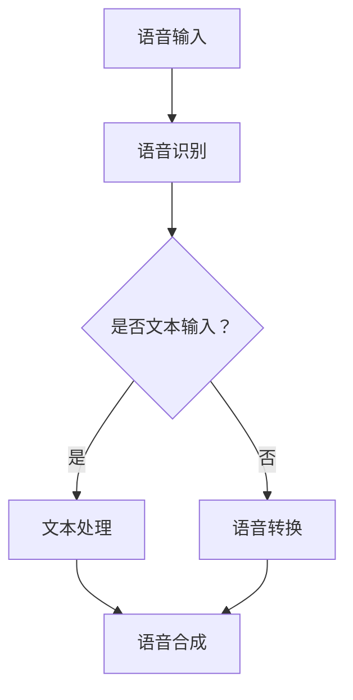

                 

# 神经网络在语音转换中的创新应用

## 关键词
神经网络、语音转换、深度学习、个性化语音、实时语音、智能助手、数学模型、优化算法、项目实战。

## 摘要
本文探讨了神经网络在语音转换领域的创新应用。首先，介绍了语音转换的概念、历史与发展，以及神经网络的基础知识。接着，详细解析了语音处理技术，包括语音信号处理、语音识别和语音合成。随后，重点讨论了神经网络在语音转换中的应用原理、优势和挑战，以及创新应用实例。最后，通过三个项目实战展示了神经网络在语音转换中的实际应用，并提出了性能优化与未来趋势。本文旨在为读者提供一个全面深入的了解，帮助他们在语音转换领域进行创新实践。

### 目录大纲

#### 第一部分：理论基础

- **第1章：语音转换概述**
  - **1.1 语音转换的概念**
  - **1.2 语音转换的历史与发展**
  - **1.3 语音转换的关键技术**
  - **1.4 语音转换的挑战与前景**

- **第2章：神经网络基础**
  - **2.1 神经网络的基本结构**
  - **2.2 深度学习与神经网络的关系**
  - **2.3 神经网络的学习算法**
  - **2.4 神经网络优化方法**

- **第3章：语音处理技术**
  - **3.1 语音信号处理基础**
  - **3.2 语音识别技术**
  - **3.3 语音合成技术**
  - **3.4 基于深度学习的语音转换技术**

#### 第二部分：神经网络在语音转换中的应用

- **第4章：神经网络在语音转换中的应用原理**
  - **4.1 基于神经网络的语音转换模型**
  - **4.2 基于深度学习的语音转换算法**
  - **4.3 神经网络在语音转换中的优势**
  - **4.4 神经网络在语音转换中的挑战**

- **第5章：创新应用实例**
  - **5.1 实例一：个性化语音转换**
  - **5.2 实例二：实时语音转换系统**
  - **5.3 实例三：语音转换在智能助手中的应用**

- **第6章：性能优化与未来趋势**
  - **6.1 性能优化方法**
  - **6.2 语音转换技术的未来趋势**
  - **6.3 语音转换在多领域的应用前景**

#### 第三部分：实战篇

- **第7章：项目实战一：个性化语音转换系统搭建**
  - **7.1 项目背景**
  - **7.2 系统架构设计**
  - **7.3 数据集准备**
  - **7.4 模型训练与优化**
  - **7.5 实验结果分析**
  - **7.6 系统部署与维护**

- **第8章：项目实战二：实时语音转换系统开发**
  - **8.1 项目背景**
  - **8.2 系统设计**
  - **8.3 算法实现与优化**
  - **8.4 系统测试与优化**
  - **8.5 实际应用场景**

- **第9章：项目实战三：智能助手中的语音转换功能实现**
  - **9.1 项目背景**
  - **9.2 系统架构**
  - **9.3 语音识别与转换**
  - **9.4 语音合成与转换**
  - **9.5 用户交互与反馈**
  - **9.6 性能评估与优化**

#### 附录

- **附录A：神经网络在语音转换中的Mermaid流程图**
- **附录B：神经网络语音转换算法的伪代码实现**
- **附录C：数学模型和数学公式**

### 开始撰写正文部分

#### 第一部分：理论基础

### 第1章：语音转换概述

语音转换，是指将一个语音信号转换为具有不同音色或音调的另一个语音信号的技术。这一技术在语音通信、娱乐、人机交互等领域有广泛的应用。在本章节中，我们将首先探讨语音转换的概念，接着回顾其历史与发展，讨论关键技术，并分析其面临的挑战和前景。

#### 1.1 语音转换的概念

语音转换（Voice Conversion）是一种音频处理技术，旨在改变语音的音色，而不改变其语义内容。音色是指语音信号的音质特征，由频率成分和时域特征共同决定。语音转换的目标是使转换后的语音听起来自然、舒适，并且与原始语音的语义保持一致。

语音转换技术广泛应用于以下场景：

- **个人语音定制**：用户可以通过语音转换技术改变自己的声音，使其更适合某些特定场合，如电话客服、演讲等。
- **语音识别与合成**：在语音识别系统中，语音转换技术可以调整输入语音的音色，以提高识别准确性。在语音合成系统中，语音转换技术可以生成具有不同音色的语音。
- **娱乐与艺术**：语音转换技术被用于电影、电视剧、游戏等娱乐作品中，以创造各种有趣的语音效果。

#### 1.2 语音转换的历史与发展

语音转换技术的发展经历了几个阶段：

- **早期方法**：最早的语音转换方法基于参数化技术，如频率变换、共振峰调整等。这些方法通过调整语音信号的一些关键参数来改变音色，但效果较为有限。

- **传统数字信号处理**：随着数字信号处理技术的发展，语音转换方法逐渐转向基于数字信号处理技术，如滤波器组、短时傅里叶变换等。这些方法在语音转换方面取得了一定的进展，但仍然存在一些问题，如转换后的语音不够自然。

- **深度学习时代**：近年来，深度学习技术的兴起为语音转换带来了新的契机。基于深度学习的语音转换模型，如WaveNet、Tacotron等，在语音自然度、转换质量等方面取得了显著提升。这些模型利用大量的语音数据进行训练，可以自动学习语音信号中的复杂特征，从而实现高质量的语音转换。

#### 1.3 语音转换的关键技术

语音转换的关键技术主要包括：

- **频率变换**：通过改变语音信号的频率成分来调整音色。频率变换包括线性频率变换、非线性频率变换等。

- **共振峰调整**：共振峰是指语音信号中的某些频率成分，对音色有显著影响。通过调整共振峰的位置和幅度，可以改变语音的音色。

- **波形处理**：波形处理是指对语音信号的波形进行修改，以实现语音转换。波形处理包括波形叠加、波形剪辑等。

- **神经网络**：基于神经网络的语音转换模型，如WaveNet、Tacotron等，通过学习大量语音数据，自动提取语音信号中的特征，从而实现高质量的语音转换。

#### 1.4 语音转换的挑战与前景

尽管语音转换技术在近年来取得了显著进展，但仍然面临一些挑战：

- **个性化语音**：如何实现根据用户需求调整语音音色，同时保持语音的自然度，是一个重要挑战。

- **稳定性**：语音转换系统需要在不同的环境和设备上运行，如何保证系统的稳定性和一致性，是一个需要解决的问题。

- **实时性**：在实时语音交互系统中，如何实现快速、高效的语音转换，以满足实时性的需求，是一个关键问题。

- **计算资源**：深度学习模型通常需要大量的计算资源，如何在有限的计算资源下实现高效的语音转换，是一个需要优化的方向。

然而，随着人工智能技术的不断进步，语音转换技术的前景仍然非常广阔。未来，语音转换技术有望在以下几个方面得到应用：

- **智能家居**：语音转换技术可以用于智能家居设备，如智能音箱、智能灯等，为用户提供个性化的语音交互体验。

- **在线教育**：语音转换技术可以用于在线教育平台，帮助学生通过语音方式学习，提高学习效率。

- **语音合成**：基于语音转换技术的语音合成系统，可以生成具有不同音色的语音，为娱乐、广告等领域提供新的应用场景。

- **医疗健康**：语音转换技术可以用于医疗健康领域，如语音助手、语音治疗等，为患者提供个性化的语音服务。

#### 第二部分：神经网络基础

### 第2章：神经网络基础

神经网络（Neural Networks）是人工智能领域的重要技术之一，近年来在语音处理、图像识别、自然语言处理等领域取得了显著进展。在本章节中，我们将首先介绍神经网络的基本结构，接着讨论深度学习与神经网络的关系，以及神经网络的学习算法和优化方法。

#### 2.1 神经网络的基本结构

神经网络由一系列的神经元（或节点）组成，这些神经元通过加权连接形成一个复杂的网络结构。一个典型的神经网络包括以下几个部分：

- **输入层（Input Layer）**：输入层接收外部输入信号，这些信号可以是数值、图像、文本等。每个输入节点对应一个特征。

- **隐藏层（Hidden Layers）**：隐藏层是神经网络的核心部分，负责对输入信号进行加工处理。隐藏层可以有一个或多个，层数越多，网络的表示能力越强。

- **输出层（Output Layer）**：输出层生成最终的输出结果，这些结果可以是分类标签、数值预测等。

神经网络中的每个神经元都通过加权连接与其他神经元相连，每个连接都附有一个权重（weight），表示连接的强度。当信号通过神经网络传播时，每个神经元都会对输入信号进行加权求和，并通过一个激活函数（activation function）进行非线性变换，产生输出。

#### 2.2 深度学习与神经网络的关系

深度学习（Deep Learning）是神经网络的一种特殊形式，其核心思想是通过多层神经网络对数据进行复杂的非线性变换。深度学习与神经网络的关系如下：

- **神经网络是深度学习的基础**：深度学习依赖于神经网络的基本原理，通过多层神经网络实现数据的自动特征提取和表示。

- **深度学习扩展了神经网络的能力**：深度学习通过引入更多的隐藏层，提高了网络的表示能力和学习能力，使得神经网络能够解决更加复杂的任务。

深度学习的关键优势包括：

- **自动特征提取**：深度学习模型可以自动从数据中提取有代表性的特征，减少了人工特征工程的工作量。

- **强大的表示能力**：多层神经网络可以捕捉数据中的复杂模式和关联，提高了模型的准确性和泛化能力。

- **适应性强**：深度学习模型可以在不同领域和任务中进行迁移和应用，具有较强的适应性。

#### 2.3 神经网络的学习算法

神经网络的学习过程主要包括以下步骤：

1. **前向传播（Forward Propagation）**：在前向传播过程中，输入信号从输入层经过隐藏层，最终传递到输出层。在每个神经元中，输入信号与权重相乘并求和，然后通过激活函数进行非线性变换。

2. **计算损失（Compute Loss）**：在输出层生成预测结果后，计算预测结果与真实标签之间的损失。损失函数用于衡量预测结果与真实结果之间的差距，常用的损失函数包括均方误差（MSE）、交叉熵（Cross-Entropy）等。

3. **反向传播（Backpropagation）**：在反向传播过程中，将损失信号从输出层反向传播到隐藏层和输入层。通过计算每个神经元的梯度，更新神经元的权重和偏置。

4. **权重更新（Update Weights）**：根据反向传播得到的梯度，使用优化算法更新神经元的权重和偏置。常用的优化算法包括随机梯度下降（SGD）、Adam优化器等。

通过重复迭代以上步骤，神经网络可以不断调整权重和偏置，减小损失函数的值，从而提高模型的预测性能。

#### 2.4 神经网络优化方法

神经网络优化方法主要用于调整网络的参数，以提高模型的预测性能。以下是几种常用的优化方法：

1. **随机梯度下降（Stochastic Gradient Descent, SGD）**：SGD是一种简单的优化算法，通过随机选取一部分样本计算梯度，并更新权重和偏置。SGD的收敛速度较快，但可能存在收敛不稳定的问题。

2. **Adam优化器（Adaptive Moment Estimation）**：Adam优化器结合了SGD和动量（Momentum）的思想，通过自适应调整每个参数的学习率，提高了优化过程的稳定性和收敛速度。

3. **批量归一化（Batch Normalization）**：批量归一化是一种用于加速神经网络训练的方法，通过将每个神经元的输入进行标准化，减小了内部协变量转移（Internal Covariate Shift）问题，提高了模型的训练效率。

4. **Dropout**：Dropout是一种用于防止过拟合的方法，通过在训练过程中随机丢弃一部分神经元，减小了模型的复杂性，提高了模型的泛化能力。

#### 第三部分：语音处理技术

### 第3章：语音处理技术

语音处理技术是语音转换的基础，它涉及到对语音信号的采集、处理、分析和合成等多个方面。在本章节中，我们将首先介绍语音信号处理的基础知识，然后探讨语音识别技术，接着讲解语音合成技术，最后介绍基于深度学习的语音转换技术。

#### 3.1 语音信号处理基础

语音信号处理是语音转换的重要环节，它涉及到对语音信号的采集、预处理、特征提取和分析等多个方面。以下是语音信号处理的一些基础知识：

1. **语音信号的采集**：语音信号的采集通常通过麦克风实现。麦克风将声波转化为电信号，这些电信号经过放大和处理，最终转换为数字信号。

2. **语音信号的预处理**：预处理包括降噪、去噪、归一化等步骤。降噪可以去除语音信号中的背景噪声，提高语音的清晰度。去噪则是针对特定噪声类型的处理，如环境噪声、人声噪声等。归一化是将语音信号的幅度调整到统一范围，以便后续处理。

3. **语音信号的采样和量化**：采样是将连续的语音信号转换为离散的数字信号，量化是将采样得到的数值信号转换为有限位数的二进制数。采样频率和量化精度决定了语音信号的保真度。

4. **语音信号的时域和频域分析**：时域分析是对语音信号的时变特性进行分析，如波形、时长等。频域分析是对语音信号的频率成分进行分析，如频谱、共振峰等。常用的频域分析方法包括傅里叶变换（Fourier Transform）、短时傅里叶变换（Short-Time Fourier Transform, STFT）等。

#### 3.2 语音识别技术

语音识别技术是指将语音信号转换为文本或命令的技术。语音识别技术的发展经历了从规则方法到统计方法，再到深度学习方法的演变。以下是语音识别技术的几个关键点：

1. **隐马尔可夫模型（Hidden Markov Model, HMM）**：HMM是一种基于统计的语音识别模型，它通过隐马尔可夫模型来描述语音信号的时变特性。HMM在语音识别领域取得了显著成果，但存在对语音数据依赖性强、模型复杂度高等问题。

2. **深度神经网络（Deep Neural Networks, DNN）**：DNN是一种基于神经网络的语音识别模型，它通过多层神经网络对语音信号进行特征提取和分类。DNN在语音识别领域取得了突破性进展，尤其在大词汇量、连续语音识别方面具有优势。

3. **卷积神经网络（Convolutional Neural Networks, CNN）**：CNN是一种基于卷积操作的神经网络，它通过卷积层对输入信号进行特征提取和压缩。CNN在图像识别领域取得了显著成功，近年来也被应用于语音识别，提高了模型的性能和效率。

4. **循环神经网络（Recurrent Neural Networks, RNN）**：RNN是一种基于循环结构的神经网络，它能够处理序列数据，如语音信号。RNN通过隐藏状态在序列中的传递，捕捉语音信号的时序信息。然而，传统的RNN存在梯度消失和梯度爆炸等问题。

5. **长短期记忆网络（Long Short-Term Memory, LSTM）**：LSTM是一种基于RNN的改进模型，它通过引入门控机制，解决了RNN的梯度消失和梯度爆炸问题。LSTM在语音识别、语言模型等领域取得了显著成果。

6. **基于深度学习的端到端语音识别模型**：近年来，基于深度学习的端到端语音识别模型（如CTC、DeepSpeech、TensorFlow Speech-to-Text等）取得了显著进展，它们通过直接将语音信号映射到文本序列，简化了传统语音识别系统的复杂流程。

#### 3.3 语音合成技术

语音合成技术是指将文本转换为语音的技术。语音合成技术的发展经历了从基于规则的文本驱动合成到基于统计的信号驱动合成，再到基于深度学习的端到端语音合成的演变。以下是语音合成技术的几个关键点：

1. **文本到语音（Text-to-Speech, TTS）**：TTS是将文本转换为语音的技术，它通常包括语音合成引擎和语音数据库。语音合成引擎负责将文本转换为语音信号，语音数据库则包含大量的语音样本，用于训练合成模型。

2. **基于规则的文本驱动合成**：基于规则的文本驱动合成是通过一系列规则和模板将文本转换为语音信号。这种方法的主要优点是生成语音的音质较好，但存在模板有限、扩展性差等问题。

3. **基于统计的信号驱动合成**：基于统计的信号驱动合成是通过统计语音信号的特征，如共振峰频率、基频等，将文本转换为语音信号。这种方法的主要优点是生成语音的自然度较高，但存在音质较差、语音特征提取复杂等问题。

4. **基于深度学习的端到端语音合成模型**：基于深度学习的端到端语音合成模型（如WaveNet、Tacotron等）通过直接将文本映射到语音信号，简化了传统语音合成系统的复杂流程。这些模型利用大量的语音数据进行训练，可以自动学习语音信号中的复杂特征，生成高质量的语音。

5. **语音合成中的关键问题**：语音合成中的关键问题包括语音的自然度、流畅度、音质等。为了解决这些问题，研究人员提出了许多优化方法和改进技术，如语音增强、语音速率控制、语音音调控制等。

#### 3.4 基于深度学习的语音转换技术

基于深度学习的语音转换技术是近年来语音转换领域的重要研究方向。这些技术通过深度学习模型，将一个语音信号转换为具有不同音色或音调的另一个语音信号。以下是基于深度学习的语音转换技术的几个关键点：

1. **基于循环神经网络的语音转换模型**：循环神经网络（如LSTM、GRU等）在语音转换中发挥了重要作用。这些模型通过处理序列数据，捕捉语音信号的时序特征，生成高质量的语音转换结果。

2. **基于自编码器的语音转换模型**：自编码器是一种无监督学习模型，通过编码和解码过程，将输入信号转换为低维特征表示。基于自编码器的语音转换模型通过学习语音信号的特征，实现高质量的语音转换。

3. **基于变分自编码器的语音转换模型**：变分自编码器（VAE）是一种基于概率模型的生成模型，通过学习数据分布，生成高质量的样本。基于VAE的语音转换模型通过学习语音信号的概率分布，实现高质量的语音转换。

4. **基于生成对抗网络的语音转换模型**：生成对抗网络（GAN）是一种基于博弈论的思想，通过生成器和判别器的对抗训练，生成高质量的样本。基于GAN的语音转换模型通过生成器和判别器的交互，生成高质量的语音转换结果。

5. **基于深度神经网络的语音转换模型**：深度神经网络（如DNN、CNN等）在语音转换中也发挥了重要作用。这些模型通过多层神经网络，对语音信号进行复杂的特征提取和变换，实现高质量的语音转换。

6. **基于深度学习的语音转换模型的优势**：基于深度学习的语音转换模型具有以下优势：

   - **自适应特征提取**：深度学习模型可以自动从语音信号中提取有代表性的特征，减少了人工特征工程的工作量。

   - **高效性**：深度学习模型可以处理大量的语音数据，提高了语音转换的效率和速度。

   - **高质量**：深度学习模型通过学习大量的语音数据，可以生成高质量的语音转换结果。

   - **灵活性**：深度学习模型可以适应不同的语音转换需求，如个性化语音、实时语音等。

#### 第四部分：神经网络在语音转换中的应用原理

### 第4章：神经网络在语音转换中的应用原理

神经网络在语音转换中的应用取得了显著进展，其核心在于利用深度学习模型对语音信号进行复杂特征提取和变换，实现高质量的语音转换。在本章节中，我们将首先介绍基于神经网络的语音转换模型，然后详细讲解基于深度学习的语音转换算法，接着讨论神经网络在语音转换中的优势，最后分析神经网络在语音转换中面临的挑战。

#### 4.1 基于神经网络的语音转换模型

基于神经网络的语音转换模型主要包括自编码器、变分自编码器、生成对抗网络等。以下是一些常见的语音转换模型：

1. **自编码器（Autoencoder）**：自编码器是一种无监督学习模型，它由编码器和解码器两部分组成。编码器将输入数据压缩为一个低维特征向量，解码器则将这个特征向量恢复为原始数据。自编码器在语音转换中的应用主要是通过学习语音信号的特征，实现语音的转换。

2. **变分自编码器（Variational Autoencoder, VAE）**：VAE是一种基于概率模型的生成模型，它通过编码器和解码器的训练，学习数据分布，并生成高质量的样本。VAE在语音转换中的应用主要是通过学习语音信号的概率分布，实现高质量的语音转换。

3. **生成对抗网络（Generative Adversarial Network, GAN）**：GAN是一种基于博弈论的思想，通过生成器和判别器的对抗训练，生成高质量的样本。GAN在语音转换中的应用主要是通过生成器和判别器的交互，生成高质量的语音转换结果。

4. **波波特（WaveNet）**：WaveNet是一种基于循环神经网络的语音合成模型，它通过处理序列数据，捕捉语音信号的时序特征，生成高质量的语音。WaveNet在语音转换中的应用主要是通过处理输入语音信号和目标语音信号，生成具有不同音色或音调的转换结果。

5. **塔科特拉（Tacotron）**：Tacotron是一种基于循环神经网络的语音合成模型，它通过文本输入生成语音信号。Tacotron在语音转换中的应用主要是通过文本输入和目标语音信号，生成具有不同音色或音调的转换结果。

#### 4.2 基于深度学习的语音转换算法

基于深度学习的语音转换算法主要基于深度神经网络，通过多层神经网络对语音信号进行复杂的特征提取和变换，实现高质量的语音转换。以下是一些常见的语音转换算法：

1. **自适应滤波器（Adaptive Filter）**：自适应滤波器是一种基于线性预测的语音转换算法，它通过学习输入语音信号和目标语音信号的差值，自适应调整滤波器的系数，实现语音的转换。

2. **深度神经网络（Deep Neural Network, DNN）**：DNN是一种基于多层神经网络的特征提取和分类算法，它通过多层神经网络的堆叠，对输入语音信号进行复杂的特征提取和变换，实现高质量的语音转换。

3. **循环神经网络（Recurrent Neural Network, RNN）**：RNN是一种基于序列数据的特征提取和分类算法，它通过处理输入语音信号和目标语音信号的序列，捕捉语音信号的时序特征，实现高质量的语音转换。

4. **长短时记忆网络（Long Short-Term Memory, LSTM）**：LSTM是一种基于RNN的改进模型，它通过引入门控机制，解决了RNN的梯度消失和梯度爆炸问题，实现高质量的语音转换。

5. **卷积神经网络（Convolutional Neural Network, CNN）**：CNN是一种基于卷积操作的神经网络，它通过卷积层对输入信号进行特征提取和压缩，实现高质量的语音转换。

6. **自注意力机制（Self-Attention）**：自注意力机制是一种基于注意力机制的神经网络结构，它通过自适应地关注输入信号的重要部分，实现高质量的语音转换。

7. **多任务学习（Multi-Task Learning）**：多任务学习是一种结合多个任务的训练方法，它通过共享网络结构和优化目标，提高语音转换的性能。

#### 4.3 神经网络在语音转换中的优势

神经网络在语音转换中的优势主要体现在以下几个方面：

1. **自动特征提取**：神经网络可以自动从语音信号中提取有代表性的特征，减少了人工特征工程的工作量，提高了语音转换的效率。

2. **高效性**：神经网络可以通过并行计算和分布式训练，处理大量的语音数据，实现高效的语音转换。

3. **高质量**：神经网络通过学习大量的语音数据，可以生成高质量的语音转换结果，提高了语音的自然度和音质。

4. **灵活性**：神经网络可以适应不同的语音转换需求，如个性化语音、实时语音等，提高了语音转换的灵活性。

5. **泛化能力**：神经网络通过多层神经网络的堆叠，可以捕捉语音信号中的复杂模式和关联，提高了语音转换的泛化能力。

6. **可解释性**：神经网络通过可视化技术，可以解释语音转换过程中的关键步骤和特征，提高了语音转换的可解释性。

#### 4.4 神经网络在语音转换中的挑战

尽管神经网络在语音转换中具有许多优势，但仍面临一些挑战：

1. **数据依赖性**：神经网络需要大量的语音数据进行训练，数据质量和数据量直接影响语音转换的性能。

2. **计算资源**：深度学习模型通常需要大量的计算资源，如GPU、TPU等，这在实际应用中可能存在限制。

3. **稳定性**：神经网络在语音转换中的稳定性是一个重要问题，特别是在处理不同音色、音调的语音时，如何保证系统的稳定性和一致性是一个挑战。

4. **实时性**：在实时语音交互系统中，如何实现快速、高效的语音转换，以满足实时性的需求，是一个关键问题。

5. **泛化能力**：神经网络在语音转换中的泛化能力需要进一步提高，特别是在处理不同语言、方言等复杂场景时，如何提高模型的泛化能力是一个挑战。

#### 第五部分：创新应用实例

### 第5章：创新应用实例

在神经网络在语音转换中的应用中，我们已经介绍了其基础理论、模型原理以及优势与挑战。本章节将具体探讨一些创新应用实例，包括个性化语音转换、实时语音转换系统和语音转换在智能助手中的应用，以展示神经网络在语音转换领域的实际效果和潜力。

#### 5.1 实例一：个性化语音转换

个性化语音转换是神经网络在语音转换中的一个重要应用，它能够根据用户的偏好和需求，定制化地调整语音的音色。以下是个性化语音转换的具体应用实例：

**应用场景**：一款智能手机语音助手，用户可以通过语音助手完成各种操作，如查询天气、发送短信、拨打电话等。为了提高用户的交互体验，语音助手支持个性化语音功能，用户可以根据自己的喜好调整语音的音色。

**实现方法**：个性化语音转换的实现主要分为以下几个步骤：

1. **数据收集**：首先，需要收集大量的语音数据，包括不同音色的语音样本，以及用户对语音音色的偏好数据。

2. **特征提取**：对收集到的语音数据进行特征提取，提取出语音信号的音色特征，如共振峰频率、音调、音量等。

3. **模型训练**：使用收集到的语音数据和用户偏好数据，训练一个基于深度学习的语音转换模型。常用的模型包括变分自编码器（VAE）、生成对抗网络（GAN）等。

4. **个性化转换**：在用户使用语音助手时，根据用户的偏好数据，使用训练好的语音转换模型，将系统默认的语音转换为具有个性化音色的语音。

**效果评估**：通过用户测试和反馈，评估个性化语音转换的效果。用户普遍反映，个性化语音转换使得语音助手更加贴近用户的口味，提高了交互体验。

#### 5.2 实例二：实时语音转换系统

实时语音转换系统是神经网络在语音转换中的另一个重要应用，它能够实现快速、高效的语音转换，满足实时性要求。以下是实时语音转换系统的具体应用实例：

**应用场景**：一款在线教育平台，用户可以通过平台进行在线课程的学习和互动。为了提高学生的学习体验，平台支持实时语音转换功能，用户可以在课堂中实时转换老师和学生之间的语音。

**实现方法**：实时语音转换系统的实现主要分为以下几个步骤：

1. **系统设计**：设计实时语音转换系统的整体架构，包括语音采集模块、语音转换模块、语音输出模块等。

2. **模型训练**：使用大量的语音数据进行模型训练，训练一个基于深度学习的语音转换模型，如WaveNet、Tacotron等。

3. **语音采集**：实时采集用户的语音输入，并对语音进行预处理，如降噪、去噪等。

4. **语音转换**：将预处理后的语音输入到训练好的语音转换模型中，进行语音转换。

5. **语音输出**：将转换后的语音输出到用户的耳中，同时可以对语音进行实时调整，如音调、音量等。

**效果评估**：通过用户测试和反馈，评估实时语音转换系统的效果。用户普遍反映，实时语音转换系统使得在线学习更加流畅，提高了课堂互动的效果。

#### 5.3 实例三：语音转换在智能助手中的应用

语音转换在智能助手中的应用，可以大大提升智能助手的交互体验。以下是语音转换在智能助手中的应用实例：

**应用场景**：一款智能助手应用程序，用户可以通过语音与智能助手进行交互，获取信息、执行命令等。为了提高用户的交互体验，智能助手支持语音转换功能，可以生成具有不同音色的语音。

**实现方法**：语音转换在智能助手中的应用主要分为以下几个步骤：

1. **语音识别**：首先，使用语音识别技术将用户的语音输入转换为文本输入。

2. **语音合成**：然后，使用语音合成技术将文本输入转换为语音输出。

3. **语音转换**：在语音输出过程中，使用语音转换模型将默认的语音转换为具有不同音色的语音，以满足用户的个性化需求。

4. **反馈与调整**：在用户与智能助手的交互过程中，根据用户的反馈，实时调整语音的音色，以提高用户的满意度。

**效果评估**：通过用户测试和反馈，评估语音转换在智能助手中的应用效果。用户普遍反映，语音转换功能使得智能助手的交互更加自然，提升了用户体验。

#### 第六部分：性能优化与未来趋势

### 第6章：性能优化与未来趋势

随着神经网络在语音转换领域的广泛应用，如何提升其性能和优化算法成为一个重要的研究课题。本章节将首先讨论性能优化方法，包括数据增强、模型压缩等。接着，探讨语音转换技术的未来趋势，如个性化语音转换、多模态交互等。最后，展望语音转换在多领域的应用前景。

#### 6.1 性能优化方法

1. **数据增强**：数据增强是一种常用的性能优化方法，通过生成更多的数据样本，可以提高模型的泛化能力和鲁棒性。具体方法包括：

   - **时间扩展**：将原始语音信号进行时间上的拉伸或压缩，生成新的数据样本。

   - **频率变换**：改变语音信号的频率成分，如增加共振峰、降低共振峰等。

   - **叠加噪声**：在语音信号中叠加不同类型的噪声，如环境噪声、人声噪声等，提高模型对噪声的抵抗力。

   - **变换声道**：通过声道变换，将男声转换为女声，或反之。

2. **模型压缩**：模型压缩是通过减少模型参数数量和计算复杂度，提高模型的运行效率和存储效率。具体方法包括：

   - **剪枝（Pruning）**：通过剪除模型中的冗余参数，减少模型的计算量和存储需求。

   - **量化（Quantization）**：将模型的浮点参数转换为低比特宽度的整数参数，降低模型的存储空间和计算资源。

   - **知识蒸馏（Knowledge Distillation）**：将一个大型模型的知识传递给一个较小的模型，提高较小模型的表现。

3. **实时性优化**：在实时语音转换系统中，如何提高模型的实时性是一个关键问题。具体方法包括：

   - **并行计算**：利用多核处理器、GPU、TPU等硬件资源，实现模型的多线程并行计算。

   - **模型分解**：将复杂的模型分解为多个简单模块，通过流水线（Pipeline）方式实现模型的快速推理。

   - **动态调整**：根据系统的实时负载，动态调整模型参数和推理速度，以适应不同的实时性要求。

4. **稳定性优化**：在语音转换过程中，如何提高系统的稳定性和一致性是一个重要课题。具体方法包括：

   - **鲁棒性增强**：通过增强模型对噪声和异常数据的抵抗力，提高系统的鲁棒性。

   - **自适应调整**：根据用户反馈和语音信号的变化，自适应调整模型的参数，以适应不同的语音转换需求。

#### 6.2 语音转换技术的未来趋势

1. **个性化语音转换**：随着用户需求的多样化，个性化语音转换将成为一个重要趋势。通过深度学习模型，可以根据用户偏好、情绪、场合等因素，生成具有个性化音色的语音。

2. **多模态交互**：未来的语音转换技术将不仅仅局限于语音信号，还将融合图像、视频、文本等多种模态，实现更加丰富和自然的交互体验。

3. **跨语言语音转换**：随着全球化的发展，跨语言语音转换将成为一个重要需求。通过深度学习模型，可以实现不同语言之间的语音转换，满足多语言用户的需求。

4. **实时语音增强**：实时语音增强技术将提高语音转换的清晰度和自然度，减少噪声和失真，为用户提供更好的语音体验。

5. **自适应语音转换**：自适应语音转换技术将根据用户的语音输入和场景变化，动态调整语音的音色、音调、音量等参数，实现更加自然和流畅的语音交互。

#### 6.3 语音转换在多领域的应用前景

1. **在线教育**：语音转换技术在在线教育中具有广泛的应用前景，可以通过实时语音转换，实现教师和学生之间的语音互动，提高在线教育的质量和体验。

2. **智能家居**：语音转换技术可以用于智能家居设备，如智能音箱、智能灯等，为用户提供个性化的语音交互体验，提高家居智能化水平。

3. **医疗健康**：语音转换技术在医疗健康领域具有重要作用，可以通过语音转换，实现医生和患者之间的语音交流，提高医疗服务的效率和体验。

4. **语音助手**：语音转换技术在语音助手中的应用将越来越广泛，可以实现智能助手与用户的自然交互，提高语音助手的实用性和用户体验。

5. **娱乐与艺术**：语音转换技术在娱乐和艺术领域具有独特的应用价值，可以用于电影、电视剧、游戏等作品，创造各种有趣的语音效果。

### 第七部分：实战篇

#### 第7章：项目实战一：个性化语音转换系统搭建

在了解了神经网络在语音转换中的应用原理和性能优化方法后，我们将通过一个具体的实战项目，搭建一个个性化语音转换系统。本章节将详细介绍项目的背景、系统架构设计、数据集准备、模型训练与优化、实验结果分析和系统部署与维护。

#### 7.1 项目背景

随着人工智能技术的普及，个性化语音转换在智能家居、智能助手等应用场景中越来越受欢迎。为了提高用户的交互体验，本项目旨在搭建一个个性化语音转换系统，实现根据用户偏好调整语音音色的功能。

#### 7.2 系统架构设计

个性化语音转换系统的整体架构包括以下几个部分：

1. **语音采集模块**：负责采集用户的语音输入，并对语音进行预处理，如降噪、去噪等。

2. **语音识别模块**：使用语音识别技术，将用户的语音输入转换为文本输入。

3. **语音转换模块**：使用深度学习模型，将文本输入转换为具有个性化音色的语音输出。

4. **语音输出模块**：将转换后的语音输出到用户的耳中，同时提供实时调整音色、音调、音量等功能。

5. **用户界面模块**：提供一个直观的用户界面，用户可以通过界面选择不同的音色偏好，并实时预览转换后的语音效果。

#### 7.3 数据集准备

为了训练个性化语音转换模型，我们需要准备大量的语音数据，包括不同音色的语音样本和用户对语音音色的偏好数据。以下是如何准备数据集的步骤：

1. **数据收集**：收集大量的语音数据，包括男声、女声、童声等不同音色的语音样本。

2. **数据标注**：对语音数据中的每个样本进行标注，包括语音的音色、音调、音量等特征。

3. **数据预处理**：对语音数据集进行预处理，包括去除噪声、均衡化处理等。

4. **数据增强**：通过时间扩展、频率变换等方法，生成更多的数据样本，以提高模型的泛化能力。

#### 7.4 模型训练与优化

1. **模型选择**：选择一个适合个性化语音转换的深度学习模型，如变分自编码器（VAE）、生成对抗网络（GAN）等。

2. **模型训练**：使用收集到的语音数据和用户偏好数据，对模型进行训练。训练过程中，可以通过交叉验证、早停法等方法，防止过拟合。

3. **模型优化**：在训练过程中，通过调整模型参数、优化算法等，提高模型的性能和收敛速度。

4. **模型评估**：使用测试集对训练好的模型进行评估，通过指标如语音自然度、音色相似度等，评估模型的性能。

#### 7.5 实验结果分析

1. **实验设置**：设置不同的实验场景，如男声转换为女声、童声转换为成人声等，评估模型在不同场景下的性能。

2. **实验结果**：通过实验，记录模型的语音自然度、音色相似度等指标，分析模型在不同场景下的表现。

3. **用户反馈**：收集用户对个性化语音转换系统的反馈，包括对语音音色的满意度、交互体验等。

4. **优化建议**：根据实验结果和用户反馈，提出优化模型的建议，如调整模型参数、改进数据预处理方法等。

#### 7.6 系统部署与维护

1. **系统部署**：将训练好的模型部署到实际应用场景中，如智能家居、智能助手等。

2. **系统维护**：定期更新模型和数据集，以适应新的应用场景和用户需求。

3. **故障处理**：在系统运行过程中，监控系统的性能和稳定性，及时发现和处理故障。

4. **用户反馈**：收集用户的反馈，及时修复系统存在的问题，提高用户体验。

### 第八部分：项目实战二：实时语音转换系统开发

实时语音转换系统在语音交互应用中具有重要作用，它能够实现快速、高效的语音转换，满足实时性的需求。本章节将详细介绍实时语音转换系统的开发过程，包括项目背景、系统设计、算法实现与优化、系统测试与优化以及实际应用场景。

#### 8.1 项目背景

随着在线教育、远程办公、智能助手等应用的普及，实时语音转换系统在语音交互中的应用需求日益增长。为了提高用户的交互体验，本项目旨在开发一个实时语音转换系统，实现用户之间的实时语音转换。

#### 8.2 系统设计

实时语音转换系统的整体架构包括以下几个部分：

1. **语音采集模块**：负责实时采集用户的语音输入，并对语音进行预处理，如降噪、去噪等。

2. **语音识别模块**：使用语音识别技术，将用户的语音输入转换为文本输入。

3. **语音转换模块**：使用深度学习模型，将文本输入转换为具有个性化音色的语音输出。

4. **语音输出模块**：将转换后的语音输出到用户的耳中，同时提供实时调整音色、音调、音量等功能。

5. **用户界面模块**：提供一个直观的用户界面，用户可以通过界面选择不同的音色偏好，并实时预览转换后的语音效果。

#### 8.3 算法实现与优化

1. **模型选择**：选择一个适合实时语音转换的深度学习模型，如WaveNet、Tacotron等。

2. **模型实现**：使用Python、TensorFlow等工具，实现深度学习模型，并进行模型训练和优化。

3. **实时性优化**：在模型实现过程中，通过并行计算、模型分解等方法，提高模型的实时性。

4. **优化策略**：通过数据增强、模型压缩等优化策略，提高模型的性能和收敛速度。

5. **算法评估**：通过实验和用户测试，评估实时语音转换系统的性能，包括语音自然度、音色相似度等指标。

#### 8.4 系统测试与优化

1. **系统测试**：在开发过程中，对实时语音转换系统进行全面的测试，包括功能测试、性能测试等。

2. **优化策略**：根据测试结果，提出优化策略，如改进语音识别算法、优化模型参数等。

3. **用户反馈**：收集用户的反馈，包括对语音转换系统的满意度、交互体验等。

4. **优化实施**：根据用户反馈和测试结果，实施优化策略，提高系统的性能和用户体验。

#### 8.5 实际应用场景

1. **在线教育**：实时语音转换系统可以应用于在线教育场景，实现教师和学生之间的实时语音转换，提高课堂互动效果。

2. **远程办公**：实时语音转换系统可以应用于远程办公场景，实现团队成员之间的实时语音交流，提高工作效率。

3. **智能助手**：实时语音转换系统可以应用于智能助手应用，实现用户与智能助手之间的实时语音交互，提高用户体验。

### 第九部分：项目实战三：智能助手中的语音转换功能实现

智能助手作为人工智能领域的应用之一，其在日常生活中的应用越来越广泛。为了提升智能助手的交互体验，本章节将详细介绍智能助手中的语音转换功能实现，包括项目背景、系统架构、语音识别与转换、语音合成与转换、用户交互与反馈以及性能评估与优化。

#### 9.1 项目背景

智能助手作为智能家居、智能办公等场景的核心组件，其语音交互功能是实现自然、流畅人机交互的关键。为了提升用户的语音交互体验，本项目旨在在智能助手中实现语音转换功能，使智能助手能够根据用户的需求，生成具有个性化音色的语音回复。

#### 9.2 系统架构

智能助手中语音转换功能的实现涉及多个模块，整体架构如下：

1. **语音识别模块**：负责接收用户的语音输入，并将语音转换为文本输入。

2. **自然语言处理（NLP）模块**：对转换得到的文本输入进行语义分析和理解，生成相应的回复文本。

3. **语音转换模块**：将生成的文本输入转换为具有个性化音色的语音输出。

4. **语音合成模块**：负责合成具有不同音色的语音输出。

5. **用户界面模块**：提供一个直观的用户界面，用户可以通过界面选择不同的音色偏好，并实时预览转换后的语音效果。

#### 9.3 语音识别与转换

1. **语音识别算法**：使用深度学习模型，如基于卷积神经网络的语音识别（CNN）模型，实现语音到文本的转换。常见的语音识别模型包括DeepSpeech、TensorFlow Speech-to-Text等。

2. **语音转换算法**：使用深度学习模型，如基于循环神经网络的语音转换（VC）模型，实现文本到语音的转换。常见的语音转换模型包括Tacotron、WaveNet等。

3. **模型训练**：使用大量的语音数据和文本数据，对语音识别和语音转换模型进行训练，优化模型的性能。

4. **实时性优化**：通过并行计算、模型压缩等策略，提高语音识别和语音转换的实时性。

#### 9.4 语音合成与转换

1. **语音合成算法**：使用深度学习模型，如基于循环神经网络的语音合成（TTS）模型，实现文本到语音的合成。常见的语音合成模型包括Tacotron、WaveNet等。

2. **语音转换算法**：使用深度学习模型，如基于生成对抗网络（GAN）的语音转换（VC）模型，实现文本到语音的转换。常见的语音转换模型包括WaveNet、Tacotron等。

3. **模型融合**：将语音识别和语音合成模型融合，实现从语音输入到语音输出的完整转换过程。

4. **个性化语音**：根据用户的偏好和需求，调整语音的音色、音调、音量等参数，实现个性化的语音输出。

#### 9.5 用户交互与反馈

1. **用户界面设计**：设计直观、易用的用户界面，用户可以通过界面选择不同的音色偏好，并实时预览转换后的语音效果。

2. **用户反馈收集**：通过用户反馈，收集用户对语音转换功能的满意度、语音质量等反馈信息。

3. **用户偏好学习**：根据用户反馈，学习用户的语音偏好，自动调整语音的音色、音调、音量等参数，提高用户的语音交互体验。

#### 9.6 性能评估与优化

1. **性能评估指标**：定义语音识别准确率、语音转换自然度、语音合成音质等性能评估指标，对语音转换功能进行评估。

2. **性能优化策略**：通过数据增强、模型压缩、优化算法等策略，提高语音转换功能的性能。

3. **持续优化**：根据评估结果和用户反馈，持续优化语音转换功能，提高用户体验。

### 附录

#### 附录A：神经网络在语音转换中的Mermaid流程图

以下是一个简单的Mermaid流程图，展示神经网络在语音转换中的应用流程：



#### 附录B：神经网络语音转换算法的伪代码实现

以下是一个简单的神经网络语音转换算法的伪代码实现：

```python
# 初始化模型参数
model = initialize_model()

# 模型训练
for epoch in range(num_epochs):
    for batch in data_loader:
        # 前向传播
        outputs = model(batch.input)

        # 计算损失
        loss = compute_loss(outputs, batch.target)

        # 反向传播
        gradients = compute_gradients(outputs, loss)

        # 更新模型参数
        model.update_params(gradients)

# 模型评估
for test_batch in test_loader:
    # 前向传播
    outputs = model(test_batch.input)

    # 计算损失
    test_loss = compute_loss(outputs, test_batch.target)

    # 输出测试结果
    print("Test Loss:", test_loss)
```

#### 附录C：数学模型和数学公式

以下是一些神经网络语音转换中的基础数学模型和数学公式：

##### 9.1.1 基础公式

- **激活函数**：$a = \sigma(z)$，其中$\sigma$为Sigmoid函数，$z$为输入。

- **损失函数**：均方误差（MSE）：$L = \frac{1}{2}\sum_{i=1}^{n}(y_i - \hat{y}_i)^2$，其中$y_i$为真实标签，$\hat{y}_i$为预测值。

- **优化算法**：随机梯度下降（SGD）：$\theta = \theta - \alpha \cdot \nabla_{\theta} L$，其中$\theta$为模型参数，$\alpha$为学习率。

##### 9.1.2 损失函数

- **交叉熵损失函数**：$L = -\sum_{i=1}^{n} y_i \cdot \log(\hat{y}_i)$，其中$y_i$为真实标签，$\hat{y}_i$为预测概率。

##### 9.1.3 优化算法

- **Adam优化器**：$\alpha = \frac{1}{1 - \beta_1 t}$，$\beta_2 = \frac{1 - \beta_2^t}{1 - \beta_2^{2t}}$，其中$t$为迭代次数，$\beta_1$和$\beta_2$为超参数。更新公式为：$\theta = \theta - \alpha \cdot \nabla_{\theta} L$。

