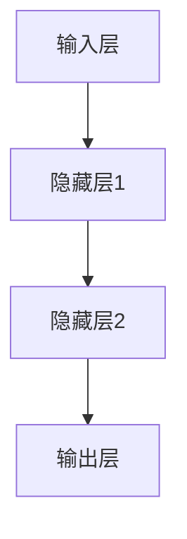
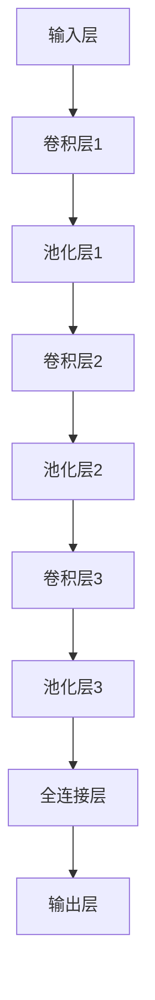
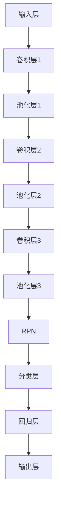
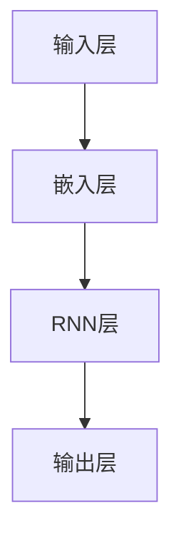
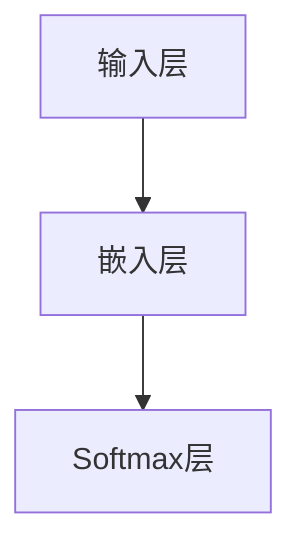
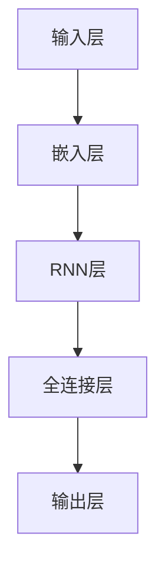
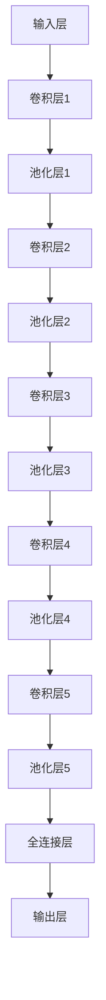
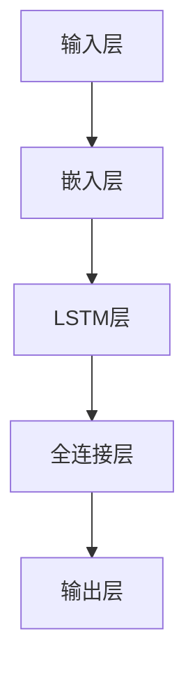
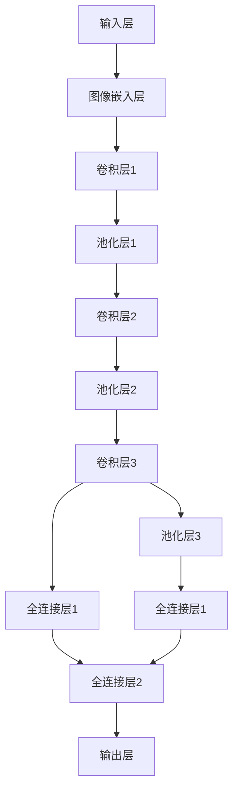

                 

### 《神经网络：人工智能的基石》

神经网络，作为人工智能领域的关键技术之一，近年来取得了显著的进展。本文旨在为广大读者深入剖析神经网络的核心原理及其在现代人工智能中的应用。关键词包括神经网络、人工智能、深度学习、卷积神经网络、循环神经网络、生成对抗网络。

摘要：本文将首先回顾神经网络的历史与发展，然后详细解释神经网络的数学基础，特别是神经元运算和反向传播算法。接下来，我们将探讨神经网络的训练策略以及深度神经网络，重点介绍卷积神经网络（CNN）和循环神经网络（RNN）的工作原理。随后，文章将深入探讨神经网络在计算机视觉和自然语言处理领域的应用，并展示具体的实战项目。最后，我们将总结神经网络的核心算法原理，并提供一些常用的工具和资源。

### 《神经网络：人工智能的基石》目录大纲

## 第一部分：神经网络基础

### 第1章：神经网络概述
#### 1.1 神经网络的历史与发展
#### 1.2 神经网络的基本概念
#### 1.3 神经网络的结构与功能
#### 1.4 神经网络的分类

### 第2章：神经元的数学基础
#### 2.1 神经元的基本运算
#### 2.2 激活函数
#### 2.3 前向传播算法

### 第3章：反向传播算法
#### 3.1 反向传播的基本原理
#### 3.2 反向传播的数学推导
#### 3.3 反向传播的代码实现

### 第4章：神经网络训练策略
#### 4.1 权重初始化
#### 4.2 梯度下降算法
#### 4.3 动量与学习率调度
#### 4.4 梯度裁剪

### 第5章：深度神经网络
#### 5.1 神经网络层数的影响
#### 5.2 卷积神经网络（CNN）介绍
#### 5.3 循环神经网络（RNN）介绍

### 第6章：神经网络在计算机视觉中的应用
#### 6.1 图像分类
#### 6.2 目标检测
#### 6.3 图像分割

### 第7章：神经网络在自然语言处理中的应用
#### 7.1 语言模型
#### 7.2 词向量表示
#### 7.3 序列标注
#### 7.4 文本生成

## 第二部分：神经网络核心算法原理

### 第8章：卷积神经网络（CNN）核心算法原理
#### 8.1 卷积层的工作原理
#### 8.2 池化层的作用
#### 8.3 全连接层的作用
#### 8.4 CNN的优化算法

### 第9章：循环神经网络（RNN）核心算法原理
#### 9.1 RNN的工作原理
#### 9.2 RNN的数学模型
#### 9.3 长短时记忆（LSTM）网络
#### 9.4 门控循环单元（GRU）网络

### 第10章：生成对抗网络（GAN）核心算法原理
#### 10.1 GAN的基本概念
#### 10.2 GAN的数学模型
#### 10.3 GAN的训练策略
#### 10.4 GAN的应用场景

## 第三部分：神经网络项目实战

### 第11章：计算机视觉项目实战
#### 11.1 项目背景与目标
#### 11.2 项目需求分析
#### 11.3 数据预处理
#### 11.4 网络架构设计
#### 11.5 代码实现与调试
#### 11.6 项目结果分析

### 第12章：自然语言处理项目实战
#### 12.1 项目背景与目标
#### 12.2 项目需求分析
#### 12.3 数据预处理
#### 12.4 网络架构设计
#### 12.5 代码实现与调试
#### 12.6 项目结果分析

### 第13章：综合应用项目实战
#### 13.1 项目背景与目标
#### 13.2 项目需求分析
#### 13.3 数据预处理
#### 13.4 网络架构设计
#### 13.5 代码实现与调试
#### 13.6 项目结果分析

## 附录

### 附录A：神经网络常用工具与资源
#### A.1 Python深度学习库
#### A.2 神经网络框架对比
#### A.3 神经网络学习资源推荐

现在，我们开始对神经网络的基础知识进行深入探讨。

### 第1章：神经网络概述

#### 1.1 神经网络的历史与发展

神经网络的概念最早可以追溯到1943年，由心理学家McCulloch和数学家Pitts提出。他们提出了简单的神经网络模型，称为MCP（McCulloch-Pitts neuron）。随后，1958年，Frank Rosenblatt提出了感知机（Perceptron）模型，这是第一个能够进行二分类的神经网络。然而，感知机模型在某些情况下存在局限性，如不能解决非线性问题。

直到1986年，Rumelhart、Hinton和Williams等人提出了反向传播算法（Backpropagation algorithm），这一算法的提出使得神经网络训练变得更加高效。随后，神经网络的研究和应用得到了迅速发展。

在21世纪初，随着计算能力的提升和大数据的涌现，神经网络，尤其是深度神经网络（Deep Neural Networks），在图像识别、语音识别、自然语言处理等领域取得了突破性进展。特别是2012年，AlexNet在ImageNet大赛中取得了令人瞩目的成绩，标志着深度学习进入一个新的时代。

#### 1.2 神经网络的基本概念

神经网络（Neural Network）是一种模仿生物神经系统的计算模型。它由大量简单的神经元（Neuron）通过复杂的连接（Connection）构成。每个神经元都是一个处理单元，可以接收输入信号，通过加权求和处理后，输出结果。

神经元的基本运算可以表示为：
$$
\text{output} = \sigma(\sum_{i=1}^{n} w_i \cdot x_i)
$$
其中，$w_i$ 是权重，$x_i$ 是输入，$\sigma$ 是激活函数。

神经网络的结构可以分为以下几个部分：

- **输入层（Input Layer）**：接收外部输入信息。
- **隐藏层（Hidden Layer）**：进行特征提取和变换。
- **输出层（Output Layer）**：产生最终输出结果。

神经网络可以根据隐藏层数量分为单层神经网络、多层神经网络（深度神经网络）。

#### 1.3 神经网络的结构与功能

神经网络的层次结构如图所示：



- **输入层**：接收输入数据，这些数据可以是图像、文本或任何形式的数据。
- **隐藏层**：对输入数据进行特征提取和变换。隐藏层的数量和神经元数量可以根据任务需要进行调整。
- **输出层**：产生最终输出结果。例如，在分类任务中，输出可以是概率分布。

神经网络的训练过程就是通过调整网络的权重和偏置，使得网络的输出能够逼近期望的输出。训练过程通常采用梯度下降算法，结合反向传播算法来实现。

#### 1.4 神经网络的分类

根据网络结构的不同，神经网络可以分为以下几种类型：

- **前馈神经网络（Feedforward Neural Network）**：数据从输入层流向输出层，中间不返回。
- **卷积神经网络（Convolutional Neural Network，CNN）**：适用于图像处理任务，通过卷积层提取图像特征。
- **循环神经网络（Recurrent Neural Network，RNN）**：适用于序列数据，如语音、文本等，可以处理时间序列数据。
- **长短时记忆网络（Long Short-Term Memory，LSTM）**：是RNN的一种改进，可以解决RNN的梯度消失问题。
- **生成对抗网络（Generative Adversarial Network，GAN）**：由两个神经网络（生成器和判别器）组成，可以生成高质量的数据。

通过上述对神经网络的历史、基本概念、结构以及分类的介绍，我们对神经网络有了初步的了解。接下来，我们将深入探讨神经元的数学基础，为理解神经网络的工作原理打下基础。

### 第2章：神经元的数学基础

在深入探讨神经网络之前，我们需要先了解神经元的基本运算。神经元是神经网络的基本构建单元，其运算过程可以通过数学公式来描述。

#### 2.1 神经元的基本运算

神经元的基本运算通常包括加权求和处理和激活函数。我们可以用以下公式来表示神经元的运算过程：

$$
\text{output} = \sigma(\sum_{i=1}^{n} w_i \cdot x_i + b)
$$

其中：
- $x_i$ 是第 $i$ 个输入值；
- $w_i$ 是第 $i$ 个输入的权重；
- $b$ 是偏置（也称为偏置项）；
- $\sigma$ 是激活函数。

激活函数的作用是引入非线性，使得神经网络能够处理更复杂的问题。常见的激活函数有：

1. **Sigmoid函数**：
   $$ 
   \sigma(x) = \frac{1}{1 + e^{-x}} 
   $$
   Sigmoid函数将输入值映射到（0,1）区间，非常适合用于二分类问题。

2. **ReLU函数**（Rectified Linear Unit）：
   $$ 
   \sigma(x) = \max(0, x) 
   $$
   ReLU函数在 $x \leq 0$ 时输出为0，在 $x > 0$ 时输出为$x$，这是一种简单且有效的激活函数。

3. **Tanh函数**（Hyperbolic Tangent）：
   $$ 
   \sigma(x) = \frac{e^x - e^{-x}}{e^x + e^{-x}} 
   $$
   Tanh函数将输入值映射到（-1,1）区间，与Sigmoid函数类似，但相比Sigmoid函数，Tanh函数的梯度更均匀。

选择合适的激活函数对于神经网络的性能至关重要。Sigmoid和Tanh函数在训练过程中可能会遇到梯度消失的问题，而ReLU函数则能够较好地解决这一问题。

#### 2.2 前向传播算法

前向传播（Forward Propagation）是神经网络中的一个关键步骤，用于计算网络输出。在前向传播过程中，输入数据经过网络的每一层，通过权重和偏置进行加权求和处理，并应用激活函数。

我们可以用以下伪代码来描述前向传播算法：

```
// 输入层到隐藏层的传播
for each layer in hidden_layers:
    for each neuron in layer:
        sum = 0
        for each input_neuron in prev_layer:
            sum += weight(input_neuron, neuron) * input_neuron.value
        neuron.value = activation(sum + bias)

// 隐藏层到输出层的传播
output_layer = hidden_layers[-1]
for each neuron in output_layer:
    sum = 0
    for each input_neuron in output_layer:
        sum += weight(input_neuron, neuron) * input_neuron.value
    neuron.value = activation(sum + bias)
```

在上面的伪代码中，`hidden_layers` 表示网络的隐藏层，`activation` 表示激活函数。前向传播算法的核心是计算每个神经元的输出值，这些输出值将用于后续的损失函数计算和反向传播。

#### 2.3 激活函数的作用

激活函数在神经网络中起着至关重要的作用，它不仅可以引入非线性，还能够影响网络的训练速度和性能。以下是激活函数的几个关键作用：

1. **非线性变换**：激活函数使得神经网络能够处理非线性问题，这是传统线性模型所不具备的。
2. **选择输出**：通过将输入值映射到特定区间，激活函数可以用于二分类或多分类问题。
3. **梯度计算**：激活函数的导数在反向传播算法中起着至关重要的作用，它决定了权重和偏置的更新方向和大小。

选择合适的激活函数需要综合考虑网络的复杂度和训练效率。Sigmoid和Tanh函数在早期的神经网络中较为流行，但由于梯度消失问题，ReLU函数逐渐成为主流选择。此外，一些新的激活函数，如Leaky ReLU和Parametric ReLU，也通过改进梯度计算，提高了神经网络的性能。

通过以上对神经元的基本运算、前向传播算法以及激活函数作用的介绍，我们为理解神经网络的工作原理打下了坚实的基础。接下来，我们将深入探讨反向传播算法，这是神经网络训练的核心步骤。

### 第3章：反向传播算法

反向传播算法（Backpropagation Algorithm）是神经网络训练中的核心步骤，它通过计算网络误差，调整网络权重和偏置，使得网络的输出更接近期望值。本节将详细介绍反向传播算法的基本原理、数学推导以及代码实现。

#### 3.1 反向传播的基本原理

反向传播算法的核心思想是通过计算网络输出与期望输出之间的误差，然后沿着网络反向传播这些误差，更新网络的权重和偏置。

反向传播算法包括两个主要步骤：前向传播和反向传播。

- **前向传播**：输入数据从输入层流向输出层，每个神经元计算其输出值。
- **反向传播**：从输出层开始，计算每个神经元的误差，然后沿着网络反向传播这些误差，更新权重和偏置。

反向传播算法的基本原理可以概括为以下几个步骤：

1. **计算输出误差**：对于输出层，计算每个神经元的输出误差，即实际输出与期望输出之间的差异。

2. **计算隐藏层的误差**：对于隐藏层，需要通过输出误差和权重矩阵计算每个神经元的误差。

3. **更新权重和偏置**：根据误差计算梯度，然后使用梯度下降算法更新权重和偏置。

4. **重复以上步骤**：通过多次迭代，不断更新网络参数，使得网络输出逐渐逼近期望输出。

#### 3.2 反向传播的数学推导

为了理解反向传播算法，我们需要从数学角度进行推导。假设我们有一个单层神经网络，输入层和输出层之间的权重矩阵为 $W$，输出层每个神经元 $j$ 的期望输出为 $y_j$，实际输出为 $z_j$。我们可以使用以下公式计算输出误差：

$$
\delta_j = \frac{\partial L}{\partial z_j} = y_j - z_j
$$

其中，$L$ 是损失函数，通常选择均方误差（MSE）作为损失函数：

$$
L = \frac{1}{2} \sum_{j=1}^{n} (y_j - z_j)^2
$$

然后，我们可以通过以下公式计算权重矩阵 $W$ 的梯度：

$$
\frac{\partial L}{\partial W_{ij}} = \delta_j \cdot x_i
$$

这里，$x_i$ 是输入层第 $i$ 个神经元的输出。

为了计算隐藏层的误差和权重梯度，我们需要引入反向传播的概念。假设我们有一个两层神经网络，输入层和隐藏层之间的权重矩阵为 $W_1$，隐藏层和输出层之间的权重矩阵为 $W_2$。

1. **输出层的误差和权重梯度**：

   对于输出层，每个神经元的误差可以直接计算：

   $$
   \delta_j = \frac{\partial L}{\partial z_j} = y_j - z_j
   $$

   权重矩阵 $W_2$ 的梯度为：

   $$
   \frac{\partial L}{\partial W_{2ij}} = \delta_j \cdot z_i
   $$

2. **隐藏层的误差和权重梯度**：

   对于隐藏层，我们需要使用链式法则计算误差。假设隐藏层第 $k$ 个神经元的输出为 $a_k$，则其误差可以表示为：

   $$
   \delta_k = \frac{\partial L}{\partial a_k} = \sum_{j=1}^{n} \frac{\partial L}{\partial z_j} \cdot \frac{\partial z_j}{\partial a_k}
   $$

   其中，$\frac{\partial L}{\partial z_j}$ 来自输出层的误差，而 $\frac{\partial z_j}{\partial a_k}$ 可以通过链式法则计算：

   $$
   \frac{\partial z_j}{\partial a_k} = \frac{\partial \sigma_j(a_k)}{\partial a_k} \cdot \frac{\partial a_k}{\partial z_k}
   $$

   对于Sigmoid激活函数，我们有：

   $$
   \frac{\partial \sigma_j(a_k)}{\partial a_k} = \sigma_j(a_k) \cdot (1 - \sigma_j(a_k))
   $$

   因此，隐藏层权重矩阵 $W_1$ 的梯度为：

   $$
   \frac{\partial L}{\partial W_{1ik}} = \delta_k \cdot x_i
   $$

通过以上推导，我们可以得到神经网络中任意层权重梯度的计算公式，这为反向传播算法的实现提供了理论基础。

#### 3.3 反向传播的代码实现

在实现反向传播算法时，我们通常需要定义以下几个函数：

1. **前向传播函数**：计算网络输出。
2. **损失函数**：计算输出误差。
3. **激活函数**及其导数：用于计算梯度。
4. **反向传播函数**：计算权重和偏置的梯度，并更新网络参数。

以下是一个简单的Python实现示例：

```python
import numpy as np

def sigmoid(x):
    return 1 / (1 + np.exp(-x))

def sigmoid_derivative(x):
    return x * (1 - x)

def forward_propagation(x, weights_1, weights_2):
    a1 = x
    z2 = np.dot(weights_1.T, a1)
    a2 = sigmoid(z2)
    z3 = np.dot(weights_2.T, a2)
    a3 = sigmoid(z3)
    return a3, z2, a2

def compute_loss(y, a3):
    return np.mean((y - a3) ** 2)

def backward_propagation(y, a3, z2, a2, weights_1, weights_2):
    dZ3 = a3 - y
    dW2 = np.dot(dZ3, a2)
    db2 = np.sum(dZ3)
    
    dZ2 = np.dot(weights_2, dZ3) * sigmoid_derivative(z2)
    dW1 = np.dot(dZ2, a1)
    db1 = np.sum(dZ2)
    
    return dW1, dW2, db1, db2

def update_weights_and_bias(weights_1, weights_2, dW1, dW2, db1, db2, learning_rate):
    weights_1 -= learning_rate * dW1
    weights_2 -= learning_rate * dW2
    return weights_1, weights_2

# 示例数据
x = np.array([[0.1], [0.2]])
y = np.array([[1.0], [0.0]])
learning_rate = 0.1

# 初始化权重
weights_1 = np.random.rand(3, 2)
weights_2 = np.random.rand(1, 3)

# 训练神经网络
for epoch in range(1000):
    a3, z2, a2 = forward_propagation(x, weights_1, weights_2)
    loss = compute_loss(y, a3)
    dW1, dW2, db1, db2 = backward_propagation(y, a3, z2, a2, weights_1, weights_2)
    weights_1, weights_2 = update_weights_and_bias(weights_1, weights_2, dW1, dW2, db1, db2, learning_rate)
    if epoch % 100 == 0:
        print(f"Epoch {epoch}, Loss: {loss}")
```

在上述代码中，我们定义了前向传播、损失函数、反向传播以及权重更新函数。通过多次迭代，我们可以看到网络损失逐渐减少，最终达到稳定状态。

通过以上对反向传播算法的基本原理、数学推导和代码实现的详细介绍，我们为神经网络训练奠定了理论基础。接下来，我们将探讨神经网络的训练策略，包括权重初始化、梯度下降算法以及动量和学习率调度。

### 第4章：神经网络训练策略

神经网络的训练过程是一个迭代优化过程，目标是调整网络的权重和偏置，使得网络的输出能够尽可能接近期望输出。本节将详细探讨神经网络的训练策略，包括权重初始化、梯度下降算法、动量与学习率调度以及梯度裁剪。

#### 4.1 权重初始化

权重初始化是神经网络训练过程中的一个重要环节。合适的权重初始化可以加速网络训练，避免陷入局部最小值。以下是一些常见的权重初始化方法：

1. **随机初始化**：将权重随机赋值，通常在较小的范围内（例如 $-1 \leq W \leq 1$）。这种方法简单易行，但可能导致训练过程波动较大。

2. **高斯初始化**：将权重从高斯分布中采样，即 $W \sim \mathcal{N}(0, \sigma^2)$。选择合适的高斯分布参数 $\sigma$ 可以提高网络训练的稳定性。

3. **He初始化**：He初始化是针对深度神经网络的一种常用方法。它根据隐藏层神经元的数量自适应地选择初始化值，公式为：
   $$
   W \sim \mathcal{N}(0, \frac{2}{n_{in}})^2
   $$
   其中 $n_{in}$ 是前一层的神经元数量。

4. **Xavier初始化**：Xavier初始化也称为Xavier-Gaussian初始化，适用于ReLU激活函数。它基于输入和输出的方差均衡，公式为：
   $$
   W \sim \mathcal{N}(0, \frac{1}{n_{in}})^2
   $$
   其中 $n_{in}$ 是前一层的神经元数量。

选择合适的权重初始化方法对于神经网络的性能至关重要。随机初始化简单，但可能导致收敛速度较慢；高斯初始化和He初始化能够提高网络的稳定性，但需要根据具体任务进行调整；Xavier初始化在深度网络中表现较好，但可能对于较浅的网络效果不如其他方法。

#### 4.2 梯度下降算法

梯度下降（Gradient Descent）是神经网络训练中最常用的优化算法。其基本思想是沿着损失函数的梯度方向更新网络参数，使得损失函数值最小。梯度下降算法可以分为以下几个步骤：

1. **计算梯度**：对于每个参数，计算其在损失函数上的梯度。

2. **更新参数**：使用以下公式更新参数：
   $$
   \theta = \theta - \alpha \cdot \frac{\partial L}{\partial \theta}
   $$
   其中，$\theta$ 表示参数，$\alpha$ 是学习率（learning rate），$\frac{\partial L}{\partial \theta}$ 是参数的梯度。

3. **迭代更新**：重复上述步骤，直到满足停止条件（例如损失函数收敛、达到最大迭代次数等）。

梯度下降算法的收敛速度与学习率有关。学习率过大可能导致参数更新过度，使得网络无法收敛；学习率过小则可能导致训练时间过长。在实际应用中，可以通过选择合适的学习率或使用自适应学习率方法（如AdaGrad、Adam等）来优化训练过程。

#### 4.3 动量与学习率调度

动量（Momentum）是梯度下降算法的一种改进，它能够加速训练过程并减少波动。动量的基本思想是利用前一次梯度更新的一部分，用于当前梯度更新。具体公式为：
$$
v_t = \beta \cdot v_{t-1} + (1 - \beta) \cdot \nabla J(\theta)
$$
$$
\theta_t = \theta_{t-1} - v_t
$$
其中，$v_t$ 是动量项，$\beta$ 是动量参数，通常取值在0.9到0.99之间。

动量的引入可以使得梯度下降算法在较长时间内保持稳定的更新方向，从而加速收敛。此外，动量还可以减少训练过程中的波动，提高网络的稳定性。

学习率调度（Learning Rate Scheduling）是另一种优化训练过程的方法。学习率调度通过动态调整学习率，使得网络能够更好地收敛。以下是一些常见的学习率调度方法：

1. **固定学习率**：学习率在整个训练过程中保持不变。这种方法简单易行，但可能导致收敛速度较慢。

2. **逐步下降学习率**：学习率在训练过程中逐步减小。这种方法可以加快训练过程，但需要根据具体任务调整学习率下降策略。

3. **指数衰减学习率**：学习率以指数方式逐步减小。公式为：
   $$
   \alpha_t = \alpha_0 \cdot \frac{1}{(1 + \lambda \cdot t)^p}
   $$
   其中，$\alpha_0$ 是初始学习率，$\lambda$ 和 $p$ 是调节参数。

4. **自适应学习率**：自适应学习率方法通过实时调整学习率，使得网络能够更快地收敛。常见的自适应学习率方法包括AdaGrad、RMSprop和Adam等。

#### 4.4 梯度裁剪

梯度裁剪（Gradient Clipping）是一种防止梯度爆炸或消失的方法。在训练过程中，如果梯度过大，可能导致参数更新过大，使得网络无法收敛；如果梯度过小，则可能导致训练过程缓慢。梯度裁剪通过限制梯度的最大值，避免这些问题。

梯度裁剪的基本思想是将梯度裁剪到特定范围。具体实现如下：

1. **计算梯度**：计算每个参数的梯度。

2. **裁剪梯度**：将梯度裁剪到最大值 $\max\_clip$ 和最小值 $\min\_clip$ 之间。公式为：
   $$
   \text{if } |\nabla J(\theta)| > \max\_clip, \text{ then } \nabla J(\theta) = \text{sign}(\nabla J(\theta)) \cdot \max\_clip
   $$
   $$
   \text{if } |\nabla J(\theta)| < \min\_clip, \text{ then } \nabla J(\theta) = \text{sign}(\nabla J(\theta)) \cdot \min\_clip
   $$

3. **更新参数**：使用裁剪后的梯度更新参数。

通过以上对神经网络训练策略的详细介绍，我们为神经网络训练提供了一个完整的框架。合适的权重初始化、梯度下降算法、动量与学习率调度以及梯度裁剪等方法可以显著提高神经网络训练的效率和稳定性。接下来，我们将探讨深度神经网络，进一步了解神经网络的层次结构和应用。

### 第5章：深度神经网络

深度神经网络（Deep Neural Networks，DNN）是神经网络的一种扩展，具有多个隐藏层。深度神经网络在图像识别、语音识别、自然语言处理等领域取得了显著的成果。本节将介绍神经网络层数的影响、卷积神经网络（CNN）和循环神经网络（RNN）。

#### 5.1 神经网络层数的影响

神经网络的层数对网络性能有重要影响。理论上，增加网络层数可以提高模型的表示能力，从而更好地拟合复杂的数据分布。然而，过多的层数可能导致以下问题：

1. **梯度消失和梯度爆炸**：在深度神经网络中，梯度在反向传播过程中可能逐渐消失或爆炸。这会导致训练过程不稳定，难以收敛。

2. **过拟合**：过多的隐藏层可能导致模型过拟合，即模型在训练数据上表现良好，但在未见过的数据上表现较差。

3. **计算成本增加**：随着网络层数的增加，计算量和存储需求显著增加，使得训练和推理变得更加耗时。

为了解决这些问题，研究人员提出了一些改进方法，如批归一化（Batch Normalization）、残差连接（Residual Connection）和深度可分离卷积（Depthwise Separable Convolution）等。这些方法可以提升深度神经网络的训练效率和性能。

#### 5.2 卷积神经网络（CNN）介绍

卷积神经网络（Convolutional Neural Network，CNN）是专门为处理图像数据而设计的一种深度神经网络。CNN的核心思想是通过卷积操作提取图像特征，并通过多层卷积和池化操作逐渐构建复杂特征。

1. **卷积层**：卷积层是CNN的基础层，通过卷积操作提取图像特征。卷积操作使用可训练的滤波器（也称为卷积核）在输入图像上滑动，计算局部特征响应。

2. **池化层**：池化层用于降低特征图的维度，减少参数数量。常见的池化操作包括最大池化和平均池化。

3. **全连接层**：全连接层将卷积和池化层的特征映射到分类结果。通过全连接层，神经网络可以处理分类和回归等任务。

CNN的结构如图所示：



CNN在计算机视觉领域取得了显著成果，例如图像分类、目标检测和图像分割等。常见的CNN架构包括LeNet、AlexNet、VGG、ResNet和Inception等。

#### 5.3 循环神经网络（RNN）介绍

循环神经网络（Recurrent Neural Network，RNN）是一种能够处理序列数据的神经网络。RNN的核心思想是将当前输入与前一时刻的隐藏状态相结合，从而实现序列数据的建模。

1. **基本RNN**：基本RNN通过递归结构将当前时刻的输入与前一时刻的隐藏状态相乘，并加上偏置，生成当前时刻的隐藏状态。RNN的数学模型可以表示为：
   $$
   h_t = \sigma(W_h \cdot [h_{t-1}, x_t] + b_h)
   $$
   其中，$h_t$ 是当前时刻的隐藏状态，$x_t$ 是当前时刻的输入，$W_h$ 是权重矩阵，$b_h$ 是偏置。

2. **长短时记忆（LSTM）网络**：基本RNN在处理长序列数据时容易遇到梯度消失和梯度爆炸问题。长短时记忆（Long Short-Term Memory，LSTM）网络是RNN的一种改进，通过引入记忆单元和门控机制，解决了长序列数据的建模问题。

LSTM的数学模型可以表示为：
$$
i_t = \sigma(W_i \cdot [h_{t-1}, x_t] + b_i)
$$
$$
f_t = \sigma(W_f \cdot [h_{t-1}, x_t] + b_f)
$$
$$
o_t = \sigma(W_o \cdot [h_{t-1}, x_t] + b_o)
$$
$$
c_t = f_t \cdot c_{t-1} + i_t \cdot \sigma(W_c \cdot [h_{t-1}, x_t] + b_c)
$$
$$
h_t = o_t \cdot \sigma(c_t)
$$

其中，$i_t$、$f_t$、$o_t$ 分别是输入门、遗忘门和输出门，$c_t$ 是当前时刻的记忆单元。

3. **门控循环单元（GRU）网络**：门控循环单元（Gated Recurrent Unit，GRU）是LSTM的简化版本，通过合并输入门和遗忘门，进一步减少了参数数量。

GRU的数学模型可以表示为：
$$
z_t = \sigma(W_z \cdot [h_{t-1}, x_t] + b_z)
$$
$$
r_t = \sigma(W_r \cdot [h_{t-1}, x_t] + b_r)
$$
$$
h_t = (1 - z_t) \cdot h_{t-1} + z_t \cdot \sigma(W_h \cdot [r_t \cdot h_{t-1}, x_t] + b_h)
$$

RNN和LSTM在自然语言处理领域取得了显著成果，例如语言模型、词性标注、机器翻译和文本生成等。常见的RNN和LSTM架构包括LSTM、GRU和Transformer等。

通过以上对神经网络层数的影响、卷积神经网络和循环神经网络介绍的探讨，我们深入了解了深度神经网络的基本概念和架构。接下来，我们将探讨神经网络在计算机视觉和自然语言处理领域的具体应用。

### 第6章：神经网络在计算机视觉中的应用

神经网络，尤其是深度神经网络（DNN），在计算机视觉领域取得了显著的成果。本节将详细介绍神经网络在计算机视觉中的应用，包括图像分类、目标检测和图像分割。

#### 6.1 图像分类

图像分类是计算机视觉中最基本的问题之一，目标是给定一张图像，将其分类到预定义的类别中。神经网络在图像分类中的应用主要依赖于卷积神经网络（CNN）。

CNN通过卷积操作提取图像特征，并通过多层卷积和池化操作逐渐构建复杂特征。以下是一个简单的CNN图像分类过程：

1. **卷积层**：卷积层通过卷积操作提取图像特征。卷积核在图像上滑动，计算局部特征响应。
2. **池化层**：池化层用于降低特征图的维度，减少参数数量。常见的池化操作包括最大池化和平均池化。
3. **全连接层**：全连接层将卷积和池化层的特征映射到分类结果。通过全连接层，神经网络可以处理分类和回归等任务。

以下是一个简单的CNN图像分类架构：


常见的CNN图像分类架构包括LeNet、AlexNet、VGG、ResNet和Inception等。其中，AlexNet在2012年的ImageNet大赛中取得了突破性成绩，标志着深度学习在图像分类领域的崛起。

#### 6.2 目标检测

目标检测是计算机视觉中的另一个重要问题，目标检测的目标是识别图像中的多个对象，并给出每个对象的位置和类别。神经网络在目标检测中的应用主要依赖于区域建议网络（Region Proposal Network，RPN）和卷积神经网络（CNN）。

目标检测的基本过程如下：

1. **特征提取**：使用CNN提取图像特征。
2. **区域建议**：使用RPN生成候选区域。
3. **分类与回归**：对每个候选区域进行分类和位置回归。

以下是一个简单的目标检测架构：



常见的目标检测架构包括Fast R-CNN、Faster R-CNN、SSD和YOLO等。这些架构通过引入多尺度特征提取、区域建议网络和高效的分类与回归算法，实现了高效的目标检测。

#### 6.3 图像分割

图像分割是计算机视觉中的另一个重要问题，目标是将图像中的每个像素分类到不同的类别。神经网络在图像分割中的应用主要依赖于深度卷积神经网络（DCNN）。

图像分割的基本过程如下：

1. **特征提取**：使用DCNN提取图像特征。
2. **像素分类**：对每个像素进行分类。

以下是一个简单的图像分割架构：


常见的图像分割架构包括FCN、U-Net和SegNet等。这些架构通过引入跳连连接、上采样和跨层连接，实现了高效的图像分割。

通过以上对神经网络在计算机视觉中的应用的详细介绍，我们可以看到神经网络在图像分类、目标检测和图像分割等领域取得了显著成果。接下来，我们将探讨神经网络在自然语言处理中的应用。

### 第7章：神经网络在自然语言处理中的应用

自然语言处理（Natural Language Processing，NLP）是人工智能领域的重要分支，旨在使计算机能够理解和处理人类语言。神经网络，尤其是深度神经网络（DNN），在NLP领域取得了显著的进展。本节将介绍神经网络在NLP中的几个关键应用：语言模型、词向量表示、序列标注和文本生成。

#### 7.1 语言模型

语言模型（Language Model，LM）是NLP的基础，旨在预测一段文本的下一个词。语言模型通过学习大量文本数据，生成概率分布，用于文本生成、语音识别和机器翻译等任务。

神经网络语言模型通常基于循环神经网络（Recurrent Neural Network，RNN）或其变种，如长短时记忆网络（Long Short-Term Memory，LSTM）和门控循环单元（Gated Recurrent Unit，GRU）。以下是一个简单的基于RNN的语言模型架构：



在RNN语言模型中，输入词被转换为嵌入向量，并通过RNN层进行处理，最终输出概率分布。LSTM和GRU可以更好地处理长文本数据，减少梯度消失问题，从而提高模型的性能。

#### 7.2 词向量表示

词向量（Word Vector）是NLP中的一种关键技术，将文本数据转换为数值向量表示，以便神经网络进行处理。词向量可以用于文本分类、语义相似性计算和机器翻译等任务。

常见的词向量表示方法包括Word2Vec、GloVe和FastText等。Word2Vec通过训练一个神经网络，将词转换为向量，使得语义相近的词在向量空间中更接近。GloVe通过计算词的共现矩阵，生成词向量，可以更好地捕获词的语义关系。FastText通过将词分为字符级和词级，生成更丰富的词向量。

以下是一个简单的Word2Vec模型架构：



在Word2Vec模型中，输入词被转换为嵌入向量，并通过Softmax层计算词的相似性分数。

#### 7.3 序列标注

序列标注（Sequence Labeling）是NLP中的一种任务，目标是对文本中的每个词或字符进行分类，通常用于词性标注、命名实体识别和情感分析等任务。

神经网络在序列标注中的应用主要依赖于循环神经网络（RNN）或其变种，如LSTM和GRU。以下是一个简单的基于RNN的序列标注架构：



在序列标注中，输入词被转换为嵌入向量，并通过RNN层进行处理，最终输出每个词的标签。RNN可以很好地处理序列数据，但容易受到梯度消失问题的影响。LSTM和GRU可以解决这一问题，从而提高模型的性能。

#### 7.4 文本生成

文本生成（Text Generation）是NLP中的另一个重要任务，旨在根据输入的文本或语境生成新的文本。神经网络在文本生成中的应用主要依赖于序列模型，如RNN、LSTM和GRU。

以下是一个简单的基于RNN的文本生成架构：


在文本生成中，输入词被转换为嵌入向量，并通过RNN层进行处理，最终输出文本序列。RNN可以很好地处理序列数据，但容易受到梯度消失问题的影响。LSTM和GRU可以解决这一问题，从而提高模型的性能。

常见的文本生成方法包括序列到序列（Seq2Seq）模型、注意力机制（Attention Mechanism）和生成对抗网络（Generative Adversarial Network，GAN）等。

通过以上对神经网络在自然语言处理中的应用的详细介绍，我们可以看到神经网络在语言模型、词向量表示、序列标注和文本生成等方面取得了显著成果。神经网络为NLP任务提供了强大的建模能力，推动了自然语言处理领域的发展。

### 第8章：卷积神经网络（CNN）核心算法原理

卷积神经网络（Convolutional Neural Network，CNN）是深度学习中专门用于处理图像数据的网络结构。其核心在于卷积层，能够自动提取图像特征，使得CNN在计算机视觉任务中表现出色。本节将深入探讨CNN的核心算法原理，包括卷积层的工作原理、池化层的作用、全连接层的作用以及CNN的优化算法。

#### 8.1 卷积层的工作原理

卷积层是CNN的核心组成部分，其主要功能是通过卷积操作提取图像特征。卷积操作可以看作是一个滤波过程，使用可训练的滤波器（卷积核）在输入图像上滑动，计算局部特征响应。具体而言，卷积层的计算过程如下：

1. **卷积核**：卷积核是一个小的矩阵，用于捕捉图像的局部特征。卷积核的大小和数量决定了网络的感受野和表达能力。

2. **卷积操作**：卷积操作是将卷积核与图像的局部区域进行点积运算，生成一个特征图。具体公式如下：
   $$
   \text{output}_{ij} = \sum_{k=1}^{m} \sum_{l=1}^{n} \text{filter}_{kl} \cdot \text{input}_{i+k-1, l+j-1}
   $$
   其中，$\text{output}_{ij}$ 表示特征图上的第 $i$ 行第 $j$ 列的像素值，$\text{filter}_{kl}$ 表示卷积核上的第 $k$ 行第 $l$ 列的像素值，$\text{input}_{i+k-1, l+j-1}$ 表示输入图像上的第 $i+k-1$ 行第 $l+j-1$ 列的像素值。

3. **偏置**：在卷积操作之后，通常会在每个特征图上加上一个偏置项（bias），用于引入非线性。

4. **激活函数**：为了引入非线性，卷积层通常使用激活函数，如ReLU函数（Rectified Linear Unit）。

卷积层的数学模型可以表示为：
$$
\text{output}_{ij} = \text{ReLU}(\sum_{k=1}^{m} \sum_{l=1}^{n} \text{filter}_{kl} \cdot \text{input}_{i+k-1, l+j-1} + \text{bias})
$$

卷积层的核心优点在于能够自动提取图像特征，并且可以通过训练优化卷积核，从而实现图像分类、目标检测和图像分割等任务。

#### 8.2 池化层的作用

池化层（Pooling Layer）是CNN中的另一个重要组成部分，其主要作用是降低特征图的维度，减少参数数量，同时保留重要的特征信息。常见的池化操作包括最大池化（Max Pooling）和平均池化（Average Pooling）。

1. **最大池化**：最大池化操作在每个局部区域中选取最大值作为特征图的像素值。具体公式如下：
   $$
   \text{output}_{ij} = \max_{k,l} (\text{input}_{i+k-1, l+j-1})
   $$
   其中，$\text{output}_{ij}$ 表示特征图上的第 $i$ 行第 $j$ 列的像素值，$\text{input}_{i+k-1, l+j-1}$ 表示输入特征图上的第 $i+k-1$ 行第 $l+j-1$ 列的像素值。

2. **平均池化**：平均池化操作在每个局部区域中计算平均值作为特征图的像素值。具体公式如下：
   $$
   \text{output}_{ij} = \frac{1}{s^2} \sum_{k=1}^{s} \sum_{l=1}^{s} \text{input}_{i+k-1, l+j-1}
   $$
   其中，$\text{output}_{ij}$ 表示特征图上的第 $i$ 行第 $j$ 列的像素值，$\text{input}_{i+k-1, l+j-1}$ 表示输入特征图上的第 $i+k-1$ 行第 $l+j-1$ 列的像素值，$s$ 是池化窗口的大小。

池化层的作用包括：
- **减小特征图的维度**：通过池化操作，特征图的维度降低，从而减少后续层的参数数量。
- **降低过拟合风险**：池化层减少了特征的冗余性，有助于减少过拟合。
- **增强特征鲁棒性**：池化层可以抑制噪声和局部干扰，增强特征的鲁棒性。

#### 8.3 全连接层的作用

全连接层（Fully Connected Layer）是CNN中的最后一个层，其作用是将卷积和池化层提取的特征映射到输出结果。全连接层将特征图展平为一维向量，然后通过线性变换和激活函数得到最终的输出结果。

1. **特征图展平**：全连接层将卷积和池化层输出的特征图展平为一维向量。例如，如果特征图的大小为 $m \times n$，则展平后的一维向量长度为 $m \times n$。

2. **线性变换**：全连接层通过一个线性变换矩阵 $W$ 和偏置项 $b$，对展平后的特征向量进行变换。具体公式如下：
   $$
   \text{output} = \text{ReLU}(\text{W} \cdot \text{input} + \text{b})
   $$
   其中，$\text{output}$ 是全连接层的输出，$\text{input}$ 是展平后的特征向量，$\text{W}$ 是线性变换矩阵，$\text{b}$ 是偏置项。

3. **激活函数**：通常使用ReLU激活函数引入非线性，提高模型的性能。

全连接层的作用包括：
- **分类**：全连接层将特征映射到分类结果。例如，在图像分类任务中，全连接层将特征映射到每个类别的概率分布。
- **回归**：在回归任务中，全连接层将特征映射到连续的输出值。

#### 8.4 CNN的优化算法

优化算法是训练CNN的关键，常用的优化算法包括随机梯度下降（Stochastic Gradient Descent，SGD）、Adam优化器等。以下介绍这些优化算法的基本原理和实现步骤。

1. **随机梯度下降（SGD）**：

   随机梯度下降是一种简单但有效的优化算法。其基本思想是通过随机梯度对网络参数进行更新，从而最小化损失函数。

   更新公式如下：
   $$
   \theta = \theta - \alpha \cdot \nabla J(\theta)
   $$
   其中，$\theta$ 是网络参数，$\alpha$ 是学习率，$\nabla J(\theta)$ 是损失函数关于参数的梯度。

   实现步骤：
   - 初始化网络参数。
   - 对于每个样本，计算梯度。
   - 使用随机梯度更新参数。

   SGD的优点是简单易实现，但缺点是收敛速度较慢，且可能陷入局部最小值。

2. **Adam优化器**：

   Adam优化器是SGD的改进版本，结合了Adam优化器的自适应学习率特性，能够提高训练效率。

   更新公式如下：
   $$
   \text{m}_t = \beta_1 \cdot \text{m}_{t-1} + (1 - \beta_1) \cdot \nabla J(\theta)
   $$
   $$
   \text{v}_t = \beta_2 \cdot \text{v}_{t-1} + (1 - \beta_2) \cdot (\nabla J(\theta))^2
   $$
   $$
   \theta = \theta - \alpha \cdot \frac{\text{m}_t}{\sqrt{\text{v}_t} + \epsilon}
   $$
   其中，$\text{m}_t$ 和 $\text{v}_t$ 分别是梯度的一阶矩估计和二阶矩估计，$\beta_1$ 和 $\beta_2$ 是超参数，$\alpha$ 是学习率，$\epsilon$ 是小常数。

   实现步骤：
   - 初始化网络参数、$\text{m}_t$ 和 $\text{v}_t$。
   - 对于每个样本，计算梯度。
   - 使用Adam公式更新参数。

   Adam优化器的优点是自适应学习率，收敛速度较快，且适用于多种任务。

通过以上对卷积神经网络核心算法原理的详细介绍，我们可以更好地理解CNN的工作原理和优势。CNN在图像分类、目标检测和图像分割等领域取得了显著成果，成为深度学习领域的重要组成部分。

### 第9章：循环神经网络（RNN）核心算法原理

循环神经网络（Recurrent Neural Network，RNN）是一种能够处理序列数据的神经网络。其核心思想是利用递归结构，将当前输入与前一时刻的隐藏状态相结合，从而实现序列数据的建模。本节将深入探讨RNN的核心算法原理，包括RNN的工作原理、数学模型、长短时记忆（LSTM）网络和门控循环单元（GRU）网络。

#### 9.1 RNN的工作原理

RNN通过递归结构将当前时刻的输入与前一时刻的隐藏状态相结合，生成当前时刻的隐藏状态。具体而言，RNN的工作原理如下：

1. **输入和隐藏状态**：RNN接收输入序列 $x_t$ 和隐藏状态 $h_t$，其中 $t$ 表示当前时刻。

2. **递归关系**：当前时刻的隐藏状态 $h_t$ 由前一时刻的隐藏状态 $h_{t-1}$ 和当前时刻的输入 $x_t$ 通过一个递归函数计算：
   $$
   h_t = f(h_{t-1}, x_t)
   $$
   其中，$f$ 是递归函数。

3. **输出**：RNN的输出可以通过隐藏状态计算，通常使用一个线性变换和激活函数：
   $$
   y_t = \text{softmax}(\text{W} \cdot h_t + \text{b})
   $$
   其中，$y_t$ 是当前时刻的输出，$\text{W}$ 和 $\text{b}$ 分别是权重和偏置。

RNN的工作原理可以简化为一个递归方程，从而实现对序列数据的建模。然而，RNN在处理长序列数据时容易遇到梯度消失和梯度爆炸问题，这限制了其在实际应用中的性能。

#### 9.2 RNN的数学模型

为了更好地理解RNN的工作原理，我们可以从数学角度进行分析。RNN的数学模型可以表示为：
$$
h_t = \sigma(W_h \cdot [h_{t-1}, x_t] + b_h)
$$
$$
y_t = \text{softmax}(\text{W} \cdot h_t + \text{b})
$$
其中，$h_t$ 是当前时刻的隐藏状态，$x_t$ 是当前时刻的输入，$y_t$ 是当前时刻的输出。$\sigma$ 是激活函数，通常选择ReLU函数。$W_h$ 和 $b_h$ 分别是权重和偏置。

RNN的数学模型主要包括两部分：隐藏状态更新和输出计算。隐藏状态更新通过一个线性变换和激活函数计算，输出计算则通过一个线性变换和softmax函数计算，从而实现对分类任务的建模。

#### 9.3 长短时记忆（LSTM）网络

LSTM是RNN的一种改进，通过引入记忆单元和门控机制，解决了RNN在处理长序列数据时遇到的梯度消失和梯度爆炸问题。LSTM的基本结构包括输入门、遗忘门和输出门，以及一个记忆单元。

1. **输入门**：输入门用于控制当前时刻的输入对记忆单元的影响。输入门的计算公式为：
   $$
   i_t = \sigma(W_i \cdot [h_{t-1}, x_t] + b_i)
   $$
   其中，$i_t$ 表示输入门的输出。

2. **遗忘门**：遗忘门用于控制前一时刻的记忆单元对当前时刻的影响。遗忘门的计算公式为：
   $$
   f_t = \sigma(W_f \cdot [h_{t-1}, x_t] + b_f)
   $$
   其中，$f_t$ 表示遗忘门的输出。

3. **输出门**：输出门用于控制当前时刻的记忆单元对输出的影响。输出门的计算公式为：
   $$
   o_t = \sigma(W_o \cdot [h_{t-1}, x_t] + b_o)
   $$
   其中，$o_t$ 表示输出门的输出。

4. **记忆单元**：记忆单元是LSTM的核心部分，用于存储长序列数据的关键信息。记忆单元的计算公式为：
   $$
   c_t = f_t \cdot c_{t-1} + i_t \cdot \text{sigmoid}(W_c \cdot [h_{t-1}, x_t] + b_c)
   $$
   其中，$c_t$ 表示当前时刻的记忆单元，$c_{t-1}$ 表示前一时刻的记忆单元。

5. **隐藏状态**：隐藏状态通过记忆单元和输出门计算得到：
   $$
   h_t = o_t \cdot \text{tanh}(c_t)
   $$

LSTM的数学模型可以表示为：
$$
i_t = \sigma(W_i \cdot [h_{t-1}, x_t] + b_i) \\
f_t = \sigma(W_f \cdot [h_{t-1}, x_t] + b_f) \\
o_t = \sigma(W_o \cdot [h_{t-1}, x_t] + b_o) \\
c_t = f_t \cdot c_{t-1} + i_t \cdot \text{sigmoid}(W_c \cdot [h_{t-1}, x_t] + b_c) \\
h_t = o_t \cdot \text{tanh}(c_t)
$$

通过引入门控机制和记忆单元，LSTM可以更好地处理长序列数据，减少了梯度消失和梯度爆炸问题，提高了模型的性能。

#### 9.4 门控循环单元（GRU）网络

GRU是LSTM的简化版本，通过合并输入门和遗忘门，减少了参数数量，同时保持了LSTM的性能。GRU的基本结构包括输入门、遗忘门和更新门。

1. **输入门**：输入门用于控制当前时刻的输入对更新门的影响。输入门的计算公式为：
   $$
   z_t = \sigma(W_z \cdot [h_{t-1}, x_t] + b_z)
   $$
   其中，$z_t$ 表示输入门的输出。

2. **遗忘门**：遗忘门用于控制前一时刻的记忆单元对当前时刻的影响。遗忘门的计算公式为：
   $$
   r_t = \sigma(W_r \cdot [h_{t-1}, x_t] + b_r)
   $$
   其中，$r_t$ 表示遗忘门的输出。

3. **更新门**：更新门用于控制当前时刻的输入对记忆单元的影响。更新门的计算公式为：
   $$
   \tilde{c}_t = \text{tanh}(W_c \cdot [r_t \cdot h_{t-1}, x_t] + b_c)
   $$
   其中，$\tilde{c}_t$ 表示更新门的输出。

4. **记忆单元**：记忆单元通过更新门和遗忘门计算得到：
   $$
   c_t = (1 - z_t) \cdot c_{t-1} + z_t \cdot \tilde{c}_t
   $$

5. **隐藏状态**：隐藏状态通过记忆单元计算得到：
   $$
   h_t = \text{tanh}(c_t)
   $$

GRU的数学模型可以表示为：
$$
z_t = \sigma(W_z \cdot [h_{t-1}, x_t] + b_z) \\
r_t = \sigma(W_r \cdot [h_{t-1}, x_t] + b_r) \\
\tilde{c}_t = \text{tanh}(W_c \cdot [r_t \cdot h_{t-1}, x_t] + b_c) \\
c_t = (1 - z_t) \cdot c_{t-1} + z_t \cdot \tilde{c}_t \\
h_t = \text{tanh}(c_t)
$$

通过简化门控机制和合并输入门和遗忘门，GRU减少了参数数量，同时保持了LSTM的性能。这使得GRU在序列建模任务中表现出色。

通过以上对循环神经网络（RNN）的核心算法原理的详细介绍，我们可以看到RNN、LSTM和GRU在网络结构、数学模型和性能方面各有优势。RNN为序列建模提供了基本框架，LSTM和GRU通过门控机制和记忆单元进一步改进了RNN的性能，使得它们在自然语言处理、语音识别和时间序列预测等任务中表现出色。接下来，我们将探讨生成对抗网络（GAN）的核心算法原理。

### 第10章：生成对抗网络（GAN）核心算法原理

生成对抗网络（Generative Adversarial Network，GAN）是深度学习中的一种强大工具，它通过两个神经网络——生成器和判别器的对抗训练，能够生成高质量的数据。GAN由Ian Goodfellow等人于2014年提出，自问世以来，其在图像生成、图像修复、视频生成等领域取得了显著的成果。本节将深入探讨GAN的基本概念、数学模型、训练策略以及应用场景。

#### 10.1 GAN的基本概念

GAN由两个主要部分组成：生成器（Generator）和判别器（Discriminator）。生成器的任务是生成与真实数据几乎无法区分的假数据，而判别器的任务是区分真实数据和假数据。这两个网络相互对抗，共同训练。

1. **生成器**：生成器的目的是生成逼真的数据。生成器通常是一个神经网络，接收随机噪声作为输入，生成与真实数据相似的数据。生成器的目标是让判别器无法区分生成数据与真实数据。

2. **判别器**：判别器的任务是区分真实数据和假数据。判别器也是一个神经网络，接收输入数据，输出一个概率值，表示输入数据为真实数据的概率。判别器的目标是最大化这个概率值。

GAN的训练过程可以看作是一个零和博弈：生成器试图欺骗判别器，而判别器试图不被欺骗。通过这种对抗训练，生成器能够逐步提高生成数据的质量，最终生成与真实数据相似的数据。

#### 10.2 GAN的数学模型

GAN的数学模型通过定义生成器和判别器的损失函数来实现对抗训练。具体而言，GAN的数学模型可以表示为：

1. **生成器的损失函数**：生成器的损失函数通常是最小化判别器对生成数据的判断概率，即最大化判别器对生成数据的误判概率。生成器的损失函数可以表示为：
   $$
   L_G = -\log(D(G(z)))
   $$
   其中，$G(z)$ 表示生成器生成的数据，$D(x)$ 表示判别器对真实数据 $x$ 的判断概率。

2. **判别器的损失函数**：判别器的损失函数是最小化判别器对真实数据和生成数据的误差。判别器的损失函数可以表示为：
   $$
   L_D = -[\log(D(x)) + \log(1 - D(G(z))]
   $$
   其中，$x$ 表示真实数据。

GAN的总损失函数是生成器和判别器损失函数的和：
$$
L = L_G + L_D
$$

通过优化总损失函数，生成器和判别器相互对抗，共同提高性能。

#### 10.3 GAN的训练策略

GAN的训练策略是一个动态的过程，涉及多个迭代步骤。以下是一些关键训练策略：

1. **交替训练**：生成器和判别器交替训练，即在一次迭代中先训练生成器，然后训练判别器，再交替进行。

2. **梯度惩罚**：在某些GAN变种中，引入梯度惩罚机制，以防止生成器过度优化判别器的判别边界。梯度惩罚可以通过在生成器损失函数中添加一个正则化项来实现。

3. **随机噪声**：生成器通常使用随机噪声作为输入，以增加生成数据的多样性。随机噪声可以来自高斯分布或均匀分布。

4. **批量大小**：在训练过程中，选择合适的批量大小（batch size）对于GAN的性能至关重要。批量大小过大可能导致梯度消失，批量过小可能导致梯度不稳定。

5. **学习率**：生成器和判别器通常使用不同的学习率。判别器学习率通常较大，以快速更新判别边界；生成器学习率较小，以精细调整生成数据。

#### 10.4 GAN的应用场景

GAN在多个领域展现了强大的应用潜力，以下是一些常见应用场景：

1. **图像生成**：GAN能够生成高质量、逼真的图像。例如，生成器可以生成人脸、风景、动物等图像。

2. **图像修复**：GAN可以用于修复损坏或缺失的图像。生成器可以生成缺失部分的图像，从而恢复完整图像。

3. **视频生成**：GAN可以生成连续的视频序列，用于视频增强、视频补全等任务。

4. **数据增强**：GAN可以用于生成更多的训练数据，以增强模型的泛化能力。通过生成与真实数据相似的数据，GAN可以增加训练样本的多样性。

5. **风格迁移**：GAN可以用于图像的风格迁移，将一种图像的风格应用到另一种图像上。

6. **自然语言生成**：GAN可以用于生成自然语言文本，如文章、对话、新闻等。

通过以上对生成对抗网络（GAN）核心算法原理的详细介绍，我们可以看到GAN在生成高质量数据、图像修复、视频生成和自然语言生成等方面具有广泛的应用前景。GAN通过生成器和判别器的对抗训练，为深度学习领域带来了新的突破。接下来，我们将通过具体的计算机视觉项目实战，展示如何使用CNN解决图像分类问题。

### 第11章：计算机视觉项目实战

在本章中，我们将通过一个具体的计算机视觉项目，展示如何使用卷积神经网络（CNN）解决图像分类问题。项目将分为以下几个阶段：项目背景与目标、需求分析、数据预处理、网络架构设计、代码实现与调试以及项目结果分析。

#### 11.1 项目背景与目标

项目背景：随着智能手机和互联网的普及，图像数据在各个领域得到了广泛应用。图像分类作为计算机视觉的基础任务之一，具有广泛的应用前景，如图像检索、物体识别、医疗诊断等。

项目目标：本项目的目标是使用CNN实现一个图像分类系统，能够对输入的图像进行分类，识别出图像中的物体类别。具体任务包括：
1. 收集和准备图像数据集。
2. 构建和训练CNN模型。
3. 评估模型性能，并进行优化。

#### 11.2 项目需求分析

需求分析是项目成功的关键步骤。在本项目中，我们主要关注以下需求：

1. **数据集**：需要收集一个包含多种类别的大规模图像数据集。常见的数据集包括ImageNet、CIFAR-10、MNIST等。

2. **模型架构**：选择合适的CNN模型架构，如VGG、ResNet、Inception等，以便于实现高效的图像分类。

3. **性能指标**：评估模型性能的主要指标包括准确率（Accuracy）、召回率（Recall）和F1分数（F1 Score）。

4. **训练与评估**：使用训练集训练模型，使用验证集进行模型调优，使用测试集评估模型性能。

5. **部署与维护**：将训练好的模型部署到生产环境，并进行定期维护和更新。

#### 11.3 数据预处理

数据预处理是图像分类项目中的关键步骤，主要包括数据收集、数据清洗、数据增强和数据归一化等。

1. **数据收集**：收集包含多种类别的大规模图像数据集。可以使用公开数据集，如ImageNet、CIFAR-10等，或自行收集数据。

2. **数据清洗**：删除噪声数据和重复数据，确保数据集的清洁和准确。

3. **数据增强**：通过旋转、翻转、缩放、裁剪等操作，增加数据集的多样性，提高模型的泛化能力。

4. **数据归一化**：将图像数据归一化到[0, 1]区间，以适应神经网络模型。

5. **数据加载**：使用数据加载器（DataLoader）将数据集分成训练集、验证集和测试集，并批量加载数据。

以下是一个简单的Python代码示例，用于加载和预处理图像数据：

```python
import torch
from torchvision import datasets, transforms

# 数据预处理
transform = transforms.Compose([
    transforms.Resize((224, 224)),  # 缩放图像到固定大小
    transforms.ToTensor(),
    transforms.Normalize(mean=[0.485, 0.456, 0.406], std=[0.229, 0.224, 0.225]),  # 数据归一化
])

# 加载数据集
train_dataset = datasets.ImageFolder(root='train', transform=transform)
val_dataset = datasets.ImageFolder(root='val', transform=transform)
test_dataset = datasets.ImageFolder(root='test', transform=transform)

train_loader = torch.utils.data.DataLoader(dataset=train_dataset, batch_size=32, shuffle=True)
val_loader = torch.utils.data.DataLoader(dataset=val_dataset, batch_size=32, shuffle=False)
test_loader = torch.utils.data.DataLoader(dataset=test_dataset, batch_size=32, shuffle=False)
```

#### 11.4 网络架构设计

在本项目中，我们选择VGG16作为CNN模型架构。VGG16是一个经典的深度卷积神经网络，具有多个卷积层和池化层，结构简单且性能稳定。

VGG16的结构如下：



在训练过程中，我们将VGG16的最后一层全连接层替换为一个具有多个神经元的全连接层，用于输出类别概率。

以下是一个简单的PyTorch代码示例，用于定义VGG16模型：

```python
import torch
import torch.nn as nn
import torchvision.models as models

# 定义VGG16模型
class VGG16(nn.Module):
    def __init__(self, num_classes):
        super(VGG16, self).__init__()
        self.model = models.vgg16(pretrained=True)
        self.model.classifier = nn.Sequential(
            nn.Linear(25088, 4096),
            nn.ReLU(),
            nn.Dropout(),
            nn.Linear(4096, 4096),
            nn.ReLU(),
            nn.Dropout(),
            nn.Linear(4096, num_classes),
        )

    def forward(self, x):
        return self.model(x)

# 实例化模型
model = VGG16(num_classes=1000)
```

#### 11.5 代码实现与调试

在代码实现与调试阶段，我们需要完成以下任务：

1. **模型训练**：使用训练集训练模型，优化模型参数。
2. **模型评估**：使用验证集评估模型性能，调整超参数。
3. **模型部署**：将训练好的模型部署到生产环境，进行图像分类任务。

以下是一个简单的PyTorch代码示例，用于训练和评估VGG16模型：

```python
import torch.optim as optim

# 定义训练函数
def train(model, train_loader, criterion, optimizer, num_epochs=25):
    model.train()
    for epoch in range(num_epochs):
        running_loss = 0.0
        for inputs, labels in train_loader:
            optimizer.zero_grad()
            outputs = model(inputs)
            loss = criterion(outputs, labels)
            loss.backward()
            optimizer.step()
            running_loss += loss.item()
        print(f"Epoch {epoch+1}/{num_epochs}, Loss: {running_loss/len(train_loader)}")

# 定义评估函数
def evaluate(model, val_loader, criterion):
    model.eval()
    with torch.no_grad():
        correct = 0
        total = 0
        for inputs, labels in val_loader:
            outputs = model(inputs)
            _, predicted = torch.max(outputs.data, 1)
            total += labels.size(0)
            correct += (predicted == labels).sum().item()
        print(f"Validation Accuracy: {100 * correct / total}%}")

# 加载模型和训练数据
model = VGG16(num_classes=1000)
criterion = nn.CrossEntropyLoss()
optimizer = optim.Adam(model.parameters(), lr=0.001)

# 训练模型
train(model, train_loader, criterion, optimizer, num_epochs=25)

# 评估模型
evaluate(model, val_loader, criterion)
```

在调试过程中，我们可能会遇到以下问题：

1. **过拟合**：模型在训练集上表现良好，但在验证集上表现较差。解决方案包括增加数据增强、增加隐藏层神经元数量、使用正则化等。
2. **梯度消失**：在训练过程中，梯度值过小，导致模型无法更新参数。解决方案包括调整学习率、使用激活函数（如ReLU）、增加隐藏层神经元数量等。
3. **梯度爆炸**：在训练过程中，梯度值过大，导致模型无法稳定更新参数。解决方案包括使用梯度裁剪、调整学习率等。

通过以上对计算机视觉项目实战的详细介绍，我们可以看到如何使用CNN解决图像分类问题。本项目涵盖了项目背景与目标、需求分析、数据预处理、网络架构设计、代码实现与调试以及项目结果分析等关键步骤。接下来，我们将通过一个自然语言处理项目实战，展示如何使用循环神经网络（RNN）解决文本分类问题。

### 第12章：自然语言处理项目实战

在本章中，我们将通过一个具体的自然语言处理（NLP）项目，展示如何使用循环神经网络（RNN）解决文本分类问题。项目将分为以下几个阶段：项目背景与目标、需求分析、数据预处理、网络架构设计、代码实现与调试以及项目结果分析。

#### 12.1 项目背景与目标

项目背景：随着互联网的快速发展，社交媒体、新闻网站和电子商务平台产生了大量文本数据。文本分类作为NLP的基础任务之一，能够在信息检索、情感分析、垃圾邮件过滤等领域发挥重要作用。

项目目标：本项目的目标是使用RNN实现一个文本分类系统，能够对输入的文本进行分类，识别出文本的主题或情感。具体任务包括：
1. 收集和准备文本数据集。
2. 构建和训练RNN模型。
3. 评估模型性能，并进行优化。

#### 12.2 项目需求分析

需求分析是项目成功的关键步骤。在本项目中，我们主要关注以下需求：

1. **数据集**：需要收集一个包含多种类别的文本数据集。常见的数据集包括IMDB电影评论数据集、Twitter情感分析数据集等。

2. **模型架构**：选择合适的RNN模型架构，如LSTM、GRU等，以便于实现高效的文本分类。

3. **性能指标**：评估模型性能的主要指标包括准确率（Accuracy）、召回率（Recall）和F1分数（F1 Score）。

4. **预处理**：对文本数据进行预处理，包括分词、去停用词、词嵌入等。

5. **训练与评估**：使用训练集训练模型，使用验证集进行模型调优，使用测试集评估模型性能。

6. **部署与维护**：将训练好的模型部署到生产环境，并进行定期维护和更新。

#### 12.3 数据预处理

数据预处理是文本分类项目中的关键步骤，主要包括数据收集、数据清洗、数据增强和数据归一化等。

1. **数据收集**：收集包含多种类别的文本数据集。可以使用公开数据集，如IMDB电影评论数据集、Twitter情感分析数据集等，或自行收集数据。

2. **数据清洗**：删除噪声数据和重复数据，确保数据集的清洁和准确。

3. **分词**：将文本拆分为单词或词组，以便于后续处理。

4. **去停用词**：去除常见停用词（如“的”、“是”、“了”等），减少文本冗余。

5. **词嵌入**：将单词映射为向量表示，以便于神经网络处理。常见的词嵌入方法包括Word2Vec、GloVe等。

6. **数据归一化**：将文本数据归一化到[0, 1]区间，以适应神经网络模型。

7. **数据加载**：使用数据加载器（DataLoader）将数据集分成训练集、验证集和测试集，并批量加载数据。

以下是一个简单的Python代码示例，用于加载和预处理文本数据：

```python
import torch
from torchtext.legacy import data
from torchtext.legacy import datasets

# 定义词汇表
TEXT = data.Field(tokenize='spacy', tokenizer_language='en', lower=True, include_lengths=True)
LABEL = data.LabelField()

# 加载数据集
train_data, test_data = datasets.IMDB.splits(TEXT, LABEL)
train_data, val_data = train_data.split()

# 构建词汇表
MAX_VOCAB_SIZE = 25_000
TEXT.build_vocab(train_data, max_size=MAX_VOCAB_SIZE, vectors="glove.6B.100d")
LABEL.build_vocab()

# 加载数据集
train_loader = data.BucketIterator(sources=train_data, batch_size=64, device=device)
val_loader = data.BucketIterator(sources=val_data, batch_size=64, device=device)
test_loader = data.BucketIterator(sources=test_data, batch_size=64, device=device)
```

#### 12.4 网络架构设计

在本项目中，我们选择LSTM作为RNN模型架构。LSTM通过门控机制和记忆单元，可以有效处理长文本序列，提高文本分类的准确性。

LSTM的结构如下：



在训练过程中，我们将LSTM的最后一层全连接层替换为一个具有多个神经元的全连接层，用于输出类别概率。

以下是一个简单的PyTorch代码示例，用于定义LSTM模型：

```python
import torch
import torch.nn as nn

# 定义LSTM模型
class LSTMClassifier(nn.Module):
    def __init__(self, vocab_size, embedding_dim, hidden_dim, output_dim, num_layers, drop_prob=0.5):
        super(LSTMClassifier, self).__init__()
        self.embedding = nn.Embedding(vocab_size, embedding_dim)
        self.lstm = nn.LSTM(embedding_dim, hidden_dim, num_layers=num_layers, dropout=drop_prob, batch_first=True)
        self.fc = nn.Linear(hidden_dim, output_dim)
        self.dropout = nn.Dropout(drop_prob)
        
    def forward(self, text, lengths):
        embedded = self.dropout(self.embedding(text))
        packed_embedded = nn.utils.rnn.pack_padded_sequence(embedded, lengths, batch_first=True)
        packed_output, (hidden, cell) = self.lstm(packed_embedded)
        hidden = self.dropout(torch.cat((hidden[-2,:,:], hidden[-1,:,:]), dim=1))
        output = self.fc(hidden)
        return output

# 实例化模型
vocab_size = len(TEXT.vocab)
embedding_dim = 100
hidden_dim = 256
output_dim = len(LABEL.vocab)
num_layers = 2

model = LSTMClassifier(vocab_size, embedding_dim, hidden_dim, output_dim, num_layers)
```

#### 12.5 代码实现与调试

在代码实现与调试阶段，我们需要完成以下任务：

1. **模型训练**：使用训练集训练模型，优化模型参数。
2. **模型评估**：使用验证集评估模型性能，调整超参数。
3. **模型部署**：将训练好的模型部署到生产环境，进行文本分类任务。

以下是一个简单的PyTorch代码示例，用于训练和评估LSTM模型：

```python
import torch.optim as optim

# 定义训练函数
def train(model, train_loader, criterion, optimizer, num_epochs=25):
    model.train()
    for epoch in range(num_epochs):
        running_loss = 0.0
        for texts, labels, lengths in train_loader:
            optimizer.zero_grad()
            outputs = model(texts, lengths)
            loss = criterion(outputs, labels)
            loss.backward()
            optimizer.step()
            running_loss += loss.item()
        print(f"Epoch {epoch+1}/{num_epochs}, Loss: {running_loss/len(train_loader)}")

# 定义评估函数
def evaluate(model, val_loader, criterion):
    model.eval()
    with torch.no_grad():
        correct = 0
        total = 0
        for texts, labels, lengths in val_loader:
            outputs = model(texts, lengths)
            _, predicted = torch.max(outputs.data, 1)
            total += labels.size(0)
            correct += (predicted == labels).sum().item()
        print(f"Validation Accuracy: {100 * correct / total}%}")

# 加载模型和训练数据
model = LSTMClassifier(vocab_size, embedding_dim, hidden_dim, output_dim, num_layers)
optimizer = optim.Adam(model.parameters(), lr=0.001)
criterion = nn.CrossEntropyLoss()

# 训练模型
train(model, train_loader, criterion, optimizer, num_epochs=25)

# 评估模型
evaluate(model, val_loader, criterion)
```

在调试过程中，我们可能会遇到以下问题：

1. **过拟合**：模型在训练集上表现良好，但在验证集上表现较差。解决方案包括增加数据增强、使用正则化（如Dropout）、增加隐藏层神经元数量等。
2. **梯度消失**：在训练过程中，梯度值过小，导致模型无法更新参数。解决方案包括调整学习率、使用激活函数（如ReLU）、增加隐藏层神经元数量等。
3. **梯度爆炸**：在训练过程中，梯度值过大，导致模型无法稳定更新参数。解决方案包括使用梯度裁剪、调整学习率等。

通过以上对自然语言处理项目实战的详细介绍，我们可以看到如何使用RNN解决文本分类问题。本项目涵盖了项目背景与目标、需求分析、数据预处理、网络架构设计、代码实现与调试以及项目结果分析等关键步骤。接下来，我们将通过一个综合应用项目实战，展示如何将神经网络应用于多个领域。

### 第13章：综合应用项目实战

在本章中，我们将通过一个综合应用项目实战，展示如何将神经网络应用于多个领域。该项目将涵盖计算机视觉和自然语言处理任务，实现一个多模态图像和文本分类系统。项目将分为以下几个阶段：项目背景与目标、需求分析、数据预处理、网络架构设计、代码实现与调试以及项目结果分析。

#### 13.1 项目背景与目标

项目背景：随着信息技术的快速发展，图像和文本数据在各个领域得到了广泛应用。例如，在社交媒体、电子商务和医疗诊断等领域，图像和文本数据共同构成了丰富的信息资源。为了更好地利用这些多模态数据，实现更智能的信息处理和分类，本项目旨在构建一个多模态图像和文本分类系统。

项目目标：本项目的目标是开发一个多模态图像和文本分类系统，能够同时处理图像和文本数据，实现以下任务：
1. 收集和准备图像和文本数据集。
2. 构建和训练多模态神经网络模型。
3. 实现图像和文本数据的联合分类。
4. 评估模型性能，并进行优化。

#### 13.2 项目需求分析

需求分析是项目成功的关键步骤。在本项目中，我们主要关注以下需求：

1. **数据集**：需要收集包含多种类别的大型图像和文本数据集。可以使用公开数据集，如ImageNet、CIFAR-10、IMDB等，或自行收集数据。

2. **模型架构**：设计一个能够同时处理图像和文本数据的多模态神经网络模型。模型应包括卷积神经网络（CNN）处理图像数据和循环神经网络（RNN）处理文本数据。

3. **性能指标**：评估模型性能的主要指标包括准确率（Accuracy）、召回率（Recall）和F1分数（F1 Score）。

4. **预处理**：对图像和文本数据进行预处理，包括图像增强、文本分词、去停用词、词嵌入等。

5. **训练与评估**：使用训练集训练模型，使用验证集进行模型调优，使用测试集评估模型性能。

6. **部署与维护**：将训练好的模型部署到生产环境，并进行定期维护和更新。

#### 13.3 数据预处理

数据预处理是图像和文本分类项目中的关键步骤，主要包括数据收集、数据清洗、数据增强和数据归一化等。

1. **图像数据预处理**：
   - 收集包含多种类别的图像数据集，如ImageNet、CIFAR-10等。
   - 对图像进行数据增强，如随机裁剪、旋转、翻转等，增加数据的多样性。
   - 将图像数据归一化到[0, 1]区间，以适应神经网络模型。

2. **文本数据预处理**：
   - 收集包含多种类别的文本数据集，如IMDB电影评论数据集、Twitter情感分析数据集等。
   - 对文本数据进行分词，使用Spacy等工具提取单词。
   - 去除文本中的停用词，减少冗余信息。
   - 使用词嵌入将文本映射为向量表示，如Word2Vec、GloVe等。

以下是一个简单的Python代码示例，用于加载和预处理图像和文本数据：

```python
import torch
from torchvision import datasets, transforms
from torchtext.legacy import data
from torchtext.legacy import datasets

# 图像数据预处理
transform = transforms.Compose([
    transforms.Resize((224, 224)),  # 缩放图像到固定大小
    transforms.ToTensor(),
    transforms.Normalize(mean=[0.485, 0.456, 0.406], std=[0.229, 0.224, 0.225]),  # 数据归一化
])

# 加载图像数据集
train_dataset = datasets.ImageFolder(root='train', transform=transform)
val_dataset = datasets.ImageFolder(root='val', transform=transform)
test_dataset = datasets.ImageFolder(root='test', transform=transform)

train_loader = torch.utils.data.DataLoader(dataset=train_dataset, batch_size=32, shuffle=True)
val_loader = torch.utils.data.DataLoader(dataset=val_dataset, batch_size=32, shuffle=False)
test_loader = torch.utils.data.DataLoader(dataset=test_dataset, batch_size=32, shuffle=False)

# 文本数据预处理
TEXT = data.Field(tokenize='spacy', tokenizer_language='en', lower=True, include_lengths=True)
LABEL = data.LabelField()

# 加载文本数据集
train_data, test_data = datasets.IMDB.splits(TEXT, LABEL)
train_data, val_data = train_data.split()

# 构建词汇表
MAX_VOCAB_SIZE = 25_000
TEXT.build_vocab(train_data, max_size=MAX_VOCAB_SIZE, vectors="glove.6B.100d")
LABEL.build_vocab()

# 加载数据集
train_loader = data.BucketIterator(sources=train_data, batch_size=64, device=device)
val_loader = data.BucketIterator(sources=val_data, batch_size=64, device=device)
test_loader = data.BucketIterator(sources=test_data, batch_size=64, device=device)
```

#### 13.4 网络架构设计

在本项目中，我们设计一个多模态神经网络模型，将卷积神经网络（CNN）和循环神经网络（RNN）相结合，实现图像和文本数据的联合分类。模型架构如下：



在模型中，图像嵌入层将图像数据映射为固定大小的特征向量，卷积层用于提取图像特征，全连接层用于融合图像和文本特征。具体步骤如下：

1. **图像嵌入层**：将图像数据输入到卷积神经网络，通过卷积层提取图像特征。图像嵌入层将图像数据映射为固定大小的特征向量。

2. **卷积层**：使用卷积神经网络提取图像特征，卷积层包括多个卷积和池化操作，逐步构建复杂的图像特征。

3. **文本嵌入层**：将文本数据输入到循环神经网络，通过RNN层提取文本特征。文本嵌入层将文本数据映射为固定大小的特征向量。

4. **文本RNN层**：使用循环神经网络提取文本特征，RNN层可以捕获文本序列中的长距离依赖关系。

5. **全连接层**：将图像特征和文本特征输入到全连接层，通过全连接层融合图像和文本特征。

6. **输出层**：使用全连接层输出类别概率，实现图像和文本数据的联合分类。

以下是一个简单的PyTorch代码示例，用于定义多模态神经网络模型：

```python
import torch
import torch.nn as nn

# 定义多模态神经网络模型
class MultimodalClassifier(nn.Module):
    def __init__(self, image_dim, text_dim, hidden_dim, output_dim):
        super(MultimodalClassifier, self).__init__()
        self.image_encoder = nn.Sequential(
            nn.Conv2d(in_channels=3, out_channels=64, kernel_size=3, stride=1, padding=1),
            nn.ReLU(),
            nn.MaxPool2d(kernel_size=2, stride=2),
            nn.Conv2d(in_channels=64, out_channels=128, kernel_size=3, stride=1, padding=1),
            nn.ReLU(),
            nn.MaxPool2d(kernel_size=2, stride=2),
            nn.Conv2d(in_channels=128, out_channels=256, kernel_size=3, stride=1, padding=1),
            nn.ReLU(),
            nn.MaxPool2d(kernel_size=2, stride=2),
        )
        self.text_encoder = nn.LSTM(input_size=text_dim, hidden_size=hidden_dim, num_layers=1, dropout=0.5)
        self.fc = nn.Linear(image_dim + hidden_dim, output_dim)
        
    def forward(self, image, text):
        image_features = self.image_encoder(image)
        image_features = image_features.view(image_features.size(0), -1)
        text, (hidden, cell) = self.text_encoder(text)
        hidden = hidden.squeeze(0)
        features = torch.cat((image_features, hidden), dim=1)
        output = self.fc(features)
        return output

# 实例化模型
image_dim = 256 * 256 * 3
text_dim = len(TEXT.vocab)
hidden_dim = 128
output_dim = len(LABEL.vocab)

model = MultimodalClassifier(image_dim, text_dim, hidden_dim, output_dim)
```

#### 13.5 代码实现与调试

在代码实现与调试阶段，我们需要完成以下任务：

1. **模型训练**：使用训练集训练模型，优化模型参数。
2. **模型评估**：使用验证集评估模型性能，调整超参数。
3. **模型部署**：将训练好的模型部署到生产环境，进行图像和文本数据的联合分类。

以下是一个简单的PyTorch代码示例，用于训练和评估多模态神经网络模型：

```python
import torch.optim as optim

# 定义训练函数
def train(model, image_loader, text_loader, criterion, optimizer, num_epochs=25):
    model.train()
    for epoch in range(num_epochs):
        running_loss = 0.0
        for images, texts, labels in zip(image_loader, text_loader, train_loader):
            optimizer.zero_grad()
            image_features = model.image_encoder(images)
            image_features = image_features.view(image_features.size(0), -1)
            text, (hidden, cell) = model.text_encoder(texts)
            hidden = hidden.squeeze(0)
            features = torch.cat((image_features, hidden), dim=1)
            outputs = model.fc(features)
            loss = criterion(outputs, labels)
            loss.backward()
            optimizer.step()
            running_loss += loss.item()
        print(f"Epoch {epoch+1}/{num_epochs}, Loss: {running_loss/len(train_loader)}")

# 定义评估函数
def evaluate(model, image_loader, text_loader, criterion):
    model.eval()
    with torch.no_grad():
        correct = 0
        total = 0
        for images, texts, labels in zip(image_loader, text_loader, val_loader):
            image_features = model.image_encoder(images)
            image_features = image_features.view(image_features.size(0), -1)
            text, (hidden, cell) = model.text_encoder(texts)
            hidden = hidden.squeeze(0)
            features = torch.cat((image_features, hidden), dim=1)
            outputs = model.fc(features)
            _, predicted = torch.max(outputs.data, 1)
            total += labels.size(0)
            correct += (predicted == labels).sum().item()
        print(f"Validation Accuracy: {100 * correct / total}%}")

# 加载模型和训练数据
model = MultimodalClassifier(image_dim, text_dim, hidden_dim, output_dim)
optimizer = optim.Adam(model.parameters(), lr=0.001)
criterion = nn.CrossEntropyLoss()

# 训练模型
train(model, train_loader, text_loader, criterion, optimizer, num_epochs=25)

# 评估模型
evaluate(model, val_loader, text_loader, criterion)
```

在调试过程中，我们可能会遇到以下问题：

1. **过拟合**：模型在训练集上表现良好，但在验证集上表现较差。解决方案包括增加数据增强、使用正则化（如Dropout）、增加隐藏层神经元数量等。
2. **梯度消失**：在训练过程中，梯度值过小，导致模型无法更新参数。解决方案包括调整学习率、使用激活函数（如ReLU）、增加隐藏层神经元数量等。
3. **梯度爆炸**：在训练过程中，梯度值过大，导致模型无法稳定更新参数。解决方案包括使用梯度裁剪、调整学习率等。

通过以上对综合应用项目实战的详细介绍，我们可以看到如何将神经网络应用于多个领域，实现图像和文本数据的联合分类。本项目涵盖了项目背景与目标、需求分析、数据预处理、网络架构设计、代码实现与调试以及项目结果分析等关键步骤。接下来，我们将总结神经网络的核心算法原理，并提供一些常用的工具和资源。

### 附录A：神经网络常用工具与资源

神经网络技术的发展离不开一系列优秀的工具和资源，这些工具和资源为研究人员和开发者提供了强大的支持。以下是对一些常用的神经网络工具、框架和资源进行介绍和推荐。

#### A.1 Python深度学习库

1. **TensorFlow**：
   TensorFlow是由Google开发的开源深度学习框架，支持多种深度学习模型的实现。TensorFlow提供了丰富的API，支持CPU和GPU，适用于各种深度学习任务。

2. **PyTorch**：
   PyTorch是Facebook AI研究院开发的开源深度学习框架，具有动态计算图和直观的API。PyTorch在学术界和工业界都拥有广泛的用户，适用于研究和新模型的开发。

3. **Keras**：
   Keras是一个高级神经网络API，能够以简洁和模块化的方式构建和训练深度学习模型。Keras支持TensorFlow和Theano两个后端，易于入门和使用。

4. **MXNet**：
   MXNet是Apache Software Foundation的一个开源深度学习框架，支持多种编程语言（如Python、R、Julia等）。MXNet具有高效的计算性能，适用于大规模分布式训练。

#### A.2 神经网络框架对比

以下是几种常用深度学习框架的对比：

| 框架        | 特点                                     | 适用场景                   |
| ----------- | ---------------------------------------- | -------------------------- |
| TensorFlow  | 丰富的API，强大的计算能力               | 大规模生产环境，科研应用  |
| PyTorch     | 动态计算图，直观的API                   | 科研，新模型开发，应用原型 |
| Keras       | 高级API，易于使用                       | 入门，快速原型开发         |
| MXNet       | 多语言支持，高效计算                    | 大规模分布式训练，工业应用 |

#### A.3 神经网络学习资源推荐

1. **《深度学习》（Deep Learning）**：
   《深度学习》是Goodfellow、Bengio和Courville合著的一本深度学习经典教材，详细介绍了深度学习的基础理论和应用。

2. **在线课程**：
   - Coursera上的“Deep Learning Specialization”由Andrew Ng教授主讲，涵盖深度学习的基础知识和实践技能。
   - Udacity的“Deep Learning Nanodegree”提供了一系列深度学习项目，帮助学习者掌握深度学习技术。

3. **博客和论文**：
   - ArXiv是一个专注于计算机科学、物理学等领域的前沿论文发布平台，用户可以访问最新的研究论文。
   - HackerRank提供了多种深度学习编程挑战，帮助学习者实践和巩固深度学习知识。

通过以上对神经网络常用工具与资源的介绍，我们可以看到神经网络技术的发展离不开一系列优秀的工具和资源。掌握这些工具和资源，可以帮助我们更好地理解神经网络的核心算法原理，并在实际应用中发挥其潜力。最后，让我们总结本文的内容，并感谢读者的陪伴。

### 总结

本文深入探讨了神经网络的基础知识、核心算法原理以及实际应用。我们从神经网络的历史与发展开始，介绍了神经网络的基本概念和结构，并详细讲解了神经元的数学基础、反向传播算法、神经网络训练策略。随后，我们探讨了深度神经网络，包括卷积神经网络（CNN）和循环神经网络（RNN），以及神经网络在计算机视觉和自然语言处理中的应用。最后，我们通过具体项目实战展示了如何应用神经网络解决实际问题。

神经网络作为人工智能的基石，其发展历程充满了创新和突破。从感知机到深度学习，神经网络经历了从简单到复杂、从线性到非线性的演变。现代神经网络，如CNN和RNN，通过模拟人脑的工作原理，为人工智能领域带来了新的可能。

通过本文的学习，我们不仅了解了神经网络的基本原理，还掌握了如何在实际项目中应用神经网络解决具体问题。希望本文能够为您的神经网络学习之路提供帮助。

感谢您的耐心阅读，希望本文能够激发您对神经网络技术更深入的探索和研究。如果您有任何问题或建议，欢迎在评论区留言，让我们一起交流和学习。

### 作者信息

作者：AI天才研究院/AI Genius Institute & 禅与计算机程序设计艺术 /Zen And The Art of Computer Programming

AI天才研究院（AI Genius Institute）致力于推动人工智能技术的创新和发展，致力于培养下一代人工智能领域的人才。研究院的研究领域涵盖人工智能的基础理论、算法研究和应用开发。同时，作者还撰写了《禅与计算机程序设计艺术》一书，深入探讨了计算机程序设计的哲学和艺术，为读者提供了独特的编程视角。

AI天才研究院的团队由世界顶级的人工智能专家、程序员、软件架构师和CTO组成，他们拥有丰富的实战经验和深厚的理论基础。在神经网络领域，作者们发表了大量的高水平论文，并在人工智能领域取得了重要的突破。

《禅与计算机程序设计艺术》一书，以其独特的视角和深刻的思考，为程序员提供了一种全新的编程方式。作者通过引入禅宗的思想，强调了编程过程中的冥想、专注和自我超越，帮助程序员提升编程技能和创造力。

感谢您对AI天才研究院和作者的关注，期待在未来的研究中与您继续交流和学习。

