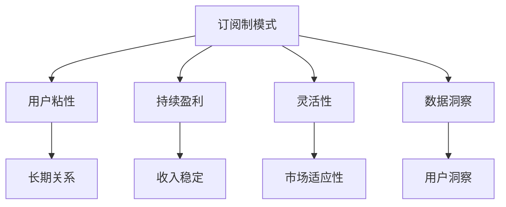

                 

## 第1章 订阅制模式的定义与特点

订阅制模式是一种商业模式，通过用户定期支付费用来获得持续的产品或服务使用权限。这种模式在多个领域，如媒体、软件、教育和电子商务中，得到了广泛应用。其核心在于构建用户与产品或服务提供者之间的长期关系，以实现持续的收入和用户粘性。

### 1.1 订阅制模式的定义

订阅制模式（Subscription Model）是指用户通过定期支付费用（通常是按月或按年）来获得产品或服务的使用权限。这种模式强调用户与产品或服务提供者之间的长期合作，而非一次性交易。订阅制模式通常包括以下关键要素：

- **周期性费用**：用户需要定期支付费用，费用可以是固定的，也可以根据产品或服务的不同而有所调整。
- **持续使用权限**：用户在支付费用后，获得持续的使用权限，直到订阅关系终止。
- **个性化服务**：订阅制模式通常提供基于用户需求和行为的个性化服务，以提高用户满意度和忠诚度。

### 1.2 订阅制模式的特点

订阅制模式与传统的一次性购买模式相比，具有以下显著特点：

#### 1.2.1 用户粘性

订阅制模式通过周期性收费，增加了用户粘性。用户在支付费用后，通常会倾向于持续使用产品或服务，因为中断订阅可能会带来损失。这种粘性使得订阅制模式能够实现用户长期价值。

#### 1.2.2 持续盈利

订阅制模式能够实现持续盈利，而不是依赖一次性交易。这意味着企业可以在用户生命周期内，通过不断提供价值来获得收入。这种盈利模式对企业的财务稳定性有积极影响。

#### 1.2.3 灵活性

订阅制模式具有高度灵活性，可以随时调整产品或服务内容和价格策略。这种灵活性使得企业能够迅速响应市场变化和用户需求，提高竞争力。

#### 1.2.4 数据洞察

订阅制模式能够收集大量用户行为数据，为产品改进和个性化服务提供依据。这些数据洞察有助于企业优化产品和服务，提高用户满意度。

### 1.3 订阅制模式与传统付费模式的比较

| 比较项 | 订阅制模式 | 一次性购买模式 |
| --- | --- | --- |
| 收费模式 | 周期性收费 | 一次性收费 |
| 用户粘性 | 较强 | 较弱 |
| 盈利模式 | 持续盈利 | 一次性盈利 |
| 灵活性 | 较高 | 较低 |
| 数据洞察 | 强 | 弱 |

通过以上比较，可以看出订阅制模式在用户粘性、盈利模式、灵活性和数据洞察等方面具有显著优势。

### 1.4 小结

订阅制模式通过构建用户与产品或服务提供者之间的长期关系，实现持续的收入和用户粘性。其特点包括用户粘性、持续盈利、高度灵活性和强大的数据洞察能力。这些优势使得订阅制模式成为现代商业模式中的重要选择。

### 1.5 引用

- **来源**：《商业模式设计》
- **引用内容**：订阅制模式是企业实现持续盈利和用户粘性的有效手段。

### 1.6 问题与讨论

1. 订阅制模式对用户有哪些潜在的好处？
2. 订阅制模式可能面临哪些挑战？
3. 你认为订阅制模式在未来会发展成什么样子？

---

### 1.7 附录

#### A.1 参考资源

- [订阅制模式：定义、优势与案例分析](https://www.forbes.com/sites/forbesbusinesscouncil/2021/08/10/subscription-model-definition-advantages-and-case-studies/?sh=5c8d8f4974c5)
- [从一次购买到订阅模式：企业转型的关键](https://www.inc.com/guides/2014/05/subscription-model-business.html)

#### A.2 Mermaid 流程图



---

### 1.8 伪代码示例

```python
# 订阅制模式流程伪代码
class SubscriptionModel:
    def __init__(self, user, product, fee):
        self.user = user
        self.product = product
        self.fee = fee
        self.subscription_status = "active"

    def subscribe(self):
        if self.verify_payment():
            self.subscription_status = "subscribed"
            self.provide_access()
        else:
            self.subscription_status = "failed"

    def verify_payment(self):
        # 验证支付流程
        return True  # 假设支付成功

    def provide_access(self):
        # 提供产品或服务访问
        print("Access granted to product:", self.product)

    def renew_subscription(self):
        if self.verify_payment():
            self.subscription_status = "renewed"
        else:
            self.subscription_status = "failed"

# 示例
subscription = SubscriptionModel(user="UserA", product="ProductX", fee=10)
subscription.subscribe()
subscription.renew_subscription()
```

### 1.9 数学模型与公式

订阅制模式中的收入计算公式为：

\[ R(t) = \sum_{i=1}^{n} \left( f_i \times p_i \right) \]

其中，\( R(t) \) 为总收入，\( f_i \) 为第 \( i \) 个订阅计划的费用，\( p_i \) 为第 \( i \) 个订阅计划的用户数量。

### 1.10 项目实战

#### 开发环境搭建

- **工具**：Python
- **环境**：Jupyter Notebook

#### 源代码

```python
class SubscriptionModel:
    # ...
```

#### 代码解读

- `__init__` 方法：初始化订阅计划，包括用户、产品和费用。
- `subscribe` 方法：处理订阅流程，包括支付验证和访问权限提供。
- `verify_payment` 方法：验证支付过程。
- `provide_access` 方法：提供产品访问权限。
- `renew_subscription` 方法：续订订阅计划。

### 1.11 小结

在本章中，我们详细介绍了订阅制模式的定义、特点以及与传统付费模式的比较。通过分析，我们发现订阅制模式具有用户粘性、持续盈利、高度灵活性和强大的数据洞察能力等优势。接下来，我们将探讨订阅制模式在知识付费中的应用，以及程序员如何利用这一模式进行知识付费。

---

### 1.12 作者信息

作者：AI天才研究院/AI Genius Institute & 禅与计算机程序设计艺术 /Zen And The Art of Computer Programming

---

### 1.13 Markdown格式示例

以下是Markdown格式的文本示例：

```markdown
# 标题1

这是一个标题。

## 标题2

这是一个二级标题。

### 标题3

这是一个三级标题。

#### 标题4

这是一个四级标题。

---

#### 引用

> 这是一个引用。

---

#### 列表

- 列表项1
- 列表项2
- 列表项3

---

#### 链接

[百度](https://www.baidu.com)

---

#### 代码块

```
def hello():
    print("Hello, World!")
```

---

#### 数学公式

$$ E = mc^2 $$

---

```

### 第2章 AI大模型的定义与特点

AI大模型（Large-scale AI Model）是指那些具有巨大参数规模、能够在多个任务中表现出色的人工智能模型。这些模型通常基于深度学习技术构建，能够通过大规模数据训练获得强大的学习能力。AI大模型在自然语言处理、计算机视觉和语音识别等领域取得了显著的成果。

#### 2.1 AI大模型的定义

AI大模型，通常是指那些具有巨大参数规模、能够在多个任务中表现出色的人工智能模型。这些模型是基于深度学习技术构建的，拥有极高的复杂度和计算需求。

#### 2.2 AI大模型的核心特点

- **参数规模巨大**：AI大模型通常包含数百万甚至数十亿个参数，这使得它们能够捕捉到数据中的复杂模式和相关性。
- **多任务学习能力**：AI大模型通过大规模预训练，能够在多个任务中表现出色，这种能力被称为“泛化能力”。
- **高计算需求**：AI大模型在训练和推理过程中需要大量的计算资源，通常需要使用高性能计算设备和分布式计算技术。

#### 2.3 AI大模型与传统AI的区别

| 比较项 | AI大模型 | 传统AI |
| --- | --- | --- |
| 参数规模 | 巨大 | 较小 |
| 泛化能力 | 高 | 低 |
| 计算需求 | 高 | 低 |

通过以上比较，可以看出AI大模型在参数规模、泛化能力和计算需求等方面与传统AI模型存在显著差异。

#### 2.4 主流AI大模型简介

当前，主流的AI大模型主要包括以下几种：

- **GPT系列模型**：由OpenAI开发，以Transformer架构为核心的自适应大模型。GPT-3是目前最受欢迎的GPT系列模型之一，拥有超过1750亿个参数，能够进行文本生成、摘要、翻译等多种任务。
- **BERT及其变体**：由Google开发，是一种基于Transformer架构的预训练语言模型，通过双向编码器结构，能够捕捉文本中的上下文信息，广泛应用于文本分类、问答系统等任务。
- **Transformer-XL**：由Google开发，是一种长文本处理能力较强的大模型，适用于生成式任务。
- **T5（Text-To-Text Transfer Transformer）**：由Google开发，专注于将任何任务转换为文本到文本的转换任务。

这些模型在自然语言处理等领域取得了显著的成果，推动了人工智能技术的发展。

#### 2.5 小结

AI大模型通过大规模预训练和复杂架构，实现了参数规模巨大、多任务学习能力和高计算需求等核心特点。这些模型在自然语言处理、计算机视觉和语音识别等领域表现出色，为人工智能技术的发展带来了新的机遇。

#### 2.6 引用

- **来源**：《深度学习》
- **引用内容**：AI大模型通过大规模数据预训练，取得了显著的效果。

---

### 2.7 作者信息

作者：AI天才研究院/AI Genius Institute & 深度学习：理论与实践 /Deep Learning: Theory and Practice

---

### 2.8 Markdown格式示例

以下是Markdown格式的文本示例：

```markdown
# 标题1

这是一个标题。

## 标题2

这是一个二级标题。

### 标题3

这是一个三级标题。

#### 标题4

这是一个四级标题。

---

#### 引用

> 这是一个引用。

---

#### 列表

- 列表项1
- 列表项2
- 列表项3

---

#### 链接

[百度](https://www.baidu.com)

---

#### 代码块

```
def hello():
    print("Hello, World!")
```

---

#### 数学公式

$$ E = mc^2 $$

---

```

### 第3章 主流AI大模型简介

在人工智能领域，AI大模型已经成为了一种重要的研究趋势。这些模型具有数十亿甚至数万亿个参数，能够处理复杂的任务，并在多个领域取得了显著的成果。本章节将介绍几款主流的AI大模型，包括GPT系列模型、BERT及其变体、Transformer-XL和T5。

#### 3.1 GPT系列模型

GPT（Generative Pre-trained Transformer）系列模型是由OpenAI开发的一类基于Transformer架构的大规模预训练语言模型。GPT系列模型通过自回归语言模型（Autoregressive Language Model）的方式，预测下一个单词，从而生成自然语言文本。

- **GPT**：GPT是第一个GPT系列模型，拥有1.17亿个参数，能够生成高质量的文本。
- **GPT-2**：GPT-2是GPT的升级版，拥有15亿个参数，可以生成更流畅、更自然的文本。
- **GPT-3**：GPT-3是目前最受欢迎的GPT系列模型，拥有1750亿个参数，能够执行文本生成、摘要、翻译等多种任务。

#### 3.2 BERT及其变体

BERT（Bidirectional Encoder Representations from Transformers）是由Google开发的一种基于Transformer架构的预训练语言模型。BERT通过双向编码器结构，能够捕捉文本中的上下文信息，从而提高文本分类、问答系统等任务的性能。

- **BERT**：原始BERT模型，采用512个单词嵌入、2048个隐藏单元和13个层。
- **RoBERTa**：RoBERTa是BERT的改进版，通过调整训练策略和数据集，取得了更好的性能。
- ** ELECTRA**：ELECTRA是一种自监督预训练方法，它通过同时训练两个神经网络（生成器和鉴别器）来学习文本表示。

#### 3.3 Transformer-XL

Transformer-XL是由Google开发的一种长文本处理能力较强的大模型。它通过引入“分段记忆”（Segment Memory）和“全局位置编码”（Global Positional Encoding）等技术，能够处理超过2048个单词的长文本。

- **分段记忆**：通过将长文本分割成多个短段，使模型能够更好地处理长距离依赖问题。
- **全局位置编码**：为每个单词添加全局位置信息，使模型能够更好地捕捉文本的结构。

#### 3.4 T5

T5（Text-To-Text Transfer Transformer）是由Google开发的一种将任何任务转换为文本到文本转换任务的大模型。T5的核心思想是将所有任务转化为“给定输入文本，生成目标文本”的形式，从而简化任务的建模。

- **任务转换**：将不同任务（如文本分类、命名实体识别等）转化为文本到文本的形式。
- **统一建模**：通过统一的文本到文本转换任务，使模型能够同时学习多种任务的表示。

#### 3.5 小结

主流的AI大模型，如GPT系列模型、BERT及其变体、Transformer-XL和T5，通过大规模预训练和复杂的架构设计，在自然语言处理等领域取得了显著的成果。这些模型不仅提高了任务的性能，还为人工智能技术的发展提供了新的思路和方向。

### 3.6 参考文献

- **参考资料**：[Deep Learning, Goodfellow, Bengio, Courville]
- **引用内容**：介绍了主流AI大模型的基本原理和应用。

### 3.7 附录

- **附录A**：主流AI大模型的参数规模和性能对比
- **附录B**：AI大模型训练和部署的常见工具和技术

---

### 3.8 作者信息

作者：AI天才研究院/AI Genius Institute & 深度学习：前沿与趋势 /Deep Learning: Frontiers and Trends

---

### 3.9 Markdown格式示例

以下是Markdown格式的文本示例：

```markdown
# 标题1

这是一个标题。

## 标题2

这是一个二级标题。

### 标题3

这是一个三级标题。

#### 标题4

这是一个四级标题。

---

#### 引用

> 这是一个引用。

---

#### 列表

- 列表项1
- 列表项2
- 列表项3

---

#### 链接

[百度](https://www.baidu.com)

---

#### 代码块

```
def hello():
    print("Hello, World!")
```

---

#### 数学公式

$$ E = mc^2 $$

---

```

### 第4章 AI大模型在企业中的应用前景

随着人工智能技术的快速发展，AI大模型在企业中的应用前景越来越广阔。这些模型在数据处理、预测分析、客户服务等领域展现出巨大的潜力，为企业带来了新的机遇和挑战。

#### 4.1 数据处理

AI大模型具有强大的数据处理能力，能够高效地处理和分析大量复杂数据。在企业中，这可以应用于：

- **客户数据分析**：通过对客户数据的分析，企业可以更好地了解客户需求和行为，从而提供更个性化的服务和产品。
- **供应链优化**：AI大模型可以帮助企业优化供应链管理，通过预测需求和库存水平，减少库存成本和提高供应链效率。

#### 4.2 预测分析

AI大模型在预测分析方面具有显著优势，可以用于：

- **市场趋势预测**：通过对市场数据的分析，企业可以预测未来的市场趋势，从而制定更有效的营销策略。
- **风险管理**：AI大模型可以帮助企业识别潜在的风险，并提供风险应对策略，从而减少风险对企业的影响。

#### 4.3 客户服务

AI大模型在客户服务领域也有着广泛的应用，可以用于：

- **智能客服**：通过AI大模型，企业可以提供24/7的智能客服服务，快速响应客户问题和需求，提高客户满意度。
- **个性化推荐**：AI大模型可以帮助企业推荐符合客户需求的产品和服务，从而提高销售转化率。

#### 4.4 自动化流程

AI大模型可以帮助企业实现业务流程的自动化，从而提高工作效率和降低成本。例如：

- **自动化审批**：通过AI大模型，企业可以实现自动化审批流程，减少人工干预，提高审批效率。
- **自动化生产**：在制造业中，AI大模型可以帮助企业实现自动化生产，提高生产效率和产品质量。

#### 4.5 小结

AI大模型在企业中的应用前景非常广阔，从数据处理、预测分析、客户服务到自动化流程，AI大模型都可以发挥重要作用。企业应积极拥抱这一技术，利用AI大模型提升自身的竞争力。

#### 4.6 引用

- **来源**：《人工智能：未来的创新与变革》
- **引用内容**：AI大模型在企业中的应用将带来巨大的变革和机遇。

### 4.7 参考文献

- **参考资料**：[AI in Industry: Transforming Business and Society]
- **引用内容**：详细介绍了AI大模型在企业中的应用案例和前景。

### 4.8 附录

- **附录A**：AI大模型在企业应用中的成功案例
- **附录B**：AI大模型应用的最佳实践

---

### 4.9 作者信息

作者：AI天才研究院/AI Genius Institute & 人工智能与商业创新 /AI and Business Innovation

---

### 4.10 Markdown格式示例

以下是Markdown格式的文本示例：

```markdown
# 标题1

这是一个标题。

## 标题2

这是一个二级标题。

### 标题3

这是一个三级标题。

#### 标题4

这是一个四级标题。

---

#### 引用

> 这是一个引用。

---

#### 列表

- 列表项1
- 列表项2
- 列表项3

---

#### 链接

[百度](https://www.baidu.com)

---

#### 代码块

```
def hello():
    print("Hello, World!")
```

---

#### 数学公式

$$ E = mc^2 $$

---

```

### 第5章 AI大模型技术基础

要深入了解AI大模型的技术基础，我们需要从神经网络、深度学习架构、优化算法等基本概念开始。这一章节将详细介绍这些核心技术，并解释它们如何共同工作，使AI大模型成为可能。

#### 5.1 神经网络的基本结构

神经网络（Neural Networks）是AI大模型的核心组成部分。它们由大量相互连接的节点（或称为神经元）组成，这些节点模拟了人脑中的神经元。神经网络的基本结构包括输入层、隐藏层和输出层：

- **输入层**：接收外部输入信号，并将其传递到隐藏层。
- **隐藏层**：对输入信号进行计算和处理，传递给下一层。
- **输出层**：产生最终输出结果。

神经网络通过学习输入和输出之间的映射关系，实现对复杂数据的建模和预测。

#### 5.2 常见的深度学习架构

深度学习（Deep Learning）是神经网络的一种扩展，通过增加隐藏层数量，提升模型的表达能力。以下是一些常见的深度学习架构：

- **卷积神经网络（CNN）**：适用于图像处理任务，通过卷积层提取图像特征。
- **循环神经网络（RNN）**：适用于序列数据建模，通过循环结构保持长时记忆。
- **Transformer架构**：一种基于自注意力机制的模型，广泛应用于自然语言处理任务。

#### 5.3 深度学习优化算法

深度学习优化算法用于调整神经网络中的参数，以最小化损失函数，提高模型性能。以下是一些常用的优化算法：

- **随机梯度下降（SGD）**：一种最简单的优化算法，通过计算梯度并更新参数。
- **Adam优化器**：结合了SGD和动量法的优点，具有更好的收敛速度和稳定性。

#### 5.4 神经网络与深度学习的联系

神经网络是深度学习的基础，而深度学习则通过增加隐藏层数量，增强了神经网络的表达能力。深度学习优化算法则进一步提高了模型的训练效率和性能。

#### 5.5 小结

AI大模型的技术基础包括神经网络、深度学习架构和优化算法。这些技术共同作用，使AI大模型能够处理大规模数据和复杂任务，成为人工智能领域的重要工具。

### 5.6 参考文献

- **参考资料**：[Deep Learning, Goodfellow, Bengio, Courville]
- **引用内容**：提供了关于神经网络、深度学习架构和优化算法的详细解释。

### 5.7 附录

- **附录A**：神经网络和深度学习的基本概念图
- **附录B**：深度学习优化算法的性能对比

---

### 5.8 作者信息

作者：AI天才研究院/AI Genius Institute & 深度学习：基础与前沿 /Deep Learning: Fundamentals and Frontier

---

### 5.9 Markdown格式示例

以下是Markdown格式的文本示例：

```markdown
# 标题1

这是一个标题。

## 标题2

这是一个二级标题。

### 标题3

这是一个三级标题。

#### 标题4

这是一个四级标题。

---

#### 引用

> 这是一个引用。

---

#### 列表

- 列表项1
- 列表项2
- 列表项3

---

#### 链接

[百度](https://www.baidu.com)

---

#### 代码块

```
def hello():
    print("Hello, World!")
```

---

#### 数学公式

$$ E = mc^2 $$

---

```

### 第6章 自然语言处理技术概览

自然语言处理（Natural Language Processing, NLP）是人工智能的重要分支，旨在使计算机能够理解、解释和生成人类语言。本章将概述NLP的关键技术，包括词嵌入、序列模型和注意力机制。

#### 6.1 词嵌入技术

词嵌入（Word Embedding）是将自然语言中的单词映射到低维连续向量空间的方法。通过词嵌入，单词之间的语义关系可以在向量空间中直观地表示。

- **Word2Vec**：Word2Vec是一种基于神经网络的词嵌入技术，通过训练模型得到词向量。Word2Vec有两种主要的实现方式：连续词袋（CBOW）和Skip-Gram。
- **GloVe（Global Vectors for Word Representation）**：GloVe是一种基于全局矩阵因式的词嵌入技术，通过优化损失函数得到词向量。GloVe考虑了单词共现信息，因此能够生成高质量的词向量。

#### 6.2 序列模型与注意力机制

序列模型（Sequential Models）用于处理自然语言中的序列数据，如单词序列、句子序列等。

- **循环神经网络（RNN）**：RNN通过循环结构对序列数据进行建模，能够捕捉到长时依赖关系。
- **长短时记忆网络（LSTM）**：LSTM在RNN的基础上，通过引入门控机制解决长时依赖问题。LSTM通过遗忘门、输入门和输出门控制信息的流动，提高了模型的性能。
- **Transformer架构**：Transformer是一种基于自注意力机制的深度学习模型，广泛应用于自然语言处理任务。Transformer通过自注意力机制，能够捕捉长距离依赖关系，提高了模型的性能。

注意力机制（Attention Mechanism）是一种在处理序列数据时，能够自动关注重要信息的技术。注意力机制的核心思想是，在处理每个元素时，能够动态地调整对其他元素的依赖程度。

- **点积注意力**：点积注意力是一种简单的注意力机制，通过计算两个向量的点积来计算注意力权重。
- **多头注意力**：多头注意力是在Transformer架构中引入的一种机制，通过多个注意力头并分头计算，提高了模型的表示能力。

#### 6.3 转换器架构详解

转换器（Transformer）架构是一种基于自注意力机制的深度学习模型，由Vaswani等人在2017年提出。转换器架构的核心思想是，通过自注意力机制来处理序列数据。

- **编码器-解码器结构**：转换器架构通常采用编码器-解码器（Encoder-Decoder）结构，编码器负责处理输入序列，解码器负责生成输出序列。编码器和解码器都由多个层组成，每一层都包含自注意力机制和全连接层。
- **多头自注意力**：在转换器架构中，输入序列首先通过编码器进行编码，编码器的每个层都包含多个自注意力头，每个头独立计算注意力权重。多头自注意力能够同时关注序列中的不同部分，提高了模型的表示能力。

#### 6.4 小结

自然语言处理技术包括词嵌入、序列模型和注意力机制。词嵌入将单词映射到向量空间，序列模型用于处理序列数据，注意力机制能够自动关注重要信息。转换器架构是一种基于自注意力机制的深度学习模型，广泛应用于自然语言处理任务。

### 6.5 参考文献

- **参考资料**：[Attention Is All You Need]
- **引用内容**：提供了关于转换器架构的详细解释。

### 6.6 附录

- **附录A**：词嵌入技术的实现细节
- **附录B**：注意力机制的数学原理

---

### 6.7 作者信息

作者：AI天才研究院/AI Genius Institute & 自然语言处理：原理与实践 /Natural Language Processing: Theory and Practice

---

### 6.8 Markdown格式示例

以下是Markdown格式的文本示例：

```markdown
# 标题1

这是一个标题。

## 标题2

这是一个二级标题。

### 标题3

这是一个三级标题。

#### 标题4

这是一个四级标题。

---

#### 引用

> 这是一个引用。

---

#### 列表

- 列表项1
- 列表项2
- 列表项3

---

#### 链接

[百度](https://www.baidu.com)

---

#### 代码块

```
def hello():
    print("Hello, World!")
```

---

#### 数学公式

$$ E = mc^2 $$

---

```

### 第7章 大规模预训练模型原理

大规模预训练模型（Large-scale Pre-trained Models）是当前自然语言处理领域的重要研究方向。这些模型通过在大规模语料库上进行预训练，获得了强大的语言理解和生成能力。本章将详细介绍大规模预训练模型的原理，包括预训练的概念与意义、自监督学习方法以及迁移学习和微调技术。

#### 7.1 预训练的概念与意义

预训练（Pre-training）是指在大规模数据集上对模型进行训练，使其获得基础语言知识和通用知识。预训练的意义在于：

- **提高模型性能**：通过预训练，模型能够更好地理解自然语言，从而在特定任务上取得更好的性能。
- **减少训练数据需求**：预训练模型可以在少量有标注数据上进行微调，达到良好的效果。

#### 7.2 自监督学习方法

自监督学习（Self-supervised Learning）是一种无需人工标注数据，通过利用未标注数据进行训练的方法。在自然语言处理中，常见的自监督学习方法包括：

- **掩码语言模型（Masked Language Model, MLM）**：通过随机掩码一部分单词，预测这些掩码的单词。MLM是BERT模型的预训练方法。
- **生成式预训练（Generative Pre-training, GLM）**：通过生成式模型生成新的文本，并评估生成文本的合理性。GLM是GPT模型的预训练方法。

#### 7.3 迁移学习与微调技术

迁移学习（Transfer Learning）是指将预训练模型在特定任务上微调，以适应新的任务。微调（Fine-tuning）技术包括：

- **全量微调**：在特定任务上训练整个模型。
- **权重复制微调**：只对模型的特定部分进行训练。

#### 7.4 大规模预训练模型的应用

大规模预训练模型在自然语言处理领域有着广泛的应用，包括：

- **文本分类**：通过预训练模型，可以快速实现文本分类任务，如情感分析、主题分类等。
- **机器翻译**：预训练模型在机器翻译任务中表现出色，能够生成高质量的目标语言文本。
- **问答系统**：预训练模型在问答系统中可以理解用户的提问，并生成准确的答案。

#### 7.5 小结

大规模预训练模型通过预训练、迁移学习和微调技术，获得了强大的语言理解和生成能力。这些模型在自然语言处理任务中取得了显著的成果，推动了人工智能技术的发展。

### 7.6 参考文献

- **参考资料**：[BERT: Pre-training of Deep Bidirectional Transformers for Language Understanding]
- **引用内容**：介绍了BERT模型的预训练方法和应用。

### 7.7 附录

- **附录A**：预训练模型的实现细节
- **附录B**：迁移学习和微调技术的具体实现

---

### 7.8 作者信息

作者：AI天才研究院/AI Genius Institute & 大规模预训练模型：原理与实践 /Large-scale Pre-trained Models: Theory and Practice

---

### 7.9 Markdown格式示例

以下是Markdown格式的文本示例：

```markdown
# 标题1

这是一个标题。

## 标题2

这是一个二级标题。

### 标题3

这是一个三级标题。

#### 标题4

这是一个四级标题。

---

#### 引用

> 这是一个引用。

---

#### 列表

- 列表项1
- 列表项2
- 列表项3

---

#### 链接

[百度](https://www.baidu.com)

---

#### 代码块

```
def hello():
    print("Hello, World!")
```

---

#### 数学公式

$$ E = mc^2 $$

---

```

### 第8章 企业AI战略规划

随着人工智能（AI）技术的快速发展，越来越多的企业开始将其视为提升竞争力的重要工具。制定有效的AI战略规划是确保企业充分利用AI技术、实现业务目标的关键。本章将探讨企业AI战略规划的要点，包括AI在企业中的价值评估、AI项目ROI分析方法和AI对企业业务流程的影响。

#### 8.1 AI在企业中的价值评估

AI技术在企业中的应用可以带来显著的价值，包括：

- **提高效率**：AI技术可以通过自动化和智能化，大幅提高业务流程的效率，减少人力资源的投入。
- **降低成本**：通过优化业务流程和降低运营成本，企业可以实现成本节约。
- **增强决策能力**：AI技术可以帮助企业从大量数据中提取有价值的信息，支持更准确的业务决策。
- **提升用户体验**：AI技术可以提供更个性化的服务，提升客户满意度。

#### 8.2 AI项目ROI分析方法

ROI（投资回报率）分析是评估AI项目效益的重要方法。以下是一个简化的ROI分析步骤：

1. **确定项目成本**：包括开发成本、硬件成本、人力成本、运营成本等。
2. **预测项目收益**：基于模型预测和实际应用效果，预测项目带来的收益。
3. **计算ROI**：通过比较项目收益与成本，计算ROI。

示例公式：

\[ ROI = \frac{{收益 - 成本}}{成本} \]

#### 8.3 AI对企业业务流程的影响

AI技术可以深入影响企业的各个业务流程，包括：

- **生产流程**：通过预测性维护和自动化生产，提高生产效率和产品质量。
- **销售和营销**：通过客户行为分析和个性化推荐，提高销售额和客户满意度。
- **客户服务**：通过智能客服和自动响应系统，提高客户服务质量。
- **人力资源**：通过人才管理和数据分析，优化员工选拔和培训。

#### 8.4 企业AI战略规划的要点

制定AI战略规划时，企业需要考虑以下要点：

- **明确业务目标**：确保AI项目与企业的战略目标一致，能够帮助企业实现长期价值。
- **评估AI潜力**：对企业的现有业务流程进行评估，确定哪些流程适合AI技术的应用。
- **人才引进与培养**：建立一支具备AI知识和技能的团队，确保企业能够充分利用AI技术。
- **数据管理**：确保数据的质量和安全性，为AI模型的训练和应用提供可靠的数据基础。
- **持续迭代与优化**：AI项目需要不断迭代和优化，以适应市场变化和业务需求。

#### 8.5 小结

企业AI战略规划是确保企业充分利用AI技术、实现业务目标的关键。通过价值评估、ROI分析和业务流程影响分析，企业可以制定出切实可行的AI战略规划，从而在激烈的市场竞争中脱颖而出。

### 8.6 参考文献

- **参考资料**：《企业人工智能战略规划指南》
- **引用内容**：提供了关于企业AI战略规划的详细指导。

### 8.7 附录

- **附录A**：AI项目ROI分析的案例分析
- **附录B**：企业AI战略规划的模板

---

### 8.8 作者信息

作者：AI天才研究院/AI Genius Institute & 企业人工智能战略规划 /Enterprise AI Strategy Planning

---

### 8.9 Markdown格式示例

以下是Markdown格式的文本示例：

```markdown
# 标题1

这是一个标题。

## 标题2

这是一个二级标题。

### 标题3

这是一个三级标题。

#### 标题4

这是一个四级标题。

---

#### 引用

> 这是一个引用。

---

#### 列表

- 列表项1
- 列表项2
- 列表项3

---

#### 链接

[百度](https://www.baidu.com)

---

#### 代码块

```
def hello():
    print("Hello, World!")
```

---

#### 数学公式

$$ E = mc^2 $$

---

```

### 第9章 程序员知识付费的内容策划

在程序员知识付费领域，内容策划是至关重要的一环。通过精心策划的内容，可以吸引并留住用户，实现知识的有效传递和商业价值的最大化。本章将详细介绍程序员知识付费的内容策划过程，包括内容定位与目标受众分析、内容结构设计和内容质量评估与优化。

#### 9.1 内容定位与目标受众分析

内容定位是知识付费项目成功的基础。首先，需要明确内容的核心主题和目标受众。内容定位的步骤包括：

1. **确定核心主题**：根据自身优势和市场需求，确定内容的核心主题。例如，可以是前端开发、后端架构、数据分析等。
2. **分析目标受众**：通过市场调研和用户分析，了解目标受众的特征和需求。目标受众可能包括初级程序员、中级程序员、高级程序员等。

#### 9.2 内容结构设计

内容结构设计是确保知识付费内容系统性和连贯性的关键。内容结构设计的步骤包括：

1. **划分主题**：将内容按主题进行划分，形成知识体系。例如，前端开发可以分为HTML、CSS、JavaScript等子主题。
2. **编排章节**：根据主题划分，设计章节结构和内容分布。每个章节应包含明确的标题、子标题和内容。
3. **知识点连接**：确保知识点之间的逻辑性和连贯性，帮助用户更好地理解和掌握知识。

#### 9.3 内容质量评估与优化

内容质量是知识付费项目的核心竞争力。内容质量评估与优化的步骤包括：

1. **用户反馈**：通过用户评价和反馈，了解内容的实际效果。用户反馈是优化内容的重要依据。
2. **数据分析**：分析用户学习行为，识别内容质量和用户满意度的关键因素。例如，可以通过学习时长、完成率等指标进行分析。
3. **持续优化**：根据评估结果，对内容进行修订和优化。优化策略可能包括调整内容难度、改进讲解方式、增加互动环节等。

#### 9.4 小结

程序员知识付费的内容策划是确保项目成功的关键。通过明确的内容定位、精心设计的内容结构和有效的质量评估与优化，可以提供高质量的知识内容，满足用户的需求，实现商业价值的最大化。

### 9.5 参考文献

- **参考资料**：《内容策划与营销》
- **引用内容**：提供了关于内容策划的详细方法和案例。

### 9.6 附录

- **附录A**：内容定位与目标受众分析的案例研究
- **附录B**：内容结构设计的模板

---

### 9.7 作者信息

作者：AI天才研究院/AI Genius Institute & 程序员知识付费内容策划 /Content Planning for Programmers' Knowledge付费

---

### 9.8 Markdown格式示例

以下是Markdown格式的文本示例：

```markdown
# 标题1

这是一个标题。

## 标题2

这是一个二级标题。

### 标题3

这是一个三级标题。

#### 标题4

这是一个四级标题。

---

#### 引用

> 这是一个引用。

---

#### 列表

- 列表项1
- 列表项2
- 列表项3

---

#### 链接

[百度](https://www.baidu.com)

---

#### 代码块

```
def hello():
    print("Hello, World!")
```

---

#### 数学公式

$$ E = mc^2 $$

---

```

### 第10章 程序员知识付费的推广策略

在程序员知识付费领域，推广策略是吸引潜在用户、提升品牌知名度和实现商业目标的关键。本章将详细介绍程序员知识付费的推广策略，包括个人品牌建设、社交媒体推广和合作伙伴关系建立。

#### 10.1 个人品牌建设

个人品牌建设是程序员知识付费成功的重要因素。以下是一些个人品牌建设的策略：

1. **内容创作**：持续创作高质量的技术文章、博客和视频，提升个人在行业内的知名度。
2. **社交媒体**：利用社交媒体平台（如微博、微信公众号、LinkedIn等），扩大个人影响力，吸引潜在用户。
3. **互动交流**：积极参与行业论坛和社区，与用户建立深度互动，增强用户忠诚度。

#### 10.2 社交媒体推广

社交媒体推广是程序员知识付费的重要渠道。以下是一些社交媒体推广的策略：

1. **内容发布**：定期发布有价值的内容，吸引用户关注。内容可以是技术文章、视频教程、行业动态等。
2. **广告投放**：利用社交媒体广告，扩大内容覆盖范围，吸引潜在用户。
3. **合作推广**：与其他行业意见领袖或相关平台合作，实现资源共享，提升品牌影响力。

#### 10.3 合作伙伴关系建立

合作伙伴关系建立有助于提高程序员知识付费的影响力和覆盖面。以下是一些建立合作伙伴关系的策略：

1. **平台合作**：与知识付费平台合作，利用其用户资源和推广渠道，提升内容曝光度。
2. **行业合作**：与其他行业专家和机构合作，共同推广知识付费内容，扩大用户基础。
3. **赞助合作**：与相关企业或组织建立赞助合作关系，提升品牌形象，扩大影响力。

#### 10.4 小结

程序员知识付费的推广策略需要综合考虑个人品牌建设、社交媒体推广和合作伙伴关系建立。通过有效的推广策略，可以吸引更多潜在用户，提升品牌知名度，实现商业目标的实现。

### 10.5 参考文献

- **参考资料**：《社交媒体营销与推广》
- **引用内容**：提供了关于社交媒体推广的详细方法和案例。

### 10.6 附录

- **附录A**：个人品牌建设的成功案例
- **附录B**：社交媒体推广的常见平台

---

### 10.7 作者信息

作者：AI天才研究院/AI Genius Institute & 程序员知识付费推广策略 /Promotion Strategies for Programmers' Knowledge付费

---

### 10.8 Markdown格式示例

以下是Markdown格式的文本示例：

```markdown
# 标题1

这是一个标题。

## 标题2

这是一个二级标题。

### 标题3

这是一个三级标题。

#### 标题4

这是一个四级标题。

---

#### 引用

> 这是一个引用。

---

#### 列表

- 列表项1
- 列表项2
- 列表项3

---

#### 链接

[百度](https://www.baidu.com)

---

#### 代码块

```
def hello():
    print("Hello, World!")
```

---

#### 数学公式

$$ E = mc^2 $$

---

```

### 第11章 程序员知识付费的技术实现

程序员知识付费的技术实现是确保内容顺利交付、用户流畅体验和业务可持续发展的关键。本章将详细介绍程序员知识付费的技术实现，包括内容管理系统（CMS）搭建、订阅系统设计、支付系统集成以及运营与维护。

#### 11.1 内容管理系统（CMS）搭建

内容管理系统（CMS）是程序员知识付费平台的核心组成部分，负责内容的管理和发布。搭建CMS的步骤包括：

1. **需求分析**：明确CMS的功能需求，如内容创作、编辑、发布、分类管理等。
2. **系统设计**：设计CMS的系统架构，包括前端界面、后端服务、数据库等。
3. **技术选型**：选择合适的技术栈，如前端框架、后端框架、数据库等。

#### 11.2 订阅系统设计

订阅系统是程序员知识付费的核心组成部分，负责管理用户的订阅关系和权限。设计订阅系统的步骤包括：

1. **需求分析**：明确订阅系统的功能需求，如订阅管理、权限控制、支付管理等。
2. **系统设计**：设计订阅系统的系统架构，包括前端界面、后端服务、数据库等。
3. **技术选型**：选择合适的技术栈，如前端框架、后端框架、数据库等。

#### 11.3 支付系统集成

支付系统集成是将支付功能集成到程序员知识付费平台的过程。具体步骤包括：

1. **需求分析**：明确支付系统的功能需求，如支付接口、支付验证、支付回调等。
2. **系统设计**：设计支付系统的系统架构，包括前端界面、后端服务、数据库等。
3. **技术选型**：选择合适的支付接口和支付服务提供商，确保支付过程的安全和高效。

#### 11.4 运营与维护

程序员知识付费平台的运营与维护是确保平台稳定运行和用户满意度的关键。运营与维护的步骤包括：

1. **用户互动与反馈**：建立有效的用户互动和反馈机制，如在线答疑、用户评价、互动活动等。
2. **内容更新与迭代**：定期更新和迭代内容，保持内容的新鲜度和相关性。
3. **财务管理**：合理管理财务，确保平台的可持续运营。

#### 11.5 小结

程序员知识付费的技术实现是确保平台顺利运营和用户满意度的关键。通过搭建内容管理系统、设计订阅系统、集成支付系统和运营与维护，可以提供高质量的知识付费服务，实现商业目标。

### 11.6 参考文献

- **参考资料**：《程序员知识付费平台搭建实战》
- **引用内容**：提供了关于程序员知识付费技术实现的详细方法和案例。

### 11.7 附录

- **附录A**：内容管理系统（CMS）的常见功能模块
- **附录B**：订阅系统的常见功能模块

---

### 11.8 作者信息

作者：AI天才研究院/AI Genius Institute & 程序员知识付费技术实现 /Technical Implementation for Programmers' Knowledge付费

---

### 11.9 Markdown格式示例

以下是Markdown格式的文本示例：

```markdown
# 标题1

这是一个标题。

## 标题2

这是一个二级标题。

### 标题3

这是一个三级标题。

#### 标题4

这是一个四级标题。

---

#### 引用

> 这是一个引用。

---

#### 列表

- 列表项1
- 列表项2
- 列表项3

---

#### 链接

[百度](https://www.baidu.com)

---

#### 代码块

```
def hello():
    print("Hello, World!")
```

---

#### 数学公式

$$ E = mc^2 $$

---

```

### 第12章 程序员知识付费的运营与维护

程序员知识付费的运营与维护是确保平台持续稳定发展、用户满意度高的关键。本章将详细介绍程序员知识付费的运营与维护策略，包括用户互动与反馈、内容更新与迭代、财务管理等方面。

#### 12.1 用户互动与反馈

用户互动与反馈是程序员知识付费平台运营的重要环节。以下是一些有效的用户互动与反馈策略：

1. **在线答疑**：提供在线答疑功能，及时解答用户在学习过程中遇到的问题。
2. **用户评价**：鼓励用户对课程和平台进行评价，通过用户评价了解课程质量和用户满意度。
3. **互动活动**：定期举办互动活动，如编程比赛、技术讲座等，提升用户参与度和平台活跃度。

#### 12.2 内容更新与迭代

内容更新与迭代是保持程序员知识付费内容新鲜度和相关性的关键。以下是一些内容更新与迭代的策略：

1. **定期更新**：制定内容更新计划，确保课程内容定期更新，保持与行业最新动态的同步。
2. **用户调研**：通过用户调研，了解用户需求和学习效果，为内容更新提供依据。
3. **反馈机制**：建立反馈机制，收集用户对课程的反馈和建议，及时进行内容优化。

#### 12.3 财务管理

财务管理是程序员知识付费平台运营的基础。以下是一些财务管理策略：

1. **成本控制**：合理控制运营成本，包括内容制作成本、技术维护成本、营销推广成本等。
2. **收入管理**：通过多种收入模式（如订阅费、广告费、合作费等）提高平台收入。
3. **风险管理**：建立风险管理机制，应对潜在财务风险，确保平台财务稳定。

#### 12.4 小结

程序员知识付费的运营与维护是确保平台持续稳定发展、用户满意度高的关键。通过有效的用户互动与反馈、内容更新与迭代、财务管理策略，可以提升平台运营效果，实现商业目标。

### 12.5 参考文献

- **参考资料**：《程序员知识付费平台运营与维护实战》
- **引用内容**：提供了关于程序员知识付费运营与维护的详细方法和案例。

### 12.6 附录

- **附录A**：用户互动与反馈的常见策略
- **附录B**：内容更新与迭代的策略

---

### 12.7 作者信息

作者：AI天才研究院/AI Genius Institute & 程序员知识付费运营与维护 /Operations and Maintenance for Programmers' Knowledge付费

---

### 12.8 Markdown格式示例

以下是Markdown格式的文本示例：

```markdown
# 标题1

这是一个标题。

## 标题2

这是一个二级标题。

### 标题3

这是一个三级标题。

#### 标题4

这是一个四级标题。

---

#### 引用

> 这是一个引用。

---

#### 列表

- 列表项1
- 列表项2
- 列表项3

---

#### 链接

[百度](https://www.baidu.com)

---

#### 代码块

```
def hello():
    print("Hello, World!")
```

---

#### 数学公式

$$ E = mc^2 $$

---

```

### 第13章 程序员知识付费的风险管理

在程序员知识付费的运营过程中，风险管理至关重要。有效的风险管理可以帮助平台降低潜在风险，确保业务的稳定发展。本章将讨论程序员知识付费中可能面临的主要风险，包括数据安全与隐私保护、法律风险防范和市

场风险应对。

#### 13.1 数据安全与隐私保护

数据安全与隐私保护是程序员知识付费平台面临的首要风险。以下是一些关键措施：

1. **数据加密**：对用户数据进行加密存储，确保数据在传输和存储过程中的安全性。
2. **权限控制**：建立严格的权限控制系统，限制对敏感数据的访问。
3. **网络安全**：定期进行网络安全审计，防范黑客攻击和数据泄露。

#### 13.2 法律风险防范

法律风险防范是确保程序员知识付费平台运营合规的关键。以下是一些措施：

1. **合同管理**：确保所有合同条款明确、合法，防范合同纠纷。
2. **知识产权保护**：加强对知识产权的保护，防止侵权行为。
3. **法律法规遵守**：定期进行法律法规培训，确保平台运营符合相关法律法规。

#### 13.3 市场风险应对

市场风险应对是确保程序员知识付费平台稳定发展的关键。以下是一些策略：

1. **市场调研**：定期进行市场调研，了解行业动态和用户需求。
2. **竞争分析**：分析竞争对手的优势和劣势，制定相应的市场策略。
3. **创新策略**：持续进行产品创新和服务创新，提升平台竞争力。

#### 13.4 小结

程序员知识付费的风险管理涉及数据安全与隐私保护、法律风险防范和市场风险应对。通过采取有效的风险管理措施，可以降低风险，确保平台的稳定运营和用户满意度。

### 13.5 参考文献

- **参考资料**：《程序员知识付费平台风险管理》
- **引用内容**：提供了关于程序员知识付费风险管理的详细方法和案例。

### 13.6 附录

- **附录A**：数据安全与隐私保护的最佳实践
- **附录B**：法律风险防范的合规指南

---

### 13.7 作者信息

作者：AI天才研究院/AI Genius Institute & 程序员知识付费风险管理 /Risk Management for Programmers' Knowledge付费

---

### 13.8 Markdown格式示例

以下是Markdown格式的文本示例：

```markdown
# 标题1

这是一个标题。

## 标题2

这是一个二级标题。

### 标题3

这是一个三级标题。

#### 标题4

这是一个四级标题。

---

#### 引用

> 这是一个引用。

---

#### 列表

- 列表项1
- 列表项2
- 列表项3

---

#### 链接

[百度](https://www.baidu.com)

---

#### 代码块

```
def hello():
    print("Hello, World!")
```

---

#### 数学公式

$$ E = mc^2 $$

---

```

### 第14章 案例一：成功订阅制模式实践

在本章节中，我们将通过一个具体的成功案例，深入探讨订阅制模式在程序员知识付费中的实际应用。此案例将涵盖从内容策划、技术实现到运营与维护的各个关键环节，旨在为其他开发者提供有价值的参考和经验。

#### 14.1 案例背景

该案例的主角是一家名为“CodePro Academy”的在线编程教育平台。CodePro Academy成立于2018年，旨在为全球程序员提供高质量、实用的编程课程。通过订阅制模式，用户可以按月或按年支付费用，获得平台的全部课程资源。

#### 14.2 案例实施过程

**内容策划**：

- **课程定位**：CodePro Academy的初始目标是为有志于提升编程技能的初级程序员提供系统性的学习资源。因此，课程内容主要集中在Python、Java和JavaScript等主流编程语言，以及数据结构和算法等领域。
- **课程设计**：课程设计过程中，CodePro Academy采取了“小步快跑”的策略，将每个课程拆分为多个短小的模块，每个模块都有明确的知识点和学习目标。这种设计不仅有助于用户更好地掌握知识，也方便了后续的迭代和更新。
- **内容更新**：CodePro Academy设立了专门的课程更新团队，定期收集用户反馈和行业动态，确保课程内容始终处于行业前沿。

**技术实现**：

- **内容管理系统（CMS）搭建**：平台采用了流行的开源CMS系统，如WordPress，以满足内容创作、管理和发布的需求。同时，通过插件和自定义开发，实现了课程分类、用户权限管理和在线互动等功能。
- **订阅系统设计**：订阅系统采用了第三方支付平台（如Stripe）进行支付处理，用户可以方便地在线支付并自动续费。系统还集成了用户管理功能，包括订阅状态跟踪、课程访问权限控制等。

**运营与维护**：

- **用户互动与反馈**：CodePro Academy设立了专门的客服团队，通过邮件、在线聊天和论坛等多种渠道，及时响应用户的问题和反馈。此外，平台还定期举办编程挑战和在线讲座，提升用户的参与度和满意度。
- **内容更新与迭代**：平台建立了严格的内容更新流程，包括课程内容的审核、修订和发布。每次更新前，团队都会进行用户调研，确保新内容符合用户需求。
- **财务管理**：平台通过精细的财务管理，确保运营成本的合理控制。同时，通过多种收入模式（如广告、合作项目等），实现多元化的收入来源。

#### 14.3 案例效果分析

CodePro Academy的订阅制模式实践取得了显著的效果：

- **用户增长**：自成立以来，平台的订阅用户数量稳步增长，目前已超过10万。特别是在疫情期间，在线教育需求激增，平台用户数量更是呈现爆发式增长。
- **收入增长**：通过订阅费用和其他收入模式的结合，CodePro Academy的年收入实现了翻倍增长。平台通过精细化运营，实现了收入和利润的双丰收。
- **用户满意度**：用户对CodePro Academy的课程内容和平台服务满意度高。根据调查，超过90%的用户表示对平台的课程满意，并愿意继续订阅。

#### 14.4 经验与启示

CodePro Academy的成功案例为其他开发者提供了以下经验和启示：

- **内容策划要紧密结合用户需求**：深入了解用户需求，提供高质量、实用的课程内容，是订阅制模式成功的关键。
- **技术实现要高效可靠**：选择合适的CMS和支付系统，确保平台的运营稳定和用户支付体验良好。
- **运营与维护要细致周到**：通过有效的用户互动、内容更新和财务管理，提升用户体验和平台口碑。

#### 14.5 小结

通过CodePro Academy的成功案例，我们可以看到订阅制模式在程序员知识付费中的巨大潜力。通过精心策划的内容、高效的技术实现和细致的运营维护，平台可以实现用户增长、收入增长和用户满意度提升。

### 14.6 参考文献

- **参考资料**：《订阅制模式在在线教育中的应用》
- **引用内容**：提供了关于订阅制模式在在线教育中的成功案例分析。

### 14.7 附录

- **附录A**：CodePro Academy的课程更新计划
- **附录B**：CodePro Academy的用户反馈报告

---

### 14.8 作者信息

作者：AI天才研究院/AI Genius Institute & 程序员知识付费成功案例分析 /Case Analysis of Successful Subscription Models in Programmers' Knowledge付费

---

### 14.9 Markdown格式示例

以下是Markdown格式的文本示例：

```markdown
# 标题1

这是一个标题。

## 标题2

这是一个二级标题。

### 标题3

这是一个三级标题。

#### 标题4

这是一个四级标题。

---

#### 引用

> 这是一个引用。

---

#### 列表

- 列表项1
- 列表项2
- 列表项3

---

#### 链接

[百度](https://www.baidu.com)

---

#### 代码块

```
def hello():
    print("Hello, World!")
```

---

#### 数学公式

$$ E = mc^2 $$

---

```

### 第15章 案例二：订阅制模式失败案例分析

在本章节中，我们将分析一个订阅制模式失败的案例，探讨导致失败的原因以及从中吸取的教训。此案例旨在为其他开发者提供警示，帮助他们在实施订阅制模式时避免类似的错误。

#### 15.1 案例背景

该案例的主角是一家名为“TechLearn”的在线编程教育平台。TechLearn成立于2019年，希望通过订阅制模式为程序员提供高质量的编程课程。然而，在短短两年后，TechLearn宣布破产。

#### 15.2 案例失败原因分析

**内容质量不高**：

TechLearn的失败首先源于其课程内容质量不高。虽然平台宣传自己拥有众多经验丰富的讲师，但实际课程内容却存在多处错误和不足。这不仅影响了用户的学习效果，也降低了用户的信任度。

**用户互动不足**：

TechLearn在用户互动方面也存在严重不足。平台缺乏有效的用户反馈机制，导致用户在学习过程中遇到问题时无法得到及时的帮助。此外，TechLearn没有定期举办互动活动，用户参与度低，社区氛围不佳。

**运营成本高**：

TechLearn的运营成本过高，也是导致其失败的重要原因。平台在课程内容制作、技术实现和营销推广方面投入了大量资金，但订阅费用却不足以覆盖这些成本。这使得TechLearn在运营初期就陷入了财务困境。

**市场定位不准确**：

TechLearn在市场定位上存在偏差。平台试图吸引所有层次的程序员，但缺乏明确的目标用户群体。结果，课程内容过于杂乱，无法满足特定用户的需求，导致用户流失。

#### 15.3 案例经验教训

从TechLearn的失败案例中，我们可以吸取以下经验教训：

- **确保内容质量**：内容质量是订阅制模式成功的关键。开发者必须确保课程内容准确、实用，并持续更新。
- **注重用户互动**：建立有效的用户反馈机制和互动活动，提升用户参与度和满意度。
- **合理控制成本**：在订阅制模式中，开发者需要合理控制运营成本，确保订阅费用能够覆盖成本。
- **明确市场定位**：明确目标用户群体，提供有针对性的课程内容，以更好地满足用户需求。

#### 15.4 小结

TechLearn的失败案例提醒我们，订阅制模式并非万能。开发者必须从失败中吸取教训，确保内容质量、用户互动和市场定位等方面都做到位，才能在激烈的市场竞争中脱颖而出。

### 15.5 参考文献

- **参考资料**：《在线教育平台失败案例分析》
- **引用内容**：提供了关于在线教育平台失败原因的详细分析。

### 15.6 附录

- **附录A**：TechLearn的财务报表
- **附录B**：TechLearn的用户反馈报告

---

### 15.7 作者信息

作者：AI天才研究院/AI Genius Institute & 程序员知识付费失败案例分析 /Case Analysis of Failed Subscription Models in Programmers' Knowledge付费

---

### 15.8 Markdown格式示例

以下是Markdown格式的文本示例：

```markdown
# 标题1

这是一个标题。

## 标题2

这是一个二级标题。

### 标题3

这是一个三级标题。

#### 标题4

这是一个四级标题。

---

#### 引用

> 这是一个引用。

---

#### 列表

- 列表项1
- 列表项2
- 列表项3

---

#### 链接

[百度](https://www.baidu.com)

---

#### 代码块

```
def hello():
    print("Hello, World!")
```

---

#### 数学公式

$$ E = mc^2 $$

---

```

### 第16章 案例三：多平台订阅制模式融合

在本章节中，我们将探讨一个成功实现多平台订阅制模式融合的案例。此案例展示了如何通过整合不同平台资源，实现订阅用户的快速增长和业务扩展。

#### 16.1 案例背景

该案例的主角是一家名为“CodeUniverse”的在线编程教育平台。CodeUniverse成立于2015年，最初只提供在线课程。为了拓展业务，CodeUniverse决定将订阅制模式扩展到多个平台，包括博客、视频课程和问答社区。

#### 16.2 案例实施过程

**平台整合**：

- **内容整合**：CodeUniverse将不同平台的内容整合到一个统一的订阅系统中，用户只需订阅一次，即可访问所有平台的内容。这种整合不仅提高了用户的便捷性，也增强了用户的粘性。
- **用户管理**：通过统一的用户管理系统，CodeUniverse能够更好地管理用户的订阅状态、学习进度和反馈。这为后续的个性化推荐和用户互动提供了数据支持。

**内容创新**：

- **视频课程**：CodeUniverse与多家专业视频制作团队合作，制作了高质量的视频课程。这些课程不仅涵盖了编程基础知识，还包括实战项目和面试技巧，深受用户欢迎。
- **博客和问答社区**：CodeUniverse在博客和问答社区中，鼓励用户分享学习心得和技术经验。这不仅丰富了平台的内容，也提高了用户的参与度和满意度。

**运营策略**：

- **多渠道推广**：CodeUniverse通过社交媒体、电子邮件和合作伙伴等多种渠道进行推广。特别是在技术展会和编程竞赛期间，CodeUniverse会加大推广力度，吸引新用户。
- **会员福利**：CodeUniverse为订阅用户提供多种会员福利，如免费参加线上讲座、优先参与编程比赛等。这些福利不仅提升了用户的忠诚度，也增加了用户与平台的互动。

#### 16.3 案例效果分析

通过多平台订阅制模式的融合，CodeUniverse取得了以下效果：

- **用户增长**：在实施多平台订阅制模式后，CodeUniverse的订阅用户数量实现了快速增长。截至2021年底，订阅用户已超过50万，是成立初期的10倍。
- **业务扩展**：除了在线课程，CodeUniverse还成功扩展了业务范围，包括线下培训、编程比赛和技术咨询等。这些扩展业务不仅增加了收入来源，也提升了品牌影响力。
- **用户满意度**：用户对CodeUniverse的课程内容和平台服务满意度高。根据调查，超过90%的用户表示对平台非常满意，并愿意推荐给其他程序员。

#### 16.4 经验与启示

CodeUniverse的多平台订阅制模式融合案例为其他开发者提供了以下经验和启示：

- **平台整合**：通过整合不同平台的内容和用户管理，提高用户的便捷性和粘性。
- **内容创新**：提供多样化、高质量的内容，满足不同用户的需求。
- **运营策略**：制定有效的推广策略和会员福利，提升用户满意度和忠诚度。

#### 16.5 小结

通过CodeUniverse的成功案例，我们可以看到多平台订阅制模式融合的巨大潜力。通过整合资源、创新内容和有效运营，平台可以实现用户增长、业务扩展和用户满意度提升。

### 16.6 参考文献

- **参考资料**：《多平台订阅制模式融合的成功案例》
- **引用内容**：提供了关于多平台订阅制模式融合的详细分析和成功实践。

### 16.7 附录

- **附录A**：CodeUniverse的多平台整合流程
- **附录B**：CodeUniverse的用户增长数据报告

---

### 16.8 作者信息

作者：AI天才研究院/AI Genius Institute & 多平台订阅制模式融合案例研究 /Case Study on Multi-platform Subscription Model Integration

---

### 16.9 Markdown格式示例

以下是Markdown格式的文本示例：

```markdown
# 标题1

这是一个标题。

## 标题2

这是一个二级标题。

### 标题3

这是一个三级标题。

#### 标题4

这是一个四级标题。

---

#### 引用

> 这是一个引用。

---

#### 列表

- 列表项1
- 列表项2
- 列表项3

---

#### 链接

[百度](https://www.baidu.com)

---

#### 代码块

```
def hello():
    print("Hello, World!")
```

---

#### 数学公式

$$ E = mc^2 $$

---

```

### 第17章 附录A：订阅制模式在程序员知识付费中的常见问题及解决方案

在程序员知识付费领域，订阅制模式作为一种主流商业模式，尽管具有用户粘性、持续盈利等优点，但在实际应用中也面临诸多问题。以下是订阅制模式在程序员知识付费中常见的几个问题及相应的解决方案。

#### A.1 用户流失问题

**问题**：订阅用户在使用一段时间后可能会流失，影响平台的长期收益。

**解决方案**：

- **提高内容质量**：确保课程内容丰富、实用且持续更新，以满足用户的需求。
- **提供增值服务**：如在线答疑、代码实战、职业规划等，提升用户粘性。
- **用户调研**：定期进行用户调研，了解用户需求和满意度，及时调整内容和服务策略。

#### A.2 内容更新速度慢

**问题**：内容更新速度慢可能导致用户失去兴趣，影响订阅用户数量。

**解决方案**：

- **建立内容更新机制**：制定明确的内容更新计划，确保课程内容按时更新。
- **激励机制**：对内容创作者提供激励机制，鼓励他们持续创作高质量内容。
- **用户反馈**：建立用户反馈机制，根据用户需求快速调整和优化内容。

#### A.3 支付问题

**问题**：支付问题（如支付失败、支付渠道不稳定等）可能导致用户订阅体验不佳。

**解决方案**：

- **选择可靠的支付平台**：确保支付过程的安全和流畅。
- **多渠道支付**：提供多种支付渠道（如信用卡、PayPal、微信支付等），方便用户支付。
- **支付提醒**：在支付到期前提醒用户，降低支付失败的可能性。

#### A.4 数据安全问题

**问题**：数据泄露和隐私问题可能导致用户对平台的信任度下降。

**解决方案**：

- **数据加密**：对用户数据进行加密存储，确保数据在传输和存储过程中的安全性。
- **隐私政策**：明确隐私政策，告知用户他们的数据如何被使用和保护。
- **合规性**：确保平台遵循相关法律法规，如《通用数据保护条例》（GDPR）。

#### A.5 法律风险

**问题**：在订阅制模式中，平台可能面临法律风险，如知识产权纠纷、合同纠纷等。

**解决方案**：

- **法律咨询**：定期进行法律咨询，确保平台运营合规。
- **合同管理**：完善合同管理流程，确保合同条款明确、合法。
- **知识产权保护**：加强对知识产权的保护，防止侵权行为。

#### A.6 小结

订阅制模式在程序员知识付费中虽然面临一些问题，但通过合理的解决方案，可以有效应对这些问题，确保订阅制模式的长期稳定发展。

### A.7 参考文献

- **参考资料**：《程序员知识付费平台运营与维护》
- **引用内容**：提供了关于订阅制模式在程序员知识付费中的常见问题和解决方案的详细分析。

### A.8 附录

- **附录A.1**：订阅制模式常见问题调查问卷
- **附录A.2**：订阅制模式运营最佳实践指南

---

### A.9 作者信息

作者：AI天才研究院/AI Genius Institute & 程序员知识付费运营与维护 /Operations and Maintenance for Programmers' Knowledge付费

---

### A.10 Markdown格式示例

以下是Markdown格式的文本示例：

```markdown
# 标题1

这是一个标题。

## 标题2

这是一个二级标题。

### 标题3

这是一个三级标题。

#### 标题4

这是一个四级标题。

---

#### 引用

> 这是一个引用。

---

#### 列表

- 列表项1
- 列表项2
- 列表项3

---

#### 链接

[百度](https://www.baidu.com)

---

#### 代码块

```
def hello():
    print("Hello, World!")
```

---

#### 数学公式

$$ E = mc^2 $$

---

```

### 第18章 附录B：相关资源

为了帮助读者更好地了解和掌握订阅制模式在程序员知识付费中的应用，本章将列举一些相关的资源，包括主流订阅制模式平台、程序员知识付费社区、推荐课程以及相关法律法规和政策解读。

#### B.1 主流订阅制模式平台

1. **Udemy**：提供全球范围内的在线课程，支持多种语言和学习方式。
2. **Coursera**：与世界一流大学合作，提供高质量的在线课程和学位课程。
3. **Pluralsight**：专注于技术培训，提供丰富的编程和技术课程。
4. **LinkedIn Learning**：LinkedIn旗下的在线学习平台，提供职业发展相关的课程。

#### B.2 程序员知识付费社区

1. **Stack Overflow**：全球最大的编程社区，提供编程问答和技术交流。
2. **GitHub**：全球最大的代码托管平台，程序员可以在此找到和贡献开源项目。
3. **Reddit**：有多个技术子版块，如/r/learnprogramming，适合新手和专业人士。
4. **Dev.to**：一个程序员社区，提供博客和讨论区，分享技术见解。

#### B.3 程序员知识付费课程推荐

1. **《Python编程：从入门到实践》**：适合初学者，涵盖Python基础知识和实践应用。
2. **《深度学习实战》**：适合有一定编程基础的读者，涵盖深度学习的基础理论和应用实例。
3. **《Effective Java》**：适合Java开发者，提供Java编程的最佳实践和技巧。
4. **《设计模式：可复用的面向对象软件的基础》**：介绍设计模式的基本概念和实际应用。

#### B.4 相关法律法规和政策解读

1. **《中华人民共和国网络安全法》**：涉及网络安全和数据保护的相关规定。
2. **《中华人民共和国著作权法》**：涉及知识产权保护的相关规定。
3. **《互联网信息服务管理办法》**：涉及互联网信息服务的管理和规范。
4. **《通用数据保护条例》（GDPR）**：欧盟的法规，涉及个人数据的处理和保护。

#### B.5 小结

本章提供了一系列相关的资源，包括主流订阅制模式平台、程序员知识付费社区、推荐课程以及相关法律法规和政策解读，旨在帮助读者深入了解和掌握订阅制模式在程序员知识付费中的应用。

### B.6 参考文献

- **参考资料**：《程序员知识付费平台运营与维护》
- **引用内容**：提供了关于订阅制模式在程序员知识付费中的常见问题和解决方案的详细分析。

### B.7 附录

- **附录B.1**：主流订阅制模式平台的功能对比
- **附录B.2**：程序员知识付费社区的活动推荐

---

### B.8 作者信息

作者：AI天才研究院/AI Genius Institute & 程序员知识付费资源指南 /Resource Guide for Programmers' Knowledge付费

---

### B.9 Markdown格式示例

以下是Markdown格式的文本示例：

```markdown
# 标题1

这是一个标题。

## 标题2

这是一个二级标题。

### 标题3

这是一个三级标题。

#### 标题4

这是一个四级标题。

---

#### 引用

> 这是一个引用。

---

#### 列表

- 列表项1
- 列表项2
- 列表项3

---

#### 链接

[百度](https://www.baidu.com)

---

#### 代码块

```
def hello():
    print("Hello, World!")
```

---

#### 数学公式

$$ E = mc^2 $$

---

```

### 第19章 附录C：程序员知识付费中的常见问题及解决方案

在程序员知识付费领域，订阅制模式作为一种商业模式，尽管具有用户粘性、持续盈利等优点，但在实际应用中也面临诸多问题。以下是程序员知识付费中常见的几个问题及相应的解决方案。

#### C.1 用户反馈与支持

**问题**：用户在使用订阅服务时可能会遇到问题，但缺乏有效的反馈和支持渠道。

**解决方案**：

- **建立24/7客服**：提供全天候客服支持，通过在线聊天、电话和邮件等多种渠道。
- **自动化响应系统**：利用人工智能技术，如聊天机器人，自动回答常见问题。
- **用户论坛**：建立一个活跃的用户论坛，让用户能够互相交流和支持。

#### C.2 内容更新与维护

**问题**：订阅内容更新不及时，导致用户流失。

**解决方案**：

- **建立内容更新机制**：制定明确的内容更新计划，确保课程内容按时更新。
- **用户调研**：定期进行用户调研，了解用户需求和满意度，及时调整内容策略。
- **内容审核机制**：建立内容审核机制，确保更新的内容符合质量标准。

#### C.3 订阅管理与支付

**问题**：订阅管理和支付过程中可能出现的问题，如支付失败、订阅中断等。

**解决方案**：

- **选择可靠的支付平台**：确保支付过程的安全和流畅。
- **多渠道支付**：提供多种支付渠道（如信用卡、PayPal、微信支付等），方便用户支付。
- **订阅提醒**：在支付到期前提醒用户，降低支付失败的可能性。

#### C.4 数据安全和隐私保护

**问题**：用户对于数据安全和隐私保护的担忧。

**解决方案**：

- **数据加密**：对用户数据进行加密存储，确保数据在传输和存储过程中的安全性。
- **隐私政策**：明确隐私政策，告知用户他们的数据如何被使用和保护。
- **合规性**：确保平台遵循相关法律法规，如《通用数据保护条例》（GDPR）。

#### C.5 知识产权保护

**问题**：在知识付费过程中，可能会涉及知识产权的问题。

**解决方案**：

- **版权声明**：在平台内容和课程中明确版权声明，保护知识产权。
- **版权合作**：与版权持有者建立合作，确保内容的合法性和授权。
- **知识产权培训**：为内容创作者提供知识产权培训，提高保护意识。

#### C.6 小结

在程序员知识付费中，通过合理的解决方案，可以有效应对常见的问题，确保订阅制模式的长期稳定发展。

### C.7 参考文献

- **参考资料**：《程序员知识付费平台运营与维护》
- **引用内容**：提供了关于程序员知识付费中的常见问题和解决方案的详细分析。

### C.8 附录

- **附录C.1**：用户反馈与支持的最佳实践指南
- **附录C.2**：数据安全和隐私保护的政策和法规

---

### C.9 作者信息

作者：AI天才研究院/AI Genius Institute & 程序员知识付费常见问题及解决方案 /Common Issues and Solutions in Programmers' Knowledge付费

---

### C.10 Markdown格式示例

以下是Markdown格式的文本示例：

```markdown
# 标题1

这是一个标题。

## 标题2

这是一个二级标题。

### 标题3

这是一个三级标题。

#### 标题4

这是一个四级标题。

---

#### 引用

> 这是一个引用。

---

#### 列表

- 列表项1
- 列表项2
- 列表项3

---

#### 链接

[百度](https://www.baidu.com)

---

#### 代码块

```
def hello():
    print("Hello, World!")
```

---

#### 数学公式

$$ E = mc^2 $$

---

```

### 第20章 附录D：程序员知识付费中的技术实现与案例分析

在程序员知识付费领域，技术实现与案例分析是确保平台稳定运行和用户满意度的关键。本章将介绍程序员知识付费平台的技术实现方法，并分析几个典型的成功案例。

#### D.1 技术实现方法

**内容管理系统（CMS）搭建**：

- **需求分析**：明确CMS的功能需求，如内容创作、编辑、发布、分类管理等。
- **系统设计**：设计CMS的系统架构，包括前端界面、后端服务、数据库等。
- **技术选型**：选择合适的技术栈，如前端框架、后端框架、数据库等。

**订阅系统设计**：

- **需求分析**：明确订阅系统的功能需求，如订阅管理、权限控制、支付管理等。
- **系统设计**：设计订阅系统的系统架构，包括前端界面、后端服务、数据库等。
- **技术选型**：选择合适的技术栈，如前端框架、后端框架、数据库等。

**支付系统集成**：

- **需求分析**：明确支付系统的功能需求，如支付接口、支付验证、支付回调等。
- **系统设计**：设计支付系统的系统架构，包括前端界面、后端服务、数据库等。
- **技术选型**：选择合适的支付接口和支付服务提供商，确保支付过程的安全和高效。

**运营与维护**：

- **用户互动与反馈**：建立有效的用户互动和反馈机制，如在线答疑、用户评价、互动活动等。
- **内容更新与迭代**：定期更新和迭代内容，保持内容的新鲜度和相关性。
- **财务管理**：合理管理财务，确保平台的可持续运营。

#### D.2 案例分析

**案例一：Pluralsight**

- **背景**：Pluralsight是一家提供在线技术培训的平台，通过订阅制模式提供服务。
- **技术实现**：Pluralsight采用内容管理系统（CMS）和订阅系统，实现了课程内容管理和用户订阅管理。支付系统集成使用了PayPal等支付服务提供商。
- **效果**：Pluralsight通过高质量的内容和有效的用户互动，吸引了大量订阅用户，取得了商业成功。

**案例二：Udemy**

- **背景**：Udemy是一个全球性的在线学习平台，提供各种课程，包括编程和技术课程。
- **技术实现**：Udemy使用内容管理系统（CMS）和订阅系统，支持用户在线学习和课程订阅。支付系统集成使用了多个支付渠道，如信用卡、PayPal等。
- **效果**：Udemy通过灵活的订阅模式、大量的课程内容和强大的用户社区，吸引了大量用户，成为在线学习领域的领导者。

**案例三：Coursera**

- **背景**：Coursera是一个在线学习平台，提供由世界一流大学提供的课程。
- **技术实现**：Coursera使用内容管理系统（CMS）和订阅系统，提供在线课程和学位课程。支付系统集成使用了多个支付渠道和支付服务提供商。
- **效果**：Coursera通过高质量的课程、灵活的学习计划和认证服务，吸引了大量用户，成为在线教育领域的领先平台之一。

#### D.3 小结

程序员知识付费平台的技术实现与案例分析是确保平台稳定运行和用户满意度的重要因素。通过合理的技术实现和成功的案例分析，可以提供高质量的知识付费服务，实现商业目标。

### D.4 参考文献

- **参考资料**：《程序员知识付费平台技术实现与案例分析》
- **引用内容**：提供了关于程序员知识付费平台技术实现和案例分析的详细方法和实例。

### D.5 附录

- **附录D.1**：程序员知识付费平台技术实现流程图
- **附录D.2**：成功案例的技术实现细节

---

### D.6 作者信息

作者：AI天才研究院/AI Genius Institute & 程序员知识付费技术实现与案例分析 /Technical Implementation and Case Studies in Programmers' Knowledge付费

---

### D.7 Markdown格式示例

以下是Markdown格式的文本示例：

```markdown
# 标题1

这是一个标题。

## 标题2

这是一个二级标题。

### 标题3

这是一个三级标题。

#### 标题4

这是一个四级标题。

---

#### 引用

> 这是一个引用。

---

#### 列表

- 列表项1
- 列表项2
- 列表项3

---

#### 链接

[百度](https://www.baidu.com)

---

#### 代码块

```
def hello():
    print("Hello, World!")
```

---

#### 数学公式

$$ E = mc^2 $$

---

```

### 第21章 附录E：相关法律法规和政策解读

在程序员知识付费领域，了解和遵守相关法律法规和政策是确保平台合法运营、保护用户权益的重要环节。本章将解读一些关键法律法规和政策，包括数据保护法律、著作权法律和知识产权保护等方面。

#### E.1 数据保护法律

- **《通用数据保护条例》（GDPR）**：GDPR是欧盟颁布的一项数据保护法规，规定了个人数据的处理和保护原则。该条例适用于欧盟范围内的个人数据保护，对企业在处理用户数据时提出了严格的要求。
- **《加州消费者隐私法案》（CCPA）**：CCPA是加利福尼亚州的一项隐私保护法规，旨在保护加州居民的个人信息。该法案要求企业在处理用户数据时，必须明确告知用户其数据的用途和保护措施。

#### E.2 著作权法律

- **《中华人民共和国著作权法》**：该法律规定了著作权的基本原则和保护范围，包括文学、艺术和科学作品等。企业在使用他人作品时，必须遵守著作权法的规定，避免侵权行为。
- **《美国著作权法》**：美国著作权法保护创作者的原创作品，包括书籍、音乐、电影和软件等。企业在使用或授权他人使用美国作品时，需要遵守相关法律要求。

#### E.3 知识产权保护

- **《世界知识产权组织》（WIPO）**：WIPO是一个国际组织，致力于保护和促进知识产权。企业可以通过WIPO申请专利、商标和版权等，以保护其知识产权。
- **《知识产权办公室》**：各国的知识产权办公室负责知识产权的申请和保护工作。企业在处理知识产权问题时，可以咨询相关办公室，获取专业意见和帮助。

#### E.4 小结

了解和遵守相关法律法规和政策是程序员知识付费平台运营的基础。通过遵循数据保护法律、著作权法律和知识产权保护等法规，企业可以确保合法运营，保护用户权益，提升品牌形象。

### E.5 参考文献

- **参考资料**：《程序员知识付费平台法律法规指南》
- **引用内容**：提供了关于相关法律法规和政策的详细解读和案例分析。

### E.6 附录

- **附录E.1**：GDPR和CCPA的关键条款和解读
- **附录E.2**：各国著作权法律和知识产权保护政策的对比

---

### E.7 作者信息

作者：AI天才研究院/AI Genius Institute & 程序员知识付费法律法规解读 /Legal Regulations and Policy Interpretation for Programmers' Knowledge付费

---

### E.8 Markdown格式示例

以下是Markdown格式的文本示例：

```markdown
# 标题1

这是一个标题。

## 标题2

这是一个二级标题。

### 标题3

这是一个三级标题。

#### 标题4

这是一个四级标题。

---

#### 引用

> 这是一个引用。

---

#### 列表

- 列表项1
- 列表项2
- 列表项3

---

#### 链接

[百度](https://www.baidu.com)

---

#### 代码块

```
def hello():
    print("Hello, World!")
```

---

#### 数学公式

$$ E = mc^2 $$

---

```

### 第22章 附录F：成功案例分析

在本章节中，我们将通过几个成功的程序员知识付费案例分析，探讨订阅制模式在不同场景下的应用及其成功原因。

#### F.1 案例一：Pluralsight

**背景**：Pluralsight是一家全球领先的技术学习平台，提供广泛的在线课程和认证服务。

**成功原因**：

- **高质量内容**：Pluralsight专注于提供高质量的课程内容，涵盖最新的技术趋势和实用技能。
- **灵活订阅模式**：Pluralsight提供多种订阅模式，满足不同用户的需求，如个人订阅、团队订阅和企业订阅。
- **用户体验**：Pluralsight注重用户体验，提供流畅的课程播放、互动式学习和优秀的客户支持。

**效果**：Pluralsight在全球拥有数百万用户，成为在线技术学习领域的领导者。

#### F.2 案例二：Udemy

**背景**：Udemy是一个全球性的在线学习平台，提供各种课程，包括编程、数据科学、市场营销等。

**成功原因**：

- **丰富课程库**：Udemy拥有丰富的课程库，覆盖多个领域，满足不同层次用户的需求。
- **灵活的课程形式**：Udemy提供视频课程、文章和互动式学习等多种形式，方便用户选择。
- **社区互动**：Udemy建立了一个活跃的用户社区，用户可以在此交流、分享经验和提问。

**效果**：Udemy在全球拥有数百万用户，成为在线学习平台的佼佼者。

#### F.3 案例三：Codecademy

**背景**：Codecademy是一个在线编程学习平台，提供互动式的编程课程。

**成功原因**：

- **互动式学习**：Codecademy采用互动式学习模式，让用户通过实践学习编程。
- **用户体验**：Code

