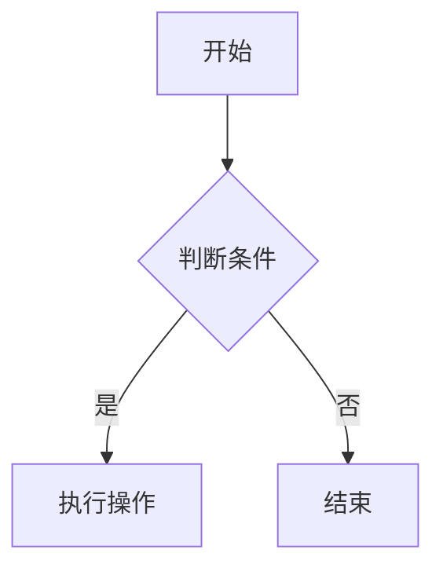
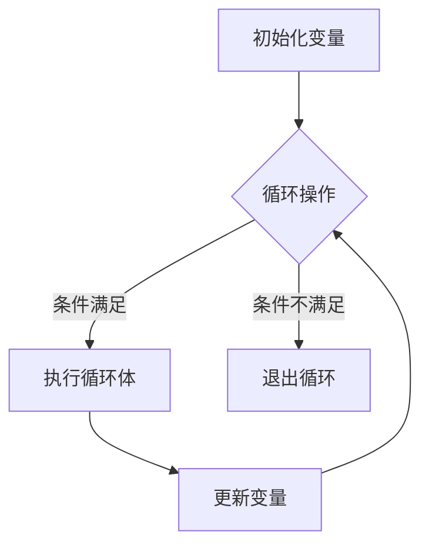
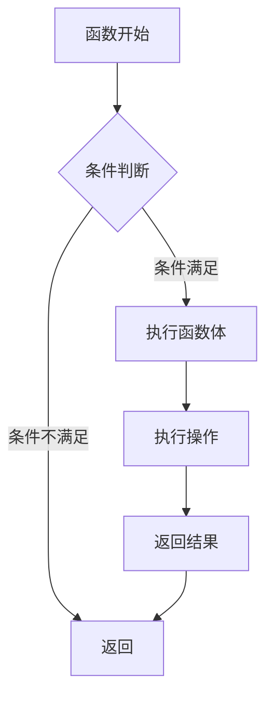
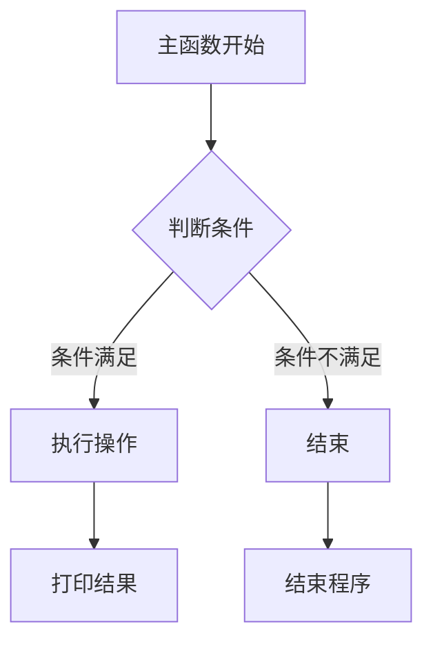
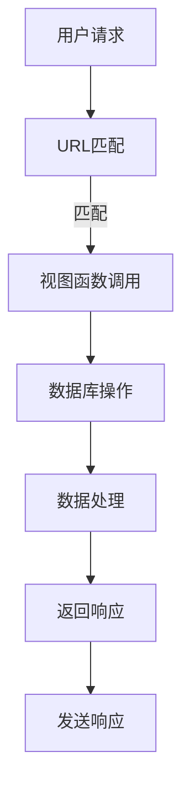
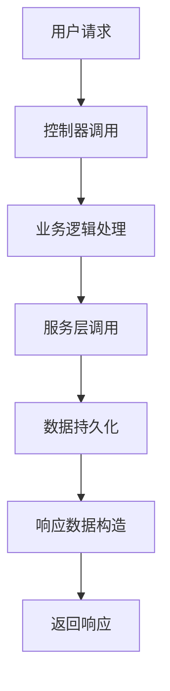
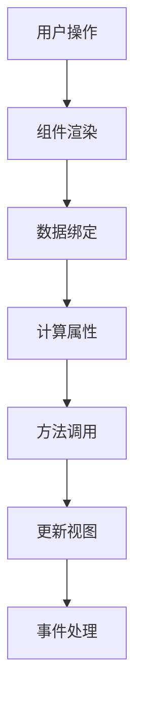

                 

## 《程序员如何选择适合自己的知识付费方向》

> **关键词**：知识付费、程序员、职业发展、技术栈、学习策略、实战案例分析

> **摘要**：本文将带领程序员们深入探讨如何选择适合自己的知识付费方向，从基础知识、职业发展、实战案例分析等多个角度，提供实用的建议和策略，帮助程序员们在不断变化的技术领域中保持竞争力。

### 《程序员如何选择适合自己的知识付费方向》目录大纲

- **第一部分：基础知识篇**
  - 第1章：知识付费概述
  - 第2章：编程语言与框架概述
  - 第3章：技术栈与领域知识

- **第二部分：职业发展篇**
  - 第4章：程序员职业规划
  - 第5章：提升个人技能
  - 第6章：职业认证与证书

- **第三部分：实战与案例分析**
  - 第7章：项目实战与代码解读
  - 第8章：案例分析
  - 第9章：常见问题与解答

#### 附录

- **附录A：编程资源与工具**
- **附录B：编程语言与框架的Mermaid流程图**
- **附录C：算法原理与伪代码**
- **附录D：代码案例与解读**
- **附录E：常见问题与解答**

### 第一部分：基础知识篇

**第1章：知识付费概述**

**第2章：编程语言与框架概述**

**第3章：技术栈与领域知识**

### 第二部分：职业发展篇

**第4章：程序员职业规划**

**第5章：提升个人技能**

**第6章：职业认证与证书**

### 第三部分：实战与案例分析

**第7章：项目实战与代码解读**

**第8章：案例分析**

**第9章：常见问题与解答**

### 附录

- **附录A：编程资源与工具**
- **附录B：编程语言与框架的Mermaid流程图**
- **附录C：算法原理与伪代码**
- **附录D：代码案例与解读**
- **附录E：常见问题与解答**

### 结束

现在，让我们详细探讨如何选择适合自己的知识付费方向，帮助程序员们在不断变化的技术领域中取得成功。

### 知识付费概述

知识付费是近年来快速发展的一个新兴领域，它指的是用户为了获取有价值的信息或知识，愿意支付相应的费用。对于程序员来说，知识付费不仅是一种学习资源，更是提升自身技能和职业竞争力的有效途径。

**1.1 知识付费的概念与历史发展**

知识付费的起源可以追溯到互联网的兴起，早期的知识付费主要形式包括在线课程、电子书、线下培训等。随着移动互联网和支付技术的发展，知识付费逐渐成为了一个庞大的市场。尤其是在知识更新速度加快的今天，程序员们通过知识付费获取前沿技术和专业知识的需求日益增长。

**1.2 知识付费市场的现状与趋势**

当前，知识付费市场呈现出几个显著的趋势：

- **个性化学习**：随着人工智能技术的应用，知识付费平台能够根据用户的学习习惯和兴趣，提供个性化的学习内容和推荐。
- **多元化内容**：除了传统的编程课程外，知识付费内容涵盖了大数据、人工智能、云计算等多个领域，满足程序员多样化的学习需求。
- **付费形式多样化**：除了传统的在线课程外，知识付费的形式还包括直播授课、一对一辅导、项目实战等，提供了更加灵活的学习方式。

**1.3 程序员为什么要选择知识付费**

对于程序员来说，选择知识付费有以下几点优势：

- **高效学习**：知识付费课程通常由专业讲师授课，内容系统、结构清晰，能够帮助程序员快速掌握知识点。
- **权威性**：知名讲师和权威机构的课程具有较高的可信度，程序员可以通过这些课程学习到行业内的最佳实践。
- **拓展视野**：知识付费不仅限于编程技能的提升，还可以帮助程序员了解新兴技术和行业动态，拓宽职业发展道路。

### 编程语言与框架概述

编程语言是程序员与计算机交流的工具，而框架则是为了提高开发效率和代码质量而设计的一套组件和库。了解不同编程语言和框架的特点，对于程序员选择知识付费方向至关重要。

**2.1 编程语言简介**

**2.1.1 常见编程语言对比**

- **Python**：Python 是一种高级编程语言，以其简洁易懂的语法和强大的库支持而闻名。它在数据科学、人工智能和Web开发等领域有着广泛的应用。
- **Java**：Java 是一种多平台、面向对象的编程语言，广泛应用于企业级应用开发、Android应用开发等。
- **JavaScript**：JavaScript 是一种脚本语言，主要用于Web前端开发，也是Node.js后端开发的基础。
- **C++**：C++ 是一种高性能的编程语言，适用于系统软件、游戏开发和嵌入式系统等高性能领域。
- **Go**：Go 是一种新兴的编程语言，以其并发性能和快速编译而受到开发者青睐，适用于云计算和微服务架构。

**2.1.2 语言选择策略**

选择编程语言时，应考虑以下因素：

- **项目需求**：不同的编程语言适用于不同的场景，了解项目需求是选择语言的关键。
- **个人兴趣**：选择自己感兴趣的编程语言，可以提高学习动力和效率。
- **社区支持**：强大的社区支持可以提供丰富的学习资源和帮助。

**2.2 常见框架介绍**

**2.2.1 Web框架**

- **Django**：Django 是一种高层次的Python Web框架，注重快速开发和简洁性。
- **Spring**：Spring 是一种流行的Java Web框架，提供了丰富的企业级功能。
- **React**：React 是一种用于构建用户界面的JavaScript库，以其高效和组件化设计而著称。
- **Vue**：Vue 是一种渐进式JavaScript框架，易于上手，适用于构建大型应用。
- **Laravel**：Laravel 是一种流行的PHP Web框架，以其优雅的语法和丰富的功能而受到开发者喜爱。

**2.2.2 数据库框架**

- **SQLAlchemy**：SQLAlchemy 是一种Python ORM框架，提供了丰富的数据库操作功能。
- **Hibernate**：Hibernate 是一种Java ORM框架，广泛应用于企业级应用。
- **Sequelize**：Sequelize 是一种Node.js ORM框架，支持多种数据库。
- **Entity Framework**：Entity Framework 是一种.NET ORM框架，提供了强大的数据访问功能。

**2.2.3 其他框架**

- **Django REST framework**：Django REST framework 是一种用于构建RESTful API的扩展框架。
- **Flask**：Flask 是一种轻量级的Python Web框架，适合小型项目。
- **Express**：Express 是一种Node.js Web框架，以其简洁和灵活而受到开发者喜爱。
- **Spring Boot**：Spring Boot 是一种简化Spring应用的框架，提供了快速开发的支持。

### 技术栈与领域知识

技术栈是指一个项目中涉及的所有技术组件和技术领域，它对于项目成功至关重要。了解如何构建适合自己的技术栈，是程序员在职业发展中的一项重要任务。

**3.1 技术栈的选择与构建**

**3.1.1 前端技术栈**

- **HTML/CSS**：HTML和CSS是前端开发的基础，用于构建网页结构和样式。
- **JavaScript**：JavaScript是用于实现网页交互和动态效果的核心技术。
- **框架与库**：如React、Vue、Angular等，提供了更高效的前端开发体验。
- **版本控制**：Git是前端开发中常用的版本控制系统。

**3.1.2 后端技术栈**

- **编程语言**：如Java、Python、Node.js等，用于编写服务器端代码。
- **框架与库**：如Spring、Django、Express等，提供了高效的开发工具和功能。
- **数据库**：如MySQL、PostgreSQL、MongoDB等，用于存储和管理数据。
- **中间件**：如Redis、RabbitMQ等，用于处理消息队列和缓存。

**3.1.3 全栈开发**

全栈开发是指掌握前端、后端和数据库等多个领域技能，能够独立完成整个项目的开发。对于程序员来说，全栈开发不仅提高了项目交付的效率，还增强了职业竞争力。

**3.2 专项领域知识**

**3.2.1 大数据**

大数据技术包括数据采集、存储、处理和分析等多个环节。掌握大数据技术，可以帮助程序员在数据密集型应用领域获得竞争优势。

- **Hadoop**：Hadoop 是一种分布式数据处理框架，适用于大规模数据存储和处理。
- **Spark**：Spark 是一种快速的分布式计算引擎，适用于大数据分析。
- **Hive**：Hive 是一种基于Hadoop的数据仓库工具，用于数据分析。
- **Impala**：Impala 是一种高性能的大数据查询引擎。

**3.2.2 人工智能**

人工智能是当前技术领域的热点，掌握人工智能相关技术，可以帮助程序员在智能应用开发中发挥重要作用。

- **机器学习**：机器学习是人工智能的核心技术，包括分类、回归、聚类等多种算法。
- **深度学习**：深度学习是机器学习的一个分支，基于多层神经网络实现复杂任务。
- **TensorFlow**：TensorFlow 是一种开源的机器学习和深度学习框架。
- **PyTorch**：PyTorch 是另一种流行的深度学习框架，以其灵活性和易用性而受到开发者喜爱。

**3.2.3 云计算**

云计算提供了丰富的计算资源和存储服务，对于程序员来说，掌握云计算技术可以拓展职业发展空间。

- **AWS**：AWS 是一家全球领先的云计算服务提供商，提供了丰富的云计算服务。
- **Azure**：Azure 是微软提供的云计算平台，适用于企业级应用开发。
- **Google Cloud**：Google Cloud 是谷歌提供的云计算平台，以其高性能和可靠性而受到开发者喜爱。
- **Docker**：Docker 是一种容器化技术，用于简化应用程序的部署和运行。
- **Kubernetes**：Kubernetes 是一种容器编排工具，用于管理容器的自动化部署、扩展和运维。

### 程序员职业规划

职业规划是程序员在职业发展过程中至关重要的一环，它涉及到个人的职业目标设定、发展路径选择和技能提升策略。通过科学的职业规划，程序员可以更好地实现自身价值，提升职业竞争力。

**4.1 职业发展路径分析**

**4.1.1 初级程序员**

初级程序员通常具备基本的编程能力，能够完成简单的编程任务。在这一阶段，程序员应注重基础知识的打牢，如编程语言、数据结构和算法等。

- **目标**：熟练掌握至少一门编程语言，具备基本的项目开发能力。
- **技能提升**：学习编程语言基础、数据结构与算法、软件开发流程等。

**4.1.2 中级程序员**

中级程序员具备一定的编程经验，能够独立完成复杂项目，承担更多责任。在这一阶段，程序员应提升项目管理和系统设计能力。

- **目标**：具备中级编程能力，能够承担复杂项目的开发工作。
- **技能提升**：学习软件设计模式、数据库设计、项目管理和团队合作等。

**4.1.3 高级程序员**

高级程序员具有丰富的编程经验，能够解决复杂的技术难题，带领团队完成重要项目。在这一阶段，程序员应注重技术领导力和业务理解能力。

- **目标**：具备高级编程能力，能够在技术和管理上发挥重要作用。
- **技能提升**：学习前沿技术、架构设计、团队管理和业务分析等。

**4.2 转型与升级**

随着技术的不断发展，程序员可能会面临技术升级和职业转型的需求。以下是一些常见的转型路径：

**4.2.1 技术转型**

- **全栈开发**：从前端或后端向全栈开发转型，掌握前端和后端技术。
- **移动开发**：从桌面或Web应用向移动应用开发转型，学习iOS或Android开发。
- **云计算**：从传统开发向云计算转型，学习云计算技术和架构。

**4.2.2 跨行业就业**

跨行业就业是指程序员将自己的技能应用到其他行业，如金融、医疗、教育等。以下是一些跨行业就业的路径：

- **金融科技**：将编程技能应用于金融行业，如开发金融产品、风险管理等。
- **医疗科技**：将编程技能应用于医疗行业，如医疗数据处理、健康管理系统等。
- **教育科技**：将编程技能应用于教育行业，如在线教育平台、智能教学系统等。

### 提升个人技能

在技术迅速发展的今天，程序员需要不断学习和提升个人技能，以保持竞争力。以下是一些实用的学习方法和策略：

**5.1 学习方法与策略**

**5.1.1 自学策略**

自学是程序员提升技能的重要途径。以下是一些有效的自学策略：

- **制定学习计划**：明确学习目标，制定详细的学习计划，确保学习进度。
- **阅读技术书籍**：选择高质量的技术书籍，系统地学习相关知识点。
- **在线课程**：参加线上课程，跟随专业讲师学习，提高学习效率。
- **实践项目**：通过实际项目锻炼编程能力，将理论知识应用到实际开发中。
- **社区参与**：加入技术社区，与其他程序员交流经验，分享学习心得。

**5.1.2 线上学习平台**

目前，市面上有许多优秀的在线学习平台，如Coursera、edX、Udemy等，提供了丰富的编程课程和资源。以下是一些推荐的学习平台：

- **Coursera**：提供了大量高质量的课程，涵盖计算机科学、数据科学等多个领域。
- **edX**：由哈佛大学和麻省理工学院联合创办，提供了丰富的在线课程。
- **Udemy**：课程种类繁多，适合不同水平的程序员学习。
- **Codecademy**：提供了交互式的编程课程，适合初学者入门。

**5.2 技术分享与社区参与**

技术分享和社区参与是提升个人技能的重要途径。以下是一些实用的建议：

- **技术博客与文档写作**：通过撰写技术博客和文档，总结和分享自己的学习经验，提高自己的表达能力。
- **开源项目参与**：参与开源项目，与其他开发者合作，提高自己的实际编程能力。
- **技术讲座与分享会**：参加技术讲座和分享会，与其他程序员交流经验，拓宽视野。

**5.3 职业认证与证书**

职业认证和证书是程序员职业发展的有力证明，以下是一些常用的认证和证书：

- **认证编程语言**：如Python认证、Java认证等，证明了程序员对特定编程语言的理解和掌握。
- **认证框架与工具**：如Django认证、Spring认证等，证明了程序员对特定框架和工具的熟练程度。
- **认证云计算服务**：如AWS认证、Azure认证等，证明了程序员对云计算服务的掌握。
- **认证大数据与人工智能**：如Cloudera认证、Google AI认证等，证明了程序员在大数据和人工智能领域的专业技能。

### 项目实战与代码解读

项目实战是程序员提升技能的重要途径，通过实际项目的开发，程序员可以将所学知识应用到实践中，提高解决实际问题的能力。在本章节中，我们将介绍一个实际的项目，并详细解读项目中的关键代码，帮助读者更好地理解项目实现原理。

#### 6.1 实战项目介绍

**项目背景与目标**

该项目是一个基于Python和Django框架的在线学习平台，旨在为程序员提供高质量的课程资源和学习交流环境。项目的主要目标包括：

- **用户管理**：实现用户的注册、登录、权限管理等功能。
- **课程管理**：实现课程的添加、修改、删除、查询等功能。
- **视频播放**：集成视频播放器，实现视频的播放、暂停、快进、快退等功能。
- **评论与互动**：实现用户对课程的评论功能，以及课程内的互动交流。

**项目技术栈与工具**

- **编程语言**：Python
- **Web框架**：Django
- **数据库**：SQLite
- **前端框架**：Bootstrap
- **视频播放器**：Video.js
- **版本控制**：Git
- **项目管理工具**：Docker

#### 6.2 项目代码解读

**6.2.1 前端代码解析**

前端代码主要负责实现用户界面和与用户的交互。以下是项目中的一个关键部分，用于实现视频播放功能的代码：

```html
<!DOCTYPE html>
<html lang="en">
<head>
    <meta charset="UTF-8">
    <meta name="viewport" content="width=device-width, initial-scale=1.0">
    <title>Video Player</title>
    <!-- 引入Bootstrap和Video.js -->
    <link rel="stylesheet" href="https://maxcdn.bootstrapcdn.com/bootstrap/4.5.2/css/bootstrap.min.css">
    <script src="https://cdn.jsdelivr.net/npm/video.js@7.19.3/dist/video.min.js"></script>
</head>
<body>
    <div class="container">
        <div class="row">
            <div class="col-md-12">
                <video class="video-js vjs-default-skin" controls preload="auto" width="100%" height="100%" poster="https://via.placeholder.com/800x450" data-setup='{"aspectRatio": "16:9"}'>
                    <source src="https://example.com/course_video.mp4" type="video/mp4">
                </video>
            </div>
        </div>
    </div>
    <script>
        // 初始化Video.js播放器
        var player = videojs('video-player');
        // 播放视频
        player.play();
    </script>
</body>
</html>
```

这段代码主要使用了Bootstrap进行布局，Video.js进行视频播放。通过定义`<video>`标签，并设置相应的属性，如`src`（视频源地址）、`controls`（是否显示播放控件）和`poster`（视频封面图片），实现了视频的播放界面。

**6.2.2 后端代码解析**

后端代码主要负责处理业务逻辑和数据存储。以下是项目中的一个关键部分，用于处理用户注册的代码：

```python
# Django后端代码
from django.contrib.auth.models import User
from django.contrib.auth.hashers import make_password
from rest_framework.response import Response
from rest_framework.views import APIView

class UserRegistrationView(APIView):
    def post(self, request):
        # 获取请求体中的数据
        data = request.data
        username = data.get('username')
        password = data.get('password')
        
        # 创建用户对象
        user = User.objects.create_user(
            username=username,
            password=make_password(password)
        )
        
        # 返回成功响应
        return Response({'message': 'User registered successfully.'})
```

这段代码定义了一个`UserRegistrationView`视图类，用于处理用户注册的HTTP POST请求。在`post`方法中，首先从请求体中获取用户名和密码，然后使用Django内置的`User`模型创建用户对象，并将密码通过`make_password`函数进行加密存储。最后，返回成功响应。

**6.2.3 项目分析与优化**

通过对这个实际项目的代码解读，我们可以看到项目的基本架构和实现原理。以下是项目分析的一些关键点：

- **模块化设计**：项目采用了模块化设计，将不同的功能模块（如用户管理、课程管理、视频播放等）分别实现，提高了代码的可维护性和可扩展性。
- **RESTful API**：项目使用了Django REST framework构建RESTful API，方便前端与后端进行数据交互。
- **前端与后端的分离**：前端和后端分别使用不同的技术和框架实现，使得项目更加灵活和易于维护。
- **安全性**：项目使用了Django内置的认证系统，确保用户数据和系统的安全性。

在项目优化方面，可以考虑以下几个方面：

- **性能优化**：对数据库查询进行优化，减少冗余查询，提高系统的响应速度。
- **缓存机制**：使用缓存机制，如Redis，减少数据库的访问压力，提高系统的并发处理能力。
- **代码重构**：对项目中的代码进行重构，提高代码的可读性和可维护性。
- **安全性加强**：加强对用户数据和系统的安全性保护，如使用HTTPS协议、SSL证书等。

### 案例分析

在IT行业中，成功和失败的案例都有许多值得我们学习和反思的地方。通过分析这些案例，程序员可以更好地理解行业动态、技术趋势和项目管理中的关键因素。

#### 7.1 成功案例分析

**案例一：某知名互联网公司的成长历程**

某知名互联网公司从初创时期到如今成为行业巨头，经历了多次技术升级和商业模式调整。以下是该公司成功的关键因素：

- **技术创新**：公司始终保持对新技术的研究和投入，不断推出创新产品，如AI算法优化、大数据分析等。
- **用户体验**：公司注重用户体验，从产品设计到功能实现，都遵循用户至上的原则。
- **团队协作**：公司鼓励团队协作，通过扁平化管理结构和开放沟通，提高开发效率和团队凝聚力。
- **市场定位**：公司准确把握市场机遇，不断调整产品线和业务布局，适应市场变化。

**案例二：个人技术成长与创业故事**

某程序员在多年的技术积累后，决定创业成立自己的公司。以下是他成功的关键因素：

- **技术积累**：通过不断学习和实践，他积累了丰富的技术经验和专业知识，为创业提供了坚实的基础。
- **市场需求**：他敏锐地捕捉到市场需求，开发了符合市场趋势的产品，取得了良好的市场反响。
- **团队建设**：他重视团队建设，招聘了具备相关技能和经验的团队成员，形成了高效的工作氛围。
- **持续创新**：他始终保持对技术的热情和创新精神，不断优化产品和服务，保持竞争优势。

#### 7.2 失败案例分析

**案例一：项目失败的原因分析**

某初创公司在开发一款社交应用时，最终以失败告终。以下是其失败的主要原因：

- **市场需求调研不足**：公司在项目启动前没有充分调研市场需求，导致产品定位不准确，无法满足用户需求。
- **技术实现困难**：公司选择的技术方案过于复杂，导致项目开发周期延长，项目成本增加。
- **团队管理混乱**：公司在项目管理上缺乏经验，导致团队协作效率低下，项目进度滞后。
- **资金链断裂**：由于项目成本超支，公司无法获得足够的资金支持，最终导致项目失败。

**案例二：团队管理中的问题与解决**

某公司在项目管理中遇到了团队沟通不畅、任务分配不均等问题，导致项目进度受阻。以下是其解决措施：

- **加强团队沟通**：公司定期召开团队会议，鼓励团队成员分享意见和反馈，提高团队协作效率。
- **明确任务分配**：公司制定了详细的任务分配方案，确保每个团队成员明确自己的职责和任务。
- **绩效评估与激励**：公司建立了绩效评估体系，对团队成员的工作进行评估，并实施相应的激励措施，提高员工积极性。
- **项目管理培训**：公司为团队成员提供了项目管理培训，提高团队在项目管理方面的能力。

### 附录

#### 附录A：编程资源与工具

**A.1 编程资源网站推荐**

- **Stack Overflow**：全球最大的编程社区，提供编程问题解答和技术讨论。
- **GitHub**：全球最大的代码托管平台，提供丰富的开源项目和编程资源。
- **LeetCode**：提供编程挑战和面试题，适合程序员进行算法练习。
- **FreeCodeCamp**：提供免费的编程课程和项目实战，适合初学者入门。

**A.2 开源项目与社区介绍**

- **Apache**：提供多个开源项目，涵盖大数据、云计算等领域。
- **Google Open Source**：谷歌的开源项目集合，包括TensorFlow、Docker等。
- **Microsoft Open Source**：微软的开源项目集合，包括.NET Core、VS Code等。
- **CNCF**：云原生计算基金会，提供多个开源项目，如Kubernetes、Prometheus等。

**A.3 在线编程平台与工具**

- **CodePen**：在线代码编辑器，支持多种编程语言和前端框架。
- **Repl.it**：在线编程环境，提供实时编译和运行功能。
- **JSFiddle**：在线代码示例平台，用于演示JavaScript和CSS代码。
- **CodeSandbox**：在线代码沙箱，用于构建React、Vue等前端应用。

#### 附录B：编程语言与框架的Mermaid流程图

**B.1 Mermaid语法与示例**

Mermaid 是一种基于Markdown的图形绘制语言，用于创建流程图、UML图、网络图等。以下是Mermaid的基本语法和示例：



该示例创建了一个简单的流程图，包含开始节点、判断节点和结束节点。

**B.2 常用编程语言的Mermaid流程图示例**

以下是Python、JavaScript和Java的Mermaid流程图示例：

**Python**：



**JavaScript**：



**Java**：



**B.3 常见框架的Mermaid流程图示例**

以下是Django、Spring和Vue的Mermaid流程图示例：

**Django**：



**Spring**：



**Vue**：



#### 附录C：算法原理与伪代码

**C.1 常见算法原理概述**

以下是几种常见的算法原理概述：

- **排序算法**：用于将一组数据按照特定规则排序，常见的排序算法有冒泡排序、选择排序、插入排序、快速排序等。
- **查找算法**：用于在一组数据中查找特定元素，常见的查找算法有线性查找、二分查找等。
- **图算法**：用于在图结构上进行计算，常见的图算法有深度优先搜索（DFS）、广度优先搜索（BFS）等。
- **动态规划**：用于求解具有重叠子问题的最优化问题，常见的动态规划算法有最长公共子序列、最长上升子序列等。

**C.2 算法原理的伪代码示例**

以下是冒泡排序、二分查找和深度优先搜索的伪代码示例：

**冒泡排序**：

```pseudocode
procedure bubbleSort( A : list of sortable items )
    n = length(A)
    repeat 
        swapped = false
        for i = 1 to n-1 inclusive do
            if A[i-1] > A[i] then
                swap( A[i-1], A[i] )
                swapped = true
            end if
        end for
        if not swapped then
            break
        end if
    end repeat
end procedure
```

**二分查找**：

```pseudocode
function binarySearch( sortedArray : array, target : value ) : index
    low = 0
    high = length(sortedArray) - 1
    while low <= high do
        mid = (low + high) / 2
        if sortedArray[mid] = target then
            return mid
        else if sortedArray[mid] < target then
            low = mid + 1
        else
            high = mid - 1
        end if
    end while
    return -1
end function
```

**深度优先搜索（DFS）**：

```pseudocode
procedure DFS( graph : graph, visited : set, vertex : vertex )
    add vertex to visited
    for each unvisited neighbor of vertex in graph do
        DFS( graph, visited, neighbor )
    end for
end procedure
```

**C.3 数学模型与公式解释**

以下是一些常见的数学模型和公式：

- **线性回归模型**：

  $$ y = w_0 + w_1 \cdot x_1 + w_2 \cdot x_2 + \ldots + w_n \cdot x_n $$

  其中，$y$ 是目标变量，$x_1, x_2, \ldots, x_n$ 是特征变量，$w_0, w_1, \ldots, w_n$ 是模型的参数。

- **逻辑回归模型**：

  $$ P(y=1) = \frac{1}{1 + e^{-(w_0 + w_1 \cdot x_1 + w_2 \cdot x_2 + \ldots + w_n \cdot x_n )}} $$

  其中，$P(y=1)$ 是目标变量为1的概率，$w_0, w_1, \ldots, w_n$ 是模型的参数。

- **梯度下降法**：

  $$ w_{\text{new}} = w_{\text{old}} - \alpha \cdot \nabla f(w) $$

  其中，$w_{\text{old}}$ 是当前模型的参数，$w_{\text{new}}$ 是更新后的模型参数，$\alpha$ 是学习率，$\nabla f(w)$ 是目标函数的梯度。

### 附录D：代码案例与解读

**D.1 实际代码案例介绍**

在本附录中，我们将介绍几个实际编程项目中的代码案例，包括开发环境搭建、源代码实现和代码解读。这些案例将涵盖前端、后端和数据库等方面的内容，帮助读者更好地理解编程实践。

**D.2 代码实现与详细解读**

**案例一：基于Python的简易Web服务**

以下是使用Flask框架实现的简易Web服务代码：

```python
# 导入Flask模块
from flask import Flask, jsonify

# 创建Flask应用
app = Flask(__name__)

# 定义路由规则
@app.route('/')
def hello_world():
    return 'Hello, World!'

@app.route('/api/data', methods=['GET'])
def get_data():
    data = {'message': 'This is some data.'}
    return jsonify(data)

# 启动Web服务
if __name__ == '__main__':
    app.run(debug=True)
```

**代码解读**：

1. 导入Flask模块：`from flask import Flask, jsonify`
2. 创建Flask应用：`app = Flask(__name__)`
3. 定义路由规则：`@app.route('/')` 和 `@app.route('/api/data', methods=['GET'])`
4. 处理HTTP请求：在`hello_world`和`get_data`函数中，分别返回字符串和JSON格式的数据。
5. 启动Web服务：`app.run(debug=True)`

**案例二：基于Django的简单博客应用**

以下是使用Django框架实现的简单博客应用代码：

```python
# 模型代码
from django.db import models

class Post(models.Model):
    title = models.CharField(max_length=100)
    content = models.TextField()

    def __str__(self):
        return self.title

# 视图代码
from django.shortcuts import render
from .models import Post

def post_list(request):
    posts = Post.objects.all()
    return render(request, 'blog/post_list.html', {'posts': posts})

# URL配置代码
from django.urls import path
from . import views

urlpatterns = [
    path('', views.post_list, name='post_list'),
]
```

**代码解读**：

1. 模型代码：定义了`Post`模型，包含`title`和`content`字段。
2. 视图代码：定义了`post_list`视图函数，用于获取所有博客文章并传递给模板。
3. URL配置代码：配置了URL模式，将`/`路径映射到`post_list`视图。

**案例三：基于MongoDB的简易购物车应用**

以下是使用Python和PyMongo库实现的简易购物车应用代码：

```python
from pymongo import MongoClient

# 创建MongoDB客户端
client = MongoClient('mongodb://localhost:27017/')

# 选择数据库和集合
db = client['shopping_cart']
collection = db['items']

# 添加商品到购物车
def add_item(item_id, quantity):
    result = collection.update_one(
        {'_id': item_id},
        {'$inc': {'quantity': quantity}},
        upsert=True
    )
    return result

# 获取购物车中的商品
def get_cart():
    items = collection.find()
    return [{ 'id': item['_id'], 'quantity': item['quantity'] } for item in items]
```

**代码解读**：

1. 创建MongoDB客户端：使用`MongoClient`连接到本地MongoDB实例。
2. 选择数据库和集合：使用`client['shopping_cart']`和`collection['items']`选择数据库和集合。
3. 添加商品到购物车：`add_item`函数使用`update_one`方法更新或插入商品记录。
4. 获取购物车中的商品：`get_cart`函数使用`find`方法查询集合中的所有记录，并转换为列表。

通过这些实际代码案例，读者可以更好地理解编程项目中的实现细节和实践经验。

### 附录E：常见问题与解答

**E.1 程序员在学习与职业发展中的常见问题**

1. **如何选择学习资源？**
   - 回答：选择权威、更新及时的学习资源，如技术书籍、在线课程、专业网站等。结合自身需求和兴趣，选择合适的资源。

2. **如何高效学习编程？**
   - 回答：制定学习计划，合理安排学习时间；通过实践项目巩固知识；参加技术社区，与其他程序员交流。

3. **如何应对技术更新？**
   - 回答：保持对新技术的好奇心和学习热情，定期阅读技术文章和博客；参加行业会议和培训，了解最新动态。

4. **如何提升项目管理能力？**
   - 回答：学习项目管理知识，如敏捷开发、Scrum等；参与实际项目，积累经验；参加项目管理相关的培训和认证。

**E.2 问题解答与建议**

1. **如何平衡工作和学习？**
   - 建议：合理安排时间，确保充足的睡眠；利用业余时间学习，如利用通勤时间阅读技术书籍。

2. **如何选择合适的编程语言和框架？**
   - 建议：根据项目需求和自身兴趣选择；了解不同语言和框架的特点和适用场景。

3. **如何建立个人技术品牌？**
   - 建议：通过技术博客、GitHub等平台分享技术成果；参与开源项目，提升个人影响力。

**E.3 学习资源推荐与使用方法**

1. **推荐的学习平台：**
   - Coursera、edX、Udemy、Codecademy等。
   - 使用方法：选择感兴趣的课程，按照课程进度学习，积极参与讨论和作业。

2. **推荐的技术书籍：**
   - 《代码大全》（第2版）、《深入理解计算机系统》、《深度学习》（Goodfellow et al.）。
   - 使用方法：选择适合自己的书籍，结合实践进行学习。

3. **推荐的技术社区：**
   - Stack Overflow、GitHub、Reddit、Hacker News。
   - 使用方法：关注感兴趣的话题，积极参与讨论，提问和回答问题。

### 结束语

作为程序员，选择适合自己的知识付费方向至关重要。通过系统地学习基础知识、了解技术栈与领域知识、规划职业发展路径，以及参与项目实战和案例分析，程序员可以不断提升个人技能，实现职业目标。希望本文能为您的学习与职业发展提供有益的指导。作者：AI天才研究院/AI Genius Institute & 禅与计算机程序设计艺术/Zen And The Art of Computer Programming。

