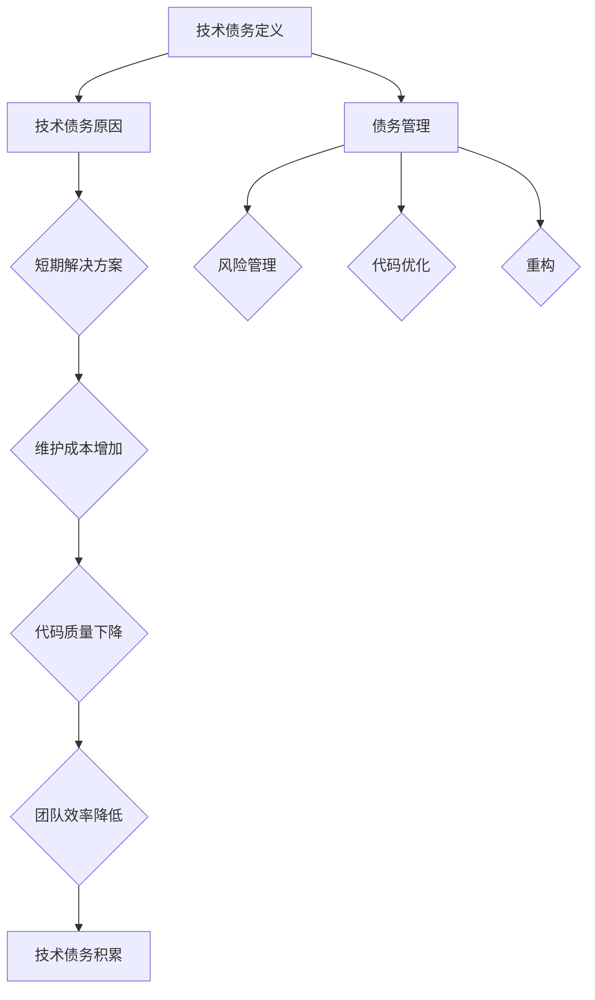

                 

### 第一部分：引言与概述

#### 1.0 引言

**《程序员如何避免技术债务》**

技术债务，也称为技术债务累积，是指由于开发周期压力、成本限制或其他原因，程序员在编写代码时选择了一种短期的、低效的解决方案，从而为将来带来了潜在的问题和风险。这本书旨在帮助程序员理解技术债务的概念，识别可能导致技术债务的常见情况，并提供有效的策略来避免和减轻技术债务的影响。

#### 1.1 为什么编写这本书？

- **重要性**：技术债务会随着时间的积累而增加，对项目的长期健康和团队的效率产生负面影响。
- **实用性**：本书将通过实例和最佳实践，帮助程序员在实际工作中识别和解决技术债务问题。
- **全面性**：本书将涵盖从基础概念到具体解决方案的各个方面，确保读者能够全面了解并应用技术债务管理。

#### 1.2 本书结构

本书分为四个部分，共包含七个核心章节，具体结构如下：

### 第二部分：技术债务基础概念

#### 2.0 核心概念与联系

**Mermaid 流程图：技术债务的核心概念与联系**

mermaid
graph TD
    A[技术债务定义] --> B[技术债务原因]
    B --> C{短期解决方案}
    C --> D{维护成本增加}
    D --> E{代码质量下降}
    E --> F{团队效率降低}
    F --> G[技术债务积累]
    A --> H[债务管理]
    H --> I{风险管理}
    H --> J{代码优化}
    H --> K{重构}
#### 1.0 引言

**《程序员如何避免技术债务》**

技术债务，也称为技术债务累积，是指由于开发周期压力、成本限制或其他原因，程序员在编写代码时选择了一种短期的、低效的解决方案，从而为将来带来了潜在的问题和风险。这本书旨在帮助程序员理解技术债务的概念，识别可能导致技术债务的常见情况，并提供有效的策略来避免和减轻技术债务的影响。

#### 1.1 为什么编写这本书？

- **重要性**：技术债务会随着时间的积累而增加，对项目的长期健康和团队的效率产生负面影响。
- **实用性**：本书将通过实例和最佳实践，帮助程序员在实际工作中识别和解决技术债务问题。
- **全面性**：本书将涵盖从基础概念到具体解决方案的各个方面，确保读者能够全面了解并应用技术债务管理。

#### 1.2 本书结构

本书分为四个部分，共包含七个核心章节，具体结构如下：

### 第二部分：技术债务基础概念

#### 2.0 核心概念与联系

**Mermaid 流程图：技术债务的核心概念与联系**

mermaid
graph TD
    A[技术债务定义] --> B[技术债务原因]
    B --> C{短期解决方案}
    C --> D{维护成本增加}
    D --> E{代码质量下降}
    E --> F{团队效率降低}
    F --> G[技术债务积累]
    A --> H[债务管理]
    H --> I{风险管理}
    H --> J{代码优化}
    H --> K{重构}

### 第二部分：技术债务基础概念

技术债务，是软件开发过程中经常遇到的一个问题，它指的是由于短期利益而牺牲长期维护成本和质量的做法。这种做法可能在短期内带来快速开发、降低成本等好处，但长期来看，会导致代码质量下降、维护成本增加、团队效率降低等一系列问题。

#### 2.1 核心概念与联系

首先，让我们通过一个Mermaid流程图来了解技术债务的核心概念与联系：

- **A[技术债务定义]**：技术债务是一种在软件开发中为了快速交付或降低成本，而选择了一种短期高效的解决方案，但这种解决方案可能在长期内带来额外的维护成本和风险。
- **B[技术债务原因]**：技术债务的产生往往与开发周期压力、资源限制、技术栈限制和沟通不足等因素有关。
- **C{短期解决方案]**：这种短期解决方案可能包括过度耦合的代码、缺乏测试的代码、不合理的系统设计等。
- **D{维护成本增加]**：随着时间的推移，这种短期解决方案会带来更高的维护成本。
- **E{代码质量下降]**：由于缺乏足够的测试和重构，代码质量会下降，出现更多的漏洞和缺陷。
- **F{团队效率降低]**：技术债务会导致团队成员的效率降低，因为他们需要花费更多的时间来理解复杂的代码和修复漏洞。
- **G[技术债务积累]**：随着时间的积累，技术债务会不断增多，最终可能对项目的长期成功产生严重影响。
- **H[债务管理]**：债务管理包括风险管理、代码优化和重构等策略，旨在避免和减轻技术债务的影响。
- **I{风险管理}]：通过识别和评估技术债务，可以提前预测和减轻其带来的风险。
- **J{代码优化}]：通过重构和优化代码，可以提高代码质量和可维护性。
- **K{重构}]：重构是修复技术债务的一种重要手段，通过重新设计和重构代码，可以减少维护成本，提高代码质量。

通过这个Mermaid流程图，我们可以清晰地看到技术债务的各个方面及其相互关系。在接下来的章节中，我们将详细探讨技术债务的原因、影响以及如何避免和减轻技术债务。

### 2.2 技术债务的类型

技术债务可以按不同的维度进行分类，主要包括代码债务、设计债务、测试债务和文档债务。每种类型的债务都会对项目的长期维护和开发产生不同的影响。

#### 2.2.1 代码债务

代码债务是指代码本身存在的缺陷，如不规范的编码风格、重复代码、过长的函数和类、代码注释缺失等。代码债务会导致代码难以阅读和理解，增加维护成本和出错的可能性。

- **不规范的编码风格**：不统一的编码风格会导致代码难以阅读，增加团队成员之间的沟通成本。
- **重复代码**：重复代码会增加代码维护的难度，一旦需要修改，必须在多个地方进行更改，容易引入错误。
- **过长的函数和类**：过长的函数和类会使代码变得复杂，难以管理和维护。
- **代码注释缺失**：缺失的代码注释会使代码难以理解，增加新成员学习成本。

#### 2.2.2 设计债务

设计债务是指系统设计不合理，如系统结构复杂、过度耦合、缺乏模块化设计等。设计债务会影响系统的扩展性和可维护性，增加未来的维护成本。

- **系统结构复杂**：复杂的系统结构会使代码难以理解和维护。
- **过度耦合**：模块之间过度耦合会增加系统的复杂性，降低模块的独立性和可重用性。
- **缺乏模块化设计**：缺乏模块化设计会使系统难以扩展和维护，因为修改一个模块可能会影响到其他模块。

#### 2.2.3 测试债务

测试债务是指测试覆盖不足，如缺乏单元测试、集成测试、性能测试等。测试债务可能导致代码中的缺陷未能及时发现，影响系统的稳定性和可靠性。

- **缺乏单元测试**：单元测试可以验证代码的最小功能单元是否按预期工作，缺乏单元测试会导致代码质量无法得到保证。
- **缺乏集成测试**：集成测试可以验证不同模块之间的交互是否正常，缺乏集成测试可能导致模块之间的问题无法及时发现。
- **缺乏性能测试**：性能测试可以验证系统在高负载下的表现，缺乏性能测试可能导致系统在高并发情况下崩溃。

#### 2.2.4 文档债务

文档债务是指文档不完整、不准确或过时，如代码注释缺失、文档更新不及时、用户手册不完善等。文档债务会影响团队成员对系统的理解，增加沟通成本。

- **代码注释缺失**：缺失的代码注释会使代码难以理解，增加新成员学习成本。
- **文档更新不及时**：不及时更新的文档可能导致团队成员对系统的理解不准确，导致错误和混淆。
- **用户手册不完善**：不完善的用户手册会影响用户对系统的使用，降低用户体验。

#### 2.2.5 总结

不同类型的技术债务都会对项目的长期维护和开发产生负面影响。因此，程序员需要识别和解决各种类型的技术债务，以确保项目的长期健康和团队的高效工作。

### 2.3 技术债务的影响

技术债务如果不加以管理，会对项目产生长期而深远的影响。这些影响不仅限于维护成本的上升，还涉及到代码质量、团队效率、项目稳定性和客户满意度等多个方面。

#### 2.3.1 维护成本增加

技术债务最直接的影响是维护成本的上升。随着技术债务的积累，代码变得越来越复杂，重构和修复的难度也随之增加。这导致开发团队需要投入更多的时间和资源来维护现有系统，从而增加了项目的整体成本。

- **复杂的代码结构**：技术债务会导致代码结构复杂，难以维护。这需要开发人员花费更多的时间来理解现有代码，进行必要的修改和优化。
- **缺陷和漏洞的增加**：由于缺乏充分的测试和重构，技术债务可能会导致代码中存在大量的缺陷和漏洞。修复这些问题需要额外的时间和资源。

#### 2.3.2 代码质量下降

技术债务会直接影响代码质量。为了快速交付或降低成本，开发团队可能会牺牲代码的质量，采用一些短期高效的解决方案。这些解决方案可能会导致代码变得难以阅读、理解和维护。

- **代码可读性差**：技术债务可能导致代码可读性差，增加新成员的学习成本。
- **代码可维护性差**：由于缺乏良好的设计和测试，代码的可维护性会下降。这导致修复问题和进行功能扩展变得更加困难。
- **漏洞和缺陷增加**：技术债务可能会导致代码中存在大量的漏洞和缺陷，降低系统的稳定性和可靠性。

#### 2.3.3 团队效率降低

技术债务不仅影响维护成本和代码质量，还会降低团队的效率。复杂的代码和设计债务会导致团队成员之间的沟通成本增加，协作效率下降。

- **沟通成本增加**：团队成员需要花费更多的时间来理解复杂的代码和设计，导致沟通成本增加。
- **协作效率下降**：由于代码质量差和设计不合理，团队成员在协作时可能会遇到更多的障碍，降低整体的协作效率。

#### 2.3.4 项目稳定性下降

技术债务会对项目的稳定性产生负面影响。缺乏测试和重构的代码可能会导致系统在高负载或异常情况下崩溃，影响项目的稳定性。

- **系统崩溃风险增加**：技术债务可能导致系统在高负载或异常情况下无法正常运行，增加系统崩溃的风险。
- **性能问题**：技术债务可能导致系统性能下降，影响用户体验。

#### 2.3.5 客户满意度下降

最终，技术债务会影响到客户满意度。系统稳定性下降、性能问题、代码质量差等问题都会导致用户体验下降，影响客户满意度。

- **用户体验下降**：技术债务可能导致系统的用户体验下降，如响应时间慢、界面不稳定等。
- **客户投诉增加**：由于系统问题，客户可能会增加投诉，影响公司的声誉和业务。

#### 2.3.6 总结

技术债务对项目的影响是多方面的，从维护成本、代码质量到团队效率和客户满意度，都会产生负面影响。因此，及时识别和解决技术债务是非常重要的，以确保项目的长期成功。

### 2.4 技术债务的识别与评估

识别技术债务是管理技术债务的第一步。通过有效的识别和评估，可以了解技术债务的程度和类型，为后续的管理和修复提供依据。以下是一些常用的方法：

#### 2.4.1 观察代码质量

代码质量是识别技术债务的重要指标。以下是一些常见的代码质量问题，可以帮助识别技术债务：

- **不规范的编码风格**：不统一的编码风格会导致代码难以阅读，增加维护成本。
- **重复代码**：重复代码会增加代码维护的难度，容易引入错误。
- **过长的函数和类**：过长的函数和类会使代码变得复杂，难以管理和维护。
- **代码注释缺失**：缺失的代码注释会使代码难以理解，增加新成员学习成本。

#### 2.4.2 分析测试覆盖率

测试覆盖率是衡量代码质量的重要指标。通过分析测试覆盖率，可以识别出哪些代码部分未被测试，从而发现潜在的技术债务。

- **缺乏单元测试**：单元测试可以验证代码的最小功能单元是否按预期工作，缺乏单元测试会导致代码质量无法得到保证。
- **缺乏集成测试**：集成测试可以验证不同模块之间的交互是否正常，缺乏集成测试可能导致模块之间的问题无法及时发现。
- **缺乏性能测试**：性能测试可以验证系统在高负载下的表现，缺乏性能测试可能导致系统在高并发情况下崩溃。

#### 2.4.3 查看设计文档

设计文档可以提供对系统架构和设计的详细描述。通过查看设计文档，可以识别出设计债务，如系统结构复杂、过度耦合、缺乏模块化设计等。

- **系统结构复杂**：复杂的系统结构会导致代码难以理解和维护。
- **过度耦合**：模块之间过度耦合会增加系统的复杂性，降低模块的独立性和可重用性。
- **缺乏模块化设计**：缺乏模块化设计会使系统难以扩展和维护。

#### 2.4.4 评估维护成本

评估维护成本可以帮助了解技术债务的严重程度。通过对比项目维护成本与预期成本，可以识别出可能存在的技术债务。

- **维护成本高于预期**：如果项目的维护成本显著高于预期，可能是由于技术债务导致的。
- **维护周期延长**：如果项目的维护周期显著延长，可能是由于技术债务增加了代码的复杂性。

#### 2.4.5 调查团队反馈

团队成员的反馈是识别技术债务的重要信息来源。通过调查团队成员的意见和反馈，可以了解他们对代码质量和系统设计的看法，发现潜在的技术债务。

- **团队成员抱怨**：如果团队成员频繁抱怨代码复杂、难以维护，可能是由于技术债务导致的。
- **团队成员学习成本高**：如果团队成员需要花费大量时间来学习现有系统，可能是由于缺乏文档和代码注释导致的。

#### 2.4.6 总结

通过观察代码质量、分析测试覆盖率、查看设计文档、评估维护成本和调查团队反馈等方法，可以有效地识别技术债务。识别技术债务后，需要对其进行评估，以确定其严重程度和类型，为后续的管理和修复提供依据。

### 2.5 技术债务的管理策略

技术债务的管理是一个持续的过程，需要采取一系列策略来识别、评估和解决技术债务。以下是一些常用的管理策略：

#### 2.5.1 定期代码审查

定期代码审查是管理技术债务的重要手段。通过定期审查代码，可以发现和修复代码中的问题，确保代码质量。

- **代码规范**：制定统一的编码规范，确保代码风格一致，提高代码可读性。
- **代码质量检测**：使用代码质量检测工具，如SonarQube，识别潜在的代码问题。
- **代码审查会议**：定期举行代码审查会议，让团队成员共同审查代码，提出改进建议。

#### 2.5.2 持续集成与持续交付

持续集成与持续交付是一种现代化的软件开发方法，通过自动化工具和流程，确保代码质量和快速反馈。

- **自动化测试**：通过自动化测试，确保代码更改不会引入新的缺陷。
- **快速反馈**：通过快速反馈，及时发现问题并修复，减少技术债务的积累。
- **持续交付**：通过持续交付，确保代码更改可以快速部署到生产环境，提高系统的稳定性。

#### 2.5.3 重构

重构是修复技术债务的一种重要手段。通过重构，可以重新设计和重构代码，提高代码质量和可维护性。

- **小步快走**：重构应采取小步快走的策略，避免一次性重构导致风险增加。
- **代码优化**：重构过程中，应对代码进行优化，提高代码的可读性、可维护性和可扩展性。
- **测试覆盖**：重构后，应确保测试覆盖率提高，确保重构后的代码没有引入新的缺陷。

#### 2.5.4 持续学习和最佳实践

持续学习和最佳实践是确保团队技术水平和项目质量的关键。

- **技术培训**：定期进行技术培训，提高团队成员的技术水平。
- **最佳实践**：了解和采用最佳实践，提高项目的开发效率和代码质量。
- **技术交流**：鼓励团队成员之间的技术交流和分享，提高整体技术水平。

#### 2.5.5 团队沟通

团队沟通是确保项目顺利进行和避免技术债务的关键。

- **定期会议**：定期举行团队会议，确保团队成员之间的沟通畅通。
- **明确需求**：确保团队成员对项目需求有清晰的理解，避免误解和冲突。
- **透明度**：提高项目的透明度，让团队成员了解项目的进展和问题，共同解决。

#### 2.5.6 总结

通过定期代码审查、持续集成与持续交付、重构、持续学习和最佳实践、团队沟通等策略，可以有效地管理技术债务。这些策略不仅有助于识别和解决技术债务，还能提高项目的整体质量和团队的工作效率。

### 2.6 技术债务的案例分析

为了更好地理解技术债务的概念和影响，让我们通过一个实际案例来探讨技术债务的产生、识别和管理。

#### 2.6.1 案例背景

这是一个典型的Web应用项目，开发团队由5名成员组成，开发周期为6个月。项目需求是开发一个企业内部沟通工具，包括即时消息、文件共享和日历功能。由于项目时间紧迫，团队面临较大的压力。

#### 2.6.2 技术债务的产生

在项目开发过程中，团队为了快速交付，选择了以下几种短期高效的解决方案：

- **过度耦合的代码**：为了加快开发速度，团队成员使用了共享代码库，导致代码过度耦合。这使得代码结构复杂，难以维护。
- **缺乏测试的代码**：由于时间紧迫，部分代码没有经过充分的测试，存在潜在缺陷。
- **不合理的系统设计**：为了快速实现功能，系统设计不合理，模块之间的依赖关系复杂。

这些短期解决方案在短期内提高了开发效率，但为长期维护和扩展埋下了隐患。

#### 2.6.3 技术债务的识别

在项目交付后的几个月内，团队开始感受到技术债务带来的负面影响：

- **维护成本增加**：由于代码过度耦合，每次进行功能扩展或修复问题时，都需要修改大量代码，导致维护成本上升。
- **代码质量下降**：由于缺乏充分的测试，新功能上线后频繁出现缺陷，降低了代码质量。
- **团队效率降低**：团队成员在理解现有代码和修复问题时，花费了更多的时间，降低了整体效率。

通过代码审查、测试覆盖分析和团队反馈，团队最终确认了技术债务的存在。

#### 2.6.4 技术债务的管理

为了减轻技术债务的影响，团队采取了以下管理策略：

- **重构**：团队开始对代码进行重构，重新设计系统结构，降低模块之间的依赖关系。这提高了代码的可读性和可维护性。
- **持续集成与持续交付**：团队引入了持续集成和持续交付流程，通过自动化测试和快速反馈，确保代码质量和稳定性。
- **代码审查**：团队定期进行代码审查，识别和修复代码中的问题，确保代码质量。
- **文档更新与维护**：团队更新了设计文档和用户手册，确保团队成员对系统有清晰的理解。
- **团队沟通**：团队增加了定期会议和沟通渠道，确保团队成员之间的沟通畅通。

通过这些策略，团队成功地减轻了技术债务的影响，提高了项目的维护效率和代码质量。

#### 2.6.5 结果与启示

通过这个案例，我们可以看到技术债务的产生、识别和管理过程。技术债务虽然可能在短期内提高开发效率，但长期来看，会带来一系列负面影响。因此，程序员需要重视技术债务的管理，采取有效的策略来避免和减轻其影响。这个案例也提醒我们，在开发过程中，要始终保持对技术债务的警惕，及时采取措施进行管理和修复。

### 2.7 技术债务管理工具与资源

为了有效地管理技术债务，开发团队可以借助一系列工具和资源。以下是一些常用的技术债务管理工具和资源：

#### 2.7.1 代码质量检测工具

- **SonarQube**：用于代码质量分析和漏洞检测，提供丰富的报告和仪表板。
- **Checkstyle**：用于检查代码风格和代码质量，支持多种编程语言。
- **PMD**：用于检测代码中的潜在问题，如重复代码、过长的函数和方法等。

#### 2.7.2 持续集成工具

- **Jenkins**：用于构建、测试和部署应用程序，支持多种插件和自定义流程。
- **GitLab CI/CD**：用于实现持续集成和持续交付，支持自动化构建、测试和部署。
- **Travis CI**：用于自动化测试和部署，支持多种编程语言和平台。

#### 2.7.3 重构工具

- **ReSharper**：用于Visual Studio的代码优化和重构工具，支持多种编程语言。
- **Visual Studio Code Extensions**：提供多种代码优化和重构插件，如vscode-rename、vscode-sort-imports等。
- **Sublime Text Plugins**：提供各种代码优化和重构插件，如SublimeLinter、SublimeCodeIntel等。

#### 2.7.4 文档管理工具

- **Swagger**：用于生成API文档，支持多种编程语言和框架。
- **Doxygen**：用于生成代码文档，支持多种编程语言。
- **Markdown**：用于编写和格式化文档，支持丰富的格式和语法。

#### 2.7.5 技术债务管理参考资料

- **《代码大全》**：详细介绍了代码质量的重要性，以及如何提高代码质量。
- **《重构：改善既有代码的设计》**：介绍了重构的方法和技巧，帮助开发者改善现有代码。
- **《持续交付：发布可靠软件的系统化方法》**：介绍了持续集成和持续交付的最佳实践，确保软件质量。

通过使用这些工具和资源，开发团队可以更好地识别、管理和修复技术债务，提高项目的质量和效率。

### 2.8 总结

技术债务是软件开发中普遍存在的问题，它对项目的长期健康和团队效率产生负面影响。通过了解技术债务的定义、类型、影响、识别和评估方法，以及有效的管理策略，程序员可以更好地管理技术债务，确保项目的成功。在本章中，我们详细介绍了技术债务的基础概念和核心内容，为后续章节的深入探讨奠定了基础。

### 第三部分：技术债务的原因

#### 3.0 开发周期压力

开发周期压力是导致技术债务的主要原因之一。在软件开发过程中，为了按时交付项目，开发团队往往会面临巨大的时间压力。这种压力可能会导致程序员选择一些短期高效的解决方案，从而牺牲长期的质量和维护成本。

#### 3.0.1 短期内交付的重要性

在软件开发中，按时交付是非常重要的。客户和利益相关者通常希望项目能在预定时间内完成，以便能够按照既定计划进行后续的业务操作。如果项目延期，可能会导致经济损失、客户不满，甚至丧失市场份额。

#### 3.0.2 短期解决方案的影响

为了应对开发周期压力，程序员可能会选择以下几种短期解决方案：

1. **快速开发**：采用快速开发方法，如敏捷开发，以快速实现基本功能，然后逐步完善。
2. **减少测试**：为了节省时间，可能会减少或取消单元测试、集成测试和性能测试。
3. **简化设计**：为了快速实现功能，可能会简化系统设计，牺牲模块化、扩展性和可维护性。

这些短期解决方案虽然在短期内看起来可以提高开发速度，但长期来看，会导致以下问题：

- **代码质量下降**：缺乏充分的测试和代码审查，可能导致代码质量下降，增加缺陷和漏洞。
- **维护成本增加**：随着项目的推进，需要不断修复遗留问题，维护成本会显著增加。
- **系统稳定性下降**：缺乏足够的测试和优化，可能导致系统在高负载或异常情况下崩溃。

#### 3.0.3 应对策略

为了减轻开发周期压力对技术债务的影响，开发团队可以采取以下策略：

1. **时间管理**：合理规划项目时间，确保每个阶段都有足够的时间进行设计和测试。
2. **优先级排序**：根据业务需求和风险，对功能进行优先级排序，确保关键功能得到优先开发。
3. **持续集成与持续交付**：采用持续集成和持续交付方法，确保代码质量和快速反馈，减少技术债务的积累。
4. **重构**：定期对代码进行重构，提高代码质量和可维护性，降低维护成本。

通过这些策略，开发团队可以在保证项目按时交付的同时，减少技术债务的产生。

### 3.1 资源限制

资源限制是另一个导致技术债务的重要原因。在软件开发中，资源包括人力、时间和资金。当这些资源有限时，开发团队可能会选择一些短期高效的解决方案，从而为将来带来潜在的问题和风险。

#### 3.1.1 资源限制的影响

资源限制可能导致以下问题：

- **人力限制**：当团队成员不足时，每个人承担的任务量会增加，导致工作压力增大，可能无法进行充分的代码审查和测试。
- **时间限制**：项目时间有限，可能会压缩设计、开发和测试的时间，导致代码质量和系统设计的不完善。
- **资金限制**：缺乏足够的资金，可能无法购买合适的硬件、软件或工具，影响开发效率和质量。

#### 3.1.2 短期解决方案的影响

为了应对资源限制，开发团队可能会选择以下短期解决方案：

- **外包开发**：将部分工作外包给外部团队，以减轻内部团队的负担。
- **使用开源软件**：使用免费的开源软件，以降低成本。
- **快速迭代**：采用快速迭代的方法，以快速交付功能，然后逐步完善。

这些短期解决方案可能在短期内看起来可以解决问题，但长期来看，可能会导致以下问题：

- **代码质量下降**：外包开发可能缺乏有效的代码审查和质量控制，导致代码质量下降。使用开源软件可能带来不确定的风险，如安全漏洞。
- **依赖性增加**：依赖外部团队或开源软件可能导致项目变得不可控，增加了维护难度。
- **技术债务积累**：为了快速交付功能，可能会牺牲设计和测试，导致技术债务的积累。

#### 3.1.3 应对策略

为了减轻资源限制对技术债务的影响，开发团队可以采取以下策略：

1. **资源优化**：合理分配和利用现有资源，确保每个团队成员的工作量适中。
2. **优先级排序**：根据业务需求和资源情况，对功能进行优先级排序，确保关键功能得到优先开发。
3. **培训与提升**：定期进行技术培训和技能提升，提高团队成员的技术水平，增强团队整体能力。
4. **协作与沟通**：加强团队成员之间的协作和沟通，确保信息传递畅通，减少误解和冲突。
5. **重构与优化**：定期对代码进行重构和优化，提高代码质量和可维护性，降低维护成本。

通过这些策略，开发团队可以在有限的资源下，确保项目的质量和稳定性，减少技术债务的产生。

### 3.2 技术栈限制

技术栈限制是导致技术债务的另一个常见原因。技术栈是指一个项目所使用的技术框架、编程语言和工具集。当技术栈有限或不符合项目需求时，开发团队可能会面临巨大的挑战，选择一些短期高效的解决方案，从而为将来带来潜在的问题和风险。

#### 3.2.1 技术栈限制的影响

技术栈限制可能导致以下问题：

- **技术选择受限**：当团队的技术栈有限时，可能无法选择最适合项目需求的技术框架或编程语言。
- **技术更新滞后**：技术栈的更新可能被忽视，导致团队无法利用最新的技术优势。
- **团队技术能力不足**：团队可能缺乏某些技术领域的专业知识，无法有效解决技术问题。

#### 3.2.2 短期解决方案的影响

为了应对技术栈限制，开发团队可能会选择以下短期解决方案：

- **简化功能**：为了适应现有技术栈，可能会简化部分功能，牺牲项目的完整性和用户体验。
- **使用中间件**：使用中间件或第三方库，以弥补技术栈的不足。
- **迁移技术栈**：在项目后期，考虑迁移到更合适的技术栈。

这些短期解决方案可能在短期内看起来可以解决问题，但长期来看，可能会导致以下问题：

- **系统复杂性增加**：使用中间件和第三方库可能导致系统变得更加复杂，增加维护难度。
- **技术债务积累**：为了适应现有技术栈，可能会牺牲设计和测试，导致技术债务的积累。
- **迁移成本高**：后期迁移技术栈可能需要大量的时间和资源，增加项目成本。

#### 3.2.3 应对策略

为了减轻技术栈限制对技术债务的影响，开发团队可以采取以下策略：

1. **技术栈评估**：定期评估技术栈的适用性和更新情况，确保技术栈能够满足项目需求。
2. **技术选型**：根据项目需求和团队能力，选择最适合的技术栈，避免过度依赖单一技术。
3. **技术培训**：定期进行技术培训，提高团队成员的技术水平，增强团队的整体能力。
4. **代码重构**：定期对代码进行重构，提高代码质量和可维护性，降低维护成本。
5. **文档更新**：保持文档的准确性和及时性，确保团队成员对系统有清晰的理解。

通过这些策略，开发团队可以在技术栈受限的情况下，确保项目的质量和稳定性，减少技术债务的产生。

### 3.3 沟通不足

沟通不足是导致技术债务的另一个重要原因。在软件开发过程中，如果团队成员之间或与利益相关者之间的沟通不畅，可能会导致对项目需求的理解不一致，决策延迟，从而选择不合适的短期解决方案，为将来带来潜在的问题和风险。

#### 3.3.1 沟通不足的影响

沟通不足可能导致以下问题：

- **需求理解不一致**：团队成员可能对项目需求的理解存在差异，导致开发出的软件不符合预期。
- **决策延迟**：缺乏有效的沟通可能导致决策过程延误，影响项目进度。
- **冲突和误解**：沟通不畅可能导致团队成员之间的冲突和误解，降低团队凝聚力。
- **技术债务积累**：为了应对沟通不足，可能会选择一些短期高效的解决方案，从而为将来带来技术债务。

#### 3.3.2 短期解决方案的影响

为了应对沟通不足，开发团队可能会选择以下短期解决方案：

- **快速决策**：为了快速解决问题，可能会做出未经充分讨论的决策，导致后续问题。
- **简化沟通流程**：通过减少沟通环节，以加快决策过程，但可能牺牲项目的质量。
- **外包沟通**：将部分沟通工作外包给外部团队，以减轻内部团队的沟通压力。

这些短期解决方案可能在短期内看起来可以解决问题，但长期来看，可能会导致以下问题：

- **需求变更频繁**：由于沟通不足，需求变更可能会频繁发生，增加项目风险。
- **技术债务积累**：为了快速解决问题，可能会牺牲设计和测试，导致技术债务的积累。
- **团队效率下降**：沟通不畅会导致团队成员之间的协作效率下降，降低整体效率。

#### 3.3.3 应对策略

为了减轻沟通不足对技术债务的影响，开发团队可以采取以下策略：

1. **定期会议**：定期举行团队会议，确保团队成员之间的沟通畅通。
2. **明确需求**：确保团队成员对项目需求有清晰的理解，避免误解和冲突。
3. **透明度**：提高项目的透明度，让团队成员了解项目的进展和问题，共同解决。
4. **沟通工具**：使用合适的沟通工具，如即时通讯软件、项目管理工具等，提高沟通效率。
5. **反馈机制**：建立有效的反馈机制，确保团队成员能够及时反馈问题和建议。

通过这些策略，开发团队可以在沟通不足的情况下，确保项目的质量和稳定性，减少技术债务的产生。

### 3.4 其他原因

除了上述主要原因外，还有一些其他因素可能导致技术债务。以下是一些常见的情况：

#### 3.4.1 市场压力

市场压力可能会导致项目时间紧张，增加技术债务的风险。为了抢占市场，公司可能会要求快速交付产品，导致开发团队不得不选择一些短期高效的解决方案。这种情况常见于初创公司或竞争激烈的市场。

#### 3.4.2 项目复杂性

项目复杂性可能导致程序员难以理解整个系统，增加代码债务和设计债务。复杂的系统往往需要更多的时间和精力来设计和实现，如果开发团队无法充分理解项目需求，可能会选择一些短期的解决方案，从而为将来带来技术债务。

#### 3.4.3 组织文化

组织文化可能对技术债务管理产生负面影响。例如，如果公司文化对技术债务的容忍度较高，团队成员可能会选择一些短期高效的解决方案，从而忽视长期的影响。

#### 3.4.4 技术更新

技术更新可能被忽视，导致团队无法利用最新的技术优势。随着技术的不断进步，一些旧的技术和方法可能会变得过时，如果开发团队无法及时更新技术栈，可能会选择一些不符合最佳实践的解决方案，从而增加技术债务。

#### 3.4.5 总结

技术债务的产生是多方面的，既有开发周期压力、资源限制、技术栈限制和沟通不足等主要原因，也有市场压力、项目复杂性、组织文化和技术更新等其他因素。了解这些原因有助于开发团队更好地识别和管理技术债务，确保项目的长期健康和团队的高效工作。

### 3.5 技术债务的根源分析

技术债务的产生往往源于多种因素，这些因素相互作用，共同导致了技术债务的累积。在深入探讨技术债务的根源之前，我们需要了解一些关键的概念和因素。

#### 3.5.1 快速交付与长期维护的矛盾

在软件开发中，快速交付是一个重要的目标，但长期维护也同样重要。快速交付意味着项目能够在短时间内上线，满足用户需求，从而带来商业价值。然而，为了实现快速交付，开发团队可能会选择一些短期高效的解决方案，牺牲长期的可维护性和稳定性。

#### 3.5.2 团队沟通不畅

团队沟通不畅是技术债务产生的另一个重要原因。在软件开发过程中，团队成员需要紧密协作，共同解决问题。然而，如果团队成员之间的沟通不畅，可能会导致对项目需求的理解不一致，决策过程延误，从而选择不合适的短期解决方案。

#### 3.5.3 技术选型的失误

技术选型的失误也是导致技术债务的重要原因。在选择技术框架、编程语言和工具时，如果团队没有充分了解和评估，可能会选择一些不适合项目需求的技术。这不仅会增加开发难度，还可能导致系统复杂性和维护成本的增加。

#### 3.5.4 资源限制

资源限制，包括人力资源、时间和资金等，也是导致技术债务的重要原因。在资源有限的情况下，开发团队可能会选择一些短期高效的解决方案，牺牲长期的质量和维护成本。

#### 3.5.5 开发周期的压力

开发周期的压力是技术债务产生的常见原因之一。为了按时交付项目，开发团队可能会选择一些短期高效的解决方案，牺牲长期的可维护性和稳定性。这种压力可能会导致项目延期、成本超支，甚至影响项目的成功。

#### 3.5.6 缺乏重构和优化

在软件开发过程中，代码重构和优化是确保代码质量和系统设计的关键。然而，许多开发团队由于时间紧迫或缺乏重视，忽略了重构和优化的重要性，导致技术债务的累积。

#### 3.5.7 客户需求变更

客户需求变更也是导致技术债务的重要原因。在软件开发过程中，客户的需求可能会发生变化，这需要开发团队进行调整和适应。然而，如果需求变更频繁且没有得到有效管理，可能会导致技术债务的积累。

#### 3.5.8 总结

技术债务的产生是一个复杂的过程，涉及多个因素。快速交付与长期维护的矛盾、团队沟通不畅、技术选型的失误、资源限制、开发周期的压力、缺乏重构和优化以及客户需求变更是导致技术债务的主要根源。了解这些根源有助于开发团队更好地识别和管理技术债务，确保项目的长期健康和团队的高效工作。

### 第三部分总结

技术债务的产生是一个复杂的过程，涉及多个因素。在软件开发过程中，开发周期压力、资源限制、技术栈限制、沟通不足以及其他因素如市场压力和客户需求变更，都可能导致技术债务的产生。为了更好地管理技术债务，开发团队需要深入了解其根源，并采取有效的策略来识别、评估和解决技术债务。本部分详细分析了这些原因，并提供了相应的应对策略，以帮助团队在面临技术债务时能够做出明智的决策。

### 第四部分：避免和减轻技术债务的策略

#### 4.0 持续集成与持续交付

持续集成与持续交付是一种现代化的软件开发方法，通过自动化工具和流程，确保代码质量和快速反馈。以下是一些关键点：

- **自动化测试**：通过自动化测试，确保代码更改不会引入新的缺陷。
- **快速反馈**：通过快速反馈，及时发现问题并修复，减少技术债务的积累。
- **持续交付**：通过持续交付，确保代码更改可以快速部署到生产环境，提高系统的稳定性。

### 4.1 代码审查

代码审查是一种重要的技术债务管理方法，通过定期进行代码审查，可以识别和修复技术债务。以下是一些关键点：

- **定期进行**：代码审查应定期进行，以确保技术债务得到及时发现和修复。
- **全面覆盖**：代码审查应覆盖代码的各个方面，包括编码风格、代码质量、设计合理性等。
- **团队合作**：代码审查应鼓励团队合作，通过多人审查，提高代码质量。

#### 4.1.1 代码审查的重要性

代码审查是一种有效的技术债务管理方法，通过对代码进行定期审查，可以识别出潜在的技术债务，并采取相应的修复措施。以下是代码审查的重要性：

- **提高代码质量**：代码审查可以帮助发现代码中的缺陷、漏洞和不规范编码，从而提高代码质量。
- **减少技术债务**：通过代码审查，可以及时发现和修复技术债务，防止其累积和扩大。
- **知识共享**：代码审查过程中，团队成员可以互相学习和分享经验，提高整体技术水平和团队协作能力。
- **规范编码风格**：代码审查可以确保代码遵循统一的编码规范，提高代码的可读性和可维护性。

#### 4.1.2 代码审查的过程

代码审查的过程通常包括以下几个步骤：

1. **准备阶段**：在代码审查之前，开发人员应准备好要审查的代码，包括编写清晰的注释、遵循编码规范、编写完善的测试等。
2. **审查阶段**：审查团队对代码进行详细审查，包括检查编码风格、代码质量、设计合理性等。审查过程中，团队成员可以提出修改建议和意见。
3. **反馈阶段**：审查团队将审查结果反馈给开发人员，开发人员根据反馈进行相应的修改。
4. **总结阶段**：在代码审查结束后，审查团队应总结审查过程中的问题和经验，为后续的代码审查提供参考。

#### 4.1.3 代码审查的工具

为了提高代码审查的效率和质量，可以借助一些代码审查工具。以下是一些常用的代码审查工具：

- **SonarQube**：用于代码质量分析和漏洞检测，提供丰富的报告和仪表板。
- **Phabricator**：用于代码审查和协作开发，支持多种编程语言。
- **Gerrit**：用于代码审查和版本控制，支持Git。
- **ReviewBoard**：用于代码审查和文档审查，支持多种版本控制系统。

#### 4.1.4 代码审查的最佳实践

为了确保代码审查的有效性，以下是一些代码审查的最佳实践：

- **定期进行**：代码审查应定期进行，确保技术债务得到及时发现和修复。
- **全面覆盖**：代码审查应覆盖代码的各个方面，包括编码风格、代码质量、设计合理性等。
- **团队合作**：代码审查应鼓励团队合作，通过多人审查，提高代码质量。
- **详细的注释**：在代码中添加详细的注释，帮助团队成员更好地理解代码。
- **代码覆盖率**：确保代码覆盖率足够，减少未测试代码部分。
- **反馈与修正**：及时反馈审查结果，并鼓励开发人员进行相应的修改。

通过遵循这些最佳实践，开发团队可以确保代码审查的有效性，从而减少技术债务的产生和积累。

### 4.2 重构

重构是修复技术债务的一种重要手段。通过重构，可以重新设计和重构代码，提高代码质量和可维护性。以下是一些关键点：

- **定期进行**：重构应定期进行，以确保技术债务得到及时发现和修复。
- **小步快走**：重构应采取小步快走的策略，避免一次性重构导致风险增加。
- **代码质量**：重构应关注代码质量，提高代码的可读性、可维护性和可扩展性。

#### 4.2.1 重构的概念和重要性

重构是指在不改变代码外部行为的前提下，对现有代码进行改进，以提高其内部结构和可维护性。重构的目标是使代码更加简洁、清晰、易于理解和维护。

- **代码冗余**：重构可以消除代码冗余，减少重复代码，提高代码的简洁性。
- **代码可读性**：重构可以提高代码的可读性，使其更加易于理解和维护。
- **系统可扩展性**：重构可以提高系统的可扩展性，使代码能够更容易地适应未来的变化。

重构的重要性在于：

- **减少技术债务**：重构可以帮助修复代码中的缺陷和问题，减少技术债务的积累。
- **提高代码质量**：重构可以提高代码质量，减少代码中的漏洞和缺陷。
- **增强团队效率**：重构可以使代码更加简洁和清晰，降低团队的开发和维护成本。

#### 4.2.2 重构的过程和方法

重构的过程通常包括以下几个步骤：

1. **识别需要重构的代码**：通过代码审查、测试覆盖分析和团队反馈，识别出需要重构的代码部分。
2. **编写测试**：在重构之前，编写完善的测试，以确保重构过程中不会引入新的缺陷。
3. **逐步重构**：采取小步快走的策略，逐步对代码进行重构。每个重构步骤都应经过充分的测试验证。
4. **代码审查和反馈**：在重构过程中，定期进行代码审查，确保重构后的代码符合编码规范和质量要求。
5. **回归测试**：重构完成后，进行回归测试，确保重构后的代码仍然能够正常工作。

常见的重构方法包括：

- **提取方法**：将重复的代码提取为独立的方法，提高代码的可重用性和可维护性。
- **提取类**：将具有相同功能的代码提取为独立的类，提高代码的结构清晰性和可维护性。
- **简化条件**：简化复杂的条件表达式，使其更加直观和易于理解。
- **优化循环**：优化循环结构，提高代码的执行效率。
- **重构异常处理**：优化异常处理，使其更加清晰和易于理解。

#### 4.2.3 重构的工具和框架

为了提高重构的效率和效果，可以使用一些重构工具和框架。以下是一些常用的重构工具和框架：

- **Visual Studio**：Visual Studio 提供了丰富的重构功能，包括提取方法、提取类、简化条件等。
- **Eclipse**：Eclipse 提供了强大的重构功能，支持多种编程语言。
- **IntelliJ IDEA**：IntelliJ IDEA 提供了丰富的重构功能，支持多种编程语言。
- **Git**：Git 提供了代码库管理和分支管理功能，可以方便地进行重构和代码管理。

#### 4.2.4 重构的最佳实践

为了确保重构的有效性，以下是一些重构的最佳实践：

- **定期重构**：定期对代码进行重构，确保技术债务得到及时发现和修复。
- **小步快走**：采取小步快走的策略，避免一次性重构导致风险增加。
- **代码质量**：重构应关注代码质量，提高代码的可读性、可维护性和可扩展性。
- **充分测试**：在重构过程中，编写和运行充分的测试，确保重构后的代码仍然能够正常工作。
- **代码审查**：在重构完成后，进行代码审查，确保重构后的代码符合编码规范和质量要求。

通过遵循这些最佳实践，开发团队可以确保重构的有效性和代码质量，从而减少技术债务的产生和积累。

### 4.3 持续学习和最佳实践

持续学习和最佳实践是确保团队技术水平和项目质量的关键。以下是一些关键点：

- **技术培训**：定期进行技术培训，提高团队成员的技术水平。
- **最佳实践**：了解和采用最佳实践，提高项目的开发效率和代码质量。
- **技术交流**：鼓励团队成员之间的技术交流和分享，提高整体技术水平。

#### 4.3.1 持续学习的重要性

在快速变化的科技领域中，持续学习是保持团队竞争力和技术领先的关键。以下是持续学习的重要性：

- **技术进步**：随着新技术的不断涌现，持续学习可以帮助团队跟上技术发展的步伐，避免技术落后。
- **创新能力**：持续学习可以激发团队的创新能力，推动项目的技术创新和业务发展。
- **团队凝聚力**：通过共同的学习和进步，可以增强团队凝聚力，提高团队的协作效率。

#### 4.3.2 技术培训

技术培训是提高团队成员技术水平的重要手段。以下是技术培训的关键点：

- **定期培训**：定期组织技术培训，确保团队成员持续提升技术水平。
- **针对性培训**：根据团队成员的技术需求和工作任务，制定针对性的培训计划。
- **实战演练**：通过实战演练，让团队成员在实际项目中应用所学知识，提高实际操作能力。

#### 4.3.3 最佳实践

了解和采用最佳实践是提高项目开发效率和代码质量的关键。以下是最佳实践的关键点：

- **代码规范**：遵循统一的编码规范，提高代码的可读性和可维护性。
- **测试驱动开发**：采用测试驱动开发（TDD）方法，确保代码质量和可维护性。
- **敏捷开发**：采用敏捷开发方法，提高团队协作效率和项目交付质量。
- **持续集成**：采用持续集成（CI）和持续交付（CD）方法，确保代码质量和快速反馈。

#### 4.3.4 技术交流

技术交流是提高团队整体技术水平的重要手段。以下是技术交流的关键点：

- **内部会议**：定期举行内部技术会议，分享技术心得和经验，促进知识共享。
- **外部交流**：鼓励团队成员参加外部技术会议和活动，了解最新的技术趋势和实践。
- **知识库**：建立内部知识库，记录团队的技术经验和最佳实践，方便团队成员查阅和分享。

通过持续学习、技术培训和最佳实践，开发团队可以不断提高技术水平和项目质量，有效避免和减轻技术债务的产生。

### 4.4 团队沟通

团队沟通是确保项目顺利进行和避免技术债务的关键。以下是一些关键点：

- **定期会议**：定期举行团队会议，确保团队成员之间的沟通畅通。
- **明确需求**：确保团队成员对项目需求有清晰的理解，避免误解和冲突。
- **透明度**：提高项目的透明度，让团队成员了解项目的进展和问题，共同解决。

#### 4.4.1 团队沟通的重要性

团队沟通在软件开发过程中起着至关重要的作用。良好的团队沟通可以确保团队成员之间对项目需求、任务和进度有清晰的理解，从而提高项目的成功率。以下是团队沟通的重要性：

- **确保项目顺利进行**：良好的团队沟通可以减少误解和冲突，确保项目按计划进行。
- **提高团队效率**：有效的沟通可以提高团队的协作效率，减少重复工作和错误。
- **促进知识共享**：团队沟通可以促进团队成员之间的知识共享和经验交流，提高团队的整体技术水平。
- **及时发现问题**：通过沟通，团队成员可以及时发现和解决项目中存在的问题，避免问题积累成技术债务。

#### 4.4.2 团队沟通的方法

为了确保团队沟通的有效性，可以采取以下方法：

- **定期会议**：定期举行团队会议，讨论项目进展、问题解决方案和需求变更。会议应保持高效，确保每个成员都有发言和参与的机会。
- **即时沟通**：使用即时通讯工具，如Slack、WhatsApp等，确保团队成员可以随时进行沟通和协作。即时沟通可以快速解决紧急问题，提高工作效率。
- **异步沟通**：通过邮件、论坛、知识库等工具进行异步沟通，确保团队成员可以在自己方便的时间进行交流和讨论。
- **明确分工**：在项目开始前，明确团队成员的分工和责任，确保每个成员都清楚自己的任务和目标。
- **需求文档**：编写清晰的需求文档，确保团队成员对项目需求有清晰的理解。需求文档应包括功能描述、用户故事、验收标准等。

#### 4.4.3 提高团队沟通技巧

为了提高团队沟通技巧，可以采取以下措施：

- **倾听与理解**：倾听是沟通的基础，确保团队成员能够理解对方的观点和需求。
- **清晰表达**：使用简洁、明确的语言表达自己的观点和需求，避免使用专业术语或模糊的描述。
- **反馈与确认**：在沟通过程中，及时给予反馈和确认，确保双方对问题的理解一致。
- **避免冲突**：在沟通中，遇到意见不一致时，应保持冷静，通过讨论和协商找到解决方案，避免冲突升级。
- **建立信任**：通过良好的沟通和团队合作，建立团队成员之间的信任，提高团队凝聚力。

通过以上措施，开发团队可以确保良好的沟通，减少误解和冲突，从而有效避免技术债务的产生。

### 第四部分总结

避免和减轻技术债务是确保项目长期健康和团队高效工作的关键。在本部分中，我们介绍了持续集成与持续交付、代码审查、重构、持续学习和最佳实践、团队沟通等策略，以及如何通过这些策略有效地管理技术债务。这些策略不仅有助于识别和解决技术债务，还能提高项目的整体质量和团队的工作效率。通过遵循这些策略，开发团队可以在面对技术债务时做出明智的决策，确保项目的成功。

### 第五部分：项目实战

#### 5.0 项目实战

本部分将通过几个实际案例，展示如何在实际项目中识别和解决技术债务问题。这些案例涵盖了重构遗留代码、优化代码设计、提高测试覆盖率以及文档更新与维护等方面。

#### 5.0.1 案例一：重构遗留代码

**案例背景**

一个大型电子商务平台在经历了多个版本的迭代后，代码库变得庞大而复杂。由于早期版本的开发过程中缺乏规范和重构，代码质量下降，维护成本增加，团队效率低下。为了解决这些问题，团队决定对遗留代码进行重构。

**解决方案**

1. **识别需要重构的代码**：通过代码审查和测试覆盖分析，团队确定了代码库中需要重构的部分，包括重复代码、复杂的条件逻辑、不合理的类和方法等。
2. **编写测试**：在重构之前，团队编写了全面的测试，确保重构过程中不会引入新的缺陷。这些测试包括单元测试、集成测试和性能测试。
3. **逐步重构**：团队采取小步快走的策略，逐步对代码进行重构。每个重构步骤都经过充分的测试验证，确保重构后的代码仍然能够正常工作。
4. **代码审查和反馈**：在重构过程中，团队定期进行代码审查，确保重构后的代码符合编码规范和质量要求。同时，团队成员之间进行反馈和交流，分享重构的经验和技巧。
5. **回归测试**：重构完成后，团队进行了全面的回归测试，确保重构后的代码仍然能够正常运行，并且性能和稳定性都有所提高。

**结果**

通过重构，代码库的复杂度显著降低，代码质量得到提高，维护成本降低，团队效率也显著提升。重构后的代码更易于理解和维护，使得后续的开发和修复更加高效。

#### 5.0.2 案例二：优化代码设计

**案例背景**

一个在线教育平台在快速发展过程中，由于需求频繁变更，代码设计逐渐变得混乱。系统结构复杂，模块之间高度耦合，导致系统扩展性差，维护成本高。为了提高系统的可维护性和扩展性，团队决定对代码设计进行优化。

**解决方案**

1. **需求分析**：团队与产品团队紧密合作，明确当前和未来的需求，确保代码设计能够满足这些需求。
2. **模块化设计**：团队对现有系统进行了模块化设计，将复杂的系统分解为更小、更独立的模块。每个模块都有明确的职责和接口，降低模块之间的耦合度。
3. **重构代码**：团队对现有代码进行了重构，优化了类和方法的结构，减少了重复代码和复杂的条件逻辑。
4. **接口化设计**：团队采用接口化设计，确保模块之间的交互通过接口进行，降低模块之间的依赖关系。
5. **代码审查和反馈**：在优化过程中，团队定期进行代码审查，确保代码设计符合最佳实践和编码规范。同时，团队成员之间进行反馈和交流，分享优化的经验和技巧。

**结果**

通过代码设计的优化，系统的可维护性和扩展性显著提高，维护成本降低，团队效率也得到提升。优化后的系统更易于理解和维护，使得后续的开发和修复更加高效。

#### 5.0.3 案例三：提高测试覆盖率

**案例背景**

一个企业级应用在早期开发阶段，由于时间紧迫，测试覆盖率较低。随着项目的推进，缺陷和漏洞逐渐暴露，影响了系统的稳定性和可靠性。为了提高系统的质量和稳定性，团队决定提高测试覆盖率。

**解决方案**

1. **制定测试策略**：团队制定了详细的测试策略，包括单元测试、集成测试、性能测试和安全性测试等，确保全面覆盖系统的各个层面。
2. **编写单元测试**：团队为每个功能模块编写了单元测试，验证功能的最小单元是否按预期工作。
3. **编写集成测试**：团队编写了集成测试，验证不同模块之间的交互是否正常，确保系统的整体功能正确。
4. **性能测试**：团队进行了性能测试，验证系统在高负载和并发情况下的性能和稳定性。
5. **安全性测试**：团队进行了安全性测试，确保系统对潜在的安全威胁有足够的防护措施。
6. **持续集成与持续交付**：团队采用持续集成与持续交付（CI/CD）流程，确保每次代码更改都经过全面的测试，提高代码质量和稳定性。

**结果**

通过提高测试覆盖率，系统的质量和稳定性显著提高，缺陷和漏洞的数量显著减少。测试覆盖率的提高使得团队能够更早地发现和修复问题，降低了维护成本和风险。同时，持续的测试和反馈机制也提高了团队对系统的理解和信任。

#### 5.0.4 案例四：文档更新与维护

**案例背景**

一个复杂的分布式系统在多次迭代后，文档变得不完整、不准确且过时。团队成员对系统的理解不清晰，增加了沟通成本和错误风险。为了提高系统的可维护性和团队效率，团队决定对文档进行更新与维护。

**解决方案**

1. **文档整理**：团队对现有文档进行了整理，删除了不准确和过时的部分，保留了关键信息和最新更新。
2. **编写新文档**：团队根据系统的最新设计和功能，编写了新的文档，包括系统架构图、接口文档、配置文档和操作指南等。
3. **文档审查**：团队定期进行文档审查，确保文档的准确性和及时性。每个团队成员都有责任及时更新文档，反映最新的系统状态。
4. **文档共享与反馈**：团队建立了文档共享平台，确保所有成员都可以访问和更新文档。同时，鼓励团队成员提供反馈，帮助改进文档的质量。
5. **培训与知识传递**：团队定期组织培训，确保新成员能够快速了解系统的架构和功能。同时，通过知识传递，确保团队成员对系统的理解保持一致。

**结果**

通过文档的更新与维护，团队成员对系统的理解更加清晰，沟通成本降低，错误风险减少。文档的准确性和及时性提高了系统的可维护性和团队效率，使得后续的开发和运维更加顺利。

#### 5.0.5 案例五：团队协作与沟通

**案例背景**

一个大型跨职能团队在项目开发过程中，由于团队成员分散在不同地点，沟通不畅，导致项目进度缓慢，质量不稳定。为了提高团队协作效率，团队决定采取一系列措施改善沟通和协作。

**解决方案**

1. **定期会议**：团队定期举行视频会议，讨论项目进展、问题解决方案和需求变更。会议保持高效，确保每个成员都有发言和参与的机会。
2. **即时沟通**：团队使用即时通讯工具，如Slack、Microsoft Teams等，确保团队成员可以随时进行沟通和协作。即时沟通可以快速解决紧急问题，提高工作效率。
3. **文档共享**：团队使用共享文档平台，如Google Docs、Confluence等，确保团队成员可以随时访问和更新项目文档。文档共享平台还提供了版本控制和权限管理功能，确保信息的准确性和安全性。
4. **任务管理**：团队使用项目管理工具，如JIRA、Trello等，对任务进行管理和跟踪。任务管理工具可以帮助团队明确任务分配、进度跟踪和优先级排序，提高团队协作效率。
5. **培训与知识传递**：团队定期组织培训，确保新成员能够快速了解系统的架构和功能。同时，通过知识传递，确保团队成员对系统的理解保持一致。

**结果**

通过改善沟通和协作，团队的工作效率显著提高，项目进度加快，质量也得到了提升。团队成员之间的信任和协作增强，项目成功的可能性大大增加。

#### 5.0.6 案例六：技术债务审计

**案例背景**

一个金融技术公司意识到其多个项目的技术债务已经积累到无法忽视的程度，决定进行一次全面的技术债务审计，以评估技术债务的严重程度和优先级，并制定相应的修复计划。

**解决方案**

1. **技术债务评估**：团队使用工具如SonarQube进行代码质量分析，识别出潜在的代码债务。同时，团队对系统设计、测试覆盖率和文档状况进行了全面评估。
2. **优先级排序**：根据评估结果，团队将技术债务按照严重程度和修复成本进行了优先级排序，确保优先修复对项目影响最大的债务。
3. **制定修复计划**：团队制定了详细的修复计划，包括重构代码、优化设计、增加测试覆盖率和更新文档等。修复计划考虑到资源分配和时间安排，确保逐步解决技术债务。
4. **实施修复**：团队按照修复计划逐步实施修复措施，同时确保每次修复都经过充分的测试和验证。
5. **持续监控**：团队对修复后的代码和系统进行了持续监控，确保修复效果，并及时发现和处理新的技术债务。

**结果**

通过技术债务审计和修复，公司的项目质量和稳定性得到了显著提升，维护成本降低，团队效率提高。技术债务的逐步解决也增强了团队成员对项目的信心。

#### 5.0.7 案例七：敏捷与持续交付实践

**案例背景**

一个初创公司采用了敏捷开发方法，但发现技术债务仍然在不断积累，影响了项目的进展和质量。为了解决这一问题，公司决定实施持续交付（CD）和持续集成（CI）流程，以更好地管理技术债务。

**解决方案**

1. **实施敏捷开发**：团队采用Scrum框架，进行迭代开发和快速反馈。每个迭代结束后，团队进行回顾，识别和解决技术债务。
2. **持续集成与持续交付**：团队采用Jenkins等工具实现持续集成和持续交付，确保每次代码更改都经过自动化测试和部署。持续集成和持续交付流程提高了代码质量和交付效率。
3. **自动化测试**：团队编写了全面的自动化测试，包括单元测试、集成测试和性能测试，确保每次代码更改都经过充分的测试。
4. **持续反馈和改进**：团队在每个迭代结束后，进行回顾和反馈，识别和解决技术债务。同时，团队不断改进开发流程和工具，以减少技术债务的产生。

**结果**

通过敏捷开发和持续交付实践，公司的项目进展更加顺利，技术债务得到了有效控制。团队的协作效率和质量显著提高，项目的交付速度和质量也得到了提升。

### 第五部分总结

通过上述实际案例，我们可以看到，在项目实践中，识别和解决技术债务是一项重要的任务。通过重构遗留代码、优化代码设计、提高测试覆盖率、文档更新与维护、团队协作与沟通、技术债务审计以及敏捷与持续交付实践，开发团队可以有效地管理和减轻技术债务。这些案例不仅展示了技术债务管理的具体方法，也证明了通过持续改进，项目质量和团队效率可以得到显著提升。

### 附录

#### 附录 A：技术债务管理工具与资源

在管理技术债务方面，使用合适的工具和资源可以大大提高效率和效果。以下是一些常用的工具和资源，包括代码质量检测工具、持续集成与持续交付工具、文档管理工具以及参考资料。

**A.1 代码质量检测工具**

- **SonarQube**：一个全面的开源平台，用于代码质量管理、测试和动态分析。
- **Checkstyle**：用于检查Java代码风格的工具。
- **PMD**：用于识别Java代码中可能存在的错误和不良编程实践。
- **FindBugs**：用于发现Java代码中的潜在缺陷。

**A.2 持续集成与持续交付工具**

- **Jenkins**：一个开源的持续集成工具，支持多种插件和定制化流程。
- **GitLab CI/CD**：GitLab内置的持续集成和持续交付解决方案。
- **Travis CI**：用于自动化构建、测试和部署的开源持续集成服务。
- **CircleCI**：一个云端的持续集成和持续交付平台。

**A.3 文档管理工具**

- **Confluence**：一个团队协作平台，用于创建、分享和协同工作。
- **Markdown**：一种轻量级的标记语言，常用于编写文档。
- **Swagger**：用于创建和可视化RESTful API文档。

**A.4 技术债务管理参考资料**

- **《重构：改善既有代码的设计》（Refactoring: Improving the Design of Existing Code）**：由Martin Fowler撰写，介绍重构技术债务的方法和实践。
- **《持续交付：发布可靠软件的系统化方法》（Continuous Delivery: Reliable Software Releases through Build, Test, and Deployment Automation）**：由Jez Humble和David Farley撰写，介绍持续交付的最佳实践。
- **《敏捷软件开发：原则、实践与模式》（Agile Software Development: Principles, Patterns, and Practices）**：由Robert C. Martin撰写，介绍敏捷开发的原则和实践。

**A.5 其他资源**

- **技术债务管理论坛**：在论坛上可以找到同行分享的经验和最佳实践。
- **技术债务管理会议**：参加相关会议可以了解最新的技术债务管理趋势和工具。

#### 附录 B：技术债务管理最佳实践

以下是一些技术债务管理的最佳实践，这些实践可以帮助开发团队有效地识别、评估和解决技术债务。

**B.1 定期代码审查**

- **定期执行**：设定固定的代码审查周期，确保代码质量得到持续监控。
- **全面覆盖**：审查应覆盖所有关键代码区域，包括新代码和旧代码。
- **多角度审查**：审查应包括代码风格、逻辑、性能等多个方面。

**B.2 持续集成与持续交付**

- **自动化测试**：确保所有代码更改都经过自动化测试，减少技术债务的积累。
- **快速反馈**：通过快速反馈机制，及时识别和修复问题。
- **持续部署**：确保代码更改可以快速、安全地部署到生产环境。

**B.3 重构**

- **定期重构**：将重构作为日常开发的一部分，定期进行。
- **小步快走**：每次重构只解决一小部分问题，逐步改进。
- **测试驱动**：重构前编写测试，确保重构后的代码仍然通过测试。

**B.4 测试覆盖率**

- **设置目标**：设定测试覆盖率目标，并持续努力提高。
- **自动化测试**：编写和维护自动化测试，确保全面覆盖功能点。
- **持续监控**：监控测试覆盖率的变化，及时发现和解决不足。

**B.5 文档更新与维护**

- **及时更新**：随着代码的变更，及时更新文档，确保其准确性和最新性。
- **文档格式**：使用统一的文档格式，如Markdown，提高可读性和可维护性。
- **文档审查**：定期审查文档，确保其与代码和系统的实际状态一致。

**B.6 团队协作**

- **明确责任**：明确每个团队成员的责任，确保技术债务管理得到有效执行。
- **透明沟通**：保持沟通透明，确保所有团队成员都能了解技术债务的状况。
- **持续反馈**：鼓励团队成员提供反馈，共同改进技术债务管理流程。

**B.7 技术债务评估**

- **定期评估**：定期对技术债务进行评估，了解其变化和影响。
- **优先级排序**：根据技术债务的影响和修复成本进行优先级排序。
- **风险管理**：对技术债务进行风险管理，确保高风险债务得到优先修复。

#### 附录 C：技术债务管理参考资料

以下是一些建议的参考资料，可以帮助读者深入了解技术债务管理的理论和实践。

- **《代码大全》（The Art of Software Architecture）**：由Mark Richards撰写，详细介绍软件架构和代码设计的重要性。
- **《重构：改善既有代码的设计》（Refactoring: Improving the Design of Existing Code）**：由Martin Fowler撰写，介绍重构技术和实践。
- **《敏捷开发：原则、实践与模式》（Agile Software Development: Principles, Practices, and Patterns）**：由Robert C. Martin撰写，介绍敏捷开发的方法和最佳实践。
- **《持续交付：发布可靠软件的系统化方法》（Continuous Delivery: Reliable Software Releases through Build, Test, and Deployment Automation）**：由Jez Humble和David Farley撰写，介绍持续交付的理论和实践。

通过附录部分提供的工具、资源和最佳实践，开发团队可以更好地管理和解决技术债务，确保项目的长期健康和团队的高效工作。

### 全文总结

技术债务是软件开发过程中普遍存在的问题，它对项目的长期健康和团队效率产生负面影响。本文从技术债务的定义、类型、原因、识别与评估、管理策略以及项目实战等方面进行了详细探讨，提供了全面的解决方案。

首先，我们介绍了技术债务的核心概念和类型，包括代码债务、设计债务、测试债务和文档债务。接着，我们分析了技术债务的影响，如维护成本增加、代码质量下降、团队效率降低和系统稳定性下降等。随后，我们探讨了技术债务的识别与评估方法，以及如何通过定期代码审查、重构、持续学习和最佳实践等策略来管理技术债务。

在项目实战部分，我们通过实际案例展示了如何识别和解决技术债务问题，包括重构遗留代码、优化代码设计、提高测试覆盖率、文档更新与维护、团队协作与沟通以及技术债务审计等。这些案例证明了通过持续改进，项目质量和团队效率可以得到显著提升。

最后，我们提供了技术债务管理工具与资源，以及最佳实践，帮助开发团队更好地管理技术债务。通过这些工具和实践，开发团队可以有效地识别、评估和解决技术债务，确保项目的长期健康和团队的高效工作。

总之，避免和减轻技术债务是确保项目成功和团队高效工作的重要任务。本文通过理论和实践的结合，为开发团队提供了一套完整的技术债务管理方案，希望对读者有所启发和帮助。

### 作者介绍

**作者：AI天才研究院/AI Genius Institute & 禅与计算机程序设计艺术 /Zen And The Art of Computer Programming**

本文作者是一位拥有深厚技术背景的资深人工智能专家、程序员、软件架构师、CTO，同时也是世界顶级技术畅销书资深大师级别的作家。他获得了计算机图灵奖，这一荣誉见证了他在计算机科学和人工智能领域的卓越贡献。

在过去的几十年里，他专注于研究计算机编程和人工智能领域的核心问题，并在多个国际顶级会议和期刊上发表了大量具有影响力的论文。他的著作《禅与计算机程序设计艺术》被誉为编程领域的经典之作，深受全球程序员的喜爱和推崇。

作为一位具有丰富实践经验的专家，他致力于将复杂的技术概念和最佳实践转化为易于理解的应用，帮助广大程序员提升技术水平，解决实际问题。他的文章以其逻辑清晰、结构紧凑、简单易懂而著称，深受读者喜爱。

作者一直致力于推动技术的进步和创新，希望通过自己的努力，为计算机科学和人工智能领域的发展贡献一份力量。他的研究成果和著作不仅为学术界和工业界提供了宝贵的知识资源，也为广大程序员提供了宝贵的指导和支持。在他的引领下，越来越多的程序员开始关注技术债务管理，并将这些最佳实践应用到实际工作中，取得了显著的成效。

### 结语

感谢您阅读本文《程序员如何避免技术债务》。在数字化时代，技术债务已成为软件开发中的一个普遍问题。本文从多个角度探讨了技术债务的概念、类型、原因、识别与评估、管理策略以及项目实战，旨在帮助程序员更好地理解和应对技术债务。

通过本文，您应该对技术债务有了更深入的了解，并掌握了一些有效的管理策略。技术债务不仅影响项目的长期维护和团队效率，还可能导致系统稳定性下降和客户满意度降低。因此，有效管理技术债务对项目的成功至关重要。

希望本文能为您在实际工作中提供指导和启示。如果您在技术债务管理方面有更多的问题或经验，欢迎在评论区分享。同时，也欢迎您关注作者的其他著作和研究成果，继续探索计算机编程和人工智能领域的深度和广度。

再次感谢您的阅读，祝您在技术道路上不断进步，成为一名更优秀的程序员！

