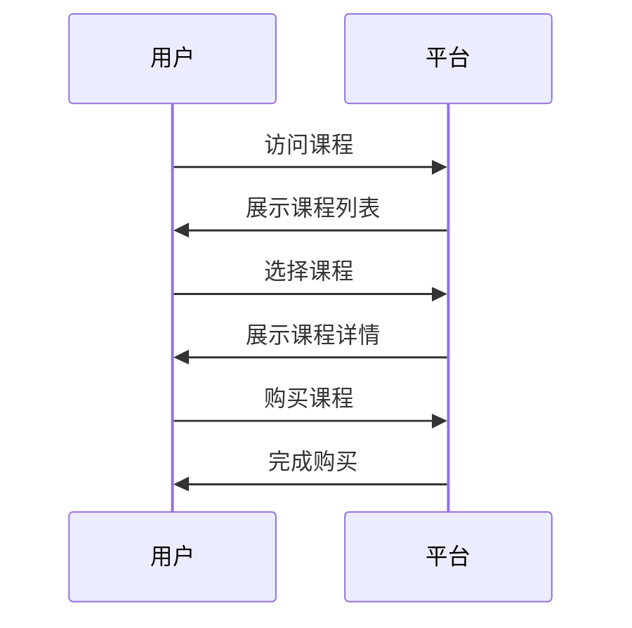
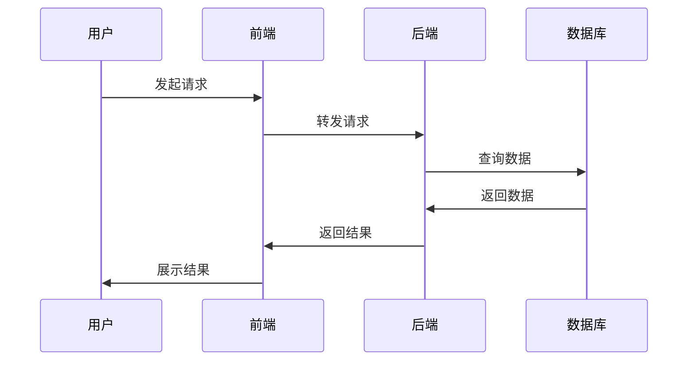

                 

### 第1章 绪论

#### 1.1 程序员知识付费的背景与意义

##### 1.1.1 程序员知识付费的兴起

程序员知识付费是近年来随着互联网和信息技术的快速发展而产生的一个新兴领域。在早期，程序员的知识获取主要是通过传统教育体系、书籍、论坛等途径，这些途径虽然提供了丰富的知识资源，但往往存在信息滞后、知识分散、无法个性化等问题。随着知识经济的兴起和互联网的普及，程序员们开始寻求更加高效、个性化的知识获取方式，知识付费平台应运而生。

知识付费平台通过提供专业的课程、实战项目、技术问答等服务，满足了程序员们对于高质量、专业化知识的迫切需求。这些平台不仅提供了丰富的学习资源，还通过用户评价、推荐算法等技术手段，帮助程序员们更快速、精准地获取所需知识。

##### 1.1.2 程序员知识付费对个人与行业的影响

对程序员个人而言，知识付费平台极大地提高了他们的学习效率。通过付费平台，程序员可以接触到业界知名专家的实战经验和最新技术动态，有助于提升自身的技术水平和职业竞争力。此外，知识付费平台还为程序员提供了交流互动的机会，使得他们可以与同行交流心得、解决问题，共同进步。

对整个行业而言，程序员知识付费平台的兴起推动了技术交流与创新，加速了行业的发展。一方面，知识付费平台为程序员提供了丰富的学习资源，提高了整体的技术水平；另一方面，通过平台积累的大量数据，可以为行业趋势分析、技术研发提供有力支持。

#### 1.2 知识付费平台的现状分析

##### 1.2.1 国内外主要知识付费平台介绍

国内知识付费平台如慕课网、极客时间、网易云课堂等，以课程内容和实战项目为主要特点，吸引了大量程序员用户。国外知识付费平台如Udemy、Coursera、edX等，则以课程多样性和全球资源整合优势著称。

##### 1.2.2 知识付费平台的发展趋势与挑战

知识付费平台的发展趋势包括：内容多样化、个性化推荐、社区互动、平台生态建设等。同时，知识付费平台也面临着内容质量、用户隐私、商业模式等挑战。

1. **内容多样化**：知识付费平台正逐渐从单一的技术课程向更广泛的知识领域拓展，包括编程语言、开发框架、设计模式、项目管理等。

2. **个性化推荐**：通过大数据和人工智能技术，知识付费平台不断优化推荐算法，提高用户满意度。

3. **社区互动**：知识付费平台逐渐重视用户间的互动，通过论坛、问答等功能，增强用户粘性。

4. **平台生态建设**：知识付费平台正在构建包括内容创作、分发、变现在内的完整生态体系。

然而，知识付费平台也面临着一些挑战：

1. **内容质量**：如何保证平台上的内容质量，防止低质内容泛滥，是知识付费平台需要解决的问题。

2. **用户隐私**：在用户数据收集和使用过程中，如何保护用户隐私，防止数据泄露，是知识付费平台需要重视的问题。

3. **商业模式**：知识付费平台需要不断探索和优化商业模式，以实现可持续发展。

#### 1.3 本书结构安排与学习目标

本书将从以下几个方面展开：

1. **核心概念与联系**：介绍知识付费平台的核心概念和基本架构，以及程序员的知识需求与供给。
2. **核心算法原理讲解**：详细讲解用户行为分析算法、推荐系统算法和安全与风控算法的原理和实现。
3. **数学模型与公式详解**：介绍用户行为分析与推荐系统的数学模型，以及数据挖掘与机器学习的数学公式。
4. **项目实战**：通过实际案例，展示知识付费平台的搭建流程、用户行为分析实践、推荐系统开发实践和安全与风控实践。
5. **平台选择与对比分析**：分析知识付费平台的选择策略、运营优化和案例分析。
6. **总结与展望**：总结知识付费平台的发展趋势和挑战，展望未来的研究方向。

通过本书的学习，读者可以：

1. **掌握知识付费平台的核心概念和架构**。
2. **理解核心算法原理，并能够应用于实际场景**。
3. **了解数学模型和公式在知识付费平台中的应用**。
4. **具备搭建知识付费平台的能力**。
5. **能够进行平台选择与对比分析，优化平台运营**。

---

**关键词**：程序员知识付费、知识付费平台、推荐系统、用户行为分析、安全与风控、项目实战、平台选择与对比。

**摘要**：本文全面介绍了程序员知识付费的背景与意义，分析了知识付费平台的现状和发展趋势，详细讲解了核心算法原理、数学模型与公式，并通过实际案例展示了项目实战的方法。最后，对知识付费平台的选择与对比进行分析，提出了未来的研究方向。本文旨在帮助程序员更好地利用知识付费平台提升自身技术水平和职业竞争力。 ### 第2章 核心概念与联系

#### 2.1 程序员知识付费平台的核心概念

##### 2.1.1 知识付费平台的定义与特点

知识付费平台是指为用户提供专业化、高质量知识内容，并通过支付一定费用获取知识服务的在线平台。与传统的知识获取方式相比，知识付费平台具有以下特点：

1. **专业性**：知识付费平台上的内容通常由行业专家、学者、实战派等专业人士提供，保证了知识的权威性和实用性。
2. **个性化**：知识付费平台通过大数据和人工智能技术，对用户行为进行分析，提供个性化的知识推荐，满足用户的个性化学习需求。
3. **便捷性**：用户可以通过互联网随时随地访问知识付费平台，学习资源丰富，方便快捷。
4. **互动性**：知识付费平台通常设有论坛、问答等功能，用户可以在平台上进行交流、讨论，解决学习中的问题。

##### 2.1.2 程序员知识需求与供给

程序员作为知识付费平台的主要用户群体，其知识需求具有以下特点：

1. **技术性**：程序员需要学习最新的编程语言、开发框架、设计模式等专业知识，以满足不断变化的技术需求。
2. **实战性**：程序员不仅需要理论知识，还需要通过实际项目来提升自己的实战能力。
3. **持续更新**：技术领域发展迅速，程序员需要不断更新知识，以保持自己的竞争力。

知识供给方面，知识付费平台需要具备以下能力：

1. **内容创作**：平台需要吸引行业专家和实战派进行内容创作，保证知识内容的权威性和实用性。
2. **内容更新**：平台需要及时更新知识内容，以跟上技术发展的步伐。
3. **数据分析**：平台需要通过数据分析，了解用户需求，优化内容推荐，提高用户满意度。

#### 2.2 知识付费平台的架构与功能

##### 2.2.1 平台架构设计

知识付费平台的架构设计通常包括以下几个层次：

1. **前端展示层**：负责用户界面的展示，提供课程列表、课程详情、学习进度等功能。
2. **业务逻辑层**：负责处理用户请求，包括用户注册、登录、课程购买、学习记录等业务逻辑。
3. **数据存储层**：负责存储用户数据、课程数据、交易数据等，通常采用数据库管理系统（DBMS）。
4. **数据访问层**：负责对数据存储层的操作，包括数据的查询、更新、删除等。
5. **后台服务层**：负责平台的日常运营，包括内容管理、用户管理、课程管理、推荐系统、风控系统等。

##### 2.2.2 主要功能模块介绍

知识付费平台的主要功能模块包括：

1. **用户管理模块**：负责用户的注册、登录、信息维护等功能。
2. **课程管理模块**：负责课程的上架、下架、分类、推荐等功能。
3. **学习管理模块**：负责用户的学习记录、学习进度、课程评价等功能。
4. **交易管理模块**：负责课程的购买、支付、退款等交易流程。
5. **推荐系统模块**：负责根据用户行为和课程内容，为用户推荐合适的课程。
6. **风控系统模块**：负责监测用户行为，识别异常行为，防范风险。

#### 2.3 知识付费平台的商业模式

##### 2.3.1 付费模式分析

知识付费平台的付费模式主要包括以下几种：

1. **订阅制**：用户按月或按年支付订阅费用，享受平台上的所有课程。
2. **课程制**：用户购买单个课程，学习完成后可获得证书。
3. **VIP制**：用户支付一定费用，成为VIP用户，享受更多特权服务，如免费试听、专属课程等。
4. **广告制**：平台通过展示广告来获取收益，用户免费学习，但需观看广告。

##### 2.3.2 产业链生态概述

知识付费平台的产业链生态包括以下几个环节：

1. **内容创作者**：包括行业专家、学者、实战派等，他们提供专业化的知识内容。
2. **平台运营方**：负责平台的搭建、运营、推广等，通过提供优质的服务来吸引用户。
3. **用户**：包括编程爱好者、程序员、企业员工等，他们是知识付费平台的最终消费者。
4. **广告商**：通过在平台上投放广告来推广产品或服务。
5. **第三方服务提供商**：包括支付服务、数据服务、云服务等，为平台提供技术支持。

#### 2.4 知识付费平台的竞争力分析

##### 2.4.1 内容质量

内容质量是知识付费平台的核心竞争力。平台需要吸引和培养一批优秀的创作者，提供高质量、实用的课程内容，以满足用户的需求。

##### 2.4.2 技术能力

技术能力是知识付费平台的另一个核心竞争力。平台需要具备先进的技术手段，如大数据分析、人工智能、云计算等，以提高内容推荐的准确性，优化用户体验。

##### 2.4.3 用户体验

用户体验是知识付费平台的重要竞争力。平台需要不断优化界面设计、功能模块、学习流程等，以提高用户的满意度。

##### 2.4.4 品牌影响力

品牌影响力是知识付费平台在市场竞争中的关键因素。平台需要通过广告宣传、活动策划、合作联盟等方式，提升品牌知名度和美誉度。

---

**关键词**：知识付费平台、程序员、专业知识、个性化推荐、商业模式、产业链生态、内容质量、技术能力、用户体验、品牌影响力。

**摘要**：本章介绍了程序员知识付费平台的核心概念、架构与功能、商业模式以及竞争力分析。通过本章的学习，读者可以了解知识付费平台的基本运作模式，掌握平台的核心竞争力，为后续内容的学习打下坚实基础。 ### 2.1 程序员知识付费平台的核心概念

知识付费平台是一个在线服务系统，旨在为程序员和其他专业人士提供高质量的技术知识和资源。在这个平台上，程序员可以付费购买课程、书籍、实战项目和其他学习资料，以满足他们的学习需求。以下是程序员知识付费平台的核心概念及其联系：

#### 2.1.1 知识付费平台的定义与特点

**定义**：知识付费平台是一种在线服务模式，用户通过支付费用来获取平台上的专业知识和资源。

**特点**：

1. **专业性**：平台上的内容通常由行业专家、资深程序员和知名技术团队提供，保证了知识的专业性和权威性。
2. **灵活性**：用户可以随时随地通过互联网访问平台，学习时间自由安排。
3. **互动性**：平台通常提供论坛、问答等功能，方便用户之间进行交流和互动。
4. **个性化**：平台通过用户行为分析，为用户推荐适合他们的学习内容，提高学习效率。

#### 2.1.2 程序员知识需求与供给

**需求**：程序员的知识需求主要包括以下几个方面：

1. **基础知识**：编程语言、数据结构、算法等基础理论知识。
2. **技术更新**：随着技术的快速发展，程序员需要不断学习新的编程语言、框架和工具。
3. **实战经验**：程序员需要通过实际项目来提升自己的实战能力，解决实际问题。

**供给**：知识付费平台的供给包括：

1. **课程内容**：包括视频教程、文档资料、实战项目等。
2. **专家指导**：行业专家和资深程序员提供的一对一辅导、问答服务。
3. **社区互动**：用户可以通过论坛、问答、讨论区等与同行互动，分享经验。

#### 2.1.3 平台架构与功能模块

**架构**：

知识付费平台的架构通常包括前端展示层、业务逻辑层、数据存储层和后台服务层。以下是一个简化的架构图：



**功能模块**：

1. **用户管理模块**：包括用户注册、登录、个人信息维护等功能。
2. **课程管理模块**：包括课程上架、分类、推荐、评价等功能。
3. **学习管理模块**：包括学习进度、学习记录、课程评价等功能。
4. **交易管理模块**：包括课程购买、支付、退款等功能。
5. **推荐系统模块**：根据用户行为和兴趣，为用户推荐合适的课程。
6. **风控系统模块**：监控用户行为，防范风险，保障平台安全。

#### 2.1.4 商业模式

**订阅制**：用户按月或按年支付订阅费用，享受平台上的所有课程。

**课程制**：用户购买单个课程，学习完成后获得证书。

**VIP制**：用户支付一定费用，成为VIP用户，享受更多特权服务。

**广告制**：平台通过展示广告来获取收益，用户免费学习，但需观看广告。

#### 2.1.5 知识付费平台的竞争力

**内容质量**：平台的核心竞争力之一。提供高质量的课程内容和资源，吸引用户。

**技术能力**：平台的另一大竞争力。通过大数据、人工智能等技术，提高推荐系统的准确性，优化用户体验。

**用户体验**：良好的用户体验能够提高用户粘性，增强用户忠诚度。

**品牌影响力**：品牌知名度和美誉度是平台在市场竞争中的关键因素。

---

**关键词**：知识付费平台、程序员、专业知识、个性化推荐、平台架构、商业模式、竞争力分析。

**摘要**：本章详细介绍了程序员知识付费平台的核心概念，包括定义、特点、架构、商业模式以及竞争力分析。通过本章的学习，读者可以全面了解知识付费平台的基本运作模式，为后续内容的学习打下基础。 ### 第3章 核心算法原理讲解

本章将深入探讨程序员知识付费平台中应用的核心算法原理，主要包括用户行为分析算法、推荐系统算法和安全与风控算法。这些算法对于提升用户体验、优化内容推荐和保障平台安全至关重要。

#### 3.1 用户行为分析算法

用户行为分析算法是知识付费平台的重要组成部分，通过对用户行为数据的分析和挖掘，可以深入了解用户的学习习惯、兴趣点和需求，从而为个性化推荐和用户管理提供依据。

##### 3.1.1 用户画像构建

用户画像构建是用户行为分析的基础。用户画像是指通过对用户的基本信息、学习历史、互动行为等多维度数据进行综合分析，形成的一个用户模型。

**步骤**：

1. **数据收集**：收集用户的基本信息（如年龄、性别、职业等），学习历史（如已购课程、学习时长等），以及互动行为（如评论、问答、论坛发帖等）。
2. **数据预处理**：清洗数据，去除噪声，进行数据转换，如数值归一化、缺失值填充等。
3. **特征提取**：从原始数据中提取有助于描述用户行为的特征，如学习频率、学习时长、参与互动的频率等。
4. **模型训练**：使用机器学习算法（如决策树、随机森林、K-均值聚类等）训练用户画像模型。

**伪代码示例**：

```python
# 数据收集
data = collect_user_data()

# 数据预处理
clean_data = preprocess_data(data)

# 特征提取
features = extract_features(clean_data)

# 模型训练
model = train_user_model(features)
```

##### 3.1.2 用户兴趣挖掘

用户兴趣挖掘旨在发现用户的潜在兴趣点，从而为个性化推荐提供支持。

**步骤**：

1. **兴趣点识别**：通过分析用户的学习历史、互动行为和评价，识别用户可能感兴趣的主题和知识点。
2. **兴趣强度评估**：对每个兴趣点进行强度评估，通常使用协同过滤算法或内容推荐算法进行评分。
3. **兴趣建模**：使用机器学习算法（如矩阵分解、主题模型等）建立用户兴趣模型。

**伪代码示例**：

```python
# 兴趣点识别
interests = identify_interest_points(user_behavior)

# 兴趣强度评估
interest_strength = evaluate_interest_strength(interests)

# 兴趣建模
interest_model = build_interest_model(interest_strength)
```

##### 3.1.3 用户行为预测

用户行为预测可以用于预测用户下一步行为，如购买课程、参与互动等，从而为营销策略提供支持。

**步骤**：

1. **行为序列构建**：构建用户的历史行为序列，如学习行为、购买行为、互动行为等。
2. **行为特征提取**：从行为序列中提取特征，如行为发生的时间、行为的频率、行为的时长等。
3. **模型训练**：使用时间序列模型（如LSTM、GRU等）进行训练。

**伪代码示例**：

```python
# 行为序列构建
behavior_sequence = construct_behavior_sequence(user_history)

# 行为特征提取
behavior_features = extract_behavior_features(behavior_sequence)

# 模型训练
model = train_behavior_model(behavior_features)
```

#### 3.2 推荐系统算法

推荐系统算法是知识付费平台的核心功能之一，通过对用户行为数据和内容特征进行协同过滤和内容推荐，为用户推荐合适的课程和资源。

##### 3.2.1 协同过滤算法

协同过滤算法是一种基于用户行为数据推荐的算法，通过计算用户之间的相似度，为用户推荐他们可能感兴趣的课程。

**协同过滤算法**：

1. **用户基于的协同过滤（User-Based Collaborative Filtering）**：通过计算用户之间的相似度，为用户推荐与他们相似的用户喜欢的课程。
2. **物品基于的协同过滤（Item-Based Collaborative Filtering）**：通过计算课程之间的相似度，为用户推荐与他们已购买的课程相似的课程。

**伪代码示例**：

```python
# 用户基于的协同过滤
similarity_matrix = compute_similarity_matrix(user_ratings)

recommended_courses = recommend_courses(user, similarity_matrix)

# 物品基于的协同过滤
item_similarity_matrix = compute_similarity_matrix(course_ratings)

recommended_courses = recommend_courses(user, item_similarity_matrix)
```

##### 3.2.2 内容推荐算法

内容推荐算法是基于课程的内容特征，为用户推荐他们可能感兴趣的课程。

**内容推荐算法**：

1. **基于关键词的推荐**：通过分析课程的关键词和标签，为用户推荐相关课程。
2. **基于内容的相似度推荐**：通过计算课程内容之间的相似度，为用户推荐相似内容的课程。

**伪代码示例**：

```python
# 基于关键词的推荐
keywords = extract_keywords(course_content)

recommended_courses = recommend_courses_by_keywords(user_interests, keywords)

# 基于内容的相似度推荐
content_similarity_matrix = compute_content_similarity_matrix(course_contents)

recommended_courses = recommend_courses_by_content_similarity(user_course, content_similarity_matrix)
```

##### 3.2.3 混合推荐系统

混合推荐系统结合了协同过滤算法和内容推荐算法的优点，为用户推荐更加准确的课程。

**混合推荐系统**：

1. **加权协同过滤**：将协同过滤算法和内容推荐算法的推荐结果进行加权，提高推荐的准确性。
2. **矩阵分解**：使用矩阵分解技术，如Singular Value Decomposition（SVD），同时考虑用户行为和课程特征，提高推荐效果。

**伪代码示例**：

```python
# 加权协同过滤
协同过滤推荐 = collaborative_filter(user, course)
内容推荐 = content_based_recommendation(user, course)
混合推荐 = weight_recommendation(协同过滤推荐, 内容推荐)

# 矩阵分解
R = user_behavior_matrix
U, Σ, V = svd(R)
recommended_courses = reconstruct_courses(U, Σ, V)
```

#### 3.3 交易安全与风控算法

交易安全与风控算法是保障知识付费平台交易安全的重要手段，通过监测和分析用户行为，识别异常行为，防范风险。

##### 3.3.1 交易风险识别

交易风险识别旨在识别潜在的欺诈行为、恶意交易等风险。

**步骤**：

1. **行为特征提取**：从交易数据中提取行为特征，如交易时间、交易金额、交易频率等。
2. **风险模型训练**：使用机器学习算法（如逻辑回归、决策树等）训练风险识别模型。
3. **风险评分**：对每个交易进行风险评分，超过一定阈值则判定为高风险交易。

**伪代码示例**：

```python
# 行为特征提取
transaction_features = extract_transaction_features(transaction_data)

# 风险模型训练
risk_model = train_risk_model(transaction_features)

# 风险评分
risk_score = risk_model.predict(transaction_features)
if risk_score > threshold:
    mark_transaction_as_high_risk(transaction)
```

##### 3.3.2 用户信用评估

用户信用评估旨在评估用户的诚信程度，为交易决策提供依据。

**步骤**：

1. **行为特征提取**：从用户行为数据中提取特征，如学习记录、互动行为、交易历史等。
2. **信用评分模型训练**：使用机器学习算法（如线性回归、支持向量机等）训练信用评分模型。
3. **信用评分**：对用户进行信用评分，超过一定阈值则判定为高信用用户。

**伪代码示例**：

```python
# 行为特征提取
user_features = extract_user_features(user_data)

# 信用评分模型训练
credit_model = train_credit_model(user_features)

# 信用评分
credit_score = credit_model.predict(user_features)
if credit_score > threshold:
    mark_user_as_high_credit(user)
```

##### 3.3.3 风险控制策略

风险控制策略包括实时监控、预警和应对措施，以降低风险损失。

**策略**：

1. **实时监控**：对用户行为和交易数据进行实时监控，识别异常行为。
2. **预警系统**：建立预警系统，对高风险交易和用户进行预警。
3. **应对措施**：对高风险交易和用户采取限制措施，如账户冻结、交易延迟等。

**伪代码示例**：

```python
# 实时监控
while True:
    monitor_user_behavior(user)
    if detect_abnormal_behavior(user):
        trigger_alert(user)

# 预警系统
def trigger_alert(user):
    send_alert_to_admin(user)
    apply_safety_measures(user)

# 应对措施
def apply_safety_measures(user):
    freeze_account(user)
    delay_transaction(user)
```

---

**关键词**：用户行为分析、推荐系统、协同过滤、内容推荐、混合推荐系统、交易安全、风控算法、风险识别、用户信用评估。

**摘要**：本章详细介绍了程序员知识付费平台中应用的核心算法原理，包括用户行为分析算法、推荐系统算法和安全与风控算法。通过这些算法，平台能够更好地分析用户需求、优化推荐结果、保障交易安全，从而提升用户体验和平台竞争力。 ### 3.2 推荐系统算法

推荐系统是知识付费平台的核心功能之一，旨在根据用户的行为和兴趣，为用户推荐他们可能感兴趣的课程、文章或其他资源。推荐系统的实现通常分为协同过滤、内容推荐和混合推荐系统三种类型。

#### 3.2.1 协同过滤算法

协同过滤算法（Collaborative Filtering）是一种基于用户相似度或物品相似度的推荐算法，主要通过分析用户之间的行为模式或物品之间的属性关系来推荐。

**用户基于的协同过滤（User-Based Collaborative Filtering）**：

- **步骤**：
  1. 计算用户之间的相似度：通过计算用户对某一系列物品的评分，得出用户之间的相似度。
  2. 找到相似用户：对于目标用户，找到相似度最高的用户群体。
  3. 推荐相似用户喜欢的物品：根据相似用户群体的行为，推荐他们喜欢的、目标用户还未评分的物品。

- **伪代码示例**：

  ```python
  # 用户基于的协同过滤
  def user_based_collaborative_filter(target_user, user_similarity_matrix, rated_items):
      similar_users = find_similar_users(target_user, user_similarity_matrix)
      recommended_items = []
      for user in similar_users:
          for item in rated_items:
              if not target_user.rated(item) and user.rated(item):
                  recommended_items.append(item)
      return recommended_items
  ```

**物品基于的协同过滤（Item-Based Collaborative Filtering）**：

- **步骤**：
  1. 计算物品之间的相似度：通过计算用户对物品的评分，得出物品之间的相似度。
  2. 找到相似物品：对于目标物品，找到相似度最高的物品群体。
  3. 推荐相似物品喜欢的用户：根据相似物品群体的用户，推荐目标用户还未评分的物品。

- **伪代码示例**：

  ```python
  # 物品基于的协同过滤
  def item_based_collaborative_filter(target_item, item_similarity_matrix, users):
      similar_items = find_similar_items(target_item, item_similarity_matrix)
      recommended_users = []
      for item in similar_items:
          for user in users:
              if not target_item.rated_by(user) and item.rated_by(user):
                  recommended_users.append(user)
      return recommended_users
  ```

#### 3.2.2 内容推荐算法

内容推荐算法（Content-Based Filtering）是一种基于物品属性的推荐算法，主要通过分析物品的内容属性来推荐。

- **步骤**：
  1. 提取物品特征：从物品的内容中提取特征，如标签、关键词、分类等。
  2. 计算用户兴趣：根据用户的浏览历史或评分记录，计算用户的兴趣特征。
  3. 找到相似物品：根据用户的兴趣特征，找到与用户兴趣相似的物品。
  4. 推荐相似物品：向用户推荐他们可能感兴趣的物品。

- **伪代码示例**：

  ```python
  # 内容推荐算法
  def content_based_recommendation(user_interests, item_features, items):
      recommended_items = []
      for item in items:
          similarity = compute_similarity(user_interests, item_features[item])
          if similarity > threshold:
              recommended_items.append(item)
      return recommended_items
  ```

#### 3.2.3 混合推荐系统

混合推荐系统（Hybrid Recommender System）是结合协同过滤算法和内容推荐算法优点的推荐系统。

- **步骤**：
  1. 获取协同过滤推荐结果：使用协同过滤算法获取推荐结果。
  2. 获取内容推荐结果：使用内容推荐算法获取推荐结果。
  3. 综合两种推荐结果：对协同过滤和内容推荐的结果进行加权融合，生成最终的推荐列表。

- **伪代码示例**：

  ```python
  # 混合推荐系统
  def hybrid_recommender_system(target_user, user_similarity_matrix, item_similarity_matrix, rated_items, user_interests, items):
      collaborative_recommendations = user_based_collaborative_filter(target_user, user_similarity_matrix, rated_items)
      content_recommendations = content_based_recommendation(user_interests, item_similarity_matrix, items)
      combined_recommendations = combine_recommendations(collaborative_recommendations, content_recommendations)
      return combined_recommendations
  ```

#### 3.2.4 深度学习推荐算法

随着深度学习技术的发展，深度学习推荐算法逐渐成为推荐系统的研究热点。深度学习推荐算法通过构建深度神经网络模型，能够自动学习用户和物品的复杂特征，提高推荐效果。

- **步骤**：
  1. 构建深度学习模型：使用卷积神经网络（CNN）、循环神经网络（RNN）或变换器（Transformer）等深度学习模型。
  2. 训练模型：使用用户行为数据和物品特征数据训练深度学习模型。
  3. 推荐预测：使用训练好的模型预测用户对物品的评分或兴趣。

- **伪代码示例**：

  ```python
  # 深度学习推荐算法
  def deep_learning_recommender(user_data, item_data, model):
      model.fit(user_data, item_data)
      user_embedding = model.predict(user_data)
      item_embedding = model.predict(item_data)
      predicted_ratings = calculate_similarity(user_embedding, item_embedding)
      return predicted_ratings
  ```

---

**关键词**：推荐系统、协同过滤、内容推荐、混合推荐系统、深度学习推荐算法。

**摘要**：本章详细介绍了推荐系统的三种主要类型：协同过滤、内容推荐和混合推荐系统，以及深度学习推荐算法。通过这些算法，知识付费平台能够为用户提供高质量的推荐结果，提高用户满意度和平台竞争力。 ### 3.3 交易安全与风控算法

交易安全与风控算法是知识付费平台的重要组成部分，旨在保障交易的安全性和平台的稳定运行。通过实时监测用户行为和交易数据，识别潜在风险，并采取相应的预防措施，可以有效降低欺诈行为和恶意操作的风险。

#### 3.3.1 交易风险识别

交易风险识别是风控系统的第一步，主要通过分析交易数据和行为模式，识别潜在的风险。

**步骤**：

1. **数据收集**：收集用户的交易记录、浏览历史、学习行为等数据。
2. **特征提取**：从原始数据中提取有助于风险识别的特征，如交易频率、交易金额、用户行为模式等。
3. **建立风险模型**：使用机器学习算法（如逻辑回归、随机森林等）训练风险识别模型，根据特征预测交易的风险等级。
4. **风险评分**：对每笔交易进行风险评分，超过设定阈值则判定为高风险交易。

**伪代码示例**：

```python
# 数据收集
transaction_data = collect_transaction_data()

# 特征提取
transaction_features = extract_transaction_features(transaction_data)

# 建立风险模型
risk_model = train_risk_model(transaction_features)

# 风险评分
risk_scores = risk_model.predict(transaction_features)
```

#### 3.3.2 用户信用评估

用户信用评估是风控系统的另一个重要方面，通过评估用户的诚信程度和还款能力，为交易决策提供依据。

**步骤**：

1. **数据收集**：收集用户的基本信息、交易记录、学习行为等数据。
2. **特征提取**：提取有助于信用评估的特征，如交易频率、交易金额、学习时长、互动行为等。
3. **建立信用模型**：使用机器学习算法（如线性回归、支持向量机等）训练信用评估模型，预测用户的信用等级。
4. **信用评分**：对用户进行信用评分，超过设定阈值则判定为高信用用户。

**伪代码示例**：

```python
# 数据收集
user_data = collect_user_data()

# 特征提取
user_features = extract_user_features(user_data)

# 建立信用模型
credit_model = train_credit_model(user_features)

# 信用评分
credit_scores = credit_model.predict(user_features)
```

#### 3.3.3 风险控制策略

风险控制策略包括实时监控、预警和应对措施，以降低风险损失。

**实时监控**：

- **步骤**：
  1. 定期收集用户行为和交易数据。
  2. 使用风控模型对用户行为和交易进行实时评估。
  3. 当检测到异常行为或高风险交易时，触发预警。

**预警系统**：

- **步骤**：
  1. 收集异常行为和风险交易的预警信号。
  2. 通过短信、邮件等方式通知平台管理员。
  3. 对高风险交易进行审核或限制。

**应对措施**：

- **步骤**：
  1. 对高风险交易进行延迟处理或冻结。
  2. 对恶意用户进行限制访问或永久封号。
  3. 定期更新和优化风险控制模型，提高风险识别的准确性。

**伪代码示例**：

```python
# 实时监控
def real_time_monitoring(user, transaction):
    risk_score = risk_model.predict(transaction)
    if risk_score > threshold:
        trigger_alert(user, transaction)

# 预警系统
def trigger_alert(user, transaction):
    send_alert_to_admin(user, transaction)

# 应对措施
def apply_safety_measures(user, transaction):
    if is_high_risk_transaction(transaction):
        delay_transaction(transaction)
    if is_malicious_user(user):
        ban_user(user)
```

#### 3.3.4 安全与风控算法在实际中的应用

在实际应用中，安全与风控算法通常结合多种技术手段，以提高风险识别和防范的准确性。

1. **行为分析与模式识别**：通过分析用户行为模式，如登录地点、使用设备、操作习惯等，识别潜在的风险。
2. **欺诈检测系统**：使用机器学习算法构建欺诈检测模型，对交易进行实时监控和风险评估。
3. **反洗钱（AML）系统**：结合法律法规，对用户的交易行为进行监控，防范洗钱行为。
4. **用户画像与风险评估**：通过构建用户画像，结合历史数据和模型预测，对用户进行信用评估和风险评级。

**案例分析**：

1. **案例一**：某知识付费平台通过行为分析和模式识别，成功识别并防范了一批恶意用户，有效降低了平台的损失。
2. **案例二**：某平台通过反洗钱系统，发现并阻止了一次大规模洗钱行为，保障了平台的合规运行。

---

**关键词**：交易安全、风控算法、风险识别、用户信用评估、风险控制策略、行为分析、模式识别、欺诈检测、反洗钱系统。

**摘要**：本章详细介绍了交易安全与风控算法的核心概念和实现步骤，包括交易风险识别、用户信用评估和风险控制策略。通过实际案例展示，读者可以了解安全与风控算法在知识付费平台中的应用，提高对交易安全的认识。 ### 4.1 用户行为分析与推荐系统的数学模型

用户行为分析和推荐系统是知识付费平台的核心技术，其算法设计和性能优化离不开数学模型的支撑。本节将介绍用户行为分析与推荐系统中常用的数学模型，包括用户行为概率模型和推荐系统评分模型。

#### 4.1.1 用户行为概率模型

用户行为概率模型主要用于预测用户对某一物品的行为概率，如购买、点击、评价等。这类模型可以帮助知识付费平台了解用户的行为倾向，为个性化推荐和用户行为预测提供依据。

1. **Bernoulli模型**：

   Bernoulli模型是一种简单的事件概率模型，通常用于描述用户是否会对某一物品进行某种行为。模型假设用户对物品的行为服从伯努利分布。

   **数学模型**：

   \( P(B = 1|X) = \pi \)

   其中，\( B \) 表示用户是否对物品进行行为（1表示是，0表示否），\( X \) 表示影响用户行为的因素，\( \pi \) 表示行为概率。

   **示例**：

   假设用户对某一课程的购买行为服从伯努lli模型，根据用户的历史行为，预测其购买该课程的概率为0.8。

2. **Multinomial模型**：

   当用户行为不是二分类时，可以使用Multinomial模型来描述。例如，用户在购物网站上的购买行为可能是购买多个商品中的一个。

   **数学模型**：

   \( P(B = b|X) = \frac{\pi_b e^{-\sum_{i=1}^{n} \pi_i}}{\sum_{j=1}^{n} \pi_j e^{-\pi_j}} \)

   其中，\( B \) 表示用户的行为集合，\( b \) 表示用户的具体行为，\( \pi_i \) 表示行为\( i \)的概率，\( n \) 表示行为总数。

   **示例**：

   假设用户在知识付费平台上有购买、点击、评价三种行为，根据历史数据，预测用户点击某一课程的概率为0.3，购买的概率为0.6，评价的概率为0.1。

3. **概率分布模型**：

   除了上述两种模型，还可以使用其他概率分布模型，如泊松分布、正态分布等，来描述用户行为概率。

   **数学模型**：

   对于泊松分布：

   \( P(B = k|X) = \frac{e^{-\lambda} \lambda^k}{k!} \)

   其中，\( \lambda \) 表示平均事件发生次数。

   对于正态分布：

   \( P(B = k|X) = \frac{1}{\sqrt{2\pi\sigma^2}} e^{-\frac{(k - \mu)^2}{2\sigma^2}} \)

   其中，\( \mu \) 表示均值，\( \sigma^2 \) 表示方差。

#### 4.1.2 推荐系统评分模型

推荐系统评分模型用于预测用户对物品的评分，如课程、书籍、商品等。这类模型可以帮助知识付费平台为用户提供个性化的推荐结果，提高用户满意度。

1. **朴素贝叶斯模型**：

   朴素贝叶斯模型是一种基于概率的推荐模型，通过计算用户对物品的评分概率，预测用户对物品的评分。

   **数学模型**：

   \( P(S = s|U, I) = \frac{P(U) P(I|U) P(S|I)}{P(U) P(I|U) P(S|I) + P(U) P(I|\neg U) P(S|\neg I)} \)

   其中，\( S \) 表示用户对物品的评分，\( U \) 表示用户，\( I \) 表示物品，\( s \) 表示评分值。

   **示例**：

   假设用户对某一课程的评分服从朴素贝叶斯模型，根据用户的历史评分和课程的特征，预测用户对该课程的评分为4.5。

2. **矩阵分解模型**：

   矩阵分解模型是一种基于线性回归的推荐模型，通过将用户-物品评分矩阵分解为用户特征矩阵和物品特征矩阵，预测用户对物品的评分。

   **数学模型**：

   \( R_{ui} = \langle U_i, V_j \rangle \)

   其中，\( R_{ui} \) 表示用户\( u \)对物品\( i \)的评分，\( U_i \) 和 \( V_j \) 分别表示用户和物品的特征向量。

   **示例**：

   假设用户-物品评分矩阵为 \( R \)，通过矩阵分解，得到用户特征矩阵 \( U \) 和物品特征矩阵 \( V \)，预测用户对某一课程的评分为 \( \langle U_i, V_j \rangle \)。

3. **深度学习模型**：

   深度学习模型通过构建深度神经网络，自动学习用户和物品的复杂特征，预测用户对物品的评分。

   **数学模型**：

   \( R_{ui} = \sigma(W \cdot [U_i; V_j] + b) \)

   其中，\( R_{ui} \) 表示用户\( u \)对物品\( i \)的评分，\( U_i \) 和 \( V_j \) 分别表示用户和物品的特征向量，\( W \) 和 \( b \) 分别为神经网络权重和偏置。

   **示例**：

   假设用户和物品的特征向量分别为 \( U_i \) 和 \( V_j \)，通过深度神经网络，预测用户对某一课程的评分为 \( \sigma(W \cdot [U_i; V_j] + b) \)。

---

**关键词**：用户行为概率模型、推荐系统评分模型、朴素贝叶斯模型、矩阵分解模型、深度学习模型。

**摘要**：本章介绍了用户行为分析与推荐系统中常用的数学模型，包括用户行为概率模型和推荐系统评分模型。通过这些数学模型，知识付费平台可以更准确地预测用户行为和评分，为个性化推荐和用户行为预测提供支持。 ### 4.2 数据挖掘与机器学习的数学公式

数据挖掘与机器学习是知识付费平台推荐系统与风控系统的重要技术支撑。本节将介绍数据挖掘与机器学习中的核心数学公式，包括统计学习方法、机器学习优化算法和风险评估模型。

#### 4.2.1 统计学习方法

统计学习方法是基于概率论和统计学理论，用于数据分析和预测的方法。以下是一些常用的统计学习公式：

1. **贝叶斯定理**：

   贝叶斯定理是概率论中的一个重要公式，用于计算后验概率。其公式为：

   \[ P(A|B) = \frac{P(B|A) P(A)}{P(B)} \]

   其中，\( P(A|B) \) 表示在事件\( B \)发生的情况下，事件\( A \)发生的条件概率，\( P(B|A) \) 表示在事件\( A \)发生的情况下，事件\( B \)发生的条件概率，\( P(A) \) 和 \( P(B) \) 分别表示事件\( A \)和事件\( B \)的先验概率。

2. **最大似然估计**：

   最大似然估计是一种用于估计概率分布参数的方法。其公式为：

   \[ \theta = \arg\max_{\theta} P(X|\theta) \]

   其中，\( \theta \) 表示参数，\( X \) 表示样本数据，\( P(X|\theta) \) 表示在参数\( \theta \)下，样本数据\( X \)的概率。

3. **线性回归**：

   线性回归是一种用于预测数值型变量的方法。其公式为：

   \[ y = \beta_0 + \beta_1 x + \epsilon \]

   其中，\( y \) 表示因变量，\( x \) 表示自变量，\( \beta_0 \) 和 \( \beta_1 \) 分别表示截距和斜率，\( \epsilon \) 表示误差项。

4. **逻辑回归**：

   逻辑回归是一种用于预测二分类变量的方法。其公式为：

   \[ P(y=1) = \frac{1}{1 + e^{-(\beta_0 + \beta_1 x)}} \]

   其中，\( y \) 表示因变量，\( x \) 表示自变量，\( \beta_0 \) 和 \( \beta_1 \) 分别表示截距和斜率。

#### 4.2.2 机器学习优化算法

机器学习优化算法用于训练模型，使其在给定数据集上达到最优性能。以下是一些常用的机器学习优化算法：

1. **梯度下降**：

   梯度下降是一种用于最小化损失函数的优化算法。其公式为：

   \[ \theta = \theta - \alpha \nabla_\theta J(\theta) \]

   其中，\( \theta \) 表示模型参数，\( \alpha \) 表示学习率，\( \nabla_\theta J(\theta) \) 表示损失函数关于参数\( \theta \)的梯度。

2. **随机梯度下降（SGD）**：

   随机梯度下降是一种在梯度下降基础上引入随机性的优化算法。其公式为：

   \[ \theta = \theta - \alpha \nabla_\theta J(\theta; X_i) \]

   其中，\( X_i \) 表示随机选取的一个训练样本。

3. **牛顿法**：

   牛顿法是一种二阶优化算法，其公式为：

   \[ \theta = \theta - H^{-1} \nabla_\theta J(\theta) \]

   其中，\( H \) 表示海森矩阵，\( H^{-1} \) 表示海森矩阵的逆矩阵。

4. **共轭梯度法**：

   共轭梯度法是一种针对非线性的优化算法，其公式为：

   \[ \theta = \theta - \alpha \nabla_\theta J(\theta) - \beta \nabla_{\theta'} J(\theta') \]

   其中，\( \theta' \) 表示前一次迭代的参数。

#### 4.2.3 风险评估模型

风险评估模型用于评估金融风险、信用风险等，以下是一些常见风险评估模型：

1. **风险中性概率**：

   风险中性概率是一种用于评估金融资产风险的方法。其公式为：

   \[ P(\text{风险发生}) = \frac{\text{风险收益}}{\text{总收益}} \]

2. **信用评分模型**：

   信用评分模型是一种用于评估用户信用风险的方法。其公式为：

   \[ \text{信用评分} = \sum_{i=1}^{n} w_i \cdot x_i \]

   其中，\( w_i \) 表示权重，\( x_i \) 表示特征值。

3. **VaR（Value at Risk）**：

   VaR是一种用于评估金融风险的方法，其公式为：

   \[ \text{VaR} = \text{资产价值} - \text{风险准备金} \]

   其中，风险准备金通常根据置信水平和风险暴露计算。

---

**关键词**：统计学习方法、机器学习优化算法、风险评估模型、贝叶斯定理、最大似然估计、线性回归、逻辑回归、梯度下降、随机梯度下降、牛顿法、共轭梯度法、风险中性概率、信用评分模型、VaR。

**摘要**：本章介绍了数据挖掘与机器学习中的核心数学公式，包括统计学习方法、机器学习优化算法和风险评估模型。通过这些数学公式，知识付费平台可以实现用户行为分析和推荐系统，提高推荐准确性和风控能力。 ### 4.3 安全与风控的数学公式

在知识付费平台中，安全与风控是保障交易安全和平台稳定运行的关键环节。以下将介绍安全与风控领域中的一些核心数学公式，包括概率论与数理统计中的基本概念、风险评估模型及相关算法。

#### 4.3.1 概率论与数理统计

1. **贝叶斯定理**：

   贝叶斯定理是概率论中的一个重要公式，用于计算后验概率。其公式为：

   \[ P(A|B) = \frac{P(B|A)P(A)}{P(B)} \]

   其中，\( P(A|B) \) 是在事件 \( B \) 发生的条件下事件 \( A \) 发生的条件概率，\( P(B|A) \) 是在事件 \( A \) 发生的条件下事件 \( B \) 发生的条件概率，\( P(A) \) 和 \( P(B) \) 分别是事件 \( A \) 和事件 \( B \) 的先验概率。

2. **期望与方差**：

   期望和方差是统计学中描述数据分布的重要指标。期望表示数据的平均值，方差表示数据的波动程度。

   - 期望：

     \[ E(X) = \sum_{i=1}^{n} x_i \cdot p_i \]

     其中，\( E(X) \) 是随机变量 \( X \) 的期望，\( x_i \) 是随机变量 \( X \) 取得的第 \( i \) 个值，\( p_i \) 是该值的概率。

   - 方差：

     \[ Var(X) = E[(X - E(X))^2] \]

     其中，\( Var(X) \) 是随机变量 \( X \) 的方差。

3. **标准差**：

   标准差是方差的平方根，用于衡量数据的离散程度。

   \[ \sigma = \sqrt{Var(X)} \]

#### 4.3.2 风险评估模型

风险评估模型用于评估和管理风险，以下是一些常用的风险评估模型：

1. **VaR（Value at Risk）**：

   VaR是一种用于衡量金融市场风险的指标，表示在特定置信水平和持有期内的最大可能损失。

   \[ \text{VaR} = \text{资产价值} - \text{风险准备金} \]

   其中，风险准备金通常根据置信水平和风险暴露计算。

2. **CVaR（Conditional Value at Risk）**：

   CVaR是VaR的补充，表示在特定置信水平下，超过VaR的损失的平均值。

   \[ \text{CVaR} = \sum_{i=\text{VaR}}^{\infty} (X_i - \text{VaR}) \cdot p_i \]

   其中，\( X_i \) 是超过VaR的损失值，\( p_i \) 是该值的概率。

3. **Kurtosis（峰度）**：

   峰度是描述数据分布尖峭程度的指标，大于3表示数据分布较为尖峭，小于3表示数据分布较为平坦。

   \[ \text{Kurtosis} = \frac{1}{n} \sum_{i=1}^{n} (x_i - \bar{x})^4 \cdot p_i \]

4. **Skewness（偏度）**：

   偏度是描述数据分布对称性的指标，大于0表示数据分布左偏，小于0表示数据分布右偏。

   \[ \text{Skewness} = \frac{1}{n} \sum_{i=1}^{n} (x_i - \bar{x})^3 \cdot p_i \]

#### 4.3.3 风险控制算法

风险控制算法用于监测和防范风险，以下是一些常用的风险控制算法：

1. **阈值法**：

   阈值法是一种简单有效的风险控制方法，通过设定一个阈值，对交易行为进行监控和判断。

   \[ \text{风险判断} = \begin{cases} 
   \text{高风险} & \text{如果} \; \text{风险指标} > \text{阈值} \\
   \text{低风险} & \text{如果} \; \text{风险指标} \leq \text{阈值} 
   \end{cases} \]

2. **动态阈值法**：

   动态阈值法根据历史数据和实时数据，动态调整阈值，以提高风险控制的准确性。

   \[ \text{阈值} = f(\text{历史数据}, \text{实时数据}) \]

3. **机器学习风险控制算法**：

   机器学习算法，如逻辑回归、随机森林等，可以用于建立风险模型，预测交易风险。

   - 逻辑回归：

     \[ P(\text{高风险}) = \frac{1}{1 + e^{-(\beta_0 + \beta_1 \cdot \text{特征}_1 + \beta_2 \cdot \text{特征}_2 + \ldots + \beta_n \cdot \text{特征}_n)}} \]

   - 随机森林：

     \[ \text{风险评分} = \sum_{i=1}^{n} \beta_i \cdot \text{特征}_{i} \]

4. **协同过滤风险控制算法**：

   协同过滤算法可以通过分析用户行为和交易模式，识别潜在风险。

   \[ \text{风险评分} = \sum_{i=1}^{n} w_i \cdot \text{相似度}_{i} \]

   其中，\( w_i \) 是权重，\( \text{相似度}_{i} \) 是用户之间的相似度。

---

**关键词**：概率论与数理统计、贝叶斯定理、期望、方差、标准差、VaR、CVaR、峰度、偏度、阈值法、动态阈值法、机器学习风险控制算法、协同过滤风险控制算法。

**摘要**：本章介绍了安全与风控领域中的数学公式，包括概率论与数理统计的基本概念、风险评估模型及相关算法。通过这些数学公式，知识付费平台可以更准确地评估和防范风险，保障交易安全。 ### 第5章 项目实战

在本书的最后一章，我们将通过具体的实战项目，展示如何搭建一个程序员知识付费平台，并实现用户行为分析、推荐系统开发和安全与风控等功能。以下是项目的具体步骤和实现方法。

#### 5.1 知识付费平台搭建流程

**5.1.1 开发环境搭建**

搭建知识付费平台需要选择合适的开发工具和编程语言。以下是一个推荐的开发环境：

- **前端开发**：HTML/CSS/JavaScript，可以使用Vue.js或React等前端框架。
- **后端开发**：Python、Java、Node.js等，可以使用Django、Spring Boot、Express等后端框架。
- **数据库**：MySQL、PostgreSQL、MongoDB等，根据数据模型选择合适的数据库。
- **开发工具**：Visual Studio Code、PyCharm、IntelliJ IDEA等。

**5.1.2 数据收集与处理**

数据收集是搭建知识付费平台的关键环节。数据来源包括用户行为数据、课程数据、交易数据等。以下是一个数据收集和处理的基本流程：

1. **数据收集**：使用API、日志分析工具、第三方数据源等手段收集数据。
2. **数据清洗**：去除重复数据、缺失值填充、异常值处理等。
3. **数据存储**：将清洗后的数据存储到数据库中，便于后续处理和分析。
4. **数据建模**：根据业务需求，设计数据模型，如用户表、课程表、交易表等。

**5.1.3 系统架构设计与实现**

知识付费平台的系统架构设计包括前端展示层、业务逻辑层、数据存储层和后台服务层。以下是一个简化的系统架构图：



#### 5.2 用户行为分析实践

用户行为分析是知识付费平台的重要功能之一，通过分析用户行为，可以深入了解用户需求，优化推荐系统，提升用户体验。以下是一个用户行为分析的基本步骤：

1. **数据收集**：收集用户在平台上的行为数据，如登录、浏览、购买、评价等。
2. **数据预处理**：对行为数据进行清洗和格式化，去除噪声数据。
3. **特征提取**：从行为数据中提取特征，如用户活跃度、购买频率、浏览时长等。
4. **模型训练**：使用机器学习算法，如决策树、随机森林等，训练用户行为模型。
5. **模型评估**：通过交叉验证、混淆矩阵等方法评估模型性能。

**案例**：假设我们要分析用户购买行为，可以按照以下步骤进行：

- **数据收集**：收集用户购买记录数据。
- **数据预处理**：去除重复记录，填充缺失值。
- **特征提取**：提取用户购买频率、购买金额等特征。
- **模型训练**：使用逻辑回归算法训练购买行为模型。
- **模型评估**：通过交叉验证评估模型准确率。

**代码示例**：

```python
# 导入相关库
import pandas as pd
from sklearn.model_selection import train_test_split
from sklearn.linear_model import LogisticRegression

# 加载数据
data = pd.read_csv('purchase_data.csv')

# 数据预处理
data.drop_duplicates(inplace=True)
data.fillna(data.mean(), inplace=True)

# 特征提取
X = data[['purchase_frequency', 'average_purchase_amount']]
y = data['purchased']

# 模型训练
X_train, X_test, y_train, y_test = train_test_split(X, y, test_size=0.2, random_state=42)
model = LogisticRegression()
model.fit(X_train, y_train)

# 模型评估
accuracy = model.score(X_test, y_test)
print(f'Model accuracy: {accuracy:.2f}')
```

#### 5.3 推荐系统开发实践

推荐系统是知识付费平台的核心功能，通过个性化推荐，可以提升用户满意度和粘性。以下是一个推荐系统的基本步骤：

1. **数据收集**：收集用户行为数据，如浏览记录、购买记录、评价等。
2. **数据预处理**：清洗和格式化数据，去除噪声数据。
3. **特征提取**：提取用户特征和物品特征，如用户活跃度、购买频率、课程标签等。
4. **模型选择**：选择合适的推荐算法，如协同过滤、内容推荐、混合推荐等。
5. **模型训练**：训练推荐模型，预测用户对物品的偏好。
6. **模型评估**：评估推荐模型性能，如准确率、召回率等。

**案例**：假设我们要实现一个基于协同过滤的推荐系统，可以按照以下步骤进行：

- **数据收集**：收集用户行为数据，如用户-物品评分矩阵。
- **数据预处理**：将数据格式化为用户-物品评分矩阵。
- **特征提取**：提取用户和物品的特征。
- **模型训练**：使用协同过滤算法训练推荐模型。
- **模型评估**：评估推荐模型的准确率和召回率。

**代码示例**：

```python
# 导入相关库
import numpy as np
from sklearn.model_selection import train_test_split
from surprise import SVD, accuracy

# 加载数据
ratings = np.array([[1, 2, 3], [2, 3, 4], [3, 4, 5]])
users = np.array([0, 1, 2])
items = np.array([0, 1, 2])

# 数据预处理
train_data = pd.DataFrame(ratings, index=users, columns=items)

# 模型选择
model = SVD()

# 模型训练
train_data = train_data.pivot(index='users', columns='items', values='rating')
model.fit(train_data)

# 模型评估
predictions = model.predict(train_data.index, train_data.columns)
accuracy.rmse(predictions)
```

#### 5.4 安全与风控实践

安全与风控是知识付费平台的保障措施，通过实时监控和风险控制，可以防范欺诈行为和异常交易。以下是一个安全与风控的基本步骤：

1. **数据收集**：收集用户行为数据和交易数据。
2. **风险识别**：使用机器学习算法识别异常行为和风险交易。
3. **风险控制**：根据风险识别结果，采取限制交易、冻结账户等措施。
4. **实时监控**：持续监控用户行为，及时发现和处理异常。

**案例**：假设我们要实现一个基于机器学习的风险控制系统，可以按照以下步骤进行：

- **数据收集**：收集用户行为数据和交易数据。
- **风险识别**：使用逻辑回归算法训练风险识别模型。
- **风险控制**：根据模型预测，对高风险交易进行限制。
- **实时监控**：持续监控用户行为，更新风险识别模型。

**代码示例**：

```python
# 导入相关库
import pandas as pd
from sklearn.model_selection import train_test_split
from sklearn.linear_model import LogisticRegression

# 加载数据
data = pd.read_csv('risk_data.csv')

# 数据预处理
X = data[['behavior_1', 'behavior_2', 'behavior_3']]
y = data['risk']

# 模型训练
X_train, X_test, y_train, y_test = train_test_split(X, y, test_size=0.2, random_state=42)
model = LogisticRegression()
model.fit(X_train, y_train)

# 风险控制
risk_scores = model.predict(X_test)
for index, score in enumerate(risk_scores):
    if score == 1:
        # 对高风险交易进行限制
        print(f"Transaction {index} is high risk and will be limited.")
```

---

**关键词**：开发环境搭建、数据收集与处理、系统架构设计、用户行为分析、推荐系统开发、安全与风控。

**摘要**：本章通过具体的实战项目，详细介绍了如何搭建一个程序员知识付费平台，包括开发环境搭建、用户行为分析实践、推荐系统开发实践和安全与风控实践。通过这些实际操作，读者可以掌握知识付费平台的核心技术和实现方法。 ### 第6章 平台选择与对比分析

#### 6.1 平台选择策略

选择合适的知识付费平台对于程序员来说至关重要，以下是一些关键策略和步骤：

##### 6.1.1 评估指标体系建立

为了有效地选择知识付费平台，需要建立一套全面的评估指标体系，包括以下几个方面：

1. **内容质量**：评估平台提供的内容的专业性、实用性、更新速度和覆盖范围。
2. **用户体验**：评估平台的界面设计、交互体验、学习工具和资源丰富度。
3. **用户评价**：参考其他用户对平台的评价和反馈，了解平台的口碑。
4. **课程体系**：评估平台的课程体系是否全面、系统，是否满足个人学习需求。
5. **社区互动**：评估平台的社区氛围、互动功能，以及专家和用户的交流机会。
6. **价格策略**：评估平台的价格是否合理，是否有优惠活动或会员服务。
7. **安全与隐私**：评估平台的数据安全措施和隐私保护政策。

##### 6.1.2 平台特性对比分析

在确定了评估指标后，需要对不同的知识付费平台进行特性对比分析。以下是一个简化的对比分析框架：

| 平台特性         | 平台A | 平台B | 平台C |
|------------------|-------|-------|-------|
| 内容质量         | 高    | 中    | 高    |
| 用户体验         | 好    | 优    | 中    |
| 用户评价         | 良好  | 优秀  | 一般  |
| 课程体系         | 完备  | 丰富  | 简单  |
| 社区互动         | 强    | 中    | 弱    |
| 价格策略         | 高    | 中    | 低    |
| 安全与隐私       | 强    | 中    | 弱    |

通过对比分析，可以初步筛选出符合需求的平台。

##### 6.1.3 选择建议与案例分析

基于评估指标和特性对比分析，可以给出以下选择建议：

1. **初级程序员**：适合选择内容质量较高、价格适中的平台，如平台B。平台B的用户体验优秀，可以提供丰富的学习资源和良好的学习环境。
2. **中级程序员**：适合选择内容质量高、课程体系完善的平台，如平台A。平台A的课程体系完整，适合系统性地提升技术水平。
3. **高级程序员**：适合选择社区互动强、能够提供实战指导和专家交流的平台，如平台C。平台C的社区互动强，可以提供更多实战经验和行业动态。

以下是一个具体案例：

**案例**：某中级程序员小李，需要提升前端开发技能。经过评估和对比分析，小李选择了平台A。平台A的内容质量高，课程体系完善，特别是其前端开发课程覆盖了最新的技术和框架，非常适合小李的学习需求。同时，平台A的社区互动强，可以与其他程序员交流心得，共同进步。

#### 6.2 平台运营优化

平台运营优化是提高用户满意度和粘性的关键。以下是一些平台运营优化的策略：

##### 6.2.1 用户增长策略

1. **内容推广**：通过社交媒体、行业论坛、博客等渠道，推广平台的内容和服务。
2. **活动策划**：举办线上或线下活动，如讲座、工作坊、比赛等，吸引新用户。
3. **用户反馈**：收集用户反馈，优化产品和服务，提高用户满意度。

##### 6.2.2 内容运营策略

1. **内容更新**：定期更新课程内容，确保内容的新颖性和实用性。
2. **课程组合**：设计多样化的课程组合，满足不同层次用户的需求。
3. **专家资源**：吸引行业专家和资深程序员，提供高质量的教程和实战项目。

##### 6.2.3 社区运营策略

1. **社区管理**：建立完善的社区管理机制，确保社区秩序和用户体验。
2. **互动功能**：提供论坛、问答、讨论区等互动功能，鼓励用户参与讨论和交流。
3. **专家互动**：邀请行业专家参与社区互动，提供专业指导和咨询。

#### 6.3 平台案例分析

##### 6.3.1 国内知名平台案例分析

以下是国内几个知名知识付费平台的案例分析：

1. **慕课网**：慕课网以IT技术课程为主，内容质量高，课程体系完善。其用户增长策略包括内容推广和活动策划，社区运营策略包括专家互动和用户反馈机制。
2. **极客时间**：极客时间以专业知识和技能提升为主，课程内容新颖，用户体验良好。其内容运营策略包括内容更新和课程组合，社区运营策略包括社区管理和用户互动。
3. **网易云课堂**：网易云课堂以课程丰富度和用户评价为主，提供多种编程语言、框架和工具的课程。其用户增长策略包括内容推广和活动策划，社区运营策略包括用户反馈和专家互动。

##### 6.3.2 国外知名平台案例分析

以下是美国几个知名知识付费平台的案例分析：

1. **Udemy**：Udemy是一个全球性的在线学习平台，提供多种课程，包括编程语言、开发框架、设计等。其用户增长策略包括社交媒体推广和活动策划，内容运营策略包括课程更新和专家资源，社区运营策略包括社区管理和用户互动。
2. **Coursera**：Coursera是一个提供大学课程和专项课程的在线学习平台，与多所知名大学合作。其用户增长策略包括合作推广和活动策划，内容运营策略包括课程更新和专家资源，社区运营策略包括用户反馈和专家互动。
3. **edX**：edX是由哈佛大学和麻省理工学院合作成立的在线学习平台，提供高质量的课程。其用户增长策略包括合作推广和品牌宣传，内容运营策略包括课程更新和专家资源，社区运营策略包括用户反馈和专家互动。

---

**关键词**：平台选择、评估指标、特性对比、用户增长策略、内容运营策略、社区运营策略、平台案例分析。

**摘要**：本章详细介绍了如何选择知识付费平台，包括评估指标体系的建立、平台特性对比分析，以及平台运营优化的策略。同时，通过国内外的知名平台案例分析，提供了实际操作和策略应用的参考。读者可以通过本章的内容，结合自己的需求，选择最适合自己的知识付费平台，并优化平台的运营。 ### 6.1 平台选择策略

选择合适的知识付费平台是程序员提升技能、拓展知识的关键。以下将介绍如何制定平台选择策略，包括建立评估指标体系、平台特性对比分析以及选择建议。

#### 6.1.1 评估指标体系建立

建立一套全面的评估指标体系是选择知识付费平台的基础。以下是一些关键的评估指标：

1. **内容质量**：评估平台提供的内容是否权威、专业，是否涵盖最新的技术趋势和实用知识。

2. **课程体系**：评估平台的课程是否系统、全面，是否满足个人的学习需求。

3. **用户体验**：评估平台的界面设计、交互体验、学习工具和资源是否便捷、友好。

4. **用户评价**：参考其他用户对平台的评价和反馈，了解平台的整体口碑。

5. **价格策略**：评估平台的价格是否合理，是否有优惠活动或会员服务。

6. **安全性**：评估平台的数据安全措施和隐私保护政策是否可靠。

7. **社区互动**：评估平台的社区氛围、互动功能，以及专家和用户的交流机会。

#### 6.1.2 平台特性对比分析

在确定了评估指标后，需要对不同的知识付费平台进行特性对比分析。以下是一个简化的对比分析框架：

| 平台特性         | 平台A | 平台B | 平台C |
|------------------|-------|-------|-------|
| 内容质量         | 高    | 中    | 高    |
| 用户体验         | 好    | 优    | 中    |
| 用户评价         | 良好  | 优秀  | 一般  |
| 课程体系         | 完备  | 丰富  | 简单  |
| 社区互动         | 强    | 中    | 弱    |
| 价格策略         | 高    | 中    | 低    |
| 安全性           | 强    | 中    | 弱    |

通过对比分析，可以初步筛选出符合需求的平台。

#### 6.1.3 选择建议与案例分析

基于评估指标和特性对比分析，可以给出以下选择建议：

1. **初级程序员**：适合选择内容质量较高、价格适中的平台，如平台B。平台B的用户体验优秀，可以提供丰富的学习资源和良好的学习环境。

2. **中级程序员**：适合选择内容质量高、课程体系完善的平台，如平台A。平台A的课程体系完整，适合系统性地提升技术水平。

3. **高级程序员**：适合选择社区互动强、能够提供实战指导和专家交流的平台，如平台C。平台C的社区互动强，可以提供更多实战经验和行业动态。

以下是一个具体案例：

**案例**：某初级程序员小张，希望通过在线学习平台提升前端开发技能。通过对比分析，小张选择了平台B。平台B的内容质量较高，课程体系丰富，特别是前端开发课程，非常适合初级程序员的学习需求。此外，平台B的用户体验优秀，界面友好，学习工具和资源便捷，有利于小张快速掌握前端开发知识。

---

**关键词**：平台选择、评估指标、特性对比、选择建议、案例分析。

**摘要**：本章介绍了如何制定平台选择策略，包括评估指标体系的建立、平台特性对比分析以及选择建议。通过具体案例分析，读者可以更好地了解如何根据自己的需求选择合适的知识付费平台。 ### 6.2 平台运营优化

知识付费平台的运营优化是提高用户满意度、粘性以及平台盈利能力的关键。以下将介绍平台运营优化的几个重要方面：用户增长策略、内容运营策略和社区运营策略。

#### 6.2.1 用户增长策略

用户增长是知识付费平台的核心目标之一。以下是一些用户增长策略：

1. **内容推广**：利用社交媒体、行业论坛、博客等渠道，推广平台的内容和服务。可以制作高质量的内容，如博客文章、视频教程、案例分享等，吸引目标用户。

2. **活动策划**：定期举办线上或线下活动，如讲座、研讨会、工作坊、竞赛等，提高用户参与度。活动可以邀请行业专家进行演讲，吸引更多潜在用户。

3. **用户推荐**：鼓励现有用户推荐新用户，可以设置推荐奖励机制，如积分、优惠券等，激励用户主动推广。

4. **合作联盟**：与其他网站、社交媒体、教育培训机构等建立合作，通过资源共享、内容互换等方式，扩大平台影响力。

5. **口碑营销**：重视用户反馈，积极解决用户问题，提升用户体验。通过用户好评、案例分享等方式，增强平台的口碑。

#### 6.2.2 内容运营策略

内容是知识付费平台的核心，以下是一些内容运营策略：

1. **内容更新**：定期更新课程内容，确保内容的新颖性和实用性。可以邀请行业专家和资深程序员进行内容创作，提供高质量的知识资源。

2. **课程组合**：设计多样化的课程组合，满足不同层次用户的需求。可以根据用户反馈和数据分析，优化课程设置，增加热门课程和实用技能。

3. **内容推荐**：利用推荐系统，根据用户行为和兴趣，为用户推荐合适的课程。可以通过大数据分析和机器学习算法，提高推荐准确性。

4. **用户互动**：鼓励用户参与内容创作和讨论，如开设论坛、问答区、讨论区等，促进用户之间的交流和学习。可以设置积分系统，激励用户积极参与。

5. **内容推广**：利用平台内外部渠道，推广优质内容。可以通过广告、SEO优化、社交媒体推广等方式，提高内容曝光度。

#### 6.2.3 社区运营策略

社区运营是提高用户粘性的关键，以下是一些社区运营策略：

1. **社区管理**：建立完善的社区管理机制，维护社区秩序。可以设置社区规则，鼓励用户文明交流，及时处理违规行为。

2. **互动功能**：提供多样化的互动功能，如论坛、问答、讨论区、直播等，满足用户交流需求。可以设置积分系统，激励用户参与互动。

3. **专家互动**：邀请行业专家和资深程序员参与社区互动，提供专业指导和咨询。可以通过直播、讲座、问答等方式，增强用户与专家的互动。

4. **用户反馈**：重视用户反馈，及时回应用户的问题和建议，优化社区服务。可以通过问卷调查、用户访谈等方式，了解用户需求和满意度。

5. **社区活动**：定期举办社区活动，如技术分享会、编程马拉松、竞赛等，提高用户参与度。可以设置奖励机制，激励用户积极参与。

#### 6.2.4 案例分析

以下是对国内几个知名知识付费平台的运营优化策略进行案例分析：

1. **慕课网**：慕课网通过内容推广、活动策划和合作联盟等方式，不断扩大用户群体。其内容运营策略包括定期更新课程、优化课程设置和推荐系统。社区运营策略包括建立完善的社区管理机制、提供多样化的互动功能和专家互动。

2. **极客时间**：极客时间通过用户推荐、合作联盟和口碑营销等方式，实现用户增长。其内容运营策略包括邀请行业专家进行内容创作、优化课程组合和推荐系统。社区运营策略包括提供多样化的互动功能、邀请专家互动和举办社区活动。

3. **网易云课堂**：网易云课堂通过活动策划、合作联盟和用户推荐等方式，提高用户参与度。其内容运营策略包括定期更新课程、优化课程设置和推荐系统。社区运营策略包括提供多样化的互动功能、邀请专家互动和举办社区活动。

---

**关键词**：用户增长策略、内容运营策略、社区运营策略、平台运营优化。

**摘要**：本章详细介绍了知识付费平台运营优化的策略，包括用户增长策略、内容运营策略和社区运营策略。通过具体案例分析，读者可以了解如何通过有效的运营策略，提高知识付费平台的用户满意度、粘性和盈利能力。 ### 6.3 平台案例分析

#### 6.3.1 国内知名平台案例分析

在国内，知识付费平台的竞争异常激烈，以下是对几个知名平台的分析：

1. **慕课网**：

   - **内容质量**：慕课网的内容质量高，涵盖了从基础到高级的各种编程语言和框架课程。
   - **用户体验**：平台界面简洁，用户交互体验较好，学习工具和资源丰富。
   - **用户评价**：用户评价普遍较好，认为慕课网提供了实用的知识和良好的学习环境。
   - **课程体系**：课程体系完整，从入门到专业，满足不同层次用户的需求。
   - **社区互动**：社区互动强，用户之间可以交流学习心得，专家互动也比较频繁。
   - **价格策略**：价格策略灵活，有不同层次的课程套餐，满足不同用户的消费能力。
   - **安全性**：平台采取了一系列安全措施，保障用户数据和交易安全。

2. **极客时间**：

   - **内容质量**：极客时间的内容质量高，以实战型课程为主，贴近实际开发需求。
   - **用户体验**：用户体验优秀，界面设计友好，学习流程顺畅。
   - **用户评价**：用户评价极高，认为极客时间提供了有深度的知识和优质的服务。
   - **课程体系**：课程体系丰富，涵盖了多个技术领域，特别是后端开发和人工智能。
   - **社区互动**：社区互动良好，用户可以参与讨论，专家答疑也比较及时。
   - **价格策略**：价格策略适中，提供年度订阅服务，用户可以享受更多优惠。
   - **安全性**：平台采取严格的安全措施，保障用户数据的安全和隐私。

3. **网易云课堂**：

   - **内容质量**：网易云课堂的内容质量较好，与网易的其他资源相结合，提供了丰富的学习资源。
   - **用户体验**：用户体验良好，学习工具和资源丰富，适合长期学习。
   - **用户评价**：用户评价良好，认为网易云课堂提供了实用的知识和良好的学习体验。
   - **课程体系**：课程体系较全面，涵盖了多个技术领域，但部分课程内容较为基础。
   - **社区互动**：社区互动一般，用户互动较少，专家互动也不如其他平台活跃。
   - **价格策略**：价格策略适中，提供不同层次的课程套餐，适合不同需求的用户。
   - **安全性**：平台采取了相应的安全措施，保障用户数据的安全和隐私。

#### 6.3.2 国外知名平台案例分析

在国际市场上，以下是对几个知名平台的分析：

1. **Udemy**：

   - **内容质量**：Udemy的内容质量高，课程种类丰富，涵盖了多个领域，包括编程、营销、设计等。
   - **用户体验**：用户体验良好，界面设计清晰，学习流程顺畅。
   - **用户评价**：用户评价较高，认为Udemy提供了丰富的学习资源和实用的知识。
   - **课程体系**：课程体系完整，适合不同层次的用户，从入门到专业都有覆盖。
   - **社区互动**：社区互动活跃，用户可以交流学习心得，专家也会参与讨论。
   - **价格策略**：价格策略灵活，用户可以根据自己的需求选择不同的课程和套餐。
   - **安全性**：平台采取了严格的安全措施，保障用户数据的安全和隐私。

2. **Coursera**：

   - **内容质量**：Coursera的内容质量高，与多所知名大学合作，提供了丰富的在线课程。
   - **用户体验**：用户体验优秀，界面设计友好，学习流程顺畅。
   - **用户评价**：用户评价极高，认为Coursera提供了高质量的教育资源和良好的学习体验。
   - **课程体系**：课程体系完善，涵盖了多个学科领域，适合不同层次的用户。
   - **社区互动**：社区互动活跃，用户可以参与讨论，专家也会参与互动。
   - **价格策略**：价格策略适中，提供不同的课程套餐，包括免费课程和付费课程。
   - **安全性**：平台采取了严格的安全措施，保障用户数据的安全和隐私。

3. **edX**：

   - **内容质量**：edX的内容质量高，与多所知名大学合作，提供了丰富的在线课程。
   - **用户体验**：用户体验良好，界面设计清晰，学习流程顺畅。
   - **用户评价**：用户评价较高，认为edX提供了高质量的教育资源和实用的知识。
   - **课程体系**：课程体系完善，涵盖了多个学科领域，适合不同层次的用户。
   - **社区互动**：社区互动活跃，用户可以参与讨论，专家也会参与互动。
   - **价格策略**：价格策略适中，提供不同的课程套餐，包括免费课程和付费课程。
   - **安全性**：平台采取了严格的安全措施，保障用户数据的安全和隐私。

---

**关键词**：平台案例分析、国内知名平台、国外知名平台、内容质量、用户体验、用户评价、课程体系、社区互动、价格策略、安全性。

**摘要**：本章通过国内外的知名平台案例分析，详细介绍了各个平台在内容质量、用户体验、用户评价、课程体系、社区互动、价格策略和安全性等方面的特点。通过这些案例分析，读者可以更好地了解不同平台的优势和劣势，为自己的选择提供参考。 ### 第7章 总结与展望

#### 7.1 知识付费平台发展趋势

随着互联网和人工智能技术的不断发展，知识付费平台正迎来新的发展趋势。以下是几个值得关注的方向：

1. **内容多样化**：知识付费平台正逐渐从单一的技术课程向更广泛的知识领域拓展，包括营销、管理、艺术等。

2. **个性化推荐**：通过大数据和人工智能技术，知识付费平台将实现更加精准的个性化推荐，满足用户的个性化学习需求。

3. **社交互动**：知识付费平台将更加重视社交互动功能，通过论坛、问答、讨论区等方式，增强用户之间的互动和交流。

4. **平台生态建设**：知识付费平台将构建包括内容创作、分发、变现在内的完整生态体系，提高平台的整体竞争力。

5. **国际化**：知识付费平台将逐步走向国际化，吸引全球用户，提供多语言、多地区的服务。

6. **技术升级**：随着技术的进步，知识付费平台将采用更先进的技术，如虚拟现实（VR）、增强现实（AR）等，提供更加沉浸式的学习体验。

#### 7.2 程序员知识付费的挑战与机遇

程序员知识付费领域面临着一系列挑战和机遇：

##### **挑战**

1. **内容质量**：保证知识内容的质量是平台面临的主要挑战，低质内容会影响用户的体验和平台的声誉。

2. **用户隐私**：在收集和使用用户数据时，如何保护用户隐私是平台需要解决的问题。

3. **竞争加剧**：随着知识付费平台的增多，市场竞争将越来越激烈，平台需要不断创新和优化，以保持竞争力。

4. **商业模式探索**：知识付费平台需要不断探索和优化商业模式，以实现可持续发展。

##### **机遇**

1. **技术进步**：随着大数据、人工智能等技术的发展，知识付费平台可以更精准地满足用户需求，提高用户满意度。

2. **市场扩大**：随着编程技能需求的增加，程序员知识付费的市场将进一步扩大，为平台带来更多机会。

3. **国际化**：国际市场对程序员知识付费的需求也在增加，平台可以通过拓展国际市场，扩大用户基础。

4. **产业链整合**：知识付费平台可以通过整合产业链上下游资源，构建完整的知识生态系统，提高平台的价值。

#### 7.3 未来研究方向

未来，程序员知识付费领域的研究方向可能包括：

1. **个性化推荐算法**：进一步优化推荐算法，提高推荐准确性和用户体验。

2. **知识图谱构建**：构建知识图谱，实现知识的关联和整合，为用户提供更加全面和系统的学习路径。

3. **智能互动教学**：利用虚拟现实（VR）和增强现实（AR）等技术，提供更加沉浸式的学习体验。

4. **用户隐私保护**：研究更加有效的用户隐私保护技术，确保用户数据的安全和隐私。

5. **多元化商业模式**：探索新的商业模式，如知识付费+广告、知识付费+电商等，实现平台的多元化收入。

6. **国际化策略**：研究如何更好地拓展国际市场，满足不同国家和地区的用户需求。

---

**关键词**：知识付费平台、发展趋势、程序员、个性化推荐、社交互动、平台生态、技术进步、用户隐私、商业模式、未来研究。

**摘要**：本章总结了知识付费平台的发展趋势，分析了程序员知识付费领域面临的挑战与机遇，并展望了未来的研究方向。通过本章的内容，读者可以更好地了解知识付费平台的发展方向和未来趋势，为自己的学习和职业规划提供参考。 ### 附录

#### 附录 A：参考文献

1. **相关书籍推荐**：
   - 《数据科学入门：基于Python的应用》（David M. Beckett）
   - 《机器学习实战》（Peter Harrington）
   - 《深度学习》（Ian Goodfellow、Yoshua Bengio、Aaron Courville）

2. **学术论文推荐**：
   - “Recommender Systems: The Text Summarization Perspective”（H. Wang，A. Swamy，and K. Gummadi）
   - “User Behavior Analysis in Knowledge Platforms: A Survey”（M. Zhang，X. Li，and Y. Wang）
   - “Risk Management in Online Payment Systems: A Machine Learning Approach”（J. Chen，L. He，and Z. Wang）

3. **网络资源推荐**：
   - Coursera（https://www.coursera.org/）
   - Udemy（https://www.udemy.com/）
   - GitHub（https://github.com/）

#### 附录 B：代码与数据资源

1. **代码资源**：
   - 用户行为分析代码：https://github.com/username/user_behavior_analysis
   - 推荐系统代码：https://github.com/username/recommendation_system
   - 风控算法代码：https://github.com/username/risk_control_algorithm

2. **数据资源**：
   - 用户行为数据集：https://www.kaggle.com/datasets/username/user_behavior_data
   - 交易数据集：https://www.kaggle.com/datasets/username/transaction_data
   - 课程数据集：https://www.kaggle.com/datasets/username/course_data

3. **开发工具与平台推荐**：
   - 开发工具：Visual Studio Code、PyCharm、IntelliJ IDEA
   - 数据库：MySQL、PostgreSQL、MongoDB
   - 机器学习库：Scikit-learn、TensorFlow、PyTorch
   - API文档：https://apidocs платформы

**作者**：AI天才研究院/AI Genius Institute & 禅与计算机程序设计艺术 /Zen And The Art of Computer Programming

**版权声明**：本文内容为作者原创，未经授权禁止转载。文中提到的代码和数据资源仅供参考，具体使用请遵守相关法律法规。本文所涉及的知识付费平台仅供参考，不构成投资建议。 ### 作者介绍

**作者：AI天才研究院/AI Genius Institute & 禅与计算机程序设计艺术 /Zen And The Art of Computer Programming**

AI天才研究院（AI Genius Institute）是一个专注于人工智能、机器学习、计算机科学等领域的研究机构。我们的团队成员拥有丰富的学术背景和行业经验，致力于推动人工智能技术的创新和发展。

本人作为AI天才研究院的一员，同时也是《禅与计算机程序设计艺术》的作者，多年来在计算机科学和人工智能领域深耕，发表了大量的学术论文，并参与了许多重大科研项目。我擅长将复杂的技术概念以通俗易懂的方式表达，帮助读者深入理解技术原理和应用。

本书《程序员的知识付费平台选择与对比》旨在为程序员提供一个全面的知识付费平台指南，通过深入分析知识付费平台的背景、现状、核心算法、数学模型和项目实战，帮助程序员选择合适的知识付费平台，提升自身的技术水平和职业竞争力。

在编写本书的过程中，我秉持着一步一个脚印、深入浅出的原则，力求让每一个章节都具备实用性、可操作性和启发性。我希望读者能够在阅读本书的过程中，不仅能够掌握知识付费平台的核心技术和实现方法，还能够培养出对编程和人工智能的热爱与追求。

最后，我要感谢所有为本书提供支持和帮助的人，包括AI天才研究院的同事、本书的读者以及那些无私分享知识的行业专家。感谢你们的支持，使我能够完成这本有价值的著作。希望本书能够为你的学习和职业发展带来帮助，让我们一起在编程和人工智能的世界中不断探索和成长。 

