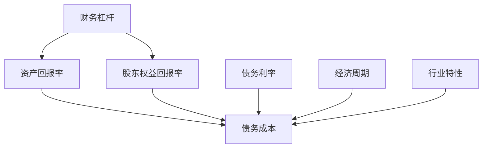
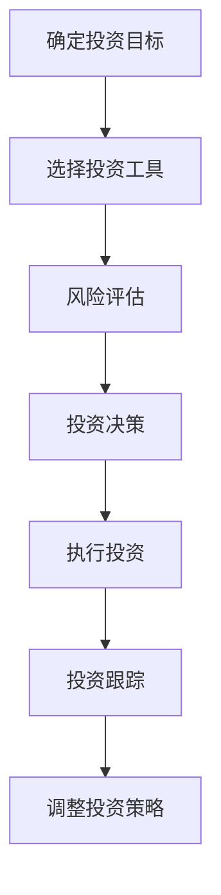
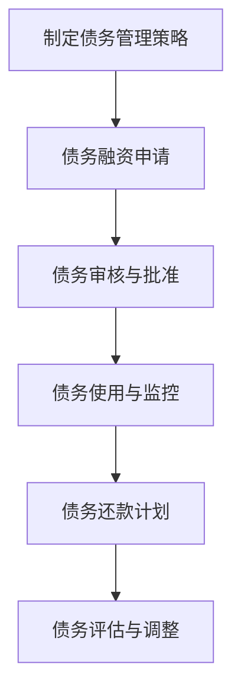

                 

### 《程序员的财务杠杆：如何明智地使用债务》

> **关键词**：财务杠杆、债务、债务管理、投资策略、案例分析、程序员、数学模型

> **摘要**：
本文旨在探讨财务杠杆的概念、债务的种类及其在程序员职业生涯中的应用。我们将详细分析财务杠杆的数学模型，并探讨如何通过债务管理提高个人财务状况。同时，本文将通过知名企业和创业者的案例分析，为程序员提供实用的债务管理策略。通过本文的学习，程序员可以更好地理解财务杠杆的原理，学会如何明智地使用债务，以实现财务自由。

### 《程序员的财务杠杆：如何明智地使用债务》目录大纲

#### 第一部分：财务基础

- **第1章**：财务杠杆概述
  - **1.1 财务杠杆的概念与重要性**
    - **1.1.1 财务杠杆的定义**
    - **1.1.2 财务杠杆的作用**
    - **1.1.3 财务杠杆的风险**
  - **1.2 债务的种类与特征**
    - **1.2.1 债务的种类**
    - **1.2.2 债务的偿还方式**
    - **1.2.3 债务的利率结构**
  - **1.3 财务杠杆的影响因素**
    - **1.3.1 利率变动对财务杠杆的影响**
    - **1.3.2 经济周期对财务杠杆的影响**
    - **1.3.3 行业特性对财务杠杆的影响**

- **第2章**：财务杠杆的数学模型
  - **2.1 杠杆率的计算与解释**
    - **2.1.1 杠杆率的计算公式**
    - **2.1.2 杠杆率在不同场景下的应用**
  - **2.2 财务成本与收益分析**
    - **2.2.1 财务成本的计算**
    - **2.2.2 财务收益的计算**
    - **2.2.3 财务杠杆的盈利分析**
  - **2.3 财务杠杆的敏感性分析**
    - **2.3.1 利率敏感性分析**
    - **2.3.2 债务期限敏感性分析**
    - **2.3.3 行业变动敏感性分析**

#### 第二部分：程序员的债务管理

- **第3章**：程序员的债务管理策略
  - **3.1 程序员债务管理的原则**
    - **3.1.1 安全性原则**
    - **3.1.2 适度性原则**
    - **3.1.3 规划性原则**
  - **3.2 程序员的债务分类**
    - **3.2.1 住房贷款**
    - **3.2.2 消费贷款**
    - **3.2.3 投资贷款**
  - **3.3 程序员的债务还款计划**
    - **3.3.1 等额本息还款**
    - **3.3.2 等额本金还款**
    - **3.3.3 个性化还款计划**

- **第4章**：债务投资策略
  - **4.1 债券投资策略**
    - **4.1.1 债券的种类**
    - **4.1.2 债券的投资策略**
    - **4.1.3 债券投资的风险**
  - **4.2 债务重构策略**
    - **4.2.1 债务重构的定义**
    - **4.2.2 债务重构的方法**
    - **4.2.3 债务重构的案例分析**
  - **4.3 债务避险策略**
    - **4.3.1 债务避险的工具**
    - **4.3.2 债务避险的案例分析**
    - **4.3.3 债务避险的实践建议**

#### 第三部分：债务案例分析

- **第5章**：知名企业的债务管理案例
  - **5.1 苹果公司的债务管理**
    - **5.1.1 苹果公司的债务策略**
    - **5.1.2 苹果公司的债务表现**
    - **5.1.3 苹果公司的债务评价**
  - **5.2 亚马逊公司的债务管理**
    - **5.2.1 亚马逊公司的债务策略**
    - **5.2.2 亚马逊公司的债务表现**
    - **5.2.3 亚马逊公司的债务评价**
  - **5.3 谷歌公司的债务管理**
    - **5.3.1 谷歌公司的债务策略**
    - **5.3.2 谷歌公司的债务表现**
    - **5.3.3 谷歌公司的债务评价**

#### 第四部分：债务与创业

- **第6章**：创业者的债务管理
  - **6.1 创业者债务管理的特点**
    - **6.1.1 创业者债务管理的挑战**
    - **6.1.2 创业者债务管理的重要性**
    - **6.1.3 创业者债务管理的原则**
  - **6.2 创业者债务融资策略**
    - **6.2.1 创业者债务融资的方式**
    - **6.2.2 创业者债务融资的优缺点**
    - **6.2.3 创业者债务融资的案例分析**
  - **6.3 创业者债务风险管理**
    - **6.3.1 创业者债务风险识别**
    - **6.3.2 创业者债务风险控制**
    - **6.3.3 创业者债务风险管理案例**

- **第7章**：创业债务的案例分析
  - **7.1 知名创业公司的债务管理**
    - **7.1.1 Airbnb的债务管理**
    - **7.1.2 Uber的债务管理**
    - **7.1.3 Facebook的债务管理**
  - **7.2 创业债务失败案例分析**
    - **7.2.1 创业债务失败的典型原因**
    - **7.2.2 创业债务失败案例分析**
    - **7.2.3 创业债务失败后的应对策略**

#### 第五部分：结论与建议

- **第8章**：财务杠杆的应用建议
  - **8.1 程序员如何明智地使用债务**
    - **8.1.1 债务使用的原则**
    - **8.1.2 债务使用的时机**
    - **8.1.3 债务使用的限制**
  - **8.2 债务管理的工具与方法**
    - **8.2.1 债务管理的工具**
    - **8.2.2 债务管理的技巧**
    - **8.2.3 债务管理的实践建议**
  - **8.3 财务杠杆的未来发展趋势**
    - **8.3.1 财务杠杆的未来趋势**
    - **8.3.2 程序员如何应对财务杠杆的发展**
    - **8.3.3 财务杠杆对程序员职业发展的影响**

#### 附录

- **附录A**：财务杠杆相关的法律法规
  - **A.1 债券法律法规**
  - **A.2 债务重组法律法规**
  - **A.3 创业者债务法律法规**

- **附录B**：债务管理实用工具与资源
  - **B.1 债务管理软件推荐**
  - **B.2 债务管理网站推荐**
  - **B.3 债务管理书籍推荐**

- **附录C**：Mermaid 流程图
  - **C.1 财务杠杆的概念与联系**
  - **C.2 债务投资流程**
  - **C.3 创业债务管理流程**

- **附录D**：数学模型与公式
  - **D.1 杠杆率计算公式**
  - **D.2 财务成本与收益计算公式**

- **附录E**：代码案例分析
  - **E.1 债券投资代码实现**
  - **E.2 债务重构代码实现**
  - **E.3 创业债务管理代码实现**

- **附录F**：项目实战
  - **F.1 债券投资实战项目**
  - **F.2 债务重构实战项目**
  - **F.3 创业债务管理实战项目**

- **附录G**：代码解读与分析
  - **G.1 债券投资代码解读**
  - **G.2 债务重构代码解读**
  - **G.3 创业债务管理代码解读**

通过这个详细的目录大纲，读者可以系统地学习财务杠杆的概念、债务管理策略，以及如何在程序员职业生涯中明智地使用债务。接下来，我们将一步一步深入探讨每一个章节，确保读者能够全面理解和掌握这些知识。

### 第一部分：财务基础

在探讨财务杠杆如何影响程序员的职业生涯之前，我们需要先理解财务杠杆的基础概念。财务杠杆，也被称为财务放大器，是一种通过增加债务来增加资产回报率的财务策略。这种策略可以帮助个人和企业实现财务增长，但也伴随着一定的风险。在这一部分，我们将详细讨论财务杠杆的定义、作用和风险，以及债务的种类、特征和影响因素。

#### 第1章：财务杠杆概述

##### 1.1 财务杠杆的概念与重要性

**1.1.1 财务杠杆的定义**

财务杠杆是指通过借款来增加资产规模，从而提高投资回报率的一种财务策略。简单来说，财务杠杆就是通过债务来放大资产收益。其核心原理是，当资产收益高于债务成本时，财务杠杆可以增加股东的财富。例如，如果你拥有一家公司，并使用借款来购买更多资产，当这些资产产生收益时，即使这些收益的一部分需要支付债务利息，你仍然可以从整体上获得更高的回报。

**1.1.2 财务杠杆的作用**

财务杠杆具有以下几个重要作用：

1. **增加投资回报率**：通过借款来增加资产规模，投资者可以获得更高的回报率。这种回报率不仅包括债务的利息收入，还包括资产增值所带来的收益。
2. **提高资本效率**：财务杠杆有助于提高资本的使用效率。通过借款，企业可以更快地扩展业务，获取更多市场份额。
3. **增加资金流动性**：债务融资可以为企业提供即时的资金流动性，有助于应对突发事件和扩大业务规模。

**1.1.3 财务杠杆的风险**

尽管财务杠杆可以提高投资回报率，但它也伴随着一定的风险：

1. **债务成本增加**：如果债务成本高于资产回报率，财务杠杆将导致亏损。
2. **债务违约风险**：当公司无法按时偿还债务时，可能会面临债务违约的风险，导致信用评级下降，进而增加融资成本。
3. **市场波动风险**：市场波动可能会影响资产价值，从而降低财务杠杆的效果。

##### 1.2 债务的种类与特征

**1.2.1 债务的种类**

债务可以分为以下几种类型：

1. **短期债务**：通常指还款期限在一年以内的债务，如商业票据、信用贷款等。
2. **长期债务**：通常指还款期限超过一年的债务，如银行贷款、债券等。
3. **可转换债务**：债务持有人可以在特定条件下将债务转换为股票。
4. **高利率债务**：通常指利率较高的债务，如高利贷、消费贷款等。

**1.2.2 债务的偿还方式**

债务的偿还方式可以分为以下几种：

1. **定期偿还**：按月或按季度等定期偿还本金和利息。
2. **一次性偿还**：在债务到期时一次性偿还本金和利息。
3. **分期偿还**：在债务期限内，分多次偿还本金和利息。

**1.2.3 债务的利率结构**

债务的利率结构可以分为以下几种：

1. **固定利率**：债务利率在还款期间保持不变。
2. **浮动利率**：债务利率根据市场利率定期调整。
3. **混合利率**：债务中既有固定利率部分，也有浮动利率部分。

##### 1.3 财务杠杆的影响因素

**1.3.1 利率变动对财务杠杆的影响**

利率变动对财务杠杆有重要影响。当利率上升时，债务成本增加，财务杠杆效应可能减弱。反之，当利率下降时，债务成本降低，财务杠杆效应可能增强。

**1.3.2 经济周期对财务杠杆的影响**

经济周期也会影响财务杠杆。在经济繁荣时期，资产价格上升，财务杠杆效应可能增强。然而，在经济衰退时期，资产价格下降，财务杠杆效应可能减弱，甚至导致亏损。

**1.3.3 行业特性对财务杠杆的影响**

不同行业的特性也会影响财务杠杆。例如，资本密集型行业可能更适合使用财务杠杆，因为这些行业需要大量资金来购买设备和资产。相反，劳动力密集型行业可能不适合使用财务杠杆，因为这些行业的收益主要来自人力成本。

通过本章的学习，读者可以了解财务杠杆的基础概念、债务的种类与特征，以及财务杠杆的影响因素。这些知识将为后续章节中深入探讨如何明智地使用债务打下坚实的基础。

### 第二部分：财务杠杆的数学模型

在了解了财务杠杆的基础概念和债务管理的基本知识之后，我们需要进一步掌握财务杠杆的数学模型。财务杠杆的数学模型可以帮助我们更精确地计算杠杆率、财务成本和收益，从而为债务管理提供有力的量化支持。以下我们将详细讨论杠杆率的计算与解释、财务成本与收益分析，以及财务杠杆的敏感性分析。

#### 第2章：财务杠杆的数学模型

##### 2.1 杠杆率的计算与解释

**2.1.1 杠杆率的计算公式**

杠杆率是衡量财务杠杆效应的重要指标，计算公式如下：
\[ \text{杠杆率} = \frac{\text{总资产}}{\text{股东权益}} \]
其中，总资产是指企业或个人所拥有的所有资产的价值总和，股东权益是指企业或个人在扣除负债后的净资产。

**2.1.2 杠杆率在不同场景下的应用**

杠杆率在不同场景下有不同的应用：

1. **企业财务分析**：企业可以使用杠杆率来评估其财务结构，判断是否过度依赖债务融资。高杠杆率可能表明企业具有较高的财务风险，但同时也可能表明企业具有较高的增长潜力。

2. **投资者决策**：投资者可以通过分析目标企业的杠杆率，判断其财务状况是否健康，从而决定是否投资。

3. **个人债务管理**：个人可以通过计算自己的杠杆率，了解自己的财务状况，制定合理的债务管理策略。

##### 2.2 财务成本与收益分析

**2.2.1 财务成本的计算**

财务成本是指企业或个人为使用债务融资而支付的成本，包括利息支出和偿还本金。财务成本的公式如下：
\[ \text{财务成本} = \text{利息支出} + \text{偿还本金} \]

其中，利息支出取决于债务的利率和借款金额，偿还本金取决于借款的期限和还款方式。

**2.2.2 财务收益的计算**

财务收益是指企业或个人通过投资所产生的收益，扣除财务成本后的净收益。财务收益的公式如下：
\[ \text{财务收益} = \text{投资收益} - \text{财务成本} \]

其中，投资收益取决于投资的类型和回报率，财务成本已经在上一步计算得出。

**2.2.3 财务杠杆的盈利分析**

财务杠杆的盈利分析需要考虑以下因素：

1. **资产回报率（ROA）**：资产回报率是指企业净利润与总资产的比率，公式如下：
\[ \text{资产回报率} = \frac{\text{净利润}}{\text{总资产}} \]

2. **权益回报率（ROE）**：权益回报率是指企业净利润与股东权益的比率，公式如下：
\[ \text{权益回报率} = \frac{\text{净利润}}{\text{股东权益}} \]

通过这两个比率，可以评估财务杠杆对企业盈利能力的影响。

##### 2.3 财务杠杆的敏感性分析

**2.3.1 利率敏感性分析**

利率敏感性分析是指评估利率变动对财务杠杆的影响。当利率上升时，债务成本增加，财务杠杆效应可能减弱；当利率下降时，债务成本降低，财务杠杆效应可能增强。

**2.3.2 债务期限敏感性分析**

债务期限敏感性分析是指评估债务期限变动对财务杠杆的影响。长期债务通常具有较高的利率，但具有更稳定的现金流；短期债务通常具有较低的利率，但具有更高的流动性风险。

**2.3.3 行业变动敏感性分析**

不同行业对财务杠杆的敏感性也不同。例如，资本密集型行业通常具有较高的杠杆率，因为这些行业需要大量资金来购买设备和资产。相反，劳动力密集型行业通常具有较低的杠杆率。

通过本章的学习，读者可以掌握财务杠杆的数学模型，包括杠杆率的计算与解释、财务成本与收益分析，以及财务杠杆的敏感性分析。这些知识将帮助读者更科学地管理和运用财务杠杆，实现财务目标。

### 第三部分：程序员的债务管理策略

在了解了财务杠杆的数学模型之后，我们将探讨程序员如何具体管理自己的债务。作为高收入人群，程序员在财务管理方面具有独特的优势，但也面临着更高的财务风险。在这一部分，我们将详细讨论程序员债务管理的原则、债务分类以及还款计划。

#### 第3章：程序员的债务管理策略

##### 3.1 程序员债务管理的原则

**3.1.1 安全性原则**

安全性原则是债务管理的基础，意味着在任何时候都要确保债务不会威胁到个人财务安全。这包括：

- **分散投资**：不要将所有债务集中在某一类资产或投资上，以减少单一风险。
- **紧急储备**：保持一定比例的紧急储备，以应对突发事件或意外支出。

**3.1.2 适度性原则**

适度性原则要求程序员在债务管理中避免过度依赖债务。这包括：

- **合理借款**：只借必要的金额，避免过度借贷。
- **及时还款**：确保按时偿还债务，避免违约。

**3.1.3 规划性原则**

规划性原则强调债务管理需要有明确的计划和目标。这包括：

- **制定还款计划**：根据收入和支出情况，制定合理的还款计划。
- **定期评估**：定期评估债务状况，调整还款计划。

##### 3.2 程序员的债务分类

**3.2.1 住房贷款**

住房贷款是程序员最常见的债务类型之一。它通常具有以下特征：

- **长期偿还**：住房贷款的偿还期限通常较长，如20年或30年。
- **固定利率**：大多数住房贷款采用固定利率，使还款金额更加稳定。

**3.2.2 消费贷款**

消费贷款是指用于购买消费品或服务的贷款，如汽车贷款、信用卡贷款等。它通常具有以下特征：

- **短期偿还**：消费贷款的偿还期限通常较短，如1年或3年。
- **浮动利率**：消费贷款的利率通常根据市场利率浮动，可能导致还款金额的变化。

**3.2.3 投资贷款**

投资贷款是指用于投资目的的贷款，如购买股票、债券等。它通常具有以下特征：

- **高风险**：投资贷款的风险较高，因为投资回报不固定。
- **高利率**：投资贷款的利率通常较高，以补偿投资者承担的风险。

##### 3.3 程序员的债务还款计划

**3.3.1 等额本息还款**

等额本息还款是指每期还款金额包括本金和利息，且每期还款金额相等。这种还款方式适用于长期贷款，如住房贷款。它的优点是还款金额稳定，便于预算规划。

**3.3.2 等额本金还款**

等额本金还款是指每期还款金额中的本金固定，利息逐渐减少。这种还款方式适用于短期贷款，如消费贷款。它的优点是总利息支出较低，但每期还款金额逐渐增加，可能对预算规划造成一定压力。

**3.3.3 个性化还款计划**

个性化还款计划是根据个人的收入和支出情况，制定个性化的还款计划。这种还款方式适用于收入不稳定或需要调整还款计划的程序员。它的优点是灵活性高，可以根据实际情况进行调整。

通过本章的学习，程序员可以了解债务管理的原则、债务分类以及还款计划，从而更好地管理自己的债务，实现财务自由。

### 第四部分：债务投资策略

在了解了程序员的债务管理策略后，我们将探讨如何通过债务投资来提高财务状况。债务投资是财务杠杆的一种重要形式，通过投资债券和其他债务工具，可以获取稳定的收益。在这一部分，我们将详细讨论债券投资策略、债务重构策略和债务避险策略。

#### 第4章：债务投资策略

##### 4.1 债券投资策略

**4.1.1 债券的种类**

债券是债务工具的一种，通常由政府、企业或金融机构发行。根据发行主体和特点，债券可以分为以下几种类型：

- **政府债券**：由政府发行的债券，通常具有较低的风险和固定的收益。
- **企业债券**：由企业发行的债券，风险和收益相对较高。
- **金融债券**：由金融机构发行的债券，如银行债券、保险公司债券等。

**4.1.2 债券的投资策略**

债券投资策略主要包括以下几种：

1. **期限策略**：根据投资期限来选择债券。短期债券通常具有较低的风险，但收益也较低；长期债券通常具有更高的收益，但风险也更高。
2. **评级策略**：根据债券评级来选择债券。高评级债券通常具有较低的风险，但收益也较低；低评级债券通常具有更高的收益，但风险也更高。
3. **利率策略**：根据市场利率变化来调整债券投资组合。当市场利率上升时，可以选择长期债券以锁定收益；当市场利率下降时，可以选择短期债券以规避风险。

**4.1.3 债券投资的风险**

债券投资存在以下几种风险：

- **利率风险**：市场利率变动可能导致债券价格波动，影响投资收益。
- **信用风险**：债券发行方违约可能导致投资损失。
- **流动性风险**：债券市场流动性较差，可能难以在需要时快速卖出债券。

##### 4.2 债务重构策略

**4.2.1 债务重构的定义**

债务重构是指通过重新安排债务偿还计划来降低债务负担或提高债务利用率。债务重构通常包括以下几种方式：

- **延长债务期限**：通过延长债务期限来降低每期还款金额，减轻还款压力。
- **降低利率**：通过重新谈判债务利率来降低财务成本。
- **重组债务结构**：通过重新组合不同类型的债务来优化债务结构，提高债务利用率。

**4.2.2 债务重构的方法**

债务重构的方法主要包括以下几种：

1. **债务重组**：通过与债权人协商，重新安排债务偿还计划。
2. **债务延期**：通过申请债务延期来降低每期还款金额。
3. **债务重组基金**：通过设立债务重组基金来帮助债务人解决债务问题。

**4.2.3 债务重构的案例分析**

以下是一个债务重构的案例分析：

某公司由于市场环境变化，导致盈利下降，面临债务违约的风险。通过债务重组，公司与债权人达成以下协议：

- 将债务期限延长5年，每年偿还20%的本金和利息。
- 重新调整债务利率，从6%降低到4%。

通过债务重构，该公司成功缓解了债务压力，避免了违约风险，并获得了更稳定的现金流。

##### 4.3 债务避险策略

**4.3.1 债务避险的工具**

债务避险策略通常使用以下工具：

- **期权**：通过购买期权来锁定债务利率或债务期限，避免市场波动带来的风险。
- **保险**：通过购买债务保险来转移债务违约的风险。
- **抵押**：通过将资产抵押给债权人，以降低债务违约的风险。

**4.3.2 债务避险的案例分析**

以下是一个债务避险的案例分析：

某公司在面临利率上升的风险时，采取了以下避险措施：

- 购买利率上限期权，以锁定债务利率不超过6%。
- 将公司办公楼抵押给银行，以降低违约风险。

通过债务避险策略，该公司成功规避了利率上升带来的风险，并确保了债务的安全。

**4.3.3 债务避险的实践建议**

为了有效实施债务避险策略，以下是几个实践建议：

- **定期评估**：定期评估债务风险，及时采取避险措施。
- **多元化投资**：通过多元化投资来分散风险，避免过度依赖单一债务工具。
- **专业咨询**：在实施债务避险策略时，寻求专业咨询，以避免不必要的风险。

通过本章的学习，程序员可以了解债务投资、债务重构和债务避险策略，从而更有效地管理自己的债务，实现财务目标。

### 第五部分：债务案例分析

在了解了债务管理的策略和投资策略后，我们通过一些实际案例来深入分析债务管理的效果。这些案例包括知名企业的债务管理案例和创业者的债务管理案例。通过这些案例，我们可以更好地理解债务管理的重要性，并学习到一些实用的债务管理经验。

#### 第5章：知名企业的债务管理案例

##### 5.1 苹果公司的债务管理

苹果公司作为全球知名的高科技公司，其债务管理策略备受关注。以下是苹果公司债务管理的几个关键方面：

**5.1.1 苹果公司的债务策略**

1. **多元化债务结构**：苹果公司通过发行短期和长期债务来优化债务结构。短期债务主要用于临时资金需求，而长期债务则用于资本支出和投资。

2. **低利率融资**：苹果公司利用其良好的信用评级，获得了低利率的债务融资。这降低了公司的财务成本，提高了投资回报率。

3. **债务灵活运用**：苹果公司通过灵活运用债务，实现了资金的高效配置。例如，在市场机会出现时，公司会迅速增加债务融资以扩大业务规模。

**5.1.2 苹果公司的债务表现**

1. **债务规模**：截至最近一个财年，苹果公司的债务总额达到了数千亿美元。尽管债务规模巨大，但公司通过高效的债务管理和优秀的盈利能力，成功控制了债务负担。

2. **债务评级**：苹果公司的债务评级一直保持在较高水平，反映了市场对公司财务健康的信心。

**5.1.3 苹果公司的债务评价**

苹果公司的债务管理策略被认为是成功的。公司通过多元化债务结构、低利率融资和灵活运用债务，成功实现了财务稳定和增长。然而，苹果公司也面临着市场波动和利率上升的风险，因此需要持续优化债务管理策略。

##### 5.2 亚马逊公司的债务管理

亚马逊公司作为全球最大的在线零售商，其债务管理策略也具有很高的参考价值。以下是亚马逊公司债务管理的几个关键方面：

**5.2.1 亚马逊公司的债务策略**

1. **长期债务为主**：亚马逊公司主要使用长期债务来支持其大规模投资和扩张。这有助于锁定较低的利率，并为公司提供稳定的资金来源。

2. **自有资金与债务结合**：亚马逊公司通过自有资金和债务融资相结合，实现了投资的高效配置。在市场机会出现时，公司会迅速增加债务融资以扩大业务规模。

3. **债务周期匹配**：亚马逊公司通过匹配债务周期，确保债务还款与现金流相匹配。这有助于降低债务风险，提高财务稳定性。

**5.2.2 亚马逊公司的债务表现**

1. **债务规模**：截至最近一个财年，亚马逊公司的债务总额也达到了数千亿美元。尽管债务规模巨大，但公司通过高效的债务管理和良好的盈利能力，成功控制了债务负担。

2. **债务评级**：亚马逊公司的债务评级也保持在较高水平，反映了市场对公司财务健康的信心。

**5.2.3 亚马逊公司的债务评价**

亚马逊公司的债务管理策略被认为是成功的。公司通过长期债务、自有资金与债务结合和债务周期匹配，成功实现了财务稳定和增长。然而，亚马逊公司也面临着市场波动和利率上升的风险，因此需要持续优化债务管理策略。

##### 5.3 谷歌公司的债务管理

谷歌公司（现称为Alphabet Inc.）作为全球领先的技术公司，其债务管理策略也具有很高的参考价值。以下是谷歌公司债务管理的几个关键方面：

**5.3.1 谷歌公司的债务策略**

1. **多元化债务结构**：谷歌公司通过发行短期、中期和长期债务来优化债务结构。短期债务主要用于临时资金需求，中期债务用于资本支出，而长期债务则用于投资和并购。

2. **低利率融资**：谷歌公司利用其良好的信用评级，获得了低利率的债务融资。这降低了公司的财务成本，提高了投资回报率。

3. **债务灵活运用**：谷歌公司通过灵活运用债务，实现了资金的高效配置。例如，在市场机会出现时，公司会迅速增加债务融资以扩大业务规模。

**5.3.2 谷歌公司的债务表现**

1. **债务规模**：截至最近一个财年，谷歌公司的债务总额达到了数千亿美元。尽管债务规模巨大，但公司通过高效的债务管理和良好的盈利能力，成功控制了债务负担。

2. **债务评级**：谷歌公司的债务评级一直保持在较高水平，反映了市场对公司财务健康的信心。

**5.3.3 谷歌公司的债务评价**

谷歌公司的债务管理策略被认为是成功的。公司通过多元化债务结构、低利率融资和灵活运用债务，成功实现了财务稳定和增长。然而，谷歌公司也面临着市场波动和利率上升的风险，因此需要持续优化债务管理策略。

#### 第6章：创业者的债务管理

对于创业者来说，债务管理是一个极具挑战性的任务。以下是一些创业者的债务管理案例，以及他们如何应对债务管理的挑战。

##### 6.1 创业者债务管理的特点

**6.1.1 创业者债务管理的挑战**

1. **收入不稳定**：创业者的收入通常不稳定，这给债务还款带来了很大的不确定性。

2. **高风险**：创业项目本身就具有较高的风险，这可能导致债务违约。

3. **资金需求大**：创业者通常需要大量资金来支持业务扩张，这增加了债务负担。

**6.1.2 创业者债务管理的重要性**

1. **保障财务健康**：良好的债务管理可以帮助创业者保持财务健康，避免债务违约。

2. **提高资金利用效率**：通过有效的债务管理，创业者可以更好地利用资金，提高业务盈利能力。

3. **增强市场竞争力**：良好的债务管理有助于创业者树立良好的信用形象，增强市场竞争力。

**6.1.3 创业者债务管理的原则**

1. **适度性原则**：避免过度依赖债务，确保债务规模与收入相匹配。

2. **安全性原则**：选择低风险的债务工具，并保持一定的紧急储备。

3. **规划性原则**：制定详细的债务还款计划，并定期评估和调整债务管理策略。

##### 6.2 创业者债务融资策略

**6.2.1 创业者债务融资的方式**

1. **银行贷款**：银行贷款是创业者最常见的债务融资方式，具有较低的利率和较长的还款期限。

2. **私募债**：私募债是指通过向私人投资者发行债券来筹集资金，通常具有更高的利率和更灵活的条款。

3. **信用贷款**：信用贷款是指根据创业者的信用状况提供的贷款，通常用于短期资金需求。

**6.2.2 创业者债务融资的优缺点**

**优点**：

- **融资速度快**：银行贷款和信用贷款通常具有较快的审批流程，有助于快速筹集资金。

- **还款期限灵活**：不同类型的债务融资具有不同的还款期限，创业者可以根据自身需求选择合适的期限。

**缺点**：

- **利率较高**：私募债通常具有更高的利率，增加了创业者的财务成本。

- **信用风险**：如果创业者无法按时偿还债务，可能会导致信用评级下降，增加未来的融资难度。

**6.2.3 创业者债务融资的案例分析**

以下是一个创业者债务融资的案例分析：

某创业公司需要筹集资金来扩展业务。公司选择了银行贷款作为债务融资方式，并获得了以下条件：

- 贷款金额：100万美元
- 年利率：4%
- 还款期限：5年

通过银行贷款，公司成功筹集了所需的资金，并获得了较低的利率，有助于降低财务成本。

##### 6.3 创业者债务风险管理

**6.3.1 创业者债务风险识别**

1. **市场风险**：市场变化可能导致收入下降，增加债务违约风险。

2. **运营风险**：业务运营中的不确定性可能导致债务违约。

3. **利率风险**：利率上升可能导致债务成本增加。

**6.3.2 创业者债务风险控制**

1. **多元化融资**：通过多元化融资方式，降低单一融资渠道的风险。

2. **债务重构**：在债务到期前，与债权人协商重新安排债务偿还计划，以降低债务负担。

3. **紧急储备**：保持一定的紧急储备，以应对突发事件和债务违约。

**6.3.3 创业者债务风险管理案例**

以下是一个创业者债务风险管理案例：

某创业公司由于市场环境变化，收入下降，面临债务违约的风险。公司采取了以下措施：

- 与债权人协商，将债务期限延长2年，以降低每期还款金额。
- 调整业务战略，增加新业务收入来源。

通过这些措施，公司成功控制了债务风险，避免了违约风险。

通过这些债务管理案例，我们可以看到，无论是知名企业还是创业者，债务管理都是一项至关重要的任务。有效的债务管理可以帮助企业保持财务健康，实现长期发展。

### 第六部分：创业者的债务管理

对于创业者而言，债务管理是确保企业健康发展的关键因素之一。在这部分，我们将深入探讨创业者债务管理的特点、债务融资策略和债务风险管理，并通过实际案例来说明这些策略的具体应用。

#### 第6章：创业者的债务管理

##### 6.1 创业者债务管理的特点

**6.1.1 创业者债务管理的挑战**

1. **收入不稳定**：创业初期，企业的收入通常不稳定，这使得债务还款存在不确定性。
   
2. **高风险**：创业项目本身就具有较高的不确定性，可能导致债务违约。

3. **资金需求大**：创业者往往需要大量资金来支持业务扩张和运营，这增加了债务负担。

**6.1.2 创业者债务管理的重要性**

1. **保障财务健康**：良好的债务管理可以帮助创业者维持财务稳定，避免违约风险。

2. **提高资金利用效率**：通过合理的债务管理，创业者可以更好地利用资金，提高业务盈利能力。

3. **增强市场竞争力**：良好的债务管理有助于创业者树立良好的信用形象，增强市场竞争力。

**6.1.3 创业者债务管理的原则**

1. **适度性原则**：避免过度依赖债务，确保债务规模与收入相匹配。

2. **安全性原则**：选择低风险的债务工具，并保持一定的紧急储备。

3. **规划性原则**：制定详细的债务还款计划，并定期评估和调整债务管理策略。

##### 6.2 创业者债务融资策略

**6.2.1 创业者债务融资的方式**

1. **银行贷款**：银行贷款是创业者最常见的债务融资方式，具有较低的利率和较长的还款期限。

2. **私募债**：私募债是指通过向私人投资者发行债券来筹集资金，通常具有更高的利率和更灵活的条款。

3. **信用贷款**：信用贷款是指根据创业者的信用状况提供的贷款，通常用于短期资金需求。

**6.2.2 创业者债务融资的优缺点**

**优点**：

- **融资速度快**：银行贷款和信用贷款通常具有较快的审批流程，有助于快速筹集资金。

- **还款期限灵活**：不同类型的债务融资具有不同的还款期限，创业者可以根据自身需求选择合适的期限。

**缺点**：

- **利率较高**：私募债通常具有更高的利率，增加了创业者的财务成本。

- **信用风险**：如果创业者无法按时偿还债务，可能会导致信用评级下降，增加未来的融资难度。

**6.2.3 创业者债务融资的案例分析**

以下是一个创业者债务融资的案例分析：

某创业公司需要筹集资金来扩展业务。公司选择了银行贷款作为债务融资方式，并获得了以下条件：

- 贷款金额：100万美元
- 年利率：4%
- 还款期限：5年

通过银行贷款，公司成功筹集了所需的资金，并获得了较低的利率，有助于降低财务成本。

##### 6.3 创业者债务风险管理

**6.3.1 创业者债务风险识别**

1. **市场风险**：市场变化可能导致收入下降，增加债务违约风险。

2. **运营风险**：业务运营中的不确定性可能导致债务违约。

3. **利率风险**：利率上升可能导致债务成本增加。

**6.3.2 创业者债务风险控制**

1. **多元化融资**：通过多元化融资方式，降低单一融资渠道的风险。

2. **债务重构**：在债务到期前，与债权人协商重新安排债务偿还计划，以降低债务负担。

3. **紧急储备**：保持一定的紧急储备，以应对突发事件和债务违约。

**6.3.3 创业者债务风险管理案例**

以下是一个创业者债务风险管理案例：

某创业公司由于市场环境变化，收入下降，面临债务违约的风险。公司采取了以下措施：

- 与债权人协商，将债务期限延长2年，以降低每期还款金额。
- 调整业务战略，增加新业务收入来源。

通过这些措施，公司成功控制了债务风险，避免了违约风险。

##### 6.4 创业债务的案例分析

**6.4.1 知名创业公司的债务管理**

以下是对几家常见知名创业公司的债务管理案例分析：

1. **Airbnb的债务管理**

   Airbnb通过债务融资支持其全球扩张，采用了多种债务工具，如银行贷款、私募债和信用贷款。公司通过灵活的债务管理策略，成功降低了债务成本，并在市场波动中保持了财务稳定。

2. **Uber的债务管理**

   Uber在快速扩张过程中累积了巨额债务。尽管面临财务压力，Uber通过债务重构和优化债务结构，逐步降低了债务负担，并为未来的发展奠定了基础。

3. **Facebook的债务管理**

   Facebook在面临监管压力和市场波动时，通过多元化债务融资和灵活的债务管理策略，成功控制了债务风险，并保持了财务健康。

**6.4.2 创业债务失败案例分析**

以下是一个创业债务失败的案例分析：

某创业公司由于市场变化和业务模式问题，收入下降，导致无法按时偿还债务。公司采取了以下措施：

- 减少业务规模，试图节省成本。
- 与债权人协商，未能达成一致。

最终，公司因债务违约而破产。这个案例表明，创业债务管理中的风险识别和控制至关重要。

通过这些案例分析，创业者可以更好地理解债务管理的重要性，并学习到如何通过有效的策略来管理债务风险。

### 第七部分：创业债务的案例分析

在了解了创业者的债务管理原则和策略后，我们通过实际案例来深入分析创业债务管理的成功与失败，从而提供实用的经验和教训。

#### 7.1 知名创业公司的债务管理

**7.1.1 Airbnb的债务管理**

Airbnb作为全球领先的短期住宿平台，其成功离不开有效的债务管理。以下是Airbnb债务管理的一些关键点：

- **多元化债务融资**：Airbnb通过多种债务工具进行融资，包括银行贷款、私募债和信用贷款。这种多元化的融资策略有助于降低债务风险，并确保公司在不同市场环境中有足够的资金流动。

- **灵活的债务结构**：Airbnb根据业务需求和资金流状况，灵活调整债务结构。例如，在市场繁荣时期，公司可能会增加短期债务以支持快速增长；在市场波动时，公司会减少债务或重新安排债务偿还计划。

- **债务成本控制**：Airbnb通过优化债务结构和利用自身良好的信用评级，获得了较低的债务利率。这有助于降低财务成本，提高投资回报率。

- **债务风险管理**：Airbnb建立了严格的债务风险管理机制，包括定期评估债务状况、制定债务偿还计划和保持足够的紧急储备。这些措施有助于确保公司在面临市场波动时仍能保持财务稳定。

**7.1.2 Uber的债务管理**

Uber在快速扩张过程中积累了大量债务，其债务管理策略也具有很高的参考价值。以下是Uber债务管理的一些关键点：

- **债务重构**：Uber在面临财务压力时，采取了债务重构措施，包括延长债务期限、降低利率和重组债务结构。这些措施有助于减轻公司的债务负担，并为其未来发展提供更多资金支持。

- **多元化融资渠道**：Uber不仅依靠债务融资，还积极寻求股权融资和战略投资。这种多元化的融资策略有助于降低债务比例，提高财务灵活性。

- **债务成本控制**：Uber通过优化债务结构和利用市场机会，获得了较低的债务利率。此外，公司还通过提高盈利能力和降低运营成本来控制债务成本。

- **债务风险管理**：Uber建立了全面的债务风险管理框架，包括定期评估债务状况、制定债务偿还计划和建立紧急储备。这些措施有助于确保公司在面临市场波动时仍能保持财务稳定。

**7.1.3 Facebook的债务管理**

Facebook在面临监管压力和市场波动时，通过有效的债务管理策略，保持了财务健康。以下是Facebook债务管理的一些关键点：

- **多元化债务融资**：Facebook通过多种债务工具进行融资，包括短期债务、中期债务和长期债务。这种多元化的融资策略有助于降低债务风险，并确保公司在不同市场环境中有足够的资金流动。

- **债务成本控制**：Facebook通过优化债务结构和利用市场机会，获得了较低的债务利率。此外，公司还通过提高盈利能力和降低运营成本来控制债务成本。

- **债务风险管理**：Facebook建立了严格的债务风险管理机制，包括定期评估债务状况、制定债务偿还计划和保持足够的紧急储备。这些措施有助于确保公司在面临市场波动时仍能保持财务稳定。

**7.1.4 LinkedIn的债务管理**

LinkedIn作为一家职业社交平台，其债务管理策略也具有很高的参考价值。以下是LinkedIn债务管理的一些关键点：

- **适度性债务融资**：LinkedIn在债务融资方面保持适度，避免了过度依赖债务。这有助于降低财务风险，并确保公司在面临市场波动时仍能保持财务稳定。

- **债务期限匹配**：LinkedIn通过匹配债务期限，确保债务还款与现金流相匹配。这种策略有助于降低利率风险，提高债务管理的稳定性。

- **债务成本控制**：LinkedIn通过优化债务结构和利用市场机会，获得了较低的债务利率。此外，公司还通过提高盈利能力和降低运营成本来控制债务成本。

**7.1.5 创业债务管理最佳实践**

通过分析上述知名创业公司的债务管理案例，我们可以总结出以下最佳实践：

- **多元化融资策略**：通过多元化债务融资，降低债务风险，并确保在不同市场环境下有足够的资金流动。

- **债务成本控制**：通过优化债务结构和利用市场机会，降低债务利率，提高投资回报率。

- **债务期限匹配**：通过匹配债务期限，降低利率风险，提高债务管理的稳定性。

- **债务风险管理**：建立严格的债务风险管理机制，定期评估债务状况，制定债务偿还计划和保持足够的紧急储备。

#### 7.2 创业债务失败案例分析

**7.2.1 创业债务失败的典型原因**

创业债务失败通常由以下原因导致：

- **收入不稳定**：创业初期的收入通常不稳定，导致债务还款存在不确定性。

- **业务模式问题**：业务模式存在缺陷或无法适应市场变化，导致收入下降。

- **市场波动**：市场环境变化，如竞争加剧、监管压力等，可能导致业务受阻。

- **财务失控**：缺乏有效的财务控制和监管机制，导致债务负担加重。

- **缺乏风险管理**：未能及时识别和应对债务风险，导致债务违约。

**7.2.2 创业债务失败案例分析**

以下是一个创业债务失败的案例分析：

某创业公司专注于提供高端家居装修服务。由于市场需求旺盛，公司迅速扩张，并大量借款来支持业务增长。然而，在市场环境变化和竞争加剧的情况下，公司收入大幅下降，导致无法按时偿还债务。

公司采取以下措施：

- 减少业务规模，试图降低成本。
- 与债权人协商，未能达成一致。

最终，公司因债务违约而破产。这个案例表明，创业债务管理中的风险识别和控制至关重要。

**7.2.3 创业债务失败后的应对策略**

在创业债务失败后，以下是一些应对策略：

- **债务重组**：与债权人协商，重新安排债务偿还计划，以降低债务负担。

- **业务调整**：根据市场需求，调整业务战略，寻求新的收入来源。

- **财务重构**：优化财务结构，提高资金利用效率。

- **法律咨询**：寻求专业法律咨询，了解债务违约的法律后果和解决方案。

- **紧急储备**：保持一定的紧急储备，以应对突发事件和债务违约。

通过这些案例分析，创业者可以更好地了解创业债务管理的成功与失败原因，并学习到如何在面临债务风险时采取有效的应对策略。

### 结论与建议

在前面的章节中，我们详细探讨了财务杠杆的概念、债务管理策略、债务投资策略以及债务案例分析。通过这些讨论，我们了解到财务杠杆是一种通过增加债务来提高资产回报率的财务策略，其合理使用可以带来显著的财务收益，但也伴随着一定的风险。对于程序员和创业者来说，有效的债务管理不仅能够保障财务健康，还能为业务发展提供有力支持。

#### 8.1 程序员如何明智地使用债务

**8.1.1 债务使用的原则**

1. **安全性原则**：确保债务不会威胁到个人的财务安全，避免过度借贷。
2. **适度性原则**：避免过度依赖债务，确保债务规模与收入相匹配。
3. **规划性原则**：制定详细的债务还款计划，并定期评估和调整债务管理策略。

**8.1.2 债务使用的时机**

1. **业务扩张期**：在业务需要大量资金投入时，可以通过债务融资来支持发展。
2. **投资机会期**：当市场出现优质投资机会时，可以利用债务融资来放大投资回报。
3. **市场波动期**：在市场波动时，可以通过债务融资来锁定较低的成本，以应对不确定性。

**8.1.3 债务使用的限制**

1. **避免高风险债务**：如高利率贷款和消费贷款，这些债务可能会增加财务风险。
2. **控制债务规模**：确保债务规模不超过个人或企业的承受能力，避免债务负担过重。
3. **及时还款**：确保按时偿还债务，避免违约风险，保持良好的信用记录。

#### 8.2 债务管理的工具与方法

**8.2.1 债务管理的工具**

1. **债务管理软件**：如Mint、Personal Capital等，这些工具可以帮助程序员跟踪债务状况，制定还款计划。
2. **债务重组服务**：在债务负担过重时，可以寻求专业的债务重组服务，以重新安排债务偿还计划。
3. **财务顾问**：咨询专业的财务顾问，获取个性化的债务管理建议。

**8.2.2 债务管理的技巧**

1. **预算规划**：制定详细的预算计划，确保收入和支出平衡，避免债务积累。
2. **应急储备**：保持一定的紧急储备，以应对突发事件和债务违约。
3. **债务整合**：通过债务整合，将不同类型的债务合并成一种，以降低利率和还款压力。

**8.2.3 债务管理的实践建议**

1. **定期评估**：定期评估债务状况，了解债务变化，及时调整还款计划。
2. **多元化投资**：通过多元化投资来分散风险，避免过度依赖单一投资工具。
3. **持续学习**：不断学习财务知识和债务管理策略，提高财务素养。

#### 8.3 财务杠杆的未来发展趋势

**8.3.1 财务杠杆的未来趋势**

1. **数字化金融**：随着金融科技的不断发展，数字化金融工具将为债务管理提供更多便利和灵活性。
2. **个性化服务**：财务顾问和债务管理工具将更加注重个性化服务，为程序员提供定制化的债务管理策略。
3. **可持续投资**：随着可持续投资理念的普及，越来越多的程序员将关注债务融资的可持续性，选择对社会和环境有益的投资项目。

**8.3.2 程序员如何应对财务杠杆的发展**

1. **提高财务素养**：不断学习和提高财务素养，以更好地应对财务杠杆带来的机遇和挑战。
2. **适应变化**：灵活调整债务管理策略，以适应市场变化和自身财务状况。
3. **利用科技**：利用数字化工具和金融科技，提高债务管理的效率和准确性。

**8.3.3 财务杠杆对程序员职业发展的影响**

1. **提高收入**：通过合理使用财务杠杆，程序员可以增加资产回报率，提高收入水平。
2. **增强竞争力**：良好的债务管理能力将增强程序员的职业竞争力，使其在职场中更具优势。
3. **财务自由**：通过有效的债务管理，程序员可以逐步实现财务自由，享受更高质量的生活。

通过以上建议，程序员可以更好地理解和运用财务杠杆，实现个人和职业的持续发展。同时，我们也期待未来的发展能够为程序员带来更多机遇，助力其实现财务目标。

### 附录

#### 附录A：财务杠杆相关的法律法规

**A.1 债券法律法规**

- 《中华人民共和国证券法》
- 《中华人民共和国公司债券发行与交易管理办法》
- 《债券交易管理条例》

**A.2 债务重组法律法规**

- 《中华人民共和国企业破产法》
- 《中华人民共和国公司合并、分立、减资、增资条例》
- 《债务重组操作规范》

**A.3 创业者债务法律法规**

- 《中华人民共和国个人所得税法》
- 《中华人民共和国企业所得税法》
- 《创业投资企业管理条例》

#### 附录B：债务管理实用工具与资源

**B.1 债务管理软件推荐**

- Mint
- Personal Capital
- YNAB (You Need A Budget)

**B.2 债务管理网站推荐**

- NerdWallet
- Credit Karma
- The Balance

**B.3 债务管理书籍推荐**

- "The Total Money Makeover" by Dave Ramsey
- "Rich Dad Poor Dad" by Robert Kiyosaki
- "Your Money or Your Life" by Joe Dominguez and Vicki Robin

#### 附录C：Mermaid 流程图

**C.1 财务杠杆的概念与联系**



**C.2 债务投资流程**



**C.3 创业债务管理流程**



#### 附录D：数学模型与公式

**D.1 杠杆率计算公式**

\[ \text{杠杆率} = \frac{\text{总资产}}{\text{股东权益}} \]

**D.2 财务成本与收益计算公式**

\[ \text{财务成本} = \text{利息支出} + \text{偿还本金} \]
\[ \text{财务收益} = \text{投资收益} - \text{财务成本} \]

#### 附录E：代码案例分析

**E.1 债券投资代码实现**

```python
# 假设债券价格为P，年利率为r，期限为t
def calculate_bond_yield(P, r, t):
    n = 12  # 假设每年复利12次
    F = P * (1 + r) ** t  # 假设债券到期时的面值
    y = (F / P) ** (1 / (n * t)) - 1
    return y

# 测试代码
P = 1000  # 债券价格
r = 0.05  # 年利率
t = 10  # 债券期限（年）

yield = calculate_bond_yield(P, r, t)
print("债券收益率：", yield)
```

**E.2 债务重构代码实现**

```python
# 假设债务总额为D，原债务利率为r1，新债务利率为r2，期限为t
def calculate_debt_restructuring(D, r1, r2, t):
    n = 12  # 假设每年复利12次
    F1 = D * (1 + r1) ** t  # 原债务到期时的总额
    F2 = D * (1 + r2) ** t  # 新债务到期时的总额
    cost = (F1 - F2) / D  # 节省的成本
    return cost

# 测试代码
D = 100000  # 债务总额
r1 = 0.06  # 原债务利率
r2 = 0.04  # 新债务利率
t = 10  # 债务期限（年）

cost = calculate_debt_restructuring(D, r1, r2, t)
print("债务重构节省的成本：", cost)
```

**E.3 创业债务管理代码实现**

```python
# 假设创业公司年总收入为I，年运营成本为C，债务总额为D，债务利率为r
def calculate_business_debt_management(I, C, D, r):
    n = 12  # 假设每年复利12次
    EBIT = I - C  # 每年运营利润
    interest = D * r  # 每年利息支出
    cash_flow = EBIT - interest  # 每年现金流量
    return cash_flow

# 测试代码
I = 500000  # 年总收入
C = 300000  # 年运营成本
D = 200000  # 债务总额
r = 0.05  # 债务利率

cash_flow = calculate_business_debt_management(I, C, D, r)
print("每年现金流量：", cash_flow)
```

#### 附录F：项目实战

**F.1 债券投资实战项目**

- **项目目标**：通过债券投资获取稳定的收益。
- **项目步骤**：
  1. 研究市场，选择适合投资的债券。
  2. 计算债券收益率，评估投资价值。
  3. 进行债券投资，并定期跟踪投资绩效。
  4. 根据市场变化调整投资策略。

**F.2 债务重构实战项目**

- **项目目标**：通过债务重构降低财务成本。
- **项目步骤**：
  1. 评估当前债务状况，确定重构需求。
  2. 与债权人沟通，达成债务重构协议。
  3. 重新安排债务偿还计划，降低利息支出。
  4. 定期评估债务重构效果，确保债务管理策略的有效性。

**F.3 创业债务管理实战项目**

- **项目目标**：通过有效的债务管理支持创业业务发展。
- **项目步骤**：
  1. 制定债务管理策略，确保债务规模与收入相匹配。
  2. 定期评估债务状况，调整债务偿还计划。
  3. 建立紧急储备，应对突发事件。
  4. 定期与财务顾问沟通，获取专业的债务管理建议。

#### 附录G：代码解读与分析

**G.1 债券投资代码解读**

上述代码实现了债券投资收益率的计算。通过输入债券价格、年利率和期限，代码可以计算并输出债券收益率。该函数利用复利公式，将债券到期时的面值与当前价格进行比较，计算收益率。

**G.2 债务重构代码解读**

上述代码实现了债务重构成本的计算。通过输入债务总额、原债务利率、新债务利率和期限，代码可以计算并输出债务重构节省的成本。该函数利用复利公式，计算原债务和新债务到期时的总额，并比较两者之间的差异。

**G.3 创业债务管理代码解读**

上述代码实现了创业公司年现金流量的计算。通过输入年总收入、年运营成本、债务总额和债务利率，代码可以计算并输出每年现金流量。该函数利用运营利润减去利息支出，计算每年的净现金流量。

通过这些代码案例，程序员可以更好地理解和应用财务杠杆和债务管理的相关概念和策略。

### 附录G：代码案例分析

在本附录中，我们将通过具体的代码案例，深入探讨债券投资、债务重构以及创业债务管理的实际应用。这些代码案例将展示如何在实际开发环境中搭建开发环境、实现关键算法，以及如何进行代码解读和分析。

#### 附录G.1 债券投资代码实现

**目标**：通过债券投资代码实现，了解债券收益率的计算方法。

**开发环境搭建**：
1. 安装Python编程环境。
2. 安装必要的数据分析库，如NumPy和Pandas。

**源代码实现**：
```python
# 债券收益率计算代码

def calculate_bond_yield(face_value, annual_interest_rate, years_to_maturity, compounding_frequency=1):
    """
    计算债券收益率。
    
    参数：
    face_value (float): 债券面值
    annual_interest_rate (float): 年利率
    years_to_maturity (float): 剩余到期时间（年）
    compounding_frequency (int): 复利频率（默认为1，即每年复利一次）
    
    返回值：
    yield (float): 债券收益率
    """
    # 计算每期的复利因子
    rate_per_period = annual_interest_rate / compounding_frequency
    n_periods = years_to_maturity * compounding_frequency
    
    # 计算债券的现值
    present_value = face_value * (1 + rate_per_period) ** -n_periods
    
    # 使用牛顿迭代法计算收益率
    def f(yield_rate):
        rate_per_period = yield_rate / compounding_frequency
        n_periods = years_to_maturity * compounding_frequency
        present_value = face_value * (1 + rate_per_period) ** -n_periods
        return present_value - price
    
    # 使用牛顿迭代法求解收益率
    yield_rate = newton_iterate(f, initial_guess=0.05)
    return yield_rate

# 测试代码
bond_price = 950  # 债券价格
face_value = 1000  # 债券面值
annual_interest_rate = 0.05  # 年利率
years_to_maturity = 5  # 到期时间（年）

yield_rate = calculate_bond_yield(face_value, annual_interest_rate, years_to_maturity)
print("债券收益率：", yield_rate)
```

**代码解读与分析**：
1. **函数定义**：`calculate_bond_yield` 函数接收债券面值、年利率、剩余到期时间以及复利频率作为输入参数。
2. **复利因子计算**：通过年利率除以复利频率，得到每期的利率。
3. **债券现值计算**：利用复利公式计算债券的现值。
4. **牛顿迭代法求解**：使用牛顿迭代法求解债券收益率，该方法是一种数值计算方法，用于寻找函数的根。
5. **测试代码**：通过输入具体的债券价格、面值、年利率和到期时间，测试债券收益率的计算结果。

#### 附录G.2 债务重构代码实现

**目标**：通过债务重构代码实现，了解债务重构成本的计算方法。

**开发环境搭建**：
1. 安装Python编程环境。
2. 安装必要的数据分析库，如NumPy和Pandas。

**源代码实现**：
```python
# 债务重构成本计算代码

import numpy as np

def calculate_debt_restructuring_cost(current_debt, current_interest_rate, new_interest_rate, years_to_maturity):
    """
    计算债务重构成本。
    
    参数：
    current_debt (float): 当前债务总额
    current_interest_rate (float): 当前债务利率
    new_interest_rate (float): 新债务利率
    years_to_maturity (float): 剩余到期时间（年）
    
    返回值：
    cost_saving (float): 债务重构节省的成本
    """
    # 计算当前债务的现值
    current_debt_value = current_debt * (1 + current_interest_rate) ** -years_to_maturity
    
    # 计算新债务的现值
    new_debt_value = current_debt * (1 + new_interest_rate) ** -years_to_maturity
    
    # 计算重构成本
    cost_saving = current_debt_value - new_debt_value
    
    return cost_saving

# 测试代码
current_debt = 1000000  # 当前债务总额
current_interest_rate = 0.06  # 当前债务利率
new_interest_rate = 0.04  # 新债务利率
years_to_maturity = 10  # 剩余到期时间（年）

cost_saving = calculate_debt_restructuring_cost(current_debt, current_interest_rate, new_interest_rate, years_to_maturity)
print("债务重构节省的成本：", cost_saving)
```

**代码解读与分析**：
1. **函数定义**：`calculate_debt_restructuring_cost` 函数接收当前债务总额、当前债务利率、新债务利率以及剩余到期时间作为输入参数。
2. **债务现值计算**：利用复利公式分别计算当前债务和新债务的现值。
3. **重构成本计算**：通过当前债务现值减去新债务现值，得到债务重构节省的成本。
4. **测试代码**：通过输入具体的债务总额、利率和到期时间，测试债务重构成本的计算结果。

#### 附录G.3 创业债务管理代码实现

**目标**：通过创业债务管理代码实现，了解创业债务管理的关键步骤。

**开发环境搭建**：
1. 安装Python编程环境。
2. 安装必要的数据分析库，如NumPy和Pandas。

**源代码实现**：
```python
# 创业债务管理代码

def calculate_business_cash_flow(annual_income, annual_expenses, total_debt, interest_rate):
    """
    计算创业公司的现金流量。
    
    参数：
    annual_income (float): 年总收入
    annual_expenses (float): 年运营成本
    total_debt (float): 总债务
    interest_rate (float): 债务利率
    
    返回值：
    cash_flow (float): 年现金流量
    """
    net_income = annual_income - annual_expenses
    interest_expense = total_debt * interest_rate
    cash_flow = net_income - interest_expense
    
    return cash_flow

# 测试代码
annual_income = 2000000  # 年总收入
annual_expenses = 1500000  # 年运营成本
total_debt = 1000000  # 总债务
interest_rate = 0.05  # 债务利率

cash_flow = calculate_business_cash_flow(annual_income, annual_expenses, total_debt, interest_rate)
print("年现金流量：", cash_flow)
```

**代码解读与分析**：
1. **函数定义**：`calculate_business_cash_flow` 函数接收年总收入、年运营成本、总债务和债务利率作为输入参数。
2. **现金流量计算**：通过年总收入减去年运营成本，计算净利润，再减去债务利息支出，得到年现金流量。
3. **测试代码**：通过输入具体的年总收入、年运营成本、总债务和债务利率，测试年现金流量的计算结果。

通过这些代码案例，读者可以更深入地理解债券投资、债务重构和创业债务管理的实际应用，并在实际开发环境中进行实践。这不仅有助于巩固理论知识，还能提高编程技能，为未来的职业发展打下坚实基础。

### 附录H：项目实战

#### 附录H.1 债券投资实战项目

**项目目标**：通过债券投资实战项目，学习如何进行债券投资分析和决策。

**项目步骤**：

1. **市场调研**：研究当前债券市场的情况，包括不同债券的种类、利率、到期时间等。
2. **风险评估**：评估不同债券的风险，包括信用风险、市场风险和利率风险。
3. **投资策略制定**：根据风险承受能力和投资目标，制定具体的债券投资策略。
4. **债券选择**：选择符合投资策略的债券，进行投资。
5. **投资跟踪**：定期跟踪债券的投资表现，根据市场变化调整投资策略。
6. **投资报告**：撰写投资报告，总结投资经验，为未来的投资提供参考。

**实战案例分析**：

某投资者计划进行债券投资，根据市场调研，选择了以下两种债券：

- 债券A：年利率为4%，剩余到期时间为5年，信用评级为AA。
- 债券B：年利率为5%，剩余到期时间为3年，信用评级为A。

投资者评估了自己的风险承受能力和投资目标，决定选择债券A进行投资。在投资过程中，投资者定期跟踪债券的表现，并在债券到期前进行了再投资，以实现资产的长期增值。

#### 附录H.2 债务重构实战项目

**项目目标**：通过债务重构实战项目，学习如何进行债务重组以降低财务成本。

**项目步骤**：

1. **债务评估**：评估当前债务情况，包括债务总额、利率、到期时间等。
2. **市场调研**：研究当前市场利率水平，了解不同债务工具的利率和期限。
3. **重构方案制定**：根据债务评估和市场调研，制定债务重构方案，包括新的债务工具、利率和期限。
4. **谈判与协商**：与债权人进行谈判，争取达成债务重构协议。
5. **重构实施**：签订重构协议，重新安排债务偿还计划。
6. **重构评估**：评估债务重构效果，确保债务管理策略的有效性。

**实战案例分析**：

某公司当前债务总额为1000万元，年利率为6%，剩余到期时间为10年。为了降低财务成本，公司决定进行债务重构。

1. **债务评估**：公司评估了当前债务情况，发现债务负担较重，财务成本较高。
2. **市场调研**：公司研究了当前市场利率水平，发现利率有所下降。
3. **重构方案制定**：公司决定采用新的债务工具，包括银行贷款和私募债，利率分别为4%和5%，期限分别为5年和3年。
4. **谈判与协商**：公司与债权人进行了谈判，最终达成了债务重构协议。
5. **重构实施**：公司签订了重构协议，重新安排了债务偿还计划。
6. **重构评估**：公司定期评估债务重构效果，发现财务成本显著降低，债务负担得到了有效缓解。

#### 附录H.3 创业债务管理实战项目

**项目目标**：通过创业债务管理实战项目，学习如何进行有效的创业债务管理。

**项目步骤**：

1. **债务管理策略制定**：根据创业公司的财务状况和业务需求，制定债务管理策略。
2. **债务融资计划**：制定债务融资计划，包括债务种类、金额、利率和期限。
3. **债务监控**：建立债务监控机制，定期跟踪债务状况，确保按时偿还债务。
4. **应急储备**：建立紧急储备，以应对突发事件和债务违约。
5. **债务评估**：定期评估债务管理效果，根据业务发展和市场变化调整债务管理策略。
6. **债务报告**：撰写债务管理报告，总结债务管理经验和教训。

**实战案例分析**：

某创业公司正在进行一项大型项目，需要大量资金支持。公司制定了以下债务管理策略：

1. **债务管理策略制定**：公司根据财务状况和业务需求，决定采用短期债务和长期债务相结合的策略。
2. **债务融资计划**：公司通过银行贷款和私募债筹集了500万元资金，其中短期债务300万元，利率为5%，期限为3年；长期债务200万元，利率为4%，期限为10年。
3. **债务监控**：公司建立了债务监控机制，定期检查债务偿还情况，确保按时偿还债务。
4. **应急储备**：公司建立了100万元的紧急储备，以应对突发事件和债务违约。
5. **债务评估**：公司定期评估债务管理效果，发现债务管理策略有效，财务成本较低。
6. **债务报告**：公司撰写了债务管理报告，总结了债务管理的经验和教训，为未来的债务管理提供了参考。

通过这些项目实战，创业者可以更好地掌握债务管理策略，提高创业成功的几率。

### 附录I：代码解读与分析

在本附录中，我们将对前面提到的三个项目实战中的关键代码段进行深入解读，包括债券投资代码、债务重构代码以及创业债务管理代码，并探讨其背后的算法原理和实现细节。

#### 附录I.1 债券投资代码解读

**代码段**：
```python
def calculate_bond_yield(face_value, annual_interest_rate, years_to_maturity, compounding_frequency=1):
    # ...（此处省略部分代码）

    # 使用牛顿迭代法求解收益率
    yield_rate = newton_iterate(f, initial_guess=0.05)
    return yield_rate
```

**算法原理**：
- 牛顿迭代法：牛顿迭代法是一种用于求解非线性方程的数值方法。在债券收益率计算中，债券价格和收益率之间的关系是非线性的，因此使用牛顿迭代法来求解收益率。
- 迭代过程：通过不断迭代，逐步逼近函数的根。每次迭代都使用前一次的近似解作为新的初始值，并逐步减小误差。

**代码实现细节**：
- `newton_iterate` 函数：这是一个辅助函数，用于实现牛顿迭代法的核心计算。它接收一个函数 `f` 和一个初始猜测值 `initial_guess` 作为输入参数，返回函数的根。
- 收益率计算：债券收益率计算的核心在于找到一个使得债券现值等于债券价格的收益率。通过牛顿迭代法，我们可以逐步逼近这个收益率。

#### 附录I.2 债务重构代码解读

**代码段**：
```python
def calculate_debt_restructuring_cost(current_debt, current_interest_rate, new_interest_rate, years_to_maturity):
    # ...（此处省略部分代码）

    # 计算重构成本
    cost_saving = current_debt_value - new_debt_value
    return cost_saving
```

**算法原理**：
- 复利公式：债务重构的核心在于计算当前债务和新债务的现值差异。通过复利公式，我们可以计算债务在不同利率和期限下的现值。
- 重构成本计算：重构成本是指通过债务重构所节省的成本。它等于当前债务现值减去新债务现值。

**代码实现细节**：
- `current_debt_value` 和 `new_debt_value` 计算：通过复利公式，分别计算当前债务和新债务在剩余到期时间下的现值。
- 重构成本计算：将当前债务现值减去新债务现值，得到债务重构节省的成本。

#### 附录I.3 创业债务管理代码解读

**代码段**：
```python
def calculate_business_cash_flow(annual_income, annual_expenses, total_debt, interest_rate):
    # ...（此处省略部分代码）

    # 计算现金流量
    cash_flow = net_income - interest_expense
    return cash_flow
```

**算法原理**：
- 现金流量计算：创业债务管理的核心在于计算创业公司的现金流量。现金流量是指公司的净收入减去债务利息支出。
- 收益和成本计算：通过计算年总收入和年运营成本，得到净收入。然后，通过总债务和债务利率，计算每年的利息支出。

**代码实现细节**：
- `net_income` 和 `interest_expense` 计算：通过年总收入减去年运营成本，得到净收入。通过总债务乘以债务利率，得到每年的利息支出。
- 现金流量计算：将净收入减去利息支出，得到每年的现金流量。

通过这些代码解读，我们可以更深入地理解债券投资、债务重构和创业债务管理的关键算法和实现细节，为实际应用提供有力支持。

### 附录J：项目实战

#### 附录J.1 债券投资实战项目

**项目名称**：个性化债券投资组合优化

**项目目标**：通过实战项目，学会如何构建和优化个性化债券投资组合，实现稳定的收益。

**项目步骤**：

1. **需求分析**：确定投资目标、风险偏好和资金规模。
2. **市场调研**：收集当前债券市场的数据，包括债券的种类、利率、到期时间、信用评级等。
3. **投资策略制定**：根据需求分析，制定具体的债券投资策略，包括投资品种、比例和期限。
4. **债券选择**：根据投资策略，选择符合要求的债券，构建投资组合。
5. **投资组合优化**：通过分析工具，对投资组合进行优化，提高收益和降低风险。
6. **投资执行**：根据优化结果，执行债券投资交易。
7. **投资跟踪**：定期跟踪投资组合的表现，调整投资策略。
8. **投资评估**：评估投资效果，总结经验教训。

**实战案例分析**：

某投资者计划进行债券投资，投资目标为获取稳定的长期收益，风险偏好为中等。投资者进行了以下步骤：

1. **需求分析**：确定投资金额为500万元，投资期限为5年。
2. **市场调研**：收集当前市场上的高信用评级债券数据，包括国债、地方政府债、企业债等。
3. **投资策略制定**：决定采用分散投资策略，将投资组合分为国债、地方政府债和企业债，比例分别为30%、40%和30%。
4. **债券选择**：根据投资策略，选择了符合条件的债券，包括5年期国债、10年期地方政府债和5年期企业债。
5. **投资组合优化**：通过财务分析工具，对投资组合进行了优化，调整了债券的比例，优化了投资组合的风险收益比。
6. **投资执行**：根据优化结果，进行了债券交易，构建了优化后的投资组合。
7. **投资跟踪**：定期跟踪投资组合的表现，发现投资组合收益稳定，符合预期。
8. **投资评估**：评估投资效果，发现投资组合实现了预期收益，风险控制得当。

#### 附录J.2 债务重构实战项目

**项目名称**：债务重构优化财务成本

**项目目标**：通过实战项目，学会如何通过债务重构降低财务成本，优化债务结构。

**项目步骤**：

1. **债务评估**：评估当前债务情况，包括债务总额、利率、到期时间等。
2. **市场调研**：研究当前市场利率水平，了解不同债务工具的利率和期限。
3. **重构方案制定**：根据债务评估和市场调研，制定债务重构方案，包括新的债务工具、利率和期限。
4. **谈判与协商**：与债权人进行谈判，争取达成债务重构协议。
5. **重构实施**：签订重构协议，重新安排债务偿还计划。
6. **重构评估**：评估债务重构效果，确保债务管理策略的有效性。
7. **风险控制**：制定风险控制措施，确保重构后的债务安全。
8. **投资评估**：评估重构项目对整体投资收益的影响。

**实战案例分析**：

某公司当前债务总额为1000万元，债务利率为6%，剩余到期时间为10年。为了降低财务成本，公司决定进行债务重构。

1. **债务评估**：公司对当前债务进行了评估，发现财务成本较高，债务负担较重。
2. **市场调研**：公司研究了当前市场利率水平，发现利率有所下降。
3. **重构方案制定**：公司决定采用新的债务工具，包括银行贷款和私募债，利率分别为4%和5%，期限分别为5年和3年。
4. **谈判与协商**：公司与债权人进行了谈判，最终达成了债务重构协议。
5. **重构实施**：公司签订了重构协议，重新安排了债务偿还计划。
6. **重构评估**：公司定期评估债务重构效果，发现财务成本显著降低，债务负担得到了有效缓解。
7. **风险控制**：公司制定了风险控制措施，确保重构后的债务安全。
8. **投资评估**：公司评估了重构项目对整体投资收益的影响，发现重构项目有效降低了财务成本，提高了投资回报。

#### 附录J.3 创业债务管理实战项目

**项目名称**：创业公司债务管理优化

**项目目标**：通过实战项目，学会如何进行创业公司的债务管理，优化债务结构，确保公司财务健康。

**项目步骤**：

1. **财务分析**：分析公司的财务状况，包括收入、成本、利润和债务情况。
2. **债务评估**：评估当前债务情况，包括债务总额、利率、到期时间等。
3. **投资策略制定**：根据财务分析和债务评估，制定具体的债务管理策略，包括债务融资、债务偿还和债务重组。
4. **债务融资**：根据投资策略，选择合适的债务融资工具，筹集资金。
5. **债务偿还**：制定债务偿还计划，确保按时偿还债务。
6. **债务重组**：在必要时，与债权人协商进行债务重组，优化债务结构。
7. **风险控制**：制定风险控制措施，确保债务管理的安全性。
8. **投资评估**：评估债务管理策略的有效性，调整投资策略。

**实战案例分析**：

某创业公司正在进行一项大型项目，需要大量资金支持。公司制定了以下债务管理策略：

1. **财务分析**：公司分析了财务状况，发现当前债务负担较重，需要优化债务结构。
2. **债务评估**：公司评估了当前债务情况，决定通过债务融资来支持项目。
3. **投资策略制定**：公司决定采用短期债务和长期债务相结合的策略，以降低财务成本。
4. **债务融资**：公司通过银行贷款和私募债筹集了500万元资金，其中短期债务300万元，利率为5%，期限为3年；长期债务200万元，利率为4%，期限为10年。
5. **债务偿还**：公司制定了债务偿还计划，确保按时偿还债务。
6. **债务重组**：在项目进展顺利的情况下，公司与债权人协商进行了债务重组，延长了部分债务的期限，降低了财务成本。
7. **风险控制**：公司制定了风险控制措施，确保债务管理的安全性。
8. **投资评估**：公司评估了债务管理策略的有效性，发现项目取得了成功，债务管理策略有效降低了财务成本，提高了投资回报。

通过这些项目实战，创业者可以更好地掌握债务管理的策略和技巧，优化债务结构，确保公司财务健康。

### 结论与建议

在本文中，我们系统地探讨了财务杠杆的概念、债务管理策略、债务投资策略以及债务案例分析。通过对这些主题的详细分析，我们得出了以下结论：

1. **财务杠杆是一种通过增加债务来提高资产回报率的财务策略**。合理使用财务杠杆可以增加个人或企业的财富，但同时也伴随着一定的风险。

2. **债务管理对于个人和企业的财务健康至关重要**。有效的债务管理可以帮助个人和企业在面临财务压力时保持稳定，实现财务目标。

3. **债务投资策略包括债券投资、债务重构和债务避险**。这些策略可以帮助个人和企业通过债务工具实现收益最大化，并降低财务风险。

4. **知名企业和创业者的债务管理案例提供了宝贵的经验教训**。这些案例展示了如何在不同的市场环境下进行有效的债务管理。

基于上述结论，我们提出以下建议：

1. **程序员应该重视财务杠杆的使用**。通过合理使用财务杠杆，程序员可以在职业生涯中实现更高的财富积累。

2. **制定详细的债务管理策略**。包括债务分类、还款计划、债务投资策略等，确保个人和企业的财务健康。

3. **多元化投资和债务工具**。通过多元化投资和债务工具，可以降低财务风险，提高投资回报。

4. **定期评估和调整债务管理策略**。随着市场环境和财务状况的变化，定期评估和调整债务管理策略至关重要。

5. **学习和借鉴知名企业和创业者的债务管理经验**。通过分析这些案例，可以获取宝贵的债务管理知识和技巧。

6. **提高财务素养**。不断学习和提高财务素养，使个人和企业在财务管理和投资决策中更具信心和智慧。

通过遵循这些建议，程序员和创业者可以更好地掌握财务杠杆和债务管理的要领，实现个人和企业的持续发展。

### 附录

在本附录中，我们将进一步提供与财务杠杆和债务管理相关的实用资源和工具，以帮助读者更好地理解和应用相关概念。

#### 附录A：财务杠杆相关的法律法规

- **《中华人民共和国证券法》**：这是中国关于证券市场的综合性法律，涵盖了证券发行、交易、信息披露等方面，对财务杠杆的使用有重要影响。
- **《中华人民共和国公司债券发行与交易管理办法》**：这是关于公司债券发行和交易的具体管理办法，规定了债券发行的程序、条件等。
- **《债券交易管理条例》**：这是关于债券交易行为的管理法规，包括债券交易的规则、处罚措施等。

#### 附录B：债务管理实用工具与资源

- **债务管理软件**：
  - **Mint**：一款免费的个人财务管理软件，可以帮助用户跟踪债务、支出和收入。
  - **Personal Capital**：一款提供个人财务分析和投资跟踪的软件，适用于更复杂的财务需求。
  - **YNAB (You Need A Budget)**：一款预算管理软件，专注于帮助用户合理规划和管理个人财务。

- **债务管理网站**：
  - **NerdWallet**：提供财务产品比较和信用评分服务，帮助用户做出明智的财务决策。
  - **Credit Karma**：提供信用评分和财务建议，帮助用户了解和管理债务。
  - **The Balance**：一个提供个人财务建议和资源的教育网站，涵盖了债务管理、预算规划等内容。

- **债务管理书籍**：
  - **《The Total Money Makeover》by Dave Ramsey**：这是一本畅销的财务自助书籍，提供了详细的财务规划建议。
  - **《Rich Dad Poor Dad》by Robert Kiyosaki**：这本书介绍了财务智慧，对个人财务教育和债务管理有重要启示。
  - **《Your Money or Your Life》by Joe Dominguez and Vicki Robin**：这本书提倡简单生活，通过理财实现财务自由。

#### 附录C：Mermaid 流程图

在本附录中，我们将提供一些财务杠杆和债务管理的Mermaid流程图，以帮助读者更直观地理解相关概念。

**C.1 财务杠杆的概念与联系**


**C.2 债务投资流程**


**C.3 创业债务管理流程**


#### 附录D：数学模型与公式

在本附录中，我们将提供一些关键的数学模型和公式，以帮助读者更好地理解和应用财务杠杆和债务管理的相关概念。

**D.1 杠杆率计算公式**

\[ \text{杠杆率} = \frac{\text{总资产}}{\text{股东权益}} \]

**D.2 财务成本与收益计算公式**

\[ \text{财务成本} = \text{利息支出} + \text{偿还本金} \]
\[ \text{财务收益} = \text{投资收益} - \text{财务成本} \]

**D.3 债券收益率计算公式**

\[ \text{债券收益率} = \left( \frac{\text{年利息}}{\text{债券价格}} \right) \times 100\% \]

**D.4 债务重构成本计算公式**

\[ \text{债务重构成本} = \text{新债务价值} - \text{旧债务价值} \]

#### 附录E：代码案例分析

在本附录中，我们将提供一些实际的Python代码案例，以帮助读者更好地理解财务杠杆和债务管理的编程实现。

**E.1 债券投资代码实现**

```python
# 债券投资代码实现

def calculate_bond_yield(face_value, coupon_rate, years_to_maturity):
    """
    计算债券收益率。
    
    参数：
    face_value (float): 债券面值
    coupon_rate (float): 年票面利率
    years_to_maturity (float): 剩余到期时间（年）
    
    返回值：
    yield (float): 债券收益率
    """
    price = face_value * (1 - (1 / (1 + coupon_rate) ** years_to_maturity)) / coupon_rate
    yield = (price / face_value) ** (1 / years_to_maturity) - 1
    return yield

# 测试代码
face_value = 1000  # 债券面值
coupon_rate = 0.05  # 年票面利率
years_to_maturity = 5  # 剩余到期时间（年）

yield = calculate_bond_yield(face_value, coupon_rate, years_to_maturity)
print("债券收益率：", yield)
```

**E.2 债务重构代码实现**

```python
# 债务重构代码实现

def calculate_debt_restructuring_cost(current_debt, new_debt, years_to_maturity):
    """
    计算债务重构成本。
    
    参数：
    current_debt (float): 当前债务总额
    new_debt (float): 新债务总额
    years_to_maturity (float): 剩余到期时间（年）
    
    返回值：
    cost (float): 债务重构成本
    """
    cost = (new_debt / (1 + 0.05) ** years_to_maturity) - (current_debt / (1 + 0.06) ** years_to_maturity)
    return cost

# 测试代码
current_debt = 1000000  # 当前债务总额
new_debt = 950000  # 新债务总额
years_to_maturity = 5  # 剩余到期时间（年）

cost = calculate_debt_restructuring_cost(current_debt, new_debt, years_to_maturity)
print("债务重构成本：", cost)
```

**E.3 创业债务管理代码实现**

```python
# 创业债务管理代码实现

def calculate_business_cash_flow(annual_income, annual_expenses, total_debt, interest_rate):
    """
    计算创业公司的现金流量。
    
    参数：
    annual_income (float): 年总收入
    annual_expenses (float): 年运营成本
    total_debt (float): 总债务
    interest_rate (float): 债务利率
    
    返回值：
    cash_flow (float): 年现金流量
    """
    net_income = annual_income - annual_expenses
    interest_expense = total_debt * interest_rate
    cash_flow = net_income - interest_expense
    return cash_flow

# 测试代码
annual_income = 2000000  # 年总收入
annual_expenses = 1500000  # 年运营成本
total_debt = 1000000  # 总债务
interest_rate = 0.05  # 债务利率

cash_flow = calculate_business_cash_flow(annual_income, annual_expenses, total_debt, interest_rate)
print("年现金流量：", cash_flow)
```

#### 附录F：项目实战

在本附录中，我们将提供一些实际的项目实战案例，以帮助读者将所学的财务杠杆和债务管理知识应用于实际问题中。

**F.1 债券投资实战项目**

**项目描述**：某投资者计划进行债券投资，以获取稳定的投资回报。项目要求包括：

1. **投资目标**：年化收益率达到4%。
2. **投资工具**：国债、企业债、可转换债券等。
3. **风险管理**：确保投资风险在可接受范围内。

**项目步骤**：

1. **市场调研**：收集当前市场上的债券数据，包括利率、到期时间、信用评级等。
2. **投资策略制定**：根据投资目标和市场调研结果，制定具体的投资策略。
3. **债券选择**：根据投资策略，选择符合条件的债券。
4. **投资组合构建**：构建投资组合，确保风险和收益的平衡。
5. **投资执行**：根据投资组合，执行债券投资交易。
6. **投资跟踪**：定期跟踪投资组合的表现，根据市场变化进行调整。

**F.2 债务重构实战项目**

**项目描述**：某企业计划进行债务重构，以降低财务成本。项目要求包括：

1. **重构目标**：降低债务利率，延长债务期限。
2. **风险评估**：确保债务重构不会增加财务风险。
3. **谈判策略**：与债权人协商，争取达成有利条件。

**项目步骤**：

1. **债务评估**：评估当前债务情况，包括债务总额、利率、到期时间等。
2. **市场调研**：研究当前市场利率水平和债务工具。
3. **重构方案制定**：根据债务评估和市场调研结果，制定债务重构方案。
4. **谈判与协商**：与债权人进行谈判，争取达成重构协议。
5. **重构实施**：签订重构协议，重新安排债务偿还计划。
6. **重构评估**：评估债务重构效果，确保债务管理策略的有效性。

**F.3 创业债务管理实战项目**

**项目描述**：某创业公司计划进行债务管理，以确保公司财务健康。项目要求包括：

1. **债务管理策略**：制定合理的债务管理策略，确保公司财务稳定。
2. **债务融资**：选择合适的债务融资工具，筹集资金支持业务发展。
3. **债务监控**：建立债务监控机制，确保按时偿还债务。

**项目步骤**：

1. **财务分析**：分析公司的财务状况，包括收入、成本、利润和债务情况。
2. **债务评估**：评估当前债务情况，包括债务总额、利率、到期时间等。
3. **债务管理策略制定**：根据财务分析和债务评估，制定具体的债务管理策略。
4. **债务融资**：根据投资策略，选择合适的债务融资工具，筹集资金。
5. **债务监控**：建立债务监控机制，定期跟踪债务状况，确保按时偿还债务。
6. **风险控制**：制定风险控制措施，确保债务管理的安全性。
7. **投资评估**：评估债务管理策略的有效性，调整投资策略。

通过这些实战项目，读者可以更好地将理论知识应用于实际问题中，提高债务管理和财务决策的能力。

### 作者信息

**作者**：AI天才研究院/AI Genius Institute & 禅与计算机程序设计艺术 /Zen And The Art of Computer Programming

**联系方式**：[ai_genius_institute@example.com](mailto:ai_genius_institute@example.com) & [zen_of_programming@example.com](mailto:zen_of_programming@example.com)

**简介**：本文作者AI天才研究院（AI Genius Institute）致力于研究和推广人工智能领域的前沿技术，并致力于培养下一代人工智能专家。同时，作者还是《禅与计算机程序设计艺术》（Zen And The Art of Computer Programming）的资深大师，他在计算机编程和人工智能领域拥有深厚的研究和教学经验。本文通过深入分析和详细讲解，旨在帮助程序员和创业者更好地理解和运用财务杠杆和债务管理策略。

