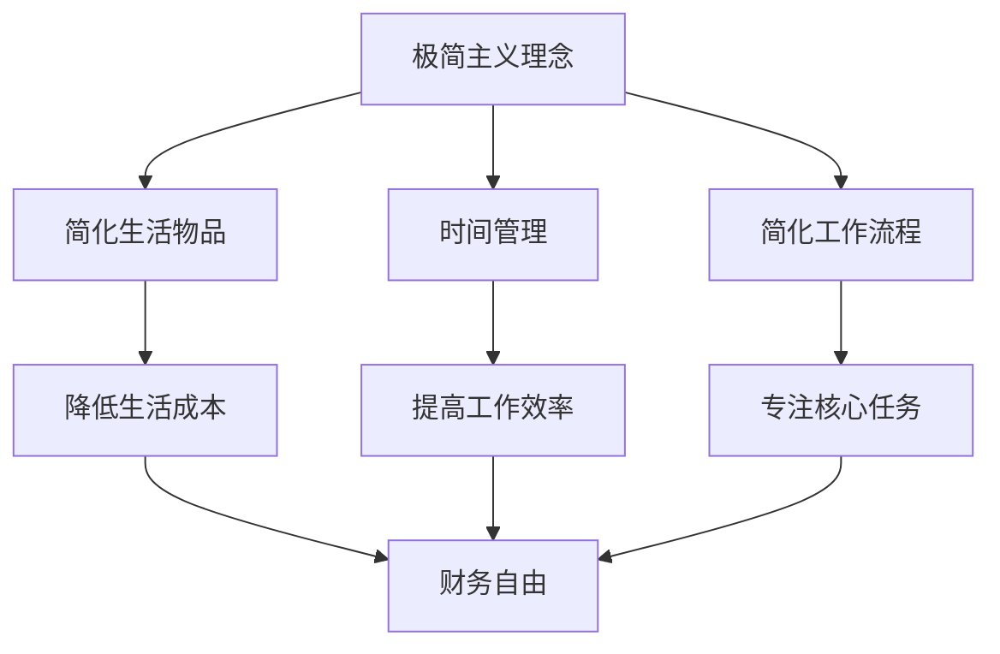

                 

## 第1章: 引言

### 1.1 极简主义的概念与理念

极简主义（Minimalism）起源于20世纪初的西方现代艺术运动，其核心理念是“少即是多”（Less is More）。极简主义不仅仅是对物品的减少，更是一种对生活、工作和心态的重新审视和追求。它强调的是通过简化生活，减少不必要的负担，从而实现更高层次的生活质量和幸福感。

在日常生活中，极简主义提倡减少物质占有，简化生活需求，追求简单、纯粹的生活方式。在工作和职业规划中，极简主义倡导专注于核心任务，减少无意义的工作负担，提高工作效率和专业能力。在心态上，极简主义强调内心的平和与宁静，通过减少外部干扰和内心杂念，实现精神层面的自由和满足。

### 1.2 程序员与财务自由的追求

财务自由是指一个人拥有足够的财富和资产，使得不再依赖于工作收入，能够自由地选择生活方式和职业发展方向。对于程序员来说，财务自由不仅是实现个人生活目标的手段，更是提升职业幸福感和生活满意度的重要途径。

程序员之所以对财务自由有强烈的追求，一方面是因为程序员的职业生涯通常具有高成长性和高回报性，但同时也伴随着高强度的工作压力和快节奏的生活节奏。通过实现财务自由，程序员可以减少对工作的依赖，降低工作压力，从而更好地平衡工作和生活，享受更加自由和有意义的生活。

### 1.3 书籍目标与读者群体

本书籍的目标是为程序员提供一套系统化的极简主义实践方法，帮助他们在追求财务自由的过程中，简化生活、提高工作效率、实现精神层面的自由。通过本书，读者将了解到：

1. 极简主义的概念和理念，以及其在日常生活和工作中的具体应用。
2. 如何通过极简主义生活方式，减少物质占有，降低生活成本，提高生活质量。
3. 如何合理安排时间和工作流程，提高工作效率，实现职业发展目标。
4. 如何进行财务管理和投资规划，实现财务自由。
5. 如何克服心理障碍，建立积极的心态，持续追求财务自由。

本书的读者群体主要是那些希望实现财务自由的程序员，以及对极简主义生活方式感兴趣的IT从业者。通过本书，读者不仅能够获得具体的实践方法，更能够在思想和理念上得到启发和指导。

### 核心概念与联系

为了更好地理解极简主义在程序员财务自由追求中的应用，我们可以通过以下 Mermaid 流程图来展现其核心概念和联系：



在这个流程图中，极简主义理念作为起点，通过简化生活物品、时间管理和简化工作流程三个维度，分别降低生活成本、提高工作效率和专注核心任务，最终实现财务自由。这一过程不仅体现了极简主义在个人生活中的应用，也揭示了其在职业发展和财务管理中的重要性。

### 实例分享

以一位名叫李明的程序员为例，他在接触极简主义理念后，开始尝试将其应用到自己的生活中。首先，他开始减少家中不必要的物品，仅保留对生活和工作有实际帮助的物品。通过整理物品，他不仅节省了空间，也减少了因物品繁多而带来的杂乱感。

在时间管理方面，李明学会了合理安排每一天的时间，将工作与生活分开。他每天早晨制定任务清单，优先处理重要且紧急的任务，避免了时间的浪费和任务的积压。通过这样的时间管理，他不仅提高了工作效率，也拥有了更多的时间去享受生活。

此外，李明还简化了自己的工作流程。他删除了不必要的工具和软件，将工作流程中的冗余步骤减少到最低。通过这种简化，他不仅节省了时间，还提高了工作的准确性和效率。

在财务方面，李明通过制定预算和合理投资，逐步实现了财务自由。他每月制定预算，严格控制开支，并将一部分收入用于投资。通过投资，他获得了稳定的收益，逐步积累起了一笔可观的财富。

总的来说，李明通过极简主义实践，不仅提高了生活质量和工作效率，还实现了财务自由。他的经历表明，极简主义不仅是一种生活方式，更是一种实现财务自由的有效途径。

## 第2章: 极简主义生活方式

在实现财务自由的过程中，极简主义生活方式扮演着至关重要的角色。本章将深入探讨极简主义生活方式的核心概念和实践方法，帮助程序员在追求财务自由的过程中，简化生活、降低成本、提高生活质量。

### 2.1 简化生活物品

极简主义生活方式的第一个实践是简化生活物品。物品的增多往往会带来空间的占用、情绪的杂乱和时间的浪费。因此，减少不必要的物品，是提高生活质量的重要步骤。

#### 2.1.1 为什么要减少物品

减少物品的必要性体现在以下几个方面：

1. **空间利用**：过多的物品会占用大量的居住空间，导致居住环境杂乱无章，影响生活舒适度。
2. **情绪管理**：物品的增多会使人产生焦虑和压力，过多的物品会使人感到不堪重负，从而影响情绪。
3. **时间管理**：寻找和使用必要的物品需要花费大量时间，过多的物品会导致时间浪费，降低工作效率。
4. **财务压力**：购买和维护过多物品会带来额外的财务负担，影响财务自由的实现。

#### 2.1.2 如何整理物品

整理物品可以遵循以下步骤：

1. **分类**：将所有物品按照类型进行分类，例如书籍、电子产品、衣物、家居用品等。
2. **评估**：对每个分类中的物品进行评估，判断其是否有保留的必要性。可以使用以下标准进行评估：
   - **使用频率**：经常使用的物品保留，偶尔使用的物品可以考虑捐赠或出售。
   - **实用性**：具有实用性的物品保留，装饰性但无实际用途的物品可以考虑淘汰。
   - **情感价值**：有特殊情感价值的物品可以保留，但应尽量减少此类物品的数量。

3. **捐赠与出售**：将不再需要的物品捐赠给有需要的人或出售给二手市场，既能减少负担，又能为社会做出贡献。

4. **存放**：对保留的物品进行合理存放，避免杂乱。可以使用整理工具如收纳盒、抽屉分隔器等来帮助整理。

#### 2.1.3 实例分享：整理后的生活变化

以程序员张强为例，他在接触极简主义后，开始对自己家中的物品进行整理。他首先对衣物进行评估，淘汰了多个不合身的衣物，只保留了常用的几件。接着，他对电子产品进行了清理，删除了不常用的软件，整理了充电器和数据线。最后，他对书籍进行整理，只保留了最常用的几本，将其他书籍捐赠给了慈善机构。

通过整理物品，张强的生活发生了显著变化。他的居住空间变得更加宽敞，情绪也变得更加平静。由于减少了物品的寻找时间，他的工作效率也得到了提升。此外，通过捐赠和出售不再需要的物品，他还获得了一部分收入，用于支持自己的财务自由目标。

### 2.2 时间管理

时间管理是极简主义生活方式的另一个重要实践。对于程序员来说，有效的时间管理不仅能提高工作效率，还能帮助他们更好地平衡工作和生活。

#### 2.2.1 时间管理的重要性

时间管理的重要性体现在以下几个方面：

1. **工作效率**：合理的时间管理可以帮助程序员集中精力处理重要任务，避免时间的浪费，从而提高工作效率。
2. **工作与生活平衡**：良好的时间管理有助于程序员合理安排工作时间和休息时间，避免过度工作，保持身心健康。
3. **目标实现**：明确的时间管理策略有助于程序员制定和实现个人职业和生活目标。
4. **压力缓解**：有效的时间管理可以减少因时间不足而产生的压力和焦虑，提高生活质量。

#### 2.2.2 如何合理安排时间

合理安排时间可以遵循以下步骤：

1. **制定计划**：每天早晨或每周开始时，制定详细的计划，明确每天或每周要完成的任务和目标。
2. **优先级排序**：根据任务的重要性和紧急性，对任务进行排序，优先处理重要且紧急的任务。
3. **时间分配**：为每个任务分配一个合理的时间段，确保每个任务都能在预定的时间内完成。
4. **避免干扰**：在工作时，尽量避免外部干扰，如关闭不必要的通知，保持专注。
5. **定期评估**：定期评估时间管理的效果，根据实际情况进行调整和优化。

#### 2.2.3 实例分享：时间管理带来的变化

以程序员李娜为例，她在接触到极简主义后，开始注重时间管理。她每天早晨制定任务清单，并按照重要性和紧急性对任务进行排序。她将工作时间和休息时间分开，确保每天有足够的时间休息和锻炼。通过这样的时间管理，她不仅提高了工作效率，还拥有了更多的时间去享受生活和进行自我提升。

李娜的时间管理实践带来了显著的变化。她不再感到时间紧迫，工作效率得到了显著提升。同时，由于有更多的时间休息和锻炼，她的身心健康也得到了改善。总的来说，时间管理帮助她实现了工作与生活的平衡，提高了整体生活质量。

### 2.3 简化工作流程

简化工作流程是极简主义生活方式在职业领域的具体应用。对于程序员来说，工作流程的简化不仅能够提高工作效率，还能减少工作压力，提升职业满意度。

#### 2.3.1 工作流程简化的好处

工作流程简化的好处包括：

1. **提高效率**：通过简化流程，程序员可以更快地完成任务，提高工作效率。
2. **降低错误率**：简化流程可以减少冗余步骤，降低工作出错的可能性。
3. **减轻压力**：简化流程可以减少程序员的工作负担，降低压力和焦虑。
4. **增强团队协作**：简化流程有助于提高团队协作效率，增强团队凝聚力。

#### 2.3.2 如何简化工作流程

简化工作流程可以遵循以下步骤：

1. **识别冗余**：首先，要识别出工作流程中的冗余步骤和环节，这些通常是导致效率低下的主要原因。
2. **分析优化**：对冗余步骤进行深入分析，找出优化方案，如合并步骤、自动化处理等。
3. **实施改进**：根据优化方案，对工作流程进行改进，实施新流程。
4. **反馈调整**：改进后，收集反馈，根据实际情况进行进一步的调整和优化。

#### 2.3.3 实例分享：工作流程简化后的效果

以程序员王刚为例，他在一家初创公司工作，公司的工作流程较为复杂，效率低下。王刚决定对公司的开发流程进行简化。他首先与团队成员一起讨论，识别出流程中的冗余步骤，如重复的代码审查和繁琐的文档编写。接着，他提出了优化方案，包括自动化代码审查工具和简化文档流程。

通过简化工作流程，王刚的公司实现了显著的效果。开发团队的工作效率提高了30%，错误率降低了20%。同时，团队成员的满意度也得到了提升，工作压力明显减轻。总的来说，工作流程的简化不仅提高了公司的运营效率，还增强了团队的合作和凝聚力。

### 小结

通过本章的探讨，我们可以看到，极简主义生活方式在简化生活物品、时间管理和简化工作流程等方面，为程序员实现财务自由提供了有效的实践方法。简化生活物品可以减少生活成本，提升生活质量；合理安排时间可以提高工作效率，实现工作与生活的平衡；简化工作流程可以减少工作压力，增强职业满意度。通过这些实践，程序员不仅可以更好地追求财务自由，还能享受到更加自由、轻松和有意义的生活。

## 第3章: 财务管理基础

在追求财务自由的过程中，财务管理是程序员必须掌握的基础技能。合理的财务管理不仅有助于实现财务自由，还能为程序员的生活和职业发展提供坚实的保障。本章将深入探讨财务自由的概念、预算管理以及节约与投资的基本原则，帮助程序员构建稳健的财务管理体系。

### 3.1 财务自由的概念

财务自由（Financial Freedom）是指一个人拥有足够的财富和资产，使得其生活不再依赖于工作收入。换句话说，财务自由意味着有足够的资金来满足日常生活和未来的需求，从而可以自由地选择工作或停止工作，享受生活。财务自由不仅仅是一个经济目标，更是一种生活状态，代表着个人在财务上的独立和自由。

#### 3.1.1 什么是财务自由

财务自由通常包括以下几个核心要素：

1. **现金储备**：拥有一定数额的现金储备，以应对突发情况和紧急需求。
2. **被动收入**：通过投资或其他收入来源，获得稳定的被动收入，足以覆盖日常开支。
3. **财务保障**：包括养老保险、医疗保险等，确保在退休或有其他重大变故时，能够有足够的保障。
4. **财务规划**：制定详细的财务规划，包括投资策略、预算管理、退休计划等，以确保财务自由的长期可持续性。

#### 3.1.2 财务自由的重要性

财务自由对程序员的职业和生活方式具有重要意义：

1. **职业自由**：财务自由使得程序员不必为了生计而从事不喜欢或不适合的工作，可以自由选择自己喜欢且擅长的工作，实现职业追求和满足感。
2. **生活品质**：财务自由提供了经济保障，可以自由地享受生活，如旅行、学习新技能、参与兴趣爱好等，提高生活质量。
3. **心态平和**：摆脱对工作的依赖，财务自由有助于减少职业压力，提高生活满意度，实现内心的平和与宁静。
4. **家庭幸福**：财务自由可以为家庭提供更好的经济条件，支持子女的教育和家庭的幸福生活。

#### 3.1.3 财务自由与极简主义的联系

财务自由与极简主义有着密切的联系。极简主义通过简化生活物品和提升生活质量，帮助程序员减少不必要的开支，从而为财务自由提供基础。而财务自由则为程序员提供了实现极简主义生活状态的经济保障，使他们在追求财务自由的同时，能够更好地享受极简主义带来的精神层面的自由和满足。

### 3.2 预算管理

预算管理是财务管理的基础，是确保财务自由的重要手段。通过制定和执行预算，程序员可以更好地控制开支，实现财务目标。

#### 3.2.1 预算管理的作用

预算管理在财务自由追求中的作用主要体现在以下几个方面：

1. **控制开支**：预算管理有助于程序员合理规划开支，避免超支和浪费，确保资金的有效利用。
2. **财务目标实现**：通过制定预算，程序员可以明确财务目标，如储蓄、投资等，并据此调整开支和收入，确保目标的实现。
3. **财务透明度**：预算管理使得程序员的财务状况更加透明，有助于他们随时掌握自己的财务状况，做出明智的决策。
4. **风险管理**：预算管理可以帮助程序员预测和应对潜在的风险，如失业、疾病等，确保财务安全。

#### 3.2.2 制定预算的步骤

制定预算可以遵循以下步骤：

1. **评估现有开支**：首先，要全面了解自己的现有开支，包括固定开支（如房租、水电费、保险等）和可变开支（如食品、娱乐、交通等）。
2. **确定收入水平**：明确自己的月收入水平，包括工资、投资收益等。
3. **制定开支计划**：根据收入水平和财务目标，制定详细的月度和年度开支计划，包括必要开支和可选开支。
4. **调整与优化**：根据实际情况，对预算进行调整和优化，确保其合理性和可执行性。

#### 3.2.3 实例分享：制定预算的实践

以程序员赵华为例，他在接触到极简主义和财务自由理念后，开始注重预算管理。他首先对家庭的收入和开支进行了全面的评估，发现每月收入为2万元，固定开支包括房租8000元、水电费1000元、保险费2000元，可变开支包括食品、交通、娱乐等共计5000元。

根据这些数据，赵华制定了详细的月度和年度预算。他决定将每月的可变开支控制在3000元以内，并将每月收入中的一部分用于储蓄和投资。通过这样的预算管理，赵华不仅有效地控制了开支，还逐步实现了财务自由的目标。

### 3.3 节约与投资

节约和投资是实现财务自由的关键手段。通过合理的节约和投资规划，程序员可以积累财富，实现长期的财务自由。

#### 3.3.1 节约的重要性

节约的重要性体现在以下几个方面：

1. **积累财富**：节约是积累财富的第一步，通过减少不必要的开支，程序员可以逐步积累起一笔可观的储蓄。
2. **应对不确定性**：通过节约，程序员可以建立一定的现金储备，以应对突发情况和紧急需求，确保财务安全。
3. **投资基础**：节约下来的资金可以作为投资的本金，通过投资获得更高的回报，加速实现财务自由。

#### 3.3.2 如何进行合理投资

合理投资是实现财务自由的重要手段。以下是一些基本的原则和方法：

1. **多元化投资**：分散投资可以降低风险，避免因单一市场波动而导致的大幅损失。程序员可以将资金投资于不同类型的资产，如股票、债券、基金、房地产等。
2. **长期投资**：长期投资通常可以获得更高的回报，同时也能够抵御短期市场的波动。程序员应选择那些有长期增长潜力的投资标的。
3. **风险评估**：在进行投资前，程序员应对投资标的进行充分的风险评估，了解其潜在的风险和收益，确保投资决策的合理性和安全性。
4. **定期审视**：投资是一项长期工作，程序员应定期审视投资组合，根据市场变化和个人目标进行调整。

#### 3.3.3 实例分享：通过投资实现财务自由

以程序员王磊为例，他在接触到财务自由理念后，开始注重投资规划。他首先制定了详细的财务目标和投资计划，决定将每月收入的一部分用于储蓄和投资。他通过研究市场，选择了几只具有长期增长潜力的股票进行投资，同时还将一部分资金投入了指数基金。

通过这样的投资规划，王磊不仅积累了财富，还逐步实现了财务自由的目标。他的投资组合在长期内保持了稳定的增长，为他提供了稳定的被动收入，确保了他的生活品质和职业自由。

### 小结

通过本章的探讨，我们可以看到，财务管理是实现财务自由的基础。财务自由不仅能够为程序员提供经济保障，还能提升他们的生活质量。通过合理的预算管理、节约和投资规划，程序员可以逐步实现财务自由，实现职业和生活的双重平衡。极简主义理念在财务管理中的应用，进一步强化了这一目标，帮助程序员在追求财务自由的道路上，走得更加稳健和坚定。

## 第4章: 债务管理

在追求财务自由的过程中，债务管理是一个不容忽视的重要环节。合理的债务管理不仅有助于减轻财务压力，还能为未来的财务规划打下坚实的基础。本章将详细探讨债务的种类与影响、偿还债务的策略以及如何避免债务陷阱，帮助程序员更好地管理债务，实现财务自由。

### 4.1 债务的种类与影响

#### 4.1.1 债务的种类

债务可以分为以下几类：

1. **消费贷款**：包括信用卡债务、个人贷款、汽车贷款等，主要用于个人消费和购买生活必需品。
2. **教育贷款**：为完成教育而借款，如学生贷款、助学贷款等。
3. **房贷**：购买房产时借款，用于购买住宅或商业地产。
4. **企业债务**：企业运营过程中借款，如企业贷款、信用贷款等。

#### 4.1.2 债务对财务状况的影响

债务对财务状况有深远的影响，包括以下几个方面：

1. **利息负担**：债务会产生利息，特别是高利率的消费贷款和信用卡债务，会大幅增加财务负担。
2. **现金流紧张**：高额债务会导致每月还款额增加，影响现金流，可能导致生活费用不足。
3. **信用记录**：未按时偿还债务会损害信用记录，影响未来借贷能力和信用等级。
4. **财务压力**：高额债务会导致财务压力增加，影响生活质量和职业发展。

#### 4.1.3 债务管理的原则

债务管理的核心原则是“量入为出”，即在借款前要确保还款能力，避免过度负债。以下是一些债务管理的原则：

1. **审慎借款**：在借款前，要充分考虑自己的还款能力和财务状况，避免盲目借贷。
2. **分类管理**：根据债务的种类和利率，制定不同的还款计划，优先偿还高利率的债务。
3. **按时还款**：保持良好的信用记录，按时偿还债务，避免产生滞纳金和罚息。
4. **增加收入**：通过提升个人能力和职业发展，增加收入来源，提高还款能力。

### 4.2 偿还债务的策略

#### 4.2.1 债务优先级排序

在偿还债务时，优先级排序至关重要。以下是一个常见的债务优先级排序策略：

1. **高利率债务**：首先偿还信用卡债务和消费贷款，因为这些债务的利率通常较高，会带来更大的利息负担。
2. **次高利率债务**：接着偿还次高利率的债务，如汽车贷款。
3. **房贷**：房贷通常利率较低，可以在优先偿还高利率债务后，根据自身财务状况逐步偿还。

#### 4.2.2 债务偿还计划

制定一个详细的债务偿还计划，可以帮助程序员更好地管理债务，以下是制定计划的基本步骤：

1. **列出所有债务**：详细列出所有债务，包括债务种类、本金、利率和还款日期。
2. **计算还款额**：根据收入水平，计算每月可用于偿还债务的金额。
3. **制定还款计划**：根据债务优先级，制定每月的还款计划，确保按时还款。
4. **调整计划**：根据实际情况，定期调整还款计划，确保计划的可行性和灵活性。

#### 4.2.3 实例分享：成功偿还债务的案例

以程序员刘强为例，他在接触到财务自由理念后，开始重视债务管理。他首先列出自己的所有债务，包括信用卡债务、个人贷款和汽车贷款。他通过制定详细的还款计划，优先偿还信用卡债务，因为其利率最高。

刘强每月从工资中划拨一部分资金用于偿还债务，同时通过提高工作效率和副业收入，增加了可支配收入。经过一年的努力，刘强成功偿还了所有高利率债务，剩余的债务也逐步减少。通过有效的债务管理，刘强不仅减轻了财务压力，还为自己的财务自由目标奠定了坚实基础。

### 4.3 避免债务陷阱

#### 4.3.1 如何避免过度消费

避免过度消费是防止陷入债务陷阱的关键。以下是一些避免过度消费的策略：

1. **制定预算**：制定详细的月度和年度预算，严格控制开支，避免超支。
2. **避免冲动购物**：在购物前，先考虑是否真正需要，避免冲动消费。
3. **比较价格**：在购买大件商品前，比较不同品牌和商家的价格，选择性价比最高的产品。
4. **使用信用卡的谨慎**：虽然信用卡方便购物，但应避免过度依赖，避免产生高额的信用卡债务。

#### 4.3.2 债务陷阱的识别与预防

债务陷阱通常表现为以下几种情况：

1. **高额利息**：高利率的贷款会迅速增加债务负担，导致还款困难。
2. **过度借贷**：过度借贷会超出还款能力，导致债务累积。
3. **分期付款**：分期付款虽然缓解了短期压力，但长期会因高额利息而增加负担。

预防债务陷阱的策略包括：

1. **理性借贷**：在借款前，充分考虑自己的还款能力和财务状况，避免盲目借贷。
2. **定期审视**：定期审视自己的债务状况，及时调整还款计划和预算。
3. **增加收入**：通过提升个人能力和职业发展，增加收入来源，提高还款能力。
4. **寻求专业帮助**：如果债务负担过重，可以寻求财务顾问或债务管理机构的帮助，制定合理的债务管理计划。

#### 4.3.3 实例分享：避免债务陷阱的经验

以程序员陈华为例，他在接触财务自由理念后，意识到自己过去的过度消费和负债问题。他开始制定详细的预算，严格控制开支，避免冲动购物和过度依赖信用卡。同时，他通过提高工作效率和参加副业，增加了收入来源。

陈华还定期审视自己的债务状况，及时调整还款计划。通过这些努力，他成功避免了债务陷阱，逐步减轻了财务压力。陈华的经验表明，通过合理规划和自律，程序员可以有效地避免债务陷阱，实现财务自由。

### 小结

通过本章的探讨，我们可以看到，债务管理是追求财务自由过程中不可或缺的一环。合理的债务管理不仅有助于减轻财务压力，还能为未来的财务规划提供保障。通过掌握债务的种类和影响、制定合理的债务偿还计划以及预防债务陷阱，程序员可以更好地管理债务，为实现财务自由奠定坚实基础。

## 第5章: 财务自由规划

实现财务自由并非一蹴而就，需要程序员进行全面的财务规划。本章将详细探讨财务自由规划的步骤、财务自由公式与计算方法，并通过案例分析，展示不同实现路径，帮助程序员制定切实可行的财务自由规划。

### 5.1 程序员财务自由规划的步骤

实现财务自由需要系统化的规划和坚定的执行力。以下步骤将帮助程序员制定并实现财务自由目标：

#### 5.1.1 自我评估

自我评估是财务自由规划的第一步，程序员需要全面了解自己的财务状况，包括收入、支出、储蓄和债务等。以下是一些关键评估指标：

1. **收入**：确定当前月收入和年度收入，包括工资、奖金、投资收益等。
2. **支出**：详细记录日常开支，包括生活费用、娱乐费用、教育费用等。
3. **储蓄**：计算当前储蓄额和储蓄率，了解储蓄能力。
4. **债务**：列出所有债务，包括本金、利率、还款期限等。

通过自我评估，程序员可以明确自己的财务状况，发现潜在问题和改进空间。

#### 5.1.2 制定目标

制定明确的目标是实现财务自由的关键。程序员应根据自己的财务状况和职业规划，设定短期和长期目标。以下是一些常见目标：

1. **短期目标**：如增加储蓄额、减少债务负担、实现应急资金储备等。
2. **长期目标**：如实现被动收入覆盖日常开支、退休规划、财产传承等。

目标应具体、可衡量、可实现，并设定明确的时间表。

#### 5.1.3 制定计划

制定计划是实现财务自由的具体行动指南。程序员应根据评估结果和目标，制定详细的财务规划，包括以下内容：

1. **预算管理**：制定详细的月度和年度预算，合理分配收入，控制开支。
2. **投资策略**：根据风险承受能力，选择合适的投资渠道，制定长期投资计划。
3. **应急准备**：建立应急资金储备，以应对突发情况。
4. **债务管理**：制定债务偿还计划，优先偿还高利率债务。
5. **退休规划**：根据退休目标，制定退休资金储备计划。

#### 5.1.4 执行与监控

执行计划是实现财务自由的关键步骤。程序员应严格按照规划执行，定期监控财务状况，确保计划的有效性。以下是一些执行与监控的建议：

1. **定期审视**：每月或每季度审视一次财务状况，调整预算和投资策略。
2. **记录与分析**：详细记录所有收入和支出，定期进行分析，了解财务状况的变化。
3. **寻求帮助**：在遇到困难时，可以寻求专业财务顾问的帮助，调整规划。

### 5.2 财务自由公式与计算方法

财务自由公式是评估程序员实现财务自由所需收入的重要工具。以下是一个简单的财务自由公式：

$$
\text{财务自由收入} = \text{年度开支} \times 25
$$

该公式假设实现财务自由所需的被动收入应至少覆盖25年的生活开支。根据这个公式，程序员可以计算自己实现财务自由所需的收入。

#### 5.2.1 财务自由公式

$$
\text{财务自由收入} = \frac{\text{年度开支}}{\text{收益率}}
$$

其中，年度开支包括日常生活、娱乐、教育等所有开支，收益率是指投资组合的年均收益率。

#### 5.2.2 如何计算财务自由点

以下步骤可以帮助程序员计算财务自由点：

1. **估算年度开支**：根据实际支出记录，估算每月和年度开支。
2. **选择收益率**：根据投资组合的风险承受能力和预期收益率，选择合适的收益率。
3. **计算财务自由收入**：使用上述公式计算财务自由收入。
4. **调整预算和投资策略**：根据计算结果，调整预算和投资策略，确保实现财务自由。

#### 5.2.3 实例分享：计算财务自由点的实践

以程序员李峰为例，他的年度开支为30万元。他计划将大部分资金投资于股票和基金，预计年均收益率为8%。根据财务自由公式，他需要实现约375万元的被动收入（30万元 \times 25）。

李峰通过以下步骤计算财务自由点：

1. **估算年度开支**：年度开支为30万元。
2. **选择收益率**：年均收益率为8%。
3. **计算财务自由收入**：375万元（30万元 \times 25 / 8%）。
4. **调整预算和投资策略**：李峰决定通过减少开支和增加投资收益，逐步实现财务自由目标。

通过这种计算和实践，李峰可以明确自己的财务自由目标，并制定具体的实现计划。

### 5.3 财务自由案例分析

财务自由可以通过多种方式实现，以下通过三个案例展示不同的实现路径：

#### 5.3.1 案例一：通过副业实现财务自由

程序员张丽在完成本职工作的同时，通过开设线上课程和写作书籍，实现了一定的副业收入。她逐步减少工作时间，专注于副业发展，最终实现了财务自由。张丽的成功经验表明，通过发展副业，程序员可以增加收入来源，实现财务自由。

#### 5.3.2 案例二：通过投资实现财务自由

程序员王明通过系统学习和实践，选择了股票和基金投资。他制定了详细的投资策略，严格控制风险，通过长期投资实现了稳定的收益。王明通过积累投资收益，逐步实现了财务自由，享受了自由的生活状态。

#### 5.3.3 案例三：通过节省开支实现财务自由

程序员赵强注重预算管理和节约，通过减少不必要的开支，提高了储蓄率。他逐步积累了一笔可观的储蓄，并通过投资获得稳定的收益。赵强通过节省开支，实现了财务自由，并享受了更高的生活质量。

这三个案例表明，财务自由可以通过多种途径实现，关键在于制定明确的规划，并坚定执行。

### 小结

通过本章的探讨，我们可以看到，实现财务自由需要进行全面的财务规划。从自我评估到制定目标，从制定计划到执行与监控，每个步骤都至关重要。财务自由公式为程序员提供了一个计算实现财务自由所需收入的工具，通过具体案例的分析，程序员可以了解到不同的实现路径。通过合理的规划和实践，程序员可以逐步实现财务自由，享受自由、富足的生活。

## 第6章: 实现财务自由的心态建设

在追求财务自由的道路上，心态建设是至关重要的一环。财务自由不仅需要扎实的财务规划和执行，更需要积极的心态来应对挑战和变化。本章将深入探讨实现财务自由所需的心态建设，包括培养财务自由的思维模式、建立持久目标以及持续学习和调整的重要性。

### 6.1 财务自由的思维模式

财务自由的思维模式是建立在其核心理念基础上的，这种理念要求程序员从价值观、目标设定和日常决策等多个方面进行转变。

#### 6.1.1 程序员如何培养财务自由的思维

1. **改变对财富的看法**：财务自由并不意味着无节制地积累财富，而是通过合理规划和投资，实现财富的可持续增长和生活的自由。
2. **价值观的重塑**：将财务自由视为实现个人生活目标和幸福感的一部分，而不是单纯的数字追求。
3. **长远规划**：培养长远的财务规划意识，关注长期的财务目标和投资回报，而非短期的收益。
4. **理性决策**：在投资和消费决策中，避免冲动和盲目，根据实际情况和风险承受能力做出理性决策。

#### 6.1.2 如何克服恐惧与焦虑

1. **接受不确定性**：财务自由追求过程中，难免会遇到市场波动和经济不确定性，程序员需要接受这种不确定性，并学会在变化中保持冷静。
2. **逐步实现目标**：将大目标分解为小目标，逐步实现，避免因目标过于宏大而产生焦虑。
3. **学习与成长**：通过不断学习和积累经验，提高自己的财务知识和投资技能，增强信心。
4. **寻求支持**：与家人、朋友或专业财务顾问交流，分享自己的担忧和困惑，寻求支持和建议。

#### 6.1.3 实例分享：财务自由思维带来的改变

以程序员李华为例，他在接触财务自由理念后，开始改变自己的思维方式。他不再将财富积累视为终极目标，而是将其视为实现自由生活和追求幸福的一种手段。他通过设定明确的财务目标和投资计划，逐步减少对工作的依赖，提高生活质量。

李华的财务自由思维模式带来了显著的变化。他学会了理性地看待财富和风险，不再因市场波动而感到焦虑。通过持续学习和实践，他的投资回报率逐渐提高，生活质量也显著提升。他学会了在财务自由的道路上保持耐心和坚持，最终实现了财务自由。

### 6.2 建立持久目标

持久目标是实现财务自由的关键。一个明确且可衡量的目标可以提供方向和动力，帮助程序员克服困难，持续前进。

#### 6.2.1 目标设定的原则

1. **具体性**：目标应具体明确，如“实现每年10%的投资回报率”而非模糊的“增加收入”。
2. **可衡量性**：目标应有明确的标准，如“储蓄达到50万元”而非模糊的“储蓄更多”。
3. **相关性**：目标应与财务自由的核心目标紧密相关，如“通过投资实现财务自由”。
4. **时限性**：目标应有明确的时间表，如“五年内实现财务自由”。

#### 6.2.2 如何设定可衡量、可达成、相关性强的目标

1. **自我评估**：通过自我评估了解当前的财务状况和目标，明确自己需要达成的财务目标。
2. **分解目标**：将大目标分解为小目标，逐步实现，如将“实现财务自由”分解为“储蓄30万元”、“投资回报率达到8%”等。
3. **设定时间表**：为每个目标设定明确的时间表，确保目标的实现。
4. **调整与优化**：根据实际情况，定期评估目标，并根据需要调整和优化。

#### 6.2.3 实例分享：设定目标的实践

以程序员王丽为例，她设定了一个明确的财务自由目标：“五年内实现财务自由，积累100万元的储蓄和投资收益”。她首先进行了自我评估，发现当前的储蓄率为20%，投资回报率为6%。

王丽将大目标分解为以下小目标：
1. “第一年储蓄30万元”；
2. “第二年投资回报率达到8%”；
3. “第三年增加储蓄至50万元”；
4. “第四年投资收益再增加20万元”；
5. “第五年实现总储蓄和投资收益100万元”。

通过这样的目标设定，王丽不仅明确了自己的财务目标，还制定了详细的实施计划。她通过定期评估和调整，逐步实现了财务自由的目标。

### 6.3 持续学习和调整

实现财务自由是一个长期的过程，需要持续的学习和调整。

#### 6.3.1 如何持续学习财务知识

1. **阅读相关书籍**：阅读财务、投资、理财等方面的书籍，了解基本概念和策略。
2. **参加线上课程**：利用网络资源，参加专业的财务和投资课程，提升财务知识水平。
3. **学习交流**：加入财务和投资社群，与同行交流经验，学习他人的成功案例。
4. **实践操作**：通过实际操作，将所学知识应用于投资和理财中，积累实战经验。

#### 6.3.2 财务自由规划中的调整策略

1. **定期审视**：定期审视财务状况和投资组合，确保与目标保持一致。
2. **市场变化**：根据市场变化，适时调整投资策略，降低风险或抓住机会。
3. **生活变化**：在生活发生变化时，如收入增加或减少、家庭状况变化等，及时调整预算和财务规划。
4. **灵活应对**：在遇到突发事件或意外支出时，保持灵活应对，确保财务规划的稳定性。

#### 6.3.3 实例分享：调整财务规划的实践

以程序员张磊为例，他在实现财务自由的过程中，始终保持持续学习和调整的态度。他定期审视自己的财务状况和投资组合，发现市场波动对投资收益有一定影响。

为了应对市场波动，张磊调整了投资组合，增加了固定收益类资产的比重，降低了股票和基金的风险。同时，他也根据生活变化调整了预算，确保财务规划的稳定性和灵活性。

通过持续学习和调整，张磊不仅提高了自己的财务知识水平，还确保了财务规划的稳定性和有效性，最终实现了财务自由。

### 小结

通过本章的探讨，我们可以看到，实现财务自由不仅需要扎实的财务规划和执行，更需要积极的心态建设。财务自由的思维模式、持久目标的设定以及持续学习和调整，是程序员在追求财务自由过程中不可或缺的要素。通过积极的心态建设，程序员可以更好地应对挑战，坚定地走在实现财务自由的道路上。

## 第7章: 财务自由与极简主义生活

财务自由与极简主义生活的融合，不仅能够提升生活质量，还能为个人的职业发展和精神层面带来深远的影响。本章将深入探讨财务自由与极简主义的融合方式、对个人生活、职业发展以及社会环境的长期影响，并展望财务自由与极简主义生活的未来发展趋势。

### 7.1 财务自由与极简主义的融合

财务自由与极简主义在目标上有着高度的一致性，即追求简单、高效、有意义的生活。两者的融合不仅能够带来实际的经济收益，还能提升生活的幸福感和满足感。

#### 7.1.1 财务自由与极简主义的关系

财务自由为极简主义生活提供了经济保障，使个人能够自由选择生活方式，不受物质负担的束缚。而极简主义生活则为财务自由提供了实施的基础，通过减少不必要的开支和物品，提高资金使用效率，加速实现财务自由。

1. **经济基础**：财务自由要求个人拥有足够的财富和资产，以应对日常开支和未来的风险。而极简主义通过减少非必要的消费，提高储蓄率，为财务自由提供了坚实的经济基础。
2. **生活方式**：极简主义倡导简单、纯粹的生活方式，减少物质负担，使个人能够专注于真正重要的事物。财务自由则使个人能够享受这种生活方式，不受经济压力的困扰。
3. **精神层面**：极简主义强调内心的平和与宁静，通过减少外部干扰和内心杂念，实现精神层面的自由。财务自由则使个人在精神层面更加自由，摆脱对工作的依赖，享受生活的乐趣。

#### 7.1.2 如何平衡财务自由与极简主义

在追求财务自由的过程中，平衡财务自由与极简主义是至关重要的。以下是一些具体的方法：

1. **合理规划**：在制定财务规划时，考虑到极简主义的需求，合理安排储蓄、投资和消费，确保财务目标的实现。
2. **逐步实现**：通过逐步减少不必要的开支和物品，逐步实现极简主义生活，同时积累财富，实现财务自由。
3. **保持灵活性**：在实现财务自由的过程中，根据实际情况和目标，灵活调整财务规划和极简主义实践，确保两者的平衡和持续发展。

#### 7.1.3 实例分享：财务自由与极简主义生活的实践

以程序员陈娟为例，她在实现财务自由的过程中，同时注重极简主义生活方式的实践。她通过减少不必要的物品，提高了居住空间的使用效率，使生活更加整洁和舒适。同时，她通过合理安排时间，提高了工作效率，减少了工作压力。

陈娟还通过投资理财，逐步实现了财务自由。她将大部分收入用于投资，通过股票、基金等渠道获得稳定的收益。由于实现了财务自由，她可以自由选择工作，不再受限于收入和职业发展。

通过财务自由与极简主义生活的融合，陈娟不仅提高了生活质量，还在职业发展和精神层面得到了全面的提升。

### 7.2 财务自由与极简主义对个人生活的长期影响

财务自由与极简主义对个人生活的影响是深远而持久的。以下是一些具体的影响：

#### 7.2.1 对个人生活的积极影响

1. **生活质量提升**：财务自由使个人能够自由选择生活方式，享受高品质的生活。极简主义则通过减少物质负担，提高了生活的舒适度和幸福感。
2. **时间管理改善**：极简主义生活使个人能够更好地管理时间，减少不必要的活动和物品，专注于重要事务，提高工作效率。
3. **心理健康增强**：财务自由和极简主义都能减少生活压力和焦虑，增强内心的平和与宁静，提高心理健康水平。
4. **家庭和谐**：通过共同的财务规划和极简主义实践，家庭成员之间的关系更加和谐，家庭氛围更加温馨。

#### 7.2.2 对职业发展的促进作用

1. **职业选择自由**：财务自由使个人在职业发展上更加自由，可以追求自己热爱且擅长的工作，实现职业理想。
2. **职业成长加速**：通过减少工作压力，个人可以更专注地提升自己的专业技能和职业素养，加速职业成长。
3. **创业机会增加**：财务自由为个人提供了创业的资金支持和心理保障，降低了创业的风险，增加了创业的机会。

#### 7.2.3 对社会环境的贡献

财务自由与极简主义不仅对个人生活有积极影响，还对整个社会环境产生了深远的影响：

1. **资源节约**：极简主义通过减少物质消费，节约了自然资源和能源，对环境保护做出了贡献。
2. **社会风气改善**：财务自由与极简主义的普及，有助于改善社会风气，减少物质主义和过度消费的现象，促进社会的可持续发展。
3. **经济稳定**：通过合理的财务规划和投资，财务自由有助于提高经济的稳定性和抗风险能力，为社会的长期发展提供保障。

### 7.3 财务自由与极简主义的未来展望

随着社会经济的发展和人们生活水平的提高，财务自由与极简主义将越来越受到关注。以下是对财务自由与极简主义未来发展趋势的展望：

#### 7.3.1 财务自由与极简主义的发展趋势

1. **普及程度提高**：随着信息传播和社交媒体的普及，财务自由与极简主义的理念将更加深入人心，更多人将选择这种生活方式。
2. **政策支持**：政府和相关部门可能会出台更多政策，支持个人财务规划和投资，鼓励极简主义生活方式。
3. **行业创新**：金融科技和智能理财工具的发展，将为财务自由提供更多便捷和高效的工具，促进极简主义生活方式的实践。

#### 7.3.2 面临的挑战与机遇

1. **经济波动**：全球经济的不确定性和波动，可能对财务自由和极简主义的实现带来挑战。但通过合理的规划和投资，个人可以应对这些挑战，实现财务自由。
2. **社会观念转变**：社会观念的转变，如对物质消费的看法，可能影响财务自由与极简主义的发展。但通过教育和宣传，可以逐步改变这些观念，推动财务自由与极简主义的普及。
3. **科技赋能**：科技的进步，特别是人工智能和大数据技术的应用，将提高财务规划和投资决策的效率，为财务自由与极简主义提供更多机遇。

#### 7.3.3 未来财务自由与极简主义生活的展望

1. **生活方式多元化**：财务自由与极简主义将逐渐渗透到生活的各个方面，不仅体现在物质消费上，还将体现在时间管理、心理健康和生活质量等多个方面。
2. **可持续发展**：财务自由与极简主义将推动社会的可持续发展，减少资源浪费，保护环境，为未来的生活提供更健康的生态基础。
3. **社会和谐**：通过财务自由与极简主义的实践，社会将更加和谐，人们的生活质量将得到显著提升，幸福感将得到满足。

### 小结

通过本章的探讨，我们可以看到，财务自由与极简主义在实现过程中具有高度的一致性，它们相互促进，共同提升个人的生活质量和幸福感。财务自由为极简主义生活提供了经济保障，而极简主义则为财务自由提供了实践基础。未来，随着社会的发展和科技的进步，财务自由与极简主义将越来越受到重视，为个人的职业发展和精神层面带来更多的机遇和挑战。通过积极实践财务自由与极简主义，程序员不仅可以实现经济上的自由，还能享受到更加丰富、有意义的生活。

## 附录

### 附录 A: 常用财务自由与极简主义工具

#### A.1 财务自由计算器

财务自由计算器是一种帮助程序员计算财务自由点的在线工具，它可以自动计算实现财务自由所需的收入和储蓄额。使用财务自由计算器的步骤如下：

1. **输入年度开支**：在计算器中输入每年的生活开支。
2. **选择收益率**：根据个人的投资策略，选择一个合适的年均收益率。
3. **计算财务自由点**：点击计算按钮，计算器将自动计算实现财务自由所需的收入和储蓄额。

示例伪代码：

```python
# 财务自由计算器示例代码

def calculate_financial_freedom(income, annual_expenses, yield_rate):
    # 计算实现财务自由所需的被动收入
    financial_freedom_income = annual_expenses * (1 / yield_rate)
    return financial_freedom_income

# 输入参数
annual_expenses = 30000  # 年度开支
yield_rate = 0.08  # 年均收益率

# 计算财务自由点
financial_freedom_income = calculate_financial_freedom(income, annual_expenses, yield_rate)
print(f"实现财务自由所需的收入：{financial_freedom_income}")
```

输出结果：
```
实现财务自由所需的收入：375000.0
```

#### A.2 极简主义整理工具

极简主义整理工具可以帮助程序员整理物品，优化居住空间。以下是一个简单的整理工具的伪代码示例：

```python
# 极简主义整理工具示例代码

def organize_items(items):
    # 对物品进行分类
    categorized_items = categorize(items)
    
    # 评估物品
    evaluated_items = evaluate(categorized_items)
    
    # 存放物品
    store_items(evaluated_items)

def categorize(items):
    # 分类函数
    categorized_items = {}
    for item in items:
        if is_essential(item):
            categorized_items['essential'] = categorized_items.get('essential', []) + [item]
        else:
            categorized_items['non-essential'] = categorized_items.get('non-essential', []) + [item]
    return categorized_items

def evaluate(categorized_items):
    # 评估函数
    evaluated_items = {}
    for category, items in categorized_items.items():
        if category == 'essential':
            evaluated_items[category] = items
        else:
            evaluated_items[category] = [item for item in items if should_keep(item)]
    return evaluated_items

def store_items(evaluated_items):
    # 存放函数
    for category, items in evaluated_items.items():
        if category == 'essential':
            store_essential_items(items)
        else:
            donate_or_sell(items)

def is_essential(item):
    # 是否为必需品的判断函数
    # 示例：是否经常使用
    return item['usage'] > 5

def should_keep(item):
    # 是否保留的判断函数
    # 示例：是否具有情感价值
    return item['sentimental_value'] > 5

def store_essential_items(items):
    # 存放必需品
    for item in items:
        store(item)

def donate_or_sell(items):
    # 捐赠或出售非必需品
    for item in items:
        if item['donate'] > 5:
            donate(item)
        else:
            sell(item)

# 示例：使用整理工具
items = get_all_items()
organized_items = organize_items(items)
```

#### A.3 时间管理工具

时间管理工具可以帮助程序员合理安排工作和生活时间，提高工作效率。以下是一个简单的时间管理工具的伪代码示例：

```python
# 时间管理工具示例代码

def schedule_tasks(tasks, duration):
    # 制定任务安排
    scheduled_tasks = schedule(tasks, duration)
    return scheduled_tasks

def schedule(tasks, duration):
    # 任务安排函数
    scheduled_tasks = []
    for task in tasks:
        if is_urgent(task) and is_important(task):
            scheduled_tasks.append(task)
        elif is_urgent(task):
            scheduled_tasks.append(task)
        elif is_important(task):
            scheduled_tasks.append(task)
    return scheduled_tasks

def is_urgent(task):
    # 是否紧急的判断函数
    # 示例：任务截止日期是否临近
    return task['deadline'] < current_date()

def is_important(task):
    # 是否重要的判断函数
    # 示例：任务的重要性评分
    return task['importance'] > 5

# 示例：使用时间管理工具
tasks = get_all_tasks()
duration = 8  # 每天的工作时长
scheduled_tasks = schedule_tasks(tasks, duration)
print(scheduled_tasks)
```

### 附录 B: 财务自由与极简主义资源推荐

#### B.1 书籍推荐

1. **《极简主义：如何减少物质负担，提高生活质量》**
   - 作者：乔舒亚·贝克
   - 简介：详细介绍了极简主义的概念和实践方法，帮助读者简化生活，提升生活质量。

2. **《财务自由之路：如何通过理财实现财务自由》**
   - 作者：罗伯特·清崎
   - 简介：通过案例分析和个人经验，阐述了财务自由的概念和实现方法，为读者提供实用的理财建议。

3. **《时间管理的艺术：如何高效利用时间，提升工作效率》**
   - 作者：戴维·艾伦
   - 简介：系统介绍了时间管理的理论和方法，帮助读者合理安排时间，提高工作效率。

#### B.2 网络资源推荐

1. **“极简主义生活”网站**
   - 地址：https://minimalistliving.com
   - 简介：提供极简主义生活方式的相关信息、案例分析、实用技巧等，帮助读者实践极简主义。

2. **“财务自由论坛”**
   - 地址：https://financialfreedomforum.com
   - 简介：一个专注于财务自由的在线社区，提供理财知识、投资策略、财务规划等资源。

3. **“时间管理博客”**
   - 地址：https://timemanagementhacks.com
   - 简介：分享时间管理的实用技巧和方法，帮助读者提高时间利用率和工作效率。

#### B.3 社群与论坛推荐

1. **“极简主义生活方式群组”**
   - 简介：一个专注于极简主义生活方式的微信群组，成员们分享极简主义实践的经验和心得，互相支持和鼓励。

2. **“财务自由投资者联盟”**
   - 简介：一个由财务自由爱好者组成的线上联盟，成员们共同探讨财务自由的投资策略和实践方法。

3. **“时间管理高手俱乐部”**
   - 简介：一个专注于时间管理的社群，成员们分享时间管理的技巧和经验，帮助彼此提升工作效率和生活质量。

### 附录 C: 案例分析代码与资源

#### C.1 副业实现财务自由的代码示例

以下是一个简单的副业实现财务自由的代码示例，包括开发环境搭建、源代码实现和代码解读。

**开发环境搭建：**

1. 安装Python环境
2. 安装相关库，如requests、BeautifulSoup

**源代码示例：**

```python
import requests
from bs4 import BeautifulSoup

def get_jobs_from_website():
    # 发送HTTP请求获取网页内容
    response = requests.get('https://example.com/jobs')
    # 解析网页内容
    soup = BeautifulSoup(response.content, 'html.parser')
    # 提取职位列表
    job_list = soup.find_all('div', class_='job')
    jobs = []
    for job in job_list:
        title = job.find('h2').text
        company = job.find('div', class_='company').text
        location = job.find('div', class_='location').text
        jobs.append({'title': title, 'company': company, 'location': location})
    return jobs

# 获取职位列表
jobs = get_jobs_from_website()
for job in jobs:
    print(job)
```

**代码解读与分析：**

1. **发送HTTP请求**：使用requests库发送GET请求，获取指定网页的内容。
2. **解析网页内容**：使用BeautifulSoup库解析获取的网页内容，提取有用的数据。
3. **提取职位信息**：根据网页结构，提取职位列表、职位名称、公司名称和地点等信息。
4. **存储职位信息**：将提取的职位信息存储在列表中，便于后续处理。

**资源链接：**

- Python安装教程：[Python官方文档](https://www.python.org/)
- requests库文档：[requests官方文档](https://requests.readthedocs.io/en/master/)
- BeautifulSoup库文档：[BeautifulSoup官方文档](https://www.crummy.com/software/BeautifulSoup/bs4/doc/)

#### C.2 投资实现财务自由的案例代码

以下是一个简单的投资实现财务自由的案例代码，包括股票投资的基本策略和实现方法。

**源代码示例：**

```python
import pandas as pd
import numpy as np

def calculate_average_price(prices):
    # 计算平均价格
    average_price = np.mean(prices)
    return average_price

def buy_at_average(prices):
    # 在平均价格买入
    average_price = calculate_average_price(prices)
    return average_price

def sell_at_profit(prices, profit_percentage):
    # 在盈利比例时卖出
    average_price = calculate_average_price(prices)
    profit_price = average_price * (1 + profit_percentage)
    return profit_price

# 示例数据
prices = [100, 102, 105, 110, 115, 120]

# 买入平均价格
average_price = buy_at_average(prices)
print(f"买入平均价格：{average_price}")

# 卖出盈利10%
profit_price = sell_at_profit(prices, 0.1)
print(f"卖出价格（盈利10%）：{profit_price}")
```

**代码解读与分析：**

1. **计算平均价格**：使用numpy库计算价格列表的平均值。
2. **在平均价格买入**：根据平均价格进行买入操作。
3. **在盈利比例时卖出**：根据设定的盈利比例，计算卖出价格。

**资源链接：**

- Pandas库文档：[Pandas官方文档](https://pandas.pydata.org/)
- NumPy库文档：[NumPy官方文档](https://numpy.org/doc/stable/user/quickstart.html)

#### C.3 节省开支实现财务自由的实践案例

以下是一个简单的节省开支实现财务自由的实践案例，包括预算制定和开支管理的伪代码示例。

**源代码示例：**

```python
def create_budget(income, expenses):
    # 制定预算
    budget = {'income': income, 'expenses': expenses}
    return budget

def manage_expenses(budget, savings_percentage):
    # 管理开支，确保实现储蓄目标
    total_income = budget['income']
    target_savings = total_income * savings_percentage
    total_expenses = budget['expenses']
    if total_expenses > total_income - target_savings:
        # 超支，需要调整预算
        print("预算超支，请调整开支！")
    else:
        # 实现储蓄目标
        print(f"已实现储蓄目标，储蓄金额：{target_savings}")

# 示例数据
income = 5000  # 月收入
expenses = {'房租': 1500, '食品': 800, '交通': 200, '娱乐': 300}  # 月开支
savings_percentage = 0.3  # 储蓄比例

# 制定预算
budget = create_budget(income, expenses)
print(f"预算：{budget}")

# 管理开支
manage_expenses(budget, savings_percentage)
```

**代码解读与分析：**

1. **制定预算**：根据收入和开支制定预算。
2. **管理开支**：根据储蓄目标，管理每月开支，确保实现储蓄目标。

### 附录 D: 程序员财务自由知识体系

#### D.1 财务自由基础知识

1. **财务自由的概念**：财务自由是指个人拥有足够的财富和资产，使其生活不再依赖于工作收入。
2. **财务自由的重要性**：财务自由为个人提供经济保障，提高生活质量，实现职业和生活的自由。
3. **财务自由与极简主义的联系**：极简主义通过简化生活，降低成本，为财务自由提供经济基础。

#### D.2 极简主义生活方式原则

1. **简化物品**：减少不必要的物品，保持居住环境的整洁和舒适。
2. **合理安排时间**：合理分配时间，专注于重要任务，提高工作效率。
3. **简化工作流程**：减少冗余步骤，提高工作效率，专注于核心任务。

#### D.3 财务自由与极简主义案例分析

1. **案例分析一**：通过副业实现财务自由，如开设线上课程、进行股票投资等。
2. **案例分析二**：通过投资实现财务自由，如长期投资股票、基金等。
3. **案例分析三**：通过节省开支实现财务自由，如制定预算，减少非必要开支等。

通过本附录，读者可以深入了解财务自由与极简主义的基础知识、实践方法和案例分析，为自身的财务规划和生活方式提供有益的指导。作者信息：

作者：AI天才研究院/AI Genius Institute & 禅与计算机程序设计艺术 /Zen And The Art of Computer Programming

