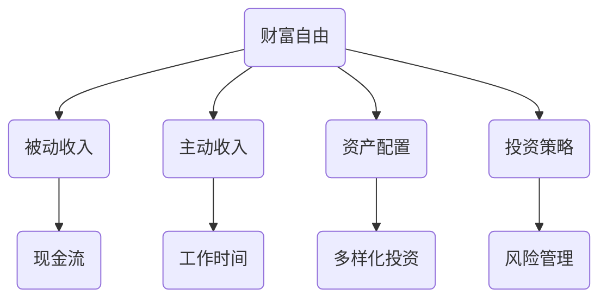

                 

### 第一章：财富自由的定义与意义

#### 1.1 财富自由的定义

财富自由，通常被定义为一个人不再依赖于传统工资收入，而能够通过被动收入或其他收入来源满足生活所需的状态。换句话说，当一个人的被动收入足以覆盖其生活费用时，他们就可以被称为实现了财富自由。

财富自由并不仅仅是一个财务目标，它更是一种生活状态和心态。它意味着一个人可以自由地选择自己想要的生活方式，而不再受限于工作的束缚。这种自由度不仅体现在财务上，更体现在时间和精神上。

**核心概念与联系：**

财富自由涉及到多个核心概念，包括被动收入、主动收入、资产配置、投资策略等。以下是财富自由相关的 Mermaid 流程图，用于解释这些概念之间的联系：



- **被动收入（B）**：指不需要持续投入时间和精力即可获得的收入，如利息、股息、房租、版权收入等。
- **主动收入（C）**：指通过工作或提供服务所获得的收入，通常需要付出时间和精力。
- **资产配置（D）**：指将资金分配到不同的资产类别中，以实现风险和收益的平衡。
- **投资策略（E）**：指投资者为实现特定财务目标所采用的方法和计划。

通过这些概念的理解，我们可以更好地把握财富自由的核心要素。

#### 1.1.1 财富自由的定义与标准

财富自由的定义在不同的语境和个体中可能有所差异。通常，财务专家将其定义为每年的被动收入至少达到个人或家庭的年支出水平。这意味着，一旦被动收入达到或超过支出，个体就可以减少或完全停止依赖工资收入。

例如，如果一个人的年度支出为 $40,000，而他的被动收入来源，如投资收益和租金，每年能够稳定产生 $50,000，那么他就实现了基本的财务自由。

**具体标准：**

- **被动收入**：需要明确什么是被动收入。根据美国财富自由专家泰德·尼姆（Ted Norfolk）的说法，被动收入是指“不需要持续付出时间和精力的收入，例如版权收入、出租物业、投资回报等。”
- **主动收入**：与被动收入相对，主动收入是指通过工作、创业或其他直接服务获得的收入。
- **支出**：需要明确生活支出的构成。通常包括住房、食品、医疗、教育、娱乐等日常开销。

以下是一个简化的财务自由计算公式：

\[ \text{财务自由} = \frac{\text{被动收入}}{\text{支出}} \]

如果结果大于或等于1，说明个人或家庭已经实现了财务自由。

#### 1.1.2 财富自由与财务自由

财富自由和财务自由是两个相关但不完全相同的概念。财务自由通常指的是个人或家庭的总资产（包括被动收入和主动收入）足以覆盖其总负债，从而实现无需担忧财务状况的自由。

**区别：**

- **财富自由**：侧重于被动收入的可持续性，强调通过投资和资产配置来实现无需工资收入的生活状态。
- **财务自由**：更广泛地涉及个人或家庭的财务状况，包括总资产和总负债的平衡。

**联系：**

- 实现财务自由往往是实现财富自由的基础。一个财务状况良好的个人或家庭更有可能通过投资和资产配置来实现财富自由。

**案例分析：**

以一位年支出为 $50,000 的程序员为例，如果他通过投资股票、房地产和创业项目，每年能够获得 $60,000 的被动收入，那么他实现了基本的财富自由。同时，如果他的总资产超过总负债，他也可以被认为是财务自由的。

#### 1.2 财富自由的重要性

财富自由对程序员来说具有重要意义。首先，它为程序员提供了财务安全，使得他们不必担心失业或经济波动带来的财务风险。其次，财富自由赋予了程序员更多的职业选择权，他们可以选择自己喜欢的工作，甚至完全脱离职场，享受生活。

**财富自由与程序员职业发展的关系：**

- **职业选择**：实现财富自由后，程序员可以更自由地选择职业道路。他们可以选择追求自己的兴趣和激情，而不仅仅是工资和职位。
- **工作环境**：财富自由使得程序员可以自由安排工作时间，甚至在家办公或远程工作，提高工作效率和满意度。
- **财务稳定性**：通过投资和理财，程序员可以建立稳定的被动收入流，减少对单一工资收入的依赖，从而提高财务稳定性。

**案例分析：**

以一位年薪资为 $100,000 的程序员为例，如果他通过投资和理财，每年能够获得 $40,000 的被动收入，他的年度总收入将达到 $140,000。这样的收入水平不仅提高了他的生活质量，也为他的职业发展提供了更多的选择和机会。

#### 1.3 财富自由的核心要素

要实现财富自由，需要以下几个核心要素：

1. **被动收入**：这是财富自由的基础。通过投资、创业和知识产权等方式，建立稳定的被动收入流，是实现财富自由的关键。
   
2. **资产配置**：合理地分配资金到不同的资产类别中，以实现风险和收益的平衡。资产配置需要根据个人的财务目标和风险承受能力进行调整。

3. **投资策略**：制定合适的投资策略，以最大化收益并控制风险。投资策略应考虑市场的波动和长期投资目标。

4. **财务规划**：制定长期的财务规划，设定明确的财务目标并制定实现这些目标的具体计划。

**被动收入与主动收入的区别：**

- **被动收入**：不需要持续的时间和精力投入，例如租金、股息、版权收入等。
- **主动收入**：需要付出时间和精力，如工资、创业收入等。

通过理解和掌握这些核心要素，程序员可以更好地规划自己的财务和职业道路，朝着实现财富自由的目标迈进。

### 第二章：程序员职业发展与财富自由

#### 2.1 程序员职业路径与财富自由

程序员的职业路径通常分为几个阶段，每个阶段都有其特定的职业晋升机会和收入增长潜力。理解这些阶段和机会，可以帮助程序员更好地规划自己的职业发展，为实现财富自由打下坚实的基础。

**职业路径阶段：**

1. **初级程序员**：刚进入职场的程序员通常从初级程序员或初级开发人员的职位开始。这个阶段的重点是掌握基本编程技能和行业知识，积累项目经验。

2. **中级程序员**：随着经验的积累，程序员可以晋升为中级程序员或开发工程师。这个阶段的重点是提升技术深度，掌握更多高级编程技能和工具。

3. **高级程序员**：在技术能力进一步提升后，程序员可以晋升为高级程序员或高级开发工程师。这个阶段的重点是承担更复杂的项目，担任技术团队的核心成员。

4. **技术专家**：具有丰富经验和深厚技术背景的程序员可以晋升为技术专家或首席技术官（CTO）。这个阶段的重点是制定技术战略，领导技术团队。

5. **创业**：部分程序员选择在积累足够的技术和行业经验后创业，利用自己的专业知识和资源实现财富自由。

**职业晋升与收入增长：**

- **初级程序员**：年薪通常在 $50,000 至 $80,000 之间。
- **中级程序员**：年薪通常在 $80,000 至 $120,000 之间。
- **高级程序员**：年薪通常在 $120,000 至 $180,000 之间。
- **技术专家**：年薪通常在 $180,000 以上。

实现财富自由的关键在于从初级程序员逐步晋升到高级程序员或技术专家，并通过持续学习和技能提升提高自己的市场价值。以下是一些策略：

1. **技术深度**：专注于特定技术领域，成为该领域的专家。
2. **软技能**：提升项目管理、沟通和团队合作能力，增强领导力。
3. **持续学习**：通过在线课程、工作坊和行业会议等途径不断学习新技能。

#### 2.2 提升程序员价值的策略

要实现财富自由，程序员不仅需要提升技术能力，还需要关注提升个人价值的相关策略。以下是几个关键策略：

1. **技术能力的提升**：通过不断学习和实践，提升编程语言、框架和工具的熟练度，特别是在新兴技术和热门领域。例如，掌握人工智能、区块链和大数据等前沿技术，可以显著提高市场竞争力。

   **具体行动**：
   - 参加在线课程和认证项目，如 Coursera、Udacity 和 edX 提供的相关课程。
   - 加入开源项目，参与社区讨论，提升实战经验。
   - 阅读技术博客和书籍，跟踪行业动态。

2. **项目管理和领导力的培养**：良好的项目管理能力和领导力是高级程序员和技术专家不可或缺的素质。通过参与项目管理和团队领导工作，可以提升这些技能。

   **具体行动**：
   - 参与公司内部的项目管理培训，学习敏捷开发、Scrum 等方法。
   - 担任小组负责人或项目经理，积累实际管理经验。
   - 参加项目管理相关的认证，如 PMP、Scrum Master 等。

3. **跨界合作与多元化发展**：跨界合作和多元化发展可以帮助程序员拓宽视野，发现新的职业机会。例如，与产品经理、设计师和市场营销人员合作，提升全栈开发能力。

   **具体行动**：
   - 参与跨部门项目，提升跨职能合作能力。
   - 参加行业会议和研讨会，结识不同领域的专家。
   - 学习跨领域知识，如产品设计、市场营销等。

通过上述策略，程序员可以显著提升个人价值，增加收入潜力，为实现财富自由创造条件。

#### 2.3 跨界合作与多元化发展

跨界合作与多元化发展是程序员实现财富自由的重要策略之一。通过跨界合作，程序员可以拓宽自己的视野，接触到不同领域的知识和技术，从而提升自身价值。以下是程序员如何实现跨界合作和多元化发展的几个关键步骤：

1. **识别跨界合作的机会**：
   - **跨部门合作**：在同一个公司内，程序员可以主动参与跨部门项目，如与产品经理、设计师、市场人员合作，提升全栈开发能力。
   - **外部合作**：与不同公司或组织合作，参与跨行业项目，如与金融机构合作开发金融科技产品。

2. **构建跨界知识体系**：
   - **学习跨领域知识**：通过参加在线课程、行业会议和培训，学习产品设计、市场营销、金融等跨领域知识。
   - **阅读跨界书籍**：阅读涉及多个领域的书籍，如《创新者基因》、《精益创业》等，提升跨领域思维。

3. **开展多元化业务**：
   - **开设个人咨询业务**：利用专业技能，提供技术咨询和培训服务。
   - **参与创业项目**：加入创业团队，利用技术能力和经验参与创新项目。

4. **利用社交媒体和社区**：
   - **参与开源社区**：在 GitHub、Stack Overflow 等平台上参与开源项目，与全球开发者交流。
   - **建立个人品牌**：通过博客、社交媒体分享知识和经验，建立个人影响力。

跨界合作与多元化发展不仅可以帮助程序员提升个人价值，还可以增加收入来源，为实现财富自由创造更多机会。以下是一个具体的案例：

**案例：**一位专注于后端开发的程序员，在完成日常工作的同时，积极参与前端和产品设计相关的社区活动。他通过学习前端框架（如 React、Vue.js）和产品设计原则，逐渐成为全栈开发专家。此外，他还利用业余时间参与金融科技项目的开源开发，积累了金融领域的技术经验。最终，他通过在多个项目中展现出色的技术能力和跨领域知识，成功转型为高级技术专家，年收入显著提升，并实现了一定的财务自由。

通过跨界合作和多元化发展，程序员可以突破职业发展的瓶颈，实现更高的收入水平和职业成就感，为实现财富自由奠定坚实基础。

### 第三章：财务规划与个人财务

#### 3.1 制定个人财务规划

实现财富自由的第一步是制定个人财务规划。财务规划是一个系统性、长期性的过程，旨在帮助个人或家庭实现财务目标，提高财务状况。以下是如何制定个人财务规划的步骤和方法：

**步骤一：设定财务目标**

首先，明确自己的财务目标。这些目标可以是短期的，如购买新房、新车或度假；也可以是长期的，如退休规划、子女教育基金等。财务目标应具体、可衡量，并设定时间表。

**步骤二：评估当前财务状况**

评估当前的财务状况，包括收入、支出、储蓄和负债。了解自己的净资产（净资产=资产-负债），这有助于确定起点和制定计划。

**步骤三：制定预算**

制定详细的预算，规划每月的收入和支出。预算应包括生活必需品、非必需品、储蓄和投资。通过预算管理，可以控制开支，提高储蓄率。

**步骤四：制定储蓄计划**

根据预算，设定每月的储蓄目标。储蓄是积累财富的基础，是实现财务目标的关键。可以通过定期存款、购买储蓄产品或自动转账等方式实现储蓄。

**步骤五：投资规划**

投资是实现财富自由的重要手段。根据风险承受能力和财务目标，选择合适的投资工具和策略。可以投资于股票、债券、基金、房地产等。

**步骤六：定期回顾和调整**

财务规划不是一次性的过程，而是一个持续性的工作。定期回顾和调整财务规划，确保其与当前状况和目标保持一致。

**方法一：使用财务规划工具**

可以使用财务规划工具，如 Excel 表格、在线财务规划软件等，帮助制定和跟踪财务规划。这些工具可以提供直观的数据分析和图表，便于调整和优化计划。

**方法二：咨询财务专家**

如果自己不熟悉财务规划，可以咨询财务专家或理财顾问。他们可以提供专业的建议和指导，帮助制定个性化的财务规划。

#### 3.1.1 财务规划的步骤与方法

**步骤一：设定财务目标**

设定财务目标是制定个人财务规划的第一步。财务目标应明确、具体、可衡量，并设定时间表。以下是一个例子：

- **短期目标**：在未来两年内，购买一辆新车，预算为 $20,000。
- **中期目标**：在未来五年内，积累足够的资金，为子女的教育基金，目标金额为 $50,000。
- **长期目标**：在未来十年内，实现退休规划，确保有足够的被动收入覆盖生活费用。

**步骤二：评估当前财务状况**

评估当前财务状况，包括收入、支出、储蓄和负债。以下是一个简单的财务状况评估表格：

| 项目       | 说明                                                     |
| ---------- | -------------------------------------------------------- |
| 收入       | 包括工资、奖金、投资收益等。                             |
| 支出       | 包括住房、食品、医疗、教育、娱乐等日常开销。             |
| 储蓄       | 当前储蓄余额。                                         |
| 负债       | 包括房贷、车贷、信用卡欠款等。                         |
| 净资产     | 净资产=资产-负债。                                     |

**步骤三：制定预算**

制定预算，规划每月的收入和支出。以下是一个简单的月度预算表格：

| 项目       | 月度预算（美元） |
| ---------- | ---------------- |
| 收入       | $6,000           |
| 支出       |                   |
| 住房       | $1,500           |
| 食品       | $500             |
| 医疗       | $200             |
| 教育       | $100             |
| 娱乐       | $200             |
| 交通       | $100             |
| 其他       | $200             |
| 储蓄       | $500             |
| 投资规划   | $500             |

通过制定预算，可以明确每月的储蓄目标和投资规划。

**步骤四：制定储蓄计划**

根据预算，设定每月的储蓄目标。以下是一个简单的储蓄计划：

- **每月储蓄目标**：$500。
- **储蓄方式**：使用自动转账功能，每月从工资账户自动转入储蓄账户。

**步骤五：投资规划**

根据财务目标和风险承受能力，制定投资规划。以下是一个简单的投资规划：

- **短期投资**：股票、债券、货币市场基金等。
- **中期投资**：房地产、股票、债券等。
- **长期投资**：股票、债券、退休基金等。

通过投资规划，可以逐步积累财富，实现财务目标。

**步骤六：定期回顾和调整**

定期回顾财务规划，确保其与当前状况和目标保持一致。以下是一个简单的回顾和调整流程：

1. 每年一次，评估财务目标和现状。
2. 根据评估结果，调整预算、储蓄计划和投资策略。
3. 检查是否实现财务目标，如有必要，重新设定目标。

通过定期回顾和调整，可以确保财务规划的有效性和适应性。

#### 3.1.2 财务目标设定与时间表

设定财务目标时，需要考虑以下几个关键因素：

1. **目标类型**：包括短期、中期和长期目标。短期目标通常在1年以内实现，如购买新车、度假等；中期目标通常在1-5年内实现，如子女教育基金、新房等；长期目标通常在5年以上，如退休规划、遗产传承等。

2. **目标具体性**：财务目标应具体、可衡量。例如，“在未来两年内，购买一辆新车”比“将来买辆车”更具体，更容易实现。

3. **目标可行性**：目标应基于当前财务状况和预期收入，确保可实现。例如，如果当前年收入为 $40,000，设定在未来一年内购买价值 $50,000 的房屋可能不切实际。

4. **目标时间表**：为每个目标设定具体的时间表，有助于跟踪进度和调整计划。例如，将“在未来五年内，积累足够的资金为子女的教育基金”具体化为“在接下来的两年内，每年存入 $10,000”。

以下是一个财务目标设定与时间表的示例：

| 目标类型     | 目标内容                                       | 实现时间  | 预期收入       |
| ------------ | ------------------------------------------ | -------- | ------------- |
| 短期目标     | 购买一辆新车                                 | 两年内   | $40,000       |
| 中期目标     | 孩子大学学费基金积累                         | 五年内   | $100,000      |
| 长期目标     | 实现退休规划，年被动收入达到 $50,000       | 十年内   | $500,000      |

通过设定明确的财务目标和时间表，可以更有效地规划个人财务，逐步实现财富自由。

#### 3.2 理财基础知识

在制定个人财务规划的过程中，掌握一些基本的理财知识是非常重要的。以下是一些关键的理财概念和原则，以及常见的投资工具和策略。

**资产配置**

资产配置是指将资金分配到不同的资产类别中，以实现风险和收益的平衡。常见的资产类别包括：

- **股票**：提供较高的收益潜力，但风险也相对较高。
- **债券**：相对稳定的收益，风险较低。
- **现金**：流动性好，但收益较低。
- **房地产**：长期收益潜力高，风险适中。
- **基金**：由专业管理人管理，涵盖多种资产类别，适合投资者分散风险。

**风险管理**

风险管理是理财过程中不可或缺的一环。以下是一些风险管理策略：

- **分散投资**：将资金分散投资于不同的资产类别和行业，以降低单一资产或行业的风险。
- **定期审查**：定期审查投资组合，根据市场变化和风险承受能力进行调整。
- **保险**：购买适当的保险，如健康保险、意外保险和财产保险，以应对意外事件带来的财务风险。

**投资工具**

以下是一些常见的投资工具：

- **股票**：投资者可以直接购买公司股票，分享公司的盈利。
- **债券**：投资者可以购买政府或公司发行的债券，获取固定的利息收入。
- **基金**：由专业管理人管理的投资组合，包括股票、债券、房地产等多种资产类别。
- **指数基金**：跟踪特定指数表现的投资基金，如标准普尔500指数基金。
- **房地产投资信托（REITs）**：通过购买REITs，投资者可以投资于房地产市场，获取租金和资本增值收益。

**投资策略**

以下是一些常见的投资策略：

- **长期投资**：通过长期持有股票或基金，享受复利效应和市场的长期增长。
- **定期定额投资**：定期投资固定金额，通过分散购买，降低成本和市场波动的影响。
- **价值投资**：寻找价格低于其真实价值的股票，通过长期持有获取资本增值。
- **成长投资**：寻找具有高速增长潜力的公司，通过其盈利增长实现投资回报。

通过掌握这些基本的理财知识，可以更好地制定和实施个人财务规划，提高实现财富自由的机会。

#### 3.3 节省与积累财富

节省与积累财富是实现财务自由的关键步骤。通过有效管理支出、制定储蓄计划和使用投资工具，程序员可以逐步增加储蓄，为未来的财务目标打下坚实基础。

**减少生活成本的策略**

1. **预算管理**：制定详细的月度预算，明确收入和支出。将支出划分为必需品和非必需品，优先保证必需品的开支，如住房、食品和交通。

2. **优化日常消费**：在日常生活中寻找节省的机会，例如：
   - 使用公共交通工具或骑行代替私家车。
   - 自制餐点，减少外出就餐的频率。
   - 选择性价比高的商品和服务，避免不必要的浪费。

3. **节能减耗**：降低能源消耗，如使用节能灯泡、减少空调使用时间等，不仅有助于环境保护，还能减少长期电费支出。

**制定储蓄计划的步骤**

1. **设定储蓄目标**：根据财务目标，设定每月的储蓄金额。例如，如果目标是每年存下 $10,000，每月应储蓄 $833。

2. **制定储蓄计划**：使用自动转账功能，将每月收入的一部分直接转入储蓄账户，确保定期储蓄。

3. **审查和调整**：定期审查储蓄计划，根据实际收入和支出情况进行调整。如果收入增加或支出减少，可以适当提高储蓄金额。

**使用投资工具积累财富**

1. **股票投资**：股票是增加财富的有效工具，可以通过购买股票或投资股票基金实现。以下是一个简化的股票投资策略：
   - **分散投资**：投资于多个不同行业和类型的公司，降低单一公司的风险。
   - **定期定额投资**：在市场波动时定期投资，通过分散购买降低成本。
   - **长期持有**：选择有长期增长潜力的公司，通过公司盈利增长实现投资回报。

2. **债券投资**：债券提供稳定的利息收入，适合风险较低的投资者。以下是一个简化的债券投资策略：
   - **购买政府债券**：政府债券风险较低，适合作为固定收益投资的一部分。
   - **多样化投资**：投资于不同到期日和信用评级的债券，降低整体风险。

3. **基金投资**：基金由专业管理人管理，涵盖多种资产类别，适合普通投资者。以下是一个简化的基金投资策略：
   - **选择合适的基金**：根据投资目标、风险承受能力和市场趋势选择合适的基金。
   - **定期定额投资**：通过定期投资，降低成本和市场波动的影响。
   - **长期持有**：基金投资应注重长期收益，避免频繁交易导致成本增加。

**案例：**

以一位年薪为 $80,000 的程序员为例，他的月收入为 $6,667。他设定每月储蓄 $2,000，剩余 $4,667 用于日常开支。以下是他一年的储蓄和投资计划：

- **储蓄计划**：每月储蓄 $2,000，每年储蓄 $24,000。
- **投资工具**：投资 $10,000 于股票，$10,000 于债券，$4,000 于基金。

通过有效的节省和投资，这位程序员可以逐步积累财富，为实现财务自由奠定基础。

### 第四章：投资策略与风险管理

#### 4.1 投资类型与策略

投资是实现财务自由的重要手段，选择合适的投资类型和策略能够帮助投资者在控制风险的同时获取稳定回报。以下是一些常见的投资类型和策略：

**股票投资**

股票投资是指购买上市公司的股票，分享公司的盈利和成长。以下是一些股票投资策略：

1. **价值投资**：寻找价格低于其内在价值的股票，通过长期持有获得资本增值。以下是一个简化的价值投资策略伪代码：

   ```python
   def find_value_stocks():
       for stock in stocks:
           if stock.price < stock.intrinsic_value():
               return stock
       return None
   ```

2. **成长投资**：选择具有高速增长潜力的公司，通过其盈利增长实现投资回报。以下是一个简化的成长投资策略伪代码：

   ```python
   def find_growth_stocks():
       for stock in stocks:
           if stock.growth_rate > threshold_growth_rate:
               return stock
       return None
   ```

**债券投资**

债券投资是指购买政府或公司发行的债券，获取固定的利息收入。以下是一些债券投资策略：

1. **购买政府债券**：政府债券通常风险较低，适合作为固定收益投资的一部分。以下是一个简化的购买政府债券策略伪代码：

   ```python
   def buy_government_bond():
       for bond in bonds:
           if bond.credit_rating == 'AAA':
               return bond
       return None
   ```

2. **多样化投资**：投资于不同到期日和信用评级的债券，降低整体风险。以下是一个简化的多样化投资策略伪代码：

   ```python
   def diversify_bonds():
       selected_bonds = []
       for bond in bonds:
           if bond.credit_rating in ['AA', 'A', 'BBB']:
               selected_bonds.append(bond)
       return selected_bonds
   ```

**基金投资**

基金投资是指购买由专业管理人管理的投资组合，涵盖多种资产类别。以下是一些基金投资策略：

1. **指数基金**：跟踪特定指数表现的投资基金，如标准普尔500指数基金。以下是一个简化的指数基金投资策略伪代码：

   ```python
   def invest_in_index_fund(index):
       fund = get_index_fund(index)
       invest_amount = total_investment * (1 - expense_ratio)
       buy_fund(fund, invest_amount)
   ```

2. **定期定额投资**：定期投资固定金额，通过分散购买降低成本和市场波动的影响。以下是一个简化的定期定额投资策略伪代码：

   ```python
   def dollar_cost_averaging(investment_period, investment_amount):
       for period in investment_period:
           buy_fund(fund, investment_amount)
   ```

#### 4.2 风险管理

风险管理是投资过程中不可或缺的一环，通过识别、评估和控制风险，投资者可以保护自己的投资组合免受不必要的损失。以下是一些风险管理策略：

**风险识别**

风险识别是风险管理的第一步，通过了解不同投资类型和市场的潜在风险，投资者可以做出更明智的投资决策。以下是一些常见的风险类型：

1. **市场风险**：由市场整体波动引起，如经济衰退、利率变化等。
2. **信用风险**：由借款人无法偿还债务引起，如债券发行人违约。
3. **流动性风险**：指资产难以在短期内以公平价格买卖的风险。
4. **利率风险**：由利率变化引起，影响固定收益投资的价值。

**风险评估**

风险评估是评估投资组合中不同资产的风险程度，以便投资者可以做出更合理的风险分散决策。以下是一些评估风险的方法：

1. **历史分析**：通过分析历史数据，了解不同资产类别的波动性和相关性。
2. **情景分析**：模拟不同的市场情景，评估投资组合在极端市场条件下的表现。
3. **VaR（价值在风险）**：计算投资组合在一定置信水平下的最大可能损失。

**风险管理策略**

以下是一些常用的风险管理策略：

1. **分散投资**：通过将资金分散投资于不同的资产类别和行业，降低单一资产或行业风险。
2. **定期审查**：定期审查投资组合，根据市场变化和风险承受能力进行调整。
3. **保险**：购买适当的保险，如健康保险、意外保险和财产保险，以应对意外事件带来的财务风险。

**案例：**

假设一位投资者拥有以下投资组合：

- 股票：$50,000，占投资组合的40%
- 债券：$30,000，占投资组合的20%
- 房地产：$20,000，占投资组合的10%
- 基金：$20,000，占投资组合的20%

**风险识别：**

- 市场风险：股票和基金投资受市场波动影响较大。
- 信用风险：债券投资可能面临发行人违约风险。
- 流动性风险：房地产投资变现难度较大，可能面临流动性风险。

**风险评估：**

- 历史分析：过去三年，股票市场整体波动较大，股票和基金收益波动明显。
- 情景分析：在经济衰退情景下，股票和基金表现较差，债券表现相对稳定。

**风险管理策略：**

- 分散投资：增加债券和房地产投资比例，降低股票和基金投资比例。
- 定期审查：每季度审查投资组合，根据市场变化进行调整。
- 保险：购买健康保险和意外保险，降低意外事件带来的财务风险。

通过有效的风险管理和调整，投资者可以保护投资组合，实现长期稳定的收益。

#### 4.3 投资心理学

投资心理学是研究投资者在投资决策过程中的心理因素和行为的学科。理解投资心理学有助于投资者保持理性，避免情绪化的投资决策。以下是一些关键心理因素和如何保持理性投资心态的策略。

**心理因素**

1. **过度自信**：投资者往往高估自己的能力和市场洞察力，导致冒不必要的风险。
2. **羊群效应**：投资者在市场情绪影响下，盲目跟随他人投资决策，忽略自己的研究和分析。
3. **损失厌恶**：投资者倾向于避免损失，导致在市场下跌时过度持有亏损股票，错过卖出的机会。
4. **情绪化决策**：在市场波动时，投资者容易受到恐慌或贪婪情绪的影响，做出非理性的投资决策。

**保持理性投资心态**

1. **设立明确的投资目标**：明确自己的投资目标和风险承受能力，避免因市场波动而偏离长期投资策略。
2. **定期复盘**：定期回顾投资决策和结果，从错误中学习，调整投资策略。
3. **避免频繁交易**：频繁交易会导致交易成本增加，影响投资回报。长期持有优质资产是更有效的策略。
4. **情绪管理**：通过冥想、运动和社交活动等途径，缓解投资压力和情绪波动。
5. **学习投资知识**：不断学习投资理论和市场分析工具，提高自身的投资能力。

**案例：**

以一位投资者在2022年投资股市为例。在年初，投资者通过深入研究，发现某些科技公司的基本面良好，决定买入。然而，随着市场在第二季度出现波动，投资者开始感到恐慌，担心亏损。在这种情况下，投资者通过复盘和情绪管理，重新评估公司的基本面和市场环境，决定继续持有股票。最终，这些公司在下半年实现了反弹，投资者获得了可观的收益。

通过理解投资心理学，投资者可以更好地管理情绪，做出理性投资决策，实现长期的投资目标。

### 第五章：构建被动收入渠道

#### 5.1 被动收入的概念与种类

被动收入是指在不直接投入时间和精力的前提下，通过投资、创业或知识产权等方式获得的持续收入。理解被动收入的概念和种类，对于实现财富自由至关重要。以下是一些常见的被动收入来源：

**1. 投资收益**

投资收益包括股票、债券、基金、房地产等投资工具的收益。通过定期投资，投资者可以在不增加额外工作量的情况下获得收益。

**2. 房地产租金**

房地产租金是出租物业获得的收入。通过购买房产并出租，投资者可以获得稳定的租金收入。

**3. 知识产权收益**

知识产权收益包括专利、版权、商标等知识产权的授权使用费和许可费。通过开发创新产品或技术，并将知识产权授权给其他企业使用，投资者可以获得持续的收入。

**4. 网络内容收入**

网络内容收入包括博客、YouTube 频道、在线课程等网络平台的广告收入和会员费。通过创建高质量的内容并吸引大量观众，投资者可以获得被动收入。

**5. 自助服务业务**

自助服务业务包括网店、线上咨询等。通过建立一个自助服务的商业模式，投资者可以减少日常运营成本，实现持续收入。

#### 5.2 创业与自主创业

创业是实现被动收入的重要途径之一。自主创业不仅能够带来稳定的收入，还能提高个人价值和社会地位。以下是如何实现自主创业的步骤：

**1. 找到市场需求**

找到市场需求是创业的第一步。可以通过市场调研、用户访谈和竞争分析，了解潜在客户的需求和痛点。

**2. 制定商业计划**

制定详细的商业计划，明确产品或服务的目标市场、营销策略、运营成本和盈利模式。商业计划应包括市场分析、财务预测和营销计划等内容。

**3. 资金筹集**

根据商业计划，筹集启动资金。可以通过自筹资金、寻找天使投资者或申请创业贷款等方式筹集资金。

**4. 建立团队**

组建一个有经验、有能力、互补技能的团队，共同实现创业目标。团队成员应包括业务、技术、市场和财务等方面的专家。

**5. 开发产品或服务**

开发高质量的产品或服务，满足市场需求。在产品开发过程中，应持续收集用户反馈，不断优化产品。

**6. 营销推广**

通过多种渠道进行营销推广，提高品牌知名度。可以使用社交媒体、广告、公关活动等手段吸引潜在客户。

**7. 持续改进**

在创业过程中，持续改进产品和服务，提高客户满意度。同时，根据市场变化和客户需求，灵活调整业务策略。

#### 5.3 知识产权与版权收益

知识产权和版权收益是被动收入的重要来源之一。通过开发创新产品或技术，并将知识产权授权给其他企业使用，投资者可以获得持续的收入。以下是如何获取知识产权收益的步骤：

**1. 创新研发**

进行创新研发，开发具有竞争力的产品或技术。创新是获取知识产权收益的基础。

**2. 专利申请**

申请专利，保护自己的创新成果。专利可以防止他人未经许可使用或复制你的技术。

**3. 版权登记**

对于文学、艺术和软件等作品，进行版权登记，保护自己的知识产权。

**4. 授权许可**

通过授权许可，将知识产权授权给其他企业使用。授权许可可以收取授权费或分成收入。

**5. 监控和维权**

定期监控知识产权的使用情况，确保自己的知识产权不被侵犯。如发现侵权行为，及时采取法律措施维护权益。

**案例：**

以一位软件开发者为例，他开发了一个人工智能聊天机器人，并成功申请了相关专利。随后，他将这项技术授权给多家企业使用，每年获得数万美元的授权费。通过持续优化和升级聊天机器人，他的知识产权收益逐年增加，实现了被动收入。

通过构建被动收入渠道，程序员可以实现财务自由，享受更高质量的生活。

### 第六章：投资理财与财富积累

#### 6.1 投资理财的基本原则

投资理财是实现财富自由的重要手段。以下是一些投资理财的基本原则，帮助投资者在复杂多变的市场环境中做出明智的决策。

**设定投资目标**

首先，投资者应明确自己的投资目标。这些目标可以是短期的，如购买新车、度假等；也可以是中长期的，如子女教育基金、退休规划等。明确目标有助于投资者制定合适的投资策略。

**风险与收益匹配**

投资者应理解风险与收益之间的关系。通常情况下，高收益伴随着高风险。投资者应根据自身的风险承受能力，选择合适的投资工具和策略。例如，对于保守型投资者，债券和货币基金可能更为合适；而对于激进型投资者，股票和新兴市场基金可能带来更高的回报。

**多元化投资**

多元化投资是指将资金分散投资于不同的资产类别和行业，以降低单一投资的风险。通过多元化投资，投资者可以在市场波动时分散风险，实现投资组合的稳健增长。

**定期复盘**

定期复盘是投资理财的重要环节。投资者应定期回顾自己的投资决策和表现，从成功和失败中学习，不断调整和优化投资策略。

**长期投资**

长期投资是一种稳健的投资策略。通过长期持有优质资产，投资者可以享受复利效应，实现稳定的投资回报。

**合理规划税务**

投资理财过程中，合理规划税务也非常重要。投资者可以通过合法的税收减免政策，降低税务负担，实现财务优化。

#### 6.1.1 投资理财的目标与规划

投资理财的目标因人而异，但通常包括以下几种：

1. **储蓄目标**：为短期目标，如购房、购车、旅行等筹集资金。
2. **教育基金**：为子女的教育费用进行储蓄和投资。
3. **退休规划**：为退休生活积累资金，确保退休后的生活质量。
4. **遗产传承**：为后代留下一笔财富，实现财富的传承。

**如何设定投资理财目标**

设定投资理财目标应遵循以下步骤：

1. **明确目标类型**：确定是短期、中期还是长期目标。
2. **设定具体金额**：根据目标类型，设定具体的资金需求。
3. **设定时间表**：为每个目标设定明确的时间表，以确保按计划实现。

以下是一个简单的投资理财目标设定示例：

| 目标类型 | 目标内容           | 实现时间 | 预期金额 |
| -------- | ------------------ | -------- | -------- |
| 短期目标 | 购买新车           | 1年内    | $30,000  |
| 中期目标 | 子女大学教育基金   | 10年内   | $100,000 |
| 长期目标 | 退休规划           | 20年内   | $500,000 |

**如何制定投资规划**

制定投资规划应考虑以下因素：

1. **财务状况**：评估当前的收入、支出和储蓄情况。
2. **风险承受能力**：了解自己的风险偏好，选择合适的投资工具和策略。
3. **投资时间**：根据目标的实现时间，选择短期、中期或长期的投资工具。

以下是一个简单的投资规划示例：

- **短期目标**：利用高流动性、低风险的工具，如货币基金或短期债券，确保资金安全。
- **中期目标**：投资于股票、债券和房地产等多元化资产，实现资产增值。
- **长期目标**：投资于股票市场、房地产和退休基金，通过长期持有获得稳定回报。

通过设定明确的投资目标和制定合理的投资规划，投资者可以更好地实现财务目标，实现财富自由。

#### 6.2 理财工具的选择与应用

选择合适的理财工具是实现投资目标的关键。以下是一些常见的理财工具，以及如何根据个人需求和目标选择和应用这些工具。

**1. 股票投资**

股票投资是最常见的理财工具之一，适合具有较高风险承受能力和长期投资目标的投资者。以下是选择和应用股票投资的一些策略：

- **选择优质股票**：通过基本面分析和技术分析，选择具有良好业绩和增长潜力的公司股票。
- **定期投资**：采用定期定额投资策略，通过分批买入，降低成本和市场波动的影响。
- **长期持有**：长期持有优质股票，享受公司盈利和市值增长带来的回报。

**2. 基金投资**

基金投资是一种将资金交给专业管理人的投资方式，适合那些希望分散风险但缺乏专业知识的投资者。以下是选择和应用基金投资的一些策略：

- **选择基金类型**：根据投资目标和风险承受能力，选择股票型基金、债券型基金、货币市场基金等。
- **选择基金经理**：研究基金经理的历史业绩和管理风格，选择业绩稳定、策略清晰的基金经理。
- **定期评估**：定期评估基金的表现，根据市场变化和投资目标进行调整。

**3. 房地产投资**

房地产投资是一种相对稳定的投资方式，适合具有长期投资目标和较高资金实力的投资者。以下是选择和应用房地产投资的一些策略：

- **选择地理位置**：投资于具有增长潜力和稳定租金收益的地理位置。
- **选择房产类型**：根据投资目标和市场趋势，选择住宅、商业地产或工业地产。
- **租赁管理**：选择专业的租赁管理公司，确保租金收益和房产维护。

**4. 储蓄账户**

储蓄账户是一种低风险、低收益的理财工具，适合那些希望保持资金流动性和安全性的投资者。以下是选择和应用储蓄账户的一些策略：

- **选择储蓄账户**：选择具有高利率和良好服务质量的储蓄账户。
- **定期存款**：利用定期存款或定活两便储蓄账户，提高储蓄收益。
- **自动转账**：设置自动转账功能，确保定期储蓄。

通过合理选择和应用这些理财工具，投资者可以根据自己的需求和目标，实现财务目标和财富自由。

### 第七章：心态与行为习惯

#### 7.1 财富自由的心态

实现财富自由不仅需要财务规划和技术能力，还需要正确的心理建设。财富自由的心态是指对财富、工作、生活和未来的积极态度和信念。以下是如何培养积极心态的一些策略：

**1. **设定清晰的目标**

设定明确、具体的财务目标，并制定实现这些目标的计划。清晰的目标可以帮助你保持动力和专注，避免因短期挫折而放弃。

**2. **接受失败和挫折**

在追求财富自由的过程中，失败和挫折是不可避免的。关键是要从中吸取教训，不断调整策略，而不是因一次失败而气馁。

**3. **培养感恩心态**

感恩是一种强大的心态，可以帮助你保持积极的态度。感恩生活中的美好事物，珍惜现有的资源和机会。

**4. **保持学习和成长**

持续学习新的知识和技能，不仅有助于提升个人价值，还能让你在追求财富自由的过程中保持竞争力。

**5. **培养健康的生活习惯**

健康的生活方式可以提高工作效率和生活质量，从而为追求财富自由创造有利条件。保持适度的运动、良好的饮食习惯和充足的睡眠。

**6. **避免贪婪和恐惧**

贪婪和恐惧是投资者在市场波动时常见的心理障碍。学会控制情绪，避免因市场波动而做出冲动的投资决策。

#### 7.2 健康的生活方式

健康的生活方式是实现财富自由的基础。良好的生活习惯可以提高工作效率和生活质量，从而更好地追求财务目标。以下是一些健康生活方式的实践：

**1. **适度运动**

定期进行适度的运动，如快走、跑步、瑜伽或健身房训练，有助于保持身体健康和提高精神状态。

**2. **均衡饮食**

保持均衡饮食，摄入充足的蛋白质、碳水化合物、脂肪、维生素和矿物质。避免过度饮酒和高糖、高脂肪的食物。

**3. **充足睡眠**

确保每晚获得充足的睡眠，成年人通常需要7-9小时的睡眠。良好的睡眠有助于恢复体力、提高记忆力和创造力。

**4. **压力管理**

学会有效管理压力，如通过冥想、深呼吸、瑜伽或心理咨询等途径。高压力水平会影响身体健康和投资决策。

**5. **社交活动**

积极参与社交活动，与家人、朋友和同事保持良好的关系。社交活动可以提高幸福感，减少孤独感。

**6. **定期体检**

定期进行体检，确保身体健康。及时发现和处理健康问题，避免因健康问题影响工作和生活。

通过实践健康的生活方式，程序员可以提高工作效率，减少健康风险，从而更专注于实现财务目标，实现财富自由。

#### 7.3 持续学习与成长

持续学习与成长是实现财富自由的关键因素之一。在快速变化的科技和商业环境中，不断更新知识和技能，保持专业竞争力，是实现长期成功和财富积累的必要条件。以下是如何实现持续学习与成长的一些策略：

**1. **设定学习目标**

明确自己的学习目标和方向。这些目标可以是提升特定技能、学习新的编程语言、掌握投资知识等。设定具体的学习目标和时间表，有助于保持学习的动力和进度。

**2. **多元化学习途径**

利用多种学习途径，如在线课程、图书、博客、行业会议和研讨会等。这些资源可以帮助你从不同角度和深度学习新知识。

**3. **实践与反思**

理论学习是基础，但实践是检验真理的唯一标准。通过实际项目和工作任务，将所学知识应用到实践中。定期反思自己的工作，从成功和失败中学习经验。

**4. **建立学习社区**

加入学习社区和论坛，与同行交流经验和观点。通过讨论和合作，可以拓宽视野，发现新的学习机会。

**5. **保持好奇心**

培养好奇心，对新技术、新方法和新趋势保持敏感。好奇心是推动个人成长和创新的重要动力。

**6. **时间管理**

合理安排时间，确保有足够的时间用于学习和个人成长。利用碎片时间，如通勤、休息时间，进行学习和阅读。

通过持续学习和成长，程序员可以不断提升自己的专业技能和知识储备，增强市场竞争力，为实现财富自由打下坚实基础。

### 第八章：总结与展望

#### 8.1 财富自由的关键要素

实现财富自由是一个复杂而长期的过程，涉及多个关键要素。以下是实现财富自由的关键要素：

1. **被动收入**：建立稳定的被动收入流是财富自由的基础。通过投资、创业和知识产权等方式，获得持续的现金流。
   
2. **财务规划**：制定明确的财务目标，并制定实现这些目标的计划。这包括预算管理、储蓄计划和投资策略。

3. **资产配置**：合理分配资金到不同的资产类别中，以实现风险和收益的平衡。这需要根据个人的财务目标和风险承受能力进行调整。

4. **投资策略**：制定合适的投资策略，最大化收益并控制风险。投资策略应考虑市场的波动和长期投资目标。

5. **持续学习与成长**：在快速变化的科技和商业环境中，不断更新知识和技能，保持专业竞争力。

6. **心态与行为习惯**：培养积极的心态和健康的生活方式，保持理性和专注。

#### 8.1.1 财富自由的实现路径

实现财富自由通常包括以下步骤：

1. **建立被动收入流**：通过投资、创业和知识产权等方式，逐步建立被动收入流。

2. **制定财务规划**：明确财务目标，制定实现这些目标的详细计划。包括预算管理、储蓄计划和投资策略。

3. **持续学习和成长**：不断提升自己的专业技能和知识储备，保持市场竞争力。

4. **优化资产配置**：定期审查和调整投资组合，确保其与财务目标和风险承受能力相匹配。

5. **风险管理**：通过分散投资和定期复盘，降低投资组合的风险。

6. **持续积累和调整**：不断积累财富，并根据市场变化和个人需求调整投资策略。

#### 8.1.2 财富自由的未来趋势

随着科技的发展和市场的变化，财富自由的实现路径和策略也在不断演变。以下是一些未来趋势：

1. **自动化和人工智能**：自动化和人工智能技术将改变传统的劳动市场，带来新的投资机会和职业模式。

2. **数字货币和区块链**：数字货币和区块链技术的普及，将提供新的投资工具和资产类别。

3. **可持续发展**：随着环境保护意识的提升，可持续投资将成为重要的趋势。

4. **跨领域合作**：跨界合作和多元化发展将成为实现财富自由的重要途径。

5. **远程工作和远程办公**：随着远程工作和远程办公的普及，程序员将有更多的灵活性和机会实现财富自由。

通过了解和适应这些未来趋势，程序员可以更好地规划自己的财务和职业道路，实现财富自由。

### 8.2 程序员的财富自由之路

对于程序员而言，财富自由既是目标也是挑战。一方面，程序员具备较高的技能和专业知识，拥有相对稳定的收入来源；另一方面，行业快速变化和职业瓶颈是程序员面临的重要挑战。

#### 优势与挑战

**优势：**

1. **技能储备**：程序员掌握编程技能和计算机知识，具备较高的市场价值。
2. **职业稳定性**：科技行业持续增长，程序员需求稳定。
3. **工作灵活性**：程序员可以选择远程工作，提高工作与生活的平衡。

**挑战：**

1. **职业瓶颈**：技术行业发展迅速，程序员需要不断学习新技能，以保持竞争力。
2. **工作强度**：编程工作往往需要高度集中和长时间的投入，影响健康和生活质量。
3. **金融知识不足**：部分程序员可能在财务规划和投资策略上缺乏专业知识。

#### 实现路径

1. **提升技术能力**：专注于特定技术领域，成为该领域的专家。通过在线课程、认证项目和开源项目，不断提升自己的技术能力。

2. **财务规划**：制定详细的财务规划，包括预算管理、储蓄计划和投资策略。定期审查和调整，确保与财务目标保持一致。

3. **多元化收入**：通过投资、创业和兼职等方式，实现多元化收入。例如，参与开源项目、提供技术咨询、开设在线课程等。

4. **时间管理**：合理安排时间，确保有足够的时间用于学习和工作，同时保持健康的生活方式。

5. **心态调整**：培养积极的心态，面对职业挑战。通过持续学习和反思，提升自己的心理素质。

通过上述策略，程序员可以逐步实现财富自由，享受更加自由和富足的生活。

### 8.3 展望未来的财富自由生活

实现财富自由后，程序员将拥有更多选择和自由，享受更加丰富和充实的生活。以下是财富自由后的可能生活状态和未来展望：

#### 生活状态

1. **更多时间自由**：不再受限于工作，程序员可以自由安排自己的时间，追求兴趣爱好和梦想。
2. **财务安全感**：稳定的被动收入和投资收益，为生活提供充足的保障，减少财务压力。
3. **工作与生活的平衡**：可以从事自己喜欢的工作，同时享受家庭生活和休闲娱乐。
4. **精神自由**：无需担心财务问题，可以更加专注于个人成长和自我实现。

#### 未来展望

1. **职业发展**：在实现财富自由后，程序员可以选择继续在科技行业深耕，成为技术领袖或创业家。
2. **跨界合作**：通过跨界合作，程序员可以涉足其他领域，如产品设计、市场营销等，实现多元化发展。
3. **投资和慈善**：利用财务自由的优势，进行更多的投资和慈善活动，实现个人和社会的价值。
4. **持续学习**：财富自由并不意味着停滞不前，程序员可以持续学习新知识和技能，保持职业竞争力。

通过实现财富自由，程序员不仅能够提升生活品质，还能为未来的职业和生活创造更多可能。

### 附录：财富自由相关的资源与工具

#### 附录 A：财富自由相关的资源

为了帮助读者更好地理解和实现财富自由，以下是推荐的一些书籍、在线课程和网站。

**书籍推荐**

1. 《富爸爸，穷爸爸》（罗伯特·清崎著）：介绍财务规划和投资理念，适合初学者。
2. 《财富自由之路》（李笑来著）：深入探讨如何实现财务自由，结合实例和心得。
3. 《穷爸爸富爸爸之投资指南》（罗伯特·清崎著）：详细讲解投资策略和工具。

**在线课程推荐**

1. Coursera：提供各种金融和投资相关的课程，包括《金融学导论》、《投资学基础》等。
2. Udemy：涵盖广泛的财务和投资课程，适合不同层次的学习者。
3. LinkedIn Learning：提供专业认证课程，如《财务规划与投资策略》。

**网站推荐**

1. NerdWallet：提供个人财务规划和投资建议，包括预算管理、储蓄和投资等。
2. Investopedia：全面的金融知识库，涵盖投资工具、策略和市场分析。
3. WealthFront：提供智能投资平台，帮助用户制定和执行投资计划。

通过利用这些资源，读者可以更加系统地学习和实践财富自由的理念和策略。

#### 附录 B：投资理财工具介绍

为了帮助读者更好地进行投资理财，以下是几种常见的投资理财工具的介绍。

**1. 股票**

股票是最常见的投资工具之一，通过购买公司的股票，投资者可以分享公司的盈利和增长。以下是一些股票投资的关键点：

- **选择股票**：投资者可以通过基本面分析、技术分析和市场趋势选择合适的股票。
- **交易平台**：常见的股票交易平台包括 Robinhood、E*TRADE 和 Fidelity 等。
- **风险管理**：通过分散投资和定期定投，降低市场波动带来的风险。

**2. 基金**

基金是由专业基金经理管理的投资组合，涵盖多种资产类别。以下是一些基金投资的关键点：

- **基金类型**：包括股票型基金、债券型基金、货币市场基金和指数基金等。
- **选择基金**：投资者可以根据自己的投资目标和风险承受能力选择合适的基金。
- **费用和费用率**：了解基金的管理费用和费用率，选择费用较低的基金。

**3. 房地产投资信托（REITs）**

房地产投资信托是一种投资于房地产市场的工具，投资者可以通过购买REITs获得房地产的收益。以下是一些REITs投资的关键点：

- **投资类型**：REITs包括住宅REITs、商业REITs和工业REITs等。
- **收益来源**：REITs通过收取租金和资本增值获得收益。
- **流动性**：REITs具有较好的流动性，投资者可以在股票市场方便地买卖。

**4. 保险**

保险是一种重要的风险管理工具，可以帮助投资者保护自己的财产和未来。以下是一些保险投资的关键点：

- **类型**：包括人寿保险、健康保险、意外保险和财产保险等。
- **保障**：保险可以提供意外、疾病、财产损失等方面的保障。
- **选择**：根据个人需求和财务状况选择合适的保险产品。

通过了解和合理利用这些投资理财工具，读者可以更加有效地实现财富自由的目标。

### 作者信息

作者：AI天才研究院/AI Genius Institute & 禅与计算机程序设计艺术 /Zen And The Art of Computer Programming

本文由AI天才研究院和禅与计算机程序设计艺术共同撰写，旨在探讨程序员实现财富自由的本质和路径。两位作者在人工智能、计算机编程和财务规划领域具有丰富的经验和深厚的学术造诣，希望通过本文为读者提供实用的指导和深刻的思考。如果您对本文内容有任何疑问或建议，欢迎在评论区留言，我们将竭诚为您解答。同时，也欢迎关注我们的公众号，获取更多精彩内容。让我们共同努力，实现财富自由，享受更美好的生活！
<|im_end|>## 《程序员财富自由的本质探讨》全文总结

在本文中，我们深入探讨了程序员实现财富自由的本质和路径。从理解财富自由的定义和意义，到探讨程序员职业发展与财富自由的关系，再到详细阐述财务规划与投资策略，以及心态与行为习惯的培养，每一步都旨在帮助程序员清晰地认识到实现财务自由的关键要素和具体方法。

### 核心观点回顾

1. **财富自由的定义**：财富自由是指一个人不再依赖于工资收入，能够通过被动收入满足生活所需的状态。这不仅仅是一个财务目标，更是一种生活状态和心态。

2. **程序员职业路径**：程序员通过不断学习和技能提升，可以逐步从初级程序员晋升到高级程序员和技术专家，从而增加收入潜力。

3. **财务规划**：制定个人财务规划是实现财富自由的基础，包括设定财务目标、评估当前财务状况、制定预算、储蓄计划和投资策略。

4. **投资策略**：合理配置资产、选择合适的投资工具和策略，如股票、基金、房地产等，是实现财富积累的关键。

5. **心态与行为习惯**：培养积极的心态、健康的生活方式以及持续学习的习惯，是实现财富自由的重要保障。

### 实践与应用

为了更好地将本文的理论应用到实际中，我们可以采取以下步骤：

1. **设定财务目标**：明确短期、中期和长期财务目标，并制定实现这些目标的计划。

2. **提升专业技能**：专注于特定技术领域，通过在线课程、实战项目和开源项目不断提升技能。

3. **财务规划**：制定详细的预算，合理分配收入，确保有足够的储蓄和投资。

4. **投资实践**：根据个人风险承受能力和财务目标，选择合适的投资工具和策略，定期复盘和调整。

5. **心态调整**：培养积极的心态，保持健康的生活习惯，确保有足够的时间和精力用于学习和投资。

通过这些实践，程序员可以逐步实现财务自由，享受更加自由、富足的生活。

### 结束语

财富自由是实现人生自由和幸福的重要一步。通过本文的探讨，我们希望能为程序员提供实用的指导和建议，帮助他们在实现财务自由的道路上迈出坚实的步伐。让我们共同追求财富自由，创造更加美好的未来！再次感谢您的阅读，希望本文能给您带来启发和帮助。如有任何疑问或建议，请随时与我们联系。祝您生活愉快，财富自由！

