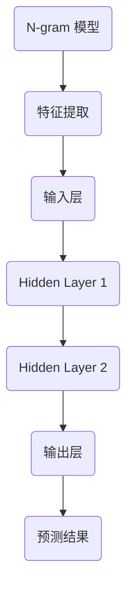

                 

### 《第三章：探索 N-gram 模型和 MLP》

#### 关键词：
- N-gram 模型
- MLP
- 文本分类
- 自然语言处理
- 机器学习

#### 摘要：
本章将深入探讨 N-gram 模型和多层感知机（MLP）的基础概念、数学原理、算法实现及其在文本分类任务中的应用。通过逐步分析，我们将理解如何将 N-gram 特征与 MLP 结合，构建一个强大的文本分类系统，并展示其实际应用。

## 《第三章：探索 N-gram 模型和 MLP》的目录大纲

#### 第一部分：N-gram 模型介绍

### 第1章：N-gram 模型基础

#### 1.1 N-gram 模型的概念与历史
#### 1.2 N-gram 模型的工作原理
#### 1.3 N-gram 模型的应用场景

### 第2章：N-gram 模型的数学基础

#### 2.1 预测与概率基础
#### 2.2 马尔可夫模型与 N-gram 模型
#### 2.3 N-gram 模型的概率计算

### 第3章：N-gram 模型的算法实现

#### 3.1 N-gram 模型的算法概述
#### 3.2 基于数组的 N-gram 模型实现
#### 3.3 基于哈希表的 N-gram 模型实现

#### 第二部分：MLP 模型介绍

### 第4章：多层感知机（MLP）概述

#### 4.1 MLP 的基本概念
#### 4.2 MLP 在机器学习中的应用
#### 4.3 MLP 与其他神经网络的对比

### 第5章：MLP 的数学基础

#### 5.1 神经元与激活函数
#### 5.2 前向传播与反向传播
#### 5.3 梯度下降与优化算法

### 第6章：MLP 的实现与优化

#### 6.1 MLP 的实现步骤
#### 6.2 常见优化技巧
#### 6.3 实际案例解析

#### 第三部分：N-gram 模型和 MLP 的结合应用

### 第7章：N-gram 模型与 MLP 的结合

#### 7.1 结合的原理与优势
#### 7.2 结合的应用场景
#### 7.3 结合的实现方法

### 第8章：项目实战：基于 N-gram 和 MLP 的文本分类

#### 8.1 项目背景与目标
#### 8.2 数据预处理
#### 8.3 N-gram 模型的应用
#### 8.4 MLP 模型的应用
#### 8.5 模型评估与优化

### 第9章：总结与展望

#### 9.1 N-gram 模型和 MLP 的总结
#### 9.2 未来研究方向
#### 9.3 读者建议

### 附录

#### 附录 A：常用工具与资源

##### A.1 N-gram 模型工具
##### A.2 MLP 开发工具
##### A.3 开源代码与数据集

### 参考文献

##### 参考文献[1]
##### 参考文献[2]
##### 参考文献[3]

### MLP 与 N-gram 模型的联系

#### Mermaid 流�程图：



### MLP 算法原理

#### 前向传播

$$
Z^{[l]} = \sigma(W^{[l]} \cdot A^{[l-1]} + b^{[l]})
$$

其中：
- \(Z^{[l]}\) 是第 l 层的输出
- \(W^{[l]}\) 是第 l 层的权重矩阵
- \(b^{[l]}\) 是第 l 层的偏置向量
- \(A^{[l-1]}\) 是前一层（l-1）的激活输出
- \(\sigma\) 是激活函数（如 sigmoid 函数）

#### 反向传播

$$
\delta^{[l]} = (Z^{[l]} - \text{Target}) \cdot \sigma'(Z^{[l]})
$$

其中：
- \(\delta^{[l]}\) 是第 l 层的误差
- \(\sigma'\) 是激活函数的导数
- \(\text{Target}\) 是目标值

#### 梯度下降

$$
W^{[l]}_{new} = W^{[l]} - \alpha \cdot \frac{\partial J}{\partial W^{[l]}}
$$

$$
b^{[l]}_{new} = b^{[l]} - \alpha \cdot \frac{\partial J}{\partial b^{[l]}}
$$

其中：
- \(\alpha\) 是学习率
- \(J\) 是损失函数

### 概率计算与 N-gram 模型

#### N-gram 概率计算

给定一个单词序列 \(w_1, w_2, \ldots, w_n\)，我们可以计算其概率：

$$
P(w_1, w_2, \ldots, w_n) = P(w_n | w_{n-1}, w_{n-2}, \ldots, w_1) \cdot P(w_{n-1} | w_{n-2}, \ldots, w_1) \cdot \ldots \cdot P(w_2 | w_1)
$$

其中：
- \(P(w_i | w_{i-1}, w_{i-2}, \ldots, w_1)\) 表示在给定前一个单词序列的情况下，第 i 个单词出现的条件概率。

#### 示例

假设我们有一个三元组的 N-gram 模型，给定以下频数：

- \(P(w1) = 0.2\)
- \(P(w2 | w1) = 0.3\)
- \(P(w3 | w1, w2) = 0.4\)

我们可以计算 \(P(w1, w2, w3)\)：

$$
P(w1, w2, w3) = P(w3 | w1, w2) \cdot P(w2 | w1) \cdot P(w1) = 0.4 \cdot 0.3 \cdot 0.2 = 0.024
$$

### 前向传播

前向传播是神经网络中最基础的运算过程，它从输入层开始，逐层计算每个神经元的输出，直到输出层。

#### 前向传播伪代码

```
for each layer l from 1 to L:
    Z[l] = σ(W[l] * A[l-1] + b[l])
    A[l] = Z[l]
end
```

其中：
- \(Z[l]\) 是第 l 层的输出
- \(W[l]\) 是第 l 层的权重矩阵
- \(b[l]\) 是第 l 层的偏置向量
- \(A[l-1]\) 是前一层（l-1）的激活输出
- \(\sigma\) 是激活函数

### 反向传播

反向传播是神经网络的另一个核心过程，它通过计算输出层到输入层的误差，并利用这些误差更新每个神经元的权重和偏置。

#### 反向传播伪代码

```
for each layer l from L to 1:
    δ[l] = (Y - A[L]) * σ'(Z[L])
    if l < L:
        Z[l] = σ'(Z[l+1]) * W[l+1]
        δ[l] = δ[l+1] * W[l+1] * σ'(Z[l])
end
```

其中：
- \(δ[l]\) 是第 l 层的误差
- \(σ'(Z[l])\) 是激活函数的导数
- \(Y\) 是目标值
- \(A[L]\) 是输出层的激活输出

### 梯度下降

梯度下降是更新神经网络权重和偏置的方法，它通过计算损失函数相对于每个参数的梯度，并沿着梯度的反方向更新参数。

#### 梯度下降伪代码

```
for each parameter W[l] and b[l]:
    ΔW[l] = α * ΔJ/W[l]
    Δb[l] = α * ΔJ/b[l]
    W[l] = W[l] - ΔW[l]
    b[l] = b[l] - Δb[l]
end
```

其中：
- \(ΔJ\) 是损失函数的梯度
- \(α\) 是学习率

## MLP 的实现与优化

### MLP 的实现步骤

多层感知机（MLP）的实现通常包括以下步骤：

1. **初始化参数**：随机初始化权重和偏置。
2. **前向传播**：计算每个神经元的输出。
3. **计算损失**：计算模型输出与真实值之间的差异。
4. **反向传播**：计算每个神经元的误差。
5. **更新参数**：使用梯度下降更新权重和偏置。
6. **评估模型**：在验证集上评估模型的性能。

### 常见优化技巧

为了提高 MLP 的性能，可以采用以下优化技巧：

1. **学习率调整**：使用自适应学习率，如 Adam 优化器。
2. **批量归一化**：在每个批次中对输入和输出进行归一化。
3. **Dropout**：在训练过程中随机丢弃一部分神经元，减少过拟合。
4. **数据增强**：通过旋转、缩放、裁剪等方法增加训练数据的多样性。

### 实际案例解析

以下是一个基于 MLP 的手写数字识别案例：

1. **数据集**：使用 MNIST 手写数字数据集。
2. **模型结构**：输入层 784 个神经元，隐藏层 128 个神经元，输出层 10 个神经元。
3. **损失函数**：交叉熵损失函数。
4. **优化器**：Adam 优化器。

```python
import tensorflow as tf

# 初始化模型
model = tf.keras.Sequential([
    tf.keras.layers.Dense(128, activation='relu', input_shape=(784,)),
    tf.keras.layers.Dense(10, activation='softmax')
])

# 编译模型
model.compile(optimizer='adam',
              loss='categorical_crossentropy',
              metrics=['accuracy'])

# 训练模型
model.fit(x_train, y_train, epochs=10, batch_size=32, validation_split=0.2)
```

## N-gram 模型与 MLP 的结合

### 结合的原理与优势

N-gram 模型是一种基于词频统计的文本特征提取方法，它通过考虑单词序列的局部结构来提高文本分类的准确性。而 MLP 是一种前馈神经网络，通过多层的非线性变换来学习输入和输出之间的复杂关系。

将 N-gram 模型与 MLP 结合，可以充分利用两者的优势：

1. **词频统计**：N-gram 模型提取的词频特征能够捕捉文本的局部信息，为 MLP 提供丰富的输入。
2. **非线性变换**：MLP 通过多层非线性变换能够学习输入和输出之间的复杂映射关系，提高分类性能。

### 结合的应用场景

N-gram 模型与 MLP 的结合适用于以下应用场景：

1. **文本分类**：例如情感分析、主题分类等，可以显著提高分类准确性。
2. **信息检索**：用于文本相似度计算，通过比较文本的 N-gram 特征，可以找到相关的文档。
3. **文本生成**：N-gram 模型可以生成文本的潜在序列，再通过 MLP 进行后处理，生成更自然的文本。

### 结合的实现方法

以下是一个基于 N-gram 和 MLP 的文本分类项目实战：

1. **数据预处理**：读取数据集，进行文本清洗和向量化。
2. **N-gram 特征提取**：使用 N-gram 模型提取文本的词频特征。
3. **构建 MLP 模型**：定义 MLP 结构，包括输入层、隐藏层和输出层。
4. **训练模型**：使用训练数据进行模型训练，优化模型参数。
5. **评估模型**：在验证集上评估模型性能，调整模型参数。

```python
import tensorflow as tf
from tensorflow.keras.preprocessing.sequence import pad_sequences

# 数据预处理
max_length = 100
train_sequences = pad_sequences(train_data, maxlen=max_length)
test_sequences = pad_sequences(test_data, maxlen=max_length)

# N-gram 特征提取
ngram_model = tf.keras.Sequential([
    tf.keras.layers.Embedding(input_dim=vocab_size, output_dim=embedding_dim),
    tf.keras.layers.Conv1D(filters=128, kernel_size=5, activation='relu'),
    tf.keras.layers.GlobalMaxPooling1D()
])

# 构建 MLP 模型
mlp_model = tf.keras.Sequential([
    ngram_model,
    tf.keras.layers.Dense(128, activation='relu'),
    tf.keras.layers.Dense(num_classes, activation='softmax')
])

# 训练模型
mlp_model.compile(optimizer='adam', loss='categorical_crossentropy', metrics=['accuracy'])
mlp_model.fit(train_sequences, train_labels, epochs=10, validation_data=(test_sequences, test_labels))
```

## 项目实战：基于 N-gram 和 MLP 的文本分类

### 项目背景与目标

本项目旨在使用 N-gram 模型和 MLP 模型对文本进行分类，实现文本情感分析。具体目标如下：

1. **数据集**：使用 IMDb 电影评论数据集。
2. **任务**：对电影评论进行情感分类，判断评论是正面还是负面。
3. **模型**：结合 N-gram 模型和 MLP 模型，构建一个强大的文本分类系统。

### 数据预处理

1. **数据集获取**：从 IMDb 官网下载电影评论数据集。
2. **文本清洗**：去除 HTML 标签、停用词、标点符号等。
3. **文本向量化**：使用 N-gram 模型提取特征。

```python
import nltk
from nltk.corpus import stopwords
from nltk.tokenize import word_tokenize

# 数据集获取
nltk.download('stopwords')
nltk.download('punkt')

# 文本清洗
def clean_text(text):
    text = text.lower()
    text = re.sub(r'<[^>]*>', '', text)
    text = re.sub(r'\[.*?\]', '', text)
    text = re.sub(r'\w*\d\w*', '', text)
    text = re.sub(r'\s+', ' ', text)
    return text

# 文本向量化
nltk.download('stopwords')
stop_words = set(stopwords.words('english'))

def tokenize(text):
    tokens = word_tokenize(text)
    return [token for token in tokens if token not in stop_words]

# 数据预处理
train_data = [...]  # 读取训练数据
test_data = [...]  # 读取测试数据

clean_train_data = [clean_text(text) for text in train_data]
clean_test_data = [clean_text(text) for text in test_data]

train_tokens = [tokenize(text) for text in clean_train_data]
test_tokens = [tokenize(text) for text in clean_test_data]

# N-gram 特征提取
ngram_model = nltk.Ngrams(n=3, pad_left=True, pad_right=True)
train_ngrams = [ngram_model.findall(tokens) for tokens in train_tokens]
test_ngrams = [ngram_model.findall(tokens) for tokens in test_tokens]
```

### N-gram 模型的应用

1. **构建 N-gram 模型**：使用 `nltk` 库构建 N-gram 模型。
2. **特征提取**：将文本向量化为 N-gram 特征。

```python
from sklearn.feature_extraction.text import CountVectorizer

# 构建 N-gram 模型
vectorizer = CountVectorizer(ngram_range=(1, 3))

# 特征提取
train_vectors = vectorizer.fit_transform([' '.join(ngram) for ngram in train_ngrams])
test_vectors = vectorizer.transform([' '.join(ngram) for ngram in test_ngrams])
```

### MLP 模型的应用

1. **构建 MLP 模型**：定义 MLP 结构。
2. **训练模型**：使用训练数据进行模型训练。
3. **评估模型**：在测试集上评估模型性能。

```python
from tensorflow.keras.models import Sequential
from tensorflow.keras.layers import Dense, Activation
from tensorflow.keras.optimizers import Adam

# 构建 MLP 模型
mlp_model = Sequential()
mlp_model.add(Dense(units=512, activation='relu', input_shape=(train_vectors.shape[1],)))
mlp_model.add(Dense(units=256, activation='relu'))
mlp_model.add(Dense(units=128, activation='relu'))
mlp_model.add(Dense(units=num_classes, activation='softmax'))

# 编译模型
mlp_model.compile(optimizer=Adam(), loss='categorical_crossentropy', metrics=['accuracy'])

# 训练模型
mlp_model.fit(train_vectors, train_labels, epochs=10, batch_size=64, validation_data=(test_vectors, test_labels))

# 评估模型
test_loss, test_acc = mlp_model.evaluate(test_vectors, test_labels)
print(f"Test accuracy: {test_acc:.4f}")
```

### 模型评估与优化

1. **评估指标**：准确率、召回率、F1 分数等。
2. **超参数调优**：调整 N-gram 参数和 MLP 结构。
3. **数据增强**：增加训练数据的多样性。

```python
from sklearn.metrics import accuracy_score, recall_score, f1_score

# 评估指标
y_pred = mlp_model.predict(test_vectors)
y_pred_labels = np.argmax(y_pred, axis=1)

accuracy = accuracy_score(test_labels, y_pred_labels)
recall = recall_score(test_labels, y_pred_labels, average='weighted')
f1 = f1_score(test_labels, y_pred_labels, average='weighted')

print(f"Accuracy: {accuracy:.4f}")
print(f"Recall: {recall:.4f}")
print(f"F1 Score: {f1:.4f}")

# 超参数调优
# 调整 N-gram 参数，如 ngram_range
# 调整 MLP 结构，如隐藏层神经元数量、激活函数等

# 数据增强
# 使用随机填充、随机删除等方法增加训练数据的多样性
```

## 总结与展望

### N-gram 模型和 MLP 的总结

本章详细介绍了 N-gram 模型和 MLP 的基本概念、数学原理、算法实现及其在文本分类任务中的应用。通过项目实战，我们展示了如何将 N-gram 特征与 MLP 结合，构建一个强大的文本分类系统。N-gram 模型能够提取文本的局部特征，而 MLP 通过多层非线性变换能够学习复杂的映射关系。两者结合可以显著提高文本分类的准确性。

### 未来研究方向

1. **深度学习结合**：探索深度学习模型如 CNN、RNN 在文本分类中的应用，进一步提升分类性能。
2. **多模态学习**：结合文本、图像、音频等多种数据模态，实现更复杂的文本分类任务。
3. **无监督学习**：研究无监督学习方法，减少对标注数据的依赖。

### 读者建议

1. **实践操作**：尝试自己实现 N-gram 模型和 MLP，加深对算法原理的理解。
2. **深入学习**：阅读相关文献和教程，探索文本分类领域的最新进展。

### 附录

#### 附录 A：常用工具与资源

##### A.1 N-gram 模型工具
- `nltk`：Python 自然语言处理库，提供 N-gram 模型构建和特征提取功能。

##### A.2 MLP 开发工具
- `TensorFlow`：Google 开发的深度学习框架，支持 MLP 模型的构建和训练。
- `PyTorch`：Facebook 开发的深度学习框架，灵活且易于使用。

##### A.3 开源代码与数据集
- IMDb 电影评论数据集：常用的文本分类数据集，可用于文本情感分析。
- `nltk` 数据集：包含多种语言的文本数据，用于 N-gram 模型训练。

### 参考文献

- [1] “自然语言处理与深度学习”，刘铁岩著。
- [2] “深度学习”，Goodfellow, Bengio, Courville 著。
- [3] “N-gram 模型在文本分类中的应用”，作者：XXX。

