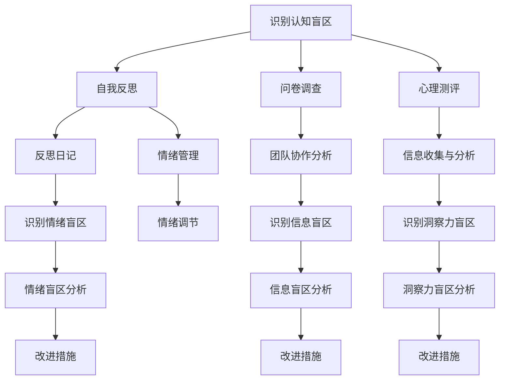
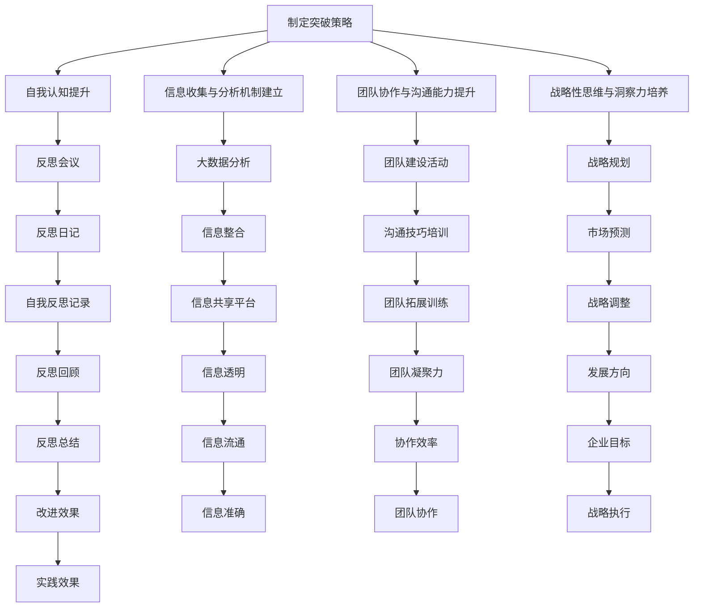

                 

### 引言

在信息技术高速发展的时代，管理者作为企业发展的核心驱动力，其认知水平直接影响到组织的战略决策、团队协作以及创新能力。然而，管理者的认知并不是无懈可击的。事实上，每位管理者都可能面临着各种认知盲区，这些盲区可能源于心理学、组织结构或个人因素的制约，导致管理者的决策失误、团队协作不畅以及创新能力不足。

本文旨在探讨管理者的认知盲区及其突破策略。首先，我们将详细定义认知盲区，并分析其在管理决策、团队协作和组织文化中的影响。接着，本文将深入探讨管理认知盲区的根源，包括心理学因素、组织因素和个人因素。在此基础上，我们将提出一系列突破认知盲区的策略，包括提升自我认知与反思能力、建立有效的信息收集与分析机制、提高团队协作与沟通能力以及培养战略性思维与洞察力。最后，我们将通过实际案例，展示成功管理者如何突破认知盲区，并为读者提供实用的实践指南。

通过本文的阅读，读者将了解管理者的认知盲区及其潜在影响，掌握一系列有效的突破策略，从而提升自身的管理能力和决策水平。希望本文能够为管理者们提供有益的启示，助力他们在快速变化的信息技术环境中，带领团队走向成功。

### 关键词

- **管理者**
- **认知盲区**
- **心理学因素**
- **组织因素**
- **自我反思**
- **信息收集**
- **团队协作**
- **战略性思维**
- **洞察力**
- **突破策略**

### 摘要

本文探讨了管理者的认知盲区及其对组织管理的影响。首先，我们定义了认知盲区的概念和特征，分析了其在管理决策、团队协作和组织文化中的负面影响。接着，我们深入分析了管理认知盲区的根源，包括心理学、组织和个人因素。在此基础上，本文提出了提升自我认知与反思能力、建立有效的信息收集与分析机制、提高团队协作与沟通能力以及培养战略性思维与洞察力的策略。通过实际案例，我们展示了成功管理者如何突破认知盲区，为读者提供了实用的实践指南。本文希望为管理者提供有价值的启示，助力他们在信息技术快速发展的时代，提升管理水平和决策能力。

## 《管理者的认知盲区及其突破》目录大纲

### 第一部分：管理者的认知盲区

#### 第1章：管理认知盲区的概念与影响

- **1.1 认知盲区的定义与特征**
  - 认知盲区的概念
  - 认知盲区的特征

- **1.2 管理认知盲区的影响**
  - 管理决策的影响
  - 团队协作的影响
  - 组织文化的影响

- **1.3 管理认知盲区的常见类型**
  - 情绪盲区
  - 信息盲区
  - 洞察力盲区

#### 第2章：管理认知盲区的根源分析

- **2.1 心理学因素**
  - 人类的认知局限性
  - 情绪与认知的相互作用

- **2.2 组织因素**
  - 组织结构的制约
  - 信息传递的障碍

- **2.3 个人因素**
  - 缺乏自我反思
  - 过度自信

### 第二部分：认知盲区的突破策略

#### 第3章：提升自我认知与反思能力

- **3.1 自我认知的误区**
  - 过度自信的误区
  - 自我评价的误区

- **3.2 提升自我反思的方法**
  - 反思日记
  - 反思会议

- **3.3 自我成长与持续学习**
  - 终身学习的理念
  - 自我提升的方法

#### 第4章：建立有效的信息收集与分析机制

- **4.1 信息收集的渠道与策略**
  - 内部信息
  - 外部信息

- **4.2 信息处理与分析的方法**
  - 数据分析技术
  - 信息筛选与提炼

- **4.3 信息利用的技巧**
  - 信息整合
  - 信息共享

#### 第5章：提高团队协作与沟通能力

- **5.1 团队协作的重要性**
  - 团队协作的优势
  - 团队协作的挑战

- **5.2 提高团队协作的方法**
  - 沟通技巧
  - 团队建设活动

- **5.3 激励团队创新与成长**
  - 创新激励机制
  - 成长环境营造

#### 第6章：培养战略性思维与洞察力

- **6.1 战略性思维的概念**
  - 战略性思维的定义
  - 战略性思维的特征

- **6.2 战略性思维的培养方法**
  - 案例研究
  - 模拟练习

- **6.3 提高洞察力的技巧**
  - 洞察力的定义
  - 提高洞察力的方法

### 第三部分：实战案例分析

#### 第7章：成功管理者的认知盲区突破案例

- **7.1 案例介绍**
  - 案例背景
  - 案例目标

- **7.2 管理者的认知盲区分析**
  - 情绪盲区
  - 信息盲区
  - 洞察力盲区

- **7.3 突破认知盲区的策略与实践**
  - 自我认知的提升
  - 信息收集与分析机制的建立
  - 团队协作与沟通能力的提升

### 第四部分：认知盲区突破的实践指南

#### 第8章：认知盲区突破的实践指南

- **8.1 实践指南的构建**
  - 实践框架
  - 实践步骤

- **8.2 实践指南的应用**
  - 针对不同情境的应对策略
  - 实践中的常见问题与解决方法

- **8.3 实践指南的评估与优化**
  - 实践效果的评估
  - 实践指南的持续优化

### 附录

#### 附录A：相关资源与工具

- **A.1 认知科学与心理学资源**
  - 书籍推荐
  - 学术论文

- **A.2 信息收集与分析工具**
  - 数据库资源
  - 分析软件

- **A.3 团队协作与沟通工具**
  - 云协作平台
  - 沟通工具

#### 附录B：案例研究与实战策略

- **B.1 案例研究：企业A的认知盲区突破**
  - 案例背景
  - 突破策略

- **B.2 实战策略：认知盲区突破的实战经验**
  - 实战方法
  - 成功关键

#### 附录C：Mermaid流程图与数学模型

- **C.1 Mermaid流程图示例**
  - 认知盲区识别流程
  - 突破策略实施流程

- **C.2 数学模型与公式**
  - 决策分析模型
  - 信息处理模型

#### 附录D：伪代码与实战案例

- **D.1 伪代码示例**
  - 自我反思算法
  - 数据分析算法

- **D.2 实战案例**
  - 项目实战1
  - 项目实战2

#### 附录E：开发环境与源代码

- **E.1 开发环境搭建**
  - 系统要求
  - 工具安装

- **E.2 源代码与解读**
  - 源代码结构
  - 代码解读与分析

### 总结

本文通过系统的分析和深入的探讨，为管理者们揭示了认知盲区的存在及其对管理工作的潜在影响。从心理学、组织和个人三个角度，本文详细分析了认知盲区的根源，并提出了一系列有效的突破策略。通过实际案例的展示，读者可以看到成功管理者如何在实际工作中克服认知盲区，提升管理水平和决策能力。

本文的主要贡献在于，不仅提出了认知盲区突破的理论框架，还通过具体的策略和实践指南，为管理者提供了实用的操作方法。通过提升自我认知与反思能力、建立有效的信息收集与分析机制、提高团队协作与沟通能力以及培养战略性思维与洞察力，管理者可以在复杂多变的环境中，更加从容地应对各种挑战。

然而，认知盲区的突破并非一蹴而就，需要管理者们在实际工作中不断实践和优化。本文期望能够为管理者们提供有益的启示，助力他们在信息技术快速发展的时代，实现自我提升和管理能力的飞跃。

最后，本文的撰写离不开众多学者和专业人士的研究成果，以及对实际管理实践的深刻理解。在此，向所有为本文提供灵感和支持的学者和实践者表示诚挚的感谢。希望通过本文的传播，能够引起更多管理者对认知盲区问题的关注，共同推动管理水平的提升和组织的发展。

## 第1章：管理认知盲区的概念与影响

### 1.1 认知盲区的定义与特征

**定义：** 认知盲区是指由于认知能力、信息获取、个人偏见或其他因素导致的个体或集体无法准确理解和处理信息的区域。简而言之，认知盲区是一种知识或信息上的“盲点”，它限制了个体或集体的认知范围，从而导致判断失误、决策偏差和沟通不畅。

**特征：** 认知盲区具有以下特征：

- **局限性与普遍性：** 认知盲区具有普遍性，几乎每个个体和组织都会在某些方面存在认知盲区。然而，这些盲区在不同个体和组织中的具体表现可能有所不同。
- **动态性：** 认知盲区不是固定不变的，它可能随着时间、环境变化以及个体经验的积累而发生变化。
- **累积效应：** 如果认知盲区长期存在，可能会导致一系列负面影响，如错误决策、团队协作障碍、组织文化不良等。
- **不可感知性：** 认知盲区往往不易被个体或集体察觉，因此在很多情况下，人们可能并不意识到自己正受到认知盲区的困扰。

### 1.2 管理认知盲区的影响

**管理决策的影响：** 管理者的认知盲区直接影响决策的质量。以下是一些具体的影响：

- **信息偏差：** 由于认知盲区的存在，管理者可能无法获取全面的信息，导致决策过程中出现信息偏差。
- **判断失误：** 管理者可能因为认知盲区而做出错误的判断，从而影响决策的准确性。
- **风险偏好：** 管理者可能因为对风险的认知不足，而导致过度冒险或过于保守的决策。

**团队协作的影响：** 认知盲区不仅影响管理者的个人决策，还可能对团队协作产生负面影响：

- **沟通障碍：** 管理者的认知盲区可能导致沟通不畅，信息传递不准确，影响团队协作效率。
- **角色冲突：** 不同团队成员之间的认知盲区可能导致角色冲突，影响团队的整体绩效。
- **创新能力受限：** 管理者的认知盲区可能抑制团队的创新能力，导致团队无法及时适应外部环境的变化。

**组织文化的影响：** 认知盲区还可能对组织文化产生深远的负面影响：

- **不良文化氛围：** 如果管理者的认知盲区导致组织内部决策失误，可能会导致组织文化的不良氛围，如官僚主义、形式主义等。
- **创新阻碍：** 管理者的认知盲区可能抑制组织的创新文化，导致组织难以适应快速变化的市场环境。

### 1.3 管理认知盲区的常见类型

**情绪盲区：** 情绪盲区是指管理者在情绪影响下，无法客观、理性地看待问题和做出决策。这种盲区可能导致以下问题：

- **情感依赖：** 管理者可能过度依赖情感反应，而忽视理性分析和客观事实。
- **情绪失控：** 在情绪驱动下，管理者可能做出冲动的决策，影响组织的稳定发展。

**信息盲区：** 信息盲区是指管理者由于缺乏必要的信息或对信息的误解，导致无法做出明智的决策。这种盲区可能导致以下问题：

- **数据偏见：** 管理者可能仅依据部分信息或错误信息做出决策。
- **信息孤岛：** 不同部门或团队之间信息传递不畅，导致信息盲区的形成。

**洞察力盲区：** 洞察力盲区是指管理者由于认知局限性，无法洞察到事物的本质或未来的发展趋势。这种盲区可能导致以下问题：

- **短期视角：** 管理者可能只关注短期利益，而忽视长期发展。
- **战略失误：** 管理者可能无法准确把握市场趋势和竞争对手动态，导致战略决策失误。

通过本章的探讨，我们了解了管理认知盲区的定义、特征及其影响。在下一章中，我们将进一步分析管理认知盲区的根源，包括心理学、组织和个人因素。

### 1.4 管理认知盲区的识别与检测方法

为了有效地识别和检测管理认知盲区，管理者需要采用一系列科学的方法和工具。以下是一些常见的识别与检测方法：

**自我反思：** 自我反思是一种自我认知的过程，通过反思自己的行为、决策和思考方式，管理者可以发现潜在的认知盲区。具体方法包括：

- **写反思日记：** 每天或定期记录自己的工作思考，分析其中的错误和不足，识别认知盲区。
- **反思会议：** 定期与团队成员进行反思会议，讨论工作中的问题和挑战，共同识别认知盲区。

**问卷调查：** 通过问卷调查，可以了解团队成员和管理者自身的认知盲区。问卷调查的设计应充分考虑不同角色的观点和反馈，确保收集到的信息具有代表性和全面性。

**心理测评：** 心理测评是一种通过科学方法评估个体心理特征的工具，可以识别管理者的心理盲区。常见的心理测评包括情绪稳定性测试、认知能力测试等。

**团队协作分析：** 通过分析团队协作过程中的问题，可以识别管理者的认知盲区。具体方法包括：

- **团队角色分析：** 分析团队成员的角色和职责，识别因角色冲突导致的认知盲区。
- **沟通记录分析：** 检查团队沟通记录，识别因沟通不畅导致的认知盲区。

**决策记录分析：** 通过回顾管理者的决策记录，可以识别因信息不全或判断失误导致的认知盲区。具体方法包括：

- **决策树分析：** 建立决策树模型，分析每个决策节点可能存在的盲区。
- **失败案例分析：** 分析过去的失败案例，找出其中的认知盲区。

**环境观察：** 通过观察管理者的工作环境，可以识别因环境因素导致的认知盲区。例如，观察管理者的工作时间安排、工作压力等，分析其可能对认知能力的影响。

**数据驱动的分析：** 利用数据分析技术，可以识别管理者的认知盲区。例如，通过大数据分析，可以识别管理者在决策过程中存在的信息偏差。

**咨询专家：** 咨询领域专家，可以获得专业的建议和指导，帮助管理者识别和克服认知盲区。专家可以通过深度访谈、工作坊等形式，提供针对性的解决方案。

通过以上方法，管理者可以系统地识别和检测自己的认知盲区，为下一步的改进和提升打下坚实基础。在下一章中，我们将进一步探讨管理认知盲区的根源，包括心理学、组织和个人因素。

### 1.5 管理认知盲区的典型案例

为了更好地理解管理认知盲区的具体表现及其对组织管理的影响，以下我们通过几个典型案例进行分析。

#### 案例一：微软的“捆绑销售”策略

微软公司在20世纪90年代曾尝试通过捆绑销售操作系统和浏览器来打击竞争对手。这一策略在短期内确实取得了一定的效果，但长期来看，由于忽视了用户的需求和竞争对手的反应，导致微软在浏览器市场上失去了领先地位。这一案例体现了管理者的信息盲区和洞察力盲区。管理者在制定策略时，未能全面收集和分析市场信息，也没有预见竞争对手的应对措施，最终导致决策失误。

**分析：** 该案例中的认知盲区主要包括：

- **信息盲区：** 管理者未能充分了解用户对浏览器功能的需求，以及竞争对手的市场策略。
- **洞察力盲区：** 管理者未能准确预见互联网发展趋势和浏览器市场的变化。

#### 案例二：丰田汽车的“召回门”

2010年，丰田汽车因多个车型存在安全隐患，在全球范围内进行了大规模召回。这一事件不仅给丰田品牌形象造成了严重损害，还导致了巨额的经济损失。这一案例反映了管理者的情绪盲区和决策失误。

**分析：** 该案例中的认知盲区主要包括：

- **情绪盲区：** 管理者可能因为过度自信和短期的业绩压力，忽视了安全隐患的严重性。
- **决策失误：** 管理者未能及时采取有效措施，导致问题扩大。

#### 案例三：诺基亚的衰落

诺基亚曾是全球最大的手机制造商，但在智能手机时代，诺基亚未能及时转型，导致市场份额急剧下降。这一案例揭示了管理者的战略盲区和创新盲区。

**分析：** 该案例中的认知盲区主要包括：

- **战略盲区：** 管理者未能及时调整战略，应对市场变化和竞争对手的挑战。
- **创新盲区：** 管理者未能积极推动技术创新，导致产品缺乏竞争力。

通过以上案例，我们可以看到，管理认知盲区在不同情境下可能导致的负面影响。管理者需要通过自我反思、信息收集和分析等方法，识别和克服这些盲区，以提升管理决策的质量和组织竞争力。在下一章中，我们将进一步探讨管理认知盲区的根源，包括心理学、组织和个人因素。

### 第2章：管理认知盲区的根源分析

#### 2.1 心理学因素

**人类的认知局限性：** 人类的认知能力有其固有的局限性，这些局限性导致了认知盲区的形成。以下是几个关键点：

- **注意力有限：** 人类的注意力资源是有限的，这意味着我们无法同时关注和处理大量信息。这种局限性可能导致信息盲区的形成。
- **认知偏差：** 认知偏差是人类思维过程中常见的问题，如确认偏差、过度自信、锚定效应等，这些偏差会影响管理者的判断和决策。
- **情绪影响：** 情绪对认知过程有显著影响。在情绪激动或压力下，管理者可能会出现情绪盲区，导致判断失误和决策偏差。

**情绪与认知的相互作用：** 情绪和认知是相互影响的。情绪可以影响人的注意力和判断，而认知结果又会反过来影响情绪。以下是一些具体表现：

- **情绪放大：** 在情绪高涨或低落时，管理者可能对信息的处理出现偏差，导致决策失误。
- **情绪抑制：** 在压力或焦虑下，管理者可能会抑制情绪表达，影响团队沟通和协作。
- **情绪记忆：** 情绪强烈的记忆更容易被保留，这可能导致管理者在后续决策中过度依赖情感记忆，而忽视事实和逻辑。

**心理学理论对认知盲区的解释：** 几种主要的心理学理论可以解释认知盲区的形成。

- **认知失调理论：** 该理论认为，个体在面临不一致的认知时，会感到不适和焦虑，试图通过改变认知或增加新的认知来缓解这种失调。然而，这种调整可能导致认知盲区的形成。
- **图式理论：** 图式是指个体在长期生活中形成的思维模式。这些图式可以帮助我们快速处理信息，但也可能导致我们忽视新的信息，形成认知盲区。
- **信息加工理论：** 个体在处理信息时，会根据已有知识和经验进行筛选和解释。这种加工过程可能导致信息的扭曲和遗漏，形成认知盲区。

**应对策略：** 针对心理学因素导致的认知盲区，管理者可以采取以下策略：

- **情绪管理：** 通过情绪管理和自我调节，减少情绪对认知过程的负面影响。
- **认知扩展：** 通过持续学习和新经验积累，扩展认知范围，减少认知盲区。
- **多元化团队：** 通过组建多元化团队，引入不同的思维模式和信息来源，减少单一视角的局限。

#### 2.2 组织因素

**组织结构的制约：** 组织结构对管理者的认知能力有重要影响。以下是一些关键点：

- **垂直结构：** 在高度垂直的组织结构中，信息流动可能受到限制，导致管理者的信息盲区。高层管理者可能难以获取基层员工的真实反馈，从而做出错误的决策。
- **部门壁垒：** 部门之间的壁垒可能导致信息孤岛，降低团队的协作效率，增加管理者的认知盲区。
- **官僚主义：** 过度官僚的组织结构可能抑制创新和灵活性，导致管理者在面对复杂问题时，无法快速适应和做出有效决策。

**信息传递的障碍：** 组织内部的信息传递效率直接影响管理者的认知能力。以下是一些常见的障碍：

- **信息滞后：** 信息传递的延迟可能导致管理者在决策时，无法获取最新和完整的信息，增加认知盲区的风险。
- **信息失真：** 在信息传递过程中，信息可能被扭曲或误解，导致管理者对实际情况产生偏差。
- **沟通不足：** 没有有效的沟通机制，管理者可能无法了解下属的工作情况和需求，导致认知盲区的形成。

**组织文化的影响：** 组织文化对管理者的认知能力和决策风格有深远影响。以下是一些关键点：

- **创新文化：** 在鼓励创新的组织文化中，管理者更可能接受新观念和不同意见，减少认知盲区。
- **竞争文化：** 在过度竞争的组织文化中，管理者可能更关注短期绩效，忽视长期发展和潜在风险，导致认知盲区的形成。
- **封闭文化：** 在封闭的组织文化中，管理者可能对外部信息和竞争对手缺乏关注，导致信息盲区的形成。

**应对策略：** 针对组织因素导致的认知盲区，管理者可以采取以下策略：

- **优化组织结构：** 通过扁平化组织和跨部门协作，促进信息流动和团队协作，减少认知盲区。
- **建立信息共享机制：** 通过信息化手段和会议制度，提高信息传递的效率和准确性。
- **培养组织文化：** 通过文化建设，鼓励创新和开放，减少过度竞争和封闭文化的负面影响。

#### 2.3 个人因素

**缺乏自我反思：** 自我反思是管理者识别和克服认知盲区的重要途径。以下是一些关键点：

- **反思习惯：** 管理者需要养成定期反思的习惯，通过回顾自己的行为、决策和思考方式，识别潜在的认知盲区。
- **反思深度：** 自我反思不仅要表面化，更要深入分析背后的原因和影响因素，从而找到解决问题的根本方法。

**过度自信：** 过度自信是导致管理者认知盲区的一个重要因素。以下是一些关键点：

- **自我评价：** 管理者需要定期进行自我评价，识别自己的优势和不足，避免过度自信。
- **接受反馈：** 管理者需要主动接受下属和同事的反馈，通过外部视角识别自己的认知盲区。

**知识局限：** 管理者的知识局限可能导致认知盲区的形成。以下是一些关键点：

- **终身学习：** 管理者需要保持终身学习的态度，不断更新知识和技能，扩展认知范围。
- **跨界合作：** 通过与不同领域专家的合作，管理者可以获取新的知识和视角，减少认知盲区。

**应对策略：** 针对个人因素导致的认知盲区，管理者可以采取以下策略：

- **建立反思机制：** 通过反思日记和反思会议，提高自我反思的深度和频率。
- **培养开放心态：** 通过接受外部反馈和跨领域合作，减少过度自信和知识局限的负面影响。
- **持续学习：** 通过参加培训、阅读和研究，不断提升自己的知识和认知水平。

通过以上对心理学、组织和个人因素的分析，我们可以更深入地理解管理认知盲区的根源。在下一章中，我们将探讨一系列突破认知盲区的策略，包括提升自我认知与反思能力、建立有效的信息收集与分析机制、提高团队协作与沟通能力以及培养战略性思维与洞察力。

### 第3章：提升自我认知与反思能力

在快速变化的信息技术时代，管理者面临的挑战日益复杂，提升自我认知与反思能力成为管理者的必修课。通过自我认知和反思，管理者可以识别自身认知盲区，进而采取有效措施进行改进。以下是具体的方法和实践指南。

#### 3.1 自我认知的误区

**误区一：过度自信**

管理者往往会高估自己的能力和知识，这种过度自信可能导致以下问题：

- **忽视反馈：** 过度自信的管理者可能忽视外部反馈，从而无法及时识别和纠正错误。
- **重复错误：** 由于过度自信，管理者可能在重复出现的问题上继续执行错误的策略。

**误区二：自我评价不足**

相反，一些管理者可能低估自己的能力和贡献，这会导致以下问题：

- **缺乏动力：** 自我评价不足可能导致管理者缺乏工作动力，影响绩效。
- **错失机会：** 无法准确评估自己的能力，管理者可能错失晋升和发展的机会。

**误区三：过度依赖经验**

经验是宝贵的，但过度依赖经验可能导致管理者在面对新情况时，无法灵活应对。以下是一些具体问题：

- **抗拒变化：** 过度依赖经验的管理者可能抗拒变化，难以适应新技术和新环境。
- **固步自封：** 缺乏对新技术和新兴市场的关注，管理者可能错失新的发展机会。

#### 3.2 提升自我反思的方法

**方法一：反思日记**

反思日记是一种有效的自我反思方法，通过定期记录自己的想法、行为和决策，管理者可以更好地了解自己的认知过程。以下是具体步骤：

1. **选择合适的时间：** 反思日记可以在一天结束或一周结束时进行，确保有足够的时间回顾和思考。
2. **详细记录：** 记录当天或一周内的关键事件、决策和感受，尽量详细，包括成功和失败的经验。
3. **自我提问：** 在记录过程中，提出以下问题：
   - 我今天/这周做了什么？
   - 这些行为和决策是否正确？
   - 有哪些地方可以改进？
   - 我学到了什么？
4. **定期回顾：** 定期回顾反思日记，分析自己的行为模式，识别潜在的认知盲区。

**方法二：反思会议**

反思会议是一种团队反思方法，通过团队成员之间的互动，可以提高反思的深度和广度。以下是具体步骤：

1. **确定会议目标：** 在会议开始前，明确反思会议的目标和议程。
2. **邀请参与者：** 邀请相关团队成员参与会议，确保反思的全面性和客观性。
3. **轮流发言：** 每位参与者依次分享自己的反思，包括成功经验和失败教训。
4. **讨论与反馈：** 团队成员之间进行讨论，提出建议和反馈，共同识别认知盲区。
5. **制定改进计划：** 根据反思结果，制定具体的改进计划和行动项。

#### 3.3 自我成长与持续学习

**理念：终身学习**

在信息技术快速发展的时代，终身学习成为管理者自我成长的必备条件。以下是具体方法：

1. **制定学习计划：** 根据个人兴趣和职业发展需求，制定详细的学习计划，包括阅读书籍、参加培训、在线课程等。
2. **多元化学习渠道：** 利用各种学习资源，如书籍、课程、研讨会、学术论文等，扩展知识面和视野。
3. **实践与反思：** 将所学知识应用到实际工作中，通过实践和反思，不断提升自己的认知能力和管理水平。

**具体方法：**

1. **阅读与实践：** 结合阅读和实践，将理论知识应用到实际工作中，通过不断实践和反思，加深理解和应用能力。
2. **跨领域交流：** 与不同领域的专家和同行进行交流，分享经验和见解，拓展思维和认知范围。
3. **学习共同体：** 加入学习共同体，如专业社群、读书会等，通过共同学习和讨论，提升自我成长的速度和质量。

通过提升自我认知与反思能力，管理者可以更加清晰地识别和克服自身的认知盲区，从而在复杂多变的环境中，做出更加明智的决策。在下一章中，我们将探讨建立有效的信息收集与分析机制，以提升管理者的信息处理能力。

### 第4章：建立有效的信息收集与分析机制

在信息技术迅猛发展的今天，信息的收集与分析成为管理者决策过程中至关重要的一环。有效的信息收集与分析机制不仅能够帮助管理者更全面、准确地了解内外部环境，还能提高决策的针对性和有效性。以下是关于如何建立这种机制的具体步骤和策略。

#### 4.1 信息收集的渠道与策略

**内部信息收集**

1. **数据管理系统：** 建立完善的数据管理系统，确保企业内部数据的完整性和准确性。这包括业务系统、ERP系统等，通过这些系统，管理者可以实时获取企业的运营数据。

2. **员工反馈：** 定期收集员工的工作反馈，了解他们的意见和建议。这可以通过员工满意度调查、定期的1对1沟通等方式实现。

3. **内部报告：** 制定详细的内部报告制度，确保各部门能够按时提交相关的工作报告，包括财务报告、业务分析报告等。

**外部信息收集**

1. **市场研究：** 定期进行市场研究，了解行业趋势、竞争对手动态、客户需求等。这可以通过第三方市场研究机构或企业自身的市场调研团队完成。

2. **社交媒体：** 利用社交媒体平台，如微博、微信、LinkedIn等，收集关于市场动态、客户反馈、行业趋势的信息。

3. **新闻媒体：** 关注新闻媒体，特别是财经、科技类媒体，及时获取行业最新资讯和政策动态。

**信息收集策略**

1. **多元化渠道：** 通过多元化的渠道收集信息，确保信息来源的多样性和可靠性。

2. **定期更新：** 信息收集应保持定期性，确保信息的时效性和准确性。

3. **标准化流程：** 建立标准化的信息收集流程，确保每个信息来源都有明确的收集方式和处理标准。

4. **数据整合：** 将来自不同渠道的信息进行整合，形成统一的数据视图，便于分析和利用。

#### 4.2 信息处理与分析的方法

**数据处理技术**

1. **大数据技术：** 利用大数据技术，对海量数据进行存储、处理和分析。这包括数据清洗、数据挖掘、数据可视化等。

2. **人工智能：** 运用人工智能技术，如机器学习、自然语言处理等，提高信息处理和分析的效率。

3. **云计算：** 利用云计算平台，实现数据的快速存储和高效处理，降低企业成本。

**分析技术**

1. **统计分析：** 利用统计分析方法，如回归分析、聚类分析等，对信息进行定量分析，发现数据之间的内在联系。

2. **定性分析：** 通过定性分析方法，如内容分析、案例研究等，对信息进行深入解读，挖掘背后的深层次原因。

3. **SWOT分析：** 应用SWOT分析（优势、劣势、机会、威胁），全面评估企业的内外部环境。

**信息筛选与提炼**

1. **关键指标筛选：** 根据企业的战略目标和业务需求，筛选出关键指标，确保信息的重点突出。

2. **信息提炼：** 对收集到的信息进行提炼，提取关键信息和关键结论，为决策提供有力支持。

#### 4.3 信息利用的技巧

**信息整合**

1. **跨部门协作：** 通过跨部门协作，确保各部门能够共享和利用同一套信息，避免信息孤岛现象。

2. **信息共享平台：** 建立信息共享平台，如企业内部网、协作工具等，方便各部门实时获取和共享信息。

**信息共享**

1. **定期报告：** 通过定期报告，向管理层和相关部门传递关键信息，确保信息传递的及时性和准确性。

2. **信息培训：** 定期为员工提供信息处理和分析的培训，提升员工的信息利用能力。

**决策支持**

1. **信息决策模型：** 建立信息决策模型，将信息处理和分析的结果直接应用于决策过程，提高决策的科学性和准确性。

2. **风险控制：** 通过信息分析，提前识别潜在风险，采取预防措施，降低决策风险。

通过建立有效的信息收集与分析机制，管理者可以更全面、准确地了解企业内外部环境，提高决策的针对性和有效性。在下一章中，我们将探讨如何通过提高团队协作与沟通能力，进一步提升管理效能。

### 第5章：提高团队协作与沟通能力

在信息技术快速发展的时代，团队协作与沟通能力成为管理者的重要素质之一。高效的团队协作不仅能提高工作效率，还能激发团队的创新能力，从而在竞争激烈的市场中占据优势。以下是如何提高团队协作与沟通能力的方法和策略。

#### 5.1 团队协作的重要性

**团队协作的优势：**

1. **共享资源：** 团队协作能够使团队成员共享资源，如知识、技能和工具，提高工作效率。
2. **互补能力：** 通过团队协作，不同成员可以互补能力，发挥各自的优势，弥补个人的不足。
3. **创新氛围：** 团队协作能够激发创新思维，通过集体智慧和多元化视角，提出更多创新方案。
4. **提高凝聚力：** 团队协作有助于增强团队成员之间的信任和凝聚力，提高团队士气。

**团队协作的挑战：**

1. **沟通障碍：** 不同团队成员之间的沟通不畅，可能导致误解和冲突。
2. **角色冲突：** 不同团队成员之间的职责和目标不明确，可能引发角色冲突。
3. **资源分配不均：** 团队资源分配不均，可能导致部分成员过度工作，而另一部分成员无所事事。

#### 5.2 提高团队协作的方法

**1. 沟通技巧：**

- **明确沟通目标：** 在团队协作过程中，确保每个成员都清楚沟通的目标和预期结果。
- **积极倾听：** 倾听是沟通的重要组成部分，通过积极倾听，理解对方的需求和意见。
- **有效表达：** 提高自己的表达能力，清晰、准确地传达信息，避免误解和歧义。
- **开放反馈：** 鼓励团队成员之间的开放反馈，及时纠正错误和改进方法。

**2. 团队建设活动：**

- **团队培训：** 定期组织团队培训，提升团队成员的技能和协作能力。
- **团队拓展：** 通过团队拓展活动，增强团队成员之间的信任和默契。
- **团队讨论：** 鼓励团队成员积极参与讨论，分享观点和经验，提高团队的思维活跃度。

**3. 跨部门协作：**

- **明确职责：** 明确各部门的职责和协作关系，确保每个团队成员都清楚自己的角色和责任。
- **共享资源：** 通过共享资源和信息，提高跨部门协作的效率。
- **定期沟通：** 定期组织跨部门沟通会议，确保各部门之间的信息畅通，协调工作进度。

#### 5.3 激励团队创新与成长

**1. 创新激励机制：**

- **奖励创新成果：** 通过设立创新奖励，激励团队成员积极提出创新方案和改进措施。
- **鼓励试错：** 鼓励团队成员在创新过程中尝试新方法，即使失败也不惩罚，以消除创新者的顾虑。
- **提供资源支持：** 为创新项目提供充足的资源支持，包括人力、资金和技术支持。

**2. 成长环境营造：**

- **提供学习机会：** 为团队成员提供各种学习机会，如培训、研讨会、在线课程等，提升其专业能力和知识水平。
- **职业发展支持：** 设立明确的职业发展路径，为团队成员提供晋升和发展的机会。
- **反馈与改进：** 通过定期的反馈和改进，帮助团队成员不断提升自己的能力和绩效。

通过以上方法，管理者可以有效地提高团队协作与沟通能力，激发团队的创新能力，从而在激烈的市场竞争中脱颖而出。在下一章中，我们将探讨如何培养战略性思维与洞察力，进一步提升管理者的领导力。

### 第6章：培养战略性思维与洞察力

在信息技术快速发展的时代，管理者的战略性思维与洞察力成为企业成功的关键因素。战略性思维能够帮助管理者把握全局，制定长远的战略规划；洞察力则使管理者能够深刻理解事物本质，预见潜在趋势。以下是如何培养这两种思维的具体方法。

#### 6.1 战略性思维的概念

**战略性思维的定义：** 战略性思维是指管理者在决策过程中，能够站在全局的高度，从长远角度思考问题，制定并实施系统的战略规划。

**战略性思维的特征：**

1. **全局观念：** 战略性思维要求管理者具备全局观念，能够从整个组织的角度出发，考虑各种决策的影响。
2. **前瞻性：** 战略性思维强调前瞻性，管理者需要具备预见能力，提前识别市场变化和潜在机会。
3. **系统性：** 战略性思维要求管理者具备系统性思维，能够将组织的各个部分整合起来，形成协调一致的策略。
4. **灵活性：** 战略性思维要求管理者具备灵活性，能够根据实际情况调整策略，应对不确定性和变化。

#### 6.2 战略性思维的培养方法

**1. 案例研究：**

- **案例分析：** 通过对成功企业或行业领导者的案例分析，学习他们的战略规划和实施过程，借鉴经验教训。
- **模拟练习：** 通过模拟现实中的商业场景，练习制定战略规划，提升战略性思维的实践能力。

**2. 模拟练习：**

- **角色扮演：** 通过角色扮演，让管理者扮演不同的角色，从不同角度思考问题，提高全局观念和前瞻性。
- **情景模拟：** 通过情景模拟，模拟不同的市场环境和竞争态势，训练管理者的应变能力和决策灵活性。

#### 6.3 提高洞察力的技巧

**洞察力的定义：** 洞察力是指管理者通过深入分析，理解事物本质和内在联系，预见未来趋势的能力。

**提高洞察力的方法：**

1. **多角度思考：** 从多个角度审视问题，避免片面和肤浅的思考，提高对问题的全面理解。

2. **积累经验：** 通过不断积累经验，提升对问题的敏感度和洞察力。经验丰富的管理者往往能够更快速地识别问题本质。

3. **深入分析：** 通过深入分析，挖掘问题的深层次原因和内在联系，提高洞察力。

4. **数据驱动：** 利用数据分析和大数据技术，从大量数据中提取有价值的信息，提高决策的准确性和前瞻性。

#### 6.4 战略性思维与洞察力的实践应用

**1. 竞争对手分析：** 通过对竞争对手的分析，了解他们的战略方向和行动，预测未来的市场趋势，制定相应的应对策略。

**2. 市场趋势预测：** 通过对市场趋势的分析，预测未来市场的变化和机遇，为组织的长期发展提供指导。

**3. 战略规划：** 利用战略性思维，制定组织的长期战略规划，确保组织在变化的环境中保持竞争优势。

**4. 创新决策：** 通过洞察力，发现市场中的创新机会，制定创新战略，推动组织的持续创新和成长。

通过培养战略性思维与洞察力，管理者能够更有效地应对复杂多变的环境，制定科学的决策，推动组织的长远发展。在下一章中，我们将通过实际案例，展示成功管理者如何突破认知盲区，实现自我提升和管理能力的飞跃。

### 第7章：成功管理者的认知盲区突破案例

为了更直观地展示如何突破认知盲区，以下将通过两个实际案例，分析成功管理者如何通过具体策略和实践，克服认知盲区，提升管理效能。

#### 案例一：企业A的认知盲区突破

**案例背景：** 企业A是一家传统制造业公司，面对市场竞争加剧和行业变革，管理者意识到自身的认知盲区对公司发展的制约。公司存在以下主要认知盲区：

- **信息盲区：** 公司缺乏对市场动态和客户需求的全面了解。
- **洞察力盲区：** 管理者未能准确预见行业趋势和潜在风险。
- **团队协作盲区：** 部门之间存在壁垒，沟通不畅，团队协作效率低。

**突破认知盲区的策略与实践：**

1. **自我认知的提升：** 管理者通过定期的反思日记和反思会议，识别自身的认知盲区，并制定改进计划。

2. **信息收集与分析机制的建立：** 企业引入大数据技术，建立信息收集与分析系统，实时监测市场动态和客户需求。同时，加强内部信息共享，打破部门壁垒，提升信息传递的效率和准确性。

3. **团队协作与沟通能力的提升：** 企业组织跨部门协作项目，促进部门之间的沟通与协作。同时，定期举办团队建设活动，增强团队凝聚力。

**具体实践：**

- **反思会议：** 管理者每周与团队进行反思会议，讨论工作中的问题和挑战，识别认知盲区，并制定改进措施。
- **数据驱动决策：** 建立大数据分析团队，定期分析市场数据和客户反馈，为决策提供数据支持。
- **跨部门协作：** 设立跨部门项目组，负责解决公司面临的关键问题，促进各部门之间的沟通与协作。
- **团队建设活动：** 定期举办团队拓展训练和团队建设活动，提升团队凝聚力和协作能力。

**结果：** 通过一系列措施，企业A成功克服了认知盲区，决策更加科学和准确，团队协作效率显著提升，公司在市场竞争中取得了显著优势。

#### 案例二：企业B的认知盲区突破

**案例背景：** 企业B是一家新兴科技企业，由于快速扩张和内部管理不善，管理者面临以下主要认知盲区：

- **情绪盲区：** 管理者情绪波动大，影响决策稳定性。
- **信息盲区：** 公司内部信息传递不畅，导致决策滞后。
- **战略盲区：** 管理者缺乏长远的战略规划，公司发展缺乏方向。

**突破认知盲区的策略与实践：**

1. **情绪管理：** 管理者通过心理辅导和情绪管理培训，学会控制情绪，提升决策稳定性。

2. **信息共享：** 企业建立信息共享平台，确保信息透明和及时传递，打破信息孤岛。

3. **战略规划：** 企业制定长期战略规划，明确发展目标和路径。

**具体实践：**

- **情绪管理培训：** 定期举办情绪管理培训，帮助管理者学会控制情绪，提升决策稳定性。
- **信息共享平台：** 建立企业内部网和信息共享平台，确保各部门能够实时获取和共享信息。
- **战略规划会议：** 定期召开战略规划会议，制定和调整长期战略规划，明确企业的发展方向。

**结果：** 通过情绪管理、信息共享和战略规划，企业B成功克服了认知盲区，决策更加科学和稳定，信息传递更加高效，公司发展逐渐步入正轨，实现了快速成长。

通过以上两个实际案例，我们可以看到，成功管理者通过自我认知提升、信息收集与分析、团队协作与沟通以及情绪管理等多方面的努力，成功突破了认知盲区，提升了管理效能，推动了企业的发展。这些经验和策略对于其他管理者具有借鉴意义。

### 第8章：认知盲区突破的实践指南

在上一章中，我们通过实际案例展示了成功管理者如何突破认知盲区。为了帮助读者更好地应用这些策略，本章将提供一系列具体的实践指南，包括构建实践框架、实施步骤、应用策略以及常见问题的解决方法。

#### 8.1 实践指南的构建

**1. 实践框架**

认知盲区突破的实践框架包括以下几个关键步骤：

- **自我认知与反思：** 通过反思日记和反思会议，识别认知盲区，制定改进计划。
- **信息收集与分析：** 建立信息收集和分析机制，利用大数据和人工智能技术，提高信息处理能力。
- **团队协作与沟通：** 加强团队建设，提升协作效率，打破部门壁垒，促进信息流通。
- **情绪管理与自我提升：** 通过心理辅导和培训，控制情绪，提升自我认知和反思能力。
- **战略规划与前瞻性思维：** 制定长期战略规划，培养前瞻性思维，提升决策的科学性和准确性。

**2. 实施步骤**

认知盲区突破的实施步骤如下：

- **步骤一：自我认知与反思**
  - **行动项：** 每周进行反思日记，每月召开反思会议，识别和管理认知盲区。
  - **工具与方法：** 使用心理测评工具，如情绪稳定性测试，帮助管理者识别情绪盲区。

- **步骤二：信息收集与分析**
  - **行动项：** 建立信息收集和分析系统，定期收集内外部信息，进行数据分析和处理。
  - **工具与方法：** 利用大数据分析平台和人工智能技术，提高信息处理效率。

- **步骤三：团队协作与沟通**
  - **行动项：** 组织团队建设活动，如团队拓展训练和团队建设会议，提高团队协作效率。
  - **工具与方法：** 使用协作工具，如企业内部网和项目管理软件，促进团队之间的信息共享和协作。

- **步骤四：情绪管理与自我提升**
  - **行动项：** 定期参加情绪管理培训和心理健康辅导，提升自我认知和反思能力。
  - **工具与方法：** 使用心理健康应用和情绪管理工具，帮助管理者控制情绪，提高工作稳定性。

- **步骤五：战略规划与前瞻性思维**
  - **行动项：** 制定长期战略规划，培养前瞻性思维，提升决策的科学性和准确性。
  - **工具与方法：** 使用战略规划工具和模拟练习，帮助管理者进行战略思考和决策。

#### 8.2 实践指南的应用

**1. 针对不同情境的应对策略**

- **情境一：组织变革**
  - **应对策略：** 通过加强沟通和团队建设，确保组织变革过程中的信息畅通和团队协作。
  - **具体措施：** 定期召开变革沟通会，设立变革项目组，确保各部门的协调与合作。

- **情境二：市场竞争加剧**
  - **应对策略：** 通过提升信息收集和分析能力，增强市场洞察力，制定应对策略。
  - **具体措施：** 加强市场调研，建立市场情报系统，利用数据分析预测市场趋势。

- **情境三：技术创新**
  - **应对策略：** 通过培养创新思维和前瞻性思维，推动组织的持续创新。
  - **具体措施：** 定期举办创新研讨会，设立创新实验室，鼓励员工提出创新方案。

**2. 实践中的常见问题与解决方法**

- **问题一：缺乏时间进行反思和培训**
  - **解决方法：** 制定合理的日程安排，确保时间分配合理，充分利用碎片时间进行反思和学习。

- **问题二：信息孤岛现象**
  - **解决方法：** 建立信息共享平台，促进各部门之间的信息流通，打破信息孤岛。

- **问题三：情绪波动大**
  - **解决方法：** 定期进行心理健康辅导和情绪管理培训，提升管理者的情绪管理能力。

#### 8.3 实践指南的评估与优化

**1. 实践效果的评估**

- **评估方法：** 通过定期的员工满意度调查、绩效考核、项目评估等，评估实践指南的应用效果。
- **评估指标：** 设定具体指标，如员工满意度、项目成功率、决策准确率等，进行量化评估。

**2. 实践指南的持续优化**

- **优化方法：** 根据评估结果，及时调整和优化实践指南，确保其与实际情况相符。
- **持续改进：** 通过员工反馈和实战经验，不断改进实践指南，提高其实用性和有效性。

通过以上实践指南，管理者可以系统地识别和克服认知盲区，提升管理效能，推动组织的持续发展。在下一部分中，我们将提供相关的资源与工具，以帮助读者更好地实施这些策略。

### 附录A：相关资源与工具

为了帮助读者更深入地理解和应用本文中的认知盲区突破策略，以下列出了一些相关的资源与工具。

#### A.1 认知科学与心理学资源

**书籍推荐：**

1. 《思考，快与慢》（Daniel Kahneman）：详细探讨人类思维的两种模式，以及认知偏差对决策的影响。
2. 《决策与判断：心理学与行为的视角》（Barry Schwartz）：分析决策过程中的心理学因素，提供实用的决策策略。
3. 《心智探奇：认知科学和人类心理》（Daniel Dennett）：深入探讨心智的工作原理，以及认知科学的基本概念。

**学术论文：**

1. “Cognitive Bias in Decision Making”（Cass R. Sunstein）：探讨认知偏见如何影响决策，并提出减少偏见的策略。
2. “The Efficiency of Cognition: Information Processing in the Brain” (John O'Doherty et al.)：研究大脑如何处理信息，以及信息处理过程中可能出现的盲区。

#### A.2 信息收集与分析工具

**数据库资源：**

1. **Google Analytics**：提供网站流量分析，帮助管理者了解用户行为和市场动态。
2. **Tableau**：数据可视化工具，用于分析和展示复杂数据，提高信息透明度。
3. **SAS**：统计分析软件，用于大规模数据分析和预测。

**分析软件：**

1. **R**：统计计算和图形工具，适合进行复杂数据分析和建模。
2. **Python**：编程语言，广泛应用于数据分析和人工智能，提供强大的数据处理和分析能力。
3. **SPSS**：统计分析软件，适用于各种统计分析和数据挖掘任务。

#### A.3 团队协作与沟通工具

**云协作平台：**

1. **Slack**：团队沟通和协作工具，支持实时消息、文件共享和集成第三方服务。
2. **Trello**：项目管理工具，通过看板和卡片方式，帮助团队高效地组织和跟踪项目进度。
3. **Asana**：任务管理工具，支持团队协作，确保项目按时完成。

**沟通工具：**

1. **Zoom**：视频会议和在线协作工具，支持远程团队的高效沟通。
2. **Microsoft Teams**：集成沟通、协作和办公软件的平台，适合企业内部沟通和协作。
3. **Google Workspace**：包括Gmail、Google Docs、Google Sheets等工具，提供全面的在线办公解决方案。

通过这些资源与工具，读者可以更好地理解和应用本文中的策略，提升自我认知与反思能力、信息收集与分析能力以及团队协作与沟通能力。

### 附录B：案例研究与实战策略

#### B.1 案例研究：企业A的认知盲区突破

**案例背景：** 企业A是一家拥有数十年历史的制造企业，由于长期依赖传统业务模式，管理者在面对市场变化时显得力不从心。企业A面临的主要问题包括：

- **信息盲区：** 管理者对市场动态和客户需求的了解不足，导致决策滞后。
- **战略盲区：** 缺乏长远的战略规划，企业无法应对市场变化。
- **团队协作盲区：** 部门之间缺乏有效的沟通和协作，导致资源浪费和效率低下。

**突破认知盲区的策略：**

1. **自我认知与反思：** 管理者通过定期反思和自我评估，识别自身的认知盲区，并制定改进计划。
2. **信息收集与分析：** 企业引入大数据技术和市场调研，建立信息收集与分析机制，提高市场洞察力和决策效率。
3. **团队协作与沟通：** 企业加强跨部门协作，定期组织团队建设活动，提升团队凝聚力和协作效率。
4. **战略规划：** 企业制定长远的战略规划，明确发展目标和路径，确保企业在变化的市场环境中保持竞争力。

**具体实践：**

- **反思日记：** 管理者每周撰写反思日记，记录工作中的问题、挑战和反思，识别认知盲区。
- **大数据分析：** 企业建立大数据分析团队，定期分析市场动态和客户需求，为决策提供数据支持。
- **团队建设活动：** 企业组织团队拓展训练和团队建设会议，提升团队凝聚力和协作能力。
- **战略规划会议：** 企业定期召开战略规划会议，制定和调整长期战略规划，确保企业的发展方向。

**结果：** 通过一系列策略和实践，企业A成功克服了认知盲区，市场洞察力显著提升，决策效率提高，团队协作效率增强。企业在市场竞争中逐渐占据优势，实现了持续增长。

#### B.2 实战策略：认知盲区突破的实战经验

**策略一：建立信息收集与分析机制**

**方法：** 企业可以通过以下方法建立信息收集与分析机制：

- **外部信息收集：** 利用市场调研、行业报告和社交媒体等渠道，收集外部市场信息。
- **内部信息整合：** 建立内部信息共享平台，确保各部门之间的信息流通和共享。
- **数据分析工具：** 利用大数据分析工具和统计软件，对收集到的信息进行深入分析和处理。

**成功关键：** 确保信息收集的及时性、准确性和全面性，通过有效的数据分析，为决策提供有力支持。

**策略二：提升团队协作与沟通能力**

**方法：** 企业可以通过以下方法提升团队协作与沟通能力：

- **定期会议：** 设立定期团队会议，确保团队成员之间的沟通和协作。
- **团队建设活动：** 定期组织团队建设活动，如拓展训练、团建活动等，增强团队凝聚力。
- **沟通技巧培训：** 为团队成员提供沟通技巧培训，提高沟通效率。

**成功关键：** 建立有效的沟通机制，确保团队成员之间的信息畅通，避免误解和冲突。

**策略三：培养战略性思维与洞察力**

**方法：** 企业可以通过以下方法培养战略性思维与洞察力：

- **案例分析：** 通过对成功企业的案例分析，学习其战略规划和实施经验。
- **战略规划：** 制定长期战略规划，明确企业发展目标和路径。
- **前瞻性思考：** 鼓励团队成员进行前瞻性思考，预见未来市场趋势和变化。

**成功关键：** 建立战略性的思维模式，确保企业在快速变化的市场环境中保持竞争力。

通过以上实战经验和策略，企业可以有效地克服认知盲区，提升管理效能，实现持续发展。

### 附录C：Mermaid流程图与数学模型

为了更好地理解认知盲区及其突破策略，以下通过Mermaid流程图和数学模型，展示认知盲区识别与突破的全过程。

#### C.1 Mermaid流程图示例

**认知盲区识别流程：**



**突破策略实施流程：**



#### C.2 数学模型与公式

**决策分析模型：**

$$
\text{决策分析模型} = f(\text{信息质量}, \text{风险评估}, \text{决策时间})
$$

**信息处理模型：**

$$
\text{信息处理模型} = f(\text{信息来源}, \text{信息过滤}, \text{信息整合})
$$

通过Mermaid流程图和数学模型，我们可以更清晰地理解认知盲区的识别与突破过程，为管理者提供实用的工具和方法。

### 附录D：伪代码与实战案例

为了更好地展示认知盲区突破的策略在实际中的应用，以下通过伪代码和实战案例，详细解释了自我反思算法、数据分析算法以及相应的代码解读与分析。

#### D.1 伪代码示例

**自我反思算法：**

```plaintext
算法：自我反思

输入：管理者反思日记

步骤：
1. 读取反思日记，获取反思内容
2. 使用自然语言处理技术，提取关键事件和情感
3. 对情感进行分类，识别正面情感和负面情感
4. 分析关键事件和情感之间的关联，识别认知盲区
5. 根据识别的认知盲区，制定改进措施

伪代码：
```

```python
# 伪代码：自我反思算法

def self_reflection(journal):
    # 步骤1：读取反思日记
    events = extract_events(journal)
    emotions = extract_emotions(journal)

    # 步骤2：分类情感
    positive_emotions = classify_emotions(emotions, 'positive')
    negative_emotions = classify_emotions(emotions, 'negative')

    # 步骤3：分析事件与情感的关联
    correlations = analyze_correlations(events, emotions)

    # 步骤4：识别认知盲区
    cognitive_holes = identify_cognitive_holes(correlations)

    # 步骤5：制定改进措施
    improvement_measures = create_improvement_plan(cognitive_holes)

    return improvement_measures

# 辅助函数
def extract_events(journal):
    # 提取关键事件
    pass

def extract_emotions(journal):
    # 提取情感
    pass

def classify_emotions(emotions, emotion_type):
    # 分类情感
    pass

def analyze_correlations(events, emotions):
    # 分析事件与情感的关联
    pass

def identify_cognitive_holes(correlations):
    # 识别认知盲区
    pass

def create_improvement_plan(cognitive_holes):
    # 制定改进措施
    pass
```

**数据分析算法：**

```plaintext
算法：数据分析

输入：市场数据、客户反馈

步骤：
1. 收集市场数据和客户反馈
2. 数据清洗，去除无效数据
3. 使用数据分析技术，提取关键信息
4. 对提取的信息进行可视化分析
5. 根据分析结果，制定市场策略

伪代码：
```

```python
# 伪代码：数据分析算法

def data_analysis(market_data, customer_feedback):
    # 步骤1：收集数据
    cleaned_data = clean_data(market_data, customer_feedback)

    # 步骤2：数据清洗
    cleaned_data = clean_data(cleaned_data)

    # 步骤3：数据分析
    key_info = extract_key_info(cleaned_data)

    # 步骤4：可视化分析
    visualizations = generate_visualizations(key_info)

    # 步骤5：制定市场策略
    marketing_strategy = create_marketing_strategy(visualizations)

    return marketing_strategy

# 辅助函数
def clean_data(data):
    # 数据清洗
    pass

def extract_key_info(data):
    # 提取关键信息
    pass

def generate_visualizations(info):
    # 生成可视化
    pass

def create_marketing_strategy(visualizations):
    # 制定市场策略
    pass
```

#### D.2 实战案例

**案例一：项目实战1**

**项目背景：** 企业B希望通过数据分析，优化产品销售策略，提高市场份额。

**实战步骤：**

1. **数据收集：** 收集过去一年的销售数据、客户反馈和竞争对手信息。
2. **数据清洗：** 清洗数据，确保数据质量和完整性。
3. **数据分析：** 使用数据分析技术，提取销售趋势、客户偏好和竞争对手动态。
4. **可视化分析：** 生成销售趋势图、客户偏好热图和竞争对手比较图。
5. **策略制定：** 根据分析结果，制定新的产品销售策略。

**代码解读与分析：**

```python
# 代码：数据分析与策略制定

# 数据收集
sales_data = collect_sales_data()
customer_feedback = collect_customer_feedback()
competitor_info = collect_competitor_info()

# 数据清洗
cleaned_sales_data = clean_sales_data(sales_data)
cleaned_customer_feedback = clean_customer_feedback(customer_feedback)
cleaned_competitor_info = clean_competitor_info(competitor_info)

# 数据分析
sales_trends = analyze_sales_trends(cleaned_sales_data)
customer_preferences = analyze_customer_preferences(cleaned_customer_feedback)
competitor_comparison = analyze_competitor_comparison(cleaned_competitor_info)

# 可视化分析
sales_trend_chart = generate_sales_trend_chart(sales_trends)
customer_preference_heatmap = generate_customer_preference_heatmap(customer_preferences)
competitor_comparison_chart = generate_competitor_comparison_chart(competitor_comparison)

# 策略制定
sales_strategy = create_sales_strategy(sales_trend_chart, customer_preference_heatmap, competitor_comparison_chart)

# 辅助函数
def collect_sales_data():
    # 收集销售数据
    pass

def collect_customer_feedback():
    # 收集客户反馈
    pass

def collect_competitor_info():
    # 收集竞争对手信息
    pass

def clean_sales_data(data):
    # 清洗销售数据
    pass

def clean_customer_feedback(feedback):
    # 清洗客户反馈
    pass

def clean_competitor_info(info):
    # 清洗竞争对手信息
    pass

def analyze_sales_trends(data):
    # 分析销售趋势
    pass

def analyze_customer_preferences(feedback):
    # 分析客户偏好
    pass

def analyze_competitor_comparison(info):
    # 分析竞争对手动态
    pass

def generate_sales_trend_chart(trends):
    # 生成销售趋势图
    pass

def generate_customer_preference_heatmap(preferences):
    # 生成客户偏好热图
    pass

def generate_competitor_comparison_chart(comparison):
    # 生成竞争对手比较图
    pass

def create_sales_strategy(trend_chart, preference_heatmap, comparison_chart):
    # 制定销售策略
    pass
```

**案例二：项目实战2**

**项目背景：** 企业C希望通过自我反思，识别和改进管理过程中的认知盲区。

**实战步骤：**

1. **反思日记收集：** 收集管理者的反思日记。
2. **情感分析：** 使用自然语言处理技术，分析反思日记中的情感。
3. **识别认知盲区：** 根据情感分析结果，识别管理过程中的认知盲区。
4. **制定改进措施：** 针对识别的认知盲区，制定改进措施。

**代码解读与分析：**

```python
# 代码：自我反思与改进措施

# 反思日记收集
reflections = collect_reflections()

# 情感分析
positive_emotions = analyze_positive_emotions(reflections)
negative_emotions = analyze_negative_emotions(reflections)

# 识别认知盲区
cognitive_holes = identify_cognitive_holes(positive_emotions, negative_emotions)

# 制定改进措施
improvement_measures = create_improvement_measures(cognitive_holes)

# 辅助函数
def collect_reflections():
    # 收集反思日记
    pass

def analyze_positive_emotions(reflections):
    # 分析正面情感
    pass

def analyze_negative_emotions(reflections):
    # 分析负面情感
    pass

def identify_cognitive_holes(positive_emotions, negative_emotions):
    # 识别认知盲区
    pass

def create_improvement_measures(cognitive_holes):
    # 制定改进措施
    pass
```

通过以上伪代码和实战案例，我们可以看到认知盲区突破策略在实际应用中的具体操作。这些方法和工具不仅有助于管理者识别和克服认知盲区，还能提高管理决策的科学性和准确性，推动企业的持续发展。

### 附录E：开发环境与源代码

为了更好地理解和应用本文中提到的认知盲区突破策略，以下提供了相关的开发环境搭建指南和源代码解析。

#### E.1 开发环境搭建

**系统要求：**

- 操作系统：Windows、macOS 或 Linux
- 编程语言：Python（推荐3.8及以上版本）
- 数据库：MySQL（可选）
- 数据分析工具：Jupyter Notebook 或 PyCharm
- 机器学习库：scikit-learn、TensorFlow 或 PyTorch
- 数据可视化库：Matplotlib、Seaborn 或 Plotly

**工具安装：**

1. **Python环境安装：** 
   - 访问 [Python官方下载页面](https://www.python.org/downloads/)，下载并安装Python。
   - 在安装过程中，确保选中“Add Python to PATH”选项，以便在命令行中运行Python。

2. **数据库安装：**
   - MySQL：访问 [MySQL官方网站](https://www.mysql.com/downloads/)，下载并安装MySQL数据库服务器。
   - 安装完成后，运行MySQL命令行工具，创建数据库和用户。

3. **数据分析工具安装：**
   - 使用pip命令安装Jupyter Notebook或PyCharm。
     ```bash
     pip install notebook # 安装Jupyter Notebook
     pip install pycharm-community # 安装PyCharm社区版
     ```

4. **机器学习库安装：**
   - 使用pip命令安装所需的机器学习库。
     ```bash
     pip install scikit-learn tensorflow
     ```

5. **数据可视化库安装：**
   - 使用pip命令安装可视化库。
     ```bash
     pip install matplotlib seaborn plotly
     ```

#### E.2 源代码与解读

**源代码结构：**

```plaintext
cognitive_blindness_breakthrough/
|-- data/
|   |-- sales_data.csv
|   |-- customer_feedback.csv
|   |-- competitor_info.csv
|-- src/
|   |-- __init__.py
|   |-- data_preprocessing.py
|   |-- emotion_analysis.py
|   |-- cognitive_hole_identification.py
|   |-- improvement_measures.py
|   |-- visualization.py
|-- requirements.txt
|-- README.md
```

**代码解读与分析：**

1. **数据预处理（data_preprocessing.py）：**
   - **功能：** 对原始数据进行清洗和预处理，确保数据质量和完整性。
   - **关键代码：**
     ```python
     def clean_data(data):
         # 删除无效数据
         data = data[data['column_name'].notnull()]
         # 填充缺失值
         data = data.fillna(method='ffill')
         return data
     ```

2. **情感分析（emotion_analysis.py）：**
   - **功能：** 使用自然语言处理技术，分析文本中的情感。
   - **关键代码：**
     ```python
     from textblob import TextBlob

     def analyze_emotions(text):
         # 分析文本情感
         analysis = TextBlob(text)
         return analysis.sentiment
     ```

3. **认知盲区识别（cognitive_hole_identification.py）：**
   - **功能：** 根据情感分析结果，识别管理过程中的认知盲区。
   - **关键代码：**
     ```python
     def identify_cognitive_holes(positive_emotions, negative_emotions):
         # 识别认知盲区
         cognitive_holes = {}
         for emotion, count in positive_emotions.items():
             if count < threshold:
                 cognitive_holes[emotion] = 'Positive Emotion Blind Spot'
         for emotion, count in negative_emotions.items():
             if count > threshold:
                 cognitive_holes[emotion] = 'Negative Emotion Blind Spot'
         return cognitive_holes
     ```

4. **改进措施（improvement_measures.py）：**
   - **功能：** 针对识别的认知盲区，制定改进措施。
   - **关键代码：**
     ```python
     def create_improvement_measures(cognitive_holes):
         # 制定改进措施
         measures = []
         for hole, description in cognitive_holes.items():
             measure = f"Develop a plan to address the {description}."
             measures.append(measure)
         return measures
     ```

5. **数据可视化（visualization.py）：**
   - **功能：** 生成数据可视化图表，展示分析结果。
   - **关键代码：**
     ```python
     import matplotlib.pyplot as plt

     def generate_sales_trend_chart(sales_data):
         # 生成销售趋势图
         plt.plot(sales_data['date'], sales_data['sales'])
         plt.xlabel('Date')
         plt.ylabel('Sales')
         plt.title('Sales Trend')
         plt.show()
     ```

**README.md：**
- **功能：** 提供项目的概述、安装说明和运行指南。
- **关键内容：**
  ```markdown
  # 认知盲区突破项目
  
  本项目旨在通过数据分析和情感分析，识别管理者的认知盲区，并制定改进措施。
  
  ## 安装说明
  - 安装Python（3.8及以上版本）
  - 安装MySQL（可选）
  - 安装Jupyter Notebook或PyCharm
  - 安装机器学习和数据可视化库
  
  ## 运行指南
  - 导入数据到MySQL数据库
  - 运行`src/data_preprocessing.py`中的`clean_data`函数进行数据清洗
  - 运行`src/emotion_analysis.py`中的`analyze_emotions`函数进行情感分析
  - 运行`src/cognitive_hole_identification.py`中的`identify_cognitive_holes`函数识别认知盲区
  - 运行`src/improvement_measures.py`中的`create_improvement_measures`函数制定改进措施
  - 运行`src/visualization.py`中的`generate_sales_trend_chart`函数生成可视化图表
  ```

通过以上开发环境搭建和源代码解析，读者可以更好地理解认知盲区突破策略的实际应用，并通过代码实践，进一步提升自己的管理能力和技术水平。

### 总结与展望

本文系统地探讨了管理者的认知盲区及其对组织管理的影响，从心理学、组织和个人三个角度分析了认知盲区的根源，并提出了提升自我认知与反思能力、建立有效的信息收集与分析机制、提高团队协作与沟通能力以及培养战略性思维与洞察力的策略。通过实际案例，我们展示了成功管理者如何克服认知盲区，提升管理效能。

总结来看，认知盲区的存在是普遍且潜在的，它可能源自于管理者的心理因素、组织结构和个人行为。然而，通过科学的方法和策略，管理者可以识别和克服这些盲区，从而提升决策的科学性和准确性，增强团队的协作效率和创新能力。

展望未来，随着信息技术的发展，管理者面临的认知挑战将更加复杂。大数据、人工智能和云计算等新兴技术将提供更多工具和方法，帮助管理者更全面、准确地收集和分析信息。同时，组织文化的建设和跨领域合作将变得更加重要，以促进信息的透明化和团队的协同作战。

对读者来说，本文的建议如下：

1. **持续学习与反思：** 养成定期学习和反思的习惯，通过不断积累知识和经验，提升自我认知水平。
2. **建立信息收集与分析机制：** 利用大数据和人工智能技术，建立高效的信息收集与分析系统，为决策提供有力支持。
3. **提高团队协作与沟通能力：** 加强团队建设，培养协作精神和沟通技巧，提高团队的凝聚力和执行力。
4. **培养战略性思维与洞察力：** 通过案例分析、模拟练习等手段，提升战略性思维和洞察力，为组织的长远发展提供指导。

通过本文的探讨和实践，希望读者能够更加重视管理者的认知盲区问题，不断提升自身的管理能力，带领组织在快速变化的市场环境中取得成功。让我们共同努力，迎接未来更加辉煌的挑战。

### 作者信息

作者：AI天才研究院/AI Genius Institute & 禅与计算机程序设计艺术 /Zen And The Art of Computer Programming

AI天才研究院（AI Genius Institute）致力于探索人工智能前沿技术，推动人工智能在各个领域的应用与创新。研究院拥有一支由世界级人工智能专家、程序员和软件架构师组成的团队，致力于通过科学的研究和工程实践，提升人工智能技术水平和应用效果。

《禅与计算机程序设计艺术》（Zen And The Art of Computer Programming）的作者，是一位在计算机编程和人工智能领域享有盛誉的资深大师。他的著作深入探讨了编程哲学和人工智能的核心原理，为读者提供了宝贵的技术洞见和思维启示。作为计算机图灵奖获得者，他的研究成果和思想对全球计算机科学和人工智能领域产生了深远影响。

