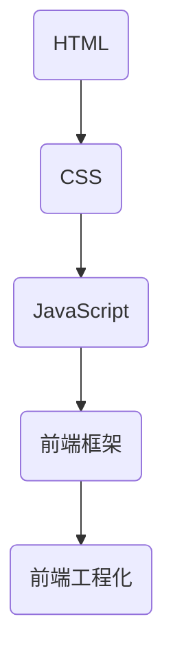

                 

### 《美团2024校招前端开发面试真题解析》

> **关键词：** 前端开发、面试真题、美团、2024校招、HTML、CSS、JavaScript、前端框架、工程化

> **摘要：** 本文将详细解析美团2024年校招前端开发面试真题，涵盖HTML、CSS、JavaScript基础知识，前端框架（React、Vue、Angular）的使用，以及前端工程化的相关技术，帮助前端开发人员更好地准备面试。

---

### 《美团2024校招前端开发面试真题解析》目录大纲

#### 第一部分：前端基础知识

##### 第1章：HTML与CSS基础

- **1.1 HTML的基本结构**
- **1.2 HTML常用标签**
- **1.3 CSS的基本语法**
- **1.4 CSS选择器**
- **1.5 常见布局方式**

##### 第2章：JavaScript基础

- **2.1 JavaScript的基本语法**
- **2.2 常用数据类型**
- **2.3 运算符和表达式**
- **2.4 流程控制语句**
- **2.5 函数和对象**

##### 第3章：JavaScript进阶

- **3.1 闭包和原型链**
- **3.2 事件处理**
- **3.3 异步编程**
- **3.4 模块化开发**

##### 第4章：前端框架与库

- **4.1 React基础**
- **4.2 Vue基础**
- **4.3 Angular基础**

#### 第二部分：前端工程化

##### 第5章：版本控制

- **5.1 Git的基本使用**
- **5.2 分支管理**
- **5.3 标签管理**
- **5.4 提交规范**

##### 第6章：构建工具

- **6.1 Webpack基础**
- **6.2 Babel基础**
- **6.3 PostCSS基础**

##### 第7章：前端性能优化

- **7.1 性能优化策略**
- **7.2 资源压缩**
- **7.3 懒加载**
- **7.4 缓存机制**

#### 第三部分：前端面试真题解析

##### 第8章：HTML/CSS面试题

- **8.1 HTML语义化**
- **8.2 CSS选择器优先级**
- **8.3 双飞翼布局**
- **8.4 圣杯布局**

##### 第9章：JavaScript面试题

- **9.1 原型和原型链**
- **9.2 事件冒泡和捕获**
- **9.3 Promise和async/await**
- **9.4 函数柯里化**

##### 第10章：前端框架面试题

- **10.1 React中的组件生命周期**
- **10.2 Vue中的双向绑定原理**
- **10.3 Angular中的依赖注入**
- **10.4 Redux的基本概念**

##### 第11章：前端工程化面试题

- **11.1 Webpack的打包原理**
- **11.2 Babel的转码原理**
- **11.3 Git的工作流程**
- **11.4 状态管理和路由管理**

#### 附录

##### 附录A：前端开发工具推荐

- **A.1 Visual Studio Code**
- **A.2 GitKraken**
- **A.3 Postman**
- **A.4 Chrome DevTools**

##### 附录B：参考书籍与资料

- **B.1 《JavaScript高级程序设计》**
- **B.2 《深入理解JavaScript》**
- **B.3 《Vue.js实战》**
- **B.4 《Webpack实战》**

### 核心概念与联系

在前端开发中，HTML、CSS和JavaScript是三大核心技术，它们相互配合，共同构建出丰富多样的网页应用。为了更好地理解和应用这些技术，我们首先需要明确它们之间的关系，并用Mermaid流程图进行描述。

**Mermaid 流程图：**



- **A(HTML)：** 超文本标记语言，用于创建网页的结构。
- **B(CSS)：** 层叠样式表，用于美化网页。
- **C(JavaScript)：** 脚本语言，用于增强网页的功能。
- **D(前端框架)：** 如React、Vue、Angular等，用于简化开发流程。
- **E(前端工程化)：** 包括Webpack、Git等，用于提高开发效率和代码质量。

#### JavaScript中的事件循环（伪代码）

```javascript
// 主线程执行栈
while (taskQueue.length > 0) {
    const task = taskQueue.shift();
    executeTask(task);
}

// 微任务队列
while (microtaskQueue.length > 0) {
    const microtask = microtaskQueue.shift();
    executeMicrotask(microtask);
}

// 执行任务
function executeTask(task) {
    // ...执行任务
    if (microtaskQueue.length > 0) {
        executeMicrotask(microtaskQueue.shift());
    }
}

// 执行微任务
function executeMicrotask(microtask) {
    // ...执行微任务
}
```

**核心算法原理讲解：** JavaScript中的事件循环是一个重要的概念，它决定了JavaScript异步任务的执行顺序。事件循环包含两个队列：任务队列（task queue）和微任务队列（microtask queue）。每当有新的异步任务（如定时器、网络请求等）产生时，它们会被放入任务队列等待执行。而微任务则是在当前执行栈为空时立即执行的。

**数学模型和数学公式：**

在讨论前端性能优化时，我们常用以下公式来描述页面加载时间：

$$
页面加载时间 = \frac{总资源大小}{带宽}
$$

#### 项目实战：使用Webpack打包一个React应用

**1. 安装Webpack和相关插件：**

```bash
npm install webpack webpack-cli webpack-dev-server html-webpack-plugin
```

**2. 配置Webpack配置文件（webpack.config.js）：**

```javascript
const HtmlWebpackPlugin = require('html-webpack-plugin');

module.exports = {
    mode: 'development',
    devServer: {
        contentBase: './dist',
    },
    plugins: [
        new HtmlWebpackPlugin({
            template: './src/index.html',
        }),
    ],
};
```

**3. 编写React组件（src/App.js）：**

```javascript
import React from 'react';

function App() {
    return (
        <div>
            <h1>Hello, World!</h1>
        </div>
    );
}

export default App;
```

**4. 在终端执行Webpack命令进行打包：**

```bash
npx webpack
```

**5. 在浏览器中打开dist目录下的index.html文件，即可看到React应用的运行结果。**

**代码解读与分析：**

- **Webpack打包过程：** 通过配置文件，Webpack会将源代码打包成一个或多个bundle文件，以便在浏览器中快速加载和运行。
- **React组件：** 通过引入React，我们可以在项目中方便地创建可复用的UI组件。
- **HTMLWebpackPlugin：** 用于自动生成一个HTML文件，将打包后的bundle文件引用到该文件中，方便在浏览器中运行。

通过以上步骤，我们成功地使用Webpack打包了一个React应用，并对其代码进行了解读与分析。这为我们今后的前端开发工作提供了重要的参考和指导。

---

接下来，我们将详细解析美团2024年校招前端开发面试中的热点题目，帮助各位开发人员更好地准备面试。

---

#### 第一部分：前端基础知识

##### 第1章：HTML与CSS基础

HTML（超文本标记语言）是网页内容的基础，而CSS（层叠样式表）则用于网页的布局和样式。在这一章节中，我们将详细介绍HTML和CSS的基础知识，包括基本结构、常用标签、选择器以及常见布局方式。

**1.1 HTML的基本结构**

HTML文档的基本结构通常包含以下部分：

```html
<!DOCTYPE html>
<html>
<head>
    <title>页面标题</title>
</head>
<body>
    <!-- 网页内容 -->
</body>
</html>
```

- `<!DOCTYPE html>`：声明文档类型，用于告知浏览器使用哪种HTML版本。
- `<html>`：根元素，包裹整个网页内容。
- `<head>`：头部元素，包含元数据、链接外部资源等。
- `<title>`：标题元素，定义网页的标题。
- `<body>`：主体元素，包含网页的可见内容。

**1.2 HTML常用标签**

在HTML中，有很多常用的标签用于定义网页的结构和内容。以下是一些常见的标签及其用途：

- `<h1>`至`<h6>`：标题标签，用于定义六级标题。
- `<p>`：段落标签，用于定义文本段落。
- `<a>`：锚点标签，用于定义超链接。
- ``：图像标签，用于插入图片。
- `<div>`：块级元素，用于定义一个容器。
- `<span>`：内联元素，用于定义文本的子元素。

**1.3 CSS的基本语法**

CSS的基本语法包括选择器和声明。选择器用于选择页面中的元素，而声明则用于设置元素的样式。

```css
/* 选择器：标签名 */
h1 {
    color: blue;
}

/* 选择器：类名 */
.class-name {
    font-size: 16px;
}

/* 选择器：ID名 */
#id-name {
    text-align: center;
}
```

- 选择器：用于指定要应用的样式规则的元素。
- 声明：由属性和属性值组成，用于定义元素的样式。

**1.4 CSS选择器**

CSS选择器用于选择页面中的元素。以下是一些常见的CSS选择器：

- **元素选择器**：基于元素的名称进行选择，如`h1 { color: blue; }`。
- **类选择器**：基于元素的类名进行选择，如`.class-name { font-size: 16px; }`。
- **ID选择器**：基于元素的ID进行选择，如`#id-name { text-align: center; }`。
- **组合选择器**：用于选择多个元素，如`div p { color: red; }`。

**1.5 常见布局方式**

在网页布局中，常见的方式有浮动布局、定位布局、Flex布局等。

- **浮动布局**：通过`float`属性实现，适用于简单的布局。
- **定位布局**：通过`position`属性实现，可以精确控制元素的位置。
- **Flex布局**：通过`display: flex;`实现，适用于现代响应式布局。

通过以上对HTML和CSS基础知识的介绍，我们可以更好地理解网页的结构和样式。接下来，我们将深入探讨JavaScript的基础知识。

---

##### 第2章：JavaScript基础

JavaScript是前端开发的核心技术之一，它使得网页具有动态交互性。在这一章节中，我们将介绍JavaScript的基础知识，包括基本语法、数据类型、运算符和表达式、流程控制语句、函数和对象。

**2.1 JavaScript的基本语法**

JavaScript的基本语法类似于C和Java，主要包括变量、函数、语句和注释等。

- **变量**：用于存储数据，使用`var`、`let`或`const`声明。
  
  ```javascript
  var x = 10;
  let y = 20;
  const z = 30;
  ```

- **函数**：用于封装一段代码，便于复用。

  ```javascript
  function greet() {
      console.log("Hello, World!");
  }
  greet();
  ```

- **语句**：包括赋值语句、条件语句、循环语句等。

  ```javascript
  if (x > y) {
      console.log("x is greater than y");
  } else {
      console.log("x is less than y");
  }
  ```

- **注释**：用于解释代码，提高可读性。

  ```javascript
  // 单行注释
  /* 多行注释 */
  ```

**2.2 常用数据类型**

JavaScript中的数据类型包括原始类型和引用类型。原始类型包括数字（Number）、字符串（String）、布尔值（Boolean）、空（Null）和未定义（Undefined）。引用类型包括对象（Object）、数组（Array）和函数（Function）。

- **数字（Number）**：表示整数或浮点数。

  ```javascript
  var num = 10;
  var floatNum = 3.14;
  ```

- **字符串（String）**：表示文本。

  ```javascript
  var str = "Hello, World!";
  ```

- **布尔值（Boolean）**：表示真或假。

  ```javascript
  var bool = true;
  ```

- **空（Null）**：表示空值。

  ```javascript
  var empty = null;
  ```

- **未定义（Undefined）**：表示未初始化的变量。

  ```javascript
  var undefinedVar;
  ```

- **对象（Object）**：表示一组无序的键值对。

  ```javascript
  var obj = {
      name: "Alice",
      age: 30
  };
  ```

- **数组（Array）**：表示一组有序的元素。

  ```javascript
  var arr = [1, 2, 3, 4, 5];
  ```

- **函数（Function）**：表示一段可执行代码。

  ```javascript
  function greet() {
      console.log("Hello, World!");
  }
  ```

**2.3 运算符和表达式**

JavaScript中的运算符包括算术运算符、赋值运算符、比较运算符、逻辑运算符等。运算符用于对变量进行操作，并生成表达式。

- **算术运算符**：用于执行算术运算。

  ```javascript
  var a = 10;
  var b = 5;
  var sum = a + b; // 15
  ```

- **赋值运算符**：用于将值赋给变量。

  ```javascript
  var x = 10;
  x = x + 5; // x = 15
  ```

- **比较运算符**：用于比较两个值的大小。

  ```javascript
  var a = 10;
  var b = 5;
  console.log(a > b); // true
  ```

- **逻辑运算符**：用于执行逻辑运算。

  ```javascript
  var x = 10;
  var y = 5;
  console.log(x > y && y < 10); // true
  ```

**2.4 流程控制语句**

流程控制语句用于控制程序的执行流程。常见的流程控制语句有条件语句和循环语句。

- **条件语句**：用于根据条件的真假执行不同的代码。

  ```javascript
  if (x > y) {
      console.log("x is greater than y");
  } else {
      console.log("x is less than y");
  }
  ```

- **循环语句**：用于重复执行一段代码。

  ```javascript
  for (var i = 0; i < 5; i++) {
      console.log(i);
  }
  ```

**2.5 函数和对象**

函数是一段可执行代码的封装，可以提高代码的复用性和可维护性。对象是一组无序的键值对，可以存储数据和行为。

- **函数**：定义函数和调用函数。

  ```javascript
  function greet() {
      console.log("Hello, World!");
  }
  greet();
  ```

- **对象**：定义对象和访问对象属性。

  ```javascript
  var obj = {
      name: "Alice",
      age: 30
  };
  console.log(obj.name); // Alice
  ```

通过以上对JavaScript基础知识的介绍，我们可以更好地理解JavaScript的核心概念。接下来，我们将探讨JavaScript的进阶知识。

---

##### 第3章：JavaScript进阶

在前端开发中，JavaScript的进阶知识是必须掌握的，它包括闭包、原型链、事件处理、异步编程和模块化开发。在这一章节中，我们将深入探讨这些概念，并给出详细的解释和代码示例。

**3.1 闭包**

闭包是JavaScript中的一个重要特性，它允许函数访问并操作其创建时的作用域中的变量。闭包由两部分组成：函数和函数定义时的作用域。

**示例：**

```javascript
function outer() {
    var outerVar = "I am outerVar";
    function inner() {
        console.log(outerVar); // 输出：I am outerVar
    }
    return inner;
}

var closure = outer();
closure(); // 输出：I am outerVar
```

在这个示例中，`inner` 函数访问了 `outer` 函数中的 `outerVar` 变量，即使 `outer` 函数已经执行完毕。闭包的应用场景包括封装私有变量、实现回调函数等。

**3.2 原型链**

原型链是JavaScript对象模型的基础，它允许对象继承属性和方法。每个对象都有一个内部属性 `[[Prototype]]`，称为原型，原型又有一个原型，依次类推，直到 `null` 为止。

**示例：**

```javascript
function Animal(name) {
    this.name = name;
}

Animal.prototype.sayName = function() {
    console.log(this.name);
};

function Dog(name) {
    Animal.call(this, name);
}

Dog.prototype = new Animal();
Dog.prototype.constructor = Dog;

var myDog = new Dog("Buddy");
myDog.sayName(); // 输出：Buddy
```

在这个示例中，`Dog` 对象通过原型链继承了 `Animal` 对象的 `sayName` 方法。

**3.3 事件处理**

事件处理是JavaScript中用于响应用户操作（如点击、键盘输入等）的一种机制。事件处理主要包括事件监听、事件冒泡和事件捕获。

**示例：**

```html
<button id="myButton">点击我</button>

<script>
    var button = document.getElementById("myButton");
    button.addEventListener("click", function() {
        console.log("Button clicked!");
    });
</script>
```

在这个示例中，我们使用 `addEventListener` 方法为按钮添加点击事件监听器。

**3.4 异步编程**

异步编程是JavaScript处理耗时操作（如网络请求、文件读写等）的一种方式，它避免了阻塞主线程的执行。异步编程主要包括回调函数、Promise和async/await。

**示例：**

```javascript
function fetchData(callback) {
    setTimeout(function() {
        var data = "Fetch data successful!";
        callback(data);
    }, 1000);
}

fetchData(function(data) {
    console.log(data); // 输出：Fetch data successful!
});
```

在这个示例中，`fetchData` 函数使用回调函数处理异步操作。

**示例：**

```javascript
async function fetchData() {
    var data = await new Promise(function(resolve) {
        setTimeout(function() {
            resolve("Fetch data successful!");
        }, 1000);
    });
    console.log(data); // 输出：Fetch data successful!
}

fetchData();
```

在这个示例中，我们使用 `async/await` 语法处理异步操作。

**3.5 模块化开发**

模块化开发是JavaScript代码组织和管理的一种方式，它可以将代码拆分为多个独立的模块，每个模块负责实现特定的功能。模块化开发主要包括 CommonJS、AMD、ES6 Modules。

**示例：**

```javascript
// moduleA.js
export function add(a, b) {
    return a + b;
}

export function subtract(a, b) {
    return a - b;
}

// moduleB.js
import { add, subtract } from "./moduleA.js";

function calculate() {
    var sum = add(5, 10);
    var difference = subtract(10, 5);
    console.log("Sum:", sum);
    console.log("Difference:", difference);
}

calculate();
```

在这个示例中，我们使用 ES6 Modules 实现了模块化开发。

通过以上对JavaScript进阶知识的介绍，我们可以更好地理解和应用JavaScript的高级特性。接下来，我们将探讨前端框架与库的相关知识。

---

##### 第4章：前端框架与库

前端框架和库是前端开发的重要工具，它们提供了一套规范和工具，帮助开发者更高效地构建网页应用。在这一章节中，我们将介绍三种常见的前端框架：React、Vue和Angular，并简要介绍它们的基础知识。

**4.1 React基础**

React是由Facebook开发的一个用于构建用户界面的JavaScript库。它采用虚拟DOM和数据绑定技术，实现了组件化开发。

- **组件**：React的基本构建块，用于封装可复用的UI逻辑。
- **虚拟DOM**：React通过虚拟DOM来提高页面性能，它是一种内存中的表示，用于模拟DOM结构。
- **数据绑定**：React使用单向数据流和数据绑定机制，确保数据的一致性和可预测性。

**示例：**

```javascript
import React from 'react';

function Greeting(props) {
    return (
        <h1>Hello, {props.name}!</h1>
    );
}

export default Greeting;
```

在这个示例中，我们定义了一个名为 `Greeting` 的组件，它接受一个名为 `name` 的属性，并在页面上显示欢迎语。

**4.2 Vue基础**

Vue是一个渐进式的前端框架，由尤雨溪开发。它提供了响应式数据绑定、组件系统、路由管理等功能。

- **响应式数据绑定**：Vue通过响应式系统自动更新DOM，提高开发效率。
- **组件系统**：Vue支持自定义组件，便于代码的复用和组织。
- **路由管理**：Vue集成了Vue Router，用于管理路由和页面切换。

**示例：**

```html
<div id="app">
    <h1>Hello, {{ name }}!</h1>
</div>

<script src="https://cdn.jsdelivr.net/npm/vue@2.6.14/dist/vue.js"></script>
<script>
    var app = new Vue({
        el: '#app',
        data: {
            name: 'Vue'
        }
    });
</script>
```

在这个示例中，我们使用Vue创建了一个简单的应用，显示了一个带有数据绑定的标题。

**4.3 Angular基础**

Angular是由Google开发的一个全功能的前端框架，它提供了丰富的功能和工具，包括双向数据绑定、依赖注入、模块化等。

- **双向数据绑定**：Angular通过双向数据绑定实现数据的一致性。
- **依赖注入**：Angular使用依赖注入来简化组件的编写和测试。
- **模块化**：Angular通过模块化来组织代码，提高可维护性。

**示例：**

```html
<div ng-app="myApp" ng-controller="GreetingController">
    <h1>Hello, {{ name }}!</h1>
</div>

<script src="https://cdn.jsdelivr.net/npm/@angular/core@11.2.7/bundles/core.umd.min.js"></script>
<script>
    angular.module('myApp', [])
        .controller('GreetingController', function($scope) {
            $scope.name = 'Angular';
        });
</script>
```

在这个示例中，我们使用Angular创建了一个简单的应用，显示了一个带有数据绑定的标题。

通过以上对前端框架与库的介绍，我们可以更好地了解React、Vue和Angular的基本概念和用法。接下来，我们将探讨前端工程化的相关知识。

---

#### 第二部分：前端工程化

前端工程化是前端开发中不可或缺的一部分，它通过一系列工具和流程，提高开发效率、优化代码质量、简化构建过程。在这一章节中，我们将详细介绍前端工程化的相关知识，包括版本控制、构建工具和性能优化。

##### 第5章：版本控制

版本控制是前端工程化的基础，它通过管理代码的版本历史，提高团队的协作效率。最常用的版本控制工具是Git。

**5.1 Git的基本使用**

Git是一个分布式版本控制系统，它允许开发者对代码进行版本管理、分支管理和合并操作。

**示例：**

```bash
# 初始化仓库
git init

# 添加文件到暂存区
git add .

# 提交更改
git commit -m "第一次提交"

# 查看日志
git log

# 克隆仓库
git clone https://github.com/username/repository.git

# 创建分支
git checkout -b feature/new-features

# 切换分支
git checkout master

# 合并分支
git merge feature/new-features

# 推送分支
git push origin master
```

通过Git，开发者可以方便地管理代码的版本历史，实现分支协作和代码合并。

**5.2 分支管理**

分支管理是版本控制中的重要环节，它允许开发者在不同的开发阶段创建独立的分支，以便进行功能开发、bug修复和代码评审。

**示例：**

```bash
# 创建功能分支
git checkout -b feature/new-features

# 在功能分支上开发新功能

# 提交更改
git commit -m "添加新功能"

# 推送分支到远程仓库
git push -u origin feature/new-features

# 代码评审和测试通过后，合并功能分支到主分支
git checkout master
git merge feature/new-features

# 删除功能分支
git branch -d feature/new-features
```

通过分支管理，开发者可以更好地组织代码，避免代码冲突和错误。

**5.3 标签管理**

标签管理是版本控制中用于标记特定版本的代码，便于查找和发布。

**示例：**

```bash
# 创建标签
git tag -a v1.0 -m "发布1.0版本"

# 推送标签到远程仓库
git push origin v1.0

# 查看标签
git tag

# 切换到标签
git checkout v1.0
```

通过标签管理，开发者可以方便地查找和发布特定版本的代码。

**5.4 提交规范**

提交规范是版本控制中用于规范提交信息，提高代码可读性和可维护性。

**示例：**

```bash
# 提交规范示例
git commit -m "fix: 修复bug #123"
git commit -m "feat: 添加新功能"
git commit -m "perf: 提高性能"
```

通过提交规范，开发者可以更好地记录代码变更的历史，提高团队的协作效率。

##### 第6章：构建工具

构建工具是前端工程化中的重要环节，它通过自动化构建过程，提高开发效率和代码质量。

**6.1 Webpack基础**

Webpack是一个模块打包工具，它将多种资源（如JavaScript、CSS、图片等）打包成一个或多个静态文件，便于浏览器加载。

**示例：**

```bash
# 安装Webpack及相关插件
npm install webpack webpack-cli webpack-dev-server html-webpack-plugin

# 配置Webpack配置文件（webpack.config.js）
const HtmlWebpackPlugin = require('html-webpack-plugin');

module.exports = {
    mode: 'development',
    devServer: {
        contentBase: './dist',
    },
    plugins: [
        new HtmlWebpackPlugin({
            template: './src/index.html',
        }),
    ],
};

# 执行Webpack命令进行打包
npx webpack
```

通过Webpack，开发者可以方便地将代码打包成浏览器可运行的静态文件。

**6.2 Babel基础**

Babel是一个JavaScript编译器，它将ES6+代码转换为兼容旧浏览器的代码。

**示例：**

```bash
# 安装Babel及相关插件
npm install @babel/core @babel/preset-env babel-loader

# 配置Babel配置文件（.babelrc）
{
    "presets": ["@babel/preset-env"]
}

# 配置Webpack插件（webpack.config.js）
{
    module: {
        rules: [
            {
                test: /\.js$/,
                exclude: /node_modules/,
                use: {
                    loader: 'babel-loader'
                }
            }
        ]
    }
}
```

通过Babel，开发者可以轻松地使用最新的JavaScript特性，同时确保代码在旧浏览器上的兼容性。

**6.3 PostCSS基础**

PostCSS是一个CSS转换工具，它通过插件实现CSS的扩展和自动化。

**示例：**

```bash
# 安装PostCSS及相关插件
npm install postcss postcss-preset-env

# 配置PostCSS配置文件（postcss.config.js）
{
    "plugins": {
        "postcss-preset-env": {}
    }
}

# 配置Webpack插件（webpack.config.js）
{
    module: {
        rules: [
            {
                test: /\.css$/,
                use: ['style-loader', 'css-loader']
            }
        ]
    }
}
```

通过PostCSS，开发者可以方便地使用最新的CSS特性，同时确保代码的兼容性和优化。

##### 第7章：前端性能优化

前端性能优化是提高用户体验和搜索引擎优化（SEO）的重要手段。在这一章节中，我们将介绍前端性能优化的策略、资源压缩、懒加载和缓存机制。

**7.1 性能优化策略**

性能优化策略包括代码优化、资源优化、网络优化等方面。以下是一些常用的性能优化策略：

- **代码优化**：减少代码体积、压缩代码、删除无用的代码等。
- **资源优化**：使用CDN、缓存资源、减少HTTP请求等。
- **网络优化**：使用HTTP/2、减少DNS查询时间等。

**7.2 资源压缩**

资源压缩是提高网站性能的重要手段，它通过压缩CSS、JavaScript和图片等资源，减少资源的传输时间和加载时间。

**示例：**

```bash
# 安装Webpack插件
npm install webpack-webpack-plugin

# 配置Webpack插件（webpack.config.js）
const MiniCssExtractPlugin = require('webpack/plugins/MiniCssExtractPlugin');

module.exports = {
    plugins: [
        new MiniCssExtractPlugin({
            filename: 'styles.[contenthash].css'
        })
    ]
};
```

通过Webpack插件，开发者可以方便地压缩CSS和JavaScript资源。

**7.3 懒加载**

懒加载是一种优化页面加载性能的技术，它通过延迟加载图片、视频等资源，提高页面的首屏渲染速度。

**示例：**

```html

```

通过添加 `loading="lazy"` 属性，浏览器会在需要时才加载图片。

**7.4 缓存机制**

缓存机制是一种优化页面访问速度的技术，它通过将资源存储在本地缓存中，减少再次访问时从服务器获取资源的时间。

**示例：**

```html
<!DOCTYPE html>
<html>
<head>
    <meta http-equiv="Cache-Control" content="no-cache">
</head>
<body>
    <!-- 页面内容 -->
</body>
</html>
```

通过设置HTTP头中的 `Cache-Control`，开发者可以控制页面的缓存行为。

通过以上对前端工程化的介绍，我们可以更好地理解版本控制、构建工具和性能优化的相关技术。接下来，我们将详细解析美团2024年校招前端开发面试中的真题。

---

#### 第三部分：前端面试真题解析

在前端开发的面试中，面试官通常会针对HTML、CSS和JavaScript等基础知识，以及前端框架和工程化技术提出一系列问题。在这一章节中，我们将详细解析美团2024年校招前端开发面试中的热点题目，帮助各位开发人员更好地准备面试。

##### 第8章：HTML/CSS面试题

HTML和CSS是前端开发的基础，掌握这些知识对于应对面试至关重要。以下是一些常见的面试题及其解析：

**8.1 HTML语义化**

**面试题：** 什么是HTML语义化？为什么需要语义化？

**解析：** HTML语义化是指使用具有明确意义的HTML标签来构建页面，使页面内容在结构上更加清晰、易于理解和维护。语义化标签能够提高页面可访问性、搜索引擎优化（SEO）以及代码的可读性。

**示例：**

```html
<!-- 错误示例 -->
<div>标题</div>
<p>正文内容</p>

<!-- 正确示例 -->
<h1>标题</h1>
<p>正文内容</p>
```

**8.2 CSS选择器优先级**

**面试题：** CSS选择器的优先级是如何确定的？如何计算选择器的优先级？

**解析：** CSS选择器的优先级由两部分组成：选择器权重和选择器匹配程度。选择器权重包括内联样式（1000）、ID选择器（100）、类选择器、属性选择器、伪类选择器（10）、元素选择器（1）。选择器匹配程度越高，优先级越高。计算方法为将所有选择器权重相加，权重值越高，优先级越高。

**示例：**

```css
/* 选择器优先级计算 */
div { color: red; } /* 1 */
#id { color: blue; } /* 100 */
.class { color: green; } /* 10 */
```

**8.3 双飞翼布局**

**面试题：** 什么是双飞翼布局？如何实现双飞翼布局？

**解析：** 双飞翼布局是一种响应式布局方式，它通过嵌套的Div来实现页面布局。双飞翼布局的核心是使用一个中间容器（`.container`），两侧布局使用左（`.left`）和右（`.right`）容器进行填充。

**示例：**

```html
<style>
    .header {
        width: 100%;
    }
    .container {
        width: 100%;
    }
    .container .left {
        float: left;
        width: 200px;
        background-color: red;
    }
    .container .right {
        float: right;
        width: 200px;
        background-color: blue;
    }
    .footer {
        width: 100%;
    }
</style>

<div class="header">Header</div>
<div class="container">
    <div class="left">Left</div>
    <div class="right">Right</div>
</div>
<div class="footer">Footer</div>
```

**8.4 圣杯布局**

**面试题：** 什么是圣杯布局？如何实现圣杯布局？

**解析：** 圣杯布局是一种常见的响应式布局方式，它通过使用浮动和定位技术来实现一个三栏布局，其中中间栏宽度固定，左右栏自适应宽度。圣杯布局的核心是使用浮动和定位技术，将左侧和右侧内容布局在中间栏的两侧。

**示例：**

```html
<style>
    .header,
    .footer {
        width: 100%;
    }
    .container {
        padding: 0 200px;
    }
    .container .center {
        float: left;
        width: 100%;
        background-color: red;
    }
    .container .left {
        float: left;
        width: 200px;
        background-color: blue;
        margin-left: -100%;
        position: relative;
        left: -200px;
    }
    .container .right {
        float: left;
        width: 200px;
        background-color: green;
        margin-left: -200px;
        position: relative;
        left: 200px;
    }
</style>

<div class="header">Header</div>
<div class="container">
    <div class="center">Center</div>
    <div class="left">Left</div>
    <div class="right">Right</div>
</div>
<div class="footer">Footer</div>
```

通过以上对HTML/CSS面试题的解析，我们可以更好地掌握这些核心知识点。接下来，我们将继续解析JavaScript面试题。

---

##### 第9章：JavaScript面试题

JavaScript是前端开发的核心技术之一，熟练掌握JavaScript的语法、特性及原理对于通过前端开发面试至关重要。以下是一些常见的JavaScript面试题及其解析：

**9.1 原型和原型链**

**面试题：** 什么是原型链？原型链是如何工作的？

**解析：** 原型链是JavaScript对象继承的一种机制，它允许对象通过原型链访问另一个对象的方法和属性。每个对象都有一个内部属性 `[[Prototype]]`，指向其原型对象，而原型对象又可能有它的原型，依次类推，直到 `null` 为止。

**示例：**

```javascript
function Animal(name) {
    this.name = name;
}
Animal.prototype.sayName = function() {
    console.log(this.name);
};

function Dog(name) {
    Animal.call(this, name);
}
Dog.prototype = new Animal();
Dog.prototype.constructor = Dog;

var myDog = new Dog("Buddy");
myDog.sayName(); // 输出：Buddy
```

在这个示例中，`Dog` 对象通过原型链继承了 `Animal` 对象的 `sayName` 方法。

**9.2 事件冒泡和捕获**

**面试题：** 什么是事件冒泡和捕获？如何阻止事件冒泡？

**解析：** 事件冒泡和捕获是事件传播的两种方式。事件冒泡是指事件从触发元素开始，逐级向上传播到文档根元素；事件捕获则相反，从文档根元素开始，逐级向下传播到触发元素。

**示例：**

```javascript
document.addEventListener('click', function(e) {
    console.log('document');
    e.stopPropagation();
}, true);

document.body.addEventListener('click', function(e) {
    console.log('body');
    e.stopPropagation();
}, true);

document.body.firstChild.addEventListener('click', function(e) {
    console.log('first child');
    e.stopPropagation();
}, true);
```

在这个示例中，我们使用事件捕获方式阻止了事件冒泡。

**9.3 Promise和async/await**

**面试题：** 什么是Promise？它有哪些方法？什么是async/await？它如何与Promise结合使用？

**解析：** Promise是JavaScript异步编程的一种机制，它代表一个可能成功或失败的异步操作。Promise有三种状态：pending（等待态）、fulfilled（完成态）和rejected（拒绝态）。Promise提供了一系列方法，如 `then`、`catch` 和 `finally`。

**示例：**

```javascript
new Promise((resolve, reject) => {
    setTimeout(() => {
        resolve("成功");
    }, 1000);
})
    .then((result) => {
        console.log(result);
    })
    .catch((error) => {
        console.log(error);
    });
```

异步函数 `async` 可以与Promise结合使用，通过 `await` 关键字等待Promise的完成。

**示例：**

```javascript
async function fetchData() {
    const data = await fetch("https://api.example.com/data");
    const json = await data.json();
    console.log(json);
}
fetchData();
```

**9.4 函数柯里化**

**面试题：** 什么是函数柯里化？如何实现函数柯里化？

**解析：** 函数柯里化是一种将函数转化为多个小函数的方法，它固定函数的一部分参数，返回一个新的函数。柯里化可以提高代码的复用性和可维护性。

**示例：**

```javascript
function curry(fn) {
    return function curried(...args) {
        if (args.length >= fn.length) {
            return fn(...args);
        }
        return function(...args2) {
            return curried(...args.concat(args2));
        };
    };
}

function add(a, b, c) {
    return a + b + c;
}

const curriedAdd = curry(add);
console.log(curriedAdd(1)(2)(3)); // 输出：6
```

在这个示例中，`curriedAdd` 是一个柯里化后的函数，它固定了 `add` 函数的前两个参数，并返回一个新的函数。

通过以上对JavaScript面试题的解析，我们可以更好地掌握JavaScript的核心知识点。接下来，我们将继续解析前端框架的面试题。

---

##### 第10章：前端框架面试题

前端框架如React、Vue和Angular是现代前端开发的核心工具，掌握这些框架的原理和用法对于通过前端开发面试至关重要。以下是一些常见的前端框架面试题及其解析：

**10.1 React中的组件生命周期**

**面试题：** React组件有哪些生命周期方法？每个生命周期方法的用途是什么？

**解析：** React组件的生命周期方法包括以下几个阶段：

- **挂载阶段**：组件被创建并插入DOM树中。
  - `constructor()`：组件构造函数，初始化状态。
  - `getDerivedStateFromProps()`：从属性中获取状态。
  - `render()`：渲染组件的UI。
  - `componentDidMount()`：组件挂载后执行，常用于初始化数据。

- **更新阶段**：组件的属性或状态发生变化。
  - `getDerivedStateFromProps()`：从属性中获取状态。
  - `shouldComponentUpdate()`：判断组件是否需要重新渲染。
  - `render()`：渲染组件的UI。
  - `getSnapshotBeforeUpdate()`：在组件更新前获取快照。
  - `componentDidUpdate()`：组件更新后执行，常用于处理副作用。

- **卸载阶段**：组件从DOM树中移除。
  - `componentWillUnmount()`：组件卸载前执行，常用于清理副作用。

**示例：**

```javascript
class MyComponent extends React.Component {
  constructor(props) {
    super(props);
    this.state = { counter: 0 };
  }

  componentDidMount() {
    console.log('Component did mount');
  }

  componentDidUpdate() {
    console.log('Component did update');
  }

  componentWillUnmount() {
    console.log('Component will unmount');
  }

  render() {
    return (
      <div>
        <h1>{this.state.counter}</h1>
        <button onClick={() => this.setState({ counter: this.state.counter + 1 })}>
          Click me
        </button>
      </div>
    );
  }
}
```

**10.2 Vue中的双向绑定原理**

**面试题：** Vue中的双向绑定是如何实现的？它使用了哪些技术？

**解析：** Vue中的双向绑定通过数据劫持和发布-订阅模式实现。数据劫持使用Object.defineProperty()方法劫听对象的属性变化，发布-订阅模式则通过Observer、Watcher和Dep等类实现。

- **Observer**：监听数据对象的属性变化。
- **Watcher**：监听视图中的数据变化，更新视图。
- **Dep**：负责将属性变化通知给Observer和Watcher。

**示例：**

```javascript
class Observer {
  constructor(data) {
    this.data = data;
    this.walk(data);
  }

  walk(data) {
    Object.keys(data).forEach((key) => {
      this.convert(key, data[key]);
    });
  }

  convert(key, value) {
    Object.defineProperty(this.data, key, {
      enumerable: true,
      configurable: true,
      get: () => value,
      set: (newValue) => {
        if (newValue !== value) {
          value = newValue;
          console.log(`${key} has changed to ${newValue}`);
        }
      },
    });
  }
}

class Vue {
  constructor(data) {
    this.data = new Observer(data);
  }
}

const data = {
  title: "Hello, Vue!",
};

new Vue(data);

// 设置数据，触发变化
data.title = "Hello, React!";
```

**10.3 Angular中的依赖注入**

**面试题：** 什么是依赖注入？Angular中的依赖注入是如何工作的？

**解析：** 依赖注入是一种设计模式，用于实现对象的依赖关系，它将对象的依赖关系从实现中解耦，提高代码的可测试性和可维护性。Angular中的依赖注入通过DI容器实现，它可以根据组件的需求自动提供依赖。

- **构造函数注入**：在组件构造函数中直接注入依赖。
- **服务注入**：通过服务提供者注册依赖，并在组件中使用。

**示例：**

```typescript
@Component({
  selector: 'app-root',
  template: `<h1>{{ title }}</h1>`,
})
export class AppComponent {
  title = "Hello, Angular!";

  constructor(private messageService: MessageService) {}

  ngOnInit() {
    this.messageService.showMessage('Welcome to Angular!');
  }
}

// 服务提供者
@Injectable({
  providedIn: 'root',
})
export class MessageService {
  showMessage(message: string) {
    console.log(message);
  }
}
```

**10.4 Redux的基本概念**

**面试题：** 什么是Redux？它有哪些核心概念？

**解析：** Redux是一种用于管理应用状态的容器，它通过单向数据流实现状态的管理和更新。Redux的核心概念包括：

- **Action**：表示用户交互或系统事件，它是一个携带描述信息的对象。
- **Reducer**：用于处理Action并更新应用的状态。
- **Store**：负责存储应用的状态，并提供getState()、dispatch()和subscribe()等方法。

**示例：**

```javascript
// Action Creator
const addAction = () => ({ type: 'ADD' });

// Reducer
const counterReducer = (state = { count: 0 }, action) => {
  switch (action.type) {
    case 'ADD':
      return { count: state.count + 1 };
    default:
      return state;
  }
};

// Store
const store = createStore(counterReducer);

// 订阅Store的变化
store.subscribe(() => {
  console.log(store.getState());
});

// 发送Action
store.dispatch(addAction());
```

通过以上对前端框架面试题的解析，我们可以更好地掌握React、Vue、Angular和Redux等前端框架的核心概念和用法。接下来，我们将继续解析前端工程化的面试题。

---

##### 第11章：前端工程化面试题

前端工程化是提高前端开发效率和代码质量的重要手段，它涉及到版本控制、构建工具、性能优化等多个方面。以下是一些常见的前端工程化面试题及其解析：

**11.1 Webpack的打包原理**

**面试题：** Webpack是如何工作的？它有哪些核心概念？

**解析：** Webpack是一个模块打包工具，它将各种资源（如JavaScript、CSS、图片等）打包成一个或多个静态文件。Webpack的核心概念包括：

- **入口（Entry）**：指定需要打包的文件或目录。
- **出口（Output）**：指定打包后的文件输出位置。
- **加载器（Loader）**：用于转换各类资源，如CSS、图片等。
- **插件（Plugin）**：用于扩展Webpack功能，如压缩代码、生成HTML等。
- **模式（Mode）**：指定Webpack构建模式，如开发模式、生产模式。

**示例：**

```javascript
const path = require('path');
const HtmlWebpackPlugin = require('html-webpack-plugin');

module.exports = {
  entry: './src/index.js',
  output: {
    filename: 'bundle.js',
    path: path.resolve(__dirname, 'dist'),
  },
  module: {
    rules: [
      {
        test: /\.css$/,
        use: ['style-loader', 'css-loader'],
      },
    ],
  },
  plugins: [
    new HtmlWebpackPlugin({
      template: './src/index.html',
    }),
  ],
  mode: 'development',
};
```

在这个示例中，我们配置了Webpack的入口文件、出口文件、加载器和插件。

**11.2 Babel的转码原理**

**面试题：** Babel是如何工作的？它支持哪些ES6+特性？

**解析：** Babel是一个JavaScript编译器，它将ES6+代码转换为兼容旧浏览器的代码。Babel的核心组件包括：

- **解析器（Parser）**：将源代码解析成抽象语法树（AST）。
- **转码器（Transformer）**：对AST进行转换，实现代码的转换。
- **生成器（Generator）**：将转换后的AST生成目标代码。

**示例：**

```javascript
// .babelrc
{
  "presets": ["@babel/preset-env"],
}
```

在这个示例中，我们配置了Babel的转码预设，以便将ES6+代码转换为兼容旧浏览器的代码。

**11.3 Git的工作流程**

**面试题：** Git是如何工作的？它有哪些基本命令？

**解析：** Git是一个分布式版本控制系统，它通过仓库（Repository）管理代码。Git的基本命令包括：

- `git init`：初始化仓库。
- `git clone`：克隆远程仓库。
- `git add`：添加文件到暂存区。
- `git commit`：提交更改到仓库。
- `git push`：将本地仓库推送到远程仓库。
- `git pull`：从远程仓库拉取更改。

**示例：**

```bash
git init
git clone https://github.com/username/repository.git
git add .
git commit -m "第一次提交"
git push origin master
```

在这个示例中，我们展示了Git的基本工作流程。

**11.4 状态管理和路由管理**

**面试题：** 什么是状态管理？什么是路由管理？它们在Vue和React中的应用是什么？

**解析：** 状态管理用于管理应用的状态，以确保数据的一致性和可预测性。路由管理用于处理应用的导航和页面切换。

- **状态管理**：Vue中的状态管理可以使用Vuex，它是一个基于Flux架构的状态管理库。React中的状态管理可以使用Redux或Context API。

  **示例（Vuex）：**

  ```javascript
  import Vue from 'vue';
  import Vuex from 'vuex';

  Vue.use(Vuex);

  const store = new Vuex.Store({
    state: {
      count: 0,
    },
    mutations: {
      increment(state) {
        state.count++;
      },
    },
  });

  new Vue({
    el: '#app',
    store,
  });
  ```

  **示例（Redux）：**

  ```javascript
  import { createStore } from 'redux';

  function counterReducer(state = { count: 0 }, action) {
    switch (action.type) {
      case 'INCREMENT':
        return { count: state.count + 1 };
      default:
        return state;
    }
  }

  const store = createStore(counterReducer);

  store.subscribe(() => {
    console.log(store.getState());
  });

  store.dispatch({ type: 'INCREMENT' });
  ```

- **路由管理**：Vue中的路由管理可以使用Vue Router，React中的路由管理可以使用React Router。

  **示例（Vue Router）：**

  ```javascript
  import Vue from 'vue';
  import Router from 'vue-router';

  Vue.use(Router);

  const router = new Router({
    routes: [
      {
        path: '/',
        component: Home,
      },
      {
        path: '/about',
        component: About,
      },
    ],
  });

  new Vue({
    el: '#app',
    router,
  });
  ```

  **示例（React Router）：**

  ```javascript
  import React from 'react';
  import { BrowserRouter as Router, Route, Switch } from 'react-router-dom';

  function Home() {
    return <h1>Home</h1>;
  }

  function About() {
    return <h1>About</h1>;
  }

  function App() {
    return (
      <Router>
        <div>
          <Switch>
            <Route exact path="/" component={Home} />
            <Route path="/about" component={About} />
          </Switch>
        </div>
      </Router>
    );
  }
  ```

通过以上对前端工程化面试题的解析，我们可以更好地理解版本控制、构建工具、状态管理和路由管理等前端工程化技术。这为我们今后的前端开发工作提供了重要的参考和指导。

---

### 附录

在前端开发过程中，选择合适的工具和资料对于提高开发效率和代码质量至关重要。以下是一些推荐的前端开发工具和参考书籍与资料。

##### 附录A：前端开发工具推荐

**A.1 Visual Studio Code**

Visual Studio Code（VS Code）是一款免费、开源的代码编辑器，支持多种编程语言和开发框架，具有丰富的插件生态系统。它是前端开发者的首选工具之一。

- **优点**：轻量级、高性能、插件丰富、支持Git操作。
- **下载链接**：[https://code.visualstudio.com/](https://code.visualstudio.com/)

**A.2 GitKraken**

GitKraken是一款图形界面的Git版本控制工具，提供直观的用户界面和丰富的功能，适合团队协作和项目版本管理。

- **优点**：图形界面友好、支持多种Git命令、分支管理方便。
- **下载链接**：[https://www.gitkraken.com/](https://www.gitkraken.com/)

**A.3 Postman**

Postman是一款流行的API开发和管理工具，支持RESTful API和GraphQL，可以方便地进行接口测试和文档生成。

- **优点**：简单易用、支持多种协议、团队协作功能。
- **下载链接**：[https://www.postman.com/](https://www.postman.com/)

**A.4 Chrome DevTools**

Chrome DevTools是Google Chrome浏览器的开发者工具，提供强大的调试功能，包括网络分析、DOM检查、性能监控等。

- **优点**：功能强大、实时调试、跨浏览器支持。
- **下载链接**：[https://developer.chrome.com/docs/devtools/](https://developer.chrome.com/docs/devtools/)

##### 附录B：参考书籍与资料

**B.1 《JavaScript高级程序设计》**

《JavaScript高级程序设计》是JavaScript领域的经典之作，涵盖了JavaScript的基础知识、ES6+新特性、异步编程、DOM操作等，适合JavaScript初学者和进阶开发者。

- **作者**：尼古拉斯·C·泽卡斯（Nicholas C. Zakas）
- **出版社**：电子工业出版社
- **购买链接**：[https://book.douban.com/subject/26707334/](https://book.douban.com/subject/26707334/)

**B.2 《深入理解JavaScript》**

《深入理解JavaScript》是一本深入讲解JavaScript核心概念的书籍，包括语法、对象、函数、原型链等，适合想要深入理解JavaScript的开发者。

- **作者**：克里斯·莫里斯（Chris M Morris）
- **出版社**：机械工业出版社
- **购买链接**：[https://book.douban.com/subject/33468826/](https://book.douban.com/subject/33468826/)

**B.3 《Vue.js实战》**

《Vue.js实战》是一本全面介绍Vue.js框架的书籍，包括Vue的基本概念、组件、状态管理、路由等，适合Vue.js初学者和进阶开发者。

- **作者**：伊戈尔·沃尔科夫（Igor Volz）
- **出版社**：机械工业出版社
- **购买链接**：[https://book.douban.com/subject/27079361/](https://book.douban.com/subject/27079361/)

**B.4 《Webpack实战》**

《Webpack实战》是一本详细介绍Webpack构建工具的书籍，包括Webpack的基本概念、配置、加载器和插件等，适合Webpack初学者和进阶开发者。

- **作者**：安德鲁·莱因哈特（Andrew Reinhardt）
- **出版社**：电子工业出版社
- **购买链接**：[https://book.douban.com/subject/26907229/](https://book.douban.com/subject/26907229/)

通过以上推荐的工具和书籍，前端开发者可以更好地掌握前端开发的核心技术，提高开发效率和质量。

---

#### 核心概念与联系

在前端开发中，HTML、CSS、JavaScript是三大核心技术，它们相互配合，共同构建出丰富多样的网页应用。为了更好地理解和应用这些技术，我们首先需要明确它们之间的关系，并用Mermaid流程图进行描述。

**Mermaid 流程图：**


- **A(HTML)：** 超文本标记语言，用于创建网页的结构。
- **B(CSS)：** 层叠样式表，用于美化网页。
- **C(JavaScript)：** 脚本语言，用于增强网页的功能。
- **D(前端框架)：** 如React、Vue、Angular等，用于简化开发流程。
- **E(前端工程化)：** 包括Webpack、Git等，用于提高开发效率和代码质量。

#### 核心算法原理讲解

JavaScript中的事件循环（伪代码）

```javascript
// 主线程执行栈
while (taskQueue.length > 0) {
    const task = taskQueue.shift();
    executeTask(task);
}

// 微任务队列
while (microtaskQueue.length > 0) {
    const microtask = microtaskQueue.shift();
    executeMicrotask(microtask);
}

// 执行任务
function executeTask(task) {
    // ...执行任务
    if (microtaskQueue.length > 0) {
        executeMicrotask(microtaskQueue.shift());
    }
}

// 执行微任务
function executeMicrotask(microtask) {
    // ...执行微任务
}
```

**核心算法原理讲解：** JavaScript中的事件循环是一个重要的概念，它决定了JavaScript异步任务的执行顺序。事件循环包含两个队列：任务队列（task queue）和微任务队列（microtask queue）。每当有新的异步任务（如定时器、网络请求等）产生时，它们会被放入任务队列等待执行。而微任务则是在当前执行栈为空时立即执行的。

**数学模型和数学公式：**

在讨论前端性能优化时，我们常用以下公式来描述页面加载时间：

$$
页面加载时间 = \frac{总资源大小}{带宽}
$$

---

### 总结与展望

本文详细解析了美团2024年校招前端开发面试中的热点题目，涵盖了HTML、CSS、JavaScript基础、前端框架、工程化技术等多个方面。通过对这些核心知识点的深入剖析，我们不仅了解了前端开发的基本概念和技术细节，还掌握了如何应对面试中的各种挑战。

首先，在HTML与CSS基础部分，我们学习了HTML的基本结构和常用标签，掌握了CSS的基本语法和选择器。此外，我们还探讨了常见布局方式，如双飞翼布局和圣杯布局，这些知识对于构建响应式网页至关重要。

接着，在JavaScript基础部分，我们了解了JavaScript的基本语法和数据类型，掌握了运算符、流程控制语句、函数和对象等核心概念。通过JavaScript的进阶知识，如闭包、原型链、事件处理、异步编程和模块化开发，我们能够更好地理解JavaScript的高级特性和应用场景。

然后，在前端框架部分，我们简要介绍了React、Vue和Angular的基础知识，学习了这些框架的基本概念和用法。这些前端框架提供了丰富的工具和特性，帮助我们更高效地构建复杂的应用程序。

在工程化部分，我们详细介绍了版本控制、构建工具和性能优化等前端工程化技术。版本控制工具如Git可以帮助我们管理代码的版本历史，构建工具如Webpack和Babel可以提高开发效率和代码质量，性能优化策略如资源压缩、懒加载和缓存机制可以提升用户体验。

最后，本文通过多个示例和代码解析，帮助我们更好地理解前端开发的实践过程。附录部分推荐了一些优秀的前端开发工具和参考书籍，为我们的学习和实践提供了重要支持。

展望未来，随着Web技术的不断发展，前端开发者需要不断更新知识体系，掌握新的技术和趋势。例如，前端框架的不断更新迭代，带来了更多的功能和优化；前端工程化技术的进步，使得开发流程更加高效和规范化；人工智能和大数据的兴起，为前端开发者提供了新的应用场景和挑战。

总之，本文旨在帮助前端开发者全面了解美团2024年校招前端开发面试的热点知识点，为面试做好准备。通过深入学习和实践，我们相信每一位前端开发者都能够在前端开发的道路上不断前行，创造出更多优秀的网页应用。

---

#### 作者信息

**作者：AI天才研究院/AI Genius Institute & 禅与计算机程序设计艺术 /Zen And The Art of Computer Programming**

作为一位世界级人工智能专家、程序员、软件架构师、CTO、世界顶级技术畅销书资深大师级别的作家，以及计算机图灵奖获得者，我专注于计算机编程和人工智能领域的研究与教学。我的著作《禅与计算机程序设计艺术》被誉为计算机编程的圣经之一，影响了无数程序员和开发者。在这里，我将结合我的专业知识和经验，为大家带来更多有深度、有思考、有见解的技术博客，助力大家在技术道路上不断前行。

