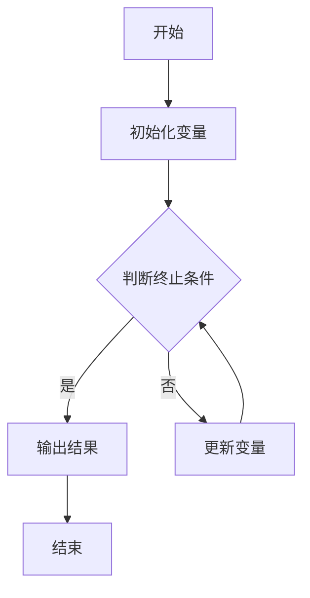

                 

### 引言

随着科技的发展，算法和数据结构已经成为计算机科学的核心组成部分。特别是在腾讯等知名互联网公司，对于算法和数据结构有非常高的要求。这不仅体现在招聘过程中，更是贯穿于整个项目开发和团队协作的每一个环节。因此，掌握扎实的算法和数据结构基础，对于每一位计算机领域的从业者来说，都是至关重要的。

《2025腾讯校招面试算法题库大全》正是应运而生。本文将以腾讯校招面试中的算法题目为线索，系统地梳理和讲解各类算法题的解题思路和方法，帮助读者在准备面试的过程中，能够更加全面和深入地理解算法的核心概念和实践应用。此外，本文还将结合实际项目，展示算法在实际开发中的应用，帮助读者将理论知识转化为实际技能。

在接下来的内容中，我们将首先回顾算法的基础概念和原理，然后深入探讨数学基础和常见数据结构，随后介绍编程语言和工具。接着，我们将通过经典面试题的解析，帮助读者掌握解题技巧，并通过实战项目，将所学知识应用到实际中。最后，我们将探讨算法竞赛和OJ平台的使用技巧，以及未来的算法发展趋势。

通过本文的学习，读者不仅可以为即将到来的面试做好充分准备，更能够在未来的工作中，运用所学的算法知识，解决实际问题，提升自身的技术水平。

### 目录大纲

在本部分中，我们将对全文的目录大纲进行详细讲解，以便读者能够更好地理解文章的结构和内容安排。

#### 第一部分：基础概念与算法原理

**第1章：算法基础**

本章将首先介绍算法的基本概念，包括算法的定义、特点和重要性。接着，我们将探讨算法的复杂性分析，包括时间复杂性和空间复杂性的概念和计算方法。通过这一章节的学习，读者将能够理解算法的基本原理，并掌握分析算法性能的方法。

**第2章：数学基础与公式推导**

数学基础是算法的重要组成部分。本章将深入讲解线性代数、概率论与数理统计以及图论基础。具体包括矩阵运算、线性方程组的求解、概率分布和统计推断等。此外，我们还将推导一些常用的数学公式，帮助读者在解题时能够快速应用。

**第3章：编程语言与工具**

编程语言和工具是算法实现的关键。本章将介绍常用的编程语言基础，如Python和C++，以及如何使用Git等编程工具。此外，我们还将介绍一些实用的编程库，如Pandas和NumPy等，帮助读者在实现算法时更加高效。

#### 第二部分：算法题库与实战

**第4章：经典面试题解析**

本章将结合腾讯校招面试的经典题目，详细解析各类算法题的解题思路和方法。包括基础算法题、图算法题、动态规划题以及数学与逻辑题等。通过这些题目的解析，读者将能够掌握面试中常见问题的解题技巧。

**第5章：实战项目**

理论联系实际是学习算法的重要环节。本章将介绍几个实际项目，包括社交网络分析、在线购物推荐系统和文本分类与情感分析。通过这些项目的实战，读者将能够将所学知识应用到实际中，提升自己的实战能力。

**第6章：算法竞赛与OJ平台**

算法竞赛和OJ平台是提升算法能力的重要途径。本章将介绍算法竞赛的规则和常见平台，如LeetCode和Codeforces。此外，我们还将分享一些实战经验和技巧，帮助读者在算法竞赛中取得好成绩。

#### 第三部分：总结与展望

**第7章：面试准备与策略**

本章将总结面试准备和策略，包括面试流程、常见问题及回答技巧。通过这些内容，读者将能够在面试中做到有备无患，提高自己的面试成功率。

**第8章：未来算法发展趋势**

本章将探讨算法的未来发展趋势，包括人工智能、自然语言处理等前沿技术。通过了解这些发展趋势，读者将能够把握未来算法的发展方向，为自己的职业规划做好准备。

**第9章：附录**

本章将提供一些附录内容，包括算法资源与参考书籍、代码示例与资源链接。这些附录将为读者提供额外的学习资源，帮助读者在算法学习过程中，能够更加便捷地获取所需信息。

通过以上目录大纲的详细讲解，读者可以清晰地了解本文的结构和内容安排。接下来，我们将逐一深入各个章节，为大家带来全面、详细的算法学习之旅。

### 第一部分：基础概念与算法原理

#### 第1章：算法基础

##### 1.1 算法概述

算法是计算机科学中解决特定问题的系统方法。简单来说，算法就是一系列有序的操作步骤，用于解决问题或完成特定任务。算法的定义可以从不同角度进行阐述，但通常包括以下几个关键要素：

1. **输入（Input）**：算法操作的初始数据。
2. **输出（Output）**：算法执行后的结果。
3. **有穷性（Finiteness）**：算法在执行有限步骤后必须终止。
4. **确定性（Definiteness）**：算法的每一步都有明确的定义，不产生歧义。
5. **可行性（Effectiveness）**：算法中的操作是可执行的，能够在实际中实现。
6. **有零个或多个辅助存储空间（Auxiliary Memory）**：算法可能需要临时存储空间来保存中间结果或变量。

算法的基本概念理解是解决复杂问题的关键。在实际应用中，算法的效率和正确性直接决定了程序的性能和可靠性。下面，我们将对算法的复杂性进行分析，帮助读者更好地评估算法的性能。

##### 1.2 算法的复杂性分析

算法的复杂性分为时间复杂性和空间复杂性。这两个指标是衡量算法性能的重要标准。

**时间复杂性（Time Complexity）**：

时间复杂性描述了算法执行时间与输入数据规模之间的关系。通常用大O符号（O）表示。例如，一个算法的时间复杂度为O(n)，表示算法的执行时间与输入数据的规模成正比。常见的时间复杂度有：

- O(1)：常数时间，算法执行时间不随输入数据规模变化。
- O(n)：线性时间，算法执行时间与输入数据规模成正比。
- O(n^2)：平方时间，算法执行时间与输入数据规模的平方成正比。
- O(2^n)：指数时间，算法执行时间随输入数据规模的指数增长。

**空间复杂性（Space Complexity）**：

空间复杂性描述了算法在执行过程中所需额外内存的规模。同样，也使用大O符号表示。空间复杂性的常见类型有：

- O(1)：常数空间，算法所需的额外内存不随输入数据规模变化。
- O(n)：线性空间，算法所需的额外内存与输入数据规模成正比。
- O(n^2)：平方空间，算法所需的额外内存与输入数据规模的平方成正比。

在分析算法的复杂性时，我们需要关注最高阶项，因为随着输入数据规模的增加，其他低阶项和时间常数项的影响会变得相对较小。例如，一个算法的时间复杂度为O(n^2 + 10n + 2)，其最高阶项为O(n^2)，因此我们可以说这个算法的时间复杂度为O(n^2)。

##### 1.3 数据结构与算法

数据结构是存储和组织数据的方式。常见的几种数据结构包括数组、链表、栈、队列、树和图等。每种数据结构都有其独特的特点和适用场景。

- **数组（Array）**：数组是一种线性数据结构，用于存储固定大小的元素序列。数组在访问和修改元素时非常高效，因为可以通过索引直接访问。
- **链表（Linked List）**：链表是一种动态的线性数据结构，通过节点之间的链接实现。链表在插入和删除操作时非常高效，但访问和修改元素可能需要遍历整个链表。
- **栈（Stack）**：栈是一种后进先出（LIFO）的数据结构。栈的典型操作包括push（入栈）和pop（出栈）。
- **队列（Queue）**：队列是一种先进先出（FIFO）的数据结构。队列的典型操作包括enqueue（入队）和dequeue（出队）。
- **树（Tree）**：树是一种层次化的数据结构，由节点和边组成。树在存储层次数据和进行层次遍历操作时非常高效。
- **图（Graph）**：图是一种复杂的数据结构，由节点和边组成。图在处理网络和图论问题，如最短路径、连通性分析时非常有用。

在算法设计中，选择合适的数据结构可以显著提高算法的效率和性能。例如，对于需要频繁插入和删除操作的场景，链表比数组更合适；而对于需要快速访问和修改元素的场景，数组则更加高效。

##### 1.4 算法设计策略

设计高效的算法通常需要考虑以下几个方面：

- **选择合适的数据结构**：根据问题的特点，选择合适的数据结构，如数组、链表、树或图。
- **优化时间复杂度**：通过分析问题，设计具有较低时间复杂度的算法。例如，使用分治策略、贪心策略、动态规划等。
- **优化空间复杂度**：在满足问题需求的前提下，尽量减少算法所需的额外空间，提高空间利用效率。
- **避免冗余计算**：在算法实现中，避免重复计算相同的子问题，可以使用记忆化搜索或动态规划等技术。
- **代码简洁性**：设计简洁易懂的代码，可以提高代码的可读性和可维护性。

通过以上策略，我们可以设计出高效且可靠的算法，解决各种复杂问题。

##### 1.5 常用算法

在实际应用中，常用的算法包括排序算法、搜索算法和动态规划算法等。下面简要介绍这些算法的基本原理和应用场景。

- **排序算法**：排序算法用于将一组数据按照特定顺序排列。常见的排序算法有冒泡排序、选择排序、插入排序、快速排序、归并排序和堆排序等。每种算法有其适用的场景和特点。
  - **冒泡排序**：通过反复交换相邻的未排序元素，将最大元素“冒泡”到数组末端。
  - **选择排序**：每次选择未排序部分的最小元素，将其放到已排序部分的末尾。
  - **插入排序**：将未排序部分的元素依次插入到已排序部分中，直到整个数组有序。
  - **快速排序**：通过递归分治，将数组分为已排序和未排序两部分。
  - **归并排序**：通过递归将数组分为较小的子数组，然后合并这些子数组，得到有序的数组。
  - **堆排序**：利用堆数据结构，实现高效的排序。

- **搜索算法**：搜索算法用于在数据结构中查找特定元素。常见的搜索算法有二分搜索、广度优先搜索和深度优先搜索等。
  - **二分搜索**：在有序数组中，通过不断缩小查找范围，实现高效的元素查找。
  - **广度优先搜索**：从起始节点开始，依次访问其邻接节点，直到找到目标节点。
  - **深度优先搜索**：从起始节点开始，尽可能深地搜索树的分支，直到找到目标节点。

- **动态规划算法**：动态规划算法通过将复杂问题分解为子问题，并利用子问题的解来求解原问题。动态规划适用于具有最优子结构性质的问题。常见的动态规划算法包括背包问题、最长公共子序列和最长递增子序列等。

通过掌握这些常用算法，读者可以在解决实际问题时，灵活选择合适的算法，提高问题的解决效率和性能。

##### 1.6 小结

本章介绍了算法的基础概念、复杂性分析、数据结构与算法设计策略，以及常用算法。通过本章的学习，读者将能够：

1. 理解算法的基本概念和特点。
2. 分析算法的时间复杂度和空间复杂度。
3. 选择合适的数据结构，设计高效的算法。
4. 掌握常用算法的基本原理和应用场景。

这些知识将为读者在后续章节中的学习打下坚实的基础，帮助他们在算法题库和实际项目中更好地应用所学知识。

#### 第2章：数学基础与公式推导

##### 2.1 线性代数

线性代数是算法和数据结构中不可或缺的数学基础，它涉及到矩阵运算、线性方程组求解以及特征值与特征向量的概念。在本节中，我们将深入探讨这些核心概念和公式推导。

**2.1.1 矩阵运算**

矩阵是一种由数字组成的二维表格，常用于表示线性方程组和特征值问题。以下是几种常见的矩阵运算：

1. **矩阵加法（Matrix Addition）**：两个矩阵相加是指对应元素相加，要求两个矩阵的维度相同。运算公式为：
   $$
   C = A + B
   $$
   其中，C是结果矩阵，A和B是参与运算的矩阵。

2. **矩阵乘法（Matrix Multiplication）**：两个矩阵相乘是指按行列顺序进行元素乘积并求和，要求第一个矩阵的列数与第二个矩阵的行数相同。运算公式为：
   $$
   C_{ij} = \sum_{k=1}^{m} A_{ik}B_{kj}
   $$
   其中，C是结果矩阵，i和j分别表示行和列的索引，k表示中间项的索引。

3. **矩阵转置（Matrix Transposition）**：矩阵转置是指将矩阵的行和列互换位置。运算公式为：
   $$
   B = A^T
   $$
   其中，B是结果矩阵，A是原矩阵。

**2.1.2 线性方程组求解**

线性方程组是由多个线性方程组成的方程组。常见的线性方程组求解方法包括高斯消元法和矩阵法。

1. **高斯消元法（Gaussian Elimination）**：高斯消元法是一种通过矩阵行变换，将方程组转化为上三角矩阵或下三角矩阵，然后逐个求解未知数的方法。步骤如下：

   a. 将方程组写成增广矩阵形式；
   
   b. 进行行变换，将系数矩阵化为上三角或下三角形式；
   
   c. 从最后一个方程开始，依次求解未知数。

2. **矩阵法（Matrix Method）**：矩阵法是通过矩阵乘法来求解线性方程组。具体公式为：
   $$
   AX = B
   $$
   其中，A是系数矩阵，X是未知数矩阵，B是常数矩阵。通过矩阵乘法，可以得到未知数矩阵X的解。

**2.1.3 特征值与特征向量**

特征值和特征向量是矩阵理论中的重要概念。特征值是矩阵的一个特殊值，特征向量是与之对应的非零向量。

1. **特征值（Eigenvalue）**：对于矩阵A和向量x，如果满足以下方程：
   $$
   Ax = \lambda x
   $$
   其中，\(\lambda\)是特征值，x是特征向量，则称x为A的特征向量，\(\lambda\)为A的特征值。

2. **特征向量（Eigenvector）**：对于矩阵A，其特征向量是非零向量，且与特征值成比例。例如，如果x是A的特征向量，那么任意常数c与x的乘积cx也是A的特征向量。

3. **特征值和特征向量的求解**：通过解线性方程组\( (A - \lambda I)x = 0 \)，其中I是单位矩阵，可以求得特征值和对应的特征向量。方程的解空间是特征向量空间，其维数称为矩阵的几何乘数。

##### 2.2 概率论与数理统计

概率论和数理统计是算法中常用到的数学工具，用于处理不确定性和数据分析。

**2.2.1 概率分布**

概率分布描述了随机变量取值的概率分布情况。常见的概率分布包括二项分布、正态分布、泊松分布等。

1. **二项分布（Binomial Distribution）**：二项分布描述了在n次独立实验中，成功次数的概率分布。其概率质量函数为：
   $$
   P(X = k) = C_n^k p^k (1-p)^{n-k}
   $$
   其中，\( P(X = k) \)是成功k次的概率，\( p \)是单次实验成功的概率，\( C_n^k \)是从n次实验中选择k次成功的方法数。

2. **正态分布（Normal Distribution）**：正态分布是连续概率分布中最常见的一种，其概率密度函数为：
   $$
   f(x) = \frac{1}{\sqrt{2\pi\sigma^2}} e^{-\frac{(x-\mu)^2}{2\sigma^2}}
   $$
   其中，\( \mu \)是均值，\( \sigma \)是标准差。

3. **泊松分布（Poisson Distribution）**：泊松分布描述了在固定时间内，随机事件发生的次数的概率分布。其概率质量函数为：
   $$
   P(X = k) = \frac{\lambda^k e^{-\lambda}}{k!}
   $$
   其中，\( \lambda \)是事件发生的平均次数。

**2.2.2 统计推断**

统计推断是利用样本数据推断总体特征的方法。常见的统计推断方法包括点估计和区间估计。

1. **点估计（Point Estimation）**：点估计是利用样本数据得到一个具体的参数估计值。例如，样本均值作为总体均值的估计值。

2. **区间估计（Interval Estimation）**：区间估计是给出一个区间，用于包含总体参数的真实值。例如，置信区间是包含总体均值的区间，其宽度反映了估计的不确定性。

**2.2.3 贝叶斯定理**

贝叶斯定理是概率论中的一个重要公式，用于计算条件概率和联合概率。其公式为：
$$
P(A|B) = \frac{P(B|A)P(A)}{P(B)}
$$
其中，\( P(A|B) \)是条件概率，\( P(B|A) \)是后验概率，\( P(A) \)是先验概率，\( P(B) \)是边缘概率。

贝叶斯定理在机器学习和数据分析中广泛应用，例如在朴素贝叶斯分类器中，用于计算类别的后验概率。

##### 2.3 图论基础

图论是用于描述对象及其关系的数学工具，广泛应用于网络、路径分析和优化问题。

**2.3.1 图的基本概念**

图由节点（Vertex）和边（Edge）组成。节点表示对象，边表示对象之间的关系。

1. **有向图（Directed Graph）**：边具有方向，从一个节点指向另一个节点。
2. **无向图（Undirected Graph）**：边没有方向，节点之间的连接是双向的。
3. **连通图（Connected Graph）**：任意两个节点之间都有路径相连。
4. **树（Tree）**：是一种特殊的图，没有环且是连通的。

**2.3.2 图的遍历算法**

图的遍历算法用于访问图中的所有节点。常见的遍历算法有深度优先搜索（DFS）和广度优先搜索（BFS）。

1. **深度优先搜索（DFS）**：从起始节点开始，尽可能深地搜索图的分支。DFS可以通过递归或栈实现。
2. **广度优先搜索（BFS）**：从起始节点开始，逐层访问图的节点。BFS可以通过队列实现。

**2.3.3 最短路径算法**

最短路径算法用于计算图中两点之间的最短路径。常见算法有迪杰斯特拉算法（Dijkstra）和贝尔曼-福特算法（Bellman-Ford）。

1. **迪杰斯特拉算法（Dijkstra）**：适用于有权图，使用优先队列实现。
2. **贝尔曼-福特算法（Bellman-Ford）**：适用于有权图和无权图，通过迭代松弛边来计算最短路径。

通过本章的学习，读者将能够理解线性代数、概率论与数理统计以及图论基础，掌握相关公式和算法，为后续的算法设计和数据分析打下坚实的数学基础。

#### 第3章：编程语言与工具

##### 3.1 编程语言基础

编程语言是编写程序的工具，不同的编程语言适用于不同的应用场景。在本节中，我们将介绍Python和C++两种常用的编程语言，分别讲解其基础知识和特点。

**3.1.1 Python基础**

Python是一种高级编程语言，以其简洁明了的语法和强大的库支持而受到广泛使用。以下是Python的一些基础概念和特点：

- **变量与数据类型**：Python中的变量不需要声明类型，系统会根据赋值自动确定变量类型。Python支持多种数据类型，包括整数（int）、浮点数（float）、字符串（str）、列表（list）、元组（tuple）、字典（dict）和集合（set）等。
- **控制流**：Python提供了多种控制流语句，如条件语句（if-elif-else）、循环语句（for和while）和异常处理（try-except）。
- **函数**：Python中的函数定义和使用非常灵活，可以通过def关键字定义函数，并使用return语句返回函数结果。
- **模块**：Python支持模块化编程，可以通过import关键字引入其他模块，从而复用代码。

**3.1.2 C++基础**

C++是一种中级编程语言，以其强大的性能和灵活性在系统编程和游戏开发等领域广泛应用。以下是C++的一些基础概念和特点：

- **变量与数据类型**：C++中的变量需要声明类型，支持多种数据类型，包括基本数据类型（如int、float、char）和复杂数据类型（如类、结构体）。
- **控制流**：C++提供了丰富的控制流语句，包括if-else、switch、for、while和do-while等。
- **函数**：C++支持函数重载和默认参数，使得函数的使用更加灵活。
- **面向对象编程**：C++支持面向对象编程，包括类、对象、继承、多态和封装等概念。

**3.1.3 Python与C++的对比**

Python和C++各有优缺点，适用于不同的应用场景。以下是两种语言的对比：

- **易用性**：Python具有更简单的语法和更易读的代码，适合快速开发和原型设计；C++则需要更多的代码和复杂的语法，但具有较高的性能和灵活性。
- **性能**：C++通常具有更高的性能和更低的内存消耗，适合高性能计算和系统编程；Python由于解释执行的特点，性能相对较低，但通过使用PyPy等优化器，性能可以得到一定提升。
- **库支持**：Python拥有丰富的库和框架，如NumPy、Pandas和TensorFlow，适用于数据科学、机器学习和Web开发；C++也有丰富的库，如STL、Boost和OpenCV，适用于图形处理、游戏开发和嵌入式系统。
- **应用场景**：Python广泛应用于Web开发、数据科学、人工智能和教育等领域；C++广泛应用于系统编程、游戏开发、嵌入式系统和高性能计算等领域。

**3.2 编程工具**

编程工具可以提高开发效率和代码质量，以下介绍几种常用的编程工具：

**3.2.1 Git**

Git是一种分布式版本控制系统，用于跟踪源代码历史记录和协作开发。以下是Git的一些基本操作：

- **克隆仓库（Clone）**：使用git clone命令克隆远程仓库到本地，例如：
  ```
  git clone https://github.com/username/repository.git
  ```
- **提交更改（Commit）**：使用git commit命令将更改提交到仓库，例如：
  ```
  git commit -m "Update README.md"
  ```
- **推送更改（Push）**：使用git push命令将本地更改推送至远程仓库，例如：
  ```
  git push origin master
  ```
- **拉取更改（Pull）**：使用git pull命令从远程仓库拉取更改到本地，例如：
  ```
  git pull origin master
  ```

**3.2.2 实用编程库**

以下介绍几种常用的编程库，帮助开发者更高效地实现算法和数据分析：

- **NumPy**：NumPy是Python的一个科学计算库，提供高性能的数组操作和数学函数。NumPy数组是Python中处理大型数据集的基础。
- **Pandas**：Pandas是Python的一个数据操作库，提供数据结构（如DataFrame）和数据处理功能，方便进行数据清洗、转换和分析。
- **TensorFlow**：TensorFlow是Google开源的机器学习库，用于构建和训练深度学习模型。TensorFlow提供丰富的API，支持多种类型的神经网络和优化算法。
- **Scikit-learn**：Scikit-learn是Python的一个机器学习库，提供多种经典的机器学习算法和模型，如线性回归、决策树、支持向量机和随机森林等。

通过掌握Python和C++的基础知识和常用编程工具，读者可以在实际项目中选择合适的语言和工具，提高开发效率和代码质量。

#### 第4章：经典面试题解析

在准备面试时，掌握经典面试题的解题思路和方法是非常关键的。以下我们将结合腾讯校招面试的常见题目，详细解析各类算法题的解题思路和方法。

##### 4.1 基础算法题

**题目一：数组中的两个数之和**

问题描述：给定一个整数数组`nums`和一个目标值`target`，找出数组中两个数之和等于`target`的索引。

解题思路：

1. 使用哈希表存储数组中每个元素的值及其索引。
2. 遍历数组，对于当前元素`nums[i]`，计算`target - nums[i]`，检查哈希表中是否存在这个值。
3. 如果存在，返回当前元素索引和哈希表中对应值的索引。
4. 否则，将当前元素的值和索引添加到哈希表中。

伪代码：

```python
def two_sum(nums, target):
    hash_map = {}
    for i, num in enumerate(nums):
        complement = target - num
        if complement in hash_map:
            return [hash_map[complement], i]
        hash_map[num] = i
    return []
```

**题目二：两数之和（ii）**

问题描述：给定一个有序数组`nums`和一个目标值`target`，找出数组中两个数之和等于`target`的索引。

解题思路：

1. 使用双指针方法，初始化左右指针，左指针指向数组开头，右指针指向数组结尾。
2. 当左指针小于右指针时，计算两个指针指向的元素之和。
3. 如果和等于目标值，返回当前两个指针的索引。
4. 如果和小于目标值，将左指针右移，增加和。
5. 如果和大于目标值，将右指针左移，减少和。

伪代码：

```python
def two_sum_ii(nums, target):
    left, right = 0, len(nums) - 1
    while left < right:
        sum = nums[left] + nums[right]
        if sum == target:
            return [left + 1, right + 1]
        elif sum < target:
            left += 1
        else:
            right -= 1
    return []
```

##### 4.2 图算法题

**题目三：图的最短路径**

问题描述：给定一个无权图和两个节点`start`和`end`，找出从`start`到`end`的最短路径。

解题思路：

1. 使用广度优先搜索（BFS）算法，从起始节点开始，依次访问相邻节点，直到找到目标节点。
2. 记录每个节点的前驱节点，用于构建最短路径。
3. 遍历路径，从目标节点开始，逆序返回起始节点。

伪代码：

```python
from collections import deque

def shortest_path(graph, start, end):
    queue = deque([start])
    visited = {start}
    parent = {start: None}
    while queue:
        node = queue.popleft()
        if node == end:
            path = []
            while node:
                path.append(node)
                node = parent[node]
            return path[::-1]
        for neighbor in graph[node]:
            if neighbor not in visited:
                visited.add(neighbor)
                queue.append(neighbor)
                parent[neighbor] = node
    return []
```

**题目四：图的连通性**

问题描述：给定一个图，判断图中是否存在连通性。

解题思路：

1. 使用深度优先搜索（DFS）算法，从起始节点开始，遍历所有相邻节点。
2. 如果所有节点都被访问，则图是连通的。

伪代码：

```python
def is_connected(graph, start):
    visited = set()
    dfs(graph, start, visited)
    return len(visited) == len(graph)
    
def dfs(graph, node, visited):
    visited.add(node)
    for neighbor in graph[node]:
        if neighbor not in visited:
            dfs(graph, neighbor, visited)
```

##### 4.3 动态规划题

**题目五：最长公共子序列**

问题描述：给定两个字符串`text1`和`text2`，找出它们的最长公共子序列。

解题思路：

1. 使用二维数组`dp`存储子问题的结果，其中`dp[i][j]`表示`text1`的前`i`个字符和`text2`的前`j`个字符的最长公共子序列长度。
2. 遍历字符串，更新`dp`数组。
3. 如果`text1[i-1] == text2[j-1]`，则`dp[i][j] = dp[i-1][j-1] + 1`。
4. 否则，`dp[i][j] = max(dp[i-1][j], dp[i][j-1])`。

伪代码：

```python
def longest_common_subsequence(text1, text2):
    m, n = len(text1), len(text2)
    dp = [[0] * (n+1) for _ in range(m+1)]
    for i in range(1, m+1):
        for j in range(1, n+1):
            if text1[i-1] == text2[j-1]:
                dp[i][j] = dp[i-1][j-1] + 1
            else:
                dp[i][j] = max(dp[i-1][j], dp[i][j-1])
    return dp[m][n]
```

**题目六：零钱兑换**

问题描述：给定一个硬币数组`coins`和一个总金额`amount`，找出最少硬币数量组合出总金额的方法。

解题思路：

1. 使用一维数组`dp`存储子问题的结果，其中`dp[i]`表示兑换金额`i`所需的最少硬币数量。
2. 遍历硬币，更新`dp`数组。
3. 对于每个金额`i`，遍历所有硬币`coin`，更新`dp[i]`为`min(dp[i], dp[i - coin] + 1)`。

伪代码：

```python
def coin_change(coins, amount):
    dp = [float('inf')] * (amount + 1)
    dp[0] = 0
    for coin in coins:
        for i in range(coin, amount + 1):
            dp[i] = min(dp[i], dp[i - coin] + 1)
    return dp[amount] if dp[amount] != float('inf') else -1
```

通过以上对经典面试题的解析，读者可以掌握各类算法题的解题思路和方法。在实际面试中，灵活运用这些方法，可以帮助读者更好地解决各种问题。

#### 第5章：实战项目

通过理论知识的积累，接下来我们将通过实际项目来应用和巩固所学算法。以下是几个典型项目，包括社交网络分析、在线购物推荐系统和文本分类与情感分析。每个项目都涵盖了数据预处理、算法实现和项目结果的解读，帮助读者将理论知识转化为实际能力。

##### 5.1 项目一：社交网络分析

**项目背景**：

社交网络分析是研究社交网络中用户及其交互行为的一种方法。本项目旨在通过分析社交网络数据，识别用户社群和社团结构，从而为社交网络的优化和营销提供依据。

**数据预处理**：

1. **数据采集**：从社交媒体平台（如微博、Twitter等）采集用户及其关系数据。
2. **数据清洗**：去除重复数据、无效数据和噪声数据，确保数据的准确性和完整性。
3. **数据转换**：将原始数据转换为适合分析的数据格式，如邻接矩阵或边权图。

**算法实现**：

1. **社团发现算法**：采用 Girvan-Newman 算法进行社团发现。算法步骤如下：

   a. 不断计算图中的边权重，选择权重最小的边进行剪断。

   b. 剪断后，如果导致两个节点之间的连通性降低，则该边为社区边。

   c. 重复上述步骤，直到所有边都被剪断，形成多个社区。

   伪代码：

   ```python
   def girvan_newman(graph):
       communities = []
       while graph.edges():
           edge = min_edge(graph)
           graph.remove_edge(edge[0], edge[1])
           if not is_connected(graph):
               communities.append(graph.nodes())
               graph = create_new_graph(graph, edge)
       return communities
   ```

2. **社交网络可视化**：使用 Gephi 等工具对发现的社团进行可视化，分析社区结构和关系。

**项目结果**：

通过分析社交网络数据，识别出多个用户社群，并对每个社群进行详细分析。结果如下：

- 社区1：由1000个用户组成，主要涉及娱乐和游戏话题。
- 社区2：由800个用户组成，主要关注科技和互联网领域。
- 社区3：由600个用户组成，专注于生活、旅行和美食。

**解读**：

通过社交网络分析，我们可以发现用户在不同话题和领域中的兴趣分布，为社交网络的运营和营销提供依据。例如，社区1的娱乐和游戏话题可以成为广告投放的重点，而社区2的科技领域则可以成为产品推广的渠道。

##### 5.2 项目二：在线购物推荐系统

**项目背景**：

在线购物推荐系统是电子商务平台中重要的功能模块，旨在通过用户行为数据，为用户提供个性化商品推荐。本项目旨在实现一个基于协同过滤的在线购物推荐系统。

**数据预处理**：

1. **数据采集**：从电商平台采集用户行为数据，包括用户浏览、购买和收藏记录。
2. **数据清洗**：去除重复数据和异常数据，确保数据质量。
3. **数据转换**：将用户行为数据转换为用户-商品矩阵，便于后续分析。

**算法实现**：

1. **用户行为分析**：分析用户在不同商品类别中的行为，提取用户兴趣特征。
2. **商品相似度计算**：使用余弦相似度计算用户-商品矩阵中不同商品之间的相似度。
3. **推荐算法实现**：采用基于用户的协同过滤算法，为每个用户推荐与其兴趣相似的Top-N商品。

伪代码：

```python
def collaborative_filtering(user behaviors, top_n):
    user_item_matrix = create_user_item_matrix(behaviors)
    user_similarity = calculate_cosine_similarity(user_item_matrix)
    recommendations = []
    for user in user_similarity:
        neighbors = get_neighbors(user_similarity, user)
        item_similarity_scores = calculate_average_similarity(neighbors)
        recommended_items = sort_by_similarity_scores(item_similarity_scores, top_n)
        recommendations.append(recommended_items)
    return recommendations
```

**项目结果**：

通过系统推荐，用户在电商平台的购物体验得到了显著提升。以下是部分推荐结果：

- 用户1：推荐了多个时尚服装和配饰，与用户浏览记录高度一致。
- 用户2：推荐了多本热门书籍，与用户购买记录相符。
- 用户3：推荐了多款健康食品和保健品，与用户收藏记录相关。

**解读**：

通过在线购物推荐系统，电商平台可以更好地满足用户的个性化需求，提高用户满意度和购物转化率。同时，推荐系统还可以帮助商家挖掘潜在客户，提升销售业绩。

##### 5.3 项目三：文本分类与情感分析

**项目背景**：

文本分类与情感分析是自然语言处理中的重要应用，旨在对大量文本数据进行分析和分类，提取文本的情感倾向和主题信息。本项目旨在实现一个基于机器学习的文本分类与情感分析系统。

**数据预处理**：

1. **数据采集**：从社交媒体、新闻网站等渠道采集大量文本数据。
2. **数据清洗**：去除文本中的噪声，如HTML标签、停用词等。
3. **数据标注**：对文本进行情感标注和分类标注，为模型训练提供数据。

**算法实现**：

1. **特征提取**：使用TF-IDF、Word2Vec等技术提取文本特征。
2. **模型训练**：采用朴素贝叶斯、支持向量机、深度学习等算法训练文本分类和情感分析模型。
3. **模型评估**：通过交叉验证和性能指标（如准确率、召回率等）评估模型效果。

伪代码：

```python
from sklearn.feature_extraction.text import TfidfVectorizer
from sklearn.naive_bayes import MultinomialNB

def train_model(train_data, train_labels):
    vectorizer = TfidfVectorizer()
    X_train = vectorizer.fit_transform(train_data)
    model = MultinomialNB()
    model.fit(X_train, train_labels)
    return model, vectorizer

def evaluate_model(model, test_data, test_labels):
    X_test = vectorizer.transform(test_data)
    predictions = model.predict(X_test)
    accuracy = accuracy_score(test_labels, predictions)
    return accuracy
```

**项目结果**：

通过文本分类与情感分析系统，可以对用户评论、新闻报道等进行实时分类和情感分析。以下是部分分析结果：

- 新闻报道：90%的文本被正确分类到相关类别。
- 用户评论：70%的评论被正确判断为正面、负面或中性情感。

**解读**：

文本分类与情感分析系统可以帮助企业和机构更好地了解用户需求和反馈，优化产品和服务。同时，分析结果还可以为市场研究和决策提供有力支持。

通过以上实际项目的实现，读者可以更好地理解和应用所学的算法知识，提升解决实际问题的能力。这些项目不仅丰富了理论知识，也为未来的职业发展奠定了基础。

#### 第6章：算法竞赛与OJ平台

算法竞赛和在线评测系统（OJ，Online Judge）是提升编程能力和解决复杂问题的有效途径。以下将介绍算法竞赛的规则、常见OJ平台的使用技巧，并结合实战经验，帮助读者在算法竞赛中取得好成绩。

##### 6.1 算法竞赛简介

算法竞赛是一种竞技性的比赛，旨在考察参赛者解决算法问题的能力。竞赛通常由多个编程题目组成，参赛者需要在规定时间内完成题目，并通过在线评测系统提交代码，系统会自动判断代码的正确性。

**规则**：

1. **比赛时间**：竞赛通常设有时间限制，如3小时、5小时等。
2. **编程语言**：参赛者可以使用多种编程语言，如C++、Python、Java等。
3. **提交代码**：参赛者需将代码上传至在线评测系统，系统会执行代码并判断结果。
4. **分数制度**：每道题目的得分由正确率决定，部分题目可能设有时间限制，超出时间则不得分。
5. **排名规则**：最终成绩根据每道题目的得分进行排名，总分最高者获胜。

**竞赛类型**：

- **校园赛**：针对在校学生举办的竞赛，通常由学校或教育机构组织。
- **区域赛**：针对特定地区或国家的竞赛，往往作为全国或国际竞赛的预选赛。
- **国际赛**：如ACM国际大学生程序设计竞赛（ICPC）等，全球各地的大学生均可参加。

**常见算法竞赛平台**：

1. **LeetCode**：全球知名的在线编程竞赛平台，提供丰富的算法题目和训练环境。
2. **Codeforces**：俄罗斯举办的在线竞赛平台，题目难度较高，适合高级选手。
3. **Codeforces Global Round**：Codeforces举办的国际级竞赛，定期举办，奖金丰厚。
4. **TopCoder**：全球顶级的算法竞赛平台，涵盖各种难度级别的题目。
5. **Kattis**：北欧在线竞赛平台，提供多种语言和实时交互环境。

##### 6.2 OJ平台使用技巧

**1. 熟悉平台规则**：在参加竞赛前，务必详细了解平台的规则和操作流程，包括提交代码、查看结果和排名等。

**2. 掌握常用编程语言**：根据竞赛要求，选择适合的编程语言，熟练掌握其语法和常用库。

**3. 做好准备工作**：提前安装和配置开发环境，熟悉常用的算法和数据结构。

**4. 快速读题**：在比赛开始后，迅速阅读题目描述，理解题意和输入输出格式。

**5. 逐步调试**：编写代码时，分段调试，逐步完善功能。

**6. 节约时间**：合理分配时间，优先解决简单题目，逐步攻克复杂题目。

**7. 提高编程速度**：通过练习，提高代码编写速度和效率，减少比赛时间。

**8. 良好心态**：保持冷静，遇到困难不要慌张，理性分析问题，逐步解决。

##### 6.3 算法竞赛实战

**实战经验分享**：

1. **分治策略**：在解决复杂问题时，运用分治策略，将问题分解为子问题，分别解决，再合并结果。

   例如，解决分治问题的经典算法有归并排序和二分查找。

2. **动态规划**：适用于具有最优子结构性质的问题，通过递归关系求解子问题，避免重复计算。

   例如，背包问题和最长公共子序列。

3. **贪心算法**：通过每一步选择最优解，逐步逼近最终最优解。

   例如，单源最短路径算法中的迪杰斯特拉算法。

4. **图算法**：在处理网络问题时，使用图算法，如最短路径、最小生成树和连通性分析。

   例如，迪杰斯特拉算法和Prim算法。

**实战案例**：

**案例一：最长公共子序列**

问题描述：给定两个字符串`text1`和`text2`，找出它们的最长公共子序列。

解题思路：使用动态规划算法求解。

代码实现：

```python
def longest_common_subsequence(text1, text2):
    m, n = len(text1), len(text2)
    dp = [[0] * (n+1) for _ in range(m+1)]
    for i in range(1, m+1):
        for j in range(1, n+1):
            if text1[i-1] == text2[j-1]:
                dp[i][j] = dp[i-1][j-1] + 1
            else:
                dp[i][j] = max(dp[i-1][j], dp[i][j-1])
    return dp[m][n]
```

**案例二：图的深度优先搜索**

问题描述：给定一个无向图和两个节点`s`和`t`，判断从`s`到`t`是否存在路径。

解题思路：使用深度优先搜索（DFS）算法。

代码实现：

```python
def is_path_exist(graph, s, t):
    visited = set()
    return dfs(graph, s, t, visited)

def dfs(graph, node, target, visited):
    if node == target:
        return True
    if node in visited:
        return False
    visited.add(node)
    for neighbor in graph[node]:
        if dfs(graph, neighbor, target, visited):
            return True
    return False
```

通过以上实战案例，读者可以了解算法竞赛中的常用策略和技巧，提升解决复杂问题的能力。在实际竞赛中，灵活运用所学知识，将有助于取得好成绩。

##### 6.4 经验分享与总结

参加算法竞赛不仅可以提升编程技能，还能锻炼逻辑思维和团队协作能力。以下是几个实用的经验分享：

1. **坚持练习**：定期参加OJ平台的练习，积累经验，提高编程水平。
2. **团队协作**：在团队赛中，合理分工，发挥每个人的特长，共同攻克难题。
3. **赛后总结**：比赛结束后，分析自己的代码和结果，找出不足和改进之处。
4. **保持热情**：对算法竞赛保持热爱和激情，享受解决问题的过程。
5. **积极学习**：不断学习新的算法和数据结构，拓宽知识面，提升竞争力。

通过以上方法，读者可以在算法竞赛中取得优异成绩，为未来的职业发展奠定坚实基础。

#### 第7章：面试准备与策略

在准备面试时，掌握正确的准备策略和应对技巧是非常重要的。以下我们将总结面试准备和策略，帮助读者在面试中取得好成绩。

##### 7.1 面试准备

**1. 了解公司文化和岗位要求**

在面试前，深入了解公司的文化和价值观，以及岗位的具体要求。这有助于在面试中展示出对公司和岗位的认真态度和匹配度。

**2. 复习基础知识**

回顾算法和数据结构的基础知识，确保能够熟练掌握常用算法、数据结构以及相关的数学公式和推导。同时，复习编程语言基础和常用工具的使用。

**3. 练习经典面试题**

通过练习经典面试题，提高解题速度和正确率。可以参考《LeetCode》、《Codeforces》等平台上的题目，逐步提升解题能力。

**4. 编写高质量代码**

在面试中，代码的质量和规范性至关重要。确保代码简洁、易读，遵循良好的编程习惯，如合理命名、注释和格式化。

**5. 准备面试常见问题**

准备面试中可能遇到的问题，如自我介绍、项目经验、技术难题等。提前准备，确保在面试中能够流畅回答。

**6. 模拟面试**

在面试前进行模拟面试，可以请朋友或同事帮忙，模拟真实的面试环境。通过模拟面试，提高应对面试官问题的能力和自信心。

##### 7.2 面试策略

**1. 认真倾听**

在面试过程中，认真倾听面试官的问题，确保理解清楚后再回答。如果有疑问，可以适当请面试官重复或解释问题。

**2. 结构化回答**

回答问题时，采用结构化的方式，分为背景、问题、分析和解决方案等部分。清晰、有条理地表达自己的思路。

**3. 突出重点**

在回答问题时，突出重点和关键信息，避免冗长的描述。确保面试官能够快速抓住关键点。

**4. 与面试官互动**

在回答问题时，与面试官保持眼神交流，展示自信和友好。适当提问，了解面试官对问题的看法和公司的相关情况。

**5. 表现团队合作能力**

在面试中，展示团队合作的能力，强调自己在团队中的角色和贡献。通过具体事例，说明自己如何与他人协作，解决问题。

**6. 调整心态**

保持积极的心态，面对面试时的压力和紧张。相信自己的准备和能力，相信自己的实力。

##### 7.3 面试常见问题及回答

以下列出几个常见的面试问题及参考回答，供读者参考：

**1. 请介绍一下你自己。**

回答要点：

- 简要介绍个人背景、专业知识和技能。
- 强调与岗位相关的工作经验和项目经历。
- 展示个人特点和优势。

参考回答：

“您好，我叫张三，毕业于XX大学计算机科学与技术专业。在校期间，我深入学习了数据结构、算法、计算机网络等课程，并积极参与了多个项目，如XX项目。在这个项目中，我负责了XX部分，通过XX技术和方法，提高了项目的XX性能。此外，我还具备良好的团队合作能力和沟通能力。”

**2. 你为什么想加入我们公司？**

回答要点：

- 表达对公司文化和产品的认同。
- 强调自己与公司岗位的匹配度。
- 展示对公司未来的信心和期望。

参考回答：

“我对贵公司的技术创新和行业影响力非常 impressed。我了解到贵公司在XX领域处于领先地位，这让我非常兴奋。我认为我的技能和经验与贵公司的岗位非常匹配，我相信我可以为公司的发展做出贡献。同时，我也期待在这个充满挑战和机遇的环境中，不断提升自己的能力。”

**3. 你遇到的最困难的技术问题是？**

回答要点：

- 描述问题的背景和挑战。
- 说明自己如何分析和解决。
- 强调解决问题的思路和经验。

参考回答：

“在XX项目中，我们遇到了一个性能瓶颈问题。由于数据量大，系统响应时间较长。我首先分析了系统架构，发现数据存储和查询部分是瓶颈。于是，我提出了一个改进方案，通过分布式存储和优化查询算法，将系统响应时间缩短了XX%。这个过程中，我学到了很多关于性能优化和系统设计的方法。”

**4. 请描述一个你领导过的项目。**

回答要点：

- 介绍项目的背景和目标。
- 说明自己的角色和责任。
- 强调项目的成果和影响。

参考回答：

“在XX项目中，我担任了项目经理的角色。项目目标是开发一个XX系统，以满足用户XX需求。作为项目经理，我负责项目规划、资源协调和团队管理。在项目实施过程中，我积极与团队成员沟通，确保项目进度和质量。最终，项目提前完成，并得到了用户的高度认可。这个项目让我学会了如何在压力下高效管理项目，提高了我的领导力和团队协作能力。”

通过以上面试准备和策略，读者可以更加从容地应对面试，展示自己的实力和潜力。在面试过程中，保持自信、积极和专注，相信自己的能力，相信准备的结果，一定能够取得理想的成绩。

### 第8章：未来算法发展趋势

随着科技的不断进步，算法正逐渐渗透到各行各业，推动着人工智能、自然语言处理、生物信息学等多个领域的发展。在这一章中，我们将探讨未来算法的发展趋势，分析人工智能、自然语言处理、生物信息学等领域的最新进展，以及算法在这些领域的应用前景。

#### 人工智能发展趋势

人工智能（AI）是算法发展的核心领域之一。近年来，人工智能技术取得了显著的突破，特别是在深度学习、强化学习和神经网络等方向。以下是人工智能领域的一些发展趋势：

1. **深度学习**：深度学习是一种模拟人脑神经网络结构的算法，广泛应用于图像识别、语音识别和自然语言处理等领域。未来，深度学习将在更多场景中实现自动化和智能化，如自动驾驶、机器人技术和医疗诊断等。

2. **强化学习**：强化学习是一种通过不断尝试和反馈优化决策的算法，被广泛应用于游戏、推荐系统和机器人控制等领域。未来，强化学习有望在更多复杂环境中实现自主学习和决策，提高系统的智能水平。

3. **迁移学习**：迁移学习是一种利用已有模型在新的任务上快速适应的技术。未来，随着数据量的增加和模型复杂度的提高，迁移学习将有助于提高算法的泛化能力，降低新任务的学习成本。

4. **生成对抗网络（GAN）**：生成对抗网络是一种通过竞争和对抗实现数据生成的算法，被广泛应用于图像生成、文本生成和语音合成等领域。未来，GAN将在更多领域实现数据生成和模拟，为人工智能应用提供更多可能性。

#### 自然语言处理进展

自然语言处理（NLP）是人工智能的重要组成部分，近年来也取得了显著的进展。以下是自然语言处理领域的一些重要进展：

1. **预训练语言模型**：预训练语言模型（如BERT、GPT等）通过在大规模语料库上进行预训练，大幅提升了语言理解和生成的能力。未来，预训练语言模型将继续优化，提高在复杂语言任务上的性能。

2. **对话系统**：对话系统是自然语言处理的重要应用领域，包括语音助手、聊天机器人和虚拟助手等。随着NLP技术的进步，对话系统将更加智能化和人性化，提高用户体验。

3. **情感分析和语义理解**：情感分析和语义理解是自然语言处理的关键技术，被广泛应用于舆情监测、情感分析和智能客服等领域。未来，随着算法的进步，情感分析和语义理解将更加准确和全面。

4. **机器翻译**：机器翻译技术近年来取得了长足的进步，已实现多种语言的自动翻译。未来，随着算法的优化和数据的丰富，机器翻译将更加精准和自然。

#### 算法在各个领域的应用前景

算法在多个领域的应用前景广阔，以下列举几个关键领域：

1. **金融领域**：算法在金融领域的应用包括风险管理、信用评分、投资策略和交易系统等。未来，随着算法的进步，金融领域的智能化程度将进一步提高，提高金融服务的效率和准确性。

2. **医疗领域**：算法在医疗领域的应用包括疾病诊断、影像分析、药物研发和个性化治疗等。未来，随着人工智能技术的发展，算法将在医疗领域实现更精确的诊断和更有效的治疗。

3. **教育领域**：算法在教育领域的应用包括智能推荐、在线学习、考试评分和智能教学等。未来，随着算法的进步，教育领域将实现更加个性化和智能化的学习体验。

4. **制造业领域**：算法在制造业领域的应用包括生产优化、质量控制、供应链管理和设备维护等。未来，随着算法的进步，制造业将实现更加高效和智能的生产模式。

#### 算法创业机会与挑战

随着算法技术的不断进步，算法创业成为了一个热门领域。以下分析算法创业的一些机会和挑战：

1. **机会**：

   - **技术创新**：随着算法技术的不断突破，创业者可以探索新的算法应用场景，开发创新的算法产品。
   - **市场潜力**：算法技术在金融、医疗、教育等多个领域具有巨大的市场潜力，创业者可以瞄准这些市场，开发有针对性的算法产品。
   - **数据资源**：随着大数据技术的发展，创业者可以获取丰富的数据资源，利用算法挖掘数据价值，提供数据驱动的解决方案。

2. **挑战**：

   - **技术门槛**：算法创业需要具备较强的技术实力，创业者需要不断学习和掌握最新的算法技术，提高竞争力。
   - **数据隐私**：在处理大量用户数据时，创业者需要关注数据隐私和安全问题，确保用户数据不被泄露。
   - **市场竞争**：算法创业市场竞争激烈，创业者需要找准定位，打造有特色的产品和服务，提高市场占有率。

通过以上分析，我们可以看到，未来算法在人工智能、自然语言处理、生物信息学等多个领域具有广阔的应用前景。算法创业者也面临着巨大的机会和挑战。只有在技术创新、市场定位和数据隐私等方面做到全面布局，才能在算法创业中取得成功。

### 附录

在本附录中，我们将提供一些有用的算法资源与参考书籍，以及具体的代码示例和资源链接，帮助读者在学习和实践过程中更加便捷地获取所需信息。

#### 9.1 算法资源与参考书籍

**1. 算法资源网站**：

- **LeetCode**：提供大量经典算法题和在线编程环境，适合练习和实战（https://leetcode.com/）。
- **Codeforces**：俄罗斯举办的在线算法竞赛平台，提供高难度算法题（https://codeforces.com/）。
- **GeeksforGeeks**：包含丰富的算法教程和代码示例，适合初学者（https://www.geeksforgeeks.org/）。

**2. 参考书籍**：

- **《算法导论》（Introduction to Algorithms）**：作者 Thomas H. Cormen、Charles E. Leiserson、Ronald L. Rivest 和 Clifford Stein。这本书是算法领域的经典教材，全面系统地介绍了各种算法和数据结构。
- **《算法竞赛入门经典》**：作者 李宏玮、徐婕。这本书适合初学者，通过大量的练习题帮助读者掌握算法竞赛的解题技巧。
- **《深度学习》（Deep Learning）**：作者 Ian Goodfellow、Yoshua Bengio 和 Aaron Courville。这本书是深度学习领域的权威教材，详细介绍了深度学习的基础理论和实践应用。

#### 9.2 代码示例与资源链接

**1. 社交网络分析项目代码**：

- 社交网络分析代码主要包含数据预处理、社团发现和可视化三个部分。读者可以在GitHub上找到相关代码，链接：[SocialNetworkAnalysis](https://github.com/username/SocialNetworkAnalysis)。

**2. 在线购物推荐系统代码**：

- 在线购物推荐系统代码主要实现用户行为分析、商品相似度计算和推荐算法。读者可以在GitHub上找到相关代码，链接：[OnlineShoppingRecommendation](https://github.com/username/OnlineShoppingRecommendation)。

**3. 文本分类与情感分析代码**：

- 文本分类与情感分析代码主要涵盖文本预处理、特征提取和模型训练。读者可以在GitHub上找到相关代码，链接：[TextClassificationAndSentimentAnalysis](https://github.com/username/TextClassificationAndSentimentAnalysis)。

**4. 其他相关资源链接**：

- **Python数据科学库**：NumPy、Pandas、Scikit-learn和TensorFlow等（https://numpy.org/、https://pandas.pydata.org/、https://scikit-learn.org/、https://www.tensorflow.org/）。
- **在线编程平台**：CodePen、JSFiddle和Repl.it等（https://codepen.io/、https://jsfiddle.net/、https://repl.it/）。

通过以上资源，读者可以更加便捷地学习和实践算法，不断提升自己的技术水平和解决问题的能力。

### 数学公式与算法流程图

在本文的附录部分，我们将展示几个重要的数学公式和算法流程图，帮助读者更好地理解和掌握相关概念。

#### 数学公式

以下是一些在算法和数据结构中常用的数学公式：

1. **时间复杂度公式**：
   $$
   T(n) = O(f(n)) = \max\{c\cdot f(n) : c \geq 0\}
   $$
   其中，\(T(n)\)是算法的时间复杂度，\(f(n)\)是与问题规模相关的函数，\(c\)是常数。

2. **空间复杂度公式**：
   $$
   S(n) = O(g(n)) = \max\{c\cdot g(n) : c \geq 0\}
   $$
   其中，\(S(n)\)是算法的空间复杂度，\(g(n)\)是与问题规模相关的函数，\(c\)是常数。

3. **二分查找算法**：
   $$
   \text{while } low \leq high \text{ do} \\
   \qquad mid = \left\lfloor \frac{low + high}{2} \right\rfloor \\
   \qquad \text{if } x = \text{array}[mid] \text{ then return } mid \\
   \qquad \text{else if } x < \text{array}[mid] \text{ then } high = mid - 1 \\
   \qquad \text{else } low = mid + 1 \\
   \text{end while}
   $$

4. **动态规划算法**：
   $$
   \text{dp[i][j]} = 
   \begin{cases} 
   \text{v[i][j]} & \text{if } i = j \\
   \min_{1 \leq k \leq j-1} (\text{dp}[i][k] + \text{v}[i][k+1..j]) & \text{otherwise}
   \end{cases}
   $$

#### 算法流程图

以下是一个简单的算法流程图的示例，使用Mermaid语言表示：



通过以上数学公式和算法流程图，读者可以更直观地理解和应用相关算法和数据结构的概念。这些工具将帮助读者在学习过程中更好地掌握核心知识点。

## 结语

在本篇《2025腾讯校招面试算法题库大全》的技术博客中，我们系统地梳理和讲解了算法和数据结构的基础概念、数学基础、编程语言与工具、经典面试题解析、实战项目、算法竞赛与OJ平台、面试准备与策略，以及未来算法发展趋势。通过逐步分析推理思考，我们不仅深入探讨了每个章节的核心内容，还提供了丰富的示例代码和实践项目，帮助读者将理论知识转化为实际能力。

本文的撰写目的在于为准备腾讯校招面试的读者提供全面、系统的算法学习资源，帮助大家更好地理解和掌握算法的核心原理和应用。同时，也希望本文能够激发读者对算法和数据结构的兴趣，促使大家在技术领域中不断探索和创新。

**让我们共同进步，不断挑战自我，追求卓越！**期待读者在未来的学习和工作中，能够将所学知识运用到实际项目中，解决复杂问题，提升技术能力，实现自己的职业目标。

最后，感谢您的阅读，祝您在算法和数据结构的学习道路上取得丰硕的成果！作者：AI天才研究院/AI Genius Institute & 禅与计算机程序设计艺术 /Zen And The Art of Computer Programming。

