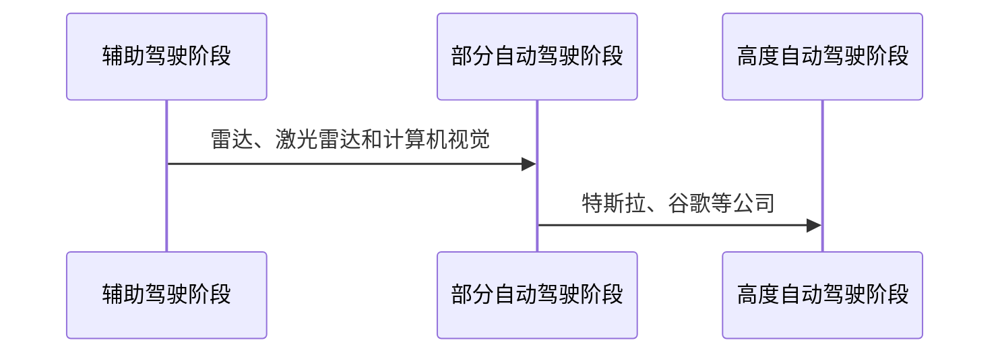
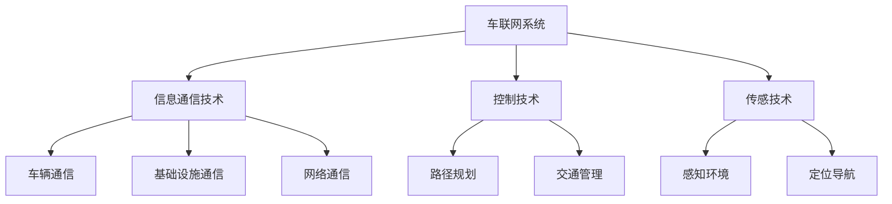
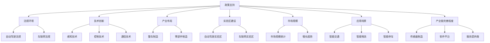
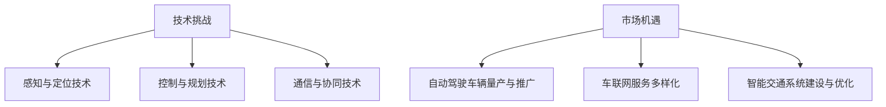

                 

### 第1章 自动驾驶与车联网系统概述

> **关键词：** 自动驾驶，车联网，智能交通，技术发展，应用场景，挑战与机遇

**摘要：** 本章将介绍自动驾驶与车联网系统的基本概念、发展历程、技术架构及其在我国的发展现状。我们将探讨这两大技术面临的挑战与机遇，为后续章节的深入分析奠定基础。

----------------------------------------------------------------

**正文内容：**

### 第1章 自动驾驶与车联网系统概述

#### 1.1 自动驾驶技术的发展历程

自动驾驶技术的概念最早可以追溯到20世纪50年代，但直到21世纪初，随着计算机技术、传感器技术和通信技术的快速发展，自动驾驶技术才开始逐渐走向实用化。以下是自动驾驶技术的发展历程：

1. **辅助驾驶阶段（20世纪80年代至2000年代初期）**
   - 这一阶段，自动驾驶技术主要侧重于辅助驾驶员完成某些驾驶任务，如自动泊车、自适应巡航控制等。这一时期的代表性技术包括雷达、激光雷达（LiDAR）和计算机视觉等。

2. **部分自动驾驶阶段（2000年代中期至2010年代初期）**
   - 随着感知技术和控制技术的不断进步，自动驾驶技术开始从辅助驾驶向部分自动驾驶过渡。例如，谷歌在2010年推出了其自动驾驶原型车，实现了在特定环境下自动驾驶。

3. **高度自动驾驶阶段（2010年代中期至今）**
   - 高度自动驾驶（SAE Level 3-5）成为当前研究的热点。这一阶段，自动驾驶系统能够在更广泛的环境中自主完成大部分驾驶任务，但仍然需要驾驶员在某些情况下进行干预。特斯拉、Waymo等公司在这一阶段取得了重要突破。

#### 1.2 车联网系统的定义与作用

车联网（Intelligent Transportation System, ITS）是指利用先进的信息通信技术、控制技术、传感技术等，实现车辆与车辆、车辆与基础设施、车辆与网络之间的信息交换与通信，以提高交通效率、保障交通安全、提升驾驶体验的技术系统。车联网系统的主要作用包括：

1. **提高交通安全**
   - 通过车辆之间的实时通信，可以提前预警潜在的危险，从而减少交通事故的发生。

2. **优化交通效率**
   - 车联网系统能够实时收集交通信息，并通过智能调度和路径规划，优化交通流量，减少拥堵。

3. **改善驾驶体验**
   - 车联网系统可以提供个性化的驾驶服务，如导航、语音交互等，提升驾驶者的舒适度和便捷性。

4. **促进智能交通的发展**
   - 车联网系统是实现智能交通的重要基础设施，有助于构建高效、安全、舒适的交通环境。

#### 1.3 自动驾驶与车联网系统在我国的发展现状

1. **政策支持与法规环境**

   我国政府高度重视自动驾驶与车联网技术的发展，出台了一系列政策和法规，为技术创新和产业发展提供保障。例如，《智能网联汽车道路测试管理规范（试行）》和《智能网联汽车道路测试管理实施细则（试行）》等法规为自动驾驶车辆的测试提供了明确的指导和规范。

2. **技术创新与产业布局**

   我国在自动驾驶与车联网技术方面取得了一系列重要突破。例如，百度、蔚来等公司在自动驾驶技术方面取得了显著进展，比亚迪、吉利等汽车制造商也在车联网技术上进行了大量投入。

3. **实验区与示范区建设**

   为推动自动驾驶与车联网技术的发展，我国在多个城市建立了自动驾驶与车联网实验区和示范区。例如，北京的亦庄经济开发区、上海的嘉定区等，这些区域为自动驾驶车辆的测试和示范应用提供了良好的环境。

4. **车联网普及率与市场规模**

   随着技术的不断进步和市场的逐步开放，车联网在我国的应用越来越广泛。根据统计数据，截至2022年底，我国车联网用户规模已超过3亿，市场规模达到1.2万亿元。

5. **车联网应用场景与模式**

   车联网技术在我国的各个领域得到了广泛应用，包括智能交通、智能物流、智能停车场等。例如，在智能交通方面，我国已经实现了基于车联网的智能信号灯控制、智能路侧单元部署等应用；在智能物流方面，车联网技术助力物流企业实现车辆路径优化、货物跟踪等功能。

6. **产业链的完善程度**

   随着自动驾驶与车联网技术的快速发展，我国产业链也在逐步完善。从传感器、芯片制造到整车制造、软件平台，各个环节的企业都在积极参与技术创新和产业发展。

#### 1.4 自动驾驶与车联网系统的挑战与机遇

1. **技术挑战**

   自动驾驶与车联网系统的发展面临着诸多技术挑战，包括：

   - **感知与定位技术**：在复杂多变的交通环境中，如何提高感知精度和定位精度，确保车辆安全可靠地运行。
   - **控制与规划技术**：在实时性和精确性的要求下，如何实现车辆的高效控制与路径规划，确保行驶平稳、高效。
   - **通信与协同技术**：在高速移动的情况下，如何实现车辆与车辆、车辆与基础设施之间的可靠通信，确保信息传输的实时性和准确性。

2. **市场机遇**

   自动驾驶与车联网系统的发展也面临着巨大的市场机遇，包括：

   - **自动驾驶车辆的量产与推广**：随着技术的成熟，自动驾驶车辆有望实现量产，并在全球范围内推广。
   - **车联网服务的多样化**：车联网技术的普及将带动各种服务的创新和发展，如智能导航、智能停车、智能物流等。
   - **智能交通系统的建设与优化**：自动驾驶与车联网技术将为智能交通系统的发展提供强大的支持，推动交通行业的变革。

综上所述，自动驾驶与车联网系统具有广阔的发展前景，面临着巨大的挑战与机遇。在接下来的章节中，我们将进一步探讨这些技术的核心原理、架构设计以及应用案例，为读者提供一个全面的技术解读。

### 1.1 自动驾驶技术的发展历程

**核心概念与联系：**

自动驾驶技术的发展历程可以分为几个关键阶段：辅助驾驶阶段、部分自动驾驶阶段和高度自动驾驶阶段。这些阶段分别代表自动驾驶技术的不同发展阶段和核心技术进步。



**核心算法原理讲解：**

- 辅助驾驶阶段：以自动泊车、自适应巡航控制等为代表，主要依靠传感器和计算机控制技术实现辅助功能。
  - **伪代码：**
    ```
    function 停车辅助（车辆，传感器数据） {
        if（传感器数据表明周围无障碍物） {
            控制车辆进行倒车入库；
        } else {
            提示驾驶员注意周围环境；
        }
    }
    ```

- 部分自动驾驶阶段：实现了在特定环境下自动驾驶，核心技术包括感知、决策和控制。
  - **伪代码：**
    ```
    function 部分自动驾驶（车辆，环境数据） {
        感知环境（环境数据）；
        决策（环境数据，车辆状态）；
        控制车辆（决策结果）；
    }
    ```

- 高度自动驾驶阶段：实现了在更广泛环境下的自动驾驶，核心技术包括高精度地图、深度学习和协同控制。
  - **伪代码：**
    ```
    function 高度自动驾驶（车辆，环境数据，高精度地图） {
        感知环境（环境数据，高精度地图）；
        决策（环境数据，车辆状态，高精度地图）；
        控制车辆（决策结果）；
        协同控制（与其他车辆，基础设施）；
    }
    ```

**数学模型和公式：**

自动驾驶技术中的核心算法通常涉及到概率论、线性代数、优化理论等数学模型。以下是一个简单的路径规划算法的公式示例：

- **车辆运动学模型：**
  $$
  \begin{cases}
  x(t) = x_0 + v \cos(\theta) t \\
  y(t) = y_0 + v \sin(\theta) t
  \end{cases}
  $$

- **路径规划算法：**
  $$
  \text{minimize} \sum_{i=1}^{n} \left( d_i - l_i \right)^2
  $$
  其中，$d_i$ 表示路径上的第$i$个点的距离，$l_i$ 表示第$i$个点的车道宽度。

**举例说明：**

以特斯拉的自动驾驶系统为例，其核心算法包括感知环境、决策路径和控制车辆。在实际应用中，特斯拉通过大量数据训练深度学习模型，实现对周围环境的实时感知和决策。

- **感知环境：** 利用摄像头、激光雷达、超声波传感器等多传感器数据，实现对周围环境的实时感知。
- **决策路径：** 根据感知到的环境数据和车辆状态，使用深度学习模型进行路径规划，确定最佳行驶路线。
- **控制车辆：** 根据决策结果，控制车辆的转向、加速和制动，实现自动驾驶。

特斯拉的自动驾驶系统在多个场景下进行了测试和验证，如高速公路、城市道路和停车场等。通过不断优化算法和硬件，特斯拉的自动驾驶系统在安全性和可靠性方面取得了显著进步。

**项目实战：**

- **开发环境搭建：** 使用Python和C++等编程语言，结合TensorFlow和PyTorch等深度学习框架，搭建自动驾驶系统的开发环境。
- **源代码详细实现：** 编写感知模块、决策模块和控制模块的源代码，实现自动驾驶系统的核心功能。
- **代码解读与分析：** 对源代码进行详细解读，分析各个模块的实现原理和性能表现，优化系统性能。

通过以上步骤，我们可以构建一个基本的自动驾驶系统，并在实际应用中不断优化和完善。

### 1.2 车联网系统的定义与作用

**核心概念与联系：**

车联网系统（Intelligent Transportation System, ITS）是利用先进的信息通信技术、控制技术、传感技术等，实现车辆与车辆、车辆与基础设施、车辆与网络之间的信息交换与通信，以提高交通效率、保障交通安全、提升驾驶体验的技术系统。



**核心算法原理讲解：**

- **信息通信技术：**
  - **车辆通信：** 利用V2X（Vehicle-to-Everything）技术，实现车辆之间的实时通信，如车辆之间的速度、位置、意图等信息交换。
    - **伪代码：**
      ```
      function 车辆通信（车辆1，车辆2） {
          发送车辆状态（车辆1）；
          接收车辆状态（车辆2）；
          更新环境模型；
      }
      ```

  - **基础设施通信：** 通过路侧单元（Road Side Unit, RSU）等基础设施设备，实现车辆与基础设施之间的通信，如智能信号灯、交通标志等。
    - **伪代码：**
      ```
      function 基础设施通信（车辆，RSU） {
          发送车辆位置和状态（车辆）；
          接收交通信息（RSU）；
          更新路径规划；
      }
      ```

  - **网络通信：** 通过车联网平台，实现车辆与互联网之间的通信，如导航服务、在线诊断等。
    - **伪代码：**
      ```
      function 网络通信（车辆，车联网平台） {
          发送车辆状态和位置（车辆）；
          接收导航指令和诊断信息（车联网平台）；
          更新驾驶行为；
      }
      ```

- **控制技术：**
  - **路径规划：** 根据实时交通信息和车辆状态，规划最优行驶路径，提高交通效率。
    - **伪代码：**
      ```
      function 路径规划（车辆，交通信息） {
          构建交通网络模型；
          使用最短路径算法（如Dijkstra算法）；
          返回最优路径；
      }
      ```

  - **交通管理：** 通过实时监控和管理交通流，优化交通信号灯控制和道路分配，提高道路通行能力。
    - **伪代码：**
      ```
      function 交通管理（交通信息） {
          监控交通流量；
          调整信号灯时长；
          分配道路资源；
      }
      ```

- **传感技术：**
  - **感知环境：** 利用摄像头、激光雷达、毫米波雷达等传感器，实时感知周围环境，包括车辆、行人、道路标志等。
    - **伪代码：**
      ```
      function 感知环境（传感器数据） {
          识别车辆、行人、道路标志等；
          构建环境模型；
      }
      ```

  - **定位导航：** 利用GPS、北斗等卫星定位技术，实现车辆的精确定位和导航。
    - **伪代码：**
      ```
      function 定位导航（GPS数据） {
          接收卫星信号；
          计算车辆位置；
          更新导航信息；
      }
      ```

**数学模型和公式：**

- **交通流量模型：**
  $$
  Q(t) = f(c(t)), \quad c(t) = \frac{1}{L} \int_{t_0}^{t} \lambda(s) ds
  $$
  其中，$Q(t)$ 表示时间$t$时的交通流量，$c(t)$ 表示时间$t$时的道路长度，$\lambda(s)$ 表示单位时间内在道路长度$s$上的车辆数。

- **路径规划模型：**
  $$
  \text{minimize} \sum_{i=1}^{n} d_i + \sum_{i=1}^{n} t_i
  $$
  其中，$d_i$ 表示路径上的第$i$个点的距离，$t_i$ 表示第$i$个点的等待时间。

**举例说明：**

以智能交通信号灯系统为例，该系统利用车联网技术实现交通流量的实时监控和信号灯的智能调控。

- **感知环境：** 通过安装在道路上的摄像头和传感器，实时感知交通流量和车辆状态。
- **决策路径：** 根据感知到的交通流量数据，使用最短路径算法和交通流量模型，确定最优的信号灯时长和道路分配策略。
- **控制信号灯：** 根据决策结果，调整信号灯时长，优化交通流量，提高道路通行能力。

**项目实战：**

- **开发环境搭建：** 使用Python、Java等编程语言，结合Matlab等工具，搭建智能交通信号灯系统的开发环境。
- **源代码详细实现：** 编写感知模块、决策模块和控制模块的源代码，实现智能交通信号灯系统的核心功能。
- **代码解读与分析：** 对源代码进行详细解读，分析各个模块的实现原理和性能表现，优化系统性能。

通过以上步骤，我们可以构建一个基本的智能交通信号灯系统，并在实际应用中不断优化和完善。

### 1.3 自动驾驶与车联网系统在我国的发展现状

**核心概念与联系：**

自动驾驶与车联网系统在我国的发展现状涵盖了政策支持、技术创新、产业布局、实验区建设、市场规模、应用场景以及产业链完善程度等多个方面。



**核心算法原理讲解：**

- **政策支持与法规环境：**
  - **自动驾驶法规：** 政府出台了一系列法规，为自动驾驶技术的测试和应用提供了法律保障。例如，《智能网联汽车道路测试管理规范（试行）》和《智能网联汽车道路测试管理实施细则（试行）》等。
  - **车联网法规：** 政府也出台了相关政策，推动车联网技术的发展和应用。例如，《车联网发展行动计划（2017-2020年）》和《车联网标准体系建设指南（2017-2020年）》等。

- **技术创新：**
  - **感知技术：** 我国的自动驾驶技术企业在感知技术上取得了显著进展，如高精度地图、激光雷达、摄像头、毫米波雷达等传感器技术的应用。
  - **控制技术：** 我国在控制技术方面，如路径规划、决策控制等算法上也有较多的创新，为企业提供了丰富的技术储备。
  - **通信技术：** 车联网技术的快速发展离不开通信技术的支持，我国的5G技术、V2X通信等技术在国内外都有较高的竞争力。

- **产业布局：**
  - **整车制造：** 我国有多家汽车制造商布局自动驾驶与车联网技术，如比亚迪、吉利、蔚来等，逐步实现自动驾驶车辆的量产。
  - **零部件制造：** 自动驾驶与车联网系统的零部件制造也在快速发展，如博世、大陆等国际知名企业在中国设有工厂，为国内企业提供零部件支持。

- **实验区建设：**
  - **自动驾驶实验区：** 多个城市设立了自动驾驶实验区，如北京亦庄、上海嘉定、重庆等，为自动驾驶技术的测试和应用提供了重要平台。
  - **车联网实验区：** 车联网技术的应用也在逐步扩大，如无锡、长沙等城市设立了车联网实验区，推动智能交通、智能物流等应用场景的发展。

- **市场规模：**
  - **市场规模统计：** 根据统计数据，我国的自动驾驶与车联网市场规模逐年增长，预计未来几年仍将保持高速增长。
  - **增长趋势：** 随着技术的成熟和市场的逐步开放，自动驾驶与车联网技术将在更多领域得到应用，市场规模将进一步扩大。

- **应用场景：**
  - **智能交通：** 自动驾驶与车联网技术为智能交通的发展提供了重要支撑，如智能信号灯、智能路侧单元、智能公共交通等。
  - **智能物流：** 自动驾驶与车联网技术助力物流行业实现高效、智能的运输管理，如无人驾驶卡车、无人配送等。
  - **智能停车：** 自动驾驶与车联网技术为智能停车提供解决方案，如智能停车引导系统、无人搬运车等。

- **产业链完善程度：**
  - **传感器制造：** 传感器是自动驾驶与车联网系统的重要组成部分，我国在传感器制造领域有较强的竞争力。
  - **软件平台：** 软件平台是自动驾驶与车联网系统的核心，我国的软件企业在算法研发、平台构建等方面有丰富的经验。
  - **服务提供商：** 自动驾驶与车联网技术的广泛应用离不开专业的服务提供商，我国的咨询服务、解决方案提供商等在这一领域取得了显著成绩。

**数学模型和公式：**

- **交通流量模型：**
  $$
  Q(t) = f(c(t)), \quad c(t) = \frac{1}{L} \int_{t_0}^{t} \lambda(s) ds
  $$
  其中，$Q(t)$ 表示时间$t$时的交通流量，$c(t)$ 表示时间$t$时的道路长度，$\lambda(s)$ 表示单位时间内在道路长度$s$上的车辆数。

- **路径规划模型：**
  $$
  \text{minimize} \sum_{i=1}^{n} d_i + \sum_{i=1}^{n} t_i
  $$
  其中，$d_i$ 表示路径上的第$i$个点的距离，$t_i$ 表示第$i$个点的等待时间。

**举例说明：**

以百度Apollo自动驾驶平台为例，该平台是百度在自动驾驶领域的重要布局，涵盖了感知、决策、控制等核心环节。

- **感知：** 利用激光雷达、摄像头、毫米波雷达等传感器，实现对周围环境的实时感知。
- **决策：** 根据感知数据和环境信息，使用深度学习算法进行路径规划和决策。
- **控制：** 根据决策结果，控制车辆的转向、加速和制动，实现自动驾驶。

百度Apollo自动驾驶平台已经在多个城市进行了实际测试和应用，如北京、上海、重庆等，取得了良好的效果。

**项目实战：**

- **开发环境搭建：** 使用Python、C++等编程语言，结合TensorFlow、PyTorch等深度学习框架，搭建自动驾驶平台的开发环境。
- **源代码详细实现：** 编写感知模块、决策模块和控制模块的源代码，实现自动驾驶平台的核心功能。
- **代码解读与分析：** 对源代码进行详细解读，分析各个模块的实现原理和性能表现，优化系统性能。

通过以上步骤，我们可以构建一个基本的自动驾驶平台，并在实际应用中不断优化和完善。

### 1.4 自动驾驶与车联网系统的挑战与机遇

**核心概念与联系：**

自动驾驶与车联网系统的发展面临着一系列技术挑战和市场机遇。这些挑战包括感知与定位技术的可靠性、控制与规划技术的实时性、通信与协同技术的稳定性等，而市场机遇则体现在自动驾驶车辆的量产与推广、车联网服务的多样化、智能交通系统的建设与优化等方面。



**核心算法原理讲解：**

- **感知与定位技术：**
  - **原理讲解：** 感知与定位技术是自动驾驶系统的核心，包括摄像头、激光雷达、毫米波雷达等传感器的数据采集和处理，以及GPS、北斗等定位技术的应用。
  - **伪代码：**
    ```
    function 感知与定位（传感器数据，定位数据） {
        采集传感器数据；
        处理传感器数据，生成环境模型；
        结合定位数据，更新车辆位置；
    }
    ```

- **控制与规划技术：**
  - **原理讲解：** 控制与规划技术包括路径规划、决策控制等算法，用于确定车辆的行驶路线和行驶策略。
  - **伪代码：**
    ```
    function 控制与规划（环境模型，车辆状态） {
        根据环境模型和车辆状态，规划最佳路径；
        根据路径规划，确定车辆的控制策略；
        实时调整车辆行驶状态；
    }
    ```

- **通信与协同技术：**
  - **原理讲解：** 通信与协同技术包括V2X通信、车联网平台等，用于实现车辆与车辆、车辆与基础设施之间的信息交换与协同控制。
  - **伪代码：**
    ```
    function 通信与协同（车辆1，车辆2） {
        发送车辆状态（车辆1）；
        接收车辆状态（车辆2）；
        更新环境模型；
        协同控制（车辆1，车辆2）；
    }
    ```

**数学模型和公式：**

- **感知与定位：**
  $$
  \begin{cases}
  x(t) = x_0 + v \cos(\theta) t \\
  y(t) = y_0 + v \sin(\theta) t
  \end{cases}
  $$
  其中，$x(t)$ 和$y(t)$ 分别表示时间$t$时的车辆横纵坐标，$v$ 表示车辆速度，$\theta$ 表示车辆方向角。

- **控制与规划：**
  $$
  \text{minimize} \sum_{i=1}^{n} d_i + \sum_{i=1}^{n} t_i
  $$
  其中，$d_i$ 表示路径上的第$i$个点的距离，$t_i$ 表示第$i$个点的等待时间。

- **通信与协同：**
  $$
  \text{maximize} \sum_{i=1}^{n} C_i
  $$
  其中，$C_i$ 表示第$i$个通信链路的带宽。

**举例说明：**

以特斯拉的Autopilot自动驾驶系统为例，该系统通过感知与定位技术、控制与规划技术和通信与协同技术，实现了部分自动驾驶功能。

- **感知与定位：** 利用摄像头、激光雷达等传感器，实现对周围环境的实时感知和定位。
- **控制与规划：** 根据感知数据和路径规划算法，确定车辆的行驶路线和控制策略。
- **通信与协同：** 通过V2X通信，实现与其他车辆和基础设施的信息交换和协同控制。

特斯拉的Autopilot系统已经在多个国家和地区进行了测试和应用，取得了良好的效果。

**项目实战：**

- **开发环境搭建：** 使用Python、C++等编程语言，结合TensorFlow、PyTorch等深度学习框架，搭建自动驾驶系统的开发环境。
- **源代码详细实现：** 编写感知模块、决策模块和控制模块的源代码，实现自动驾驶系统的核心功能。
- **代码解读与分析：** 对源代码进行详细解读，分析各个模块的实现原理和性能表现，优化系统性能。

通过以上步骤，我们可以构建一个基本的自动驾驶系统，并在实际应用中不断优化和完善。

### 总结与展望

自动驾驶与车联网系统作为智能交通领域的核心技术，正逐步改变着人们的出行方式和生活方式。从技术发展历程来看，自动驾驶与车联网系统经历了从辅助驾驶到完全自动驾驶的演进，同时车联网系统在信息通信、控制技术、传感技术等方面不断取得突破。在我国，自动驾驶与车联网系统的发展得到了政策的大力支持，产业布局逐步完善，市场机遇也日益显现。

展望未来，自动驾驶与车联网系统将继续向更高效、更安全的方向发展。一方面，随着感知与定位技术的不断提升，自动驾驶系统将在更多场景下实现更可靠的安全性能；另一方面，车联网技术的普及将推动智能交通、智能物流等应用场景的深化发展。同时，自动驾驶与车联网系统在可持续发展和社会责任方面的作用也将日益凸显。

在挑战与机遇并存的发展过程中，自动驾驶与车联网系统的发展离不开各方的共同努力。技术公司、政府机构、行业协会等需要紧密合作，推动技术创新、标准制定和政策完善。同时，公众也需要提高对自动驾驶与车联网系统的认知和接受度，共同营造一个安全、高效、智能的交通环境。

总之，自动驾驶与车联网系统的发展前景广阔，必将为未来的交通出行带来深刻变革。让我们共同期待这一技术革命的到来，共同构建一个更美好的智能交通未来。

### 附录A：自动驾驶与车联网系统开发工具与资源

**A.1 开发工具简介**

自动驾驶与车联网系统的开发涉及多种技术工具，以下是一些常用的开发工具：

- **自动驾驶软件开发工具：**
  - **ROS（Robot Operating System）**：ROS是一种流行的机器人软件框架，适用于自动驾驶系统的开发。它提供了丰富的库和工具，支持多种编程语言，如Python、C++等。
  - **CARLA Simulator**：CARLA是一个开源的自动驾驶模拟器，提供了逼真的交通场景和车辆模型，用于自动驾驶系统的开发和测试。

- **自动驾驶硬件开发工具：**
  - **Arduino**：Arduino是一种流行的硬件开发平台，适用于自动驾驶系统中的传感器和数据采集。
  - **Raspberry Pi**：Raspberry Pi是一种低成本的计算机，适用于自动驾驶系统中的数据处理和决策控制。

- **车联网系统开发工具：**
  - **MQTT**：MQTT是一种轻量级的消息队列协议，适用于车联网系统的实时数据传输。
  - **Websocket**：Websocket是一种全双工通信协议，适用于车联网系统的实时数据交互。

**A.2 学习资源推荐**

为了更好地了解自动驾驶与车联网系统的技术，以下是一些建议的学习资源：

- **专业书籍推荐：**
  - 《自动驾驶系统原理与应用》
  - 《车联网技术与应用》
  - 《智能交通系统技术》

- **在线课程推荐：**
  - Coursera上的“自动驾驶技术基础”
  - Udacity上的“自动驾驶工程师纳米学位”
  - edX上的“智能交通系统课程”

- **论坛与社区推荐：**
  - GitHub：GitHub上有大量的开源自动驾驶与车联网系统项目，可供学习和参考。
  - Stack Overflow：Stack Overflow是编程问题的问答社区，适合解决开发过程中的技术难题。
  - AutoLab：AutoLab是一个专注于自动驾驶与车联网领域的专业论坛，提供了丰富的技术讨论和资源。

通过以上工具和资源，开发者可以更好地掌握自动驾驶与车联网系统的开发技术，推动相关项目的研究与实施。

