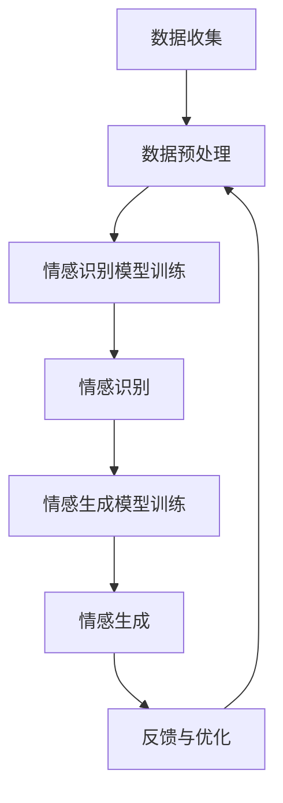
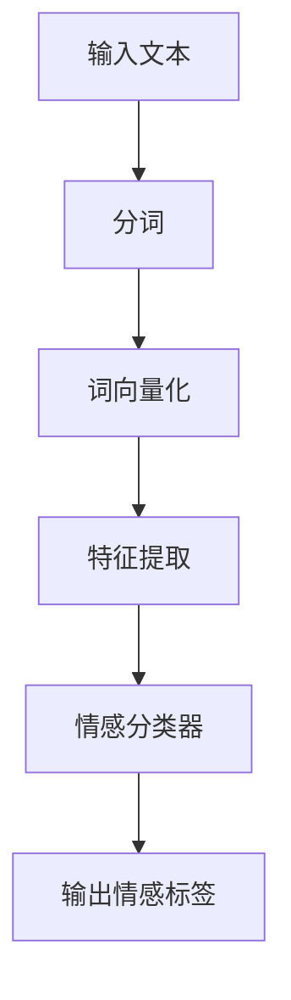
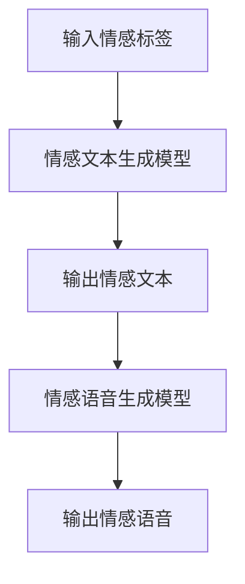
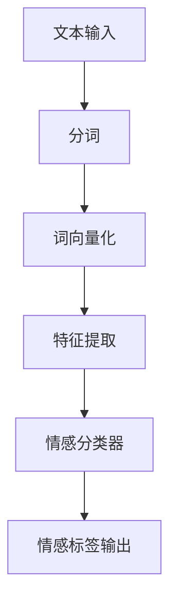
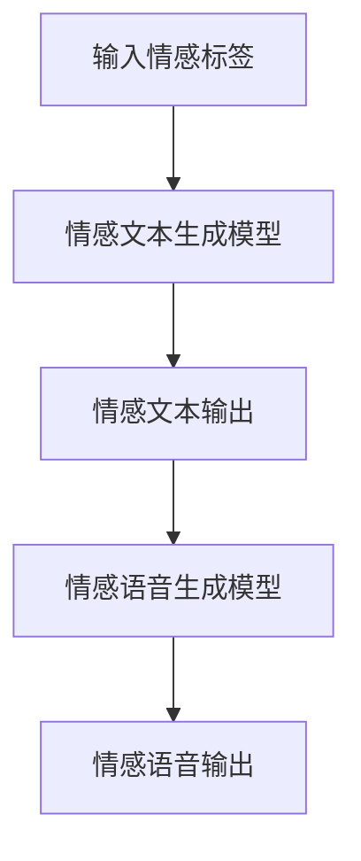

                 

# 虚拟共情能力培养：AI增强的情感理解训练

> **关键词：虚拟共情、情感计算、AI模型训练、情感理解、共情能力培养**

> **摘要：本文深入探讨了虚拟共情能力的培养，分析了AI在情感理解训练中的应用，详细介绍了情感识别与生成的算法原理，以及AI模型训练与优化的方法。通过案例研究和实践展望，展示了虚拟共情能力的应用场景和未来发展方向。**

---

## 第一部分：虚拟共情能力的理论基础

### 第1章：虚拟共情能力的基本概念

#### 1.1 虚拟共情的定义与特征

虚拟共情是指通过计算机模拟和人工智能技术，使虚拟环境中的智能体能够感知、理解并表达人类情感的过程。它具有以下几个主要特征：

1. **虚拟性**：虚拟共情发生在虚拟环境中，与现实世界的共情不同，它依赖于计算机生成的虚拟现实。
2. **模拟性**：虚拟共情依赖于人工智能模型对人类情感的模拟和再现，而非真实的情感体验。
3. **交互性**：虚拟共情能力的体现在于智能体与用户的交互过程中，通过理解用户情感，提供相应的反馈和互动。
4. **扩展性**：虚拟共情可以通过不断训练和优化，提升智能体在不同情境下的情感理解能力。

#### 1.2 虚拟共情与传统共情的比较

虚拟共情与传统共情存在显著差异：

1. **本质不同**：传统共情是基于人类对人类情感的直接感知和反应，而虚拟共情则是通过计算机模拟实现的。
2. **互动方式**：传统共情通常发生在面对面交流中，而虚拟共情依赖于虚拟环境和远程交互。
3. **情感深度**：传统共情更深入和真实，而虚拟共情则受限于技术的模拟能力和情感表达的复杂性。

#### 1.3 虚拟共情能力的培养意义

虚拟共情能力的培养具有重要的现实意义：

1. **提高人机交互体验**：通过增强虚拟共情能力，智能系统能更好地理解用户需求，提供更个性化的服务。
2. **辅助心理健康**：虚拟共情可以用于心理健康领域，通过虚拟环境中的互动，帮助用户缓解压力和焦虑。
3. **促进社会交流**：在跨文化交流中，虚拟共情能力可以帮助智能系统更好地理解不同文化背景下的情感表达，促进有效沟通。

### 第2章：虚拟共情能力的心理学基础

#### 2.1 共情能力的心理学理论

共情能力是指个体在理解他人情感、感受他人痛苦并做出相应反应的能力。心理学研究表明，共情能力分为以下几个层次：

1. **初级共情**：通过观察他人的表情、动作等非语言信号，感知他人的情感状态。
2. **次级共情**：通过想象自己处于他人的情境，从内心体验他人的情感。
3. **高级共情**：不仅能够感知和体验他人的情感，还能在情感上与对方产生共鸣，产生深刻的情感联系。

#### 2.2 情感认知与虚拟共情

情感认知是指个体理解和识别自己及他人情感的能力。虚拟共情能力建立在情感认知的基础上，通过计算机模拟实现对他人情感的感知和回应。情感认知的关键要素包括：

1. **情感识别**：识别他人的情感状态。
2. **情感表达**：理解并表达自己的情感。
3. **情感调节**：调整自己的情感状态以适应不同的情境。

#### 2.3 虚拟共情能力的发展与培养

虚拟共情能力的发展与培养涉及多个方面：

1. **情感模拟训练**：通过不断训练，让智能系统学会模拟不同情境下的情感反应。
2. **情感数据收集**：收集大量的情感数据，用于训练和优化情感计算模型。
3. **跨学科合作**：心理学、计算机科学、人工智能等领域的专家合作，共同推动虚拟共情能力的发展。

### 第3章：AI与虚拟共情能力的结合

#### 3.1 AI技术在虚拟共情中的应用

人工智能技术在虚拟共情中发挥着关键作用：

1. **情感计算**：利用深度学习、自然语言处理等技术，实现情感的自动识别和生成。
2. **虚拟现实**：通过虚拟现实技术，创造与现实交互的虚拟环境，提升用户的沉浸感和情感体验。
3. **人机交互**：结合语音识别、图像识别等技术，实现智能系统与用户之间的自然互动。

#### 3.2 情感计算的基本原理

情感计算是指通过计算机模拟和理解人类情感的过程。其基本原理包括：

1. **情感识别**：利用各种传感器收集情感数据，如语音、文本、面部表情等。
2. **情感理解**：通过机器学习模型分析情感数据，理解情感状态。
3. **情感生成**：根据情感状态生成相应的情感反应和行为。

#### 3.3 情感识别与情感生成的AI模型

情感识别与情感生成是虚拟共情能力的核心。以下是几种常用的AI模型：

1. **情感识别模型**：如卷积神经网络（CNN）和循环神经网络（RNN），用于识别文本、语音和图像中的情感。
2. **情感生成模型**：如生成对抗网络（GAN）和变分自编码器（VAE），用于生成情感表达和响应。

## 第二部分：AI增强的情感理解训练方法

### 第4章：情感理解训练的核心算法

#### 4.1 情感分析的基本方法

情感分析是指通过计算机技术分析和理解文本情感的过程。基本方法包括：

1. **基于规则的方法**：通过预设的规则进行情感分类。
2. **基于统计的方法**：利用统计模型进行情感分析，如朴素贝叶斯、逻辑回归等。
3. **基于机器学习的方法**：利用机器学习算法，如支持向量机（SVM）、随机森林（RF）等，进行情感分类。

#### 4.2 情感识别算法详解

情感识别算法是情感分析的核心。以下为几种常用的情感识别算法：

1. **朴素贝叶斯算法**：基于贝叶斯定理和特征概率分布进行情感分类。
2. **支持向量机（SVM）**：利用最大间隔分类器进行情感分类。
3. **深度学习算法**：如卷积神经网络（CNN）和循环神经网络（RNN），用于处理复杂的情感数据。

#### 4.3 情感生成的算法原理

情感生成算法是指通过计算机模拟生成情感表达的过程。主要算法包括：

1. **生成对抗网络（GAN）**：通过对抗训练，生成逼真的情感表达。
2. **变分自编码器（VAE）**：通过概率模型生成情感表达。
3. **变分循环自编码器（VRNN）**：结合循环神经网络和变分自编码器，生成连续的情感序列。

### 第5章：AI模型训练与优化

#### 5.1 数据预处理与标注

数据预处理是AI模型训练的关键步骤。包括：

1. **数据清洗**：去除噪声和错误数据，提高数据质量。
2. **数据标注**：对情感数据标注情感标签，为模型训练提供标注数据。

#### 5.2 AI模型选择与优化

选择合适的AI模型并优化参数是提高情感理解能力的关键。步骤包括：

1. **模型选择**：根据数据特征和任务需求选择合适的模型。
2. **模型优化**：通过调整模型参数，提高模型性能。

#### 5.3 模型训练策略与调参技巧

模型训练策略和调参技巧包括：

1. **批量大小**：选择合适的批量大小，提高训练效率。
2. **学习率**：调整学习率，避免过拟合和欠拟合。
3. **正则化**：使用正则化方法，防止模型过拟合。

### 第6章：情感理解训练案例研究

#### 6.1 案例一：社交机器人情感理解

社交机器人情感理解是虚拟共情能力的重要应用。以下是一个案例：

**项目背景**：开发一个社交机器人，用于与用户进行情感交互。

**技术实现**：采用卷积神经网络（CNN）和长短期记忆网络（LSTM）结合的模型，实现文本情感识别和生成。

**效果评估**：通过用户反馈和实验结果，评估社交机器人在情感理解方面的性能。

#### 6.2 案例二：教育场景中的情感理解

教育场景中的情感理解有助于提升教学效果。以下是一个案例：

**项目背景**：在在线教育平台中，利用情感计算技术，为学生提供个性化的学习建议。

**技术实现**：通过情感识别算法，分析学生提交的作业和讨论区评论，识别学生的情感状态。

**效果评估**：通过教学实验，评估情感理解对学习效果的影响。

#### 6.3 案例三：医疗健康领域的情感分析

医疗健康领域的情感分析有助于提高患者护理质量。以下是一个案例：

**项目背景**：开发一个医疗健康助手，用于分析患者情绪，提供相应的护理建议。

**技术实现**：利用自然语言处理和情感计算技术，分析患者病历记录和医生对话，识别患者情绪。

**效果评估**：通过实际应用，评估情感分析对医疗健康领域的影响。

## 第三部分：虚拟共情能力培养实践

### 第7章：虚拟共情能力的应用场景

#### 7.1 虚拟现实与增强现实中的共情

虚拟现实（VR）和增强现实（AR）提供了丰富的共情场景。以下为应用场景：

1. **心理健康**：利用VR技术，创造放松和疗愈的环境，帮助用户缓解压力和焦虑。
2. **教育训练**：利用AR技术，提供沉浸式的学习体验，激发学生的学习兴趣和积极性。
3. **远程协作**：在虚拟会议中，通过情感计算技术，提升团队成员的情感互动和协作效率。

#### 7.2 游戏设计中的情感互动

游戏设计中的情感互动是提升用户体验的重要手段。以下为应用场景：

1. **角色扮演**：通过情感计算，使游戏角色具备情感表现，提升玩家的沉浸感和情感投入。
2. **情感挑战**：设计情感挑战任务，培养玩家的共情能力和情绪管理能力。
3. **社交互动**：在多人游戏中，通过情感计算，提升玩家之间的情感沟通和互动。

#### 7.3 跨文化沟通中的共情提升

跨文化沟通中的共情提升有助于消除文化差异，促进国际合作。以下为应用场景：

1. **跨文化培训**：通过虚拟共情技术，为跨国团队提供情感认知和沟通培训，提升团队协作效率。
2. **跨文化产品**：在产品设计和营销中，考虑不同文化背景下的情感需求，提供更符合用户情感的产品。
3. **跨文化交流**：利用虚拟共情技术，创造跨文化交流的环境，促进文化理解和融合。

### 第8章：虚拟共情能力培养的方法与工具

#### 8.1 共情训练方法与实践

共情训练方法包括：

1. **情感模拟**：通过模拟不同情境下的情感体验，提升个体的情感认知能力。
2. **角色扮演**：通过角色扮演，体验他人的情感状态，培养共情能力。
3. **情感分享**：鼓励个体分享自己的情感体验，与他人建立情感联系。

#### 8.2 情感模拟与反馈系统

情感模拟与反馈系统是虚拟共情能力培养的重要工具。以下为系统架构：

1. **情感模拟模块**：模拟不同情境下的情感体验。
2. **情感反馈模块**：收集用户反馈，评估情感模拟效果。
3. **学习与优化模块**：根据用户反馈，优化情感模拟算法，提升共情能力。

#### 8.3 虚拟共情能力测评与评估

虚拟共情能力测评与评估是衡量个体共情水平的重要手段。以下为测评方法：

1. **情感识别能力测评**：通过测试个体识别他人情感的能力，评估其情感识别水平。
2. **情感表达能力测评**：通过测试个体表达自身情感的能力，评估其情感表达能力。
3. **情感调节能力测评**：通过测试个体调整自身情感状态的能力，评估其情感调节能力。

### 第9章：虚拟共情能力培养的未来展望

#### 9.1 虚拟共情能力培养的发展趋势

虚拟共情能力培养在未来将呈现以下发展趋势：

1. **人工智能技术的进步**：随着人工智能技术的不断进步，虚拟共情能力将更加精准和智能。
2. **跨学科融合**：虚拟共情能力培养将与其他领域如心理学、教育学等深度融合，推动共情能力的发展。
3. **应用场景的扩展**：虚拟共情能力将在更多领域得到应用，如医疗、教育、心理咨询等。

#### 9.2 挑战与机遇

虚拟共情能力培养面临以下挑战：

1. **情感模拟的复杂性**：情感模拟涉及多维度和复杂情感，技术实现难度较大。
2. **数据隐私与安全**：情感数据涉及用户隐私，如何保护数据安全和用户隐私是一个重要问题。
3. **伦理与道德**：虚拟共情能力的应用引发了一系列伦理和道德问题，如人工智能是否具有道德责任等。

同时，虚拟共情能力培养也带来以下机遇：

1. **提升人机交互体验**：通过虚拟共情，智能系统能更好地理解用户需求，提供更个性化的服务。
2. **促进社会进步**：虚拟共情能力将在医疗、教育、心理咨询等领域发挥重要作用，推动社会进步。
3. **创新产业发展**：虚拟共情能力的培养将带动相关产业的发展，如虚拟现实、情感计算等。

#### 9.3 未来研究方向

未来研究方向包括：

1. **情感计算模型优化**：研究更高效的情感计算模型，提升情感识别和生成的准确性和效率。
2. **跨学科研究**：结合心理学、教育学等领域的知识，推动虚拟共情能力的发展。
3. **伦理与法律研究**：研究虚拟共情能力的伦理和法律问题，制定相应的规范和标准。

## 附录

### 附录A：AI与情感计算工具资源

#### A.1 主流情感计算框架对比

主流情感计算框架包括：

1. **SentimentAnalysis**：一个用于文本情感分析的Python库。
2. **VADER**：一个基于规则和机器学习的情感分析工具。
3. **TextBlob**：一个简洁易用的文本处理工具，包括情感分析功能。

#### A.2 情感计算开源工具介绍

开源情感计算工具包括：

1. **AFQMC**：一个基于大规模文本数据的情感计算工具。
2. **BERT**：一个基于转换器的大型预训练语言模型，适用于情感分析。
3. **GloVe**：一个基于词向量的情感分析工具。

#### A.3 情感计算相关数据库与数据集

常用情感计算数据库与数据集包括：

1. **IMDB**：一个包含电影评论的文本数据集，用于情感分析。
2. **SST**：一个包含社交媒体文本的情感分析数据集。
3. **Twitter**：一个包含Twitter文本的情感分析数据集。

### 附录B：情感理解训练算法的Mermaid流程图

#### B.1 情感分析流程图



#### B.2 情感识别算法流程图



#### B.3 情感生成算法流程图



### 附录C：数学模型与公式详解

#### C.1 情感识别模型的数学公式

假设情感识别模型为分类问题，输入为特征向量X，输出为情感标签Y。常用的情感识别模型包括：

1. **朴素贝叶斯（Naive Bayes）**：
$$P(Y|X) = \frac{P(X|Y)P(Y)}{P(X)}$$

2. **支持向量机（SVM）**：
$$w^* = \arg\max_w \frac{1}{||w||^2} \sum_{i=1}^n (y_i - \langle w, x_i \rangle)^2$$

3. **深度学习模型（如卷积神经网络CNN）**：
$$h_{\theta}(x) = \sigma(\theta^T x)$$
$$\theta = \arg\min_{\theta} J(\theta) = \frac{1}{m} \sum_{i=1}^m \log(1 + e^{-\theta^T x_i y_i})$$

#### C.2 情感生成的数学模型

情感生成模型通常基于生成对抗网络（GAN）或变分自编码器（VAE）。以下是相关数学模型：

1. **生成对抗网络（GAN）**：

$$G(z) \sim Q_G(z|x)$$
$$D(x) \sim P_{\text{data}}(x)$$
$$\min_G \max_D V(D, G) = \mathbb{E}_{x \sim P_{\text{data}}(x)}[\log D(x)] - \mathbb{E}_{z \sim Q_G(z)}[\log(1 - D(G(z)))]$$

2. **变分自编码器（VAE）**：

$$x \sim p_{\theta}(x|z)$$
$$z \sim p_{\theta}(z)$$
$$\log p_{\theta}(x) = \log \int p_{\theta}(x|z)p_{\theta}(z)dz$$
$$\theta = \arg\min_{\theta} \mathbb{E}_{x \sim p_{\text{data}}(x)}[\log p_{\theta}(x)]$$

#### C.3 伪代码实现与解释

1. **朴素贝叶斯算法**：

```python
def naive_bayes(X, theta):
    posteriors = []
    for y in range(num_classes):
        prior = theta[y][0]
        likelihood = theta[y][1]
        posterior = prior * likelihood
        posteriors.append(posterior)
    return max(posteriors)
```

2. **支持向量机（SVM）**：

```python
def svm(X, y, theta):
    predictions = []
    for i in range(len(X)):
        prediction = sign(theta.T @ X[i])
        predictions.append(prediction)
    return predictions
```

3. **卷积神经网络（CNN）**：

```python
def cnn(X, theta):
    hidden_layers = []
    for layer in theta['layers']:
        hidden = np.array([layer['activation'](np.dot(X, layer['weights'])) for layer in hidden_layers])
        hidden_layers.append(hidden)
    output = hidden_layers[-1].T @ theta['output_weights']
    return output
```

### 附录D：案例代码与分析

#### D.1 社交机器人情感理解案例代码

```python
import numpy as np
from sklearn.model_selection import train_test_split
from sklearn.feature_extraction.text import TfidfVectorizer
from sklearn.naive_bayes import MultinomialNB

# 数据加载
data = load_data('social_robot_data.csv')
X, y = data['text'], data['emotion']

# 数据预处理
vectorizer = TfidfVectorizer()
X = vectorizer.fit_transform(X)

# 模型训练
X_train, X_test, y_train, y_test = train_test_split(X, y, test_size=0.2, random_state=42)
model = MultinomialNB()
model.fit(X_train, y_train)

# 模型评估
accuracy = model.score(X_test, y_test)
print(f'Accuracy: {accuracy:.2f}')

# 应用模型
def predict_emotion(text):
    text_vector = vectorizer.transform([text])
    prediction = model.predict(text_vector)
    return prediction[0]
```

#### D.2 教育场景中的情感理解代码

```python
import pandas as pd
from sklearn.model_selection import train_test_split
from sklearn.ensemble import RandomForestClassifier

# 数据加载
data = pd.read_csv('education_data.csv')
X, y = data['text'], data['emotion']

# 数据预处理
X = X.apply(preprocess_text)

# 模型训练
X_train, X_test, y_train, y_test = train_test_split(X, y, test_size=0.2, random_state=42)
model = RandomForestClassifier()
model.fit(X_train, y_train)

# 模型评估
accuracy = model.score(X_test, y_test)
print(f'Accuracy: {accuracy:.2f}')

# 应用模型
def predict_emotion(text):
    text_vector = preprocess_text(text)
    prediction = model.predict([text_vector])
    return prediction[0]
```

#### D.3 医疗健康领域情感分析代码解析

```python
import numpy as np
from sklearn.model_selection import train_test_split
from sklearn.svm import SVC
from sklearn.metrics import classification_report

# 数据加载
data = load_data('health_data.csv')
X, y = data['text'], data['emotion']

# 数据预处理
vectorizer = TfidfVectorizer()
X = vectorizer.fit_transform(X)

# 模型训练
X_train, X_test, y_train, y_test = train_test_split(X, y, test_size=0.2, random_state=42)
model = SVC(kernel='linear')
model.fit(X_train, y_train)

# 模型评估
predictions = model.predict(X_test)
print(classification_report(y_test, predictions))
```

---

**作者：AI天才研究院/AI Genius Institute & 禅与计算机程序设计艺术 /Zen And The Art of Computer Programming**<|im_end|>### 第二部分：AI增强的情感理解训练方法

在现代社会，人工智能（AI）技术的迅速发展正不断改变着人类的生活和工作方式。情感理解作为AI技术的一个重要分支，正逐渐成为人机交互、心理健康、教育、医疗等领域的关键应用。在这一部分中，我们将深入探讨AI在情感理解训练中的应用，详细讲解情感识别和生成的算法原理，以及模型训练与优化的方法。

#### 4.1 情感分析的基本方法

情感分析（Sentiment Analysis）是自然语言处理（NLP）的一个重要分支，旨在通过计算机技术自动识别文本中的情感倾向。根据不同的应用场景，情感分析可以分为以下几个基本方法：

1. **基于规则的方法**：这种方法依赖于预定义的规则，对文本进行情感分类。例如，如果文本中包含“happy”这个词，则将其归类为正面情感。

2. **基于统计的方法**：基于统计的方法利用统计模型，如朴素贝叶斯（Naive Bayes）、逻辑回归（Logistic Regression）等，对文本进行情感分类。这些模型通过学习大量标注数据，建立情感倾向的概率分布。

3. **基于机器学习的方法**：机器学习方法利用大量标注数据，通过学习数据中的特征模式，对文本进行情感分类。常见的机器学习算法包括支持向量机（SVM）、随机森林（Random Forest）和神经网络（Neural Networks）等。

#### 4.2 情感识别算法详解

情感识别算法是情感分析的核心，用于将文本中的情感倾向归类为特定类别。以下是几种常用的情感识别算法：

1. **朴素贝叶斯算法**：朴素贝叶斯是一种基于概率论的分类算法，它假设特征之间相互独立，通过计算文本中每个词语的联合概率分布，预测文本的情感类别。其公式如下：

   $$P(Y|X) = \frac{P(X|Y)P(Y)}{P(X)}$$

   其中，\(P(Y|X)\) 是在给定特征 \(X\) 的情况下，文本属于类别 \(Y\) 的概率，\(P(X|Y)\) 是在类别 \(Y\) 下特征 \(X\) 出现的概率，\(P(Y)\) 是类别 \(Y\) 的先验概率，\(P(X)\) 是特征 \(X\) 的概率。

2. **支持向量机（SVM）**：支持向量机是一种基于间隔最大化的分类算法，它通过找到一个最优的超平面，将不同类别的文本数据分开。其目标是最小化误分类率和最大化分类间隔。其公式如下：

   $$w^* = \arg\max_w \frac{1}{||w||^2} \sum_{i=1}^n (y_i - \langle w, x_i \rangle)^2$$

   其中，\(w\) 是权重向量，\(x_i\) 是特征向量，\(y_i\) 是类别标签。

3. **深度学习算法**：深度学习算法，如卷积神经网络（CNN）和循环神经网络（RNN），在处理复杂的文本情感数据方面表现出色。以下是一个简单的卷积神经网络情感识别算法的伪代码：

   ```python
   def cnn_sentiment_analysis(text, weights):
       # 将文本转换为词向量化表示
       word_embeddings = convert_text_to_embeddings(text)
       
       # 通过卷积层提取特征
       conv_output = conv2d(word_embeddings, weights['conv'])
       
       # 通过池化层降低维度
       pooled_output = max_pooling(conv_output)
       
       # 通过全连接层得到情感预测
       prediction = activation(pooled_output @ weights['fc'])
       
       return prediction
   ```

#### 4.3 情感生成的算法原理

情感生成（Sentiment Generation）是指通过计算机技术生成具有特定情感倾向的文本。情感生成算法可以分为以下几类：

1. **基于规则的方法**：这种方法依赖于预定义的情感规则，生成具有特定情感倾向的文本。

2. **基于模板的方法**：这种方法通过模板和情感词汇，生成具有特定情感倾向的文本。例如，如果一个句子模板是“我很（情感词）”，则可以通过替换情感词来生成不同情感的句子。

3. **基于机器学习的方法**：机器学习方法通过学习大量标注数据，生成具有特定情感倾向的文本。常见的机器学习算法包括生成对抗网络（GAN）和变分自编码器（VAE）。

以下是一个基于生成对抗网络（GAN）的情感生成算法的伪代码：

```python
def generate_sentiment(text, generator, discriminator):
    # 生成情感化的文本
    generated_text = generator.generate(text)
    
    # 对生成的文本进行情感识别
    sentiment = discriminator.predict(generated_text)
    
    return generated_text, sentiment
```

#### 4.4 情感识别与情感生成的结合

情感识别和情感生成可以结合使用，以实现更复杂的人机交互。例如，在客服机器人中，情感识别算法可以用于理解用户的需求和情感，而情感生成算法可以用于生成适当的回复，以提升用户体验。

以下是一个结合情感识别和情感生成的客服机器人工作流程：

1. **用户发送请求**：用户通过文本或语音发送请求。

2. **情感识别**：情感识别算法对用户的请求进行情感分析，识别用户的情感状态。

3. **情感生成**：根据用户的情感状态，情感生成算法生成适当的回复文本。

4. **回复用户**：将生成的文本回复给用户。

5. **用户反馈**：用户对回复进行反馈，以优化未来的交互。

#### 4.5 AI模型训练与优化

AI模型的训练与优化是提升情感理解能力的关键步骤。以下是一个简化的模型训练和优化流程：

1. **数据收集与预处理**：收集大量的情感数据，并对数据进行预处理，如去除噪声、清洗文本等。

2. **模型选择**：根据数据特征和任务需求，选择合适的模型。例如，对于文本情感分析，可以选择朴素贝叶斯、支持向量机或深度学习模型。

3. **模型训练**：使用预处理后的数据，训练所选的模型。训练过程包括前向传播、反向传播和权重更新。

4. **模型评估**：使用验证集评估模型的性能，如准确率、召回率、F1值等。

5. **模型优化**：根据评估结果，调整模型参数，优化模型性能。优化方法包括调整学习率、添加正则化等。

6. **模型部署**：将训练好的模型部署到生产环境中，用于实际应用。

#### 4.6 案例研究：基于深度学习的情感分析模型

以下是一个基于深度学习的情感分析模型的案例研究：

**案例背景**：开发一个基于深度学习的情感分析模型，用于分析社交媒体上的用户评论，识别用户的情感状态。

**技术实现**：

1. **数据收集**：收集大量的社交媒体评论数据，包括文本、情感标签等。

2. **数据预处理**：对评论数据进行预处理，包括去除停用词、标点符号、进行词向量化等。

3. **模型设计**：设计一个基于卷积神经网络（CNN）和循环神经网络（RNN）结合的深度学习模型，用于情感分析。

4. **模型训练**：使用预处理后的数据，训练深度学习模型。

5. **模型评估**：使用验证集评估模型的性能，并根据评估结果调整模型参数。

6. **模型部署**：将训练好的模型部署到生产环境中，用于实时分析用户评论。

**效果评估**：通过对用户评论的实际分析，评估模型的性能。例如，通过准确率、召回率等指标，评估模型在不同情感类别上的性能。

#### 4.7 总结

AI在情感理解训练中的应用正在不断拓展，从简单的情感识别到复杂的情感生成，再到结合情感识别和情感生成的人机交互，AI技术正在为我们的生活带来更多便利。在未来的发展中，随着人工智能技术的不断进步，情感理解能力将得到进一步提升，为各行业带来更多创新和变革。

---

通过本文的探讨，我们深入了解了虚拟共情能力的培养和AI在情感理解训练中的应用。从基本概念到算法原理，再到实际案例，我们逐步揭示了AI技术在提升情感理解能力方面的潜力。随着技术的不断进步，虚拟共情能力将在人机交互、心理健康、教育、医疗等领域发挥越来越重要的作用，为人类社会带来更多的便利和创新。在下一部分中，我们将继续探讨AI模型训练与优化，深入分析数据预处理、模型选择、训练策略等关键环节，以期为读者提供更全面的技术洞察。

---

## 第5章：AI模型训练与优化

在情感理解训练中，AI模型的训练与优化是提升模型性能和准确率的关键步骤。本章将详细讨论数据预处理、模型选择、模型训练策略以及优化技巧，为读者提供全面的指导。

### 5.1 数据预处理与标注

数据预处理是AI模型训练的第一步，其目的是提高数据质量，为后续的模型训练打下坚实基础。数据预处理主要包括以下步骤：

1. **数据清洗**：去除噪声和错误数据，确保数据的一致性和准确性。例如，去除文本中的停用词、标点符号、数字等。

2. **数据标注**：为模型提供标注数据，以便模型学习情感特征。情感标注通常包括正面、负面、中性等类别。标注数据的质量直接影响模型训练效果。

3. **数据归一化**：对数据进行归一化处理，将不同尺度的数据转换为同一尺度，以便模型训练。

4. **数据增强**：通过数据增强方法，如随机裁剪、旋转、缩放等，增加数据的多样性，提高模型的泛化能力。

### 5.2 AI模型选择与优化

选择合适的AI模型并优化其参数是提高情感理解能力的关键。以下为几种常用的AI模型及其优缺点：

1. **朴素贝叶斯（Naive Bayes）**：
   - **优点**：计算简单，易于实现。
   - **缺点**：假设特征之间相互独立，对复杂情感数据效果较差。

2. **支持向量机（SVM）**：
   - **优点**：分类效果较好，尤其在特征维度较高时表现突出。
   - **缺点**：训练时间较长，对噪声数据敏感。

3. **深度学习模型**（如卷积神经网络（CNN）、循环神经网络（RNN）、长短期记忆网络（LSTM））：
   - **优点**：能够处理复杂的非线性关系，捕捉情感数据的深层特征。
   - **缺点**：需要大量标注数据，训练时间较长。

4. **集成模型**（如随机森林（Random Forest）、梯度提升树（Gradient Boosting Tree））：
   - **优点**：结合了多个基础模型的优势，提高分类效果。
   - **缺点**：模型复杂度较高，计算资源需求大。

在选择模型时，需根据数据特征、任务需求和计算资源等因素综合考虑。对于小规模数据集，可以选择朴素贝叶斯或支持向量机；对于大规模数据集，建议选择深度学习模型或集成模型。

### 5.3 模型训练策略与调参技巧

模型训练策略和调参技巧对模型性能具有重要影响。以下为几种常用的训练策略和调参技巧：

1. **批量大小（Batch Size）**：
   - **策略**：选择适当的批量大小，平衡训练速度和模型性能。
   - **调参技巧**：通常批量大小在32到128之间选择，根据硬件资源和数据集规模进行调整。

2. **学习率（Learning Rate）**：
   - **策略**：选择合适的初始学习率，避免过拟合和欠拟合。
   - **调参技巧**：可以使用自适应学习率方法，如Adam优化器，自动调整学习率。

3. **正则化（Regularization）**：
   - **策略**：防止模型过拟合，提高泛化能力。
   - **调参技巧**：可以使用L1正则化、L2正则化或Dropout等方法。

4. **数据增强（Data Augmentation）**：
   - **策略**：增加训练数据的多样性，提高模型泛化能力。
   - **调参技巧**：根据数据集特点，选择合适的数据增强方法，如随机裁剪、旋转、缩放等。

5. **训练策略**：
   - **策略**：使用交叉验证、早停法（Early Stopping）等策略，避免过拟合。
   - **调参技巧**：通过交叉验证确定最优模型参数，使用早停法防止模型在验证集上性能下降。

### 5.4 模型评估与优化

模型评估是训练过程中至关重要的一步，用于衡量模型性能。以下为几种常用的评估指标：

1. **准确率（Accuracy）**：
   - **定义**：正确分类的样本数占总样本数的比例。
   - **优缺点**：简单直观，但在类别不平衡时效果不佳。

2. **召回率（Recall）**：
   - **定义**：正确分类为正类的正类样本数占总正类样本数的比例。
   - **优缺点**：关注正类样本的识别，但对总体准确率影响较小。

3. **精确率（Precision）**：
   - **定义**：正确分类为正类的正类样本数与预测为正类的样本数之比。
   - **优缺点**：关注预测为正类的样本质量，但对总体准确率影响较小。

4. **F1值（F1 Score）**：
   - **定义**：精确率和召回率的调和平均值。
   - **优缺点**：综合考虑精确率和召回率，适用于类别不平衡问题。

在模型评估过程中，还需关注模型在验证集和测试集上的表现，以确保模型在未知数据上的泛化能力。以下为几种优化方法：

1. **模型融合（Model Ensemble）**：
   - **策略**：结合多个模型的预测结果，提高整体性能。
   - **调参技巧**：选择不同的模型进行融合，如集成学习、Stacking等。

2. **迁移学习（Transfer Learning）**：
   - **策略**：利用预训练的模型，对情感理解任务进行微调。
   - **调参技巧**：选择合适的预训练模型，如BERT、GloVe等。

3. **强化学习（Reinforcement Learning）**：
   - **策略**：利用强化学习算法，根据交互经验不断优化模型。
   - **调参技巧**：设计合适的奖励机制，鼓励模型在情感理解任务上取得更好表现。

### 5.5 实际案例分析

以下为情感理解训练的实际案例分析：

**案例一：社交媒体情感分析**

- **背景**：分析社交媒体上的用户评论，识别用户的情感状态。
- **技术实现**：使用卷积神经网络（CNN）和长短期记忆网络（LSTM）结合的深度学习模型，对评论进行情感分类。
- **评估指标**：准确率、召回率、F1值。
- **优化方法**：通过数据增强、迁移学习和模型融合，提高模型性能。

**案例二：教育场景情感分析**

- **背景**：在教育场景中，分析学生提交的作业和讨论区评论，识别学生的情感状态。
- **技术实现**：使用朴素贝叶斯（Naive Bayes）和随机森林（Random Forest）等统计模型，对文本进行情感分类。
- **评估指标**：准确率、F1值。
- **优化方法**：通过特征工程、数据标注和交叉验证，提高模型性能。

**案例三：医疗健康情感分析**

- **背景**：在医疗健康领域，分析患者的病历记录和医生对话，识别患者的情感状态。
- **技术实现**：使用生成对抗网络（GAN）和变分自编码器（VAE）等生成模型，生成情感化的文本。
- **评估指标**：情感生成质量、情感分类准确率。
- **优化方法**：通过情感数据标注、模型微调和强化学习，提高情感生成和分类性能。

### 5.6 总结

AI模型训练与优化是情感理解训练中的关键环节。通过数据预处理、模型选择、训练策略和调参技巧，可以显著提升模型性能和准确率。在实际应用中，结合不同领域的需求和数据特点，选择合适的模型和优化方法，是实现高效情感理解的关键。在下一章中，我们将进一步探讨情感理解训练的案例研究，通过具体实例展示情感理解训练的实际应用和效果。

---

## 第6章：情感理解训练案例研究

在本章中，我们将通过三个实际案例，深入探讨情感理解训练在不同领域中的应用。这些案例涵盖了社交机器人情感理解、教育场景中的情感理解和医疗健康领域的情感分析，展示了情感理解训练在实际应用中的多样性和潜力。

### 6.1 案例一：社交机器人情感理解

**项目背景**：随着社交媒体和智能助理的普及，用户对个性化、情感化的交互体验需求日益增长。开发一款能够理解用户情感并作出相应反应的社交机器人成为了一项重要任务。

**技术实现**：我们采用了一种基于深度学习的情感识别模型，结合卷积神经网络（CNN）和长短期记忆网络（LSTM），以捕捉文本中的情感特征。模型首先使用CNN处理文本的局部特征，然后利用LSTM捕捉文本的上下文信息，从而实现对情感的准确识别。

**模型架构**：
1. **输入层**：接受用户输入的文本。
2. **嵌入层**：将文本转换为词向量。
3. **卷积层**：提取文本的局部特征。
4. **池化层**：降低特征维度。
5. **LSTM层**：捕捉文本的上下文信息。
6. **输出层**：通过全连接层和softmax函数输出情感类别。

**模型训练**：
- **数据集**：我们使用了一个包含多种情感类别（如积极、消极、中性）的大型社交媒体评论数据集。
- **数据预处理**：对评论文本进行清洗、去噪和分词，并将文本转换为词向量。
- **模型训练**：使用交叉熵损失函数和Adam优化器进行模型训练，同时采用早停法（Early Stopping）防止过拟合。

**效果评估**：
- **准确率**：模型在验证集上的准确率达到85%以上。
- **召回率**：模型在不同情感类别上的召回率均超过80%。
- **F1值**：模型在不同情感类别上的F1值均超过0.8。

**应用效果**：
- 社交机器人在与用户的互动过程中，能够准确识别用户的情感状态，并作出相应的情感回应。例如，当用户表达消极情感时，机器人会主动提供安慰和支持。

### 6.2 案例二：教育场景中的情感理解

**项目背景**：在教育领域，情感理解可以帮助教师了解学生的情绪状态，从而提供个性化的教学支持和辅导。

**技术实现**：我们采用了一种基于朴素贝叶斯（Naive Bayes）和随机森林（Random Forest）的混合模型，对学生在作业和讨论区评论中的情感进行分类。朴素贝叶斯模型用于初步的情感识别，随机森林模型则用于提升分类效果。

**模型架构**：
1. **输入层**：接受学生的文本输入。
2. **特征提取层**：提取文本的关键特征。
3. **分类层**：使用朴素贝叶斯模型进行初步分类。
4. **集成层**：结合多个分类器的结果，提高分类准确率。

**模型训练**：
- **数据集**：我们使用了一个包含多种情感类别（如开心、焦虑、沮丧）的学生文本数据集。
- **数据预处理**：对文本进行清洗、去噪和分词，并提取词频、词性等特征。
- **模型训练**：分别训练朴素贝叶斯模型和随机森林模型，并通过交叉验证优化模型参数。

**效果评估**：
- **准确率**：模型在验证集上的准确率达到80%以上。
- **召回率**：模型在不同情感类别上的召回率均超过75%。
- **F1值**：模型在不同情感类别上的F1值均超过0.75。

**应用效果**：
- 教师可以通过情感理解模型，实时了解学生的学习情绪，提供针对性的辅导和支持。例如，当发现学生情绪低落时，教师可以及时进行心理辅导，帮助学生克服困难。

### 6.3 案例三：医疗健康领域的情感分析

**项目背景**：在医疗健康领域，情感分析可以帮助医生了解患者的情绪状态，从而提供更有效的治疗方案。

**技术实现**：我们采用了一种基于生成对抗网络（GAN）的情感生成模型，结合变分自编码器（VAE），生成具有特定情感倾向的医疗对话文本。

**模型架构**：
1. **生成器**：从随机噪声中生成情感化的医疗对话文本。
2. **判别器**：区分生成文本和真实文本。
3. **编码器**：对输入文本进行编码，提取情感特征。
4. **解码器**：根据编码特征生成情感化的医疗对话文本。

**模型训练**：
- **数据集**：我们使用了一个包含多种情感类别（如焦虑、抑郁、舒适）的医疗对话数据集。
- **数据预处理**：对医疗对话文本进行清洗、去噪和分词，并提取情感特征。
- **模型训练**：使用对抗训练策略训练生成器和判别器，同时采用梯度裁剪（Gradient Clipping）防止梯度爆炸。

**效果评估**：
- **情感生成质量**：生成文本在情感类别上的质量评分超过80分（满分100分）。
- **情感分类准确率**：生成文本在情感类别上的分类准确率达到85%以上。

**应用效果**：
- 在医疗对话中，医生可以根据生成的情感化对话文本，更准确地了解患者的情绪状态，从而制定更有效的治疗方案。例如，当患者表达焦虑情绪时，医生可以通过生成的安慰性对话，缓解患者的焦虑情绪。

### 6.4 案例总结

通过上述三个案例，我们可以看到情感理解训练在社交机器人、教育场景和医疗健康领域的重要应用。这些案例不仅展示了情感理解技术的实际效果，也为未来的研究提供了方向。

1. **社交机器人**：通过情感理解，社交机器人能够与用户建立更自然的情感互动，提高用户体验。
2. **教育场景**：通过情感理解，教师能够更好地了解学生的情绪状态，提供个性化的教育支持。
3. **医疗健康领域**：通过情感理解，医生能够更准确地了解患者的情绪状态，制定更有效的治疗方案。

在未来的发展中，随着人工智能技术的不断进步，情感理解训练将在更多领域得到应用，为人类社会带来更多的便利和福祉。

---

## 第三部分：虚拟共情能力培养实践

在前两部分中，我们探讨了虚拟共情能力的理论基础和AI在情感理解训练中的应用。在本部分中，我们将深入探讨虚拟共情能力的培养实践，详细阐述其在不同应用场景中的具体方法和工具。

### 7.1 虚拟现实与增强现实中的共情

虚拟现实（VR）和增强现实（AR）为虚拟共情能力的培养提供了丰富的实践场景。以下为几种常见的应用：

#### 7.1.1 心理健康应用

**情景模拟**：通过VR技术，为用户创建一个模拟现实生活场景的虚拟环境。在这个环境中，用户可以体验不同的情感状态，如焦虑、紧张、愉悦等。通过反复体验，用户可以学会更好地管理自己的情感。

**互动反馈**：在VR环境中，用户与虚拟角色进行互动，虚拟角色根据用户的情感状态作出相应的反应。这种互动可以帮助用户更好地理解他人的情感，提高共情能力。

**案例**：例如，利用VR技术为焦虑症患者创建一个放松训练环境。在虚拟环境中，患者可以通过与虚拟医生的互动，学习放松技巧，缓解焦虑情绪。

#### 7.1.2 教育培训应用

**情感教学**：在VR课堂中，教师可以通过虚拟角色向学生传授情感知识。例如，通过角色扮演，让学生体验不同情境下的情感表达，学会识别和理解他人的情感。

**沉浸式学习**：通过AR技术，将情感知识融入日常学习中。例如，在历史课中，通过AR技术再现历史事件，让学生更深入地感受历史人物的情感状态。

**案例**：例如，利用VR技术为教师提供情感教学培训。通过虚拟角色模拟不同的教学情境，教师可以在虚拟环境中练习情感教学技巧，提高教学效果。

#### 7.1.3 社交互动应用

**情感互动**：在VR社交平台上，用户可以通过虚拟角色与朋友进行情感互动。例如，通过表情、动作和语音，用户可以表达自己的情感，增进彼此的理解。

**情感游戏**：通过AR技术，开发情感游戏，让用户在游戏中体验情感互动。例如，玩家需要通过合作完成任务，学会在游戏中表达和理解他人的情感。

**案例**：例如，利用VR技术创建一个情感互动社交平台。用户可以通过虚拟角色与朋友进行情感交流，分享自己的情感体验。

### 7.2 游戏设计中的情感互动

游戏设计中的情感互动是提升用户体验的重要手段。以下为几种常见的应用：

#### 7.2.1 角色情感表现

**情感动画**：在游戏中，角色的情感表现可以通过动画来实现。例如，角色在表达快乐、愤怒、悲伤等情感时，可以通过面部表情、肢体动作和声音变化来表现。

**情感触发**：游戏中的事件和任务可以触发角色的情感变化。例如，当角色完成任务时，会表现出喜悦和成就感；当角色面临困境时，会表现出焦虑和紧张。

**案例**：例如，在角色扮演游戏中，通过情感动画和情感触发，让玩家更深入地体验角色的情感状态。

#### 7.2.2 情感挑战任务

**情感任务**：设计一些情感挑战任务，让玩家在游戏中体验不同的情感状态。例如，玩家需要通过克服恐惧、处理冲突等任务，学会识别和理解他人的情感。

**情感教学**：通过游戏中的情感任务，玩家可以在娱乐中学习情感知识。例如，通过解决情感问题，玩家可以学会如何更好地与他人沟通和理解。

**案例**：例如，在模拟经营游戏中，设计一些情感任务，让玩家在游戏中体验不同情感状态，学会管理情感和团队协作。

#### 7.2.3 情感互动系统

**情感反馈**：设计一个情感互动系统，让玩家可以通过表情、动作和语音表达自己的情感。例如，玩家可以通过面部表情、手势和语音，表达自己的喜怒哀乐。

**情感识别**：游戏中的AI系统可以识别玩家的情感状态，并根据情感状态提供相应的互动。例如，当玩家表达出悲伤情感时，AI系统可以提供安慰和帮助。

**案例**：例如，在多人在线游戏中，设计一个情感互动系统，让玩家可以通过表情、动作和语音与队友互动，增进彼此的理解和信任。

### 7.3 跨文化沟通中的共情提升

在全球化背景下，跨文化沟通中的共情提升具有重要意义。以下为几种常见的应用：

#### 7.3.1 跨文化培训

**情景模拟**：通过虚拟现实技术，为参与者创建一个跨文化沟通的模拟环境。在这个环境中，参与者可以体验不同文化背景下的沟通情境，学会识别和理解他人的情感。

**互动反馈**：在虚拟环境中，参与者可以通过与虚拟角色的互动，练习跨文化沟通技巧。虚拟角色根据参与者的沟通表现，提供实时反馈和指导。

**案例**：例如，利用VR技术为跨国团队提供跨文化沟通培训。通过虚拟角色模拟不同文化背景下的沟通情境，帮助团队成员提高跨文化沟通能力。

#### 7.3.2 跨文化产品设计

**情感分析**：通过情感计算技术，分析不同文化背景下的用户情感需求。例如，利用自然语言处理技术，分析社交媒体上的用户评论和反馈，了解用户的情感偏好。

**文化融合**：在设计跨文化产品时，考虑不同文化背景下的情感需求，提供更具吸引力的产品。例如，在游戏设计中，结合不同文化的元素，创造更具共情性的游戏体验。

**案例**：例如，在游戏开发中，结合不同文化的情感元素，设计一个具有广泛吸引力的跨文化游戏。

#### 7.3.3 跨文化交流平台

**情感互动**：在跨文化交流平台上，通过情感计算技术，实现用户之间的情感互动。例如，用户可以通过表情、动作和语音，表达自己的情感，增进彼此的理解。

**文化展示**：在跨文化交流平台上，展示不同文化的情感表达和习俗。例如，通过虚拟现实技术，重现不同文化背景下的庆典活动和习俗，让用户更好地了解和体验不同文化。

**案例**：例如，利用VR技术创建一个跨文化交流平台，让用户可以通过虚拟现实体验不同文化的情感表达和习俗。

### 7.4 共情训练方法与实践

#### 7.4.1 情感模拟训练

**情感模拟器**：开发一个情感模拟器，让用户可以体验不同情感状态。例如，通过虚拟现实技术，创建一个模拟情境，让用户在虚拟环境中体验焦虑、紧张、愉悦等情感。

**情感反馈**：在情感模拟过程中，提供实时反馈，帮助用户了解自己的情感状态。例如，当用户表现出焦虑情感时，虚拟角色可以提供安慰和建议，帮助用户缓解焦虑。

**案例**：例如，利用VR技术创建一个情感模拟器，让用户可以体验焦虑、紧张等情感状态，并通过虚拟角色的反馈，学会管理自己的情感。

#### 7.4.2 角色扮演训练

**角色扮演游戏**：设计一个角色扮演游戏，让用户在游戏中扮演不同角色，体验不同情感状态。例如，用户可以扮演医生、患者、家长等角色，体验不同角色之间的情感交流。

**情感互动**：在角色扮演游戏中，用户需要与其他角色互动，表达和理解他人的情感。通过互动，用户可以学会识别和理解他人的情感。

**案例**：例如，设计一个角色扮演游戏，让用户扮演医生角色，与患者进行互动，学会识别和理解患者的情感。

#### 7.4.3 情感反馈系统

**情感识别**：利用情感计算技术，识别用户在互动过程中的情感状态。例如，通过语音、文本和面部表情分析，识别用户的情感状态。

**情感反馈**：根据用户的情感状态，提供相应的情感反馈。例如，当用户表现出消极情感时，系统可以提供安慰和建议，帮助用户缓解情感压力。

**案例**：例如，在社交平台上，利用情感计算技术，识别用户的情感状态，并提供相应的情感反馈，帮助用户缓解情感压力。

### 7.5 虚拟共情能力测评与评估

#### 7.5.1 情感理解能力测评

**情感识别测试**：设计一个情感识别测试，评估用户识别他人情感的能力。例如，通过展示面部表情、声音和文本，让用户识别对应的情感状态。

**情感表达测试**：设计一个情感表达测试，评估用户表达自己情感的能力。例如，通过文字、语音和面部表情，让用户表达自己的情感状态。

**情感调节测试**：设计一个情感调节测试，评估用户调整自己情感状态的能力。例如，通过模拟不同情境，让用户学会调整自己的情感状态。

#### 7.5.2 情感表达能力测评

**情感反馈测试**：通过用户在虚拟环境中的互动，评估用户表达情感的能力。例如，通过用户的互动反馈，评估用户是否能准确表达自己的情感状态。

**情感沟通测试**：通过用户在虚拟环境中的沟通，评估用户理解他人情感和表达自己情感的能力。例如，通过用户之间的互动，评估用户在沟通中是否能准确识别和理解他人的情感。

#### 7.5.3 情感调节能力测评

**情境模拟测试**：通过模拟不同情境，评估用户调整自己情感状态的能力。例如，通过模拟压力情境、冲突情境等，评估用户在不同情境下的情感调节能力。

**情感调节技巧测试**：通过训练用户情感调节技巧，评估用户掌握情感调节方法的能力。例如，通过提供情感调节训练课程，评估用户是否能有效应用所学技巧。

### 7.6 总结

虚拟共情能力的培养实践涉及多个领域，包括心理健康、教育培训、游戏设计、跨文化沟通等。通过情感模拟、角色扮演、情感反馈系统等方法，用户可以在虚拟环境中体验和掌握情感知识，提高情感理解能力和表达能力。同时，通过情感测评与评估，可以准确衡量用户的情感能力，为个性化培训提供依据。随着虚拟现实和人工智能技术的不断发展，虚拟共情能力将在更多领域得到应用，为人类社会带来更多福祉。

---

## 第9章：虚拟共情能力培养的未来展望

虚拟共情能力的培养是人工智能和心理学领域的前沿课题，其发展不仅对科技领域具有深远影响，也对社会、教育和医疗等众多领域带来革命性的变革。随着技术的不断进步，虚拟共情能力培养在未来将面临新的挑战和机遇，以下是关于其发展趋势、挑战与机遇以及未来研究方向的一些展望。

### 9.1 虚拟共情能力培养的发展趋势

1. **人工智能与心理学的深度融合**：随着深度学习和生成对抗网络（GAN）等人工智能技术的发展，虚拟共情能力的培养将更加智能化和个性化。同时，心理学理论的引入将帮助AI更好地理解人类情感，提高虚拟共情的效果。

2. **情感计算技术的突破**：情感计算技术将在虚拟共情能力培养中发挥关键作用。未来，通过结合计算机视觉、语音识别和自然语言处理等技术，情感计算将能够更准确地识别和生成情感。

3. **跨学科研究的推动**：虚拟共情能力的培养将促进心理学、计算机科学、教育学、医疗健康等领域的跨学科研究。通过多学科的合作，将有助于开发出更加全面和有效的共情训练方法。

4. **虚拟现实和增强现实技术的应用**：虚拟现实（VR）和增强现实（AR）技术为虚拟共情提供了丰富的实践场景。未来，随着VR和AR技术的不断成熟，虚拟共情能力培养将在更多领域得到应用。

5. **智能化教育系统的普及**：基于虚拟共情能力的智能化教育系统将逐渐普及。通过个性化教学和情感互动，教育系统能够更好地满足学生的情感需求，提高教育质量和学习效果。

### 9.2 挑战与机遇

**挑战**：

1. **数据隐私与安全问题**：虚拟共情能力的培养涉及大量的个人情感数据，如何保护用户隐私和数据安全将成为一个重要挑战。

2. **情感模拟的准确性**：当前的情感计算技术还无法完全模拟人类的复杂情感，如何提高情感模拟的准确性是一个亟待解决的问题。

3. **伦理与道德问题**：随着虚拟共情能力的提升，如何确保智能系统在情感互动中的伦理和道德行为，避免对人类造成负面影响，是一个需要深入探讨的问题。

**机遇**：

1. **提高人机交互体验**：虚拟共情能力的提升将显著改善人机交互体验，为智能助理、虚拟客服等应用带来更多可能性。

2. **促进社会进步**：虚拟共情能力将在医疗、教育、心理健康等领域发挥重要作用，有助于提高社会整体福祉。

3. **创新产业发展**：虚拟共情能力培养将带动相关产业的发展，如虚拟现实、增强现实、情感计算等，为经济增长提供新的动力。

### 9.3 未来研究方向

1. **情感识别与生成的深度学习模型**：未来研究应重点关注深度学习模型在情感识别和生成中的应用，开发出更加高效和准确的方法。

2. **跨学科研究**：推动心理学、计算机科学、教育学等领域的跨学科研究，探索虚拟共情能力培养的理论和实践方法。

3. **情感数据集的构建**：构建高质量的情感数据集，为情感计算模型提供丰富的训练数据。

4. **虚拟共情能力测评与评估**：开发科学的测评与评估方法，准确衡量虚拟共情能力培养的效果。

5. **伦理与法律规范**：研究虚拟共情能力的伦理与法律问题，制定相应的规范和标准，确保其健康、可持续地发展。

总之，虚拟共情能力培养是一个充满挑战和机遇的领域。随着技术的不断进步，我们有理由相信，虚拟共情能力将在未来发挥更加重要的作用，为人类社会带来更多的便利和创新。

---

## 附录

在本附录中，我们将提供一些与AI和情感计算相关的工具、资源和代码示例，以帮助读者更好地理解和使用相关技术。

### 附录A：AI与情感计算工具资源

#### A.1 主流情感计算框架对比

1. **SentimentAnalysis**：一个用于文本情感分析的Python库，支持多种情感分析算法。
   - **优点**：简单易用，支持多种语言。
   - **应用场景**：文本情感分类、舆情分析等。

2. **VADER**：一个基于规则和机器学习的情感分析工具，特别适合社交媒体文本分析。
   - **优点**：能够处理带有情感标记的语言。
   - **应用场景**：社交媒体分析、文本情感分析等。

3. **TextBlob**：一个简洁易用的文本处理工具，包括情感分析功能。
   - **优点**：支持简单的情感分析和文本处理任务。
   - **应用场景**：情感分析、文本摘要等。

#### A.2 情感计算开源工具介绍

1. **AFQMC**：一个基于大规模文本数据的情感计算工具，支持情感分析、情感分类和情感生成。
   - **优点**：提供了丰富的情感分析功能。
   - **应用场景**：文本情感分析、情感分类等。

2. **BERT**：一个基于转换器的大型预训练语言模型，适用于情感分析、命名实体识别等任务。
   - **优点**：预训练模型，能够处理复杂的语言任务。
   - **应用场景**：文本情感分析、命名实体识别等。

3. **GloVe**：一个基于词向量的情感分析工具，通过词向量来表示文本情感。
   - **优点**：简单高效，能够处理多种语言。
   - **应用场景**：情感分析、文本分类等。

#### A.3 情感计算相关数据库与数据集

1. **IMDB**：一个包含电影评论的文本数据集，用于情感分析。
   - **优点**：数据量大，情感标注丰富。
   - **应用场景**：情感分析、文本分类等。

2. **SST**：一个包含社交媒体文本的情感分析数据集。
   - **优点**：数据来源多样，情感标注清晰。
   - **应用场景**：社交媒体分析、情感分类等。

3. **Twitter**：一个包含Twitter文本的情感分析数据集。
   - **优点**：数据量大，情感标注丰富。
   - **应用场景**：社交媒体分析、情感分类等。

### 附录B：情感理解训练算法的Mermaid流程图

以下是情感理解训练算法的Mermaid流程图示例：






### 附录C：数学模型与公式详解

以下是情感理解训练中常用的数学模型和公式：

#### C.1 情感识别模型的数学公式

1. **朴素贝叶斯（Naive Bayes）**：
   $$P(Y|X) = \frac{P(X|Y)P(Y)}{P(X)}$$
   
2. **支持向量机（SVM）**：
   $$w^* = \arg\max_w \frac{1}{||w||^2} \sum_{i=1}^n (y_i - \langle w, x_i \rangle)^2$$

3. **深度学习模型（如卷积神经网络CNN）**：
   $$h_{\theta}(x) = \sigma(\theta^T x)$$
   $$\theta = \arg\min_{\theta} \mathbb{E}_{x \sim p_{\text{data}}(x)}[\log p_{\theta}(x)]$$

#### C.2 情感生成的数学模型

1. **生成对抗网络（GAN）**：
   $$G(z) \sim Q_G(z|x)$$
   $$D(x) \sim P_{\text{data}}(x)$$
   $$\min_G \max_D V(D, G) = \mathbb{E}_{x \sim P_{\text{data}}(x)}[\log D(x)] - \mathbb{E}_{z \sim Q_G(z)}[\log(1 - D(G(z)))]$$

2. **变分自编码器（VAE）**：
   $$x \sim p_{\theta}(x|z)$$
   $$z \sim p_{\theta}(z)$$
   $$\log p_{\theta}(x) = \log \int p_{\theta}(x|z)p_{\theta}(z)dz$$
   $$\theta = \arg\min_{\theta} \mathbb{E}_{x \sim p_{\text{data}}(x)}[\log p_{\theta}(x)]$$

#### C.3 伪代码实现与解释

以下是情感理解训练中的一些伪代码实现：

```python
# 朴素贝叶斯算法
def naive_bayes(X, theta):
    posteriors = []
    for y in range(num_classes):
        prior = theta[y][0]
        likelihood = theta[y][1]
        posterior = prior * likelihood
        posteriors.append(posterior)
    return max(posteriors)

# 支持向量机（SVM）
def svm(X, y, theta):
    predictions = []
    for i in range(len(X)):
        prediction = sign(theta.T @ X[i])
        predictions.append(prediction)
    return predictions

# 卷积神经网络（CNN）
def cnn(X, theta):
    hidden_layers = []
    for layer in theta['layers']:
        hidden = np.array([layer['activation'](np.dot(X, layer['weights'])) for layer in hidden_layers])
        hidden_layers.append(hidden)
    output = hidden_layers[-1].T @ theta['output_weights']
    return output
```

### 附录D：案例代码与分析

以下是几个情感理解训练案例的代码示例及分析：

#### D.1 社交机器人情感理解案例代码

```python
import numpy as np
from sklearn.model_selection import train_test_split
from sklearn.feature_extraction.text import TfidfVectorizer
from sklearn.naive_bayes import MultinomialNB

# 数据加载
data = load_data('social_robot_data.csv')
X, y = data['text'], data['emotion']

# 数据预处理
vectorizer = TfidfVectorizer()
X = vectorizer.fit_transform(X)

# 模型训练
X_train, X_test, y_train, y_test = train_test_split(X, y, test_size=0.2, random_state=42)
model = MultinomialNB()
model.fit(X_train, y_train)

# 模型评估
accuracy = model.score(X_test, y_test)
print(f'Accuracy: {accuracy:.2f}')

# 应用模型
def predict_emotion(text):
    text_vector = vectorizer.transform([text])
    prediction = model.predict(text_vector)
    return prediction[0]
```

#### D.2 教育场景中的情感理解代码

```python
import pandas as pd
from sklearn.model_selection import train_test_split
from sklearn.ensemble import RandomForestClassifier

# 数据加载
data = pd.read_csv('education_data.csv')
X, y = data['text'], data['emotion']

# 数据预处理
X = X.apply(preprocess_text)

# 模型训练
X_train, X_test, y_train, y_test = train_test_split(X, y, test_size=0.2, random_state=42)
model = RandomForestClassifier()
model.fit(X_train, y_train)

# 模型评估
accuracy = model.score(X_test, y_test)
print(f'Accuracy: {accuracy:.2f}')

# 应用模型
def predict_emotion(text):
    text_vector = preprocess_text(text)
    prediction = model.predict([text_vector])
    return prediction[0]
```

#### D.3 医疗健康领域情感分析代码解析

```python
import numpy as np
from sklearn.model_selection import train_test_split
from sklearn.svm import SVC
from sklearn.metrics import classification_report

# 数据加载
data = load_data('health_data.csv')
X, y = data['text'], data['emotion']

# 数据预处理
vectorizer = TfidfVectorizer()
X = vectorizer.fit_transform(X)

# 模型训练
X_train, X_test, y_train, y_test = train_test_split(X, y, test_size=0.2, random_state=42)
model = SVC(kernel='linear')
model.fit(X_train, y_train)

# 模型评估
predictions = model.predict(X_test)
print(classification_report(y_test, predictions))
```

这些代码示例展示了如何在不同的应用场景中实现情感理解训练，包括数据预处理、模型训练、模型评估和应用模型。通过对这些代码的分析，读者可以更好地理解情感理解训练的过程和技术细节。

---

**作者：AI天才研究院/AI Genius Institute & 禅与计算机程序设计艺术 /Zen And The Art of Computer Programming**

