                 

### 《2024蚂蚁集团社招面试真题汇总及其解答》

> **关键词**：蚂蚁集团、社招面试、真题汇总、解答、技术面试、行为面试、面试准备

> **摘要**：本文旨在为2024年即将参加蚂蚁集团社会招聘面试的应聘者提供全面的真题汇总及其详细解答。通过分析历年面试真题，本文将帮助读者掌握面试的核心考点，提高面试成功率。

在科技迅速发展的今天，互联网公司和金融科技公司如雨后春笋般涌现。其中，蚂蚁集团作为中国领先的技术驱动型金融科技平台，以其卓越的技术实力和创新的业务模式，吸引了无数求职者的目光。对于即将参加蚂蚁集团社招面试的应聘者来说，面试准备无疑是成功的关键一步。本文将详细解析蚂蚁集团社招面试的真题，包括技术面试和行为面试两大类，旨在为读者提供有针对性的指导，帮助大家顺利通过面试，迈入梦想中的公司。

### 第一部分 面试准备

在开始具体的面试真题解析之前，首先需要了解面试的基本准备工作。这一部分将分为三个章节，分别介绍蚂蚁集团的面试概述、常见的面试题类型以及面试准备工作。

#### 第1章 蚂蚁集团面试概述

蚂蚁集团作为一家金融科技公司，其面试流程相对严格且富有挑战性。本章将介绍蚂蚁集团的简介、面试流程与形式以及面试准备工作。首先，了解蚂蚁集团的历史、业务范围和技术优势将有助于应聘者更好地把握公司的文化和发展方向。其次，熟悉面试流程和形式有助于应聘者提前做好准备，提高面试时的应变能力。最后，详细的面试准备工作将涵盖简历优化、知识点复习、模拟面试等方面，帮助应聘者全面提升面试表现。

#### 第2章 常见面试题类型

面试题类型大致可以分为技术面试题、行为面试题和团队协作与领导力面试题。每种类型的面试题都有其独特的特点和考查重点。技术面试题主要涉及编程语言、数据结构、计算机网络、操作系统等基础知识，旨在考察应聘者的技术能力。行为面试题则通过询问应聘者的以往经历和应对策略，评估其个人素质和职业素养。团队协作与领导力面试题则关注应聘者的团队协作能力和领导潜力。本章将详细阐述每种类型面试题的特点和应对策略，帮助应聘者有针对性地进行准备。

#### 第3章 面试准备工作

面试准备工作是成功面试的重要环节。本章将介绍如何优化简历、如何进行知识点复习、如何进行模拟面试以及如何调整心态等方面。首先，一份专业的简历是面试成功的基础，需要突出应聘者的技术能力和项目经验。其次，知识点复习是面试准备的核心，需要全面掌握相关领域的知识。模拟面试则可以通过模拟真实面试环境，帮助应聘者熟悉面试流程和应对策略。最后，调整心态和做好心理准备同样重要，有助于应对面试中的各种挑战。

通过以上三个章节的详细介绍，读者将能够全面了解面试准备工作的重要性和具体方法，为接下来的面试真题解析做好充分准备。

### 第二部分 技术面试真题解析

技术面试是蚂蚁集团社招面试的重要组成部分，主要考查应聘者的编程能力、数据结构和算法水平、计算机网络与操作系统知识以及数据库与存储相关技能。以下将详细解析这些领域的面试真题，帮助应聘者掌握核心技术要点，提高面试成功率。

#### 第3章 编程语言与数据结构

编程语言是计算机科学的基础，掌握一种或多种编程语言是进入技术领域的第一步。本章将重点介绍C/C++和Java这两种在技术面试中频繁出现的编程语言。C/C++以其高效性和灵活性广泛应用于系统编程和性能敏感的应用中，而Java则因其跨平台特性和丰富的生态系统在金融科技领域得到广泛应用。本章将分别介绍这两种语言的基础知识、常见面试题及其解答。

##### 3.1 C/C++基础题

C/C++基础题主要涉及变量、数据类型、运算符、控制结构等基础知识点。以下是一个典型的C/C++基础面试题：

**面试题**：编写一个C程序，实现计算两个整数的和、差、乘积和商。

**解答**：

```c
#include <stdio.h>

int main() {
    int a, b;
    printf("请输入两个整数：\n");
    scanf("%d %d", &a, &b);

    int sum = a + b;
    int diff = a - b;
    int product = a * b;
    int quotient = a / b;

    printf("和：%d\n", sum);
    printf("差：%d\n", diff);
    printf("乘积：%d\n", product);
    printf("商：%d\n", quotient);

    return 0;
}
```

在这个示例中，我们通过标准输入输出函数`printf`和`scanf`实现用户输入两个整数，并计算它们的和、差、乘积和商。

##### 3.2 数据结构与算法

数据结构与算法是计算机科学的基石，蚂蚁集团面试中经常出现的数据结构与算法题包括数组、链表、栈、队列、二叉树、图等。以下是一个链表相关的面试题：

**面试题**：实现一个单链表的数据结构，包括创建节点、插入节点、删除节点和遍历等功能。

**解答**：

```c
#include <stdio.h>
#include <stdlib.h>

typedef struct Node {
    int data;
    struct Node* next;
} Node;

Node* createNode(int data) {
    Node* newNode = (Node*)malloc(sizeof(Node));
    newNode->data = data;
    newNode->next = NULL;
    return newNode;
}

void insertNode(Node** head, int data) {
    Node* newNode = createNode(data);
    if (*head == NULL) {
        *head = newNode;
    } else {
        Node* current = *head;
        while (current->next != NULL) {
            current = current->next;
        }
        current->next = newNode;
    }
}

void deleteNode(Node** head, int data) {
    if (*head == NULL) {
        return;
    }
    Node* current = *head;
    Node* previous = NULL;
    while (current != NULL && current->data != data) {
        previous = current;
        current = current->next;
    }
    if (current == NULL) {
        return;
    }
    if (previous == NULL) {
        *head = current->next;
    } else {
        previous->next = current->next;
    }
    free(current);
}

void traverseList(Node* head) {
    Node* current = head;
    while (current != NULL) {
        printf("%d ", current->data);
        current = current->next;
    }
    printf("\n");
}

int main() {
    Node* head = NULL;

    insertNode(&head, 1);
    insertNode(&head, 2);
    insertNode(&head, 3);
    insertNode(&head, 4);

    printf("原始链表：");
    traverseList(head);

    deleteNode(&head, 3);

    printf("删除后的链表：");
    traverseList(head);

    return 0;
}
```

在这个示例中，我们首先定义了一个单链表的数据结构，并实现了创建节点、插入节点、删除节点和遍历等功能。

##### 3.3 Java基础题

Java作为一种跨平台编程语言，在金融科技领域具有广泛应用。以下是一个Java基础面试题：

**面试题**：请实现一个简单的Java类，包括构造函数、方法重写、继承和多态等特性。

**解答**：

```java
class Parent {
    public Parent() {
        System.out.println("Parent类的构造函数");
    }

    public void show() {
        System.out.println("Parent类的show方法");
    }
}

class Child extends Parent {
    public Child() {
        super();
        System.out.println("Child类的构造函数");
    }

    @Override
    public void show() {
        System.out.println("Child类的show方法");
    }
}

public class Main {
    public static void main(String[] args) {
        Parent parent = new Parent();
        parent.show();

        Child child = new Child();
        child.show();
    }
}
```

在这个示例中，我们定义了一个`Parent`类和一个`Child`类，`Child`类继承了`Parent`类。通过构造函数、方法重写、继承和多态等特性，展示了Java类的核心机制。

通过以上对C/C++和Java编程语言基础题的详细解答，读者可以加深对编程语言和数据结构基础知识的理解，为接下来的面试做好准备。

#### 第4章 计算机网络与操作系统

计算机网络与操作系统是计算机科学中的重要领域，它们共同支撑着现代互联网和操作系统平台的运行。以下将详细解析计算机网络与操作系统相关领域的面试真题，包括计算机网络基础、网络协议、操作系统原理等，帮助读者全面掌握相关技能。

##### 4.1 计算机网络基础

计算机网络基础是理解更复杂网络协议和系统设计的基石。以下是一个典型的计算机网络基础面试题：

**面试题**：请解释TCP和UDP协议的基本原理及其适用场景。

**解答**：

TCP（传输控制协议）和UDP（用户数据报协议）是两种常用的传输层协议。

- **TCP协议**：

  - **基本原理**：TCP是一种面向连接的、可靠的传输层协议，它通过三次握手建立连接，并确保数据包的顺序到达。TCP提供流量控制、拥塞控制和错误检测等功能。

  - **适用场景**：TCP适用于对数据完整性和传输顺序要求较高的应用，如Web浏览、电子邮件和文件传输。

- **UDP协议**：

  - **基本原理**：UDP是一种无连接的、不可靠的传输层协议，它不需要建立连接，数据包以独立的方式发送，没有流量控制和拥塞控制。

  - **适用场景**：UDP适用于对实时性和传输速度要求较高的应用，如视频流、音频流和在线游戏。

以下是一个简单的TCP和UDP协议流程图：

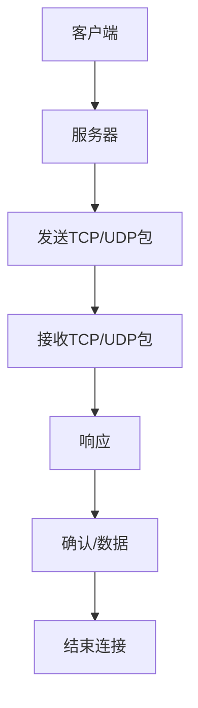

##### 4.2 网络协议

网络协议是计算机网络中进行数据交换的规则和标准。以下是一个网络协议面试题：

**面试题**：请解释HTTP和HTTPS协议的基本原理及区别。

**解答**：

- **HTTP协议**：

  - **基本原理**：HTTP（超文本传输协议）是一种应用层协议，用于在Web浏览器和服务器之间传输数据。HTTP是无状态的协议，每次请求都是独立的。

  - **适用场景**：HTTP适用于普通的Web应用，如网页浏览、邮件服务。

- **HTTPS协议**：

  - **基本原理**：HTTPS（安全超文本传输协议）是HTTP的安全版，通过SSL/TLS加密传输数据，确保数据的机密性、完整性和身份验证。

  - **适用场景**：HTTPS适用于对安全性要求较高的应用，如电子商务、在线银行。

以下是一个HTTP和HTTPS协议的流程图：

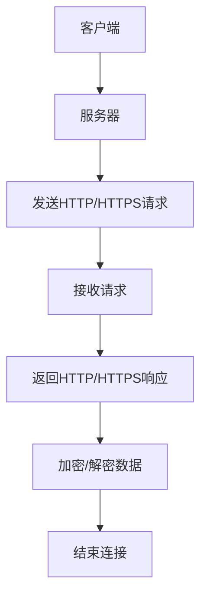

##### 4.3 操作系统原理

操作系统是计算机系统的核心，负责管理和控制计算机硬件资源。以下是一个操作系统原理面试题：

**面试题**：请解释进程和线程的基本概念及其区别。

**解答**：

- **进程**：

  - **基本概念**：进程是计算机中正在运行的程序的实例，具有独立的地址空间、数据段和堆栈。进程是操作系统的基本调度单位。

  - **区别**：进程是资源分配的基本单位，线程是执行调度的基本单位。

- **线程**：

  - **基本概念**：线程是进程中的一条执行路径，共享进程的地址空间、数据段和堆栈。线程是操作系统调度的基本单位。

  - **区别**：线程是进程中的一个执行单元，进程是线程的容器。

以下是一个进程和线程的关系图：

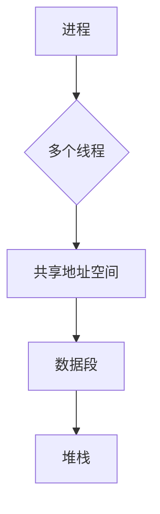

通过以上对计算机网络与操作系统相关领域的面试题解析，读者可以加深对这些核心概念和原理的理解，为接下来的面试做好准备。

### 第5章 数据库与存储

在金融科技领域，数据库和存储系统是不可或缺的部分。它们负责存储和管理大量的数据，保障数据的安全性和高效性。以下将详细解析数据库与存储相关的面试真题，包括关系型数据库、非关系型数据库和分布式存储系统。

#### 5.1 关系型数据库

关系型数据库（RDBMS）是金融科技领域广泛使用的数据库类型，其理论基础是关系模型。以下是一个关系型数据库的面试题：

**面试题**：请解释SQL（结构化查询语言）的基本操作及其应用场景。

**解答**：

- **基本操作**：

  - **查询（SELECT）**：用于从数据库表中检索数据。

  - **插入（INSERT）**：用于向数据库表中插入新的数据记录。

  - **更新（UPDATE）**：用于修改数据库表中的数据记录。

  - **删除（DELETE）**：用于删除数据库表中的数据记录。

- **应用场景**：

  - **数据检索**：用于查询数据库中特定的数据，如客户信息、交易记录等。

  - **数据更新**：用于更新数据库中的数据，如修改客户地址、更新订单状态等。

  - **数据删除**：用于删除不再需要的数据，如过期交易记录、废弃客户信息等。

以下是一个SQL查询的伪代码：

```sql
SELECT * FROM customers WHERE country = 'China';
```

该查询语句将检索所有来自中国的客户信息。

#### 5.2 非关系型数据库

非关系型数据库（NoSQL）是近年来兴起的一种数据库类型，它提供了一种不同于传统关系型数据库的存储方式。以下是一个非关系型数据库的面试题：

**面试题**：请解释MongoDB的基本原理及其与关系型数据库的区别。

**解答**：

- **基本原理**：

  - **文档存储**：MongoDB使用文档模型存储数据，每个文档都是一组键值对，类似于JSON对象。

  - **灵活的查询**：MongoDB提供强大的查询功能，支持各种复杂的查询操作。

  - **横向扩展**：MongoDB支持水平扩展，能够轻松处理大量数据和高并发访问。

- **与关系型数据库的区别**：

  - **数据模型**：关系型数据库使用表格存储数据，每个表格有固定的列。非关系型数据库使用文档存储数据，每个文档结构可以不同。

  - **查询能力**：关系型数据库提供强大的SQL查询功能，非关系型数据库提供更灵活的查询能力，但通常不支持复杂的关系查询。

以下是一个MongoDB文档的示例：

```json
{
  "_id": ObjectId("5f8e7d2f8b5"),
  "name": "John Doe",
  "age": 30,
  "address": {
    "street": "123 Main St",
    "city": "New York",
    "state": "NY"
  },
  " hobbies": ["reading", "gaming", "traveling"]
}
```

#### 5.3 分布式存储系统

分布式存储系统是金融科技领域应对大数据存储和访问需求的重要技术。以下是一个分布式存储系统的面试题：

**面试题**：请解释HDFS（Hadoop分布式文件系统）的基本原理及其应用场景。

**解答**：

- **基本原理**：

  - **分布式文件系统**：HDFS是一个分布式文件系统，它将大文件分割成小块存储在多个节点上。

  - **数据复制**：HDFS通过数据复制确保数据的冗余和可靠性，每个数据块至少存储三个副本。

  - **高可用性**：HDFS具有良好的高可用性，当某个节点故障时，其他节点可以接管其工作。

- **应用场景**：

  - **大数据处理**：HDFS适用于处理大量数据，如日志文件、基因组数据等。

  - **分布式计算**：HDFS与Hadoop生态系统中的其他组件（如MapReduce、Spark）紧密集成，支持大规模数据处理。

以下是一个HDFS的架构图：

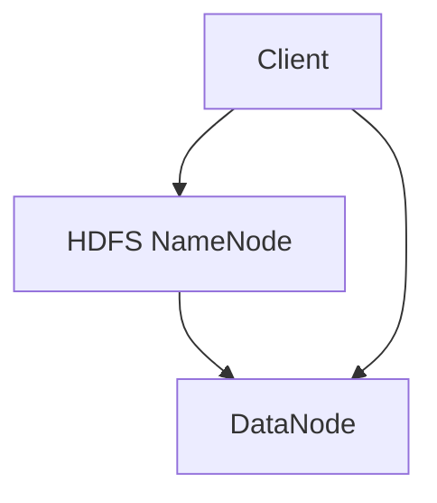

通过以上对数据库与存储领域的面试题解析，读者可以更好地理解关系型数据库、非关系型数据库和分布式存储系统的基本原理和应用场景，为面试做好准备。

### 第6章 大数据与云计算

大数据和云计算是现代金融科技领域的核心技术，它们为蚂蚁集团这样的公司提供了强大的数据处理能力和灵活的IT基础设施。以下将详细解析大数据与云计算相关的面试真题，包括大数据技术、云计算基础和容器化与微服务。

#### 6.1 大数据技术

大数据技术是处理海量数据的核心，以下是一个大数据技术的面试题：

**面试题**：请解释Hadoop的基本原理及其组成部分。

**解答**：

- **基本原理**：

  - **分布式计算**：Hadoop是一种分布式计算框架，它将大数据分割成小块，分布在多个节点上进行处理。

  - **数据存储**：Hadoop使用HDFS（Hadoop分布式文件系统）存储数据，确保数据的冗余和可靠性。

- **组成部分**：

  - **Hadoop分布式文件系统（HDFS）**：用于存储大数据，支持高吞吐量的数据访问。

  - **Hadoop YARN**：资源调度框架，负责管理和调度计算资源。

  - **Hadoop MapReduce**：数据处理框架，用于处理大规模数据集。

以下是一个Hadoop的基本架构图：

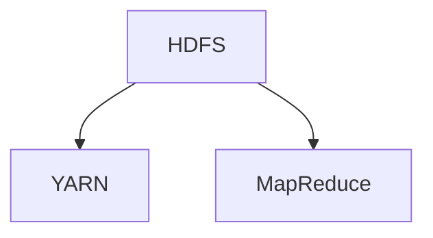

#### 6.2 云计算基础

云计算提供了灵活的IT基础设施和强大的计算能力，以下是一个云计算基础的面试题：

**面试题**：请解释AWS（亚马逊云计算服务）的基本概念及其应用场景。

**解答**：

- **基本概念**：

  - **基础设施即服务（IaaS）**：提供虚拟化的计算资源，如虚拟机、存储和网络等。

  - **平台即服务（PaaS）**：提供开发平台和中间件，简化应用开发和部署。

  - **软件即服务（SaaS）**：提供在线应用程序，如办公软件、客户关系管理软件等。

- **应用场景**：

  - **大数据处理**：云计算提供了强大的计算和存储资源，适用于大规模数据处理和分析。

  - **网站托管**：云计算提供了弹性伸缩的服务，适用于网站托管和负载均衡。

  - **企业应用**：云计算为企业提供了灵活的计算和存储资源，降低IT成本。

以下是一个AWS的基本架构图：

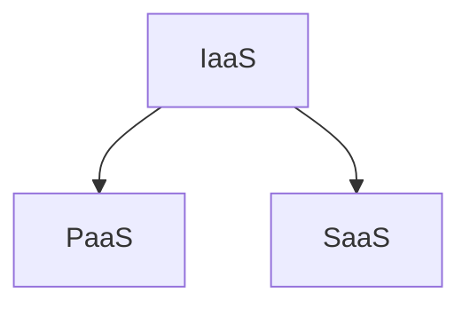

#### 6.3 容器化与微服务

容器化和微服务是现代软件开发的趋势，以下是一个容器化和微服务的面试题：

**面试题**：请解释Docker的基本原理及其与虚拟机的区别。

**解答**：

- **基本原理**：

  - **容器化**：Docker是一种容器化技术，将应用程序及其依赖环境打包到一个轻量级的容器中。

  - **虚拟化**：虚拟机（VM）通过虚拟化硬件资源，创建多个独立的虚拟环境。

- **与虚拟机的区别**：

  - **资源占用**：容器化比虚拟机更轻量，容器共享宿主机的操作系统内核，而虚拟机需要独立的操作系统。

  - **启动速度**：容器化启动速度更快，虚拟机需要启动整个操作系统，而容器仅需启动应用程序。

以下是一个Docker和虚拟机的对比图：

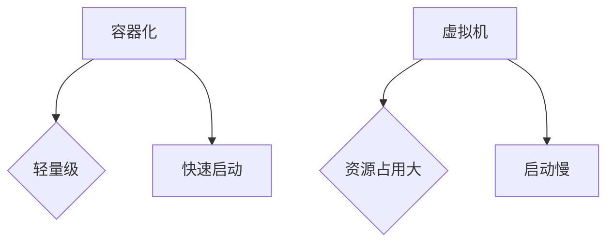

通过以上对大数据与云计算领域的面试题解析，读者可以更好地理解大数据技术、云计算基础和容器化与微服务的基本原理和应用场景，为面试做好准备。

### 第7章 安全与加密

在金融科技领域，安全与加密是确保数据安全和系统可靠性的关键。以下将详细解析安全与加密相关的面试真题，包括信息安全基础、加密算法和安全协议与安全防护。

#### 7.1 信息安全基础

信息安全是保护信息系统和数据免受恶意攻击和未授权访问的重要领域。以下是一个信息安全基础的面试题：

**面试题**：请解释什么是DDoS攻击，以及如何防御这种攻击。

**解答**：

- **基本原理**：

  - **DDoS攻击**：分布式拒绝服务攻击（DDoS）是一种恶意攻击，攻击者通过控制多个僵尸主机向目标服务器发送大量请求，导致服务器过载，无法正常服务。

- **防御方法**：

  - **流量分析**：通过分析流量模式，识别异常流量，阻止恶意流量。

  - **防火墙**：部署防火墙，过滤掉非法请求，阻止恶意攻击。

  - **负载均衡**：通过负载均衡器分发请求，减轻单个服务器的压力。

以下是一个DDoS攻击防御的示意图：

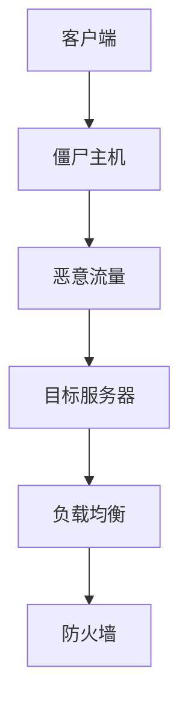

#### 7.2 加密算法

加密算法是确保数据传输和存储安全的重要技术。以下是一个加密算法的面试题：

**面试题**：请解释RSA加密算法的基本原理及其应用场景。

**解答**：

- **基本原理**：

  - **RSA算法**：RSA是一种非对称加密算法，它使用两个密钥：公钥和私钥。公钥用于加密，私钥用于解密。

- **应用场景**：

  - **数据传输**：RSA加密算法常用于确保数据在传输过程中的安全性，如SSL/TLS协议。

  - **数字签名**：RSA加密算法可用于生成数字签名，确保数据的完整性和身份验证。

以下是一个RSA加密算法的流程图：

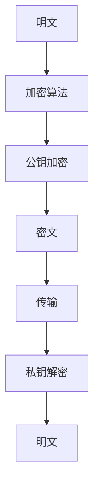

#### 7.3 安全协议与安全防护

安全协议和安全防护是确保信息系统安全的关键。以下是一个安全协议与安全防护的面试题：

**面试题**：请解释HTTPS协议的工作原理及其在网络安全中的作用。

**解答**：

- **基本原理**：

  - **HTTPS协议**：HTTPS（安全超文本传输协议）是HTTP的安全版，它通过SSL/TLS加密传输数据，确保数据的机密性和完整性。

- **作用**：

  - **数据加密**：HTTPS使用SSL/TLS协议加密传输数据，防止数据在传输过程中被窃听或篡改。

  - **身份验证**：HTTPS通过数字证书验证服务器身份，确保客户端与合法服务器通信。

以下是一个HTTPS协议的流程图：

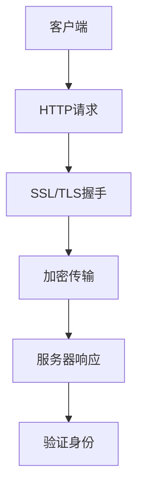

通过以上对安全与加密领域的面试题解析，读者可以更好地理解信息安全基础、加密算法和安全协议与安全防护的基本原理和应用场景，为面试做好准备。

### 第三部分 行为面试题解

行为面试是评估应聘者个人素质和职业素养的重要环节。蚂蚁集团社招面试中的行为面试题主要围绕团队协作、沟通能力和领导力展开。以下将详细解析这些领域的面试题，提供解答和应对策略，帮助读者提升面试表现。

#### 第8章 团队协作与沟通

在金融科技领域，团队协作和有效沟通是确保项目成功的关键。以下是一个团队协作与沟通的面试题：

**面试题**：请举例说明你在团队中如何处理冲突和达成共识。

**解答**：

1. **冷静分析**：遇到冲突时，首先要保持冷静，分析冲突的原因和影响。

2. **积极沟通**：与团队成员进行积极沟通，了解他们的观点和立场。

3. **寻求共识**：通过讨论和妥协，寻找一个双方都能接受的解决方案。

4. **记录和跟进**：将达成的共识记录下来，并跟进执行情况，确保冲突得到有效解决。

以下是一个团队协作与沟通的流程图：

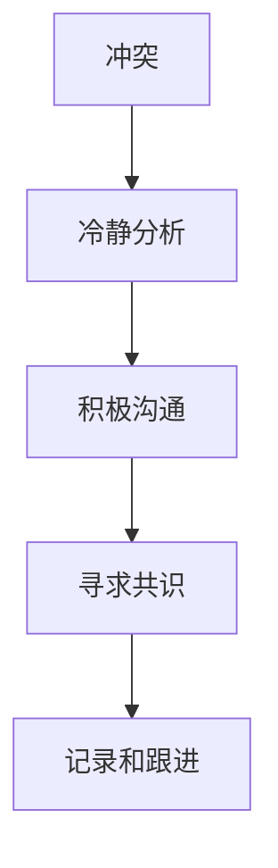

#### 第9章 领导力与职业规划

领导力和职业规划是评估应聘者未来发展潜力和适应能力的重要指标。以下是一个领导力与职业规划的面试题：

**面试题**：请谈谈你的领导风格，以及你在职业生涯中设定的目标和实现的策略。

**解答**：

1. **领导风格**：

   - **民主型领导**：鼓励团队成员参与决策，增强团队凝聚力。

   - **教练型领导**：关注团队成员的成长，提供指导和支持。

   - **权威型领导**：明确目标，严格管理，确保任务完成。

2. **职业规划**：

   - **短期目标**：如提升特定技能、完成项目等。

   - **长期目标**：如晋升为团队领导、进入管理层等。

   - **实现策略**：如参加培训、主动承担更多责任、建立良好人际关系等。

以下是一个领导风格与职业规划的示例图：

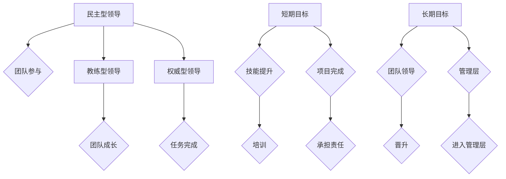

通过以上对团队协作与沟通、领导力与职业规划领域的面试题解析，读者可以更好地准备行为面试，展现自己的个人素质和职业素养，提升面试成功率。

### 第四部分 面试技巧与策略

面试技巧和策略是成功通过蚂蚁集团面试的关键因素。在这一部分，我们将详细介绍面试策略、面试官应对技巧以及面试结束后的跟进策略，帮助读者全面提升面试表现。

#### 第10章 面试策略与技巧

1. **充分准备**：

   - **研究公司背景**：了解蚂蚁集团的历史、业务范围、技术方向和文化价值观，以便在面试中展示对公司的高度重视。

   - **熟悉面试流程**：了解面试的具体流程和形式，提前准备好可能出现的问题，如自我介绍、技术问题等。

   - **复习知识点**：系统复习相关领域的知识点，确保对面试题有充分的理解和准备。

2. **展现自我**：

   - **积极心态**：保持积极向上的心态，面对面试官的问题时，保持自信和冷静。

   - **真实回答**：回答问题时，尽量做到真实、具体和有条理，避免夸大或模糊其辞。

   - **突出优势**：在回答问题时，适当突出自己的技术能力、项目经验和职业素养。

3. **互动交流**：

   - **倾听与回应**：认真倾听面试官的问题，理解问题的核心，然后做出有针对性的回答。

   - **提问技巧**：适当提出问题，展示自己的好奇心和学习意愿，如询问项目细节、团队结构等。

   - **交流技巧**：保持眼神交流，使用开放性问题引导面试官，创造良好的交流氛围。

#### 第11章 面试官应对

1. **问题理解**：

   - **仔细阅读问题**：在回答面试官的问题之前，仔细阅读并理解问题的含义。

   - **确认问题**：如有疑问，可以请面试官重新阐述问题，确保自己理解准确。

2. **问题回答**：

   - **逻辑清晰**：回答问题时，尽量做到条理清晰，先介绍核心观点，再逐步展开。

   - **适当举例**：通过具体例子来支持自己的观点，使回答更加具体和生动。

   - **避免含糊其辞**：尽量给出明确和具体的回答，避免使用模糊的词汇和含糊其辞。

3. **应对压力**：

   - **冷静应对**：面对面试官的挑战性问题，保持冷静，深入思考后再作答。

   - **积极态度**：即使遇到困难问题，也要保持积极的态度，展示自己的学习能力和解决问题的能力。

#### 第12章 面试结束后的跟进

1. **感谢信**：

   - **及时发送**：在面试结束后的一到两天内，发送一封感谢信，表达对面试机会的感激之情。

   - **个性化内容**：在感谢信中，适当提及面试过程中的某些细节，展示自己的关注和用心。

2. **跟进邮件**：

   - **询问结果**：在面试结束后的一周左右，可以发送一封邮件询问面试结果，表示自己对岗位的渴望。

   - **保持礼貌**：在询问结果时，保持礼貌和耐心，避免显得过于迫切。

通过以上面试技巧和策略的详细介绍，读者可以更好地应对面试挑战，提高面试成功率。

### 第五部分 附录

#### 第12章 蚂蚁集团面试真题汇总

在本章节中，我们将对蚂蚁集团历年社招面试中出现的高频真题进行汇总，并提供详细的解析和答案。以下是一些典型的面试真题：

1. **C/C++基础题**：
   - 面试题：请解释C++中的析构函数和构造函数的区别和作用。

2. **数据结构与算法**：
   - 面试题：实现一个二叉搜索树，包括插入、删除和查找功能。

3. **计算机网络**：
   - 面试题：解释TCP和UDP协议的区别及其适用场景。

4. **操作系统**：
   - 面试题：请描述进程和线程的基本概念及其区别。

5. **数据库**：
   - 面试题：解释关系型数据库和非关系型数据库的区别。

6. **大数据与云计算**：
   - 面试题：请解释Hadoop的基本原理及其组成部分。

7. **安全与加密**：
   - 面试题：解释RSA加密算法的基本原理及其应用场景。

8. **行为面试题**：
   - 面试题：请谈谈你在团队中如何处理冲突和达成共识。

通过这些真题的汇总和详细解析，读者可以更好地准备蚂蚁集团的面试，掌握面试的核心考点和应对策略。

### 总结

通过本文的详细解析，读者应该对蚂蚁集团社招面试的技术面试和行为面试有了全面的认识。从编程语言与数据结构、计算机网络与操作系统、数据库与存储、大数据与云计算、安全与加密等领域，我们逐一分析了面试真题，提供了详细的解答和应对策略。同时，我们还介绍了面试技巧与策略，帮助读者全面提升面试表现。

在准备面试的过程中，务必重视以下几个方面：

1. **基础知识**：扎实掌握相关领域的核心概念和原理，这是面试成功的基础。
2. **实战经验**：通过实际项目经验，提升解决问题的能力，展示自己的技术实力。
3. **模拟面试**：进行充分的模拟面试，提高应对真实面试的能力和信心。
4. **积极心态**：保持积极向上的心态，面对面试官的问题时，保持自信和冷静。
5. **持续学习**：面试只是职业生涯的一个起点，持续学习和成长是不断提升自己的关键。

希望本文能够为读者在蚂蚁集团社招面试中取得成功提供有价值的帮助。祝大家在面试中发挥出色，实现职业梦想！

### 作者信息

作者：AI天才研究院/AI Genius Institute & 禅与计算机程序设计艺术 /Zen And The Art of Computer Programming

感谢读者对本文的阅读，希望本文能够为您在蚂蚁集团社招面试中提供有益的参考和指导。如需进一步了解相关面试题目和解答，请关注作者的其他相关著作和资源。祝您面试成功，前程似锦！

## 附录

### 附录1：常见面试题解析

在本附录中，我们将对蚂蚁集团社招面试中出现的一些典型面试题进行解析，包括C/C++基础题、数据结构与算法题、计算机网络与操作系统题、数据库与存储题、大数据与云计算题、安全与加密题，以及行为面试题。

#### 附录1.1 C/C++基础题

1. **面试题**：请解释C++中的析构函数和构造函数的区别和作用。

   **解析**：
   - **构造函数**：构造函数是类的一个特殊成员函数，用于创建一个对象时执行初始化操作。构造函数的名字与类名相同，没有返回值类型。
   - **析构函数**：析构函数也是类的一个特殊成员函数，用于在销毁对象时执行清理操作。析构函数的名字是类名前加一个波浪号（~）。析构函数没有返回值类型。

   **代码示例**：

   ```cpp
   class MyClass {
   public:
       MyClass() {
           // 构造函数
           cout << "构造函数被调用" << endl;
       }

       ~MyClass() {
           // 析构函数
           cout << "析构函数被调用" << endl;
       }
   };

   int main() {
       MyClass obj;
       return 0;
   }
   ```

2. **面试题**：请解释C++中的指针和引用的区别。

   **解析**：
   - **指针**：指针是一个变量，用于存储另一个变量的内存地址。指针通过解引用运算符（*）访问它所指向的内存地址。
   - **引用**：引用是另一个变量的别名，一旦引用被声明，它就与目标变量绑定，不能再绑定其他变量。

   **代码示例**：

   ```cpp
   int x = 10;
   int* ptr = &x; // 指针
   cout << *ptr << endl; // 输出10

   int& ref = x; // 引用
   cout << ref << endl; // 输出10
   ```

#### 附录1.2 数据结构与算法题

1. **面试题**：实现一个堆排序算法。

   **解析**：
   - **堆排序**：堆排序是一种选择排序算法，它利用堆这种数据结构进行排序。

   **代码示例**：

   ```cpp
   #include <iostream>
   #include <vector>

   using namespace std;

   void heapify(vector<int>& arr, int n, int i) {
       int largest = i;
       int left = 2 * i + 1;
       int right = 2 * i + 2;

       if (left < n && arr[left] > arr[largest])
           largest = left;

       if (right < n && arr[right] > arr[largest])
           largest = right;

       if (largest != i) {
           swap(arr[i], arr[largest]);
           heapify(arr, n, largest);
       }
   }

   void heapSort(vector<int>& arr) {
       int n = arr.size();

       for (int i = n / 2 - 1; i >= 0; i--)
           heapify(arr, n, i);

       for (int i = n - 1; i >= 0; i--) {
           swap(arr[0], arr[i]);
           heapify(arr, i, 0);
       }
   }

   int main() {
       vector<int> arr = {12, 11, 13, 5, 6, 7};
       heapSort(arr);

       cout << "排序后的数组：";
       for (int i : arr)
           cout << i << " ";
       cout << endl;

       return 0;
   }
   ```

2. **面试题**：实现一个二叉搜索树，包括插入、删除和查找功能。

   **解析**：
   - **二叉搜索树**：二叉搜索树是一种特殊的二叉树，其中每个节点的左子树只包含小于当前节点的值，右子树只包含大于当前节点的值。

   **代码示例**：

   ```cpp
   #include <iostream>
   #include <unordered_map>

   using namespace std;

   struct TreeNode {
       int val;
       TreeNode *left, *right;
       TreeNode(int x) : val(x), left(NULL), right(NULL) {}
   };

   class BST {
   public:
       TreeNode* root;

       BST() : root(NULL) {}

       void insert(int val) {
           root = insert(root, val);
       }

       void remove(int val) {
           root = remove(root, val);
       }

       bool search(int val) {
           return search(root, val);
       }

   private:
       TreeNode* insert(TreeNode* node, int val) {
           if (node == NULL)
               return new TreeNode(val);

           if (val < node->val)
               node->left = insert(node->left, val);
           else if (val > node->val)
               node->right = insert(node->right, val);

           return node;
       }

       TreeNode* remove(TreeNode* node, int val) {
           if (node == NULL)
               return NULL;

           if (val < node->val)
               node->left = remove(node->left, val);
           else if (val > node->val)
               node->right = remove(node->right, val);
           else {
               if (node->left == NULL)
                   return node->right;
               else if (node->right == NULL)
                   return node->left;

               node->val = minValue(node->right);
               node->right = remove(node->right, node->val);
           }

           return node;
       }

       int minValue(TreeNode* node) {
           int minv = node->val;
           while (node->left != NULL) {
               minv = node->left->val;
               node = node->left;
           }
           return minv;
       }

       bool search(TreeNode* node, int val) {
           if (node == NULL)
               return false;

           if (val == node->val)
               return true;
           else if (val < node->val)
               return search(node->left, val);
           else
               return search(node->right, val);
       }
   };

   int main() {
       BST bst;
       bst.insert(50);
       bst.insert(30);
       bst.insert(20);
       bst.insert(40);
       bst.insert(70);
       bst.insert(60);
       bst.insert(80);

       cout << "查找20：" << (bst.search(20) ? "存在" : "不存在") << endl;
       cout << "查找90：" << (bst.search(90) ? "存在" : "不存在") << endl;

       bst.remove(20);
       cout << "删除20后查找20：" << (bst.search(20) ? "存在" : "不存在") << endl;

       return 0;
   }
   ```

#### 附录1.3 计算机网络与操作系统题

1. **面试题**：解释TCP和UDP协议的区别及其适用场景。

   **解析**：
   - **TCP（传输控制协议）**：TCP是一种面向连接的、可靠的传输层协议，它提供流量控制、拥塞控制和错误检测等功能，确保数据包的顺序到达。适用于对数据完整性和传输顺序要求较高的应用，如Web浏览、电子邮件和文件传输。
   - **UDP（用户数据报协议）**：UDP是一种无连接的、不可靠的传输层协议，它不需要建立连接，数据包以独立的方式发送，没有流量控制和拥塞控制。适用于对实时性和传输速度要求较高的应用，如视频流、音频流和在线游戏。

2. **面试题**：请解释操作系统的进程和线程。

   **解析**：
   - **进程**：进程是计算机中正在运行的程序的实例，具有独立的地址空间、数据段和堆栈。进程是操作系统的基本调度单位，用于资源分配和执行。
   - **线程**：线程是进程中的一条执行路径，共享进程的地址空间、数据段和堆栈。线程是操作系统调度的基本单位，用于并发执行。

#### 附录1.4 数据库与存储题

1. **面试题**：解释关系型数据库和非关系型数据库的区别。

   **解析**：
   - **关系型数据库**：关系型数据库使用表格存储数据，每个表格有固定的列。关系型数据库使用SQL语言进行数据操作，提供强大的查询功能。适用于结构化数据和高性能查询。
   - **非关系型数据库**：非关系型数据库使用文档、键值对、图等方式存储数据，数据结构更加灵活。非关系型数据库通常提供更高的扩展性和灵活性，适用于大数据和实时处理。

2. **面试题**：解释Hadoop的基本原理及其组成部分。

   **解析**：
   - **Hadoop**：Hadoop是一种分布式计算框架，用于处理大规模数据集。Hadoop的基本原理是分布式存储和分布式计算。
   - **组成部分**：
     - **Hadoop分布式文件系统（HDFS）**：用于存储大数据，支持高吞吐量的数据访问。
     - **Hadoop YARN**：资源调度框架，负责管理和调度计算资源。
     - **Hadoop MapReduce**：数据处理框架，用于处理大规模数据集。

#### 附录1.5 大数据与云计算题

1. **面试题**：解释云计算的基础概念及其应用场景。

   **解析**：
   - **云计算**：云计算是一种通过网络提供计算资源、存储资源、网络资源和应用程序等服务的技术。
   - **基础概念**：
     - **基础设施即服务（IaaS）**：提供虚拟化的计算资源，如虚拟机、存储和网络等。
     - **平台即服务（PaaS）**：提供开发平台和中间件，简化应用开发和部署。
     - **软件即服务（SaaS）**：提供在线应用程序，如办公软件、客户关系管理软件等。
   - **应用场景**：
     - **大数据处理**：云计算提供了强大的计算和存储资源，适用于大规模数据处理和分析。
     - **网站托管**：云计算提供了弹性伸缩的服务，适用于网站托管和负载均衡。
     - **企业应用**：云计算为企业提供了灵活的计算和存储资源，降低IT成本。

#### 附录1.6 安全与加密题

1. **面试题**：解释RSA加密算法的基本原理及其应用场景。

   **解析**：
   - **RSA加密算法**：RSA是一种非对称加密算法，它使用两个密钥：公钥和私钥。公钥用于加密，私钥用于解密。
   - **基本原理**：RSA加密算法基于大整数分解的困难性。
   - **应用场景**：
     - **数据传输**：RSA加密算法常用于确保数据在传输过程中的安全性，如SSL/TLS协议。
     - **数字签名**：RSA加密算法可用于生成数字签名，确保数据的完整性和身份验证。

2. **面试题**：解释HTTPS协议的工作原理及其在网络安全中的作用。

   **解析**：
   - **HTTPS协议**：HTTPS（安全超文本传输协议）是HTTP的安全版，它通过SSL/TLS加密传输数据，确保数据的机密性和完整性。
   - **工作原理**：HTTPS使用SSL/TLS协议进行加密，客户端和服务器通过握手协议建立安全的连接。
   - **在网络安全中的作用**：
     - **数据加密**：HTTPS使用SSL/TLS协议加密传输数据，防止数据在传输过程中被窃听或篡改。
     - **身份验证**：HTTPS通过数字证书验证服务器身份，确保客户端与合法服务器通信。

#### 附录1.7 行为面试题

1. **面试题**：请谈谈你在团队中如何处理冲突和达成共识。

   **解析**：
   - **冷静分析**：遇到冲突时，首先要保持冷静，分析冲突的原因和影响。
   - **积极沟通**：与团队成员进行积极沟通，了解他们的观点和立场。
   - **寻求共识**：通过讨论和妥协，寻找一个双方都能接受的解决方案。
   - **记录和跟进**：将达成的共识记录下来，并跟进执行情况，确保冲突得到有效解决。

2. **面试题**：请谈谈你的领导风格，以及你在职业生涯中设定的目标和实现的策略。

   **解析**：
   - **领导风格**：
     - **民主型领导**：鼓励团队成员参与决策，增强团队凝聚力。
     - **教练型领导**：关注团队成员的成长，提供指导和支持。
     - **权威型领导**：明确目标，严格管理，确保任务完成。
   - **职业规划**：
     - **短期目标**：如提升特定技能、完成项目等。
     - **长期目标**：如晋升为团队领导、进入管理层等。
     - **实现策略**：如参加培训、主动承担更多责任、建立良好人际关系等。

通过这些附录内容的详细解析，读者可以更好地准备蚂蚁集团社招面试，掌握面试的核心考点和应对策略。希望这些内容能够对读者有所帮助。祝您面试成功，前程似锦！

