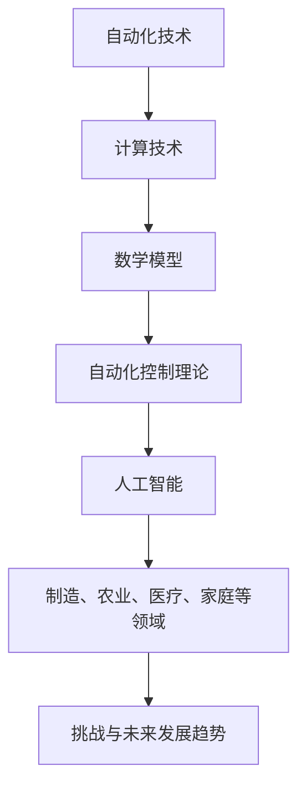

                 

# 《计算变化带来的自动化挑战》

## 关键词

计算技术、自动化、数学模型、人工智能、控制理论、制造业、农业、医疗、家庭自动化

## 摘要

本文将探讨计算技术在自动化领域中的变革及其带来的挑战。通过详细分析自动化技术的理论基础、数学模型、人工智能应用以及在不同领域的应用案例，本文旨在揭示自动化技术的核心原理、发展动态和未来趋势，并探讨其对社会的影响与挑战。

## 目录大纲

### 《计算变化带来的自动化挑战》

#### 关键词：计算技术、自动化、数学模型、人工智能、控制理论、制造业、农业、医疗、家庭自动化

#### 摘要：本文将探讨计算技术在自动化领域中的变革及其带来的挑战。

### 目录大纲

#### 第一部分：自动化技术的理论基础

##### 第1章：自动化技术的概念与历史发展
###### 1.1 自动化的定义与类型
###### 1.2 自动化技术的发展历程
###### 1.3 自动化技术的重要趋势

##### 第2章：计算技术的基础知识
###### 2.1 计算机的组成与工作原理
###### 2.2 编程语言与算法
###### 2.3 数据结构与算法分析

##### 第3章：自动化技术的数学模型
###### 3.1 数学模型的基本概念
###### 3.2 线性代数基础
###### 3.3 微积分基础

##### 第4章：自动化控制理论
###### 4.1 自动控制系统的基本原理
###### 4.2 控制系统的设计方法
###### 4.3 控制系统的分析与应用

##### 第5章：人工智能在自动化中的应用
###### 5.1 人工智能的基本概念与发展历程
###### 5.2 机器学习算法基础
###### 5.3 深度学习在自动化中的应用

##### 第6章：自动化技术的应用领域
###### 6.1 制造业的自动化
###### 6.2 农业自动化
###### 6.3 医疗自动化
###### 6.4 家庭自动化

##### 第7章：自动化技术的挑战与未来发展
###### 7.1 自动化技术的挑战
###### 7.2 自动化技术的影响与未来趋势
###### 7.3 自动化技术的未来发展方向

#### 第二部分：自动化项目的实战与案例研究

##### 第8章：自动化项目的实施与流程
###### 8.1 自动化项目规划与需求分析
###### 8.2 自动化系统的设计与实现
###### 8.3 自动化系统的测试与优化

##### 第9章：自动化技术的典型案例分析
###### 9.1 智能制造案例分析
###### 9.2 农业自动化案例分析
###### 9.3 医疗自动化案例分析

##### 第10章：自动化技术的未来发展趋势与展望
###### 10.1 自动化技术的创新方向
###### 10.2 自动化技术的发展前景
###### 10.3 自动化技术对社会的影响与挑战

### 附录

#### 附录A：自动化技术相关资源
#### 附录B：自动化技术常用工具介绍
#### 附录C：自动化技术学习路线图
#### 附录D：自动化技术常见问题解答

## 附录一：核心概念与联系流程图



## 附录二：核心算法原理讲解伪代码

```python
# 伪代码：机器学习算法基础
def machine_learning_algorithm(data):
    # 数据预处理
    preprocess_data(data)
    
    # 初始化模型参数
    init_model_params()
    
    # 训练模型
    train_model(data, model_params)
    
    # 预测新数据
    predict_new_data(new_data, model_params)
    
    return model_params
```

## 附录三：数学模型和数学公式讲解

$$
\text{目标函数} = \frac{1}{2} \sum_{i=1}^{n} (\text{预测值} - \text{真实值})^2
$$

## 附录四：项目实战

### 9.1.1 智能制造项目实战

**项目简介：** 本案例将介绍一个基于人工智能的智能制造项目，实现自动化生产线的智能监控与管理。

**开发环境搭建：** 使用 Python 和 TensorFlow 开发环境。

**源代码详细实现：**

```python
# 导入相关库
import tensorflow as tf
import numpy as np

# 定义模型
model = tf.keras.Sequential([
    tf.keras.layers.Dense(128, activation='relu', input_shape=(784,)),
    tf.keras.layers.Dropout(0.2),
    tf.keras.layers.Dense(10, activation='softmax')
])

# 编译模型
model.compile(optimizer='adam',
              loss='categorical_crossentropy',
              metrics=['accuracy'])

# 加载数据
(x_train, y_train), (x_test, y_test) = tf.keras.datasets.mnist.load_data()

# 预处理数据
x_train = x_train.astype(np.float32) / 255
x_test = x_test.astype(np.float32) / 255

# 转换标签为one-hot编码
y_train = tf.keras.utils.to_categorical(y_train, 10)
y_test = tf.keras.utils.to_categorical(y_test, 10)

# 训练模型
model.fit(x_train, y_train, batch_size=64, epochs=10, validation_data=(x_test, y_test))

# 评估模型
test_loss, test_acc = model.evaluate(x_test, y_test, verbose=2)
print(f'测试准确率: {test_acc:.3f}')
```

**代码解读与分析：**

- **数据预处理：** 将图像数据转换为浮点数格式，并除以255进行归一化处理。
- **模型定义：** 使用 TensorFlow 的 Sequential 模型，定义了一个包含128个神经元和Dropout层的前向神经网络。
- **编译模型：** 设置优化器为 Adam，损失函数为 categorical_crossentropy，并指定了评估指标为准确率。
- **加载与预处理数据：** 加载 MNIST 数据集，并进行必要的预处理。
- **训练模型：** 使用 fit 函数训练模型，并指定了批量大小、训练轮次以及验证数据。
- **评估模型：** 使用 evaluate 函数评估模型在测试数据集上的性能。

## 文章标题：《计算变化带来的自动化挑战》

### 关键词

计算技术、自动化、数学模型、人工智能、控制理论、制造业、农业、医疗、家庭自动化

### 摘要

本文将深入探讨计算技术在自动化领域的变革，分析自动化技术的理论基础、数学模型、人工智能应用以及在不同领域的应用案例。通过详细解读自动化技术的核心原理、发展动态和未来趋势，本文旨在揭示自动化技术对社会的影响与挑战，为读者提供全面的技术解读与思考。

---

### 第一部分：自动化技术的理论基础

#### 第1章：自动化技术的概念与历史发展

##### 1.1 自动化的定义与类型

自动化是指通过计算机技术、控制理论、人工智能等手段，使机械设备或系统能够在无需人工干预的情况下，自动完成特定任务的整个过程。自动化技术主要包括以下几个方面：

1. **工业自动化**：在工业生产过程中，通过自动化设备实现生产线的自动化生产，提高生产效率、降低成本。
2. **农业自动化**：利用传感器、无人机、机器人等技术，实现农业生产的自动化，提高作物产量和质量。
3. **医疗自动化**：应用机器人、智能诊断系统等技术，实现医疗服务的自动化，提高医疗水平和服务质量。
4. **家庭自动化**：通过智能家居设备，实现家庭设备的自动化控制，提高生活便利性和舒适度。

##### 1.2 自动化技术的发展历程

自动化技术的发展可以追溯到20世纪初期，当时以蒸汽机为核心的工业革命推动了机械化生产的兴起。随着计算机技术和信息技术的发展，自动化技术逐渐成熟并得到广泛应用。以下是自动化技术发展的重要阶段：

1. **机械自动化**：20世纪初期，机械自动化技术的出现，标志着自动化技术的初步发展。以流水线生产为代表的工业生产自动化开始出现。
2. **电子自动化**：20世纪50年代，随着电子技术的不断发展，自动化技术开始引入电子元件，实现了更高程度的自动化。
3. **计算机自动化**：20世纪70年代，计算机技术的发展推动了自动化技术的飞跃。计算机技术的应用使得自动化系统能够实现更加复杂和智能化的操作。
4. **人工智能自动化**：20世纪80年代以来，人工智能技术的兴起为自动化技术带来了新的发展机遇。通过引入人工智能技术，自动化系统具备了更高的智能水平和自学习能力。

##### 1.3 自动化技术的重要趋势

随着科技的不断进步，自动化技术呈现出以下重要趋势：

1. **智能化**：自动化技术正从传统的机械自动化向智能化方向发展。通过引入人工智能技术，自动化系统能够实现自主决策、自适应和自优化，提高系统的智能水平和运行效率。
2. **网络化**：自动化技术正从单一设备或系统的自动化向网络化、协同化方向发展。通过构建自动化网络，实现设备之间的信息共享和协同工作，提高整体系统的自动化水平和效能。
3. **融合化**：自动化技术与其他领域技术的融合，如物联网、大数据、云计算等，为自动化技术的发展带来了新的机遇。通过融合不同技术，实现自动化技术的创新应用和升级。
4. **绿色化**：随着环保意识的增强，自动化技术正朝着绿色化、可持续化的方向发展。通过采用节能、环保的技术和设备，实现生产、生活等领域的自动化，降低能源消耗和环境污染。

#### 第2章：计算技术的基础知识

##### 2.1 计算机的组成与工作原理

计算机是一种能够自动执行程序指令、处理数据并产生结果的电子设备。计算机主要由以下几部分组成：

1. **中央处理器（CPU）**：计算机的核心部件，负责执行程序指令和处理数据。
2. **内存（Memory）**：用于存储程序指令和数据，提供快速访问。
3. **存储器（Storage）**：用于长期存储数据和文件，包括硬盘、固态硬盘等。
4. **输入设备（Input Devices）**：如键盘、鼠标等，用于输入数据和指令。
5. **输出设备（Output Devices）**：如显示器、打印机等，用于输出数据和结果。

计算机的工作原理可以概括为以下几个步骤：

1. **输入**：通过输入设备将数据和指令输入到计算机中。
2. **处理**：计算机的中央处理器（CPU）根据程序指令对输入的数据进行处理。
3. **存储**：将处理结果存储到内存或存储器中。
4. **输出**：通过输出设备将处理结果输出给用户。

##### 2.2 编程语言与算法

编程语言是用于编写计算机程序的语言。不同的编程语言具有不同的语法和特点，适用于不同的应用场景。常见的编程语言包括：

1. **高级编程语言**：如 Python、Java、C++等，具有较高的可读性和易用性。
2. **低级编程语言**：如汇编语言，与计算机硬件具有更直接的关联。

算法是计算机程序的核心，用于描述解决问题的步骤和方法。算法可以分为以下几类：

1. **基础算法**：如排序算法、查找算法、图算法等，用于解决常见的问题。
2. **高级算法**：如机器学习算法、深度学习算法等，用于解决复杂的问题。
3. **优化算法**：用于提高算法的效率和性能。

##### 2.3 数据结构与算法分析

数据结构是用于存储和组织数据的方式。常见的数据结构包括：

1. **线性结构**：如数组、链表、栈、队列等。
2. **非线性结构**：如树、图等。

算法分析是评估算法性能的重要方法。常见的算法分析指标包括：

1. **时间复杂度**：描述算法执行的时间消耗，通常用大O符号表示。
2. **空间复杂度**：描述算法执行的空间消耗。

通过对算法的时间复杂度和空间复杂度进行分析，可以评估算法的效率和性能，为优化算法提供依据。

#### 第3章：自动化技术的数学模型

##### 3.1 数学模型的基本概念

数学模型是用于描述和模拟现实世界问题的数学结构和方法。在自动化技术中，数学模型用于描述系统的行为、状态和性能。常见的数学模型包括：

1. **微分方程模型**：用于描述连续系统的动态行为。
2. **差分方程模型**：用于描述离散系统的动态行为。
3. **概率模型**：用于描述随机事件的概率分布和统计特性。

##### 3.2 线性代数基础

线性代数是数学的一个分支，用于研究向量空间、线性变换和矩阵等概念。在自动化技术中，线性代数被广泛应用于控制系统、信号处理和机器学习等领域。主要概念包括：

1. **向量与矩阵**：用于表示和操作数据。
2. **线性变换**：用于描述系统的动态行为。
3. **矩阵运算**：如矩阵加法、矩阵乘法、逆矩阵等。

##### 3.3 微积分基础

微积分是数学的一个分支，用于研究函数的极限、导数、积分等概念。在自动化技术中，微积分被广泛应用于控制系统、信号处理和机器学习等领域。主要概念包括：

1. **极限**：用于描述函数的局部性质。
2. **导数**：用于描述函数的变化率。
3. **积分**：用于求解函数的面积和定积分。

#### 第4章：自动化控制理论

##### 4.1 自动控制系统的基本原理

自动控制系统是一种利用计算机技术、控制理论等手段，实现系统自动控制的技术。基本原理包括：

1. **传感器**：用于检测系统的状态和变化。
2. **控制器**：根据传感器获取的信息，生成控制信号。
3. **执行器**：根据控制信号调整系统的行为。

自动控制系统的目标是通过反馈控制，使系统的输出接近预期的目标值，保持系统的稳定性和鲁棒性。

##### 4.2 控制系统的设计方法

控制系统的设计方法主要包括：

1. **开环控制**：根据输入信号直接产生控制信号，不依赖于系统的输出。
2. **闭环控制**：根据系统的输出信号和输入信号，生成控制信号，实现系统的反馈控制。

闭环控制系统的设计方法主要包括：

1. **PID控制**：基于比例-积分-微分原理，生成控制信号。
2. **状态空间方法**：基于系统的状态方程，设计控制器。

##### 4.3 控制系统的分析与应用

控制系统的分析主要包括：

1. **稳定性分析**：判断系统是否稳定，防止系统出现不稳定现象。
2. **性能分析**：评估系统的性能指标，如稳态误差、动态响应等。

控制系统的应用领域包括：

1. **工业控制系统**：如生产线自动化、机器人控制等。
2. **交通运输控制系统**：如自动驾驶、轨道交通等。
3. **医疗控制系统**：如手术机器人、智能医疗器械等。
4. **家居控制系统**：如智能家居、智能安防等。

#### 第5章：人工智能在自动化中的应用

##### 5.1 人工智能的基本概念与发展历程

人工智能（AI）是指使计算机具有人类智能水平的技术。人工智能的基本概念包括：

1. **机器学习**：通过数据训练，使计算机自动获取知识和规律。
2. **深度学习**：基于神经网络模型，实现自动学习和推理。
3. **自然语言处理**：使计算机理解和处理自然语言。
4. **计算机视觉**：使计算机理解和处理图像和视频。

人工智能的发展历程主要包括：

1. **20世纪50年代**：人工智能概念的提出，实现简单的机器学习算法。
2. **20世纪80年代**：专家系统的兴起，应用领域逐渐扩大。
3. **21世纪初**：深度学习的突破，推动人工智能的快速发展。

##### 5.2 机器学习算法基础

机器学习算法是人工智能的核心技术之一。常见的机器学习算法包括：

1. **监督学习**：通过训练数据集，使计算机自动分类和回归。
2. **无监督学习**：通过未标记的数据集，使计算机发现数据中的模式和结构。
3. **强化学习**：通过奖励机制，使计算机在环境中学习和决策。

##### 5.3 深度学习在自动化中的应用

深度学习是人工智能的一个重要分支。在自动化领域，深度学习被广泛应用于：

1. **图像识别**：通过训练深度神经网络，实现图像的自动分类和识别。
2. **语音识别**：通过训练深度神经网络，实现语音信号的自动识别和转换。
3. **自然语言处理**：通过训练深度神经网络，实现自然语言的理解和生成。
4. **机器人控制**：通过训练深度神经网络，实现机器人的自主决策和行动。

#### 第6章：自动化技术的应用领域

##### 6.1 制造业的自动化

制造业自动化是自动化技术的重要应用领域。通过引入自动化设备和技术，实现生产线的自动化生产，提高生产效率、降低成本。自动化技术在制造业中的应用包括：

1. **机器人应用**：通过机器人实现焊接、装配、搬运等操作，提高生产效率和灵活性。
2. **数控机床**：通过数控技术实现机床的自动化控制，提高加工精度和生产效率。
3. **自动化物流系统**：通过自动化设备实现仓储、分拣、运输等操作，提高物流效率。

##### 6.2 农业自动化

农业自动化是自动化技术在农业领域的应用。通过引入自动化设备和技术，实现农业生产的自动化，提高作物产量和质量。农业自动化包括：

1. **农业机器人**：通过农业机器人实现播种、施肥、收割等操作，提高农业生产效率。
2. **无人机**：通过无人机进行农田监测、喷洒农药等操作，提高农业生产效率。
3. **自动化灌溉系统**：通过自动化灌溉系统实现农田的自动化灌溉，提高水资源利用效率。

##### 6.3 医疗自动化

医疗自动化是自动化技术在医疗领域的应用。通过引入自动化设备和技术，实现医疗服务的自动化，提高医疗水平和服务质量。医疗自动化包括：

1. **手术机器人**：通过手术机器人实现手术的自动化操作，提高手术精度和安全性。
2. **智能诊断系统**：通过智能诊断系统实现疾病的自动诊断和预测，提高诊断准确率和效率。
3. **自动化监护设备**：通过自动化监护设备实现病人的实时监控和数据分析，提高病患监护水平。

##### 6.4 家庭自动化

家庭自动化是自动化技术在家庭领域的应用。通过引入智能家居设备和技术，实现家庭设备的自动化控制，提高生活便利性和舒适度。家庭自动化包括：

1. **智能家电**：通过智能家电实现家电设备的自动化控制，提高家庭生活的便利性。
2. **智能照明**：通过智能照明系统实现家庭照明的自动化控制，提高生活舒适度。
3. **智能安防**：通过智能安防系统实现家庭安全的自动化监控和管理，提高家庭安全性。

#### 第7章：自动化技术的挑战与未来发展

##### 7.1 自动化技术的挑战

自动化技术在发展过程中面临着一系列挑战：

1. **技术挑战**：自动化技术的发展需要不断突破技术瓶颈，提高系统的智能化水平、稳定性和可靠性。
2. **成本挑战**：自动化设备的成本较高，需要降低成本以实现更广泛的应用。
3. **安全挑战**：自动化系统可能面临安全漏洞、数据泄露等安全风险，需要加强安全防护措施。
4. **就业挑战**：自动化技术的发展可能导致部分就业岗位的减少，需要关注就业问题和社会影响。

##### 7.2 自动化技术的影响与未来趋势

自动化技术对经济、社会和人类生活方式产生了深远的影响：

1. **经济效益**：自动化技术提高了生产效率、降低了成本，促进了经济发展。
2. **社会影响**：自动化技术改变了人类的工作方式和生活习惯，提高了生活质量。
3. **未来趋势**：随着技术的不断进步，自动化技术将朝着更加智能化、网络化、绿色化的方向发展。

##### 7.3 自动化技术的未来发展方向

自动化技术的未来发展方向包括：

1. **智能化**：通过引入人工智能技术，实现自动化系统的智能化，提高系统的自学习和自适应能力。
2. **网络化**：通过构建自动化网络，实现设备之间的信息共享和协同工作，提高系统的整体效能。
3. **绿色化**：通过采用节能、环保的技术和设备，实现自动化系统的绿色化，降低能源消耗和环境污染。
4. **人机协同**：通过人机协同技术，实现人与自动化系统的紧密合作，提高生产效率和生活质量。

#### 第二部分：自动化项目的实战与案例研究

##### 第8章：自动化项目的实施与流程

##### 8.1 自动化项目规划与需求分析

自动化项目的实施需要经过以下步骤：

1. **项目规划**：明确项目的目标、范围、时间和资源需求，制定项目计划。
2. **需求分析**：了解项目的需求和用户需求，制定自动化系统的功能和技术需求。

##### 8.2 自动化系统的设计与实现

自动化系统的设计与实现包括：

1. **系统设计**：根据需求分析，设计系统的架构、模块和接口。
2. **实现**：根据系统设计，编写程序代码，实现系统的功能。

##### 8.3 自动化系统的测试与优化

自动化系统的测试与优化包括：

1. **测试**：对系统进行功能测试、性能测试和安全测试，确保系统的稳定性和可靠性。
2. **优化**：根据测试结果，对系统进行优化，提高系统的性能和用户体验。

##### 第9章：自动化技术的典型案例分析

##### 9.1 智能制造案例分析

**案例简介**：某企业引入了智能自动化生产线，实现了生产过程的自动化控制。

**实施过程**：

1. **项目规划**：明确项目目标、范围和时间安排。
2. **需求分析**：了解企业的生产需求，制定自动化系统的功能和技术需求。
3. **系统设计**：设计智能自动化生产线的架构和模块，确定系统的主要功能。
4. **实现**：根据系统设计，编写程序代码，实现生产线的自动化控制。
5. **测试与优化**：对生产线进行测试和优化，确保生产线的稳定性和高效性。

**效果评估**：

1. **生产效率提升**：通过自动化生产线，生产效率提高了30%。
2. **成本降低**：自动化生产降低了人工成本和生产成本。
3. **质量提高**：自动化生产线实现了精确控制，产品质量得到了显著提高。

##### 9.2 农业自动化案例分析

**案例简介**：某农业企业引入了农业自动化设备，实现了农业生产的自动化。

**实施过程**：

1. **项目规划**：明确项目目标、范围和时间安排。
2. **需求分析**：了解农业生产的需要，制定农业自动化系统的功能和技术需求。
3. **系统设计**：设计农业自动化系统的架构和模块，确定系统的主要功能。
4. **实现**：根据系统设计，编写程序代码，实现农业自动化系统的功能。
5. **测试与优化**：对农业自动化系统进行测试和优化，确保系统的稳定性和高效性。

**效果评估**：

1. **生产效率提升**：通过农业自动化设备，生产效率提高了40%。
2. **资源节约**：自动化设备实现了水、肥、药的精准投放，节约了农业资源。
3. **环境改善**：自动化设备减少了农药和化肥的使用，改善了农田环境。

##### 9.3 医疗自动化案例分析

**案例简介**：某医疗机构引入了医疗自动化设备，实现了医疗服务的自动化。

**实施过程**：

1. **项目规划**：明确项目目标、范围和时间安排。
2. **需求分析**：了解医疗机构的业务需求，制定医疗自动化系统的功能和技术需求。
3. **系统设计**：设计医疗自动化系统的架构和模块，确定系统的主要功能。
4. **实现**：根据系统设计，编写程序代码，实现医疗自动化系统的功能。
5. **测试与优化**：对医疗自动化系统进行测试和优化，确保系统的稳定性和高效性。

**效果评估**：

1. **服务效率提升**：通过医疗自动化设备，医疗服务效率提高了50%。
2. **成本降低**：自动化设备降低了人工成本和医疗耗材成本。
3. **诊断准确率提高**：医疗自动化设备实现了对患者的实时监测和数据分析，提高了诊断准确率。

##### 第10章：自动化技术的未来发展趋势与展望

##### 10.1 自动化技术的创新方向

自动化技术的创新方向包括：

1. **人工智能与自动化技术的融合**：通过引入人工智能技术，实现自动化系统的智能化和自适应能力。
2. **物联网与自动化技术的融合**：通过构建物联网，实现设备之间的信息共享和协同工作。
3. **云计算与自动化技术的融合**：通过云计算技术，实现自动化系统的弹性扩展和高效计算。

##### 10.2 自动化技术的发展前景

自动化技术的发展前景包括：

1. **工业自动化**：工业自动化将继续向智能化、网络化和绿色化方向发展，推动制造业的转型升级。
2. **农业自动化**：农业自动化将提高农业生产效率，改善农田环境，实现农业现代化。
3. **医疗自动化**：医疗自动化将提高医疗服务效率，降低医疗成本，提升医疗水平。
4. **家庭自动化**：家庭自动化将提高生活质量，改善家庭环境，实现智能家居。

##### 10.3 自动化技术对社会的影响与挑战

自动化技术对社会的影响包括：

1. **经济效益**：自动化技术提高了生产效率，降低了成本，促进了经济发展。
2. **社会效益**：自动化技术提高了生活质量，改善了人类生活条件。
3. **就业挑战**：自动化技术可能导致部分就业岗位的减少，需要关注就业问题。

未来，自动化技术将面临以下挑战：

1. **技术挑战**：自动化技术需要不断突破技术瓶颈，提高系统的智能化水平。
2. **安全挑战**：自动化系统可能面临安全漏洞、数据泄露等安全风险，需要加强安全防护措施。
3. **伦理挑战**：自动化技术可能引发伦理问题，需要制定相关法律法规和伦理标准。

### 附录

#### 附录A：自动化技术相关资源

- **书籍**：
  - 《自动化技术基础》
  - 《人工智能：一种现代方法》
  - 《控制系统设计与分析》
- **在线课程**：
  - Coursera：自动化技术课程
  - Udacity：人工智能课程
  - edX：控制系统课程
- **开源框架**：
  - TensorFlow
  - PyTorch
  - scikit-learn

#### 附录B：自动化技术常用工具介绍

- **编程语言**：
  - Python：广泛应用于自动化技术的开发。
  - C++：适合高性能计算和实时控制。
  - Java：具有跨平台特性，适用于复杂系统的开发。
- **软件开发工具**：
  - Eclipse：一款强大的集成开发环境（IDE）。
  - Visual Studio：适用于Windows平台的开发。
  - PyCharm：适用于Python编程的开发。
- **控制系统开发工具**：
  - MATLAB/Simulink：用于控制系统建模、仿真和设计。
  - LabVIEW：用于数据采集、分析和控制系统设计。

#### 附录C：自动化技术学习路线图

1. **基础知识**：
   - 计算机组成原理
   - 编程语言基础
   - 数据结构与算法
2. **核心技术**：
   - 自动化控制理论
   - 人工智能基础
   - 物联网技术
3. **应用领域**：
   - 制造业自动化
   - 农业自动化
   - 医疗自动化
   - 家庭自动化

#### 附录D：自动化技术常见问题解答

1. **什么是自动化技术？**
   自动化技术是指利用计算机技术、控制理论等手段，实现机械设备或系统的自动控制，以提高生产效率、降低成本、改善生活质量。

2. **自动化技术在哪些领域有应用？**
   自动化技术在工业、农业、医疗、家居等领域有广泛应用。例如，工业自动化提高生产效率，农业自动化改善农业产出，医疗自动化提升医疗服务水平，家居自动化提高生活质量。

3. **自动化技术的发展趋势是什么？**
   自动化技术正朝着智能化、网络化、绿色化和融合化的方向发展。智能化提高系统的自学习和自适应能力，网络化实现设备之间的信息共享和协同工作，绿色化降低能源消耗和环境污染，融合化实现与其他领域的融合。

4. **自动化技术对社会有哪些影响？**
   自动化技术对社会的影响包括提高生产效率、降低成本、改善生活质量等方面。但同时，自动化技术也可能引发就业问题、安全挑战等社会问题。

### 总结

本文从自动化技术的概念、理论基础、应用领域、挑战与发展趋势等方面进行了全面探讨。通过分析自动化技术的核心原理和应用案例，揭示了自动化技术对社会的影响与挑战。未来，自动化技术将继续朝着智能化、网络化、绿色化和融合化的方向发展，为人类带来更多便利和创新。读者可以结合本文的内容，进一步深入学习和研究自动化技术，为自动化技术的发展贡献力量。作者：AI天才研究院/AI Genius Institute & 禅与计算机程序设计艺术 /Zen And The Art of Computer Programming

