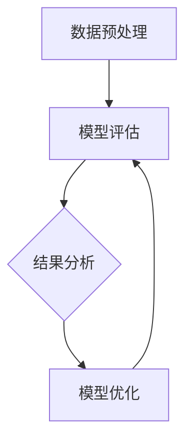

                 

### 第一部分：引言与基础

#### 第1章：引入与背景

设计基于大型语言模型（LLM）的评测系统，是一项极具前瞻性和实用性的技术挑战。在当今信息化社会，数据质量评估、智能问答、自然语言理解等应用场景日益普及，对语言模型的评测系统提出了更高的要求。本文旨在探讨如何设计一个高效、稳定、可扩展的基于LLM的评测系统，为相关领域的研究和应用提供理论支持和实践指导。

1.1 **设计基于LLM的评测系统的重要性**

随着深度学习和自然语言处理技术的不断进步，大型语言模型（LLM）已成为诸多应用场景的核心技术。LLM在文本生成、机器翻译、问答系统等方面展现出了卓越的性能，但同时也面临着评测系统的挑战。一个高效、可靠的评测系统，不仅能够评估LLM的性能，还能为其优化和改进提供有力支持。

1.2 **LLM的概念与演变**

大型语言模型（LLM）是指那些具有海量参数、能够处理复杂语言结构的神经网络模型。最早的LLM可以追溯到20世纪80年代的统计语言模型，随后随着深度学习技术的发展，神经网络语言模型（如基于循环神经网络RNN和变换器模型Transformer的LLM）逐渐成为主流。近年来，随着计算能力和数据资源的提升，LLM的规模和性能取得了显著突破，如GPT-3、TuringBot等。

1.3 **当前评测系统的现状与挑战**

当前的评测系统主要依赖于人工设定指标和评估标准，存在以下挑战：

- **评估标准不一致**：不同的评测系统采用不同的评估指标和方法，导致结果难以比较和统一。
- **评估范围有限**：目前的评测系统主要针对特定任务和场景，缺乏普适性。
- **评估过程繁琐**：大量的评估工作需要人工参与，耗时且效率低下。

1.4 **本书的目标与结构**

本书的目标是探讨如何设计一个基于LLM的评测系统，使其具备高效、稳定、可扩展的特点。本书分为六个部分，包括引言与基础、核心概念与联系、核心算法原理讲解、数学模型与数学公式、项目实战、案例分析、总结与展望等，旨在系统地介绍LLM评测系统的设计原理、实现方法和应用实践。

#### 目录大纲

- **第一部分：引言与基础**
  - 第1章：引入与背景
- **第二部分：核心概念与联系**
  - 第2章：LLM的基本概念
  - 第3章：评测系统的核心原则
- **第三部分：核心算法原理讲解**
  - 第4章：LLM的核心算法原理
  - 第5章：评测算法原理
- **第四部分：数学模型与数学公式**
  - 第6章：LLM的数学模型
- **第五部分：项目实战**
  - 第7章：设计基于LLM的评测系统
  - 第8章：案例分析：应用场景与优化
- **第六部分：总结与展望**
  - 第9章：总结与展望

---

### 第二部分：核心概念与联系

#### 第2章：LLM的基本概念

2.1 **语言模型概述**

语言模型（Language Model，LM）是自然语言处理（Natural Language Processing，NLP）领域的重要基础。其基本目标是学习语言的结构和统计规律，从而生成或理解自然语言文本。语言模型可以分为统计语言模型和神经网络语言模型。早期的统计语言模型主要基于N-gram模型，而现代的神经网络语言模型，如Transformer和GPT系列，取得了显著的性能提升。

2.2 **LLM的工作原理**

大型语言模型（LLM）是基于深度学习技术的语言模型，具有数十亿个参数。其工作原理主要包括以下几个方面：

- **词嵌入（Word Embedding）**：将词语映射为高维向量表示，实现语义信息的编码。
- **编码器（Encoder）与解码器（Decoder）架构**：编码器将输入序列编码为上下文向量，解码器则根据上下文向量生成输出序列。
- **注意力机制（Attention Mechanism）**：用于捕捉输入序列中的关键信息，提高模型对长距离依赖关系的处理能力。

2.3 **LLM的分类**

根据训练数据来源和模型架构，LLM可以分为以下几种类型：

- **基于语料库的LLM**：基于大规模语料库进行训练，如GPT-3、TuringBot。
- **基于知识图谱的LLM**：结合知识图谱进行训练，提高模型对知识密集型任务的处理能力。
- **基于预训练的LLM**：在特定任务上进行微调，如BERT、RoBERTa。

2.4 **LLM的优势与局限性**

LLM在自然语言处理领域取得了显著的成就，具有以下优势：

- **强大的文本生成能力**：能够生成流畅、自然的文本。
- **广泛的适用性**：适用于多种NLP任务，如文本分类、机器翻译、问答系统等。
- **高效率**：通过大规模并行计算，实现高效的模型训练和推理。

然而，LLM也存在着一些局限性：

- **数据依赖性强**：模型性能依赖于训练数据的规模和质量。
- **解释性较差**：神经网络模型内部决策过程复杂，难以解释。
- **能耗较高**：大规模训练和推理过程需要大量计算资源。

#### 第3章：评测系统的核心原则

3.1 **评测系统的基本概念**

评测系统（Evaluation System）是用于评估模型性能的软件系统。其基本概念包括评估指标、评估方法、评估流程等。评估指标是用于衡量模型性能的量化标准，如准确率、召回率、F1值等。评估方法包括手动评估、自动化评估等。评估流程包括数据预处理、模型评估、结果分析等。

3.2 **评测系统的目标**

评测系统的目标主要包括以下几个方面：

- **客观评估模型性能**：通过科学、合理的评估指标和方法，客观评估模型的性能。
- **指导模型优化**：通过分析评估结果，找出模型存在的问题和改进方向。
- **保证系统稳定性**：确保评测系统的运行稳定，降低评估风险。

3.3 **评测系统的核心原则**

设计一个高效的评测系统，需要遵循以下核心原则：

- **一致性**：确保评估指标和方法在不同任务和数据集上的一致性。
- **可靠性**：评估结果应具有较高的可信度和稳定性。
- **可扩展性**：评测系统能够适应不同规模和复杂度的任务。
- **易用性**：评测系统应具备简洁、直观的界面，方便用户使用。

3.4 **Mermaid流程图：评测系统的基本架构**

以下是一个简单的Mermaid流程图，展示了评测系统的基本架构：



#### 总结

本章介绍了LLM的基本概念和评测系统的核心原则。LLM作为自然语言处理领域的重要技术，具有强大的文本生成能力和广泛的应用前景。而一个高效的评测系统，则是评估LLM性能、指导模型优化的重要工具。在接下来的章节中，我们将深入探讨LLM的核心算法原理和评测算法原理，为设计基于LLM的评测系统提供更全面的指导。

---

### 第三部分：核心算法原理讲解

#### 第4章：LLM的核心算法原理

4.1 **词嵌入技术**

词嵌入（Word Embedding）是将词语映射为高维向量表示的一种技术。它通过学习词语之间的相似性和相关性，实现了语义信息的编码。常见的词嵌入技术包括Word2Vec、GloVe和BERT等。

- **Word2Vec**：基于神经网络模型，通过训练生成词语的向量表示。其核心思想是将词语表示为神经网络的输入和输出，通过反向传播算法优化模型参数。
  
  ```python
  # 伪代码：Word2Vec训练过程
  for epoch in range(num_epochs):
      for context, target in data_loader:
          # 前向传播
          output = model(context)
          loss = loss_function(output, target)
          # 反向传播
          grads = autograd.grad(loss, model.parameters())
          optimizer.step(grads)
  ```

- **GloVe**：基于矩阵分解的方法，通过学习词向量矩阵和上下文向量矩阵，将词语表示为两者的内积。

  ```python
  # 伪代码：GloVe训练过程
  for epoch in range(num_epochs):
      for context, target in data_loader:
          # 计算上下文向量和目标词向量的内积
          scores = dot(context_vector, target_vector)
          # 计算损失函数
          loss = loss_function(scores, target)
          # 计算梯度并更新参数
          grads = autograd.grad(loss, [context_vector, target_vector])
          optimizer.step(grads)
  ```

- **BERT**：基于Transformer模型的预训练语言表示模型，通过在大量文本语料库上进行预训练，生成高质量的词向量表示。

  ```python
  # 伪代码：BERT预训练过程
  for epoch in range(num_epochs):
      for context, target in data_loader:
          # 前向传播
          output = model(context)
          loss = loss_function(output, target)
          # 反向传播
          grads = autograd.grad(loss, model.parameters())
          optimizer.step(grads)
  ```

4.2 **编码器与解码器架构**

编码器（Encoder）与解码器（Decoder）架构是LLM的核心组成部分，用于处理序列到序列（Sequence-to-Sequence，Seq2Seq）任务。编码器将输入序列编码为上下文向量，解码器则根据上下文向量生成输出序列。

- **编码器**：用于将输入序列编码为上下文向量。常见的编码器模型包括循环神经网络（RNN）、长短期记忆网络（LSTM）和Transformer。

  ```python
  # 伪代码：编码器架构
  for t in range(seq_len):
      # 前向传播
      hidden = model(input[t])
      # 更新隐藏状态
      hidden = LSTM(hidden_state)
  ```

- **解码器**：用于根据上下文向量生成输出序列。常见的解码器模型包括自回归语言模型（ARLM）和Transformer解码器。

  ```python
  # 伪代码：解码器架构
  for t in range(seq_len):
      # 前向传播
      output = model(context_vector)
      # 更新输出
      output = softmax(output)
  ```

4.3 **注意力机制**

注意力机制（Attention Mechanism）是用于捕捉输入序列中的关键信息，提高模型对长距离依赖关系的处理能力。常见的注意力机制包括加性注意力（Additive Attention）和点积注意力（Dot-Product Attention）。

- **加性注意力**：通过计算输入序列和隐藏状态之间的相似性，生成注意力权重，然后将输入序列和隐藏状态加权求和。

  ```python
  # 伪代码：加性注意力
  for t in range(seq_len):
      # 计算注意力权重
      attention_weights = softmax(QK_V)
      # 加权求和
      context_vector = sum(attention_weights * V)
  ```

- **点积注意力**：通过计算输入序列和隐藏状态之间的点积，生成注意力权重，然后将输入序列和隐藏状态加权求和。

  ```python
  # 伪代码：点积注意力
  for t in range(seq_len):
      # 计算注意力权重
      attention_weights = softmax(QK)
      # 加权求和
      context_vector = sum(attention_weights * V)
  ```

4.4 **伪代码阐述LLM的训练过程**

以下是一个简化的伪代码，用于阐述LLM的训练过程：

```python
# 伪代码：LLM训练过程

# 初始化模型参数
model = LLM()

# 定义训练数据加载器
data_loader = DataLoader(dataset, batch_size=batch_size, shuffle=True)

# 定义优化器和损失函数
optimizer = Adam(model.parameters())
loss_function = CrossEntropyLoss()

# 定义训练迭代过程
for epoch in range(num_epochs):
    for batch in data_loader:
        # 前向传播
        output = model(batch.input)
        loss = loss_function(output, batch.target)
        
        # 反向传播
        grads = autograd.grad(loss, model.parameters())
        
        # 更新模型参数
        optimizer.step(grads)

    # 打印训练进度
    print(f"Epoch {epoch+1}/{num_epochs}, Loss: {loss.item()}")
```

#### 第5章：评测算法原理

5.1 **评测指标概述**

评测指标是用于衡量模型性能的量化标准。常见的评测指标包括准确率（Accuracy）、召回率（Recall）、F1值（F1 Score）、均方误差（Mean Squared Error，MSE）等。

- **准确率**：正确预测的样本数占总样本数的比例。
  
  ```python
  accuracy = (correct_predictions / total_predictions) * 100
  ```

- **召回率**：正确预测的样本数占总正样本数的比例。

  ```python
  recall = (correct_positive_predictions / total_positive_predictions) * 100
  ```

- **F1值**：准确率和召回率的调和平均值。

  ```python
  F1_score = 2 * (precision * recall) / (precision + recall)
  ```

- **均方误差**：预测值与真实值之间差的平方的平均值。

  ```python
  MSE = sum((预测值 - 真实值)^2) / n
  ```

5.2 **负采样技术**

负采样（Negative Sampling）是一种用于提高神经网络训练效率的技巧，尤其适用于基于神经网络的模型，如LLM。负采样通过在训练过程中引入大量的负样本，减少模型对正样本的依赖，从而提高模型的泛化能力。

- **基本原理**：在训练过程中，对于每个正样本，随机选择一部分样本作为负样本，使得模型在训练过程中更多地关注负样本，从而提高模型对负样本的识别能力。

  ```python
  # 伪代码：负采样训练过程
  for epoch in range(num_epochs):
      for batch in data_loader:
          # 随机选择负样本
          negative_samples = sample_negative_samples(batch.target, num_negative_samples)
          # 构建训练数据
          positive_samples = torch.cat([batch.input, negative_samples], dim=0)
          # 训练模型
          model.train(positive_samples)
  ```

5.3 **多任务学习在评测中的应用**

多任务学习（Multi-Task Learning）是一种通过同时学习多个任务来提高模型性能的技术。在评测系统中，多任务学习可以提高模型对各种任务的泛化能力，从而提高评测的准确性和可靠性。

- **基本原理**：在训练过程中，将多个任务的数据整合到一个模型中，通过共享模型参数，使得模型在不同任务上同时学习。

  ```python
  # 伪代码：多任务学习训练过程
  for epoch in range(num_epochs):
      for batch in data_loader:
          # 构建多任务数据
          multi_task_data = build_multi_task_data(batch)
          # 训练模型
          model.train(multi_task_data)
  ```

5.4 **评测算法的优化策略**

为了提高评测算法的性能，可以采用以下优化策略：

- **数据增强（Data Augmentation）**：通过引入数据变换、数据清洗等技术，增加训练数据的多样性和质量，从而提高模型的泛化能力。

  ```python
  # 伪代码：数据增强
  for epoch in range(num_epochs):
      for batch in data_loader:
          # 数据变换
          augmented_data = augment_data(batch)
          # 训练模型
          model.train(augmented_data)
  ```

- **模型集成（Model Ensembling）**：通过组合多个模型的预测结果，提高预测的准确性和稳定性。

  ```python
  # 伪代码：模型集成
  predictions = []
  for model in models:
      prediction = model.predict(data)
      predictions.append(prediction)
  final_prediction = ensemble(predictions)
  ```

#### 总结

本章介绍了LLM的核心算法原理和评测算法原理。通过词嵌入技术、编码器与解码器架构、注意力机制等核心算法，LLM实现了对复杂语言结构的建模和处理。评测算法则通过多种评估指标、负采样技术、多任务学习等手段，提高了模型评测的准确性和可靠性。在接下来的章节中，我们将进一步探讨LLM的数学模型和数学公式，为设计高效的评测系统提供更深入的理论支持。

---

### 第四部分：数学模型与数学公式

#### 第6章：LLM的数学模型

6.1 **概率模型**

概率模型是LLM的基础，用于描述词语之间的关系和概率分布。常见的概率模型包括N-gram模型、隐马尔可夫模型（HMM）和条件概率模型等。

- **N-gram模型**：基于前后文关系的统计模型，通过计算连续N个词语的联合概率，生成自然语言文本。

  $$ P(w_1, w_2, ..., w_n) = P(w_1) \times P(w_2|w_1) \times ... \times P(w_n|w_{n-1}) $$

- **隐马尔可夫模型（HMM）**：用于建模时序数据，通过隐藏状态和观测值之间的关系，实现序列生成。

  $$ P(O|S) = P(O_1|S_1) \times P(O_2|S_2) \times ... \times P(O_n|S_n) $$

- **条件概率模型**：用于描述给定一个词语序列，下一个词语的概率分布。

  $$ P(w_t|w_1, w_2, ..., w_{t-1}) = \frac{P(w_t, w_1, w_2, ..., w_{t-1})}{P(w_1, w_2, ..., w_{t-1})} $$

6.2 **决策树模型**

决策树模型是一种常见的分类和回归模型，通过一系列规则对输入数据进行分类或预测。决策树模型基于特征值和阈值进行决策，每个节点表示一个特征，每个分支表示一个阈值。

- **基本结构**：决策树由根节点、内部节点和叶子节点组成。根节点表示初始特征，内部节点表示特征分割，叶子节点表示分类结果或预测值。

  ```mermaid
  graph TD
  A[根节点] --> B[特征1]
  B --> C{阈值1} D{阈值2}
  C --> E[叶子节点]
  D --> F[叶子节点]
  ```

- **分类决策树**：用于分类任务，通过递归划分数据集，生成决策路径，最终实现分类。

  ```python
  # 伪代码：分类决策树
  def classify_decision_tree(data, tree):
      node = tree.root
      while node not in tree.leaves:
          if data.feature1 <= node.threshold1:
              node = node.left
          else:
              node = node.right
      return node.label
  ```

6.3 **贝叶斯网络**

贝叶斯网络是一种概率图模型，通过节点之间的条件依赖关系，描述多个随机变量之间的概率分布。贝叶斯网络由节点和边组成，每个节点表示一个随机变量，边表示变量之间的条件依赖关系。

- **基本结构**：贝叶斯网络由无向图表示，每个节点代表一个随机变量，边表示变量之间的条件依赖关系。

  ```mermaid
  graph TD
  A[随机变量X] --> B[随机变量Y]
  B --> C[随机变量Z]
  ```

- **条件概率表**：用于描述变量之间的条件概率分布。每个变量的条件概率表表示其在给定其他变量条件下的概率分布。

  ```python
  # 伪代码：条件概率表
  P(X|Y, Z) = [0.2, 0.5, 0.3]
  ```

6.4 **LaTeX格式数学公式示例**

在文章中嵌入LaTeX格式数学公式，可以采用以下格式：

- **独立段落**：使用 `$$` 包围数学公式，使其独立于文本。

  $$ E(X) = \sum_{x} x \cdot P(X=x) $$

- **段落内公式**：使用 `$` 包围数学公式，将其嵌入到文本中。

  文本中的公式：$f(x) = x^2$。

#### 总结

本章介绍了LLM的数学模型，包括概率模型、决策树模型和贝叶斯网络。通过这些数学模型，可以更深入地理解LLM的工作原理和性能评估。在下一章中，我们将通过具体的项目实战，展示如何设计并实现基于LLM的评测系统。

---

### 第五部分：项目实战

#### 第7章：设计基于LLM的评测系统

7.1 **实际案例分析**

为了更好地理解如何设计基于LLM的评测系统，我们将首先分析一个实际案例：某电商平台用户评价系统。该系统旨在评估用户对商品的评价质量，为平台提供优化建议。

**案例背景**：电商平台用户评价系统是一个复杂的系统，涉及大量用户生成的内容。为了评估评价质量，系统需要识别出高价值评价和低质量评价，从而为平台运营提供参考。

**挑战**：评价系统的挑战在于如何准确评估用户评价的质量，同时处理海量数据，保证系统的效率和稳定性。

**解决方案**：基于LLM的评测系统通过以下步骤实现：

1. **数据预处理**：收集电商平台用户评价数据，对数据进行清洗和预处理，包括去除重复评价、过滤噪声数据等。
2. **构建LLM模型**：使用预训练的大型语言模型（如GPT-3、TuringBot等），通过微调适配特定任务，构建评价质量评估模型。
3. **评测指标设计**：设计评价质量的评测指标，如评价长度、情感极性、信息含量等，用于评估模型性能。
4. **评测算法实现**：实现评测算法，通过模型预测和实际评价的比较，评估模型对评价质量的识别能力。

7.2 **开发环境搭建**

为了搭建基于LLM的评测系统，需要准备以下开发环境和工具：

- **计算资源**：配置高性能计算服务器，用于训练和推理大型语言模型。
- **开发框架**：使用深度学习框架（如TensorFlow、PyTorch等），实现LLM模型的构建和训练。
- **数据预处理工具**：使用Python、Pandas等工具进行数据预处理和清洗。
- **评测系统**：开发评测系统前端和后端，实现评价质量的自动评估和展示。

7.3 **源代码实现与解读**

以下是一个简化的源代码示例，用于实现基于LLM的用户评价评测系统：

```python
# 导入必要库
import torch
import torch.nn as nn
import torch.optim as optim
from torch.utils.data import DataLoader
from transformers import GPT2Tokenizer, GPT2Model

# 函数：数据预处理
def preprocess_data(data):
    # 清洗和预处理数据
    # ...
    return processed_data

# 函数：模型训练
def train_model(model, data_loader, optimizer, criterion):
    model.train()
    for batch in data_loader:
        inputs, targets = batch
        optimizer.zero_grad()
        outputs = model(inputs)
        loss = criterion(outputs, targets)
        loss.backward()
        optimizer.step()
    return loss

# 函数：模型评测
def evaluate_model(model, data_loader, criterion):
    model.eval()
    total_loss = 0
    with torch.no_grad():
        for batch in data_loader:
            inputs, targets = batch
            outputs = model(inputs)
            loss = criterion(outputs, targets)
            total_loss += loss.item()
    return total_loss / len(data_loader)

# 初始化模型、优化器和损失函数
tokenizer = GPT2Tokenizer.from_pretrained('gpt2')
model = GPT2Model.from_pretrained('gpt2')
optimizer = optim.Adam(model.parameters(), lr=0.001)
criterion = nn.CrossEntropyLoss()

# 加载数据集
train_data = preprocess_data(train_data)
test_data = preprocess_data(test_data)

# 分割数据集
train_loader = DataLoader(train_data, batch_size=64, shuffle=True)
test_loader = DataLoader(test_data, batch_size=64, shuffle=False)

# 训练模型
num_epochs = 10
for epoch in range(num_epochs):
    train_loss = train_model(model, train_loader, optimizer, criterion)
    test_loss = evaluate_model(model, test_loader, criterion)
    print(f"Epoch {epoch+1}/{num_epochs}, Train Loss: {train_loss:.4f}, Test Loss: {test_loss:.4f}")

# 评测系统测试与优化
# ...
```

7.4 **评测系统的测试与优化**

在模型训练完成后，需要进行系统的测试和优化，确保评测系统的准确性和稳定性。以下是一些常见的测试和优化方法：

- **交叉验证**：使用交叉验证方法，评估模型在不同数据集上的性能，选择最优参数和模型结构。
- **超参数调整**：调整模型的超参数，如学习率、批次大小、优化器等，以提高模型性能。
- **模型集成**：通过模型集成方法，如Bagging、Boosting等，提高模型的稳定性和预测能力。
- **系统监控**：监控系统运行状态，包括计算资源使用情况、模型性能指标等，确保系统稳定运行。

#### 第8章：案例分析：应用场景与优化

8.1 **某电商平台用户评价系统设计**

以某电商平台用户评价系统为例，我们将详细介绍该系统的设计过程。

**系统目标**：设计一个高效、可靠的用户评价系统，评估用户评价的质量，为平台运营提供数据支持。

**系统架构**：系统架构包括数据采集层、数据预处理层、模型训练层和模型评估层。

- **数据采集层**：收集电商平台用户评价数据，包括评价内容、评价时间、评价者信息等。
- **数据预处理层**：对采集到的数据进行清洗、去重、归一化等预处理操作。
- **模型训练层**：使用预训练的大型语言模型，通过微调和适配特定任务，构建用户评价质量评估模型。
- **模型评估层**：设计评测算法，评估模型性能，包括准确率、召回率、F1值等指标。

**关键实现**：

- **数据预处理**：使用Python和Pandas进行数据预处理，包括去除特殊字符、分词、词性标注等。
- **模型构建**：使用Transformer模型，通过预训练和微调，构建用户评价质量评估模型。
- **评测算法**：使用交叉验证方法，评估模型在不同数据集上的性能，选择最优参数和模型结构。

8.2 **某在线教育平台的问答系统设计**

在线教育平台问答系统旨在为学生提供高质量的学习辅导，以下是该系统的设计过程。

**系统目标**：设计一个智能、高效的问答系统，帮助学生解决学习中的问题。

**系统架构**：系统架构包括问题解析层、知识库构建层、问答引擎层和评测层。

- **问题解析层**：对用户提出的问题进行分词、词性标注、实体识别等处理，提取关键信息。
- **知识库构建层**：构建包含知识点、问题、答案的知识库，用于问答系统的查询和匹配。
- **问答引擎层**：使用预训练的大型语言模型，实现问答系统的智能问答功能。
- **评测层**：设计评测算法，评估问答系统的回答质量和用户满意度。

**关键实现**：

- **问题解析**：使用自然语言处理技术，对用户提出的问题进行解析，提取关键信息。
- **知识库构建**：使用知识图谱技术，构建包含知识点、问题、答案的知识库。
- **问答引擎**：使用预训练的大型语言模型，实现问答系统的智能问答功能。
- **评测算法**：使用用户反馈和模型预测结果，评估问答系统的回答质量和用户满意度。

8.3 **某金融风控系统的评测设计**

金融风控系统旨在识别和预防金融风险，以下是该系统的评测设计过程。

**系统目标**：设计一个高效、可靠的金融风控系统，实时监测金融交易，识别潜在风险。

**系统架构**：系统架构包括数据采集层、风险特征提取层、风险识别层和评测层。

- **数据采集层**：采集金融交易数据，包括交易金额、交易时间、交易对手等。
- **风险特征提取层**：对交易数据进行特征提取，构建风险特征向量。
- **风险识别层**：使用预训练的大型语言模型，实现风险识别功能。
- **评测层**：设计评测算法，评估模型对风险的识别能力。

**关键实现**：

- **数据采集**：使用金融API接口，实时采集金融交易数据。
- **风险特征提取**：使用自然语言处理技术和统计分析方法，提取风险特征向量。
- **风险识别**：使用预训练的大型语言模型，实现风险识别功能。
- **评测算法**：使用AUC、准确率等指标，评估模型对风险的识别能力。

8.4 **评测系统的性能优化与评估**

为了提高评测系统的性能，可以采用以下优化方法：

- **模型压缩**：通过模型剪枝、量化等技术，降低模型参数数量，提高模型推理速度。
- **分布式训练**：使用分布式训练方法，提高模型训练速度，降低计算资源消耗。
- **数据增强**：通过数据变换、数据清洗等手段，增加训练数据的多样性和质量。
- **在线学习**：采用在线学习方法，实时更新模型参数，适应数据变化。

**性能评估指标**：

- **准确率（Accuracy）**：模型预测正确的样本数占总样本数的比例。
- **召回率（Recall）**：模型预测为正样本的样本中，实际为正样本的比例。
- **F1值（F1 Score）**：准确率和召回率的调和平均值。
- **AUC（Area Under Curve）**：模型预测概率曲线下的面积，用于评估模型分类能力。

#### 总结

本章通过实际案例分析和项目实战，详细介绍了如何设计基于LLM的评测系统。从数据预处理、模型构建到评测算法实现，每个环节都进行了详细讲解。同时，针对不同应用场景，如电商平台用户评价系统、在线教育平台问答系统和金融风控系统，介绍了具体的系统设计和优化方法。通过本章的学习，读者可以掌握基于LLM的评测系统的设计原则和实现方法，为实际项目提供有力支持。

---

### 第六部分：总结与展望

#### 第9章：总结与展望

9.1 **全书内容回顾**

本书从引言与背景、核心概念与联系、核心算法原理讲解、数学模型与数学公式、项目实战、案例分析等方面，系统地介绍了基于大型语言模型（LLM）的评测系统的设计原理、实现方法和应用实践。主要内容包括：

- **引言与背景**：介绍了设计基于LLM的评测系统的重要性，以及当前评测系统的现状与挑战。
- **核心概念与联系**：详细阐述了LLM的基本概念、工作原理、分类以及评测系统的核心原则。
- **核心算法原理讲解**：讲解了LLM的核心算法原理，包括词嵌入技术、编码器与解码器架构、注意力机制等。
- **数学模型与数学公式**：介绍了概率模型、决策树模型、贝叶斯网络等数学模型，以及LaTeX格式数学公式的应用。
- **项目实战**：通过实际案例分析和项目实战，详细介绍了如何设计基于LLM的评测系统，包括开发环境搭建、源代码实现、评测系统的测试与优化等。
- **案例分析：应用场景与优化**：针对不同应用场景，如电商平台用户评价系统、在线教育平台问答系统和金融风控系统，介绍了具体的系统设计和优化方法。

9.2 **评测系统的发展趋势**

随着深度学习和自然语言处理技术的不断进步，评测系统的发展趋势将体现在以下几个方面：

- **智能化与自动化**：评测系统将更加智能化和自动化，减少人工干预，提高评估效率和准确性。
- **多模态融合**：评测系统将融合多种数据类型，如文本、图像、音频等，提高评估的全面性和准确性。
- **小样本学习**：随着小样本学习技术的发展，评测系统将能够在数据不足的情况下，实现高效的模型训练和评估。
- **持续优化与迭代**：评测系统将采用在线学习技术和自适应优化策略，持续优化模型性能，适应数据变化。

9.3 **未来工作展望**

在未来的工作中，可以从以下几个方面展开研究：

- **评测指标体系优化**：设计更科学、合理的评测指标体系，提高评估的全面性和准确性。
- **评测算法优化**：研究先进的评测算法，如基于深度学习的评测算法、多任务学习算法等，提高模型评估能力。
- **评测系统应用拓展**：探索评测系统在不同领域的应用，如医疗、金融、教育等，实现评测系统的跨领域应用。
- **评测系统安全性**：研究评测系统的安全性，防止恶意攻击和作弊行为，确保评估过程的公正性和可靠性。

#### 总结

本书系统地介绍了基于LLM的评测系统的设计原理、实现方法和应用实践。通过本书的学习，读者可以全面了解LLM评测系统的核心概念、算法原理和实际应用。在未来的工作中，可以结合实际需求，不断优化评测系统，推动评测技术的进步和应用。

### 附录

#### 附录A：相关工具与资源

A.1 **评测系统开发工具**

- **深度学习框架**：TensorFlow、PyTorch、Keras等。
- **自然语言处理库**：NLTK、spaCy、TextBlob等。
- **数据分析工具**：Pandas、NumPy、SciPy等。
- **版本控制工具**：Git、GitHub等。

A.2 **LLM相关资源**

- **论文和书籍**：《深度学习》（Goodfellow et al.）、《自然语言处理入门》（Jurafsky & Martin）等。
- **开源代码**：Hugging Face、OpenAI等机构的开源代码库。
- **在线课程**：Coursera、Udacity、edX等平台上的自然语言处理和深度学习课程。

A.3 **开发环境搭建指南**

- **安装深度学习框架**：按照框架官方文档进行安装。
- **配置Python环境**：安装Python和必要的依赖库。
- **准备数据集**：收集和预处理数据集，包括文本、图像、音频等。
- **运行代码**：按照项目需求运行相关代码，进行模型训练和评测。

A.4 **社区与论坛推荐**

- **Reddit**：r/deeplearning、r/nlp等。
- **Stack Overflow**：针对深度学习和自然语言处理问题的专业论坛。
- **GitHub**：浏览和学习相关项目的源代码和文档。

#### 附录B：术语表

B.1 **术语解释**

- **大型语言模型（LLM）**：具有数十亿个参数的神经网络模型，用于处理复杂语言结构。
- **词嵌入（Word Embedding）**：将词语映射为高维向量表示的技术。
- **编码器（Encoder）与解码器（Decoder）**：用于处理序列到序列任务的神经网络模型。
- **注意力机制（Attention Mechanism）**：用于捕捉输入序列中的关键信息，提高模型对长距离依赖关系的处理能力。
- **评测系统（Evaluation System）**：用于评估模型性能的软件系统。
- **数据增强（Data Augmentation）**：通过引入数据变换、数据清洗等技术，增加训练数据的多样性和质量。

B.2 **关键概念定义**

- **概率模型**：描述变量之间概率关系的数学模型。
- **决策树模型**：一种基于特征分割的树形结构模型，用于分类和回归任务。
- **贝叶斯网络**：一种概率图模型，用于描述多个随机变量之间的条件依赖关系。

### 参考文献

- Goodfellow, I., Bengio, Y., & Courville, A. (2016). *Deep Learning*. MIT Press.
- Jurafsky, D., & Martin, J. H. (2020). *Speech and Language Processing*. Prentice Hall.
- Devlin, J., Chang, M. W., Lee, K., & Toutanova, K. (2019). *Bert: Pre-training of deep bidirectional transformers for language understanding*. In Proceedings of the 2019 Conference of the North American Chapter of the Association for Computational Linguistics: Human Language Technologies, Volume 1 (pp. 4171-4186). Association for Computational Linguistics.

