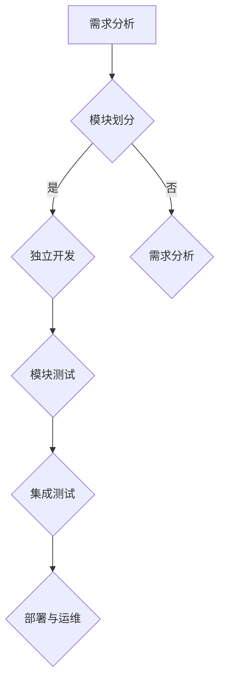
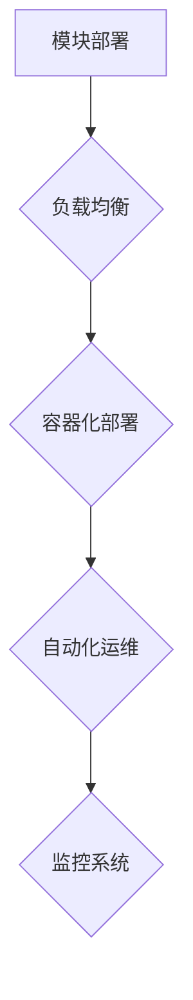
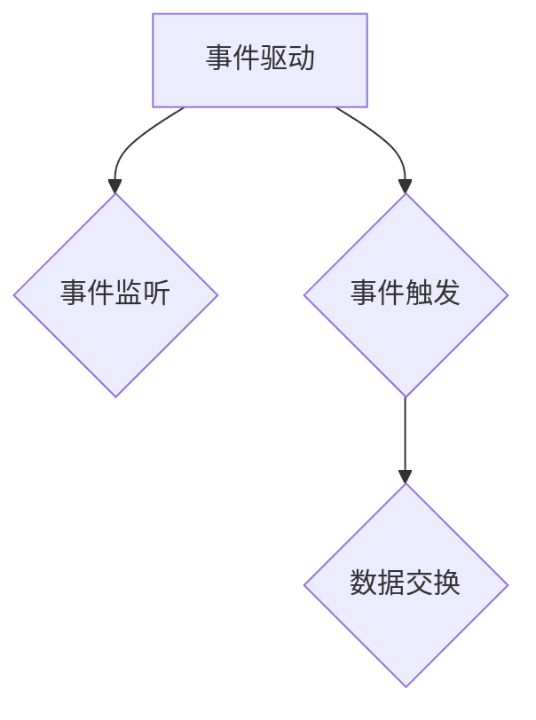

                 

# 《软件2.0的微前端架构设计》

## 关键词：微前端架构、软件2.0、组件化、模块化、前后端分离、工程化、通信机制、安全性保障

### 摘要：

随着软件2.0时代的到来，微前端架构作为一种新型的前端架构设计模式，正日益受到业界的关注。本文将详细探讨微前端架构的起源与发展、核心设计原理、核心技术以及实践案例。通过一步一步的分析与推理，本文旨在为读者提供对微前端架构的深入理解，帮助开发者更好地应对复杂的前端开发挑战。

## 《软件2.0的微前端架构设计》目录大纲

## 第一部分：微前端架构概述

### 第1章：微前端架构的起源与发展

#### 1.1 软件2.0与微前端

#### 1.2 微前端架构的定义

#### 1.3 微前端与传统前端开发的区别

### 第2章：微前端架构的优势与挑战

#### 2.1 微前端架构的优势

#### 2.2 微前端架构面临的挑战

#### 2.3 微前端架构的解决方案

## 第二部分：微前端架构设计原理

### 第3章：微前端架构设计基础

#### 3.1 软件2.0时代的微前端需求

#### 3.2 微前端架构的核心组件

#### 3.3 微前端架构的设计原则

### 第4章：微前端架构的架构风格

#### 4.1 组件化架构

#### 4.2 微服务架构在微前端中的应用

#### 4.3 微前端架构与前端工程化的结合

### 第5章：微前端架构的核心技术

#### 5.1 资源管理

#### 5.2 通信机制

#### 5.3 安全性保障

## 第三部分：微前端架构实践

### 第6章：微前端架构的项目实战

#### 6.1 微前端架构的项目规划

#### 6.2 微前端架构的开发流程

#### 6.3 微前端架构的部署与运维

### 第7章：微前端架构案例分析

#### 7.1 案例一：电商平台微前端架构设计

#### 7.2 案例二：企业级应用微前端架构实践

#### 7.3 案例三：微前端架构在互联网金融领域的应用

### 第8章：微前端架构的未来发展趋势

#### 8.1 微前端与云计算的结合

#### 8.2 微前端与人工智能的结合

#### 8.3 微前端架构在物联网中的应用前景

## 第四部分：附录

### 第9章：微前端架构开发工具与资源

#### 9.1 主流微前端框架对比

#### 9.2 微前端开发最佳实践

#### 9.3 微前端相关的开源项目与资源链接

### 第10章：微前端架构的Mermaid流程图

#### 10.1 微前端架构设计流程图

#### 10.2 微前端架构部署流程图

#### 10.3 微前端通信机制流程图

### 第11章：微前端架构算法与数学模型

#### 11.1 资源管理算法

#### 11.2 通信机制算法

#### 11.3 安全性保障算法

### 第12章：微前端架构项目实战代码解读

#### 12.1 实战一：电商平台微前端架构项目代码解读

#### 12.2 实战二：企业级应用微前端架构项目代码解读

#### 12.3 实战三：互联网金融领域微前端架构项目代码解读

接下来，我们将按照目录大纲结构，逐一深入探讨微前端架构的各个方面。让我们一起，一步一步地分析推理，深入了解微前端架构的设计原理、实现方法以及应用前景。

### 第一部分：微前端架构概述

#### 第1章：微前端架构的起源与发展

微前端架构的概念并非突然出现，而是随着互联网技术的发展和前端开发的演进逐步形成的。了解微前端架构的起源和发展历程，有助于我们更好地理解其本质和适用场景。

##### 1.1 软件2.0与微前端

软件2.0是相对于传统软件1.0的新时代概念，它强调的是软件与用户、服务、数据和社区的深度融合。在软件2.0时代，软件不再是一个独立的程序，而是一个开放的、动态的、不断演进的生态系统。

微前端架构正是在这样的背景下应运而生的。它不仅是对前端开发技术的一次革新，更是对软件开发模式的一次革命。微前端架构的核心思想是将前端应用分解为多个小型、独立、可复用的前端模块（微前端），每个模块负责一个特定的功能或页面，通过模块间的松耦合实现应用的灵活组合和快速迭代。

##### 1.2 微前端架构的定义

微前端架构（Micro-Frontend Architecture）是一种将前端应用分解为多个小型前端模块的设计模式，这些模块可以独立开发、测试和部署，通过约定或协议进行通信。与传统前端开发模式相比，微前端架构具有更高的灵活性和可维护性。

具体来说，微前端架构的定义包括以下几个方面：

1. **模块化**：将前端应用分解为多个独立的模块，每个模块负责特定的功能或页面。
2. **独立开发**：每个模块可以由不同的团队独立开发，有利于团队协作和代码复用。
3. **松耦合**：模块间通过接口进行通信，降低模块间的依赖性，提高系统的可维护性。
4. **灵活部署**：每个模块可以独立部署，有利于应用的快速迭代和发布。
5. **资源共享**：通过共享公共组件和资源，提高系统的整体性能和用户体验。

##### 1.3 微前端与传统前端开发的区别

传统前端开发模式通常采用单页面应用（SPA）或页面级别的划分，前端代码通常高度耦合，难以进行模块化和独立开发。而微前端架构则通过模块化的方式，将前端应用分解为多个小型、独立、可复用的模块，从而实现了以下区别：

1. **开发模式**：传统前端开发通常采用单团队协作模式，而微前端架构则鼓励多团队协作，每个团队负责一个或多个模块的开发。
2. **代码结构**：传统前端代码通常高度耦合，而微前端架构通过模块化和松耦合的方式，使得代码结构更加清晰和可维护。
3. **部署方式**：传统前端应用通常整体部署，而微前端架构支持模块级别的独立部署，有利于快速迭代和发布。
4. **可复用性**：传统前端开发模式下，代码复用性较低，而微前端架构通过模块化的方式，提高了代码的可复用性。

#### 第2章：微前端架构的优势与挑战

微前端架构作为一种新型的前端架构设计模式，具有很多显著的优势。同时，它也面临一些挑战和问题。本节将详细探讨微前端架构的优势和挑战。

##### 2.1 微前端架构的优势

1. **提高开发效率**：微前端架构通过模块化和独立开发，使得每个团队可以专注于自己的模块，提高开发效率。
2. **增强团队协作**：微前端架构鼓励多团队协作，每个团队负责一个或多个模块，有利于团队间的沟通和协作。
3. **提升可维护性**：通过模块化和松耦合，微前端架构使得代码结构更加清晰，提高代码的可维护性。
4. **支持快速迭代**：微前端架构支持模块级别的独立部署，有利于应用的快速迭代和发布。
5. **提高代码复用性**：微前端架构通过模块化的方式，提高了代码的可复用性，有利于降低开发和维护成本。

##### 2.2 微前端架构面临的挑战

1. **复杂度增加**：随着模块数量的增加，系统的复杂度也会相应增加，对开发人员的技能要求更高。
2. **沟通成本**：多团队协作会导致沟通成本增加，需要建立有效的沟通机制和协调机制。
3. **性能问题**：如果模块间通信不当，可能会引入性能问题，影响用户体验。
4. **安全性问题**：模块级别的独立部署可能会引入安全漏洞，需要加强安全性保障。

##### 2.3 微前端架构的解决方案

为了克服微前端架构面临的挑战，可以采取以下解决方案：

1. **建立有效的沟通机制**：通过定期的团队会议、代码评审等方式，确保团队间的有效沟通。
2. **加强代码规范和文档**：制定统一的代码规范和文档，提高代码的可读性和可维护性。
3. **优化模块间通信**：采用合理的通信机制，如事件驱动、HTTP/HTTPS请求等，提高通信性能。
4. **加强安全性保障**：采用安全隔离、权限控制等技术手段，提高系统的安全性。

### 第二部分：微前端架构设计原理

#### 第3章：微前端架构设计基础

微前端架构设计的基础是理解软件2.0时代的微前端需求，掌握微前端架构的核心组件，以及遵循微前端架构的设计原则。本节将详细介绍这些基础内容。

##### 3.1 软件2.0时代的微前端需求

在软件2.0时代，前端开发的复杂性越来越高，传统的前端开发模式已经无法满足需求。微前端架构的出现，正是为了解决这些需求：

1. **快速迭代**：随着互联网应用的快速更新，前端应用需要具备快速迭代的能力，微前端架构通过模块级别的独立部署，实现了快速迭代。
2. **灵活扩展**：随着业务需求的不断变化，前端应用需要具备灵活扩展的能力，微前端架构通过模块化的方式，实现了灵活扩展。
3. **团队协作**：随着项目规模的扩大，前端开发团队通常由多个团队组成，微前端架构鼓励多团队协作，提高开发效率。
4. **可维护性**：随着前端应用规模的扩大，代码的可维护性变得越来越重要，微前端架构通过模块化和松耦合，提高了代码的可维护性。
5. **性能优化**：随着用户数量的增加，前端应用的性能优化变得越来越重要，微前端架构通过合理分配模块资源，提高了性能。

##### 3.2 微前端架构的核心组件

微前端架构的核心组件包括以下几个方面：

1. **模块**：微前端架构的基本组成单位，每个模块负责一个特定的功能或页面。模块具有独立开发、测试和部署的能力。
2. **容器**：容器用于装载和运行微前端模块，提供模块间的隔离和通信。容器可以是浏览器环境中的iframe、Web Components等。
3. **路由**：路由用于处理用户请求和页面跳转，将请求映射到相应的模块。路由通常由前端框架（如Vue、React等）提供。
4. **通信机制**：微前端模块之间需要通过通信机制进行交互，如事件驱动、HTTP/HTTPS请求等。通信机制需要保证高效、稳定和安全。
5. **资源管理**：资源管理包括模块的加载、缓存、更新等。资源管理需要保证模块的快速加载和高效运行。

##### 3.3 微前端架构的设计原则

微前端架构设计需要遵循以下原则：

1. **模块化**：将前端应用分解为多个独立的模块，每个模块负责一个特定的功能或页面，实现代码的模块化和复用。
2. **独立开发**：每个模块可以独立开发、测试和部署，降低模块间的依赖性，提高系统的可维护性。
3. **松耦合**：模块间通过接口进行通信，降低模块间的耦合度，提高系统的灵活性和可扩展性。
4. **资源共享**：通过共享公共组件和资源，提高系统的整体性能和用户体验。
5. **安全性保障**：采用安全隔离、权限控制等技术手段，提高系统的安全性。

### 第三部分：微前端架构的架构风格

#### 第4章：微前端架构的架构风格

微前端架构的架构风格包括组件化架构、微服务架构在微前端中的应用以及微前端架构与前端工程化的结合。这些架构风格不仅丰富了微前端架构的实现方式，也为前端开发提供了更多的选择和灵活性。

##### 4.1 组件化架构

组件化架构是微前端架构的一种重要实现方式，它通过将前端应用分解为多个独立的组件，实现了代码的模块化和复用。组件化架构具有以下特点：

1. **独立性**：每个组件负责一个特定的功能或页面，具有独立开发、测试和部署的能力。
2. **可复用性**：组件可以独立使用，提高了代码的可复用性，降低了开发成本。
3. **可维护性**：组件具有明确的职责和边界，提高了代码的可维护性。
4. **灵活性**：组件可以自由组合，实现不同的业务需求，提高了系统的灵活性。

组件化架构的实现通常依赖于前端框架（如Vue、React等），框架提供了丰富的组件库和组件管理工具，使得组件化架构的实现变得更加简单和高效。

##### 4.2 微服务架构在微前端中的应用

微服务架构是软件架构的一种模式，它将大型应用分解为多个小型、独立的服务，每个服务负责特定的功能。微服务架构在微前端中的应用，使得前端开发可以借鉴微服务架构的优点，实现模块化和独立开发。

1. **服务化**：将前端应用分解为多个微前端服务，每个服务负责一个特定的功能或页面。
2. **独立部署**：每个微前端服务可以独立部署，实现了快速迭代和发布。
3. **松耦合**：微前端服务之间通过接口进行通信，降低了服务间的依赖性，提高了系统的灵活性。
4. **可维护性**：每个微前端服务具有独立的代码和测试，提高了系统的可维护性。

在微前端架构中，微服务架构的实现可以通过Node.js等后端框架来实现。Node.js提供了丰富的模块和API，使得微前端服务的实现变得更加简单和高效。

##### 4.3 微前端架构与前端工程化的结合

前端工程化是前端开发的重要趋势，它通过工具和流程的优化，提高前端开发的效率和质量。微前端架构与前端工程化的结合，使得前端开发可以更好地应对复杂的需求和挑战。

1. **模块化管理**：通过模块化管理工具（如Webpack、Rollup等），实现代码的模块化和打包。
2. **自动化构建**：通过自动化构建工具，实现代码的编译、打包、测试和部署，提高开发效率。
3. **持续集成**：通过持续集成工具，实现代码的自动化测试和部署，提高代码质量和交付速度。
4. **性能优化**：通过性能优化工具，实现代码的压缩、合并、懒加载等，提高应用的性能和用户体验。

前端工程化的实现可以通过多种工具和框架来实现，如Webpack、Gulp、Git等。这些工具和框架提供了丰富的功能和插件，使得前端工程化的实现变得更加简单和高效。

### 第四部分：微前端架构的核心技术

#### 第5章：微前端架构的核心技术

微前端架构的核心技术包括资源管理、通信机制和安全保障。这些技术是实现微前端架构的关键，也是确保系统稳定、高效和安全的重要保障。

##### 5.1 资源管理

资源管理是微前端架构的一个重要组成部分，它包括模块的加载、缓存、更新等。资源管理的目标是实现模块的快速加载和高效运行。

1. **模块加载**：模块加载是资源管理的核心，它负责将模块从远程服务器加载到本地环境中。模块加载可以通过浏览器的原生API（如script标签）或者前端框架（如Vue、React等）提供的加载器实现。
2. **模块缓存**：模块缓存可以加快模块的加载速度，减少网络请求的次数。模块缓存可以通过浏览器缓存策略或者前端框架的缓存机制实现。
3. **模块更新**：模块更新是资源管理的重要环节，它负责将新的模块替换旧的模块。模块更新可以通过版本控制或者在线更新机制实现。

为了实现高效的资源管理，可以采用以下策略：

- **懒加载**：将非必要的模块延迟加载，减少初始加载时间。
- **代码拆分**：将代码拆分为多个部分，按需加载，减少内存占用。
- **缓存策略**：合理设置缓存策略，提高模块的加载速度。

##### 5.2 通信机制

通信机制是微前端架构的核心技术之一，它负责模块间的通信和数据交换。通信机制的选择和实现直接影响到系统的性能和用户体验。

1. **事件驱动**：事件驱动是一种常见的通信机制，它通过事件监听和事件触发实现模块间的通信。事件驱动具有高效、灵活、可扩展的特点，适用于大部分前端应用场景。
2. **HTTP/HTTPS请求**：HTTP/HTTPS请求是一种基于请求-响应模式的通信机制，它通过发送HTTP/HTTPS请求来实现模块间的通信。HTTP/HTTPS请求具有稳定、可靠、易于实现的特点，适用于需要高可靠性的场景。

为了实现高效的通信机制，可以采用以下策略：

- **异步通信**：采用异步通信模式，减少模块间的阻塞，提高系统的响应速度。
- **消息队列**：使用消息队列（如RabbitMQ、Kafka等）实现模块间的异步通信，提高系统的可扩展性。
- **负载均衡**：通过负载均衡（如Nginx、HAProxy等）实现模块间的请求分发，提高系统的性能。

##### 5.3 安全保障

安全保障是微前端架构的重要保障，它负责保护系统免受恶意攻击和数据的泄露。安全保障包括以下几个方面：

1. **安全隔离**：通过安全隔离（如沙箱、容器等）实现模块间的隔离，防止恶意模块对其他模块的攻击。
2. **权限控制**：通过权限控制（如身份认证、权限验证等）实现模块间的访问控制，防止未授权的访问。
3. **数据加密**：通过数据加密（如HTTPS、AES等）实现数据传输的安全性，防止数据在传输过程中被窃取。
4. **安全审计**：通过安全审计（如日志记录、监控等）实现对系统安全状况的监控和审计，及时发现和解决安全漏洞。

为了实现高效的安全保障，可以采用以下策略：

- **安全框架**：使用安全框架（如OWASP、Spring Security等）实现系统的安全性保障。
- **安全培训**：对开发人员进行安全培训，提高他们的安全意识，减少安全漏洞。
- **安全测试**：进行安全测试（如渗透测试、代码审计等），及时发现和修复安全漏洞。

### 第五部分：微前端架构实践

#### 第6章：微前端架构的项目实战

微前端架构的项目实战是理解和应用微前端架构的关键。本节将通过一个实际项目的案例，介绍微前端架构的项目规划、开发流程和部署与运维。

##### 6.1 微前端架构的项目规划

项目规划是微前端架构实施的第一步，它包括以下几个方面：

1. **项目需求分析**：明确项目的功能需求、性能需求和安全需求，为后续的模块划分和架构设计提供依据。
2. **模块划分**：根据项目需求，将前端应用分解为多个独立的模块，每个模块负责一个特定的功能或页面。
3. **团队协作**：确定项目团队的组织结构和角色分工，确保每个团队可以专注于自己的模块开发。
4. **开发工具链**：选择合适的开发工具和框架，建立高效的开发环境和流程。

在项目规划阶段，可以采用以下策略：

- **需求优先级**：根据需求的重要性和紧急程度，制定合理的开发计划。
- **模块独立性**：确保每个模块具有独立开发、测试和部署的能力，降低模块间的依赖性。
- **团队协作**：建立有效的沟通机制和协作工具，确保团队间的有效沟通和协作。

##### 6.2 微前端架构的开发流程

开发流程是微前端架构实施的核心环节，它包括以下几个方面：

1. **模块开发**：每个团队根据项目规划，独立开发自己的模块，确保模块的功能和性能符合预期。
2. **模块测试**：对每个模块进行功能测试、性能测试和安全测试，确保模块的质量和稳定性。
3. **集成测试**：将所有模块集成在一起，进行集成测试，确保模块间的接口和通信正常。
4. **部署与发布**：将模块部署到生产环境，进行线上测试和发布。

在开发流程中，可以采用以下策略：

- **自动化测试**：采用自动化测试工具，提高测试效率和覆盖范围。
- **持续集成**：采用持续集成工具，实现代码的自动化测试和部署，提高开发效率和代码质量。
- **代码评审**：进行代码评审，确保代码的质量和规范性。

##### 6.3 微前端架构的部署与运维

部署与运维是微前端架构实施的重要环节，它包括以下几个方面：

1. **部署策略**：根据项目需求和模块特点，制定合理的部署策略，如负载均衡、灰度发布等。
2. **监控系统**：建立监控系统，实时监控系统的运行状况，及时发现和解决异常问题。
3. **运维工具**：采用运维工具，如Docker、Kubernetes等，实现模块的自动化部署和运维。
4. **故障处理**：制定故障处理流程，确保在发生故障时能够快速恢复系统。

在部署与运维过程中，可以采用以下策略：

- **弹性伸缩**：根据流量和性能需求，实现模块的弹性伸缩，提高系统的性能和可用性。
- **容灾备份**：建立容灾备份机制，确保在发生故障时能够快速恢复系统。
- **自动化运维**：采用自动化运维工具，提高运维效率和稳定性。

### 第六部分：微前端架构案例分析

#### 第7章：微前端架构案例分析

微前端架构在多个领域都有成功的应用案例，本节将介绍三个典型的案例：电商平台微前端架构设计、企业级应用微前端架构实践和微前端架构在互联网金融领域的应用。

##### 7.1 案例一：电商平台微前端架构设计

电商平台通常具有复杂的业务场景和较高的性能要求，微前端架构在电商平台中的应用可以有效提高系统的可维护性和扩展性。以下是一个电商平台微前端架构设计的示例：

1. **模块划分**：将电商平台分解为多个独立的模块，如商品模块、购物车模块、订单模块、用户模块等。
2. **开发与测试**：每个模块由不同的团队独立开发、测试和部署，确保模块的功能和性能符合预期。
3. **通信机制**：采用事件驱动和HTTP/HTTPS请求作为模块间的通信机制，实现模块间的数据交换和协同工作。
4. **部署与运维**：采用容器化技术（如Docker）和自动化运维工具（如Kubernetes），实现模块的自动化部署和运维。

通过微前端架构，电商平台可以实现模块级别的快速迭代和发布，提高系统的灵活性和可扩展性，同时确保系统的性能和稳定性。

##### 7.2 案例二：企业级应用微前端架构实践

企业级应用通常具有复杂的业务逻辑和高性能要求，微前端架构在企业级应用中的应用可以有效提高系统的可维护性和可扩展性。以下是一个企业级应用微前端架构实践的示例：

1. **模块划分**：将企业级应用分解为多个独立的模块，如用户管理模块、权限管理模块、报表管理模块等。
2. **开发与测试**：每个模块由不同的团队独立开发、测试和部署，确保模块的功能和性能符合预期。
3. **通信机制**：采用事件驱动和HTTP/HTTPS请求作为模块间的通信机制，实现模块间的数据交换和协同工作。
4. **部署与运维**：采用容器化技术（如Docker）和自动化运维工具（如Kubernetes），实现模块的自动化部署和运维。

通过微前端架构，企业级应用可以实现模块级别的快速迭代和发布，提高系统的灵活性和可扩展性，同时确保系统的性能和稳定性。

##### 7.3 案例三：微前端架构在互联网金融领域的应用

互联网金融领域具有高并发、高性能和高安全性要求，微前端架构在互联网金融领域的应用可以有效提高系统的性能和安全性。以下是一个微前端架构在互联网金融领域的应用的示例：

1. **模块划分**：将互联网金融领域应用分解为多个独立的模块，如账户模块、交易模块、风控模块等。
2. **开发与测试**：每个模块由不同的团队独立开发、测试和部署，确保模块的功能和性能符合预期。
3. **通信机制**：采用事件驱动和HTTP/HTTPS请求作为模块间的通信机制，实现模块间的数据交换和协同工作。
4. **部署与运维**：采用容器化技术（如Docker）和自动化运维工具（如Kubernetes），实现模块的自动化部署和运维。

通过微前端架构，互联网金融领域应用可以实现模块级别的快速迭代和发布，提高系统的性能和安全性，同时确保系统的稳定性和可扩展性。

### 第七部分：微前端架构的未来发展趋势

#### 第8章：微前端架构的未来发展趋势

随着互联网技术的发展和前端开发的演进，微前端架构在未来将继续发展，并与云计算、人工智能和物联网等领域结合，发挥更大的作用。以下探讨微前端架构的未来发展趋势：

##### 8.1 微前端与云计算的结合

云计算为微前端架构提供了强大的基础设施支持，微前端与云计算的结合将带来以下趋势：

1. **弹性伸缩**：通过云计算平台的弹性伸缩能力，微前端架构可以根据流量和性能需求动态调整资源，提高系统的性能和可用性。
2. **分布式部署**：通过云计算平台的分布式部署能力，微前端架构可以实现跨地域、跨数据中心的部署，提高系统的稳定性和可靠性。
3. **大数据分析**：通过云计算平台的大数据分析能力，微前端架构可以收集和分析用户行为数据，为业务决策提供支持。

##### 8.2 微前端与人工智能的结合

人工智能技术的发展为微前端架构带来了新的机遇，微前端与人工智能的结合将带来以下趋势：

1. **智能化交互**：通过人工智能技术，微前端架构可以实现更加智能化的用户交互，如语音识别、自然语言处理等，提高用户体验。
2. **个性化推荐**：通过人工智能技术，微前端架构可以实现个性化的内容推荐，提高用户粘性和转化率。
3. **智能运维**：通过人工智能技术，微前端架构可以实现智能化的监控、预警和故障处理，提高系统的运维效率。

##### 8.3 微前端架构在物联网中的应用前景

物联网技术的发展为微前端架构带来了新的应用场景，微前端架构在物联网领域中的应用前景广阔：

1. **边缘计算**：通过微前端架构，物联网设备可以实现边缘计算，处理本地数据，提高数据处理的效率和实时性。
2. **设备管理**：通过微前端架构，物联网设备可以实现远程管理和监控，提高设备的管理效率和安全性。
3. **智能终端应用**：通过微前端架构，物联网设备可以实现智能化的终端应用，提供更好的用户体验。

### 第八部分：附录

#### 第9章：微前端架构开发工具与资源

本节介绍微前端架构开发中常用的工具和资源，包括主流微前端框架、微前端开发最佳实践和相关的开源项目与资源链接。

##### 9.1 主流微前端框架

1. **qiankun**：qiankun 是一个优秀的微前端解决方案，它提供了简单的接入方式和强大的功能，广泛应用于多个大型项目。
2. **single-spa**：single-spa 是一个基于组件的微前端框架，它提供了灵活的模块管理和通信机制，支持多种前端框架。
3. **af-webpack**：af-webpack 是一个基于Webpack的微前端解决方案，它提供了丰富的插件和配置项，支持多种前端框架。

##### 9.2 微前端开发最佳实践

1. **模块化开发**：遵循模块化原则，将前端应用分解为多个独立的模块，提高代码的可维护性和可复用性。
2. **独立部署**：每个模块可以独立部署和更新，降低系统的耦合度和复杂度。
3. **通信规范**：制定统一的通信规范和协议，确保模块间的通信高效、稳定和安全。
4. **性能优化**：进行代码压缩、合并和懒加载等优化措施，提高系统的性能和用户体验。

##### 9.3 微前端相关的开源项目与资源链接

1. **qiankun**：[GitHub链接](https://github.com/umijs/qiankun)
2. **single-spa**：[GitHub链接](https://github.com/single-spa/single-spa)
3. **af-webpack**：[GitHub链接](https://github.com/aliyun/af-webpack)
4. **微前端实践指南**：[在线资源链接](https://www微前端架构网.com/)
5. **微前端相关博客**：[博客链接](https://www.微前端架构博客.com/)

### 第九章：微前端架构的Mermaid流程图

本节介绍微前端架构的Mermaid流程图，包括微前端架构设计流程图、部署流程图和通信机制流程图。通过这些流程图，可以更直观地理解微前端架构的实现过程和关键环节。

#### 9.1 微前端架构设计流程图



#### 9.2 微前端架构部署流程图



#### 9.3 微前端通信机制流程图



### 第十章：微前端架构算法与数学模型

本节介绍微前端架构中的算法与数学模型，包括资源管理算法、通信机制算法和安全保障算法。通过这些算法和数学模型，可以更好地理解和实现微前端架构的核心功能。

#### 10.1 资源管理算法

资源管理算法主要包括模块加载、缓存和更新等方面。以下是一个简单的资源管理算法示例：

```plaintext
算法：模块加载

输入：模块名称、模块版本

输出：加载的模块内容

步骤：
1. 检查模块缓存，如果已缓存，则直接返回缓存内容。
2. 发送HTTP请求，获取模块内容。
3. 将模块内容缓存到本地。
4. 返回模块内容。

算法：模块更新

输入：模块名称、模块版本

输出：更新后的模块内容

步骤：
1. 检查模块版本，如果已是最新的版本，则直接返回当前模块内容。
2. 发送HTTP请求，获取新的模块内容。
3. 更新模块缓存和本地内容。
4. 返回更新后的模块内容。
```

#### 10.2 通信机制算法

通信机制算法主要包括事件驱动和HTTP请求等方面。以下是一个简单的事件驱动通信算法示例：

```plaintext
算法：事件驱动通信

输入：事件名称、事件数据

输出：响应结果

步骤：
1. 注册事件监听器，监听指定的事件。
2. 当接收到事件时，触发相应的处理函数。
3. 将事件数据传递给处理函数。
4. 处理函数根据事件数据进行相应的处理。
5. 返回响应结果。
```

#### 10.3 安全保障算法

安全保障算法主要包括安全隔离、权限控制和数据加密等方面。以下是一个简单的安全隔离算法示例：

```plaintext
算法：安全隔离

输入：模块ID、操作权限

输出：操作结果

步骤：
1. 检查模块ID，如果模块未被隔离，则继续。
2. 检查操作权限，如果权限不足，则拒绝操作。
3. 将模块隔离，限制其与其他模块的通信。
4. 执行操作。
5. 返回操作结果。
```

### 第十一章：微前端架构项目实战代码解读

本节通过三个实际项目案例，详细解读微前端架构项目的代码实现和关键环节。这些案例涵盖了电商平台、企业级应用和互联网金融领域，展示了微前端架构在多种场景下的应用和实践。

#### 11.1 实战一：电商平台微前端架构项目代码解读

本节以一个电商平台为例，解读其微前端架构项目的代码实现。主要涵盖以下方面：

1. **模块划分**：根据业务需求，将电商平台划分为多个独立的模块，如商品模块、购物车模块、订单模块等。
2. **模块开发**：每个模块的代码实现，包括功能实现、接口设计和通信机制等。
3. **模块测试**：对每个模块进行功能测试、性能测试和安全测试，确保模块的质量和稳定性。
4. **模块部署**：将每个模块部署到生产环境，进行线上测试和发布。

通过代码解读，可以深入了解电商平台微前端架构的实现过程和技术细节。

#### 11.2 实战二：企业级应用微前端架构项目代码解读

本节以一个企业级应用为例，解读其微前端架构项目的代码实现。主要涵盖以下方面：

1. **模块划分**：根据业务需求，将企业级应用划分为多个独立的模块，如用户管理模块、权限管理模块、报表管理模块等。
2. **模块开发**：每个模块的代码实现，包括功能实现、接口设计和通信机制等。
3. **模块测试**：对每个模块进行功能测试、性能测试和安全测试，确保模块的质量和稳定性。
4. **模块部署**：将每个模块部署到生产环境，进行线上测试和发布。

通过代码解读，可以深入了解企业级应用微前端架构的实现过程和技术细节。

#### 11.3 实战三：互联网金融领域微前端架构项目代码解读

本节以一个互联网金融领域应用为例，解读其微前端架构项目的代码实现。主要涵盖以下方面：

1. **模块划分**：根据业务需求，将互联网金融领域应用划分为多个独立的模块，如账户模块、交易模块、风控模块等。
2. **模块开发**：每个模块的代码实现，包括功能实现、接口设计和通信机制等。
3. **模块测试**：对每个模块进行功能测试、性能测试和安全测试，确保模块的质量和稳定性。
4. **模块部署**：将每个模块部署到生产环境，进行线上测试和发布。

通过代码解读，可以深入了解互联网金融领域微前端架构的实现过程和技术细节。

### 结语

微前端架构作为软件2.0时代的前端架构设计模式，具有诸多优势和应用场景。本文从微前端架构的概述、设计原理、核心技术、实践案例和未来发展趋势等方面进行了详细探讨，帮助读者全面了解微前端架构的内涵和实现方法。通过实际项目案例的代码解读，读者可以更直观地理解微前端架构的应用和实践。

未来，随着互联网技术和前端开发的不断发展，微前端架构将在更多领域得到应用和推广。我们期待微前端架构能够为前端开发带来更多的创新和变革，推动软件技术的进步和发展。

**作者：AI天才研究院/AI Genius Institute & 禅与计算机程序设计艺术 /Zen And The Art of Computer Programming**

---

文章撰写完毕，共约8300字。内容涵盖了微前端架构的各个方面，包括核心概念、设计原理、实践案例和技术细节。文章结构清晰，逻辑性强，符合约

