                 

# 《边缘AI在工业物联网中的实践》

## 摘要

随着工业物联网（IIoT）的快速发展，边缘AI成为提升工业自动化、智能化水平的关键技术之一。本文从边缘AI与工业物联网的基础概念出发，详细探讨了边缘AI技术基础、数据采集与处理方法、以及边缘AI在设备预测维护、质量检测、实时监控与决策支持、智能制造等工业物联网领域的实际应用。通过实例分析，展示了边缘AI在实际工业场景中的应用效果，并提出了边缘AI在工业物联网中的开发实践和安全管理的策略。本文旨在为读者提供全面、深入的边缘AI在工业物联网中的实践指南。

## 目录大纲

### 第一部分：边缘AI与工业物联网基础

#### 第1章：边缘AI与工业物联网概述

1.1 边缘AI的概念与特点  
1.2 工业物联网的架构与挑战  
1.3 边缘AI在工业物联网中的价值

#### 第2章：边缘AI技术基础

2.1 边缘计算的基本原理  
2.2 边缘AI硬件平台介绍  
2.3 边缘AI软件架构

#### 第3章：工业物联网数据采集与处理

3.1 工业物联网数据来源  
3.2 数据采集与传输技术  
3.3 数据预处理方法

### 第二部分：边缘AI在工业物联网中的应用

#### 第4章：边缘AI在设备预测维护中的应用

4.1 设备预测维护的概念  
4.2 预测维护模型构建  
4.3 边缘AI模型部署与优化

#### 第5章：边缘AI在质量检测中的应用

5.1 质量检测的重要性  
5.2 质量检测数据采集  
5.3 质量检测边缘AI模型设计

#### 第6章：边缘AI在实时监控与决策支持中的应用

6.1 实时监控的意义  
6.2 实时监控数据采集  
6.3 边缘AI决策支持模型设计

#### 第7章：边缘AI在智能制造中的应用

7.1 智能制造的概念与特点  
7.2 边缘AI在智能制造中的应用场景  
7.3 边缘AI智能制造系统架构

### 第三部分：边缘AI在工业物联网中的实践案例

#### 第8章：边缘AI在钢铁行业的应用

8.1 钢铁行业的特点与挑战  
8.2 边缘AI在钢铁生产中的应用案例  
8.3 钢铁行业边缘AI应用展望

#### 第9章：边缘AI在汽车制造行业的应用

9.1 汽车制造行业的特点与挑战  
9.2 边缘AI在汽车制造中的应用案例  
9.3 汽车制造行业边缘AI应用展望

#### 第10章：边缘AI在农业物联网中的应用

10.1 农业物联网的概念与特点  
10.2 边缘AI在农业物联网中的应用案例  
10.3 农业物联网边缘AI应用展望

### 第四部分：边缘AI在工业物联网中的开发实践

#### 第11章：边缘AI开发环境搭建

11.1 开发环境的选择  
11.2 边缘AI开发工具介绍  
11.3 开发环境搭建步骤

#### 第12章：边缘AI模型开发与优化

12.1 模型开发流程  
12.2 模型优化方法  
12.3 模型部署与维护

#### 第13章：边缘AI在工业物联网中的安全管理

13.1 边缘AI安全挑战  
13.2 安全管理策略  
13.3 安全管理实践案例

### 附录

#### 附录A：边缘AI相关资源与工具

A.1 边缘AI开发框架  
A.2 边缘AI硬件平台  
A.3 边缘AI开源项目

## 关键词

边缘AI、工业物联网、边缘计算、设备预测维护、质量检测、实时监控、智能制造、开发实践、安全管理

----------------------------------------------------------------

## 引言

工业物联网（Industrial Internet of Things，简称IIoT）是指将传感器、执行器、计算机和其他设备通过网络连接起来，实现工业系统的自动化、智能化和高效化。随着传感器技术、网络技术和计算技术的不断发展，工业物联网正在迅速普及，成为工业生产中不可或缺的一部分。

然而，随着工业物联网系统的复杂度和数据量的增加，传统的中心化数据处理方式面临着巨大的挑战。首先，中心化数据处理需要将大量的数据传输到数据中心进行计算，这不仅增加了网络延迟，而且容易导致网络拥塞。其次，中心化数据处理需要大量的计算资源和存储资源，这增加了系统的成本和维护难度。最后，中心化数据处理在处理大量数据时，容易出现安全隐患，因为数据需要通过公共网络传输，容易遭受攻击。

为了解决这些问题，边缘AI应运而生。边缘AI是指将人工智能算法部署在靠近数据源（即边缘）的设备上，通过边缘设备直接对数据进行处理和分析，从而实现实时响应和高效计算。边缘AI的出现，为工业物联网提供了新的解决方案。

本文将围绕边缘AI在工业物联网中的实践展开讨论。首先，我们将介绍边缘AI和工业物联网的基础概念，包括边缘AI的特点、工业物联网的架构和挑战，以及边缘AI在工业物联网中的价值。接着，我们将深入探讨边缘AI技术基础，包括边缘计算的基本原理、边缘AI硬件平台和边缘AI软件架构。随后，我们将介绍工业物联网数据采集与处理方法，包括数据来源、数据采集与传输技术和数据预处理方法。

在第二部分，我们将探讨边缘AI在工业物联网中的应用，包括设备预测维护、质量检测、实时监控与决策支持、智能制造等实际应用。我们将通过实例分析，展示边缘AI在实际工业场景中的应用效果，并提出边缘AI在工业物联网中的开发实践和安全管理的策略。

最后，我们将通过具体案例，如边缘AI在钢铁行业、汽车制造行业和农业物联网中的应用，进一步阐述边缘AI在工业物联网中的实践。通过本文的阅读，读者将全面了解边缘AI在工业物联网中的实践，并为实际应用提供参考。

### 第一部分：边缘AI与工业物联网基础

#### 第1章：边缘AI与工业物联网概述

在讨论边缘AI在工业物联网中的实践之前，首先需要了解边缘AI和工业物联网的基本概念、架构和挑战。

**1.1 边缘AI的概念与特点**

边缘AI（Edge AI）是指将人工智能算法部署在靠近数据源的设备上，通过对数据进行实时分析和处理，实现快速响应和高效计算。与传统的中心化数据处理方式相比，边缘AI具有以下几个特点：

1. **实时响应**：边缘AI可以将数据处理和分析的延迟降低到毫秒级别，从而实现实时响应。这对于需要快速决策的工业场景尤为重要。

2. **高效计算**：边缘AI利用靠近数据源的设备进行计算，减少了数据传输和存储的需求，从而降低了计算成本。

3. **数据安全**：边缘AI将数据处理和分析移至数据源附近，减少了数据在公共网络中的传输，提高了数据的安全性。

4. **灵活性**：边缘AI可以针对特定场景进行定制化部署，从而提高系统的灵活性和适应性。

**1.2 工业物联网的架构与挑战**

工业物联网是指将各种传感器、执行器、计算机和其他设备通过网络连接起来，实现工业系统的自动化、智能化和高效化。工业物联网的架构通常包括以下几个层次：

1. **感知层**：包括各种传感器和执行器，用于收集工业环境中的数据。

2. **网络层**：包括有线和无线网络，用于传输数据。

3. **平台层**：包括数据存储、处理和分析系统，用于对数据进行处理和分析。

4. **应用层**：包括各种应用，如设备预测维护、质量检测、实时监控等。

在工业物联网中，边缘AI的应用主要集中在平台层和应用层。随着工业物联网系统的复杂度和数据量的增加，工业物联网面临着以下几个挑战：

1. **数据传输延迟**：工业物联网系统中的设备分布广泛，数据传输距离远，容易导致数据传输延迟。

2. **数据存储和处理能力**：工业物联网系统中的数据量庞大，传统的中心化数据处理方式难以满足需求。

3. **系统安全性**：工业物联网系统中的数据需要在公共网络中传输，容易遭受攻击。

**1.3 边缘AI在工业物联网中的价值**

边缘AI在工业物联网中的应用，可以有效地解决上述挑战，提升工业物联网系统的性能和安全性。以下是边缘AI在工业物联网中的几个主要价值：

1. **降低数据传输延迟**：边缘AI可以将数据处理和分析的延迟降低到毫秒级别，从而提高系统的响应速度。

2. **提升数据处理能力**：边缘AI利用靠近数据源的设备进行计算，减少了数据传输和存储的需求，从而提升了系统的数据处理能力。

3. **提高系统安全性**：边缘AI将数据处理和分析移至数据源附近，减少了数据在公共网络中的传输，提高了系统的安全性。

4. **实现实时监控与决策支持**：边缘AI可以实时收集和分析工业物联网中的数据，为系统提供实时监控和决策支持。

5. **降低系统成本**：边缘AI减少了数据传输和存储的需求，从而降低了系统的成本。

综上所述，边缘AI为工业物联网提供了新的解决方案，有助于提升工业物联网系统的性能和安全性。在接下来的章节中，我们将进一步探讨边缘AI的技术基础、数据采集与处理方法，以及边缘AI在工业物联网中的具体应用。

#### 第2章：边缘AI技术基础

边缘AI在工业物联网中的成功应用离不开其坚实的技术基础。本章节将深入探讨边缘计算的基本原理、边缘AI硬件平台以及边缘AI软件架构，为理解边缘AI在工业物联网中的应用奠定基础。

**2.1 边缘计算的基本原理**

边缘计算（Edge Computing）是一种分布式计算架构，通过在数据源附近进行数据处理和分析，降低数据传输延迟，提升系统的响应速度和效率。边缘计算的基本原理如下：

1. **数据本地处理**：边缘计算将数据处理和分析任务从中心化服务器转移到边缘设备，如传感器、执行器和路由器等，从而减少了数据传输的需求。

2. **分布式计算**：边缘计算通过分布式架构，将计算任务分布在多个边缘设备上，从而提高了系统的计算能力和容错性。

3. **实时性**：边缘计算可以在毫秒级别内完成数据处理和分析，从而满足实时性和低延迟的要求。

4. **高效性**：边缘计算减少了数据传输和存储的需求，降低了系统的能耗和成本。

**2.2 边缘AI硬件平台介绍**

边缘AI硬件平台是边缘AI系统的重要组成部分，其性能直接影响边缘AI的应用效果。以下介绍几种常见的边缘AI硬件平台：

1. **嵌入式处理器**：嵌入式处理器是边缘AI硬件平台的基础，具有低功耗、高性能的特点。常见的嵌入式处理器包括ARM架构和x86架构。

2. **边缘AI专用芯片**：边缘AI专用芯片是专为边缘AI应用设计的硬件平台，具有高计算性能和低功耗的特点。常见的边缘AI专用芯片包括NVIDIA Jetson、Google Tensor Processing Unit（TPU）等。

3. **FPGA**：FPGA（Field-Programmable Gate Array）是一种可编程逻辑器件，可以根据需求进行重新配置。FPGA在边缘AI应用中具有实时性和并行处理能力。

4. **AI加速卡**：AI加速卡是一种用于加速深度学习和其他AI任务的硬件设备。常见的AI加速卡包括NVIDIA GPU、Google TPU等。

**2.3 边缘AI软件架构**

边缘AI软件架构包括操作系统、开发框架、中间件等，为边缘AI应用提供支持。以下介绍几种常见的边缘AI软件架构：

1. **操作系统**：边缘AI操作系统是边缘AI硬件平台上的基础软件，负责管理硬件资源和运行应用程序。常见的边缘AI操作系统包括Linux、Windows IoT等。

2. **开发框架**：边缘AI开发框架提供了简化边缘AI应用开发的工具和库，包括数据处理、模型训练、模型部署等功能。常见的边缘AI开发框架包括TensorFlow Lite、Keras for Edge等。

3. **中间件**：边缘AI中间件提供了数据传输、存储、管理和监控等功能，确保边缘AI系统的高效运行。常见的边缘AI中间件包括MQTT、Zigbee等。

通过理解边缘计算的基本原理、边缘AI硬件平台和边缘AI软件架构，我们可以更好地掌握边缘AI的技术基础，为边缘AI在工业物联网中的应用奠定基础。在接下来的章节中，我们将进一步探讨工业物联网数据采集与处理方法，为边缘AI的实际应用提供支持。

#### 第3章：工业物联网数据采集与处理

在边缘AI应用中，数据采集与处理是关键环节。工业物联网（IIoT）中的数据采集和处理具有其独特性，这不仅因为工业环境中的数据来源多样、数据量庞大，还因为工业应用对数据处理的实时性和可靠性有极高的要求。本章节将详细探讨工业物联网的数据来源、数据采集与传输技术，以及数据预处理方法。

**3.1 工业物联网数据来源**

工业物联网中的数据来源广泛，包括但不限于以下几类：

1. **传感器数据**：传感器是工业物联网中最常用的数据采集设备，如温度传感器、压力传感器、振动传感器等。这些传感器可以实时监测设备的运行状态和环境参数。

2. **机器数据**：工业设备自身产生的数据，如生产设备的生产数据、故障数据等。这些数据反映了设备的运行状况和维护需求。

3. **操作数据**：操作人员对设备的操作数据，如开关机记录、调试记录等。这些数据可以帮助分析设备故障原因和优化操作流程。

4. **外部数据**：来自外部系统的数据，如物流数据、市场数据等。这些数据可以用于更全面的工业物联网分析和决策支持。

**3.2 数据采集与传输技术**

数据采集与传输技术是确保工业物联网数据完整性和实时性的关键。以下介绍几种常见的数据采集与传输技术：

1. **有线传输**：有线传输技术包括以太网、工业总线（如CAN总线、Profibus等）。有线传输具有高带宽、低延迟的特点，但受限于布线复杂度和成本。

2. **无线传输**：无线传输技术包括Wi-Fi、蓝牙、Zigbee、LoRa等。无线传输具有灵活性高、布线简单等优点，但带宽和传输距离有限。

3. **边缘计算**：边缘计算技术通过在数据源头或近源头处进行数据处理，减少数据传输量，降低网络负载。边缘计算可以结合有线和无线传输技术，实现高效的数据采集与传输。

4. **物联网平台**：物联网平台提供了数据采集、传输、存储和管理等功能，如Amazon Web Services IoT、Microsoft Azure IoT等。这些平台支持多种通信协议和数据格式，可以方便地集成和管理工业物联网数据。

**3.3 数据预处理方法**

数据预处理是确保数据质量和模型性能的重要步骤。以下介绍几种常见的数据预处理方法：

1. **数据清洗**：数据清洗包括去除重复数据、处理缺失值、纠正错误数据等。这些操作可以确保数据的一致性和准确性。

2. **数据标准化**：数据标准化是将不同尺度和量纲的数据转换为同一尺度，以便进行后续分析。常见的标准化方法包括最小-最大标准化、Z-score标准化等。

3. **数据归一化**：数据归一化是将数据缩放到[0, 1]或[-1, 1]的区间，以消除量纲对数据的影响。常见的归一化方法包括最小-最大归一化、幂函数归一化等。

4. **特征提取**：特征提取是从原始数据中提取出对分析任务最有用的特征，以简化模型训练过程。常见的特征提取方法包括主成分分析（PCA）、特征选择等。

5. **数据分割**：数据分割是将数据集分为训练集、验证集和测试集，以评估模型的性能。常见的数据分割方法包括随机分割、分层分割等。

通过了解工业物联网的数据来源、数据采集与传输技术，以及数据预处理方法，我们可以更有效地收集、处理和分析工业物联网数据，为边缘AI的应用提供高质量的数据支持。在下一章节中，我们将探讨边缘AI在工业物联网中的具体应用。

#### 第二部分：边缘AI在工业物联网中的应用

边缘AI在工业物联网中的应用场景丰富多样，能够显著提升工业生产的自动化和智能化水平。本部分将详细探讨边缘AI在设备预测维护、质量检测、实时监控与决策支持、智能制造等领域的实际应用。

### 第4章：边缘AI在设备预测维护中的应用

设备预测维护是一种通过实时监测设备状态、预测设备故障，并在故障发生前采取预防措施的技术。边缘AI在设备预测维护中的应用，可以有效降低设备故障率，提高生产效率和设备利用率。

**4.1 设备预测维护的概念**

设备预测维护（Predictive Maintenance）是一种基于数据分析和预测模型的维护策略。与传统的定期维护和故障后维护相比，设备预测维护能够提前识别设备潜在故障，采取预防性措施，从而减少停机时间和维护成本。

设备预测维护的基本流程包括：

1. 数据采集：通过传感器和监测设备实时收集设备的运行数据。
2. 数据预处理：对采集到的数据进行清洗、归一化和特征提取，为模型训练做准备。
3. 模型训练：使用历史故障数据和正常运行数据训练预测模型。
4. 预测与决策：实时监测设备状态，使用预测模型预测设备故障，并制定维护策略。

**4.2 预测维护模型构建**

预测维护模型的构建是设备预测维护的核心。以下是一个典型的设备预测维护模型构建过程：

1. **数据收集与预处理**：收集设备的运行数据，如温度、振动、压力等。对数据进行预处理，包括去除噪声、填补缺失值和归一化处理。

2. **特征工程**：从原始数据中提取对预测任务有用的特征，如均值、方差、峰峰值等。特征工程是提升模型性能的关键步骤。

3. **模型选择**：选择合适的预测模型，如支持向量机（SVM）、随机森林（RF）、长短期记忆网络（LSTM）等。根据设备的特性和数据量选择合适的模型。

4. **模型训练与验证**：使用历史故障数据和正常运行数据训练模型，并通过交叉验证等方法评估模型的性能。

5. **模型部署**：将训练好的模型部署到边缘设备上，实时监测设备状态，预测设备故障。

**4.3 边缘AI模型部署与优化**

边缘AI模型部署与优化是确保设备预测维护系统稳定运行的关键。以下是一些关键步骤：

1. **模型压缩**：为减小模型对边缘设备的存储和计算需求，可以使用模型压缩技术，如量化、剪枝和蒸馏等。

2. **实时推理**：使用模型优化技术，如GPU加速和低精度计算，提高模型的实时推理性能。

3. **在线学习**：设备预测维护系统需要不断更新模型，以适应设备运行状态的变化。使用在线学习技术可以实现模型的持续优化。

4. **容错与恢复**：为提高系统的可靠性，需要设计容错机制和故障恢复策略，以应对设备故障和网络中断等情况。

通过边缘AI在设备预测维护中的应用，可以实现设备的智能化管理，降低维护成本，提高生产效率。在实际应用中，边缘AI模型需要根据设备的特性和运行环境进行定制化部署和优化，以实现最佳效果。

### 第5章：边缘AI在质量检测中的应用

质量检测是工业生产中的重要环节，边缘AI在质量检测中的应用可以显著提高检测的准确性和效率。

**5.1 质量检测的重要性**

质量检测是确保产品质量的重要手段。通过质量检测，可以发现和排除生产过程中的质量问题，防止不合格产品流入市场，从而提高企业的声誉和竞争力。质量检测的重要性体现在以下几个方面：

1. **提高产品合格率**：质量检测可以识别出不合格产品，确保产品合格率。
2. **降低生产成本**：通过预防性检测，可以提前发现设备故障和工艺问题，降低维修成本和停机损失。
3. **提高生产效率**：质量检测可以实时监控生产过程，提高生产效率和设备利用率。
4. **确保产品安全性**：质量检测可以确保产品符合安全标准，避免潜在的安全风险。

**5.2 质量检测数据采集**

质量检测数据采集是质量检测系统的核心。以下是一些常见的数据采集方法：

1. **视觉检测**：使用摄像头和图像处理技术进行质量检测，如识别缺陷、测量尺寸等。
2. **传感器检测**：使用各种传感器检测产品的物理参数，如温度、压力、重量等。
3. **自动化检测**：使用自动化设备（如自动化检测线）进行质量检测，提高检测效率和准确性。
4. **手持式检测设备**：使用手持式检测设备进行现场检测，适用于不便于自动化检测的场景。

**5.3 质量检测边缘AI模型设计**

边缘AI模型在质量检测中的应用，可以进一步提高检测的准确性和效率。以下是一个典型的质量检测边缘AI模型设计过程：

1. **数据采集**：通过传感器、摄像头等设备采集质量检测数据。
2. **数据预处理**：对采集到的数据进行预处理，包括去噪、归一化和特征提取。
3. **模型训练**：使用历史检测数据训练边缘AI模型，如卷积神经网络（CNN）、循环神经网络（RNN）等。
4. **模型部署**：将训练好的模型部署到边缘设备上，实现实时质量检测。
5. **模型优化**：根据检测效果对模型进行优化，如调整超参数、增加训练数据等。

通过边缘AI在质量检测中的应用，可以实现实时、高效的质量检测，提高生产线的自动化水平。在实际应用中，需要根据具体的检测需求和场景选择合适的边缘AI模型，并进行定制化部署和优化。

### 第6章：边缘AI在实时监控与决策支持中的应用

实时监控与决策支持是工业物联网中的重要应用，边缘AI可以为实时监控提供强大的数据处理和分析能力。

**6.1 实时监控的意义**

实时监控是指通过传感器和监测设备对工业系统进行实时监测，以获取设备状态、环境参数等信息。实时监控的意义在于：

1. **保障生产安全**：实时监控可以帮助及时发现生产过程中的安全隐患，防止事故发生。
2. **提高生产效率**：实时监控可以监控设备状态和生产进度，优化生产流程，提高生产效率。
3. **降低维护成本**：实时监控可以提前识别设备故障，采取预防性维护措施，降低设备故障率和维修成本。
4. **支持决策制定**：实时监控数据可以为决策者提供重要依据，支持决策制定。

**6.2 实时监控数据采集**

实时监控数据采集是实时监控系统的核心。以下是一些常见的数据采集方法：

1. **传感器数据采集**：通过各种传感器采集设备状态、环境参数等数据，如温度传感器、湿度传感器、振动传感器等。
2. **机器数据采集**：通过设备日志和操作记录等数据采集设备运行状态、故障信息等。
3. **视频监控数据采集**：通过摄像头采集生产现场的视频数据，用于监控设备运行状态和人员行为。
4. **物联网平台数据采集**：通过物联网平台集成各种数据源，实现数据集中采集和管理。

**6.3 边缘AI决策支持模型设计**

边缘AI在实时监控中的应用，可以通过模型分析和预测，提供决策支持。以下是一个典型的边缘AI决策支持模型设计过程：

1. **数据采集**：通过传感器、机器日志等设备采集实时监控数据。
2. **数据预处理**：对采集到的数据进行预处理，包括去噪、归一化和特征提取。
3. **模型训练**：使用历史数据和实时数据训练边缘AI模型，如深度学习模型、机器学习模型等。
4. **模型部署**：将训练好的模型部署到边缘设备上，实现实时数据处理和预测。
5. **模型优化**：根据实时监控效果和业务需求，对模型进行优化和调整。

通过边缘AI在实时监控与决策支持中的应用，可以实现实时、高效的数据处理和分析，为生产管理提供有力支持。在实际应用中，需要根据具体的监控需求和场景选择合适的边缘AI模型，并进行定制化部署和优化。

### 第7章：边缘AI在智能制造中的应用

智能制造是工业4.0的核心概念，通过边缘AI的应用，可以实现生产过程的智能化和自动化。

**7.1 智能制造的概念与特点**

智能制造（Smart Manufacturing）是指通过信息技术和智能技术的深度融合，实现生产过程的智能化和自动化。智能制造的特点包括：

1. **自动化**：通过自动化设备和系统，实现生产过程的自动化，提高生产效率和产品质量。
2. **数字化**：通过数字化技术，实现生产数据的全面采集、传输和存储，为生产管理和决策提供数据支持。
3. **智能化**：通过人工智能技术，实现生产过程的智能化和自适应优化，提高生产效率和灵活性。
4. **网络化**：通过网络技术，实现生产设备和系统的互联互通，实现生产过程的协同化和全球化。

**7.2 边缘AI在智能制造中的应用场景**

边缘AI在智能制造中的应用场景广泛，以下是一些典型的应用：

1. **生产计划优化**：通过边缘AI技术，实时分析生产数据和市场需求，优化生产计划，提高生产效率。
2. **设备预测维护**：通过边缘AI技术，实时监测设备状态，预测设备故障，实现预防性维护，减少设备故障率和停机时间。
3. **质量检测**：通过边缘AI技术，实时检测产品质量，识别缺陷，提高产品质量和合格率。
4. **生产过程监控**：通过边缘AI技术，实时监控生产过程，优化生产流程，提高生产效率和设备利用率。
5. **供应链管理**：通过边缘AI技术，实时监控供应链各个环节，优化供应链管理，提高供应链效率。

**7.3 边缘AI智能制造系统架构**

边缘AI智能制造系统架构包括感知层、网络层、平台层和应用层，以下是一个典型的边缘AI智能制造系统架构：

1. **感知层**：包括各种传感器和监测设备，用于采集生产数据、设备状态和环境参数等。
2. **网络层**：包括边缘计算设备、物联网平台和数据中心，用于数据传输、存储和处理。
3. **平台层**：包括数据平台、分析平台和智能平台，用于数据管理和分析，实现生产过程优化和智能决策。
4. **应用层**：包括各种应用系统，如生产计划系统、质量检测系统、设备预测维护系统等，实现具体的智能制造功能。

通过边缘AI在智能制造中的应用，可以实现生产过程的智能化和自动化，提高生产效率和产品质量，推动工业4.0的发展。在实际应用中，需要根据具体的制造需求和场景，构建合适的边缘AI智能制造系统架构，并进行定制化部署和优化。

#### 第三部分：边缘AI在工业物联网中的实践案例

边缘AI在工业物联网中的实践案例涵盖了多个行业，从钢铁行业到汽车制造行业，再到农业物联网，边缘AI的应用不仅提升了各行业的生产效率，还带来了显著的经济效益。以下是对这些案例的详细探讨。

### 第8章：边缘AI在钢铁行业的应用

钢铁行业是工业物联网应用的重要领域，边缘AI技术的引入为钢铁生产过程带来了革命性的变化。

**8.1 钢铁行业的特点与挑战**

钢铁行业具有高能耗、高污染、生产过程复杂等特点。在钢铁生产过程中，设备和工艺的优化、产品质量的控制、能源消耗的降低等都是行业面临的挑战。以下是钢铁行业的一些主要特点与挑战：

1. **生产过程复杂**：钢铁生产过程包括炼铁、炼钢、轧钢等多个环节，每个环节都需要精确控制。
2. **能耗高**：钢铁生产过程需要大量的能源，如何降低能源消耗是行业的一个重要课题。
3. **设备故障率高**：钢铁生产设备数量庞大，设备故障会直接影响生产进度和产品质量。
4. **产品质量控制**：钢铁产品质量的稳定性和一致性对下游行业至关重要。

**8.2 边缘AI在钢铁生产中的应用案例**

边缘AI技术在钢铁行业有广泛的应用，以下是一些典型的应用案例：

1. **设备预测维护**：通过边缘AI技术，对钢铁生产设备进行实时监控，预测设备故障，实现预防性维护。例如，在炼钢生产过程中，通过监测炉温、炉压等参数，预测炼钢炉的故障，提前进行维护，减少停机时间。

2. **质量检测**：使用边缘AI技术对钢铁产品进行质量检测，通过图像识别和传感器数据，自动识别缺陷，提高检测效率和准确性。例如，在轧钢过程中，通过摄像头和传感器实时监测钢材表面质量，自动识别和标记缺陷。

3. **生产过程优化**：通过边缘AI技术，对生产过程进行实时分析，优化生产参数，提高生产效率。例如，在炼钢过程中，通过分析炉温、炉压等参数，调整生产参数，实现节能降耗。

**8.3 钢铁行业边缘AI应用展望**

随着边缘AI技术的不断发展，钢铁行业的应用前景更加广阔。以下是钢铁行业边缘AI应用的几个展望：

1. **智能化生产**：通过边缘AI技术，实现生产过程的智能化和自动化，提高生产效率和产品质量。
2. **精准控制**：通过边缘AI技术，实现对生产过程的精准控制，降低能源消耗和生产成本。
3. **全流程监控**：通过边缘AI技术，实现全流程的监控和优化，提高生产效率和产品质量。
4. **智能化维护**：通过边缘AI技术，实现设备的智能化维护，减少设备故障率和维修成本。

边缘AI在钢铁行业的应用不仅提高了生产效率和产品质量，还带来了显著的经济效益，为钢铁行业的可持续发展提供了有力支持。

### 第9章：边缘AI在汽车制造行业的应用

汽车制造行业是工业物联网应用的重要领域，边缘AI技术的引入极大地提升了汽车生产效率和产品性能。

**9.1 汽车制造行业的特点与挑战**

汽车制造行业具有生产流程复杂、自动化程度高、产品质量要求严格等特点。在汽车制造过程中，设备故障、生产效率低、产品质量不稳定等都是行业面临的挑战。以下是汽车制造行业的一些主要特点与挑战：

1. **生产流程复杂**：汽车生产包括车身制造、底盘制造、发动机组装等多个环节，每个环节都需要精确控制。
2. **高自动化程度**：汽车制造过程中大量使用自动化设备和机器人，生产线的自动化程度高。
3. **产品质量要求严格**：汽车产品直接关系到公共安全，对产品质量的要求非常高。
4. **设备维护复杂**：汽车制造设备种类繁多，设备维护和故障排除复杂。

**9.2 边缘AI在汽车制造中的应用案例**

边缘AI技术在汽车制造行业有广泛的应用，以下是一些典型的应用案例：

1. **设备预测维护**：通过边缘AI技术，对汽车制造设备进行实时监控，预测设备故障，实现预防性维护。例如，在车身制造过程中，通过监测焊接设备的运行状态，预测焊接设备的故障，提前进行维护，减少停机时间。

2. **质量检测**：使用边缘AI技术对汽车产品进行质量检测，通过图像识别和传感器数据，自动识别缺陷，提高检测效率和准确性。例如，在底盘制造过程中，通过摄像头和传感器实时监测底盘的焊接质量，自动识别焊接缺陷。

3. **生产过程优化**：通过边缘AI技术，对生产过程进行实时分析，优化生产参数，提高生产效率。例如，在发动机组装过程中，通过分析生产数据，优化发动机的性能和制造工艺。

**9.3 汽车制造行业边缘AI应用展望**

随着边缘AI技术的不断发展，汽车制造行业的应用前景更加广阔。以下是汽车制造行业边缘AI应用的几个展望：

1. **智能化生产**：通过边缘AI技术，实现生产过程的智能化和自动化，提高生产效率和产品质量。
2. **精准控制**：通过边缘AI技术，实现对生产过程的精准控制，降低能源消耗和生产成本。
3. **全流程监控**：通过边缘AI技术，实现全流程的监控和优化，提高生产效率和产品质量。
4. **智能化维护**：通过边缘AI技术，实现设备的智能化维护，减少设备故障率和维修成本。

边缘AI在汽车制造行业的应用不仅提高了生产效率和产品质量，还带来了显著的经济效益，为汽车行业的可持续发展提供了有力支持。

### 第10章：边缘AI在农业物联网中的应用

农业物联网是边缘AI应用的另一个重要领域，通过边缘AI技术，可以实现对农业生产过程的智能管理和优化。

**10.1 农业物联网的概念与特点**

农业物联网（Agricultural Internet of Things，简称Agri-IoT）是指通过传感器、无线通信、云计算等技术，实现农业生产、管理和监控的智能化。农业物联网的特点包括：

1. **分布式传感器网络**：农业物联网通过部署大量分布式传感器，实时监测土壤湿度、温度、光照等环境参数。
2. **远程监控与控制**：农业物联网可以实现远程监控和自动化控制，提高农业生产效率和减少人力投入。
3. **数据采集与分析**：农业物联网通过采集和分析大量数据，实现对农业生产过程的精准管理和优化。
4. **智能化决策支持**：农业物联网可以利用边缘AI技术，提供智能化决策支持，提高农业生产效益。

**10.2 边缘AI在农业物联网中的应用案例**

边缘AI技术在农业物联网中有广泛的应用，以下是一些典型的应用案例：

1. **精准灌溉**：通过边缘AI技术，根据土壤湿度、气象数据等，实时调整灌溉量，实现精准灌溉，提高水资源利用效率。
2. **病虫害监测与防治**：通过边缘AI技术，实时监测作物病虫害，自动识别并采取防治措施，减少农药使用，提高作物产量。
3. **作物生长状态监测**：通过边缘AI技术，监测作物的生长状态，如株高、叶绿素含量等，为农业生产提供科学依据。
4. **农机设备管理**：通过边缘AI技术，对农机设备进行实时监控和故障预测，实现设备的智能化管理和维护。

**10.3 农业物联网边缘AI应用展望**

随着边缘AI技术的不断发展，农业物联网的应用前景更加广阔。以下是农业物联网边缘AI应用的几个展望：

1. **智能化农业**：通过边缘AI技术，实现农业生产过程的全面智能化，提高农业生产效率和经济效益。
2. **智慧农业管理**：通过边缘AI技术，实现对农业生产的全流程监控和管理，提高农业生产质量和稳定性。
3. **农业大数据**：通过边缘AI技术，采集和分析大量农业数据，构建农业大数据平台，为农业生产提供数据支持。
4. **农业可持续发展**：通过边缘AI技术，实现农业生产过程的绿色化、可持续化发展，提高农业资源的利用效率。

边缘AI在农业物联网中的应用，不仅提高了农业生产效率和经济效益，还为农业的可持续发展提供了新的思路和方法。

#### 第四部分：边缘AI在工业物联网中的开发实践

边缘AI在工业物联网中的成功应用离不开有效的开发实践。本部分将详细探讨边缘AI开发环境搭建、边缘AI模型开发与优化、以及边缘AI在工业物联网中的安全管理。

### 第11章：边缘AI开发环境搭建

搭建一个高效的边缘AI开发环境是实现边缘AI应用的关键。以下将介绍如何选择合适的开发环境、介绍常用的边缘AI开发工具，并提供搭建步骤。

**11.1 开发环境的选择**

选择合适的开发环境是边缘AI开发的第一步。以下是一些关键考虑因素：

1. **硬件平台**：根据应用场景选择合适的硬件平台，如嵌入式处理器、专用AI芯片等。
2. **操作系统**：选择适用于边缘设备的操作系统，如Linux、Windows IoT等。
3. **网络环境**：确保边缘设备能够接入网络，并支持边缘AI应用的数据传输和通信需求。
4. **开发工具**：选择支持边缘AI开发的工具，如编程语言、开发框架、调试工具等。

**11.2 边缘AI开发工具介绍**

以下是几种常用的边缘AI开发工具：

1. **编程语言**：Python是一种广泛使用的编程语言，支持多种机器学习和深度学习库，适合边缘AI开发。
2. **开发框架**：TensorFlow Lite和Keras for Edge是常用的边缘AI开发框架，提供了丰富的API和工具，简化了边缘AI模型的训练和部署。
3. **调试工具**：如Jupyter Notebook和PyCharm等，提供代码编辑、调试和运行环境。

**11.3 开发环境搭建步骤**

以下是搭建边缘AI开发环境的步骤：

1. **硬件准备**：选择适合的边缘设备，如Raspberry Pi、NVIDIA Jetson等。
2. **操作系统安装**：下载并安装适用于边缘设备的操作系统，如Ubuntu、Windows IoT等。
3. **软件安装**：安装Python、TensorFlow Lite、Keras for Edge等开发工具和库。
4. **网络配置**：配置网络环境，确保边缘设备能够接入互联网。
5. **测试验证**：测试开发环境，确保所有工具和库正常工作。

通过上述步骤，可以搭建一个高效的边缘AI开发环境，为边缘AI在工业物联网中的应用奠定基础。

### 第12章：边缘AI模型开发与优化

边缘AI模型开发与优化是边缘AI应用的核心环节。以下将介绍边缘AI模型开发流程、模型优化方法，以及模型部署与维护。

**12.1 模型开发流程**

边缘AI模型开发流程通常包括以下步骤：

1. **需求分析**：明确应用场景和需求，确定模型的目标和性能指标。
2. **数据收集**：收集与模型相关的数据，包括训练数据和测试数据。
3. **数据预处理**：对收集到的数据进行清洗、归一化和特征提取。
4. **模型设计**：选择合适的模型架构，如卷积神经网络（CNN）、循环神经网络（RNN）等。
5. **模型训练**：使用训练数据训练模型，调整模型参数，优化模型性能。
6. **模型评估**：使用测试数据评估模型性能，确保模型满足需求。
7. **模型部署**：将训练好的模型部署到边缘设备上，实现实时应用。

**12.2 模型优化方法**

边缘AI模型优化是提高模型性能和降低计算资源需求的关键。以下是一些常见的优化方法：

1. **模型压缩**：通过模型剪枝、量化等技术减小模型大小，提高模型在边缘设备上的运行效率。
2. **模型融合**：将多个模型融合为一个，利用多个模型的优点，提高整体性能。
3. **在线学习**：通过持续训练和更新模型，适应设备运行状态的变化，提高模型适应性和准确性。
4. **分布式训练**：利用多台边缘设备进行分布式训练，提高模型训练速度。

**12.3 模型部署与维护**

边缘AI模型部署与维护是确保模型稳定运行的关键。以下是一些关键步骤：

1. **模型部署**：将训练好的模型部署到边缘设备上，实现实时应用。
2. **模型监控**：实时监控模型性能，确保模型正常运行。
3. **模型更新**：根据设备运行状态和应用需求，定期更新模型，提高模型准确性。
4. **故障恢复**：设计故障恢复机制，确保模型在设备故障时能够快速恢复。

通过上述开发与优化方法，可以构建高效、稳定的边缘AI模型，满足工业物联网应用的需求。

### 第13章：边缘AI在工业物联网中的安全管理

随着边缘AI在工业物联网中的应用日益普及，安全管理变得尤为重要。以下将介绍边缘AI在工业物联网中的安全挑战、安全管理策略，以及安全管理实践案例。

**13.1 边缘AI安全挑战**

边缘AI在工业物联网中面临多种安全挑战，包括：

1. **数据安全**：边缘AI设备在数据采集、传输和处理过程中，容易受到数据泄露、篡改等攻击。
2. **设备安全**：边缘AI设备可能遭受恶意软件、病毒等攻击，导致设备失控。
3. **通信安全**：边缘AI设备之间的通信可能受到中间人攻击、窃听等威胁。
4. **隐私保护**：边缘AI应用中涉及大量的敏感数据，如设备状态、用户数据等，需要确保隐私保护。

**13.2 安全管理策略**

为了应对边缘AI的安全挑战，可以采取以下安全管理策略：

1. **数据加密**：对敏感数据进行加密处理，确保数据在传输和存储过程中的安全性。
2. **访问控制**：实施严格的访问控制策略，限制对边缘AI设备和数据的访问权限。
3. **网络隔离**：通过隔离网络，防止内部网络与外部网络的直接连接，降低攻击风险。
4. **安全监控**：实时监控边缘AI设备和网络状态，及时发现和处理安全事件。
5. **在线学习与更新**：定期更新安全策略和模型，确保系统能够应对最新的安全威胁。

**13.3 安全管理实践案例**

以下是边缘AI在工业物联网中的安全管理实践案例：

1. **钢铁行业**：在钢铁生产过程中，通过部署安全监控设备和加密通信协议，确保设备和数据的安全性。同时，定期进行安全审计和漏洞修复，提高系统的安全性。
2. **汽车制造行业**：在汽车制造过程中，使用加密技术保护设备状态数据和用户数据，同时实施严格的访问控制策略，防止未经授权的访问。
3. **农业物联网**：在农业物联网中，通过部署安全监控设备和加密通信协议，确保农业设备和数据的安全性。同时，定期进行安全监控和更新，提高系统的抗攻击能力。

通过上述安全管理策略和实践案例，可以有效地应对边缘AI在工业物联网中的安全挑战，确保边缘AI系统的稳定运行。

### 附录

#### 附录A：边缘AI相关资源与工具

边缘AI的发展离不开一系列相关资源与工具的支持。以下介绍一些常见的边缘AI开发框架、硬件平台和开源项目。

**A.1 边缘AI开发框架**

1. **TensorFlow Lite**：TensorFlow Lite是Google开发的轻量级机器学习框架，适用于在边缘设备上部署AI模型。
2. **Keras for Edge**：Keras for Edge是基于Keras的边缘AI开发框架，提供简单易用的API，支持多种边缘设备。
3. **TorchScript**：TorchScript是Facebook AI Research开发的PyTorch的边缘AI开发框架，支持在边缘设备上高效地运行PyTorch模型。

**A.2 边缘AI硬件平台**

1. **NVIDIA Jetson**：NVIDIA Jetson是一款专为边缘AI计算设计的硬件平台，具有高性能和低功耗的特点。
2. **Raspberry Pi**：Raspberry Pi是一款低成本、高性能的边缘计算平台，适用于各种边缘AI应用。
3. **ARM Mbed OS**：ARM Mbed OS是一款开源的物联网操作系统，支持多种ARM架构的边缘设备。

**A.3 边缘AI开源项目**

1. **EdgeX Foundry**：EdgeX Foundry是一个开源的边缘AI平台，提供边缘数据处理、分析和集成功能。
2. **IoT-for-All**：IoT-for-All是一个开源的物联网平台，支持边缘AI模型训练和部署。
3. **AI Edge Runtime**：AI Edge Runtime是一个开源的边缘AI运行时框架，支持在边缘设备上运行深度学习模型。

通过使用这些边缘AI相关资源与工具，开发者可以更高效地构建和部署边缘AI应用，推动工业物联网的发展。

### Mermaid 流程图

```mermaid
graph TD
    A[边缘AI技术基础] --> B[边缘计算原理]
    A --> C[边缘AI硬件平台介绍]
    A --> D[边缘AI软件架构]
    B --> E[边缘计算架构]
    B --> F[边缘计算网络协议]
    C --> G[嵌入式处理器]
    C --> H[边缘AI专用芯片]
    D --> I[边缘计算操作系统]
    D --> J[边缘AI开发框架]
    E --> K[集中式计算与分布式计算对比]
    F --> L[MQTT协议]
    F --> M[Zigbee协议]
    G --> N[ARM架构]
    G --> O[x86架构]
    H --> P[NVIDIA Jetson]
    H --> Q[Google Tensor Processing Unit]
    I --> R[Linux]
    I --> S[Windows IoT]
    J --> T[TensorFlow Lite]
    J --> U[Keras for Edge]
    K --> V[计算资源分配]
    K --> W[数据处理延迟]
    L --> X[消息队列]
    L --> Y[轻量级协议]
    M --> Z[远程控制]
    M --> AA[无线传感网络]
    N --> BB[高性能计算]
    N --> CC[低功耗设计]
    O --> DD[可扩展性]
    O --> EE[稳定性]
    P --> FF[AI加速计算]
    P --> GG[实时性要求]
    Q --> HH[高效能计算]
    Q --> II[低功耗设计]
    R --> JJ[系统稳定性]
    R --> KK[设备兼容性]
    S --> LL[用户界面友好]
    S --> MM[远程管理支持]
    T --> NN[深度学习模型部署]
    T --> OO[轻量化模型]
    U --> PP[模型训练]
    U --> QQ[实时推理]
    V --> WW[资源利用率]
    V --> XX[负载均衡]
    W --> YY[数据完整性]
    W --> ZZ[传输可靠性]
    X --> AAA[消息可靠性]
    X --> BBB[消息延迟]
    Y --> CCC[传输延迟]
    Y --> DDD[消息丢失]
    Z --> EEE[远程监控]
    Z --> FFF[数据采集]
    AA --> GGG[环境监控]
    AA --> HHH[设备状态监控]
    BB --> IIII[数据加密]
    BB --> jjjj[访问控制]
    CC --> kkkk[设备可靠性]
    CC --> llll[维护便捷性]
    DD --> mmmm[实时响应]
    DD --> nnnn[系统稳定性]
    EE --> oooo[设备兼容性]
    EE --> pppp[可扩展性]
    FF --> qqqq[AI计算性能]
    FF --> rrrr[能耗效率]
    GG --> ssss[计算效率]
    GG --> tttt[实时性]
    HH --> uuuu[低功耗设计]
    HH --> vvvv[高效计算]
    II --> wwww[系统稳定性]
    II --> xxxx[安全性]
    JJ --> yyyy[设备兼容性]
    JJ --> zzzz[可维护性]
    KK --> AAAA[用户界面]
    KK --> BBBB[远程管理]
    LL --> CCCS[操作便捷性]
    LL --> DDDD[设备管理]
    MM --> EEEN[实时监控]
    MM --> FFNN[远程维护]
    NN --> GGGG[模型训练]
    NN --> HHNN[模型推理]
    OO --> IIIO[模型压缩]
    OO --> JJJO[模型优化]
    PP --> KKKK[实时推理]
    PP --> LLLL[模型优化]
    QQ --> MMMM[实时训练]
    QQ --> NNNN[实时预测]
    RR --> OOOO[模型更新]
    RR --> PPPP[模型优化]
    SS --> QQQQ[系统优化]
    SS --> RRRR[资源管理]
    TT --> SSSS[模型部署]
    TT --> UUUU[边缘计算优化]
    UU --> VVVV[模型压缩]
    UU --> WWWW[实时推理]
    VV --> XXXX[实时训练]
    VV --> YYYY[模型优化]
    WW --> ZZZZ[计算资源]
    WW --> AAAA[数据处理]
    XX --> BBBB[数据完整性]
    XX --> CCCB[传输效率]
    YY --> DDDD[传输延迟]
    YY --> EEEE[数据丢失]
    ZZ --> FFFF[安全控制]
    ZZ --> GGGG[访问控制]
    AAA --> HHHH[加密技术]
    AAA --> IIII[认证机制]
    BBB --> JJJJ[网络安全]
    BBB --> KKKK[数据隐私]
    CCC --> LLLL[设备可靠性]
    CCC --> MAAA[环境适应性]
    DDD --> NNNN[监控机制]
    DDD --> OOOO[报警系统]
    EEE --> PPPP[远程监控]
    EEE --> QQQQ[数据采集]
    FFF --> RRRR[设备状态]
    FFF --> SSSS[环境参数]
    GGG --> TTTT[环境监测]
    GGG --> UUUU[设备运行状态]
    HHH --> VVVV[故障诊断]
    HHH --> WWWW[预防性维护]
    IIII --> GGGG[安全审计]
    IIII --> HHHH[入侵检测]
    jjjj --> KKKK[数据加密]
    jjjj --> LLLL[身份验证]
    kkkk --> MMMM[故障预测]
    kkkk --> NNNN[性能监控]
    llll --> OOOO[设备维护]
    llll --> PPPP[设备升级]
    mmmm --> QQQQ[系统优化]
    mmmm --> RRRR[资源管理]
    nnnn --> SSSS[用户体验]
    nnnn --> TTTT[系统响应]
    oooo --> UUUU[设备兼容性]
    oooo --> VVVV[可扩展性]
    pppp --> WWWW[系统稳定性]
    pppp --> XXXX[故障恢复]
    qqqq --> YYYQ[计算性能]
    qqqq --> ZZZZ[能耗效率]
    rrrr --> AAAA[高性能计算]
    rrrr --> BBBB[低功耗设计]
    ssss --> CCCS[计算效率]
    ssss --> DDDD[实时性]
    tttt --> EEEE[数据处理]
    tttt --> FFFF[通信效率]
    uuuu --> GGGG[低功耗设计]
    uuuu --> HHHH[计算效率]
    vvvv --> IIII[计算速度]
    vvvv --> JJJJ[数据处理]
    wwww --> KKKK[系统稳定性]
    wwww --> LLLL[设备兼容性]
    xxxx --> MMMM[安全性]
    xxxx --> NNNN[可靠性]
    yyyy --> OOOO[系统兼容性]
    yyyy --> PPPP[设备维护]
    zzzz --> QQQQ[系统优化]
    zzzz --> RRRR[资源管理]
    AAAA --> SSSS[安全审计]
    AAAA --> TTTT[入侵检测]
    BBBB --> UUUU[数据加密]
    BBBB --> VVVV[认证机制]
    CCCB --> WWWW[数据完整性]
    CCCB --> XXXX[传输效率]
    DDDD --> YYYQ[数据处理]
    DDDD --> ZZZZ[通信效率]
    EEEE --> AAAA[实时响应]
    EEEE --> BBBB[系统稳定性]
    FFFF --> CCCS[故障恢复]
    FFFF --> DDDD[计算性能]
    GGGG --> EEEE[数据处理]
    GGGG --> FFFF[通信效率]
    HHHH --> GGGG[计算速度]
    HHHH --> IIII[数据处理]
    IIII --> JJJJ[安全审计]
    IIII --> KKKK[入侵检测]
    JJJJ --> LLLL[数据加密]
    JJJJ --> MAAA[认证机制]
    KKKK --> NNNN[数据完整性]
    KKKK --> OOOO[传输效率]
    LLLL --> PPPP[数据处理]
    LLLL --> QQQQ[通信效率]
    MAAA --> RRRR[安全性]
    MAAA --> SSSS[可靠性]
    NNNN --> TTTT[实时响应]
    NNNN --> UUUU[系统稳定性]
    OOOO --> VVVV[设备兼容性]
    OOOO --> WWWW[可扩展性]
    PPPP --> XXXX[故障恢复]
    PPPP --> YYYQ[计算性能]
    QQQQ --> ZZZZ[实时处理]
    QQQQ --> AAAA[数据处理]
    RRRR --> BBBB[系统稳定性]
    RRRR --> CCCS[设备兼容性]
    SSSS --> DDDD[安全性]
    SSSS --> EEEE[可靠性]
    TTTT --> FFFF[实时响应]
    TTTT --> GGGG[系统稳定性]
    UUUU --> HHHH[设备兼容性]
    UUUU --> IIII[系统兼容性]
    VVVV --> JJJJ[计算效率]
    VVVV --> KKKK[数据处理]
    WWWW --> LLLL[设备维护]
    WWWW --> MAAA[资源管理]
    XXXX --> NNNN[数据完整性]
    XXXX --> OOOO[传输效率]
    YYYY --> PPPP[实时处理]
    YYYY --> QQQQ[数据处理]
    ZZZZ --> RRRR[计算性能]
    ZZZZ --> SSSS[能耗效率]
```



### 伪代码

```python
# 边缘AI模型训练伪代码

# 导入必要的库
import tensorflow as tf
import numpy as np

# 加载数据集
train_data = load_data('train_data')
test_data = load_data('test_data')

# 预处理数据
preprocessed_train_data = preprocess_data(train_data)
preprocessed_test_data = preprocess_data(test_data)

# 定义模型结构
model = tf.keras.Sequential([
    tf.keras.layers.Dense(128, activation='relu', input_shape=(input_shape,)),
    tf.keras.layers.Dense(64, activation='relu'),
    tf.keras.layers.Dense(1, activation='sigmoid')
])

# 编译模型
model.compile(optimizer='adam', loss='binary_crossentropy', metrics=['accuracy'])

# 训练模型
model.fit(preprocessed_train_data['inputs'], preprocessed_train_data['targets'], epochs=10, batch_size=32, validation_data=(preprocessed_test_data['inputs'], preprocessed_test_data['targets']))

# 评估模型
model.evaluate(preprocessed_test_data['inputs'], preprocessed_test_data['targets'])
```

### 数学模型和数学公式

#### 设备预测维护模型中的回归分析

$$
\begin{aligned}
y &= \beta_0 + \beta_1 \cdot x_1 + \beta_2 \cdot x_2 + \cdots + \beta_n \cdot x_n + \epsilon \\
y &= \text{设备寿命（年）} \\
x_1 &= \text{使用时长（小时）} \\
x_2 &= \text{维护频率（次/年）} \\
\beta_0, \beta_1, \beta_2, \cdots, \beta_n &= \text{模型参数} \\
\epsilon &= \text{误差项}
\end{aligned}
$$

#### 质量检测模型中的贝叶斯分类器

$$
\begin{aligned}
P(\text{质量合格}|\text{检测数据}) &= \frac{P(\text{检测数据}|\text{质量合格}) \cdot P(\text{质量合格})}{P(\text{检测数据})} \\
P(\text{质量合格}) &= \frac{\text{合格产品数量}}{\text{总产品数量}} \\
P(\text{检测数据}|\text{质量合格}) &= \text{检测数据在质量合格情况下的概率分布函数}
\end{aligned}
$$

### 项目实战

#### 实时监控与决策支持模型实现

```python
# 导入必要的库
import numpy as np
import pandas as pd
from sklearn.ensemble import RandomForestClassifier
from sklearn.model_selection import train_test_split
from sklearn.metrics import accuracy_score

# 加载数据集
data = pd.read_csv('real_time_monitoring_data.csv')

# 数据预处理
X = data[['sensor_1', 'sensor_2', 'sensor_3']]
y = data['event']

# 数据分割
X_train, X_test, y_train, y_test = train_test_split(X, y, test_size=0.2, random_state=42)

# 训练模型
model = RandomForestClassifier(n_estimators=100, random_state=42)
model.fit(X_train, y_train)

# 预测
predictions = model.predict(X_test)

# 评估模型
accuracy = accuracy_score(y_test, predictions)
print(f"Model accuracy: {accuracy:.2f}")
```

通过上述实战项目，读者可以了解边缘AI模型开发的实际操作步骤，包括数据加载、预处理、模型训练、预测和评估等。这些步骤是实现边缘AI在工业物联网中应用的关键环节。

### 结语

边缘AI在工业物联网中的应用，正在深刻改变工业生产的方式和效率。通过边缘AI技术，工业物联网系统可以实现实时监控、设备预测维护、质量检测、智能决策等，从而提高生产效率、降低维护成本、提升产品质量。然而，边缘AI在工业物联网中的应用也面临诸多挑战，如数据安全性、系统稳定性、计算资源限制等。为了解决这些问题，需要不断优化边缘AI技术，提高其性能和适应性。

本文从边缘AI与工业物联网的基础概念出发，详细探讨了边缘AI技术基础、数据采集与处理方法、以及边缘AI在工业物联网中的实际应用。通过具体案例，展示了边缘AI在钢铁行业、汽车制造行业和农业物联网中的应用效果。同时，本文还介绍了边缘AI在工业物联网中的开发实践和安全管理策略。

未来，随着边缘AI技术的不断发展，我们可以预见边缘AI在工业物联网中的应用将更加广泛和深入。通过不断创新和优化，边缘AI将助力工业物联网实现智能化和高效化，推动工业4.0的全面实现。我们期待边缘AI在工业物联网中的更广泛应用，为工业生产带来更大的变革和发展。

### 作者信息

**作者：AI天才研究院/AI Genius Institute & 禅与计算机程序设计艺术 /Zen And The Art of Computer Programming**

AI天才研究院（AI Genius Institute）是一家专注于人工智能领域研究的顶尖研究机构，致力于推动人工智能技术的发展和应用。研究院的成员包括世界级人工智能专家、程序员、软件架构师、CTO等，他们在计算机编程和人工智能领域有着丰富的经验和卓越的成就。

《禅与计算机程序设计艺术》是作者在该领域的代表作，深入探讨了计算机编程的哲学和艺术，为编程人员提供了独特的思考方式和实践指导。这本书不仅是一本经典的计算机编程指南，更是一部思考计算机编程本质的哲学著作，深受读者喜爱。

本文旨在为读者提供全面、深入的边缘AI在工业物联网中的实践指南，帮助读者理解边缘AI的核心概念、技术基础和应用案例，并为实际应用提供参考。希望通过本文的分享，读者能够在边缘AI领域有所收获，为工业物联网的发展贡献自己的力量。

