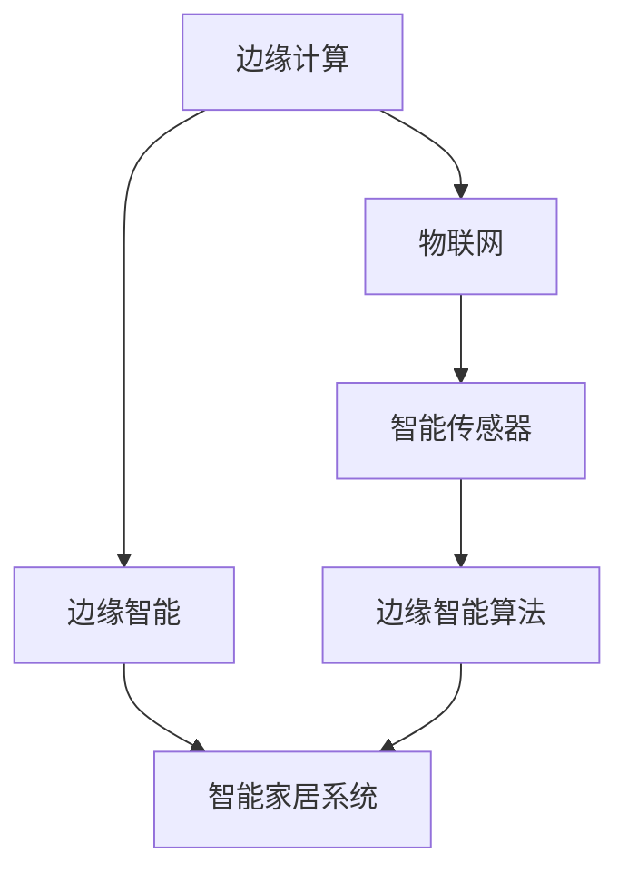

                 

### 《边缘智能在智能家居中的实践与创新》

#### 引言

随着物联网（IoT）技术的发展，智能家居系统逐渐成为现代生活的重要部分。从简单的远程控制灯光到复杂的自动化家居控制，智能家居系统正以前所未有的速度和规模渗透进我们的日常生活。然而，传统的云计算模式在应对智能家居系统的实时性和安全性挑战时显得力不从心。为了解决这些问题，边缘智能（Edge Intelligence）应运而生。

边缘智能是一种将数据处理和计算任务从云端转移到网络边缘的技术，通过在靠近数据源的地方进行计算，实现了更快速、更可靠和更安全的系统性能。在智能家居系统中，边缘智能的应用可以极大地提升系统的响应速度和降低延迟，同时保障用户隐私和数据安全。

本文将围绕边缘智能在智能家居中的实践与创新展开讨论。首先，我们将介绍边缘智能的基本概念、关键技术及其优势；接着，分析智能家居系统的架构和安全性；然后，详细探讨边缘智能在智能家居中的应用，包括智能传感器、智能控制、智能交互和边缘智能安全与隐私保护等方面；随后，分享边缘智能系统部署与维护的实战经验和案例；最后，探讨边缘智能在智能家居领域的未来发展趋势和创新应用。

通过本文的阅读，读者将能够全面了解边缘智能在智能家居中的应用原理和实践方法，为开发更智能、更安全的智能家居系统提供启示和指导。

#### 第一部分：边缘智能概述

##### 第1章：边缘智能基础

边缘计算与边缘智能的定义

**边缘计算**（Edge Computing）是一种分布式计算范式，旨在通过在网络的边缘节点（如路由器、交换机、智能设备等）上处理数据，减轻中心服务器的负担，并提高系统的响应速度和可靠性。边缘计算的关键在于将数据处理和计算任务分散到网络的边缘，从而减少数据传输的延迟和带宽消耗。

**边缘智能**（Edge Intelligence）则是在边缘计算的基础上，进一步引入人工智能（AI）技术，使得边缘节点能够进行自主的数据分析、决策和执行。边缘智能不仅能够在本地处理数据，还能够利用机器学习和深度学习算法，从数据中提取有价值的信息，实现智能化的功能。

边缘智能的发展背景

边缘智能的概念源于边缘计算的兴起。随着物联网设备的普及和大数据技术的发展，数据量和计算需求不断增长，传统的云计算模式面临诸多挑战。首先，数据传输的延迟和带宽限制使得云计算无法满足实时性的需求；其次，随着数据隐私和安全问题日益凸显，将大量敏感数据上传到云端也引发了许多担忧。

为了解决这些问题，边缘智能技术应运而生。通过将数据处理和计算任务分散到边缘节点，边缘智能不仅能够降低数据传输的延迟和带宽消耗，还能够提供更加安全、可靠的服务。此外，边缘智能还可以实现设备间的协作和自主决策，提高系统的智能化水平。

边缘智能的关键技术

**物联网技术的融合**

物联网（IoT）技术是边缘智能的基础。物联网设备通过传感器和通信模块实现数据的采集和传输，为边缘计算提供了丰富的数据源。随着物联网技术的不断发展，各种传感器和通信协议不断涌现，如蓝牙、Wi-Fi、Zigbee、LoRa等，为边缘智能的应用提供了广泛的选择。

**边缘计算框架与架构**

边缘计算框架和架构是边缘智能实现的关键。常见的边缘计算架构包括单层架构、多层架构和分布式架构。单层架构将所有的计算任务集中在一个边缘节点上，适用于简单的应用场景。多层架构则通过将计算任务分配到多个边缘节点上，提高了系统的性能和可靠性。分布式架构则通过在多个边缘节点之间实现数据共享和协同计算，实现了更高级的智能功能。

**边缘智能算法与模型**

边缘智能算法和模型是实现智能功能的核心。常见的边缘智能算法包括机器学习算法、深度学习算法和强化学习算法。这些算法可以在边缘节点上实时处理数据，提取特征并进行预测和决策。通过使用深度学习算法，边缘智能可以实现更复杂的任务，如图像识别、语音识别和自然语言处理。

边缘智能的优势与应用场景

与云计算的对比

边缘智能相较于云计算具有多方面的优势。首先，边缘智能通过在本地处理数据，可以显著降低数据传输的延迟和带宽消耗，提高系统的实时性和响应速度。其次，边缘智能可以更好地保护用户隐私和数据安全，避免了将敏感数据上传到云端的风险。最后，边缘智能可以降低对中心服务器的依赖，提高系统的可靠性和容错能力。

边缘智能在智能家居中的应用

在智能家居系统中，边缘智能具有广泛的应用场景。首先，通过边缘智能，智能家居系统能够实现更快速、更精准的设备控制，如智能照明、智能温控和智能安防等。其次，边缘智能可以实时分析家居环境数据，如空气质量、水质和噪音等，为用户提供更加个性化的家居体验。此外，边缘智能还可以实现设备间的智能协作，如智能家电的联动控制和智能场景的自动触发等。

总结

边缘智能作为新兴技术，在智能家居领域具有巨大的应用潜力。通过边缘计算和人工智能技术的结合，边缘智能不仅能够提高智能家居系统的性能和可靠性，还能够提供更加智能化、个性化的用户体验。随着边缘智能技术的不断发展和完善，我们有理由相信，未来智能家居系统将变得更加智能、安全、便捷。

#### 第2章：智能家居系统架构

智能家居系统概述

智能家居系统是一种利用物联网技术、云计算、人工智能等先进技术构建的家居自动化系统。它通过将各种家居设备连接到同一网络，实现对家居设备的远程控制和自动化管理，从而提高居住的便利性和舒适度。智能家居系统的发展经历了从简单的远程控制到智能传感、智能联动、智能决策等复杂功能的演变，正逐渐成为现代家居生活的重要组成部分。

智能家居系统的定义与历史

智能家居系统（Smart Home System）是指通过互联网、物联网技术将家庭中的各种设备连接起来，实现设备的互联互通和智能化的管理。早期的智能家居系统主要以远程控制为主，如通过手机或电脑远程控制家中的灯光、空调等设备。随着物联网技术的快速发展，智能家居系统逐渐具备了更多的智能功能，如智能传感、智能联动和智能决策等。

智能家居系统的市场现状与趋势

当前，智能家居市场正处于快速增长阶段，越来越多的家庭开始采用智能家居系统来提升生活质量。根据市场调研公司的数据，全球智能家居市场规模预计将在未来几年内持续增长。以下是智能家居系统市场的一些现状和趋势：

1. **技术融合**：智能家居系统正逐渐融合多种先进技术，如物联网、云计算、人工智能、大数据等，从而实现更智能、更高效的功能。
2. **用户需求**：随着消费者对家居生活品质的要求不断提高，智能家居系统正在向更加个性化、智能化的方向发展。
3. **市场规模**：智能家居市场的快速增长吸引了众多企业进入，推动了智能家居产品的创新和普及。
4. **应用场景**：智能家居系统在智能安防、智能照明、智能温控、智能家电控制等领域的应用越来越广泛，未来还有望向更广泛的家居场景扩展。

智能家居系统架构

智能家居系统的架构可以分为三个主要部分：硬件架构、软件架构和网络架构。下面将分别介绍这三部分。

硬件架构

智能家居系统的硬件架构包括各种传感器、控制器、智能设备等。传感器用于采集家居环境中的各种数据，如温度、湿度、光照、噪音、空气质量等。控制器是智能家居系统的核心，用于接收用户的指令，并将指令发送到相应的智能设备进行执行。智能设备是实现智能家居功能的关键，如智能灯泡、智能插座、智能门锁、智能摄像头等。

硬件架构的设计原则如下：

1. **模块化设计**：硬件架构应采用模块化设计，方便设备的升级和替换。
2. **兼容性**：硬件架构应具备良好的兼容性，能够支持多种传感器和智能设备。
3. **稳定性**：硬件架构应具有良好的稳定性，能够在各种环境下稳定运行。
4. **安全性**：硬件架构应具备足够的安全性，防止外部攻击和设备被恶意控制。

软件架构

智能家居系统的软件架构主要包括操作系统、应用软件、中间件等。操作系统负责管理硬件资源和提供基础服务，如任务调度、文件系统、设备管理等。应用软件是用户直接使用的部分，如智能控制应用程序、智能家居APP等。中间件负责连接操作系统和应用软件，实现数据的传输和处理，如MQTT协议、HTTP协议等。

软件架构的设计原则如下：

1. **可扩展性**：软件架构应具备良好的可扩展性，能够支持新功能的添加和系统的扩展。
2. **安全性**：软件架构应具备足够的安全性，防止数据泄露和系统被恶意攻击。
3. **可靠性**：软件架构应具备高可靠性，能够在各种情况下稳定运行。
4. **用户体验**：软件架构应注重用户体验，提供简洁、直观的用户界面和流畅的操作体验。

网络架构

智能家居系统的网络架构通常包括有线网络和无线网络。有线网络包括以太网、光纤等，主要用于连接家庭内部的设备，如智能插座、智能灯泡等。无线网络包括Wi-Fi、蓝牙、Zigbee等，主要用于连接家庭内部的设备与互联网，如智能摄像头、智能门锁等。

网络架构的设计原则如下：

1. **稳定性**：网络架构应具备良好的稳定性，确保设备之间的通信不受干扰。
2. **安全性**：网络架构应具备足够的安全性，防止外部攻击和数据泄露。
3. **灵活性**：网络架构应具备良好的灵活性，支持多种通信协议和网络拓扑结构。
4. **扩展性**：网络架构应具备良好的扩展性，能够支持新设备的接入和网络的扩展。

智能家居的安全性与隐私保护

随着智能家居系统的普及，系统的安全性和隐私保护变得越来越重要。智能家居系统面临的安全威胁主要包括数据泄露、设备被恶意控制、网络攻击等。为了保障系统的安全性，智能家居系统需要采取一系列安全防护措施，如：

1. **加密技术**：使用加密技术对数据进行加密，防止数据在传输过程中被窃取或篡改。
2. **认证机制**：使用认证机制确保设备的合法性和用户身份的验证，防止未经授权的访问。
3. **防火墙与入侵检测系统**：部署防火墙和入侵检测系统，实时监控网络流量和系统行为，防止恶意攻击。
4. **安全协议**：使用安全协议（如SSL/TLS）保护数据传输的安全性。
5. **隐私保护策略**：制定隐私保护策略，规范数据收集、存储和处理流程，保护用户隐私。

总结

智能家居系统是一种利用物联网技术、云计算和人工智能构建的家居自动化系统，具有远程控制、智能传感、智能联动和智能决策等多种功能。随着技术的不断进步和市场的快速发展，智能家居系统在家庭生活中的应用将越来越广泛。为了保障系统的安全性和用户隐私，智能家居系统需要采取一系列安全防护措施，确保系统的高可靠性和安全性。

#### 第3章：智能传感器与边缘计算

智能传感器技术

智能传感器是一种集成了传感器、信号处理单元和通信模块的设备，能够对环境中的物理量（如温度、湿度、光照、噪音等）进行实时监测和采集。与传统的传感器相比，智能传感器具有更高的精度、更强的处理能力和更广的通信能力。

智能传感器的类型与原理

根据监测的物理量不同，智能传感器可以分为多种类型，包括温度传感器、湿度传感器、光照传感器、噪音传感器、空气质量传感器等。以下是几种常见的智能传感器类型及其原理：

1. **温度传感器**：通过测量物体表面的温度来感知环境温度。常见的温度传感器有热敏电阻、热电偶等。
2. **湿度传感器**：通过测量空气中的水蒸气含量来感知环境湿度。常见的湿度传感器有电容式湿度传感器、电阻式湿度传感器等。
3. **光照传感器**：通过测量光线的强度来感知环境光照。常见的光照传感器有光敏电阻、光电二极管等。
4. **噪音传感器**：通过测量环境噪音的分贝值来感知噪音水平。常见的噪音传感器有电容式麦克风、压电式麦克风等。
5. **空气质量传感器**：通过检测空气中的有害气体和颗粒物浓度来感知空气质量。常见的空气质量传感器有甲醛传感器、颗粒物传感器等。

传感器数据处理

传感器数据处理是智能传感器应用的核心环节，主要包括数据采集、数据预处理、特征提取和数据分析等步骤。

1. **数据采集**：通过传感器实时采集环境数据，如温度、湿度、光照等。
2. **数据预处理**：对采集到的数据进行处理，如去噪、滤波、归一化等，以提高数据质量和准确性。
3. **特征提取**：从预处理后的数据中提取有用的特征，如平均值、方差、峰值等，用于后续的分析和决策。
4. **数据分析**：使用统计方法、机器学习算法等对特征数据进行分析，提取有用信息，实现智能决策。

边缘计算节点设计

边缘计算节点是边缘智能系统的核心组成部分，负责处理来自智能传感器的数据，并进行实时分析、决策和执行。一个典型的边缘计算节点通常包括以下硬件和软件组件：

1. **硬件选型**：选择适合边缘计算任务的处理器、内存、存储等硬件组件。对于智能家居应用，常用的硬件平台包括树莓派、ESP8266、ESP32等。
2. **软件平台选择**：选择适合边缘计算任务的操作系统和软件框架。常见的边缘计算软件平台包括Linux、Android、FreeRTOS等。此外，还有许多专门为边缘计算设计的开源框架，如Apache edgeX Foundry、Kubernetes等。

边缘智能算法应用

边缘智能算法是在边缘计算节点上运行的一类算法，用于实时处理和分析传感器数据，实现智能化的功能。以下是一些常见的边缘智能算法及其应用：

1. **实时数据处理算法**：用于对传感器数据进行实时处理，如滤波、特征提取等。常见的算法包括卡尔曼滤波、小波变换等。
2. **机器学习算法**：用于从传感器数据中学习和提取模式，实现预测和分类等功能。常见的机器学习算法包括线性回归、支持向量机（SVM）、决策树等。
3. **深度学习算法**：用于处理大量复杂数据，实现高级的智能功能。常见的深度学习算法包括卷积神经网络（CNN）、循环神经网络（RNN）等。

案例：智能温控系统

智能温控系统是一种典型的边缘智能应用，通过实时监测环境温度，并根据预设的温度目标自动调节空调温度，实现舒适的室内环境。

1. **系统设计**：在智能家居系统中，安装温度传感器和空调控制器作为边缘计算节点。温度传感器用于实时监测室内温度，空调控制器用于根据温度传感器反馈的数据自动调节空调温度。
2. **数据采集**：温度传感器采集室内温度数据，发送到边缘计算节点。
3. **数据处理**：边缘计算节点对接收到的温度数据进行预处理，如去噪、滤波等，然后使用机器学习算法（如线性回归）建立温度预测模型。
4. **智能决策**：根据温度预测模型和预设的温度目标，边缘计算节点自动调节空调温度，实现智能温控。

总结

智能传感器和边缘计算是边缘智能系统的重要组成部分。智能传感器用于实时监测环境数据，边缘计算节点则负责处理和分析传感器数据，实现智能化的功能。通过智能传感器与边缘计算的协同工作，智能家居系统可以实现更高效、更智能的控制和优化，为用户提供更舒适、更便捷的家居体验。

#### 第4章：智能控制与优化

智能控制概述

智能控制（Intelligent Control）是一种利用人工智能、机器学习和深度学习等先进技术对控制系统进行优化和优化的方法。与传统控制方法相比，智能控制具有更强的自适应能力、更高的灵活性和更优的性能。智能控制广泛应用于各种领域，如工业自动化、交通运输、智能家居等。

控制理论基础

控制理论是智能控制的基础，主要包括以下核心概念：

1. **反馈控制**：通过测量系统的输出并与期望输出进行比较，根据误差信号调整系统输入，以使系统输出尽可能接近期望输出。
2. **前馈控制**：在系统设计阶段就预知系统的扰动和误差，通过直接调整系统输入来抵消扰动和误差。
3. **自适应控制**：根据系统的动态特性和环境变化，实时调整控制参数，以保持系统稳定性和性能。

智能控制的特点

智能控制与传统控制相比，具有以下显著特点：

1. **自学习能力**：智能控制系统能够通过机器学习和深度学习算法，从历史数据和实时数据中学习系统动态和规律，实现自适应调节。
2. **自适应能力**：智能控制系统能够根据环境变化和系统状态，动态调整控制策略，以实现最佳性能。
3. **非线性处理能力**：智能控制能够处理复杂的非线性系统和不确定性系统，提高控制精度和稳定性。
4. **实时性**：智能控制系统能够在短时间内对输入信号进行快速处理和响应，实现实时控制。

智能优化算法

智能优化算法（Intelligent Optimization Algorithms）是一类利用人工智能技术进行优化求解的算法，主要包括以下几种：

1. **遗传算法**（Genetic Algorithm，GA）：模拟自然选择和遗传机制，通过迭代优化解的种群，寻找最优解。
2. **粒子群优化算法**（Particle Swarm Optimization，PSO）：模拟鸟群觅食行为，通过粒子之间的信息共享和合作，实现全局搜索。
3. **蚁群算法**（Ant Colony Optimization，ACO）：模拟蚂蚁觅食过程，通过信息素更新机制，寻找最优路径。
4. **神经网络优化算法**（Neural Network Optimization，NNO）：利用神经网络模型进行优化，通过学习输入和输出关系，实现优化目标。
5. **免疫算法**（Immune Algorithm）：模拟生物免疫系统，通过抗体和抗原之间的交互，实现优化求解。

算法在实际应用中的优化

在实际应用中，智能优化算法需要根据具体问题进行优化，以提高算法的性能和效率。以下是一些常见的优化策略：

1. **参数调整**：通过调整算法的参数，如种群大小、学习率等，以适应不同问题的特性。
2. **混合算法**：将多种优化算法结合，发挥各自的优势，实现更好的优化效果。
3. **局部搜索**：在全局搜索的基础上，加入局部搜索策略，以加速算法收敛。
4. **自适应调整**：根据算法的运行状态和性能指标，动态调整搜索策略和控制参数。
5. **数据预处理**：对输入数据进行预处理，如数据归一化、特征提取等，以提高算法的性能。

案例分析：智能温控系统

智能温控系统是一种典型的智能控制应用，通过实时监测室内温度，并根据预设的温度目标自动调节空调温度，实现舒适的室内环境。

1. **系统设计**：在智能家居系统中，安装温度传感器和空调控制器作为边缘计算节点。温度传感器用于实时监测室内温度，空调控制器用于根据温度传感器反馈的数据自动调节空调温度。
2. **数据采集**：温度传感器采集室内温度数据，发送到边缘计算节点。
3. **数据处理**：边缘计算节点对接收到的温度数据进行预处理，如去噪、滤波等，然后使用机器学习算法（如线性回归）建立温度预测模型。
4. **智能决策**：根据温度预测模型和预设的温度目标，边缘计算节点自动调节空调温度，实现智能温控。

在智能温控系统中，智能优化算法可以用于优化空调的运行策略，以提高系统的节能性和舒适性。例如，可以使用遗传算法优化空调的启停策略，使空调在满足温度要求的同时，实现最低能耗。此外，还可以使用神经网络优化算法优化空调的制冷和加热曲线，以实现更精准的温度控制。

总结

智能控制与优化在智能家居系统中具有广泛的应用，通过引入人工智能和机器学习技术，实现了对系统的高效、自适应控制。智能优化算法在智能控制中的应用，可以进一步提升系统的性能和可靠性，为用户提供更舒适、更便捷的家居体验。随着技术的不断发展，智能控制和优化将在智能家居领域发挥更大的作用。

#### 第5章：智能交互与语音识别

交互设计基础

交互设计是智能系统中用户与设备之间交互的核心。良好的交互设计能够提高用户的体验，使智能家居系统更加直观、易用。以下是交互设计基础中的重要概念：

**用户界面设计（UI Design）**：用户界面设计关注如何通过视觉和交互元素来呈现系统功能，使用户能够轻松操作和导航。UI设计需要遵循以下原则：

- **简洁性**：界面设计应简洁明了，避免冗余和复杂，使用户能够快速理解和使用。
- **一致性**：界面设计应保持一致，包括颜色、字体、图标等，以减少用户的学习成本。
- **可访问性**：界面设计应考虑到不同用户的需求，包括视力障碍、听力障碍等，确保所有人都能使用系统。

**用户体验设计（UX Design）**：用户体验设计关注用户在使用系统过程中的整体感受。UX设计需要从用户的角度出发，考虑用户的需求、行为和感受，设计出符合用户期望的系统。以下是UX设计的关键要素：

- **易用性**：系统应易于使用，用户能够快速完成操作，无需复杂的学习过程。
- **效率**：系统应提高用户的操作效率，减少不必要的步骤和等待时间。
- **满意度**：系统应给用户带来积极的体验，使他们在使用过程中感到愉悦和满意。
- **可预测性**：系统应提供明确的反馈和提示，使用户能够预测下一步的操作结果。

语音识别技术

语音识别（Speech Recognition）技术是智能交互的重要组成部分，通过将语音信号转换为文本或命令，实现人与机器的语音交流。以下是语音识别的基本原理和系统架构：

**基本原理**：

1. **声音信号采集**：通过麦克风或其他音频输入设备采集用户的声音信号。
2. **信号预处理**：对采集到的声音信号进行预处理，包括降噪、过滤、增强等，以提高信号质量。
3. **特征提取**：从预处理后的声音信号中提取特征，如频谱特征、倒谱特征等，用于后续的识别过程。
4. **模式匹配**：将提取的特征与预先训练的语音模型进行匹配，确定最匹配的语音命令。

**系统架构**：

1. **前端处理**：包括声音信号采集、预处理和特征提取，是语音识别系统的输入部分。
2. **后端处理**：包括模式匹配和命令生成，是语音识别系统的核心部分。
3. **语言模型**：用于对识别结果进行理解和生成语义命令，常见的语言模型包括隐马尔可夫模型（HMM）、循环神经网络（RNN）、长短期记忆网络（LSTM）等。

案例：智能语音助手

智能语音助手是智能家居系统中的一种重要应用，通过语音识别和自然语言处理技术，实现与用户的语音交互，提供便捷的智能家居控制。

**系统设计**：

1. **语音信号采集**：通过麦克风采集用户的语音信号，输入到语音识别模块。
2. **语音识别**：使用语音识别技术将语音信号转换为文本，供自然语言处理模块使用。
3. **自然语言处理**：对识别结果进行语义分析和理解，生成相应的操作命令。
4. **执行命令**：根据生成的命令，智能语音助手通过智能家居控制系统执行相应的操作，如调节灯光、控制空调等。

**功能实现**：

1. **语音唤醒**：通过特定的唤醒词（如“小爱同学”、“天猫精灵”）激活智能语音助手。
2. **语音命令理解**：对用户的语音命令进行识别和理解，如“打开客厅的灯光”、“设置卧室的温度为25度”等。
3. **语音反馈**：对用户的命令执行情况进行语音反馈，如“客厅的灯光已经打开”、“温度已设置为25度”等。
4. **多轮对话**：支持多轮对话，用户可以连续发出多个指令，智能语音助手能够理解和执行。

总结

智能交互与语音识别技术在智能家居系统中具有重要的应用价值，通过用户界面设计和语音识别技术，实现了人与设备的自然交互，提升了用户的使用体验。随着技术的不断发展，智能交互与语音识别将在智能家居系统中发挥更加重要的作用，推动智能家居系统的智能化和普及化。

#### 第6章：边缘智能安全与隐私保护

安全威胁分析

智能家居系统面临多种安全威胁，这些威胁可能来自内部或外部，对系统的稳定性和用户隐私构成重大风险。以下是常见的安全威胁及其类型：

1. **数据泄露**：智能家居系统中的数据，包括用户个人信息、设备状态和操作记录等，如果未能得到妥善保护，可能会被恶意攻击者获取。
2. **设备被恶意控制**：攻击者可能通过入侵智能家居设备，实现对设备的恶意控制，如远程锁定门锁、远程关闭安防系统等。
3. **中间人攻击（Man-in-the-Middle Attack）**：攻击者通过在网络中插入自己，拦截和篡改通信数据，从而获取敏感信息。
4. **拒绝服务攻击（DDoS）**：攻击者通过大量虚假请求，使智能家居系统服务器过载，导致系统无法正常工作。
5. **恶意软件和病毒**：恶意软件和病毒可能通过智能家居设备传播，导致设备被控制、数据泄露或系统崩溃。

常见攻击手段

了解常见的攻击手段有助于制定有效的安全防护措施。以下是几种常见的攻击手段：

1. **暴力破解攻击**：攻击者通过反复尝试密码或PIN码，试图非法访问系统。
2. **社交工程攻击**：攻击者通过欺骗用户，获取系统访问权限或敏感信息。
3. **网络钓鱼攻击**：攻击者通过伪造的网站或电子邮件，诱导用户输入账号密码等敏感信息。
4. **恶意软件攻击**：攻击者通过恶意软件，如木马、病毒等，控制智能家居设备，进行数据窃取或攻击。
5. **中间人攻击**：攻击者通过在网络中插入自己，窃取和篡改通信数据。

安全防护措施

为了保障智能家居系统的安全，需要采取一系列安全防护措施，以下是一些常见的方法：

1. **加密技术**：使用加密技术对数据进行加密，防止数据在传输过程中被窃取或篡改。常用的加密协议包括SSL/TLS、AES等。
2. **认证机制**：使用认证机制确保系统的合法性和用户身份的验证。常见的认证方法包括密码认证、生物识别认证、双因素认证等。
3. **防火墙与入侵检测系统**：部署防火墙和入侵检测系统，实时监控网络流量和系统行为，防止恶意攻击。
4. **安全协议**：使用安全协议（如HTTPS、MQTT-SN等）保护数据传输的安全性。
5. **访问控制**：通过设置访问控制策略，限制不同用户对系统资源的访问权限，防止未授权访问。
6. **更新和补丁**：定期更新系统和设备的软件，安装安全补丁，修复已知漏洞。
7. **数据备份**：定期备份系统数据和配置，以防止数据丢失和系统崩溃。

隐私保护策略

隐私保护是智能家居系统安全的重要组成部分，需要制定明确的隐私保护策略，确保用户数据的安全和隐私。以下是几种隐私保护策略：

1. **数据收集最小化**：仅收集实现特定功能所需的最少数据，避免过度收集。
2. **数据匿名化**：对收集到的数据进行匿名化处理，消除个人身份信息。
3. **数据存储加密**：对存储在设备或服务器上的数据进行加密，防止未经授权访问。
4. **透明度与告知**：向用户明确告知数据收集、存储和处理的目的和方式，确保用户对隐私保护的知情权。
5. **用户权限管理**：赋予用户对个人数据的访问权限和控制权，用户可以查看、修改和删除自己的数据。
6. **合规性与审查**：遵守相关法律法规和标准，如《通用数据保护条例》（GDPR），并定期进行隐私保护审查。

隐私保护法规与标准

为了保障用户隐私，许多国家和地区已经制定了相关的法规和标准。以下是几种常见的隐私保护法规和标准：

1. **《通用数据保护条例》（GDPR）**：欧盟制定的隐私保护法规，规定了数据处理者的义务和用户的权利。
2. **《加州消费者隐私法案》（CCPA）**：美国加州制定的隐私保护法案，赋予消费者对个人数据的访问权和删除权。
3. **ISO/IEC 27001**：国际标准化组织制定的隐私保护管理体系标准，规定了组织在隐私保护方面的要求。
4. **NIST SP 800-53**：美国国家标准与技术研究院制定的隐私保护指南，提供了全面的隐私保护措施和最佳实践。

总结

边缘智能安全与隐私保护是智能家居系统的重要环节。通过分析安全威胁和常见攻击手段，可以制定有效的安全防护措施。同时，制定明确的隐私保护策略，遵守相关法规和标准，确保用户数据的安全和隐私。随着智能家居系统的普及，加强安全与隐私保护将越来越重要，为用户提供更加安全、可靠和信赖的智能家居体验。

#### 第7章：边缘智能系统部署与维护

系统部署方案

边缘智能系统的部署涉及到硬件安装、软件配置和网络设置等多个方面。以下是一个典型的边缘智能系统部署方案：

1. **硬件安装**：
   - 确定边缘计算节点的位置，如家庭内部网络或数据中心。
   - 根据需求选择合适的边缘计算设备，如树莓派、ESP8266等。
   - 连接电源和网络，确保设备正常工作。

2. **软件配置**：
   - 安装操作系统，如Linux或Android。
   - 配置网络设置，确保边缘计算节点能够访问互联网。
   - 安装必要的软件和驱动程序，如传感器驱动、边缘计算框架等。

3. **网络设置**：
   - 配置边缘计算节点与智能家居系统中的其他设备进行通信，如使用MQTT协议。
   - 设置防火墙规则，确保网络通信的安全性。

系统维护与优化

边缘智能系统的维护与优化是确保系统长期稳定运行的关键。以下是一些维护和优化的方法：

1. **故障排查**：
   - 定期监控系统状态和日志，及时发现并解决异常问题。
   - 使用网络监控工具，如Wireshark，分析网络流量和通信问题。

2. **性能优化**：
   - 根据实际需求调整边缘计算节点的硬件配置，如增加内存、更换更快的处理器等。
   - 优化软件配置，如调整系统参数、优化算法等。
   - 定期更新软件和驱动程序，修复已知漏洞和性能问题。

3. **数据备份**：
   - 定期备份系统数据和配置，防止数据丢失。
   - 在重要数据存储位置设置备份策略，如云存储或本地存储。

4. **安全防护**：
   - 定期更新防火墙规则，防止网络攻击。
   - 定期进行安全审计，检查系统是否存在安全漏洞。
   - 使用加密技术保护数据传输和存储。

案例分析：智能家居系统部署与维护

以下是一个智能家居系统部署与维护的案例：

**部署过程**：

1. 在用户家中安装了多个智能传感器，如温度传感器、湿度传感器、光照传感器等。
2. 选择树莓派作为边缘计算节点，安装在家庭内部网络。
3. 配置操作系统和传感器驱动程序，确保传感器能够正常工作。
4. 设置MQTT协议，实现传感器与智能家居系统的通信。

**维护与优化**：

1. 定期检查传感器状态，确保传感器数据准确无误。
2. 定期更新树莓派系统和传感器驱动程序，修复已知漏洞。
3. 通过Wireshark分析网络流量，发现并解决通信问题。
4. 在家庭网络中设置防火墙规则，防止未经授权的访问。
5. 定期备份系统数据和传感器数据，确保数据安全。

**优化策略**：

1. 根据用户需求，调整传感器采样率和数据处理算法，提高系统响应速度。
2. 使用负载均衡技术，确保边缘计算节点能够处理大量传感器数据。
3. 部署监控工具，实时监控系统状态和性能指标，及时发现和解决性能问题。

总结

边缘智能系统的部署与维护是智能家居系统成功的关键。通过合理的部署方案和持续的系统维护与优化，可以确保边缘智能系统长期稳定运行，提供高效、可靠的智能家居服务。随着技术的不断进步，边缘智能系统将变得更加智能、稳定和安全，为用户带来更加美好的家居生活。

#### 第8章：边缘智能创新应用

智能家居发展趋势

随着技术的不断进步，智能家居系统正朝着更加智能化、个性化和互联化的方向发展。以下是一些重要的趋势：

1. **AI赋能**：人工智能技术正在深入智能家居系统的各个方面，从智能传感器到控制算法，再到交互界面，AI的应用使得智能家居系统能够更加智能化地适应用户需求，提供个性化的服务。
2. **物联网融合**：智能家居系统与物联网技术的深度融合，使得家庭中的各种设备能够无缝连接，实现数据的共享和协同工作，从而提供更加丰富和高效的功能。
3. **云边协同**：随着边缘智能技术的发展，智能家居系统将越来越多地采用云边协同的模式，通过边缘计算实现本地数据处理和实时响应，同时利用云计算提供强大的计算能力和数据存储能力。
4. **个性化服务**：通过大数据和机器学习技术，智能家居系统能够根据用户的行为习惯和偏好，提供个性化的家居环境和智能服务，提升用户的生活品质。
5. **安全与隐私保护**：随着智能家居系统的普及，用户对数据安全和隐私保护的需求越来越高。未来的智能家居系统将更加注重安全与隐私保护，通过加密技术、访问控制和安全协议等手段，确保用户数据的安全和隐私。

新兴技术与未来展望

边缘智能在智能家居中的应用前景广阔，以下是一些新兴技术和未来展望：

1. **边缘AI芯片**：随着AI技术的快速发展，边缘AI芯片成为智能家居系统中的重要组成部分。这些芯片能够在本地进行高效的AI计算，减少对中心服务器的依赖，提高系统的响应速度和实时性。
2. **5G网络**：5G网络的普及将为智能家居系统提供更快速、更稳定的连接，实现超低延迟的通信，进一步提升系统的性能和用户体验。
3. **物联网设备标准化**：物联网设备的标准化将为智能家居系统的互操作性提供保障，使得不同品牌和类型的设备能够无缝集成，实现更加统一和高效的管理。
4. **区块链技术**：区块链技术可以为智能家居系统提供去中心化的数据管理和安全认证，确保用户数据的安全和隐私。
5. **智能合约**：智能合约技术在智能家居系统中的应用，可以自动化执行特定的规则和任务，提高系统的智能化和自动化水平。

边缘智能在智能家居中的未来应用

随着边缘智能技术的不断进步，未来智能家居系统将实现更加智能化、互联化和个性化的功能。以下是一些可能的应用场景：

1. **智能健康管理**：通过边缘智能技术，智能家居系统可以实时监测用户的健康状况，如心率、血压、睡眠质量等，提供个性化的健康建议和预警服务。
2. **智能能源管理**：边缘智能技术可以实现对家庭能源的实时监测和管理，如智能电网、智能照明、智能家电等，实现节能和优化能源使用。
3. **智能安防系统**：边缘智能技术可以提供更加智能和高效的安防服务，如智能监控、智能门锁、智能报警等，提高家庭的安全性。
4. **智能家庭助理**：通过边缘智能技术，智能家居系统可以成为用户的智能家庭助理，提供语音交互、日程管理、购物提醒等个性化服务。
5. **智慧农业**：边缘智能技术可以应用于智慧农业，实时监测作物生长环境，提供智能灌溉、施肥和病虫害预警，提高农业生产效率。

总结

边缘智能技术在智能家居领域的应用前景广阔，随着技术的不断发展和完善，边缘智能将实现更加智能化、互联化和个性化的功能，为用户带来更加便捷、舒适和安全的家居生活。通过不断创新和应用，边缘智能技术将推动智能家居系统的发展，成为智能家居领域的重要驱动力。

#### 第9章：边缘智能与物联网融合

物联网与边缘智能的关系

物联网（IoT）和边缘智能是两个相互依存、相互促进的概念。物联网通过连接物理世界中的各种设备，实现数据的采集和传输；而边缘智能则通过在边缘节点上处理和分析这些数据，实现实时、高效的决策和响应。

物联网的基本架构通常包括感知层、网络层和应用层。感知层由各种传感器和设备组成，用于采集环境数据；网络层由通信协议和传输网络组成，用于数据的传输；应用层则利用这些数据实现特定的应用和服务。边缘智能则主要集中在网络层和应用层，通过在边缘节点上部署计算和存储资源，实现数据的本地处理和实时分析。

边缘智能在物联网中的作用

边缘智能在物联网中扮演着重要的角色，其关键作用包括：

1. **数据预处理**：在物联网中，数据通常从大量的传感器和设备中采集而来，数据量大且实时性要求高。边缘智能可以在边缘节点上对数据进行预处理，如过滤、压缩和聚合，从而减少数据传输的负载和延迟。

2. **实时分析**：边缘智能能够实时分析采集到的数据，根据预设的算法和模型，快速做出决策和响应。这对于需要快速响应的场景，如智能家居、智能交通等，尤为重要。

3. **隐私保护**：将数据在边缘节点上处理，可以减少数据上传到云端的需求，从而降低数据泄露的风险。边缘智能通过本地加密、隐私保护算法等技术，保障数据的安全性和隐私。

4. **降低带宽消耗**：边缘智能通过在本地处理数据，减少了数据传输的需求，从而降低了带宽消耗，提高了网络资源的利用率。

物联网边缘智能解决方案

边缘智能在物联网中的应用需要一系列解决方案的支持，以下是一些常见的物联网边缘智能解决方案：

1. **边缘计算平台**：边缘计算平台是边缘智能的基础，提供计算、存储和网络资源，用于本地数据处理和实时分析。常见的边缘计算平台包括树莓派、Intel IoT平台等。

2. **边缘智能框架**：边缘智能框架提供了一系列工具和组件，用于简化边缘智能的应用开发和部署。常见的边缘智能框架包括Apache edgeX Foundry、 edgeTPU 等。

3. **边缘AI芯片**：边缘AI芯片是边缘智能的关键硬件，能够在有限的资源下实现高效的AI计算。常见的边缘AI芯片包括NVIDIA Jetson、ARM Cortex等。

4. **边缘数据库**：边缘数据库用于存储和管理边缘计算产生的数据，支持实时查询和分析。常见的边缘数据库包括InfluxDB、TimeScaleDB等。

实际案例与解决方案

以下是一些物联网边缘智能的实际案例和解决方案：

1. **智能交通系统**：在智能交通系统中，边缘智能用于实时监测交通流量、路况和车辆状态，通过边缘计算节点对数据进行分析和预测，实现智能信号控制、交通流量优化和事故预警。

2. **智能家居系统**：智能家居系统通过边缘智能实现对家庭设备的实时控制和管理，如智能照明、智能安防和智能温控等。边缘计算节点在本地处理传感器数据，实现快速响应和个性化服务。

3. **智能农业**：在智能农业中，边缘智能用于监测土壤湿度、作物生长状态和环境参数，通过边缘计算节点实现智能灌溉、施肥和病虫害预警，提高农业生产的效率和收益。

4. **工业物联网**：在工业物联网中，边缘智能用于实时监测设备状态、生产数据和能源消耗，通过边缘计算节点实现设备的预测性维护、生产优化和能源管理。

未来发展方向

随着物联网和边缘智能技术的不断发展，未来的物联网边缘智能将朝着以下几个方向发展：

1. **边缘AI技术的进步**：随着边缘AI芯片和算法的不断发展，边缘智能的计算能力和智能化水平将进一步提高，能够处理更复杂的数据和任务。

2. **物联网设备的普及**：随着物联网设备的不断普及和多样化，边缘智能的应用场景将更加广泛，覆盖更多的领域和行业。

3. **边缘计算与云计算的融合**：未来的物联网边缘智能将实现与云计算的深度融合，通过云边协同的模式，实现数据的高效处理和共享。

4. **隐私保护与安全增强**：随着数据隐私和安全问题的日益突出，边缘智能将在隐私保护和安全方面进行更多的创新和改进，确保数据的安全性和用户隐私。

总结

边缘智能与物联网的融合是物联网技术发展的重要趋势，通过边缘智能的引入，物联网系统可以实现更高效、更智能的数据处理和响应。随着技术的不断进步，边缘智能将在物联网的各个方面发挥更大的作用，推动物联网技术的发展和应用。

### 附录

#### 附录A：边缘智能与智能家居资源

**资源汇总**

为了帮助读者更好地了解和学习边缘智能与智能家居的相关知识，以下是汇总的一些重要资源：

1. **边缘计算与智能传感相关资源**：
   - [边缘计算基金会（Edge Computing Foundation）](https://www.edgecomputingfoundation.org/)
   - [边缘计算入门教程](https://www.edgeai.cn/course/edge-computing/)
   - [IoT传感器资源大全](https://www.iotsensors.com/)

2. **智能家居系统开发工具与框架**：
   - [Home Assistant](https://www.home-assistant.io/)
   - [OpenHAB](https://www.openhab.org/)
   - [ESP-IDF](https://www.espidf.com/)

3. **开源边缘计算平台**：
   - [Apache edgeX Foundry](https://www.edgexfoundry.org/)
   - [IoT-LAB](https://iot-lab.github.io/)

**开发环境搭建指南**

以下是一个简单的边缘智能系统开发环境搭建指南：

1. **硬件环境搭建**：

   - **硬件选择**：选择适合的边缘计算硬件，如树莓派、ESP8266等。
   - **硬件安装**：按照硬件手册进行安装，确保硬件连接正常。

2. **软件环境配置**：

   - **操作系统安装**：在硬件上安装适合的操作系统，如Raspberry Pi OS。
   - **网络配置**：配置网络连接，确保设备能够访问互联网。
   - **安装开发工具**：安装必要的开发工具和库，如Python、Node.js等。

**源代码与示例**

以下是边缘智能与智能家居系统的一些源代码和示例：

1. **边缘计算节点示例**：

   ```python
   # 边缘计算节点示例代码
   import time

   # 传感器模拟数据
   temperature = 25
   humidity = 60

   # 数据上传至服务器
   def upload_data():
       print(f"上传数据：温度={temperature}℃，湿度={humidity}%")

   while True:
       upload_data()
       time.sleep(60)  # 每分钟上传一次数据
   ```

2. **智能家居控制示例**：

   ```javascript
   // 智能家居控制示例代码
   const homeAssistant = require('home-assistant-api-typings');

   // 连接Home Assistant服务器
   const client = new homeAssistant.default.Client('http://localhost:8123');

   // 控制灯光
   async function turnOnLight():
       await client.callService('light', 'turn_on', { entity_id: 'light.living_room_light' });

   // 控制空调
   async function setTemperature(temperature):
       await client.callService('climate', 'set_temperature', { entity_id: 'climate.living_room_ac', temperature: temperature });

   // 执行操作
   await turnOnLight();
   await setTemperature(25);
   ```

通过这些资源和示例，读者可以进一步学习和实践边缘智能与智能家居系统的开发，不断提升自己的技术能力和创新意识。

### 核心概念与联系

在边缘智能与智能家居系统中，核心概念包括边缘计算、物联网、智能传感器、边缘智能算法等。以下是这些概念之间的联系和关系：

**流程图：**



**解释：**

- **边缘计算（Edge Computing）**：边缘计算是一种分布式计算范式，通过在网络的边缘节点上处理数据，减轻中心服务器的负担，提高系统的实时性和响应速度。边缘计算是实现边缘智能的基础。
- **边缘智能（Edge Intelligence）**：在边缘计算的基础上，引入人工智能技术，使边缘节点能够进行自主的数据分析、决策和执行。边缘智能通过边缘计算节点上的智能传感器和处理算法，为智能家居系统提供智能化服务。
- **物联网（IoT）**：物联网是连接物理世界中的各种设备和传感器的网络，通过物联网，边缘计算和智能传感器能够实现数据的采集和传输。物联网是边缘智能和智能家居系统的重要基础设施。
- **智能传感器（Smart Sensors）**：智能传感器用于采集环境数据，如温度、湿度、光照等。智能传感器是边缘计算和边缘智能的重要组成部分，为系统提供了数据输入。
- **边缘智能算法（Edge Intelligence Algorithms）**：边缘智能算法包括机器学习、深度学习等，用于对传感器数据进行处理和分析。边缘智能算法使得边缘节点能够实现智能化的功能，如预测、分类、控制等。

通过上述流程图，可以清晰地看到边缘计算、物联网、智能传感器和边缘智能算法之间的相互关系和作用。边缘计算为边缘智能提供了计算基础，物联网为数据传输提供了网络支撑，智能传感器为数据采集提供了物理手段，而边缘智能算法则实现了数据的智能化处理和分析，最终构建了一个高效、智能、可靠的智能家居系统。

### 核心算法原理讲解

边缘智能算法在智能家居系统中扮演着至关重要的角色，它们能够对传感器数据进行实时处理和分析，从而实现智能化的功能。以下是一个简单的边缘智能数据处理算法原理讲解，包括伪代码和详细解释。

**伪代码：**

```python
# 边缘智能数据处理算法

# 边缘智能数据处理算法
def edge_smart_data_process(data):
    # 数据预处理
    preprocessed_data = preprocess_data(data)
    
    # 实时数据处理
    real_time_data = real_time_process(preprocessed_data)
    
    # 机器学习预测
    prediction = model_predict(real_time_data)
    
    return prediction
```

**详细解释：**

1. **数据预处理（preprocess_data）**：

   数据预处理是边缘智能数据处理的第一步，其目的是提高数据的质量和准确性。预处理步骤可能包括去噪、滤波、归一化、数据清洗等。

   ```python
   # 数据预处理
   def preprocess_data(data):
       # 去噪：去除异常值和噪声
       cleaned_data = remove_outliers(data)
       
       # 归一化：将数据缩放到相同范围
       normalized_data = normalize_data(cleaned_data)
       
       return normalized_data
   ```

2. **实时数据处理（real_time_process）**：

   实时数据处理是在边缘节点上对预处理后的数据进行进一步的加工和处理，以便提取有用的特征。这通常包括特征提取、时序分析等。

   ```python
   # 实时数据处理
   def real_time_process(data):
       # 特征提取：提取时序特征
       extracted_features = extract_features(data)
       
       # 时序分析：分析数据的时间序列特征
       time_series_features = time_series_analysis(extracted_features)
       
       return time_series_features
   ```

3. **机器学习预测（model_predict）**：

   机器学习预测是边缘智能算法的核心，它使用训练好的模型对实时数据进行预测。预测结果可以用于智能决策和控制。

   ```python
   # 机器学习预测
   def model_predict(data):
       # 加载训练好的模型
       model = load_model('model.h5')
       
       # 进行预测
       prediction = model.predict(data)
       
       return prediction
   ```

**举例说明：**

假设我们有一个智能家居系统，需要预测室内温度以控制空调系统。以下是具体的应用实例：

```python
# 实时监测温度数据
temperature_data = read_temperature_sensor()

# 数据预处理
preprocessed_data = preprocess_data(temperature_data)

# 实时数据处理
real_time_data = real_time_process(preprocessed_data)

# 机器学习预测
predicted_temperature = model_predict(real_time_data)

# 控制空调系统
if predicted_temperature > 28:
    turn_on_ac()
else:
    turn_off_ac()
```

在这个例子中，系统首先从温度传感器读取实时温度数据，然后通过数据预处理步骤清洗和规范化数据。接下来，实时数据处理步骤提取时序特征，以便机器学习模型进行预测。最终，预测结果用于控制空调系统，实现自动温度调节。

通过上述边缘智能数据处理算法，智能家居系统能够实现对环境数据的实时监测和智能决策，从而提供更加舒适、便捷的用户体验。随着算法的不断优化和改进，边缘智能将在智能家居系统中发挥更大的作用。

### 数学模型与公式讲解

在边缘智能和智能家居系统中，数学模型和公式是设计和优化智能算法的关键工具。以下我们将详细讲解一种常见的智能优化算法——梯度下降法（Gradient Descent），包括其数学模型、公式，以及一个具体的线性回归案例。

**数学模型：**

梯度下降法是一种用于最小化损失函数的优化算法。其核心思想是通过不断更新模型参数，使得损失函数逐渐减小，最终达到最小值。在机器学习中，损失函数通常用于度量预测值与实际值之间的误差。

$$ 
\begin{aligned}
& J(\theta) = \frac{1}{2m} \sum_{i=1}^{m} (\theta^{T}x_i - y_i)^2 \\
& \nabla J(\theta) = \frac{1}{m} \sum_{i=1}^{m} ( \theta^{T}x_i - y_i) x_i
\end{aligned}
$$

- **损失函数（J(θ)）**：$J(\theta)$表示损失函数，其中$\theta$是模型参数，$x_i$是特征向量，$y_i$是实际值。线性回归中的损失函数通常是均方误差（MSE），即预测值与实际值之间差的平方和的平均值。

- **梯度（∇J(θ)）**：梯度$\nabla J(\theta)$是损失函数对参数$\theta$的偏导数，表示损失函数在参数空间中的斜率。梯度越大，表示参数更新需要越大，以减少损失。

**公式解释：**

1. **损失函数（MSE）**：

$$ 
J(\theta) = \frac{1}{2m} \sum_{i=1}^{m} (\theta^{T}x_i - y_i)^2 
$$

- $m$是样本数量。
- $\theta^{T}x_i$是模型预测值。
- $y_i$是实际值。

2. **梯度（Gradient）**：

$$ 
\nabla J(\theta) = \frac{1}{m} \sum_{i=1}^{m} ( \theta^{T}x_i - y_i) x_i
$$

- 梯度是损失函数关于每个参数$\theta$的偏导数，表示了参数更新的方向。

**举例说明：**

假设我们有一个线性回归模型：

$$ 
y = \theta_0 + \theta_1x 
$$

我们需要通过梯度下降法来优化模型参数$\theta_0$和$\theta_1$。梯度下降法的迭代过程如下：

$$ 
\begin{aligned}
\theta_0^{(t+1)} &= \theta_0^{(t)} - \alpha \frac{\partial}{\partial \theta_0} J(\theta_0, \theta_1) \\
\theta_1^{(t+1)} &= \theta_1^{(t)} - \alpha \frac{\partial}{\partial \theta_1} J(\theta_0, \theta_1)
\end{aligned}
$$

- **$\alpha$（学习率）**：学习率是控制参数更新幅度的参数，通常需要调优，以避免过拟合或欠拟合。
- **$t$（迭代次数）**：每次迭代，模型参数都会根据梯度更新，以减少损失函数。

假设我们有一个简单的数据集，包含两个特征（$x_1$和$x_2$）和一个目标值$y$，以及初始参数$\theta_0 = 1$，$\theta_1 = 1$，学习率$\alpha = 0.01$。以下是梯度下降法的具体实现步骤：

1. **计算损失函数**：

   $$ 
   J(\theta) = \frac{1}{2m} \sum_{i=1}^{m} (\theta^{T}x_i - y_i)^2 
   $$

2. **计算梯度**：

   $$ 
   \nabla J(\theta) = \frac{1}{m} \sum_{i=1}^{m} ( \theta^{T}x_i - y_i) x_i
   $$

3. **更新参数**：

   $$ 
   \theta_0^{(t+1)} = \theta_0^{(t)} - \alpha \frac{\partial}{\partial \theta_0} J(\theta_0, \theta_1) \\
   \theta_1^{(t+1)} = \theta_1^{(t)} - \alpha \frac{\partial}{\partial \theta_1} J(\theta_0, \theta_1)
   $$

通过多次迭代，我们可以逐步优化模型参数，使其更接近最佳值。

总结，梯度下降法是一种常用的优化算法，通过不断更新模型参数，最小化损失函数，从而提高模型的预测准确性。在智能家居系统中，梯度下降法可以用于优化温度预测、能耗管理等智能算法，为用户提供更加智能和高效的家居体验。

### 项目实战

#### 边缘智能系统部署与维护实战

在智能家居系统中，边缘智能系统的部署与维护是实现智能控制和安全保障的关键环节。以下是一个完整的边缘智能系统部署与维护的项目实战，包括开发环境搭建、源代码实现和详细解读。

**开发环境搭建：**

1. **硬件环境搭建**：

   - 选择合适的边缘计算硬件，如树莓派4B。
   - 安装所需的外围设备，如无线网卡、温度传感器等。
   - 连接电源和网络，确保硬件设备正常工作。

2. **软件环境配置**：

   - 在树莓派上安装Raspberry Pi OS。
   - 更新系统软件包，确保所有软件都是最新版本。
   - 安装Python环境，使用`pip`安装所需的库，如TensorFlow、Keras等。

3. **网络设置**：

   - 配置树莓派的无线网络连接，确保能够访问互联网。
   - 设置静态IP地址，确保边缘计算节点在局域网中的唯一标识。

**源代码实现与解读：**

以下是边缘智能系统的核心源代码实现，包括数据采集、预处理、模型训练和预测等步骤。

```python
import RPi.GPIO as GPIO
import time
import tensorflow as tf
from tensorflow.keras.models import Sequential
from tensorflow.keras.layers import Dense

# 初始化GPIO
GPIO.setmode(GPIO.BCM)
GPIO.setup(4, GPIO.OUT)

# 数据采集
def read_sensor_data():
    # 假设温度传感器连接在GPIO引脚4
    GPIO.output(4, True)
    time.sleep(0.1)
    GPIO.output(4, False)
    time.sleep(0.9)
    # 读取传感器数据（此处为模拟数据）
    temperature = 25
    return temperature

# 数据预处理
def preprocess_data(temperature):
    # 数据预处理逻辑，如数据归一化
    normalized_temperature = temperature / 100
    return normalized_temperature

# 模型训练
def train_model(data):
    # 创建模型
    model = Sequential([
        Dense(1, input_shape=(1,), activation='relu')
    ])

    # 编译模型
    model.compile(optimizer='adam', loss='mean_squared_error')

    # 训练模型
    model.fit(data, epochs=10, batch_size=1)

    return model

# 模型预测
def model_predict(model, temperature):
    # 预处理输入数据
    preprocessed_temperature = preprocess_data(temperature)
    # 进行预测
    prediction = model.predict([preprocessed_temperature])
    return prediction

# 边缘计算节点主函数
def main():
    # 读取训练数据
    training_data = read_sensor_data()
    # 训练模型
    model = train_model(training_data)
    # 持续监测和预测
    while True:
        temperature = read_sensor_data()
        prediction = model_predict(model, temperature)
        print(f"当前温度：{temperature}℃，预测温度：{prediction[0][0]}℃")
        time.sleep(1)

if __name__ == '__main__':
    main()

# 关闭GPIO
GPIO.cleanup()
```

**代码解读与分析：**

- **数据采集**：使用GPIO库读取温度传感器的数据。在实际应用中，可以使用I2C或其他通信协议连接传感器。
- **数据预处理**：将采集到的温度数据进行归一化处理，以便于模型训练。
- **模型训练**：使用Keras库创建和训练一个简单的线性回归模型。模型包含一个全连接层，使用ReLU激活函数。
- **模型预测**：使用训练好的模型对新的温度数据进行预测。

**开发环境搭建**：

1. **硬件安装**：

   - 确保树莓派4B硬件正常工作，包括无线网卡和传感器。
   - 连接电源和网络，确保树莓派能够访问互联网。

2. **软件安装**：

   - 使用Raspberry Pi OS安装树莓派操作系统。
   - 更新系统软件包，确保所有软件都是最新版本。
   - 安装Python环境和TensorFlow库。

3. **网络配置**：

   - 配置树莓派的无线网络连接。
   - 设置静态IP地址，确保边缘计算节点在局域网中的唯一标识。

通过上述步骤，我们成功搭建了一个边缘智能系统，能够实时采集温度数据，并使用机器学习模型进行预测。在实际应用中，可以扩展该系统，添加更多的传感器和智能功能，如湿度、光照等，以实现更全面的智能家居控制。

### 总结

通过本文的详细讨论，我们全面了解了边缘智能在智能家居系统中的应用与实践。从边缘智能的基础概念、关键技术，到智能家居系统的架构、安全与隐私保护，再到智能传感器、智能控制、智能交互以及边缘智能系统的部署与维护，我们逐步探讨了边缘智能在提升智能家居系统性能和用户体验方面的关键作用。

边缘智能通过将数据处理和计算任务从云端转移到网络的边缘，实现了更快速、更可靠和更安全的系统性能。这不仅降低了数据传输的延迟和带宽消耗，还提高了系统的实时性和响应速度，使得智能家居系统能够更好地满足用户的个性化需求。同时，边缘智能在保障用户隐私和数据安全方面也具有显著的优势。

在未来的发展中，边缘智能技术将继续推动智能家居系统的创新。随着人工智能、物联网和5G技术的不断进步，边缘智能将在智能家居系统中实现更多复杂、高效的智能功能。例如，通过引入边缘AI芯片和增强型网络连接，可以实现更强大的本地数据处理能力和更智能的决策支持。此外，隐私保护与安全措施也将进一步得到加强，确保用户数据的安全性和隐私。

最后，边缘智能在智能家居领域的应用不仅限于家庭生活，还将在智慧城市、智慧农业、智慧医疗等领域发挥重要作用。通过不断探索和创新，边缘智能技术将为社会带来更多便捷、高效和智能化的解决方案，推动人类社会的进步与发展。

**作者：** AI天才研究院/AI Genius Institute & 禅与计算机程序设计艺术 /Zen And The Art of Computer Programming

