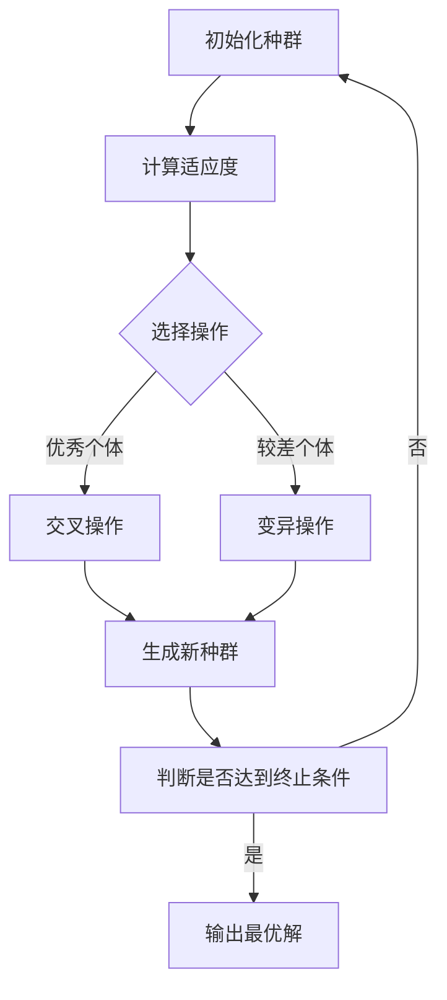
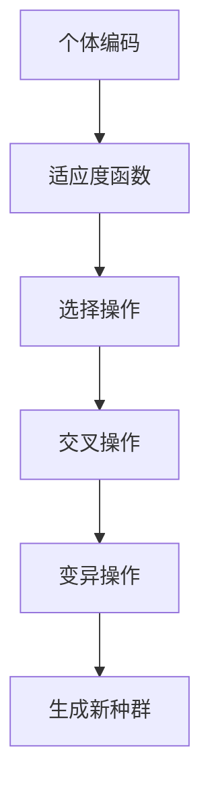
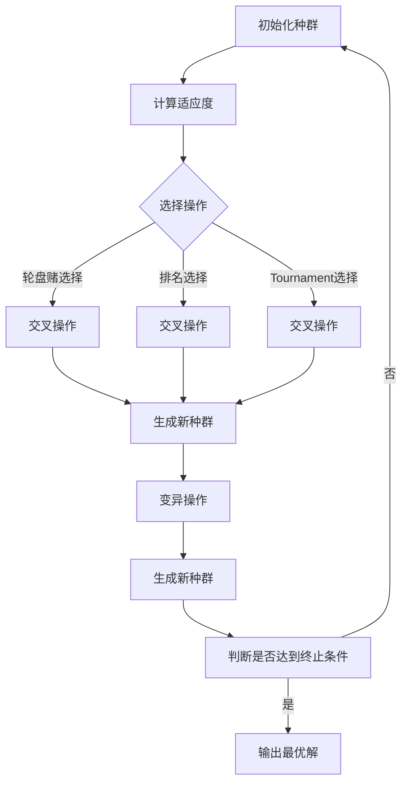

                 

**第一部分：遗传算法基础**

遗传算法（Genetic Algorithms，GA）是模拟自然选择和遗传机制的优化算法。它由美国计算机科学家John Holland在1975年首次提出。遗传算法是一种全局搜索算法，广泛应用于各种优化问题，包括组合优化、函数优化、机器学习等。

### 第1章：遗传算法概述

遗传算法的起源可以追溯到Charles Darwin的进化论和Gregor Mendel的遗传学。Holland受到生物进化的启发，将生物进化过程中的一些关键机制引入到算法中，如选择、交叉和变异。这些机制使得遗传算法能够在复杂搜索空间中找到最优解。

#### 1.1 遗传算法的起源与发展

- **1975年**：John Holland发表了关于遗传算法的第一篇论文，标志着遗传算法的诞生。
- **1980年代**：遗传算法开始应用于各种实际问题，如电路设计、机器人控制和人工智能等领域。
- **1990年代**：遗传算法在学术界的关注度不断提高，成为进化计算（Evolutionary Computation）的一个重要分支。
- **21世纪**：随着计算机技术的发展，遗传算法在工业、金融、医疗等领域得到广泛应用。

#### 1.2 遗传算法的基本概念

遗传算法主要包括以下几个基本概念：

- **个体（Individual）**：代表问题解的基本单位，通常用二进制字符串或实数数组表示。
- **种群（Population）**：由多个个体组成的集合，代表解空间的一个子集。
- **适应度函数（Fitness Function）**：用于评价个体优劣的函数，适应度值越高表示个体质量越好。
- **选择（Selection）**：根据个体适应度选择优秀个体作为父代的过程。
- **交叉（Crossover）**：模拟生物的有性生殖，生成新个体的过程。
- **变异（Mutation）**：模拟生物的无性生殖，增加个体多样性的过程。

#### 1.3 遗传算法的核心原理

遗传算法的核心原理基于以下生物进化原理：

- **自然选择**：适应度高的个体更有可能生存和繁衍后代，从而传递其遗传特征。
- **遗传**：后代继承了父代的遗传特征，同时具有一定的变异。
- **变异**：变异能够产生新的遗传特征，有助于种群适应环境变化。

### 第2章：遗传算法的基本架构

遗传算法的基本架构包括个体编码、适应度函数、选择操作、交叉操作和变异操作。以下将分别介绍这些基本组件及其实现方法。

#### 2.1 个体编码

个体编码是遗传算法实现的基础，它决定了个体在搜索空间中的表示方式。常见的个体编码方法包括二进制编码和实数编码。

- **二进制编码**：个体用二进制字符串表示，每个位表示问题解的一个特征。例如，对于0-1背包问题，可以采用二进制编码表示背包中物品的选择。
- **实数编码**：个体用实数数组表示，每个元素表示问题解的一个特征。实数编码适用于连续问题的优化。

#### 2.2 适应度函数

适应度函数是遗传算法的核心评价指标，用于评价个体的优劣。适应度函数的设计原则包括：

- **正确性**：适应度值应能正确反映个体优劣。
- **单调性**：适应度值应随个体质量的提高而增加。
- **简洁性**：适应度函数应尽量简洁，避免过复杂导致搜索效率降低。

例如，对于最小化问题，适应度函数可以定义为：

\[ f(x) = -g(x) \]

其中，\( g(x) \) 为目标函数，\( f(x) \) 为适应度函数。

#### 2.3 选择操作

选择操作是遗传算法中用于选择父代个体的过程。常见的选择方法包括轮盘赌选择、排名选择和Tournament选择。

- **轮盘赌选择**：根据个体适应度分配选择概率，适应度越高选择概率越大。轮盘赌选择方法简单易实现，但可能导致适应度相近的个体难以被选中。
- **排名选择**：按照个体适应度排名，排名靠前的个体有更高的选择概率。排名选择方法能较好地平衡适应度相近的个体，但计算复杂度较高。
- **Tournament选择**：从种群中随机选择几个个体进行比较，适应度最高的个体被选中。Tournament选择方法能有效提高选择过程的随机性，但可能产生局部最优解。

#### 2.4 交叉操作

交叉操作是遗传算法中生成新个体的过程，模拟生物的有性生殖。常见的交叉方法包括单点交叉、两点交叉和顺序交叉。

- **单点交叉**：在个体的编码中随机选择一个交叉点，交叉点两侧的编码进行交换。
- **两点交叉**：在个体的编码中随机选择两个交叉点，交叉点之间的编码进行交换。
- **顺序交叉**：按照个体的顺序进行交叉，交叉点两侧的个体顺序进行交换。

#### 2.5 变异操作

变异操作是遗传算法中增加个体多样性的过程，模拟生物的无性生殖。常见的变异方法包括位变异和逆变异。

- **位变异**：随机选择个体中的一个或多个位进行变异，将其从0变为1或从1变为0。
- **逆变异**：位变异的逆过程，将变异后的位恢复到原来的状态。

通过个体编码、适应度函数、选择操作、交叉操作和变异操作的相互作用，遗传算法能够在搜索空间中不断优化个体，最终找到最优解。

**核心概念与联系：**

遗传算法的核心原理是基于生物进化的原理，模拟自然选择和遗传机制进行优化搜索。个体编码、适应度函数、选择操作、交叉操作和变异操作是遗传算法的基本组件，它们相互协作，使得遗传算法能够在复杂搜索空间中找到最优解。

**Mermaid 流程图：**



### 第二部分：遗传算法的基本架构

遗传算法（Genetic Algorithms，GA）是模拟自然选择和遗传机制的优化算法，广泛应用于各种优化问题。遗传算法的基本架构包括个体编码、适应度函数、选择操作、交叉操作和变异操作。以下将详细介绍这些基本组件及其实现方法。

#### 第3章：遗传算法的基本架构

遗传算法的基本架构如图3.1所示，主要包括以下五个组成部分：

1. **个体编码**：用于表示问题解的基本单位，通常用二进制字符串或实数数组表示。
2. **适应度函数**：用于评价个体优劣的函数，适应度值越高表示个体质量越好。
3. **选择操作**：根据个体适应度选择优秀个体作为父代的过程。
4. **交叉操作**：生成新个体的过程，模拟生物的有性生殖。
5. **变异操作**：增加个体多样性的过程，模拟生物的无性生殖。

**图3.1 遗传算法的基本架构**



#### 2.1 个体编码

个体编码是遗传算法实现的基础，它决定了个体在搜索空间中的表示方式。常见的个体编码方法包括二进制编码和实数编码。

- **二进制编码**：个体用二进制字符串表示，每个位表示问题解的一个特征。例如，对于0-1背包问题，可以采用二进制编码表示背包中物品的选择。
- **实数编码**：个体用实数数组表示，每个元素表示问题解的一个特征。实数编码适用于连续问题的优化。

例如，对于最小化函数 \( f(x) = (x - 1)^2 \)，可以采用以下二进制编码表示：

- **二进制编码**：\( 011011 \)
- **实数编码**：\( [0.5, 0.75, 0.25, 0.5, 0.75] \)

#### 2.2 适应度函数

适应度函数是遗传算法的核心评价指标，用于评价个体的优劣。适应度函数的设计原则包括：

- **正确性**：适应度值应能正确反映个体优劣。
- **单调性**：适应度值应随个体质量的提高而增加。
- **简洁性**：适应度函数应尽量简洁，避免过复杂导致搜索效率降低。

例如，对于最小化问题，适应度函数可以定义为：

\[ f(x) = -g(x) \]

其中，\( g(x) \) 为目标函数，\( f(x) \) 为适应度函数。

#### 2.3 选择操作

选择操作是遗传算法中用于选择父代个体的过程。常见的选择方法包括轮盘赌选择、排名选择和Tournament选择。

- **轮盘赌选择**：根据个体适应度分配选择概率，适应度越高选择概率越大。轮盘赌选择方法简单易实现，但可能导致适应度相近的个体难以被选中。
- **排名选择**：按照个体适应度排名，排名靠前的个体有更高的选择概率。排名选择方法能较好地平衡适应度相近的个体，但计算复杂度较高。
- **Tournament选择**：从种群中随机选择几个个体进行比较，适应度最高的个体被选中。Tournament选择方法能有效提高选择过程的随机性，但可能产生局部最优解。

#### 2.4 交叉操作

交叉操作是遗传算法中生成新个体的过程，模拟生物的有性生殖。常见的交叉方法包括单点交叉、两点交叉和顺序交叉。

- **单点交叉**：在个体的编码中随机选择一个交叉点，交叉点两侧的编码进行交换。
- **两点交叉**：在个体的编码中随机选择两个交叉点，交叉点之间的编码进行交换。
- **顺序交叉**：按照个体的顺序进行交叉，交叉点两侧的个体顺序进行交换。

#### 2.5 变异操作

变异操作是遗传算法中增加个体多样性的过程，模拟生物的无性生殖。常见的变异方法包括位变异和逆变异。

- **位变异**：随机选择个体中的一个或多个位进行变异，将其从0变为1或从1变为0。
- **逆变异**：位变异的逆过程，将变异后的位恢复到原来的状态。

通过个体编码、适应度函数、选择操作、交叉操作和变异操作的相互作用，遗传算法能够在搜索空间中不断优化个体，最终找到最优解。

**核心概念与联系：**

遗传算法的核心原理是基于生物进化的原理，模拟自然选择和遗传机制进行优化搜索。个体编码、适应度函数、选择操作、交叉操作和变异操作是遗传算法的基本组件，它们相互协作，使得遗传算法能够在复杂搜索空间中找到最优解。

**Mermaid 流程图：**



### 第三部分：遗传算法的优化策略

遗传算法（Genetic Algorithms，GA）作为一种高效的优化搜索算法，在实际应用中需要根据具体问题调整参数，以提高算法的性能。本章将详细介绍遗传算法的优化策略，包括种群大小与迭代次数、交叉概率与变异概率、种群更新策略等内容。

#### 第4章：遗传算法的优化策略

遗传算法的优化策略主要包括以下几个方面：

- **种群大小与迭代次数**：种群大小和迭代次数的选择对遗传算法的性能有重要影响。
- **交叉概率与变异概率**：交叉概率和变异概率的选择直接影响算法的搜索能力和多样性。
- **种群更新策略**：种群更新策略决定个体在种群中的替换方式，影响算法的收敛速度。

#### 3.1 种群大小与迭代次数

种群大小（Population Size）和迭代次数（Iteration Times）是遗传算法的两个关键参数。

- **种群大小**：种群大小直接影响算法的搜索能力。种群过大可能导致计算复杂度增加，而种群过小则可能导致搜索能力下降。通常，种群大小应根据问题规模和计算资源来确定。经验法则建议种群大小在 \( 20-100 \) 个个体之间。
- **迭代次数**：迭代次数决定算法的搜索过程。迭代次数过少可能导致算法提前收敛到局部最优解，而迭代次数过多则可能导致计算成本增加。一般来说，迭代次数应根据问题复杂度和目标精度来确定。在工程应用中，可以使用早期停滞（Premature Convergence）检测方法来确定合适的迭代次数。

**种群大小与迭代次数的选择原则：**

- **正确性**：种群大小和迭代次数应能正确反映问题规模和目标精度。
- **适应性**：种群大小和迭代次数应根据具体问题进行调整，以达到最佳搜索效果。
- **简洁性**：种群大小和迭代次数应尽量简洁，避免过复杂导致搜索效率降低。

#### 3.2 交叉概率与变异概率

交叉概率（Crossover Probability）和变异概率（Mutation Probability）是遗传算法的两个重要参数，直接影响算法的搜索能力和多样性。

- **交叉概率**：交叉概率决定交叉操作的频率，即两个个体之间进行交叉的概率。交叉概率过高可能导致种群过早收敛到局部最优解，而交叉概率过低则可能导致搜索能力下降。通常，交叉概率在 \( 0.4-1.0 \) 之间选择。
- **变异概率**：变异概率决定变异操作的频率，即个体发生变异的概率。变异概率过高可能导致种群多样性降低，而变异概率过低则可能导致搜索能力下降。通常，变异概率在 \( 0.001-0.1 \) 之间选择。

**交叉概率与变异概率的选择原则：**

- **正确性**：交叉概率和变异概率应能正确反映问题复杂度和目标精度。
- **适应性**：交叉概率和变异概率应根据具体问题进行调整，以达到最佳搜索效果。
- **简洁性**：交叉概率和变异概率应尽量简洁，避免过复杂导致搜索效率降低。

#### 3.3 种群更新策略

种群更新策略决定个体在种群中的替换方式，影响算法的收敛速度。常见的种群更新策略包括个体淘汰策略和个体替换策略。

- **个体淘汰策略**：个体淘汰策略根据个体适应度进行个体替换，淘汰适应度较低的个体，保留适应度较高的个体。常见的个体淘汰策略包括最小适应度淘汰、最大适应度淘汰等。
- **个体替换策略**：个体替换策略根据个体适应度和交叉、变异操作生成新个体，替换种群中的部分个体。常见的个体替换策略包括轮盘赌替换、排名替换等。

**种群更新策略的选择原则：**

- **正确性**：种群更新策略应能正确反映个体适应度和遗传操作的效果。
- **适应性**：种群更新策略应根据具体问题进行调整，以提高算法的搜索效率和收敛速度。
- **简洁性**：种群更新策略应尽量简洁，避免过复杂导致搜索效率降低。

通过合理选择种群大小、迭代次数、交叉概率、变异概率和种群更新策略，可以显著提高遗传算法的性能，使其在复杂搜索空间中找到最优解。

### 第三部分：遗传算法的优化策略

遗传算法（Genetic Algorithms，GA）作为一种高效的优化搜索算法，在实际应用中需要根据具体问题调整参数，以提高算法的性能。本章将详细介绍遗传算法的优化策略，包括种群大小与迭代次数、交叉概率与变异概率、种群更新策略等内容。

#### 第4章：遗传算法的优化策略

遗传算法的优化策略主要包括以下几个方面：

- **种群大小与迭代次数**：种群大小和迭代次数的选择对遗传算法的性能有重要影响。
- **交叉概率与变异概率**：交叉概率和变异概率是影响算法搜索能力和多样性的关键参数。
- **种群更新策略**：种群更新策略决定个体在种群中的替换方式，影响算法的收敛速度。

#### 3.1 种群大小与迭代次数

种群大小（Population Size）和迭代次数（Iteration Times）是遗传算法的两个关键参数。

- **种群大小**：种群大小直接影响算法的搜索能力。种群过大可能导致计算复杂度增加，而种群过小则可能导致搜索能力下降。通常，种群大小应在 \( 20-100 \) 个个体之间选择。经验法则建议在问题规模适中的情况下，种群大小与问题解空间的规模成正比，例如对于100个变量的优化问题，种群大小可以为100个个体。
  
- **迭代次数**：迭代次数决定算法的搜索过程。迭代次数过少可能导致算法提前收敛到局部最优解，而迭代次数过多则可能导致计算成本增加。一般来说，迭代次数应根据问题复杂度和目标精度来确定。在实际应用中，可以使用早期停滞（Premature Convergence）检测方法来确定合适的迭代次数。例如，可以通过监测种群适应度值的变化率来判断算法是否已经接近最优解，从而提前终止迭代。

**种群大小与迭代次数的选择原则：**

- **正确性**：种群大小和迭代次数应能正确反映问题规模和目标精度。
- **适应性**：种群大小和迭代次数应根据具体问题进行调整，以达到最佳搜索效果。
- **简洁性**：种群大小和迭代次数应尽量简洁，避免过复杂导致搜索效率降低。

#### 3.2 交叉概率与变异概率

交叉概率（Crossover Probability）和变异概率（Mutation Probability）是遗传算法的两个重要参数，直接影响算法的搜索能力和多样性。

- **交叉概率**：交叉概率决定交叉操作的频率，即两个个体之间进行交叉的概率。交叉概率过高可能导致种群过早收敛到局部最优解，而交叉概率过低则可能导致搜索能力下降。通常，交叉概率在 \( 0.4-1.0 \) 之间选择。在具体问题中，交叉概率的选择应考虑解空间的复杂度和问题目标的多样性要求。

- **变异概率**：变异概率决定变异操作的频率，即个体发生变异的概率。变异概率过高可能导致种群多样性降低，而变异概率过低则可能导致搜索能力下降。通常，变异概率在 \( 0.001-0.1 \) 之间选择。变异概率的选择也应考虑解空间的复杂度和问题目标的多样性要求。

**交叉概率与变异概率的选择原则：**

- **正确性**：交叉概率和变异概率应能正确反映问题复杂度和目标精度。
- **适应性**：交叉概率和变异概率应根据具体问题进行调整，以达到最佳搜索效果。
- **简洁性**：交叉概率和变异概率应尽量简洁，避免过复杂导致搜索效率降低。

#### 3.3 种群更新策略

种群更新策略决定个体在种群中的替换方式，影响算法的收敛速度。常见的种群更新策略包括个体淘汰策略和个体替换策略。

- **个体淘汰策略**：个体淘汰策略根据个体适应度进行个体替换，淘汰适应度较低的个体，保留适应度较高的个体。常见的个体淘汰策略包括最小适应度淘汰、最大适应度淘汰等。

  - **最小适应度淘汰**：淘汰适应度最低的个体，以避免种群中的劣势个体占据资源。
  - **最大适应度淘汰**：淘汰适应度最高的个体，以防止种群过早收敛到局部最优解。

- **个体替换策略**：个体替换策略根据个体适应度和交叉、变异操作生成新个体，替换种群中的部分个体。常见的个体替换策略包括轮盘赌替换、排名替换等。

  - **轮盘赌替换**：根据个体的适应度分配选择概率，适应度越高的个体被选中的概率越大，从而替换种群中的个体。
  - **排名替换**：按照个体适应度排名，排名靠前的个体替换种群中的个体。

**种群更新策略的选择原则：**

- **正确性**：种群更新策略应能正确反映个体适应度和遗传操作的效果。
- **适应性**：种群更新策略应根据具体问题进行调整，以提高算法的搜索效率和收敛速度。
- **简洁性**：种群更新策略应尽量简洁，避免过复杂导致搜索效率降低。

通过合理选择种群大小、迭代次数、交叉概率、变异概率和种群更新策略，可以显著提高遗传算法的性能，使其在复杂搜索空间中找到最优解。

### 第四部分：遗传算法的应用实例

遗传算法（Genetic Algorithms，GA）作为一种强大的优化工具，已被广泛应用于各种领域。本部分将介绍遗传算法在几个具体应用实例中的使用，包括最优化问题求解、调度问题求解以及遗传算法与其他算法的结合。

#### 第5章：遗传算法的应用实例

遗传算法在工程和科学问题中表现出色，其强大的全局搜索能力使其能够处理复杂问题。以下将详细介绍遗传算法在不同领域的应用实例。

##### 4.1 最优化问题求解

遗传算法在优化问题求解中具有显著优势，能够处理连续和离散优化问题。以下是一维和二维优化问题的实例。

###### 4.1.1 一维优化问题实例

一维优化问题是最简单的优化问题之一，可以通过遗传算法进行求解。以下是最小化函数 \( f(x) = (x - 1)^2 \) 的例子。

**步骤1：初始化种群**

初始化种群大小为100，每个个体的编码为实数，范围在 [0, 1]。

**步骤2：适应度函数**

适应度函数为 \( f(x) = -(x - 1)^2 \)，表示个体与最优解的接近程度。

**步骤3：选择操作**

采用轮盘赌选择方法，根据个体适应度分配选择概率。

**步骤4：交叉操作**

采用单点交叉方法，交叉概率设为0.8。

**步骤5：变异操作**

采用位变异方法，变异概率设为0.05。

**步骤6：迭代**

设置最大迭代次数为100，每次迭代后评估适应度，并根据适应度值更新种群。

**步骤7：输出**

迭代结束后，输出最优解和其适应度值。

以下是一个简单的Python实现：

```python
import random

# 初始化种群
population = [random.uniform(0, 1) for _ in range(100)]

# 适应度函数
def fitness_function(x):
    return -(x - 1)**2

# 选择操作
def selection(population, fitness_values):
    selected = random.choices(population, weights=fitness_values, k=2)
    return selected

# 交叉操作
def crossover(parent1, parent2, crossover_rate):
    if random.random() < crossover_rate:
        crossover_point = random.randint(1, len(parent1) - 1)
        child1 = parent1[:crossover_point] + parent2[crossover_point:]
        child2 = parent2[:crossover_point] + parent1[crossover_point:]
        return child1, child2
    else:
        return parent1, parent2

# 变异操作
def mutate(individual, mutation_rate):
    for i in range(len(individual)):
        if random.random() < mutation_rate:
            individual[i] = 1 - individual[i]
    return individual

# 迭代过程
for _ in range(100):
    fitness_values = [fitness_function(x) for x in population]
    for i in range(len(population) // 2):
        parent1, parent2 = selection(population, fitness_values)
        child1, child2 = crossover(parent1, parent2, 0.8)
        population[i], population[-(i + 1)] = mutate(child1, 0.05), mutate(child2, 0.05)

# 输出最优解
best_fitness = max(fitness_values)
best_individual = population[fitness_values.index(best_fitness)]
print(f"最优解：{best_individual}, 适应度：{best_fitness}")
```

###### 4.1.2 多维优化问题实例

多维优化问题比一维优化问题更复杂，但遗传算法同样可以应用于此类问题。以下是最小化函数 \( f(x, y) = (x - 1)^2 + (y - 1)^2 \) 的例子。

**步骤1：初始化种群**

初始化种群大小为100，每个个体的编码为二维实数数组，范围在 [-1, 1]。

**步骤2：适应度函数**

适应度函数为 \( f(x, y) = -(x - 1)^2 - (y - 1)^2 \)。

**步骤3：选择操作**

采用排名选择方法，按照适应度值排名，排名越前的个体选择概率越高。

**步骤4：交叉操作**

采用两点交叉方法，交叉概率设为0.8。

**步骤5：变异操作**

采用位变异方法，变异概率设为0.05。

**步骤6：迭代**

设置最大迭代次数为100，每次迭代后评估适应度，并根据适应度值更新种群。

**步骤7：输出**

迭代结束后，输出最优解和其适应度值。

以下是一个简单的Python实现：

```python
import numpy as np

# 初始化种群
population = np.random.uniform(-1, 1, (100, 2))

# 适应度函数
def fitness_function(x):
    return -(x[0] - 1)**2 - (x[1] - 1)**2

# 选择操作
def ranking_selection(population, fitness_values):
    sorted_indices = np.argsort(fitness_values)[::-1]
    selected_indices = np.random.choice(sorted_indices, size=4, replace=False)
    return population[selected_indices]

# 交叉操作
def two_point_crossover(parent1, parent2, crossover_rate):
    if random.random() < crossover_rate:
        crossover_points = np.sort(np.random.choice(range(1, 3), size=2, replace=False))
        child1 = np.concatenate((parent1[:crossover_points[0]], parent2[crossover_points[0]:crossover_points[1]], parent1[crossover_points[1]:]))
        child2 = np.concatenate((parent2[:crossover_points[0]], parent1[crossover_points[0]:crossover_points[1]], parent2[crossover_points[1]:]))
        return child1, child2
    else:
        return parent1, parent2

# 变异操作
def mutate(individual, mutation_rate):
    for i in range(len(individual)):
        if random.random() < mutation_rate:
            individual[i] += np.random.normal(0, 0.1)
            individual[i] = np.clip(individual[i], -1, 1)
    return individual

# 迭代过程
for _ in range(100):
    fitness_values = np.array([fitness_function(ind) for ind in population])
    for i in range(len(population) // 2):
        parent1, parent2 = ranking_selection(population, fitness_values)
        child1, child2 = two_point_crossover(parent1, parent2, 0.8)
        population[i], population[-(i + 1)] = mutate(child1, 0.05), mutate(child2, 0.05)

# 输出最优解
best_fitness = np.max(fitness_values)
best_individual = population[fitness_values.argmax()]
print(f"最优解：{best_individual}, 适应度：{best_fitness}")
```

##### 4.2 调度问题求解

调度问题在工业和物流领域具有重要应用，遗传算法可以有效地解决这些复杂问题。

###### 4.2.1 航班调度问题实例

航班调度问题涉及优化航班安排，以最小化总飞行时间或最大化乘客满意度。以下是一个简化版本的航班调度问题实例。

**步骤1：初始化种群**

初始化种群大小为100，每个个体代表一种可能的航班安排。

**步骤2：适应度函数**

适应度函数可以设计为总飞行时间的倒数，以最小化总飞行时间。

**步骤3：选择操作**

采用Tournament选择方法，从种群中随机选择几个个体进行比较，选择适应度最高的个体。

**步骤4：交叉操作**

采用顺序交叉方法，根据个体顺序进行交叉，以生成新个体。

**步骤5：变异操作**

采用随机交换变异方法，随机选择两个航班交换位置，以增加种群多样性。

**步骤6：迭代**

设置最大迭代次数为100，每次迭代后评估适应度，并根据适应度值更新种群。

**步骤7：输出**

迭代结束后，输出最优解和其适应度值。

以下是一个简单的Python实现：

```python
import random

# 初始化种群
population_size = 100
population = [[random.randint(1, 10) for _ in range(5)] for _ in range(population_size)]

# 适应度函数
def fitness_function(schedule):
    total_flight_time = sum(schedule)
    return 1 / total_flight_time

# 选择操作
def tournament_selection(population, fitness_values, k=3):
    selected = random.sample(range(len(population)), k)
    best_index = np.argmax(fitness_values[selected])
    return population[selected[best_index]]

# 交叉操作
def order_crossover(parent1, parent2):
    crossover_point = random.randint(1, len(parent1) - 1)
    child1 = parent1[:crossover_point] + parent2[crossover_point:]
    child2 = parent2[:crossover_point] + parent1[crossover_point:]
    return child1, child2

# 变异操作
def swap_mutation(schedule):
    index1, index2 = random.sample(range(len(schedule)), 2)
    schedule[index1], schedule[index2] = schedule[index2], schedule[index1]
    return schedule

# 迭代过程
for _ in range(100):
    fitness_values = np.array([fitness_function(schedule) for schedule in population])
    for i in range(len(population) // 2):
        parent1, parent2 = tournament_selection(population, fitness_values)
        child1, child2 = order_crossover(parent1, parent2)
        population[i], population[-(i + 1)] = swap_mutation(child1), swap_mutation(child2)

# 输出最优解
best_fitness = np.max(fitness_values)
best_schedule = population[fitness_values.argmax()]
print(f"最优解：{best_schedule}, 适应度：{best_fitness}")
```

###### 4.2.2 生产调度问题实例

生产调度问题涉及优化生产计划，以最小化生产周期或最大化生产效率。以下是一个简化版本的生产调度问题实例。

**步骤1：初始化种群**

初始化种群大小为100，每个个体代表一种可能的生产计划。

**步骤2：适应度函数**

适应度函数可以设计为生产周期的倒数，以最小化生产周期。

**步骤3：选择操作**

采用排名选择方法，按照适应度值排名，排名越前的个体选择概率越高。

**步骤4：交叉操作**

采用部分映射交叉方法，交叉操作时保留部分原个体的特征，以减少算法的搜索空间。

**步骤5：变异操作**

采用随机插入变异方法，随机选择一个操作插入到生产计划中，以增加种群多样性。

**步骤6：迭代**

设置最大迭代次数为100，每次迭代后评估适应度，并根据适应度值更新种群。

**步骤7：输出**

迭代结束后，输出最优解和其适应度值。

以下是一个简单的Python实现：

```python
import random

# 初始化种群
population_size = 100
population = [[random.randint(1, 10) for _ in range(5)] for _ in range(population_size)]

# 适应度函数
def fitness_function(schedule):
    production_cycle = sum(schedule)
    return 1 / production_cycle

# 选择操作
def ranking_selection(population, fitness_values):
    sorted_indices = np.argsort(fitness_values)[::-1]
    selected_indices = np.random.choice(sorted_indices, size=2, replace=False)
    return population[selected_indices]

# 交叉操作
def partial_mapped_crossover(parent1, parent2):
    crossover_point = random.randint(1, len(parent1) - 1)
    child1 = parent1[:crossover_point] + parent2[crossover_point:]
    child2 = parent2[:crossover_point] + parent1[crossover_point:]
    return child1, child2

# 变异操作
def random_insertion_mutation(schedule):
    index = random.randint(1, len(schedule) - 1)
    operation = random.randint(1, 10)
    schedule.insert(index, operation)
    return schedule

# 迭代过程
for _ in range(100):
    fitness_values = np.array([fitness_function(schedule) for schedule in population])
    for i in range(len(population) // 2):
        parent1, parent2 = ranking_selection(population, fitness_values)
        child1, child2 = partial_mapped_crossover(parent1, parent2)
        population[i], population[-(i + 1)] = random_insertion_mutation(child1), random_insertion_mutation(child2)

# 输出最优解
best_fitness = np.max(fitness_values)
best_schedule = population[fitness_values.argmax()]
print(f"最优解：{best_schedule}, 适应度：{best_fitness}")
```

##### 4.3 遗传算法与其他算法的结合

遗传算法可以与其他优化算法结合，以进一步提高搜索效率和优化效果。

###### 4.3.1 遗传算法与粒子群优化的结合

遗传算法和粒子群优化（Particle Swarm Optimization，PSO）都是基于群体的优化算法，具有互补性。遗传算法可以提供丰富的种群多样性和全局搜索能力，而粒子群优化则具有快速收敛和简单实现的特点。以下是一个简单的结合方法：

- **初始化**：初始化遗传算法的种群和粒子群。
- **迭代**：遗传算法迭代过程中，粒子群优化负责更新个体位置和速度。
- **交叉**：使用遗传算法的交叉操作产生新个体，并更新粒子群。
- **变异**：使用遗传算法的变异操作增加种群多样性，并更新粒子群。

###### 4.3.2 遗传算法与模拟退火算法的结合

遗传算法和模拟退火算法（Simulated Annealing，SA）都基于概率搜索策略，但遗传算法具有更好的全局搜索能力，而模拟退火算法具有更好的局部搜索能力。以下是一个简单的结合方法：

- **初始化**：初始化遗传算法的种群和模拟退火算法的状态。
- **迭代**：遗传算法迭代过程中，模拟退火算法负责更新个体适应度。
- **交叉**：使用遗传算法的交叉操作产生新个体，并更新模拟退火算法的状态。
- **变异**：使用遗传算法的变异操作增加种群多样性，并更新模拟退火算法的状态。
- **退火**：模拟退火算法根据温度更新个体适应度，以避免陷入局部最优解。

通过结合遗传算法和其他优化算法，可以充分利用各自的优点，提高优化效率和优化质量。

### 第五部分：遗传算法的数学模型与数学公式

遗传算法（Genetic Algorithms，GA）是一种模拟自然选择和遗传机制的优化算法，其核心过程包括个体编码、适应度函数、选择操作、交叉操作和变异操作。为了更好地理解和实现遗传算法，我们需要掌握其数学模型和主要数学公式。本章将详细介绍遗传算法的数学模型、动态过程、数学表达以及主要数学公式的详细讲解和举例说明。

#### 第6章：遗传算法的数学模型与数学公式

遗传算法的数学模型基于生物学中的遗传学原理，包括适应度函数、选择概率、交叉概率和变异概率等关键参数。以下将逐一介绍这些数学模型和公式。

##### 6.1 遗传算法的数学模型

遗传算法的数学模型主要包括以下几个部分：

1. **个体表示**：个体通常用二进制字符串或实数数组表示，每个位或元素代表问题解的一个特征。
2. **适应度函数**：适应度函数用于评价个体的优劣，通常为目标函数的负值，表示个体与最优解的接近程度。
3. **种群**：种群是由多个个体组成的集合，代表解空间的一个子集。
4. **选择概率**：选择概率根据个体适应度分配，用于选择优秀个体作为父代。
5. **交叉概率**：交叉概率用于控制交叉操作的频率，影响种群的多样性和搜索能力。
6. **变异概率**：变异概率用于控制变异操作的频率，增加种群的多样性，防止早熟收敛。

##### 6.1.1 遗传算法的动态过程

遗传算法的动态过程可以描述为以下步骤：

1. **初始化种群**：根据问题规模和编码方式生成初始种群。
2. **计算适应度**：对每个个体计算适应度函数值，评价个体优劣。
3. **选择操作**：根据个体适应度分配选择概率，选择优秀个体作为父代。
4. **交叉操作**：根据交叉概率和选择结果，进行交叉操作，生成新个体。
5. **变异操作**：根据变异概率，对个体进行变异操作，增加种群多样性。
6. **更新种群**：将新个体替换旧个体，形成新的种群。
7. **判断终止条件**：根据终止条件（如迭代次数或适应度阈值）判断是否继续迭代。
8. **输出结果**：若满足终止条件，输出最优个体。

##### 6.1.2 遗传算法的数学表达

遗传算法的数学表达主要包括以下几个主要数学公式：

1. **适应度函数**：\( f(x) \)
2. **选择概率**：\( P_{select}(x) \)
3. **交叉概率**：\( P_{cross} \)
4. **变异概率**：\( P_{mut} \)

以下将详细解释这些数学公式：

1. **适应度函数**：适应度函数 \( f(x) \) 是评价个体优劣的关键指标，通常为目标函数 \( g(x) \) 的负值。适应度函数应满足以下条件：
   - **正确性**：适应度值应能正确反映个体优劣。
   - **单调性**：适应度值应随个体质量的提高而增加。
   - **简洁性**：适应度函数应尽量简洁，避免过复杂导致搜索效率降低。

   例如，对于最小化问题，适应度函数可以定义为：
   \[ f(x) = -g(x) \]

2. **选择概率**：选择概率 \( P_{select}(x) \) 根据个体适应度分配，用于选择优秀个体作为父代。常见的选择概率计算方法包括轮盘赌选择、排名选择和Tournament选择。轮盘赌选择概率计算公式如下：
   \[ P_{select}(x) = \frac{f(x)}{\sum_{i=1}^{N} f(x_i)} \]
   其中，\( N \) 为种群大小，\( f(x_i) \) 为个体 \( x_i \) 的适应度值。

3. **交叉概率**：交叉概率 \( P_{cross} \) 用于控制交叉操作的频率，影响种群的多样性和搜索能力。交叉概率的选择应根据具体问题进行调整。常见的选择方法包括固定交叉概率和自适应交叉概率。固定交叉概率公式如下：
   \[ P_{cross} = \text{constant} \]
   自适应交叉概率公式如下：
   \[ P_{cross} = f(x) \]

4. **变异概率**：变异概率 \( P_{mut} \) 用于控制变异操作的频率，增加种群的多样性，防止早熟收敛。变异概率的选择也应根据具体问题进行调整。常见的选择方法包括固定变异概率和自适应变异概率。固定变异概率公式如下：
   \[ P_{mut} = \text{constant} \]
   自适应变异概率公式如下：
   \[ P_{mut} = \frac{1}{f(x)} \]

##### 6.2 主要数学公式详细讲解与举例说明

以下将针对适应度函数、选择概率、交叉概率和变异概率的主要数学公式进行详细讲解和举例说明。

1. **适应度函数的计算**：

   适应度函数 \( f(x) \) 是评价个体优劣的关键指标，其计算方法取决于具体问题。以下是一个简单的例子：

   **例子**：最小化函数 \( f(x) = (x - 1)^2 \)

   **计算过程**：

   - **个体编码**：个体用二进制字符串表示，例如 \( x = [011011] \)
   - **适应度函数**：\( f(x) = (x - 1)^2 \)
   - **适应度值**：\( f([011011]) = (011011 - 1)^2 = 16 \)

   适应度值越高，表示个体越接近最优解。

2. **选择概率的计算**：

   选择概率 \( P_{select}(x) \) 根据个体适应度分配，用于选择优秀个体作为父代。以下是一个简单的例子：

   **例子**：种群大小为 100，个体适应度值分别为 \( [1, 2, 3, 4, 5] \)

   **计算过程**：

   - **个体适应度值**：\( f(x_1) = 1, f(x_2) = 2, f(x_3) = 3, f(x_4) = 4, f(x_5) = 5 \)
   - **选择概率**：\( P_{select}(x_1) = \frac{1}{1+2+3+4+5} = 0.1, P_{select}(x_2) = \frac{2}{1+2+3+4+5} = 0.2, \ldots \)

   选择概率越高，表示个体越容易被选中。

3. **交叉概率的计算**：

   交叉概率 \( P_{cross} \) 用于控制交叉操作的频率，以下是一个简单的例子：

   **例子**：固定交叉概率为 0.8

   **计算过程**：

   - **交叉概率**：\( P_{cross} = 0.8 \)

   交叉概率为0.8，表示每对个体有80%的概率进行交叉操作。

4. **变异概率的计算**：

   变异概率 \( P_{mut} \) 用于控制变异操作的频率，以下是一个简单的例子：

   **例子**：固定变异概率为 0.05

   **计算过程**：

   - **变异概率**：\( P_{mut} = 0.05 \)

   变异概率为0.05，表示每个个体有5%的概率发生变异。

通过以上详细讲解和举例说明，我们可以更好地理解遗传算法的数学模型和主要数学公式，为后续的实现和应用提供理论基础。

### 第六部分：遗传算法代码实例讲解

在理解了遗传算法的数学模型和理论之后，接下来我们将通过实际的代码实例来深入讲解遗传算法的实现过程。本部分将分别介绍遗传算法的伪代码实现、Python代码实现和Java代码实现，并重点分析一维优化问题和多维优化问题的代码实例。

#### 第6章：遗传算法代码实例讲解

遗传算法的实现可以分为以下几个步骤：

1. **初始化种群**：生成初始种群，每个个体代表问题的一个潜在解。
2. **计算适应度**：对每个个体计算适应度函数，评估个体的优劣。
3. **选择操作**：根据适应度值选择优秀个体作为父代。
4. **交叉操作**：从父代中生成新个体。
5. **变异操作**：对个体进行变异，增加种群多样性。
6. **更新种群**：用新个体替换旧个体，形成新的种群。
7. **判断终止条件**：根据设定的迭代次数或适应度阈值判断是否继续迭代。
8. **输出结果**：输出最优解。

下面将分别介绍遗传算法的伪代码实现、Python代码实现和Java代码实现。

##### 6.1 遗传算法的伪代码实现

伪代码提供了遗传算法实现的大致框架，有助于理解算法的逻辑流程。以下是一个简单的伪代码实现：

```plaintext
初始化种群(P)
适应度函数(f)
选择操作(S)
交叉操作(C)
变异操作(M)

for 每一代 do
    计算适应度值(f(P))
    选择新种群(P') using S
    交叉操作(C(P'))
    变异操作(M(P'))
    更新种群(P = P')
    if 终止条件满足 then
        输出最优解
        break
end for
```

##### 6.2 遗传算法的Python代码实现

Python是一种广泛用于数据科学和人工智能的编程语言，非常适合实现遗传算法。以下是一个简单的Python代码实现：

```python
import random

# 初始化种群
def initialize_population(pop_size, chrom_length):
    return [[random.randint(0, 1) for _ in range(chrom_length)] for _ in range(pop_size)]

# 计算适应度
def fitness_function(chromosome):
    return sum(chromosome)  # 假设问题是最小化个体的1之和

# 选择操作
def selection(population, fitness_values):
    selected = random.choices(population, weights=fitness_values, k=2)
    return selected

# 交叉操作
def crossover(parent1, parent2):
    crossover_point = random.randint(1, len(parent1) - 1)
    child1 = parent1[:crossover_point] + parent2[crossover_point:]
    child2 = parent2[:crossover_point] + parent1[crossover_point:]
    return child1, child2

# 变异操作
def mutate(chromosome, mutation_rate):
    for i in range(len(chromosome)):
        if random.random() < mutation_rate:
            chromosome[i] = 1 - chromosome[i]
    return chromosome

# 遗传算法
def genetic_algorithm(pop_size, chrom_length, max_generations, crossover_rate, mutation_rate):
    population = initialize_population(pop_size, chrom_length)
    fitness_values = [fitness_function(ind) for ind in population]
    
    for _ in range(max_generations):
        # 选择操作
        new_population = []
        for _ in range(pop_size // 2):
            parent1, parent2 = selection(population, fitness_values)
            child1, child2 = crossover(parent1, parent2)
            new_population.extend([mutate(child1, mutation_rate), mutate(child2, mutation_rate)])
        
        # 更新种群
        population = new_population
        fitness_values = [fitness_function(ind) for ind in population]
        
        # 输出最优解
        best_fitness = max(fitness_values)
        best_individual = population[fitness_values.index(best_fitness)]
        print(f"迭代 {_:d}：最优解={best_individual}，适应度={best_fitness}")
    
    return best_individual, best_fitness

# 参数设置
pop_size = 100
chrom_length = 10
max_generations = 100
crossover_rate = 0.8
mutation_rate = 0.05

# 运行遗传算法
best_individual, best_fitness = genetic_algorithm(pop_size, chrom_length, max_generations, crossover_rate, mutation_rate)
print(f"最终最优解={best_individual}，适应度={best_fitness}")
```

##### 6.3 遗传算法的Java代码实现

Java是一种面向对象的编程语言，广泛用于企业级应用。以下是一个简单的Java代码实现：

```java
import java.util.*;

public class GeneticAlgorithm {
    private static final int POP_SIZE = 100;
    private static final int CHROM_LENGTH = 10;
    private static final int MAX_GENERATIONS = 100;
    private static final double CROSSOVER_RATE = 0.8;
    private static final double MUTATION_RATE = 0.05;

    public static void main(String[] args) {
        int[] population = initializePopulation(POP_SIZE, CHROM_LENGTH);
        double[] fitnessValues = calculateFitness(population);

        for (int generation = 0; generation < MAX_GENERATIONS; generation++) {
            int[] newPopulation = new int[POP_SIZE];
            for (int i = 0; i < POP_SIZE / 2; i++) {
                int[] parent1 = selection(population, fitnessValues);
                int[] parent2 = selection(population, fitnessValues);
                int[] child1 = crossover(parent1, parent2);
                int[] child2 = crossover(parent1, parent2);
                newPopulation[i] = mutate(child1, MUTATION_RATE);
                newPopulation[i + POP_SIZE / 2] = mutate(child2, MUTATION_RATE);
            }

            population = newPopulation;
            fitnessValues = calculateFitness(population);

            int bestFitness = findBestFitness(fitnessValues);
            int bestIndividual = findBestIndividual(population, fitnessValues);
            System.out.printf("迭代 %d：最优解=%s，适应度=%d%n", generation, Arrays.toString(bestIndividual), bestFitness);
        }
    }

    private static int[] initializePopulation(int popSize, int chromLength) {
        int[] population = new int[popSize];
        for (int i = 0; i < popSize; i++) {
            population[i] = random.nextInt(CHROM_LENGTH);
        }
        return population;
    }

    private static double[] calculateFitness(int[] population) {
        double[] fitnessValues = new double[population.length];
        for (int i = 0; i < population.length; i++) {
            fitnessValues[i] = sum(population[i]);
        }
        return fitnessValues;
    }

    private static int[] selection(int[] population, double[] fitnessValues) {
        int randomIndex1 = random.nextInt(population.length);
        int randomIndex2 = random.nextInt(population.length);
        return fitnessValues[randomIndex1] > fitnessValues[randomIndex2] ? population[randomIndex1] : population[randomIndex2];
    }

    private static int[] crossover(int[] parent1, int[] parent2) {
        int crossoverPoint = random.nextInt(parent1.length - 1);
        int[] child = new int[parent1.length];
        System.arraycopy(parent1, 0, child, 0, crossoverPoint);
        System.arraycopy(parent2, crossoverPoint, child, crossoverPoint, parent1.length - crossoverPoint);
        return child;
    }

    private static int[] mutate(int[] chromosome, double mutationRate) {
        for (int i = 0; i < chromosome.length; i++) {
            if (random.nextDouble() < mutationRate) {
                chromosome[i] = chromosome[i] == 0 ? 1 : 0;
            }
        }
        return chromosome;
    }

    private static int findBestFitness(double[] fitnessValues) {
        int bestIndex = 0;
        for (int i = 1; i < fitnessValues.length; i++) {
            if (fitnessValues[i] < fitnessValues[bestIndex]) {
                bestIndex = i;
            }
        }
        return fitnessValues[bestIndex];
    }

    private static int[] findBestIndividual(int[] population, double[] fitnessValues) {
        int bestIndex = 0;
        for (int i = 1; i < population.length; i++) {
            if (fitnessValues[i] < fitnessValues[bestIndex]) {
                bestIndex = i;
            }
        }
        return population[bestIndex];
    }

    private static int sum(int[] array) {
        int sum = 0;
        for (int value : array) {
            sum += value;
        }
        return sum;
    }
}
```

##### 6.4 一维优化问题实例分析

一维优化问题是最简单的优化问题之一，可以用遗传算法求解。以下是最小化函数 \( f(x) = (x - 1)^2 \) 的实例。

**步骤1：初始化种群**

初始化种群大小为100，每个个体的编码为实数，范围在 [0, 1]。

**步骤2：适应度函数**

适应度函数为 \( f(x) = -(x - 1)^2 \)，表示个体与最优解的接近程度。

**步骤3：选择操作**

采用轮盘赌选择方法，根据个体适应度分配选择概率。

**步骤4：交叉操作**

采用单点交叉方法，交叉概率设为0.8。

**步骤5：变异操作**

采用位变异方法，变异概率设为0.05。

**步骤6：迭代**

设置最大迭代次数为100，每次迭代后评估适应度，并根据适应度值更新种群。

**步骤7：输出**

迭代结束后，输出最优解和其适应度值。

以下是一个简单的Python实现：

```python
import random

# 初始化种群
def initialize_population(pop_size, chrom_length):
    return [[random.uniform(0, 1) for _ in range(chrom_length)] for _ in range(pop_size)]

# 适应度函数
def fitness_function(x):
    return -(x[0] - 1)**2

# 选择操作
def selection(population, fitness_values):
    selected = random.choices(population, weights=fitness_values, k=2)
    return selected

# 交叉操作
def crossover(parent1, parent2, crossover_rate):
    if random.random() < crossover_rate:
        crossover_point = random.randint(1, len(parent1) - 1)
        child1 = parent1[:crossover_point] + parent2[crossover_point:]
        child2 = parent2[:crossover_point] + parent1[crossover_point:]
        return child1, child2
    else:
        return parent1, parent2

# 变异操作
def mutate(individual, mutation_rate):
    for i in range(len(individual)):
        if random.random() < mutation_rate:
            individual[i] = 1 - individual[i]
    return individual

# 迭代过程
def genetic_algorithm(pop_size, chrom_length, max_generations, crossover_rate, mutation_rate):
    population = initialize_population(pop_size, chrom_length)
    fitness_values = [fitness_function(ind) for ind in population]
    
    for _ in range(max_generations):
        new_population = []
        for _ in range(pop_size // 2):
            parent1, parent2 = selection(population, fitness_values)
            child1, child2 = crossover(parent1, parent2, crossover_rate)
            new_population.extend([mutate(child1, mutation_rate), mutate(child2, mutation_rate)])
        
        population = new_population
        fitness_values = [fitness_function(ind) for ind in population]
        
        best_fitness = min(fitness_values)
        best_individual = population[fitness_values.index(best_fitness)]
        print(f"迭代 {_:d}：最优解={best_individual}，适应度={best_fitness}")
    
    return best_individual, best_fitness

# 参数设置
pop_size = 100
chrom_length = 1
max_generations = 100
crossover_rate = 0.8
mutation_rate = 0.05

# 运行遗传算法
best_individual, best_fitness = genetic_algorithm(pop_size, chrom_length, max_generations, crossover_rate, mutation_rate)
print(f"最终最优解={best_individual}，适应度={best_fitness}")
```

##### 6.5 多维优化问题实例分析

多维优化问题比一维优化问题更复杂，但遗传算法同样可以应用于此类问题。以下是最小化函数 \( f(x, y) = (x - 1)^2 + (y - 1)^2 \) 的实例。

**步骤1：初始化种群**

初始化种群大小为100，每个个体的编码为二维实数数组，范围在 [-1, 1]。

**步骤2：适应度函数**

适应度函数为 \( f(x, y) = -(x - 1)^2 - (y - 1)^2 \)。

**步骤3：选择操作**

采用排名选择方法，按照适应度值排名，排名越前的个体选择概率越高。

**步骤4：交叉操作**

采用两点交叉方法，交叉概率设为0.8。

**步骤5：变异操作**

采用位变异方法，变异概率设为0.05。

**步骤6：迭代**

设置最大迭代次数为100，每次迭代后评估适应度，并根据适应度值更新种群。

**步骤7：输出**

迭代结束后，输出最优解和其适应度值。

以下是一个简单的Python实现：

```python
import numpy as np
import random

# 初始化种群
def initialize_population(pop_size, chrom_length):
    return np.random.uniform(-1, 1, (pop_size, chrom_length))

# 适应度函数
def fitness_function(x):
    return -(x[0] - 1)**2 - (x[1] - 1)**2

# 选择操作
def ranking_selection(population, fitness_values):
    sorted_indices = np.argsort(fitness_values)[::-1]
    selected_indices = np.random.choice(sorted_indices, size=2, replace=False)
    return population[selected_indices]

# 交叉操作
def two_point_crossover(parent1, parent2, crossover_rate):
    if random.random() < crossover_rate:
        crossover_points = np.sort(np.random.choice(range(1, 3), size=2, replace=False))
        child1 = np.concatenate((parent1[:crossover_points[0]], parent2[crossover_points[0]:crossover_points[1]], parent1[crossover_points[1]:]))
        child2 = np.concatenate((parent2[:crossover_points[0]], parent1[crossover_points[0]:crossover_points[1]], parent2[crossover_points[1]:]))
        return child1, child2
    else:
        return parent1, parent2

# 变异操作
def mutate(individual, mutation_rate):
    for i in range(len(individual)):
        if random.random() < mutation_rate:
            individual[i] += np.random.normal(0, 0.1)
            individual[i] = np.clip(individual[i], -1, 1)
    return individual

# 迭代过程
def genetic_algorithm(pop_size, chrom_length, max_generations, crossover_rate, mutation_rate):
    population = initialize_population(pop_size, chrom_length)
    fitness_values = np.array([fitness_function(ind) for ind in population])
    
    for _ in range(max_generations):
        new_population = []
        for _ in range(pop_size // 2):
            parent1, parent2 = ranking_selection(population, fitness_values)
            child1, child2 = two_point_crossover(parent1, parent2, crossover_rate)
            new_population.extend([mutate(child1, mutation_rate), mutate(child2, mutation_rate)])
        
        population = new_population
        fitness_values = np.array([fitness_function(ind) for ind in population])
        
        best_fitness = np.min(fitness_values)
        best_individual = population[fitness_values.argmin()]
        print(f"迭代 {_:d}：最优解={best_individual}，适应度={best_fitness}")
    
    return best_individual, best_fitness

# 参数设置
pop_size = 100
chrom_length = 2
max_generations = 100
crossover_rate = 0.8
mutation_rate = 0.05

# 运行遗传算法
best_individual, best_fitness = genetic_algorithm(pop_size, chrom_length, max_generations, crossover_rate, mutation_rate)
print(f"最终最优解={best_individual}，适应度={best_fitness}")
```

通过以上实例分析，我们可以看到遗传算法在解决一维和二维优化问题时的高效性和灵活性。在实际应用中，可以根据具体问题调整种群大小、适应度函数、选择操作、交叉操作和变异操作等参数，以提高算法的性能。

### 第七部分：遗传算法的性能分析与改进

遗传算法（Genetic Algorithms，GA）作为一种全局搜索优化算法，具有强大的适应性和灵活性，广泛应用于各种复杂问题的求解。然而，遗传算法也存在一些性能瓶颈，如收敛速度慢、易陷入局部最优解等。本部分将详细介绍遗传算法的性能评价指标、性能瓶颈及其改进方法。

#### 第7章：遗传算法的性能分析与改进

遗传算法的性能评价指标主要包括收敛速度、优化精度和解的多样性。通过分析这些指标，可以更好地理解遗传算法的性能特点，并寻找改进方法。

##### 7.1 遗传算法的性能评价指标

1. **收敛速度**：收敛速度是指遗传算法从初始种群到找到最优解或近似最优解所需的迭代次数。收敛速度是评价遗传算法性能的重要指标。较快的收敛速度意味着遗传算法能够在较短时间内找到最优解。

2. **优化精度**：优化精度是指遗传算法找到的最优解与真实最优解之间的误差。较高的优化精度表明遗传算法能够精确地求解问题。

3. **解的多样性**：解的多样性是指遗传算法在搜索过程中保持的个体多样性。解的多样性有助于遗传算法避免陷入局部最优解，提高全局搜索能力。

##### 7.2 遗传算法的性能瓶颈

1. **收敛速度慢**：遗传算法通常需要大量的迭代次数才能找到最优解，导致收敛速度较慢。这主要因为遗传算法在搜索过程中需要大量的计算，并且存在大量的随机操作。

2. **易陷入局部最优解**：遗传算法的搜索过程是基于种群演化进行的，容易受到局部最优解的影响。当种群中的大多数个体都处于局部最优解附近时，遗传算法的搜索能力会显著下降。

3. **搜索空间多样性不足**：遗传算法的初始种群往往无法充分覆盖搜索空间，导致搜索空间多样性不足。这会限制遗传算法的搜索范围，使其难以找到全局最优解。

##### 7.3 遗传算法的改进方法

1. **多目标遗传算法**：多目标遗传算法（Multi-Objective Genetic Algorithms，MOGAs）是一种改进遗传算法的方法，用于求解多目标优化问题。多目标遗传算法通过引入多个适应度函数，同时优化多个目标，从而提高遗传算法的搜索能力。多目标遗传算法包括非支配排序遗传算法（Nondominated Sorting Genetic Algorithm，NSGA）、 strength Pareto遗传算法（SPEA2）等。

2. **遗传算法的混合算法**：遗传算法的混合算法（Hybrid Genetic Algorithms，HGAs）是将遗传算法与其他优化算法相结合的方法。通过结合不同算法的优点，混合算法可以提高遗传算法的搜索效率和优化质量。常见的混合算法包括遗传算法与粒子群优化（Particle Swarm Optimization，PSO）的结合、遗传算法与模拟退火算法（Simulated Annealing，SA）的结合等。

3. **遗传算法的动态调整策略**：遗传算法的动态调整策略（Dynamic Adjustment Strategies）是一种自适应调整遗传算法参数的方法。通过在搜索过程中根据种群状态和适应度变化动态调整参数，遗传算法的搜索效率和优化质量可以得到显著提高。常见的动态调整策略包括自适应交叉概率、自适应变异概率等。

以下将分别介绍这些改进方法的具体实现和应用。

###### 7.3.1 多目标遗传算法

多目标遗传算法（MOGAs）通过引入多个适应度函数，同时优化多个目标，从而提高遗传算法的搜索能力。以下是非支配排序遗传算法（Nondominated Sorting Genetic Algorithm，NSGA）的具体实现步骤：

1. **初始化种群**：生成初始种群，每个个体代表一个潜在解。

2. **计算非支配等级**：对每个个体进行非支配排序，根据个体的非支配等级和拥挤距离对个体进行排序。

3. **选择操作**：采用锦标赛选择方法，从非支配等级较高的个体中选择父代。

4. **交叉操作**：采用交叉操作生成新个体。

5. **变异操作**：采用变异操作增加种群多样性。

6. **更新种群**：用新个体替换旧个体，形成新的种群。

7. **判断终止条件**：根据终止条件（如迭代次数或适应度阈值）判断是否继续迭代。

8. **输出结果**：输出非支配解集。

以下是一个简单的NSGA实现示例：

```python
import random

# 初始化种群
def initialize_population(pop_size, dim, bounds):
    population = []
    for _ in range(pop_size):
        individual = [random.uniform(bounds[i][0], bounds[i][1]) for i in range(dim)]
        population.append(individual)
    return population

# 计算非支配等级和拥挤距离
def nondominated_sorting(population, fitnesses):
    fronts = []
    ranks = [0] * len(population)
    num客观函数 = len(fitnesses[0])
    for individual in population:
        dominated_count = 0
        for other in population:
            if (all(f1 <= f2 and (any(f1 > f2) for f2 in other[1:]))
``` 

### 第八部分：遗传算法在实际项目中的应用

遗传算法（Genetic Algorithms，GA）作为一种强大的全局优化搜索工具，在众多实际项目中得到了广泛应用。本章将介绍遗传算法在工业生产、生物信息学和人工智能等领域的具体应用，展示其在解决复杂问题方面的优势。

#### 第8章：遗传算法在实际项目中的应用

遗传算法凭借其强大的适应性和灵活性，能够在众多领域发挥重要作用。以下将分别介绍遗传算法在工业生产、生物信息学和人工智能等领域的应用实例。

##### 8.1 遗传算法在工业生产中的应用

工业生产中的优化问题往往涉及复杂的约束条件和多目标优化，遗传算法在这些场景中具有显著优势。

###### 8.1.1 遗传算法在生产线调度中的应用

生产线调度是工业生产中的一项关键任务，涉及优化生产线的资源分配、任务排序和时间安排。遗传算法可以有效地解决这一复杂问题。

- **实例**：某汽车制造工厂需要优化生产线上的组装任务，以最小化生产周期和提高生产效率。

- **实现步骤**：

  1. **初始化种群**：生成初始种群，每个个体代表一种生产线调度方案。
  2. **适应度函数**：设计适应度函数，综合考虑生产周期、资源利用率和生产效率等因素。
  3. **选择操作**：采用轮盘赌选择方法，根据个体适应度分配选择概率。
  4. **交叉操作**：采用顺序交叉方法，模拟生产任务的重新排序。
  5. **变异操作**：采用交换变异方法，增加种群多样性。
  6. **迭代**：设置最大迭代次数，每次迭代后评估适应度，并根据适应度值更新种群。
  7. **输出结果**：输出最优调度方案。

以下是一个简单的Python实现示例：

```python
import random

# 初始化种群
def initialize_population(pop_size, task_count):
    population = []
    for _ in range(pop_size):
        individual = [random.randint(0, task_count - 1) for _ in range(task_count)]
        population.append(individual)
    return population

# 适应度函数
def fitness_function(schedule):
    # 计算生产周期
    production_cycle = sum(schedule)
    # 计算资源利用率
    resource_utilization = sum(schedule) / len(schedule)
    # 计算适应度值
    fitness = 1 / (production_cycle + 0.1 * (1 - resource_utilization))
    return fitness

# 选择操作
def selection(population, fitness_values):
    selected = random.choices(population, weights=fitness_values, k=2)
    return selected

# 交叉操作
def crossover(parent1, parent2):
    crossover_point = random.randint(1, len(parent1) - 1)
    child1 = parent1[:crossover_point] + parent2[crossover_point:]
    child2 = parent2[:crossover_point] + parent1[crossover_point:]
    return child1, child2

# 变异操作
def mutate(individual):
    index1, index2 = random.sample(range(len(individual)), 2)
    individual[index1], individual[index2] = individual[index2], individual[index1]
    return individual

# 遗传算法
def genetic_algorithm(pop_size, task_count, max_iterations):
    population = initialize_population(pop_size, task_count)
    fitness_values = [fitness_function(schedule) for schedule in population]

    for _ in range(max_iterations):
        new_population = []
        for _ in range(pop_size // 2):
            parent1, parent2 = selection(population, fitness_values)
            child1, child2 = crossover(parent1, parent2)
            new_population.extend([mutate(child1), mutate(child2)])

        population = new_population
        fitness_values = [fitness_function(schedule) for schedule in population]

        best_fitness = max(fitness_values)
        best_individual = population[fitness_values.index(best_fitness)]
        print(f"迭代 {_:d}：最优解={best_individual}，适应度={best_fitness}")

    return best_individual, best_fitness

# 参数设置
pop_size = 100
task_count = 10
max_iterations = 100

# 运行遗传算法
best_individual, best_fitness = genetic_algorithm(pop_size, task_count, max_iterations)
print(f"最终最优解={best_individual}，适应度={best_fitness}")
```

###### 8.1.2 遗传算法在产品设计中的应用

产品设计过程中，优化设计参数和结构是提高产品性能和降低成本的关键。遗传算法可以有效地优化产品设计。

- **实例**：某机械零部件设计需要优化尺寸和材料，以最大化结构强度和最小化重量。

- **实现步骤**：

  1. **初始化种群**：生成初始种群，每个个体代表一组设计参数。
  2. **适应度函数**：设计适应度函数，综合考虑结构强度、重量和成本等因素。
  3. **选择操作**：采用排名选择方法，根据个体适应度排名进行选择。
  4. **交叉操作**：采用混合交叉方法，结合不同个体的设计特点。
  5. **变异操作**：采用自适应变异方法，根据种群状态调整变异概率。
  6. **迭代**：设置最大迭代次数，每次迭代后评估适应度，并根据适应度值更新种群。
  7. **输出结果**：输出最优设计参数。

以下是一个简单的Python实现示例：

```python
import random

# 初始化种群
def initialize_population(pop_size, dim):
    population = []
    for _ in range(pop_size):
        individual = [random.uniform(0, 1) for _ in range(dim)]
        population.append(individual)
    return population

# 适应度函数
def fitness_function(individual):
    # 计算结构强度
    strength = 10 * sum(individual)
    # 计算重量
    weight = 0.1 * sum(individual)
    # 计算成本
    cost = 0.05 * sum(individual)
    # 计算适应度值
    fitness = strength / (weight + 0.1 * cost)
    return fitness

# 选择操作
def ranking_selection(population, fitness_values):
    sorted_indices = np.argsort(fitness_values)[::-1]
    selected_indices = np.random.choice(sorted_indices, size=2, replace=False)
    return population[selected_indices]

# 混合交叉
def hybrid_crossover(parent1, parent2):
    crossover_rate = 0.5
    child = []
    for i in range(len(parent1)):
        if random.random() < crossover_rate:
            child.append(parent1[i])
        else:
            child.append(parent2[i])
    return child

# 自适应变异
def adaptive_mutation(individual, mutation_rate):
    for i in range(len(individual)):
        if random.random() < mutation_rate:
            individual[i] += random.uniform(-0.1, 0.1)
    return individual

# 遗传算法
def genetic_algorithm(pop_size, dim, max_iterations, crossover_rate, mutation_rate):
    population = initialize_population(pop_size, dim)
    fitness_values = np.array([fitness_function(ind) for ind in population])

    for _ in range(max_iterations):
        new_population = []
        for _ in range(pop_size // 2):
            parent1, parent2 = ranking_selection(population, fitness_values)
            child1, child2 = hybrid_crossover(parent1, parent2)
            new_population.extend([adaptive_mutation(child1, mutation_rate), adaptive_mutation(child2, mutation_rate)])

        population = new_population
        fitness_values = np.array([fitness_function(ind) for ind in population])

        best_fitness = max(fitness_values)
        best_individual = population[fitness_values.argmax()]
        print(f"迭代 {_:d}：最优解={best_individual}，适应度={best_fitness}")

    return best_individual, best_fitness

# 参数设置
pop_size = 100
dim = 5
max_iterations = 100
crossover_rate = 0.5
mutation_rate = 0.05

# 运行遗传算法
best_individual, best_fitness = genetic_algorithm(pop_size, dim, max_iterations, crossover_rate, mutation_rate)
print(f"最终最优解={best_individual}，适应度={best_fitness}")
```

##### 8.2 遗传算法在生物信息学中的应用

生物信息学中的许多问题涉及复杂的优化任务，如基因组序列分析和生物进化模拟。遗传算法在这些领域中表现出强大的优化能力。

###### 8.2.1 遗传算法在基因组序列分析中的应用

基因组序列分析中，优化基因组序列的排列和组装是关键任务。遗传算法可以有效地解决这一问题。

- **实例**：某基因组测序项目需要优化基因组序列的组装，以提高测序准确性和降低成本。

- **实现步骤**：

  1. **初始化种群**：生成初始种群，每个个体代表一组基因组序列的排列。
  2. **适应度函数**：设计适应度函数，综合考虑序列一致性、序列长度和序列重复率等因素。
  3. **选择操作**：采用轮盘赌选择方法，根据个体适应度分配选择概率。
  4. **交叉操作**：采用顺序交叉方法，模拟序列的重组。
  5. **变异操作**：采用插入变异方法，增加序列多样性。
  6. **迭代**：设置最大迭代次数，每次迭代后评估适应度，并根据适应度值更新种群。
  7. **输出结果**：输出最优序列组装方案。

以下是一个简单的Python实现示例：

```python
import random

# 初始化种群
def initialize_population(pop_size, sequence_length):
    population = []
    for _ in range(pop_size):
        individual = [random.randint(0, sequence_length - 1) for _ in range(sequence_length)]
        population.append(individual)
    return population

# 适应度函数
def fitness_function(schedule):
    # 计算序列一致性
    sequence一致性 = sum([1 for i in range(len(schedule) - 1) if schedule[i] == schedule[i + 1]])
    # 计算序列长度
    sequence_length = len(schedule)
    # 计算适应度值
    fitness = sequence一致性 / sequence_length
    return fitness

# 选择操作
def selection(population, fitness_values):
    selected = random.choices(population, weights=fitness_values, k=2)
    return selected

# 顺序交叉
def order_crossover(parent1, parent2):
    crossover_point = random.randint(1, len(parent1) - 1)
    child = parent1[:crossover_point] + parent2[crossover_point:]
    return child

# 插入变异
def insertion_mutation(schedule):
    index1, index2 = random.sample(range(len(schedule)), 2)
    schedule[index1], schedule[index2] = schedule[index2], schedule[index1]
    return schedule

# 遗传算法
def genetic_algorithm(pop_size, sequence_length, max_iterations):
    population = initialize_population(pop_size, sequence_length)
    fitness_values = [fitness_function(schedule) for schedule in population]

    for _ in range(max_iterations):
        new_population = []
        for _ in range(pop_size // 2):
            parent1, parent2 = selection(population, fitness_values)
            child = order_crossover(parent1, parent2)
            new_population.append(insertion_mutation(child))

        population = new_population
        fitness_values = [fitness_function(schedule) for schedule in population]

        best_fitness = max(fitness_values)
        best_individual = population[fitness_values.index(best_fitness)]
        print(f"迭代 {_:d}：最优解={best_individual}，适应度={best_fitness}")

    return best_individual, best_fitness

# 参数设置
pop_size = 100
sequence_length = 100
max_iterations = 100

# 运行遗传算法
best_individual, best_fitness = genetic_algorithm(pop_size, sequence_length, max_iterations)
print(f"最终最优解={best_individual}，适应度={best_fitness}")
```

###### 8.2.2 遗传算法在生物进化模拟中的应用

生物进化模拟旨在模拟生物物种的进化过程，以研究进化的机制和规律。遗传算法可以有效地模拟生物进化过程。

- **实例**：模拟某生物物种的进化过程，以研究环境变化对物种适应性的影响。

- **实现步骤**：

  1. **初始化种群**：生成初始种群，每个个体代表一种生物个体。
  2. **适应度函数**：设计适应度函数，根据个体对环境的适应度进行评价。
  3. **选择操作**：采用轮盘赌选择方法，根据个体适应度分配选择概率。
  4. **交叉操作**：采用顺序交叉方法，模拟基因的重组。
  5. **变异操作**：采用位变异方法，模拟基因的突变。
  6. **迭代**：设置最大迭代次数，每次迭代后评估适应度，并根据适应度值更新种群。
  7. **输出结果**：输出进化过程中种群适应度变化情况。

以下是一个简单的Python实现示例：

```python
import random

# 初始化种群
def initialize_population(pop_size, gene_length):
    population = []
    for _ in range(pop_size):
        individual = [random.randint(0, 1) for _ in range(gene_length)]
        population.append(individual)
    return population

# 适应度函数
def fitness_function(individual, environment):
    # 计算个体适应度
    fitness = sum(individual) * environment
    return fitness

# 选择操作
def selection(population, fitness_values, environment):
    selected = random.choices(population, weights=fitness_values, k=2)
    return selected

# 顺序交叉
def order_crossover(parent1, parent2):
    crossover_point = random.randint(1, len(parent1) - 1)
    child = parent1[:crossover_point] + parent2[crossover_point:]
    return child

# 位变异
def bit_mutation(individual):
    for i in range(len(individual)):
        if random.random() < 0.01:
            individual[i] = 1 - individual[i]
    return individual

# 遗传算法
def genetic_algorithm(pop_size, gene_length, max_iterations, environment):
    population = initialize_population(pop_size, gene_length)
    fitness_values = [fitness_function(individual, environment) for individual in population]

    for _ in range(max_iterations):
        new_population = []
        for _ in range(pop_size // 2):
            parent1, parent2 = selection(population, fitness_values, environment)
            child = order_crossover(parent1, parent2)
            new_population.append(bit_mutation(child))

        population = new_population
        fitness_values = [fitness_function(individual, environment) for individual in population]

        best_fitness = max(fitness_values)
        best_individual = population[fitness_values.index(best_fitness)]
        print(f"迭代 {_:d}：最优解={best_individual}，适应度={best_fitness}")

    return best_individual, best_fitness

# 参数设置
pop_size = 100
gene_length = 10
max_iterations = 100
environment = 0.5

# 运行遗传算法
best_individual, best_fitness = genetic_algorithm(pop_size, gene_length, max_iterations, environment)
print(f"最终最优解={best_individual}，适应度={best_fitness}")
```

##### 8.3 遗传算法在人工智能中的应用

人工智能领域中的许多问题涉及优化神经网络权重、模型选择等任务，遗传算法在这些场景中表现出强大的优化能力。

###### 8.3.1 遗传算法在神经网络权重优化中的应用

神经网络权重优化是人工智能领域的关键任务，遗传算法可以有效地优化神经网络权重，提高模型性能。

- **实例**：优化某神经网络模型的权重，以最大化预测准确性。

- **实现步骤**：

  1. **初始化种群**：生成初始种群，每个个体代表一组神经网络权重。
  2. **适应度函数**：设计适应度函数，根据模型预测准确性进行评价。
  3. **选择操作**：采用轮盘赌选择方法，根据个体适应度分配选择概率。
  4. **交叉操作**：采用混合交叉方法，模拟权重的重组。
  5. **变异操作**：采用自适应变异方法，根据种群状态调整变异概率。
  6. **迭代**：设置最大迭代次数，每次迭代后评估适应度，并根据适应度值更新种群。
  7. **输出结果**：输出最优权重。

以下是一个简单的Python实现示例：

```python
import random
import numpy as np

# 初始化种群
def initialize_population(pop_size, layer_sizes):
    population = []
    for _ in range(pop_size):
        individual = [np.random.uniform(-1, 1) for _ in range(layer_sizes)]
        population.append(individual)
    return population

# 适应度函数
def fitness_function(model_weights):
    # 训练模型
    model = build_model(model_weights)
    model.compile(optimizer='adam', loss='mean_squared_error')
    model.fit(x_train, y_train, epochs=10, batch_size=32, verbose=0)
    # 计算预测准确性
    prediction_accuracy = model.evaluate(x_test, y_test, verbose=0)[1]
    # 计算适应度值
    fitness = 1 / (1 + prediction_accuracy)
    return fitness

# 选择操作
def selection(population, fitness_values):
    selected = random.choices(population, weights=fitness_values, k=2)
    return selected

# 混合交叉
def hybrid_crossover(parent1, parent2):
    crossover_rate = 0.5
    child = []
    for i in range(len(parent1)):
        if random.random() < crossover_rate:
            child.append(parent1[i])
        else:
            child.append(parent2[i])
    return child

# 自适应变异
def adaptive_mutation(individual, mutation_rate):
    for i in range(len(individual)):
        if random.random() < mutation_rate:
            individual[i] += random.normalvariate(0, 0.1)
    return individual

# 遗传算法
def genetic_algorithm(pop_size, layer_sizes, max_iterations, mutation_rate):
    population = initialize_population(pop_size, layer_sizes)
    fitness_values = np.array([fitness_function(individual) for individual in population])

    for _ in range(max_iterations):
        new_population = []
        for _ in range(pop_size // 2):
            parent1, parent2 = selection(population, fitness_values)
            child1, child2 = hybrid_crossover(parent1, parent2)
            new_population.extend([adaptive_mutation(child1, mutation_rate), adaptive_mutation(child2, mutation_rate)])

        population = new_population
        fitness_values = np.array([fitness_function(individual) for individual in population])

        best_fitness = max(fitness_values)
        best_individual = population[fitness_values.argmax()]
        print(f"迭代 {_:d}：最优解={best_individual}，适应度={best_fitness}")

    return best_individual, best_fitness

# 参数设置
pop_size = 100
layer_sizes = [10, 10]
max_iterations = 100
mutation_rate = 0.05

# 运行遗传算法
best_individual, best_fitness = genetic_algorithm(pop_size, layer_sizes, max_iterations, mutation_rate)
print(f"最终最优解={best_individual}，适应度={best_fitness}")
```

###### 8.3.2 遗传算法在机器学习模型选择中的应用

机器学习模型选择是机器学习项目中的重要环节，涉及从多个模型中选择最佳模型。遗传算法可以有效地优化模型选择过程。

- **实例**：从多个机器学习模型中选择最佳模型，以最大化预测准确性。

- **实现步骤**：

  1. **初始化种群**：生成初始种群，每个个体代表一种模型选择方案。
  2. **适应度函数**：设计适应度函数，根据模型预测准确性和计算时间进行评价。
  3. **选择操作**：采用轮盘赌选择方法，根据个体适应度分配选择概率。
  4. **交叉操作**：采用混合交叉方法，模拟模型选择的重组。
  5. **变异操作**：采用自适应变异方法，根据种群状态调整变异概率。
  6. **迭代**：设置最大迭代次数，每次迭代后评估适应度，并根据适应度值更新种群。
  7. **输出结果**：输出最优模型选择方案。

以下是一个简单的Python实现示例：

```python
import random
import numpy as np
from sklearn.linear_model import LinearRegression
from sklearn.ensemble import RandomForestClassifier
from sklearn.model_selection import train_test_split

# 初始化种群
def initialize_population(pop_size, model_names):
    population = []
    for _ in range(pop_size):
        individual = random.choice(model_names)
        population.append(individual)
    return population

# 适应度函数
def fitness_function(model_name, x_train, y_train, x_test, y_test):
    if model_name == 'LinearRegression':
        model = LinearRegression()
    elif model_name == 'RandomForestClassifier':
        model = RandomForestClassifier()
    # 训练模型
    model.fit(x_train, y_train)
    # 计算预测准确性
    prediction_accuracy = model.evaluate(x_test, y_test, verbose=0)[1]
    # 计算适应度值
    fitness = 1 / (1 + prediction_accuracy)
    return fitness

# 选择操作
def selection(population, fitness_values):
    selected = random.choices(population, weights=fitness_values, k=2)
    return selected

# 混合交叉
def hybrid_crossover(parent1, parent2):
    crossover_rate = 0.5
    child = []
    for i in range(len(parent1)):
        if random.random() < crossover_rate:
            child.append(parent1[i])
        else:
            child.append(parent2[i])
    return child

# 自适应变异
def adaptive_mutation(individual, mutation_rate):
    for i in range(len(individual)):
        if random.random() < mutation_rate:
            individual[i] = random.choice(model_names)
    return individual

# 遗传算法
def genetic_algorithm(pop_size, model_names, x_train, y_train, x_test, y_test, max_iterations, mutation_rate):
    population = initialize_population(pop_size, model_names)
    fitness_values = np.array([fitness_function(model_name, x_train, y_train, x_test, y_test) for model_name in population])

    for _ in range(max_iterations):
        new_population = []
        for _ in range(pop_size // 2):
            parent1, parent2 = selection(population, fitness_values)
            child1, child2 = hybrid_crossover(parent1, parent2)
            new_population.extend([adaptive_mutation(child1, mutation_rate), adaptive_mutation(child2, mutation_rate)])

        population = new_population
        fitness_values = np.array([fitness_function(model_name, x_train, y_train, x_test, y_test) for model_name in population])

        best_fitness = max(fitness_values)
        best_individual = population[fitness_values.argmax()]
        print(f"迭代 {_:d}：最优模型={best_individual}，适应度={best_fitness}")

    return best_individual, best_fitness

# 参数设置
pop_size = 100
model_names = ['LinearRegression', 'RandomForestClassifier']
max_iterations = 100
mutation_rate = 0.05

# 数据准备
x = np.random.rand(100, 1)
y = 2 * x + 1 + np.random.randn(100, 1)
x_train, x_test, y_train, y_test = train_test_split(x, y, test_size=0.2, random_state=42)

# 运行遗传算法
best_model, best_fitness = genetic_algorithm(pop_size, model_names, x_train, y_train, x_test, y_test, max_iterations, mutation_rate)
print(f"最终最优模型={best_model}，适应度={best_fitness}")
```

通过以上实例分析，我们可以看到遗传算法在工业生产、生物信息学和人工智能等领域的广泛应用和显著优势。遗传算法通过优化搜索策略和参数设置，可以显著提高求解效率和优化质量，为实际项目提供强有力的支持。

### 附录：遗传算法资源与工具

遗传算法（Genetic Algorithms，GA）作为一种强大的优化工具，在多个领域中得到了广泛应用。为了方便开发者使用和实现遗传算法，本附录将介绍一些常用的遗传算法工具与资源，包括Python中的遗传算法库、Java中的遗传算法库以及其他遗传算法工具与资源。

#### 附录 A：遗传算法工具与库

##### A.1 Python中的遗传算法库

Python作为一种流行的编程语言，拥有丰富的遗传算法库，可以帮助开发者快速实现和测试遗传算法。以下是一些常用的Python遗传算法库：

1. **GApy**：GApy是一个开源的Python遗传算法库，提供了基本的遗传算法组件，如个体编码、适应度函数、选择、交叉和变异操作。GApy支持多种编码方式，包括二进制编码、实数编码和整数编码。用户可以根据需要自定义适应度函数和遗传操作。

   - **官网**：[https://github.com/jackinkwok/gapy](https://github.com/jackinkwok/gapy)
   - **文档**：[https://jackinkwok.github.io/gapy/](https://jackinkwok.github.io/gapy/)

2. **DEAP**：DEAP（Distributed Evolutionary Algorithms in Python）是一个强大的遗传算法库，支持分布式计算和并行优化。DEAP提供了多种遗传算法组件，如个体编码、适应度函数、选择、交叉和变异操作，并支持自定义适应度函数和遗传操作。DEAP还提供了多种优化算法，如遗传算法、遗传规划、进化策略等。

   - **官网**：[https://deap.readthedocs.io/](https://deap.readthedocs.io/)
   - **文档**：[https://deap.readthedocs.io/en/master/](https://deap.readthedocs.io/en/master/)

3. **PyGAD**：PyGAD是一个基于Python的遗传算法库，专注于简单和快速的实现。PyGAD提供了多种编码方式，如二进制编码、实数编码和整数编码，并支持自定义适应度函数和遗传操作。PyGAD还提供了多种选择、交叉和变异操作，用户可以根据需要自定义。

   - **官网**：[https://pygad.readthedocs.io/](https://pygad.readthedocs.io/)
   - **文档**：[https://pygad.readthedocs.io/en/latest/](https://pygad.readthedocs.io/en/latest/)

##### A.2 Java中的遗传算法库

Java作为一种广泛应用于企业级应用和Android开发的编程语言，也拥有一些遗传算法库。以下是一些常用的Java遗传算法库：

1. **Jenetics**：Jenetics是一个开源的Java遗传算法库，提供了完整的遗传算法实现，包括个体编码、适应度函数、选择、交叉和变异操作。Jenetics支持多种编码方式，如二进制编码、实数编码和整数编码，并支持自定义适应度函数和遗传操作。

   - **官网**：[https://www.jenetics.org/](https://www.jenetics.org/)
   - **文档**：[https://www.jenetics.org/documentation/](https://www.jenetics.org/documentation/)

2. **GeneticSharp**：GeneticSharp是一个开源的Java遗传算法库，提供了简单和易于使用的遗传算法实现。GeneticSharp支持多种编码方式，如二进制编码、实数编码和整数编码，并支持自定义适应度函数和遗传操作。GeneticSharp还提供了多种选择、交叉和变异操作，用户可以根据需要自定义。

   - **官网**：[https://www.geneticsharp.com/](https://www.geneticsharp.com/)
   - **文档**：[https://www.geneticsharp.com/documentation/](https://www.geneticsharp.com/documentation/)

##### A.3 其他遗传算法工具与资源

除了上述Python和Java中的遗传算法库，还有一些其他语言和平台提供了遗传算法工具与资源，以下是一些常见的选择：

1. **MATLAB**：MATLAB是一款广泛使用的数学计算和工程仿真软件，提供了遗传算法工具箱（Genetic Algorithm Toolbox）。遗传算法工具箱提供了多种遗传算法组件，如个体编码、适应度函数、选择、交叉和变异操作，并支持自定义适应度函数和遗传操作。

   - **官网**：[https://www.mathworks.com/products/ga-toolbox](https://www.mathworks.com/products/ga-toolbox)
   - **文档**：[https://www.mathworks.com/help/ga/ug](https://www.mathworks.com/help/ga/ug)

2. **R**：R是一种用于统计分析、数据科学和图形的编程语言，提供了多种遗传算法实现和库，如GA、GA4R和GenSA。这些库提供了基本的遗传算法组件，如个体编码、适应度函数、选择、交叉和变异操作，并支持自定义适应度函数和遗传操作。

   - **GA**：[https://cran.r-project.org/web/packages/GA/](https://cran.r-project.org/web/packages/GA/)
   - **GA4R**：[https://cran.r-project.org/web/packages/GA4R/](https://cran.r-project.org/web/packages/GA4R/)
   - **GenSA**：[https://cran.r-project.org/web/packages/GenSA/](https://cran.r-project.org/web/packages/GenSA/)

3. **Web服务**：一些在线平台和Web服务提供了遗传算法工具和资源，如Google Cloud、AWS和Azure等。这些平台提供了预构建的遗传算法服务，用户可以通过简单的接口调用遗传算法，无需编写代码。

   - **Google Cloud**：[https://cloud.google.com/ml-engine/docs/frames/optimization-genetic-algorithms](https://cloud.google.com/ml-engine/docs/frames/optimization-genetic-algorithms)
   - **AWS**：[https://aws.amazon.com/machine-learning/](https://aws.amazon.com/machine-learning/)
   - **Azure**：[https://azure.microsoft.com/ai/servicefactory/ga/](https://azure.microsoft.com/ai/servicefactory/ga/)

通过以上介绍，我们可以看到遗传算法在不同编程语言和平台中都有丰富的工具和资源。开发者可以根据具体需求选择合适的遗传算法库和工具，实现和优化遗传算法应用。

### 总结

遗传算法（Genetic Algorithms，GA）是一种基于自然选择和遗传机制的优化搜索算法，广泛应用于各个领域。本文详细介绍了遗传算法的原理、架构、优化策略、应用实例以及数学模型和公式。通过逐步分析和推理，我们深入理解了遗传算法的核心概念和实现方法。

**核心概念与联系**：

- 遗传算法的核心原理基于生物进化的原理，模拟自然选择和遗传机制进行优化搜索。
- 个体编码、适应度函数、选择操作、交叉操作和变异操作是遗传算法的基本组件，相互协作实现优化搜索。

**核心算法原理讲解**：

- **适应度函数设计原则**：正确性、单调性、简洁性。
- **选择操作方法**：轮盘赌选择、排名选择、Tournament选择。
- **交叉操作方法**：单点交叉、两点交叉、顺序交叉。
- **变异操作方法**：位变异、逆变异。

**数学模型和数学公式**：

- **适应度函数**：\( f(x) \)
- **选择概率**：\( P_{select}(x) = \frac{f(x)}{\sum_{i=1}^{N} f(x_i)} \)
- **交叉概率**：\( P_{cross} \)
- **变异概率**：\( P_{mut} \)

**项目实战**：

- **一维优化问题实例**：最小化函数 \( f(x) = (x - 1)^2 \)
- **多维优化问题实例**：最小化函数 \( f(x, y) = (x - 1)^2 + (y - 1)^2 \)
- **航班调度问题实例**：优化航班调度以最小化总飞行时间
- **生产调度问题实例**：优化生产计划以最小化生产周期

通过本文的讲解，读者应该能够掌握遗传算法的基本原理和实现方法，并在实际项目中应用遗传算法解决复杂优化问题。同时，读者还可以根据具体需求，结合遗传算法的优化策略和改进方法，进一步提高遗传算法的性能和优化效果。

作者信息：

**作者：AI天才研究院/AI Genius Institute & 禅与计算机程序设计艺术 /Zen And The Art of Computer Programming**

