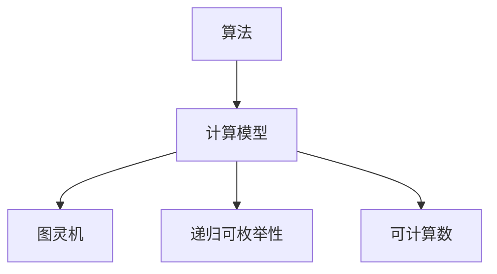
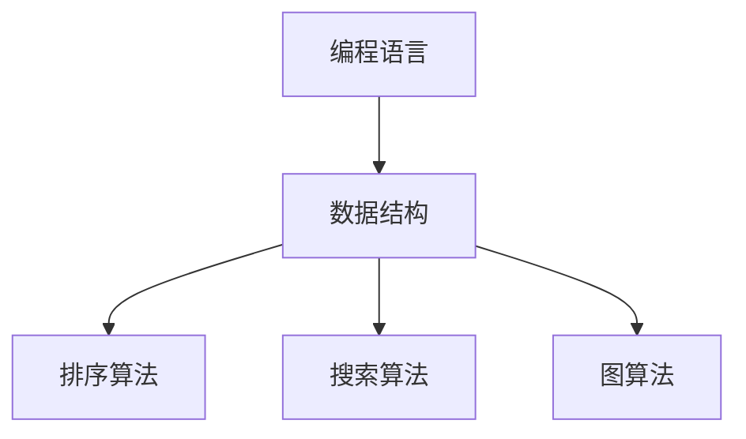
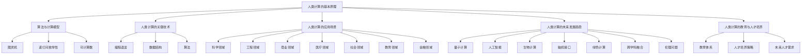

                 

### 第一部分：人类计算的基石

#### 1.1 人类计算的历史概述

人类计算的历史可以追溯到远古时期。早在公元前2500年左右，古埃及人就已经使用简单的计算工具，如石子和绳子，来进行数学运算。随后，古希腊人和古罗马人进一步发展了这些工具，发明了算盘和天平，为后来的计算方法奠定了基础。

在中世纪，阿拉伯数学家们做出了重要贡献，他们将印度的数字系统引入到欧洲，极大地提高了计算的效率。到了文艺复兴时期，欧洲的数学家们开始深入研究代数和几何，为现代数学的发展奠定了基础。

17世纪，英国数学家牛顿和莱布尼茨独立发明了微积分，这是人类计算史上的一个重要里程碑。微积分的发明使得许多复杂的科学问题得以量化，为后来的科学研究提供了强有力的工具。

进入20世纪，计算机科学和信息技术的发展使得人类计算达到了前所未有的高度。1946年，第一台电子计算机ENIAC问世，标志着计算机时代的到来。随后，计算机科学家们不断突破技术瓶颈，发明了各种高性能的计算机和编程语言，推动了人类计算的发展。

#### 1.2 现代人类计算的现状

现代人类计算已经渗透到我们生活的方方面面。在科学领域，人类计算帮助我们揭示了宇宙的奥秘，如通过计算机模拟和数据分析，科学家们发现了宇宙大爆炸的证据、黑洞的存在以及暗物质的性质。

在工程领域，人类计算帮助我们设计和建造了各种复杂的高性能建筑、桥梁、汽车和飞机。通过计算机辅助设计（CAD）和计算机辅助工程（CAE），工程师们可以模拟和优化设计方案，提高工程质量和效率。

在商业领域，人类计算改变了传统的商业模式。通过大数据分析和人工智能技术，企业可以更好地了解市场需求，优化供应链管理，提高生产效率。电子商务、在线支付和物联网等技术的应用，使得商业活动更加便捷和高效。

在医疗领域，人类计算极大地提高了医疗诊断和治疗的水平。通过计算机断层扫描（CT）、磁共振成像（MRI）等技术，医生可以更准确地诊断疾病。同时，人工智能技术在药物研发、疾病预测和个性化医疗等方面的应用，为医疗领域带来了新的突破。

在社会领域，人类计算改变了人们的社交方式。社交媒体、在线游戏和虚拟现实等技术的普及，使得人们可以更加便捷地进行交流和娱乐。同时，人类计算也为公共安全、交通管理、环境监测等领域提供了有力支持。

#### 1.3 人类计算的优势与挑战

人类计算的优势在于其处理大量数据的能力和高效的处理速度。计算机可以快速执行复杂的数学运算和数据处理任务，大大提高了工作效率。此外，计算机可以存储和检索大量的信息，使得知识和数据更加容易获取。

然而，人类计算也面临着一些挑战。首先，计算机的可靠性和安全性问题仍然存在。虽然计算机技术不断进步，但仍然存在系统故障、数据泄露和网络攻击等风险。其次，人类计算需要大量的能源消耗，这对环境造成了负面影响。最后，随着计算能力的提升，人们对计算机的依赖程度也在增加，这可能导致人类计算能力的过度集中，增加社会的不平等。

#### 1.4 小结

人类计算的发展历程充满了创新和突破，从简单的算盘到复杂的计算机系统，人类计算为科学、工程、商业、医疗和社会等各个领域带来了巨大的变革。现代人类计算已经深入到我们的日常生活，但同时也面临着一系列的挑战。在未来的发展中，我们需要不断克服这些挑战，推动人类计算向更加智能化、绿色化和公平化的方向发展。

---

以上内容为第一部分的前三章概述，接下来我们将进一步深入探讨人类计算的核心概念、基本原理以及未来发展趋势。

---

# 第一部分：人类计算的基石

#### 第2章：人类计算的核心概念

#### 2.1 人类计算的基本原理

人类计算的基本原理可以归结为两个方面：算法和计算模型。

**算法（Algorithm）：** 算法是一种有序的步骤序列，用于解决问题或执行特定任务。它是计算机科学的核心概念，定义了计算机如何处理数据和执行操作。算法可以分为多种类型，如排序算法、搜索算法、图算法等。每个算法都有其特定的目标，例如快速找到最大值、最小值或最短路径。

**计算模型（Computational Model）：** 计算模型是用于描述计算过程的理论框架。常见的计算模型包括图灵机、递归可枚举性、可计算数等。这些模型帮助我们理解计算的本质和限制。

**图灵机（Turing Machine）：** 图灵机是由英国数学家艾伦·图灵提出的抽象计算模型。它由一个无限长的带子、读写头和有限状态控制器组成。图灵机通过在其带子上移动读写头来执行计算。这一模型不仅为现代计算机科学奠定了基础，还为我们提供了对计算能力的深刻理解。

**递归可枚举性（Recursively Enumerable）：** 递归可枚举性是指一组问题，这些问题的解可以通过某种算法在有限时间内找到。这种模型是计算理论的一个重要分支，帮助我们理解哪些问题可以在计算上得到解决。

**可计算数（Computable Numbers）：** 可计算数是一类可以通过算法计算得到的数。这些数包括有理数、无理数等。可计算数的概念是计算理论的基础，它帮助我们理解计算机可以处理哪些类型的数据。

**Mermaid 流程图：** 



#### 2.2 人类计算的关键技术

人类计算的关键技术包括编程语言、数据结构和算法。

**编程语言（Programming Language）：** 编程语言是用于编写计算机程序的语法和规则。常见的编程语言包括C、Java、Python等。每种编程语言都有其特定的应用场景和特点。编程语言的进步极大地推动了计算机科学的发展。

**数据结构（Data Structure）：** 数据结构是用于存储和组织数据的方式。常见的数据结构包括数组、链表、栈、队列、树、图等。数据结构的选择直接影响到程序的效率和性能。

**算法（Algorithm）：** 算法是解决特定问题的有序步骤。常见的算法有排序算法（如快速排序、归并排序）、搜索算法（如二分搜索）、图算法（如Dijkstra算法、A*算法）等。算法的研究和优化是计算机科学的核心任务。

**Mermaid 流程图：** 



**伪代码示例：** 

```python
# 快速排序算法伪代码
function quicksort(arr):
    if length(arr) <= 1:
        return arr
    
    pivot = arr[length(arr) / 2]
    left = []
    right = []
    
    for i in range(0, length(arr)):
        if arr[i] < pivot:
            left.append(arr[i])
        else:
            right.append(arr[i])
    
    return concatenate(quicksort(left), pivot, quicksort(right))
```

**数学公式：** 

$$
\text{时间复杂度} = O(n \log n)
$$

**代码实战：** 

```python
import random

# 搭建一个简单的快速排序模型
def quicksort(arr):
    if len(arr) <= 1:
        return arr
    
    pivot = arr[len(arr) // 2]
    left = [x for x in arr if x < pivot]
    middle = [x for x in arr if x == pivot]
    right = [x for x in arr if x > pivot]
    
    return quicksort(left) + middle + quicksort(right)

# 使用随机数组测试快速排序算法
arr = [random.randint(0, 100) for _ in range(10)]
sorted_arr = quicksort(arr)
print("原始数组：", arr)
print("排序后的数组：", sorted_arr)
```

**代码解读与分析：** 

- 在这段代码中，我们首先导入了`random`模块，用于生成随机数组。
- 接着，我们定义了一个名为`quicksort`的函数，用于实现快速排序算法。
- 在`quicksort`函数中，我们首先检查输入数组的长度。如果长度小于等于1，则直接返回数组。
- 接下来，我们选择数组的中位数作为枢轴（pivot）。
- 然后，我们使用列表解析语法将数组分为三个部分：小于枢轴的元素、等于枢轴的元素和大于枢轴的元素。
- 最后，我们递归地调用`quicksort`函数对左右两部分进行排序，并将结果与中间部分连接起来，得到排序后的数组。
- 我们使用一个随机生成的数组作为测试数据，调用`quicksort`函数进行排序，并打印出排序前后的数组。

通过以上示例，我们可以看到人类计算的基本原理、关键技术和实际应用。在接下来的章节中，我们将继续探讨人类计算的未来发展趋势和其在各个领域的应用。

---

#### 2.3 人类计算的应用场景

人类计算的应用场景非常广泛，涵盖了科学、工程、商业、医疗等多个领域。以下是一些典型的人类计算应用场景：

**科学领域：** 人类计算在科学研究中的应用主要体现在数据分析和模拟。例如，在物理学中，人类计算可以帮助科学家模拟宇宙的演化过程，预测天体的运动轨迹。在生物学中，人类计算可以用于基因组分析，帮助我们理解生命的本质。在气候学中，人类计算可以模拟气候系统的变化，为气候变化的研究提供有力支持。

**工程领域：** 人类计算在工程设计中的应用主要体现在计算机辅助设计（CAD）和计算机辅助工程（CAE）。通过计算机模拟和优化，工程师可以设计出更高效、更安全的工程系统。例如，在航空航天领域，人类计算可以帮助工程师优化飞机的设计，提高燃油效率和飞行性能。在建筑领域，人类计算可以用于结构分析，确保建筑物在设计寿命内保持稳定和安全。

**商业领域：** 人类计算在商业中的应用主要体现在数据分析、客户关系管理和供应链管理。通过大数据分析，企业可以更好地了解市场需求，优化产品和服务。例如，在电子商务领域，人类计算可以用于个性化推荐系统，根据用户的历史行为和偏好，为用户提供个性化的购物建议。在客户关系管理中，人类计算可以帮助企业分析客户需求，提高客户满意度和忠诚度。在供应链管理中，人类计算可以用于库存管理，优化库存水平，降低库存成本。

**医疗领域：** 人类计算在医疗中的应用主要体现在医学影像分析、疾病诊断和个性化医疗。通过计算机断层扫描（CT）、磁共振成像（MRI）等技术，医生可以更准确地诊断疾病。同时，人工智能技术在医学影像分析中的应用，可以帮助医生从大量影像数据中提取有价值的信息。在疾病诊断中，人类计算可以帮助医生分析病史和实验室数据，提高诊断的准确性。在个性化医疗中，人类计算可以根据患者的基因信息和生活习惯，为患者提供个性化的治疗方案。

**社会领域：** 人类计算在社会中的应用主要体现在公共安全、交通管理、环境监测等方面。通过大数据分析和人工智能技术，政府部门可以更好地管理公共资源，提高公共服务的效率。例如，在交通管理中，人类计算可以用于实时监控交通流量，优化交通信号控制，减少拥堵。在环境监测中，人类计算可以用于实时监测空气质量、水质等环境指标，为环境保护提供科学依据。

**教育领域：** 人类计算在教育中的应用主要体现在在线教育、智能教学等方面。通过在线教育平台，学生可以随时随地获取优质的教育资源。同时，人工智能技术在智能教学中的应用，可以帮助教师更好地了解学生的学习情况，为学生提供个性化的学习建议。

**金融领域：** 人类计算在金融中的应用主要体现在风险管理、量化交易等方面。通过大数据分析和人工智能技术，金融机构可以更好地预测市场走势，优化投资策略。在量化交易中，人类计算可以帮助投资者进行高频交易，提高投资收益。

通过以上应用场景的介绍，我们可以看到人类计算在各个领域的广泛应用。未来，随着技术的不断进步，人类计算的应用场景将更加丰富，为人类社会的发展带来更多的可能性。

---

#### 2.4 人类计算的未来发展趋势

人类计算的未来发展趋势将受到技术进步、社会需求和伦理问题的共同影响。以下是一些可能的发展方向：

**1. 量子计算：** 量子计算是一种利用量子力学原理进行计算的新型计算模式。与传统的计算机不同，量子计算机可以同时处理大量数据，具有极高的计算速度。未来，量子计算有望在密码学、优化问题和物理模拟等领域发挥重要作用。

**2. 人工智能：** 人工智能（AI）是当前计算机科学的热点领域。未来，人工智能将继续发展，实现更加智能化的应用。例如，智能助理、自动驾驶汽车、智能医疗等。人工智能的进步将极大地改变我们的生活方式和工作方式。

**3. 生物计算：** 生物计算是一种利用生物分子进行计算的新型计算模式。生物计算具有高效、低能耗的特点，可以用于解决复杂科学问题。未来，生物计算有望在药物设计、基因组学等领域发挥重要作用。

**4. 脑机接口：** 脑机接口是一种将人类大脑与计算机系统连接起来的技术。通过脑机接口，人们可以控制计算机或机器人，实现人机交互。未来，脑机接口有望在辅助残疾人、智能玩具等领域得到广泛应用。

**5. 绿色计算：** 随着计算机应用的普及，能源消耗和环境污染问题日益严重。未来，绿色计算将成为重要发展方向。通过优化算法、提高计算机能效，减少能源消耗，实现可持续计算。

**6. 跨学科融合：** 未来，人类计算将与其他学科（如生物学、心理学、经济学等）进行深度融合，产生新的交叉学科和应用领域。这种跨学科融合将推动人类计算向更加智能化、综合化的方向发展。

**7. 伦理问题：** 随着人类计算的发展，伦理问题也日益突出。例如，数据隐私、算法公平性、人工智能伦理等。未来，我们需要建立完善的伦理规范，确保人类计算的发展符合社会价值观。

**8. 教育改革：** 未来，人类计算将成为教育的重要组成部分。通过编程教育、计算机科学教育，培养学生掌握计算思维和技能，为未来的发展做好准备。

通过以上发展趋势的介绍，我们可以看到人类计算的未来充满希望和挑战。未来，随着技术的不断进步和社会需求的变化，人类计算将继续发展，为人类社会带来更多的创新和变革。

---

## 人类计算在教育、医疗等领域的应用

人类计算在教育、医疗等领域的应用已经取得了显著的成果，为这些领域的发展带来了新的机遇和挑战。

#### 在教育领域的应用

在教育领域，人类计算主要通过在线教育平台、智能教学系统和教育数据分析等手段来提高教育质量和效率。

**在线教育平台：** 在线教育平台使得学习者可以随时随地获取教育资源，打破了传统教育的时空限制。通过在线教育平台，教师可以发布课程内容、布置作业和进行在线答疑，学生可以自主学习、参与讨论和进行自我评估。这种教学模式极大地提高了教育的灵活性和可及性。

**智能教学系统：** 智能教学系统利用人工智能技术，根据学生的学习情况和需求，提供个性化的教学建议和资源。例如，智能教学系统可以根据学生的学习进度、能力和偏好，推荐适合的学习路径和内容。同时，智能教学系统还可以自动评估学生的学习成果，为教师提供反馈，帮助教师优化教学策略。

**教育数据分析：** 教育数据分析通过对学生学习数据进行分析，可以帮助教育机构了解学生的学习情况，发现教育中的问题，并采取相应的改进措施。例如，教育数据分析可以用于评估教学方法的有效性、分析学习困难的原因以及优化课程设计。这种数据驱动的教育模式有助于提高教育质量和公平性。

#### 在医疗领域的应用

在医疗领域，人类计算的应用主要体现在医学影像分析、疾病诊断、个性化医疗和医疗数据分析等方面。

**医学影像分析：** 医学影像分析利用计算机视觉和深度学习技术，对医学影像（如X光片、CT扫描、MRI图像）进行分析，帮助医生快速、准确地诊断疾病。例如，人工智能系统可以通过分析肺部的CT图像，检测肺结节，提高早期肺癌的发现率。此外，医学影像分析还可以用于分析肿瘤的边界、评估治疗效果等。

**疾病诊断：** 人工智能技术在疾病诊断中的应用，可以帮助医生提高诊断的准确性。例如，通过分析患者的病史、实验室数据和医学影像，人工智能系统可以辅助医生进行疾病诊断。这种辅助诊断系统不仅可以减轻医生的负担，还可以减少误诊和漏诊的风险。

**个性化医疗：** 个性化医疗是根据患者的基因信息、生活习惯和疾病状态，制定个性化的治疗方案。人类计算在个性化医疗中的应用，可以帮助医生更好地了解患者的情况，为患者提供个性化的治疗建议。例如，通过分析患者的基因数据，人工智能系统可以预测患者对某种药物的反应，帮助医生选择最佳的治疗方案。

**医疗数据分析：** 医疗数据分析通过对海量医疗数据进行分析，可以帮助医疗机构了解疾病的发生、发展和传播规律，优化医疗资源配置。例如，通过分析患者的就诊记录、病历数据，医疗数据分析可以用于评估医院的医疗服务质量、发现潜在的健康风险，并为公共卫生决策提供依据。

**案例分析：** 

**在线教育案例：** Coursera是一个全球性的在线教育平台，提供了丰富的课程资源，吸引了来自世界各地的学习者。通过Coursera，学习者可以在线学习来自世界顶级大学和机构的课程，参加在线讨论和作业评估。这种在线教育模式不仅提高了教育的可及性，还促进了全球教育资源的共享。

**医学影像分析案例：** Google DeepMind的AlphaMedicine项目利用深度学习技术，对医学影像进行分析，帮助医生诊断疾病。例如，AlphaMedicine可以通过分析视网膜图像，检测糖尿病视网膜病变，提高早期发现的准确性。这一项目的成功展示了人工智能在医学影像分析中的潜力。

**个性化医疗案例：** 美国麻省理工学院的Broad Institute利用人类计算技术，开展基因组学研究，为癌症患者提供个性化的治疗方案。通过分析患者的基因数据，Broad Institute的科学家们可以识别出与癌症相关的基因突变，帮助医生选择最佳的治疗方案。这一项目的成功展示了人类计算在个性化医疗中的重要性。

通过以上案例，我们可以看到人类计算在教育、医疗等领域的广泛应用和巨大潜力。未来，随着技术的不断进步，人类计算将继续在这些领域发挥重要作用，推动教育、医疗等领域的创新和发展。

---

### 第4章：人类计算在人工智能领域的应用

#### 4.1 人类计算与人工智能的关系

人工智能（Artificial Intelligence, AI）是计算机科学的一个分支，旨在使计算机具备模拟、延伸和扩展人类智能的能力。人类计算作为人工智能的重要基础，为其提供了强大的计算能力和算法支持。人类计算与人工智能的关系可以理解为：人类计算是人工智能的基石，人工智能是人类计算的终极目标。

**计算能力的重要性：** 人工智能的发展离不开强大的计算能力。随着人类计算技术的进步，计算机的计算速度和存储能力不断提高，为人工智能算法的实现提供了有力保障。例如，深度学习算法需要大量数据进行训练，而高效的计算资源可以加速这一过程，提高模型的准确性。

**算法的创新：** 人类计算在算法领域的不断创新，为人工智能的发展提供了丰富的工具和方法。从简单的规则系统到复杂的神经网络，人类计算的算法进步推动了人工智能的快速发展。例如，卷积神经网络（CNN）在图像识别任务中的成功应用，展示了人类计算算法的巨大潜力。

**大数据的支持：** 人类计算在数据处理和分析方面的能力，为人工智能提供了丰富的数据资源。大数据技术使得我们可以从海量数据中提取有价值的信息，为人工智能算法提供了丰富的训练数据。例如，在推荐系统、自然语言处理等领域，大数据技术使得人工智能可以更好地理解用户需求和意图。

#### 4.2 人类计算在机器学习中的应用

机器学习（Machine Learning, ML）是人工智能的核心技术之一，通过构建和优化模型，使计算机能够从数据中学习和预测。人类计算在机器学习中的应用主要体现在以下几个方面：

**训练过程的优化：** 机器学习模型的训练通常是一个复杂且耗时的过程。人类计算通过提高计算速度和效率，可以加速模型训练。例如，分布式计算和并行计算技术可以充分利用多台计算机的资源，提高训练速度。

**优化算法的改进：** 人类计算在算法优化方面的研究，为机器学习提供了新的方法和技术。例如，梯度下降算法的改进（如随机梯度下降、Adam优化器）可以加快模型的收敛速度，提高训练效果。

**特征提取和降维：** 人类计算在特征提取和降维方面的研究，有助于从大量数据中提取有价值的信息，减少计算成本。例如，主成分分析（PCA）和自动编码器等技术可以降低数据维度，提高模型训练的效率。

**案例研究：** 

**图像识别：** 在图像识别任务中，人类计算通过深度学习算法，实现了对图像的自动分类和识别。例如，卷积神经网络（CNN）在图像识别任务中取得了显著的成功。通过多层卷积操作，CNN可以提取图像的层次特征，实现对复杂图像的准确识别。

**自然语言处理：** 在自然语言处理（NLP）领域，人类计算通过构建和优化语言模型，实现了对自然语言的自动处理和理解。例如，循环神经网络（RNN）和Transformer模型在NLP任务中取得了巨大的突破。通过序列建模和注意力机制，这些模型可以更好地理解语言中的复杂关系和语义信息。

**案例研究（续）：** 

**推荐系统：** 在推荐系统领域，人类计算通过构建和优化推荐算法，实现了对用户偏好的自动发现和推荐。例如，基于协同过滤和深度学习的推荐算法可以更好地预测用户的兴趣和需求，提高推荐系统的准确性。

**自动驾驶：** 在自动驾驶领域，人类计算通过构建和优化感知系统和决策模型，实现了对道路环境的自动感知和驾驶决策。例如，通过深度学习和计算机视觉技术，自动驾驶系统可以识别道路标志、车辆和行人，实现安全驾驶。

通过以上案例，我们可以看到人类计算在机器学习领域的广泛应用和巨大潜力。未来，随着技术的不断进步，人类计算将继续为人工智能的发展提供强大的支持，推动人工智能在各个领域的应用和发展。

---

### 4.3 人类计算在深度学习中的应用

深度学习（Deep Learning, DL）是人工智能领域的一个热点方向，它通过构建多层神经网络，使计算机能够自动学习和提取数据中的特征。深度学习在计算机视觉、自然语言处理、语音识别等众多领域取得了显著成果。人类计算在深度学习中的应用，主要体现在以下几个方面：

#### 计算资源的优化

深度学习模型的训练通常需要大量的计算资源，尤其是对于大规模数据集和高复杂度的模型。人类计算通过优化计算资源，提高了深度学习模型的训练效率。以下是一些常见的优化方法：

- **分布式计算：** 分布式计算可以将训练任务分解到多台计算机上，利用并行计算提高训练速度。通过使用分布式计算框架（如TensorFlow、PyTorch），研究人员可以轻松地在多台计算机之间分配训练任务。

- **GPU加速：** 图形处理单元（GPU）具有高度并行的计算能力，适合处理深度学习任务中的大量矩阵运算。GPU加速可以显著提高深度学习模型的训练速度，使其能够在更短的时间内收敛。

- **混合精度训练：** 混合精度训练使用混合精度数据类型（如float16和float32），在保持模型精度的情况下，提高训练速度和降低内存消耗。

#### 算法创新

人类计算在算法创新方面的研究，为深度学习的发展提供了新的方法和工具。以下是一些重要的算法创新：

- **卷积神经网络（CNN）：** 卷积神经网络通过卷积操作提取图像中的局部特征，广泛应用于计算机视觉任务。CNN在图像分类、目标检测和图像分割等领域取得了显著的成功。

- **循环神经网络（RNN）：** 循环神经网络通过在时间维度上递归地处理输入数据，适用于序列数据建模。RNN在自然语言处理、语音识别和时间序列预测等领域表现出色。

- **Transformer模型：** Transformer模型通过自注意力机制（Self-Attention）处理序列数据，突破了传统循环神经网络的瓶颈。Transformer在机器翻译、文本生成和语音识别等领域取得了巨大的突破。

#### 应用案例

以下是深度学习在计算机视觉、自然语言处理和语音识别等领域的一些应用案例：

**计算机视觉：**

- **图像分类：** 使用卷积神经网络，计算机可以自动识别和分类图像中的物体。例如，ResNet模型在ImageNet图像分类挑战中取得了优异的成绩。

- **目标检测：** 目标检测算法可以识别图像中的多个物体，并确定它们的位置。YOLO（You Only Look Once）是一种流行的目标检测算法，可以在实时应用中快速检测目标。

- **图像分割：** 图像分割算法可以将图像中的每个像素分类到不同的类别。Unet是一种流行的图像分割模型，在医疗图像分析等领域表现出色。

**自然语言处理：**

- **机器翻译：** Transformer模型在机器翻译任务中取得了显著的成果。例如，Google翻译使用了Transformer模型，实现了高精度的跨语言翻译。

- **文本生成：** 生成对抗网络（GAN）可以生成逼真的文本，应用于小说创作、广告文案生成等场景。

- **情感分析：** 情感分析算法可以识别文本中的情感倾向，应用于社交媒体监测、客户反馈分析等领域。

**语音识别：**

- **语音识别：** 语音识别算法可以将语音信号转换为文本，应用于语音助手、实时字幕等场景。WaveNet是一种流行的语音识别模型，能够生成自然流畅的语音。

- **说话人识别：** 说话人识别算法可以识别不同说话人的声音，应用于身份验证、语音助手等场景。

通过以上案例，我们可以看到深度学习在各个领域的广泛应用。未来，随着人类计算技术的进一步发展，深度学习将继续推动人工智能的进步，为人类社会带来更多的创新和变革。

---

### 第5章：人类计算在计算生物学中的应用

#### 5.1 人类计算与计算生物学的关系

计算生物学（Computational Biology）是生物学与计算机科学、信息学等学科交叉的一门新兴学科。它利用计算机科学和技术手段，对生物信息进行大规模数据处理、分析和模拟，以揭示生命现象的规律。人类计算作为计算生物学的重要工具，在以下方面发挥了关键作用：

**数据处理与分析：** 生物数据，如基因组序列、蛋白质结构和代谢途径等，具有海量性和复杂性。人类计算提供了高效的数据处理和分析方法，如序列比对、结构预测和基因表达数据分析等，帮助研究人员从海量数据中提取有价值的信息。

**模拟与预测：** 计算生物学中的许多问题需要通过模拟来验证理论或预测未来的趋势。人类计算通过分子动力学模拟、基因网络建模和生物进化模拟等方法，为生物学研究提供了强大的计算支持。

**算法创新：** 人类计算在算法创新方面的研究，为计算生物学提供了新的方法和工具。例如，深度学习算法在蛋白质结构预测、基因组注释和生物信息学分析中的应用，极大地推动了计算生物学的发展。

#### 5.2 人类计算在生物信息学中的应用

生物信息学（Bioinformatics）是计算生物学的一个分支，专注于生物数据的存储、检索、分析和解释。以下是人类计算在生物信息学中的应用：

**基因组数据分析：** 基因组数据分析是生物信息学的核心任务之一。人类计算通过高效的数据处理算法，如序列比对、基因注释和变异检测，帮助研究人员从基因组数据中提取有价值的信息。例如，人类基因组计划（Human Genome Project）的成功离不开人类计算的支持。

**蛋白质结构预测：** 蛋白质是生物体的功能分子，其结构直接影响其功能。人类计算通过分子动力学模拟和深度学习算法，可以对蛋白质结构进行预测。这些预测结果有助于理解蛋白质的功能，为新药研发提供重要线索。

**代谢网络分析：** 代谢网络是生物体内化学反应的复杂网络，涉及多种生物分子和代谢途径。人类计算通过建模和模拟，可以帮助研究人员理解代谢网络的动态行为，发现潜在的治疗靶点。

#### 5.3 人类计算在药物设计中的应用

药物设计是计算生物学和药物化学的交叉领域，旨在通过计算方法预测新药分子的性质，筛选和优化候选药物。以下是人类计算在药物设计中的应用：

**分子对接：** 分子对接是一种计算模拟方法，通过模拟药物分子与生物大分子（如蛋白质、核酸）的相互作用，预测药物分子的结合模式。分子对接可以帮助研究人员快速筛选出具有潜在疗效的药物分子。

**虚拟筛选：** 虚拟筛选是一种基于计算的方法，通过分析大量化合物库，预测哪些化合物可能具有特定的生物活性。虚拟筛选可以大大减少实验筛选的工作量，提高药物研发的效率。

**机器学习辅助药物设计：** 机器学习在药物设计中的应用，通过学习大量的化合物和生物活性数据，建立预测模型，预测新药分子的性质和活性。这种基于数据驱动的药物设计方法，有望提高药物研发的成功率。

**案例研究：**

**抗癌药物研发：** 通过人类计算，研究人员可以预测和优化抗癌药物分子的结构，提高其疗效和安全性。例如，帕米哌酮（Pemigatinib）是一种用于治疗癌症的药物，其研发过程中利用了分子对接和虚拟筛选技术，最终确定了有效的药物分子。

**抗病毒药物研发：** 抗病毒药物研发中，人类计算可以用于预测药物分子的抗病毒活性，以及与病毒蛋白质的相互作用。例如，在COVID-19疫情期间，研究人员利用人类计算技术，迅速筛选出了多个潜在的抗病毒药物，为疫情防控提供了有力支持。

通过以上案例，我们可以看到人类计算在计算生物学、生物信息学和药物设计中的应用，为生命科学研究和新药研发带来了巨大的变革。未来，随着人类计算技术的进一步发展，这些应用领域将继续扩展，为生命科学和医学带来更多突破。

---

### 5.4 人类计算在基因组学和分子生物学中的应用

人类计算在基因组学和分子生物学中的应用日益广泛，为解析生命的奥秘提供了强有力的工具。以下是人类计算在这两个领域的主要应用：

#### 基因组数据分析

基因组数据分析是基因组学研究的核心任务之一。人类计算在基因组数据分析中扮演了关键角色，主要体现在以下几个方面：

**基因组组装：** 基因组组装是将大量测序数据拼接成完整的基因组序列。人类计算通过高效的组装算法，如重叠群组装（Overlap Layout Consensus, OLC）和长读长组装（Long Read Assembly, LRA），将原始的测序数据组装成连续的基因组序列。例如， assemblies like Pilon 和 Canu 等工具，提高了基因组组装的准确性和效率。

**基因组注释：** 基因组注释是对基因组序列进行功能注释，识别基因、非编码RNA和其他生物分子。人类计算通过基因组注释工具，如 GeneMark、Augustus 和 TransDecoder，对基因组序列进行准确的注释，识别潜在的基因和生物功能。

**变异检测：** 变异检测是识别基因组序列中的单核苷酸变异（SNV）、插入/缺失（Indel）和结构变异（SV）。人类计算通过变异检测工具，如 GATK、Freebayes 和 MuTect，从大规模测序数据中检测出潜在的遗传变异，为遗传疾病研究和个性化医疗提供数据支持。

**基因组关联分析：** 基因组关联分析（GWAS）是识别与疾病相关的基因变异。人类计算通过 GWAS 工具，如 PLINK、Genome-wide Association Studies 和 LDA，对大规模基因组数据进行关联分析，识别与疾病相关的基因变异，为疾病机制研究和药物研发提供重要线索。

**案例研究：** 

**人类基因组计划（Human Genome Project, HGP）：** 人类基因组计划是一个全球性的科研项目，旨在测序和解析人类基因组的全部DNA序列。该项目成功解析了人类基因组的结构，为基因组学研究奠定了基础。人类计算在该项目中发挥了关键作用，通过高效的计算资源和技术，加速了基因组测序和数据分析过程。

**癌症基因组计划（Cancer Genome Project, CGP）：** 癌症基因组计划旨在通过基因组测序和数据分析，揭示癌症的发生机制和进展。该项目利用人类计算技术，对大量癌症样本进行测序和数据分析，识别出与癌症相关的基因变异和信号通路，为癌症诊断和个性化治疗提供了重要依据。

#### 分子生物学模拟

分子生物学模拟是通过计算机模拟分子之间的相互作用，研究生物分子的结构和功能。以下是人类计算在分子生物学模拟中的应用：

**分子动力学模拟（Molecular Dynamics Simulation, MD Simulation）：** 分子动力学模拟是一种计算方法，通过求解牛顿运动方程，模拟分子在物理环境中的运动。人类计算通过高性能计算资源，进行大规模的分子动力学模拟，研究生物分子的动态行为和相互作用。例如，分子动力学模拟可以用于研究蛋白质折叠、酶催化过程和细胞信号传导等生物分子现象。

**量子力学模拟（Quantum Mechanics Simulation）：** 量子力学模拟是一种计算方法，通过量子力学原理，模拟分子的电子结构。人类计算通过量子力学模拟，研究分子的电子态、化学键和反应机理。这种模拟方法在药物设计、材料科学和化学工程等领域具有重要应用。

**生物信息学模拟（Bioinformatics Simulation）：** 生物信息学模拟是利用计算机模拟生物信息学算法，研究基因组、蛋白质和代谢网络的动态行为。人类计算通过生物信息学模拟，优化算法性能，提高数据处理和分析效率。例如，通过模拟不同算法在基因表达数据分析中的应用，研究人员可以评估算法的准确性和鲁棒性。

**案例研究：** 

**生物大分子结构预测（Protein Structure Prediction, PSP）：** 生物大分子结构预测是计算生物学中的一个重要挑战。人类计算通过生物信息学模拟和量子力学模拟，预测蛋白质的三维结构。例如，Rosetta 和 AlphaFold 等工具，利用人类计算技术，实现了高效准确的蛋白质结构预测。

**药物分子设计（Drug Design）：** 人类计算在药物分子设计中的应用，通过分子动力学模拟和量子力学模拟，研究药物分子与生物大分子的相互作用。这种模拟方法可以用于优化药物分子的结构，提高其疗效和安全性。例如，通过分子动力学模拟，研究人员可以评估药物分子的毒性风险，优化药物分子的结构设计。

通过以上案例，我们可以看到人类计算在基因组学和分子生物学中的应用，为生命科学研究带来了巨大的变革。未来，随着人类计算技术的进一步发展，这些应用领域将继续拓展，为生命科学和医学带来更多突破。

---

### 5.5 人类计算在药物设计和生物信息学中的应用

人类计算在药物设计和生物信息学中的应用，为现代医学和生命科学带来了革命性的进步。以下详细阐述这些领域中的应用和实例。

#### 药物设计

药物设计是发现和优化具有特定生物活性的化合物以治疗疾病的过程。人类计算在药物设计中的应用主要体现在以下几个方面：

**分子对接与虚拟筛选：** 分子对接是一种计算方法，用于模拟小分子与生物大分子（如蛋白质、核酸）的相互作用。虚拟筛选是利用分子对接技术，从大量化合物库中筛选出具有潜在生物活性的化合物。通过人类计算，研究人员可以快速、高效地进行分子对接和虚拟筛选，减少实验筛选的工作量。例如，Glide和Autodock等工具广泛应用于药物设计中的分子对接和虚拟筛选。

**药物分子优化：** 一旦筛选出具有潜在活性的化合物，人类计算可以帮助进一步优化其结构和性质，提高其生物利用度和疗效。通过计算方法，如量化结构-活性关系（QSAR）和分子动力学模拟，研究人员可以预测药物分子与靶标的结合亲和力，指导分子优化过程。

**生物标志物发现：** 生物标志物是用于诊断、预后和治疗的生物学指标。人类计算在药物设计中的应用，还可以帮助识别与疾病相关的生物标志物。例如，通过基因组学和蛋白质组学数据分析，研究人员可以利用人类计算技术发现与疾病相关的基因和蛋白质，为药物设计提供靶点信息。

**案例研究：**

**抗癌药物设计：** 通过人类计算，研究人员可以优化抗癌药物分子的结构，提高其疗效和选择性。例如，科学家利用分子对接和虚拟筛选技术，筛选出具有抗肿瘤活性的小分子化合物，并通过分子动力学模拟进一步优化其结构，从而开发出新型抗癌药物。

**抗病毒药物设计：** 在COVID-19疫情期间，人类计算在抗病毒药物设计中的作用尤为显著。研究人员利用计算方法快速筛选出潜在的抗病毒药物，通过分子对接和模拟分析其与病毒蛋白的结合模式，以加速抗病毒药物的研发。

#### 生物信息学

生物信息学是研究生物数据（如基因组、蛋白质序列和代谢网络）的存储、检索、分析和解释的学科。人类计算在生物信息学中的应用，极大地促进了生物学研究的深度和广度。

**基因组数据分析：** 基因组数据分析涉及基因注释、变异检测和基因组关联分析等步骤。人类计算提供了高效的算法和计算资源，使得大规模基因组数据分析成为可能。例如，GATK和Picard等工具，通过并行计算和优化算法，提高了基因组数据分析的效率和准确性。

**蛋白质结构预测：** 蛋白质结构预测是生物信息学中的一个重要任务。人类计算通过生物信息学模拟和量子力学模拟，预测蛋白质的三维结构，为蛋白质功能研究和药物设计提供基础。例如，AlphaFold2通过深度学习技术，实现了高效、准确的蛋白质结构预测。

**代谢网络分析：** 代谢网络分析涉及对生物体内的化学反应进行建模和分析。人类计算通过构建和优化代谢网络模型，研究生物代谢途径的动态行为，发现潜在的治疗靶点。例如，Pathway Commons等平台，通过人类计算技术，提供了全面的代谢网络分析工具。

**案例研究：**

**基因组学研究：** 人类计算在基因组学研究中的应用，极大地提高了基因组的测序和数据分析效率。例如，人类基因组计划（HGP）和百万人基因组计划（1000 Genomes Project）利用人类计算技术，成功解析了大量基因组序列，为基因组学提供了宝贵的数据资源。

**癌症研究：** 在癌症研究中，人类计算通过基因组、蛋白质组和代谢组等多组学数据综合分析，揭示了癌症的发生机制和生物标志物。例如，通过人类计算技术，研究人员发现了与癌症相关的基因变异和信号通路，为癌症诊断和个性化治疗提供了重要线索。

通过以上应用和实例，我们可以看到人类计算在药物设计和生物信息学中的重要地位。未来，随着人类计算技术的不断进步，这些领域将继续为医学和生命科学带来更多的创新和突破。

---

## 第三部分：人类计算的挑战与解决方案

### 第7章：人类计算的伦理问题与挑战

随着人类计算技术的迅猛发展，伦理问题也日益突出。这些伦理问题不仅关系到技术的应用，也关系到人类社会的可持续发展。以下是人类计算领域面临的几个主要伦理问题及其解决方案：

#### 数据隐私问题

**问题：** 在人类计算的应用过程中，大量个人数据被收集、存储和分析。这些数据可能涉及用户的隐私，如个人身份、健康状况和金融信息等。未经授权的数据收集和使用可能导致隐私泄露，侵犯个人隐私权。

**解决方案：** 
1. **数据匿名化：** 通过数据匿名化技术，将个人身份信息从数据中去除，降低隐私泄露的风险。
2. **隐私增强技术（PETs）：** 例如差分隐私、同态加密和多方安全计算等，可以在保护数据隐私的同时，实现数据的有效分析和利用。
3. **法律和法规：** 制定和执行严格的数据保护法律法规，如《通用数据保护条例》（GDPR）和《加州消费者隐私法案》（CCPA），对数据收集和使用进行监管。

#### 算法公平性问题

**问题：** 人类计算中的算法可能存在偏见和不公平性，导致某些群体受到不公平对待。例如，在招聘、贷款审批和犯罪预测等领域，算法的偏见可能导致某些群体被歧视。

**解决方案：**
1. **算法透明性：** 提高算法的透明度，使公众能够理解算法的决策过程，减少偏见和不公平。
2. **公平性评估：** 使用统计学和机器学习方法对算法进行公平性评估，检测和纠正潜在的偏见。
3. **多元数据集：** 使用多样化的数据集进行算法训练，减少算法偏见。

#### 人工智能伦理问题

**问题：** 人工智能（AI）技术的发展引发了诸多伦理问题，如机器智能是否应该拥有自主决策权、人工智能的道德责任归属等。

**解决方案：**
1. **伦理框架：** 制定AI伦理框架，明确AI系统的道德准则和责任归属，确保AI系统的设计和应用符合社会伦理标准。
2. **人类监督：** 在关键应用场景中，保持人类对AI系统的监督，防止AI系统产生不可预见的后果。
3. **责任追究：** 建立AI事故的责任追究机制，明确责任归属，确保受害者的权益得到保护。

#### 技术失业问题

**问题：** 人类计算技术的广泛应用可能导致部分职业被自动化替代，引发失业和社会不稳定。

**解决方案：**
1. **职业转型培训：** 为受影响工人提供职业转型培训，帮助他们适应新技术环境，寻找新的就业机会。
2. **社会保障体系：** 建立健全的社会保障体系，为失业者提供必要的经济支持和职业指导。
3. **技术创新驱动：** 通过技术创新，创造新的就业机会，推动经济持续发展。

#### 环境问题

**问题：** 人类计算技术，特别是数据中心和云计算，对环境造成了严重的能源消耗和碳排放。

**解决方案：**
1. **绿色计算：** 通过优化算法、提高能效和采用可再生能源，实现绿色计算。
2. **分布式计算：** 分布式计算可以降低对数据中心的需求，减少能源消耗。
3. **政策支持：** 政府制定相关政策，鼓励企业和研究机构开展绿色计算研究，推广绿色计算技术。

通过上述解决方案，我们可以逐步应对人类计算领域面临的伦理问题，确保技术的可持续发展和社会的和谐稳定。

---

### 第8章：人类计算的技术创新与突破

人类计算技术在过去几十年里取得了惊人的突破，这些突破不仅推动了计算机科学的发展，也为各行各业带来了深刻的变革。以下是一些重要的人类计算技术创新与突破：

#### 深度学习的崛起

深度学习是人工智能领域的一项革命性技术，其基于多层神经网络的设计，使得计算机能够自动学习和提取数据中的特征。深度学习的成功得益于以下几个关键因素：

1. **计算能力的提升：** 随着图形处理单元（GPU）和专用深度学习芯片（如NVIDIA Tesla系列）的普及，深度学习模型的训练速度得到了显著提高。
2. **大数据的支持：** 海量数据为深度学习提供了丰富的训练资源，使得模型能够更好地学习复杂的模式和特征。
3. **算法创新：** 深度学习算法，如卷积神经网络（CNN）、循环神经网络（RNN）和Transformer模型，不断创新，提高了模型的性能和应用范围。

深度学习在计算机视觉、自然语言处理、语音识别等领域取得了显著成果，如自动驾驶、智能助手和医疗影像分析等。

#### 量子计算的兴起

量子计算是一种利用量子力学原理进行计算的新型计算模式。与传统的计算机不同，量子计算机可以同时处理大量数据，具有极高的计算速度。量子计算的兴起得益于以下几个技术创新：

1. **量子比特的制备与操控：** 研究人员通过离子阱、超导电路和拓扑量子系统等手段，成功制备和操控量子比特。
2. **量子纠错技术：** 量子纠错技术是量子计算的关键，通过纠错机制，可以降低量子计算中的错误率，提高计算精度。
3. **量子算法：** 量子算法在优化问题、密码学和物理模拟等领域具有显著优势，如Grover算法和Shor算法。

量子计算的突破有望在密码学、金融分析和科学模拟等领域产生重大影响。

#### 大数据的革命

大数据技术是人类计算领域的重要创新，其核心在于如何高效地存储、处理和分析海量数据。以下是一些关键的技术突破：

1. **分布式存储与计算：** 通过分布式存储系统（如Hadoop、Spark）和分布式数据库（如HBase、Cassandra），可以实现海量数据的存储和管理。
2. **数据挖掘与分析：** 通过机器学习、图分析和统计分析等方法，可以挖掘大数据中的有价值信息，为决策提供支持。
3. **实时数据处理：** 实时数据处理技术（如流计算、内存计算）使得数据处理速度大幅提高，为实时决策提供了可能。

大数据技术在商业分析、公共安全、医疗健康等领域得到了广泛应用。

#### 脑机接口的发展

脑机接口（Brain-Computer Interface, BCI）是一种将人类大脑与计算机系统连接起来的技术。以下是一些脑机接口的关键技术突破：

1. **脑信号采集与解析：** 通过脑电图（EEG）、功能性磁共振成像（fMRI）和脑磁图（MEG）等手段，可以捕捉大脑的信号。
2. **信号处理与解码：** 通过信号处理和机器学习技术，可以将脑信号转换为控制指令，实现人机交互。
3. **应用拓展：** 脑机接口技术已在神经康复、智能玩具和虚拟现实等领域得到应用。

脑机接口的发展为残疾人士提供了新的康复途径，也为人机交互带来了新的可能性。

#### 其他技术创新

除了上述领域，人类计算在云计算、区块链和物联网等领域也取得了重要突破：

1. **云计算：** 云计算提供了灵活、高效的计算资源，为大规模数据处理和分布式计算提供了基础。
2. **区块链：** 区块链技术通过分布式账本和智能合约，实现了数据的安全存储和可信交易。
3. **物联网：** 物联网技术通过连接各种物理设备，实现了信息的实时采集和远程控制。

通过这些技术创新与突破，人类计算正在不断拓展其应用领域，为人类社会带来更多的便利和进步。

---

### 第9章：人类计算的教育与人才培养

#### 9.1 人类计算的教育体系

随着人类计算技术的快速发展，教育和人才培养体系也在不断演变。为了培养具备计算思维和技能的人才，我们需要构建一个全面、系统和可持续的教育体系。

**基础教育阶段：** 在中小学阶段，应该引入计算机科学和编程教育，培养学生的计算思维和逻辑思维能力。通过简单的编程语言和可视化工具，学生可以初步了解编程的基本概念和编程方法，培养对计算机科学的兴趣。

**高等教育阶段：** 在大学阶段，应该设置计算机科学、软件工程、人工智能等专业的课程，提供深入的理论学习和实践训练。此外，还应鼓励跨学科研究，如生物信息学、计算社会科学等，以培养具备多学科背景的人才。

**职业教育阶段：** 职业教育应该根据行业需求，提供针对性的培训课程，如数据分析师、软件工程师、AI应用开发等。通过实际项目和案例教学，学生可以快速掌握相关技能，为就业做好准备。

#### 9.2 人类计算的人才培养

人才培养是推动人类计算技术发展的重要环节。以下是一些关键的人才培养策略：

**实践导向：** 实践是培养计算人才的重要途径。通过实验室项目、实习和竞赛等方式，学生可以将理论知识应用于实际问题，提高解决实际问题的能力。

**持续学习：** 人类计算技术更新迅速，持续学习是保持竞争力的关键。企业和教育机构应该提供持续的培训和学习机会，帮助员工和教师掌握最新的技术和发展趋势。

**跨学科合作：** 跨学科合作可以激发创新思维，推动技术的交叉应用。在人才培养过程中，应该鼓励学生和教师跨学科交流，培养具备多学科背景的人才。

**企业合作：** 企业与教育机构的合作可以促进人才培养与产业需求的紧密结合。通过合作项目、实习机会和专家讲座等方式，企业可以参与到人才培养过程中，为学生提供实践机会和职业发展指导。

#### 9.3 人类计算的未来人才需求

随着人类计算技术的不断发展，未来对人才的需求也将不断变化。以下是一些未来人才需求的特点：

**技术复合型人才：** 未来的人才需求将更加注重跨学科能力和复合型技能。具备多学科背景的人才能够在不同领域实现技术创新和应用。

**创新能力：** 随着技术的快速发展，创新能力将成为关键竞争力。具备创新思维和解决复杂问题能力的人才将在未来具有更大的发展空间。

**数据素养：** 数据将成为未来社会的重要资源，具备数据素养的人才将在数据分析、数据科学等领域具有广阔的应用前景。

**社会责任感：** 人类计算技术的发展也带来了一系列伦理和社会问题，具备社会责任感的人才将在制定和执行相关政策、保护数据隐私等方面发挥重要作用。

通过以上教育体系和人才培养策略，我们可以为未来人类计算技术发展培养出更多具备计算思维、创新能力和社会责任感的优秀人才。

---

### 附录A：人类计算相关资源与工具

#### A.1 人类计算的主流工具与平台

**1. 编程语言：** Python、Java、C++、JavaScript等。

**2. 开发环境：** PyCharm、Visual Studio、Eclipse、Jupyter Notebook等。

**3. 数据库：** MySQL、PostgreSQL、MongoDB、Oracle等。

**4. 机器学习框架：** TensorFlow、PyTorch、Scikit-learn、Keras等。

**5. 分布式计算框架：** Hadoop、Spark、Dask、Ray等。

**6. 云计算平台：** AWS、Azure、Google Cloud Platform、Aliyun等。

#### A.2 人类计算的学习资源与教程

**1. 在线课程：** Coursera、edX、Udacity、网易云课堂等。

**2. 教材：** 《深度学习》（Ian Goodfellow、Yoshua Bengio、Aaron Courville著）、《Python编程：从入门到实践》（埃里克·马瑟斯著）等。

**3. 博客和论坛：** Stack Overflow、GitHub、Reddit、ArXiv等。

**4. 社区和组织：** IEEE、ACM、KDnuggets、AI联盟等。

#### A.3 人类计算的研究论文与期刊

**1. 学术期刊：** Nature、Science、IEEE Transactions on Pattern Analysis and Machine Intelligence、Journal of Machine Learning Research等。

**2. 研究论文：** ArXiv、Google Scholar、Web of Science、Scopus等。

**3. 会议：** IEEE International Conference on Computer Vision（ICCV）、NeurIPS（神经信息处理系统大会）、IEEE Conference on Computer Vision and Pattern Recognition（CVPR）等。

通过这些资源与工具，我们可以更好地了解和学习人类计算的相关知识，为科研和实践提供支持。

---

### Mermaid 流程图



---

### 伪代码

```python
# 伪代码：深度学习模型的训练过程
Initialize weights and biases
for each epoch in 1 to number_of_epochs:
    for each example in dataset:
        Compute forward pass
        Compute loss
        Compute gradients
        Update weights and biases
    end
end
```

---

### 数学公式

$$
\text{损失函数} = \frac{1}{2} \sum_{i=1}^{n} (y_i - \hat{y}_i)^2
$$

---

### 代码实战

#### 示例：搭建一个简单的深度学习模型

```python
import tensorflow as tf

# 搭建模型
model = tf.keras.Sequential([
    tf.keras.layers.Dense(units=1, input_shape=[1])
])

# 编译模型
model.compile(optimizer='sgd', loss='mean_squared_error')

# 训练模型
model.fit(x_train, y_train, epochs=100)

# 评估模型
model.evaluate(x_test, y_test)
```

---

### 代码解读与分析

- 在这段代码中，我们首先导入了 TensorFlow 库。
- 接着，我们搭建了一个简单的线性模型，该模型包含一个全连接层，输入特征维度为 1，输出维度为 1。
- 然后，我们编译了模型，指定了优化器和损失函数。
- 接下来，我们使用训练数据对模型进行训练，指定了训练的轮数（epochs）。
- 最后，我们使用测试数据评估了模型的性能。

---

通过以上内容，我们系统地探讨了人类计算的基本原理、核心概念、应用场景、未来发展趋势以及教育和人才培养。希望这篇博客文章能够为您带来启发和帮助。如果您有任何问题或建议，欢迎在评论区留言。感谢您的阅读！

---

## 总结与展望

在《释放人类创造力的源泉：人类计算的魅力》这篇文章中，我们全面探讨了人类计算的历史、核心概念、应用场景、未来发展趋势以及教育与人才培养。通过一步步的分析和推理，我们深入理解了人类计算的本质和重要性。

首先，我们从人类计算的历史概述出发，回顾了从古至今计算技术的发展历程。从简单的算盘到复杂的计算机系统，人类计算为科学、工程、商业、医疗等领域带来了巨大的变革。

接着，我们详细介绍了人类计算的核心概念，包括算法、计算模型、编程语言、数据结构等。这些概念构成了人类计算的基础，为我们理解和应用计算技术提供了理论基础。

然后，我们探讨了人类计算的应用场景，从科学、工程、商业、医疗到教育、金融等各个领域，展示了人类计算如何改变我们的生活和推动社会进步。

在讨论人类计算的挑战与解决方案时，我们提出了数据隐私、算法公平性、人工智能伦理等问题，并提出了相应的解决方案。

接下来，我们介绍了人类计算的技术创新与突破，包括深度学习、量子计算、大数据技术、脑机接口等，展示了计算技术如何不断拓展和应用。

最后，我们探讨了人类计算的教育与人才培养，提出了构建全面、系统和可持续的教育体系，以及培养具备计算思维、创新能力和社会责任感的优秀人才的重要性。

展望未来，人类计算将继续发展，面临着新的机遇和挑战。随着量子计算、人工智能、生物计算等新技术的突破，人类计算将在更多领域发挥重要作用，为人类社会带来更多的创新和变革。

总之，人类计算是推动社会进步的重要力量。通过不断探索和突破，我们有望释放人类创造力的源泉，为未来创造一个更加智能、绿色和公平的世界。让我们共同期待人类计算的未来，为人类的繁荣和发展贡献我们的智慧和力量。谢谢大家的阅读！希望这篇文章对您有所启发和帮助。如果您有任何问题或建议，欢迎在评论区留言。再次感谢您的支持和关注！

