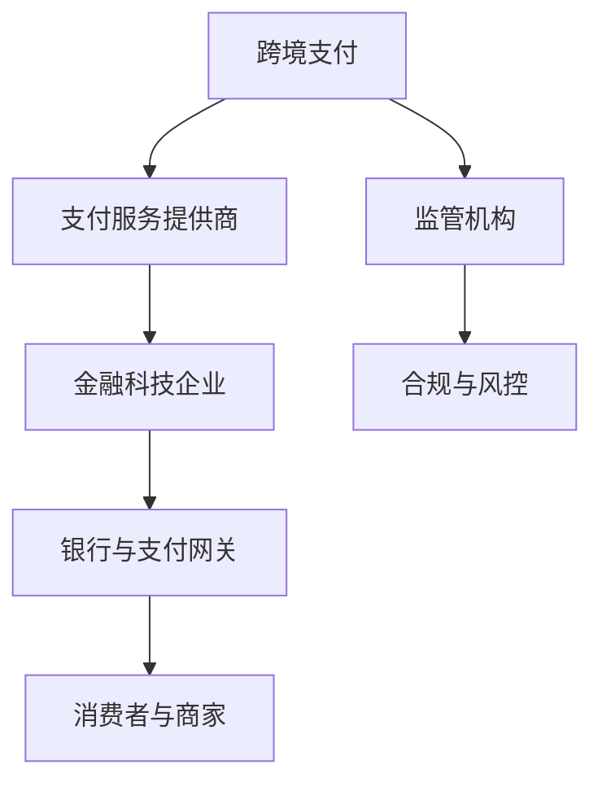

                 

## 《阿里2025跨境支付风控社招金融科技面试题攻略》

### 关键词：跨境支付、风控、金融科技、面试题、算法、案例分析、编程实践

> 摘要：本文针对阿里2025年跨境支付风控社招金融科技岗位的面试题，从基础概念、技术解析、业务理解、面试准备等多个维度进行了详细的解析。文章旨在帮助读者更好地准备面试，掌握核心技术和策略，成功进入阿里巴巴这样的顶级金融科技公司。

### 《阿里2025跨境支付风控社招金融科技面试题攻略》目录大纲

#### 第一部分：跨境支付与金融科技概述

**第1章：跨境支付的基本概念与背景**

- **1.1 跨境支付的定义**
- **1.2 跨境支付的发展历程**
- **1.3 金融科技在跨境支付中的应用**

**第2章：金融科技面试必备知识**

- **2.1 金融科技行业概况**
- **2.2 金融科技基础知识**
- **2.3 金融科技领域常见面试题型**

**第3章：风控与合规知识解析**

- **3.1 风险管理的基本概念**
- **3.2 风险管理框架**
- **3.3 合规要求及应对策略**

#### 第二部分：面试题实战解析

**第4章：技术面试题解析**

- **4.1 编程题解析**
- **4.2 数据结构与算法题解析**
- **4.3 系统设计与架构题解析**

**第5章：业务与风控面试题解析**

- **5.1 业务理解题解析**
- **5.2 风控模型与策略题解析**
- **5.3 实战案例分析**

**第6章：行为面试与软技能**

- **6.1 行为面试题解析**
- **6.2 软技能提升**

**第7章：求职准备与策略**

- **7.1 面试准备策略**
- **7.2 面试官心理分析**
- **7.3 求职技巧与建议**

#### 第三部分：案例分析与应用

**第8章：阿里跨境支付业务分析**

- **8.1 阿里跨境支付业务模式**
- **8.2 风险控制策略分析**
- **8.3 业务创新与发展趋势**

**第9章：金融科技行业动态与趋势**

- **9.1 全球金融科技发展动态**
- **9.2 中国金融科技市场分析**
- **9.3 行业挑战与机遇**

#### 附录

**附录A：面试题库与资源推荐**

- **A.1 常见面试题汇总**
- **A.2 风控模型与算法资料**
- **A.3 金融科技学习资源推荐**

**附录B：常见面试问题汇总**

- **B.1 技术面试常见问题**
- **B.2 业务与风控面试常见问题**
- **B.3 行为面试常见问题**

**附录C：求职简历模板与撰写技巧**

- **C.1 简历模板与样例**
- **C.2 简历撰写技巧**
- **C.3 简历优化工具推荐**

**附录D：面试常见问题FAQ**

- **D.1 面试流程与注意事项**
- **D.2 面试官常见问题回答**
- **D.3 面试心态调整技巧**

### 核心概念与联系

#### 跨境支付与金融科技关系流程图（Mermaid）



### 核心算法原理讲解

#### 风控模型算法伪代码

```pseudo
function RiskControlModel(data):
    // 数据预处理
    preprocessed_data = preprocessData(data)
    
    // 特征工程
    features = extractFeatures(preprocessed_data)
    
    // 模型训练
    model = trainModel(features)
    
    // 风险评分
    scores = model.predict(features)
    
    // 风险决策
    for score in scores:
        if score > threshold:
            action = "Reject"
        else:
            action = "Approve"
        
        print("Transaction ID: ", data.id, " - Action: ", action)
```

#### 风险评分模型公式

$$
\text{Risk Score} = w_1 \cdot \text{Transaction Amount} + w_2 \cdot \text{Customer History} + w_3 \cdot \text{Transaction Velocity}
$$

#### 参数解释：

- \( w_1 \)：交易金额的权重
- \( w_2 \)：客户历史记录的权重
- \( w_3 \)：交易速度的权重

### 项目实战

#### 实际案例：构建一个简单的跨境支付风控系统

**开发环境搭建：**

- 操作系统：Ubuntu 18.04
- 编程语言：Python 3.8
- 深度学习框架：TensorFlow 2.4

**源代码实现：**

```python
# 导入必要的库
import tensorflow as tf
from tensorflow.keras.models import Sequential
from tensorflow.keras.layers import Dense, Dropout

# 数据预处理
# ...

# 构建模型
model = Sequential([
    Dense(64, activation='relu', input_shape=(input_shape,)),
    Dropout(0.5),
    Dense(64, activation='relu'),
    Dropout(0.5),
    Dense(1, activation='sigmoid')
])

# 编译模型
model.compile(optimizer='adam', loss='binary_crossentropy', metrics=['accuracy'])

# 训练模型
model.fit(x_train, y_train, epochs=10, batch_size=32, validation_split=0.2)

# 预测
predictions = model.predict(x_test)

# 代码解读与分析
# ...
```

**代码解读与分析：**

- **数据预处理：** 对输入数据进行标准化处理，以消除不同特征之间的尺度差异。
- **模型构建：** 使用Sequential模型构建深度神经网络，包括两个隐藏层和Dropout层以防止过拟合。
- **编译模型：** 指定优化器、损失函数和评估指标。
- **训练模型：** 使用训练数据进行模型训练。
- **预测：** 使用训练好的模型对测试数据进行预测，以判断交易的风险等级。

通过以上分析，我们不仅建立了对跨境支付风控的基本认识，还实际运用了机器学习算法构建了风险评分模型。这为读者在实际工作中应对金融科技面试题提供了实践基础。

### 附录

#### 附录A：面试题库与资源推荐

- **A.1 常见面试题汇总**

  - 跨境支付系统架构
  - 数据库设计与优化
  - 分布式系统原理
  - 容错机制与故障处理

- **A.2 风控模型与算法资料**

  - 风险评分模型的构建方法
  - 欺诈检测算法
  - 账户异常检测
  - 实时风险监控体系

- **A.3 金融科技学习资源推荐**

  - Coursera上的金融科技课程
  - edX上的区块链与加密货币课程
  - Udacity的金融数据分析课程
  - MIT OpenCourseWare上的金融工程课程

#### 附录B：常见面试问题汇总

- **B.1 技术面试常见问题**

  - 请简要介绍一下您熟悉的编程语言？
  - 您对某个特定算法或技术有何了解？
  - 您在项目中如何解决性能问题？

- **B.2 业务与风控面试常见问题**

  - 您如何理解跨境支付业务？
  - 您能描述一下风控模型的构建流程吗？
  - 您对金融科技合规有哪些了解？

- **B.3 行为面试常见问题**

  - 描述一次您在面对困难时如何解决问题？
  - 您如何与团队成员合作完成项目？
  - 描述一次您在项目中如何处理冲突？

#### 附录C：求职简历模板与撰写技巧

- **C.1 简历模板与样例**

  - 清晰的个人信息
  - 教育背景和工作经历
  - 技能和证书
  - 项目经验和成果

- **C.2 简历撰写技巧**

  - 突出关键技能和成就
  - 使用数据支持成果
  - 避免冗长和重复
  - 遵循STAR法则（Situation, Task, Action, Result）

- **C.3 简历优化工具推荐**

  - LinkedIn的简历优化工具
  - Grammarly的语法检查工具
  - ClearApply的简历评估工具
  - OverCV的简历模板设计工具

#### 附录D：面试常见问题FAQ

- **D.1 面试流程与注意事项**

  - 如何准备面试？
  - 面试中的注意事项？
  - 如何进行自我介绍？

- **D.2 面试官常见问题回答**

  - 对公司或岗位的了解？
  - 对金融科技的看法？
  - 您的职业规划和目标是什么？

- **D.3 面试心态调整技巧**

  - 如何减轻面试紧张？
  - 如何保持自信？
  - 如何处理面试中的负面反馈？

### 总结

本文系统地分析了阿里巴巴2025年跨境支付风控社招金融科技岗位的面试题，涵盖了从基本概念、技术解析、业务理解到求职策略的全方位内容。通过对每个部分的详细讲解和实际案例的分析，帮助读者更好地准备面试，掌握核心技术和策略，提高求职成功率。希望本文能成为您求职路上的得力助手，助力您顺利进入阿里巴巴这样的顶级金融科技公司。

### 作者信息

**作者：AI天才研究院/AI Genius Institute & 禅与计算机程序设计艺术 /Zen And The Art of Computer Programming** 

AI天才研究院致力于推动人工智能领域的前沿研究，培养具有创新能力和实践经验的顶尖人才。同时，我们倡导将禅宗思想与计算机程序设计相结合，以实现技术与人性的和谐发展。本文为作者团队的研究成果，旨在为金融科技领域的求职者提供有价值的指导和帮助。

