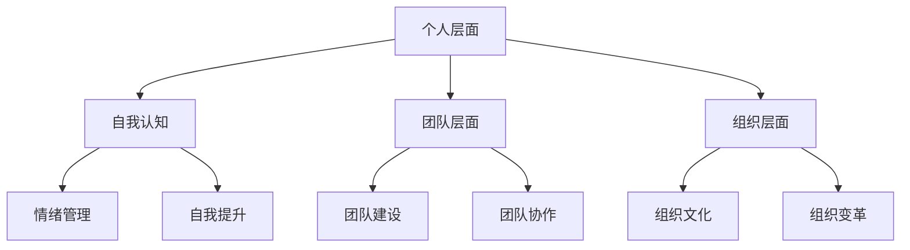
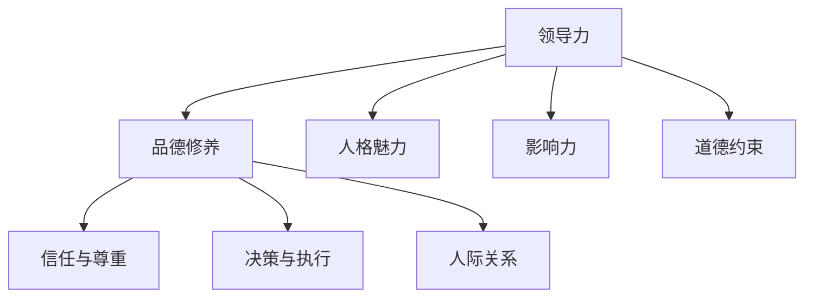
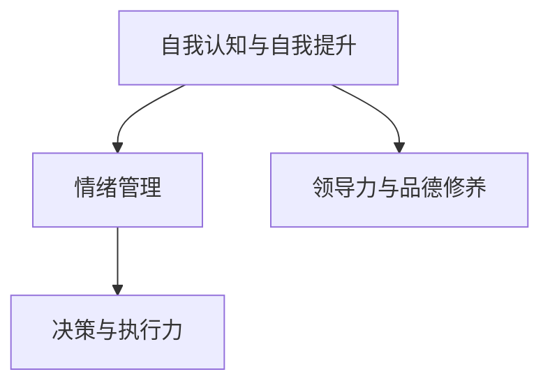
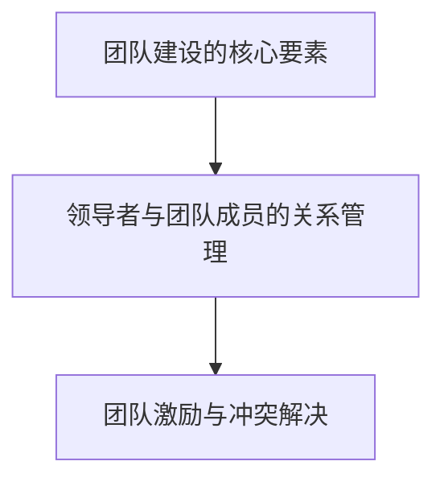
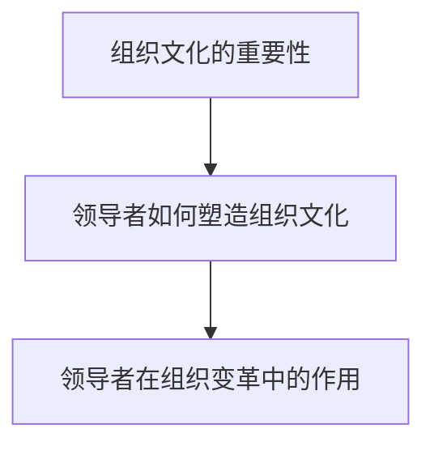

                 

# 领导力与品德修养：塑造高尚人格

## 概述

领导力与品德修养作为组织和社会发展中不可或缺的要素，正日益受到广泛关注。本文旨在探讨领导力与品德修养之间的关系，分析其核心概念、理论基础以及实际应用，并结合经典案例和当代领导者的实践，展望未来领导力与品德修养的发展趋势和面临的挑战。

关键词：领导力、品德修养、高尚人格、组织发展、社会责任

摘要：本文首先对领导力和品德修养进行定义和阐述，探讨二者之间的内在联系。接着，从自我认知、情绪管理、决策与执行力等方面，阐述塑造高尚人格的领导力实践。然后，讨论领导力在团队领导和组织领导中的应用，以及品德修养在企业管理和社会治理中的实际效果。最后，通过经典案例和当代领导者的实践，分析领导力与品德修养的成功要素，并展望其未来发展。

## 目录大纲

### 第一部分：领导力基础理论

#### 第1章：领导力的定义与核心要素
##### 1.1 领导力的概念与历史演变
##### 1.2 领导力的核心要素

#### 第2章：领导力与品德修养的关系
##### 2.1 领导力与品德修养的内在联系
##### 2.2 品德修养在领导力中的作用

### 第二部分：领导力实践

#### 第3章：塑造高尚人格的领导力实践
##### 3.1 自我认知与自我提升
##### 3.2 情绪管理
##### 3.3 决策与执行力

#### 第4章：团队领导力
##### 4.1 团队建设的核心要素
##### 4.2 领导者与团队成员的关系管理
##### 4.3 团队激励与冲突解决

#### 第5章：组织领导力
##### 5.1 组织文化的重要性
##### 5.2 领导者如何塑造组织文化
##### 5.3 领导者在组织变革中的作用

### 第三部分：品德修养与领导力的实际应用

#### 第6章：领导力与品德修养在企业管理中的应用
##### 6.1 品德修养在企业管理中的实践
##### 6.2 领导力在企业管理中的实践
##### 6.3 品德修养与领导力在企业文化中的融合

#### 第7章：领导力与品德修养在社会治理中的应用
##### 7.1 领导力与品德修养在公共管理中的实践
##### 7.2 领导力与品德修养在公共治理中的作用
##### 7.3 领导力与品德修养在社会服务中的实践

### 第四部分：领导力与品德修养案例研究

#### 第8章：领导力与品德修养经典案例解析
##### 8.1 案例一：杰克·韦尔奇与通用电气
##### 8.2 案例二：稻盛和夫与京瓷公司
##### 8.3 案例三：马云与阿里巴巴

#### 第9章：当代领导力与品德修养案例分析
##### 9.1 案例一：乔布斯的领导力与品德修养
##### 9.2 案例二：张一鸣的领导力与品德修养
##### 9.3 案例三：张瑞敏的领导力与品德修养

### 第五部分：领导力与品德修养的未来发展

#### 第10章：领导力与品德修养的新趋势
##### 10.1 数字化时代的领导力与品德修养
##### 10.2 可持续发展与领导力与品德修养
##### 10.3 领导力与品德修养的教育与培养

#### 第11章：领导力与品德修养的未来挑战
##### 10.1 领导力与品德修养的可持续性
##### 10.2 领导力与品德修养的全球视野
##### 10.3 领导力与品德修养的社会责任

### 附录：领导力与品德修养资源与工具

#### 附录 A：领导力与品德修养相关书籍推荐
#### 附录 B：领导力与品德修养在线课程推荐
#### 附录 C：领导力与品德修养工具与应用案例推荐

## 第一部分：领导力基础理论

### 第1章：领导力的定义与核心要素

#### 1.1 领导力的概念与历史演变

领导力是指一个人在组织中通过影响和激励他人，实现组织目标的能力。领导力不仅仅是一种技能，更是一种艺术。它涉及个人的品质、行为和认知方式，对组织和社会的发展具有重要影响。

领导力的历史演变经历了多个阶段。最早的观点认为领导力是一种天赋，只有少数人具备。随着心理学和组织行为学的发展，人们逐渐认识到领导力可以通过学习和实践得到提升。现代领导力理论强调领导力是一种动态过程，需要不断地适应和调整。

#### 1.2 领导力的核心要素

领导力包含多个核心要素，其中最为关键的是以下三个方面：

1. **愿景与目标**：领导者需要有一个清晰的愿景和目标，能够激励团队成员为之努力。愿景和目标是领导力的灵魂，是领导者引领团队前进的方向。

2. **影响力与信任**：领导者需要具备影响力，能够影响和激励团队成员。同时，领导者还需要建立信任，赢得团队成员的信任和尊重。

3. **决策与执行力**：领导者需要在不确定的环境中做出明智的决策，并确保决策得到有效执行。决策和执行力是领导力的核心，决定了组织的发展方向和效果。

#### 1.3 领导力的架构

领导力的架构可以分解为以下几个层次：

1. **个人层面**：领导者需要具备自我认知、情绪管理和自我提升的能力，形成高尚的人格品质。

2. **团队层面**：领导者需要建立高效团队，实现团队成员的协同合作，提高团队绩效。

3. **组织层面**：领导者需要塑造积极向上的组织文化，推动组织变革和创新。

#### 1.4 领导力的Mermaid流程图

以下是一个简单的领导力Mermaid流程图，展示了领导力的核心要素和架构：

## 第2章：领导力与品德修养的关系

#### 2.1 领导力与品德修养的内在联系

领导力与品德修养密切相关。品德修养是领导力的基石，决定了领导者的行为和影响力。一个高尚的品德修养能够帮助领导者赢得信任和尊重，提升领导力。

1. **信任与尊重**：品德修养是建立信任和尊重的基础。一个品德高尚的领导者能够赢得团队成员的信任和尊重，提高团队的凝聚力和执行力。

2. **决策与执行**：品德修养影响着领导者的决策和执行。一个品德高尚的领导者能够在不确定的环境中做出明智的决策，并确保决策得到有效执行。

3. **人际关系**：品德修养对人际关系有着重要影响。一个品德高尚的领导者能够建立良好的人际关系，提高团队的协作效率。

#### 2.2 品德修养在领导力中的作用

品德修养在领导力中发挥着重要作用，主要体现在以下几个方面：

1. **人格魅力**：品德修养能够塑造领导者的人格魅力，提高领导者的吸引力。一个品德高尚的领导者能够吸引和留住优秀的团队成员。

2. **影响力**：品德修养能够增强领导者的影响力。一个品德高尚的领导者能够通过自身的行为和品质影响团队成员，推动团队的发展。

3. **道德约束**：品德修养能够为领导者提供道德约束，使其在决策和执行过程中遵循道德准则。一个品德高尚的领导者能够做出符合道德规范的决策，为团队和社会创造价值。

#### 2.3 领导力与品德修养的Mermaid流程图

以下是一个简单的领导力与品德修养的Mermaid流程图，展示了领导力与品德修养的内在联系和作用：

## 第二部分：领导力实践

### 第3章：塑造高尚人格的领导力实践

#### 3.1 自我认知与自我提升

自我认知是领导力实践的基础。领导者需要深入了解自己的性格、价值观和优缺点，明确自己的定位和发展方向。

1. **自我认知的方法**：
   - 反思：通过反思自己的行为和决策，了解自己的优点和不足。
   - 沟通：与团队成员和导师进行沟通，获取他们的反馈和建议。
   - 专业测评：借助专业测评工具，了解自己的性格特点和潜在能力。

2. **自我提升的策略**：
   - 学习与成长：不断学习新知识，提升自己的技能和素质。
   - 自我激励：设定目标，激励自己不断追求进步。
   - 建立反馈机制：定期接受反馈，调整自己的行为和态度。

#### 3.2 情绪管理

情绪管理是领导力实践中的重要环节。领导者需要学会控制自己的情绪，保持冷静和理智，以应对各种挑战和压力。

1. **情绪管理的方法**：
   - 深呼吸：通过深呼吸来放松身心，缓解紧张情绪。
   - 认知重构：调整自己的认知，将消极情绪转化为积极情绪。
   - 时间管理：合理安排时间，避免因工作压力导致情绪失控。

2. **情绪管理的策略**：
   - 建立积极的心态：培养乐观、积极的心态，面对困难和挑战。
   - 保持良好的作息：保持规律的作息，保证充足的睡眠。
   - 寻求支持：在遇到困难时，向家人、朋友或专业人士寻求支持。

#### 3.3 决策与执行力

决策与执行力是领导力实践的核心。领导者需要做出明智的决策，并确保决策得到有效执行。

1. **决策的方法**：
   - 信息收集：充分收集和分析相关信息，为决策提供依据。
   - 情景分析：分析不同决策可能带来的后果，选择最优方案。
   - 风险评估：评估决策的风险，制定应对措施。

2. **决策的策略**：
   - 保持客观：在决策过程中保持客观，避免因个人偏好或情绪影响决策。
   - 求助与咨询：在决策过程中，寻求专业人士或团队成员的建议和意见。
   - 跟进与调整：决策后，持续跟进决策的执行情况，根据实际情况进行调整。

#### 3.4 领导力与品德修养的Mermaid流程图

以下是一个简单的领导力与品德修养的Mermaid流程图，展示了塑造高尚人格的领导力实践：

## 第4章：团队领导力

#### 4.1 团队建设的核心要素

团队建设是团队领导力的核心任务。一个高效的团队能够实现成员之间的协同合作，提高团队绩效。团队建设的核心要素包括以下几个方面：

1. **目标明确**：团队需要明确共同的目标和愿景，形成统一的价值观和行动方向。

2. **信任与尊重**：团队成员之间需要建立信任和尊重，相互支持，共同成长。

3. **分工协作**：根据团队成员的能力和特长，合理分工，确保任务分配合理，提高工作效率。

4. **沟通与反馈**：建立有效的沟通机制，及时传递信息，鼓励团队成员之间的反馈和交流。

5. **激励与奖励**：制定激励机制，激发团队成员的工作热情和创造力，奖励优秀表现。

#### 4.2 领导者与团队成员的关系管理

领导者与团队成员的关系管理是团队领导力的重要组成部分。一个优秀的领导者需要建立良好的沟通渠道，尊重团队成员，关心他们的成长和发展。

1. **沟通与倾听**：领导者需要积极倾听团队成员的意见和建议，鼓励他们表达自己的想法，建立信任和尊重。

2. **激励与支持**：领导者需要关注团队成员的需求，提供必要的支持和帮助，激发他们的工作动力。

3. **授权与责任**：领导者需要合理授权，明确团队成员的职责和权限，培养他们的责任感和自主性。

4. **冲突解决**：在团队管理过程中，领导者需要及时解决冲突，维护团队的和谐稳定。

#### 4.3 团队激励与冲突解决

团队激励是团队领导力的重要任务。领导者需要制定合理的激励机制，激发团队成员的积极性、主动性和创造性。

1. **激励机制**：
   - 物质激励：提供具有竞争力的薪酬和福利待遇。
   - 精神激励：认可和奖励团队成员的突出贡献，提供成长和发展机会。
   - 荣誉激励：树立榜样，表彰优秀团队和个人，激发团队成员的荣誉感。

2. **冲突解决**：
   - 了解冲突原因：了解团队成员之间的冲突原因，找到问题的根源。
   - 沟通与协商：通过沟通和协商，寻求共识，化解冲突。
   - 中立调解：在必要时，由第三方进行中立调解，确保公正和客观。

#### 4.4 领导力与团队领导力的Mermaid流程图

以下是一个简单的领导力与团队领导力的Mermaid流程图，展示了团队领导力的核心要素和实际操作：

## 第5章：组织领导力

#### 5.1 组织文化的重要性

组织文化是组织领导力的核心，对组织的发展具有重要影响。组织文化是指组织内部共同价值观、信念、行为规范和生活方式的总和。

1. **组织文化的定义**：组织文化是组织在长期发展过程中形成的共同价值观、信念和行为规范，体现了组织的使命、愿景和核心价值观。

2. **组织文化的要素**：
   - 价值观：组织文化的核心，决定了组织的行动方向和行为准则。
   - 愿景：组织发展的目标，激励团队成员为之努力。
   - 行为规范：组织内部的行为准则，确保组织运行的有序和高效。

3. **组织文化的重要性**：
   - 激励员工：组织文化能够激发员工的工作热情和创造力，提高员工的工作满意度和忠诚度。
   - 提高效率：组织文化能够形成良好的工作氛围，提高团队的协作效率，降低沟通成本。
   - 稳定团队：组织文化能够增强团队的凝聚力，降低人员流失率，提高团队稳定性。

#### 5.2 领导者如何塑造组织文化

领导者是塑造组织文化的关键因素。领导者需要通过自身的言行和决策，推动组织文化的形成和发展。

1. **领导者塑造组织文化的方法**：
   - 明确组织文化：领导者需要明确组织文化的核心价值观和行为规范，形成统一的组织理念。
   - 树立榜样：领导者需要以身作则，用自己的言行示范组织文化，树立榜样。
   - 激励与引导：领导者需要激励和引导员工，推动他们积极参与组织文化的建设。
   - 沟通与传播：领导者需要通过沟通和传播，将组织文化传递给全体员工，形成共识。

2. **领导者塑造组织文化的策略**：
   - 创造积极的工作氛围：领导者需要创造积极的工作氛围，鼓励员工创新和尝试，提高团队的凝聚力。
   - 建立有效的沟通渠道：领导者需要建立有效的沟通渠道，及时传递组织文化，确保员工对组织文化的认同和理解。
   - 设立激励机制：领导者需要设立激励机制，激发员工积极参与组织文化的建设，提高员工的工作满意度和忠诚度。

#### 5.3 领导者在组织变革中的作用

组织变革是组织发展的重要环节，领导者是组织变革的关键推动者。领导者需要通过有效的领导力，推动组织变革，实现组织的可持续发展。

1. **组织变革的定义**：组织变革是指组织在发展过程中，为了适应环境变化、提升竞争力而进行的一系列战略调整和改革。

2. **组织变革的类型**：
   - 结构变革：调整组织结构，优化资源配置，提高组织效率。
   - 文化变革：改变组织文化，建立新的价值观和行为规范，提高员工的凝聚力和创造力。
   - 业务变革：调整业务战略，拓展市场，提升竞争力。

3. **领导者在组织变革中的作用**：
   - 指导与引导：领导者需要明确组织变革的目标和方向，指导员工理解和接受变革，引导员工积极参与变革。
   - 动员与激励：领导者需要激发员工的积极性，动员员工积极参与组织变革，激励员工克服变革过程中的困难和挑战。
   - 协调与沟通：领导者需要协调各部门之间的利益关系，建立有效的沟通渠道，确保组织变革的顺利进行。

#### 5.4 领导力与组织领导力的Mermaid流程图

以下是一个简单的领导力与组织领导力的Mermaid流程图，展示了组织领导力的核心要素和实际操作：

## 第三部分：品德修养与领导力的实际应用

### 第6章：领导力与品德修养在企业管理中的应用

#### 6.1 品德修养在企业管理中的实践

品德修养在企业管理中具有重要意义。一个品德高尚的领导者能够树立良好的榜样，引导员工树立正确的价值观，提高企业的整体管理水平。

1. **品德修养在企业管理中的实践方法**：
   - 建立道德准则：企业需要制定明确的道德准则，明确员工的职业道德和行为规范。
   - 加强员工培训：企业需要加强对员工的品德修养培训，提高员工的道德素质。
   - 营造良好的企业氛围：企业需要营造积极向上的企业文化，鼓励员工树立正确的价值观。

2. **品德修养在企业管理中的实践策略**：
   - 建立激励机制：企业需要设立激励机制，鼓励员工遵守道德规范，提高道德水平。
   - 加强监督与考核：企业需要加强对员工的监督与考核，确保员工的行为符合道德规范。
   - 建立反馈机制：企业需要建立反馈机制，鼓励员工对企业的道德建设提出意见和建议。

#### 6.2 领导力在企业管理中的实践

领导力在企业管理中起着至关重要的作用。一个优秀的领导者能够激发员工的工作热情和创造力，提高企业的管理水平和竞争力。

1. **领导力在企业管理中的实践方法**：
   - 设定明确的目标和愿景：领导者需要为企业设定明确的目标和愿景，激发员工的工作动力。
   - 建立高效的团队：领导者需要建立高效的团队，实现团队成员的协同合作，提高团队绩效。
   - 激发员工的潜力：领导者需要关注员工的发展，激发员工的潜力，提高员工的工作能力。

2. **领导力在企业管理中的实践策略**：
   - 信任与尊重：领导者需要建立信任和尊重，赢得员工的支持和信任，提高团队的凝聚力。
   - 沟通与反馈：领导者需要建立有效的沟通渠道，鼓励员工表达意见和建议，及时反馈员工的工作表现。
   - 激励与奖励：领导者需要制定合理的激励机制，激发员工的工作热情和创造力，提高员工的工作满意度。

#### 6.3 品德修养与领导力在企业文化中的融合

品德修养与领导力在企业文化中的融合，能够提高企业的核心竞争力，促进企业的可持续发展。

1. **品德修养与领导力在企业文化建设中的融合方法**：
   - 建立共同价值观：企业需要建立共同的价值观，将品德修养和领导力融入企业文化中。
   - 融入日常工作：企业需要将品德修养和领导力融入日常工作，形成良好的工作氛围。
   - 强化培训与教育：企业需要加强对员工的品德修养和领导力培训，提高员工的道德素质和领导能力。

2. **品德修养与领导力在企业文化建设中的融合策略**：
   - 建立激励机制：企业需要建立激励机制，鼓励员工践行品德修养和领导力，提高员工的工作积极性。
   - 强化监督与考核：企业需要加强对员工的监督与考核，确保员工的行为符合品德修养和领导力的要求。
   - 建立反馈机制：企业需要建立反馈机制，鼓励员工对企业的品德修养和领导力建设提出意见和建议。

### 第7章：领导力与品德修养在社会治理中的应用

#### 7.1 领导力与品德修养在公共管理中的实践

领导力与品德修养在公共管理中具有重要意义。一个品德高尚的领导者能够树立良好的社会形象，提高公共管理水平，促进社会和谐稳定。

1. **领导力与品德修养在公共管理中的实践方法**：
   - 设定明确的目标和使命：领导者需要为公共管理设定明确的目标和使命，激发社会成员的参与热情。
   - 建立高效的团队：领导者需要建立高效的团队，实现社会资源的合理配置，提高公共服务的效率。
   - 激发社会成员的潜力：领导者需要关注社会成员的发展，激发他们的潜力，提高他们的社会责任感。

2. **领导力与品德修养在公共管理中的实践策略**：
   - 信任与尊重：领导者需要建立信任和尊重，赢得社会成员的支持和信任，提高社会的凝聚力。
   - 沟通与反馈：领导者需要建立有效的沟通渠道，鼓励社会成员表达意见和建议，及时反馈公共管理的成效。
   - 激励与奖励：领导者需要制定合理的激励机制，激发社会成员的参与热情和创造力，提高社会的活力。

#### 7.2 领导力与品德修养在公共治理中的作用

领导力与品德修养在公共治理中起着至关重要的作用。一个品德高尚的领导者能够推动公共治理的改革和创新，提高公共治理的水平和效率。

1. **领导力与品德修养在公共治理中的重要作用**：
   - 提高公共管理水平：领导力与品德修养能够提高公共管理水平，优化公共资源的使用，提高公共服务的质量。
   - 促进社会和谐：领导力与品德修养能够促进社会和谐，减少社会矛盾和冲突，提高社会的稳定性和安全感。
   - 推动公共治理创新：领导力与品德修养能够推动公共治理的创新，探索新的治理模式，提高公共治理的现代化水平。

2. **领导力与品德修养在公共治理中的实践策略**：
   - 强化监督与考核：领导者需要加强对公共治理的监督与考核，确保公共治理的透明和公正。
   - 建立反馈机制：领导者需要建立反馈机制，鼓励社会成员对公共治理提出意见和建议，提高公共治理的民主性和科学性。
   - 推动制度创新：领导者需要推动公共治理的制度创新，建立适应时代发展的治理模式，提高公共治理的效率和效果。

#### 7.3 领导力与品德修养在社会服务中的实践

领导力与品德修养在社会服务中具有重要意义。一个品德高尚的领导者能够为社会服务提供有效的指导和帮助，提高社会服务的质量和水平。

1. **领导力与品德修养在社会服务中的实践方法**：
   - 设定明确的服务目标：领导者需要为社会服务设定明确的目标和使命，明确服务方向和重点。
   - 建立专业的服务团队：领导者需要建立专业的服务团队，提高服务团队的专业素养和服务能力。
   - 关注服务对象的实际需求：领导者需要关注服务对象的实际需求，提供针对性的服务，提高服务满意度。

2. **领导力与品德修养在社会服务中的实践策略**：
   - 诚信与责任感：领导者需要树立诚信和责任感，为社会服务提供可靠和有效的保障。
   - 沟通与协调：领导者需要建立有效的沟通渠道，协调各部门之间的工作，提高服务效率。
   - 激励与奖励：领导者需要制定合理的激励机制，激发服务团队的工作热情和创造力，提高服务质量和水平。

### 第四部分：领导力与品德修养案例研究

#### 第8章：领导力与品德修养经典案例解析

#### 8.1 案例一：杰克·韦尔奇与通用电气

杰克·韦尔奇（Jack Welch）是通用电气（General Electric，简称GE）的前首席执行官，被誉为现代企业管理的传奇人物。他的领导风格和品德修养对通用电气的发展和变革产生了深远的影响。

1. **领导力与品德修养的体现**：
   - **明确的愿景和目标**：杰克·韦尔奇提出了“无边界组织”的愿景，鼓励员工跨部门合作，提高组织的创新能力。
   - **激励与奖励机制**：他推出了“资本分配效率”（Capital Allocation System）和“超越期望”（Management by walking around）等激励措施，激发了员工的积极性和创造力。
   - **诚信与责任感**：杰克·韦尔奇坚持诚信和责任感，强调领导者要以身作则，树立良好的榜样。

2. **案例启示**：
   - **领导者的愿景和目标对组织发展至关重要**。一个明确的愿景和目标能够激励员工共同努力，推动组织前进。
   - **激励与奖励机制是提高员工积极性、创造力和绩效的重要手段**。合理的激励措施能够激发员工的潜力，提高组织的整体绩效。
   - **诚信与责任感是领导者赢得员工信任和尊重的关键**。领导者要以身作则，树立良好的道德风范，为组织树立榜样。

#### 8.2 案例二：稻盛和夫与京瓷公司

稻盛和夫（Masayoshi稻盛）是日本著名的企业家和哲学家，他是京瓷公司（Kyocera Corporation）的创始人，同时还是稻盛财团的创始人。他的领导风格和品德修养对京瓷公司的成功和持续发展产生了深远的影响。

1. **领导力与品德修养的体现**：
   - **哲学与价值观**：稻盛和夫提出了“活法”（Motto）这一哲学理念，强调企业要以道德为基础，追求全体员工的幸福和社会的繁荣。
   - **经营哲学**：他提出了“创造性毁灭”（Kaizen）理念，鼓励员工不断改进和创新，推动企业的持续发展。
   - **诚信与责任感**：稻盛和夫坚持诚信和责任感，强调企业家要以社会利益为先，积极承担社会责任。

2. **案例启示**：
   - **哲学与价值观是企业文化的基础**。一个积极向上的哲学和价值观能够引导企业的发展方向，推动企业的持续进步。
   - **经营哲学是企业发展的重要动力**。通过不断的改进和创新，企业能够保持竞争优势，实现持续发展。
   - **诚信与责任感是企业家精神的体现**。企业家要以诚信和责任感为核心，积极承担社会责任，为社会的繁荣和发展做出贡献。

#### 8.3 案例三：马云与阿里巴巴

马云（Jack Ma）是中国著名的企业家和慈善家，他是阿里巴巴集团的创始人，也是阿里巴巴集团的董事局主席。他的领导风格和品德修养对阿里巴巴的崛起和发展产生了深远的影响。

1. **领导力与品德修养的体现**：
   - **愿景与使命**：马云提出了“让天下没有难做的生意”的使命，鼓励员工创造便捷的电子商务环境，推动社会的进步。
   - **企业文化**：他强调“客户第一、员工第二、股东第三”的企业价值观，强调员工和客户的重要性。
   - **诚信与责任感**：马云坚持诚信和责任感，强调企业家要以诚信为本，积极承担社会责任。

2. **案例启示**：
   - **愿景与使命是企业发展的指南针**。一个明确的愿景和使命能够激励员工共同努力，推动企业的发展。
   - **企业文化是组织的灵魂**。积极向上的企业文化能够凝聚员工的力量，提高组织的凝聚力。
   - **诚信与责任感是企业家精神的核心**。企业家要以诚信和责任感为核心，为社会的繁荣和发展做出贡献。

### 第9章：当代领导力与品德修养案例分析

#### 9.1 案例一：乔布斯的领导力与品德修养

史蒂夫·乔布斯（Steve Jobs）是美国著名的企业家和设计师，他是苹果公司的联合创始人，也是苹果公司的前首席执行官。他的领导力与品德修养对苹果公司的创新和发展产生了深远的影响。

1. **领导力与品德修养的体现**：
   - **创新与设计**：乔布斯以其卓越的创新和设计理念，推动了苹果公司的产品创新，使苹果成为全球最具创新力的公司之一。
   - **激情与愿景**：乔布斯以其独特的激情和愿景，激发了员工的创造力和创新精神，使苹果公司始终保持领先地位。
   - **诚信与责任感**：乔布斯始终坚持诚信和责任感，即使面对质疑和困境，他也始终保持坚定的信念，为员工和股东的利益着想。

2. **案例启示**：
   - **创新是企业发展的重要动力**。领导者要具备创新意识，推动企业的持续创新，保持竞争优势。
   - **激情与愿景是领导力的重要组成部分**。领导者要拥有激情和愿景，激发员工的积极性和创造力。
   - **诚信与责任感是企业家精神的核心**。领导者要以诚信和责任感为核心，为员工和股东创造价值，为社会做出贡献。

#### 9.2 案例二：张一鸣的领导力与品德修养

张一鸣是中国著名的企业家和程序员，他是字节跳动的创始人，也是字节跳动的首席执行官。他的领导力与品德修养对字节跳动的发展和创新产生了深远的影响。

1. **领导力与品德修养的体现**：
   - **技术创新**：张一鸣以其卓越的技术创新和运营能力，推动了字节跳动的快速发展和多样化业务布局。
   - **敏捷管理**：张一鸣倡导敏捷管理，鼓励员工快速响应市场变化，提高企业的竞争力。
   - **诚信与责任感**：张一鸣始终坚持诚信和责任感，强调企业家要为社会创造价值，为员工提供良好的发展平台。

2. **案例启示**：
   - **技术创新是企业持续发展的重要保障**。领导者要具备技术创新意识，推动企业的技术进步和业务创新。
   - **敏捷管理是提高企业竞争力的有效手段**。领导者要善于应对市场变化，提高企业的灵活性和响应速度。
   - **诚信与责任感是企业家精神的核心**。领导者要以诚信和责任感为核心，为员工和社会创造价值。

#### 9.3 案例三：张瑞敏的领导力与品德修养

张瑞敏是中国著名的企业家和改革家，他是海尔集团的创始人，也是海尔集团的首席执行官。他的领导力与品德修养对海尔集团的发展和创新产生了深远的影响。

1. **领导力与品德修养的体现**：
   - **质量管理**：张瑞敏提出了“用户至上”的质量理念，推动了海尔集团的质量管理创新，使海尔成为全球知名的家电品牌。
   - **企业文化**：他强调“真诚到永远”的企业文化，鼓励员工真诚对待用户，为社会创造价值。
   - **诚信与责任感**：张瑞敏始终坚持诚信和责任感，强调企业家要对社会负责，为员工创造良好的工作环境。

2. **案例启示**：
   - **质量管理是企业发展的重要基石**。领导者要注重质量管理，提高产品和服务的质量，赢得用户的信任。
   - **企业文化是企业发展的灵魂**。领导者要建立积极向上的企业文化，激发员工的创造力和创新精神。
   - **诚信与责任感是企业家精神的核心**。领导者要以诚信和责任感为核心，为员工和社会创造价值。

## 第五部分：领导力与品德修养的未来发展

### 第10章：领导力与品德修养的新趋势

#### 10.1 数字化时代的领导力与品德修养

随着数字化时代的到来，领导力与品德修养面临着新的挑战和机遇。数字化技术不仅改变了企业运作的方式，也对领导者的领导能力和品德修养提出了更高的要求。

1. **数字化时代的领导力新趋势**：
   - **数据驱动**：领导者需要具备数据分析和决策能力，以数据驱动的方式进行管理决策。
   - **敏捷性**：领导者需要具备敏捷性，能够快速适应数字化环境中的变化和不确定性。
   - **数字化转型**：领导者需要推动企业的数字化转型，利用数字化技术提高效率和创新。

2. **数字化时代的品德修养新趋势**：
   - **诚信与透明**：数字化时代要求领导者更加注重诚信和透明，以赢得用户和员工的信任。
   - **网络安全**：领导者需要重视网络安全，确保企业数据和用户信息的安全。
   - **社会责任**：领导者需要承担社会责任，关注数字化时代对环境和社会的影响。

#### 10.2 可持续发展与领导力与品德修养

可持续发展是当今世界面临的重大挑战，领导力与品德修养在推动可持续发展中发挥着重要作用。领导者需要具备可持续发展的意识和责任感，推动企业和社会的可持续发展。

1. **可持续发展的领导力新趋势**：
   - **环境保护**：领导者需要关注环境保护，推动企业采取绿色生产和环保措施。
   - **资源管理**：领导者需要优化资源管理，提高资源利用效率，减少浪费。
   - **社会责任**：领导者需要承担社会责任，关注社会问题，推动社会进步。

2. **可持续发展的品德修养新趋势**：
   - **道德责任**：领导者需要具备道德责任，坚持道德原则，为可持续发展做出贡献。
   - **社会责任感**：领导者需要培养社会责任感，关注社会问题，推动社会进步。
   - **环境意识**：领导者需要具备环境意识，关注环境保护，推动绿色生产。

#### 10.3 领导力与品德修养的教育与培养

领导力与品德修养的教育与培养是推动社会进步和经济发展的重要途径。通过系统的教育和培训，可以培养出具备领导能力和品德修养的优秀人才。

1. **领导力与品德修养教育的趋势**：
   - **跨学科融合**：领导力与品德修养教育需要跨学科融合，结合心理学、管理学、哲学等多学科知识。
   - **实践导向**：领导力与品德修养教育需要注重实践，通过实际案例和项目实践提高学生的领导能力和品德修养。
   - **终身学习**：领导力与品德修养教育需要倡导终身学习，培养具备持续学习和创新能力的领导者。

2. **领导力与品德修养培养的策略**：
   - **企业培训**：企业需要建立内部培训体系，提供领导力与品德修养培训，提高员工的能力和素质。
   - **学校教育**：学校需要将领导力与品德修养纳入课程体系，培养学生的领导能力和品德修养。
   - **社会培训**：社会需要提供多样化的领导力与品德修养培训，满足不同人群的需求。

### 第11章：领导力与品德修养的未来挑战

#### 11.1 领导力与品德修养的可持续性

领导力与品德修养的可持续性是未来领导者面临的重要挑战。随着社会和环境的变化，领导者需要不断适应新的环境和要求，保持领导力和品德修养的可持续性。

1. **领导力与品德修养可持续性的挑战**：
   - **技术变革**：数字化和人工智能技术的快速发展，对领导者的技术素养和能力提出了新的要求。
   - **环境变化**：全球环境变化和社会问题，要求领导者具备更广阔的视野和责任感。
   - **竞争压力**：激烈的市场竞争，要求领导者具备更高的领导能力和创新精神。

2. **领导力与品德修养可持续性的策略**：
   - **持续学习**：领导者需要不断学习和更新知识，提高自身的领导能力和品德修养。
   - **创新思维**：领导者需要具备创新思维，积极应对变化和挑战。
   - **社会参与**：领导者需要积极参与社会活动，推动社会进步，增强领导力的可持续性。

#### 11.2 领导力与品德修养的全球视野

领导力与品德修养的全球视野是未来领导者的重要素质。在全球化和多元化的背景下，领导者需要具备全球视野，理解和尊重不同文化，推动全球合作和可持续发展。

1. **领导力与品德修养全球视野的挑战**：
   - **文化差异**：不同国家和地区的文化差异，对领导者的跨文化沟通和协调能力提出了新的要求。
   - **全球治理**：全球治理体系的变革和挑战，要求领导者具备全球治理能力，推动全球合作。
   - **国际合作**：国际合作和全球竞争的加剧，要求领导者具备全球合作精神，推动全球可持续发展。

2. **领导力与品德修养全球视野的策略**：
   - **跨文化学习**：领导者需要学习和尊重不同文化，提高跨文化沟通和协调能力。
   - **全球治理能力**：领导者需要具备全球治理能力，积极参与国际事务，推动全球治理体系的完善。
   - **国际合作精神**：领导者需要具备国际合作精神，推动全球合作，共同应对全球挑战。

#### 11.3 领导力与品德修养的社会责任

领导力与品德修养的社会责任是未来领导者的重要使命。领导者需要具备社会责任感，关注社会问题，积极参与社会公益事业，推动社会的和谐与进步。

1. **领导力与品德修养社会责任的挑战**：
   - **社会问题**：随着社会的发展，社会问题日益凸显，要求领导者关注社会问题，积极参与社会公益事业。
   - **环境问题**：全球环境问题日益严重，要求领导者具备环境责任感，推动绿色发展。
   - **公平正义**：社会公平和正义是领导者需要关注的重要问题，要求领导者推动社会公平和正义。

2. **领导力与品德修养社会责任的策略**：
   - **社会参与**：领导者需要积极参与社会活动，推动社会公益事业的发展。
   - **环境保护**：领导者需要关注环境保护，推动绿色发展，为子孙后代创造美好的生活环境。
   - **公平正义**：领导者需要推动社会公平和正义，消除贫困和不平等，推动社会的和谐与进步。

### 附录：领导力与品德修养资源与工具

#### 附录 A：领导力与品德修养相关书籍推荐

1. **《领导力五要素：如何成为一个高效的领导者》**
   - 作者：约翰·迈尔斯-摩根（John M. I. 摩根）
   - 简介：本书详细阐述了领导力的五个核心要素，包括目标、愿景、团队、执行和道德，帮助读者掌握领导力的关键要素。

2. **《品德修养：如何培养高尚的人格》**
   - 作者：斯蒂芬·罗宾斯（Stephen P. Robbins）
   - 简介：本书从品德修养的角度，探讨了如何在日常生活中培养高尚的人格，提高自我管理和人际交往能力。

3. **《领导者的品质：成为伟大领导者的八个习惯》**
   - 作者：史蒂芬·柯维（Stephen R. Covey）
   - 简介：本书介绍了成为伟大领导者所需的八个习惯，包括积极主动、以终为始、要事第一等，帮助读者培养良好的领导习惯。

#### 附录 B：领导力与品德修养在线课程推荐

1. **“领导力与影响力”**
   - 提供平台：Coursera
   - 简介：本课程介绍了领导力的基本概念和实际应用，包括如何建立影响力、制定决策和激励团队等。

2. **“品德修养：如何在生活中培养高尚的人格”**
   - 提供平台：edX
   - 简介：本课程探讨了品德修养的重要性，以及如何在日常生活中培养高尚的人格，提高自我修养。

3. **“领导力与团队管理”**
   - 提供平台：LinkedIn Learning
   - 简介：本课程介绍了领导力和团队管理的基本原理和实践技巧，包括如何建立高效团队、激励员工和解决冲突等。

#### 附录 C：领导力与品德修养工具与应用案例推荐

1. **“360度反馈工具”**
   - 简介：360度反馈工具是一种评估个人绩效和领导能力的方法，通过收集同事、下属和上级的反馈，帮助领导者了解自己的优缺点。

2. **“道德决策矩阵”**
   - 简介：道德决策矩阵是一种帮助领导者进行道德决策的工具，通过分析决策的道德影响，帮助领导者做出符合道德规范的决策。

3. **“团队建设游戏”**
   - 简介：团队建设游戏是一种通过游戏和互动活动，提高团队成员之间的协作和信任的工具，适用于各种类型的团队建设和培训活动。

