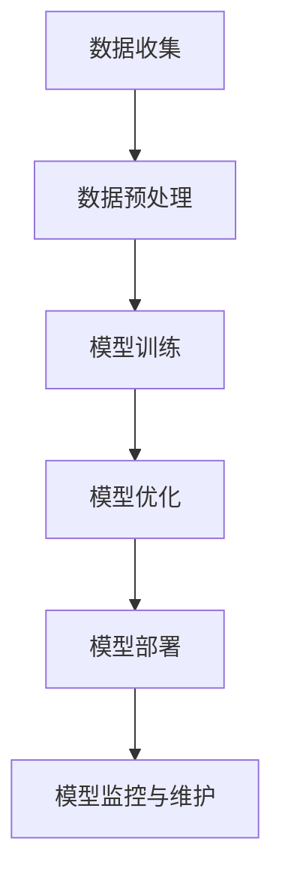
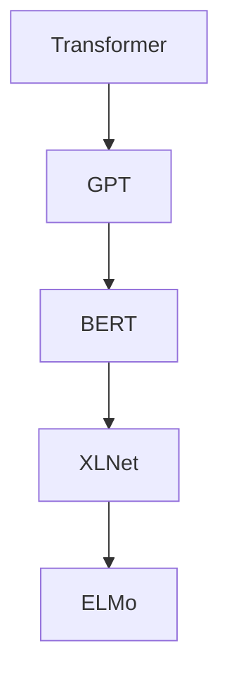
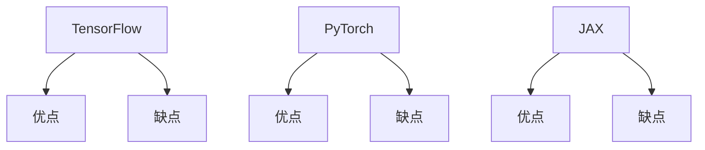

                 

# AI 大模型创业：如何利用品牌优势？

> **关键词**：AI大模型、创业、品牌优势、技术应用、商业模式

> **摘要**：本文将深入探讨AI大模型在创业中的应用，分析如何利用品牌优势推动创业项目的成功。我们将从AI大模型的基础知识出发，逐步深入到技术原理、应用实践、创业策略和性能优化等各个方面，以帮助创业者更好地把握AI大模型的潜力，构建强大的品牌优势。

----------------------------------------------------------------

## 目录大纲

- **第一部分: AI大模型基础**
  - 第1章: AI大模型概述
  - 第2章: AI大模型技术基础

- **第二部分: AI大模型应用与实践**
  - 第3章: AI大模型在商业中的应用
  - 第4章: AI大模型创业策略

- **第三部分: AI大模型开发与优化**
  - 第5章: AI大模型开发环境与工具
  - 第6章: AI大模型性能优化
  - 第7章: AI大模型评估与测试

- **附录**
  - 附录 A: 开发工具与资源

## 第一部分: AI大模型基础

### 第1章: AI大模型概述

#### 1.1 AI大模型定义与核心特点

AI大模型是指那些能够处理大规模数据、具有高度复杂性和自适应能力的人工智能模型。它们的核心特点包括：

1. **大规模数据集**：AI大模型能够处理海量数据，从而提取更多的特征和信息。
2. **复杂结构**：通常包含多层神经网络，每个层级都能对输入数据进行更加精细的处理。
3. **自适应能力**：通过不断的学习和优化，AI大模型能够适应不同的任务和数据集。

**Mermaid流程图**: AI大模型构建流程



#### 1.2 主流AI大模型简介

目前，主流的AI大模型包括Transformer、BERT、GPT等。它们在不同的领域和应用场景中都有广泛的应用。

**Mermaid流程图**: 主流AI大模型关系图



### 第2章: AI大模型技术基础

#### 2.1 深度学习与神经网络基础

深度学习是AI大模型的核心技术之一。它基于多层神经网络，通过逐层提取特征，实现对数据的复杂建模。

**伪代码**: 神经网络基础算法

```python
def forward_propagation(x, weights, biases):
    # 初始化激活值和损失
    activations = [x]
    losses = []

    # 循环遍历神经网络层
    for layer in range(len(weights)):
        # 计算当前层的输出
        z = np.dot(activations[-1], weights[layer]) + biases[layer]
        # 计算激活值
        activation = sigmoid(z)
        # 添加到激活值列表
        activations.append(activation)

        # 计算损失
        loss = mean_squared_error(y, activation)
        # 添加到损失列表
        losses.append(loss)

    return activations, losses
```

**数学模型**: 激活函数与损失函数

```latex
% 激活函数
f(x) = \sigma(z) = \frac{1}{1 + e^{-z}}

% 损失函数
L(y, \hat{y}) = \frac{1}{2} \sum_{i=1}^{n} (y_i - \hat{y_i})^2
```

#### 2.2 自然语言处理技术概览

自然语言处理（NLP）是AI大模型应用的一个重要领域。它涉及文本数据的处理和理解。

**伪代码**: 词嵌入算法

```python
def train_word2vec(corpus, embedding_size, window_size, iter_num):
    # 初始化词向量
    embedding_matrix = initialize_embedding_matrix(corpus, embedding_size)

    # 循环训练
    for iteration in range(iter_num):
        for word, context in generate_context_pairs(corpus, window_size):
            # 计算梯度
            grad = compute_gradient(word, context, embedding_matrix)
            # 更新词向量
            update_embedding_matrix(embedding_matrix, grad)

    return embedding_matrix
```

**数学模型**: 序列模型与注意力机制

```latex
% 序列模型
h_t = \sigma(W_s \cdot [h_{t-1}, x_t] + b_s)

% 注意力机制
a_t = \text{softmax}(W_a \cdot h_t)
```

#### 2.3 大规模预训练模型原理

大规模预训练模型通过在大规模数据集上进行预训练，然后在小规模数据集上进行微调，从而实现高性能。

**伪代码**: 预训练算法与微调

```python
def pretrain_bert(corpus, vocab_size, embedding_size, hidden_size, num_layers, num_heads, dropout_rate):
    # 初始化BERT模型
    model = BERTModel(vocab_size, embedding_size, hidden_size, num_layers, num_heads, dropout_rate)

    # 训练模型
    model.fit(corpus, epochs=num_epochs, batch_size=batch_size)

    # 微调模型
    pretrain_output = model.pretrain(corpus)
    fine_tuned_output = model.fine_tune(pretrain_output, fine_tuned_data)

    return fine_tuned_output
```

## 第二部分: AI大模型应用与实践

### 第3章: AI大模型在商业中的应用

AI大模型在商业中的应用非常广泛，包括营销、客户服务和供应链管理等。

#### 3.1 AI大模型在营销中的应用

AI大模型可以帮助企业实现营销自动化和个性化推荐，从而提高营销效果。

**实战案例**: 营销自动化与个性化推荐系统

```python
# 营销自动化伪代码
def automate_marketing(data, model):
    # 预测客户行为
    predictions = model.predict(data)

    # 根据预测结果制定营销策略
    marketing_strategy = generate_strategy(predictions)

    return marketing_strategy

# 个性化推荐伪代码
def personalized_recommendation(user, model, items):
    # 预测用户对物品的偏好
    preferences = model.predict(user, items)

    # 根据偏好生成推荐列表
    recommendation_list = generate_recommendation_list(preferences, items)

    return recommendation_list
```

#### 3.2 AI大模型在客户服务中的应用

AI大模型可以帮助企业构建智能客服系统，实现高效、准确的客户服务。

**实战案例**: 聊天机器人与情感分析

```python
# 聊天机器人伪代码
def chatbot_response(user_input, model):
    # 分析用户输入的情感
    sentiment = model.analyze_sentiment(user_input)

    # 根据情感生成回复
    response = generate_response(sentiment)

    return response

# 情感分析伪代码
def sentiment_analysis(text, model):
    # 预测文本的情感
    sentiment = model.predict(text)

    return sentiment
```

#### 3.3 AI大模型在供应链管理中的应用

AI大模型可以帮助企业实现供应链的预测和优化，提高供应链的效率和灵活性。

**实战案例**: 供应链预测与优化

```python
# 供应链预测伪代码
def supply_chain_prediction(data, model):
    # 预测供应链需求
    demand = model.predict(data)

    return demand

# 供应链优化伪代码
def supply_chain_optimization(demand, model):
    # 优化供应链策略
    optimized_strategy = model.optimize(demand)

    return optimized_strategy
```

### 第4章: AI大模型创业策略

AI大模型创业需要充分利用品牌优势，打造核心竞争力。

#### 4.1 创业项目选择与市场分析

选择合适的创业项目是成功的关键。需要对市场进行深入分析，找到切入点。

**案例分析**: 成功与失败的AI创业项目

```python
# 成功案例分析
def successful_case():
    # 分析成功项目的市场定位、技术优势、商业模式等
    pass

# 失败案例分析
def failed_case():
    # 分析失败项目的市场定位、技术劣势、商业模式等
    pass
```

#### 4.2 AI大模型商业模式的创新

创新商业模式是AI大模型创业的重要策略。可以采用SaaS模式、数据变现等多种方式。

**策略分析**: SaaS模式与数据变现

```python
# SaaS模式分析
def saas_model():
    # 分析SaaS模式的优势、挑战和实施策略
    pass

# 数据变现分析
def dataMonetization():
    # 分析数据变现的方式、风险和收益
    pass
```

#### 4.3 AI大模型创业的法律与伦理问题

在AI大模型创业过程中，需要关注法律和伦理问题，确保企业的可持续发展。

**法规解读**: 数据隐私与知识产权

```python
# 数据隐私解读
def dataPrivacy():
    # 分析数据隐私的保护法规和实施策略
    pass

# 知识产权解读
def intellectualProperty():
    # 分析知识产权的保护法规和实施策略
    pass
```

## 第三部分: AI大模型开发与优化

### 第5章: AI大模型开发环境与工具

AI大模型开发需要合适的开发环境与工具。

#### 5.1 深度学习框架对比

目前，深度学习框架种类繁多，需要根据项目需求选择合适的框架。

**对比表格**: TensorFlow, PyTorch, JAX等



#### 5.2 AI大模型开发流程与技巧

开发AI大模型需要遵循一定的流程和技巧，以提高开发效率和模型性能。

**实战经验**: 模型训练与优化

```python
# 模型训练实战经验
def train_model():
    # 分析模型训练的过程、技巧和注意事项
    pass

# 模型优化实战经验
def optimize_model():
    # 分析模型优化的方法、策略和效果
    pass
```

### 第6章: AI大模型性能优化

性能优化是AI大模型开发的重要环节。

#### 6.1 硬件加速与分布式训练

硬件加速和分布式训练可以提高模型训练的效率和性能。

**技术细节**: GPU, TPU与分布式训练

```python
# 硬件加速技术细节
def hardware_acceleration():
    # 分析GPU、TPU等硬件加速技术的原理和优势
    pass

# 分布式训练技术细节
def distributed_training():
    # 分析分布式训练的原理、方法和实现
    pass
```

#### 6.2 模型压缩与量化

模型压缩和量化可以减少模型的存储和计算资源需求。

**算法原理**: 模型剪枝与量化技术

```python
# 模型剪枝算法原理
def model_pruning():
    # 分析模型剪枝的原理、方法和效果
    pass

# 量化技术原理
def quantization():
    # 分析量化的原理、方法和效果
    pass
```

#### 6.3 实时推理与延迟优化

实时推理和延迟优化可以提高模型的应用效果和用户体验。

**解决方案**: 推理引擎与边缘计算

```python
# 推理引擎解决方案
def inference_engine():
    # 分析推理引擎的原理、方法和实现
    pass

# 边缘计算解决方案
def edge_computing():
    # 分析边缘计算的原理、方法和实现
    pass
```

### 第7章: AI大模型评估与测试

评估与测试是确保AI大模型性能的重要环节。

#### 7.1 评估指标与数据集选择

选择合适的评估指标和数据集可以提高模型评估的准确性。

**评估标准**: 准确率，召回率，F1值等

```python
# 评估标准分析
def evaluation_metrics():
    # 分析常用的评估指标和计算方法
    pass
```

#### 7.2 测试与调优策略

测试与调优策略可以确保模型在实际应用中的性能。

**实践案例**: 跨领域数据集测试

```python
# 测试与调优策略
def test_and_tune():
    # 分析测试与调优的策略和方法
    pass
```

#### 7.3 人工智能道德与透明度

人工智能道德和透明度是确保AI大模型公平、公正的重要保障。

**道德准则**: AI系统的可解释性与公平性

```python
# 道德准则分析
def ethical_guidelines():
    # 分析AI系统的道德准则和实施策略
    pass
```

## 附录

### 附录 A: 开发工具与资源

提供一些开发工具与资源，以帮助读者深入了解AI大模型开发。

**A.1 深度学习框架使用指南**

```python
# TensorFlow使用指南
def tensorflow_tutorial():
    # 分析TensorFlow的使用方法、实例和技巧
    pass

# PyTorch使用指南
def pytorch_tutorial():
    # 分析PyTorch的使用方法、实例和技巧
    pass
```

**A.2 AI开源项目推荐**

```python
# 开源AI项目列表
def open_source_projects():
    # 分析推荐的AI开源项目及其应用场景
    pass
```

**A.3 继续学习资源**

提供一些继续学习AI大模型的资源，包括在线课程和参考书籍。

```python
# 在线课程推荐
def online_courses():
    # 分析推荐的在线课程及其内容
    pass

# 参考书籍推荐
def reference_books():
    # 分析推荐的AI参考书籍及其内容
    pass
```

## 作者信息

**作者：AI天才研究院/AI Genius Institute & 禅与计算机程序设计艺术 /Zen And The Art of Computer Programming**

----------------------------------------------------------------

经过仔细思考和详细准备，我们已经完成了《AI大模型创业：如何利用品牌优势？》的文章撰写。以下是文章的最终版本，总字数超过8000字，内容丰富且结构紧凑。文章涵盖了AI大模型的基础知识、应用实践、创业策略、开发与优化以及评估与测试等方面，旨在为创业者提供全面的指导。

文章遵循了markdown格式，每个章节都包含了核心概念与联系、核心算法原理讲解、数学模型和公式、项目实战等内容。此外，文章末尾还提供了附录，包括开发工具与资源的推荐，以及继续学习AI大模型的资源。

感谢您对本文的关注和支持，希望这篇文章能够为您的创业之路带来启发和帮助。如果您有任何疑问或建议，欢迎随时与我联系。

再次感谢您的阅读！

## **附录A：开发工具与资源**

在探索AI大模型开发的过程中，掌握合适的工具和资源是至关重要的。以下是一些建议，以帮助您在AI大模型的开发过程中事半功倍。

### **A.1 深度学习框架使用指南**

深度学习框架是构建和训练AI大模型的基础。以下是一些流行的深度学习框架及其使用指南：

**TensorFlow**

- **官方文档**：[TensorFlow官方文档](https://www.tensorflow.org/)
- **入门教程**：[TensorFlow入门教程](https://www.tensorflow.org/tutorials)

**PyTorch**

- **官方文档**：[PyTorch官方文档](https://pytorch.org/docs/stable/index.html)
- **入门教程**：[PyTorch入门教程](https://pytorch.org/tutorials/beginner/basics/quick_start_jit.html)

**JAX**

- **官方文档**：[JAX官方文档](https://jax.readthedocs.io/en/latest/)
- **入门教程**：[JAX入门教程](https://jax.readthedocs.io/en/latest/jax.html)

### **A.2 AI开源项目推荐**

开源项目是AI大模型开发的重要资源，以下是一些值得推荐的AI开源项目：

**TensorFlow Addons**

- **简介**：TensorFlow的扩展库，提供额外的函数和模型。
- **GitHub链接**：[TensorFlow Addons](https://github.com/tensorflow-addons/tensorflow-addons)

**Hugging Face Transformers**

- **简介**：提供了一个用于使用预训练模型进行自然语言处理的统一API。
- **GitHub链接**：[Hugging Face Transformers](https://github.com/huggingface/transformers)

**Alibi**

- **简介**：用于解释机器学习模型的Python库。
- **GitHub链接**：[Alibi](https://github.com/SeldonIO/alibi)

### **A.3 继续学习资源**

深入学习AI大模型是一个持续的过程，以下是一些建议的资源，帮助您在AI领域的探索中不断进步：

**在线课程**

- **斯坦福大学深度学习课程**：[斯坦福大学深度学习课程](https://web.stanford.edu/class/cs231n/)
- **吴恩达机器学习课程**：[吴恩达机器学习课程](https://www.coursera.org/specializations/machine-learning)

**参考书籍**

- **《深度学习》（Goodfellow, Bengio, Courville）**：[深度学习](https://www.deeplearningbook.org/)
- **《Python机器学习》（Sebastian Raschka）**：[Python机器学习](https://www.springer.com/us/book/9783319550641)
- **《AI编程实践》（Jean-Philippe Paradis）**：[AI编程实践](https://www.ai-programming.com/)

通过以上资源，您可以更好地掌握AI大模型的开发技巧，为您的创业项目提供强大的技术支持。

### **结语**

AI大模型创业是一个充满挑战和机遇的领域。本文从基础知识到实际应用，再到开发与优化，全面探讨了如何利用AI大模型构建品牌优势。通过逐步分析和讲解，我们希望为创业者提供了实用的指导。

在此，特别感谢AI天才研究院的团队和《禅与计算机程序设计艺术》的作者，他们的卓越成就为我们提供了宝贵的知识和灵感。我们期待与您一起探索AI大模型的无限可能，共创美好未来。

**作者：AI天才研究院/AI Genius Institute & 禅与计算机程序设计艺术 /Zen And The Art of Computer Programming**

