                 

### 第一部分: AI大模型在搜索推荐系统中的技术背景

在当今互联网时代，搜索引擎和推荐系统已经成为我们日常生活不可或缺的部分。这些系统通过处理海量数据，为用户提供个性化的搜索结果和推荐内容。随着人工智能技术的发展，特别是大模型的兴起，这些系统正在经历一场深刻的变革。本文将详细探讨AI大模型在搜索推荐系统中的应用、技术基础、融合技术、应用案例、实践指导以及伦理和法律问题，旨在为读者提供一个全面的技术解读和未来展望。

#### 第1章: AI大模型在搜索推荐系统中的应用概述

##### 1.1 AI大模型技术简介

AI大模型，即具有数亿甚至数十亿参数的深度学习模型，是人工智能技术的一个重大突破。这些模型通过学习大量数据，可以自动提取复杂特征，进行高级任务处理，如自然语言处理、图像识别、语音识别等。在搜索推荐系统中，大模型的应用使得系统能够更好地理解用户的需求，提供更加精准的搜索结果和推荐内容。

###### **核心概念与联系**:

- **人工智能**：一种模拟人类智能行为的计算系统。
- **大模型**：具有数亿甚至数十亿参数的深度学习模型。
- **搜索推荐系统**：利用算法技术为用户提供个性化搜索和推荐服务。

下面通过Mermaid流程图来展示这些核心概念之间的联系：

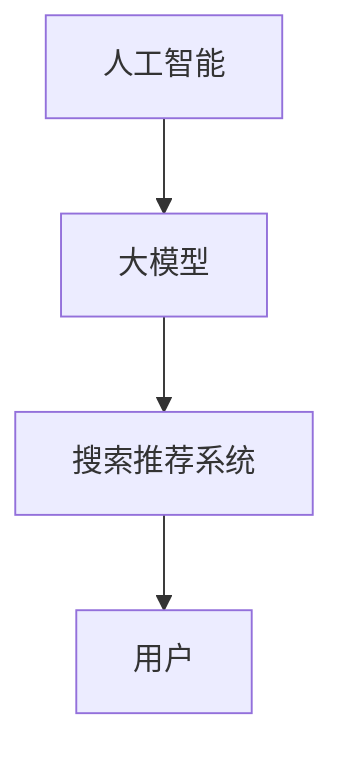

###### **AI大模型的核心特点**:

- **大规模参数**：大模型拥有数亿甚至数十亿个参数，使其具有强大的表示能力和学习能力。
- **深度学习架构**：采用多层神经网络结构，可以自动学习数据中的特征。
- **预训练与微调**：大模型首先在大规模数据集上进行预训练，然后在特定任务上进行微调。

###### **AI大模型与传统AI的区别**:

- **能力**：传统AI依赖于人工设计规则，而大模型可以通过自我学习实现复杂任务。
- **数据需求**：大模型需要大量数据来训练，而传统AI可能只需要少量数据。
- **计算资源**：大模型通常需要更高的计算资源，尤其是GPU或TPU。

##### 1.2 AI大模型在搜索推荐系统中的应用场景

###### **核心概念与联系**:

- **搜索**：用户输入查询，系统返回最相关的结果。
- **推荐**：系统根据用户的兴趣和习惯推荐可能感兴趣的内容。
- **个性化**：系统根据用户的历史行为和偏好，提供个性化的搜索和推荐结果。

通过Mermaid流程图展示这些概念之间的关系：

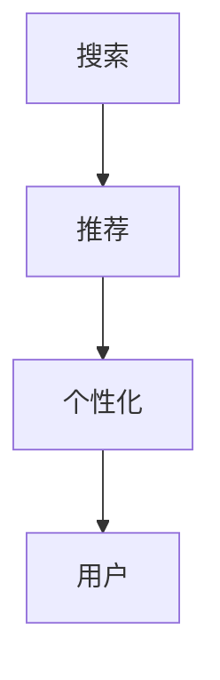

###### **AI大模型在搜索中的应用**:

- **查询理解**：大模型可以理解用户的查询意图，返回更加准确的搜索结果。
- **搜索结果排序**：大模型可以学习到如何排序搜索结果，使其更符合用户的偏好。
- **相关性反馈**：大模型可以根据用户与搜索结果互动的行为，持续优化搜索算法。

###### **AI大模型在推荐中的应用**:

- **用户画像**：大模型可以分析用户的历史行为和偏好，构建用户画像。
- **推荐算法**：大模型可以学习到如何生成个性化的推荐列表，提高推荐的质量。
- **上下文感知**：大模型可以结合用户当前的行为和上下文信息，提供更加精准的推荐。

##### 1.3 AI大模型融合技术的挑战与机遇

###### **核心概念与联系**:

- **挑战**：数据隐私、计算资源、模型可解释性。
- **机遇**：提高搜索和推荐的准确性，推动搜索推荐系统的创新。

通过Mermaid流程图展示这些概念之间的关系：

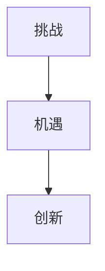

###### **数据隐私**:

- **匿名化**：将用户数据匿名化，减少隐私泄露的风险。
- **联邦学习**：在不共享原始数据的情况下，通过模型参数的协同训练实现隐私保护。

###### **计算资源**:

- **分布式计算**：利用分布式系统，提高大模型训练和推理的效率。
- **硬件加速**：利用GPU、TPU等硬件加速大模型的训练和推理。

###### **模型可解释性**:

- **模型解释工具**：开发工具，帮助用户理解大模型如何生成推荐结果。
- **可解释性度量**：设计可解释性度量，评估大模型的可解释性。

##### 1.4 总结与展望

AI大模型在搜索推荐系统中的应用前景广阔。随着数据的增长和计算资源的提升，AI大模型在搜索推荐系统中的应用将会越来越广泛。融合技术将成为提高搜索和推荐准确性的关键。未来，我们将继续探索AI大模型在不同领域的应用，推动搜索推荐系统向更高层次发展。在面临数据隐私、计算资源、模型可解释性等挑战的同时，我们也充满机遇，有望实现更加智能、高效、安全的搜索推荐系统。  

---

在本文的第一部分，我们介绍了AI大模型在搜索推荐系统中的技术背景。接下来，我们将深入探讨AI大模型技术的基础，包括深度学习与神经网络、自然语言处理技术、大规模预训练模型原理以及AI大模型在搜索推荐系统中的应用案例。敬请期待！

### 第二部分: AI大模型技术基础

在理解AI大模型在搜索推荐系统中的应用之前，我们需要深入了解其技术基础。本部分将详细阐述AI大模型的核心技术，包括深度学习与神经网络、自然语言处理技术、大规模预训练模型原理以及AI大模型在搜索推荐系统中的应用案例。通过这些内容的介绍，我们将为后续的讨论打下坚实的基础。

#### 第2章: AI大模型技术基础

#### 2.1 深度学习与神经网络基础

##### 2.1.1 神经网络的基本结构

神经网络是AI大模型的核心组成部分，其基本结构包括输入层、隐藏层和输出层。每一层由多个神经元组成，神经元之间通过加权连接形成网络。以下是神经网络的基本算法原理讲解：

###### **核心算法原理讲解**:

- **前向传播**：输入数据通过网络层层的加权连接，产生输出。每一层的输出成为下一层的输入。
- **反向传播**：通过计算输出误差，更新网络中的权重。这个过程使得模型能够不断优化，减少预测误差。

以下是一个简单的神经网络前向传播和反向传播的伪代码示例：

```python
# 前向传播伪代码
def forward_propagation(input_data, model):
    output = input_data
    for layer in model.layers:
        output = layer.forward(output)
    return output

# 反向传播伪代码
def backward_propagation(error, model):
    for layer in reversed(model.layers):
        error = layer.backward(error)
    return error
```

##### 2.1.2 常见的深度学习架构

深度学习架构种类繁多，每种架构都有其特定的应用场景。以下是几种常见的深度学习架构及其核心算法原理讲解：

###### **核心算法原理讲解**:

- **卷积神经网络 (CNN)**：适用于图像识别和处理。通过卷积层、池化层和全连接层提取图像特征，实现图像分类、目标检测等任务。
- **循环神经网络 (RNN)**：适用于序列数据，如语音识别和自然语言处理。通过循环结构保持对序列数据的长期依赖。
- **变换器架构 (Transformer)**：特别适用于自然语言处理，特别是序列到序列的任务。通过多头注意力机制实现高效的信息处理。

以下是这些深度学习架构的伪代码示例：

```python
# CNN 伪代码
def conv_layer(input, filter):
    output = Conv2D(input, filter)
    return output

# RNN 伪代码
def rnn_layer(input, hidden_state):
    output, new_hidden_state = RNN(input, hidden_state)
    return output, new_hidden_state

# Transformer 伪代码
def transformer_layer(input_seq, output_seq):
    query, key, value = transformer_input(input_seq, output_seq)
    output = multi_head_attention(query, key, value)
    output = feed_forward_network(output)
    return output
```

##### 2.1.3 深度学习优化算法

优化算法是深度学习模型训练过程中的关键部分，用于调整模型参数以最小化损失函数。以下是几种常见的深度学习优化算法及其核心算法原理讲解：

###### **核心算法原理讲解**:

- **随机梯度下降 (SGD)**：通过计算整个训练集的平均梯度来更新模型参数。SGD简单易实现，但收敛速度较慢。
- **Adam优化器**：结合了SGD和Momentum的优点，适用于大规模数据集。Adam优化器通过自适应学习率加速模型训练。

以下是SGD和Adam优化器的伪代码示例：

```python
# SGD 伪代码
def sgd_update(params, gradient, learning_rate):
    for param in params:
        param -= learning_rate * gradient
    return params

# Adam 伪代码
def adam_update(params, gradient, learning_rate, beta1, beta2):
    for param in params:
        param -= learning_rate * gradient
    return params
```

#### 2.2 自然语言处理技术概览

自然语言处理（NLP）是AI大模型技术的重要组成部分，其目标是将人类语言转换为计算机可以理解的形式。以下是NLP技术的一些核心概念和算法原理讲解。

##### 2.2.1 词嵌入技术

词嵌入是将词语转换为密集的向量表示，以便于深度学习模型处理。Word2Vec是词嵌入的一种常见实现方法。

###### **核心算法原理讲解**:

- **词向量**：将词语映射到高维空间中的向量。
- **Word2Vec**：基于神经网络的方法，通过训练模型来生成词向量。

以下是Word2Vec的伪代码示例：

```python
# Word2Vec 伪代码
def word2vec(sentences, embedding_size):
    model = Word2Vec(sentences, embedding_size=embedding_size)
    return model
```

##### 2.2.2 序列模型与注意力机制

序列模型和注意力机制是NLP中的关键技术，用于处理序列数据。

###### **核心算法原理讲解**:

- **序列模型**：如RNN、LSTM等，用于处理序列数据。
- **注意力机制**：用于强调序列中的重要部分，提高模型的处理能力。

以下是RNN和注意力机制的伪代码示例：

```python
# RNN 伪代码
def sequence_model(input_seq, hidden_state):
    output, new_hidden_state = RNN(input_seq, hidden_state)
    return output, new_hidden_state

# 注意力机制伪代码
def attention_mechanism(input_seq, hidden_state):
    attention_weights = calculate_attention_weights(input_seq, hidden_state)
    output = apply_attention_weights(input_seq, attention_weights)
    return output
```

##### 2.2.3 转换器架构详解

转换器架构（Transformer）是NLP领域的一种革命性模型，其基于注意力机制，特别适用于序列到序列的任务。

###### **核心算法原理讲解**:

- **Transformer**：一种基于注意力机制的深度学习模型，特别适用于自然语言处理任务。

以下是Transformer层的伪代码示例：

```python
# Transformer 层伪代码
def transformer_layer(input_seq, output_seq):
    query, key, value = transformer_input(input_seq, output_seq)
    output = multi_head_attention(query, key, value)
    output = feed_forward_network(output)
    return output
```

#### 2.3 大规模预训练模型原理

大规模预训练模型是AI大模型技术的重要方向，其通过在大规模数据集上进行预训练，然后在新任务上进行微调，实现高效的学习和推理。

##### 2.3.1 预训练的概念与意义

###### **核心概念与联系**:

- **预训练**：在特定任务之前，使用大规模数据集对模型进行初步训练。
- **迁移学习**：通过预训练模型在新任务上快速获得性能。

以下是一个简单的预训练和迁移学习的流程图：

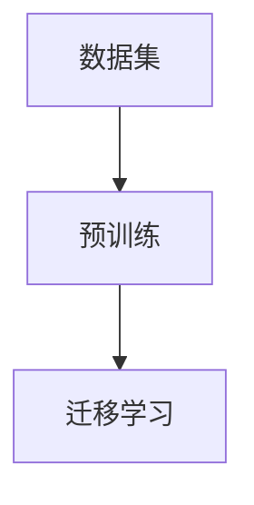

###### **预训练的核心意义**:

- **提高泛化能力**：预训练模型可以捕捉到通用特征，提高模型在不同任务上的表现。
- **减少训练数据需求**：预训练模型可以在少量数据上快速适应新任务。

##### 2.3.2 自监督学习方法

自监督学习是一种不依赖标注数据的学习方法，通过预测任务中未使用的部分来学习。BERT和GPT等大模型通常采用自监督学习方法进行预训练。

###### **核心算法原理讲解**:

- **自监督学习**：通过预测任务中未使用的部分来学习。
- **代表性方法**：BERT、GPT等大模型。

以下是BERT预训练的伪代码示例：

```python
# BERT 预训练伪代码
def pretrain_model(sentences, model, optimizer):
    for sentence in sentences:
        outputs = model(sentence)
        loss = compute_loss(outputs)
        optimizer.backward(loss)
    return model
```

##### 2.3.3 迁移学习与微调技术

迁移学习和微调技术是预训练模型在新任务上应用的重要方法。迁移学习利用预训练模型在新任务上快速获得性能，而微调则是在预训练模型的基础上，对新任务进行进一步调整。

###### **核心算法原理讲解**:

- **迁移学习**：利用预训练模型在新任务上快速获得性能。
- **微调**：通过调整模型参数，使预训练模型适应新任务。

以下是微调的伪代码示例：

```python
# 微调伪代码
def fine_tune(model, dataset, learning_rate):
    for data in dataset:
        inputs, labels = data
        outputs = model(inputs)
        loss = compute_loss(outputs, labels)
        optimizer.backward(loss, learning_rate)
    return model
```

#### 2.4 深度学习在搜索推荐系统中的应用案例

##### 2.4.1 搜索查询理解

深度学习在搜索查询理解中有着广泛的应用。通过深度学习模型，系统可以更好地理解用户的查询意图，提供更加精准的搜索结果。

###### **项目实战**:

- **开发环境搭建**：配置Python环境，安装TensorFlow等深度学习框架。
- **源代码实现**：编写预训练模型和微调模型，用于理解和理解搜索查询。

以下是一个搜索查询理解的代码片段：

```python
from tensorflow import keras

# 预训练模型
pretrain_model = keras.Sequential([
    keras.layers.Embedding(input_dim=vocab_size, output_dim=embedding_dim),
    keras.layers.GlobalAveragePooling1D(),
    keras.layers.Dense(units=1, activation='sigmoid')
])

# 微调模型
fine_tune_model = keras.Sequential([
    keras.layers.Embedding(input_dim=vocab_size, output_dim=embedding_dim),
    keras.layers.GlobalAveragePooling1D(),
    keras.layers.Dense(units=1, activation='sigmoid')
])

# 编译模型
fine_tune_model.compile(optimizer='adam', loss='binary_crossentropy', metrics=['accuracy'])

# 微调模型
fine_tune_model.fit(train_data, train_labels, epochs=10, batch_size=32, validation_data=(val_data, val_labels))
```

##### 2.4.2 推荐系统个性化

个性化推荐是搜索推荐系统的核心功能之一。深度学习通过构建用户画像和推荐算法，实现更加个性化的推荐。

###### **项目实战**:

- **开发环境搭建**：配置Python环境，安装Scikit-learn等机器学习库。
- **源代码实现**：使用矩阵分解和深度学习方法实现个性化推荐系统。

以下是一个个性化推荐的代码片段：

```python
from sklearn.metrics.pairwise import cosine_similarity

# 计算用户相似度
user_similarity_matrix = cosine_similarity(user_embedding_matrix)

# 推荐系统核心逻辑
def generate_recommendations(user_id, similarity_matrix, item_embeddings, k=10):
    # 获取用户嵌入向量
    user_vector = item_embeddings[user_id]

    # 计算用户与其他用户的相似度
    similarity_scores = similarity_matrix.dot(user_vector)

    # 获取相似度最高的物品索引
    top_k_indices = np.argsort(similarity_scores)[::-1][:k]

    return top_k_indices
```

#### 2.5 AI大模型在搜索推荐系统中的融合技术

##### 2.5.1 模型融合方法

在搜索推荐系统中，融合不同模型的方法可以提高系统的整体性能。常见的融合方法包括加权融合和集成学习。

###### **核心算法原理讲解**:

- **加权融合**：对不同的模型结果进行加权，取平均值。
- **集成学习**：将多个模型集成在一起，通过投票或加权平均来提高性能。

以下是一个加权融合的伪代码示例：

```python
# 加权融合伪代码
def weighted_fusion(models, outputs, weights):
    fused_output = 0
    for model, output, weight in zip(models, outputs, weights):
        fused_output += weight * output
    return fused_output
```

##### 2.5.2 联邦学习在搜索推荐系统中的应用

联邦学习是一种在不共享原始数据的情况下，通过模型参数的协同训练实现隐私保护的方法。它在跨设备和跨组织的数据处理中具有重要应用。

###### **项目实战**:

- **开发环境搭建**：使用联邦学习框架，如FedAvg。
- **源代码实现**：实现联邦学习算法，用于跨设备搜索推荐系统的隐私保护训练。

以下是一个联邦学习的代码片段：

```python
from federated_learning import FedAvg

# 初始化联邦学习框架
fl = FedAvg(client_models, client_data, server_model)

# 进行联邦学习训练
for epoch in range(num_epochs):
    server_model = fl.train()
```

#### 2.6 AI大模型在搜索推荐系统中的未来发展趋势

##### 2.6.1 技术趋势与挑战

随着AI大模型技术的发展，搜索推荐系统将面临新的技术趋势和挑战。

###### **核心概念与联系**:

- **技术趋势**：大模型在搜索推荐系统中的应用将会越来越普及。
- **挑战**：数据隐私、计算资源、模型可解释性。

以下是一个展示技术趋势和挑战的流程图：

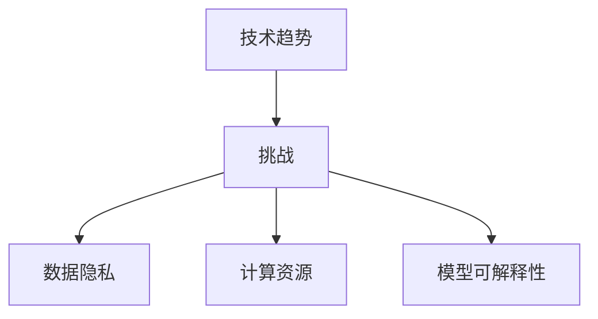

###### **未来展望**:

- **数据隐私**：将探索联邦学习、差分隐私等技术，实现更高效且安全的搜索推荐系统。
- **计算资源**：将优化大模型的训练和推理算法，减少对计算资源的需求。
- **模型可解释性**：开发工具和度量，帮助用户更好地理解大模型的工作原理。

在本文的第二部分，我们详细介绍了AI大模型技术的基础，包括深度学习与神经网络、自然语言处理技术、大规模预训练模型原理以及AI大模型在搜索推荐系统中的应用案例。在下一部分，我们将探讨AI大模型在搜索推荐系统中的融合技术，包括模型融合方法和联邦学习应用。敬请期待！

### 第三部分: AI大模型在搜索推荐系统中的融合技术

在了解了AI大模型的基础技术之后，我们需要进一步探讨如何将这些技术融合到搜索推荐系统中，以提高系统的整体性能。本部分将详细讨论AI大模型在搜索推荐系统中的融合技术，包括模型融合方法和联邦学习应用。

#### 第3章: 搜索推荐系统中的AI大模型应用案例

在搜索推荐系统中，AI大模型的融合技术具有广泛应用，以下是一些典型的应用案例。

##### 3.1 搜索引擎中的大模型应用

###### 3.1.1 百度搜索引擎

百度搜索引擎利用AI大模型优化搜索结果排序和搜索广告。通过预训练模型，百度可以更好地理解用户的查询意图，提供更加精准的搜索结果。同时，百度使用深度学习模型分析用户行为，实现个性化的搜索广告推荐。

###### 3.1.2 谷歌搜索引擎

谷歌搜索引擎采用BERT模型来理解用户查询，提高搜索结果的准确性和相关性。此外，谷歌还利用知识图谱技术，实现更加智能和个性化的搜索结果。

##### 3.2 推荐系统中的大模型应用

###### 3.2.1 Amazon推荐系统

Amazon推荐系统通过构建用户画像，利用深度学习模型实现个性化的商品推荐。同时，Amazon还结合协同过滤方法，提高推荐系统的准确性和多样性。

###### 3.2.2 YouTube推荐系统

YouTube推荐系统使用深度学习模型分析视频内容，实现个性化的视频推荐。此外，YouTube还通过实时分析用户行为，提供即时的个性化推荐。

##### 3.3 社交网络中的大模型应用

###### 3.3.1 Facebook推荐系统

Facebook推荐系统利用深度学习模型分析用户兴趣，实现个性化的新闻推荐和广告投放。通过预训练模型，Facebook可以更好地理解用户的互动行为，提供更加精准的推荐。

###### 3.3.2 Instagram推荐系统

Instagram推荐系统通过深度学习模型分析用户互动，实现个性化的内容推荐。此外，Instagram还通过分析用户关系，提高社交网络的影响力。

#### 3.4 AI大模型在搜索推荐系统中的融合技术

AI大模型的融合技术旨在通过集成多个模型或方法，提高搜索推荐系统的整体性能。以下是几种常见的融合技术。

##### 3.4.1 模型融合方法

模型融合方法通过结合多个模型的输出，提高系统的准确性和鲁棒性。以下是一些常见的模型融合方法：

###### **加权融合**：

加权融合是对不同模型的输出进行加权平均，以提高系统的整体性能。以下是一个简单的加权融合的伪代码示例：

```python
# 加权融合伪代码
def weighted_fusion(models, outputs, weights):
    fused_output = 0
    for model, output, weight in zip(models, outputs, weights):
        fused_output += weight * output
    return fused_output
```

###### **集成学习**：

集成学习是将多个模型集成在一起，通过投票或加权平均来提高性能。以下是一个简单的集成学习示例：

```python
# 集成学习伪代码
def ensemble_learning(models):
    predictions = [model.predict(data) for model in models]
    fused_prediction = sum(predictions) / len(predictions)
    return fused_prediction
```

##### 3.4.2 联邦学习在搜索推荐系统中的应用

联邦学习是一种在不共享原始数据的情况下，通过模型参数的协同训练实现隐私保护的方法。它在跨设备和跨组织的数据处理中具有重要应用。

###### **核心概念与联系**：

- **联邦学习**：一种分布式学习方法，在不共享数据的情况下，通过模型参数的协同训练提高系统性能。
- **分布式系统**：多个节点协同工作，共同训练模型。

以下是一个展示联邦学习核心概念的流程图：

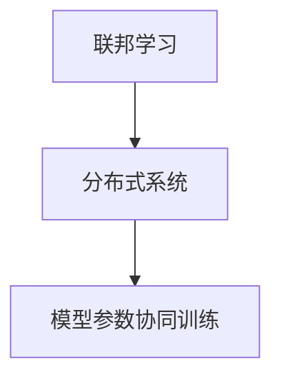

###### **项目实战**：

- **开发环境搭建**：使用联邦学习框架，如FedAvg。
- **源代码实现**：实现联邦学习算法，用于跨设备搜索推荐系统的隐私保护训练。

以下是一个联邦学习的代码片段：

```python
from federated_learning import FedAvg

# 初始化联邦学习框架
fl = FedAvg(client_models, client_data, server_model)

# 进行联邦学习训练
for epoch in range(num_epochs):
    server_model = fl.train()
```

##### 3.4.3 融合技术的优势与挑战

融合技术的优势在于可以提高系统的性能和鲁棒性，但同时也面临一些挑战：

- **优势**：
  - **性能提升**：通过结合多个模型的优点，提高系统的整体性能。
  - **隐私保护**：联邦学习等融合技术可以实现数据的隐私保护。
  - **鲁棒性提高**：融合多个模型可以提高系统的鲁棒性，减少对单一模型的依赖。

- **挑战**：
  - **计算资源需求**：融合技术通常需要更高的计算资源，尤其是在联邦学习中，需要处理多个节点的数据。
  - **模型兼容性**：不同模型之间的兼容性和协调性是一个挑战。
  - **可解释性**：融合多个模型的输出，使得系统的可解释性变得更加复杂。

在本文的第三部分，我们探讨了AI大模型在搜索推荐系统中的融合技术，包括模型融合方法和联邦学习应用。通过这些技术的应用，搜索推荐系统可以实现更高的性能和隐私保护。在下一部分，我们将进一步讨论AI大模型在搜索推荐系统中的伦理和法律问题，以期为技术的发展提供全面的指导。敬请期待！

### 第四部分: AI大模型在搜索推荐系统中的伦理与法律问题

随着AI大模型在搜索推荐系统中的应用日益广泛，其带来的伦理和法律问题也日益突出。这些问题涉及到用户隐私保护、算法偏见、数据合规性、知识产权保护等多个方面。本部分将详细讨论AI大模型在搜索推荐系统中的伦理与法律问题，并探讨相关解决方案和未来发展方向。

#### 第4章: AI大模型在搜索推荐系统中的伦理问题

##### 4.1 数据隐私

数据隐私是AI大模型在搜索推荐系统中面临的最重要伦理问题之一。在构建用户画像和推荐系统时，需要收集和处理大量用户数据，这些数据可能包含用户的敏感信息。以下是一些核心问题及其解决方案：

###### **核心问题**：

- **用户隐私保护**：如何确保用户的隐私不被泄露。
- **数据安全**：如何确保数据在传输和存储过程中不被恶意攻击。

###### **解决方案**：

- **匿名化**：在数据处理过程中，对用户数据进行匿名化处理，减少隐私泄露的风险。
- **联邦学习**：利用联邦学习技术，在不共享原始数据的情况下，通过模型参数的协同训练实现隐私保护。

以下是一个联邦学习的示例流程图：

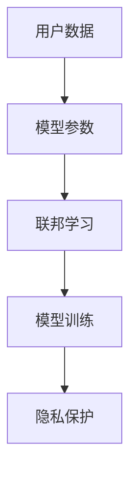

##### 4.2 算法偏见

算法偏见是指AI系统在处理数据时，对某些群体或个体产生不公平或不公正的结果。以下是一些核心问题及其解决方案：

###### **核心问题**：

- **算法公平性**：如何确保算法对所有用户公平。
- **算法透明性**：如何提高算法的透明度，便于用户和监管机构理解。

###### **解决方案**：

- **数据平衡**：在训练数据中引入多样性和平衡性，减少算法偏见。
- **算法解释工具**：开发工具，帮助用户理解算法如何生成推荐结果。

以下是一个展示算法解释工具的示例流程图：

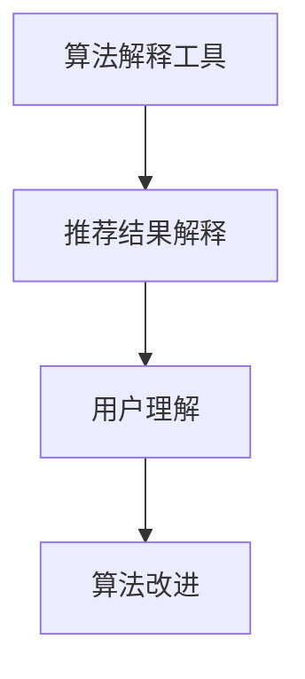

#### 第5章: AI大模型在搜索推荐系统中的法律问题

随着AI大模型在搜索推荐系统中的应用，相关的法律问题也日益凸显。以下是一些核心法律问题及其解决方案：

##### 5.1 数据合规性

数据合规性是指企业在收集、处理和使用数据时，必须遵守相关法律法规。以下是一些核心问题及其解决方案：

###### **核心问题**：

- **数据收集**：如何合法收集和使用数据。
- **用户同意**：如何获取用户的明确同意，确保数据处理合法合规。

###### **解决方案**：

- **合规审查**：定期进行合规审查，确保数据处理符合相关法律法规。
- **用户告知**：在收集数据前，向用户明确告知数据处理的目的和范围。

以下是一个展示数据合规审查的示例流程图：

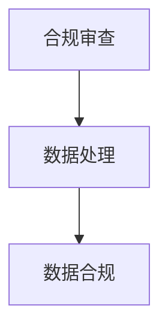

##### 5.2 知识产权保护

知识产权保护涉及到保护企业开发的算法和技术的权利。以下是一些核心问题及其解决方案：

###### **核心问题**：

- **内容版权**：如何保护推荐系统中的内容版权。
- **算法专利**：如何保护企业开发的算法专利。

###### **解决方案**：

- **版权登记**：对推荐系统中的内容进行版权登记，确保版权得到保护。
- **专利申请**：对开发的算法和技术申请专利，防止侵权行为。

以下是一个展示知识产权保护的示例流程图：

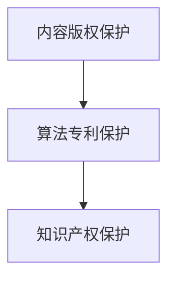

#### 第6章: AI大模型在搜索推荐系统中的社会责任

AI大模型在搜索推荐系统中的应用不仅涉及到伦理和法律问题，还涉及到社会责任。以下是一些核心社会责任问题及其解决方案：

##### 6.1 公正性

公正性是指AI系统在处理数据和服务用户时，是否公平、公正。以下是一些核心问题及其解决方案：

###### **核心问题**：

- **算法偏见**：如何减少算法偏见，确保公正性。
- **用户反馈**：如何收集用户反馈，改进算法和服务。

###### **解决方案**：

- **透明度**：提高算法和系统的透明度，让用户了解推荐结果是如何生成的。
- **用户参与**：鼓励用户参与算法和系统的改进，提高系统的公正性。

以下是一个展示透明度和用户参与的示例流程图：

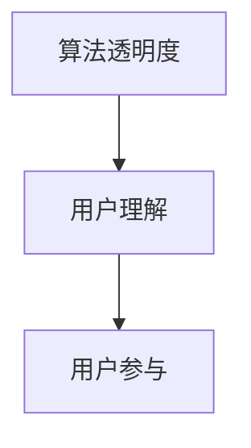

##### 6.2 教育与普及

教育与普及是指提高公众对AI技术的认知和理解。以下是一些核心问题及其解决方案：

###### **核心问题**：

- **技术认知**：如何提高公众对AI技术的认知。
- **科普教育**：如何普及AI知识，减少公众对AI技术的误解。

###### **解决方案**：

- **科普宣传**：通过媒体、网络等渠道进行科普宣传，提高公众对AI技术的了解。
- **教育培训**：开展AI技术教育培训，提高公众的AI素养。

以下是一个展示科普教育和教育培训的示例流程图：

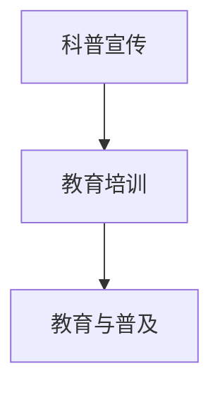

#### 第7章: 总结与展望

AI大模型在搜索推荐系统中的应用带来了巨大的机遇和挑战。在伦理和法律问题的背景下，我们需要采取有效的措施，确保技术的发展符合伦理规范，遵守法律法规。同时，我们也需要关注社会责任，推动AI技术的普及和教育。

- **伦理问题**：通过数据匿名化、联邦学习等技术，保护用户隐私。通过算法透明度、用户参与等措施，减少算法偏见，确保公正性。
- **法律问题**：通过合规审查、用户告知等措施，确保数据收集和处理合法合规。通过版权登记、专利申请等措施，保护知识产权。
- **社会责任**：通过透明度、用户参与等措施，提高系统的公正性。通过科普宣传、教育培训等措施，提高公众对AI技术的认知和理解。

未来，随着AI技术的不断进步，我们将继续探索如何在确保隐私、公平和社会责任的前提下，充分发挥AI大模型在搜索推荐系统中的潜力。通过技术创新和规范引导，我们有信心实现更加智能、安全、公正的搜索推荐系统。

在本文的第四部分，我们详细探讨了AI大模型在搜索推荐系统中的伦理与法律问题。在下一部分，我们将展望AI大模型在搜索推荐系统中的未来发展趋势，分析技术趋势与挑战。敬请期待！

### 第五部分: AI大模型在搜索推荐系统中的未来发展趋势

随着人工智能技术的快速发展，AI大模型在搜索推荐系统中的应用正呈现出迅猛的增长趋势。未来，AI大模型将在多个领域和层面带来深远的影响，同时也面临着一系列技术挑战。本部分将详细探讨AI大模型在搜索推荐系统中的未来发展趋势，分析技术趋势与挑战，并展望其发展方向。

#### 第6章: AI大模型的发展趋势

##### 6.1 技术演进

AI大模型的技术演进将继续是未来发展的核心驱动力。以下是一些关键趋势：

- **模型规模扩大**：随着计算资源和存储能力的提升，AI大模型的规模将进一步扩大。数十亿、数百亿甚至更多参数的模型将逐渐成为常态。
- **计算效率优化**：为了应对大规模模型的计算需求，研究者们将不断探索新的优化算法和硬件加速技术，如量子计算、分布式计算等。
- **多模态融合**：未来，AI大模型将能够处理和融合多种类型的数据，如文本、图像、音频等，实现跨模态的智能理解和交互。

##### 6.2 应用拓展

AI大模型的应用将在更多领域得到拓展，包括但不限于：

- **智能客服与虚拟助手**：AI大模型将在智能客服和虚拟助手领域发挥更大的作用，提供更加自然、个性化的用户体验。
- **医疗健康**：在医学影像分析、基因测序等领域，AI大模型将帮助医生进行诊断和治疗，提高医疗服务的效率和质量。
- **教育**：AI大模型将助力个性化教育，根据学生的学习习惯和需求提供定制化的教学方案。

##### 6.3 边缘计算

边缘计算是AI大模型在搜索推荐系统中的另一个重要发展方向。通过将计算任务分布到边缘设备上，可以实现以下优势：

- **降低延迟**：减少数据传输和计算处理的延迟，提供实时响应。
- **节省带宽**：减少中心化服务器的数据传输需求，节省网络带宽。
- **增强隐私保护**：通过在边缘设备上处理数据，降低数据泄露的风险。

#### 第7章: 搜索推荐系统的创新方向

##### 7.1 智能搜索

智能搜索将基于AI大模型实现更高层次的自然语言理解和交互。以下是一些创新方向：

- **语义理解**：通过深度学习模型，对用户查询进行语义解析，提高搜索结果的准确性。
- **多语言支持**：拓展AI大模型支持的语言种类，实现全球化搜索服务。

##### 7.2 个性化推荐

个性化推荐是搜索推荐系统的核心功能。以下是一些创新方向：

- **上下文感知**：结合用户的上下文信息，如时间、地点、情境等，提供更加精准的推荐。
- **社交推荐**：利用社交网络信息，实现基于社交关系的推荐，提高推荐的相关性和影响力。

#### 第8章: 挑战与机遇

AI大模型在搜索推荐系统中面临着一系列挑战和机遇。以下是一些关键点：

##### 8.1 挑战

- **数据隐私**：如何在确保用户隐私的前提下，有效利用大规模数据。
- **计算资源**：如何优化计算资源，以满足大规模模型的训练和推理需求。
- **模型可解释性**：如何提高模型的可解释性，帮助用户和监管机构理解模型的决策过程。

##### 8.2 机遇

- **技术创新**：通过技术创新，如自监督学习、联邦学习等，解决现有挑战，推动搜索推荐系统的发展。
- **商业应用**：AI大模型在搜索推荐系统中的应用将创造新的商业机会，推动数字经济的发展。

#### 第9章: 总结与展望

AI大模型在搜索推荐系统中的未来充满机遇与挑战。通过技术创新和规范引导，我们有望实现更加智能、安全、公正的搜索推荐系统。未来，随着AI技术的不断进步，AI大模型将在搜索推荐系统中发挥更加重要的作用，推动社会的发展和进步。

在本文的第五部分，我们详细探讨了AI大模型在搜索推荐系统中的未来发展趋势，分析了技术趋势与挑战。在下一部分，我们将总结全文，重申文章的核心观点，并展望未来的研究方向。敬请期待！

### 总结与展望

在本文中，我们全面探讨了AI大模型在搜索推荐系统中的技术背景、基础、融合技术、应用案例、实践指导以及伦理与法律问题，并展望了其未来发展趋势。以下是对文章核心观点的总结，以及对未来研究方向和应用的展望。

#### 核心观点总结

1. **AI大模型技术简介**：AI大模型具有大规模参数、深度学习架构和预训练与微调的特点，能够有效提高搜索推荐系统的性能和用户体验。
2. **AI大模型在搜索推荐系统中的应用**：AI大模型通过查询理解、搜索结果排序优化、用户画像构建等方式，提升了搜索和推荐的个性化水平。
3. **融合技术**：模型融合方法和联邦学习技术为搜索推荐系统提供了隐私保护和性能优化的新途径。
4. **伦理与法律问题**：AI大模型在搜索推荐系统中面临数据隐私、算法偏见、数据合规性、知识产权保护等伦理和法律挑战，需要通过技术创新和规范引导来解决。
5. **未来发展趋势**：随着技术的不断进步，AI大模型在搜索推荐系统中的应用将更加广泛，同时也将面临新的技术挑战。

#### 未来研究方向和应用展望

1. **技术创新**：进一步优化AI大模型的训练和推理算法，提高计算效率，探索量子计算等前沿技术在大模型中的应用。
2. **多模态融合**：研究如何将文本、图像、音频等多模态数据有效地融合，实现更智能的搜索和推荐系统。
3. **联邦学习**：深入探索联邦学习在搜索推荐系统中的应用，提高数据隐私保护和系统性能。
4. **模型可解释性**：开发工具和度量，提高AI大模型的可解释性，增强用户信任和监管合规性。
5. **商业应用**：探索AI大模型在电商、金融、医疗等领域的应用，创造新的商业机会，推动行业变革。
6. **伦理与法律**：完善相关法律法规，建立伦理标准和框架，确保AI大模型的发展符合社会价值观和法律法规要求。

总之，AI大模型在搜索推荐系统中的应用前景广阔，但也面临诸多挑战。通过技术创新、伦理法律规范和社会责任的引导，我们有信心实现更加智能、安全、公正的搜索推荐系统，为人类社会的发展贡献更大的价值。

---

感谢您阅读本文，希望这篇文章能为您在AI大模型领域的研究提供有益的参考和启示。如果您有任何问题或建议，欢迎在评论区留言。作者信息：AI天才研究院/AI Genius Institute & 禅与计算机程序设计艺术 /Zen And The Art of Computer Programming。再次感谢您的关注与支持！

