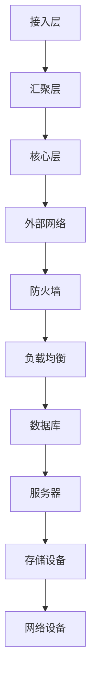
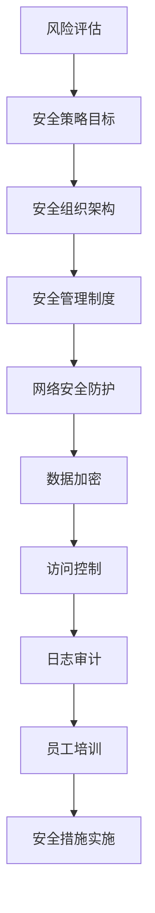

                 

### 文章标题

> **关键词**：AI 大模型、数据中心建设、安全与可靠性

**摘要**：本文将深入探讨AI大模型应用数据中心的建设，重点分析数据中心安全与可靠性的重要性和实现策略。通过对AI大模型及其在数据中心建设中的应用、数据中心建设概述、数据中心架构设计、AI大模型在数据中心中的应用、数据中心安全体系建设、数据中心可靠性设计、数据中心运维管理以及数据中心案例研究等多个方面的详细讲解，本文旨在为数据中心建设提供实用、专业的指导，帮助企业打造高效、安全的AI应用环境。

---

### 《AI 大模型应用数据中心建设：数据中心安全与可靠性》目录大纲

#### 第一部分：AI 大模型应用数据中心建设基础

#### 第1章：AI 大模型概述
- **1.1 AI 大模型的定义与类型**
  - **1.1.1 AI 大模型的定义**
  - **1.1.2 AI 大模型的类型**
- **1.2 AI 大模型在数据中心建设中的应用**
  - **1.2.1 数据中心建设中的 AI 大模型需求**
  - **1.2.2 AI 大模型在数据中心建设中的关键作用**

#### 第2章：数据中心建设概述
- **2.1 数据中心的概念与功能**
  - **2.1.1 数据中心的定义**
  - **2.1.2 数据中心的功能**
- **2.2 数据中心的建设原则与流程**
  - **2.2.1 数据中心建设原则**
  - **2.2.2 数据中心建设流程**

#### 第3章：数据中心架构设计
- **3.1 数据中心网络架构**
  - **3.1.1 网络架构概述**
  - **3.1.2 网络架构设计要点**
- **3.2 数据中心硬件选型与配置**
  - **3.2.1 硬件选型原则**
  - **3.2.2 硬件配置方案**

#### 第4章：AI 大模型在数据中心中的应用
- **4.1 数据预处理与特征提取**
  - **4.1.1 数据预处理方法**
  - **4.1.2 特征提取技术**
- **4.2 模型训练与优化**
  - **4.2.1 模型训练过程**
  - **4.2.2 模型优化方法**

#### 第二部分：数据中心安全与可靠性建设

#### 第5章：数据中心安全体系建设
- **5.1 数据中心安全概述**
  - **5.1.1 数据中心安全的重要性**
  - **5.1.2 数据中心安全挑战**
- **5.2 数据中心安全策略与措施**
  - **5.2.1 安全策略制定**
  - **5.2.2 安全措施实施**

#### 第6章：数据中心可靠性设计
- **6.1 数据中心可靠性概述**
  - **6.1.1 数据中心可靠性的定义**
  - **6.1.2 数据中心可靠性的重要性**
- **6.2 数据中心可靠性设计方法**
  - **6.2.1 系统可靠性评估方法**
  - **6.2.2 系统可靠性优化策略**

#### 第7章：数据中心运维管理
- **7.1 数据中心运维概述**
  - **7.1.1 数据中心运维的重要性**
  - **7.1.2 数据中心运维挑战**
- **7.2 数据中心运维流程与工具**
  - **7.2.1 运维流程**
  - **7.2.2 运维工具选择与应用**

#### 第8章：数据中心案例研究
- **8.1 案例介绍**
  - **8.1.1 案例背景**
  - **8.1.2 案例目标**
- **8.2 案例实施过程**
  - **8.2.1 架构设计**
  - **8.2.2 安全与可靠性措施**
- **8.3 案例效果分析**
  - **8.3.1 性能指标**
  - **8.3.2 安全与可靠性评估**

#### 附录：数据中心建设参考资源
- **附录 A：数据中心建设标准与规范**
- **附录 B：AI 大模型相关工具与资源**
- **附录 C：数据中心运维管理指南**

---

接下来的部分，我们将逐章深入探讨AI大模型应用数据中心建设的各个方面，包括数据中心的安全与可靠性，结合实际案例，为读者提供全面、专业的指导。让我们一步步分析推理，挖掘技术的本质。

---

### 第一部分：AI 大模型应用数据中心建设基础

#### 第1章：AI 大模型概述

##### 1.1 AI 大模型的定义与类型

AI大模型，指的是那些规模庞大、结构复杂，且参数数量极为丰富的机器学习模型。这类模型通常采用深度学习技术，能够处理和分析大量的数据，从而在图像识别、自然语言处理、预测建模等多个领域展现出卓越的性能。

**1.1.1 AI 大模型的定义**

AI大模型的定义可以从以下几个方面来理解：

- **模型规模**：通常包含数百万甚至数十亿个参数。这些参数是模型进行复杂决策的基础。
- **计算资源**：大模型的训练和推理过程需要大量的计算资源和存储资源，通常需要分布式计算和存储架构来支持。
- **数据处理能力**：大模型能够处理大规模的数据集，从而能够学习到更为复杂和丰富的模式。

**1.1.2 AI 大模型的类型**

AI大模型主要分为以下几种类型：

- **神经网络模型**：如卷积神经网络（CNN）、循环神经网络（RNN）和变换器（Transformer）等，广泛应用于图像识别、语音识别和自然语言处理等领域。
- **生成对抗网络（GAN）**：通过对抗训练生成逼真的图像、音频或文本。
- **变分自编码器（VAE）**：用于生成数据和学习数据的概率分布。
- **强化学习模型**：如深度强化学习（DRL）模型，能够通过与环境交互学习复杂的策略。

##### 1.2 AI 大模型在数据中心建设中的应用

**1.2.1 数据中心建设中的 AI 大模型需求**

数据中心建设中的AI大模型需求主要体现在以下几个方面：

- **计算能力**：AI大模型的训练和推理过程对计算能力有极高的要求，数据中心需要配置高性能的硬件设备，如GPU、TPU等。
- **存储能力**：大模型需要存储大量的训练数据和模型参数，因此数据中心需要具备强大的存储能力。
- **网络带宽**：为了快速传输数据，数据中心需要具备高带宽的网络连接。
- **可靠性**：大模型在训练和推理过程中可能会遇到硬件故障、数据丢失等问题，数据中心需要具备高可靠性，保证模型训练和推理的连续性。

**1.2.2 AI 大模型在数据中心建设中的关键作用**

AI大模型在数据中心建设中的关键作用主要体现在以下几个方面：

- **优化资源分配**：通过预测和分析数据中心的运行状态，AI大模型能够帮助数据中心实现资源的最优分配，提高资源利用率。
- **提升服务质量**：AI大模型能够实时监控数据中心的服务质量，通过预测和优化，提高数据中心的稳定性和可靠性。
- **增强安全性**：AI大模型能够通过分析和识别异常行为，提高数据中心的网络安全防护能力。

---

在接下来的章节中，我们将继续探讨数据中心建设的其他方面，包括数据中心的概念与功能、数据中心的建设原则与流程、数据中心架构设计以及AI大模型在数据中心中的应用等。通过这些内容，我们将逐步构建一个全面、专业的AI大模型应用数据中心建设知识体系。

---

### 第2章：数据中心建设概述

##### 2.1 数据中心的概念与功能

**2.1.1 数据中心的定义**

数据中心（Data Center），是指一种专门为存储、处理、传输和管理大量数据而设计的设施。它是一个高度集成的环境，包含了各种硬件设备、软件系统和网络设施，以满足组织在数据存储、计算、网络和安全性方面的需求。

**2.1.2 数据中心的功能**

数据中心的几个核心功能如下：

- **数据存储与管理**：数据中心提供了大规模的数据存储解决方案，包括磁盘阵列、分布式存储系统等，同时提供数据的备份和恢复功能。
- **数据处理与计算**：数据中心配备了高性能的计算资源，如服务器、存储设备和网络设备，能够快速处理海量数据。
- **网络连接**：数据中心提供了高速、稳定、安全的网络连接，确保数据能够在内部和外部的系统之间快速传输。
- **安全性保障**：数据中心采用了多种安全措施，如防火墙、入侵检测系统（IDS）、访问控制等，保障数据的安全性和隐私。

##### 2.2 数据中心的建设原则与流程

**2.2.1 数据中心建设原则**

数据中心的建设原则主要包括以下几个方面：

- **可靠性**：确保数据中心能够持续、稳定地运行，减少故障和停机时间。
- **安全性**：保护数据中心的数据和系统免受内外部威胁，包括物理安全和网络安全。
- **可扩展性**：设计时考虑未来的增长和扩展需求，确保能够灵活地增加资源。
- **节能环保**：降低数据中心的能耗，采用节能技术和设备，减少对环境的影响。
- **高可用性**：通过冗余设计和负载均衡，确保数据中心能够在故障发生时保持高可用性。

**2.2.2 数据中心建设流程**

数据中心的建设流程通常包括以下几个阶段：

1. **需求分析**：确定数据中心的建设需求，包括存储容量、计算能力、网络带宽和安全要求等。
2. **规划设计**：根据需求分析结果，进行数据中心的总体设计，包括网络架构、硬件选型、存储方案和安全策略等。
3. **硬件采购**：根据设计方案，采购服务器、存储设备、网络设备等硬件设备。
4. **系统部署**：将采购的硬件设备安装、配置，搭建起数据中心的初步架构。
5. **系统集成**：将硬件设备、软件系统和网络设施集成在一起，确保各个组件能够协同工作。
6. **测试与优化**：对数据中心进行性能测试和优化，确保其能够满足预期需求。
7. **交付使用**：数据中心建设完成后，进行交付和使用，同时进行长期的运维和管理。

---

通过以上对数据中心概念与功能、建设原则与流程的介绍，我们可以更好地理解数据中心在AI大模型应用中的重要性。在接下来的章节中，我们将深入探讨数据中心的架构设计和硬件选型，帮助读者构建一个全面的AI大模型应用数据中心建设知识体系。

---

### 第3章：数据中心架构设计

数据中心架构设计是数据中心建设的关键环节，它决定了数据中心的性能、可靠性和扩展性。在这一章中，我们将详细介绍数据中心网络架构和数据中心硬件选型与配置。

##### 3.1 数据中心网络架构

**3.1.1 网络架构概述**

数据中心网络架构设计的目标是实现高效的数据传输、负载均衡、冗余和安全性。数据中心网络通常分为以下几个层次：

- **接入层**：负责连接终端设备，如服务器、存储设备和网络设备，通常采用交换机进行连接。
- **汇聚层**：负责接入层和核心层之间的数据汇聚和分发，同样采用交换机进行连接。
- **核心层**：负责整体数据中心的网络核心，实现高速数据传输和路由功能，通常使用高端核心交换机和路由器。

**3.1.2 网络架构设计要点**

数据中心网络架构设计需要考虑以下几个要点：

- **高可用性**：设计冗余的网络结构，如双路电源、双路网络连接等，确保网络在故障情况下能够快速切换。
- **高带宽**：选择高速网络设备，确保数据传输的速率和容量能够满足业务需求。
- **负载均衡**：通过负载均衡设备，将网络流量均匀分配到各个网络路径上，避免网络瓶颈。
- **安全防护**：在网络架构中集成安全设备，如防火墙、入侵检测系统（IDS）和入侵防御系统（IPS），确保网络的安全性和防护能力。

**网络架构的 Mermaid 流程图**：



##### 3.2 数据中心硬件选型与配置

**3.2.1 硬件选型原则**

数据中心硬件选型需要考虑以下几个原则：

- **性能要求**：根据业务需求，选择具有高性能计算能力和存储能力的设备。
- **可靠性要求**：选择具有高可靠性、冗余性和故障恢复能力的设备。
- **扩展性要求**：考虑未来的扩展需求，选择可扩展性好的设备。
- **节能环保**：选择低能耗、高效能的设备，降低运行成本。

**3.2.2 硬件配置方案**

1. **服务器选型**：根据业务需求，选择适合的服务器类型，如高性能计算（HPC）服务器、数据库服务器、文件服务器等。考虑CPU、内存、存储和网络接口等关键参数。

2. **存储设备选型**：选择具有高存储容量、高读写速度和可靠性的存储设备，如磁盘阵列（SAN）、网络附加存储（NAS）和分布式存储系统。考虑容量、性能、数据保护和冗余等因素。

3. **网络设备选型**：选择具备高性能、高带宽和可靠性的网络设备，如交换机、路由器和负载均衡设备。考虑网络容量、可扩展性、安全性和故障恢复能力。

**硬件配置方案的伪代码**：

```python
def select_server(req_specs):
    if req_specs['compute'] > 1000:
        return 'HPC Server'
    elif req_specs['compute'] > 500:
        return 'Database Server'
    else:
        return 'File Server'

def select_storage(req_specs):
    if req_specs['capacity'] > 1000:
        return 'SAN'
    elif req_specs['performance'] > 100:
        return 'NAS'
    else:
        return 'Distributed Storage'

def select_network(req_specs):
    if req_specs['bandwidth'] > 1000:
        return 'High-end Switch'
    elif req_specs['bandwidth'] > 500:
        return 'Mid-range Switch'
    else:
        return 'Basic Switch'
```

---

通过本章的介绍，我们了解了数据中心网络架构设计和硬件选型的关键要点。在下一章中，我们将探讨AI大模型在数据中心中的应用，包括数据预处理与特征提取以及模型训练与优化，为构建高效、可靠的AI大模型应用数据中心奠定基础。

---

### 第4章：AI 大模型在数据中心中的应用

在数据中心中，AI大模型的应用已经成为提升业务效率和智能化水平的关键。本章节将详细探讨AI大模型在数据中心中的应用，包括数据预处理与特征提取、模型训练与优化等内容。

##### 4.1 数据预处理与特征提取

**4.1.1 数据预处理方法**

数据预处理是AI大模型训练前的重要步骤，其主要任务是清洗、转换和归一化数据，使其能够被模型有效地学习和预测。以下是常用的数据预处理方法：

- **数据清洗**：处理数据中的噪声、异常值和缺失值，确保数据的准确性和完整性。常用的方法包括删除异常值、插补缺失值和填充空白。
- **数据转换**：将数据转换为适合模型训练的格式，如将分类数据编码为独热编码（One-Hot Encoding）、将连续数据归一化或标准化等。
- **数据归一化**：通过缩放或变换数据，使其具有相同的尺度，从而加速模型收敛和提高模型性能。常用的方法包括最小-最大缩放、标准缩放和零均值单位方差缩放。

**4.1.2 特征提取技术**

特征提取是从原始数据中提取具有区分度和代表性的特征，用于模型训练和预测。以下是一些常用的特征提取技术：

- **统计特征**：从数据中提取统计信息，如均值、方差、最大值和最小值等，用于描述数据的整体分布和特征。
- **文本特征**：从文本数据中提取词频（TF）、词频-逆文档频率（TF-IDF）和词嵌入（Word Embedding）等特征，用于自然语言处理任务。
- **图像特征**：从图像数据中提取边缘、颜色、纹理和形状等特征，用于图像识别和分类任务。
- **时间序列特征**：从时间序列数据中提取周期性、趋势性和季节性等特征，用于时间序列预测任务。

**特征提取的伪代码**：

```python
def extract_features(data):
    # 统计特征提取
    stats = calculate_statistics(data)
    
    # 文本特征提取
    text_features = extract_text_features(text_data)
    
    # 图像特征提取
    image_features = extract_image_features(image_data)
    
    # 时间序列特征提取
    time_series_features = extract_time_series_features(time_series_data)
    
    return stats, text_features, image_features, time_series_features
```

##### 4.2 模型训练与优化

**4.2.1 模型训练过程**

模型训练是AI大模型应用的核心环节，其目标是使模型能够从数据中学习到有效的特征表示，并能够进行准确的预测。以下是模型训练的主要步骤：

- **数据划分**：将数据集划分为训练集、验证集和测试集，用于模型的训练、验证和评估。
- **初始化模型**：初始化模型的参数，可以使用随机初始化或预训练模型初始化。
- **前向传播**：将输入数据传递到模型中，计算输出结果和损失函数。
- **反向传播**：计算损失函数关于模型参数的梯度，并通过梯度下降等优化算法更新模型参数。
- **模型评估**：在验证集上评估模型的性能，调整模型参数和超参数，优化模型。

**4.2.2 模型优化方法**

模型优化是提高模型性能和预测准确率的重要手段。以下是一些常用的模型优化方法：

- **正则化**：通过添加正则化项，如L1正则化、L2正则化，减少模型的过拟合现象，提高泛化能力。
- **数据增强**：通过图像旋转、缩放、裁剪等操作，增加数据的多样性，提高模型的鲁棒性和泛化能力。
- **学习率调整**：通过动态调整学习率，优化模型的训练过程，加快收敛速度。
- **深度神经网络剪枝**：通过剪枝深度神经网络中的冗余连接，减少模型参数，提高模型效率。

**模型训练与优化的伪代码**：

```python
def train_model(data, labels, params):
    # 初始化模型参数
    model_params = initialize_params()
    
    # 设置学习率
    learning_rate = set_learning_rate()
    
    # 模型训练循环
    for epoch in range(num_epochs):
        # 前向传播
        predictions = forward_pass(data, model_params)
        
        # 计算损失
        loss = calculate_loss(predictions, labels)
        
        # 反向传播
        gradients = backward_pass(loss, model_params)
        
        # 更新参数
        model_params = update_params(model_params, gradients, learning_rate)
        
        # 模型评估
        validation_loss = evaluate_model(validation_data, labels, model_params)
        
        # 调整学习率
        learning_rate = adjust_learning_rate(learning_rate, validation_loss)
        
    return model_params
```

---

通过本章的介绍，我们了解了AI大模型在数据中心中的应用方法和步骤，包括数据预处理与特征提取、模型训练与优化等。在下一章中，我们将深入探讨数据中心安全与可靠性建设，确保AI大模型在数据中心中能够稳定、安全地运行。

---

### 第二部分：数据中心安全与可靠性建设

#### 第5章：数据中心安全体系建设

数据中心的安全是确保数据和信息完整性、保密性和可用性的关键。随着AI大模型在数据中心中的广泛应用，数据中心面临的安全挑战也日益严峻。本章节将详细介绍数据中心安全体系建设，包括数据中心安全概述、安全策略与措施等内容。

##### 5.1 数据中心安全概述

**5.1.1 数据中心安全的重要性**

数据中心安全的重要性主要体现在以下几个方面：

- **数据保护**：数据中心存储了大量的敏感数据和关键业务数据，一旦发生数据泄露或丢失，将导致严重的经济损失和声誉损害。
- **业务连续性**：数据中心的稳定和安全运行是确保业务连续性的基础，任何安全事件都可能导致业务中断，影响企业的运营和客户满意度。
- **合规要求**：随着数据隐私保护和信息安全法规的日益严格，企业需要确保数据中心的安全合规性，避免面临法律风险和罚款。

**5.1.2 数据中心安全挑战**

数据中心安全面临的挑战主要包括：

- **网络安全威胁**：黑客攻击、恶意软件、钓鱼攻击等网络威胁日益增多，数据中心需要具备强大的防护能力。
- **物理安全威胁**：数据中心设施和设备的物理安全同样重要，如未经授权的物理访问、设备被盗等。
- **数据泄露风险**：数据中心的数据可能通过数据泄露、内部泄露等途径被非法访问和使用。
- **人为错误**：人为操作失误可能导致系统故障、数据丢失等安全问题。

##### 5.2 数据中心安全策略与措施

**5.2.1 安全策略制定**

数据中心安全策略的制定是安全体系建设的基础，主要包括以下几个方面：

- **风险评估**：对数据中心面临的各种安全威胁进行评估，确定风险级别和应对措施。
- **安全策略目标**：明确数据中心的安全目标，如数据保密性、完整性、可用性和合规性等。
- **安全组织架构**：建立完善的安全组织架构，包括安全团队、安全岗位和安全职责划分。
- **安全管理制度**：制定安全管理制度，包括安全操作规程、应急预案和安全审计等。

**5.2.2 安全措施实施**

数据中心安全措施的实施包括以下几个方面：

- **网络安全防护**：部署防火墙、入侵检测系统（IDS）、入侵防御系统（IPS）等安全设备，构建多层次的安全防护体系。
- **数据加密**：对存储和传输的数据进行加密，确保数据在未经授权的情况下无法被访问。
- **访问控制**：实施严格的访问控制策略，确保只有授权用户才能访问敏感数据和系统。
- **日志审计**：对数据中心的操作和事件进行日志记录和审计，及时发现和处理安全事件。
- **员工培训**：定期对员工进行安全培训，提高员工的安全意识和操作规范。

**数据中心安全措施的 Mermaid 流程图**：



---

通过以上对数据中心安全体系建设内容的详细介绍，我们为数据中心构建了一个全面、专业的安全防护体系。在下一章中，我们将探讨数据中心的可靠性设计，确保数据中心在长时间运行中能够保持高可靠性和稳定性。

---

### 第6章：数据中心可靠性设计

数据中心可靠性设计是确保数据中心在长时间运行中能够保持高可靠性和稳定性的关键。在这一章中，我们将深入探讨数据中心可靠性的概念、设计方法以及系统可靠性评估和优化策略。

##### 6.1 数据中心可靠性概述

**6.1.1 数据中心可靠性的定义**

数据中心的可靠性指的是数据中心在规定时间内、在预期的运行环境下，能够持续、稳定地提供服务和处理数据的能力。可靠性通常用以下几个指标来衡量：

- **可用性**（Availability）：数据中心能够正常运行的时间比例，可用性越高，表明数据中心的可靠性越好。
- **故障率**（Failure Rate）：单位时间内发生故障的次数，故障率越低，说明数据中心的可靠性越高。
- **恢复时间**（Recovery Time）：从故障发生到系统恢复正常运行所需的时间，恢复时间越短，可靠性越高。

**6.1.2 数据中心可靠性的重要性**

数据中心可靠性的重要性体现在以下几个方面：

- **业务连续性**：可靠性高的数据中心能够确保关键业务持续运行，降低业务中断的风险，提高客户满意度。
- **数据完整性**：可靠的数据中心能够确保数据的安全性和完整性，避免数据丢失或损坏。
- **成本节约**：高可靠性的数据中心能够减少故障发生次数和维修成本，降低企业的运营成本。

##### 6.2 数据中心可靠性设计方法

**6.2.1 系统可靠性评估方法**

系统可靠性评估是数据中心可靠性设计的重要环节，其主要目的是评估数据中心在运行中的可靠性和潜在风险。以下是常用的系统可靠性评估方法：

- **故障树分析（FTA）**：通过分析故障原因和故障影响，构建故障树模型，评估系统的可靠性。
- **失效模式与影响分析（FMEA）**：对系统的各个组件进行失效模式分析，评估其对系统可靠性的影响。
- **蒙特卡罗模拟**：通过模拟系统的运行过程，分析系统在不同条件下的可靠性表现。

**系统可靠性评估的伪代码**：

```python
def reliability_evaluation(system):
    # 构建故障树模型
    fault_tree = build_fault_tree(system)
    
    # 进行故障树分析
    fault_tree_analysis(fault_tree)
    
    # 进行失效模式与影响分析
    fmea = perform_fmea(system)
    
    # 进行蒙特卡罗模拟
    simulation_results = monte_carlo_simulation(system)
    
    return fault_tree, fmea, simulation_results
```

**6.2.2 系统可靠性优化策略**

为了提高数据中心的可靠性，可以采取以下优化策略：

- **冗余设计**：通过冗余设计和备份机制，确保在单一组件故障时，系统能够自动切换到备份组件，保持正常运行。
- **负载均衡**：通过负载均衡技术，将系统负载均匀分配到各个组件上，避免单一组件过载导致故障。
- **故障检测与恢复**：建立故障检测和恢复机制，及时检测和隔离故障，确保系统快速恢复。
- **定期维护与升级**：定期对系统进行维护和升级，确保硬件和软件处于最佳状态，降低故障风险。

**系统可靠性优化策略的伪代码**：

```python
def optimize_reliability(system):
    # 检查系统冗余度
    redundancy_check = check_redundancy(system)
    
    # 配置负载均衡
    load_balancing = configure_load_balancing(system)
    
    # 检测系统故障
    fault_detection = implement_fault_detection(system)
    
    # 实施定期维护
    maintenance_plan = create_maintenance_plan(system)
    
    # 升级系统
    upgrade_system = upgrade_system_components(system)
    
    return redundancy_check, load_balancing, fault_detection, maintenance_plan, upgrade_system
```

---

通过本章对数据中心可靠性设计方法的详细探讨，我们为数据中心构建了一个可靠性评估和优化框架。在下一章中，我们将讨论数据中心运维管理，包括运维概述、运维流程与工具，确保数据中心能够高效、稳定地运行。

---

### 第7章：数据中心运维管理

数据中心运维管理是确保数据中心稳定、高效运行的关键环节。随着数据中心规模的不断扩大和复杂性的增加，运维管理的难度也日益增大。在这一章中，我们将深入探讨数据中心运维管理的重要性、挑战以及运维流程与工具。

##### 7.1 数据中心运维概述

**7.1.1 数据中心运维的重要性**

数据中心运维管理的重要性体现在以下几个方面：

- **业务连续性**：高效的运维管理能够确保数据中心在业务高峰期和紧急情况下保持稳定运行，避免业务中断。
- **性能优化**：通过运维管理，可以监控和优化数据中心的性能，确保系统资源得到充分利用。
- **成本控制**：合理的运维管理能够降低数据中心的运营成本，提高资源利用率。
- **安全防护**：运维管理包括安全监控和事件响应，能够及时发现和处理安全事件，保障数据安全。

**7.1.2 数据中心运维挑战**

数据中心运维面临的挑战主要包括：

- **复杂性**：随着云计算、大数据和人工智能等技术的应用，数据中心的系统架构和业务流程日益复杂，运维管理的难度加大。
- **规模庞大**：大型数据中心拥有庞大的服务器群、存储设备和网络设备，运维管理的任务量巨大。
- **动态变化**：数据中心环境动态变化，如流量波动、硬件升级、软件更新等，运维管理需要快速响应和调整。
- **人手不足**：专业运维人员的需求与供给之间存在差距，导致运维团队人手不足，工作效率下降。

##### 7.2 数据中心运维流程与工具

**7.2.1 运维流程**

数据中心运维流程通常包括以下几个环节：

- **监控管理**：通过监控工具实时监控数据中心的运行状态，包括服务器、存储设备、网络设备等，及时发现和报警。
- **故障管理**：当监控工具发现异常时，运维团队需要快速响应，定位故障原因，并采取相应的措施进行修复。
- **变更管理**：在数据中心进行硬件升级、软件更新或业务调整时，需要进行变更管理，确保变更过程安全、可控。
- **配置管理**：对数据中心的配置进行统一管理，包括硬件配置、网络配置、软件配置等，确保配置的一致性和可追溯性。
- **安全管理**：实施安全策略，监控安全事件，及时进行安全漏洞修补和应急响应。

**7.2.2 运维工具选择与应用**

数据中心运维工具的选择和应用对提高运维效率至关重要。以下是常用的运维工具：

- **监控工具**：如Zabbix、Nagios、Prometheus等，用于实时监控数据中心的运行状态，提供报警和性能分析。
- **故障管理工具**：如Puppet、Ansible、Chef等，用于自动化部署和管理服务器和应用程序。
- **日志分析工具**：如ELK（Elasticsearch、Logstash、Kibana）栈，用于收集、存储和分析日志数据，帮助定位问题和追踪故障。
- **配置管理工具**：如Puppet、Ansible、Chef等，用于自动化管理服务器和应用程序的配置。
- **安全工具**：如防火墙、入侵检测系统（IDS）、入侵防御系统（IPS）等，用于保护数据中心的网络安全。

**运维工具选择与应用的伪代码**：

```python
def select_monitoring_tool():
    if high_bandwidth:
        return "Prometheus"
    else:
        return "Nagios"

def select_fault_management_tool():
    if automation_needed:
        return "Ansible"
    else:
        return "Puppet"

def select_log_analysis_tool():
    if large_scale:
        return "ELK"
    else:
        return "Grok"

def select_config_management_tool():
    if configuration复杂性:
        return "Chef"
    else:
        return "Ansible"

def select_security_tool():
    if advanced_security_needed:
        return "IDS"
    else:
        return "Firewall"
```

---

通过本章对数据中心运维管理的详细探讨，我们了解了数据中心运维的重要性、挑战以及运维流程与工具。在下一章中，我们将通过一个数据中心案例研究，结合安全与可靠性措施，进一步探讨数据中心建设的实际应用。

---

### 第8章：数据中心案例研究

在本章中，我们将通过一个数据中心案例研究，深入分析数据中心建设的实际实施过程，包括架构设计、安全与可靠性措施，以及案例效果分析。这个案例旨在为读者提供数据中心建设的实践经验和参考。

##### 8.1 案例介绍

**8.1.1 案例背景**

某大型互联网公司计划建设一个大型数据中心，用于支持其日益增长的云计算和大数据业务。数据中心的主要目标是提供高效、稳定、安全的计算和存储服务，满足公司内部和外部的业务需求。

**8.1.2 案例目标**

数据中心的建设目标包括：

- **高性能**：确保数据中心具备强大的计算和存储能力，支持大规模数据处理和实时分析。
- **高可靠性**：通过冗余设计和可靠性优化措施，确保数据中心能够在长时间运行中保持稳定。
- **高安全性**：实施全面的安全措施，保护数据安全和系统安全，防范各种安全威胁。
- **可扩展性**：设计具备良好的扩展性，能够随着业务需求的增长而灵活扩展。

##### 8.2 案例实施过程

**8.2.1 架构设计**

在数据中心架构设计方面，采用了如下设计：

- **网络架构**：采用分层网络架构，包括接入层、汇聚层和核心层。核心层使用高性能核心交换机，提供高速数据传输和路由功能。接入层和汇聚层使用多层交换机，实现数据流量的分发和汇聚。


- **硬件选型**：服务器采用高性能计算服务器，配备多核CPU和高内存容量。存储设备采用分布式存储系统，提供高存储容量和高读写速度。网络设备采用高速网络交换机和路由器，确保数据传输的高带宽和低延迟。

- **存储方案**：采用分布式存储系统，支持数据的高可用性和冗余存储。同时，配置备份存储设备，确保数据能够在发生故障时快速恢复。

**8.2.2 安全与可靠性措施**

在安全与可靠性方面，采取了一系列措施：

- **网络安全防护**：部署多层防火墙、入侵检测系统（IDS）和入侵防御系统（IPS），构建多层次的安全防护体系。实施网络隔离和访问控制，确保数据传输的安全性和完整性。

- **数据加密**：对存储和传输的数据进行加密，确保数据在未经授权的情况下无法被访问。采用SSL/TLS等加密协议，保障数据传输的安全性。

- **访问控制**：实施严格的访问控制策略，通过身份验证和权限管理，确保只有授权用户才能访问敏感数据和系统。

- **故障检测与恢复**：建立故障检测和恢复机制，通过实时监控和自动化故障处理，确保数据中心能够在故障发生时快速恢复。

- **冗余设计**：采用冗余电源、冗余网络连接和冗余存储设备，确保在单一组件故障时，系统能够自动切换到备份组件，保持正常运行。

##### 8.3 案例效果分析

**8.3.1 性能指标**

通过数据中心的建设和优化，各项性能指标得到显著提升：

- **计算性能**：服务器采用多核CPU和高内存容量，显著提高了数据处理和计算速度。
- **存储性能**：分布式存储系统提供了高读写速度，满足大规模数据存储和处理需求。
- **网络性能**：高速网络交换机和路由器确保了数据传输的高带宽和低延迟。

**8.3.2 安全与可靠性评估**

在安全与可靠性方面，数据中心取得了以下成果：

- **安全性**：通过多层防火墙、入侵检测系统和加密措施，确保了数据传输和存储的安全性。
- **可靠性**：通过冗余设计和故障检测与恢复机制，数据中心的可靠性得到了显著提高。故障恢复时间缩短，业务中断风险降低。

通过本案例研究，我们展示了数据中心建设的关键环节和实施方法，为读者提供了宝贵的实践经验和参考。在数据中心建设过程中，需要综合考虑性能、安全、可靠性等多个方面，确保数据中心能够高效、稳定、安全地运行。

---

通过本章节的案例研究，我们深入了解了数据中心建设的实际应用和实施过程。在下一章中，我们将提供数据中心建设的相关参考资源，帮助读者进一步深入了解数据中心建设的技术标准和工具。

---

### 附录：数据中心建设参考资源

在数据中心建设过程中，了解和参考相关的标准、规范、工具和资源是至关重要的。以下提供了一些重要的数据中心建设参考资源，包括标准与规范、AI大模型相关工具与资源，以及数据中心运维管理指南。

**附录 A：数据中心建设标准与规范**

1. **《数据中心设计规范》GB 50174-2017**：这是我国关于数据中心设计的基本规范，涵盖了数据中心的建设原则、设计内容、安全要求等。
2. **《数据中心工程验收规范》GB 50462-2008**：该规范详细规定了数据中心工程的质量验收标准，包括基础设施、系统性能、安全防护等方面。
3. **《绿色数据中心标准》GB/T 33647-2017**：针对绿色数据中心的建设提出了一系列要求，包括能源效率、环境控制、废弃物处理等。
4. **《数据中心能源效率提升指南》SH/T 33646-2017**：该指南提供了数据中心能源效率提升的具体措施和方法。

**附录 B：AI 大模型相关工具与资源**

1. **TensorFlow**：由Google开发的开源机器学习框架，支持多种AI模型的训练和部署。
2. **PyTorch**：由Facebook开发的开源机器学习库，广泛应用于深度学习领域。
3. **Keras**：基于TensorFlow和Theano的开源神经网络库，提供了简洁、易于使用的API。
4. **Hugging Face Transformers**：一个用于自然语言处理的预训练模型库，支持多种Transformer架构。
5. **AI芯片**：如NVIDIA GPU、Google TPU等，用于加速AI模型的训练和推理。

**附录 C：数据中心运维管理指南**

1. **《数据中心运维管理规范》GB/T 33648-2017**：提供了数据中心运维管理的标准和指南，包括运维流程、人员职责、应急响应等。
2. **《数据中心运维管理体系》ISO/IEC 27001**：国际标准化组织发布的关于信息安全管理的标准，适用于数据中心运维管理。
3. **《数据中心运维管理手册》**：针对具体业务需求，制定的数据中心运维管理手册，包括日常操作、故障处理、性能优化等内容。
4. **《数据中心能耗管理指南》**：提供了数据中心能耗管理的具体措施和方法，包括节能技术、能耗监测等。

通过这些参考资源，读者可以更加深入地了解数据中心建设的相关标准和最佳实践，为实际建设提供有力支持。

---

在本文的最后一部分，我们将对全文进行总结，重申数据中心安全与可靠性的重要性，并强调合理规划和严谨实施对数据中心建设成功的关键作用。

---

### 总结与展望

通过对AI大模型应用数据中心建设的全面探讨，我们从基础到实践，深入分析了数据中心安全与可靠性的重要性和实现策略。首先，我们了解了AI大模型的定义与类型，以及在数据中心建设中的应用需求。随后，我们详细介绍了数据中心的概念与功能、建设原则与流程、架构设计和硬件选型，为数据中心建设奠定了坚实的基础。

在数据中心安全与可靠性建设方面，我们强调了数据中心安全的重要性，阐述了安全策略的制定和具体实施措施。同时，我们探讨了数据中心可靠性的定义和设计方法，通过故障树分析、失效模式与影响分析等工具，提高了数据中心的可靠性。在运维管理部分，我们介绍了数据中心运维流程与工具，确保数据中心的稳定性和高效性。

总结而言，数据中心的安全与可靠性是保障业务连续性和数据安全的关键。合理规划和严谨实施是数据中心建设成功的关键因素。以下是几个关键点：

1. **全面的安全策略**：数据中心需要建立全面的安全策略，涵盖网络安全、数据加密、访问控制等多个方面，以应对日益复杂的网络威胁。
2. **可靠性设计**：数据中心在设计阶段需要充分考虑可靠性，通过冗余设计、故障检测与恢复等措施，确保在故障发生时能够快速恢复。
3. **高效运维管理**：通过科学的运维流程和先进的运维工具，提高数据中心的运维效率，确保数据中心能够稳定、高效地运行。

展望未来，随着AI技术和云计算的不断发展，数据中心建设将面临更多挑战和机遇。数据中心将需要更加灵活、可扩展和智能化，以满足不断增长的数据处理需求。同时，绿色数据中心和可持续发展将成为重要趋势，降低能耗、减少碳排放将成为数据中心建设的核心目标。

在此，感谢读者对本文的关注与阅读。希望本文能够为数据中心建设提供有价值的参考和启示。在未来的数据中心建设过程中，我们期待能够看到更加安全、可靠、高效的数据中心，为企业和行业带来持续的创新和发展。

---

通过本文的详细探讨，我们不仅了解了AI大模型应用数据中心建设的各个方面，还深入理解了数据中心安全与可靠性的重要性。希望本文能够为您的数据中心建设提供实用、专业的指导，助力您的业务取得更大的成功。作者：AI天才研究院/AI Genius Institute & 禅与计算机程序设计艺术 /Zen And The Art of Computer Programming。如果您对本文有任何疑问或建议，欢迎在评论区留言交流。让我们共同探索数据中心建设的未来，共创美好明天！

