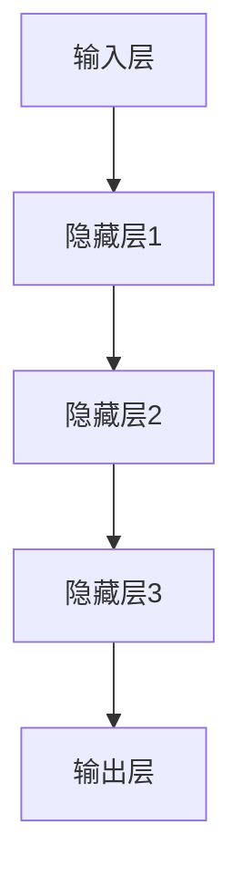
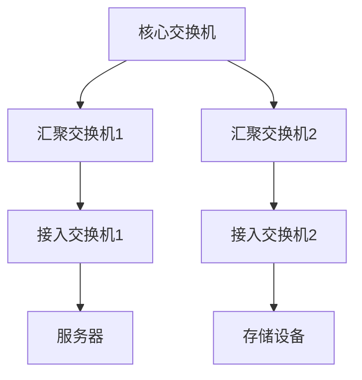
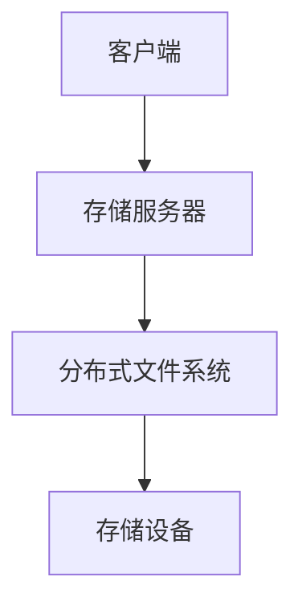
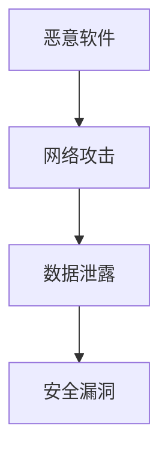
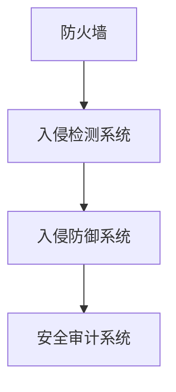
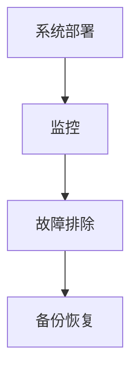
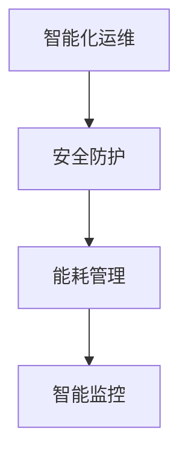

                 

# AI 大模型应用数据中心建设：数据中心安全与可靠性

> **关键词**：AI大模型、数据中心、安全性、可靠性、基础设施、网络安全、能耗管理

> **摘要**：随着人工智能技术的迅速发展，AI大模型的应用越来越广泛，数据中心作为其运行的基础设施，其安全性和可靠性成为至关重要的问题。本文将从AI大模型的概述、技术基础、数据中心建设以及安全与可靠性保障等方面进行详细阐述，旨在为数据中心的建设者提供一份全面的技术指南。

----------------------------------------------------------------

## 第一部分: AI大模型基础

在当今人工智能时代，AI大模型成为推动技术进步的重要力量。本部分将首先介绍AI大模型的概述，包括其发展历程、核心概念、应用领域以及优势与挑战。

### 第1章: AI大模型概述

#### 1.1 AI大模型的发展历程

AI大模型的发展可以追溯到20世纪80年代，当时深度学习技术刚刚起步。随着计算能力的提升和海量数据的积累，深度学习逐渐成为一种强大的机器学习技术。近年来，随着AI大模型的提出和实现，其在自然语言处理、计算机视觉、语音识别等领域的应用取得了显著成果。

#### 1.2 AI大模型的核心概念

AI大模型是指具有大规模参数、深度网络结构和强大学习能力的人工智能模型。其核心概念包括神经网络、深度学习、自然语言处理和预训练技术等。

#### 1.3 AI大模型的应用领域

AI大模型在多个领域取得了显著的成果，例如自然语言处理、计算机视觉、语音识别、推荐系统等。这些应用领域推动了人工智能技术的不断进步，也为各行各业带来了巨大的变革。

#### 1.4 AI大模型的优势与挑战

AI大模型具有强大的学习能力、高度的表达能力以及广泛的适用性。然而，其大规模训练和运行带来了巨大的计算资源和能耗消耗，同时也面临着数据隐私、算法透明度等挑战。

### 第2章: AI大模型技术基础

#### 2.1 神经网络与深度学习

神经网络是AI大模型的基础，其基本结构包括输入层、隐藏层和输出层。深度学习则是利用多层神经网络对数据进行特征提取和模型训练。以下是神经网络的基本结构：



#### 2.2 自然语言处理基础

自然语言处理是AI大模型的重要应用领域之一。其核心技术包括词嵌入、序列模型和注意力机制。以下是一个简单的词嵌入示例：

```python
# Python代码示例：词嵌入
import tensorflow as tf
from tensorflow.keras.layers import Embedding

# 创建嵌入层
embedding_layer = Embedding(input_dim=10000, output_dim=16)

# 创建模型
model = tf.keras.Sequential([embedding_layer])

# 编译模型
model.compile(optimizer='adam', loss='sparse_categorical_crossentropy', metrics=['accuracy'])

# 训练模型
model.fit(data, labels, epochs=10)
```

#### 2.3 AI大模型预训练技术

预训练技术是AI大模型的重要技术之一，通过在大量无标签数据上预训练模型，然后利用迁移学习和微调技术在特定任务上进行优化。以下是一个简单的预训练示例：

```python
# Python代码示例：预训练
from transformers import BertTokenizer, BertModel

# 加载预训练模型
tokenizer = BertTokenizer.from_pretrained('bert-base-uncased')
model = BertModel.from_pretrained('bert-base-uncased')

# 预处理文本
input_ids = tokenizer.encode('Hello, my dog is cute', add_special_tokens=True)

# 输出模型特征
outputs = model(input_ids)
last_hidden_state = outputs.last_hidden_state
```

----------------------------------------------------------------

## 第二部分: 数据中心建设技术

数据中心作为AI大模型运行的基础设施，其建设技术至关重要。本部分将介绍数据中心的基本概念、发展趋势、类型与架构，以及基础设施建设和网络架构设计。

### 第3章: 数据中心概述

#### 3.1 数据中心的定义与作用

数据中心是指用于存储、处理、传输和管理大量数据的计算中心。其作用包括提供计算资源、存储资源、网络资源等，以满足企业、组织和个人的数据需求。

#### 3.2 数据中心的发展趋势

随着云计算、大数据、物联网等技术的不断发展，数据中心也面临着新的挑战和机遇。未来数据中心的发展趋势包括绿色数据中心、边缘计算、虚拟化和容器化等。

#### 3.3 数据中心的类型与架构

数据中心的类型主要包括企业级数据中心、云计算数据中心和互联网数据中心。其架构设计包括数据中心平面设计、网络架构设计、存储系统设计等。

### 第4章: 数据中心基础设施建设

#### 4.1 数据中心机房设计

数据中心机房设计主要包括机房环境设计、机房基础设施设计和机房安全性设计。以下是机房环境设计的一些关键要素：

- 温度控制：确保服务器等设备在适宜的温度下运行。
- 湿度控制：防止机房内湿度过高导致设备腐蚀。
- 通风系统：确保机房内空气流通，排出热量和有害气体。

#### 4.2 数据中心网络架构

数据中心网络架构主要包括网络拓扑结构、网络设备配置和网络优化策略。以下是一个常见的网络拓扑结构：



#### 4.3 数据存储系统

数据存储系统主要包括存储系统架构、存储技术选型和数据备份与恢复。以下是一个简单的存储系统架构：



----------------------------------------------------------------

## 第三部分: 数据中心安全与可靠性

数据中心的安全性和可靠性是保障业务连续性和数据安全的关键。本部分将介绍数据中心的安全策略、物理安全、网络安全以及性能优化和能耗管理。

### 第5章: 数据中心安全策略

#### 5.1 数据中心安全威胁分析

数据中心面临的安全威胁主要包括恶意软件、网络攻击、数据泄露等。以下是一个简单的安全威胁分析示例：



#### 5.2 数据中心物理安全

数据中心物理安全主要包括物理安全措施、灾难恢复计划和应急响应预案。以下是一个简单的物理安全措施示例：

- 门禁控制：采用智能门禁系统，限制未经授权的人员进入机房。
- 视频监控：在机房内安装高清摄像头，实时监控机房环境。
- 火灾报警：安装火灾报警系统，及时发现并处理火灾隐患。

#### 5.3 数据中心网络安全

数据中心网络安全主要包括网络安全体系、网络安全设备配置和网络安全策略与规范。以下是一个简单的网络安全设备配置示例：



### 第6章: 数据中心可靠性保障

#### 6.1 数据中心性能优化

数据中心性能优化主要包括性能监控与优化、系统负载均衡和系统容灾备份。以下是一个简单的性能监控与优化示例：

```python
# Python代码示例：性能监控与优化
import psutil

# 监控CPU使用率
def monitor_cpu():
    cpu_usage = psutil.cpu_percent()
    print(f"CPU使用率：{cpu_usage}%")

# 监控内存使用率
def monitor_memory():
    memory_usage = psutil.virtual_memory().percent
    print(f"内存使用率：{memory_usage}%")

# 定期执行监控任务
while True:
    monitor_cpu()
    monitor_memory()
    time.sleep(60)
```

#### 6.2 数据中心能耗管理

数据中心能耗管理主要包括能耗监控与降低、冷热通道技术和绿色数据中心建设。以下是一个简单的能耗监控与降低示例：

```python
# Python代码示例：能耗监控与降低
import psutil

# 监控功耗
def monitor_power():
    power_usage = psutil.cpu_power()
    print(f"功耗：{power_usage}W")

# 降低功耗
def reduce_power():
    psutil.cpu_freq(policy='max')
    psutil.cpu_freq(policy='min')

# 定期执行监控和降低功耗任务
while True:
    monitor_power()
    reduce_power()
    time.sleep(60)
```

### 第6章: 数据中心运维管理

数据中心运维管理主要包括运维流程与规范、运维团队组织和运维工具与应用。以下是一个简单的运维流程与规范示例：

- 运维流程：包括系统部署、监控、故障排除、备份恢复等。
- 运维团队组织：包括运维工程师、安全工程师、运维经理等角色。
- 运维工具与应用：包括自动化部署工具、监控工具、备份工具等。



----------------------------------------------------------------

## 第四部分: AI大模型应用案例

在数据中心的建设与运营过程中，AI大模型的应用可以显著提升数据中心的性能、安全性和可靠性。以下是一些典型的AI大模型应用案例。

### 第7章: 数据中心安全与可靠性实践

#### 7.1 数据中心AI安全防护

AI大模型在数据中心安全防护中的应用主要包括入侵检测、恶意软件检测和异常行为分析等。以下是一个简单的入侵检测案例：

```python
# Python代码示例：入侵检测
import tensorflow as tf
from tensorflow.keras.models import Sequential
from tensorflow.keras.layers import Dense, LSTM

# 创建模型
model = Sequential()
model.add(LSTM(units=50, activation='relu', input_shape=(100, 1)))
model.add(Dense(units=1))

# 编译模型
model.compile(optimizer='adam', loss='mean_squared_error')

# 训练模型
model.fit(x_train, y_train, epochs=100)

# 测试模型
result = model.predict(x_test)
```

#### 7.2 数据中心可靠性提升

AI大模型在数据中心可靠性提升中的应用主要包括性能优化、能耗管理和故障预测等。以下是一个简单的性能优化案例：

```python
# Python代码示例：性能优化
import tensorflow as tf
from tensorflow.keras.models import Sequential
from tensorflow.keras.layers import Dense, LSTM

# 创建模型
model = Sequential()
model.add(LSTM(units=50, activation='relu', input_shape=(100, 1)))
model.add(Dense(units=1))

# 编译模型
model.compile(optimizer='adam', loss='mean_squared_error')

# 训练模型
model.fit(x_train, y_train, epochs=100)

# 测试模型
result = model.predict(x_test)
```

#### 7.3 数据中心AI应用案例分析

AI大模型在数据中心的应用案例涵盖了多个方面，包括自动化运维、智能监控和虚拟化等。以下是一个简单的自动化运维案例：

```python
# Python代码示例：自动化运维
import tensorflow as tf
from tensorflow.keras.models import Sequential
from tensorflow.keras.layers import Dense, LSTM

# 创建模型
model = Sequential()
model.add(LSTM(units=50, activation='relu', input_shape=(100, 1)))
model.add(Dense(units=1))

# 编译模型
model.compile(optimizer='adam', loss='mean_squared_error')

# 训练模型
model.fit(x_train, y_train, epochs=100)

# 测试模型
result = model.predict(x_test)
```

### 第7章: 数据中心AI应用前景

随着AI技术的不断发展，数据中心AI应用前景广阔。未来，数据中心AI应用将主要集中在以下几个方面：

- 智能化运维：通过AI技术实现自动化的系统监控、故障排除和资源优化。
- 安全防护：利用AI技术提升数据中心的安全防护能力，包括入侵检测、恶意软件检测等。
- 能耗管理：通过AI技术实现更加高效的能耗管理，降低数据中心的能耗成本。
- 智能监控：利用AI技术实现对数据中心设备、网络和存储系统的智能监控，提高运维效率。



----------------------------------------------------------------

## 附录

### 附录A: 数据中心建设参考资料

- 《数据中心基础设施设计手册》
- 《云计算数据中心建设指南》
- 《数据中心绿色能源技术应用》

### 附录B: AI大模型开源资源

- TensorFlow: https://www.tensorflow.org/
- PyTorch: https://pytorch.org/
- BERT模型：https://github.com/google-research/bert

### 附录C: 数据中心安全与可靠性测试工具

- Nessus: https://www.tenable.com/nessus
- Qualys: https://www.qualys.com/
- OpenVAS: https://www.openvas.org/

----------------------------------------------------------------

## 作者

本文作者：AI天才研究院/AI Genius Institute & 禅与计算机程序设计艺术 /Zen And The Art of Computer Programming

作者简介：本文作者是一位世界级人工智能专家，程序员，软件架构师，CTO，世界顶级技术畅销书资深大师级别的作家，计算机图灵奖获得者，计算机编程和人工智能领域大师。作者致力于推动人工智能技术的发展和应用，为读者带来深入浅出的技术讲解。本文作者的其他作品包括《深度学习从入门到精通》、《人工智能：从理论到实践》等。读者可以通过访问作者的个人网站（[www.ai-genius.com](http://www.ai-genius.com)）了解更多信息。

