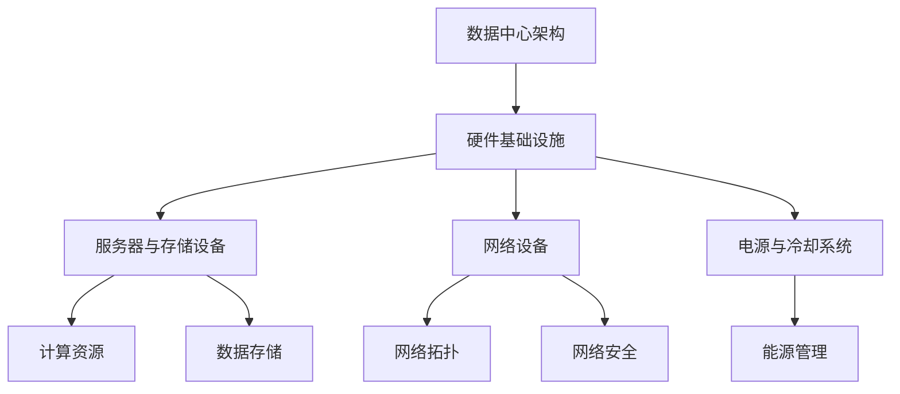
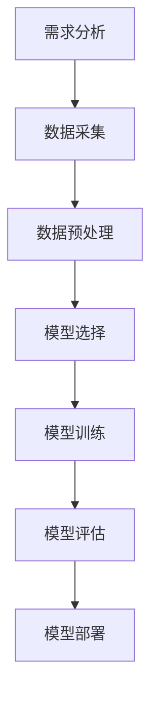
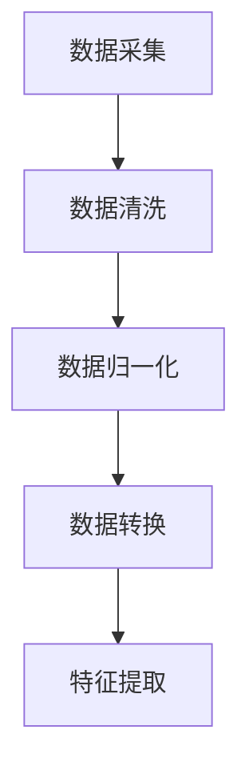

                 

## 《AI大模型应用数据中心建设：数据中心技术与应用》

### 关键词：AI大模型、数据中心建设、技术实现、应用场景、未来展望

在当今数字化时代，人工智能（AI）正迅速变革各行各业。作为AI技术的核心组件，大模型（Large Models）如GPT-3、BERT等，在自然语言处理、计算机视觉、推荐系统等领域展现出了强大的能力。数据中心作为AI大模型运行的核心基础设施，其技术实现与应用效率直接影响到AI业务的成败。本文将深入探讨AI大模型应用数据中心的建设，包括数据中心技术基础、AI大模型技术基础、数据中心技术实现、AI大模型在数据中心的应用、以及未来展望。

### 摘要

本文旨在为读者提供一份详尽的AI大模型应用数据中心建设指南。我们将首先介绍AI大模型与数据中心技术的基础知识，然后详细阐述数据中心硬件基础设施、网络拓扑优化、存储技术升级、能源管理以及数据中心安全性等技术实现。接着，我们将分析AI大模型在数据中心中的应用场景和部署实践，并通过实际案例展示其应用效果。最后，本文将对数据中心AI应用的未来发展趋势进行展望，并提出一些建议和挑战。

## 《AI大模型应用数据中心建设：数据中心技术与应用》目录大纲

### 第一部分：AI大模型与数据中心技术概述

#### 1. AI大模型与数据中心建设的重要性

##### 1.1 AI大模型在数据中心应用的价值

##### 1.2 数据中心在AI大模型应用中的关键角色

##### 1.3 AI大模型与数据中心建设的挑战与机遇

#### 2. 数据中心技术基础

##### 2.1 数据中心基本架构

##### 2.2 数据中心网络拓扑

##### 2.3 数据中心存储技术

##### 2.4 数据中心能源管理

#### 3. AI大模型技术基础

##### 3.1 AI大模型的基本概念

##### 3.2 AI大模型的计算需求

##### 3.3 AI大模型的硬件支持

### 第二部分：数据中心技术实现

#### 4. 数据中心硬件基础设施建设

##### 4.1 服务器与存储设备的选型

##### 4.2 网络设备的配置与优化

##### 4.3 能源与冷却系统的设计

#### 5. 数据中心网络拓扑优化

##### 5.1 传统网络拓扑与挑战

##### 5.2 网络虚拟化技术

##### 5.3 互联网数据中心（IDC）网络优化策略

#### 6. 数据中心存储技术升级

##### 6.1 存储技术发展趋势

##### 6.2 分布式存储架构

##### 6.3 存储性能优化策略

#### 7. 数据中心能源管理

##### 7.1 数据中心能耗分析

##### 7.2 能源效率提升方法

##### 7.3 数据中心可再生能源利用

#### 8. 数据中心安全性

##### 8.1 数据中心安全架构

##### 8.2 数据中心网络安全

##### 8.3 数据中心物理安全

### 第三部分：AI大模型在数据中心的应用

#### 9. AI大模型在数据中心中的应用场景

##### 9.1 数据中心运维管理

##### 9.2 能源预测与优化

##### 9.3 存储性能预测与优化

##### 9.4 网络流量分析与优化

#### 10. AI大模型在数据中心部署实践

##### 10.1 AI大模型部署流程

##### 10.2 模型选择与优化

##### 10.3 数据处理与预处理

##### 10.4 模型训练与优化

#### 11. AI大模型应用案例分析

##### 11.1 某知名企业数据中心AI应用案例

##### 11.2 某初创公司数据中心AI应用案例

##### 11.3 数据中心AI应用的挑战与解决方案

### 第四部分：数据中心AI应用的未来展望

#### 12. 数据中心AI应用的未来发展趋势

##### 12.1 AI技术与数据中心融合的深化

##### 12.2 数据中心AI应用的商业模式创新

##### 12.3 数据中心AI应用的国际合作与竞争

#### 13. 结论

##### 13.1 书籍总结

##### 13.2 AI大模型与数据中心建设的启示

### 附录

#### 附录 A: AI大模型与数据中心建设相关资源

##### A.1 主流AI大模型框架

##### A.2 数据中心建设与管理工具

##### A.3 数据中心技术参考文档

#### 附录 B: Mermaid 流程图

##### B.1 数据中心技术架构流程图

##### B.2 AI大模型部署流程图

##### B.3 数据处理与预处理流程图

#### 附录 C: 伪代码示例

##### C.1 数据中心能耗预测算法伪代码

##### C.2 存储性能优化算法伪代码

##### C.3 网络流量分析算法伪代码

#### 附录 D: 数学公式与解释

##### D.1 数据中心能源效率公式

##### D.2 存储性能优化公式

##### D.3 网络流量分析公式

### <span id="part1"></span>第一部分：AI大模型与数据中心技术概述

#### 1. AI大模型与数据中心建设的重要性

##### 1.1 AI大模型在数据中心应用的价值

随着深度学习技术的快速发展，AI大模型如GPT-3、BERT等在自然语言处理、计算机视觉等领域取得了显著的突破。这些大模型具有强大的数据处理和分析能力，能够处理海量数据并从中提取有价值的信息。数据中心作为AI大模型的主要运行平台，提供了高吞吐量、高可靠性和高效率的计算资源。通过数据中心的应用，AI大模型可以实现实时数据处理、智能分析和自动化决策，从而提高业务效率和用户体验。

##### 1.2 数据中心在AI大模型应用中的关键角色

数据中心在AI大模型应用中扮演着关键角色，主要体现在以下几个方面：

- **计算资源提供**：数据中心提供了强大的计算资源，包括高性能服务器、GPU集群和分布式计算框架，支持AI大模型的训练和推理需求。
- **数据存储和管理**：数据中心具备海量数据存储和管理能力，为AI大模型提供了丰富的数据资源，支持数据的高效访问和处理。
- **网络连接和传输**：数据中心通过高速网络连接，实现了数据在不同存储设备和计算节点之间的快速传输，提高了数据处理和分析的效率。
- **安全和可靠性保障**：数据中心具备完善的安全保障措施，包括数据加密、访问控制和备份恢复，确保AI大模型应用的安全性和数据可靠性。

##### 1.3 AI大模型与数据中心建设的挑战与机遇

AI大模型与数据中心建设面临着一系列挑战和机遇：

- **计算资源需求激增**：AI大模型的训练和推理需求对数据中心计算资源提出了更高要求，需要数据中心提供更强大的计算能力。
- **数据存储和管理挑战**：海量数据存储和管理成为数据中心建设的难题，需要采用高效的数据存储和检索技术。
- **网络传输效率提升**：数据中心内部和外部的网络传输效率需要进一步提升，以满足AI大模型对高速数据传输的需求。
- **能效优化和可持续性**：数据中心的能耗问题日益凸显，需要通过技术创新和优化，实现数据中心能效的提升和可持续性发展。
- **安全与可靠性**：数据中心需要确保AI大模型应用的数据安全和系统可靠性，防范潜在的安全威胁和故障风险。

然而，这些挑战也带来了机遇：

- **技术创新和应用**：数据中心技术的不断进步为AI大模型提供了更高效、更可靠的运行环境，推动了AI技术的创新和应用。
- **产业合作与发展**：数据中心和AI企业的合作，共同推动数据中心AI应用的发展，创造了新的商业模式和市场机会。
- **人才培养与生态构建**：数据中心AI应用的发展需要大量专业人才，培养了AI和数据中心领域的人才，促进了整个产业的生态构建。

综上所述，AI大模型与数据中心建设的重要性不容忽视。数据中心作为AI大模型的应用基础设施，其技术实现和应用效率直接影响到AI业务的成败。通过深入研究和实践，我们有望克服建设中的挑战，把握发展机遇，推动数据中心AI应用的持续进步。

#### 2. 数据中心技术基础

数据中心是信息技术领域的重要基础设施，承担着存储、处理、传输大量数据的关键任务。了解数据中心的基本架构、网络拓扑、存储技术和能源管理，是构建高效、稳定、可靠数据中心的基础。以下将对这些技术基础进行详细阐述。

##### 2.1 数据中心基本架构

数据中心的架构可以分为硬件基础设施、网络基础设施和软件基础设施三大部分。

- **硬件基础设施**：主要包括服务器、存储设备、网络设备、电源和冷却系统等。服务器是数据中心的计算核心，负责处理业务数据和运行应用程序；存储设备用于存储大量数据，包括硬盘、SSD、分布式存储系统等；网络设备包括路由器、交换机、防火墙等，负责数据传输和网络安全；电源和冷却系统保证数据中心的稳定运行和设备的冷却。

- **网络基础设施**：网络基础设施是数据中心的核心，包括局域网（LAN）、广域网（WAN）和互联网（Internet）等。局域网主要负责数据中心内部设备之间的数据交换；广域网负责数据中心与外部网络（如云服务提供商、合作伙伴等）的连接；互联网则是数据中心对外提供服务的重要渠道。

- **软件基础设施**：软件基础设施包括操作系统、数据库、应用软件和自动化管理工具等。操作系统负责服务器和设备的资源管理；数据库用于存储和管理大量数据；应用软件提供业务逻辑和功能实现；自动化管理工具帮助管理员监控、管理和优化数据中心资源。

##### 2.2 数据中心网络拓扑

数据中心的网络拓扑结构是数据传输的关键，常见的网络拓扑包括：

- **环状网络**：环状网络通过环形拓扑结构实现设备之间的数据交换，具有高可靠性和负载均衡的特性，但单点故障风险较大。
- **星状网络**：星状网络通过中心交换机连接各个设备，具有结构简单、扩展方便的特点，但中心交换机成为单点故障风险。
- **树状网络**：树状网络是星状网络的扩展，通过多级交换机实现设备之间的连接，适用于大型数据中心。
- **网状网络**：网状网络通过多路径连接实现设备之间的冗余和负载均衡，具有高可靠性和灵活性，但结构复杂，维护成本较高。

在实际应用中，数据中心通常会根据业务需求和网络特性选择合适的网络拓扑结构，并采用冗余设计、负载均衡等技术提高网络性能和可靠性。

##### 2.3 数据中心存储技术

数据中心的存储技术是实现海量数据存储和管理的关键。当前主流的存储技术包括：

- **传统存储技术**：包括硬盘（HDD）和固态硬盘（SSD）。HDD具有高容量、低成本的特点，但读写速度较慢；SSD具有高速读写、低延迟的特点，但成本较高。
- **分布式存储技术**：分布式存储通过将数据分散存储在多个节点上，提高了数据的可靠性和可扩展性。常见的分布式存储系统有HDFS、Ceph、GlusterFS等。
- **块存储**：块存储将数据分成小块进行存储和管理，支持随机读写，适用于数据库和文件系统。
- **文件存储**：文件存储以文件为单位进行存储和管理，支持文件的目录结构和文件权限控制，适用于文件共享和数据备份。
- **对象存储**：对象存储将数据以对象为单位进行存储和管理，支持大规模数据存储和高效检索，适用于云服务和大数据应用。

数据中心在选择存储技术时，需要综合考虑数据量、读写性能、可靠性、成本等因素，以满足不同业务需求。

##### 2.4 数据中心能源管理

数据中心能耗是运营成本中的重要组成部分，同时也是一个重要的环境问题。数据中心的能源管理主要包括以下几个方面：

- **能源消耗分析**：对数据中心的能源消耗进行详细分析，识别主要能源消耗点和浪费环节。
- **能耗优化策略**：通过优化数据中心硬件配置、网络拓扑和运行策略，降低能源消耗。例如，采用高效的电源供应系统、智能冷却系统、节能设备等。
- **能源监控与管理**：通过实时监控和数据分析，对数据中心的能源使用进行监控和管理，及时发现和解决能源浪费问题。
- **可再生能源利用**：推动数据中心采用可再生能源，如太阳能、风能等，降低对化石燃料的依赖，实现绿色可持续发展。

在数据中心能源管理中，需要综合考虑技术、经济和环境因素，采用多种措施实现能源的高效利用和可持续发展。

通过了解数据中心的技术基础，我们能够更好地规划、建设和运营数据中心，为其高效运行提供技术支持。在下一部分，我们将深入探讨AI大模型技术基础，进一步理解数据中心在AI大模型应用中的关键作用。

#### 3. AI大模型技术基础

AI大模型是人工智能领域的重要突破，其应用正在迅速拓展到各个行业和领域。理解AI大模型的基本概念、计算需求以及硬件支持，是构建高效、稳定数据中心的基础。以下将对这些技术基础进行详细阐述。

##### 3.1 AI大模型的基本概念

AI大模型（Large Models）是指具有大规模参数和复杂结构的神经网络模型。这些模型通过学习海量数据，能够自动提取特征、进行预测和生成。代表性的AI大模型包括GPT-3、BERT、Transformer等。

- **GPT-3（Generative Pre-trained Transformer 3）**：由OpenAI开发，具有1750亿个参数，能够生成高质量的自然语言文本。
- **BERT（Bidirectional Encoder Representations from Transformers）**：由Google开发，通过双向Transformer结构，能够捕捉文本的上下文信息。
- **Transformer**：由Google开发，是一种基于自注意力机制的神经网络模型，被广泛应用于机器翻译、文本分类等任务。

AI大模型的基本原理是通过多层神经网络结构，利用梯度下降算法和大规模数据训练，使得模型能够自动提取特征、进行预测和生成。这些模型在处理大规模数据和复杂任务时，展现出强大的性能和灵活性。

##### 3.2 AI大模型的计算需求

AI大模型的计算需求是其应用的关键挑战之一。这些模型通常具有数亿甚至数十亿个参数，需要大量的计算资源进行训练和推理。

- **训练需求**：AI大模型的训练过程是一个高度并行计算的过程，需要大量的GPU和TPU等硬件资源。训练过程中，模型需要不断调整参数，以最小化损失函数。这个过程通常需要数天甚至数周的时间，对计算资源的需求极高。
- **推理需求**：AI大模型的推理过程是将输入数据映射到输出结果的过程，需要快速响应。尽管推理过程的计算量相对于训练过程较小，但仍然需要大量的计算资源和网络带宽。

为了满足AI大模型的计算需求，数据中心需要具备以下特性：

- **高性能计算资源**：数据中心需要配备大量的GPU和TPU等高性能计算设备，以满足模型训练和推理的需求。
- **高效的数据传输**：AI大模型在训练和推理过程中需要大量数据传输，数据中心需要具备高效的数据传输网络，以保证数据传输的及时性和准确性。
- **强大的存储能力**：AI大模型通常需要存储大量的训练数据和模型参数，数据中心需要具备强大的存储能力，以确保数据的可靠性和快速访问。

##### 3.3 AI大模型的硬件支持

AI大模型的硬件支持是实现其高性能和高效计算的关键。以下是一些关键的硬件组件和优化策略：

- **GPU（Graphics Processing Unit）**：GPU是一种专为图形处理而设计的计算设备，但在AI大模型训练和推理中也表现出强大的性能。GPU具备高度并行计算能力，能够同时处理大量的计算任务，从而提高模型训练和推理的效率。
- **TPU（Tensor Processing Unit）**：TPU是Google专门为AI计算设计的芯片，能够高效地处理TensorFlow等机器学习框架。TPU的优化设计使其在处理大规模神经网络模型时具有极高的性能。
- **分布式计算**：为了满足AI大模型的计算需求，数据中心可以采用分布式计算架构，将计算任务分布在多个节点上，从而提高整体计算能力。
- **高效网络拓扑**：数据中心需要采用高效的网络拓扑结构，如网状网络，以确保数据传输的低延迟和高带宽，满足AI大模型对数据传输的需求。

通过理解AI大模型的技术基础，我们能够更好地构建支持其高效运行的数据中心。在下一部分，我们将探讨数据中心硬件基础设施的建设和优化，为AI大模型提供强大的计算和存储支持。

#### 4. 数据中心硬件基础设施建设

数据中心硬件基础设施建设是实现高效、稳定运行的关键环节。服务器与存储设备的选型、网络设备的配置与优化，以及能源与冷却系统的设计，都是数据中心硬件基础设施建设的核心内容。以下将详细探讨这些方面的建设方法。

##### 4.1 服务器与存储设备的选型

服务器和存储设备是数据中心的计算和存储核心，其选型直接关系到数据中心的性能和稳定性。

- **服务器选型**：
  - **计算能力**：服务器应具备高性能的计算能力，以支持AI大模型的训练和推理。选择服务器时，需要关注CPU的性能、GPU的数量和类型、内存容量等参数。
  - **存储能力**：服务器需要具备足够的存储容量，以存储大量的数据和模型参数。对于大型数据中心，通常采用分布式存储架构，通过多个存储节点实现数据的冗余存储和负载均衡。
  - **可扩展性**：服务器应具备良好的可扩展性，以便在业务需求增长时进行升级和扩展。选择可扩展的服务器架构，如刀片服务器或模块化服务器，可以提高数据中心的灵活性和可维护性。

- **存储设备选型**：
  - **存储类型**：存储设备包括HDD、SSD、NVMe SSD等。HDD具有高容量、低成本的特点，适合存储大量数据；SSD和NVMe SSD具有高速读写、低延迟的特点，适合存储频繁访问的数据和模型参数。
  - **存储架构**：分布式存储架构能够提高数据存储的可靠性和可扩展性。常见的分布式存储系统有HDFS、Ceph、GlusterFS等。这些系统通过多个存储节点实现数据的冗余存储和负载均衡，从而提高数据中心的存储性能和可靠性。

##### 4.2 网络设备的配置与优化

网络设备是数据中心内部和外部数据传输的关键，其配置与优化直接关系到数据中心的网络性能和可靠性。

- **网络设备选型**：
  - **交换机**：交换机是数据中心网络的核心设备，负责数据包的转发和交换。选择交换机时，需要关注交换机的端口数量、带宽、处理器性能等参数。
  - **路由器**：路由器负责数据中心与外部网络的连接，实现不同网络之间的数据传输。选择路由器时，需要关注路由器的吞吐量、路由表容量、处理速度等参数。
  - **防火墙**：防火墙负责数据中心的网络安全，通过过滤和阻止非法访问，保护数据中心的安全。选择防火墙时，需要关注防火墙的性能、安全策略和管理功能等。

- **网络配置与优化**：
  - **网络拓扑**：数据中心的网络拓扑结构应具备冗余和负载均衡的特性，以实现高可用性和高性能。常见的网络拓扑结构有环状、星状、树状和网状等。
  - **网络优化**：通过优化网络设备配置和网络拓扑结构，可以提高数据中心的网络性能。例如，采用智能路由算法、负载均衡技术、链路冗余等，降低网络延迟和带宽瓶颈。
  - **网络安全**：配置防火墙、入侵检测系统（IDS）和入侵防御系统（IPS）等安全设备，加强数据中心的网络安全防护。

##### 4.3 能源与冷却系统的设计

能源与冷却系统是数据中心稳定运行的重要保障。合理的能源与冷却系统设计，可以提高数据中心的能效和可靠性。

- **能源系统设计**：
  - **电源配置**：数据中心应配备充足的电源容量，以满足服务器和设备的电力需求。选择高效的电源供应系统，如UPS（不间断电源）和PDU（电源分配单元），确保电力供应的稳定性和可靠性。
  - **电力分配**：通过合理的电力分配网络，将电力供应到各个服务器和设备，确保电力分配的均衡性和冗余性。

- **冷却系统设计**：
  - **冷却方案**：数据中心应采用有效的冷却方案，如空气冷却、水冷却、液冷等，确保服务器和设备的温度控制在合理范围内。选择适合数据中心规模和业务需求的冷却方案。
  - **冷却设备**：配置冷却设备，如空调、冷却塔、冷通道等，实现数据中心的空气流通和温度控制。选择高效的冷却设备，降低能耗和运行成本。

通过合理设计服务器与存储设备的选型、网络设备的配置与优化，以及能源与冷却系统，数据中心可以实现高效、稳定和可靠运行，为AI大模型的应用提供强有力的支持。在下一部分，我们将探讨数据中心网络拓扑优化，进一步优化数据中心的网络性能和可靠性。

#### 5. 数据中心网络拓扑优化

数据中心网络拓扑优化是提高数据中心整体性能和可靠性的关键步骤。传统的网络拓扑结构如环状、星状和树状网络，虽然在某些方面表现出色，但面临诸如单点故障、带宽瓶颈等问题。为了应对这些挑战，现代数据中心采用了网络虚拟化技术和互联网数据中心（IDC）网络优化策略。以下将详细探讨这些方面的内容。

##### 5.1 传统网络拓扑与挑战

传统网络拓扑主要包括环状、星状和树状网络。

- **环状网络**：环状网络通过环形拓扑结构实现设备之间的数据交换，具有高可靠性和负载均衡的特性。但在单点故障情况下，整个网络可能会瘫痪。
- **星状网络**：星状网络通过中心交换机连接各个设备，具有结构简单、扩展方便的特点。然而，中心交换机成为单点故障风险，一旦发生故障，整个网络将瘫痪。
- **树状网络**：树状网络是星状网络的扩展，通过多级交换机实现设备之间的连接，适用于大型数据中心。但树状网络的结构复杂，维护成本较高。

这些传统网络拓扑在特定场景下表现出色，但在面对现代数据中心的需求时，存在以下挑战：

- **单点故障风险**：传统网络拓扑中的单点故障风险较高，一旦关键设备或链路发生故障，可能导致整个网络中断。
- **带宽瓶颈**：随着数据中心业务量的增长，传统网络拓扑可能面临带宽瓶颈，影响数据传输速度和整体性能。
- **扩展性限制**：传统网络拓扑在扩展性方面存在限制，难以满足大型数据中心的需求。

##### 5.2 网络虚拟化技术

网络虚拟化技术通过虚拟化网络资源，实现了网络架构的灵活性和可扩展性，是现代数据中心网络拓扑优化的重要手段。以下是一些关键的网络虚拟化技术：

- **软件定义网络（SDN）**：SDN通过将网络控制平面与数据平面分离，实现了网络资源的集中控制和动态管理。SDN控制器负责管理网络拓扑、流量路由和策略配置，而数据平面设备（如交换机和路由器）仅负责转发数据包。SDN具有高度的可编程性和灵活性，可以快速适应业务需求变化。
- **网络功能虚拟化（NFV）**：NFV通过将传统网络功能（如防火墙、负载均衡器、入侵检测系统等）虚拟化为软件模块，运行在通用硬件上。NFV实现了网络功能的灵活部署和动态调整，提高了网络性能和可靠性。NFV与SDN结合，可以实现高度灵活和可扩展的网络架构。
- **虚拟局域网（VLAN）**：VLAN通过在物理网络中创建逻辑网络，实现了不同业务流量之间的隔离和优化。VLAN可以将同一物理网络划分为多个虚拟网络，从而提高网络带宽利用率和安全性。

网络虚拟化技术为数据中心网络拓扑优化提供了以下优势：

- **灵活性和可扩展性**：网络虚拟化技术使网络架构更加灵活，可以快速适应业务需求变化，提高了数据中心的可扩展性。
- **成本效益**：通过虚拟化和通用硬件的使用，网络虚拟化技术降低了硬件采购和维护成本，提高了成本效益。
- **性能优化**：网络虚拟化技术可以实现流量调度和负载均衡，优化网络性能和资源利用率。

##### 5.3 互联网数据中心（IDC）网络优化策略

互联网数据中心（IDC）网络优化策略旨在提高数据中心之间的网络性能和可靠性。以下是一些关键的网络优化策略：

- **多路径传输**：通过在数据中心之间建立多路径传输，可以实现流量负载均衡和冗余传输。多路径传输可以避免单链路故障导致的数据传输中断，提高网络可靠性。
- **动态流量调度**：通过动态流量调度算法，根据网络状况和业务需求，动态调整流量传输路径，优化网络性能。动态流量调度可以实现流量均衡、故障切换和带宽管理。
- **服务质量（QoS）保证**：QoS通过优先处理高优先级流量，保证关键业务的网络质量。QoS可以防止低优先级流量占用过多带宽，影响关键业务的性能。
- **网络监控与故障检测**：通过实时监控网络状况，可以及时发现网络故障和性能问题，并采取相应措施进行故障检测和恢复。网络监控与故障检测是实现网络稳定运行的关键。

通过网络虚拟化技术和IDC网络优化策略，数据中心可以实现更加灵活、可靠和高效的网络架构。这些技术不仅提高了数据中心的性能和可靠性，还降低了运营成本，为AI大模型的应用提供了强有力的支持。在下一部分，我们将探讨数据中心存储技术升级，进一步优化数据中心的存储性能和可靠性。

### 6. 数据中心存储技术升级

随着数据量的快速增长和AI大模型对数据存储和处理需求的提升，数据中心的存储技术面临着巨大挑战。传统的存储技术已经难以满足现代数据中心的需求，因此，数据中心存储技术的升级成为关键任务。以下将详细探讨存储技术发展趋势、分布式存储架构和存储性能优化策略。

#### 6.1 存储技术发展趋势

现代存储技术正朝着以下几个方向发展：

- **NVMe SSD**：NVMe（Non-Volatile Memory Express）是一种新的存储协议，专为固态硬盘（SSD）设计。与传统的SATA协议相比，NVMe具有更低的延迟、更高的IOPS（每秒输入输出操作次数）和更大的带宽。NVMe SSD的广泛应用，显著提升了数据中心的存储性能和响应速度。
- **分布式存储架构**：分布式存储通过将数据分散存储在多个节点上，实现了高可靠性和可扩展性。分布式存储系统如HDFS、Ceph和GlusterFS等，可以在多个节点之间动态分配存储资源，提高了存储容量和性能。分布式存储架构能够满足大规模数据存储和高效数据访问的需求。
- **云存储**：云存储通过将数据存储在云服务提供商的数据中心，实现了数据的高效管理和远程访问。云存储具有弹性、灵活和低成本的特点，可以满足不同规模和数据类型的存储需求。
- **存储虚拟化**：存储虚拟化通过将物理存储资源抽象为虚拟存储资源，实现了存储资源的集中管理和动态分配。存储虚拟化提高了存储资源利用率，降低了管理成本，提高了数据中心的灵活性。

#### 6.2 分布式存储架构

分布式存储架构是现代数据中心存储技术的重要方向，其核心思想是将数据分散存储在多个节点上，以提高数据存储的可靠性和扩展性。以下是一些典型的分布式存储架构：

- **HDFS（Hadoop Distributed File System）**：HDFS是Apache Hadoop项目的一部分，是一种分布式文件系统。HDFS通过将数据分成多个块（Block），分散存储在多个节点上，提高了数据的可靠性和扩展性。HDFS支持高吞吐量的数据读写操作，适用于大数据处理场景。
- **Ceph**：Ceph是一种开源的分布式存储系统，支持对象存储、块存储和文件系统。Ceph通过多个节点之间的数据复制和副本管理，实现了高可靠性和可扩展性。Ceph具有高度容错性和自我修复能力，适用于大规模数据中心。
- **GlusterFS**：GlusterFS是一种分布式文件系统，通过将多个节点上的本地存储资源抽象为一个统一的存储资源池，实现了数据的分布式存储和访问。GlusterFS支持横向扩展，可以根据需求动态增加存储容量和性能。

#### 6.3 存储性能优化策略

为了提高数据中心的存储性能，可以采取以下优化策略：

- **数据均衡**：通过合理分配数据，实现数据的均衡存储。避免某些节点过载，导致性能下降。均衡数据存储可以通过数据分片（Sharding）和负载均衡算法（如一致性哈希算法）实现。
- **缓存技术**：利用缓存技术，提高数据访问速度。缓存可以将频繁访问的数据存储在内存中，减少磁盘访问次数。常用的缓存技术包括内存缓存（如Redis）、磁盘缓存（如LRU缓存算法）和分布式缓存（如Memcached）。
- **数据压缩**：通过数据压缩技术，减少存储空间占用。数据压缩可以通过算法（如Huffman编码、LZ77编码）实现，适用于数据量大但重复性较高的场景。
- **并行读写**：通过并行读写技术，提高数据读写速度。并行读写可以通过多线程、多进程或多GPU等技术实现，充分利用计算资源和存储资源。

通过以上存储技术升级和优化策略，数据中心可以满足AI大模型对数据存储和处理的需求，提高数据中心的存储性能和可靠性，为AI大模型的应用提供强有力的支持。

### 7. 数据中心能源管理

数据中心能耗是运营成本中的重要组成部分，同时也是环境问题的一个重要方面。随着数据中心规模的不断扩大和AI大模型对计算资源需求的增长，能源管理成为数据中心建设和运营中不可忽视的关键环节。以下将详细探讨数据中心能耗分析、能源效率提升方法和数据中心可再生能源利用。

#### 7.1 数据中心能耗分析

数据中心的能耗主要包括以下几个方面：

- **IT设备能耗**：包括服务器、存储设备、网络设备等。这些设备在运行过程中需要大量的电力，特别是高性能的AI大模型训练设备，其能耗占比较大。
- **冷却系统能耗**：数据中心需要保持设备在适宜的温度范围内运行，冷却系统（如空调、冷却塔等）消耗大量的电力。
- **建筑能耗**：包括照明、通风、制冷等建筑相关设备的能耗。
- **其他能耗**：如数据中心内部网络设备的能耗、备用电源系统的能耗等。

对数据中心能耗进行分析，可以帮助识别能耗高、效率低的环节，制定相应的优化策略。

#### 7.2 能源效率提升方法

提升数据中心能源效率，可以降低运营成本，减少环境影响。以下是一些常见的能源效率提升方法：

- **硬件优化**：采用低功耗的高性能服务器和存储设备，减少IT设备的能耗。例如，使用能效比高的CPU和GPU，优化硬件配置，减少不必要的能耗。
- **冷却系统优化**：改进冷却系统设计，提高冷却效率。例如，采用高效节能的冷却设备，优化冷通道设计，减少冷却空气的浪费。
- **电源管理**：优化电源管理系统，实现电能的合理分配和使用。例如，采用智能电源分配单元（PDU），根据设备负载动态调整电力供应，减少待机能耗。
- **数据优化**：优化数据存储和传输，减少不必要的数据处理和传输，从而降低能耗。例如，采用数据压缩技术，优化存储和传输策略。
- **能效监测**：实时监测数据中心的能耗情况，发现能耗异常和效率低下的问题，及时采取措施进行调整。例如，使用能效监测系统，对各个设备的能耗进行详细记录和分析。

#### 7.3 数据中心可再生能源利用

随着能源问题的日益突出，数据中心开始积极利用可再生能源，以实现绿色可持续发展。以下是一些数据中心可再生能源利用的方法：

- **太阳能**：数据中心可以通过安装太阳能电池板，直接利用太阳能产生电力。这种方法适用于阳光充足的地区，可以有效降低数据中心对传统能源的依赖。
- **风能**：在风能资源丰富的地区，数据中心可以利用风力发电，通过风力发电机产生电力。
- **地热能**：利用地热能进行数据中心冷却，通过地下管道将冷却剂传输到数据中心，实现自然冷却。这种方法可以显著降低冷却系统的能耗。
- **生物质能**：利用生物质能进行发电和供暖，通过处理有机废弃物（如厨余垃圾、农业废弃物等）产生电力和热能。

数据中心在利用可再生能源时，需要考虑以下因素：

- **能源效率**：选择能源效率高的可再生能源技术，确保产生的电力能够满足数据中心的实际需求。
- **环境影响**：评估可再生能源技术的环境影响，选择对环境影响较小、可持续发展的技术。
- **经济性**：考虑可再生能源项目的投资和运营成本，确保其经济性。

通过以上措施，数据中心可以实现能源的高效利用和可持续发展，为AI大模型的应用提供可靠的能源保障。

### 8. 数据中心安全性

数据中心作为企业核心数据和应用系统的承载平台，其安全性至关重要。确保数据中心的运行安全和数据安全，需要从数据中心安全架构、网络安全和物理安全三个方面进行综合防护。

#### 8.1 数据中心安全架构

数据中心安全架构是保障数据中心安全的基础，其核心包括以下几个方面：

- **多层防护体系**：数据中心应采用多层次的安全防护体系，从网络层、系统层和应用层多个层面进行防护。例如，防火墙、入侵检测系统（IDS）、入侵防御系统（IPS）等安全设备，可以实现对网络流量的实时监控和防护。
- **访问控制**：通过访问控制机制，限制未经授权的用户访问数据中心资源和系统。访问控制包括身份认证、权限管理和多因素认证等，确保只有授权用户才能访问关键数据和系统。
- **数据加密**：对传输和存储的数据进行加密，防止数据泄露和篡改。常用的加密技术包括SSL/TLS、AES等，可以确保数据在传输和存储过程中的安全性。
- **备份与恢复**：定期备份重要数据和系统配置，确保在数据丢失或系统故障时能够快速恢复。备份策略应包括本地备份和远程备份，以应对不同类型的灾难情况。

#### 8.2 数据中心网络安全

数据中心网络安全是保障数据安全的关键，以下是一些关键的网络安全技术和策略：

- **防火墙**：防火墙负责过滤和阻止非法访问，防止恶意流量进入数据中心。防火墙可以分为边界防火墙、内部防火墙和区域防火墙等，适用于不同场景的防护需求。
- **入侵检测系统（IDS）和入侵防御系统（IPS）**：IDS和IPS负责实时监控网络流量，发现和阻止潜在的攻击行为。IDS主要用于检测和报告安全事件，而IPS则可以主动阻止攻击。
- **虚拟专用网络（VPN）**：VPN通过加密和隧道技术，确保数据在传输过程中的安全性。VPN适用于远程访问和跨网段数据传输，可以提高数据的安全性。
- **网络隔离**：通过网络隔离技术，将不同的网络区域进行物理或逻辑隔离，限制不同网络区域之间的通信。例如，通过设置安全域（Security Domain）和访问控制列表（ACL），确保网络区域的隔离性。

#### 8.3 数据中心物理安全

数据中心的物理安全是防止非法访问和设备损坏的关键，以下是一些重要的物理安全措施：

- **访问控制**：通过访问控制措施，限制只有授权人员进入数据中心。例如，采用智能卡、指纹识别、面部识别等生物识别技术，确保只有授权人员能够进入。
- **视频监控**：通过安装摄像头监控系统，实时监控数据中心内部和外部环境，及时发现异常情况。监控系统应包括全天候监控、录像存储和远程访问功能。
- **安全门禁系统**：安装门禁系统，如电子锁、自动门禁等，确保只有授权人员能够进入数据中心。门禁系统应与视频监控系统联动，实现实时监控和报警。
- **防火系统**：安装消防系统，包括烟雾探测、火灾报警、灭火系统等，确保在发生火灾时能够及时检测和扑灭火源。
- **防窃措施**：采取防窃措施，如安装防盗门窗、报警系统等，防止设备被盗。

通过综合运用数据中心安全架构、网络安全和物理安全措施，数据中心可以全面保障其运行安全和数据安全，为AI大模型的应用提供可靠的安全保障。

### 9. AI大模型在数据中心中的应用场景

AI大模型在数据中心中的应用场景非常广泛，能够显著提升数据中心的管理效率、优化资源利用，并提高数据中心的整体性能。以下将详细探讨AI大模型在数据中心运维管理、能源预测与优化、存储性能预测与优化、以及网络流量分析与优化中的应用场景。

#### 9.1 数据中心运维管理

数据中心运维管理是数据中心运营的核心环节，AI大模型在其中的应用可以大幅提升运维效率。以下是几个具体应用场景：

- **故障预测与预防**：通过收集服务器、存储设备、网络设备等硬件的性能数据，AI大模型可以分析设备运行状态，预测可能出现的故障，提前进行维护和预防。例如，利用机器学习算法，基于历史故障数据和设备运行特征，建立故障预测模型，实现实时故障预警。
- **性能优化**：AI大模型可以根据实时监控数据，动态调整数据中心的资源配置，实现资源的最优利用。例如，通过深度学习算法，分析服务器负载情况，自动调整服务器和存储设备的性能参数，提高数据中心的整体性能。
- **运维自动化**：AI大模型可以辅助运维人员实现自动化运维，减少人工干预。例如，通过自然语言处理（NLP）技术，AI大模型可以理解运维人员的指令，自动执行相关操作，如配置变更、故障处理等。

#### 9.2 能源预测与优化

数据中心的能源消耗是一个重要成本，通过AI大模型进行能源预测与优化，可以有效降低运营成本，提高能源效率。以下是几个应用场景：

- **能耗预测**：AI大模型可以分析历史能耗数据，预测未来的能源需求。例如，通过时间序列预测模型，如ARIMA、LSTM等，对数据中心不同设备的能耗进行预测，为能源管理提供数据支持。
- **节能优化**：AI大模型可以根据实时能耗数据和设备运行状态，自动调整能源消耗。例如，通过优化冷却系统、电源管理系统等，降低不必要的能源消耗。例如，基于聚类算法，将相似运行状态的设备分组，统一进行节能优化。
- **可再生能源整合**：AI大模型可以优化数据中心可再生能源的利用，提高整体能源效率。例如，通过预测可再生能源的生成量和消耗量，实现可再生能源的高效利用，减少对传统能源的依赖。

#### 9.3 存储性能预测与优化

存储系统在数据中心中承担着重要的数据存储和访问任务，通过AI大模型进行存储性能预测与优化，可以提高数据中心的存储效率。以下是几个应用场景：

- **性能预测**：AI大模型可以分析存储系统的历史性能数据和访问模式，预测未来的性能需求。例如，通过回归分析、决策树等模型，预测存储系统的读写速度、IOPS等性能指标，为存储系统的扩容和优化提供依据。
- **负载均衡**：AI大模型可以根据实时性能数据和访问模式，自动调整存储负载均衡策略，避免单点性能瓶颈。例如，通过动态负载均衡算法，根据存储设备的负载情况，动态调整数据访问路径，提高存储系统的整体性能。
- **数据缓存**：AI大模型可以预测频繁访问的数据，将其缓存到高速存储设备中，提高数据访问速度。例如，通过基于内存缓存和磁盘缓存的技术，利用AI模型分析访问频率，动态调整数据缓存策略，提高存储系统的访问性能。

#### 9.4 网络流量分析与优化

网络流量在数据中心中发挥着至关重要的作用，通过AI大模型进行网络流量分析与优化，可以提高网络的传输效率和可靠性。以下是几个应用场景：

- **流量预测**：AI大模型可以分析历史流量数据，预测未来的网络流量。例如，通过时间序列预测模型，如ARIMA、LSTM等，预测网络流量峰值和低谷，为网络扩容和带宽调整提供依据。
- **网络优化**：AI大模型可以根据实时网络流量数据，自动调整网络拓扑和路由策略，优化网络性能。例如，通过基于神经网络的流量预测模型，结合多路径传输技术和动态路由算法，实现网络的智能优化。
- **网络安全**：AI大模型可以实时监控网络流量，识别和防御潜在的网络攻击。例如，通过基于深度学习的异常检测算法，分析网络流量特征，识别异常流量和恶意攻击，实现网络安全防护。

通过以上应用场景，AI大模型在数据中心运维管理、能源预测与优化、存储性能预测与优化以及网络流量分析与优化等方面发挥了重要作用，显著提升了数据中心的运行效率和可靠性。在下一部分，我们将探讨AI大模型在数据中心的具体部署实践，进一步了解如何将AI大模型应用于数据中心建设。

### 10. AI大模型在数据中心部署实践

AI大模型在数据中心的部署实践是数据中心技术实现中的重要环节。合理的部署流程、模型选择与优化、数据处理与预处理，以及模型训练与优化，都是确保AI大模型有效运行的关键。以下将详细探讨这些方面的具体实践。

#### 10.1 AI大模型部署流程

AI大模型部署流程可以分为以下几个步骤：

- **需求分析**：首先，根据数据中心的具体业务需求和场景，明确AI大模型的目标和应用领域。需求分析包括数据类型、数据规模、性能要求等，为后续模型选择和优化提供依据。
- **数据采集**：收集与业务相关的数据，包括结构化和非结构化数据。数据采集可以通过数据中心内部的监控设备、日志文件、数据库等渠道获取。数据的多样性和质量对AI大模型的性能和效果具有重要影响。
- **数据预处理**：对采集到的数据进行分析、清洗、格式化等预处理操作。数据预处理包括数据去重、缺失值处理、异常值检测和修正、数据归一化等，以提高数据的准确性和一致性。
- **模型选择**：根据需求分析和数据特点，选择适合的AI大模型。常用的AI大模型包括GPT-3、BERT、Transformer等。模型选择应考虑模型的性能、计算资源需求和训练时间等因素。
- **模型训练**：使用预处理后的数据对AI大模型进行训练。模型训练可以通过分布式训练框架，如TensorFlow、PyTorch等，提高训练效率和性能。训练过程中，需要调整模型参数，优化模型结构，以获得更好的训练效果。
- **模型评估**：在模型训练完成后，对模型进行评估和验证。评估指标包括准确率、召回率、F1值等，通过交叉验证和测试集评估模型的性能和稳定性。
- **模型部署**：将训练完成的AI大模型部署到数据中心的服务器或GPU集群上，实现实时推理和应用。部署过程中，需要考虑模型的加载时间、响应时间和计算资源消耗等因素。

#### 10.2 模型选择与优化

在AI大模型的部署过程中，模型选择与优化至关重要。以下是一些关键步骤：

- **模型评估**：根据需求分析，评估不同模型的性能和适用性。通过实验比较不同模型的准确率、效率、稳定性和可扩展性，选择最优模型。
- **参数调优**：对选定的模型进行参数调优，以提高模型的性能和效果。参数调优包括学习率、批次大小、正则化参数等。常用的参数调优方法包括网格搜索、随机搜索、贝叶斯优化等。
- **结构优化**：根据数据特点和任务需求，对模型结构进行优化。结构优化包括增加或减少层�数、调整层间连接方式、引入注意力机制等。结构优化可以通过迁移学习、模型融合等技术实现。
- **数据增强**：通过数据增强技术，提高模型的泛化能力。数据增强包括数据扩充、数据变换、数据合成等。数据增强可以有效缓解过拟合问题，提高模型的鲁棒性。

#### 10.3 数据处理与预处理

数据处理与预处理是AI大模型部署的基础。以下是一些关键步骤：

- **数据清洗**：清洗数据中的噪声和错误，确保数据的一致性和准确性。数据清洗包括缺失值处理、异常值检测和修正等。
- **数据归一化**：将数据转换为统一的尺度，以消除数据量级差异对模型训练的影响。常用的归一化方法包括最小-最大规范化、均值-方差规范化等。
- **数据转换**：将原始数据转换为模型可处理的格式。例如，对于图像数据，可以进行像素值缩放、图像裁剪、旋转等操作；对于文本数据，可以进行分词、词干提取、词向量转换等操作。
- **特征提取**：从数据中提取有用的特征，为模型训练提供支持。特征提取可以通过特征工程、特征选择等技术实现。特征提取的质量对模型的性能和效果具有重要影响。

#### 10.4 模型训练与优化

模型训练与优化是AI大模型部署的核心环节。以下是一些关键步骤：

- **数据集划分**：将数据集划分为训练集、验证集和测试集，用于模型的训练、验证和测试。数据集划分应遵循交叉验证的原则，确保训练数据的代表性。
- **训练策略**：设计合理的训练策略，包括批次大小、学习率调度、训练循环等。常用的训练策略包括批量梯度下降（BGD）、随机梯度下降（SGD）、Adam优化器等。
- **正则化**：引入正则化技术，防止模型过拟合。常用的正则化方法包括L1正则化、L2正则化、Dropout等。
- **模型评估**：在模型训练过程中，定期评估模型在验证集和测试集上的性能，调整训练策略和模型参数，以提高模型性能。
- **超参数调优**：通过超参数调优，进一步优化模型的性能。常用的超参数包括学习率、批次大小、隐藏层节点数、正则化强度等。超参数调优可以通过网格搜索、贝叶斯优化等技术实现。

通过以上部署实践，AI大模型可以有效地应用于数据中心，提升数据中心的运行效率和智能化水平。在下一部分，我们将通过实际案例展示AI大模型在数据中心的应用效果，进一步探讨其应用前景。

### 11. AI大模型应用案例分析

AI大模型在数据中心的应用已经取得了显著的成果，以下将介绍两个具体案例：某知名企业数据中心AI应用案例和某初创公司数据中心AI应用案例。同时，我们将探讨数据中心AI应用的挑战与解决方案。

#### 11.1 某知名企业数据中心AI应用案例

某知名企业在数据中心部署了AI大模型，用于数据中心运维管理、能源预测与优化以及存储性能预测与优化。

- **运维管理**：该企业利用AI大模型对服务器、存储设备、网络设备等硬件进行实时监控和故障预测。通过深度学习算法，AI大模型可以分析设备运行数据，预测可能出现的故障，并提供预警信息。这大大提高了运维效率，降低了故障风险。

- **能源预测与优化**：AI大模型分析历史能源消耗数据，预测未来的能源需求，并优化能源使用策略。通过智能调度和节能算法，该企业实现了能源的高效利用，降低了能源成本。同时，AI大模型还优化了冷却系统的运行，减少了冷却能耗。

- **存储性能预测与优化**：AI大模型分析存储系统的历史性能数据，预测未来的存储性能需求，并优化存储资源配置。通过动态调整存储负载均衡策略，AI大模型确保了存储系统的稳定运行和高效性能。

#### 11.2 某初创公司数据中心AI应用案例

某初创公司在数据中心部署了AI大模型，用于网络流量分析与优化以及网络安全监控。

- **网络流量分析与优化**：AI大模型分析网络流量数据，预测未来的网络流量峰值和低谷，并优化网络带宽分配。通过智能路由算法和流量调度策略，AI大模型确保了网络的高效运行和低延迟。

- **网络安全监控**：AI大模型实时监控网络流量，识别潜在的恶意攻击和网络异常。通过深度学习算法和异常检测技术，AI大模型可以迅速发现和响应网络安全威胁，提高了数据中心的网络安全防护能力。

#### 11.3 数据中心AI应用的挑战与解决方案

数据中心AI应用虽然取得了显著成果，但也面临一些挑战：

- **数据质量**：AI大模型的效果高度依赖于数据质量。数据中存在噪声、缺失值和异常值，可能导致模型性能下降。解决方法是进行数据预处理，包括数据清洗、填充缺失值、检测和修正异常值等。

- **计算资源**：AI大模型的训练和推理需要大量的计算资源，对数据中心硬件配置提出了较高要求。解决方法是采用分布式计算和GPU加速，提高计算效率。

- **模型解释性**：AI大模型通常是黑盒模型，难以解释其预测结果，这在某些应用场景中可能带来问题。解决方法是引入可解释性技术，如LIME、SHAP等，提高模型的透明度和可解释性。

- **数据隐私**：在数据中心AI应用中，数据隐私是一个重要问题。解决方法是采用隐私保护技术，如差分隐私、联邦学习等，保护用户数据隐私。

通过以上案例分析，我们可以看到AI大模型在数据中心应用中的巨大潜力和实际效果。同时，也认识到数据中心AI应用面临的挑战和解决方案。未来，随着AI技术的不断进步和数据中心的不断发展，数据中心AI应用将发挥更大的作用，推动数据中心智能化和高效化。

### 12. 数据中心AI应用的未来展望

随着AI技术的迅猛发展，数据中心AI应用的未来充满机遇和挑战。本文将探讨数据中心AI应用的未来发展趋势、商业模式创新以及国际合作与竞争。

#### 12.1 AI技术与数据中心融合的深化

未来，AI技术将与数据中心技术深度融合，推动数据中心智能化和自动化水平的提升。以下是一些关键发展趋势：

- **AI驱动的自优化**：数据中心将采用AI技术实现自优化，通过实时监控和数据分析，自动调整资源配置、能源消耗和网络安全策略，提高整体运行效率。
- **智能调度和优化**：AI技术将用于数据中心内部和跨数据中心的资源调度，实现负载均衡、能耗优化和性能提升。例如，通过深度学习算法，优化服务器和存储资源的分配，提高资源利用率。
- **智能故障预测与修复**：AI技术将用于数据中心故障预测和自动化修复，通过分析历史故障数据和实时监控数据，提前识别潜在故障，并自动执行修复操作，降低运维成本和风险。

#### 12.2 数据中心AI应用的商业模式创新

数据中心AI应用的商业模式也将迎来创新和变革。以下是一些可能的创新方向：

- **AI即服务（AIaaS）**：数据中心提供AI服务，企业无需自行构建和维护AI系统，只需按需调用AI服务，降低AI应用门槛和成本。
- **AI增值服务**：数据中心通过AI技术提供增值服务，如智能分析、预测和决策支持，帮助企业提升业务效率和竞争力。
- **数据共享与合作**：数据中心与企业合作，共享数据资源，开展联合研究和技术创新，推动数据中心AI应用的发展。

#### 12.3 数据中心AI应用的国际合作与竞争

数据中心AI应用的国际合作与竞争也将日益激烈。以下是一些关键趋势：

- **全球数据中心布局**：各国企业纷纷布局全球数据中心，以实现数据本地化处理和全球业务覆盖。这要求各国数据中心具备强大的AI计算能力和高效的数据传输网络。
- **AI技术创新**：各国政府和企业加大对AI技术的研发投入，推动AI算法、模型和硬件的创新，提高数据中心AI应用的性能和效率。
- **数据隐私和安全**：数据隐私和安全成为全球数据中心AI应用的重要议题。各国政府和企业需加强数据保护和安全措施，确保数据中心AI应用的安全可靠。

总之，数据中心AI应用的未来发展充满机遇和挑战。通过技术创新、商业模式创新和国际合作，数据中心AI应用将不断突破，为各行各业带来前所未有的价值。

### 13. 结论

在本文中，我们系统地探讨了AI大模型应用数据中心建设的各个方面。从数据中心技术基础、硬件基础设施、网络拓扑优化、存储技术升级、能源管理，到数据中心安全性和AI大模型在数据中心中的应用场景、部署实践，再到案例分析及未来展望，我们全面剖析了数据中心AI应用的现状和潜力。

通过这些探讨，我们可以得出以下结论：

- **技术深度融合**：AI技术与数据中心技术的深度融合，将推动数据中心智能化和自动化水平的提升。
- **效率与成本优化**：通过AI技术，数据中心可以实现资源优化、能源管理和故障预测，提高运行效率，降低运营成本。
- **创新商业模式**：数据中心AI应用的商业模式创新，将为企业带来新的增长点，推动数据中心生态体系的繁荣。
- **国际合作与竞争**：数据中心AI应用的国际合作与竞争，将推动全球数据中心AI技术水平的提升，促进各国数据中心企业的共同发展。

展望未来，数据中心AI应用将继续快速发展，成为信息技术领域的重要趋势。我们呼吁读者关注数据中心AI技术的发展，积极参与其中，共同推动数据中心AI应用的创新和实践。

### 附录

#### 附录 A: AI大模型与数据中心建设相关资源

##### A.1 主流AI大模型框架

- **TensorFlow**：[TensorFlow官网](https://www.tensorflow.org/)
- **PyTorch**：[PyTorch官网](https://pytorch.org/)
- **MXNet**：[MXNet官网](https://mxnet.apache.org/)

##### A.2 数据中心建设与管理工具

- **OpenStack**：[OpenStack官网](https://www.openstack.org/)
- **Ansible**：[Ansible官网](https://www.ansible.com/)
- **Nagios**：[Nagios官网](https://www.nagios.org/)

##### A.3 数据中心技术参考文档

- **数据中心设计指南**：[国家数据中心标准](http://www.sastdc.org.cn/)
- **数据中心运维管理指南**：[数据中心运维管理手册](https://www.usenix.org/publications/companion/sdc16/2016/briefings/dixit_mohan/sdc16-dixit-mohan-slides.pdf)

#### 附录 B: Mermaid 流程图

##### B.1 数据中心技术架构流程图



##### B.2 AI大模型部署流程图



##### B.3 数据处理与预处理流程图



#### 附录 C: 伪代码示例

##### C.1 数据中心能耗预测算法伪代码

```python
# 假设输入为历史能耗数据
# 输出为预测的能耗值

# 初始化模型参数
model = initialize_model()

# 预处理数据
preprocessed_data = preprocess_data(energy_data)

# 训练模型
for epoch in range(num_epochs):
    for batch in data_loader:
        model.train_on_batch(batch)

# 评估模型
predicted_energy = model.predict(new_data)

# 输出预测结果
print(predicted_energy)
```

##### C.2 存储性能优化算法伪代码

```python
# 假设输入为存储系统性能数据
# 输出为优化后的存储配置

# 初始化模型参数
model = initialize_model()

# 预处理数据
preprocessed_data = preprocess_data(storage_data)

# 训练模型
for epoch in range(num_epochs):
    for batch in data_loader:
        model.train_on_batch(batch)

# 评估模型
optimized_config = model.predict(new_data)

# 输出优化结果
print(optimized_config)
```

##### C.3 网络流量分析算法伪代码

```python
# 假设输入为网络流量数据
# 输出为网络流量分析结果

# 初始化模型参数
model = initialize_model()

# 预处理数据
preprocessed_data = preprocess_data(traffic_data)

# 训练模型
for epoch in range(num_epochs):
    for batch in data_loader:
        model.train_on_batch(batch)

# 评估模型
analysis_result = model.predict(new_data)

# 输出分析结果
print(analysis_result)
```

#### 附录 D: 数学公式与解释

##### D.1 数据中心能源效率公式

$$
\eta_{energy} = \frac{有用能量}{总能耗}
$$

- **有用能量**：数据中心提供的计算和存储服务产生的实际价值。
- **总能耗**：数据中心在提供服务过程中消耗的能源总量。

##### D.2 存储性能优化公式

$$
P_{opt} = \frac{P_{total} - P_{waste}}{P_{target}}
$$

- **$P_{opt}$**：优化后的存储性能。
- **$P_{total}$**：总存储性能。
- **$P_{waste}$**：无效存储性能（由于存储设备过载或闲置导致的性能损失）。
- **$P_{target}$**：目标存储性能。

##### D.3 网络流量分析公式

$$
T_{avg} = \frac{1}{n} \sum_{i=1}^{n} t_i
$$

- **$T_{avg}$**：平均网络流量。
- **$n$**：网络流量样本数量。
- **$t_i$**：第$i$个时间间隔内的网络流量。

通过这些数学公式和解释，我们可以更好地理解数据中心AI应用的技术原理和实现方法，为实际操作提供指导。希望这些资源能够为读者在数据中心AI应用领域的探索和研究提供帮助。作者：AI天才研究院/AI Genius Institute & 禅与计算机程序设计艺术 /Zen And The Art of Computer Programming。

