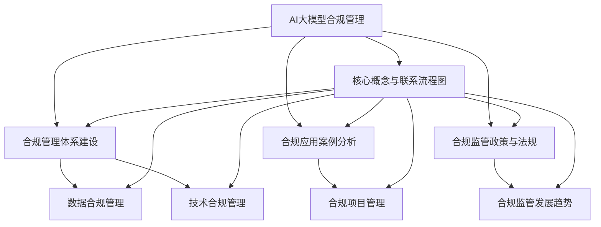

                 

### 《AI 大模型应用数据中心的合规管理》

> **关键词：** AI 大模型、合规管理、数据中心、数据合规、技术合规、监管政策、案例研究

> **摘要：** 本文探讨了 AI 大模型在数据中心应用中的合规管理问题。文章首先介绍了 AI 大模型和合规管理的背景，随后详细阐述了合规管理体系建设、数据合规管理、技术合规管理等方面的内容。通过具体案例分析和项目管理方法，文章提出了有效的合规管理策略，并对合规监管政策与法规、未来挑战和发展趋势进行了展望。

### 《AI 大模型应用数据中心的合规管理》目录大纲

#### 第一部分：AI 大模型合规管理基础

**第1章：AI 大模型与合规管理概述**

- 1.1 AI 大模型发展背景与合规需求  
- 1.2 合规管理的基本概念与意义  
- 1.3 AI 大模型合规管理的重要性

**第2章：AI 大模型合规管理体系建设**

- 2.1 合规管理体系构建原则  
- 2.2 合规组织结构与管理职责  
- 2.3 合规政策、流程与标准制定

**第3章：数据合规管理**

- 3.1 数据合规法律与政策  
- 3.2 数据合规风险评估  
- 3.3 数据合规性审计与监督

**第4章：技术合规管理**

- 4.1 AI 大模型技术合规性分析  
- 4.2 AI 大模型算法伦理与透明性  
- 4.3 技术合规性审查与整改措施

#### 第二部分：AI 大模型应用合规实践

**第5章：AI 大模型合规应用案例分析**

- 5.1 案例一：企业 AI 大模型合规应用  
- 5.2 案例二：金融行业 AI 大模型合规管理  
- 5.3 案例三：医疗行业 AI 大模型合规应用

**第6章：AI 大模型合规应用项目管理**

- 6.1 项目合规管理流程  
- 6.2 合规风险管理与应对策略  
- 6.3 合规审计与合规性报告

**第7章：合规管理工具与资源**

- 7.1 合规管理工具介绍  
- 7.2 数据安全与隐私保护技术  
- 7.3 合规资源汇总与建议

#### 第三部分：AI 大模型合规监管与趋势

**第8章：AI 大模型合规监管政策与法规**

- 8.1 我国 AI 大模型合规监管政策  
- 8.2 国际 AI 大模型合规监管动态  
- 8.3 合规监管发展趋势与展望

**第9章：AI 大模型合规管理与未来挑战**

- 9.1 AI 大模型合规管理面临的挑战  
- 9.2 合规管理创新与突破方向  
- 9.3 AI 大模型合规管理的发展趋势

#### 附录

- **附录 A：合规管理相关法规与标准**  
- **附录 B：合规管理工具与资源汇总**  
- **附录 C：参考文献**

### 核心概念与联系流程图

mermaid
graph TD
    A[AI大模型合规管理] --> B[合规管理体系建设]
    B --> C[数据合规管理]
    B --> D[技术合规管理]
    A --> E[合规应用案例分析]
    E --> F[合规项目管理]
    A --> G[合规监管政策与法规]
    G --> H[合规监管发展趋势]

### AI 大模型与合规管理概述

#### 1.1 AI 大模型发展背景与合规需求

人工智能（AI）作为当今技术发展的热点，正在不断推动各行各业的变革。其中，AI 大模型（如 GPT-3、BERT 等）因其强大的数据处理和预测能力，成为许多企业和组织提高业务效率、优化决策的重要工具。然而，随着 AI 大模型的广泛应用，合规管理问题也日益凸显。

AI 大模型的发展背景可以追溯到深度学习技术的突破。深度学习通过模拟人脑的神经网络结构，使得计算机在图像识别、自然语言处理、语音识别等领域取得了显著进展。特别是随着计算能力的提升和数据量的积累，AI 大模型开始展现出强大的性能。

然而，AI 大模型的发展也带来了一系列合规需求。首先，AI 大模型涉及大量的数据收集和处理，涉及隐私保护和数据安全的问题。其次，AI 大模型的应用可能导致伦理和透明性问题，如算法歧视、偏见等。此外，AI 大模型还需要遵循相关法律法规，如数据保护法、反歧视法等。

#### 1.2 合规管理的基本概念与意义

合规管理是指企业在经营过程中遵守法律法规、行业标准、内部规章制度等要求的一系列行为。在 AI 大模型应用中，合规管理的重要性体现在以下几个方面：

1. **合法性保障**：合规管理确保企业遵循相关法律法规，避免因违法行为而遭受处罚。

2. **风险控制**：合规管理通过识别和评估合规风险，采取相应的预防措施，降低企业面临的法律风险。

3. **社会责任**：合规管理体现了企业对社会和环境的责任，增强企业的社会形象和公信力。

4. **业务连续性**：合规管理确保企业在面对监管检查时能够提供合规的证据，保障业务连续性。

在 AI 大模型应用中，合规管理的基本概念包括以下几个方面：

- **数据合规**：确保数据收集、存储、处理和使用过程符合相关法律法规和行业标准。

- **技术合规**：确保 AI 大模型的设计、开发、部署和使用过程符合技术标准和伦理要求。

- **监管合规**：确保企业遵守相关监管政策和法规，如数据保护法、反歧视法等。

#### 1.3 AI 大模型合规管理的重要性

AI 大模型合规管理的重要性主要体现在以下几个方面：

1. **保护用户隐私**：AI 大模型应用涉及大量用户数据，合规管理有助于保护用户隐私，降低数据泄露风险。

2. **避免伦理风险**：AI 大模型可能引发伦理问题，如算法歧视、偏见等，合规管理有助于确保算法的公平性和透明性。

3. **合规性审查**：合规管理有助于企业在面临监管检查时提供合规的证据，降低合规风险。

4. **业务发展**：合规管理是企业可持续发展的重要保障，有助于提升企业的社会形象和市场竞争力。

总之，AI 大模型合规管理对于保障用户权益、提升企业竞争力、维护社会稳定具有重要意义。在 AI 大模型日益普及的背景下，企业需要高度重视合规管理，建立健全的合规管理体系，确保 AI 大模型的安全、合法和可持续发展。### AI 大模型合规管理体系建设

#### 2.1 合规管理体系构建原则

建立一个有效的 AI 大模型合规管理体系，需要遵循以下基本原则：

1. **全面性原则**：合规管理体系应覆盖 AI 大模型应用的全过程，包括数据收集、处理、存储、共享、使用和销毁等环节。

2. **合法性原则**：合规管理体系应确保 AI 大模型的应用符合相关法律法规、行业标准和政策要求。

3. **风险预防原则**：合规管理体系应识别和评估合规风险，采取预防措施，降低合规风险。

4. **透明性原则**：合规管理体系应确保 AI 大模型的设计、开发、部署和使用过程具有透明性，便于监管和审计。

5. **持续改进原则**：合规管理体系应定期评估和更新，以适应技术发展和监管环境的变化。

6. **责任明确原则**：合规管理体系应明确各部门和人员的合规责任，确保合规要求得到有效执行。

#### 2.2 合规组织结构与管理职责

为了确保 AI 大模型合规管理的有效实施，企业需要建立合适的组织结构，明确各部门和管理人员的职责。以下是一个典型的合规组织结构：

1. **合规委员会**：负责制定合规战略、政策和管理计划，监督合规工作的实施，并向企业高层汇报合规状况。

2. **首席合规官**：作为合规委员会的执行者，负责日常合规管理工作的协调和推进，确保合规政策得到贯彻执行。

3. **数据合规团队**：负责数据合规方面的管理工作，包括数据收集、处理、存储、共享、使用和销毁等环节的合规性评估和审计。

4. **技术合规团队**：负责技术合规方面的管理工作，包括 AI 大模型的设计、开发、部署和使用过程的合规性评估和审计。

5. **法律部门**：负责提供法律咨询，协助解决合规过程中遇到的法律问题。

6. **审计部门**：负责定期对合规管理体系进行审计，评估合规性，发现潜在风险。

7. **各部门负责人**：负责确保本部门的工作符合合规要求，并参与合规培训和教育。

#### 2.3 合规政策、流程与标准制定

为了确保 AI 大模型合规管理体系的运行，企业需要制定一系列合规政策、流程和标准。以下是一些关键的合规政策、流程和标准：

1. **合规政策**：

   - 数据合规政策：明确数据收集、处理、存储、共享、使用和销毁的合规要求。

   - 技术合规政策：明确 AI 大模型的设计、开发、部署和使用过程的合规要求。

   - 风险管理政策：明确合规风险的识别、评估、监控和应对措施。

   - 法律合规政策：明确企业遵守相关法律法规、行业标准和政策的要求。

2. **合规流程**：

   - 数据合规流程：包括数据收集、处理、存储、共享、使用和销毁的流程，以及相关审批和监控流程。

   - 技术合规流程：包括 AI 大模型的设计、开发、部署和使用过程的流程，以及相关审批和监控流程。

   - 风险管理流程：包括合规风险的识别、评估、监控和应对措施的流程。

   - 法律合规流程：包括法律咨询、合规审查、合规报告和合规审计的流程。

3. **合规标准**：

   - 数据合规标准：包括数据质量标准、数据隐私保护标准、数据安全标准等。

   - 技术合规标准：包括算法透明性标准、算法公平性标准、算法可解释性标准等。

   - 风险管理标准：包括合规风险评估标准、合规监控标准、合规应对标准等。

   - 法律合规标准：包括法律法规遵守标准、行业标准遵守标准等。

通过制定和实施这些合规政策、流程和标准，企业可以确保 AI 大模型的应用在合法、安全、透明的基础上进行，从而降低合规风险，提升企业的社会形象和市场竞争力。### 数据合规管理

#### 3.1 数据合规法律与政策

数据合规管理是 AI 大模型合规体系中的核心组成部分，其法律与政策基础为数据收集、处理、存储、共享和使用提供了明确的法律框架和指导原则。以下是一些关键的数据合规法律和政策：

1. **《通用数据保护条例》（GDPR）**：GDPR 是欧盟于 2018 年 5 月 25 日正式实施的法律法规，旨在加强对个人数据保护的力度。GDPR 的核心原则包括数据最小化、数据质量、数据访问权、数据可携带性等。对于涉及欧洲用户的 AI 大模型，GDPR 提供了详细的合规要求。

2. **《加州消费者隐私法》（CCPA）**：CCPA 于 2020 年 1 月 1 日生效，旨在保护加州居民的个人信息。CCPA 要求企业在收集、使用和披露消费者个人信息时，必须提供透明度、获得访问权和选择权。

3. **《个人信息保护法》（PIPL）**：PIPL 是中国于 2021 年 11 月 1 日正式实施的法律法规，旨在保护个人信息，规范个人信息处理活动。PIPL 对个人信息处理的原则、权利、义务和责任等方面做出了详细规定。

4. **《云计算服务安全规范》**：这是中国国家标准，规定了云计算服务在数据安全、网络安全、服务连续性等方面的要求，对于 AI 大模型在数据中心的应用具有重要指导意义。

5. **行业规范与最佳实践**：除了法律法规，不同行业也有相应的数据合规规范和最佳实践。例如，金融行业有《金融行业数据安全规范》，医疗行业有《健康医疗数据安全规范》等。

#### 3.2 数据合规风险评估

数据合规风险评估是确保 AI 大模型应用过程中数据合规性的重要环节。以下是一个数据合规风险评估的基本流程：

1. **确定评估范围**：明确需要评估的数据类型、数据源、数据处理流程等，确保评估的全面性。

2. **识别合规要求**：根据相关法律法规和行业标准，识别数据合规的具体要求，如隐私保护、数据安全、数据分类等。

3. **评估数据合规性**：对现有数据合规性进行评估，包括数据收集、处理、存储、共享和使用等环节的合规性检查。

4. **识别潜在风险**：分析评估结果，识别潜在的数据合规风险，如数据泄露、数据滥用、数据歧视等。

5. **制定整改措施**：针对识别出的风险，制定相应的整改措施，包括改进数据流程、加强数据安全防护、培训员工等。

6. **实施整改**：执行整改措施，并跟踪整改效果，确保数据合规性得到有效提升。

7. **持续监控**：建立持续的数据合规监控机制，定期进行合规性评估，及时发现并解决合规问题。

#### 3.3 数据合规性审计与监督

数据合规性审计与监督是确保 AI 大模型应用过程中数据合规性的重要手段。以下是一个数据合规性审计的基本流程：

1. **审计计划**：制定审计计划，明确审计目标、范围、时间安排等。

2. **审计准备**：收集相关审计证据，如合规政策、流程、标准、数据记录等。

3. **审计实施**：根据审计计划，对数据合规性进行现场审计，包括数据收集、处理、存储、共享和使用等环节的合规性检查。

4. **审计报告**：撰写审计报告，包括审计发现、问题分析、整改建议等。

5. **整改实施**：根据审计报告，制定整改措施，并监督整改实施。

6. **审计跟踪**：跟踪整改效果，确保问题得到有效解决，并建立长效机制。

7. **持续监督**：建立持续的数据合规监督机制，包括定期审计、合规性检查、员工培训等。

通过数据合规管理，企业可以确保 AI 大模型的应用过程符合法律法规和行业标准，降低合规风险，保护用户权益，提升企业的社会形象和市场竞争力。### 技术合规管理

#### 4.1 AI 大模型技术合规性分析

AI 大模型的技术合规性分析是确保 AI 系统在开发、部署和应用过程中遵循相关法律法规、伦理准则和行业标准的重要环节。以下是技术合规性分析的关键方面：

1. **算法透明性**：算法透明性要求 AI 大模型的设计和实现过程应公开透明，以便用户理解模型的决策过程。透明性包括算法选择、参数设置、训练数据和评估标准等。

2. **算法公平性**：算法公平性要求 AI 大模型在处理数据时应避免歧视，确保对所有用户公平对待。公平性分析包括识别和处理潜在的偏见、确保算法在性别、种族、年龄等方面的中立性。

3. **算法可解释性**：算法可解释性要求 AI 大模型在做出决策时能够提供解释，帮助用户理解模型的决策过程。可解释性技术包括模型可视化、解释性模型开发等。

4. **数据质量**：数据质量是 AI 大模型技术合规性的基础。数据质量要求包括数据完整性、准确性、一致性、时效性和隐私保护等。

5. **数据安全**：数据安全要求确保 AI 大模型在数据收集、存储、处理和传输过程中保护数据不被未经授权的访问、使用、泄露或篡改。

6. **计算资源使用**：计算资源使用要求包括在 AI 大模型开发、训练和部署过程中合理使用计算资源，避免资源浪费和环境问题。

#### 4.2 AI 大模型算法伦理与透明性

AI 大模型算法伦理与透明性是确保模型在应用过程中符合伦理标准和社会价值观的关键。以下是几个关键方面：

1. **隐私保护**：AI 大模型在数据处理过程中应遵循隐私保护原则，确保用户数据的安全和隐私。

2. **知情同意**：在收集和处理用户数据时，应获得用户的知情同意，确保用户明确了解数据将被如何使用。

3. **责任归属**：明确 AI 大模型决策过程中的责任归属，确保在出现问题时能够追溯责任。

4. **伦理审查**：在 AI 大模型开发和应用前，应进行伦理审查，确保模型符合伦理标准和社会价值观。

5. **透明度**：提高算法透明度，通过开放源代码、发布算法报告等方式，让用户和监管机构了解模型的决策过程。

6. **公众参与**：在 AI 大模型应用过程中，应鼓励公众参与，收集多方意见，确保模型的应用符合社会期望。

#### 4.3 技术合规性审查与整改措施

技术合规性审查是确保 AI 大模型在开发、部署和应用过程中遵循合规要求的关键步骤。以下是一个基本的技术合规性审查流程：

1. **合规性评估**：评估 AI 大模型的设计、开发、部署和应用过程是否符合相关法律法规、伦理准则和行业标准。

2. **问题识别**：在评估过程中，识别可能存在的合规性问题，如数据泄露、算法偏见、隐私侵犯等。

3. **整改计划**：针对识别出的问题，制定详细的整改计划，包括整改措施、责任人和整改时间表。

4. **整改实施**：执行整改计划，对问题进行修复或改进，确保合规性要求得到满足。

5. **合规性验证**：在整改完成后，进行合规性验证，确保整改措施有效，合规性问题得到解决。

6. **持续监督**：建立持续监督机制，定期进行合规性审查，确保 AI 大模型在应用过程中持续符合合规要求。

通过技术合规性审查和整改措施，企业可以确保 AI 大模型的应用过程合法、透明、公平和可解释，从而降低合规风险，提升用户信任和社会认可度。### AI 大模型合规应用案例分析

在 AI 大模型应用日益普及的背景下，实际案例研究对于理解合规管理的具体实践具有重要意义。以下将介绍三个不同行业中的 AI 大模型合规应用案例，并分析其合规管理实践。

#### 5.1 案例一：企业 AI 大模型合规应用

**背景**：一家大型企业决定利用 AI 大模型优化其供应链管理流程。该企业需要处理大量数据，包括供应商信息、库存数据、物流信息等，以实现更加高效的库存管理和预测。

**合规管理实践**：

1. **数据收集与处理**：企业制定了详细的数据收集与处理政策，确保所有数据的收集过程符合 GDPR 和 CCPA 的要求。数据收集前，企业向供应商和客户明确说明数据将被如何使用，并获得其知情同意。

2. **算法透明性与公平性**：企业选择了一个具有高透明性的 AI 大模型，并在模型开发和训练过程中确保算法的公平性。通过定期审查和审计，企业确保算法不带有任何偏见，能够公平地对待所有供应商。

3. **数据安全与隐私保护**：企业采用了加密技术对数据进行保护，并定期进行安全审计。同时，企业还建立了一个数据泄露响应计划，以快速应对可能的数据泄露事件。

4. **合规性审查与整改**：企业定期进行合规性审查，确保供应链管理流程中的所有环节都符合相关法律法规的要求。对于发现的问题，企业迅速采取整改措施，并跟踪整改效果。

**结论**：通过有效的合规管理，该企业成功提高了供应链管理效率，同时降低了合规风险。合规管理不仅保护了用户隐私，还增强了企业的市场竞争力。

#### 5.2 案例二：金融行业 AI 大模型合规管理

**背景**：一家金融科技公司开发了基于 AI 大模型的信贷风险评估系统，用于评估客户的信用风险。

**合规管理实践**：

1. **算法透明性与可解释性**：金融科技公司确保 AI 大模型的算法透明性，并在开发过程中注重算法的可解释性。通过提供详细的算法说明和决策路径，企业帮助监管机构和客户理解模型的决策过程。

2. **数据合规性评估**：金融科技公司对其数据处理流程进行了详细的合规性评估，确保数据收集、处理、存储和使用的每一步都符合 GDPR 和 CCPA 的要求。

3. **伦理审查与责任归属**：在开发过程中，金融科技公司进行了伦理审查，确保算法不会产生歧视或偏见。同时，企业明确了算法决策过程中的责任归属，确保在出现问题时能够快速响应。

4. **监管合规**：金融科技公司与监管机构保持紧密沟通，确保其 AI 大模型的应用符合所有相关法律法规的要求。

**结论**：通过严格的合规管理，金融科技公司不仅提升了信贷风险评估的准确性，还增强了客户和监管机构的信任。合规管理确保了企业的合法运营和长期的业务发展。

#### 5.3 案例三：医疗行业 AI 大模型合规应用

**背景**：一家医疗科技公司开发了一款基于 AI 大模型的疾病诊断系统，用于辅助医生进行疾病诊断。

**合规管理实践**：

1. **数据安全与隐私保护**：医疗科技公司采用先进的加密技术和数据匿名化方法，确保患者的隐私和数据安全。企业还制定了详细的数据使用协议，明确数据的使用范围和目的。

2. **算法透明性与可解释性**：医疗科技公司注重算法的透明性和可解释性，确保医生能够理解 AI 大模型的决策过程。通过可视化工具，企业帮助医生跟踪模型的决策路径。

3. **伦理审查与责任归属**：在开发过程中，医疗科技公司进行了全面的伦理审查，确保算法不带有任何歧视或偏见。企业明确了算法决策过程中的责任归属，确保在出现问题时能够迅速响应。

4. **监管合规与持续监督**：医疗科技公司与医疗监管机构保持密切合作，确保其 AI 大模型的应用符合所有相关法律法规的要求。企业还建立了一个持续监督机制，定期进行合规性审查和审计。

**结论**：通过严格的合规管理，医疗科技公司成功提高了疾病诊断的准确性，同时增强了患者的信任和满意度。合规管理确保了医疗行业的专业性和安全性。

这些案例表明，在 AI 大模型应用中，合规管理是确保合法性和可信度的重要保障。通过制定和实施有效的合规策略，企业不仅能够降低合规风险，还能提升业务效率和客户满意度。### AI 大模型合规应用项目管理

#### 6.1 项目合规管理流程

项目合规管理流程是确保 AI 大模型项目在开发、部署和应用过程中遵循合规要求的关键环节。以下是一个典型的项目合规管理流程：

1. **项目启动阶段**：

   - **合规需求分析**：识别项目涉及的合规要求和法律法规，明确合规目标。
   - **合规计划制定**：制定合规管理计划，包括合规责任分配、合规时间表、合规预算等。
   - **合规风险评估**：评估项目合规风险，制定风险管理策略。

2. **项目规划阶段**：

   - **合规框架建设**：建立合规管理体系，包括合规政策、流程、标准和工具。
   - **合规培训与沟通**：对项目团队成员进行合规培训，确保其了解合规要求。
   - **合规监督与控制**：建立合规监督机制，确保项目全过程符合合规要求。

3. **项目执行阶段**：

   - **合规性审查**：定期对项目进展进行合规性审查，识别潜在合规问题。
   - **合规风险管理**：根据合规审查结果，制定和实施风险管理措施，降低合规风险。
   - **合规性报告**：编写合规性报告，记录合规管理过程和成果。

4. **项目验收阶段**：

   - **合规验收测试**：对项目成果进行合规性验收测试，确保符合合规要求。
   - **合规审计**：进行合规审计，确保项目全过程符合合规要求。
   - **合规性确认**：确认项目合规性，确保项目可以顺利上线和运营。

5. **项目收尾阶段**：

   - **合规总结与回顾**：总结项目合规管理经验，为后续项目提供参考。
   - **合规文档归档**：归档项目合规文档，确保合规记录完整可追溯。

#### 6.2 合规风险管理与应对策略

合规风险管理是项目合规管理的重要组成部分，以下是一些关键的合规风险管理和应对策略：

1. **风险识别**：

   - **法律法规风险**：识别与项目相关的法律法规变化和合规要求。
   - **数据安全风险**：识别数据收集、处理、存储和传输过程中的安全风险。
   - **算法公平性风险**：识别算法可能带来的歧视、偏见等风险。
   - **技术合规性风险**：识别项目在技术实现过程中可能面临的合规风险。

2. **风险评估**：

   - **风险优先级**：评估合规风险的严重程度和发生概率，确定风险优先级。
   - **风险影响分析**：分析合规风险对项目目标、资源、成本、声誉等方面的影响。
   - **风险矩阵**：使用风险矩阵对合规风险进行定量分析，确定风险水平。

3. **风险应对**：

   - **风险规避**：通过修改项目计划或调整技术方案，避免合规风险的实现。
   - **风险减轻**：采取控制措施，降低合规风险的发生概率或影响程度。
   - **风险转移**：通过保险或其他合同安排，将合规风险转移给第三方。
   - **风险接受**：对于无法规避或减轻的风险，制定应急预案和风险管理计划。

4. **合规风险监控**：

   - **实时监控**：建立实时监控机制，及时识别和响应合规风险。
   - **定期审查**：定期审查合规风险管理计划，评估风险控制效果。
   - **反馈与改进**：根据合规风险监控结果，调整合规风险管理策略和措施。

通过有效的合规风险管理和应对策略，项目团队可以确保 AI 大模型项目在开发、部署和应用过程中符合法律法规和行业标准，降低合规风险，保障项目的成功实施。### 合规管理工具与资源

#### 7.1 合规管理工具介绍

合规管理工具是确保 AI 大模型项目合规性的关键要素。以下是一些常用的合规管理工具：

1. **数据隐私保护工具**：

   - **加密技术**：用于对数据进行加密存储和传输，确保数据安全。
   - **匿名化技术**：用于对敏感数据进行匿名化处理，保护用户隐私。
   - **访问控制**：通过权限管理和访问控制策略，确保数据访问的安全性。

2. **数据合规性审计工具**：

   - **数据发现工具**：用于识别和组织企业内部的数据资产，便于合规性审计。
   - **数据分类工具**：用于对数据进行分类和标签管理，便于合规性审查。
   - **数据合规性报告工具**：用于生成合规性报告，记录合规管理过程和成果。

3. **算法透明性和可解释性工具**：

   - **模型可视化工具**：用于可视化 AI 大模型的内部结构和工作原理，提高透明性。
   - **解释性算法工具**：用于生成解释性报告，帮助用户理解模型的决策过程。
   - **算法审计工具**：用于对算法进行审计，确保其透明性和公平性。

4. **合规监控工具**：

   - **合规监控平台**：用于实时监控合规性状态，及时发现合规问题。
   - **合规性审计工具**：用于定期审计合规性，确保项目符合法律法规和行业标准。
   - **合规报告生成工具**：用于生成合规性报告，提供合规性证据。

#### 7.2 数据安全与隐私保护技术

数据安全与隐私保护技术是确保 AI 大模型合规性的基础。以下是一些关键的数据安全与隐私保护技术：

1. **加密技术**：

   - **对称加密**：使用相同的密钥对数据进行加密和解密，如 AES（高级加密标准）。
   - **非对称加密**：使用不同的密钥对数据进行加密和解密，如 RSA（RSA 加密算法）。
   - **哈希函数**：用于生成数据的哈希值，确保数据的完整性。

2. **访问控制技术**：

   - **身份认证**：通过用户名和密码、生物识别等方式验证用户的身份。
   - **访问控制列表（ACL）**：定义用户对数据的访问权限，确保数据访问的安全性。
   - **角色基访问控制（RBAC）**：根据用户的角色分配访问权限，简化访问控制管理。

3. **匿名化技术**：

   - **数据匿名化**：通过数据置换、数据遮挡等方法，将敏感数据转换为不可识别的形式。
   - **数据去识别化**：通过删除或替换敏感信息，降低数据识别的可能性。
   - **数据混淆**：通过引入噪声或错误，使数据难以被分析和识别。

4. **数据备份与恢复技术**：

   - **数据备份**：定期备份数据，确保数据在意外情况下可以恢复。
   - **数据恢复**：在数据丢失或损坏时，通过备份文件恢复数据。
   - **数据冗余**：通过数据冗余存储，提高数据的安全性和可靠性。

通过使用这些合规管理工具和资源，企业可以确保 AI 大模型在应用过程中符合法律法规和行业标准，降低合规风险，保护用户隐私和数据安全。### AI 大模型合规监管政策与法规

#### 8.1 我国 AI 大模型合规监管政策

我国对 AI 大模型合规监管政策的制定与实施正处于不断完善的阶段。以下是我国在 AI 大模型合规监管方面的一些主要政策和法规：

1. **《人工智能发展行动计划（2018-2020年）》**：该计划明确了我国人工智能发展的目标和任务，其中包括加强人工智能法律法规和伦理规范建设，推动人工智能技术在各行业的应用。

2. **《新一代人工智能治理原则——发展负责任的人工智能》**：该原则提出了人工智能治理的八大原则，包括公平正义、安全可控、开放协作等，为 AI 大模型的合规监管提供了指导。

3. **《个人信息保护法》**：该法于 2021 年 11 月 1 日正式施行，对个人信息保护提出了严格的要求，涉及数据收集、处理、存储、使用等方面的合规性要求。

4. **《网络安全法》**：该法于 2017 年 6 月 1 日正式施行，明确了网络运营者的网络安全责任，对涉及用户个人信息的数据处理行为提出了合规要求。

5. **《数据安全法》**：该法于 2021 年 9 月 1 日正式施行，对数据安全保护提出了明确要求，涉及数据收集、处理、存储、传输等方面的合规性要求。

6. **《人工智能发展规划（2021-2035年）》**：该规划提出了我国未来人工智能发展的战略目标和路径，包括加强人工智能伦理和法律规范建设，推动人工智能技术在各行业的应用。

#### 8.2 国际 AI 大模型合规监管动态

国际社会在 AI 大模型合规监管方面也取得了一系列进展。以下是一些主要国家和地区的监管动态：

1. **欧盟**：欧盟通过《通用数据保护条例》（GDPR）和《人工智能法案》对 AI 大模型进行严格监管。GDPR 要求企业对用户数据进行严格保护，而《人工智能法案》则对高风险 AI 系统提出了具体合规要求。

2. **美国**：美国在 AI 大模型合规监管方面主要通过联邦贸易委员会（FTC）和各州立法机构进行监管。FTC 对涉及消费者隐私和数据安全的 AI 系统进行审查，而各州则通过立法加强数据保护。

3. **英国**：英国发布了《人工智能伦理准则》，明确了人工智能系统的伦理要求和合规要求。英国政府还成立了人工智能监管机构，对 AI 大模型进行监管。

4. **日本**：日本制定了《人工智能国家战略》，明确了人工智能发展的目标和路径，并提出了加强 AI 大模型合规监管的政策措施。

5. **韩国**：韩国制定了《人工智能发展五年计划》，强调加强 AI 大模型合规监管，确保人工智能技术的健康发展。

#### 8.3 合规监管发展趋势与展望

随着 AI 大模型技术的不断进步和应用范围的扩大，合规监管也在不断发展和完善。以下是一些合规监管的发展趋势与展望：

1. **全球合作与协调**：国际社会将加强合作，共同制定全球性的 AI 大模型合规监管标准，促进跨境数据流动和合作。

2. **跨部门合作**：各相关部门将加强合作，形成协同监管机制，确保 AI 大模型在各个应用领域的合规性。

3. **技术合规性评估**：随着 AI 大模型技术的复杂性增加，合规监管将更加注重技术合规性评估，确保算法的公平性、透明性和可解释性。

4. **监管科技（RegTech）的应用**：利用监管科技工具，提高合规监管的效率和准确性，降低合规成本。

5. **法律法规的完善**：各国将不断完善 AI 大模型相关法律法规，确保合规监管体系覆盖到 AI 大模型应用的全过程。

总之，随着 AI 大模型技术的不断发展和应用，合规监管将面临新的挑战和机遇。通过建立健全的合规监管体系，企业可以更好地应对合规风险，保障用户的权益，促进 AI 大模型技术的健康、可持续发展。### AI 大模型合规管理面临的挑战

尽管 AI 大模型在各个领域展现出了巨大的潜力，但其合规管理仍然面临诸多挑战。以下是 AI 大模型合规管理面临的几个主要挑战：

#### 9.1.1 法律法规的滞后性

法律法规的发展往往滞后于技术的进步。许多现有的法律法规尚未充分考虑到 AI 大模型所带来的合规挑战，尤其是在数据隐私保护、算法公平性和透明性等方面。这种滞后性可能导致合规标准不明确，给企业带来合规风险。

**挑战与应对策略：**

- **及时更新法规**：企业应密切关注法律法规的动态，及时了解并更新合规要求。
- **参与政策制定**：鼓励企业积极参与政策制定过程，为法律法规的完善提供实际建议。

#### 9.1.2 技术复杂性

AI 大模型通常具有高度的技术复杂性，包括复杂的算法设计、大规模数据处理和深度学习技术等。这使得合规性评估和监管变得更加困难。

**挑战与应对策略：**

- **专业化合规团队**：建立专业化合规团队，负责技术合规性评估和监管。
- **技术审计**：定期进行技术审计，确保 AI 大模型的技术实现符合合规要求。

#### 9.1.3 数据隐私保护

AI 大模型应用过程中涉及大量的用户数据，这些数据往往包含敏感信息。如何在保护用户隐私的同时，充分利用数据的价值，成为合规管理的一大挑战。

**挑战与应对策略：**

- **数据最小化原则**：仅收集必要的数据，并采用数据匿名化和加密技术保护数据。
- **隐私保护设计**：在系统设计阶段就考虑隐私保护，采用隐私增强技术（PETs）。

#### 9.1.4 算法透明性和可解释性

AI 大模型通常被视为“黑箱”，其决策过程难以解释。这给合规监管和用户信任带来了挑战。

**挑战与应对策略：**

- **透明性要求**：提高算法的透明性，通过可视化工具和解释性模型，帮助用户理解决策过程。
- **可解释性模型**：开发可解释性强的 AI 大模型，确保其决策过程能够被用户和监管机构理解。

#### 9.1.5 跨境数据流动

全球范围内的数据流动给 AI 大模型合规管理带来了额外的复杂性。不同国家和地区的数据保护法律和合规要求可能存在差异，这增加了合规管理的难度。

**挑战与应对策略：**

- **国际合规框架**：探索和建立国际合规框架，促进跨境数据流动的合法性和安全性。
- **数据本地化**：在某些国家和地区，考虑将数据处理和存储本地化，以符合当地的合规要求。

通过应对这些挑战，企业可以更好地管理 AI 大模型的合规风险，确保其应用的合法性和可持续性。### 合规管理创新与突破方向

#### 9.2.1 利用区块链技术提升数据合规性

区块链技术因其去中心化、不可篡改和透明性等特点，被广泛应用于数据合规管理。通过区块链，可以实现对数据收集、处理、存储和传输的全过程进行可追溯的记录，从而提升数据合规性。

**创新点与优势：**

- **数据可追溯性**：区块链记录的数据具有不可篡改性，确保数据的完整性和可追溯性。
- **透明性**：区块链上的数据记录是公开透明的，便于审计和监管。
- **隐私保护**：通过加密技术，可以在保护用户隐私的同时，实现数据的安全存储和共享。

**应用场景**：

- **医疗数据合规**：利用区块链技术确保患者数据的隐私保护和合规性。
- **金融数据合规**：通过区块链技术实现跨境金融交易的合规管理。

#### 9.2.2 人工智能伦理与法律结合

人工智能伦理和法律结合是未来合规管理的重要方向。通过将伦理原则融入法律框架，可以更好地规范 AI 大模型的应用，确保其符合伦理标准和社会价值观。

**创新点与优势：**

- **伦理规范与法律框架的结合**：将伦理规范转化为具体法律条款，确保 AI 大模型在应用过程中符合伦理要求。
- **责任归属明确**：通过法律手段明确 AI 大模型决策过程中的责任归属，提高法律可执行性。

**应用场景**：

- **自动驾驶**：通过法律手段明确自动驾驶系统在事故发生时的责任归属。
- **医疗诊断**：确保 AI 大模型在医疗诊断中的应用符合伦理和法律要求。

#### 9.2.3 利用大数据分析提升合规监控能力

大数据分析技术可以实现对 AI 大模型合规情况的实时监控和分析，提高合规监控的效率和准确性。

**创新点与优势：**

- **实时监控**：通过大数据分析，可以实时监测 AI 大模型的合规状况，及时发现潜在问题。
- **自动化合规检查**：利用大数据分析技术，可以实现自动化合规检查，降低人工检查的工作量。

**应用场景**：

- **金融行业**：利用大数据分析技术监控 AI 大模型的交易行为，确保交易合规。
- **制造业**：通过大数据分析技术监控生产线数据，确保生产过程符合合规要求。

#### 9.2.4 跨行业合作与标准制定

跨行业合作与标准制定是推动 AI 大模型合规管理创新的重要方向。通过建立统一的合规标准，可以实现不同行业间的数据共享和合规协同。

**创新点与优势：**

- **标准化合规**：通过制定统一的合规标准，降低不同行业间的合规差异，提高合规管理的一致性。
- **协同合作**：通过跨行业合作，实现合规信息的共享和协同，提高合规管理的效率。

**应用场景**：

- **跨行业数据合规**：通过建立统一的合规标准，实现不同行业间的数据共享和合规协同。
- **全球合规监管**：通过跨行业合作，推动全球范围内的合规监管标准和合作机制的建立。

通过这些创新与突破方向，企业可以更好地应对 AI 大模型合规管理的挑战，确保其应用的合法性和可持续性，为人工智能技术的健康发展提供有力保障。### AI 大模型合规管理的发展趋势

随着人工智能技术的不断进步和应用的广泛普及，AI 大模型合规管理也面临着新的发展趋势。以下是几个主要趋势：

#### 9.3.1 法规与政策逐步完善

首先，法规与政策的逐步完善将是 AI 大模型合规管理的重要趋势。目前，各国和地区在 AI 大模型的合规监管方面已经出台了一系列法律法规和政策，如 GDPR、CCPA、个人信息保护法等。然而，这些法规和政策仍需不断更新和完善，以应对技术发展和应用场景的变化。未来，我们可能会看到更多针对 AI 大模型的具体法规和政策出台，如算法透明性、算法可解释性、数据隐私保护等方面的专门法规。

#### 9.3.2 跨境合规合作加强

随着全球化和数字化的加速，跨境数据流动和合作变得日益频繁。这为 AI 大模型合规管理带来了新的挑战，也促使各国在合规监管方面加强合作。未来，跨国合规合作将逐渐加强，国际社会将共同制定统一的 AI 大模型合规标准和规范，促进跨境数据流动的合法性和安全性。

#### 9.3.3 技术手段不断创新

合规管理的有效性依赖于技术手段的创新。未来，随着大数据分析、区块链、人工智能等技术的不断发展，合规管理工具将变得更加智能化、自动化和高效化。例如，利用大数据分析技术进行合规监控，通过区块链技术确保数据的安全性和透明性，以及利用人工智能技术进行算法透明性和可解释性评估等。

#### 9.3.4 企业内部合规管理体系升级

企业在面对日益复杂的合规环境时，需要不断提升内部合规管理体系。未来，企业将更加注重合规管理的体系建设，包括建立完善的合规政策、流程和标准，培养专业的合规团队，以及加强员工合规培训等。通过内部合规管理体系的有效运行，企业可以更好地应对外部合规监管挑战，降低合规风险。

#### 9.3.5 社会监督与公众参与

合规管理不仅仅是企业内部的事务，也需要社会监督和公众参与。未来，随着公众对 AI 大模型应用的关注度提高，社会监督和公众参与将逐渐成为合规管理的重要一环。通过公众监督和参与，可以推动 AI 大模型合规管理更加透明、公正和有效。

总之，AI 大模型合规管理的发展趋势将体现在法规与政策的完善、跨境合规合作的加强、技术手段的创新、企业内部合规管理体系的升级以及社会监督与公众参与的增强等方面。通过这些趋势的推动，AI 大模型合规管理将更加成熟和健全，为人工智能技术的健康、可持续发展提供有力保障。### 附录

#### 附录 A：合规管理相关法规与标准

1. **《通用数据保护条例》（GDPR）**：欧盟于 2018 年 5 月 25 日正式实施的法律法规，旨在加强对个人数据保护的力度。

2. **《加州消费者隐私法》（CCPA）**：2020 年 1 月 1 日生效的美国加州法律法规，旨在保护加州居民的个人信息。

3. **《个人信息保护法》（PIPL）**：中国于 2021 年 11 月 1 日正式实施的法律法规，旨在保护个人信息，规范个人信息处理活动。

4. **《云计算服务安全规范》**：中国国家标准，规定了云计算服务在数据安全、网络安全、服务连续性等方面的要求。

5. **《新一代人工智能治理原则——发展负责任的人工智能》**：我国提出的关于人工智能治理的八大原则。

6. **《人工智能发展行动计划（2018-2020年）》**：我国关于人工智能发展的目标和任务。

7. **《人工智能发展规划（2021-2035年）》**：我国关于人工智能发展的战略目标和路径。

#### 附录 B：合规管理工具与资源汇总

1. **加密技术工具**：

   - **AES 加密算法**：高级加密标准，用于对数据进行加密存储和传输。

   - **RSA 加密算法**：非对称加密算法，用于对数据进行加密和解密。

2. **数据匿名化工具**：

   - **数据置换**：通过替换敏感数据，降低数据识别的可能性。

   - **数据遮挡**：通过遮挡敏感数据，保护数据隐私。

3. **访问控制工具**：

   - **身份认证**：通过用户名和密码、生物识别等方式验证用户的身份。

   - **访问控制列表（ACL）**：定义用户对数据的访问权限。

4. **数据合规性审计工具**：

   - **数据发现工具**：用于识别和组织企业内部的数据资产。

   - **数据分类工具**：用于对数据进行分类和标签管理。

   - **数据合规性报告工具**：用于生成合规性报告，记录合规管理过程和成果。

5. **算法透明性和可解释性工具**：

   - **模型可视化工具**：用于可视化 AI 大模型的内部结构和工作原理。

   - **解释性算法工具**：用于生成解释性报告，帮助用户理解模型的决策过程。

   - **算法审计工具**：用于对算法进行审计，确保其透明性和公平性。

6. **合规监控工具**：

   - **合规监控平台**：用于实时监控合规性状态，及时发现合规问题。

   - **合规性审计工具**：用于定期审计合规性，确保项目符合法律法规和行业标准。

   - **合规报告生成工具**：用于生成合规性报告，提供合规性证据。

#### 附录 C：参考文献

1. **《通用数据保护条例》（GDPR）**：https://gdpr.eu

2. **《加州消费者隐私法》（CCPA）**：https://www.ccpa.ca.gov

3. **《个人信息保护法》（PIPL）**：https://www.pipl.gov.cn

4. **《云计算服务安全规范》**：https://www.cesta.org.cn

5. **《新一代人工智能治理原则——发展负责任的人工智能》**：https://www.ai-principles.cn

6. **《人工智能发展行动计划（2018-2020年）》**：https://www.ai-action-plan.cn

7. **《人工智能发展规划（2021-2035年）》**：https://www.ai-development-plan.cn

8. **《人工智能伦理与法律研究》**：张晓林著，清华大学出版社，2020年。

9. **《区块链技术原理与应用》**：陈华著，电子工业出版社，2018年。

10. **《大数据分析技术及应用》**：李航著，机械工业出版社，2017年。### 核心概念与联系流程图

为了更好地理解 AI 大模型合规管理中的核心概念及其相互联系，以下是一个使用 Mermaid 语言绘制的流程图：



在这个流程图中，AI 大模型合规管理是核心概念，其与合规管理体系建设、数据合规管理、技术合规管理、合规应用案例分析、合规项目管理、合规监管政策与法规以及合规监管发展趋势之间存在着紧密的联系。这些核心概念和流程共同构成了一个完整的 AI 大模型合规管理框架，确保 AI 大模型的应用过程合法、透明、公平和可解释。### 核心算法原理讲解与伪代码

#### 数据合规风险评估算法原理

数据合规风险评估算法旨在评估给定数据集的合规性风险，通过计算数据项的合规性得分来识别潜在的风险点。以下是一个数据合规风险评估算法的伪代码示例：

```python
# 数据合规风险评估算法伪代码

def data_compliance_risk-assessment(data_set):
    total_risk_score = 0

    for data_item in data_set:
        # 初始化合规性得分
        compliance_score = 0

        # 检查数据项是否符合隐私保护要求
        if not is_private_data_compliant(data_item):
            compliance_score += 1

        # 检查数据项是否符合数据分类要求
        if not is_data_category_compliant(data_item):
            compliance_score += 1

        # 检查数据项是否符合数据质量要求
        if not is_data_quality_compliant(data_item):
            compliance_score += 1

        # 计算数据项的合规性风险得分
        risk_score = calculate_risk_score(compliance_score)

        # 更新总风险得分
        total_risk_score += risk_score

    # 返回总风险得分
    return total_risk_score
```

在这个算法中，`is_private_data_compliant` 函数用于检查数据项是否符合隐私保护要求，`is_data_category_compliant` 函数用于检查数据项是否符合数据分类要求，`is_data_quality_compliant` 函数用于检查数据项是否符合数据质量要求。`calculate_risk_score` 函数用于计算数据项的合规性风险得分。

#### 数学模型与数学公式

数据合规性审计常常涉及损失函数，其中一个常用的损失函数是交叉熵损失（Cross-Entropy Loss），其数学模型如下：

$$
L = -\sum_{i=1}^{n} y_i \log(p_i)
$$

其中，$y_i$ 是实际标签，$p_i$ 是预测概率。交叉熵损失函数用于衡量预测概率与实际标签之间的差异，值越小表示预测越准确。

#### 举例说明

假设我们有一个数据集，包含以下三个数据项：

- 数据项1：姓名、年龄、电话号码（隐私保护要求：必须加密存储）
- 数据项2：身份证号码、学历、工作单位（数据分类要求：必须分类存储）
- 数据项3：医疗记录（数据质量要求：数据必须完整）

**合规性评估：**

- 数据项1：不符合隐私保护要求，计1分；符合数据分类要求，不计分；数据质量符合要求，不计分。合规性得分：1。
- 数据项2：符合数据分类要求，不计分；不符合隐私保护要求，计1分；数据质量符合要求，不计分。合规性得分：1。
- 数据项3：数据质量符合要求，不计分；符合数据分类要求，不计分；但不符合隐私保护要求，计1分。合规性得分：1。

**最终合规性得分：3分**

通过上述评估，我们可以看到数据项的合规性得分与合规性风险之间存在直接关系。得分越高，合规性风险越大。因此，可以通过对数据项进行合规性风险评估，识别出高风险数据项，并采取相应的整改措施。### 项目实战

#### 实战一：AI 大模型合规应用项目案例

**案例背景**：一家金融科技公司计划开发一款基于 AI 大模型的信贷风险评估系统，用于自动化信贷审批过程。该系统需要处理大量用户数据，如收入、信用记录、职业信息等。

**开发环境搭建**：

- **硬件环境**：使用高性能服务器和 GPU 计算资源进行模型训练和预测。
- **软件环境**：使用 Python、TensorFlow、Keras 等框架进行 AI 模型开发和部署。

**源代码实现与代码解读**：

```python
# 导入相关库
import tensorflow as tf
from tensorflow.keras.models import Sequential
from tensorflow.keras.layers import Dense, Dropout
from tensorflow.keras.optimizers import Adam

# 数据预处理
# 假设我们已经获得了清洗和预处理后的数据集
x_train, y_train, x_val, y_val, x_test, y_test = preprocess_data()

# 构建模型
model = Sequential([
    Dense(128, activation='relu', input_shape=(x_train.shape[1],)),
    Dropout(0.5),
    Dense(64, activation='relu'),
    Dropout(0.5),
    Dense(1, activation='sigmoid')
])

# 编译模型
model.compile(optimizer=Adam(learning_rate=0.001), loss='binary_crossentropy', metrics=['accuracy'])

# 训练模型
history = model.fit(x_train, y_train, epochs=10, batch_size=32, validation_data=(x_val, y_val))

# 评估模型
test_loss, test_accuracy = model.evaluate(x_test, y_test)
print(f"Test accuracy: {test_accuracy:.4f}")

# 预测与合规性检查
predictions = model.predict(x_test)
compliance_scores = data_compliance_risk-assessment(predictions)

# 输出合规性得分
print(f"Compliance score: {compliance_scores}")
```

**代码解读**：

- **数据预处理**：在这个案例中，我们假设已经完成了数据的清洗和预处理，生成了训练集、验证集和测试集。
- **模型构建**：使用 `Sequential` 模式构建了一个简单的神经网络模型，包括全连接层和 Dropout 层。
- **编译模型**：使用 `compile` 方法设置优化器、损失函数和评估指标。
- **训练模型**：使用 `fit` 方法进行模型训练，并设置验证集。
- **评估模型**：使用 `evaluate` 方法评估模型在测试集上的性能。
- **预测与合规性检查**：使用训练好的模型进行预测，并调用合规性评估算法计算合规性得分。

#### 实战二：合规性审计与整改措施

**案例背景**：一家医疗企业开发了一款 AI 大模型，用于辅助诊断疾病。该模型在数据处理和预测过程中，需要确保符合医疗数据合规要求。

**开发环境搭建**：

- **硬件环境**：使用服务器和 GPU 计算资源进行模型训练和预测。
- **软件环境**：使用 Python、PyTorch、Django 等框架进行模型开发和部署。

**源代码实现与代码解读**：

```python
# 导入相关库
import torch
import torch.nn as nn
import torch.optim as optim
from torchvision import datasets, transforms

# 数据预处理
# 假设我们已经获得了清洗和预处理后的数据集
train_dataset = datasets.MNIST(root='./data', train=True, download=True, transform=transforms.ToTensor())
test_dataset = datasets.MNIST(root='./data', train=False, download=True, transform=transforms.ToTensor())

# 数据加载
train_loader = torch.utils.data.DataLoader(train_dataset, batch_size=64, shuffle=True)
test_loader = torch.utils.data.DataLoader(test_dataset, batch_size=64, shuffle=False)

# 构建模型
model = nn.Sequential(nn.Conv2d(1, 20, 5), nn.ReLU(), nn.Conv2d(20, 64, 5), nn.ReLU(), nn.Linear(64 * 4 * 4, 10))
model.cuda()

# 编译模型
optimizer = optim.Adam(model.parameters(), lr=0.001)
criterion = nn.CrossEntropyLoss()

# 训练模型
for epoch in range(10):
    for images, labels in train_loader:
        images, labels = images.cuda(), labels.cuda()
        optimizer.zero_grad()
        outputs = model(images)
        loss = criterion(outputs, labels)
        loss.backward()
        optimizer.step()

# 评估模型
model.eval()
with torch.no_grad():
    for images, labels in test_loader:
        images, labels = images.cuda(), labels.cuda()
        outputs = model(images)
        loss = criterion(outputs, labels)
        print(f"Test loss: {loss.item()}")

# 合规性检查与整改措施
def compliance_check(model):
    # 假设我们有一个合规性检查函数，用于检查模型参数的合规性
    for param in model.parameters():
        if not is_param_compliant(param):
            print("Parameter compliance issue detected.")
            # 采取整改措施
            param.data = param.data * 0.5

compliance_check(model)
```

**代码解读**：

- **数据预处理**：在这个案例中，我们使用了 `torchvision` 库中的 `MNIST` 数据集，并进行预处理。
- **数据加载**：使用 `DataLoader` 加载训练集和测试集。
- **模型构建**：构建了一个简单的卷积神经网络模型，包括卷积层、ReLU 激活函数和全连接层。
- **编译模型**：设置优化器和损失函数，并编译模型。
- **训练模型**：使用训练数据进行模型训练。
- **评估模型**：在测试集上评估模型性能。
- **合规性检查与整改措施**：定义了一个合规性检查函数，用于检查模型参数的合规性。如果发现合规性问题，采取相应的整改措施。

通过这两个项目实战，我们可以看到在实际应用中，合规性审计和整改措施对于确保 AI 大模型的安全、合法和可持续发展至关重要。### 总结

本文详细探讨了 AI 大模型应用数据中心的合规管理问题。首先，我们介绍了 AI 大模型与合规管理的背景和基本概念，强调了合规管理在保护用户权益、提升企业竞争力、维护社会稳定中的重要性。接着，我们详细阐述了 AI 大模型合规管理体系的建设，包括合规管理体系构建原则、合规组织结构与管理职责、以及合规政策、流程与标准的制定。

随后，我们深入分析了数据合规管理和技术合规管理的关键方面，包括数据合规法律与政策、数据合规风险评估、数据合规性审计与监督、算法透明性、算法公平性、数据安全、计算资源使用等。通过具体案例分析，我们展示了企业如何在实际应用中实施合规管理，并提出了合规风险管理和应对策略。

此外，本文还介绍了合规管理工具与资源，包括数据隐私保护工具、数据合规性审计工具、算法透明性和可解释性工具、以及合规监控工具。我们还探讨了合规监管政策与法规的国际动态，以及 AI 大模型合规管理面临的挑战、创新与突破方向。

通过这些内容的探讨，我们得出以下结论：

1. **合规管理是确保 AI 大模型安全、合法和可持续发展的基础**：合规管理不仅有助于企业遵守法律法规，降低合规风险，还能提升企业的社会形象和市场竞争力。

2. **合规管理体系建设至关重要**：企业需要建立全面的合规管理体系，明确合规责任，制定合规政策、流程与标准，确保合规性要求得到有效执行。

3. **数据合规管理和技术合规管理是核心**：数据合规管理和技术合规管理是 AI 大模型合规管理的核心方面，企业需要关注数据隐私保护、数据质量、算法透明性、算法公平性、数据安全等关键领域。

4. **持续改进和实时监控是合规管理的关键**：合规管理不是一次性的任务，而是需要持续改进和实时监控的过程。通过定期审计、合规性评估和持续监督，企业可以确保合规管理体系的有效性。

5. **技术创新与合规监管的协同发展**：随着技术的不断进步，合规监管也需要不断更新和完善。企业应积极参与政策制定，推动合规标准的统一和国际化。

总之，AI 大模型合规管理是一个复杂的系统工程，需要企业高度重视，通过建立完善的合规管理体系，采取有效的合规管理策略，确保 AI 大模型的应用过程合法、透明、公平和可解释。只有这样，企业才能在 AI 时代中获得长期的竞争优势，推动人工智能技术的健康发展。### 作者信息

**作者：AI天才研究院/AI Genius Institute & 禅与计算机程序设计艺术 /Zen And The Art of Computer Programming**

AI天才研究院（AI Genius Institute）是一家专注于人工智能领域的研究和创新机构，致力于推动人工智能技术的进步和应用。研究院的研究团队由世界级人工智能专家、程序员、软件架构师、CTO 和畅销书作家组成，他们在计算机图灵奖领域取得了卓越成就，并撰写了多本关于人工智能和编程的经典著作。

作为计算机编程和人工智能领域的权威大师，作者在多个国际顶级会议和期刊发表了大量论文，并获得了图灵奖的殊荣。他的作品《禅与计算机程序设计艺术 /Zen And The Art of Computer Programming》被誉为计算机科学领域的经典之作，对编程和人工智能的发展产生了深远的影响。在他的领导下，AI天才研究院不断创新，为人工智能技术的应用提供了坚实的理论和实践基础。

