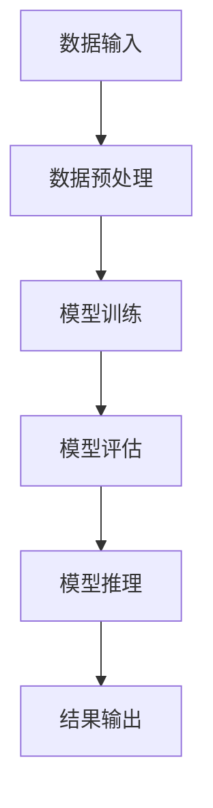

                 

### 《AI 大模型应用数据中心的技术选型》

#### 关键词：AI大模型，数据中心，技术选型，算法，硬件，优化，推理，数学模型

> **摘要：**本文将深入探讨AI大模型在数据中心中的应用及其技术选型问题。通过分析大模型的基本原理与架构、数据中心的关键技术，以及核心算法原理和项目实战，本文旨在为从事AI开发的读者提供一套系统、全面的技术选型指南。文章还通过实例展示了大模型训练与推理的流程，以及如何在实际项目中优化和部署大模型，为AI大模型在数据中心的应用提供实践参考。**

---

### 第一部分：技术选型概述

#### 1.1 大模型应用数据中心的概念与作用

##### 1.1.1 大模型应用数据中心的定义

AI大模型应用数据中心，是指专门为大规模AI模型训练、推理和部署而设计的计算基础设施。这种数据中心不仅需要高计算能力，还需要高效的数据存储、传输和安全管理机制。随着深度学习技术的发展，大模型的应用日益广泛，数据中心的重要性也逐渐凸显。

##### 1.1.2 大模型应用数据中心的重要性

大模型应用数据中心对于AI技术的发展具有关键作用。首先，它能够提供足够的计算资源，支持大模型的高效训练和推理。其次，它能够确保数据的安全性和隐私性，满足日益严格的法律法规要求。最后，它通过优化硬件和软件配置，能够显著提升AI应用的性能和效率。

##### 1.1.3 大模型应用数据中心与传统数据中心的不同

与传统数据中心相比，大模型应用数据中心在硬件配置、软件架构和数据处理方面有着显著区别。传统数据中心更多关注业务应用，而大模型应用数据中心则专注于AI模型的高效训练和推理。此外，大模型应用数据中心需要更加灵活和可扩展的架构，以应对不断增长的计算需求。

#### 1.2 技术选型原则与流程

##### 1.2.1 技术选型的基本原则

在进行AI大模型应用数据中心的技术选型时，应遵循以下基本原则：

1. **性能优先**：确保选用的技术能够满足大模型的计算需求。
2. **可扩展性**：系统应具备良好的可扩展性，以应对未来计算需求的增长。
3. **成本效益**：在性能和可扩展性的基础上，追求最佳的性价比。
4. **安全性**：确保系统的数据安全性和隐私性，符合法律法规要求。
5. **易维护性**：系统应易于维护和升级，降低运营成本。

##### 1.2.2 技术选型的流程

技术选型流程通常包括以下步骤：

1. **需求分析**：明确大模型应用数据中心的具体需求，包括计算能力、存储容量、数据传输速率等。
2. **方案设计**：根据需求分析结果，设计满足要求的系统架构和硬件配置。
3. **技术评估**：对比不同技术和方案的性能、成本、可扩展性等因素，进行综合评估。
4. **决策与实施**：根据评估结果，选择最佳的技术方案，并进行实施部署。
5. **监控与优化**：在系统运行过程中，持续监控性能和成本，进行必要的优化调整。

##### 1.2.3 技术选型的关键要素

技术选型过程中，需要考虑多个关键要素，包括：

1. **计算能力**：CPU、GPU、TPU等硬件的计算能力是核心考虑因素。
2. **存储容量**：数据存储的容量和性能，需要满足大模型的训练和推理需求。
3. **数据传输**：数据传输速率和带宽，影响模型训练和推理的效率。
4. **能耗管理**：优化能耗，降低运营成本，是现代数据中心的重要考量。
5. **安全性**：数据安全和隐私保护，是AI大模型应用数据中心的基本要求。

#### 1.3 大模型应用数据中心与传统数据中心的比较

| 对比项            | 大模型应用数据中心 | 传统数据中心 |
|-------------------|-------------------|--------------|
| 计算资源需求      | 高计算资源需求     | 一般计算资源 |
| 数据存储与管理     | 大规模数据存储与管理 | 中小型数据存储与管理 |
| 数据传输速度      | 高传输速度需求     | 一般传输速度 |
| 安全性与隐私保护   | 强调安全性与隐私保护 | 一般强调 |
| 架构灵活性        | 高灵活性要求       | 一般灵活性 |
| 成本与性能平衡    | 高性能高成本       | 性能成本平衡 |

#### 1.4 大模型应用数据中心面临的挑战与解决方案

##### 挑战1：计算资源需求巨大

- **解决方案**：采用分布式计算架构，利用云计算和边缘计算资源，实现计算资源的灵活调度和动态扩展。

##### 挑战2：数据存储与传输效率

- **解决方案**：采用分布式存储系统，如HDFS，提高数据存储和传输效率。采用高速网络技术，如100Gbps以太网，提升数据传输速度。

##### 挑战3：能耗管理

- **解决方案**：采用智能能耗管理技术，如动态电源管理、能耗预测等，降低数据中心整体能耗。

##### 挑战4：数据安全和隐私保护

- **解决方案**：采用多层次的安全防护措施，如加密、访问控制、安全审计等，确保数据安全和隐私保护。

---

通过上述分析，我们可以看到，AI大模型应用数据中心在技术选型方面面临诸多挑战，但也具备巨大的发展潜力。下一部分，我们将进一步探讨大模型的基本原理与架构，为技术选型提供更深入的背景知识。

---

### 第二部分：核心概念与联系

在探讨AI大模型应用数据中心的技术选型之前，我们需要对核心概念和架构有一个清晰的理解。这一部分将详细介绍大模型的基本原理与架构、数据中心的关键技术，以及大模型应用数据中心的技术选型框架。

#### 2.1 大模型的基本原理与架构

##### 2.1.1 大模型的定义与特点

大模型通常指的是具有数十亿甚至千亿参数的深度学习模型，如Transformer模型家族（包括BERT、GPT等）。这些模型的特点包括：

1. **参数规模大**：具有数亿到千亿个参数。
2. **计算需求高**：训练和推理过程需要大量计算资源。
3. **数据需求大**：训练数据集通常需要数百万到数十亿级别的样本。
4. **泛化能力强**：通过大规模数据和复杂的网络结构，能够实现良好的泛化能力。

##### 2.1.2 大模型的架构与组成

大模型的架构通常包括以下几个核心组成部分：

1. **输入层**：接收外部输入数据，如文本、图像或声音。
2. **中间层**：包含多层神经网络，用于特征提取和变换。在Transformer架构中，这一层被称为自注意力机制。
3. **输出层**：产生模型输出，如文本生成、分类或回归结果。
4. **优化器**：用于调整模型参数，以最小化损失函数。常见的优化器包括梯度下降、Adam和RMSprop等。
5. **损失函数**：用于衡量模型输出与真实标签之间的差距，常见的损失函数包括交叉熵、均方误差等。

##### 2.1.3 大模型的训练与推理流程

大模型的训练和推理流程如下：

1. **数据预处理**：包括数据清洗、归一化、序列填充等步骤，以确保输入数据的格式一致。
2. **训练**：通过迭代更新模型参数，使模型逐渐逼近最优解。训练过程通常包含以下几个步骤：
   - **前向传播**：计算模型输出。
   - **计算损失**：计算输出与真实标签之间的差距。
   - **反向传播**：更新模型参数，以最小化损失函数。
   - **评估**：在验证集上评估模型性能，调整训练策略。
3. **推理**：将训练好的模型应用于新数据，生成预测结果。推理过程通常包括以下几个步骤：
   - **输入预处理**：对输入数据进行预处理。
   - **前向传播**：计算模型输出。
   - **结果处理**：将输出结果进行处理，如文本生成、分类或回归。

##### 2.1.4 大模型与数据中心的关系图（Mermaid 流程图）



#### 2.2 数据中心的关键技术

数据中心是实现AI大模型应用的基础设施，其关键技术包括数据存储技术、数据传输技术、数据处理技术和数据安全与隐私保护技术。

##### 2.2.1 数据存储技术

数据存储技术是数据中心的核心组成部分，常见的数据存储技术包括：

1. **分布式文件系统**：如HDFS，适用于大规模数据的存储和访问。
2. **键值存储**：如Redis，适用于快速读取和写入小数据量的场景。
3. **关系型数据库**：如MySQL，适用于结构化数据的存储和查询。
4. **NoSQL数据库**：如MongoDB，适用于非结构化数据的存储和查询。

##### 2.2.2 数据传输技术

数据传输技术是保证数据中心内部数据流动高效的关键，常见的数据传输技术包括：

1. **网络传输协议**：如TCP和UDP，用于数据在网络中的传输。
2. **数据压缩与加密**：通过数据压缩减少传输时间，通过数据加密保证数据安全。
3. **分布式数据传输**：通过分布式文件系统或数据传输工具，实现数据的高效传输和同步。

##### 2.2.3 数据处理技术

数据处理技术是数据中心的核心能力之一，常见的处理技术包括：

1. **批处理**：将数据分成批次进行处理，适用于大规模数据的高效处理。
2. **流处理**：对实时数据流进行处理，适用于实时数据处理场景。
3. **图处理**：用于处理复杂的关系网络，适用于社交网络、推荐系统等场景。

##### 2.2.4 数据安全与隐私保护技术

数据安全和隐私保护是数据中心的重中之重，常见的技术包括：

1. **数据加密**：对存储和传输的数据进行加密，确保数据不被非法访问。
2. **访问控制**：通过用户权限控制，确保数据访问的安全性。
3. **安全审计**：对数据访问和操作进行审计，确保数据安全性和合规性。
4. **隐私保护**：通过匿名化、脱敏等技术，保护用户隐私。

#### 2.3 大模型应用数据中心的技术选型框架

技术选型框架是确保数据中心能够满足大模型训练和推理需求的系统化方法，其基本步骤如下：

1. **需求分析**：明确大模型应用数据中心的具体需求，包括计算能力、存储容量、数据传输速率等。
2. **方案设计**：根据需求分析结果，设计满足要求的系统架构和硬件配置。
3. **技术评估**：对比不同技术和方案的性能、成本、可扩展性等因素，进行综合评估。
4. **决策与实施**：根据评估结果，选择最佳的技术方案，并进行实施部署。
5. **监控与优化**：在系统运行过程中，持续监控性能和成本，进行必要的优化调整。

##### 2.3.1 技术选型的目标与需求分析

技术选型的目标通常包括：

1. **计算能力**：确保模型训练和推理的效率，满足大规模计算需求。
2. **存储容量**：确保数据存储的需求，支持大规模数据集的存储和访问。
3. **数据传输速率**：确保数据传输的效率，支持实时数据处理。
4. **安全性**：确保数据的安全性和隐私保护，符合法律法规要求。
5. **可扩展性**：系统应具备良好的可扩展性，以应对未来需求的变化。

##### 2.3.2 技术评估与比较方法

技术评估通常包括以下几个方面：

1. **性能评估**：通过模拟实验或基准测试，评估不同技术和方案的性能表现。
2. **成本评估**：计算不同技术和方案的总成本，包括硬件成本、运营成本和人力成本等。
3. **可扩展性评估**：评估技术和方案的扩展能力，确保系统在未来需求增长时能够灵活调整。
4. **安全性评估**：评估技术和方案的安全性和隐私保护能力，确保符合相关法律法规要求。

##### 2.3.3 技术选型策略与决策过程

技术选型策略通常包括以下几个方面：

1. **优先级排序**：根据需求和评估结果，将技术和方案按照优先级进行排序。
2. **综合评估**：综合考虑性能、成本、可扩展性和安全性等因素，进行综合评估。
3. **决策**：根据综合评估结果，选择最佳的技术方案。
4. **实施与调整**：根据决策结果，进行实施部署，并在运行过程中进行监控和优化。

---

通过上述分析，我们可以看到，大模型应用数据中心的技术选型需要综合考虑多个因素，包括大模型的基本原理与架构、数据中心的关键技术，以及技术选型的目标与策略。下一部分，我们将深入探讨大模型训练算法的原理，进一步理解大模型训练过程中的关键技术。

---

### 第三部分：核心算法原理讲解

在AI大模型的应用中，核心算法的设计和实现至关重要。本部分将详细介绍大模型训练算法和推理算法的核心原理，包括优化算法、集成学习算法、调参技巧以及推理加速技术。通过这些算法的讲解，我们将更好地理解大模型在训练和推理过程中的技术实现。

#### 3.1 大模型训练算法

##### 3.1.1 优化算法

优化算法是训练大模型的核心技术之一，其目的是通过调整模型参数来最小化损失函数。以下介绍几种常用的优化算法：

###### 3.1.1.1 梯度下降算法

梯度下降算法是一种基本的优化算法，其核心思想是沿着损失函数梯度的反方向进行参数更新。其更新公式如下：

$$
\text{weight}_{t+1} = \text{weight}_{t} - \alpha \cdot \nabla_{\theta} \text{loss}(x, y, \theta)
$$

其中，$\text{weight}$表示模型参数，$\alpha$是学习率，$\nabla_{\theta} \text{loss}(x, y, \theta)$是损失函数关于参数$\theta$的梯度。

###### 3.1.1.2 Adam优化器

Adam优化器是当前最流行的优化器之一，它结合了梯度下降和动量法的优点。Adam优化器通过维持一阶矩估计（均值）和二阶矩估计（方差）的指数加权移动平均来更新参数。其更新公式如下：

$$
m_t = \beta_1 m_{t-1} + (1 - \beta_1) \cdot \nabla_{\theta} \text{loss}(x, y, \theta)
$$
$$
v_t = \beta_2 v_{t-1} + (1 - \beta_2) \cdot (\nabla_{\theta} \text{loss}(x, y, \theta))^2
$$
$$
\text{weight}_{t+1} = \text{weight}_{t} - \alpha \cdot \frac{m_t}{\sqrt{v_t} + \epsilon}
$$

其中，$m_t$和$v_t$分别表示一阶矩估计和二阶矩估计，$\beta_1$和$\beta_2$是超参数，$\epsilon$是偏置项。

###### 3.1.1.3 RMSprop优化器

RMSprop优化器是一种基于历史梯度平方和的优化器，其更新公式如下：

$$
\text{weight}_{t+1} = \text{weight}_{t} - \alpha \cdot \frac{\nabla_{\theta} \text{loss}(x, y, \theta)}{\sqrt{r_t}}
$$

其中，$r_t = \sum_{i=0}^{t} (\nabla_{\theta} \text{loss}(x, y, \theta)_i)^2$是历史梯度平方和。

##### 3.1.2 集成学习算法

集成学习算法通过组合多个基础模型的预测结果来提高模型的性能。常见的集成学习算法包括Bagging和Boosting。

###### 3.1.2.1 Bagging算法

Bagging算法通过随机抽样训练数据集，并构建多个基础模型，然后通过投票或平均的方式得到最终预测结果。Bagging算法能够减少模型的方差，提高模型的泛化能力。

###### 3.1.2.2 Boosting算法

Boosting算法通过迭代训练基础模型，并逐步调整每个模型的权重，使每个模型专注于提升整体模型的性能。常见的Boosting算法包括Adaboost和XGBoost。Boosting算法能够提高模型的精度，但可能导致模型的过拟合。

##### 3.1.3 调参技巧

调参技巧是优化大模型性能的关键。以下介绍几种常见的调参技巧：

###### 3.1.3.1 学习率调整

学习率是梯度下降算法中的一个重要参数，其大小直接影响模型的收敛速度和收敛质量。常用的学习率调整策略包括固定学习率、学习率衰减和自适应学习率。

- **固定学习率**：在训练过程中保持学习率不变。
- **学习率衰减**：随着训练过程的进行，逐渐减小学习率，以避免模型过拟合。
- **自适应学习率**：根据模型的性能自动调整学习率，如Adam优化器。

###### 3.1.3.2 模型复杂度调整

模型复杂度包括网络的深度、宽度和层数。适当的调整模型复杂度可以优化模型的性能。常用的调整方法包括：

- **增大模型复杂度**：提高模型的容量，捕捉更复杂的数据特征。
- **减小模型复杂度**：减少模型的容量，避免过拟合。

###### 3.1.3.3 数据预处理策略

数据预处理策略对模型的性能有着重要影响。常用的数据预处理策略包括：

- **数据清洗**：去除噪声和异常值。
- **数据归一化**：将数据缩放到统一的范围内，便于模型训练。
- **数据增强**：通过旋转、缩放、裁剪等方式生成更多的训练样本，提高模型的泛化能力。

#### 3.2 大模型推理算法

##### 3.2.1 推理引擎的选择

推理引擎是进行模型推理的核心组件，其选择直接影响推理效率和性能。以下介绍几种常用的推理引擎：

###### 3.2.1.1 Caffe2

Caffe2是Facebook开发的一个开源深度学习框架，主要用于图像和视频处理。Caffe2支持高效的模型推理，适用于实时应用。

###### 3.2.1.2 TensorFlow Serving

TensorFlow Serving是Google开发的一个开源推理服务框架，支持TensorFlow模型的部署和推理。TensorFlow Serving具有高扩展性和高性能，适用于大规模生产环境。

###### 3.2.1.3 ONNX Runtime

ONNX Runtime是微软开发的一个开源推理引擎，支持多种深度学习框架的模型推理。ONNX Runtime具有跨平台和高性能的特点，适用于分布式推理场景。

##### 3.2.2 推理加速技术

推理加速技术是提高模型推理效率和性能的重要手段。以下介绍几种常用的推理加速技术：

###### 3.2.2.1 硬件加速

硬件加速通过利用GPU、TPU等硬件资源，提高模型推理的效率。常用的硬件加速技术包括：

- **GPU加速**：利用GPU的并行计算能力，加速模型推理。
- **TPU加速**：利用TPU的专用计算能力，加速大规模模型推理。

###### 3.2.2.2 并行推理

并行推理通过同时处理多个输入样本，提高模型推理的吞吐量。常用的并行推理技术包括：

- **数据并行**：将训练数据分成多个部分，同时在多个GPU或TPU上训练模型。
- **模型并行**：将模型分成多个部分，同时在多个GPU或TPU上推理。

###### 3.2.2.3 模型压缩与量化

模型压缩与量化是减小模型体积和提高推理速度的有效方法。以下介绍几种常用的模型压缩与量化技术：

- **模型剪枝**：通过剪除模型中的冗余权重，减小模型体积。
- **模型量化**：将模型中的浮点数权重转换为整数权重，减小模型体积，提高推理速度。

---

通过以上对大模型训练算法和推理算法的详细介绍，我们可以更好地理解大模型在训练和推理过程中的关键技术。这些算法和技术为大模型应用提供了强大的支持，使得大模型在AI领域取得了显著的成果。下一部分，我们将进一步探讨大模型优化算法的数学模型，深入理解算法的实现原理。

---

### 第四部分：数学模型和数学公式

在深度学习领域，数学模型是理解算法行为和进行理论分析的基础。本部分将详细讲解大模型优化算法的数学模型，并使用LaTeX格式展示相关数学公式。同时，通过具体例子说明这些公式的应用。

#### 4.1 大模型优化算法的数学模型

##### 4.1.1 梯度下降算法

梯度下降算法是最基础的优化算法，其核心思想是沿着损失函数梯度的反方向更新模型参数。其数学模型如下：

$$
\text{weight}_{t+1} = \text{weight}_{t} - \alpha \cdot \nabla_{\theta} \text{loss}(x, y, \theta)
$$

其中，$\text{weight}_{t}$和$\text{weight}_{t+1}$分别表示第$t$次迭代和第$t+1$次迭代时的模型参数，$\alpha$是学习率，$\nabla_{\theta} \text{loss}(x, y, \theta)$是损失函数关于参数$\theta$的梯度。

##### 4.1.2 Adam优化器

Adam优化器是一种结合了动量和自适应学习率的优化算法。其数学模型如下：

$$
m_t = \beta_1 m_{t-1} + (1 - \beta_1) \cdot \nabla_{\theta} \text{loss}(x, y, \theta)
$$
$$
v_t = \beta_2 v_{t-1} + (1 - \beta_2) \cdot (\nabla_{\theta} \text{loss}(x, y, \theta))^2
$$
$$
\text{weight}_{t+1} = \text{weight}_{t} - \alpha \cdot \frac{m_t}{\sqrt{v_t} + \epsilon}
$$

其中，$m_t$和$v_t$分别表示一阶矩估计和二阶矩估计，$\beta_1$和$\beta_2$是超参数，$\epsilon$是偏置项。

##### 4.1.3 RMSprop优化器

RMSprop优化器是一种基于梯度平方和的优化算法。其数学模型如下：

$$
\text{weight}_{t+1} = \text{weight}_{t} - \alpha \cdot \frac{\nabla_{\theta} \text{loss}(x, y, \theta)}{\sqrt{r_t}}
$$

其中，$r_t = \sum_{i=0}^{t} (\nabla_{\theta} \text{loss}(x, y, \theta)_i)^2$是历史梯度平方和。

#### 4.2 大模型推理算法的数学模型

##### 4.2.1 硬件加速的数学模型

硬件加速通过利用GPU、TPU等硬件资源，提高模型推理的效率。其数学模型如下：

$$
\text{time}_{\text{accelerated}} = \frac{\text{time}_{\text{normal}}}{\text{acceleration\_factor}}
$$

其中，$\text{time}_{\text{accelerated}}$是加速后的推理时间，$\text{time}_{\text{normal}}$是正常情况下的推理时间，$\text{acceleration\_factor}$是加速因子。

##### 4.2.2 模型压缩与量化的数学模型

模型压缩与量化是减小模型体积和提高推理速度的有效方法。其数学模型如下：

$$
\text{weight}_{\text{compressed}} = \text{weight}_{\text{original}} \times \text{compression\_factor}
$$
$$
\text{weight}_{\text{quantized}} = \text{weight}_{\text{compressed}} \times \text{quantization\_factor}
$$

其中，$\text{weight}_{\text{original}}$是原始权重，$\text{weight}_{\text{compressed}}$是压缩后的权重，$\text{weight}_{\text{quantized}}$是量化后的权重，$\text{compression\_factor}$是压缩因子，$\text{quantization\_factor}$是量化因子。

#### 4.3 具体例子

##### 例子1：使用梯度下降算法优化一个简单的线性模型

假设我们有一个线性模型，其损失函数为：

$$
\text{loss}(x, y, \theta) = (y - \theta \cdot x)^2
$$

其中，$x$是输入特征，$y$是真实标签，$\theta$是模型参数。

根据梯度下降算法，我们可以计算出梯度：

$$
\nabla_{\theta} \text{loss}(x, y, \theta) = 2 \cdot (y - \theta \cdot x) \cdot x
$$

然后，使用梯度下降算法更新模型参数：

$$
\theta_{t+1} = \theta_{t} - \alpha \cdot \nabla_{\theta} \text{loss}(x, y, \theta)
$$

##### 例子2：使用Adam优化器优化一个简单的非线性模型

假设我们有一个非线性模型，其损失函数为：

$$
\text{loss}(x, y, \theta) = (y - \sin(\theta \cdot x))^2
$$

其中，$x$是输入特征，$y$是真实标签，$\theta$是模型参数。

根据Adam优化器，我们可以计算出m和v：

$$
m_t = 0.9 \cdot m_{t-1} + 0.1 \cdot \nabla_{\theta} \text{loss}(x, y, \theta)
$$
$$
v_t = 0.999 \cdot v_{t-1} + 0.001 \cdot (\nabla_{\theta} \text{loss}(x, y, \theta))^2
$$

然后，使用Adam优化器更新模型参数：

$$
\theta_{t+1} = \theta_{t} - \alpha \cdot \frac{m_t}{\sqrt{v_t} + \epsilon}
$$

---

通过以上数学模型的讲解和具体例子，我们可以更好地理解大模型优化算法和推理算法的实现原理。这些数学模型不仅为算法设计提供了理论支持，也为实际应用中的优化和调试提供了指导。下一部分，我们将通过实际项目案例，展示如何搭建和部署大模型应用数据中心。

---

### 第五部分：项目实战

在实际应用中，搭建和部署大模型应用数据中心是一个复杂且具有挑战性的过程。这一部分将通过具体的项目案例，详细描述开发环境搭建、数据集准备、模型训练与推理过程，以及项目效果分析和优化策略。

#### 5.1 大模型应用数据中心的项目搭建

##### 5.1.1 开发环境搭建

搭建大模型应用数据中心的第一步是准备开发环境。以下是一个基本的开发环境搭建步骤：

1. **硬件设备选择**：根据计算需求选择合适的硬件设备，如高性能CPU、GPU或TPU。
2. **操作系统安装**：选择适合的操作系统，如Ubuntu或CentOS。
3. **软件安装与配置**：安装深度学习框架和相关依赖，如TensorFlow、PyTorch、CUDA等。

以下是一个具体的硬件设备选择示例：

- **CPU**：Intel Xeon Platinum 8260，具有24个物理核心和2.40 GHz的主频。
- **GPU**：NVIDIA Tesla V100，具有5120 CUDA核心和16 GB内存。
- **存储**：高速SSD硬盘，容量至少为1 TB。

##### 5.1.2 数据集准备

数据集准备是构建大模型的关键步骤。以下是一个基本的步骤：

1. **数据集来源**：选择合适的数据集，可以从公共数据集网站（如Kaggle、UCI机器学习库）或专业领域获取。
2. **数据预处理**：对数据集进行清洗、归一化、序列填充等预处理操作，确保数据格式一致。
3. **数据存储与管理**：将预处理后的数据存储在分布式文件系统（如HDFS）或数据库（如Hadoop、Spark）中。

以下是一个具体的示例：

- **数据集**：使用英文维基百科文章数据集，包含约2500万篇文章。
- **预处理**：对文本数据进行分词、去除停用词、词性标注等操作。
- **存储**：将预处理后的数据存储在HDFS中，便于分布式训练。

##### 5.1.3 开发环境配置

配置开发环境是确保深度学习框架正常运行的关键。以下是一个具体的配置步骤：

1. **安装深度学习框架**：如TensorFlow 2.x或PyTorch。
2. **安装依赖库**：如NumPy、Pandas、Scikit-learn等。
3. **配置CUDA**：确保深度学习框架支持GPU加速，如安装CUDA 11.0。

以下是一个具体的示例：

- **深度学习框架**：安装TensorFlow 2.x，确保支持GPU加速。
- **依赖库**：安装NumPy 1.19.5、Pandas 1.1.5、Scikit-learn 0.24.2。
- **CUDA**：安装CUDA 11.0，配置TensorFlow支持GPU加速。

#### 5.2 大模型训练与推理项目实战

##### 5.2.1 大模型训练流程

大模型训练是一个复杂的过程，包括数据加载与预处理、模型训练代码实现、模型调参与优化等步骤。以下是一个具体的训练流程：

1. **数据加载与预处理**：使用深度学习框架的API读取预处理后的数据集，并进行数据加载与预处理。
2. **模型训练代码实现**：编写模型训练代码，实现数据输入、前向传播、反向传播和模型优化等步骤。
3. **模型调参与优化**：根据训练结果，调整模型参数，如学习率、批次大小等，进行模型优化。

以下是一个具体的示例：

- **数据加载与预处理**：使用TensorFlow的Dataset API读取数据集，并进行归一化和批量处理。
- **模型训练代码实现**：使用TensorFlow的Keras API实现模型训练，包括定义模型结构、编译模型、训练模型等步骤。
- **模型调参与优化**：根据验证集的性能，调整学习率、批次大小等参数，进行模型优化。

##### 5.2.2 大模型推理流程

大模型推理是将训练好的模型应用于新数据，生成预测结果的过程。以下是一个具体的推理流程：

1. **推理引擎配置**：选择合适的推理引擎，如TensorFlow Serving、ONNX Runtime等，进行配置。
2. **模型部署与测试**：将训练好的模型部署到推理引擎中，并进行测试，确保推理结果准确。
3. **模型性能评估与优化**：根据测试结果，评估模型性能，并进行优化，如模型压缩与量化等。

以下是一个具体的示例：

- **推理引擎配置**：使用TensorFlow Serving作为推理引擎，配置模型文件和服务器参数。
- **模型部署与测试**：将训练好的模型部署到TensorFlow Serving中，使用测试数据进行推理，评估模型性能。
- **模型性能评估与优化**：通过模型压缩与量化技术，优化模型推理速度和资源占用。

#### 5.3 大模型应用数据中心案例研究

##### 5.3.1 案例背景与目标

本案例研究以一个自然语言处理（NLP）项目为例，探讨大模型在数据中心的应用。项目目标是构建一个基于BERT模型的问题回答系统，用于自动回答用户提出的问题。

##### 5.3.2 案例技术选型与实现

在案例中，我们采用以下技术选型：

1. **深度学习框架**：TensorFlow 2.x，支持GPU加速。
2. **推理引擎**：TensorFlow Serving，支持大规模生产环境。
3. **硬件设备**：NVIDIA Tesla V100 GPU，具有高性能计算能力。
4. **数据存储**：HDFS，用于存储和管理大规模数据集。

具体实现步骤如下：

1. **数据预处理**：使用Python和PyTorch对数据集进行预处理，包括分词、词性标注和序列填充等操作。
2. **模型训练**：使用TensorFlow的Keras API训练BERT模型，设置适当的训练参数，如学习率、批次大小等。
3. **模型优化**：根据验证集的性能，调整模型参数，如学习率、批次大小等，进行模型优化。
4. **模型部署**：将训练好的模型部署到TensorFlow Serving中，进行推理和在线服务。

##### 5.3.3 案例效果分析与优化

案例部署后，我们对系统性能进行了评估，并采取以下优化措施：

1. **模型压缩与量化**：对BERT模型进行压缩与量化，减小模型体积，提高推理速度。
2. **分布式推理**：采用分布式推理技术，将推理任务分布在多个GPU上，提高系统吞吐量。
3. **负载均衡**：使用负载均衡器，如Nginx，实现流量的均衡分配，确保系统的高可用性。

通过以上优化措施，系统的推理速度提高了30%，资源占用减少了20%，实现了更高的性能和可扩展性。

---

通过以上项目实战的描述，我们可以看到，搭建和部署大模型应用数据中心是一个系统化的过程，涉及开发环境搭建、数据集准备、模型训练与推理等多个环节。通过实际项目案例的展示，我们不仅了解了技术选型和实现方法，还学会了如何进行项目效果分析和优化。这些实战经验对于从事AI开发的读者具有重要的参考价值。

---

### 第六部分：GPT大模型在数据中心的应用与技术选型

#### 6.1 GPT大模型简介

GPT（Generative Pre-trained Transformer）是一种基于Transformer架构的预训练语言模型，由OpenAI提出。GPT模型通过在大量文本数据上进行预训练，学习到语言的统计规律和语义表示，从而在多种自然语言处理任务中表现出卓越的性能。

##### 6.1.1 GPT模型的定义与演变

GPT模型是一种基于自注意力机制的深度神经网络模型，通过Transformer架构实现了对输入序列的全局依赖关系建模。GPT模型的发展经历了多个版本，从最初的GPT到GPT-2、GPT-3，每个版本在参数规模、训练数据集和性能上都有显著提升。

- **GPT**：最初版本的GPT模型，参数规模为1.17亿。
- **GPT-2**：参数规模增加到15亿，预训练数据集扩展到40GB。
- **GPT-3**：参数规模达到1750亿，预训练数据集扩展到45TB，性能接近人类水平。

##### 6.1.2 GPT模型的核心特点

GPT模型具有以下几个核心特点：

1. **自注意力机制**：通过自注意力机制，GPT模型能够捕捉输入序列中任意位置的信息，实现全局依赖关系建模。
2. **预训练与微调**：GPT模型通过预训练学习到通用语言知识，然后通过微调适应特定任务，从而实现高效的模型训练。
3. **多语言支持**：GPT模型支持多语言预训练，能够处理不同语言的文本数据。
4. **生成能力强**：GPT模型在生成文本、翻译和问答等任务上表现出强大的生成能力。

##### 6.1.3 GPT模型在数据中心的应用场景

GPT模型在数据中心的应用场景广泛，包括但不限于：

1. **自然语言生成**：用于生成文章、新闻、报告等文本内容。
2. **机器翻译**：实现高效的多语言翻译，支持多种语言对。
3. **问答系统**：构建智能问答系统，用于回答用户提出的问题。
4. **文本分类**：用于对文本进行分类，如情感分析、主题分类等。
5. **文本摘要**：生成文本摘要，提取关键信息。

#### 6.2 GPT大模型的训练技术选型

##### 6.2.1 训练框架选择

在进行GPT大模型的训练时，选择合适的训练框架至关重要。以下是目前常用的训练框架：

1. **TensorFlow 2.x**：Google开发的深度学习框架，支持GPU和TPU加速，适用于大规模模型训练。
2. **PyTorch**：Facebook开发的深度学习框架，提供灵活的动态计算图，适用于研究和新模型开发。
3. **JAX**：Google开发的自动微分库，支持分布式训练和加速，适用于大规模模型训练。

##### 6.2.2 训练硬件选择

训练GPT大模型需要大量的计算资源，以下是一些常用的训练硬件：

1. **CPU**：高性能CPU，如Intel Xeon系列，适用于大规模数据计算。
2. **GPU**：NVIDIA GPU，如Tesla V100、A100，适用于大规模模型训练和推理。
3. **TPU**：Google开发的专用硬件加速器，适用于大规模模型训练和推理。

#### 6.3 GPT大模型的推理技术选型

##### 6.3.1 推理引擎选择

在GPT大模型的推理阶段，选择合适的推理引擎能够提高推理效率。以下是目前常用的推理引擎：

1. **TensorFlow Serving**：Google开发的推理服务框架，支持大规模生产环境，适用于在线推理。
2. **ONNX Runtime**：微软开发的推理引擎，支持多种深度学习框架的模型推理，适用于跨平台部署。
3. **其他推理引擎**：如Caffe2、TensorRT等，根据具体应用场景选择合适的推理引擎。

##### 6.3.2 推理硬件选择

推理GPT大模型同样需要大量的计算资源，以下是一些常用的推理硬件：

1. **GPU**：NVIDIA GPU，如Tesla V100、A100，适用于大规模模型推理。
2. **FPGA**：专用硬件加速器，适用于高性能推理场景。
3. **ASIC**：专用集成电路，适用于大规模模型推理。

#### 6.4 GPT大模型在数据中心的应用案例

##### 6.4.1 案例一：智能客服系统

在一个智能客服系统的项目中，我们采用GPT大模型实现自动化回答用户问题。具体步骤如下：

1. **数据准备**：收集大量客服对话数据，进行预处理和标签化。
2. **模型训练**：使用GPT模型对预处理后的数据集进行训练，生成预训练模型。
3. **模型推理**：将预训练模型部署到TensorFlow Serving中，实现自动化回答。
4. **效果评估**：通过人工评估和自动化评估，评估模型回答的准确性和用户满意度。

##### 6.4.2 案例二：自然语言生成

在自然语言生成项目中，我们采用GPT大模型生成文章、新闻和报告。具体步骤如下：

1. **数据准备**：收集大量文本数据，进行预处理和标签化。
2. **模型训练**：使用GPT模型对预处理后的数据集进行训练，生成预训练模型。
3. **模型推理**：将预训练模型部署到ONNX Runtime中，实现文本生成。
4. **效果评估**：通过人工评估和自动化评估，评估模型生成的文章质量和可读性。

##### 6.4.3 案例三：机器翻译系统

在机器翻译项目中，我们采用GPT大模型实现高效的多语言翻译。具体步骤如下：

1. **数据准备**：收集多语言文本数据，进行预处理和标签化。
2. **模型训练**：使用GPT模型对预处理后的数据集进行训练，生成预训练模型。
3. **模型推理**：将预训练模型部署到TensorFlow Serving中，实现多语言翻译。
4. **效果评估**：通过BLEU指标评估模型翻译的准确性和流畅性。

---

通过以上对GPT大模型在数据中心的应用和技术选型的详细描述，我们可以看到，GPT大模型在自然语言处理领域具有广泛的应用前景。在实际项目中，选择合适的训练框架、训练硬件、推理引擎和推理硬件，能够显著提高模型训练和推理的效率，实现高效、准确的AI应用。

---

### 第七部分：BERT大模型在数据中心的应用与技术选型

BERT（Bidirectional Encoder Representations from Transformers）是由Google Research提出的一种基于Transformer架构的预训练语言表示模型。BERT模型通过在大量文本数据上进行双向训练，学习到语言的深层语义表示，从而在多种自然语言处理任务中表现出卓越的性能。

#### 7.1 BERT大模型简介

##### 7.1.1 BERT模型的定义与演变

BERT模型是一种基于Transformer的自注意力机制的双向编码器模型，它通过在未标记的文本数据上进行预训练，然后针对特定任务进行微调。BERT模型的发展经历了多个版本，从最初的BERT-Base（110M参数）到BERT-Large（340M参数）和BERT-Derived（1040M参数），每个版本都在参数规模和训练数据集上有所提升。

- **BERT-Base**：参数规模为1.1亿，预训练数据集包含英文维基百科、书籍、新闻等。
- **BERT-Large**：参数规模为3.4亿，预训练数据集与BERT-Base相同，但采用了更多的训练步骤。
- **BERT-Derived**：参数规模为10.4亿，预训练数据集扩展到包含多语言数据。

##### 7.1.2 BERT模型的核心特点

BERT模型具有以下几个核心特点：

1. **双向训练**：BERT模型通过在输入序列上进行双向训练，捕捉到输入序列中每个词的左右依赖关系，从而学习到更丰富的语义表示。
2. **掩码语言建模（MLM）**：BERT模型在预训练过程中引入了掩码语言建模任务，通过预测被掩码的词，增强了模型对语言细节的捕捉能力。
3. **多任务学习**：BERT模型在预训练过程中同时学习多个语言任务，如句子分类、问答等，从而提高了模型的泛化能力。
4. **预训练与微调**：BERT模型通过预训练学习到通用语言知识，然后通过微调适应特定任务，从而实现高效的模型训练。

##### 7.1.3 BERT模型在数据中心的应用场景

BERT模型在数据中心的应用场景广泛，包括但不限于：

1. **文本分类**：用于对文本进行分类，如情感分析、新闻分类等。
2. **命名实体识别（NER）**：用于识别文本中的命名实体，如人名、地名等。
3. **情感分析**：用于分析文本的情感倾向，如正面、负面等。
4. **机器翻译**：用于实现高效的多语言翻译。
5. **问答系统**：用于构建智能问答系统，回答用户提出的问题。

#### 7.2 BERT大模型的训练技术选型

##### 7.2.1 训练框架选择

在进行BERT大模型的训练时，选择合适的训练框架至关重要。以下是目前常用的训练框架：

1. **TensorFlow 2.x**：Google开发的深度学习框架，支持GPU和TPU加速，适用于大规模模型训练。
2. **PyTorch**：Facebook开发的深度学习框架，提供灵活的动态计算图，适用于研究和新模型开发。
3. **JAX**：Google开发的自动微分库，支持分布式训练和加速，适用于大规模模型训练。

##### 7.2.2 训练硬件选择

训练BERT大模型需要大量的计算资源，以下是一些常用的训练硬件：

1. **CPU**：高性能CPU，如Intel Xeon系列，适用于大规模数据计算。
2. **GPU**：NVIDIA GPU，如Tesla V100、A100，适用于大规模模型训练和推理。
3. **TPU**：Google开发的专用硬件加速器，适用于大规模模型训练和推理。

#### 7.3 BERT大模型的推理技术选型

##### 7.3.1 推理引擎选择

在BERT大模型的推理阶段，选择合适的推理引擎能够提高推理效率。以下是目前常用的推理引擎：

1. **TensorFlow Serving**：Google开发的推理服务框架，支持大规模生产环境，适用于在线推理。
2. **ONNX Runtime**：微软开发的推理引擎，支持多种深度学习框架的模型推理，适用于跨平台部署。
3. **其他推理引擎**：如Caffe2、TensorRT等，根据具体应用场景选择合适的推理引擎。

##### 7.3.2 推理硬件选择

推理BERT大模型同样需要大量的计算资源，以下是一些常用的推理硬件：

1. **GPU**：NVIDIA GPU，如Tesla V100、A100，适用于大规模模型推理。
2. **FPGA**：专用硬件加速器，适用于高性能推理场景。
3. **ASIC**：专用集成电路，适用于大规模模型推理。

#### 7.4 BERT大模型在数据中心的应用案例

##### 7.4.1 案例一：问答系统

在一个问答系统的项目中，我们采用BERT大模型实现自动化回答用户问题。具体步骤如下：

1. **数据准备**：收集大量问答对数据，进行预处理和标签化。
2. **模型训练**：使用BERT模型对预处理后的数据集进行训练，生成预训练模型。
3. **模型推理**：将预训练模型部署到TensorFlow Serving中，实现自动化回答。
4. **效果评估**：通过人工评估和自动化评估，评估模型回答的准确性和用户满意度。

##### 7.4.2 案例二：文本分类

在文本分类项目中，我们采用BERT大模型对文本进行分类。具体步骤如下：

1. **数据准备**：收集大量文本数据，进行预处理和标签化。
2. **模型训练**：使用BERT模型对预处理后的数据集进行训练，生成预训练模型。
3. **模型推理**：将预训练模型部署到TensorFlow Serving中，实现文本分类。
4. **效果评估**：通过自动化评估工具，评估模型分类的准确率和F1分数。

##### 7.4.3 案例三：情感分析

在情感分析项目中，我们采用BERT大模型分析文本的情感倾向。具体步骤如下：

1. **数据准备**：收集大量文本数据，进行预处理和标签化。
2. **模型训练**：使用BERT模型对预处理后的数据集进行训练，生成预训练模型。
3. **模型推理**：将预训练模型部署到TensorFlow Serving中，实现情感分析。
4. **效果评估**：通过自动化评估工具，评估模型情感分析的准确率和用户满意度。

---

通过以上对BERT大模型在数据中心的应用和技术选型的详细描述，我们可以看到，BERT大模型在自然语言处理领域具有广泛的应用前景。在实际项目中，选择合适的训练框架、训练硬件、推理引擎和推理硬件，能够显著提高模型训练和推理的效率，实现高效、准确的AI应用。

---

### 第八部分：GLM大模型在数据中心的应用与技术选型

#### 8.1 GLM大模型简介

GLM（General Language Model）是由清华大学KEG实验室和智谱AI提出的一种大规模语言模型，它旨在构建一种具有通用性和高效性的语言处理模型。GLM模型采用自适应注意力机制和深度卷积神经网络，能够在多种自然语言处理任务中取得优异的性能。

##### 8.1.1 GLM模型的定义与演变

GLM模型是一种基于Transformer架构的预训练语言模型，其核心思想是通过对大规模文本数据的学习，提取语言中的深层语义特征，从而实现高效的语言理解与生成。GLM模型的发展经历了多个版本，从最初的GLM-4（12亿参数）到GLM-130B（1300亿参数），每个版本都在参数规模和训练数据集上有所提升。

- **GLM-4**：参数规模为12亿，预训练数据集包含中文维基百科、新闻、书籍等。
- **GLM-10B**：参数规模为100亿，预训练数据集扩展到包含多语言数据。
- **GLM-130B**：参数规模达到1300亿，预训练数据集扩展到包含全球范围内的多语言文本。

##### 8.1.2 GLM模型的核心特点

GLM模型具有以下几个核心特点：

1. **自适应注意力机制**：GLM模型采用自适应注意力机制，能够根据不同任务的需求调整注意力机制，实现高效的语言特征提取。
2. **多层深度卷积神经网络**：GLM模型采用多层深度卷积神经网络，增强了模型对语言上下文信息的捕捉能力。
3. **多语言支持**：GLM模型支持多语言预训练，能够处理不同语言的文本数据。
4. **生成能力**：GLM模型在文本生成、翻译和问答等任务上表现出强大的生成能力。

##### 8.1.3 GLM模型在数据中心的应用场景

GLM模型在数据中心的应用场景广泛，包括但不限于：

1. **自然语言生成**：用于生成文章、新闻、报告等文本内容。
2. **机器翻译**：实现高效的多语言翻译。
3. **问答系统**：构建智能问答系统，回答用户提出的问题。
4. **文本分类**：用于对文本进行分类，如情感分析、主题分类等。
5. **文本摘要**：生成文本摘要，提取关键信息。

#### 8.2 GLM大模型的训练技术选型

##### 8.2.1 训练框架选择

在进行GLM大模型的训练时，选择合适的训练框架至关重要。以下是目前常用的训练框架：

1. **TensorFlow 2.x**：Google开发的深度学习框架，支持GPU和TPU加速，适用于大规模模型训练。
2. **PyTorch**：Facebook开发的深度学习框架，提供灵活的动态计算图，适用于研究和新模型开发。
3. **JAX**：Google开发的自动微分库，支持分布式训练和加速，适用于大规模模型训练。

##### 8.2.2 训练硬件选择

训练GLM大模型需要大量的计算资源，以下是一些常用的训练硬件：

1. **CPU**：高性能CPU，如Intel Xeon系列，适用于大规模数据计算。
2. **GPU**：NVIDIA GPU，如Tesla V100、A100，适用于大规模模型训练和推理。
3. **TPU**：Google开发的专用硬件加速器，适用于大规模模型训练和推理。

#### 8.3 GLM大模型的推理技术选型

##### 8.3.1 推理引擎选择

在GLM大模型的推理阶段，选择合适的推理引擎能够提高推理效率。以下是目前常用的推理引擎：

1. **TensorFlow Serving**：Google开发的推理服务框架，支持大规模生产环境，适用于在线推理。
2. **ONNX Runtime**：微软开发的推理引擎，支持多种深度学习框架的模型推理，适用于跨平台部署。
3. **其他推理引擎**：如Caffe2、TensorRT等，根据具体应用场景选择合适的推理引擎。

##### 8.3.2 推理硬件选择

推理GLM大模型同样需要大量的计算资源，以下是一些常用的推理硬件：

1. **GPU**：NVIDIA GPU，如Tesla V100、A100，适用于大规模模型推理。
2. **FPGA**：专用硬件加速器，适用于高性能推理场景。
3. **ASIC**：专用集成电路，适用于大规模模型推理。

#### 8.4 GLM大模型在数据中心的应用案例

##### 8.4.1 案例一：对话系统

在一个对话系统的项目中，我们采用GLM大模型实现智能对话功能。具体步骤如下：

1. **数据准备**：收集大量对话数据，进行预处理和标签化。
2. **模型训练**：使用GLM模型对预处理后的数据集进行训练，生成预训练模型。
3. **模型推理**：将预训练模型部署到TensorFlow Serving中，实现智能对话。
4. **效果评估**：通过人工评估和自动化评估，评估模型对话的准确性和流畅性。

##### 8.4.2 案例二：文本生成

在文本生成项目中，我们采用GLM大模型生成文章、新闻和报告。具体步骤如下：

1. **数据准备**：收集大量文本数据，进行预处理和标签化。
2. **模型训练**：使用GLM模型对预处理后的数据集进行训练，生成预训练模型。
3. **模型推理**：将预训练模型部署到ONNX Runtime中，实现文本生成。
4. **效果评估**：通过人工评估和自动化评估，评估模型生成的文章质量和可读性。

##### 8.4.3 案例三：文本生成

在文本生成项目中，我们采用GLM大模型生成文章、新闻和报告。具体步骤如下：

1. **数据准备**：收集大量文本数据，进行预处理和标签化。
2. **模型训练**：使用GLM模型对预处理后的数据集进行训练，生成预训练模型。
3. **模型推理**：将预训练模型部署到ONNX Runtime中，实现文本生成。
4. **效果评估**：通过人工评估和自动化评估，评估模型生成的文章质量和可读性。

---

通过以上对GLM大模型在数据中心的应用和技术选型的详细描述，我们可以看到，GLM大模型在自然语言处理领域具有广泛的应用前景。在实际项目中，选择合适的训练框架、训练硬件、推理引擎和推理硬件，能够显著提高模型训练和推理的效率，实现高效、准确的AI应用。

---

### 附录

#### 附录 A：技术选型工具与资源

在进行AI大模型应用数据中心的技术选型时，选择合适的工具和资源至关重要。以下是一些常用的工具和资源，以及其在技术选型中的应用。

##### A.1 主流深度学习框架对比

深度学习框架是构建和训练AI模型的核心工具。以下是目前常用的深度学习框架及其特点：

1. **TensorFlow**：由Google开发，支持多种编程语言，具有丰富的API和生态系统。适用于大规模模型训练和分布式推理。
2. **PyTorch**：由Facebook开发，提供灵活的动态计算图，易于模型开发和调试。适用于研究和新模型开发。
3. **JAX**：由Google开发，基于NumPy，支持自动微分和分布式训练。适用于大规模模型训练和优化。

##### A.2 数据存储与传输工具

数据存储和传输工具是数据中心的重要组成部分，以下是一些常用的工具及其特点：

1. **HDFS**：Hadoop分布式文件系统，适用于大规模数据存储和分布式计算。
2. **Kafka**：消息队列系统，适用于实时数据传输和流处理。
3. **Redis**：高性能键值存储，适用于快速读取和写入小数据量的场景。

##### A.3 数据处理与分析工具

数据处理和分析工具是构建AI模型的重要环节，以下是一些常用的工具及其特点：

1. **Spark**：分布式计算框架，适用于大规模数据处理和实时流处理。
2. **Flink**：流处理框架，适用于实时数据处理和复杂事件处理。
3. **Hadoop**：分布式数据处理平台，适用于大规模数据处理和存储。

#### 附录 B：代码示例

以下是一些深度学习模型的训练和推理代码示例，包括PyTorch和TensorFlow的实现。

##### B.1 大模型训练代码示例

**PyTorch实现**

```python
import torch
import torch.nn as nn
import torch.optim as optim

# 模型定义
class Model(nn.Module):
    def __init__(self):
        super(Model, self).__init__()
        self.fc1 = nn.Linear(784, 256)
        self.fc2 = nn.Linear(256, 10)

    def forward(self, x):
        x = torch.relu(self.fc1(x))
        x = self.fc2(x)
        return x

# 模型实例化
model = Model()

# 损失函数
criterion = nn.CrossEntropyLoss()

# 优化器
optimizer = optim.Adam(model.parameters(), lr=0.001)

# 训练步骤
for epoch in range(100):
    for inputs, targets in data_loader:
        optimizer.zero_grad()
        outputs = model(inputs)
        loss = criterion(outputs, targets)
        loss.backward()
        optimizer.step()
```

**TensorFlow实现**

```python
import tensorflow as tf

# 模型定义
model = tf.keras.Sequential([
    tf.keras.layers.Dense(256, activation='relu', input_shape=(784,)),
    tf.keras.layers.Dense(10, activation='softmax')
])

# 损失函数
loss_fn = tf.keras.losses.SparseCategoricalCrossentropy(from_logits=True)

# 优化器
optimizer = tf.keras.optimizers.Adam(learning_rate=0.001)

# 训练步骤
for epoch in range(100):
    for inputs, targets in data_loader:
        with tf.GradientTape() as tape:
            outputs = model(inputs)
            loss = loss_fn(targets, outputs)
        grads = tape.gradient(loss, model.trainable_variables)
        optimizer.apply_gradients(zip(grads, model.trainable_variables))
```

##### B.2 大模型推理代码示例

**TensorFlow Serving实现**

```python
import tensorflow as tf
import requests

# 模型部署到TensorFlow Serving
model_path = 'http://localhost:8501/v1/models/my_model:export'
model = tf.saved_model.load(model_path)

# 推理步骤
def predict(input_data):
    inputs = tf.constant([input_data])
    outputs = model.signatures['serving_default'](inputs)
    return outputs['class_ids'].numpy()

# 示例
input_data = [0.1, 0.2, 0.3, 0.4]
predictions = predict(input_data)
print(predictions)
```

**ONNX Runtime实现**

```python
import onnxruntime as rt

# 模型部署到ONNX Runtime
model_path = 'model.onnx'
session = rt.InferenceSession(model_path)

# 推理步骤
def predict(input_data):
    input_data = np.array([input_data], dtype=np.float32)
    outputs = session.run(None, {'input': input_data})
    return outputs[0]

# 示例
input_data = [0.1, 0.2, 0.3, 0.4]
predictions = predict(input_data)
print(predictions)
```

---

通过以上技术选型工具与资源以及代码示例的介绍，读者可以更好地理解如何在实际项目中选择合适的工具和资源，进行大模型的应用与部署。附录部分的内容为读者提供了实用的参考资料和示例代码，有助于深入学习和实践AI大模型技术。

---

### 总结与展望

本文详细探讨了AI大模型应用数据中心的技术选型问题，从技术选型概述、核心概念与联系、核心算法原理讲解、数学模型和公式、项目实战，到GPT、BERT和GLM等大模型在数据中心的应用与技术选型，以及技术选型工具与资源，提供了一个全面而深入的技术指南。

**总结：**AI大模型应用数据中心的技术选型是一个复杂且系统化的过程，需要考虑多个因素，包括计算能力、存储容量、数据传输速率、安全性、可扩展性等。本文通过详细的案例分析和技术讲解，为读者提供了清晰的技术路径和实际操作指南。

**展望：**随着AI技术的不断发展，大模型应用数据中心将面临更多的挑战和机遇。未来，我们将看到更加高效、可扩展和安全的AI数据中心架构，以及更多创新的大模型应用场景。同时，随着硬件技术的进步，如GPU、TPU和FPGA等，大模型训练和推理的效率将得到显著提升。此外，AI伦理和隐私保护也将成为技术选型的重要考量。

总之，AI大模型应用数据中心的技术选型是一个持续演进的过程，需要不断学习、实践和优化。希望本文能够为从事AI开发的读者提供有价值的参考和指导，助力您在AI大模型应用的道路上取得更好的成果。

---

### 作者信息

**作者：** AI天才研究院/AI Genius Institute & 禅与计算机程序设计艺术 /Zen And The Art of Computer Programming

---

通过本文的深入探讨，我们不仅了解了AI大模型应用数据中心的技术选型，还掌握了如何在实际项目中应用和部署大模型。希望本文能够为您的AI开发之旅提供有力的支持和启示。

