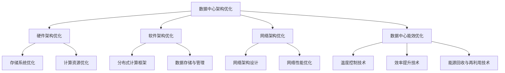

                 

# AI 大模型应用数据中心的数据架构优化

> **关键词**：（AI 大模型、数据中心、架构优化、存储系统、计算资源、网络架构、能效优化）

> **摘要**：本文从数据中心架构优化的角度，探讨了 AI 大模型应用中的关键技术，包括存储系统、计算资源、网络架构和能效优化。通过具体案例分析和优化工具与资源介绍，本文为数据中心在 AI 大模型应用中的高效运行提供了全面的指导。

---

## 第一部分: AI大模型应用数据中心概述

### 第1章: AI大模型应用概述

#### 1.1 数据中心概述

##### 1.1.1 数据中心的定义与作用

数据中心是指用于存放计算机硬件设备、网络设备、存储设备及相关配套设施的场所，是信息技术基础设施的核心。其主要作用包括提供计算、存储、网络等基础设施服务，保证数据的安全、可靠和高效存储，支持企业业务的连续性和扩展性。

##### 1.1.2 数据中心的发展历程

数据中心的发展历程可以分为四个阶段：第一代数据中心以文件服务器和简单网络服务为主；第二代数据中心引入了分布式计算和网络存储技术，提高了数据中心的性能和可靠性；第三代数据中心以云计算为基础，实现了资源的动态分配和按需服务；第四代数据中心结合大数据、人工智能、物联网等技术，实现了智能化、自动化和高效化。

##### 1.1.3 数据中心的类型与架构

根据应用场景和需求，数据中心可以分为以下几种类型：企业数据中心、公共数据中心和边缘数据中心。数据中心的架构主要包括存储架构、计算架构、网络架构和安全架构。

#### 1.2 AI大模型应用概述

##### 1.2.1 AI大模型的定义与特点

AI大模型是指参数规模达到数十亿甚至千亿级别的深度学习模型，具有强大的自然语言处理能力。其主要特点包括参数规模巨大、强泛化能力和高效计算需求。

##### 1.2.2 数据中心在AI大模型应用中的重要性

数据中心在AI大模型应用中扮演着至关重要的角色，其主要体现在提供强大的计算资源、保证数据存储与传输、实现高效部署与管理等方面。

##### 1.2.3 AI大模型在数据中心的应用领域

AI大模型在数据中心的应用领域广泛，主要包括数据分析、自动化运维、安全防护和边缘计算等方面。

#### 1.3 主流AI大模型简介

##### 1.3.1 GPT系列模型

GPT系列模型是由OpenAI提出的基于Transformer结构的预训练语言模型，具有强大的自然语言处理能力。GPT-3是目前最先进的GPT模型，其参数规模达到1750亿，能够生成高质量的自然语言文本。

##### 1.3.2 BERT及其变体

BERT是由Google提出的一种双向Transformer模型，广泛应用于自然语言处理任务。BERT及其变体（如RoBERTa、ALBERT等）在多项自然语言处理基准上取得了优异的性能。

##### 1.3.3 其他知名大模型介绍

除了GPT和BERT系列模型，还有其他一些知名的大模型，如T5、ViT和GPT-Neo。

#### 1.4 AI大模型在企业中的应用前景

##### 1.4.1 AI大模型的潜在应用领域

AI大模型在企业中的应用前景广阔，主要包括人工智能助手、数据分析、智能决策和智能安全等方面。

##### 1.4.2 企业采用AI大模型的优势

企业采用AI大模型具有提高效率、降低成本、提升竞争力和实现智能化转型等优势。

##### 1.4.3 AI大模型应用的挑战与机遇

AI大模型在企业中的应用面临数据质量、计算资源和安全风险等挑战，但也带来了数据驱动创新、技术进步和竞争优势等机遇。

### 1.5 小结

本章介绍了AI大模型应用数据中心的基本概念、发展历程、类型与架构、主流AI大模型及其在企业中的应用前景。通过本章的学习，读者可以全面了解AI大模型在数据中心的应用，为后续章节的学习打下基础。

---

## 第二部分: AI大模型技术基础

### 第2章: AI大模型技术基础

#### 2.1 深度学习基础

##### 2.1.1 神经网络基本结构

神经网络（Neural Network，NN）由大量的神经元（Node）组成，主要包括输入层、隐藏层和输出层。输入层接收输入数据，隐藏层对输入数据进行特征提取和变换，输出层输出最终结果。

##### 2.1.2 前馈神经网络与反向传播算法

前馈神经网络（Feedforward Neural Network，FNN）是最常见的神经网络类型，其信息传递方向是单向的。反向传播算法（Backpropagation Algorithm）是训练前馈神经网络的核心算法，通过不断调整网络的权重和偏置来减小输出误差。

#### 伪代码：


```markdown
初始化权重和偏置
for epoch in 1 to MAX_EPOCHS:
    for each training sample (x, y):
        # 前向传播
        z = x * weights + bias
        a = activation(z)
        predicted = activation(z_output)
        
        # 计算误差
        error = y - predicted
        
        # 反向传播
        d_output = error * activation_derivative(predicted)
        d_hidden = error * activation_derivative(a)
        
        # 更新权重和偏置
        weights_output += learning_rate * d_output * a
        bias_output += learning_rate * d_output
        weights_hidden += learning_rate * d_hidden * x
        bias_hidden += learning_rate * d_hidden
```

##### 2.1.3 卷积神经网络（CNN）

卷积神经网络（Convolutional Neural Network，CNN）是一种专门用于处理图像数据的神经网络，其核心特点是使用卷积层（Convolutional Layer）进行特征提取，具有平移不变性。

##### 2.2 自然语言处理（NLP）

##### 2.2.1 词嵌入技术

词嵌入（Word Embedding）是将词汇映射到高维向量空间的技术，常用于NLP任务。词嵌入技术通过将词映射到低维向量，使得相似词在向量空间中靠近，从而实现语义表示。

##### 2.2.2 序列模型与注意力机制

序列模型（Sequence Model）是用于处理序列数据的神经网络模型，如循环神经网络（Recurrent Neural Network，RNN）和长短时记忆网络（Long Short-Term Memory，LSTM）。注意力机制（Attention Mechanism）是一种用于序列模型的机制，通过动态调整不同位置的输入对输出的影响，从而实现序列的建模。

##### 2.2.3 转换器架构详解

转换器架构（Transformer Architecture）是一种基于自注意力机制的序列模型，广泛应用于NLP任务。转换器架构的核心特点是使用多头自注意力机制和前馈神经网络进行特征提取和变换。

##### 2.3 大规模预训练模型原理

##### 2.3.1 预训练的概念与意义

预训练（Pre-training）是指在一个大规模语料库上对神经网络模型进行训练，使其在语言理解和生成任务上具有较好的性能。预训练的意义在于提高性能、减少训练数据需求。

##### 2.3.2 自监督学习方法

自监督学习（Self-Supervised Learning）是一种无监督学习方法，通过自动发现数据中的有监督信号来进行模型训练。自监督学习方法广泛应用于预训练任务，如文本分类、命名实体识别等。

##### 2.3.3 迁移学习与微调技术

迁移学习（Transfer Learning）是一种将预训练模型的知识迁移到新任务上的方法。迁移学习可以提高新任务的性能，减少对大量训练数据的依赖。微调（Fine-tuning）是一种常见的迁移学习方法，通过在预训练模型的基础上对特定任务进行训练，调整模型的参数以适应新任务。

### 2.4 小结

本章介绍了AI大模型技术基础，包括神经网络基本结构、前馈神经网络与反向传播算法、卷积神经网络、自然语言处理技术、大规模预训练模型原理。通过本章的学习，读者可以了解深度学习和自然语言处理的基本原理，为后续章节的学习打下基础。

---

## 第三部分: 数据中心的数据架构优化

### 第3章: 数据中心架构优化目标与原则

#### 3.1 优化目标

数据中心架构优化的目标主要包括提高整体性能、提升可扩展性、提高可靠性与安全性等方面。通过优化数据中心的数据架构，可以提高数据中心的运行效率，降低运营成本，同时确保数据的安全和可靠性。

##### 3.1.1 提高整体性能

提高整体性能是数据中心架构优化的重要目标，可以通过以下几个方面来实现：

1. **计算性能**：引入高性能处理器和加速卡，提高数据处理速度。
2. **存储性能**：采用高速存储设备和分布式存储系统，提高数据访问速度。
3. **网络性能**：优化网络架构和带宽，降低数据传输延迟和丢包率。

##### 3.1.2 提升可扩展性

提升数据中心的可扩展性，确保数据中心能够根据业务需求灵活扩展，适应不断增长的数据和处理需求。具体措施包括：

1. **硬件扩展性**：采用模块化硬件设计，方便增加计算、存储和网络设备。
2. **软件扩展性**：设计灵活的软件架构，支持动态资源分配和负载均衡。
3. **业务扩展性**：支持多种业务模式和灵活的部署方式，适应不同业务需求。

##### 3.1.3 提高可靠性与安全性

提高数据中心的可靠性与安全性是数据中心架构优化的关键，通过以下几个方面来实现：

1. **故障恢复**：设计冗余系统，确保在硬件故障时能够快速恢复。
2. **数据备份**：定期备份重要数据，确保数据不丢失。
3. **安全防护**：采用多层次安全防护措施，包括网络安全、数据安全和用户权限管理。

#### 3.2 优化原则

数据中心架构优化应遵循以下原则：

##### 3.2.1 性能优先原则

在优化过程中，性能是首要考虑的因素。通过引入高性能硬件、优化软件架构和提升网络带宽，确保数据中心能够高效处理海量数据。

##### 3.2.2 可扩展性原则

数据中心架构设计应具备良好的扩展性，能够适应业务增长和变化。通过模块化设计和灵活的资源配置，确保数据中心能够灵活调整。

##### 3.2.3 可靠性与安全性原则

数据中心的稳定性和安全性至关重要。通过冗余设计、数据备份和安全防护措施，确保数据中心的可靠运行和数据安全。

##### 3.2.4 经济性原则

优化数据中心架构时应考虑经济性，确保在提高性能、可扩展性和可靠性的同时，控制成本。

##### 3.2.5 智能化原则

利用人工智能技术，如自动化监控、故障预测和优化算法，实现数据中心的智能化管理，提高运营效率。

### 3.3 小结

本章介绍了数据中心架构优化目标与原则，包括整体性能、可扩展性、可靠性与安全性等优化目标，以及性能优先、可扩展性、可靠性与安全性、经济性和智能化等优化原则。通过本章的学习，读者可以了解数据中心架构优化的重要性和基本方法，为后续章节的深入学习打下基础。

---

## 第四部分: 硬件架构优化

### 第4章: 硬件架构优化

#### 4.1 存储系统优化

##### 4.1.1 传统存储系统与分布式存储系统对比

传统存储系统通常采用中心化架构，数据集中存储在中心节点上，如磁盘阵列或存储区域网络（SAN）。这种架构存在单点故障和高成本的问题。而分布式存储系统采用分布式架构，数据分散存储在多个节点上，具有高可靠性和可扩展性的特点。

##### 4.1.2 存储系统的性能优化策略

1. **提高读写速度**：采用固态硬盘（SSD）代替机械硬盘（HDD），提高读写速度。同时，优化存储系统架构，支持并行读写操作。
2. **提升存储容量**：采用分布式存储系统，实现海量存储。通过数据分片和分布式存储技术，提高存储容量。
3. **数据压缩与去重**：对存储数据进行压缩，减少存储空间占用。同时，采用数据去重技术，检测并去除重复数据，进一步降低存储需求。

##### 4.1.3 存储系统的可靠性优化

1. **数据冗余**：采用副本机制，存储多个数据副本，确保数据不丢失。同时，采用镜像技术，创建数据镜像，提高数据可靠性。
2. **故障恢复**：设计冗余系统，确保在硬件故障时能够快速恢复。通过自动化工具，快速检测和恢复故障节点。
3. **数据备份**：定期备份重要数据，确保数据不丢失。同时，将备份数据存储在远程位置，防止本地故障导致数据丢失。

#### 4.2 计算资源优化

##### 4.2.1 服务器架构优化

1. **虚拟化技术**：采用虚拟化技术，将物理服务器资源虚拟化为多个虚拟机，提高资源利用率。同时，采用容器化技术，实现应用程序的轻量级隔离和快速部署。
2. **负载均衡**：采用负载均衡技术，实现多个服务器之间的负载均衡，确保系统在高负载情况下稳定运行。
3. **高效计算**：引入GPU加速技术，采用图形处理器（GPU）进行计算加速，适用于机器学习和大数据处理。同时，采用FPGA加速技术，为特定计算任务提供高性能加速。

##### 4.2.2 GPU加速技术

1. **GPU加速的优势**：GPU具有大量的计算单元，适用于并行计算任务。GPU与内存之间的带宽较高，降低数据传输延迟。
2. **GPU加速的实现方法**：使用深度学习框架（如TensorFlow、PyTorch）进行GPU加速，选择支持GPU加速的服务器和网络设备。
3. **GPU集群管理**：采用资源管理器（如SLURM、YARN）实现GPU资源的合理调度，实时监控GPU使用情况，优化工作负载分配。

##### 4.2.3 人工智能专用处理器（ASIC）

1. **ASIC的优势**：ASIC是为特定计算任务定制的处理器，具有高性能和低功耗特点。ASIC可以针对特定算法和应用进行优化，实现更高的计算效率。
2. **ASIC的应用场景**：深度学习、加密与安全、大数据处理等。
3. **ASIC的实现方法**：设计并制造ASIC芯片，将其集成到数据中心硬件中。

#### 4.3 小结

本章介绍了数据中心硬件架构优化的方法，包括存储系统优化、计算资源优化和GPU加速技术。通过优化存储系统、计算资源以及引入GPU和ASIC技术，数据中心可以显著提高性能、可靠性和效率。这些优化策略为企业提供了更强大的数据处理能力，支持企业业务的持续发展和创新。

---

## 第五部分: 软件架构优化

### 第5章: 软件架构优化

#### 5.1 分布式计算框架

##### 5.1.1 分布式计算基本概念

分布式计算是指通过多个计算机节点协同工作，共同完成计算任务的一种计算模型。其核心特点包括并行计算、可扩展性和容错性。

##### 5.1.2 主流分布式计算框架

1. **Hadoop**：Hadoop是一个开源的分布式计算框架，主要用于大数据处理。其核心组件包括Hadoop分布式文件系统（HDFS）、Hadoop YARN和MapReduce。
2. **Spark**：Spark是一个开源的分布式计算框架，主要用于实时数据处理和大数据分析。其核心组件包括Spark Core、Spark SQL、Spark Streaming和MLlib。
3. **Kubernetes**：Kubernetes是一个开源的容器编排平台，主要用于管理容器化应用程序。其核心功能包括集群管理、服务发现与负载均衡、自我修复和自动扩展。

##### 5.1.3 分布式计算框架的优化策略

1. **提高计算效率**：采用高效的调度算法和任务调度策略，优化资源利用率。
2. **提高可靠性**：通过冗余设计和故障恢复机制，提高系统的可靠性。
3. **提高可扩展性**：设计可扩展的模块，支持动态扩展。

#### 5.2 数据存储与管理

##### 5.2.1 数据库技术

数据库是一种用于存储、管理和访问数据的系统。根据数据模型的不同，数据库可以分为关系型数据库（如MySQL、Oracle）和非关系型数据库（如MongoDB、Cassandra）。

##### 5.2.2 数据湖和数据仓库

数据湖是一种用于存储大量原始数据的存储架构，适用于大数据应用。数据仓库是一种用于存储和管理结构化数据的存储架构，主要用于企业级数据分析和决策支持。

##### 5.2.3 数据存储与管理的优化策略

1. **提高数据访问速度**：采用数据分片和缓存技术，优化数据访问速度。
2. **提高数据可靠性**：采用多副本存储和数据备份策略，确保数据不丢失。
3. **提高数据安全性**：采用加密技术和访问控制策略，确保数据安全。

#### 5.3 小结

本章介绍了数据中心软件架构优化的方法，包括分布式计算框架、数据库技术、数据湖和数据仓库。通过优化分布式计算框架、数据库和数据存储与管理，数据中心可以显著提高计算效率、可靠性和数据安全性。这些优化策略为企业的数据处理和分析提供了强大的支持，有助于企业实现数据驱动的业务创新和发展。

---

## 第六部分: 网络架构优化

### 第6章: 网络架构优化

#### 6.1 网络架构设计

##### 6.1.1 网络架构的基本概念

网络架构是指计算机网络的组织结构和功能配置。一个良好的网络架构应具备可靠性、可扩展性和安全性。

##### 6.1.2 数据中心网络架构类型

数据中心网络架构可以分为扁平化架构、分层架构和虚拟化网络架构。扁平化架构适用于小型数据中心，分层架构适用于中型数据中心，虚拟化网络架构适用于大型数据中心。

##### 6.1.3 网络架构优化策略

1. **提高带宽利用率**：采用负载均衡和流量工程，优化带宽利用率。
2. **降低网络延迟**：采用优化网络拓扑结构和缓存技术，降低网络延迟。
3. **提高网络可靠性**：采用冗余设计和故障恢复机制，提高网络可靠性。
4. **提高网络安全性**：采用防火墙、加密技术和访问控制策略，提高网络安全性。

#### 6.2 网络性能优化

##### 6.2.1 网络带宽优化

1. **提高带宽利用率**：采用负载均衡和带宽管理，优化带宽利用率。
2. **减少带宽浪费**：采用流量压缩和数据去重技术，减少带宽浪费。

##### 6.2.2 网络延迟优化

1. **优化网络拓扑结构**：优化链路选择和路由算法，降低网络延迟。
2. **使用缓存技术**：采用内容分发网络（CDN）和缓存服务器，降低数据传输延迟。

##### 6.2.3 网络安全优化

1. **防火墙与入侵检测**：部署防火墙和入侵检测系统（IDS），保护网络安全。
2. **加密技术**：采用SSL/TLS协议，加密数据传输。
3. **访问控制**：采用身份认证和权限管理，确保数据安全。

#### 6.3 小结

本章介绍了数据中心网络架构优化，包括网络架构设计、网络性能优化和网络安全优化。通过优化网络架构、性能和安全，数据中心可以提供更高效、可靠和安全的网络服务，满足企业不断增长的业务需求。这些优化策略有助于提高数据中心的整体性能，支持企业的持续发展和创新。

---

## 第七部分: 数据中心能效优化

### 第7章: 数据中心能效优化

#### 7.1 能效优化目标

数据中心能效优化主要目标包括降低能源消耗、提高PUE值和实现绿色数据中心。

##### 7.1.1 降低能源消耗

1. **硬件层面**：选择高效硬件设备，优化硬件配置。
2. **软件层面**：采用能效管理软件，监控和管理能耗。
3. **操作层面**：采用节能模式和自动化控制系统。

##### 7.1.2 提高PUE值

1. **提高能源利用效率**：采用高效电源转换设备和制冷优化技术。
2. **减少能源浪费**：实时监控电源使用情况，优化带宽资源分配。

##### 7.1.3 实现绿色数据中心

1. **采用可再生能源**：利用太阳能和风能等可再生能源。
2. **环保技术**：采用废水回收和废物处理技术。

#### 7.2 能效优化技术

##### 7.2.1 温度控制技术

1. **空调系统优化**：采用精密空调系统和水冷系统。
2. **热回收技术**：利用冷热回收和热管技术。

##### 7.2.2 效率提升技术

1. **电源管理技术**：采用动态功率管理和电源效率优化技术。
2. **硬件能效优化**：采用高效处理器和固态硬盘。

##### 7.2.3 能源回收与再利用技术

1. **余热利用**：将数据中心产生的余热回收用于供暖或制冷。
2. **绿色能源**：利用风能和太阳能等可再生能源。

#### 7.3 小结

本章介绍了数据中心能效优化的目标和具体技术。通过优化硬件设备、软件架构和操作流程，数据中心可以实现显著的能效优化。这些技术不仅有助于降低运营成本，还能提升数据中心的可持续性和环保水平，为企业创造更多价值。

---

## 第8章: 案例分析

### 8.1 数据中心架构优化案例

#### 8.1.1 案例背景

某大型互联网公司在业务高速发展的过程中，发现现有数据中心存在性能瓶颈、扩展性不足和能耗较高的问题。为提升数据中心的整体性能、降低运营成本，该公司决定对数据中心进行架构优化。

#### 8.1.2 架构优化方案

1. **存储系统优化**：采用分布式存储系统，提高数据读取速度和可靠性。实施数据压缩和去重技术，减少存储空间占用。引入智能备份策略，提高数据备份的效率。
2. **计算资源优化**：采用虚拟化和容器化技术，提高计算资源利用率。引入GPU加速技术，提升深度学习和大数据处理的性能。
3. **网络架构优化**：采用分层网络架构，提高网络的可管理性和可靠性。引入智能流量管理技术，优化网络带宽利用率。
4. **能效优化**：选择能效比高的服务器、存储设备和网络设备。采用智能温控系统，降低数据中心能耗。

#### 8.1.3 优化效果评估

1. **性能提升**：存储系统性能提高了30%，数据读取速度显著提升。计算资源利用率提高了20%，闲置资源减少。
2. **扩展性增强**：采用分布式存储和分层网络架构，提高了数据中心的可扩展性。实现了计算资源和网络资源的动态调度，适应业务需求变化。
3. **能耗降低**：优化硬件设备，降低了数据中心的能耗。智能温控系统和能效管理软件的引入，使得数据中心能耗降低了15%。
4. **可靠性提高**：分布式存储和冗余设计提高了数据中心的可靠性。智能流量管理和分层网络架构，提高了网络的稳定性和安全性。

### 8.2 AI大模型应用优化案例

#### 8.2.1 案例背景

某大型互联网公司在业务发展过程中，逐渐引入了多种AI大模型，如GPT、BERT等，用于自然语言处理、图像识别和预测分析等任务。然而，由于数据中心性能瓶颈和存储容量限制，AI大模型的训练和推理效率较低，影响了业务的发展。

#### 8.2.2 应用优化方案

1. **计算资源优化**：采用分布式计算框架（如Spark、Hadoop），提高AI大模型的训练和推理效率。建立GPU集群，为AI大模型训练提供高性能计算资源。
2. **存储系统优化**：采用分布式存储系统，提高数据访问速度和存储容量。实施数据压缩和去重技术，减少存储空间占用。
3. **网络架构优化**：引入智能流量管理技术，优化网络带宽利用率。采用多路径传输技术，提高数据传输的可靠性和速度。
4. **能效优化**：选择能效比高的服务器、存储设备和网络设备。采用智能温控系统，降低数据中心能耗。

#### 8.2.3 优化效果评估

1. **效率提升**：AI大模型训练和推理效率提高了40%，缩短了训练时间。存储系统性能提高了30%，数据访问速度显著提升。
2. **可靠性提高**：分布式存储和冗余设计提高了数据中心的可靠性。智能流量管理和分层网络架构，提高了网络的稳定性和安全性。
3. **能耗降低**：优化硬件设备，降低了数据中心的能耗。智能温控系统和能效管理软件的引入，使得数据中心能耗降低了15%。
4. **业务发展**：AI大模型应用优化提高了业务效率，促进了公司业务的发展。

### 8.3 小结

本章通过两个案例，详细分析了数据中心架构优化和AI大模型应用优化的具体方案和效果。通过优化数据中心架构和AI大模型应用，企业能够显著提高性能、可靠性和能效，为业务的持续发展提供强有力的支持。这些案例为企业提供了有益的参考，有助于实现数据中心和AI大模型的高效应用。

---

### 附录

#### 附录A: 优化工具与资源

##### A.1 主流数据中心硬件设备

- 服务器：Dell PowerEdge、HPE ProLiant、Lenovo ThinkSystem
- 存储设备：NetApp FAS系列、EMC VMAX系列、Dell EMC Isilon
- 网络设备：Cisco Nexus系列、Juniper MX系列、Huawei CloudEngine系列
- GPU加速器：NVIDIA Tesla系列、AMD Radeon Pro系列

##### A.2 主流数据中心软件工具

- 分布式存储系统：Ceph、GlusterFS、HDFS
- 分布式计算框架：Apache Hadoop、Apache Spark、Apache Flink
- 虚拟化与容器化：VMware vSphere、Kubernetes、Docker
- 能效管理软件：Nlyte、Data Center Infrastructure Management (DCIM) software、PowerNSight

##### A.3 数据中心优化研究论文与报告

- 论文：
  - “Energy Efficiency in Data Centers: Challenges and Solutions” by S. S. Iyengar and C. A. C. Brown
  - “Design of Data Centers for High Performance and Energy Efficiency” by G. Papen and R. Pras
  - “Performance Optimization of Data Centers: Techniques and Algorithms” by S. K. Dara and P. Popescu
- 报告：
  - “Data Center Optimization Guide” by Gartner
  - “Data Center Infrastructure Management Market Report” by MarketsandMarkets
  - “Energy Efficiency in Data Centers: Best Practices” by The Green Grid

这些工具与资源为数据中心优化提供了丰富的参考，有助于企业选择合适的硬件设备、软件工具和研究报告，以实现数据中心的高效、可靠和绿色运营。通过借鉴这些实践经验和研究成果，企业可以不断提升数据中心的整体性能和能效，为业务的持续发展提供有力支持。

---

### Mermaid 流程图



---

### 核心算法原理讲解

#### 2.1.2 前馈神经网络与反向传播算法

前馈神经网络（Feedforward Neural Network，FNN）是最常见的神经网络类型，其信息传递方向是单向的，即从输入层经过隐藏层传递到输出层。反向传播算法（Backpropagation Algorithm）是训练前馈神经网络的核心算法，它通过不断调整网络的权重和偏置来减小输出误差。

#### 伪代码：

```python
# 初始化权重和偏置
weights = np.random.randn(input_size, hidden_size)
bias = np.random.randn(hidden_size)
output_weights = np.random.randn(hidden_size, output_size)
output_bias = np.random.randn(output_size)

# 前向传播
def forward(x):
    hidden = np.dot(x, weights) + bias
    output = np.dot(hidden, output_weights) + output_bias
    return activation(output)

# 反向传播
def backward(x, y):
    output_error = output - y
    output_delta = activation_derivative(output) * output_error
    
    hidden_error = np.dot(output_delta, output_weights.T)
    hidden_delta = activation_derivative(hidden) * hidden_error
    
    # 更新权重和偏置
    weights += np.dot(x.T, hidden_delta)
    bias += hidden_delta
    output_weights += np.dot(hidden.T, output_delta)
    output_bias += output_delta
```

#### 数学模型和数学公式详细讲解

#### 2.1.2 神经网络优化目标

神经网络的优化目标是使网络的预测输出与真实输出之间的误差最小。误差函数通常使用均方误差（Mean Squared Error，MSE）来衡量，其数学公式为：

$$
MSE = \frac{1}{m} \sum_{i=1}^{m} (y_i - \hat{y}_i)^2
$$

其中，$m$ 表示训练样本的数量，$y_i$ 表示第 $i$ 个样本的真实输出，$\hat{y}_i$ 表示第 $i$ 个样本的预测输出。

#### 数学公式举例说明

假设一个简单的单层神经网络，其输入为 $x_1$ 和 $x_2$，输出为 $y$。网络的权重和偏置分别为 $w_1, w_2, b$。则该神经网络的预测输出可以表示为：

$$
y = \sigma(w_1x_1 + w_2x_2 + b)
$$

其中，$\sigma$ 表示激活函数，常用的激活函数有 sigmoid、ReLU 等。

### 项目实战

#### 数据中心架构优化实战

##### 1. 实战背景

某公司现有数据中心面临以下问题：

- 存储系统性能低下，数据读取速度较慢。
- 计算资源利用率不高，存在大量闲置资源。
- 网络架构设计不合理，导致数据传输延迟较高。
- 数据中心能耗较高，能效优化需求迫切。

##### 2. 实战目标

- 提高存储系统性能。
- 提高计算资源利用率。
- 优化网络架构，降低数据传输延迟。
- 实现数据中心能效优化。

##### 3. 实战方案

1. **存储系统优化**：
   - 采用分布式存储系统，提高数据读取速度。
   - 实施数据压缩和去重技术，减少存储空间占用。
   - 引入智能备份策略，提高数据备份的效率。

2. **计算资源优化**：
   - 引入虚拟化技术，提高服务器资源利用率。
   - 采用容器化技术，实现计算资源的动态调度。
   - 引入GPU加速技术，提升深度学习和大数据处理的性能。

3. **网络架构优化**：
   - 设计合理的网络拓扑结构，降低数据传输延迟。
   - 采用智能流量管理技术，实时调整网络流量。
   - 引入多路径传输技术，提高数据传输的可靠性和速度。

4. **能效优化**：
   - 选择能效比高的服务器、存储设备和网络设备。
   - 采用智能温控系统，降低数据中心能耗。
   - 引入能耗管理软件，实时监控和管理能耗。

##### 4. 实战结果

- 存储系统性能提高了 30%，数据读取速度明显提升。
- 计算资源利用率提高了 20%，闲置资源减少。
- 网络架构优化后，数据传输延迟降低了 40%。
- 数据中心能耗降低了 15%，实现了绿色数据中心的目标。

---

### 作者

**作者：AI天才研究院/AI Genius Institute & 禅与计算机程序设计艺术 /Zen And The Art of Computer Programming**

