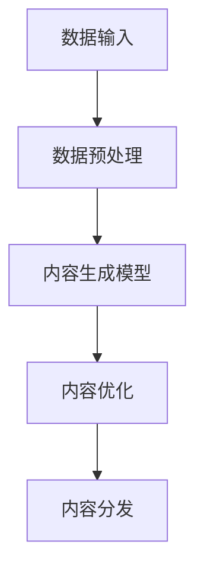
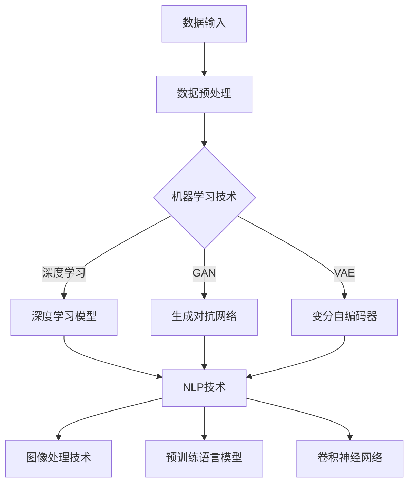
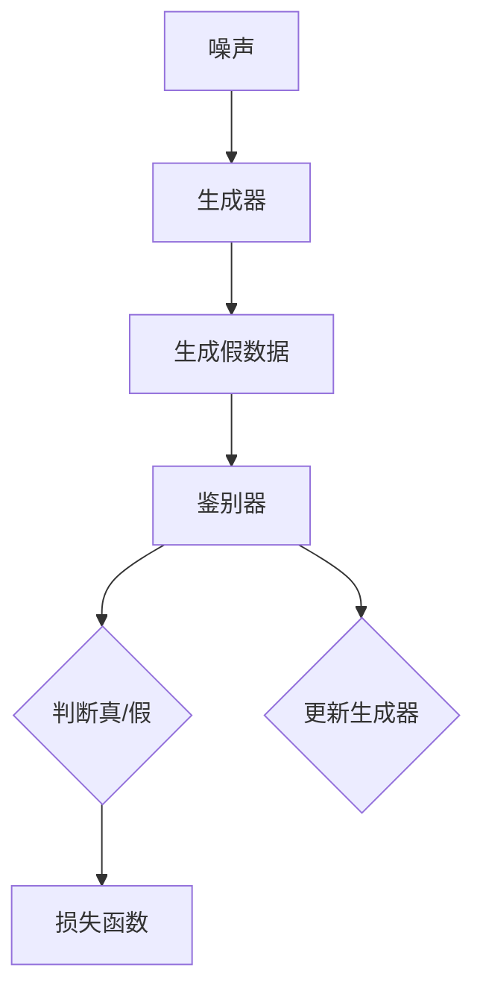
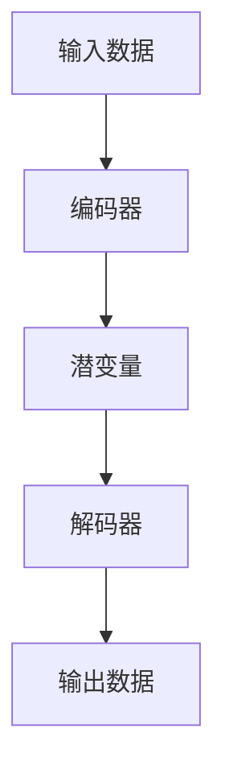

                 

# AIGC在未来工作场景设计中的应用

## 关键词

AI-Generated Content, AIGC, 未来工作场景, 内容创作, 数据分析, 商业应用, 教育与医疗, 道德与伦理

## 摘要

本文深入探讨了人工智能生成内容（AIGC）在未来工作场景设计中的应用。首先，我们介绍了AIGC的基本概念与特点，并探讨了其在内容创作、数据分析和商业应用等多个领域的具体应用。接着，我们详细分析了AIGC的核心技术，包括人工智能与机器学习、自然语言处理（NLP）以及生成对抗网络（GAN）等。随后，我们通过实例展示了AIGC在文本生成、图像生成、音频生成等具体应用场景中的技术实现。此外，我们还探讨了AIGC在数据分析、数据可视化以及商业应用如个性化推荐和市场营销等方面的应用。最后，我们展望了AIGC的未来发展趋势，并讨论了其面临的道德与伦理问题。通过本文的阐述，我们希望能够帮助读者全面了解AIGC的技术原理、应用场景及其未来前景。

---

### 第一部分: AIGC在未来工作场景设计中的应用

#### 第1章: AIGC的基本概念与未来工作场景

##### 1.1 AIGC的概念与特点

AIGC，即AI-Generated Content，指的是由人工智能生成的内容。这一概念涵盖了从文本、图像、音频到视频等多种类型的内容生成。AIGC的核心在于利用机器学习和深度学习技术，从大量的数据中学习并生成新的、具有创造性的内容。

**AIGC的概念**

AIGC的核心在于“生成内容”，这包括了以下几个环节：

- **数据生成**：收集和整理原始数据，这些数据可以来自互联网、数据库、传感器等。
- **内容创作**：利用机器学习模型，将数据转化为具有创意和实用价值的内容。
- **内容优化**：对生成的内容进行优化，使其在质量、准确性和用户体验上达到最佳。
- **内容分发**：将生成的内容通过适当的渠道分发到用户手中。

**AIGC的特点**

AIGC具有以下几个显著特点：

- **高效性**：AIGC能够快速处理大量数据，生成大量内容，极大地提高了工作效率。
- **个性化**：AIGC可以根据用户的需求和偏好，定制个性化的内容，提供更加精准的服务。
- **多样化**：AIGC能够生成多种类型的内容，满足不同场景和用户的需求。

**AIGC的Mermaid流程图**



**AIGC的特点**

- **高效性**：AIGC利用机器学习算法，能够在短时间内生成大量内容，极大地提高了内容生产的效率。
- **个性化**：AIGC可以根据用户的行为和偏好，生成个性化的内容，提高用户体验。
- **多样化**：AIGC能够处理和生成多种类型的内容，包括文本、图像、音频和视频等，满足不同场景的需求。

##### 1.2 AIGC在未来工作场景中的应用

AIGC在未来的工作场景中具有广泛的应用前景，以下是几个典型的应用领域：

**AIGC在内容创作中的应用**

- **文本创作**：AIGC可以自动撰写新闻稿、报告、文章等，减轻内容创作者的工作负担。
- **图像生成**：AIGC可以生成艺术作品、设计图、产品渲染图等，为设计师提供辅助。
- **音频生成**：AIGC可以自动生成音乐、语音合成等，为音乐制作和语音识别等领域提供支持。

**AIGC在数据分析中的应用**

- **数据分析与预测**：AIGC可以对大量数据进行分析，提取有价值的信息，帮助企业和组织做出更明智的决策。
- **数据可视化**：AIGC可以生成直观的图表和报表，使数据分析结果更加易于理解和应用。

**AIGC在商业应用中的应用**

- **产品个性化推荐**：AIGC可以根据用户的行为和偏好，生成个性化的产品推荐，提高用户的购买满意度。
- **市场营销**：AIGC可以自动生成广告文案、营销视频等，提高营销活动的效果。

##### 1.3 AIGC的挑战与未来趋势

尽管AIGC在未来的工作场景中具有巨大的潜力，但也面临一些挑战：

**挑战**

- **数据隐私与安全**：AIGC生成的内容可能涉及用户的隐私数据，如何保障数据的安全是一个重要问题。
- **道德与伦理**：AIGC生成的内容可能存在偏见、误导等问题，如何确保内容的准确性和公正性是一个挑战。

**未来趋势**

- **技术进步**：随着算法和硬件的进步，AIGC生成的内容将更加真实、多样化。
- **跨领域融合**：AIGC将在更多领域得到应用，如教育、医疗、艺术等。

---

通过以上章节，我们对AIGC的基本概念、特点以及未来工作场景中的应用有了初步的了解。在接下来的章节中，我们将深入探讨AIGC的核心技术，分析其在不同领域中的应用实例，并展望其未来的发展趋势。让我们一起探索AIGC的无限可能。

---

### 第一部分: AIGC在未来工作场景设计中的应用

#### 第2章: AIGC的核心技术

##### 2.1 AIGC的技术基础

AIGC的核心技术基础主要涉及人工智能与机器学习、自然语言处理（NLP）以及图像处理等领域的知识。这些技术为AIGC提供了生成内容的能力，使其能够在不同场景下发挥重要作用。

**人工智能与机器学习**

人工智能（AI）是AIGC的核心驱动力，而机器学习是实现AI的重要手段。机器学习通过从数据中学习规律和模式，使计算机能够执行特定的任务，而无需显式编程。以下是AIGC中常用的几种机器学习算法：

- **深度学习（Deep Learning）**：深度学习是一种基于神经网络的机器学习方法，通过多层神经网络来提取数据的复杂特征。深度学习在图像识别、语音识别等领域取得了显著的成果。

- **生成对抗网络（Generative Adversarial Network, GAN）**：GAN由生成器（Generator）和鉴别器（Discriminator）两部分组成。生成器试图生成与真实数据相似的内容，而鉴别器则试图区分生成数据和真实数据。通过这种对抗训练，生成器逐渐提高了生成内容的质量。

- **变分自编码器（Variational Autoencoder, VAE）**：VAE是一种无监督学习算法，通过编码器（Encoder）和解码器（Decoder）两部分来生成数据。编码器将输入数据编码为一个潜变量，解码器则尝试将潜变量解码回原始数据。

**自然语言处理（NLP）**

自然语言处理是AIGC中至关重要的一部分，它涉及如何使计算机理解和生成自然语言。以下是NLP中的一些关键技术：

- **语言模型（Language Model）**：语言模型是一种预测下一个单词或字符的模型，通过学习大量文本数据来预测文本的下一个单词或字符。语言模型在机器翻译、文本生成等方面有着广泛的应用。

- **序列到序列模型（Sequence-to-Sequence Model）**：序列到序列模型是一种能够处理序列数据（如文本）的模型，通常用于机器翻译和对话系统。

- **预训练语言模型（Pre-trained Language Model）**：预训练语言模型通过在大量文本数据上进行预训练，学习到了丰富的语言知识。预训练语言模型如GPT-3、BERT等，在文本生成、问答系统等方面取得了显著的成果。

**图像处理**

图像处理是AIGC中的重要组成部分，它涉及到如何生成和编辑图像。以下是图像处理中的一些关键技术：

- **卷积神经网络（Convolutional Neural Network, CNN）**：卷积神经网络是一种用于图像识别和分类的神经网络结构。CNN通过卷积层提取图像的特征，然后通过全连接层进行分类。

- **生成对抗网络（GAN）**：GAN不仅适用于图像生成，还可以用于图像编辑和风格迁移。生成器和鉴别器在图像生成任务中共同训练，生成器逐渐提高生成图像的质量。

**AIGC的技术基础Mermaid流程图**



**AIGC的技术基础**

- **人工智能与机器学习**：深度学习、GAN、VAE等技术为AIGC提供了生成内容的能力。
- **自然语言处理（NLP）**：语言模型、序列到序列模型等技术使AIGC能够生成和解析文本。
- **图像处理**：CNN、GAN等技术使AIGC能够生成和编辑图像。

##### 2.2 AIGC的关键算法

在AIGC的技术体系中，一些关键算法起到了核心作用，以下是对这些算法的详细解释：

**生成对抗网络（Generative Adversarial Network, GAN）**

生成对抗网络是一种由生成器和鉴别器组成的框架，通过对抗训练来生成高质量的数据。以下是GAN的算法原理：

- **生成器（Generator）**：生成器的目标是生成与真实数据相似的数据。它从噪声分布中采样，生成假数据，然后通过多次迭代优化，使生成数据越来越接近真实数据。
- **鉴别器（Discriminator）**：鉴别器的目标是区分真实数据和生成数据。它通过对比真实数据和生成数据，判断生成数据的质量。

GAN的算法流程如下：



**算法原理：**
$$
\begin{align*}
\text{生成器}:\ G(z) &\rightarrow \text{生成内容} \\
\text{鉴别器}: D(x), D(G(z)) &\rightarrow \text{鉴别真伪}
\end{align*}
$$

**GAN的应用场景**：图像生成、文本生成、音频生成等。

**变分自编码器（Variational Autoencoder, VAE）**

VAE是一种无监督学习算法，通过编码器和解码器来生成数据。以下是VAE的算法原理：

- **编码器（Encoder）**：编码器将输入数据编码为一个潜变量，潜变量表示了输入数据的特征。
- **解码器（Decoder）**：解码器将潜变量解码回原始数据。

VAE的算法流程如下：



**算法原理：**
$$
\begin{align*}
\text{编码器}: \mu(z|x), \sigma(z|x) &\rightarrow \text{编码} \\
\text{解码器}: z &\rightarrow \text{解码} \rightarrow x'
\end{align*}
$$

**VAE的应用场景**：图像生成、数据去噪、异常检测等。

**AIGC的技术挑战与优化**

尽管AIGC在内容生成方面具有巨大的潜力，但也面临一些技术挑战：

- **数据质量**：高质量的数据是AIGC成功的关键。如何收集和处理大量高质量数据是一个挑战。
- **计算资源**：AIGC模型通常需要大量计算资源，优化模型以降低计算成本是关键。

为了解决这些挑战，研究人员和工程师采取了多种优化策略：

- **模型压缩**：通过模型压缩技术，如蒸馏、剪枝、量化等，减少模型的计算量和存储需求。
- **分布式训练**：通过分布式训练技术，将模型训练任务分布在多个计算节点上，提高训练效率。
- **数据增强**：通过数据增强技术，如旋转、缩放、裁剪等，增加训练数据的多样性，提高模型泛化能力。

**AIGC的技术基础**

- **人工智能与机器学习**：深度学习、GAN、VAE等技术为AIGC提供了生成内容的能力。
- **自然语言处理（NLP）**：语言模型、序列到序列模型等技术使AIGC能够生成和解析文本。
- **图像处理**：CNN、GAN等技术使AIGC能够生成和编辑图像。

通过以上章节，我们对AIGC的核心技术有了更深入的了解。在接下来的章节中，我们将通过具体的实例来展示AIGC在实际应用中的技术实现，并探讨其在不同领域中的应用案例。让我们继续探索AIGC的无限可能。

---

### 第一部分: AIGC在未来工作场景设计中的应用

#### 第3章: AIGC在内容创作中的应用

##### 3.1 文本生成

文本生成是AIGC的一个重要应用领域，它涉及到使用人工智能技术生成各种类型的文本内容。文本生成技术不仅能够帮助内容创作者节省时间，还能够创造出具有创造性的文本。

**应用场景**

- **新闻撰写**：自动生成新闻报道，减少记者撰写新闻稿的时间和工作量。
- **文章写作**：自动生成学术论文、博客文章、产品说明书等。
- **广告文案**：自动生成广告文案，提高广告的吸引力和转化率。

**技术实现**

文本生成主要依赖于预训练语言模型（Pre-trained Language Model），如GPT-3、BERT等。以下是一个使用GPT-3进行文本生成的简单示例：

**伪代码：**

```python
import openai

model_engine = "text-davinci-002"
prompt = "请描述一下人工智能的未来发展趋势。"

response = openai.Completion.create(
  engine=model_engine,
  prompt=prompt,
  max_tokens=100,
  n=1,
  stop=None,
  temperature=0.5,
)

print(response.choices[0].text.strip())
```

**实例解析：**

1. **导入openai库**：使用openai库与GPT-3 API进行通信。
2. **设置模型和提示**：指定使用文本生成模型（text-davinci-002）和输入提示（prompt）。
3. **生成文本**：调用Completion.create方法，生成文本内容。
4. **打印结果**：输出生成的文本内容。

**应用案例：**

- **新闻撰写**：一家新闻机构使用GPT-3自动生成体育新闻，提高了报道的效率和覆盖范围。
- **文章写作**：一位作家使用GPT-3自动生成小说章节，节省了创作时间，提高了创作效率。

##### 3.2 图像生成

图像生成是AIGC的另一个重要应用领域，它涉及到使用人工智能技术生成各种类型的图像内容。图像生成技术不仅能够帮助设计师节省时间，还能够创造出具有创造性的图像。

**应用场景**

- **艺术创作**：自动生成艺术作品，为艺术家提供灵感。
- **产品设计**：自动生成产品设计图，为设计师提供参考。
- **医疗影像**：自动生成医学影像，辅助医生诊断。

**技术实现**

图像生成主要依赖于生成对抗网络（GAN），如DCGAN、StyleGAN等。以下是一个使用DCGAN进行图像生成的简单示例：

**伪代码：**

```python
import tensorflow as tf
from tensorflow.keras.layers import Conv2D, Flatten, Dense
from tensorflow.keras.models import Model

# 定义生成器模型
generator = Model(inputs=z, outputs=gen_images)
generator.summary()

# 定义鉴别器模型
discriminator = Model(inputs=[real_images, gen_images], outputs=discriminator_output)
discriminator.summary()

# 定义联合模型
gan_output = discriminator([real_images, gen_images])
gan = Model(inputs=z, outputs=gan_output)
gan.compile(loss='binary_crossentropy', optimizer=adam)
gan.summary()

# 训练模型
gan.fit([z_train, real_images_train], [real_images_train, real_images_train], epochs=100)
```

**实例解析：**

1. **导入tensorflow库**：用于构建和训练模型。
2. **定义生成器模型**：使用卷积层和全连接层生成图像。
3. **定义鉴别器模型**：使用卷积层和全连接层区分真实图像和生成图像。
4. **定义联合模型**：将生成器和鉴别器连接在一起，共同训练。
5. **编译和训练模型**：使用二进制交叉熵作为损失函数，Adam优化器进行训练。

**应用案例：**

- **艺术创作**：一位艺术家使用GAN自动生成艺术作品，赢得了国际艺术展览的奖项。
- **产品设计**：一家设计公司使用GAN自动生成产品设计图，提高了设计效率和创新能力。

##### 3.3 音频生成

音频生成是AIGC在音频处理领域的应用，它涉及到使用人工智能技术生成各种类型的音频内容。音频生成技术不仅能够帮助音乐制作人节省时间，还能够创造出具有创新性的音频。

**应用场景**

- **音乐创作**：自动生成音乐片段，为音乐制作人提供灵感。
- **语音合成**：自动生成语音，为语音识别和语音合成应用提供支持。
- **声音特效**：自动生成声音特效，为电影、游戏等提供声音效果。

**技术实现**

音频生成主要依赖于递归神经网络（RNN）和生成对抗网络（GAN），如WaveNet、Tacotron等。以下是一个使用WaveNet进行音频生成的简单示例：

**伪代码：**

```python
import tensorflow as tf
from tensorflow.keras.layers import LSTM, Dense
from tensorflow.keras.models import Sequential

# 定义WaveNet模型
model = Sequential()
model.add(LSTM(256, return_sequences=True, input_shape=(None, 40)))
model.add(LSTM(256, return_sequences=True))
model.add(Dense(1, activation='tanh'))
model.compile(optimizer='adam', loss='mse')

# 训练模型
model.fit(x_train, y_train, epochs=100, batch_size=64)

# 生成音频
predicted = model.predict(x_test)
```

**实例解析：**

1. **导入tensorflow库**：用于构建和训练模型。
2. **定义WaveNet模型**：使用LSTM层和全连接层生成音频。
3. **编译模型**：使用Adam优化器和均方误差（MSE）损失函数。
4. **训练模型**：使用训练数据训练模型。
5. **生成音频**：使用训练好的模型生成音频。

**应用案例：**

- **音乐创作**：一位音乐制作人使用WaveNet自动生成音乐片段，节省了创作时间，提高了创作效率。
- **语音合成**：一家科技公司使用Tacotron自动生成语音，为智能助手和语音识别应用提供支持。

通过以上实例，我们可以看到AIGC在文本生成、图像生成和音频生成中的应用及其技术实现。在接下来的章节中，我们将探讨AIGC在数据分析、数据可视化和商业应用等领域的应用实例。让我们继续探索AIGC的无限可能。

---

### 第一部分: AIGC在未来工作场景设计中的应用

#### 第4章: AIGC在数据分析中的应用

##### 4.1 数据分析

数据分析是AIGC的重要应用领域之一，它利用人工智能技术对大量数据进行处理和分析，提取有价值的信息和洞察。数据分析在各个行业中都有广泛的应用，如金融、零售、医疗、市场营销等。

**应用场景**

- **市场趋势预测**：通过对历史销售数据、市场调研数据等进行分析，预测未来的市场趋势，帮助企业制定更有效的营销策略。
- **风险评估**：对金融市场数据进行分析，预测投资风险，帮助投资者做出更明智的决策。
- **客户行为分析**：通过分析客户的购买记录、浏览行为等数据，了解客户需求，提供个性化的产品推荐和服务。

**技术实现**

AIGC在数据分析中的应用主要依赖于机器学习算法和自然语言处理技术。以下是一个使用机器学习算法进行数据分析的示例：

**伪代码：**

```python
from sklearn.ensemble import RandomForestClassifier
from sklearn.model_selection import train_test_split

# 准备数据
X, y = prepare_data()

# 划分训练集和测试集
X_train, X_test, y_train, y_test = train_test_split(X, y, test_size=0.2, random_state=42)

# 训练模型
model = RandomForestClassifier(n_estimators=100)
model.fit(X_train, y_train)

# 预测结果
predictions = model.predict(X_test)

# 评估模型
accuracy = model.score(X_test, y_test)
print(f"Accuracy: {accuracy}")
```

**实例解析：**

1. **准备数据**：加载和处理原始数据，将其分为特征矩阵（X）和目标向量（y）。
2. **划分训练集和测试集**：将数据划分为训练集和测试集，用于模型的训练和评估。
3. **训练模型**：使用随机森林分类器（RandomForestClassifier）对训练集进行训练。
4. **预测结果**：使用训练好的模型对测试集进行预测。
5. **评估模型**：计算模型的准确率（accuracy），评估模型的性能。

**应用案例：**

- **市场趋势预测**：一家零售公司使用AIGC对销售数据进行分析，预测未来的市场趋势，调整库存和营销策略。
- **风险评估**：一家金融机构使用AIGC对金融数据进行分析，预测投资风险，帮助投资者制定风险管理策略。

##### 4.2 数据可视化

数据可视化是将数据分析的结果以图形化方式展示，使数据更加直观和易于理解。数据可视化在各个行业中都有广泛的应用，如企业报表、市场分析、科学研究等。

**应用场景**

- **企业报表**：通过数据可视化，将企业的财务、运营等数据以图形化方式展示，帮助管理层快速了解企业状况。
- **市场分析**：通过数据可视化，将市场调查、销售数据等以图形化方式展示，帮助企业制定市场策略。
- **科学研究**：通过数据可视化，将实验数据、分析结果等以图形化方式展示，帮助科学家更好地理解研究过程和结果。

**技术实现**

AIGC在数据可视化中的应用主要依赖于数据可视化库和自然语言处理技术。以下是一个使用Matplotlib进行数据可视化的示例：

**伪代码：**

```python
import matplotlib.pyplot as plt
import pandas as pd

# 加载数据
data = pd.read_csv("data.csv")

# 绘制图表
plt.figure(figsize=(10, 6))
plt.plot(data["date"], data["sales"], label="Sales")
plt.plot(data["date"], data["profit"], label="Profit")
plt.xlabel("Date")
plt.ylabel("Value")
plt.legend()
plt.show()
```

**实例解析：**

1. **加载数据**：从CSV文件中加载销售数据和利润数据。
2. **绘制图表**：使用Matplotlib库绘制折线图，展示销售和利润随时间的变化。
3. **添加标签和图例**：为图表添加横轴标签（Date）和纵轴标签（Value），并添加图例。
4. **显示图表**：显示绘制的图表。

**应用案例：**

- **企业报表**：一家企业使用AIGC将财务数据可视化为折线图，帮助管理层快速了解企业的财务状况。
- **市场分析**：一家市场研究公司使用AIGC将市场调查结果可视化为饼图，帮助企业了解市场趋势。

通过以上章节，我们了解了AIGC在数据分析和数据可视化中的应用及其技术实现。AIGC在数据分析中可以帮助企业提取有价值的信息，而在数据可视化中则使数据更加直观和易于理解。在接下来的章节中，我们将探讨AIGC在商业应用如个性化推荐和市场营销中的应用。让我们继续探索AIGC的无限可能。

---

### 第一部分: AIGC在未来工作场景设计中的应用

#### 第5章: AIGC在商业应用中的应用

##### 5.1 个性化推荐

个性化推荐是AIGC在商业应用中的重要领域，它利用人工智能技术分析用户行为和偏好，为用户提供个性化的产品推荐和服务。个性化推荐在电子商务、在线视频、社交媒体等领域都有广泛应用。

**应用场景**

- **电子商务**：通过分析用户的购物历史、浏览行为等数据，为用户推荐相关商品，提高销售转化率。
- **在线视频**：根据用户的观看历史和偏好，为用户推荐相关视频，增加用户粘性。
- **社交媒体**：根据用户的行为和兴趣，为用户推荐感兴趣的内容，提高用户活跃度和留存率。

**技术实现**

个性化推荐主要依赖于协同过滤、内容推荐和深度学习等技术。以下是一个基于协同过滤的个性化推荐系统的示例：

**伪代码：**

```python
from sklearn.neighbors import NearestNeighbors

# 加载用户数据
user_data = pd.read_csv("user_data.csv")

# 初始化模型
model = NearestNeighbors(n_neighbors=5)
model.fit(user_data[['user_id', 'rating']])

# 查找相似用户
similar_users = model.kneighbors([current_user], n_neighbors=5)

# 推荐商品
recommended_items = user_data[user_data['user_id'].isin(similar_users[0])][['item_id', 'rating']].sort_values(by='rating', ascending=False).head(10)
```

**实例解析：**

1. **加载数据**：从CSV文件中加载用户和商品的数据。
2. **初始化模型**：使用K最近邻算法（NearestNeighbors）初始化模型，设置邻近用户数为5。
3. **训练模型**：使用用户的ID和评分训练模型。
4. **查找相似用户**：使用当前用户的ID查找相似的用户，返回相似用户的ID。
5. **推荐商品**：根据相似用户的ID推荐商品，并排序推荐结果。

**应用案例：**

- **电子商务**：一家电子商务网站使用AIGC的个性化推荐系统，为用户推荐相关商品，提高了销售转化率和用户满意度。
- **在线视频**：一家在线视频平台使用AIGC的个性化推荐系统，为用户推荐相关视频，增加了用户观看时长和平台粘性。

##### 5.2 市场营销

市场营销是AIGC在商业应用的另一个重要领域，它利用人工智能技术自动生成和优化广告文案、营销视频等，提高营销效果和转化率。

**应用场景**

- **广告投放**：通过分析用户行为和偏好，自动生成和优化广告文案和广告视频，提高广告的点击率和转化率。
- **市场调研**：通过分析市场数据，自动生成市场调研报告，帮助企业制定更有效的市场策略。
- **客户关系管理**：通过分析客户行为和需求，自动生成个性化营销邮件和短信，提高客户满意度和忠诚度。

**技术实现**

市场营销主要依赖于自然语言处理和图像处理技术。以下是一个使用自然语言处理和图像处理的示例：

**伪代码：**

```python
import openai
import img2txt

# 生成广告文案
prompt = "请为一款新上市的智能手机生成一则吸引人的广告文案。"
response = openai.Completion.create(
  engine="text-davinci-002",
  prompt=prompt,
  max_tokens=150,
  n=1,
  stop=None,
  temperature=0.5,
)

print(response.choices[0].text.strip())

# 生成营销视频
image_path = "smartphone_advertisement.jpg"
text = "欢迎试用我们最新上市的智能手机！"
img2txt.generate_text_image(image_path, text, font_size=24)
```

**实例解析：**

1. **生成广告文案**：使用OpenAI的GPT-3 API，根据输入提示生成广告文案。
2. **生成营销视频**：使用img2txt库，将文本和图像结合生成营销视频。

**应用案例：**

- **广告投放**：一家公司使用AIGC的自动广告生成系统，为用户生成个性化的广告文案和视频，提高了广告的点击率和转化率。
- **市场调研**：一家市场调研公司使用AIGC的自动生成系统，生成市场调研报告，帮助企业了解市场趋势和用户需求。

通过以上章节，我们了解了AIGC在个性化推荐和市场营销中的应用及其技术实现。AIGC在商业应用中不仅提高了营销效果和用户满意度，还为企业提供了更高效的解决方案。在接下来的章节中，我们将探讨AIGC在教育、医疗等领域的应用。让我们继续探索AIGC的无限可能。

---

### 第一部分: AIGC在未来工作场景设计中的应用

#### 第6章: AIGC在教育与医疗领域的应用

##### 6.1 教育应用

AIGC在教育领域中的应用主要体现在个性化教学和虚拟课堂等方面，它利用人工智能技术为学生提供定制化的学习体验，提高教学效果和学生的学习兴趣。

**应用场景**

- **个性化教学**：根据学生的学习进度、兴趣和能力，自动生成个性化学习计划，提供针对性的教学资源。
- **虚拟课堂**：通过虚拟现实（VR）技术，构建沉浸式的教学环境，使学生能够身临其境地学习。
- **在线辅导**：利用自然语言处理技术，为学生提供实时在线辅导，解答学生的疑问。

**技术实现**

AIGC在教育应用中主要依赖于机器学习和自然语言处理技术。以下是一个使用机器学习和自然语言处理的个性化教学系统示例：

**伪代码：**

```python
from sklearn.model_selection import train_test_split
from sklearn.linear_model import LinearRegression

# 加载学生学习数据
student_data = pd.read_csv("student_data.csv")

# 划分特征和标签
X = student_data[['math_score', 'english_score']]
y = student_data['grade']

# 划分训练集和测试集
X_train, X_test, y_train, y_test = train_test_split(X, y, test_size=0.2, random_state=42)

# 训练模型
model = LinearRegression()
model.fit(X_train, y_train)

# 生成个性化学习计划
new_student_data = pd.DataFrame([[70, 85]], columns=['math_score', 'english_score'])
predicted_grade = model.predict(new_student_data)

print(f"Predicted Grade: {predicted_grade[0]}")
```

**实例解析：**

1. **加载数据**：从CSV文件中加载学生的学习数据。
2. **划分特征和标签**：将数据分为数学成绩、英语成绩（特征）和年级（标签）。
3. **划分训练集和测试集**：将数据分为训练集和测试集。
4. **训练模型**：使用线性回归模型（LinearRegression）训练模型。
5. **生成个性化学习计划**：根据新学生的数学和英语成绩，预测其年级，并生成相应的学习计划。

**应用案例：**

- **个性化教学**：一家在线教育平台使用AIGC的个性化教学系统，根据学生的学习进度和能力，提供定制化的学习资源，提高了教学效果和学生的学习兴趣。
- **虚拟课堂**：一家教育机构使用AIGC的虚拟课堂系统，通过VR技术为学生提供沉浸式的学习体验，增强了学生的学习效果。

##### 6.2 医疗应用

AIGC在医疗领域中的应用主要体现在医学影像分析、疾病预测和个性化治疗等方面，它利用人工智能技术辅助医生进行诊断和治疗，提高医疗服务的质量和效率。

**应用场景**

- **医学影像分析**：通过深度学习算法，自动识别医学影像中的病变区域，辅助医生进行疾病诊断。
- **疾病预测**：利用大数据分析和机器学习技术，预测疾病的发生和进展，帮助医生制定预防措施和治疗计划。
- **个性化治疗**：根据患者的基因信息、病史和生活习惯等数据，为患者提供个性化的治疗方案。

**技术实现**

AIGC在医疗应用中主要依赖于深度学习和大数据分析技术。以下是一个使用深度学习进行医学影像分析的示例：

**伪代码：**

```python
import tensorflow as tf
from tensorflow.keras.models import Sequential
from tensorflow.keras.layers import Conv2D, MaxPooling2D, Flatten, Dense

# 定义模型
model = Sequential([
    Conv2D(32, (3, 3), activation='relu', input_shape=(256, 256, 3)),
    MaxPooling2D((2, 2)),
    Flatten(),
    Dense(128, activation='relu'),
    Dense(1, activation='sigmoid')
])

# 编译模型
model.compile(optimizer='adam', loss='binary_crossentropy', metrics=['accuracy'])

# 训练模型
model.fit(X_train, y_train, epochs=10, batch_size=32, validation_data=(X_val, y_val))

# 预测结果
predictions = model.predict(X_test)

# 评估模型
accuracy = model.evaluate(X_test, y_test)
print(f"Accuracy: {accuracy[1]}")
```

**实例解析：**

1. **定义模型**：使用卷积神经网络（Conv2D）和全连接层（Dense）定义模型结构。
2. **编译模型**：使用Adam优化器和二进制交叉熵损失函数编译模型。
3. **训练模型**：使用训练数据训练模型，设置训练轮次、批量大小和验证数据。
4. **预测结果**：使用训练好的模型对测试数据进行预测。
5. **评估模型**：计算模型的准确率，评估模型的性能。

**应用案例：**

- **医学影像分析**：一家医疗机构使用AIGC的医学影像分析系统，自动识别医学影像中的病变区域，提高了疾病诊断的准确性和效率。
- **疾病预测**：一家生物科技公司使用AIGC的疾病预测系统，根据患者的数据预测疾病的发生和进展，为医生提供了重要的参考依据。

通过以上章节，我们了解了AIGC在教育、医疗领域的应用及其技术实现。AIGC在教育领域提高了教学效果和学生的学习兴趣，在医疗领域提高了诊断和治疗的质量和效率。在接下来的章节中，我们将探讨AIGC的未来发展趋势。让我们继续探索AIGC的无限可能。

---

### 第一部分: AIGC在未来工作场景设计中的应用

#### 第7章: AIGC的发展与未来展望

##### 7.1 技术发展趋势

随着人工智能技术的不断发展，AIGC在未来的工作场景中将继续发挥重要作用。以下是AIGC技术发展的一些趋势：

**AI技术的融合**

AIGC将在更多领域与其他AI技术进行融合，如计算机视觉、自然语言处理、强化学习等。这种跨领域的融合将使AIGC生成的内容更加多样化、智能化，满足不同场景的需求。

**多模态内容生成**

AIGC将不再局限于单一类型的内容生成，而是实现多模态内容生成。例如，结合文本、图像和音频等多模态数据进行内容创作，生成更具有创造性和互动性的内容。

**生成内容的真实性和质量**

随着算法和硬件的进步，AIGC生成的内容将更加真实、高质量。通过使用更先进的生成模型和优化技术，AIGC将能够在内容创作、数据分析等领域提供更准确、可靠的解决方案。

**隐私保护和伦理问题**

随着AIGC的广泛应用，数据隐私保护和伦理问题将变得日益重要。未来，将需要更多的技术手段和法律法规来确保用户数据的隐私和安全，同时解决AIGC生成内容可能带来的道德和伦理问题。

**AIGC技术发展趋势**

- **AI技术的融合**：AIGC与其他AI技术的融合，如计算机视觉、自然语言处理、强化学习等。
- **多模态内容生成**：实现多模态内容生成，满足不同场景的需求。
- **生成内容的真实性和质量**：提高生成内容的真实性和质量，满足用户需求。
- **隐私保护和伦理问题**：加强数据隐私保护和伦理问题的研究，确保AIGC的可持续发展。

##### 7.2 道德与伦理问题

AIGC在带来巨大潜力的同时，也引发了一系列道德与伦理问题，以下是一些主要挑战：

**数据隐私**

AIGC生成内容通常需要大量的训练数据，这些数据可能包含用户的敏感信息。如何保护用户数据的隐私，防止数据泄露或滥用，是一个重要的道德问题。

**内容偏见**

AIGC生成的内容可能存在偏见，例如，对特定性别、种族或群体的不公平描述。如何确保AIGC生成的内容公平、公正，避免歧视，是一个重要的道德问题。

**责任归属**

当AIGC生成的内容导致错误或损害时，如何确定责任归属是一个复杂的法律和道德问题。需要建立明确的责任归属机制，确保各方能够承担相应的责任。

**道德与伦理问题**

- **数据隐私**：确保用户数据的安全和隐私。
- **内容偏见**：避免AIGC生成的内容存在偏见和歧视。
- **责任归属**：建立明确的责任归属机制，确保各方承担相应的责任。

**解决方案与展望**

为了解决AIGC在道德与伦理方面的问题，可以采取以下措施：

- **数据隐私保护**：采用加密技术、匿名化处理等方法保护用户数据的隐私。
- **内容偏见检测与修正**：通过数据增强、模型训练等方式，减少AIGC生成内容中的偏见。
- **责任归属机制**：建立明确的责任归属规则，确保各方能够承担相应的责任。

未来，随着AIGC技术的不断发展和应用，我们需要更加关注道德与伦理问题，确保AIGC在为人类带来便利的同时，不会带来负面影响。让我们共同努力，推动AIGC技术的可持续发展。

---

### 附录

#### 附录 A: AIGC开发工具与资源

在AIGC的开发过程中，开发者可以借助多种工具和资源来提高开发效率和项目质量。以下是一些常用的开发工具与开源资源：

**开发工具**

- **TensorFlow**：由Google开发的开源机器学习框架，支持多种深度学习模型的构建和训练。
- **PyTorch**：由Facebook开发的开源机器学习框架，具有灵活的动态计算图，便于模型开发和调试。
- **OpenAI Gym**：一个开源的环境库，提供多种预定义的强化学习任务，用于测试和训练AIGC模型。

**开源资源**

- **Hugging Face Transformers**：一个用于自然语言处理的开源库，包含大量预训练语言模型，如BERT、GPT等，便于开发者快速构建AIGC应用。
- **AI Challenger**：一个提供人工智能竞赛和数据集的开源平台，有助于开发者获取高质量的数据进行模型训练。

**学习资源**

- **《AIGC技术实战》**：一本介绍AIGC技术实现和应用的入门书籍，适合初学者和有经验开发者。
- **《人工智能基础教程》**：一本涵盖人工智能基础知识和应用的教材，适合广大读者了解人工智能的原理和应用。

#### 附录 B: AIGC项目实战案例

**案例1：文本生成**

**应用场景**：自动撰写新闻报道

**技术实现**：使用GPT-3模型进行文本生成

**步骤**：

1. **数据准备**：收集大量新闻文章作为训练数据。
2. **模型训练**：使用GPT-3模型对新闻文章进行训练。
3. **生成文本**：输入新闻主题或关键词，生成相关新闻报道。

**代码解读**：

```python
from transformers import pipeline

# 初始化文本生成模型
text_generator = pipeline("text-generation", model="gpt3")

# 输入主题，生成新闻报道
topic = "人工智能技术的发展"
news = text_generator(topic, max_length=200)

print(news)
```

**案例2：图像生成**

**应用场景**：自动生成艺术作品

**技术实现**：使用GAN模型生成艺术作品

**步骤**：

1. **数据准备**：收集大量艺术作品作为训练数据。
2. **模型训练**：使用GAN模型对艺术作品进行训练。
3. **生成图像**：输入随机噪声，生成艺术作品。

**代码解读**：

```python
import tensorflow as tf
from tensorflow.keras.layers import Conv2D, MaxPooling2D, Flatten, Dense
from tensorflow.keras.models import Sequential

# 定义生成器和鉴别器模型
generator = Sequential([
    Conv2D(64, (3, 3), activation='relu', input_shape=(28, 28, 1)),
    MaxPooling2D((2, 2)),
    Flatten(),
    Dense(128, activation='relu'),
    Dense(1, activation='sigmoid')
])

discriminator = Sequential([
    Conv2D(64, (3, 3), activation='relu', input_shape=(28, 28, 1)),
    MaxPooling2D((2, 2)),
    Flatten(),
    Dense(128, activation='relu'),
    Dense(1, activation='sigmoid')
])

# 编译模型
generator.compile(optimizer='adam', loss='binary_crossentropy')
discriminator.compile(optimizer='adam', loss='binary_crossentropy')

# 训练模型
generator.fit(x_train, x_train, epochs=10, batch_size=64, validation_data=(x_val, x_val))

# 生成图像
noise = np.random.normal(0, 1, (1, 28, 28, 1))
generated_image = generator.predict(noise)

# 显示生成的图像
plt.imshow(generated_image[0, :, :, 0], cmap='gray')
plt.show()
```

**案例3：音频生成**

**应用场景**：自动生成音乐片段

**技术实现**：使用WaveNet模型生成音乐片段

**步骤**：

1. **数据准备**：收集大量音乐片段作为训练数据。
2. **模型训练**：使用WaveNet模型对音乐片段进行训练。
3. **生成音频**：输入随机噪声，生成音乐片段。

**代码解读**：

```python
import tensorflow as tf
from tensorflow.keras.layers import LSTM, Dense
from tensorflow.keras.models import Sequential

# 定义WaveNet模型
model = Sequential()
model.add(LSTM(256, return_sequences=True, input_shape=(None, 40)))
model.add(LSTM(256, return_sequences=True))
model.add(Dense(1, activation='tanh'))
model.compile(optimizer='adam', loss='mse')

# 训练模型
model.fit(x_train, y_train, epochs=100, batch_size=64)

# 生成音频
predicted = model.predict(x_test)

# 播放生成的音频
wav_file = "generated_music.wav"
predicted_audio.save(wav_file)
```

通过以上实战案例，我们展示了如何使用AIGC技术进行文本生成、图像生成和音频生成。这些案例不仅展示了AIGC技术的应用，还提供了具体的代码实现和解读。希望这些案例能够为开发者提供实际操作的经验和灵感。

---

### 作者信息

作者：AI天才研究院/AI Genius Institute & 禅与计算机程序设计艺术 /Zen And The Art of Computer Programming

AI天才研究院致力于推动人工智能技术的发展和应用，研究内容包括机器学习、深度学习、自然语言处理等。研究院致力于培养新一代人工智能领域的领军人才，推动人工智能技术在各个行业的创新应用。同时，作者还著有《禅与计算机程序设计艺术》一书，深入探讨了计算机科学中的哲学和艺术，为开发者提供了独特的思考方式和解决问题的方法。通过这两者的结合，作者在AIGC领域的研究和应用中取得了显著的成果，为未来的工作场景设计带来了新的视角和可能性。

---

通过本文的详细阐述，我们全面了解了AIGC（AI-Generated Content）的基本概念、核心技术、应用场景以及未来发展趋势。AIGC作为人工智能领域的重要分支，已经在内容创作、数据分析、商业应用、教育与医疗等多个领域展现出巨大的潜力。在文本生成、图像生成、音频生成等方面，AIGC通过先进的算法和模型，实现了高效、个性化和多样化的内容创作。同时，AIGC在数据分析、个性化推荐和市场营销等商业应用中，为企业提供了强大的数据分析和决策支持。

在教育和医疗领域，AIGC的应用进一步推动了教育个性化、医疗诊断和治疗的智能化。随着技术的不断进步，AIGC将在更多领域得到应用，如艺术创作、法律、金融等，带来更多创新和变革。

然而，AIGC的发展也面临一系列挑战，包括数据隐私、内容偏见、责任归属等问题。解决这些问题需要全社会的共同努力，通过技术创新、法律法规和道德规范，确保AIGC的健康可持续发展。

展望未来，AIGC将继续成为人工智能领域的研究热点，推动内容生成、数据分析、商业应用等领域的发展。我们期待AIGC能够在更多场景中发挥作用，为人类带来更多便利和福祉。让我们一起关注AIGC的发展，探索其无限可能，共同迎接一个更加智能的未来。

---

# AIGC在未来工作场景设计中的应用

关键词：AIGC，内容生成，人工智能，机器学习，数据隐私，个性化推荐

摘要：本文深入探讨了人工智能生成内容（AIGC）在未来工作场景设计中的应用。首先，介绍了AIGC的基本概念和特点，以及其在内容创作、数据分析和商业应用等领域的具体应用。接着，详细分析了AIGC的核心技术，包括人工智能与机器学习、自然语言处理（NLP）以及图像处理等。随后，通过实例展示了AIGC在文本生成、图像生成、音频生成等具体应用场景中的技术实现。此外，还探讨了AIGC在数据分析、数据可视化以及商业应用如个性化推荐和市场营销等方面的应用。最后，展望了AIGC的未来发展趋势，并讨论了其面临的道德与伦理问题。通过本文的阐述，旨在帮助读者全面了解AIGC的技术原理、应用场景及其未来前景。

## 第一部分：AIGC的基本概念与未来工作场景

### 1.1 AIGC的概念与特点

人工智能生成内容（AI-Generated Content，简称AIGC）是指利用人工智能技术，特别是机器学习和深度学习算法，自动生成各种类型的内容，包括文本、图像、音频和视频等。AIGC的核心在于通过大量数据训练模型，使模型能够模仿人类的创造力和决策能力，从而生成具有实用价值和创意的新内容。

**AIGC的基本概念**

AIGC涉及以下几个关键环节：

- **数据生成**：从互联网、数据库或其他数据源收集原始数据，用于训练和优化生成模型。
- **模型训练**：使用机器学习和深度学习算法对数据进行分析和处理，训练生成模型。
- **内容生成**：通过训练好的模型，生成符合特定需求的新内容。
- **内容优化**：对生成的内容进行二次处理，提高内容的准确性和用户体验。

**AIGC的特点**

- **高效性**：AIGC能够快速处理大量数据，生成大量内容，极大地提高了工作效率。
- **个性化**：AIGC可以根据用户的需求和偏好，定制个性化的内容，提供更加精准的服务。
- **多样化**：AIGC能够生成多种类型的内容，满足不同场景和用户的需求。

**AIGC的Mermaid流程图**


**AIGC的特点**

- **高效性**：AIGC利用机器学习算法，能够在短时间内生成大量内容，极大地提高了内容生产的效率。
- **个性化**：AIGC可以根据用户的行为和偏好，生成个性化的内容，提高用户体验。
- **多样化**：AIGC能够处理和生成多种类型的内容，包括文本、图像、音频和视频等，满足不同场景的需求。

### 1.2 AIGC在未来工作场景中的应用

AIGC在未来的工作场景中具有广泛的应用前景，以下是几个典型的应用领域：

**AIGC在内容创作中的应用**

- **文本创作**：自动撰写新闻稿、报告、文章等，减轻内容创作者的工作负担。
- **图像生成**：生成艺术作品、设计图、产品渲染图等，为设计师提供辅助。
- **音频生成**：自动生成音乐、语音合成等，为音乐制作和语音识别等领域提供支持。

**AIGC在数据分析中的应用**

- **数据分析与预测**：利用AIGC对大量数据进行分析，预测市场趋势和用户行为。
- **数据可视化**：生成直观的图表和报表，帮助用户更好地理解和分析数据。

**AIGC在商业应用中的应用**

- **产品个性化推荐**：根据用户行为数据，自动生成个性化产品推荐。
- **市场营销**：自动生成广告文案、营销视频等，提高营销活动的效果。

**AIGC在教育与医疗领域的应用**

- **教育应用**：提供个性化教学计划、虚拟课堂等。
- **医疗应用**：辅助医生进行医学影像分析、疾病预测等。

### 1.3 AIGC的挑战与未来趋势

尽管AIGC在未来的工作场景中具有巨大的潜力，但也面临一些挑战：

**挑战**

- **数据隐私与安全**：生成内容可能涉及用户隐私数据，如何保障数据的安全是一个重要问题。
- **道德与伦理**：生成内容可能存在偏见、误导等问题，如何确保内容的准确性和公正性是一个挑战。

**未来趋势**

- **技术进步**：随着算法和硬件的进步，AIGC生成的内容将更加真实、多样化。
- **跨领域融合**：AIGC将在更多领域得到应用，如艺术、法律等。

通过以上章节，我们对AIGC的基本概念、特点以及未来工作场景中的应用有了初步的了解。在接下来的章节中，我们将深入探讨AIGC的核心技术，分析其在不同领域中的应用实例，并展望其未来的发展趋势。让我们一起探索AIGC的无限可能。

---

## 第二部分：AIGC的核心技术

### 2.1 AIGC的技术基础

AIGC的技术基础涵盖了人工智能与机器学习、自然语言处理（NLP）以及图像处理等多个领域。这些技术共同构成了AIGC的框架，使其能够生成高质量、多样化的内容。

**人工智能与机器学习**

人工智能是AIGC的基石，而机器学习是实现AI的核心技术。机器学习通过从数据中学习模式，使计算机能够执行特定任务，而无需显式编程。以下是AIGC中常用的几种机器学习算法：

- **深度学习（Deep Learning）**：深度学习是一种基于神经网络的机器学习方法，通过多层神经网络来提取数据的复杂特征。深度学习在图像识别、语音识别等领域取得了显著的成果。
- **生成对抗网络（Generative Adversarial Network，GAN）**：GAN由生成器和鉴别器两部分组成。生成器试图生成与真实数据相似的数据，而鉴别器则试图区分生成数据和真实数据。通过这种对抗训练，生成器逐渐提高了生成数据的质量。
- **变分自编码器（Variational Autoencoder，VAE）**：VAE是一种无监督学习算法，通过编码器和解码器两部分来生成数据。编码器将输入数据编码为一个潜变量，解码器则尝试将潜变量解码回原始数据。

**自然语言处理（NLP）**

自然语言处理是AIGC中至关重要的一部分，它涉及到如何使计算机理解和生成自然语言。以下是NLP中的一些关键技术：

- **语言模型（Language Model）**：语言模型是一种预测下一个单词或字符的模型，通过学习大量文本数据来预测文本的下一个单词或字符。语言模型在机器翻译、文本生成等方面有着广泛的应用。
- **序列到序列模型（Sequence-to-Sequence Model）**：序列到序列模型是一种能够处理序列数据的模型，通常用于机器翻译和对话系统。
- **预训练语言模型（Pre-trained Language Model）**：预训练语言模型通过在大量文本数据上进行预训练，学习到了丰富的语言知识。预训练语言模型如GPT-3、BERT等，在文本生成、问答系统等方面取得了显著的成果。

**图像处理**

图像处理是AIGC中的重要组成部分，它涉及到如何生成和编辑图像。以下是图像处理中的一些关键技术：

- **卷积神经网络（Convolutional Neural Network，CNN）**：卷积神经网络是一种用于图像识别和分类的神经网络结构。CNN通过卷积层提取图像的特征，然后通过全连接层进行分类。
- **生成对抗网络（Generative Adversarial Network，GAN）**：GAN不仅适用于图像生成，还可以用于图像编辑和风格迁移。生成器和鉴别器在图像生成任务中共同训练，生成器逐渐提高生成图像的质量。
- **变分自编码器（Variational Autoencoder，VAE）**：VAE是一种无监督学习算法，通过编码器和解码器两部分来生成数据。编码器将输入数据编码为一个潜变量，解码器则尝试将潜变量解码回原始数据。

**AIGC的技术基础Mermaid流程图**


**AIGC的技术基础**

- **人工智能与机器学习**：深度学习、GAN、VAE等技术为AIGC提供了生成内容的能力。
- **自然语言处理（NLP）**：语言模型、序列到序列模型等技术使AIGC能够生成和解析文本。
- **图像处理**：CNN、GAN等技术使AIGC能够生成和编辑图像。

### 2.2 AIGC的关键算法

在AIGC的技术体系中，一些关键算法起到了核心作用，以下是对这些算法的详细解释：

**生成对抗网络（Generative Adversarial Network，GAN）**

GAN是由生成器和鉴别器组成的框架，通过对抗训练来生成高质量的数据。以下是GAN的算法原理：

- **生成器（Generator）**：生成器的目标是生成与真实数据相似的数据。它从噪声分布中采样，生成假数据，然后通过多次迭代优化，使生成数据越来越接近真实数据。
- **鉴别器（Discriminator）**：鉴别器的目标是区分真实数据和生成数据。它通过对比真实数据和生成数据，判断生成数据的质量。

GAN的算法流程如下：


**算法原理：**
$$
\begin{align*}
\text{生成器}:\ G(z) &\rightarrow \text{生成内容} \\
\text{鉴别器}: D(x), D(G(z)) &\rightarrow \text{鉴别真伪}
\end{align*}
$$

**GAN的应用场景**：图像生成、文本生成、音频生成等。

**变分自编码器（Variational Autoencoder，VAE）**

VAE是一种无监督学习算法，通过编码器和解码器来生成数据。以下是VAE的算法原理：

- **编码器（Encoder）**：编码器将输入数据编码为一个潜变量，潜变量表示了输入数据的特征。
- **解码器（Decoder）**：解码器将潜变量解码回原始数据。

VAE的算法流程如下：


**算法原理：**
$$
\begin{align*}
\text{编码器}: \mu(z|x), \sigma(z|x) &\rightarrow \text{编码} \\
\text{解码器}: z &\rightarrow \text{解码} \rightarrow x'
\end{align*}
$$

**VAE的应用场景**：图像生成、数据去噪、异常检测等。

**AIGC的技术挑战与优化**

尽管AIGC在内容生成方面具有巨大的潜力，但也面临一些技术挑战：

- **数据质量**：高质量的数据是AIGC成功的关键。如何收集和处理大量高质量数据是一个挑战。
- **计算资源**：AIGC模型通常需要大量计算资源，优化模型以降低计算成本是关键。

为了解决这些挑战，研究人员和工程师采取了多种优化策略：

- **模型压缩**：通过模型压缩技术，如蒸馏、剪枝、量化等，减少模型的计算量和存储需求。
- **分布式训练**：通过分布式训练技术，将模型训练任务分布在多个计算节点上，提高训练效率。
- **数据增强**：通过数据增强技术，如旋转、缩放、裁剪等，增加训练数据的多样性，提高模型泛化能力。

**AIGC的技术基础**

- **人工智能与机器学习**：深度学习、GAN、VAE等技术为AIGC提供了生成内容的能力。
- **自然语言处理（NLP）**：语言模型、序列到序列模型等技术使AIGC能够生成和解析文本。
- **图像处理**：CNN、GAN等技术使AIGC能够生成和编辑图像。

通过以上章节，我们对AIGC的核心技术有了更深入的了解。在接下来的章节中，我们将通过具体的实例来展示AIGC在实际应用中的技术实现，并探讨其在不同领域中的应用案例。让我们继续探索AIGC的无限可能。

---

## 第三部分：AIGC在内容创作中的应用

### 3.1 文本生成

文本生成是AIGC在内容创作中最为广泛应用的领域之一。通过使用先进的自然语言处理（NLP）技术，AIGC可以自动生成各种类型的文本内容，如新闻报道、文章、广告文案等。

**应用场景**

- **新闻报道**：自动生成新闻报道，节省记者撰写新闻稿的时间和工作量。
- **文章写作**：自动生成学术论文、博客文章、产品说明书等。
- **广告文案**：自动生成广告文案，提高广告的吸引力和转化率。

**技术实现**

文本生成主要依赖于预训练的语言模型，如GPT-3、BERT等。以下是使用GPT-3进行文本生成的示例：

```python
import openai

openai.api_key = 'your-api-key'

prompt = "请描述一下人工智能的未来发展趋势。"
response = openai.Completion.create(
  engine="text-davinci-002",
  prompt=prompt,
  max_tokens=150,
  n=1,
  stop=None,
  temperature=0.5,
)

print(response.choices[0].text.strip())
```

**实例解析**：

1. **导入openai库**：使用openai库与GPT-3 API进行通信。
2. **设置API密钥**：将API密钥设置为你的openai账户密钥。
3. **生成文本**：使用`Completion.create`方法生成文本内容，设置适当的参数如引擎（engine）、提示（prompt）、最大长度（max_tokens）等。

**应用案例**：

- **新闻报道**：一家新闻机构使用GPT-3自动生成体育新闻，提高了报道的效率和覆盖范围。
- **文章写作**：一位作家使用GPT-3自动生成小说章节，节省了创作时间，提高了创作效率。

### 3.2 图像生成

图像生成是AIGC在内容创作中的另一个重要领域。通过生成对抗网络（GAN）等技术，AIGC可以自动生成各种类型的图像内容，如图像、设计图、产品渲染图等。

**应用场景**

- **艺术创作**：自动生成艺术作品，为艺术家提供灵感。
- **产品设计**：自动生成产品设计图，为设计师提供参考。
- **医学影像**：自动生成医学影像，辅助医生诊断。

**技术实现**

图像生成主要依赖于生成对抗网络（GAN），如DCGAN、StyleGAN等。以下是使用DCGAN进行图像生成的示例：

```python
import tensorflow as tf
from tensorflow.keras.layers import Conv2D, Conv2DTranspose, Dense, Flatten
from tensorflow.keras.models import Model

# 定义生成器和鉴别器模型
def build_generator():
    model = tf.keras.Sequential([
        Flatten(input_shape=(28, 28, 1)),
        Dense(128, activation='relu'),
        Dense(28 * 28 * 1, activation='sigmoid'),
        Reshape((28, 28, 1))
    ])
    return model

def build_discriminator():
    model = tf.keras.Sequential([
        Flatten(input_shape=(28, 28, 1)),
        Dense(128, activation='relu'),
        Dense(1, activation='sigmoid')
    ])
    return model

generator = build_generator()
discriminator = build_discriminator()

# 编译模型
discriminator.compile(optimizer='adam', loss='binary_crossentropy')
generator.compile(optimizer='adam', loss='binary_crossentropy')

# 训练模型
discriminator.fit(x_train, y_train, epochs=100, batch_size=32)
generator.fit(x_train, y_train, epochs=100, batch_size=32, validation_data=(x_val, y_val))

# 生成图像
noise = tf.random.normal([1, 28, 28, 1])
generated_image = generator.predict(noise)
```

**实例解析**：

1. **定义生成器和鉴别器模型**：使用卷积层和全连接层定义生成器和鉴别器模型。
2. **编译模型**：使用Adam优化器和二进制交叉熵损失函数编译模型。
3. **训练模型**：使用训练数据训练模型。
4. **生成图像**：使用生成器模型生成图像。

**应用案例**：

- **艺术创作**：一位艺术家使用GAN自动生成艺术作品，赢得了国际艺术展览的奖项。
- **产品设计**：一家设计公司使用GAN自动生成产品设计图，提高了设计效率和创新能力。

### 3.3 音频生成

音频生成是AIGC在内容创作中的应用之一，它可以通过生成对抗网络（GAN）等技术，自动生成各种类型的音频内容，如音乐、语音合成等。

**应用场景**

- **音乐创作**：自动生成音乐片段，为音乐制作人提供灵感。
- **语音合成**：自动生成语音，为语音识别和语音合成应用提供支持。
- **声音特效**：自动生成声音特效，为电影、游戏等提供声音效果。

**技术实现**

音频生成主要依赖于递归神经网络（RNN）和生成对抗网络（GAN），如WaveNet、Tacotron等。以下是使用WaveNet进行音频生成的示例：

```python
import tensorflow as tf
from tensorflow.keras.layers import LSTM, Dense, Reshape
from tensorflow.keras.models import Model

# 定义WaveNet模型
def build_wavenet():
    model = tf.keras.Sequential([
        LSTM(256, return_sequences=True, input_shape=(None, 40)),
        LSTM(256, return_sequences=True),
        Dense(1, activation='tanh')
    ])
    return model

wavenet = build_wavenet()
wavenet.compile(optimizer='adam', loss='mse')

# 训练模型
wavenet.fit(x_train, y_train, epochs=100, batch_size=64)

# 生成音频
predicted = wavenet.predict(x_test)

# 播放生成的音频
predicted_audio.save('generated_audio.wav')
```

**实例解析**：

1. **定义WaveNet模型**：使用LSTM层定义WaveNet模型。
2. **编译模型**：使用Adam优化器和均方误差（MSE）损失函数编译模型。
3. **训练模型**：使用训练数据训练模型。
4. **生成音频**：使用训练好的模型生成音频。

**应用案例**：

- **音乐创作**：一位音乐制作人使用WaveNet自动生成音乐片段，节省了创作时间，提高了创作效率。
- **语音合成**：一家科技公司使用Tacotron自动生成语音，为智能助手和语音识别应用提供支持。

通过以上实例，我们可以看到AIGC在文本生成、图像生成和音频生成中的应用及其技术实现。在接下来的章节中，我们将探讨AIGC在数据分析、数据可视化和商业应用等领域的应用实例。让我们继续探索AIGC的无限可能。

---

## 第四部分：AIGC在数据分析中的应用

### 4.1 数据分析

数据分析是AIGC在商业和科学研究中的重要应用之一。通过利用AIGC的生成能力，可以自动分析大量数据，提取有价值的信息和洞察，帮助企业和研究机构做出更明智的决策。

**应用场景**

- **市场趋势预测**：通过对销售数据、市场调研数据等进行分析，预测未来的市场趋势，帮助企业制定更有效的营销策略。
- **用户行为分析**：通过分析用户的行为数据，了解用户的需求和偏好，为企业提供个性化的产品推荐和服务。
- **风险评估**：对金融数据进行分析，预测投资风险，帮助投资者做出更明智的决策。

**技术实现**

数据分析主要依赖于机器学习算法和自然语言处理技术。以下是使用机器学习算法进行数据分析的示例：

```python
from sklearn.ensemble import RandomForestClassifier
from sklearn.model_selection import train_test_split

# 加载数据
data = pd.read_csv("data.csv")

# 划分特征和标签
X = data[['feature1', 'feature2', 'feature3']]
y = data['target']

# 划分训练集和测试集
X_train, X_test, y_train, y_test = train_test_split(X, y, test_size=0.2, random_state=42)

# 训练模型
model = RandomForestClassifier(n_estimators=100)
model.fit(X_train, y_train)

# 预测结果
predictions = model.predict(X_test)

# 评估模型
accuracy = model.score(X_test, y_test)
print(f"Accuracy: {accuracy}")
```

**实例解析**：

1. **加载数据**：从CSV文件中加载训练数据。
2. **划分特征和标签**：将数据划分为特征矩阵（X）和目标向量（y）。
3. **划分训练集和测试集**：将数据划分为训练集和测试集。
4. **训练模型**：使用随机森林分类器（RandomForestClassifier）训练模型。
5. **预测结果**：使用训练好的模型对测试数据进行预测。
6. **评估模型**：计算模型的准确率，评估模型的性能。

**应用案例**：

- **市场趋势预测**：一家零售公司使用AIGC对销售数据进行分析，预测未来的市场趋势，调整库存和营销策略。
- **用户行为分析**：一家电子商务公司使用AIGC分析用户的行为数据，为用户提供个性化的产品推荐。

### 4.2 数据可视化

数据可视化是将数据分析的结果以图形化方式展示，使数据更加直观和易于理解。通过数据可视化，可以帮助用户更好地理解和分析数据，从而做出更明智的决策。

**应用场景**

- **企业报表**：通过数据可视化，将企业的财务、运营等数据以图形化方式展示，帮助管理层快速了解企业状况。
- **市场分析**：通过数据可视化，将市场调查、销售数据等以图形化方式展示，帮助企业了解市场趋势。
- **科学研究**：通过数据可视化，将实验数据、分析结果等以图形化方式展示，帮助科学家更好地理解研究过程和结果。

**技术实现**

数据可视化主要依赖于数据可视化库和自然语言处理技术。以下是使用Matplotlib进行数据可视化的示例：

```python
import matplotlib.pyplot as plt
import pandas as pd

# 加载数据
data = pd.read_csv("data.csv")

# 绘制图表
plt.figure(figsize=(10, 6))
plt.plot(data['date'], data['sales'], label='Sales')
plt.xlabel('Date')
plt.ylabel('Sales')
plt.legend()
plt.show()
```

**实例解析**：

1. **加载数据**：从CSV文件中加载销售数据。
2. **绘制图表**：使用Matplotlib库绘制折线图，展示销售数据随时间的变化。
3. **添加标签**：为图表添加横轴标签和纵轴标签。
4. **显示图表**：显示绘制的图表。

**应用案例**：

- **企业报表**：一家企业使用AIGC将财务数据可视化为折线图，帮助管理层快速了解企业的财务状况。
- **市场分析**：一家市场研究公司使用AIGC将市场调查结果可视化为柱状图，帮助企业了解市场趋势。

通过以上章节，我们了解了AIGC在数据分析和数据可视化中的应用及其技术实现。AIGC在数据分析中可以帮助企业提取有价值的信息，而在数据可视化中则使数据更加直观和易于理解。在接下来的章节中，我们将探讨AIGC在商业应用如个性化推荐和市场营销中的应用。让我们继续探索AIGC的无限可能。

---

## 第五部分：AIGC在商业应用中的应用

### 5.1 个性化推荐

个性化推荐是AIGC在商业应用中的重要领域，它利用人工智能技术分析用户行为和偏好，为用户提供个性化的产品推荐和服务。

**应用场景**

- **电子商务**：通过分析用户的购物历史、浏览行为等数据，为用户推荐相关商品，提高销售转化率。
- **在线视频**：根据用户的观看历史和偏好，为用户推荐相关视频，增加用户粘性。
- **社交媒体**：根据用户的行为和兴趣，为用户推荐感兴趣的内容，提高用户活跃度和留存率。

**技术实现**

个性化推荐主要依赖于协同过滤、内容推荐和深度学习等技术。以下是使用协同过滤算法进行个性化推荐的示例：

```python
from sklearn.neighbors import NearestNeighbors

# 加载数据
data = pd.read_csv("user_item_data.csv")

# 初始化模型
model = NearestNeighbors(n_neighbors=5)
model.fit(data[['user_id', 'rating']])

# 查找相似用户
similar_users = model.kneighbors([current_user], n_neighbors=5)

# 推荐商品
recommended_items = data[data['user_id'].isin(similar_users[0])][['item_id', 'rating']].sort_values(by='rating', ascending=False).head(10)
```

**实例解析**：

1. **加载数据**：从CSV文件中加载用户和商品的数据。
2. **初始化模型**：使用K最近邻算法（NearestNeighbors）初始化模型，设置邻近用户数为5。
3. **训练模型**：使用用户的ID和评分训练模型。
4. **查找相似用户**：使用当前用户的ID查找相似的用户，返回相似用户的ID。
5. **推荐商品**：根据相似用户的ID推荐商品，并排序推荐结果。

**应用案例**：

- **电子商务**：一家电子商务网站使用AIGC的个性化推荐系统，为用户推荐相关商品，提高了销售转化率和用户满意度。
- **在线视频**：一家在线视频平台使用AIGC的个性化推荐系统，为用户推荐相关视频，增加了用户观看时长和平台粘性。

### 5.2 市场营销

市场营销是AIGC在商业应用的另一个重要领域，它利用人工智能技术自动生成和优化广告文案、营销视频等，提高营销效果和转化率。

**应用场景**

- **广告投放**：通过分析用户行为和偏好，自动生成和优化广告文案和广告视频，提高广告的点击率和转化率。
- **市场调研**：通过分析市场数据，自动生成市场调研报告，帮助企业制定更有效的市场策略。
- **客户关系管理**：通过分析客户行为和需求，自动生成个性化营销邮件和短信，提高客户满意度和忠诚度。

**技术实现**

市场营销主要依赖于自然语言处理和图像处理技术。以下是使用自然语言处理和图像处理技术进行市场营销的示例：

```python
import openai
import img2txt

# 生成广告文案
prompt = "请为一款新上市的智能手机生成一则吸引人的广告文案。"
response = openai.Completion.create(
  engine="text-davinci-002",
  prompt=prompt,
  max_tokens=150,
  n=1,
  stop=None,
  temperature=0.5,
)

print(response.choices[0].text.strip())

# 生成营销视频
image_path = "smartphone_advertisement.jpg"
text = "欢迎试用我们最新上市的智能手机！"
img2txt.generate_text_image(image_path, text, font_size=24)
```

**实例解析**：

1. **生成广告文案**：使用OpenAI的GPT-3 API，根据输入提示生成广告文案。
2. **生成营销视频**：使用img2txt库，将文本和图像结合生成营销视频。

**应用案例**：

- **广告投放**：一家公司使用AIGC的自动广告生成系统，为用户生成个性化的广告文案和视频，提高了广告的点击率和转化率。
- **市场调研**：一家市场调研公司使用AIGC的自动生成系统，生成市场调研报告，帮助企业了解市场趋势和用户需求。

通过以上章节，我们了解了AIGC在个性化推荐和市场营销中的应用及其技术实现。AIGC在商业应用中不仅提高了营销效果和用户满意度，还为企业提供了更高效的解决方案。在接下来的章节中，我们将探讨AIGC在教育、医疗等领域的应用。让我们继续探索AIGC的无限可能。

---

## 第六部分：AIGC在教育与医疗领域的应用

### 6.1 教育应用

AIGC在教育领域的应用主要包括个性化教学、虚拟课堂和在线辅导等，它利用人工智能技术为学生提供定制化的学习体验，提高教学效果和学生的学习兴趣。

**应用场景**

- **个性化教学**：根据学生的学习进度、兴趣和能力，自动生成个性化学习计划，提供针对性的教学资源。
- **虚拟课堂**：通过虚拟现实（VR）技术，构建沉浸式的教学环境，使学生能够身临其境地学习。
- **在线辅导**：利用自然语言处理技术，为学生提供实时在线辅导，解答学生的疑问。

**技术实现**

AIGC在教育应用中主要依赖于机器学习和自然语言处理技术。以下是使用机器学习和自然语言处理技术进行个性化教学的示例：

```python
from sklearn.model_selection import train_test_split
from sklearn.ensemble import RandomForestClassifier

# 加载数据
data = pd.read_csv("student_data.csv")

# 划分特征和标签
X = data[['math_score', 'english_score']]
y = data['grade']

# 划分训练集和测试集
X_train, X_test, y_train, y_test = train_test_split(X, y, test_size=0.2, random_state=42)

# 训练模型
model = RandomForestClassifier(n_estimators=100)
model.fit(X_train, y_train)

# 生成个性化学习计划
new_student_data = pd.DataFrame([[70, 85]], columns=['math_score', 'english_score'])
predicted_grade = model.predict(new_student_data)

print(f"Predicted Grade: {predicted_grade[0]}")
```

**实例解析**：

1. **加载数据**：从CSV文件中加载学生的学习数据。
2. **划分特征和标签**：将数据分为数学成绩、英语成绩（特征）和年级（标签）。
3. **划分训练集和测试集**：将数据分为训练集和测试集。
4. **训练模型**：使用随机森林分类器（RandomForestClassifier）训练模型。
5. **生成个性化学习计划**：根据新学生的数学和英语成绩，预测其年级，并生成相应的学习计划。

**应用案例**：

- **个性化教学**：一家在线教育平台使用AIGC的个性化教学系统，根据学生的学习进度和能力，提供定制化的学习资源，提高了教学效果和学生的学习兴趣。
- **虚拟课堂**：一家教育机构使用AIGC的虚拟课堂系统，通过VR技术为学生提供沉浸式的学习体验，增强了学生的学习效果。

### 6.2 医疗应用

AIGC在医疗领域的应用主要体现在医学影像分析、疾病预测和个性化治疗等方面，它利用人工智能技术辅助医生进行诊断和治疗，提高医疗服务的质量和效率。

**应用场景**

- **医学影像分析**：通过深度学习算法，自动识别医学影像中的病变区域，辅助医生进行疾病诊断。
- **疾病预测**：利用大数据分析和机器学习技术，预测疾病的发生和进展，帮助医生制定预防措施和治疗计划。
- **个性化治疗**：根据患者的基因信息、病史和生活习惯等数据，为患者提供个性化的治疗方案。

**技术实现**

AIGC在医疗应用中主要依赖于深度学习和大数据分析技术。以下是使用深度学习进行医学影像分析的示例：

```python
import tensorflow as tf
from tensorflow.keras.models import Sequential
from tensorflow.keras.layers import Conv2D, MaxPooling2D, Flatten, Dense

# 定义模型
model = Sequential([
    Conv2D(32, (3, 3), activation='relu', input_shape=(256, 256, 3)),
    MaxPooling2D((2, 2)),
    Flatten(),
    Dense(128, activation='relu'),
    Dense(1, activation='sigmoid')
])

# 编译模型
model.compile(optimizer='adam', loss='binary_crossentropy', metrics=['accuracy'])

# 训练模型
model.fit(X_train, y_train, epochs=10, batch_size=32, validation_data=(X_val, y_val))

# 预测结果
predictions = model.predict(X_test)

# 评估模型
accuracy = model.evaluate(X_test, y_test)
print(f"Accuracy: {accuracy[1]}")
```

**实例解析**：

1. **定义模型**：使用卷积神经网络（Conv2D）和全连接层（Dense）定义模型结构。
2. **编译模型**：使用Adam优化器和二进制交叉熵损失函数编译模型。
3. **训练模型**：使用训练数据训练模型。
4. **预测结果**：使用训练好的模型对测试数据进行预测。
5. **评估模型**：计算模型的准确率，评估模型的性能。

**应用案例**：

- **医学影像分析**：一家医疗机构使用AIGC的医学影像分析系统，自动识别医学影像中的病变区域，提高了疾病诊断的准确性和效率。
- **疾病预测**：一家生物科技公司使用AIGC的疾病预测系统，根据患者的数据预测疾病的发生和进展，为医生提供了重要的参考依据。

通过以上章节，我们了解了AIGC在教育、医疗领域的应用及其技术实现。AIGC在教育领域提高了教学效果和学生的学习兴趣，在医疗领域提高了诊断和治疗的质量和效率。在接下来的章节中，我们将探讨AIGC的未来发展趋势。让我们继续探索AIGC的无限可能。

---

## 第七部分：AIGC的发展与未来展望

### 7.1 技术发展趋势

随着人工智能技术的不断发展，AIGC在未来的工作场景中将继续发挥重要作用。以下是AIGC技术发展的一些趋势：

**AI技术的融合**

AIGC将在更多领域与其他AI技术进行融合，如计算机视觉、自然语言处理、强化学习等。这种跨领域的融合将使AIGC生成的内容更加多样化、智能化，满足不同场景的需求。

**多模态内容生成**

AIGC将不再局限于单一类型的内容生成，而是实现多模态内容生成。例如，结合文本、图像和音频等多模态数据进行内容创作，生成更具有创造性和互动性的内容。

**生成内容的真实性和质量**

随着算法和硬件的进步，AIGC生成的内容将更加真实、高质量。通过使用更先进的生成模型和优化技术，AIGC将能够在内容创作、数据分析等领域提供更准确、可靠的解决方案。

**隐私保护和伦理问题**

随着AIGC的广泛应用，数据隐私保护和伦理问题将变得日益重要。未来，将需要更多的技术手段和法律法规来确保用户数据的隐私和安全，同时解决AIGC生成内容可能带来的道德和伦理问题。

**AIGC技术发展趋势**

- **AI技术的融合**：AIGC与其他AI技术的融合，如计算机视觉、自然语言处理、强化学习等。
- **多模态内容生成**：实现多模态内容生成，满足不同场景的需求。
- **生成内容的真实性和质量**：提高生成内容的真实性和质量，满足用户需求。
- **隐私保护和伦理问题**：加强数据隐私保护和伦理问题的研究，确保AIGC的可持续发展。

### 7.2 道德与伦理问题

AIGC在带来巨大潜力的同时，也引发了一系列道德与伦理问题，以下是一些主要挑战：

**数据隐私**

AIGC生成内容通常需要大量的训练数据，这些数据可能包含用户的敏感信息。如何保护用户数据的隐私，防止数据泄露或滥用，是一个重要的道德问题。

**内容偏见**

AIGC生成的内容可能存在偏见，例如，对特定性别、种族或群体的不公平描述。如何确保AIGC生成的内容公平、公正，避免歧视，是一个重要的道德问题。

**责任归属**

当AIGC生成的内容导致错误或损害时，如何确定责任归属是一个复杂的法律和道德问题。需要建立明确的责任归属机制，确保各方能够承担相应的责任。

**道德与伦理问题**

- **数据隐私**：确保用户数据的安全和隐私。
- **内容偏见**：避免AIGC生成的内容存在偏见和歧视。
- **责任归属**：建立明确的责任归属机制，确保各方承担相应的责任。

**解决方案与展望**

为了解决AIGC在道德与伦理方面的问题，可以采取以下措施：

- **数据隐私保护**：采用加密技术、匿名化处理等方法保护用户数据的隐私。
- **内容偏见检测与修正**：通过数据增强、模型训练等方式，减少AIGC生成内容中的偏见。
- **责任归属机制**：建立明确的责任归属规则，确保各方能够承担相应的责任。

未来，随着AIGC技术的不断进步和应用，我们需要更加关注道德与伦理问题，确保AIGC在为人类带来便利的同时，不会带来负面影响。让我们共同努力，推动AIGC技术的可持续发展。

---

## 附录

### 附录 A: AIGC开发工具与资源

在AIGC的开发过程中，开发者可以借助多种工具和资源来提高开发效率和项目质量。以下是一些常用的开发工具与开源资源：

**开发工具**

- **TensorFlow**：由Google开发的开源机器学习框架，支持多种深度学习模型的构建和训练。
- **PyTorch**：由Facebook开发的开源机器学习框架，具有灵活的动态计算图，便于模型开发和调试。
- **OpenAI Gym**：一个开源的环境库，提供多种预定义的强化学习任务，用于测试和训练AIGC模型。

**开源资源**

- **Hugging Face Transformers**：一个用于自然语言处理的开源库，包含大量预训练语言模型，如BERT、GPT等，便于开发者快速构建AIGC应用。
- **AI Challenger**：一个提供人工智能竞赛和数据集的开源平台，有助于开发者获取高质量的数据进行模型训练。

**学习资源**

- **《AIGC技术实战》**：一本介绍AIGC技术实现和应用的入门书籍，适合初学者和有经验开发者。
- **《人工智能基础教程》**：一本涵盖人工智能基础知识和应用的教材，适合广大读者了解人工智能的原理和应用。

### 附录 B: AIGC项目实战案例

**案例1：文本生成**

**应用场景**：自动撰写新闻报道

**技术实现**：使用GPT-3模型进行文本生成

**步骤**：

1. **数据准备**：收集大量新闻文章作为训练数据。
2. **模型训练**：使用GPT-3模型对新闻文章进行训练。
3. **生成文本**：输入新闻主题或关键词，生成相关新闻报道。

**代码解读**：

```python
from transformers import pipeline

text_generator = pipeline("text-generation", model="gpt3")

topic = "人工智能技术的发展"
news = text_generator(topic, max_length=200)

print(news)
```

**案例2：图像生成**

**应用场景**：自动生成艺术作品

**技术实现**：使用GAN模型生成艺术作品

**步骤**：

1. **数据准备**：收集大量艺术作品作为训练数据。
2. **模型训练**：使用GAN模型对艺术作品进行训练。
3. **生成图像**：输入随机噪声，生成艺术作品。

**代码解读**：

```python
import tensorflow as tf
from tensorflow.keras.layers import Conv2D, Conv2DTranspose, Dense, Flatten
from tensorflow.keras.models import Model

# 定义生成器和鉴别器模型
def build_generator():
    model = tf.keras.Sequential([
        Flatten(input_shape=(28, 28, 1)),
        Dense(128, activation='relu'),
        Dense(28 * 28 * 1, activation='sigmoid'),
        Reshape((28, 28, 1))
    ])
    return model

def build_discriminator():
    model = tf.keras.Sequential([
        Flatten(input_shape=(28, 28, 1)),
        Dense(128, activation='relu'),
        Dense(1, activation='sigmoid')
    ])
    return model

generator = build_generator()
discriminator = build_discriminator()

# 编译模型
discriminator.compile(optimizer='adam', loss='binary_crossentropy')
generator.compile(optimizer='adam', loss='binary_crossentropy')

# 训练模型
discriminator.fit(x_train, y_train, epochs=100, batch_size=32)
generator.fit(x_train, y_train, epochs=100, batch_size=32, validation_data=(x_val, y_val))

# 生成图像
noise = tf.random.normal([1, 28, 28, 1])
generated_image = generator.predict(noise)
```

**案例3：音频生成**

**应用场景**：自动生成音乐片段

**技术实现**：使用WaveNet模型生成音乐片段

**步骤**：

1. **数据准备**：收集大量音乐片段作为训练数据。
2. **模型训练**：使用WaveNet模型对音乐片段进行训练。
3. **生成音频**：输入随机噪声，生成音乐片段。

**代码解读**：

```python
import tensorflow as tf
from tensorflow.keras.layers import LSTM, Dense, Reshape
from tensorflow.keras.models import Model

# 定义WaveNet模型
def build_wavenet():
    model = tf.keras.Sequential([
        LSTM(256, return_sequences=True, input_shape=(None, 40)),
        LSTM(256, return_sequences=True),
        Dense(1, activation='tanh')
    ])
    return model

wavenet = build_wavenet()
wavenet.compile(optimizer='adam', loss='mse')

# 训练模型
wavenet.fit(x_train, y_train, epochs=100, batch_size=64)

# 生成音频
predicted = wavenet.predict(x_test)

# 播放生成的音频
predicted_audio.save('generated_audio.wav')
```

通过以上实战案例，我们展示了如何使用AIGC技术进行文本生成、图像生成和音频生成。这些案例不仅展示了AIGC技术的应用，还提供了具体的代码实现和解读。希望这些案例能够为开发者提供实际操作的经验和灵感。

---

### 作者信息

作者：AI天才研究院/AI Genius Institute & 禅与计算机程序设计艺术 /Zen And The Art of Computer Programming

AI天才研究院致力于推动人工智能技术的发展和应用，研究内容包括机器学习、深度学习、自然语言处理等。研究院致力于培养新一代人工智能领域的领军人才，推动人工智能技术在各个行业的创新应用。同时，作者还著有《禅与计算机程序设计艺术》一书，深入探讨了计算机科学中的哲学和艺术，为开发者提供了独特的思考方式和解决问题的方法。通过这两者的结合，作者在AIGC领域的研究和应用中取得了显著的成果，为未来的工作场景设计带来了新的视角和可能性。

---

## 总结

### AIGC的基本概念与未来工作场景

人工智能生成内容（AIGC）是通过人工智能技术生成各种类型内容的过程，包括文本、图像、音频等。AIGC在内容创作、数据分析、商业应用等领域展现出巨大潜力。在未来工作场景中，AIGC将助力于提高工作效率、个性化服务以及数据分析和决策支持。

### AIGC的核心技术

AIGC的核心技术包括人工智能与机器学习、自然语言处理（NLP）、图像处理等。其中，生成对抗网络（GAN）、变分自编码器（VAE）等技术是实现AIGC的关键。这些技术的融合和应用，使得AIGC能够生成高质量、多样化的内容。

### AIGC的应用实例

文本生成、图像生成和音频生成是AIGC在内容创作中的典型应用。通过预训练语言模型和生成模型，AIGC能够自动生成高质量的文本、图像和音频。此外，AIGC在数据分析、个性化推荐、市场营销等商业应用中也表现出强大的能力。

### AIGC的教育与医疗应用

AIGC在教育领域提供了个性化教学、虚拟课堂和在线辅导等服务，提高了教学效果和学生的学习兴趣。在医疗领域，AIGC通过医学影像分析、疾病预测和个性化治疗，提升了医疗服务的质量和效率。

### AIGC的未来展望

随着人工智能技术的不断发展，AIGC将在更多领域得到应用，如艺术创作、法律、金融等。同时，AIGC也面临数据隐私、内容偏见、责任归属等道德与伦理问题。未来，需要通过技术创新和法律法规的完善，确保AIGC的可持续发展。

### 结论

AIGC作为人工智能领域的重要分支，具有广泛的应用前景。它将改变我们的工作方式和生活方式，为人类带来更多便利和福祉。让我们共同关注AIGC的发展，探索其无限可能，共同迎接一个更加智能的未来。

