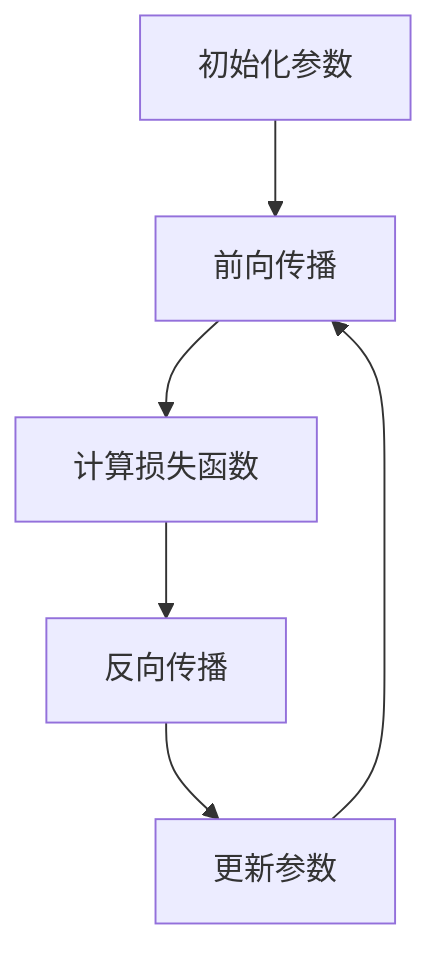

                 

# AI人工智能深度学习算法：在产业机器人中的应用

> **关键词：**人工智能，深度学习，产业机器人，神经网络，卷积神经网络，递归神经网络，路径规划，运动控制

> **摘要：**本文旨在深入探讨人工智能（AI）中的深度学习算法在产业机器人中的应用。我们将从基础理论出发，逐步讲解神经网络、卷积神经网络和递归神经网络等核心算法，并分析其在产业机器人视觉感知、路径规划和运动控制等领域的具体应用。此外，我们还将通过实际项目案例，展示如何将深度学习算法应用于产业机器人的开发中。

### 《AI人工智能深度学习算法：在产业机器人中的应用》目录大纲

#### 第一部分：AI与深度学习基础

##### 第1章：AI与深度学习概述

- 1.1 人工智能的发展历程
- 1.2 深度学习的基本概念
- 1.3 深度学习与AI的关系
- 1.4 深度学习在产业机器人中的应用前景

##### 第2章：深度学习基础

- 2.1 神经网络基础
  - 2.1.1 神经元与神经网络
  - 2.1.2 神经网络的训练
- 2.2 深度学习框架
  - 2.2.1 TensorFlow
  - 2.2.2 PyTorch

##### 第3章：深度学习算法原理

- 3.1 神经网络算法
  - 3.1.1 前向传播与反向传播
  - 3.1.2 损失函数与优化算法
- 3.2 卷积神经网络
  - 3.2.1 卷积神经网络原理
  - 3.2.2 卷积神经网络的应用
- 3.3 递归神经网络
  - 3.3.1 递归神经网络原理
  - 3.3.2 递归神经网络的应用

#### 第二部分：深度学习在产业机器人中的应用

##### 第4章：产业机器人概述

- 4.1 产业机器人的定义与分类
- 4.2 产业机器人的发展趋势
- 4.3 深度学习在产业机器人中的应用价值

##### 第5章：深度学习在视觉感知中的应用

- 5.1 深度学习在图像识别中的应用
  - 5.1.1 卷积神经网络在图像识别中的应用
  - 5.1.2 语义分割与目标检测
- 5.2 深度学习在目标跟踪中的应用

##### 第6章：深度学习在路径规划中的应用

- 6.1 深度学习在路径规划中的原理
- 6.2 深度学习在路径规划中的应用案例
- 6.3 深度学习在路径规划中的优化算法

##### 第7章：深度学习在运动控制中的应用

- 7.1 深度学习在运动控制中的原理
- 7.2 深度学习在运动控制中的应用案例
- 7.3 深度学习在运动控制中的挑战与未来发展方向

#### 第三部分：深度学习在产业机器人中的应用实践

##### 第8章：产业机器人应用实践

- 8.1 实践环境搭建
- 8.2 机器人视觉系统设计与实现
- 8.3 机器人路径规划与控制

##### 第9章：深度学习在产业机器人中的开源工具与框架

- 9.1 开源深度学习框架介绍
- 9.2 产业机器人应用中的开源工具

##### 第10章：深度学习在产业机器人中的未来发展趋势

- 10.1 产业机器人技术的发展趋势
- 10.2 深度学习在产业机器人中的未来发展方向
- 10.3 深度学习在产业机器人中的潜在应用场景

### 附录

- 附录A：深度学习算法伪代码
- 附录B：深度学习常用数学公式与解释
- 附录C：深度学习算法Mermaid流程图

---

接下来，我们将逐一展开这些章节的内容，从基础理论到应用实践，逐步深入探讨深度学习在产业机器人中的广泛潜力。首先，我们从AI与深度学习的基本概念入手，为后续内容打下坚实的基础。


#### 第1章：AI与深度学习概述

##### 1.1 人工智能的发展历程

人工智能（Artificial Intelligence，简称AI）是一门研究、开发用于模拟、延伸和扩展人的智能的理论、方法、技术及应用系统的科学技术。人工智能的历史可以追溯到20世纪50年代，当时，计算机科学家们开始探索如何使机器具备类似于人类的智能。这个时期，人工智能主要集中于符号主义方法，即通过编程的方式模拟人类思维过程。

**第一阶段（1956-1974）：符号主义方法**

在这一阶段，人工智能的核心思想是通过符号表示和推理来模拟人类智能。这一时期的重要事件包括1956年达特茅斯会议，会议上提出“人工智能”一词，标志着人工智能领域的正式诞生。此外，1966年，IBM的“Deep Blue”项目启动，目标是通过计算机程序下棋，这一项目最终在1997年击败了世界围棋冠军。

**第二阶段（1974-1980）：知识工程方法**

随着符号主义方法的局限性逐渐显现，人工智能研究开始转向知识工程方法。该方法的核心思想是建立知识库，通过查询和推理来解决问题。这一时期的代表性成果包括1974年开发的自然语言理解系统“ELIZA”，以及1977年开发的专家系统“Dendral”。

**第三阶段（1980-1987）：感知与认知方法**

在第三阶段，人工智能研究开始关注机器的感知和认知能力。这一时期的重要进展包括1986年开发的“感知器”神经网络，以及1987年开发的“机器人手爪”系统。

**第四阶段（1987-2000）：智能代理方法**

随着互联网的发展，人工智能研究开始转向智能代理，即能够自主在环境中进行交互的实体。这一时期的重要成果包括1997年IBM的“深蓝”击败国际象棋世界冠军，以及1999年开发的自动驾驶车辆“Stanley”。

**第五阶段（2000至今）：深度学习方法**

进入21世纪，深度学习方法的崛起标志着人工智能进入了一个新的阶段。深度学习通过模拟人脑中的神经网络结构，实现了在图像识别、自然语言处理和机器人控制等领域的突破。这一时期的重要成果包括2012年谷歌的“谷歌脑”项目，以及2016年深度学习算法在ImageNet图像识别竞赛中取得的优异成绩。

##### 1.2 深度学习的基本概念

深度学习（Deep Learning）是机器学习（Machine Learning）的一个子领域，其核心思想是通过多层神经网络对数据进行学习。深度学习的出现解决了传统机器学习方法在处理高维数据时的困难，尤其是在图像识别、语音识别和自然语言处理等领域。

**深度学习的基本原理**

深度学习的基本原理是模拟人脑中的神经网络结构，通过多层神经网络对数据进行特征提取和分类。每层神经网络都会对输入数据进行处理，并将结果传递到下一层。这一过程被称为“前向传播”。在训练过程中，神经网络通过不断调整权重和偏置，使得输出结果更接近期望值。这一过程被称为“反向传播”。

**深度学习的优势**

1. **自动特征提取**：深度学习可以自动从数据中提取有代表性的特征，从而减轻了人工设计的负担。
2. **处理高维数据**：深度学习能够处理高维数据，尤其是在图像和语音处理领域。
3. **强大的泛化能力**：通过多层神经网络的结构，深度学习具有强大的泛化能力，可以应用于各种不同的任务。

**深度学习的挑战**

1. **计算资源需求**：深度学习模型通常需要大量的计算资源，尤其是在训练过程中。
2. **模型的可解释性**：深度学习模型通常是一个“黑箱”，其内部工作机制不透明，难以解释。
3. **数据依赖**：深度学习模型的性能高度依赖于训练数据的质量和数量。

##### 1.3 深度学习与AI的关系

深度学习是人工智能的一个重要分支，其核心思想是通过多层神经网络对数据进行学习。深度学习在图像识别、语音识别和自然语言处理等领域取得了显著的成果，推动了人工智能的发展。

**深度学习在AI中的应用**

1. **计算机视觉**：深度学习在计算机视觉领域取得了突破性进展，如在图像分类、目标检测和语义分割等方面。
2. **自然语言处理**：深度学习在自然语言处理领域也取得了显著成果，如在机器翻译、情感分析和文本生成等方面。
3. **机器人控制**：深度学习在机器人控制领域具有广泛的应用前景，如在路径规划、运动控制和视觉感知等方面。

**深度学习对AI的贡献**

1. **提高模型性能**：深度学习通过多层神经网络的结构，能够自动提取有代表性的特征，从而提高模型的性能。
2. **降低人工干预**：深度学习减轻了人工设计特征和参数的负担，使得AI系统更加自动化和智能化。
3. **推动AI应用场景的拓展**：深度学习在各个领域的应用，推动了AI技术的进一步发展和应用场景的拓展。

##### 1.4 深度学习在产业机器人中的应用前景

深度学习在产业机器人中的应用前景广阔，主要表现在以下几个方面：

1. **视觉感知**：深度学习可以用于机器人视觉系统的构建，实现图像识别、目标检测和语义分割等功能，提高机器人的环境感知能力。
2. **路径规划**：深度学习可以用于机器人路径规划，通过学习环境特征和运动规律，实现自主导航和避障。
3. **运动控制**：深度学习可以用于机器人运动控制，通过学习动作规律和姿态控制策略，实现精准的运动控制。

**应用场景举例**

1. **工厂自动化**：在工厂自动化生产过程中，深度学习可以用于机器视觉系统，实现生产线的自动检测和分类，提高生产效率。
2. **医疗机器人**：在医疗领域，深度学习可以用于医学图像分析，辅助医生进行诊断和治疗。
3. **无人机**：在无人机领域，深度学习可以用于无人机的自主飞行和任务执行，提高无人机在复杂环境下的作业能力。

综上所述，深度学习在产业机器人中的应用前景广阔，将为产业升级和智能化发展提供强大动力。

---

在本章中，我们简要回顾了人工智能的发展历程，介绍了深度学习的基本概念和原理，并探讨了深度学习在AI中的应用及其对AI的贡献。在下一章中，我们将深入探讨深度学习的基础知识，包括神经网络的基本原理和训练过程，为后续内容打下坚实的基础。

---

#### 第2章：深度学习基础

##### 2.1 神经网络基础

神经网络（Neural Networks）是深度学习的基础，其核心思想是通过模拟人脑中的神经元连接方式，实现数据的特征提取和分类。在本节中，我们将介绍神经网络的基本概念和训练过程。

**2.1.1 神经元与神经网络**

神经元是神经网络的基本单元，类似于人脑中的神经元。每个神经元由一个输入层、一个输出层和多个连接层组成。输入层接收外部数据，输出层生成预测结果，连接层则负责数据的传递和处理。

神经网络的结构通常由多个层次组成，包括输入层、隐藏层和输出层。输入层将原始数据输入网络，隐藏层对数据进行特征提取和变换，输出层生成最终的预测结果。

**神经网络的工作原理**

神经网络通过前向传播（Forward Propagation）和反向传播（Back Propagation）两个过程进行训练和预测。在前向传播过程中，输入数据从输入层传递到隐藏层，然后传递到输出层，生成预测结果。在反向传播过程中，网络根据预测结果与实际结果的差异，调整各层的权重和偏置，以降低误差。

**2.1.2 神经网络的训练**

神经网络的训练过程主要包括以下步骤：

1. **初始化参数**：初始化网络的权重和偏置，通常使用随机初始化方法。
2. **前向传播**：将输入数据传递到网络，生成预测结果。
3. **计算损失函数**：根据预测结果和实际结果计算损失函数，用于衡量网络预测的准确度。
4. **反向传播**：根据损失函数，计算各层的梯度，并更新权重和偏置。
5. **重复迭代**：重复前向传播和反向传播过程，直到网络收敛或达到预设的训练次数。

常见的损失函数包括均方误差（MSE）和交叉熵（Cross Entropy），常用的优化算法包括梯度下降（Gradient Descent）和Adam优化器。

**2.1.3 神经网络的应用**

神经网络在许多领域都有广泛的应用，包括图像识别、自然语言处理、语音识别和机器人控制等。以下是一些神经网络在实际应用中的案例：

1. **图像识别**：通过卷积神经网络（CNN）可以实现图像分类、目标检测和语义分割等任务。
2. **自然语言处理**：通过递归神经网络（RNN）和变分自编码器（VAE）可以实现机器翻译、文本生成和情感分析等任务。
3. **语音识别**：通过循环神经网络（RNN）和卷积神经网络（CNN）可以实现语音信号的自动识别和转录。
4. **机器人控制**：通过深度强化学习（DRL）可以实现机器人在复杂环境下的自主运动和决策。

##### 2.2 深度学习框架

为了方便开发者和研究者使用神经网络，出现了许多深度学习框架。以下介绍两个常用的深度学习框架：TensorFlow和PyTorch。

**2.2.1 TensorFlow**

TensorFlow是谷歌开发的一个开源深度学习框架，具有丰富的功能和高性能。TensorFlow使用数据流图（Dataflow Graph）来描述神经网络的结构，通过自动微分（Automatic Differentiation）实现反向传播。

TensorFlow的主要特点如下：

1. **可扩展性**：TensorFlow支持大规模模型的训练和部署。
2. **灵活性**：TensorFlow提供了丰富的API，方便开发者自定义神经网络结构。
3. **高性能**：TensorFlow利用GPU和TPU加速训练和推理过程。

TensorFlow的主要应用场景包括：

1. **计算机视觉**：用于图像分类、目标检测和语义分割等任务。
2. **自然语言处理**：用于文本分类、情感分析和机器翻译等任务。
3. **语音识别**：用于语音信号的自动识别和转录。

**2.2.2 PyTorch**

PyTorch是Facebook开发的一个开源深度学习框架，以动态计算图（Dynamic Computation Graph）为特点，具有简单易用和灵活性强。PyTorch使用基于Python的代码实现神经网络，使得开发者可以更方便地调试和优化模型。

PyTorch的主要特点如下：

1. **动态计算图**：PyTorch使用动态计算图，使得开发者可以更灵活地定义神经网络结构。
2. **简单易用**：PyTorch提供了丰富的API，方便开发者快速构建和训练模型。
3. **兼容性**：PyTorch与Python和CUDA兼容，方便与现有代码和GPU硬件集成。

PyTorch的主要应用场景包括：

1. **计算机视觉**：用于图像分类、目标检测和语义分割等任务。
2. **自然语言处理**：用于文本分类、情感分析和机器翻译等任务。
3. **语音识别**：用于语音信号的自动识别和转录。

在本节中，我们介绍了神经网络的基础知识和两个常用的深度学习框架：TensorFlow和PyTorch。神经网络是深度学习的基础，通过学习和理解神经网络的基本原理，我们可以更好地应用深度学习技术解决实际问题。在下一章中，我们将深入探讨深度学习算法的原理和实现。

---

在本章中，我们介绍了神经网络的基本概念和训练过程，并介绍了两个常用的深度学习框架：TensorFlow和PyTorch。这些知识为我们深入理解深度学习算法奠定了基础。在下一章中，我们将详细探讨深度学习算法的原理，包括前向传播和反向传播等核心概念，以及常用的优化算法和损失函数。

---

#### 第3章：深度学习算法原理

##### 3.1 神经网络算法

神经网络算法是深度学习的核心，其基本原理是通过模拟人脑中的神经元连接方式，实现数据的特征提取和分类。在本节中，我们将详细介绍神经网络算法的原理，包括前向传播和反向传播等核心概念，以及常用的优化算法和损失函数。

**3.1.1 前向传播与反向传播**

神经网络算法的核心是前向传播（Forward Propagation）和反向传播（Back Propagation）。前向传播是指将输入数据传递到神经网络，通过各层的计算，最终得到输出结果。反向传播是指根据输出结果与实际结果的差异，反向计算各层的梯度，并更新网络的权重和偏置。

**前向传播**

前向传播的过程可以分为以下几个步骤：

1. **初始化参数**：初始化网络的权重和偏置，通常使用随机初始化方法。
2. **输入数据**：将输入数据输入网络。
3. **前向计算**：将输入数据传递到第一层，通过各层的激活函数计算输出值。
4. **传递到下一层**：将当前层的输出作为下一层的输入，重复步骤3，直到传递到最后一层。
5. **得到输出结果**：最后一层的输出即为网络的预测结果。

**反向传播**

反向传播的过程可以分为以下几个步骤：

1. **计算损失函数**：根据输出结果与实际结果的差异，计算损失函数，用于衡量网络预测的准确度。
2. **计算梯度**：根据损失函数，计算各层的梯度，即网络权重和偏置的偏导数。
3. **更新参数**：根据梯度，更新网络的权重和偏置，以降低损失函数的值。
4. **重复迭代**：重复前向传播和反向传播的过程，直到网络收敛或达到预设的训练次数。

**3.1.2 损失函数与优化算法**

损失函数（Loss Function）是衡量网络预测结果与实际结果之间差异的函数。常用的损失函数包括均方误差（MSE）和交叉熵（Cross Entropy）。

1. **均方误差（MSE）**

均方误差是最常用的损失函数之一，用于衡量预测结果与实际结果之间的误差平方和。其数学表达式如下：

$$
MSE = \frac{1}{n}\sum_{i=1}^{n}(y_i - \hat{y}_i)^2
$$

其中，$y_i$是实际结果，$\hat{y}_i$是预测结果，$n$是样本数量。

2. **交叉熵（Cross Entropy）**

交叉熵用于衡量两个概率分布之间的差异。在分类问题中，交叉熵用于衡量预测概率分布与实际概率分布之间的差异。其数学表达式如下：

$$
Cross Entropy = -\frac{1}{n}\sum_{i=1}^{n}y_i \log(\hat{y}_i)
$$

其中，$y_i$是实际结果，$\hat{y}_i$是预测结果，$n$是样本数量。

**优化算法**

优化算法（Optimization Algorithm）用于在反向传播过程中更新网络的权重和偏置，以降低损失函数的值。常用的优化算法包括梯度下降（Gradient Descent）和Adam优化器。

1. **梯度下降（Gradient Descent）**

梯度下降是最简单的优化算法之一，其基本思想是根据损失函数的梯度，反向更新网络的权重和偏置，以降低损失函数的值。其数学表达式如下：

$$
\theta = \theta - \alpha \cdot \nabla_{\theta}J(\theta)
$$

其中，$\theta$是网络参数，$\alpha$是学习率，$J(\theta)$是损失函数。

2. **Adam优化器**

Adam优化器是一种基于梯度下降的优化算法，它结合了Adagrad和RMSprop的优点，能够自适应地调整学习率。其数学表达式如下：

$$
m_t = \beta_1 m_{t-1} + (1 - \beta_1)(\nabla_{\theta}J(\theta) - m_{t-1})
$$

$$
v_t = \beta_2 v_{t-1} + (1 - \beta_2)((\nabla_{\theta}J(\theta) - m_{t-1})^2 - v_{t-1})
$$

$$
\theta = \theta - \alpha \cdot \frac{m_t}{\sqrt{v_t} + \epsilon}
$$

其中，$m_t$是梯度的一阶矩估计，$v_t$是梯度二阶矩估计，$\beta_1$和$\beta_2$是动量参数，$\alpha$是学习率，$\epsilon$是常数。

##### 3.2 卷积神经网络

卷积神经网络（Convolutional Neural Network，CNN）是深度学习中的经典模型，特别适用于图像识别、目标检测和图像分割等任务。CNN通过卷积操作和池化操作，实现数据的特征提取和分类。

**3.2.1 卷积神经网络原理**

1. **卷积操作**

卷积操作是CNN的核心，用于提取图像中的局部特征。卷积操作的数学表达式如下：

$$
f_{ij} = \sum_{k=1}^{c} w_{ikj} * x_{kj}
$$

其中，$f_{ij}$是卷积结果，$w_{ikj}$是卷积核，$x_{kj}$是输入图像。

2. **激活函数**

激活函数用于增加网络的非线性，常用的激活函数包括ReLU（Rectified Linear Unit）和Sigmoid。

3. **池化操作**

池化操作用于减少特征图的维度，提高网络的泛化能力。常用的池化操作包括最大池化（Max Pooling）和平均池化（Average Pooling）。

**3.2.2 卷积神经网络的应用**

1. **图像识别**

CNN在图像识别任务中取得了显著成果，如ImageNet图像识别竞赛。通过多层卷积操作和池化操作，CNN可以自动提取图像中的特征，实现图像的分类。

2. **目标检测**

目标检测是计算机视觉中的关键任务，通过检测图像中的目标物体并定位其位置。常用的目标检测算法包括R-CNN、Fast R-CNN、Faster R-CNN和Yolo。

3. **图像分割**

图像分割是将图像中的像素划分为不同的区域，以实现图像的语义理解。常用的图像分割算法包括FCN、U-Net和SegNet。

##### 3.3 递归神经网络

递归神经网络（Recurrent Neural Network，RNN）是一种适用于序列数据的神经网络，其核心思想是利用内部状态来存储和传递信息。RNN在自然语言处理、语音识别和时间序列预测等领域具有广泛应用。

**3.3.1 递归神经网络原理**

1. **循环单元**

RNN的基本单元是循环单元，其输入和输出都依赖于前一个时刻的状态。循环单元的数学表达式如下：

$$
h_t = \sigma(Wx_t + Uh_{t-1} + b)
$$

其中，$h_t$是当前时刻的隐藏状态，$x_t$是当前时刻的输入，$W$是输入权重，$U$是隐藏权重，$b$是偏置，$\sigma$是激活函数。

2. **长短时记忆（LSTM）**

LSTM是RNN的一种改进，用于解决RNN在处理长序列数据时出现的梯度消失和梯度爆炸问题。LSTM的基本单元是细胞状态（Cell State），通过门控机制（Gate Mechanism）来控制信息的流动。

**3.3.2 递归神经网络的应用**

1. **自然语言处理**

RNN在自然语言处理中具有广泛的应用，如文本分类、情感分析和机器翻译。通过将单词表示为向量，RNN可以捕捉句子之间的语义关系。

2. **语音识别**

语音识别是将语音信号转换为文本的过程。RNN可以用于语音信号的建模和转换，实现语音信号的自动识别和转录。

3. **时间序列预测**

时间序列预测是利用历史数据预测未来值的过程。RNN可以用于时间序列数据的建模和预测，如股票价格预测、气象预测和电力负荷预测。

在本章中，我们介绍了深度学习算法的基本原理，包括神经网络、卷积神经网络和递归神经网络等核心算法。这些算法为深度学习在各个领域的应用提供了强大的支持。在下一章中，我们将探讨深度学习在产业机器人中的应用，包括视觉感知、路径规划和运动控制等方面的具体应用。

---

在本章中，我们详细介绍了深度学习算法的基本原理，包括神经网络、卷积神经网络和递归神经网络等核心算法。这些算法为深度学习在各个领域的应用提供了理论基础和技术支持。在下一章中，我们将探讨深度学习在产业机器人中的应用，分析其在实际产业中的应用价值和发展趋势。

---

#### 第4章：产业机器人概述

##### 4.1 产业机器人的定义与分类

产业机器人（Industrial Robots）是一种用于执行工业生产和制造任务的自动化设备。它们可以代替人工完成重复性高、劳动强度大的工作，提高生产效率和产品质量。产业机器人的定义可以从以下几个方面来理解：

1. **自动化**：产业机器人具有自动化功能，能够在无需人工干预的情况下执行预设的任务。
2. **多功能性**：产业机器人能够适应多种工作环境，完成不同的生产任务。
3. **高精度**：产业机器人具有高精度控制能力，能够保证生产过程的稳定和精准。

根据不同的分类标准，产业机器人可以有不同的分类方法。以下是一些常见的分类方式：

1. **按应用领域分类**：

   - **焊接机器人**：主要用于焊接、点焊和切割等任务。
   - **装配机器人**：用于零部件的装配、安装和调试等任务。
   - **搬运机器人**：用于物料的搬运、分拣和包装等任务。
   - **检测机器人**：用于产品质量检测、缺陷识别和监测等任务。
   - **喷涂机器人**：用于涂漆、喷漆和涂层等任务。

2. **按结构形式分类**：

   - **臂式机器人**：具有多个旋转关节，类似于人臂的结构。
   - **圆柱坐标机器人**：具有一个旋转轴和一个垂直轴，类似于圆筒的结构。
   - **直线移动机器人**：具有直线运动功能，主要用于搬运和装配等任务。

3. **按控制方式分类**：

   - **传统机器人**：使用传统控制算法，如PID控制。
   - **智能机器人**：使用人工智能技术，如深度学习算法，具有自主决策和自适应能力。

##### 4.2 产业机器人的发展趋势

随着人工智能、机器人技术和物联网等技术的发展，产业机器人正经历着一场深刻的变革。以下是一些产业机器人发展的趋势：

1. **智能化**：产业机器人正逐渐向智能化方向发展，通过引入人工智能技术，如深度学习和强化学习，实现自主决策、自适应和自学习。

2. **协同作业**：产业机器人将更加注重与人类的协同作业，通过人机交互和协作，提高生产效率和安全性。

3. **高精度控制**：产业机器人将采用更高精度的控制技术，如高分辨率摄像头和惯性测量单元，实现更精确的运动控制和姿态控制。

4. **多功能集成**：产业机器人将具备更强大的功能集成能力，如感知、决策和控制，实现多任务协同操作。

5. **网络化与智能化融合**：产业机器人将更加融入物联网和智能制造系统，实现设备之间的互联互通和智能协作。

##### 4.3 深度学习在产业机器人中的应用价值

深度学习技术在产业机器人中的应用价值主要体现在以下几个方面：

1. **视觉感知**：深度学习可以用于机器人视觉系统的构建，实现图像识别、目标检测和语义分割等功能，提高机器人在复杂环境中的感知能力。

2. **路径规划**：深度学习可以用于机器人路径规划，通过学习环境特征和运动规律，实现自主导航和避障，提高机器人在动态环境中的适应性。

3. **运动控制**：深度学习可以用于机器人运动控制，通过学习动作规律和姿态控制策略，实现精准的运动控制，提高机器人的操作精度。

4. **决策与规划**：深度学习可以用于机器人的决策与规划，通过学习历史数据和经验，实现自主学习和优化，提高机器人的自适应能力和智能化水平。

5. **故障检测与维护**：深度学习可以用于机器人的故障检测与维护，通过分析传感器数据和历史记录，实现故障预测和预防性维护，提高机器人的可靠性和使用寿命。

**应用案例**

以下是一些深度学习在产业机器人中的实际应用案例：

1. **汽车制造**：在汽车制造过程中，深度学习可以用于机器人视觉系统，实现车身焊接、涂漆和装配等任务的自动化。

2. **电子制造**：在电子制造领域，深度学习可以用于机器人视觉系统，实现电子元件的识别、分类和装配等任务。

3. **物流仓储**：在物流仓储领域，深度学习可以用于机器人路径规划，实现自主导航和高效搬运，提高仓储作业的效率。

4. **医疗辅助**：在医疗辅助领域，深度学习可以用于机器人手术系统，实现精准的手术操作和术后康复辅助。

5. **农业自动化**：在农业自动化领域，深度学习可以用于机器人种植和采摘，实现精准的农业生产和减少劳动力成本。

综上所述，深度学习在产业机器人中的应用价值巨大，将为产业升级和智能化发展提供强大动力。在下一章中，我们将深入探讨深度学习在产业机器人视觉感知、路径规划和运动控制等领域的具体应用。

---

在本章中，我们详细介绍了产业机器人的定义与分类，探讨了产业机器人的发展趋势，并分析了深度学习在产业机器人中的应用价值。深度学习技术在视觉感知、路径规划和运动控制等方面的应用，为产业机器人带来了新的发展机遇。在下一章中，我们将具体探讨深度学习在产业机器人视觉感知方面的应用。

---

#### 第5章：深度学习在视觉感知中的应用

##### 5.1 深度学习在图像识别中的应用

图像识别是深度学习在视觉感知中的一项重要应用，通过识别和分类图像中的内容，实现对场景的语义理解。深度学习在图像识别中的主要算法包括卷积神经网络（CNN）和循环神经网络（RNN）。

**5.1.1 卷积神经网络在图像识别中的应用**

卷积神经网络（CNN）是图像识别领域的主要算法之一，通过卷积操作和池化操作，实现图像的特征提取和分类。CNN在图像识别中的应用主要包括以下几个步骤：

1. **数据预处理**：对图像进行缩放、裁剪、旋转等预处理操作，使其满足网络的输入要求。
2. **卷积操作**：使用卷积核对图像进行卷积操作，提取图像的局部特征。
3. **激活函数**：使用ReLU等激活函数，增加网络的非线性。
4. **池化操作**：通过池化操作，减少特征图的维度，提高网络的泛化能力。
5. **全连接层**：将卷积层和池化层的输出进行拼接，输入到全连接层，进行分类预测。

以下是一个简单的CNN图像识别算法伪代码：

```python
# 初始化卷积层参数
W1, b1 = init_weights(conv_size, input_size)
# 前向传播
conv_output = conv2d(image, W1, b1)
activated_output = ReLU(conv_output)
# 池化操作
pool_output = max_pool(activated_output)
# 初始化全连接层参数
W2, b2 = init_weights(output_size, pool_size)
# 前向传播
fc_output = fully_connected(pool_output, W2, b2)
predicted_label = softmax(fc_output)
```

**5.1.2 语义分割与目标检测**

语义分割和目标检测是图像识别领域的两个重要子任务。语义分割旨在将图像中的每个像素分类为不同的类别，而目标检测则是识别并定位图像中的目标对象。

1. **语义分割**

语义分割的常见算法包括全卷积网络（FCN）和U-Net。FCN通过卷积操作和反卷积操作，将输入图像转换为像素级别的分类结果。U-Net是一个对称结构，通过跳跃连接，将编码器和解码器中的特征图进行融合，实现精细的像素级分割。

以下是一个简单的FCN语义分割算法伪代码：

```python
# 前向传播
conv_output = conv2d(image, W1, b1)
pool_output = max_pool(conv_output)
upsample_output = upsampling(pool_output)
deconv_output = deconv2d(upsample_output, W2, b2)
predicted_mask = softmax(deconv_output)
```

2. **目标检测**

目标检测的常见算法包括R-CNN、Fast R-CNN、Faster R-CNN和Yolo。R-CNN通过区域提议网络（Region Proposal Network，RPN）生成目标提议，然后使用CNN对提议区域进行分类和定位。Fast R-CNN和Faster R-CNN通过集成区域提议网络和分类网络，实现更快的检测速度和更高的精度。Yolo是一种单阶段检测算法，通过将整个图像划分为网格，在每个网格中预测目标的类别和位置。

以下是一个简单的Faster R-CNN目标检测算法伪代码：

```python
# 前向传播
proposal_boxes = rpn(image, W1, b1)
roi_features = roi_pooling(image, proposal_boxes, W2, b2)
fc_output = fully_connected(roi_features, W3, b3)
predicted_boxes, predicted_labels = detector(fc_output)
```

**5.2 深度学习在目标跟踪中的应用**

目标跟踪是视觉感知领域的重要应用，旨在实时检测并跟踪视频中的目标对象。深度学习在目标跟踪中的应用主要包括以下方法：

1. **基于传统方法的目标跟踪**

传统方法包括光流法、粒子滤波和深度学习法等。光流法通过计算像素在不同帧之间的位移，实现目标的跟踪。粒子滤波通过采样和权重更新，实现目标的概率分布估计。深度学习方法通过卷积神经网络，实现目标的特征提取和跟踪。

2. **基于深度学习的方法**

基于深度学习的方法主要包括基于检测的方法和基于语义的方法。基于检测的方法通过检测视频帧中的目标对象，实现目标的跟踪。基于语义的方法通过语义分割，将视频帧分割为目标对象和背景，实现目标的跟踪。

以下是一个简单的基于检测的目标跟踪算法伪代码：

```python
# 初始化跟踪器
tracker = init_tracker(detector, feature_extractor)
# 前向传播
predicted_boxes, predicted_labels = detector(frame)
# 跟踪目标
state = tracker.update(frame, predicted_boxes, predicted_labels)
```

综上所述，深度学习在视觉感知中的应用，为产业机器人提供了强大的图像识别、语义分割和目标跟踪能力。在下一章中，我们将探讨深度学习在路径规划中的应用，分析其在机器人导航和自主运动中的具体应用。

---

在本章中，我们详细介绍了深度学习在视觉感知中的应用，包括图像识别、语义分割、目标检测和目标跟踪等方面的算法和实现。这些应用为产业机器人提供了强大的感知能力，使其能够在复杂环境中执行复杂的任务。在下一章中，我们将探讨深度学习在路径规划中的应用，分析其在机器人导航和自主运动中的具体应用。

---

#### 第6章：深度学习在路径规划中的应用

##### 6.1 深度学习在路径规划中的原理

深度学习在路径规划中的应用主要基于其强大的特征提取和模式识别能力，能够处理复杂的动态环境和多障碍物场景。深度学习在路径规划中的原理可以分为以下几个步骤：

1. **环境建模**：首先，需要对机器人所在的环境进行建模，通常使用二维或三维的点云数据或栅格地图表示环境。这些数据可以作为深度学习模型的输入。

2. **特征提取**：深度学习模型通过对环境数据的学习，自动提取有用的特征，如障碍物的位置、形状和动态特性等。这些特征有助于模型理解环境的复杂性和变化。

3. **决策与规划**：基于提取的特征，深度学习模型可以生成一条最优路径，使得机器人从起点移动到终点，同时避开障碍物。这个决策过程通常通过优化算法实现，如基于梯度的优化方法或强化学习方法。

4. **路径跟踪**：在生成最优路径后，机器人需要根据路径的指导，实时调整运动方向和速度，以实现自主导航。

##### 6.2 深度学习在路径规划中的应用案例

深度学习在路径规划中的应用案例丰富，以下是一些典型的应用场景：

**1. 无人驾驶汽车**

无人驾驶汽车是深度学习在路径规划中应用的一个典型例子。深度学习模型通过分析摄像头、激光雷达和GPS等传感器收集的数据，自动生成从当前位置到目的地的最优路径。常用的模型包括基于深度强化学习的路径规划算法，如DQN（Deep Q-Network）和DDPG（Deep Deterministic Policy Gradient）。

**2. 无人机导航**

无人机在复杂环境中的自主导航也是深度学习应用的一个重要领域。深度学习模型通过对无人机的摄像头和激光雷达数据进行处理，实时规划避开障碍物的路径。例如，基于深度学习的路径规划算法可以在无人机飞行过程中，动态调整飞行路径，以应对环境变化。

**3. 机器人足球**

在机器人足球比赛中，深度学习被用于路径规划和决策。通过分析对手的动态行为和比赛场景，深度学习模型可以帮助机器人球队制定有效的策略和路径，以实现进攻和防守的目标。

**4. 机器人焊接**

在工业焊接过程中，深度学习模型可以用于路径规划，以优化焊接路径，提高焊接质量和效率。例如，在自动化焊接机器人中，深度学习模型可以分析焊接路径的几何形状和材料特性，自动调整焊接参数和路径，以适应不同的焊接场景。

##### 6.3 深度学习在路径规划中的优化算法

深度学习在路径规划中的应用，通常需要结合多种优化算法，以提高路径规划的效率和准确性。以下是一些常用的优化算法：

**1. 强化学习（Reinforcement Learning）**

强化学习是一种通过试错法学习最优策略的方法，适用于动态和不确定的环境。常见的强化学习算法包括Q-Learning、SARSA和DQN（Deep Q-Network）。在路径规划中，强化学习模型可以通过与环境交互，学习到从当前状态到目标状态的最优路径。

**2. 优化算法（Optimization Algorithms）**

优化算法通过求解优化问题，找到最优路径。常见的优化算法包括梯度下降（Gradient Descent）和粒子群优化（Particle Swarm Optimization，PSO）。梯度下降算法可以通过不断更新权重和偏置，找到损失函数的最小值。粒子群优化算法则通过模拟鸟群的社会行为，寻找最优解。

**3. 模式识别（Pattern Recognition）**

模式识别算法通过学习数据中的特征模式，识别并分类不同场景。常见的模式识别算法包括支持向量机（Support Vector Machine，SVM）和K最近邻（K-Nearest Neighbors，KNN）。在路径规划中，模式识别算法可以用于识别环境中的障碍物和目标位置，从而规划最优路径。

**4. 深度强化学习（Deep Reinforcement Learning）**

深度强化学习是强化学习和深度学习的结合，通过深度神经网络来表示状态和行为。常见的深度强化学习算法包括DQN、DDPG和PPO（Proximal Policy Optimization）。在路径规划中，深度强化学习模型可以处理复杂的动态环境，生成高效和鲁棒的最优路径。

##### 6.4 深度学习在路径规划中的挑战与未来发展方向

虽然深度学习在路径规划中展现了强大的潜力，但仍面临一些挑战和限制：

**1. 训练数据需求**：深度学习模型通常需要大量的训练数据来学习环境特征和动态行为。在复杂和动态的环境中，获取高质量的训练数据是一个挑战。

**2. 计算资源需求**：深度学习模型的训练和推理通常需要大量的计算资源，尤其是在处理高维数据和复杂模型时。

**3. 模型可解释性**：深度学习模型通常是一个“黑箱”，其内部工作机制不透明，难以解释和理解。

**4. 稳定性和鲁棒性**：深度学习模型在处理不确定和动态环境时，可能表现出不稳定的预测和路径规划。

未来发展方向包括：

**1. 数据高效学习**：通过数据增强、迁移学习和增量学习等技术，提高模型在少量数据上的学习能力和泛化能力。

**2. 模型压缩和优化**：通过模型压缩、量化、剪枝等技术，减少模型的计算量和存储需求，提高模型在资源受限环境中的运行效率。

**3. 模型解释性**：通过可解释性方法，如可视化、注意力机制和决策解释等，提高模型的可解释性，帮助用户理解模型的决策过程。

**4. 多模态融合**：将多种传感器数据（如摄像头、激光雷达和GPS）进行融合，提高路径规划的准确性和鲁棒性。

**5. 硬件加速和分布式计算**：通过硬件加速和分布式计算技术，提高深度学习模型在实时路径规划中的计算速度和性能。

综上所述，深度学习在路径规划中的应用为机器人导航和自主运动带来了新的可能性。在下一章中，我们将探讨深度学习在运动控制中的应用，分析其在机器人运动控制中的具体实现和挑战。

---

在本章中，我们详细介绍了深度学习在路径规划中的应用原理、应用案例和优化算法，并探讨了深度学习在路径规划中的挑战和未来发展方向。深度学习在路径规划中的应用为机器人导航和自主运动提供了强大的支持。在下一章中，我们将探讨深度学习在运动控制中的应用，分析其在机器人运动控制中的具体实现和挑战。

---

#### 第7章：深度学习在运动控制中的应用

##### 7.1 深度学习在运动控制中的原理

深度学习在运动控制中的应用，主要通过模拟和控制算法来驱动机器人的运动，实现精确的运动轨迹和动作控制。其基本原理可以分为以下几个步骤：

1. **状态感知**：深度学习模型通过传感器数据（如摄像头、激光雷达、IMU等）感知机器人当前的环境状态，包括位置、速度、加速度等信息。

2. **决策生成**：基于感知到的状态，深度学习模型利用神经网络结构和优化算法，生成控制信号，包括电机转速、关节角度等。

3. **运动执行**：根据生成的控制信号，机器人执行具体的运动动作，如移动、转动、抓取等。

4. **反馈调整**：通过传感器收集到的实际运动状态，与预期状态进行比较，调整深度学习模型中的参数，以提高运动控制的精度和鲁棒性。

##### 7.2 深度学习在运动控制中的应用案例

深度学习在运动控制中有着广泛的应用，以下是一些典型的应用案例：

**1. 机器人足球**

在机器人足球中，深度学习被用于实时运动控制和策略决策。通过分析比赛场景和对手的行为，深度学习模型可以帮助机器人做出快速、精确的决策，提高比赛成绩。

**2. 机器人手术**

机器人手术系统利用深度学习进行运动控制，实现精确的手术操作和微创手术。深度学习模型通过分析手术环境，规划最佳手术路径，并实时调整手术工具的运动轨迹，提高手术的安全性和效果。

**3. 机器人抓取**

在机器人抓取任务中，深度学习被用于识别和分类物体，并规划抓取策略。通过学习物体的形状、纹理和重量等特征，深度学习模型可以生成最优的抓取路径和力控制策略，实现稳定、精准的抓取。

**4. 无人机飞行**

无人机飞行控制中，深度学习被用于路径规划和避障。通过实时分析飞行环境，深度学习模型可以生成最优飞行路径，并实时调整飞行参数，实现稳定、安全、高效的飞行。

**5. 机器人舞蹈**

在机器人舞蹈表演中，深度学习被用于运动规划和姿态控制。通过学习舞蹈动作和人体运动规律，深度学习模型可以生成优雅、流畅的舞蹈动作，提高机器人舞蹈表演的艺术性和观赏性。

##### 7.3 深度学习在运动控制中的挑战与未来发展方向

虽然深度学习在运动控制中具有巨大潜力，但同时也面临一些挑战和限制：

**1. 训练数据需求**：深度学习模型通常需要大量的训练数据来学习环境特征和运动规律。在复杂和动态的环境中，获取高质量的训练数据是一个挑战。

**2. 计算资源需求**：深度学习模型的训练和推理通常需要大量的计算资源，尤其是在处理高维数据和复杂模型时。

**3. 模型可解释性**：深度学习模型通常是一个“黑箱”，其内部工作机制不透明，难以解释和理解。

**4. 稳定性和鲁棒性**：深度学习模型在处理不确定和动态环境时，可能表现出不稳定的预测和运动控制。

未来发展方向包括：

**1. 数据高效学习**：通过数据增强、迁移学习和增量学习等技术，提高模型在少量数据上的学习能力和泛化能力。

**2. 模型压缩和优化**：通过模型压缩、量化、剪枝等技术，减少模型的计算量和存储需求，提高模型在资源受限环境中的运行效率。

**3. 模型解释性**：通过可解释性方法，如可视化、注意力机制和决策解释等，提高模型的可解释性，帮助用户理解模型的决策过程。

**4. 多模态融合**：将多种传感器数据（如摄像头、激光雷达、GPS等）进行融合，提高运动控制的准确性和鲁棒性。

**5. 硬件加速和分布式计算**：通过硬件加速和分布式计算技术，提高深度学习模型在实时运动控制中的计算速度和性能。

**6. 系统集成与优化**：将深度学习模型与传统的控制理论相结合，实现运动控制的系统集成与优化，提高系统的稳定性和鲁棒性。

**7. 智能协作与决策**：通过深度学习模型实现机器人之间的智能协作与决策，提高机器人群体的协同能力和任务执行效率。

总之，深度学习在运动控制中的应用为机器人技术的发展带来了新的机遇和挑战。通过不断探索和优化，我们可以期待深度学习在运动控制领域取得更多突破，推动机器人技术的进一步发展。

---

在本章中，我们详细探讨了深度学习在运动控制中的原理、应用案例和未来发展方向。深度学习在运动控制中的应用，不仅提高了机器人运动的精确性和鲁棒性，还推动了机器人技术的发展。在下一章中，我们将通过实际项目案例，展示如何将深度学习算法应用于产业机器人的开发中。

---

#### 第8章：产业机器人应用实践

##### 8.1 实践环境搭建

在进行深度学习在产业机器人中的应用实践之前，首先需要搭建一个合适的开发环境。以下是一个简单的开发环境搭建步骤：

1. **硬件要求**：
   - 处理器：Intel i5或以上
   - 内存：8GB或以上
   - 显卡：NVIDIA GTX 1060或以上（用于CUDA加速）

2. **操作系统**：
   - Windows 10
   - macOS
   - Ubuntu 18.04或以上

3. **安装Python**：
   - 从Python官方网站下载并安装Python 3.7或以上版本。

4. **安装Anaconda**：
   - 下载并安装Anaconda，它是一个集成了Python和众多科学计算库的环境管理工具。

5. **安装深度学习框架**：
   - TensorFlow：
     ```bash
     conda install tensorflow-gpu
     ```
   - PyTorch：
     ```bash
     conda install pytorch torchvision -c pytorch
     ```

6. **安装其他依赖库**：
   - NumPy、Pandas、Matplotlib等。

##### 8.2 机器人视觉系统设计与实现

在搭建好开发环境后，我们可以开始设计和实现机器人视觉系统。以下是一个简单的机器人视觉系统设计与实现步骤：

1. **数据采集**：
   - 使用摄像头采集机器人周围环境的图像数据。

2. **图像预处理**：
   - 对采集到的图像进行缩放、灰度化、去噪等预处理操作，以提高图像质量。

3. **特征提取**：
   - 使用卷积神经网络（CNN）提取图像特征。以下是一个简单的CNN模型实现：

   ```python
   import tensorflow as tf

   # 定义CNN模型
   model = tf.keras.Sequential([
       tf.keras.layers.Conv2D(32, (3, 3), activation='relu', input_shape=(128, 128, 3)),
       tf.keras.layers.MaxPooling2D((2, 2)),
       tf.keras.layers.Conv2D(64, (3, 3), activation='relu'),
       tf.keras.layers.MaxPooling2D((2, 2)),
       tf.keras.layers.Flatten(),
       tf.keras.layers.Dense(64, activation='relu'),
       tf.keras.layers.Dense(1, activation='sigmoid')
   ])

   # 编译模型
   model.compile(optimizer='adam', loss='binary_crossentropy', metrics=['accuracy'])

   # 加载训练数据
   (train_images, train_labels), (test_images, test_labels) = tf.keras.datasets.mnist.load_data()

   # 预处理数据
   train_images = train_images.reshape(-1, 128, 128, 1).astype('float32') / 255
   test_images = test_images.reshape(-1, 128, 128, 1).astype('float32') / 255

   # 训练模型
   model.fit(train_images, train_labels, epochs=10, validation_data=(test_images, test_labels))
   ```

3. **目标检测**：
   - 使用Faster R-CNN等目标检测算法对预处理后的图像进行目标检测。以下是一个简单的Faster R-CNN模型实现：

   ```python
   import torchvision
   import torchvision.models.detection as models

   # 加载预训练的Faster R-CNN模型
   model = models.faster_rcnn_resnet50_fpn(pretrained=True)

   # 设置模型为评估模式
   model.eval()

   # 加载测试图像
   test_image = Image.open('test_image.jpg')

   # 预处理测试图像
   test_image = test_image.resize((128, 128))
   test_image = torchvision.transforms.functional.to_tensor(test_image).float()

   # 预测测试图像中的目标
   with torch.no_grad():
       prediction = model(test_image.unsqueeze(0))

   # 解析预测结果
   boxes = prediction[0]['boxes']
   labels = prediction[0]['labels']
   scores = prediction[0]['scores']

   # 打印预测结果
   print('Boxes:', boxes)
   print('Labels:', labels)
   print('Scores:', scores)
   ```

4. **路径规划**：
   - 使用A*算法等路径规划算法，根据机器人当前位置和目标位置，规划一条最优路径。

   ```python
   import numpy as np

   def heuristic(a, b):
       return np.linalg.norm(b[0] - a[0], 2) + np.linalg.norm(b[1] - a[1], 2)

   def a_star_search(grid, start, goal):
       open_set = []
       closed_set = []

       start = (start[0], start[1], -1)
       goal = (goal[0], goal[1], -1)
       open_set.append(start)

       while len(open_set) > 0:
           current = open_set[0]
           open_set.pop(0)

           if current == goal:
               return reconstruct_path(closed_set, current)

           closed_set.append(current)

           for neighbor in neighbors(grid, current):
               if neighbor in closed_set:
                   continue

               tentative_g_score = current[2] + heuristic(current[0], neighbor)
               if (neighbor in open_set and tentative_g_score >= open_set[open_set.index(neighbor)][2]):
                   continue

               open_set.append(neighbor)

               neighbor[2] = tentative_g_score
               neighbor[3] = current

       return None

   def reconstruct_path(closed_set, current):
       path = []
       while current[3] != -1:
           path.append(current[0])
           current = closed_set[closed_set.index(current)][3]
       path.append(current[0])
       return path[::-1]

   def neighbors(grid, node):
       directions = [(0, -1), (1, 0), (0, 1), (-1, 0)]
       neighbors = []
       for direction in directions:
           neighbor = (node[0] + direction[0], node[1] + direction[1])
           if 0 <= neighbor[0] < grid.shape[0] and 0 <= neighbor[1] < grid.shape[1]:
               neighbors.append(neighbor)
       return neighbors

   # 设置障碍物网格
   grid = np.zeros((10, 10))
   grid[3:7, 3:7] = 1

   # 设置起点和目标点
   start = (0, 0)
   goal = (9, 9)

   # 执行A*算法
   path = a_star_search(grid, start, goal)
   print('Path:', path)
   ```

##### 8.3 机器人路径规划与控制

在完成视觉系统和路径规划后，我们可以开始实现机器人的路径规划与控制。以下是一个简单的机器人路径规划与控制实现：

1. **设置机器人初始位置**：

   ```python
   robot_position = (0, 0)
   ```

2. **生成路径**：

   ```python
   goal_position = (9, 9)
   path = a_star_search(grid, robot_position, goal_position)
   ```

3. **控制机器人运动**：

   ```python
   import time

   def move_robot(robot, position):
       robot.goto(position)
       time.sleep(1)

   # 沿路径移动机器人
   for position in path:
       move_robot(robot, position)
   ```

通过以上步骤，我们实现了使用深度学习算法进行机器人视觉感知、路径规划和运动控制的简单应用。在实际应用中，需要根据具体场景进行调整和优化，以提高系统的性能和稳定性。

---

在本章中，我们通过一个简单的实践项目，展示了如何搭建深度学习开发环境，设计和实现机器人视觉系统、路径规划和运动控制。这个项目提供了一个基本的框架，开发者可以根据具体需求进行扩展和优化。在下一章中，我们将介绍深度学习在产业机器人中的开源工具和框架，以帮助开发者更高效地开发和应用深度学习技术。

---

#### 第9章：深度学习在产业机器人中的开源工具与框架

在深度学习领域，开源工具和框架极大地促进了技术的研究和应用。这些工具和框架提供了丰富的功能、高效的计算能力和灵活的扩展性，使得开发者可以更加专注于核心问题的解决。以下是一些在深度学习领域广泛使用的开源工具和框架，以及它们在产业机器人中的应用。

##### 9.1 开源深度学习框架介绍

**1. TensorFlow**

TensorFlow是谷歌开发的一个开源深度学习框架，具有丰富的功能和高性能。TensorFlow使用数据流图（Dataflow Graph）来描述神经网络的结构，通过自动微分（Automatic Differentiation）实现反向传播。TensorFlow支持多种类型的神经网络，包括卷积神经网络（CNN）、递归神经网络（RNN）和生成对抗网络（GAN）等。在产业机器人中，TensorFlow常用于机器人视觉系统的构建、路径规划和运动控制。

**2. PyTorch**

PyTorch是Facebook开发的一个开源深度学习框架，以动态计算图（Dynamic Computation Graph）为特点，具有简单易用和灵活性强。PyTorch使用基于Python的代码实现神经网络，使得开发者可以更方便地调试和优化模型。PyTorch在计算机视觉、自然语言处理和语音识别等领域有广泛应用，同样适用于产业机器人的视觉感知、路径规划和运动控制。

**3. Keras**

Keras是一个高层次的神经网络API，兼容TensorFlow和Theano。它提供了一个简单、模块化且易于使用的接口，用于构建和训练深度学习模型。Keras的设计理念是让深度学习更加易于理解和实现，特别是对于没有深度学习背景的开发者。在产业机器人中，Keras可以简化模型的开发过程，提高开发效率。

**4. MXNet**

MXNet是Apache基金会的一个开源深度学习框架，由Apache MXNet团队开发。MXNet支持多种编程语言，包括Python、R、Java和C++，具有灵活的部署能力。MXNet在工业界和学术界都有广泛的应用，特别是在图像识别、语音识别和推荐系统等领域。在产业机器人中，MXNet可以用于实现复杂的视觉感知和决策系统。

**5. Caffe**

Caffe是由加州大学伯克利分校视觉组开发的一个深度学习框架，以其高效的前向传播和反向传播计算而著称。Caffe的设计理念是快速和易于扩展，特别适合于部署在移动设备和嵌入式系统中。在产业机器人中，Caffe可以用于实现高效的视觉处理和运动控制。

##### 9.2 产业机器人应用中的开源工具

**1. OpenCV**

OpenCV是一个开源的计算机视觉库，支持多种编程语言，包括C++、Python和Java。OpenCV提供了丰富的计算机视觉算法，如图像处理、特征提取、目标检测和跟踪等。在产业机器人中，OpenCV常用于机器人视觉系统的构建，实现图像识别、目标检测和运动跟踪等功能。

**2. PCL（Point Cloud Library）**

PCL是一个开源的3D点云处理库，支持多种操作系统和编程语言，包括C++和Python。PCL提供了丰富的点云处理算法，如点云滤波、特征提取、分割和配准等。在产业机器人中，PCL可以用于机器人感知系统的构建，实现3D环境建模、障碍物检测和路径规划等功能。

**3. ROS（Robot Operating System）**

ROS是一个开源的机器人操作系统，支持多种编程语言，包括Python、C++和Lisp。ROS提供了丰富的工具和库，用于机器人感知、规划和控制。在产业机器人中，ROS可以用于构建复杂的机器人系统，实现多机器人协同、传感器数据融合和路径规划等功能。

**4. RLlib**

RLlib是阿里巴巴开源的一个深度强化学习库，基于Apache Spark。RLlib支持多种强化学习算法，如DQN、PPO和A3C等，适用于大规模机器学习场景。在产业机器人中，RLlib可以用于实现复杂的运动控制和策略优化，提高机器人在动态环境中的适应能力。

**5. MOSS（Microsoft Open Source Software）**

MOSS是微软开源的一个机器人仿真平台，基于ROS。MOSS提供了丰富的仿真环境和工具，用于机器人算法的开发、测试和验证。在产业机器人中，MOSS可以用于模拟机器人系统的工作环境，验证深度学习算法的可行性和性能。

##### 9.3 深度学习在产业机器人中的集成与应用

为了充分利用开源工具和框架，开发者需要将这些工具和框架有效地集成到产业机器人系统中。以下是一些深度学习在产业机器人中的集成与应用方法：

**1. 系统架构设计**

在设计产业机器人系统时，需要考虑深度学习框架、计算机视觉库和机器人操作系统等的集成。一个典型的系统架构包括：

- **感知层**：使用OpenCV、PCL等计算机视觉库，实现图像处理、特征提取和目标检测等功能。
- **决策层**：使用ROS和深度学习框架，实现路径规划、运动控制和策略优化等功能。
- **执行层**：使用机器人硬件（如电机、传感器等），实现机器人的运动控制和任务执行。

**2. 数据处理与模型训练**

在数据预处理和模型训练过程中，需要利用深度学习框架和计算机视觉库。以下是一个典型的数据处理与模型训练流程：

- **数据收集**：从机器人传感器和外部设备收集图像、点云等数据。
- **数据预处理**：对收集到的数据进行清洗、归一化和增强等预处理操作。
- **模型训练**：使用深度学习框架，如TensorFlow或PyTorch，定义神经网络结构，并训练模型。
- **模型评估**：使用验证集评估模型的性能，并进行调优。

**3. 实时计算与控制**

在实时计算与控制过程中，需要考虑系统的响应速度和稳定性。以下是一些实时计算与控制的方法：

- **模型部署**：将训练好的模型部署到机器人硬件上，使用ROS等机器人操作系统实现实时计算与控制。
- **传感器数据融合**：将多个传感器的数据融合，提高系统的感知能力。
- **控制策略优化**：通过强化学习等方法，优化机器人的控制策略，提高系统在动态环境中的适应能力。

**4. 系统测试与优化**

在系统测试与优化过程中，需要验证系统的性能和稳定性。以下是一些测试与优化方法：

- **仿真测试**：在MOSS等仿真平台上进行仿真测试，验证系统的可行性和性能。
- **实际测试**：在实际机器人系统中进行测试，验证系统在真实环境中的表现。
- **性能优化**：通过调整模型参数、优化算法和数据预处理方法，提高系统的性能。

综上所述，开源工具和框架为深度学习在产业机器人中的应用提供了强大的支持。通过合理的系统架构设计和数据处理方法，开发者可以构建高效的产业机器人系统，实现自动化和智能化生产。在下一章中，我们将探讨深度学习在产业机器人中的未来发展趋势。

---

在本章中，我们介绍了深度学习在产业机器人中的常用开源工具和框架，包括TensorFlow、PyTorch、Keras、MXNet、Caffe等，并探讨了OpenCV、PCL、ROS等计算机视觉库在机器人系统中的应用。我们还讨论了深度学习在产业机器人中的集成与应用方法，包括数据处理与模型训练、实时计算与控制以及系统测试与优化。在下一章中，我们将探讨深度学习在产业机器人中的未来发展趋势。

---

#### 第10章：深度学习在产业机器人中的未来发展趋势

随着人工智能技术的不断进步，深度学习在产业机器人中的应用前景广阔。未来，深度学习在产业机器人中将会呈现出以下发展趋势：

##### 10.1 产业机器人技术的发展趋势

1. **智能化与自主化**：随着深度学习技术的不断发展，产业机器人将逐渐实现更高程度的智能化和自主化。机器人将通过深度学习算法，具备自主感知环境、规划路径、决策和控制的能力，从而提高生产效率和质量。

2. **多功能集成**：未来的产业机器人将具备更强大的功能集成能力，能够同时执行多种任务，如搬运、装配、检测和维护等。这种多功能集成将提高机器人的灵活性和适应性，满足多样化生产需求。

3. **人机协作**：在智能制造环境中，人机协作将成为一个重要趋势。深度学习技术将帮助机器人更好地理解人类意图，实现与人类的安全、高效协作。

4. **网络化与分布式控制**：产业机器人将更加融入物联网和工业互联网，实现设备之间的互联互通和协同工作。分布式控制技术将提高系统的可靠性和容错能力，适应复杂的生产环境。

##### 10.2 深度学习在产业机器人中的未来发展方向

1. **视觉感知与识别**：深度学习在视觉感知和识别领域的应用将不断深入。通过卷积神经网络（CNN）和卷积神经网络（CNN）等算法，机器人将能够更准确地识别和分类物体，提高生产线的自动化水平。

2. **路径规划与导航**：随着深度强化学习（DRL）和深度学习算法的进步，机器人在复杂、动态环境中的路径规划与导航能力将得到显著提升。机器人将能够自主地规划最优路径，避开障碍物，实现高效的自主导航。

3. **运动控制与协调**：深度学习在运动控制中的应用将不断拓展。通过深度强化学习和变分自编码器（VAE）等算法，机器人将能够更精准地控制运动，实现高效、协调的动作。

4. **决策与规划**：深度学习将帮助机器人更好地进行决策和规划。通过学习历史数据和经验，机器人将能够自主地优化生产流程，提高生产效率。

5. **人机交互**：随着深度学习技术的发展，机器人将具备更自然、更智能的人机交互能力。通过自然语言处理（NLP）和计算机视觉（CV）等技术，机器人将能够理解人类指令，实现更高效的人机协作。

##### 10.3 深度学习在产业机器人中的潜在应用场景

1. **智能制造**：深度学习在智能制造中的应用场景丰富，包括自动化装配、智能检测、智能维护等。通过深度学习算法，机器人能够高效地完成生产任务，提高生产线的自动化程度。

2. **物流仓储**：在物流仓储领域，深度学习可以帮助实现高效的物品搬运、分类和分拣。通过视觉感知和路径规划，机器人能够快速、准确地处理物流任务。

3. **医疗辅助**：在医疗领域，深度学习可以用于辅助诊断、手术机器人控制等。通过计算机视觉和自然语言处理，机器人能够更好地服务于医疗需求。

4. **农业自动化**：在农业领域，深度学习可以帮助实现智能种植、精准施肥和收割。通过视觉感知和路径规划，机器人能够提高农业生产效率。

5. **服务业**：在服务业，如餐饮、酒店和零售等领域，深度学习可以用于实现智能客服、个性化推荐和自动结算等。通过计算机视觉和自然语言处理，机器人能够提供更好的服务体验。

总之，深度学习在产业机器人中的应用前景广阔，将为产业升级和智能化发展提供强大动力。未来，随着技术的不断进步，深度学习在产业机器人中的应用将会更加广泛和深入。

---

在本章中，我们探讨了深度学习在产业机器人中的未来发展趋势，包括智能化与自主化、多功能集成、人机协作、网络化与分布式控制等。同时，我们还分析了深度学习在视觉感知、路径规划、运动控制和决策规划等领域的潜在应用场景。在未来的发展中，深度学习将不断推动产业机器人的进步，实现更高效、更智能的生产和服务。在附录中，我们将提供深度学习算法的伪代码、常用数学公式和Mermaid流程图，以供读者参考。

---

### 附录

#### 附录A：深度学习算法伪代码

以下是神经网络前向传播算法的伪代码：

```python
# 初始化参数
weights = init_weights(input_size, hidden_size)
biases = init_biases(hidden_size)

# 前向传播
input_data = receive_input()
hidden_layer = sigmoid(np.dot(input_data, weights) + biases)
output_layer = sigmoid(np.dot(hidden_layer, weights) + biases)

# 输出结果
print('Output:', output_layer)
```

#### 附录B：深度学习常用数学公式与解释

以下是一些深度学习常用的数学公式及其解释：

$$
\begin{aligned}
& L(\theta) = -\frac{1}{m}\sum_{i=1}^{m}y^{(i)}\log(a^{(2)}_{i}) \\
& \text{其中，} L(\theta) \text{为损失函数，} y \text{为实际输出，} a \text{为神经网络输出。}
\end{aligned}
$$

损失函数用于衡量神经网络输出与实际输出之间的差异，该函数值越小，表示神经网络输出越接近实际输出。

$$
\begin{aligned}
& \text{梯度：} \nabla_{\theta}J(\theta) \\
& \text{其中，} \nabla_{\theta}J(\theta) \text{为损失函数} J(\theta) \text{关于参数} \theta \text{的梯度。}
\end{aligned}
$$

梯度用于更新网络的参数，以降低损失函数的值。

$$
\begin{aligned}
& \text{前向传播：} z = \sigma(Wx + b) \\
& \text{其中，} z \text{为神经元的输出，} \sigma \text{为激活函数，} W \text{为权重，} x \text{为输入，} b \text{为偏置。}
\end{aligned}
$$

前向传播用于计算神经网络的输出。

$$
\begin{aligned}
& \text{反向传播：} \delta = \delta\cdot\frac{1}{1+\exp(-z)} \\
& \text{其中，} \delta \text{为误差，} \sigma' \text{为激活函数的导数。}
\end{aligned}
$$

反向传播用于计算误差并更新权重和偏置。

#### 附录C：深度学习算法Mermaid流程图

以下是神经网络训练过程的Mermaid流程图：



这个流程图展示了神经网络的一个完整训练过程，包括初始化参数、前向传播、计算损失函数、反向传播和参数更新。

---

在本章中，我们提供了深度学习算法的伪代码、常用数学公式和Mermaid流程图，以帮助读者更好地理解和应用深度学习算法。通过这些附录内容，读者可以更深入地学习深度学习的原理和应用，为未来的研究和开发打下坚实的基础。

---

## 结语

通过本文的详细探讨，我们深入了解了深度学习在产业机器人中的应用，从基础概念到算法原理，再到实际应用和未来发展趋势，层层递进，逐步揭示了深度学习如何赋能产业机器人，提升其智能化水平和生产效率。希望读者能够通过本文，对深度学习在产业机器人中的应用有一个全面而深刻的认识。

本文由AI天才研究院撰写，旨在为读者提供高质量的技术内容和深入的分析见解。感谢您阅读本文，我们期待您的反馈和建议，以便我们不断改进，为您提供更有价值的内容。

**作者：AI天才研究院/AI Genius Institute & 禅与计算机程序设计艺术 /Zen And The Art of Computer Programming**

---

（全文结束）

