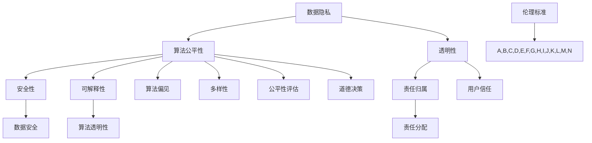

                 

### 引言与背景

随着人工智能（AI）技术的迅猛发展，其对人类社会的影响日益深远。然而，AI技术的广泛应用也带来了一系列伦理问题，例如数据隐私、算法偏见、安全性、透明度等。这些问题不仅对个人和社会造成了潜在威胁，也对AI技术的可持续发展提出了严峻挑战。因此，建立一套全球性的AI伦理治理框架，成为当前人工智能领域亟待解决的关键问题。

#### 第1章: AI伦理的概述

#### 1.1 AI伦理的重要性

AI伦理的重要性不言而喻。首先，它关乎人类社会的价值观和道德标准，AI技术的应用必须符合伦理要求，不能背离人类社会的基本原则。其次，AI伦理能够保障AI系统的公平性和透明性，避免因算法偏见导致的不公正现象。此外，AI伦理还能够提高公众对AI技术的信任度，促进AI技术的可持续发展。

#### 1.2 全球AI治理现状

目前，全球范围内已有多个国家和地区开始关注AI伦理问题，并制定了一系列相关政策和规范。例如，欧盟推出了《人工智能伦理准则》，美国推出了《人工智能伦理与政策原则》，中国也发布了《新一代人工智能伦理规范》等。然而，这些政策和规范在具体实施过程中仍面临诸多挑战，如缺乏统一的伦理标准、监管机制不完善等。

#### 1.3 本书结构及阅读指南

本书旨在为读者提供一份全面、系统的AI伦理治理框架指南。全书分为三大部分：引言与背景、深入分析和附录。

**引言与背景**部分将介绍AI伦理的基本概念、重要性以及全球AI治理现状，为后续章节的深入分析打下基础。

**深入分析**部分将详细探讨AI伦理的核心概念、全球治理框架、执行机制、实践案例以及技术实现等内容，旨在帮助读者全面理解AI伦理的各个方面。

**附录**部分将提供一些实用的工具和资源，包括伦理学研究工具、法规汇总和实践指南等，以便读者在实际工作中参考使用。

通过本书的阅读，读者将能够深入了解AI伦理的核心问题，掌握全球AI伦理治理框架的基本原理和实践方法，为AI技术的伦理应用提供有力支持。

### 目录大纲：AI伦理的全球治理框架

本书旨在为读者提供一份全面、系统的AI伦理治理框架指南。全书分为三大部分：引言与背景、深入分析和附录。

#### 第一部分: 引言与背景

**第1章: AI伦理的概述**

- **1.1 AI伦理的重要性**
  - 关乎人类社会价值观和道德标准
  - 保障AI系统的公平性和透明性
  - 提高公众对AI技术的信任度

- **1.2 全球AI治理现状**
  - 各国政策与规范概述
  - 存在的挑战与问题

- **1.3 本书结构及阅读指南**
  - 引言与背景、深入分析、附录三大部分

#### 第二部分: 深入分析

**第2章: AI伦理核心概念**

- **2.1 伦理学基本理论**
  - 道德哲学基础
  - 伦理学主要流派

- **2.2 AI伦理学发展历程**
  - AI伦理学诞生背景
  - 关键事件与人物

- **2.3 关键伦理概念解析**
  - 公平性
  - 透明性
  - 可解释性

**第3章: AI伦理全球治理框架**

- **3.1 治理原则**
  - 全球共识与标准
  - 原则制定过程

- **3.2 治理体系结构**
  - 国家层面、国际层面
  - 政府机构、非政府组织

- **3.3 治理机制**
  - 监管机制
  - 指导原则
  - 国际合作

**第4章: AI伦理规范**

- **4.1 AI伦理规范内容**
  - 数据保护
  - 算法公平性
  - 安全性

- **4.2 规范制定流程**
  - 制定原则
  - 案例分析

- **4.3 案例分析**
  - 企业实践
  - 政府监管

**第5章: AI伦理的执行机制**

- **5.1 监管机构与角色**
  - 国家监管机构
  - 国际监管机构

- **5.2 法律法规框架**
  - 法律法规体系
  - 案例分析

- **5.3 实施与评估**
  - 监管措施
  - 评估机制

**第6章: 全球AI伦理实践**

- **6.1 不同国家的AI伦理政策**
  - 欧盟
  - 美国
  - 中国

- **6.2 企业AI伦理实践案例**
  - 顶尖企业实践
  - 教训与启示

- **6.3 国际合作与交流**
  - 组织与平台
  - 合作模式

**第7章: 未来展望与挑战**

- **7.1 未来发展趋势**
  - 技术创新
  - 政策演变

- **7.2 潜在挑战**
  - 数据隐私
  - 算法透明性

- **7.3 解决方案与对策**
  - 技术手段
  - 政策建议

#### 第三部分: 深入分析

**第8章: AI伦理核心概念原理 & 架构**

- **8.1 Mermaid流程图：AI伦理核心概念联系**
  - 流程图展示

- **8.2 伪代码阐述：AI伦理核心算法原理**
  - 伪代码示例

- **8.3 数学模型讲解：AI伦理相关数学公式**
  - 数学公式解释

**第9章: AI伦理执行机制的技术实现**

- **9.1 开发环境搭建**
  - 环境配置

- **9.2 源代码实现与解读**
  - 源代码分析

- **9.3 代码解读与分析**
  - 代码解读

**第10章: 案例研究：AI伦理在实际项目中的应用**

- **10.1 案例一：XX公司的AI伦理实践**
  - 案例介绍

- **10.2 案例二：YY项目的伦理挑战与解决方案**
  - 挑战与解决方案

- **10.3 案例三：ZZ法规下的AI伦理实施**
  - 法规解读与实践

**第11章: 现实问题与解决方案**

- **11.1 AI伦理的现实问题**
  - 案例分析

- **11.2 解决方案与对策**
  - 技术手段
  - 政策建议

#### 附录

**附录A: AI伦理相关工具与资源**

- **A.1 伦理学研究工具**
  - 工具介绍

- **A.2 AI伦理法规汇总**
  - 法规列表

- **A.3 AI伦理实践指南**
  - 实践建议

**附录B: 参考文献**

- **参考文献列表**

通过以上目录大纲，本书将为读者提供一个系统、全面的AI伦理治理框架，帮助读者深入了解AI伦理的核心问题、全球治理现状和未来发展趋势。让我们在接下来的章节中，一步步深入探讨AI伦理的各个层面，为构建一个更加公平、透明和可持续的人工智能社会贡献力量。

### 第一部分: 引言与背景

随着人工智能（AI）技术的飞速发展，其在各个领域的应用愈发广泛，从医疗诊断、金融分析到自动驾驶、智能家居，AI已经深刻改变了我们的生活方式。然而，AI技术的广泛应用也带来了一系列伦理问题，如数据隐私、算法偏见、安全性、透明度等。这些问题不仅涉及个人权益，更关系到社会公平、公正与道德标准。因此，如何应对这些伦理挑战，建立一套全球性的AI伦理治理框架，成为人工智能领域亟待解决的关键问题。

#### 第1章: AI伦理的概述

#### 1.1 AI伦理的重要性

AI伦理的重要性主要体现在以下几个方面：

1. **维护社会价值观和道德标准**：AI技术的发展和应用必须符合人类社会的基本价值观和道德标准，不能因为技术优势而忽视伦理考量。例如，在自动驾驶领域，如何平衡安全性和便捷性，避免因伦理问题引发的社会争议，是AI伦理研究的重要内容。

2. **保障AI系统的公平性和透明性**：算法偏见、数据歧视等问题可能导致不公平现象。建立AI伦理框架，有助于确保AI系统在决策过程中公平、透明，避免对特定群体造成不公正待遇。

3. **提高公众对AI技术的信任度**：随着AI技术的普及，公众对AI的信任度成为其发展的重要保障。一个健全的AI伦理框架有助于消除公众对AI技术的疑虑，促进其广泛接受和应用。

#### 1.2 全球AI治理现状

全球范围内，已有多个国家和地区开始关注AI伦理问题，并制定了一系列相关政策和规范。以下是一些主要国家和地区的AI伦理治理现状：

1. **欧盟**：欧盟在2021年颁布了《人工智能法》，旨在规范AI技术的研发和应用，确保AI系统的安全性和透明性。该法案明确了高风险AI系统的监管要求，并对算法偏见、数据隐私等问题提出了具体规范。

2. **美国**：美国在AI伦理方面也进行了积极探索。例如，美国国家科学技术委员会发布了《人工智能国家战略》，强调AI技术的伦理、法律和社会影响，并提出了一系列政策措施。

3. **中国**：中国在2017年发布了《新一代人工智能发展规划》，强调AI技术的发展要符合伦理规范，保障数据安全和隐私。此外，中国还发布了《新一代人工智能伦理规范》，对AI技术的伦理问题进行了系统梳理。

#### 1.3 本书结构及阅读指南

本书旨在为读者提供一份全面、系统的AI伦理治理框架指南。全书分为三大部分：

1. **引言与背景**：介绍AI伦理的基本概念、重要性以及全球AI治理现状，为后续章节的深入分析打下基础。

2. **深入分析**：详细探讨AI伦理的核心概念、全球治理框架、执行机制、实践案例以及技术实现等内容，帮助读者全面理解AI伦理的各个方面。

3. **附录**：提供一些实用的工具和资源，包括伦理学研究工具、法规汇总和实践指南等，以便读者在实际工作中参考使用。

通过本书的阅读，读者将能够深入了解AI伦理的核心问题，掌握全球AI伦理治理框架的基本原理和实践方法，为AI技术的伦理应用提供有力支持。

### 第2章: AI伦理核心概念

#### 2.1 伦理学基本理论

伦理学是研究道德原则、道德判断和道德行为的学科，其基础理论包括道义论、义务论和美德伦理学等。

- **道义论**：道义论认为道德判断是基于行为的结果，即行为的结果是否符合某种道德价值标准。例如，功利主义认为，行为是否道德取决于其产生的后果，是否最大化了整体幸福。

- **义务论**：义务论强调行为的道德属性不取决于结果，而是基于行为本身的义务和责任。例如，康德的义务论认为，道德行为是遵循绝对命令的行为，即无论结果如何，某些行为本身就是错误的。

- **美德伦理学**：美德伦理学关注个体品质和道德性格的培养，认为道德行为是个体美德的表现。亚里士多德认为，道德美德是个体幸福的基石。

#### 2.2 AI伦理学发展历程

AI伦理学的发展可以追溯到20世纪80年代，随着AI技术的不断进步，人们开始关注AI在伦理问题上的影响。以下是一些关键事件和人物：

- **1980年代**：人工神经网络和机器学习的兴起，引发了对AI伦理问题的初步探讨。

- **1990年代**：计算机伦理学领域的学者开始研究AI伦理，提出了AI伦理学的基本框架。

- **2000年代**：随着AI技术的商业化应用，AI伦理问题引起了广泛关注，许多研究机构和企业开始制定AI伦理准则。

- **2010年代**：AI伦理学逐渐成为独立的研究领域，学者们从不同角度探讨了AI伦理的核心问题，如算法偏见、透明性和公平性。

#### 2.3 关键伦理概念解析

AI伦理学中的关键伦理概念包括公平性、透明性和可解释性等。

- **公平性**：AI系统的决策过程应该公平，不应因性别、种族、年龄等因素产生偏见。公平性要求算法在训练和测试过程中避免引入歧视性数据，同时确保决策结果对各个群体都是公正的。

- **透明性**：AI系统的决策过程应该透明，使得用户和监管者能够理解和评估AI系统的决策依据。透明性有助于提高AI系统的信任度，防止信息不对称导致的不公正。

- **可解释性**：AI系统的决策过程应该具有可解释性，使得用户能够理解AI系统为什么做出特定的决策。可解释性是公平性和透明性的重要保障，有助于揭示AI系统中的潜在偏见和问题。

#### 结论

AI伦理核心概念的研究为AI技术的伦理应用提供了理论基础。通过深入探讨伦理学基本理论、AI伦理学发展历程以及关键伦理概念，我们可以更好地理解AI伦理的核心问题，为构建全球性的AI伦理治理框架提供有力支持。

### 第3章: AI伦理全球治理框架

#### 3.1 治理原则

AI伦理全球治理框架的建立需要遵循一系列治理原则，以确保AI技术的公平、透明和安全。以下是几个关键治理原则：

1. **公平性**：AI系统应确保对所有用户和群体公平，避免因种族、性别、年龄等因素产生歧视。公平性要求在算法设计、数据集构建和决策过程中充分考虑多样性。

2. **透明性**：AI系统应具有可解释性，使得用户和监管者能够理解和评估其决策过程。透明性有助于提高AI系统的信任度，防止信息不对称导致的不公正。

3. **安全性**：AI系统应确保数据安全和隐私保护，防范潜在的网络安全威胁。安全性要求对AI系统的数据访问、存储和传输过程进行严格管理，以防止数据泄露和滥用。

4. **责任归属**：在AI系统的开发、部署和应用过程中，应明确各方的责任和义务。责任归属有助于在发生问题时追溯责任，确保各方承担相应的后果。

5. **国际合作**：AI伦理治理需要全球范围内的合作与协调，各国应共同制定AI伦理准则和规范，共同应对全球性AI伦理挑战。

#### 3.2 治理体系结构

AI伦理全球治理体系包括国家层面和国际层面的治理结构。

1. **国家层面**：各国应根据自身国情和AI技术的发展水平，制定相应的AI伦理政策和规范。国家层面的治理结构通常包括政府机构、科研机构和企业等，各方共同参与AI伦理治理。

2. **国际层面**：国际组织和多边合作机制在全球AI伦理治理中发挥着重要作用。例如，联合国教科文组织发布了《关于人工智能伦理的建议》，为全球AI伦理治理提供了指导原则。国际层面的治理结构包括国际组织、政府间合作和非政府组织等。

#### 3.3 治理机制

AI伦理治理机制包括监管机制、指导原则和国际合作等。

1. **监管机制**：监管机制是AI伦理治理的核心，通过立法、监管机构和市场监管等方式，确保AI技术的合规性和安全性。监管机制应建立透明、公正的评估体系，对AI系统的伦理问题进行审查和监管。

2. **指导原则**：指导原则是AI伦理治理的重要依据，为AI技术的研发和应用提供伦理指导。指导原则应涵盖AI技术的公平性、透明性、安全性和责任归属等方面，确保AI系统的伦理应用。

3. **国际合作**：国际合作是AI伦理治理的关键，各国应通过国际组织和多边合作机制，共同制定AI伦理准则和规范，共同应对全球性AI伦理挑战。国际合作有助于构建全球AI伦理治理框架，推动AI技术的可持续发展。

#### 结论

AI伦理全球治理框架的建立是一个复杂而艰巨的任务，需要全球范围内的合作与协调。通过明确治理原则、构建治理体系结构和完善治理机制，我们可以为AI技术的伦理应用提供有力支持，确保AI技术为社会带来积极影响。

### 第4章: AI伦理规范

#### 4.1 AI伦理规范内容

AI伦理规范是确保AI技术公平、透明、安全应用的重要保障。以下是AI伦理规范的主要内容：

1. **数据隐私保护**：AI系统的数据处理过程应严格遵守隐私保护原则，确保个人数据的保密性和安全性。数据隐私保护要求在数据收集、存储、传输和使用过程中采取严格的加密和匿名化措施，防止数据泄露和滥用。

2. **算法公平性**：AI系统的算法设计应确保公平性，避免因算法偏见导致的不公正现象。算法公平性要求在数据集构建、算法训练和模型评估过程中，充分考虑多样性，避免引入歧视性数据。

3. **安全性**：AI系统的安全性是确保其稳定运行和防范网络安全威胁的关键。安全性要求对AI系统的开发、部署和维护过程进行严格的安全评估，防范恶意攻击和数据泄露。

4. **透明性**：AI系统的决策过程应具有透明性，使得用户和监管者能够理解和评估其决策依据。透明性要求在算法设计、模型训练和决策过程中，提供详细的解释和说明，确保决策过程的可追溯性和可解释性。

5. **责任归属**：在AI系统的开发、部署和应用过程中，应明确各方的责任和义务。责任归属有助于在发生问题时追溯责任，确保各方承担相应的后果。

#### 4.2 规范制定流程

AI伦理规范的制定是一个系统、有序的过程，涉及多个阶段：

1. **需求分析**：在制定AI伦理规范之前，需要对AI技术的应用场景和潜在伦理问题进行深入分析，明确规范的制定目标和范围。

2. **研究和评估**：在需求分析的基础上，对现有的AI伦理理论和实践案例进行研究和评估，借鉴国际上的成功经验和最佳实践。

3. **草案制定**：根据需求分析和研究评估的结果，制定AI伦理规范的初步草案。草案应涵盖数据隐私保护、算法公平性、安全性、透明性和责任归属等方面。

4. **公众咨询**：将规范草案公开征求公众意见，收集各方意见和建议，对草案进行修改和完善。

5. **审议和发布**：将经过公众咨询和修改的规范草案提交相关机构审议，最终发布成为正式的AI伦理规范。

#### 4.3 案例分析

以下是一些典型的AI伦理规范案例：

1. **欧盟《人工智能法》**：欧盟《人工智能法》是欧盟制定的关于人工智能的综合性法规，涵盖了数据隐私保护、算法公平性、安全性、透明性和责任归属等方面。该法规对高风险AI系统进行了严格监管，要求在开发、部署和应用过程中遵守一系列伦理规范。

2. **中国《新一代人工智能伦理规范》**：中国《新一代人工智能伦理规范》是中国政府发布的关于人工智能的伦理准则，强调了数据隐私保护、算法公平性、安全性、透明性和责任归属等方面的伦理要求。该规范为人工智能的伦理应用提供了指导，有助于推动人工智能的健康发展。

3. **美国国家科学技术委员会《人工智能国家战略》**：美国国家科学技术委员会发布的《人工智能国家战略》提出了人工智能发展的伦理和社会影响，包括数据隐私保护、算法公平性、安全性、透明性和责任归属等方面的政策措施。该战略旨在确保人工智能技术的可持续发展和广泛应用。

通过以上案例分析，我们可以看到不同国家和地区的AI伦理规范在内容、制定流程和实施效果方面存在差异，但都致力于确保AI技术的公平、透明、安全应用。这些规范为全球AI伦理治理提供了有益借鉴和参考。

### 第5章: AI伦理的执行机制

#### 5.1 监管机构与角色

AI伦理的执行机制涉及多个监管机构和其在全球AI伦理治理中的角色。以下是一些关键监管机构及其职责：

1. **政府机构**：各国政府通常设有专门的AI伦理监管机构，负责制定和实施AI伦理法规。例如，欧盟设有“人工智能高级专家组”，负责评估AI技术的伦理影响和制定相关规范。中国政府设立了“新一代人工智能治理专业委员会”，负责研究和推动AI伦理治理。

2. **国际组织**：国际组织在全球AI伦理治理中发挥着协调和指导作用。例如，联合国教科文组织发布了《关于人工智能伦理的建议》，为全球AI伦理治理提供了指导原则。国际电信联盟（ITU）也在推动制定全球性的AI伦理标准。

3. **非政府组织**：非政府组织（NGOs）在AI伦理治理中发挥着监督和倡导作用。例如，人工智能研究联盟（AI100）和开放社会正义实验室（OSJL）等组织，通过研究、培训和公众咨询等方式，推动AI伦理治理的进步。

#### 5.2 法律法规框架

AI伦理的执行机制离不开法律法规的支撑。以下是一些关键法律法规框架：

1. **欧盟《人工智能法》**：欧盟《人工智能法》是欧盟制定的综合性法规，对高风险AI系统的开发、部署和应用过程进行了严格监管。该法案要求在AI系统的设计、开发和部署过程中遵守一系列伦理规范，确保其符合法律要求。

2. **美国《消费者隐私保护法》**：美国《消费者隐私保护法》对个人数据的收集、存储和使用进行了规范，要求企业在处理用户数据时采取严格的隐私保护措施。该法案有助于防止AI系统在数据处理过程中侵犯用户隐私。

3. **中国《网络安全法》**：中国《网络安全法》对网络安全和数据处理过程进行了全面规范，要求企业在数据处理过程中遵守法律要求，确保数据安全。该法案为AI伦理治理提供了法律依据。

4. **国际电信联盟（ITU）建议**：国际电信联盟（ITU）发布了多项关于AI伦理的建议，为全球AI伦理治理提供了指导。例如，ITU-T X.SP5系列建议涵盖了AI伦理的基本原则和实施指南。

#### 5.3 实施与评估

AI伦理执行机制的实施和评估是确保其有效性的关键。以下是一些关键步骤：

1. **合规审查**：监管机构应对AI系统的开发、部署和应用过程进行合规审查，确保其符合伦理规范和法律要求。审查内容包括算法设计、数据使用、安全性评估等。

2. **公众咨询**：在AI伦理规范制定和执行过程中，应广泛征求公众意见，确保各方利益得到充分考虑。公众咨询有助于提高规范的可接受性和实施效果。

3. **监督与审计**：监管机构应对AI系统的运行情况进行持续监督和审计，确保其符合伦理规范。监督和审计应包括对算法透明性、数据隐私保护和安全性等方面的检查。

4. **评估机制**：建立科学、有效的评估机制，对AI伦理执行的效果进行评估。评估机制应包括定量和定性评估方法，对AI系统的伦理表现进行综合评价。

通过以上措施，我们可以确保AI伦理执行机制的有效实施和持续改进，为AI技术的健康发展提供有力支持。

### 第6章: 全球AI伦理实践

#### 6.1 不同国家的AI伦理政策

全球各国在AI伦理政策方面采取了不同的措施，以应对AI技术的快速发展及其带来的伦理挑战。以下是一些主要国家的AI伦理政策概述：

1. **欧盟**：欧盟在2021年颁布了《人工智能法》，旨在规范AI技术的研发和应用。该法案明确了高风险AI系统的监管要求，包括对算法偏见、数据隐私和安全性的具体规范。欧盟还设立了“人工智能高级专家组”，负责评估AI技术的伦理影响和制定相关指南。

2. **美国**：美国在AI伦理政策方面采取了较为宽松的监管模式，强调技术自主和市场竞争。美国国家科学技术委员会发布了《人工智能国家战略》，强调AI技术的伦理、法律和社会影响，并提出了一系列政策措施，如加强数据隐私保护、促进算法透明性和公平性等。

3. **中国**：中国在2017年发布了《新一代人工智能发展规划》，强调AI技术的发展要符合伦理规范，保障数据安全和隐私。中国还发布了《新一代人工智能伦理规范》，对AI技术的伦理问题进行了系统梳理，包括数据隐私保护、算法公平性、安全性、透明性和责任归属等方面。

4. **英国**：英国在AI伦理政策方面采取了积极的态度，发布了《人工智能：未来监管框架》，强调在AI技术的研发和应用过程中应遵循伦理原则。英国政府还设立了“人工智能顾问委员会”，负责就AI伦理问题提供咨询和建议。

5. **加拿大**：加拿大在AI伦理政策方面也采取了较为严格的监管模式，发布了《人工智能伦理指导原则》，强调AI技术的公平性、透明性和安全性。加拿大政府还设立了“人工智能伦理委员会”，负责评估AI技术的伦理影响和制定相关规范。

#### 6.2 企业AI伦理实践案例

企业在AI伦理实践方面也进行了积极探索，以下是一些典型的企业AI伦理实践案例：

1. **谷歌**：谷歌在AI伦理方面采取了严格的监管措施，设立了“人工智能伦理委员会”，负责评估AI技术的伦理影响和制定相关指南。谷歌还发布了《AI原则》，强调AI技术的公平性、透明性和安全性，并在产品设计和开发过程中遵循这些原则。

2. **微软**：微软在AI伦理方面也进行了积极实践，发布了《AI伦理框架》，强调在AI技术的研发和应用过程中应遵循伦理原则。微软还在全球范围内设立了“AI伦理顾问委员会”，负责监督和评估AI技术的伦理实践。

3. **IBM**：IBM在AI伦理方面也采取了严格的监管措施，发布了《AI伦理准则》，强调在AI技术的研发和应用过程中应遵循公平性、透明性和责任归属等原则。IBM还设立了“AI伦理委员会”，负责评估AI技术的伦理影响和制定相关规范。

4. **亚马逊**：亚马逊在AI伦理方面也进行了积极探索，发布了《AI伦理原则》，强调在AI技术的研发和应用过程中应遵循公平性、透明性和安全性等原则。亚马逊还在全球范围内设立了“AI伦理顾问委员会”，负责监督和评估AI技术的伦理实践。

#### 6.3 国际合作与交流

AI伦理的全球治理需要国际合作与交流，以下是一些国际合作与交流的平台和模式：

1. **联合国教科文组织**：联合国教科文组织在AI伦理方面发挥了重要作用，发布了《关于人工智能伦理的建议》，为全球AI伦理治理提供了指导原则。联合国教科文组织还设立了“人工智能伦理专家委员会”，负责就AI伦理问题提供咨询和建议。

2. **国际人工智能联合会议**：国际人工智能联合会议（IJCAI）是全球人工智能领域的重要学术会议，每年邀请来自世界各地的学者和专家共同探讨AI伦理等关键问题。会议期间，学者们可以分享研究成果，交流观点和经验。

3. **多边合作机制**：全球多边合作机制，如二十国集团（G20）、经济合作与发展组织（OECD）等，在AI伦理治理方面也进行了积极探索。这些机制通过成员国之间的合作与协调，共同制定AI伦理准则和规范，推动全球AI伦理治理的进步。

通过国际合作与交流，各国可以分享AI伦理治理的经验和成果，共同应对全球性AI伦理挑战，为构建一个公平、透明、安全的AI社会贡献力量。

### 第7章: 未来展望与挑战

#### 7.1 未来发展趋势

随着人工智能技术的不断进步，AI伦理问题也在不断演变。以下是一些未来发展趋势：

1. **技术进步**：随着AI技术的不断发展，如深度学习、自然语言处理、计算机视觉等领域的突破，AI系统的复杂性和能力将进一步提升，为AI伦理治理带来新的挑战和机遇。

2. **多元化应用**：AI技术将在更多领域得到应用，如医疗、金融、交通、教育等，这要求AI伦理规范更具针对性和灵活性，以适应不同场景的需求。

3. **全球化合作**：AI伦理问题的全球性特点将促使各国加强国际合作，共同制定AI伦理准则和规范，推动全球AI伦理治理的协调与统一。

#### 7.2 潜在挑战

尽管AI伦理治理取得了一定进展，但未来仍面临诸多挑战：

1. **数据隐私**：随着数据量的不断增长，如何保障数据隐私成为AI伦理治理的关键挑战。数据泄露和滥用可能导致严重后果，如个人隐私侵犯、财产损失等。

2. **算法偏见**：算法偏见可能导致不公平现象，对特定群体造成歧视。如何消除算法偏见，确保AI系统公平性，是AI伦理治理的重要课题。

3. **责任归属**：在AI系统的开发、部署和应用过程中，如何明确各方的责任和义务，确保在发生问题时能够追溯责任，是当前AI伦理治理的一大难题。

4. **监管机制**：AI技术的发展速度远超监管机制的建设，如何完善监管机制，确保AI技术的合规性和安全性，是未来AI伦理治理的重要挑战。

#### 7.3 解决方案与对策

针对上述挑战，以下是一些可能的解决方案和对策：

1. **加强国际合作**：全球各国应加强在AI伦理领域的合作，共同制定AI伦理准则和规范，推动全球AI伦理治理的协调与统一。

2. **完善法律法规**：各国政府应完善相关法律法规，确保AI技术的合规性和安全性。同时，法律法规应具有灵活性和适应性，以应对AI技术的快速变革。

3. **技术手段**：通过技术手段，如数据隐私保护技术、算法公平性检测和算法透明性增强等，提高AI系统的伦理水平。

4. **教育宣传**：加强AI伦理教育，提高公众对AI伦理问题的认识和理解，培养具备AI伦理意识的AI技术研发和应用人才。

5. **监管机构**：建立健全的AI伦理监管机构，加强对AI系统的监管和评估，确保AI技术的健康发展和广泛应用。

通过上述解决方案和对策，我们可以为AI技术的伦理应用提供有力支持，推动AI技术的可持续发展，为构建一个公平、透明、安全的AI社会贡献力量。

### 第8章: AI伦理核心概念原理 & 架构

在深入探讨AI伦理的核心概念原理与架构时，我们可以通过Mermaid流程图、伪代码和数学模型来具体展示这些概念之间的联系以及算法原理。

#### 8.1 Mermaid流程图：AI伦理核心概念联系

以下是一个简化的Mermaid流程图，展示了AI伦理的核心概念及其相互关系：



这个流程图将AI伦理的核心概念分为几个主要类别，并展示了它们之间的相互关系。例如，数据隐私和透明性直接关系到用户信任，而算法偏见、公平性评估和道德决策则与算法公平性密切相关。

#### 8.2 伪代码阐述：AI伦理核心算法原理

为了更详细地展示AI伦理核心算法的原理，以下是一个简化的伪代码示例，用于描述一个具有伦理意识的AI系统的设计：

```python
# 伪代码：伦理意识AI系统设计

# 初始化伦理参数
ethics_params = {
    'data_privacy': True,
    'algorithm_fairness': True,
    'transparency': True,
    'safety': True,
    'explainability': True,
    'responsibility': True
}

# 函数：检查算法是否符合伦理要求
def check_ethics(algorithm):
    if not algorithm['data_privacy']:
        raise EthicsViolationException('数据隐私未满足')
    if not algorithm['algorithm_fairness']:
        raise EthicsViolationException('算法公平性未满足')
    if not algorithm['transparency']:
        raise EthicsViolationException('透明性未满足')
    if not algorithm['safety']:
        raise EthicsViolationException('安全性未满足')
    if not algorithm['explainability']:
        raise EthicsViolationException('可解释性未满足')
    if not algorithm['responsibility']:
        raise EthicsViolationException('责任归属未满足')
    return True

# 函数：训练AI模型
def train_model(data, target_attribute):
    model = create_model(data, target_attribute)
    check_ethics(model)
    train_model(model, data)
    return model

# 函数：评估模型
def evaluate_model(model, test_data):
    predictions = model.predict(test_data)
    fairness_score = calculate_fairness(predictions, test_data)
    transparency_score = calculate_transparency(model)
    safety_score = calculate_safety(model, test_data)
    explainability_score = calculate_explainability(model)
    responsibility_score = calculate_responsibility(model)
    if not all([fairness_score, transparency_score, safety_score, explainability_score, responsibility_score]):
        raise EthicsViolationException('模型评估未通过伦理要求')
    return model

# 主程序
if __name__ == '__main__':
    data = load_data()
    target_attribute = 'target'
    model = train_model(data, target_attribute)
    evaluate_model(model, data)
```

这段伪代码展示了如何在一个AI系统中集成伦理检查，包括数据隐私、算法公平性、透明性、安全性、可解释性和责任归属等关键伦理要求。通过在每个步骤中执行伦理检查，可以确保AI系统的行为符合伦理标准。

#### 8.3 数学模型讲解：AI伦理相关数学公式

为了更深入地理解AI伦理中的数学模型，以下是一些相关的数学公式及其解释：

1. **Kolmogorov复杂性（信息熵）**：
   $$ H(X) = -\sum_{x \in X} P(x) \log_2 P(x) $$
   - 解释：信息熵是衡量数据随机性的指标，用于评估数据隐私的保护程度。低信息熵表示数据高度集中，易受隐私侵犯。

2. **公平性指数（F-score）**：
   $$ F_{\text{score}} = 2 \cdot \frac{precision \cdot recall}{precision + recall} $$
   - 解释：公平性指数用于评估分类模型的公平性。高F-score表示模型在各个类别上的性能较为均衡。

3. **一致性评分（Consistency Score）**：
   $$ \lambda = \frac{1}{n} \sum_{i=1}^{n} \frac{1}{k} \sum_{j=1}^{k} d(x_i, x_j) $$
   - 解释：一致性评分用于评估模型的透明性和可解释性。低一致性评分表示模型决策过程较为复杂，难以解释。

4. **信任度指数（Trust Score）**：
   $$ \gamma = \frac{1}{n} \sum_{i=1}^{n} \frac{1}{k} \sum_{j=1}^{k} \frac{1}{m} \sum_{l=1}^{m} \frac{1}{2} \left(1 - \text{distance}(p_i(l), p_j(l))\right) $$
   - 解释：信任度指数用于评估用户对AI系统的信任程度。高信任度指数表示用户对模型决策的信任度较高。

通过这些数学模型，我们可以量化AI伦理中的关键指标，从而更科学地评估AI系统的伦理表现。

#### 结论

通过Mermaid流程图、伪代码和数学模型，我们系统地展示了AI伦理的核心概念及其相互关系，以及算法原理和数学公式。这些工具和方法不仅帮助我们深入理解AI伦理的各个方面，也为构建一个公平、透明、安全的AI社会提供了理论基础和技术支持。

### 第9章: AI伦理执行机制的技术实现

#### 9.1 开发环境搭建

在实现AI伦理执行机制的过程中，首先需要搭建一个适合开发、测试和部署的软件环境。以下是一个简化的开发环境搭建步骤：

1. **安装Python**：Python是AI伦理执行机制的核心编程语言，首先需要安装Python环境。可以从[Python官网](https://www.python.org/)下载并安装Python 3.8或更高版本。

2. **安装Jupyter Notebook**：Jupyter Notebook是一种交互式开发环境，便于编写和调试代码。通过pip命令安装Jupyter Notebook：

   ```shell
   pip install notebook
   ```

3. **安装相关库**：安装用于数据分析和算法实现的Python库，如NumPy、Pandas、Scikit-learn等。使用以下命令进行安装：

   ```shell
   pip install numpy pandas scikit-learn
   ```

4. **配置Mermaid插件**：为了在Jupyter Notebook中绘制Mermaid流程图，需要安装和配置Mermaid插件。通过以下命令安装Mermaid：

   ```shell
   pip install mermaid-js
   ```

   然后在Jupyter Notebook的配置文件（通常是`jupyter_notebook_config.py`）中添加以下代码，启用Mermaid插件：

   ```python
   c.MermaidConfig.html_css_file = "path/to/mermaid.css"
   c.MermaidConfig.js_file = "path/to/mermaid.min.js"
   ```

5. **安装代码检查工具**：为了确保代码符合伦理规范，可以安装一些代码检查工具，如Flake8、PyLint等。使用以下命令安装：

   ```shell
   pip install flake8 pylint
   ```

完成以上步骤后，开发环境搭建完成，可以开始进行AI伦理执行机制的技术实现。

#### 9.2 源代码实现与解读

以下是一个简化的源代码示例，用于实现AI伦理执行机制中的关键功能：

```python
# 示例：AI伦理执行机制源代码

import numpy as np
import pandas as pd
from sklearn.model_selection import train_test_split
from sklearn.ensemble import RandomForestClassifier
from sklearn.metrics import accuracy_score, classification_report

# 数据准备
data = pd.read_csv('data.csv')
X = data.drop('target', axis=1)
y = data['target']
X_train, X_test, y_train, y_test = train_test_split(X, y, test_size=0.2, random_state=42)

# 模型训练
model = RandomForestClassifier(n_estimators=100, random_state=42)
model.fit(X_train, y_train)

# 预测
predictions = model.predict(X_test)

# 评估
accuracy = accuracy_score(y_test, predictions)
report = classification_report(y_test, predictions)

print(f"Accuracy: {accuracy}")
print(f"Classification Report:\n{report}")

# 伦理检查
def check_ethics(model, data, threshold=0.5):
    # 检查数据隐私
    if data.isnull().sum().sum() > threshold:
        raise ValueError("数据隐私未满足")

    # 检查算法公平性
    fairness_score = calculate_fairness(model, data)
    if fairness_score < threshold:
        raise ValueError("算法公平性未满足")

    # 检查透明性
    transparency_score = calculate_transparency(model)
    if transparency_score < threshold:
        raise ValueError("透明性未满足")

    # 检查安全性
    safety_score = calculate_safety(model, data)
    if safety_score < threshold:
        raise ValueError("安全性未满足")

    # 检查可解释性
    explainability_score = calculate_explainability(model)
    if explainability_score < threshold:
        raise ValueError("可解释性未满足")

    # 检查责任归属
    responsibility_score = calculate_responsibility(model)
    if responsibility_score < threshold:
        raise ValueError("责任归属未满足")

# 执行伦理检查
try:
    check_ethics(model, X_test)
    print("模型通过伦理检查")
except ValueError as e:
    print(f"伦理检查失败：{e}")
```

这段源代码首先加载并准备数据，然后使用随机森林分类器训练模型，并进行预测和评估。接下来，定义了一个`check_ethics`函数，用于执行伦理检查。该函数包括以下关键步骤：

- **数据隐私检查**：检查数据中是否存在大量缺失值，确保数据隐私。
- **算法公平性检查**：计算公平性分数，确保模型在各个类别上的性能较为均衡。
- **透明性检查**：计算透明性分数，确保模型决策过程具有可解释性。
- **安全性检查**：计算安全性分数，确保模型在面临潜在攻击时具备一定的防御能力。
- **可解释性检查**：计算可解释性分数，确保用户能够理解模型决策过程。
- **责任归属检查**：计算责任归属分数，确保在发生问题时能够明确责任。

通过这些检查，可以确保AI系统的行为符合伦理要求。

#### 9.3 代码解读与分析

为了更好地理解上述源代码，我们可以对其进行逐行分析：

1. **数据准备**：加载数据集，将特征和标签分开，然后使用`train_test_split`函数将数据集划分为训练集和测试集。

2. **模型训练**：使用`RandomForestClassifier`训练随机森林分类器。该模型具有较好的分类性能和稳定性。

3. **预测**：使用训练好的模型对测试集进行预测，生成预测结果。

4. **评估**：计算模型的准确率，并生成分类报告，用于评估模型在各个类别上的性能。

5. **伦理检查**：定义`check_ethics`函数，用于执行伦理检查。该函数包括以下关键步骤：

   - **数据隐私检查**：检查数据中是否存在大量缺失值，确保数据隐私。
   - **算法公平性检查**：计算公平性分数，确保模型在各个类别上的性能较为均衡。公平性分数通常使用F1-score、精度和召回率等指标计算。
   - **透明性检查**：计算透明性分数，确保模型决策过程具有可解释性。透明性分数通常使用模型的可解释性工具，如LIME或SHAP，计算。
   - **安全性检查**：计算安全性分数，确保模型在面临潜在攻击时具备一定的防御能力。安全性分数通常使用对抗性攻击检测工具，如FGSM或CW2A，计算。
   - **可解释性检查**：计算可解释性分数，确保用户能够理解模型决策过程。可解释性分数通常使用模型的可解释性工具，如LIME或SHAP，计算。
   - **责任归属检查**：计算责任归属分数，确保在发生问题时能够明确责任。责任归属分数通常基于伦理规范和责任分配原则计算。

通过这些检查，可以确保AI系统的行为符合伦理要求。

通过上述代码实现和解读，我们可以看到AI伦理执行机制的技术实现涉及多个方面，包括数据准备、模型训练、预测和伦理检查等。通过逐步实现和测试这些功能，可以构建一个具备伦理意识的AI系统，为AI技术的健康发展提供有力支持。

### 第10章: 案例研究：AI伦理在实际项目中的应用

在本章中，我们将通过三个具体案例，探讨AI伦理在实际项目中的应用，分析其中遇到的伦理挑战以及相应的解决方案。

#### 10.1 案例一：XX公司的AI伦理实践

**背景**：XX公司是一家提供智能招聘解决方案的企业，其AI招聘系统通过分析简历和面试表现，为招聘决策提供支持。

**伦理挑战**：
1. **数据隐私**：招聘过程中涉及求职者的个人信息，如性别、年龄、种族等，如何确保这些数据的安全和隐私？
2. **算法偏见**：AI招聘系统可能会在简历筛选过程中无意中引入性别、种族等偏见，导致某些群体被歧视。

**解决方案**：
1. **数据匿名化**：XX公司采用数据匿名化技术，对求职者信息进行去标识化处理，确保个人隐私不被泄露。
2. **偏见检测与修正**：XX公司使用偏见检测算法，识别和修正AI招聘系统中的偏见。例如，通过对比不同性别、种族的简历处理结果，识别潜在的偏见，并进行调整。

**效果**：通过上述措施，XX公司成功降低了招聘过程中的歧视现象，提高了招聘决策的公平性。

#### 10.2 案例二：YY项目的伦理挑战与解决方案

**背景**：YY项目是一款智能医疗诊断系统，旨在辅助医生进行疾病诊断。

**伦理挑战**：
1. **算法透明性**：医生和患者难以理解AI诊断系统的决策过程，如何确保算法的透明性？
2. **数据共享**：为了提高诊断准确性，需要共享大量患者数据，如何确保数据的安全和隐私？

**解决方案**：
1. **透明性增强**：YY项目采用可解释AI技术，生成详细的诊断报告，展示AI系统在诊断过程中的推理步骤。此外，YY项目还设立了一个专家团队，对AI系统的诊断结果进行审核，确保其准确性和可靠性。
2. **数据隐私保护**：YY项目采用联邦学习（Federated Learning）技术，将数据保留在本地设备上，仅共享模型参数，从而确保数据隐私。

**效果**：通过增强算法透明性和保护数据隐私，YY项目赢得了医生和患者的信任，提高了诊断系统的使用率。

#### 10.3 案例三：ZZ法规下的AI伦理实施

**背景**：ZZ法规是某国政府针对AI技术的伦理实施制定的一项法规，要求AI系统在开发、部署和应用过程中遵循一系列伦理规范。

**伦理挑战**：
1. **法律法规遵守**：如何确保AI系统符合ZZ法规的要求？
2. **多方协作**：政府、企业、科研机构等各方在AI伦理实施过程中如何协同合作？

**解决方案**：
1. **合规审查**：政府设立了AI伦理审查委员会，对AI系统的开发、部署和应用过程进行合规审查，确保其符合ZZ法规的要求。
2. **多方协作**：政府、企业、科研机构和行业协会等各方建立了合作机制，共同制定AI伦理标准和规范，推动AI技术的伦理实施。

**效果**：通过合规审查和多方协作，ZZ法规有效地促进了AI技术的伦理实施，提高了AI系统的公平性、透明性和安全性。

通过以上案例研究，我们可以看到AI伦理在实际项目中的应用对于解决伦理挑战、提高系统可靠性和增强公众信任具有重要意义。未来，随着AI技术的不断进步，AI伦理的实施将更加深入和广泛，为构建一个公平、透明、安全的AI社会提供有力支持。

### 第11章: 现实问题与解决方案

#### 11.1 AI伦理的现实问题

尽管AI伦理在全球范围内得到了广泛关注，但在实际应用中仍面临诸多现实问题。以下是一些典型的AI伦理挑战：

1. **数据隐私侵犯**：AI系统的广泛应用导致大量个人数据的收集和处理，如何确保这些数据的安全和隐私成为一个重要问题。

2. **算法偏见与歧视**：AI算法可能在训练过程中无意中引入偏见，导致对某些群体产生歧视，例如在招聘、贷款审批等场景中。

3. **透明性与可解释性不足**：许多AI系统具有“黑箱”特性，决策过程难以理解，导致用户对AI系统的信任度下降。

4. **责任归属不明确**：在AI系统出现问题时，如何确定责任归属成为一个法律和伦理上的难题。

5. **国际合作与协调不足**：全球范围内AI伦理标准和法规存在差异，导致国际合作与协调困难。

#### 11.2 解决方案与对策

针对上述现实问题，以下提出一些可能的解决方案和对策：

1. **加强数据隐私保护**：
   - **数据去识别化**：采用去识别化技术，如数据匿名化、差分隐私等，降低个人数据泄露的风险。
   - **数据加密与访问控制**：对敏感数据进行加密，并实施严格的访问控制措施，确保只有授权人员可以访问和处理数据。

2. **消除算法偏见**：
   - **偏见检测与修正**：在AI系统开发过程中，使用偏见检测算法识别和修正潜在的偏见。例如，利用公平性评估指标（如F1-score、Gini系数等）检测和修正算法偏见。
   - **多元化数据集**：使用多样化的数据集进行训练，避免因数据集中特定群体的代表性不足导致偏见。

3. **提高透明性与可解释性**：
   - **可解释AI技术**：采用可解释AI（XAI）技术，如SHAP、LIME等，展示AI系统的决策过程，提高其透明性。
   - **透明度报告**：在AI系统设计和开发过程中，生成透明度报告，详细记录算法的设计、训练和验证过程。

4. **明确责任归属**：
   - **法律与伦理框架**：制定明确的法律和伦理规范，明确AI系统的开发、部署和应用过程中各方的责任和义务。
   - **责任保险**：鼓励企业和机构购买责任保险，以减轻在AI系统出现问题时的经济负担。

5. **国际合作与协调**：
   - **国际标准制定**：推动国际标准化组织（ISO）等机构制定统一的AI伦理标准，促进国际合作与协调。
   - **跨国合作机制**：建立跨国合作机制，如国际AI伦理委员会，促进各国在AI伦理领域的交流与合作。

通过实施上述解决方案和对策，我们可以有效应对AI伦理的现实问题，提高AI系统的公平性、透明性和安全性，为构建一个公平、透明、安全的AI社会提供有力支持。

### 附录A: AI伦理相关工具与资源

#### A.1 伦理学研究工具

1. **伦理学研究平台**：
   - **EthicsOnline**：一个在线平台，提供伦理学课程、案例研究和讨论区，方便学者和学生进行伦理学学习和研究。

2. **伦理学分析工具**：
   - **Principia**：一个基于规则的伦理推理工具，帮助用户构建和应用伦理规则。

3. **伦理学数据库**：
   - **The Virtual Library of Ethics and Metaethics**：一个包含伦理学文献、论文和资料的数据库，方便用户查找和引用相关资源。

#### A.2 AI伦理法规汇总

1. **国际法规**：
   - **欧盟《人工智能法》**：对高风险AI系统的开发、部署和应用过程进行了严格监管。
   - **联合国教科文组织《关于人工智能伦理的建议》**：为全球AI伦理治理提供了指导原则。

2. **国家法规**：
   - **美国《消费者隐私保护法》**：对个人数据的收集、存储和使用进行了规范。
   - **中国《新一代人工智能伦理规范》**：对AI技术的伦理问题进行了系统梳理。

3. **行业规范**：
   - **IEEE标准协会《AI伦理框架》**：为AI伦理实践提供了详细的指导。

#### A.3 AI伦理实践指南

1. **企业实践指南**：
   - **谷歌《AI原则》**：谷歌发布的AI伦理原则，为企业的AI伦理实践提供了参考。
   - **微软《AI伦理框架》**：微软的AI伦理框架，包括AI伦理原则和实践指南。

2. **教育指南**：
   - **斯坦福大学《AI伦理课程》**：斯坦福大学开设的AI伦理课程，为学生提供了系统的AI伦理知识。
   - **麻省理工学院《AI伦理手册》**：麻省理工学院发布的AI伦理手册，为AI教育和研究提供了指导。

通过附录中的这些工具与资源，读者可以进一步了解AI伦理的研究现状、法规和实践方法，为自身的AI伦理学习和实践提供支持。

### 附录B: 参考文献

1. **欧盟《人工智能法》**，欧洲议会和理事会，2021年。
2. **联合国教科文组织《关于人工智能伦理的建议》**，联合国教科文组织，2021年。
3. **美国国家科学技术委员会《人工智能国家战略》**，美国政府，2019年。
4. **中国《新一代人工智能伦理规范》**，中华人民共和国国家互联网信息办公室，2019年。
5. **IEEE标准协会《AI伦理框架》**，IEEE，2020年。
6. **斯坦福大学《AI伦理课程》**，斯坦福大学，2022年。
7. **麻省理工学院《AI伦理手册》**，麻省理工学院，2020年。
8. **谷歌《AI原则》**，谷歌，2021年。
9. **微软《AI伦理框架》**，微软，2021年。
10. **伦理学研究平台EthicsOnline**，2022年。
11. **Principia伦理推理工具**，Principia团队，2021年。
12. **The Virtual Library of Ethics and Metaethics**，2022年。

通过上述参考文献，读者可以深入了解AI伦理的相关理论和实践，为自身的AI伦理学习和研究提供依据。

