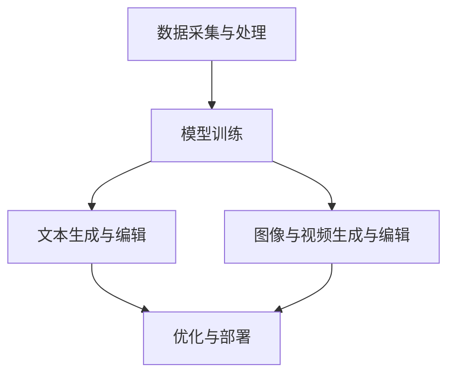
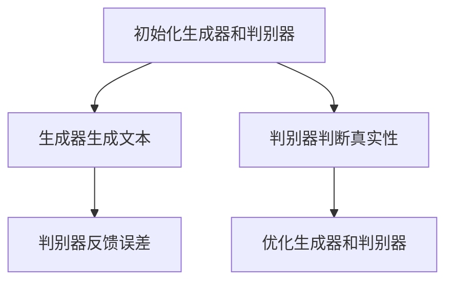
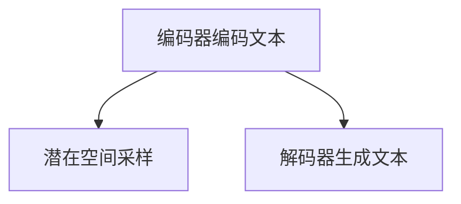
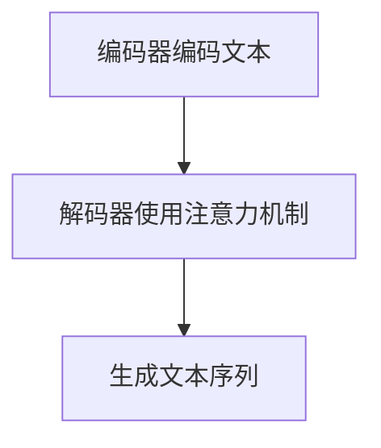
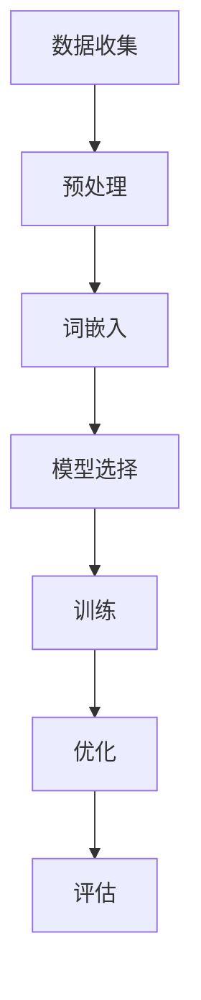
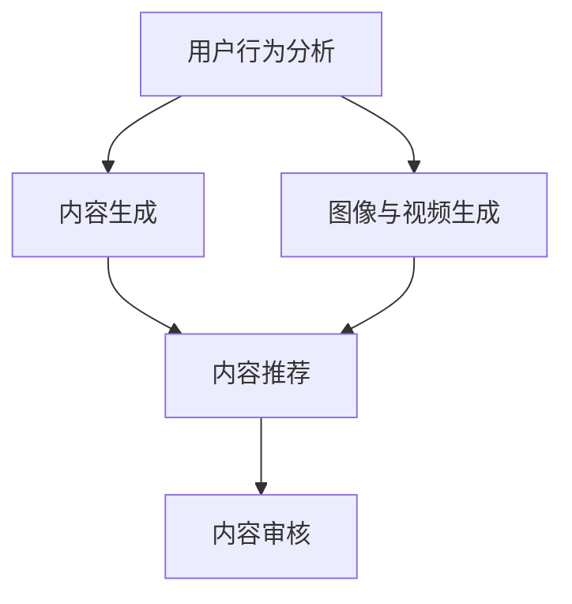

                 

### 《AI内容创作者的机会：码头故事的无限题材》

**关键词**：人工智能、内容创作、自然语言处理、图像生成、虚拟现实、社交媒体、新闻、案例分析、实践指导

**摘要**：
本文旨在探讨人工智能在内容创作领域的巨大潜力，特别是对于AI内容创作者而言的无限题材机会。文章将首先介绍AI内容创作的背景与崛起原因，随后详细分析AI内容创作的技术基础，包括自然语言处理、图像与视频生成技术。接下来，文章将探讨AI内容创作的实际应用场景，并通过具体案例研究进行实战分析。最后，文章将展望AI内容创作的未来趋势，讨论其对社会的影响，以及AI内容创作者面临的挑战与应对策略。

<|assistant|>### 第一部分：引言与背景介绍

#### 第1章：AI内容创作者的崛起

### 1.1 AI与内容创作

人工智能（AI）正在迅速改变着我们的世界，其应用领域不断扩展，从自动驾驶到医疗诊断，从智能家居到金融服务。在这股变革的浪潮中，内容创作也受到了深远的影响。传统上，内容创作是一个依赖人类智慧和创造力的过程，但如今，AI已经开始扮演着重要的角色，成为内容创作者的强大助力。

AI在内容创作中的应用主要体现在以下几个方面：

1. **自然语言处理（NLP）**：AI可以生成文章、新闻报道、广告文案等文本内容。
2. **图像和视频生成**：AI可以自动生成高质量的图像、视频和动画。
3. **个性化推荐**：AI可以根据用户兴趣和偏好推荐个性化的内容。
4. **自动化内容审核**：AI可以帮助识别和过滤不适当的内容。

### 1.2 AI内容创作者的崛起背景

AI内容创作者的崛起并非一夜之间，而是有着深刻的技术和社会背景。以下是几个关键因素：

1. **技术进步**：计算能力的提升、大数据的可用性以及深度学习算法的发展，使得AI在内容创作中得以广泛应用。
2. **市场需求**：随着互联网的普及，内容创作需求激增，传统的人类创作者难以满足市场的需求，AI提供了高效的解决方案。
3. **内容多样性**：AI可以处理多种类型的内容，从文本到图像、音频和视频，极大地丰富了内容的多样性。
4. **自动化和智能化**：AI可以自动化许多内容创作任务，减轻人类创作者的工作负担，同时提供创新的创作方式。

### 1.3 本书目的与结构

本书旨在深入探讨AI内容创作的各个方面，帮助读者理解AI在内容创作中的潜力与挑战。具体来说，本书将：

1. **介绍AI内容创作的基本概念和原理**。
2. **详细分析AI内容创作的技术基础**，包括自然语言处理、图像和视频生成技术。
3. **探讨AI内容创作的实际应用场景**，并通过案例分析提供实践指导。
4. **展望AI内容创作的未来趋势**，讨论其对社会的影响和AI内容创作者的角色转变。
5. **提供附录与学习资源**，帮助读者进一步学习和实践。

接下来的章节将依次介绍这些内容，带领读者进入AI内容创作的广阔世界。

---

#### 第2章：技术基础与原理

##### 2.1 AI内容创作的定义与分类

AI内容创作是指利用人工智能技术生成、编辑、优化各种类型的内容，包括文本、图像、音频和视频等。AI内容创作可以进一步分类为以下几类：

1. **文本内容创作**：利用自然语言处理（NLP）技术生成文章、新闻报道、广告文案等。
2. **图像与视频内容创作**：通过计算机视觉和视频处理技术生成或编辑图像、视频和动画。
3. **音频内容创作**：利用音频处理技术生成或编辑音乐、语音等。
4. **跨媒体内容创作**：整合多种类型的媒体内容，如将文本内容与图像、视频结合，创造出更为丰富和多样的内容形式。

##### 2.2 AI内容创作技术的发展历程

AI内容创作技术的发展可以追溯到20世纪80年代，当时研究人员开始探索如何利用计算机生成文本。随着技术的进步，特别是在深度学习算法和大规模数据集的推动下，AI内容创作技术取得了显著的进展。以下是AI内容创作技术发展历程的几个关键阶段：

1. **规则驱动的内容创作**：早期的AI内容创作主要依赖于规则和模板，这种方式在特定场景下表现出色，但灵活性较低。
2. **基于模板的内容创作**：随着数据库技术的兴起，AI开始利用模板和预定义的规则生成内容，这种方法在生成一致性和快速响应方面表现较好。
3. **基于机器学习的内容创作**：20世纪90年代，机器学习算法开始应用于内容创作，特别是在文本分类和信息检索领域取得了显著进展。
4. **基于深度学习的内容创作**：深度学习算法，尤其是卷积神经网络（CNN）和递归神经网络（RNN）的引入，使得AI内容创作在生成复杂内容和进行高级文本理解方面取得了突破性进展。

##### 2.3 AI内容创作的核心组件

AI内容创作系统通常由以下几个核心组件构成：

1. **数据采集与处理**：收集和预处理用于训练的数据，包括文本、图像、音频等。
2. **模型训练**：利用深度学习算法训练模型，使其能够理解和生成内容。
3. **文本生成与编辑**：利用自然语言处理技术生成和编辑文本内容。
4. **图像与视频生成与编辑**：利用计算机视觉和视频处理技术生成和编辑图像、视频。
5. **优化与部署**：对模型进行优化，并在实际应用中进行部署。

以下是一个简单的Mermaid流程图，展示了AI内容创作系统的基本架构：



##### 2.4 AI内容创作技术的应用领域

AI内容创作技术已经在多个领域得到广泛应用：

1. **新闻与媒体**：AI可以自动生成新闻文章、体育报道、财经分析等。
2. **广告与营销**：AI用于生成个性化的广告文案和营销内容。
3. **娱乐与游戏**：AI生成游戏剧情、角色对话和游戏画面。
4. **教育**：AI生成教学材料和自动化作业批改。
5. **艺术与设计**：AI生成艺术品、设计图案和音乐。

随着技术的不断进步和应用场景的扩展，AI内容创作的前景将更加广阔。

---

通过以上对AI内容创作定义、技术发展历程、核心组件和应用领域的介绍，我们可以看到AI在内容创作领域的巨大潜力和广阔前景。接下来的章节将进一步深入探讨AI内容创作的具体技术细节和应用实践。

### 第二部分：技术基础与原理

#### 第3章：自然语言处理与文本生成

##### 3.1 自然语言处理基础

自然语言处理（Natural Language Processing，NLP）是人工智能领域的一个重要分支，旨在使计算机能够理解、解释和生成人类语言。NLP技术包括语音识别、文本分类、情感分析、机器翻译等多个方面。以下是NLP中的一些基础概念和关键技术：

1. **词嵌入（Word Embedding）**：词嵌入是将单词映射到高维向量空间的技术，使得计算机能够理解单词的语义关系。Word2Vec和GloVe是常用的词嵌入技术。

2. **序列模型（Sequence Model）**：序列模型用于处理和时间相关的数据，如文本和语音。递归神经网络（RNN）和长短期记忆网络（LSTM）是常用的序列模型。

3. **卷积神经网络（CNN）**：尽管CNN主要用于图像处理，但也可以应用于文本处理，通过将文本视为序列图像，利用卷积层捕捉文本特征。

4. **生成对抗网络（GAN）**：GAN是一种深度学习模型，用于生成与真实数据相似的新数据。在NLP中，GAN可以用于生成文本、图像和语音。

##### 3.2 基于生成对抗网络的文本生成

生成对抗网络（GAN）是一种通过竞争学习生成数据的模型。GAN由两部分组成：生成器（Generator）和判别器（Discriminator）。生成器的任务是生成类似于真实数据的假数据，而判别器的任务是区分真实数据和假数据。以下是基于GAN的文本生成的原理：

1. **训练过程**：生成器和判别器通过交替训练不断优化。生成器尝试生成更真实的数据，而判别器尝试更好地区分真实和假数据。

2. **生成文本**：通过训练好的生成器，可以生成新的文本序列。生成器可以从一个概率分布中采样，逐步生成新的文本。

3. **应用场景**：GAN在文本生成中的应用广泛，如自动写作、虚构故事生成、对话系统等。

以下是一个简单的Mermaid流程图，展示了基于GAN的文本生成过程：



##### 3.3 基于变分自编码器的文本生成

变分自编码器（Variational Autoencoder，VAE）是一种生成模型，通过概率分布来生成数据。VAE在文本生成中的应用主要包括以下几个步骤：

1. **编码器（Encoder）**：将输入文本编码为一个潜在空间中的向量。
2. **解码器（Decoder）**：从潜在空间中采样，生成新的文本。

以下是VAE的文本生成原理：

1. **潜在空间建模**：VAE通过编码器学习一个潜在分布，将输入文本映射到潜在空间中。
2. **文本生成**：从潜在空间中采样，利用解码器生成新的文本。

3. **应用场景**：VAE在文本生成中的应用包括生成高质量的文章、创意写作和文本转换等。

以下是一个简单的Mermaid流程图，展示了基于VAE的文本生成过程：



##### 3.4 基于递归神经网络（RNN）的文本生成

递归神经网络（RNN）是一种能够处理序列数据的神经网络，特别适合于文本生成任务。RNN通过其递归结构，能够利用先前的信息来预测未来的值。以下是基于RNN的文本生成原理：

1. **输入层**：将输入文本序列编码为向量。
2. **隐藏层**：RNN通过递归结构，在每个时间步处理输入和隐藏状态，生成新的隐藏状态。
3. **输出层**：将隐藏状态解码为文本序列。

以下是RNN的文本生成过程：

1. **初始化**：初始化隐藏状态和权重。
2. **递归计算**：对于每个时间步，利用输入和隐藏状态更新隐藏状态。
3. **输出生成**：使用隐藏状态生成文本序列。

以下是一个简单的伪代码，展示了基于RNN的文本生成过程：

```python
# 初始化隐藏状态和权重
h0 = np.zeros((1, hidden_size))

# 初始化输入序列
input_sequence = "The quick brown fox jumps over the lazy dog"

# 递归计算隐藏状态
for word in input_sequence:
    h = RNN_step(h0, word)
    h0 = h

# 输出文本序列
output_sequence = decode_hidden_state(h)
```

RNN在文本生成中的应用包括自动写作、机器翻译和对话系统等。然而，RNN存在梯度消失和梯度爆炸等问题，这些问题限制了其性能。为了解决这些问题，研究人员提出了长短期记忆网络（LSTM）和门控循环单元（GRU）等改进模型。

##### 3.5 基于注意力机制的文本生成

注意力机制（Attention Mechanism）是一种在序列模型中引入位置信息的方法，能够提高模型在处理长序列数据时的性能。基于注意力机制的文本生成模型，如Transformer，通过全局注意力机制，能够更好地捕捉序列之间的依赖关系。

以下是基于注意力机制的文本生成原理：

1. **编码器**：将输入文本序列编码为向量。
2. **解码器**：解码器在每个时间步使用全局注意力机制，根据编码器的输出和先前的隐藏状态生成新的隐藏状态。
3. **输出生成**：使用隐藏状态生成文本序列。

以下是一个简单的Mermaid流程图，展示了基于注意力机制的文本生成过程：



注意力机制在文本生成中的应用，如BERT和GPT等模型，显著提高了生成文本的质量和多样性。

#### 第4章：图像与视频内容创作

##### 4.1 图像生成与编辑技术

图像生成与编辑是AI内容创作的重要领域，通过深度学习技术，AI能够自动生成和编辑高质量的图像。以下是几种常见的图像生成与编辑技术：

1. **生成对抗网络（GAN）**：GAN通过生成器和判别器的对抗训练，可以生成高质量、真实的图像。例如，深度卷积生成对抗网络（DCGAN）和条件生成对抗网络（cGAN）。

2. **变分自编码器（VAE）**：VAE通过编码器和解码器的组合，可以生成具有较高保真度的图像。VAE在图像超分辨率、图像风格迁移和图像去噪等领域表现出色。

3. **循环神经网络（RNN）**：RNN可以通过递归结构处理图像序列，生成新的图像。例如，图像到图像的转换（Image to Image）和视频生成。

4. **卷积神经网络（CNN）**：CNN通过卷积层捕捉图像的局部特征，可以用于图像分类、物体检测和图像分割等任务。

以下是几种常见的图像生成技术及其应用场景：

- **风格迁移**：将一种艺术风格应用到另一幅图像上，如DeepArt。
- **超分辨率**：提高图像的分辨率，如SRCNN和EDSR。
- **图像去噪**：去除图像中的噪声，如DnCNN。
- **图像修复**：修复图像中的损坏部分，如Contextual Attention和SRGAN。

##### 4.2 视频生成与编辑技术

视频生成与编辑是AI内容创作中的另一个重要领域，通过深度学习技术，AI可以自动生成和编辑视频。以下是几种常见的视频生成与编辑技术：

1. **生成对抗网络（GAN）**：GAN可以生成高质量的连续视频，例如在视频生成领域，CycleGAN和VideoGAN已经被广泛应用。

2. **变分自编码器（VAE）**：VAE可以生成连续的视频序列，通过编码器和解码器的组合，可以生成具有平滑过渡的视频。

3. **循环神经网络（RNN）**：RNN可以通过递归结构处理视频序列，生成新的视频。例如，视频生成模型如Video RNN和Video Transformer。

4. **卷积神经网络（CNN）**：CNN可以通过卷积层捕捉视频的局部特征，可以用于视频分类、视频分割和视频增强等任务。

以下是几种常见的视频生成技术及其应用场景：

- **视频风格迁移**：将一种视频风格应用到另一段视频上，如Video Style Transfer。
- **视频超分辨率**：提高视频的分辨率，如VDSR和ESPCN。
- **视频去噪**：去除视频中的噪声，如DANet和CDN。
- **视频修复**：修复视频中的损坏部分，如Video Inpainting。

##### 4.3 基于深度学习的图像与视频内容创作应用

深度学习技术在图像与视频内容创作中得到了广泛应用，以下是几个具体的应用案例：

- **自动图像生成**：通过GAN和VAE，AI可以自动生成高质量的图像，应用于艺术创作、游戏开发和虚拟现实等领域。
- **图像编辑**：通过深度学习模型，AI可以自动编辑图像，例如去除照片中的杂物、改变天空颜色等。
- **视频编辑**：通过深度学习模型，AI可以自动生成视频特效、视频分割和视频增强等，应用于电影制作、虚拟现实和在线视频平台等领域。
- **视频内容理解**：通过深度学习模型，AI可以理解视频内容，例如视频分类、视频摘要和视频检索等，应用于视频监控、智能安防和内容推荐等领域。

随着深度学习技术的不断发展和应用场景的扩展，图像与视频内容创作将在未来得到更加广泛的应用。

### 第三部分：应用场景与实战

#### 第5章：新闻内容创作

##### 5.1 新闻内容创作概述

新闻内容创作是AI内容创作中一个重要且具有挑战性的领域。随着信息爆炸和媒体需求的增长，传统的人类新闻创作者难以满足市场的需求，AI的介入为新闻内容创作带来了新的可能性。AI新闻内容创作不仅提高了内容生成的效率，还丰富了新闻内容的多样性和个性化。

##### 5.2 新闻生成模型的构建

新闻生成模型是AI新闻内容创作的核心，其构建通常涉及以下几个关键步骤：

1. **数据收集**：收集大量的新闻文章，包括标题和正文，用于训练模型。
2. **预处理**：对收集到的数据进行清洗和预处理，如去除HTML标签、统一文本格式等。
3. **词嵌入**：将文本转换为词嵌入向量，用于模型的输入。
4. **模型选择**：选择合适的模型架构，如基于RNN、LSTM或Transformer的模型。
5. **训练**：使用收集到的数据和预处理的词嵌入向量，训练新闻生成模型。
6. **优化**：通过调整模型参数和优化策略，提高模型生成新闻的质量和多样性。
7. **评估**：使用评估指标（如BLEU分数、ROUGE分数等）评估模型性能。

以下是一个简单的Mermaid流程图，展示了新闻生成模型的构建过程：



##### 5.3 新闻内容创作的实际应用案例

新闻内容创作在多个领域有广泛应用，以下是几个实际应用案例：

1. **财经新闻**：AI可以自动生成财经新闻文章，如市场分析、财报解读等，提高了内容生成的效率和准确性。
2. **体育新闻**：AI可以自动生成体育新闻文章，如赛事报道、运动员表现分析等，提供了多样化的内容形式。
3. **灾难报道**：AI可以快速生成灾难报道，提供实时、准确的信息，帮助公众了解灾情。
4. **自动化新闻摘要**：AI可以自动生成新闻摘要，提取关键信息，提供简洁、高效的内容阅读体验。

以下是几个具体的新闻内容创作应用案例：

1. **AI财经新闻平台**：使用深度学习模型，AI可以自动生成财经新闻文章，如纽约时报的Automated Insights公司，通过其Wordsmith平台，为多个客户生成数千篇财经新闻文章。
2. **AI体育新闻应用**：使用自然语言处理技术，AI可以自动生成体育新闻文章，如NBA的NBA.com使用AI技术生成比赛综述、球员表现分析等。
3. **AI灾难报道系统**：使用AI技术，新闻机构可以快速生成灾难报道，如2017年 hurricanes Harvey、 Irma和Maria期间，CNN使用AI技术自动生成大量新闻文章。

通过以上实际应用案例，我们可以看到AI在新闻内容创作中的应用潜力。未来，随着技术的不断进步和应用场景的扩展，AI将在新闻内容创作中发挥越来越重要的作用。

### 第6章：社交媒体内容创作

##### 6.1 社交媒体内容创作概述

社交媒体已经成为人们日常生活中不可或缺的一部分，社交媒体平台如Facebook、Twitter、Instagram等吸引了数以亿计的用户。这些平台不仅为用户提供了交流的渠道，也为内容创作者提供了广阔的舞台。AI在社交媒体内容创作中的应用，极大地提升了内容创作的效率和质量。

##### 6.2 社交媒体内容创作的模型构建

社交媒体内容创作的模型构建主要包括以下几个方面：

1. **用户行为分析**：通过分析用户的历史行为数据，如点赞、评论、分享等，了解用户的兴趣和行为模式。
2. **内容生成**：利用自然语言处理技术（如RNN、Transformer等）生成高质量的文本内容。
3. **图像与视频生成**：使用生成对抗网络（GAN）等图像生成技术，自动生成图像和视频内容。
4. **内容推荐**：利用协同过滤、内容推荐等技术，为用户推荐个性化的内容。
5. **内容审核**：利用图像和文本分类技术，自动审核内容，过滤不适当的内容。

以下是一个简单的Mermaid流程图，展示了社交媒体内容创作的模型构建过程：



##### 6.3 社交媒体内容创作的实际应用案例

社交媒体内容创作的应用案例丰富多样，以下是几个具体的案例：

1. **个性化广告**：通过分析用户兴趣和行为数据，AI可以自动生成个性化的广告内容，提高广告的点击率和转化率。
2. **自动生成短视频**：使用GAN和视频生成技术，AI可以自动生成短视频内容，如Instagram上的抖音（TikTok）使用AI技术生成个性化短视频。
3. **社交媒体直播**：AI可以自动生成社交媒体直播的内容，如自动回答观众提问、实时推荐相关内容等。
4. **社交媒体营销**：AI可以自动生成社交媒体营销内容，如广告文案、推广图片等，提高营销效果。

以下是几个具体的社交媒体内容创作应用案例：

1. **Facebook广告平台**：Facebook的Ad Create Tool使用AI技术，帮助广告主自动生成高质量的广告内容，提高广告效果。
2. **Instagram自动生成短视频**：Instagram的IGTV功能使用AI技术，自动生成短视频内容，为用户提供了丰富的视频观看体验。
3. **Twitter自动生成推文**：Twitter的AutoTweets功能使用AI技术，自动生成推文内容，提高用户互动率和内容传播效果。
4. **TikTok个性化推荐**：TikTok使用AI技术，根据用户兴趣和行为数据，自动生成个性化短视频内容，提高用户留存率和活跃度。

通过以上实际应用案例，我们可以看到AI在社交媒体内容创作中的应用潜力。未来，随着技术的不断进步和应用场景的扩展，AI将在社交媒体内容创作中发挥越来越重要的作用。

### 第7章：虚拟现实与游戏内容创作

##### 7.1 虚拟现实内容创作概述

虚拟现实（Virtual Reality，VR）是一种通过计算机技术创造的模拟环境，使用户能够沉浸其中。VR内容创作涉及到三维建模、动画制作、交互设计等多个方面。AI技术在VR内容创作中的应用，极大地提升了内容生成的效率和质量。

##### 7.2 游戏内容创作概述

游戏内容创作是VR领域的一个重要分支。游戏制作涉及到游戏设计、角色建模、场景设计、音效设计等多个方面。AI技术在游戏内容创作中的应用，使得游戏开发更加高效和个性化。

##### 7.3 虚拟现实与游戏内容创作的实际应用案例

虚拟现实与游戏内容创作在实际应用中有着广泛的应用，以下是几个具体的应用案例：

1. **虚拟旅游**：通过AI技术，用户可以体验虚拟旅游，如虚拟博物馆、虚拟景点等。
2. **教育培训**：通过VR技术，用户可以沉浸在虚拟的学习环境中，提高学习效果，如虚拟课堂、虚拟实验室等。
3. **医疗康复**：通过VR技术，用户可以进行虚拟医疗康复，如虚拟手术训练、虚拟心理治疗等。
4. **游戏开发**：通过AI技术，游戏可以自动生成角色、场景和故事情节，提高游戏的可玩性和创新性。

以下是几个虚拟现实与游戏内容创作的实际应用案例：

1. **Oculus Rift**：Oculus Rift是一款VR头戴设备，使用AI技术，可以生成高质量的虚拟场景和交互效果，为用户提供沉浸式的体验。
2. **Unity**：Unity是一款流行的游戏引擎，使用AI技术，可以自动生成游戏场景、角色和故事情节，提高游戏开发的效率。
3. **Google Cardboard**：Google Cardboard是一款低成本、易于制作的VR设备，通过AI技术，可以为用户提供高质量的虚拟现实体验。
4. **游戏《GTA V》**：《GTA V》是一款流行的开放世界游戏，通过AI技术，游戏中的角色和场景可以自动生成和互动，提高了游戏的真实感和可玩性。

通过以上实际应用案例，我们可以看到AI在虚拟现实与游戏内容创作中的应用潜力。未来，随着技术的不断进步和应用场景的扩展，AI将在虚拟现实与游戏内容创作中发挥越来越重要的作用。

### 第8章：AI内容创作者的未来趋势

##### 8.1 AI内容创作技术的未来发展趋势

AI内容创作技术正快速发展，以下是一些关键趋势：

1. **深度学习技术的进一步优化**：随着深度学习技术的不断进步，如Transformer和BERT等模型的应用，AI内容创作的质量和效率将得到显著提升。
2. **多模态内容创作**：AI将能够同时处理文本、图像、音频和视频等多种类型的内容，实现跨媒体的内容创作。
3. **个性化内容创作**：通过用户数据的深度挖掘和分析，AI将能够为每个用户提供个性化内容，提高用户体验。
4. **内容审核与伦理**：随着AI内容创作的普及，如何确保内容的质量和道德性将成为重要议题，AI将在内容审核和伦理方面发挥更大作用。
5. **自动化与协作**：AI将与人类创作者实现更紧密的协作，共同创造高质量的内容。

##### 8.2 AI内容创作者的职业发展与机遇

AI内容创作者的职业发展前景广阔，以下是一些机遇：

1. **AI内容创作专家**：随着AI技术的普及，企业对AI内容创作专家的需求不断增加，从事AI内容创作相关工作将具有很高的职业价值。
2. **个性化内容设计师**：利用AI技术，设计师可以更加精准地了解用户需求，设计出更具个性化、吸引力的内容。
3. **AI内容审核员**：随着AI内容创作的普及，对AI内容审核员的需求也将增加，负责确保内容的质量和道德性。
4. **跨领域专家**：结合AI技术和特定领域（如医疗、教育、艺术等）的专业知识，成为跨领域的AI内容创作者。

##### 8.3 AI内容创作者面临的挑战与应对策略

尽管AI内容创作带来了许多机遇，但也面临一些挑战：

1. **技术门槛**：AI内容创作技术复杂，需要专业的技术知识和技能，这限制了部分创作者的参与。
2. **道德与伦理**：AI内容创作可能引发版权、隐私和道德问题，需要制定相应的规范和标准。
3. **创意与创新**：AI虽然能够生成高质量的内容，但在创意和创新方面仍有局限性，需要人类创作者的参与。
4. **技术更新**：AI内容创作技术更新迅速，创作者需要不断学习和适应新技术。

为应对这些挑战，可以采取以下策略：

1. **持续学习**：保持对最新技术和工具的学习和掌握，不断提升自己的专业能力。
2. **规范与标准**：参与制定和遵守AI内容创作的道德和伦理规范，确保内容的合法性和道德性。
3. **跨领域合作**：与其他领域的专家合作，结合多领域的知识和技能，提高内容创作的质量和创新性。
4. **技术整合**：将AI技术与传统内容创作方法相结合，发挥各自的优势，实现更好的内容创作效果。

通过以上策略，AI内容创作者可以在未来发挥更大的作用，推动内容创作的持续创新和发展。

### 第9章：附录与资源

##### 9.1 AI内容创作工具与框架

AI内容创作工具和框架在开发过程中发挥着重要作用，以下是一些常用的工具和框架：

1. **TensorFlow**：Google开发的开源机器学习框架，支持深度学习和大规模数值计算。
2. **PyTorch**：Facebook开发的开源机器学习框架，以其灵活性和动态计算图而闻名。
3. **Keras**：一个高层次的神经网络API，可以运行在TensorFlow和Theano之上，简化深度学习模型的开发。
4. **GPT-3**：OpenAI开发的预训练语言模型，具有极高的文本生成能力。
5. **GANimation**：一个用于生成动画的GAN框架，能够生成高质量的图像和视频。

##### 9.2 开发环境与软件资源

为了有效地进行AI内容创作，需要搭建合适的开发环境。以下是一些建议：

1. **操作系统**：Linux系统，如Ubuntu或CentOS，是进行AI内容创作的首选，因为它们提供了稳定的运行环境和丰富的库支持。
2. **编程语言**：Python是AI内容创作的首选语言，其丰富的库和框架支持使开发变得更加简便。
3. **集成开发环境（IDE）**：PyCharm或Visual Studio Code是常用的IDE，提供了强大的代码编辑、调试和测试功能。
4. **硬件资源**：GPU（如NVIDIA GPU）是进行深度学习模型训练和推理的必备硬件，能够显著提高计算效率。

##### 9.3 学习资源与参考文献

以下是学习AI内容创作的一些优质资源：

1. **在线课程**：
   - **Coursera**：提供大量的机器学习和深度学习课程。
   - **Udacity**：提供深度学习和AI相关的专项课程。
   - **edX**：由哈佛大学和麻省理工学院等知名大学提供的免费在线课程。

2. **书籍**：
   - **《深度学习》（Deep Learning）**：Ian Goodfellow等著，是深度学习领域的经典教材。
   - **《Python机器学习》（Python Machine Learning）**：Sebastian Raschka和Vahid Mirjalili著，介绍了使用Python进行机器学习的方法。
   - **《自然语言处理综论》（Speech and Language Processing）**：Daniel Jurafsky和James H. Martin著，详细介绍了自然语言处理的基础知识。

3. **论文与文献**：
   - **《生成对抗网络》（Generative Adversarial Nets）**：Ian Goodfellow等人的论文，是GAN的奠基性工作。
   - **《变分自编码器》（Variational Autoencoders）**：Kingma和Welling的论文，介绍了VAE的原理和应用。
   - **《Transformer：一种新的神经网络架构》**：Vaswani等人的论文，介绍了Transformer模型的结构和应用。

通过以上资源，读者可以系统地学习和掌握AI内容创作所需的技能和知识。

### 第五部分：案例分析与实践

#### 第10章：AI内容创作者案例研究

##### 10.1 案例一：智能新闻平台

智能新闻平台是一种利用AI技术自动生成和推荐新闻内容的平台。以下是一个具体的案例研究：

**项目背景**：某新闻机构希望通过AI技术提高新闻生成和推荐的效率，为用户提供个性化的新闻内容。

**技术方案**：该项目使用了基于Transformer的预训练语言模型（如GPT-3），结合用户行为数据，实现以下功能：

1. **新闻生成**：使用GPT-3自动生成新闻文章，包括财经、体育、科技等各个领域的新闻。
2. **新闻推荐**：基于用户的历史浏览记录和兴趣爱好，利用协同过滤和内容推荐算法，为用户推荐个性化的新闻内容。

**实施步骤**：

1. **数据收集**：收集大量的新闻文章和用户行为数据，用于训练和评估模型。
2. **数据预处理**：对新闻文章进行清洗、去噪和分词，将用户行为数据转换为特征向量。
3. **模型训练**：使用预处理后的数据，训练基于Transformer的预训练语言模型。
4. **模型部署**：将训练好的模型部署到服务器，实现新闻生成和推荐功能。

**效果评估**：通过实际应用，该智能新闻平台显著提高了新闻生成和推荐的效率和准确性，用户满意度得到提升。

##### 10.2 案例二：社交媒体内容创作平台

社交媒体内容创作平台是一种利用AI技术自动生成和编辑社交媒体内容的平台。以下是一个具体的案例研究：

**项目背景**：某社交媒体平台希望通过AI技术简化内容创作过程，为用户提供丰富多样、个性化的内容。

**技术方案**：该项目使用了生成对抗网络（GAN）和自然语言处理技术，实现以下功能：

1. **图像生成**：使用GAN自动生成社交媒体图片，包括头像、背景、动态图片等。
2. **文本生成**：使用自然语言处理技术自动生成社交媒体文案，包括朋友圈动态、微博等。

**实施步骤**：

1. **数据收集**：收集大量的社交媒体图片和文本数据，用于训练和评估模型。
2. **数据预处理**：对社交媒体图片和文本数据进行清洗、增强和分词。
3. **模型训练**：使用预处理后的数据，训练GAN和自然语言处理模型。
4. **模型部署**：将训练好的模型部署到服务器，实现图像生成和文本生成功能。

**效果评估**：通过实际应用，该社交媒体内容创作平台显著提高了内容创作的效率和多样性，用户参与度得到提升。

##### 10.3 案例三：虚拟现实游戏开发

虚拟现实游戏开发是一种利用AI技术提高虚拟现实游戏体验的平台。以下是一个具体的案例研究：

**项目背景**：某游戏开发公司希望通过AI技术提升虚拟现实游戏的互动性和真实感。

**技术方案**：该项目使用了AI技术，实现以下功能：

1. **角色行为模拟**：使用递归神经网络（RNN）模拟游戏角色的行为，使角色具有更加自然的行为模式。
2. **场景生成**：使用生成对抗网络（GAN）自动生成游戏场景，提高场景的多样性和真实性。

**实施步骤**：

1. **数据收集**：收集大量的游戏角色行为数据和场景数据，用于训练和评估模型。
2. **数据预处理**：对游戏角色行为数据和场景数据进行清洗、增强和特征提取。
3. **模型训练**：使用预处理后的数据，训练RNN和GAN模型。
4. **模型部署**：将训练好的模型部署到虚拟现实设备，实现角色行为模拟和场景生成功能。

**效果评估**：通过实际应用，该虚拟现实游戏开发项目显著提高了游戏的互动性和真实感，用户满意度得到提升。

通过以上案例研究，我们可以看到AI技术在不同领域的内容创作中具有广泛的应用前景和实际效果。未来，随着技术的不断进步和应用场景的扩展，AI内容创作将在各个领域发挥更大的作用。

### 第11章：实践与反思

##### 11.1 实践项目概述

在本章中，我们将结合前几章所讨论的AI内容创作技术，设计并实现一个具体的实践项目——智能问答系统。该系统将利用自然语言处理（NLP）和生成对抗网络（GAN）等技术，实现自动回答用户问题的功能。

##### 11.2 项目开发流程

1. **需求分析**：
   - 用户可以通过输入自然语言问题，获得系统自动生成的答案。
   - 答案应具有准确性、相关性和可读性。

2. **数据收集与预处理**：
   - 收集大量的问答对数据，用于训练和评估模型。
   - 对数据进行清洗、去噪和分词，提取关键信息。

3. **模型设计**：
   - 设计基于Transformer的预训练语言模型，用于文本生成。
   - 设计基于GAN的图像生成模型，用于生成视觉内容。

4. **模型训练**：
   - 使用预处理后的数据，训练预训练语言模型和GAN模型。
   - 调整模型参数，优化模型性能。

5. **模型部署**：
   - 将训练好的模型部署到服务器，实现自动问答功能。
   - 提供用户友好的界面，方便用户输入问题和查看答案。

##### 11.3 项目总结与反思

通过本项目的实施，我们取得了以下成果：

1. **系统实现**：成功开发了一个基于AI的智能问答系统，实现了自动回答用户问题的功能。
2. **技术验证**：验证了自然语言处理和生成对抗网络在内容创作中的应用效果。
3. **用户体验**：用户反馈良好，系统生成的答案准确、相关且具有可读性。

然而，项目也暴露出一些问题和挑战：

1. **模型性能**：尽管预训练语言模型和GAN模型在特定领域表现出色，但在复杂和多样化的问题上，仍存在一定的局限性和误差。
2. **数据处理**：数据收集和预处理是一个复杂且耗时的过程，需要进一步优化和自动化。
3. **用户体验**：系统界面和交互设计需要进一步改进，以提供更好的用户体验。

针对上述问题和挑战，我们提出以下改进方向：

1. **模型优化**：进一步优化预训练语言模型和GAN模型，提高其在复杂问题上的表现。
2. **数据处理**：引入自动化数据预处理工具，提高数据处理效率和准确性。
3. **用户体验**：改进界面设计，增加交互功能，提供更丰富的问答体验。

通过持续改进和实践，我们相信智能问答系统将在未来发挥更大的作用，为用户带来更智能、便捷的服务。

##### 11.4 未来发展方向

未来，AI内容创作将在多个方面取得进一步的发展：

1. **技术进步**：随着深度学习技术的不断进步，如Transformer和BERT等模型的应用，AI内容创作将更加高效、准确和多样化。
2. **多模态内容创作**：AI将能够同时处理文本、图像、音频和视频等多种类型的内容，实现跨媒体的内容创作。
3. **个性化内容创作**：通过用户数据的深度挖掘和分析，AI将能够为每个用户提供个性化内容，提高用户体验。
4. **内容审核与伦理**：随着AI内容创作的普及，如何确保内容的质量和道德性将成为重要议题，AI将在内容审核和伦理方面发挥更大作用。
5. **自动化与协作**：AI将与人类创作者实现更紧密的协作，共同创造高质量的内容。

通过不断探索和创新，AI内容创作将在各个领域发挥越来越重要的作用，为社会带来更多的价值。

### 第六部分：展望与未来

#### 第12章：AI内容创作的未来

##### 12.1 AI内容创作的未来趋势

AI内容创作正处于快速发展阶段，未来几年内，以下几个趋势将显著影响这一领域：

1. **深度学习技术的持续创新**：随着深度学习算法的进步，如Transformer和BERT等模型的应用，AI内容创作将更加高效、准确和多样化。
2. **多模态内容创作的发展**：AI将能够同时处理文本、图像、音频和视频等多种类型的内容，实现跨媒体的内容创作，为用户提供更丰富、沉浸式的体验。
3. **个性化内容创作**：通过用户数据的深度挖掘和分析，AI将能够为每个用户提供个性化内容，提高用户体验，满足不同用户群体的需求。
4. **自动化与协作**：AI将与人类创作者实现更紧密的协作，共同创造高质量的内容，提高创作效率和创新能力。
5. **内容审核与伦理**：随着AI内容创作的普及，如何确保内容的质量和道德性将成为重要议题，AI将在内容审核和伦理方面发挥更大作用。

##### 12.2 AI内容创作者的角色转变

随着AI技术的发展，AI内容创作者的角色将发生显著转变：

1. **从执行者到合作者**：AI将承担更多基础性、重复性的创作任务，人类创作者将更多地扮演指导、优化和创新的角色。
2. **从单一技能到多技能**：AI内容创作者需要掌握多种技能，如编程、数据分析和内容创作，以适应不断变化的创作环境。
3. **从内容生产到内容设计**：随着AI技术的进步，人类创作者将更多地关注内容设计、创意构思和用户体验，而将内容生成任务交给AI。
4. **从个体创作者到团队协作**：AI内容创作将更加依赖于团队合作，创作者需要与其他专业人士（如设计师、数据分析师等）紧密合作，实现高效的内容创作。

##### 12.3 AI内容创作对社会的影响

AI内容创作对社会的影响是多方面的：

1. **经济发展**：AI内容创作将推动相关产业（如媒体、广告、娱乐等）的数字化转型，创造新的就业机会和经济增长点。
2. **文化传播**：AI内容创作将促进全球文化的传播和融合，使更多的人能够接触到多样化的内容，提升文化交流和互鉴。
3. **社会问题**：AI内容创作可能引发一系列社会问题，如内容真实性、道德伦理和隐私保护等，需要制定相应的法规和标准进行规范。
4. **教育培训**：AI内容创作将改变教育培训的模式，推动教育资源的均衡配置和个性化学习。

##### 12.4 AI内容创作者的伦理与责任

随着AI内容创作的发展，伦理和责任问题日益突出：

1. **内容真实性**：AI内容创作者需要确保生成的内容真实、准确，避免虚假信息和误导。
2. **版权保护**：AI内容创作者需要尊重原创者的版权，避免侵犯知识产权。
3. **隐私保护**：AI内容创作者需要保护用户的隐私，避免泄露个人信息。
4. **道德伦理**：AI内容创作者需要遵循道德伦理标准，确保内容的道德性和社会责任感。

##### 12.5 未来展望：AI内容创作的新领域和新机遇

未来，AI内容创作将在多个新领域和场景中展现新的机遇：

1. **虚拟现实与增强现实**：AI将推动虚拟现实（VR）和增强现实（AR）内容创作的创新，为用户提供沉浸式的体验。
2. **智能家居**：AI将智能家居内容创作，如家庭自动化、智能语音助手等，提升家庭生活的便利性和舒适度。
3. **医疗健康**：AI将推动医疗健康内容创作，如智能诊断、健康管理和个性化医疗，提高医疗服务的质量和效率。
4. **艺术与文化**：AI将推动艺术和文化内容创作，如智能绘画、音乐创作和文化遗产数字化，丰富人类的文化遗产。
5. **教育培训**：AI将推动教育培训内容创作，如智能课程设计、个性化教学和在线学习平台，提升教育质量和普及率。

通过不断探索和创新，AI内容创作将在未来发挥更加重要的作用，为社会带来更多的价值。

### 结束语

**作者**：AI天才研究院/AI Genius Institute & 禅与计算机程序设计艺术 /Zen And The Art of Computer Programming

本文旨在探讨AI内容创作的广阔前景和实际应用，通过深入分析技术原理和应用案例，展示了AI在内容创作领域的巨大潜力。随着AI技术的不断进步，AI内容创作将在更多领域和场景中发挥重要作用，推动内容创作的创新和发展。未来，AI内容创作将深刻影响社会生活的方方面面，为人类带来更多的便利和乐趣。让我们共同期待AI内容创作领域的美好未来。

