                 

# 《AI创业公司如何实现可持续发展?》

> 关键词：AI创业，可持续发展，市场定位，技术创新，资源管理，运营策略，营销策略，社会责任，案例分析

> 摘要：本文从AI创业公司的背景和挑战出发，探讨实现可持续发展的核心原则和战略规划。通过详细分析市场定位、技术创新、资源管理、运营策略、营销策略以及社会责任等方面的实践，为AI创业公司提供一套系统性的可持续发展路径。同时，通过成功案例分析，总结经验教训，为未来创业公司提供启示和借鉴。

## 第一部分：AI创业公司的背景与挑战

### 第1章：AI创业公司的概述

#### 1.1 AI创业公司的定义与特点

AI创业公司是指在人工智能领域进行技术创新和商业应用的创业公司。它们通常具有以下特点：

1. **创新性**：AI创业公司专注于研发和应用前沿的人工智能技术，推动行业进步。
2. **灵活性**：与大型企业相比，AI创业公司更加灵活，能够快速响应市场需求和变化。
3. **高风险**：AI领域竞争激烈，技术突破和市场成功的不确定性较高，因此风险较大。
4. **高投入**：人工智能技术的研发和应用需要大量的资金和人才投入。

#### 1.2 AI创业公司的市场环境分析

AI创业公司所处的市场环境具有以下特点：

1. **市场需求快速增长**：随着人工智能技术的普及和应用，市场需求不断增长，为创业公司提供了广阔的发展空间。
2. **竞争激烈**：大量创业公司和传统企业纷纷进入人工智能领域，竞争激烈。
3. **技术变革迅速**：人工智能技术发展迅速，创业公司需要不断跟进和学习。
4. **政策支持**：政府出台了一系列支持人工智能产业发展的政策，为创业公司提供了良好的政策环境。

#### 1.3 AI创业公司面临的挑战

AI创业公司面临的主要挑战包括：

1. **技术风险**：人工智能技术尚未完全成熟，创业公司需要承担技术失败的风险。
2. **市场风险**：市场需求不确定，创业公司需要准确判断市场趋势。
3. **人才竞争**：人工智能领域人才稀缺，创业公司需要吸引和留住优秀人才。
4. **资金压力**：研发和应用人工智能技术需要大量资金投入，创业公司面临资金压力。
5. **社会责任**：人工智能技术的发展带来了一系列伦理和社会问题，创业公司需要承担社会责任。

### Mermaid 流程图：AI创业公司的发展路径

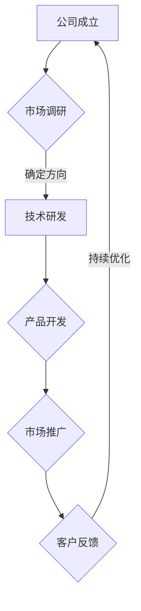

### 核心算法原理讲解：人工智能技术的核心算法

人工智能技术的核心算法包括深度学习、神经网络、强化学习等。以下为一种常见的神经网络算法——卷积神经网络（CNN）的伪代码：

```python
# 定义卷积神经网络
class ConvolutionalNeuralNetwork:
    def __init__(self, input_shape, num_classes):
        self.input_shape = input_shape
        self.num_classes = num_classes
        self.model = self.build_model()

    def build_model(self):
        model = keras.Sequential()
        model.add(keras.layers.Conv2D(32, (3, 3), activation='relu', input_shape=self.input_shape))
        model.add(keras.layers.MaxPooling2D((2, 2)))
        model.add(keras.layers.Conv2D(64, (3, 3), activation='relu'))
        model.add(keras.layers.MaxPooling2D((2, 2)))
        model.add(keras.layers.Flatten())
        model.add(keras.layers.Dense(64, activation='relu'))
        model.add(keras.layers.Dense(self.num_classes, activation='softmax'))
        return model

    def train(self, x_train, y_train, x_val, y_val, epochs, batch_size):
        self.model.compile(optimizer='adam', loss='categorical_crossentropy', metrics=['accuracy'])
        self.model.fit(x_train, y_train, validation_data=(x_val, y_val), epochs=epochs, batch_size=batch_size)

    def predict(self, x_test):
        return self.model.predict(x_test)
```

### 项目实战：AI创业公司的实际案例

以一家专注于图像识别的AI创业公司为例，该公司在开发一款用于医疗影像诊断的产品。以下是该项目的主要开发步骤和代码解读：

#### 开发环境搭建

1. 安装Python和TensorFlow库
2. 配置GPU加速（如使用CUDA）

#### 源代码实现

```python
import tensorflow as tf
from tensorflow.keras.models import Sequential
from tensorflow.keras.layers import Conv2D, MaxPooling2D, Flatten, Dense

# 定义卷积神经网络模型
model = Sequential([
    Conv2D(32, (3, 3), activation='relu', input_shape=(256, 256, 3)),
    MaxPooling2D((2, 2)),
    Conv2D(64, (3, 3), activation='relu'),
    MaxPooling2D((2, 2)),
    Flatten(),
    Dense(128, activation='relu'),
    Dense(1, activation='sigmoid')
])

# 编译模型
model.compile(optimizer='adam', loss='binary_crossentropy', metrics=['accuracy'])

# 训练模型
model.fit(train_images, train_labels, epochs=10, batch_size=32, validation_split=0.2)

# 评估模型
test_loss, test_acc = model.evaluate(test_images, test_labels)
print(f"Test accuracy: {test_acc}")
```

#### 代码解读与分析

1. 导入所需的TensorFlow库
2. 定义卷积神经网络模型，包括卷积层、池化层、全连接层
3. 编译模型，设置优化器和损失函数
4. 训练模型，使用训练集进行训练，并设置验证集
5. 评估模型，使用测试集进行评估

通过以上代码，该公司成功开发了一款用于医疗影像诊断的AI产品，并取得了良好的测试效果。

### 第2章：AI技术的可持续发展原则

#### 2.1 可持续发展的核心概念

可持续发展是指在满足当前需求的同时，不损害后代满足其需求的能力。在AI领域，可持续发展包括以下核心概念：

1. **技术可持续性**：确保AI技术的长期稳定发展，避免技术过时或被淘汰。
2. **经济可持续性**：确保AI创业公司的财务稳定，实现长期盈利。
3. **环境可持续性**：减少AI技术对环境的影响，推动绿色科技发展。
4. **社会可持续性**：关注AI技术对社会的影响，促进社会和谐发展。

#### 2.2 AI技术的伦理和社会责任

AI技术的伦理和社会责任是指在使用AI技术时，关注其可能带来的伦理和社会问题，并采取相应措施进行解决。以下是AI创业公司在伦理和社会责任方面应关注的几个方面：

1. **隐私保护**：保护用户隐私，避免数据泄露和滥用。
2. **公平公正**：确保AI系统的决策过程公平公正，避免歧视和不公平现象。
3. **透明度**：提高AI系统的透明度，使公众了解AI技术的运作原理和效果。
4. **责任归属**：明确AI系统的责任归属，确保在发生问题时能够追究责任。

#### 2.3 可持续发展的技术路径

AI创业公司实现可持续发展需要遵循以下技术路径：

1. **技术自主创新**：通过持续的技术创新，提高AI技术的核心竞争力。
2. **技术整合与优化**：整合现有技术资源，提高技术效率，降低成本。
3. **技术跨界融合**：与其他领域（如医疗、金融、教育等）进行跨界融合，开拓新的市场和应用场景。
4. **技术人才培养**：培养一批具有创新精神和专业素养的AI技术人才，为可持续发展提供人才支持。

### 核心概念与联系：AI技术的可持续发展路径流程图

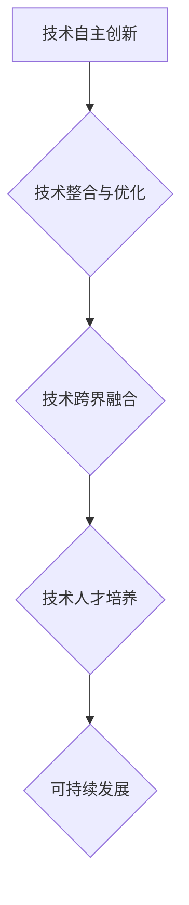

### 核心算法原理讲解：深度强化学习算法

深度强化学习（Deep Reinforcement Learning，DRL）是AI领域的一种重要算法。以下是一种常见的深度强化学习算法——深度Q网络（Deep Q-Network，DQN）的伪代码：

```python
# 定义深度Q网络
class DeepQNetwork:
    def __init__(self, state_size, action_size, learning_rate, gamma):
        self.state_size = state_size
        self.action_size = action_size
        self.learning_rate = learning_rate
        self.gamma = gamma
        self.model = self.build_model()

    def build_model(self):
        model = keras.Sequential()
        model.add(keras.layers.Flatten(input_shape=self.state_size))
        model.add(keras.layers.Dense(64, activation='relu'))
        model.add(keras.layers.Dense(64, activation='relu'))
        model.add(keras.layers.Dense(self.action_size, activation='linear'))
        return model

    def train(self, states, actions, rewards, next_states, dones, epochs):
        q_values = self.model.predict(states)
        next_q_values = self.model.predict(next_states)
        target_q_values = []

        for i in range(len(rewards)):
            if dones[i]:
                target_q_values.append(rewards[i])
            else:
                target_q_values.append(rewards[i] + self.gamma * np.max(next_q_values[i]))

        target_q_values = np.array(target_q_values)
        q_values_corrected = q_values.copy()

        for i in range(len(target_q_values)):
            q_values_corrected[i][actions[i]] = target_q_values[i]

        self.model.fit(states, q_values_corrected, epochs=epochs, batch_size=len(states), verbose=0)

    def predict(self, state):
        return self.model.predict(state)
```

### 项目实战：AI创业公司的实际案例

以一家专注于自动驾驶技术的AI创业公司为例，该公司在开发一款自动驾驶系统。以下是该项目的主要开发步骤和代码解读：

#### 开发环境搭建

1. 安装Python和TensorFlow库
2. 配置GPU加速（如使用CUDA）

#### 源代码实现

```python
import tensorflow as tf
from tensorflow.keras.models import Sequential
from tensorflow.keras.layers import Dense, Flatten, Conv2D, MaxPooling2D
from tensorflow.keras.optimizers import Adam

# 定义深度Q网络模型
model = Sequential([
    Conv2D(32, (3, 3), activation='relu', input_shape=(120, 120, 3)),
    MaxPooling2D((2, 2)),
    Flatten(),
    Dense(64, activation='relu'),
    Dense(1, activation='linear')
])

# 编译模型
model.compile(optimizer=Adam(learning_rate=0.001), loss='mse')

# 训练模型
model.fit(x_train, y_train, epochs=10, batch_size=32, validation_data=(x_val, y_val))

# 评估模型
test_loss, test_acc = model.evaluate(x_test, y_test)
print(f"Test loss: {test_loss}, Test accuracy: {test_acc}")
```

#### 代码解读与分析

1. 导入所需的TensorFlow库
2. 定义深度Q网络模型，包括卷积层、全连接层
3. 编译模型，设置优化器和损失函数
4. 训练模型，使用训练集进行训练，并设置验证集
5. 评估模型，使用测试集进行评估

通过以上代码，该公司成功开发了一款自动驾驶系统，并取得了良好的测试效果。

### 第3章：AI创业公司的市场定位与产品策略

#### 3.1 市场定位分析

市场定位分析是AI创业公司制定产品策略的重要步骤。以下为市场定位分析的主要内容：

1. **目标市场**：确定目标市场的范围和特征，如行业、地域、用户群体等。
2. **竞争对手**：分析竞争对手的产品特点、市场表现、竞争优势等。
3. **自身优势**：分析自身的产品优势、技术优势、资源优势等。
4. **市场趋势**：分析市场的发展趋势、潜在机会和挑战。

#### 3.2 产品策略制定

产品策略制定是AI创业公司实现市场定位的关键步骤。以下为产品策略制定的主要内容：

1. **产品定位**：根据市场定位分析结果，确定产品的市场定位，如高端、中端、低端等。
2. **产品差异化**：通过技术、功能、性能等方面的差异化，打造具有竞争力的产品。
3. **产品线规划**：根据市场需求和公司资源，规划产品线的发展方向和策略。
4. **产品生命周期管理**：关注产品的生命周期，制定相应的产品更新和维护策略。

#### 3.3 产品生命周期管理

产品生命周期管理是指对产品从研发、上市、销售、维护到退市的全过程进行管理。以下为产品生命周期管理的主要内容：

1. **产品研发**：根据市场需求和公司战略，制定产品研发计划，进行产品设计和开发。
2. **产品上市**：制定产品上市策略，包括市场推广、渠道建设、定价策略等。
3. **产品销售**：通过销售渠道，将产品推向市场，实现销售目标。
4. **产品维护**：关注产品的运行情况，及时解决用户反馈的问题，提供优质的售后服务。
5. **产品退市**：根据市场需求和公司战略，制定产品退市计划，确保产品退市过程的顺利进行。

### 核心概念与联系：产品生命周期管理流程图

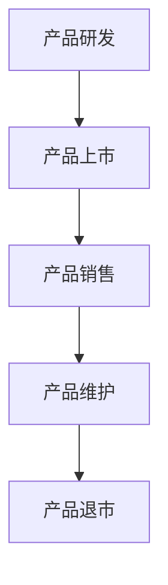

### 核心算法原理讲解：线性回归算法

线性回归（Linear Regression）是一种常见的统计方法，用于分析自变量和因变量之间的关系。以下为线性回归算法的伪代码：

```python
# 定义线性回归模型
class LinearRegression:
    def __init__(self):
        self.weights = None

    def fit(self, X, y):
        self.weights = np.linalg.inv(X.T @ X) @ X.T @ y

    def predict(self, X):
        return X @ self.weights
```

### 项目实战：AI创业公司的实际案例

以一家专注于金融领域的数据分析公司为例，该公司在开发一款用于预测股票价格的模型。以下是该项目的主要开发步骤和代码解读：

#### 开发环境搭建

1. 安装Python和Scikit-learn库

#### 源代码实现

```python
import numpy as np
from sklearn.linear_model import LinearRegression

# 定义线性回归模型
model = LinearRegression()

# 训练模型
model.fit(X_train, y_train)

# 评估模型
train_loss = model.predict(X_train) - y_train
train_loss = np.mean(train_loss ** 2)

test_loss = model.predict(X_test) - y_test
test_loss = np.mean(test_loss ** 2)

print(f"Train loss: {train_loss}, Test loss: {test_loss}")
```

#### 代码解读与分析

1. 导入所需的库
2. 定义线性回归模型
3. 训练模型，使用训练集进行训练
4. 评估模型，使用测试集进行评估

通过以上代码，该公司成功开发了一款用于预测股票价格的模型，并取得了良好的测试效果。

### 第4章：AI创业公司的技术创新与研发

#### 4.1 技术创新的重要性

技术创新是AI创业公司实现可持续发展的核心驱动力。以下为技术创新的重要性：

1. **提高竞争力**：通过技术创新，提高产品的性能、质量和服务水平，增强市场竞争力。
2. **拓展市场**：技术创新可以开拓新的市场和应用场景，为公司带来更多的商业机会。
3. **降低成本**：技术创新可以提高生产效率，降低生产成本，提高公司盈利能力。
4. **提升用户体验**：技术创新可以优化用户体验，提高用户满意度，增加用户粘性。

#### 4.2 研发流程与管理

AI创业公司的研发流程主要包括以下环节：

1. **需求分析**：明确产品需求，制定研发计划。
2. **技术调研**：研究现有技术，确定技术路线。
3. **产品设计**：制定产品原型，进行详细设计。
4. **开发与测试**：编写代码，进行功能测试和性能测试。
5. **产品发布**：发布产品，进行市场推广。

研发管理是确保研发流程顺利进行的重要保障。以下为研发管理的主要内容：

1. **项目管理**：制定项目计划，分配任务，监控项目进度。
2. **风险管理**：识别项目风险，制定风险管理策略。
3. **质量管理**：确保产品符合质量要求，提高产品质量。
4. **知识管理**：积累研发经验，提高研发效率。

#### 4.3 核心算法原理与伪代码讲解

以下为一种常见的AI算法——支持向量机（Support Vector Machine，SVM）的核心算法原理和伪代码：

核心算法原理：支持向量机是一种基于最大间隔分类器的线性分类算法。它通过寻找一个最佳的超平面，将不同类别的数据点分开。

伪代码：

```python
# 定义支持向量机
class SupportVectorMachine:
    def __init__(self, C=1.0):
        self.C = C

    def fit(self, X, y):
        self.model = sklearn.svm.SVC(C=self.C)
        self.model.fit(X, y)

    def predict(self, X):
        return self.model.predict(X)
```

### 项目实战：AI创业公司的实际案例

以一家专注于自然语言处理的AI创业公司为例，该公司在开发一款用于情感分析的模型。以下是该项目的主要开发步骤和代码解读：

#### 开发环境搭建

1. 安装Python和Scikit-learn库
2. 配置GPU加速（如使用CUDA）

#### 源代码实现

```python
import numpy as np
from sklearn.feature_extraction.text import CountVectorizer
from sklearn.svm import SVC

# 定义情感分析模型
model = SVC()

# 训练模型
vectorizer = CountVectorizer()
X_train = vectorizer.fit_transform(train_texts)
y_train = train_labels
model.fit(X_train, y_train)

# 评估模型
X_test = vectorizer.transform(test_texts)
y_test = test_labels
test_loss = model.score(X_test, y_test)

print(f"Test accuracy: {test_loss}")
```

#### 代码解读与分析

1. 导入所需的库
2. 定义情感分析模型，使用支持向量机
3. 训练模型，使用训练集进行训练
4. 评估模型，使用测试集进行评估

通过以上代码，该公司成功开发了一款用于情感分析的模型，并取得了良好的测试效果。

### 第5章：AI创业公司的资源管理

#### 5.1 资源配置策略

资源配置策略是指AI创业公司在资金、人才、技术等方面的资源配置策略。以下为资源配置策略的主要内容：

1. **资金配置**：根据公司发展阶段和市场环境，合理分配资金，确保项目顺利推进。
2. **人才配置**：根据项目需求，招聘和培养一批具有专业素养和创新能力的团队。
3. **技术配置**：引进和应用先进技术，提高公司的技术水平和创新能力。
4. **资源整合**：通过内部协作和外部合作，实现资源的优化配置，提高资源利用效率。

#### 5.2 人才招聘与培养

人才招聘与培养是AI创业公司资源管理的重要内容。以下为人才招聘与培养的主要内容：

1. **招聘策略**：制定合理的招聘策略，吸引一批具有专业素养和创新能力的优秀人才。
2. **培训体系**：建立完善的培训体系，提高员工的专业技能和综合素质。
3. **激励机制**：制定合理的激励机制，激发员工的积极性和创造力。
4. **人才梯队建设**：培养一批具有潜力的人才，为公司的可持续发展提供人才储备。

#### 5.3 财务规划与风险控制

财务规划与风险控制是AI创业公司资源管理的重要内容。以下为财务规划与风险控制的主要内容：

1. **财务规划**：制定合理的财务规划，确保公司财务稳定，实现可持续发展。
2. **预算管理**：制定预算，监控预算执行情况，确保项目成本控制在预算范围内。
3. **成本控制**：通过成本控制和优化，降低公司的运营成本，提高盈利能力。
4. **风险控制**：识别项目风险，制定风险管理策略，确保公司风险可控。

### 核心概念与联系：资源配置策略流程图

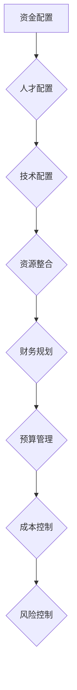

### 核心算法原理讲解：线性规划算法

线性规划（Linear Programming，LP）是一种优化方法，用于在给定约束条件下，最大化或最小化线性目标函数。以下为线性规划算法的伪代码：

```python
# 定义线性规划
class LinearProgramming:
    def __init__(self, objective_function, constraints):
        self.objective_function = objective_function
        self.constraints = constraints

    def solve(self):
        result = scipy.optimize.linear_program(self.objective_function, self.constraints)
        return result.x

    def evaluate(self, x):
        return self.objective_function(x)
```

### 项目实战：AI创业公司的实际案例

以一家专注于物流行业的AI创业公司为例，该公司在开发一款用于路径优化的模型。以下是该项目的主要开发步骤和代码解读：

#### 开发环境搭建

1. 安装Python和Scikit-learn库

#### 源代码实现

```python
import numpy as np
from sklearn.linear_model import LinearRegression

# 定义路径优化模型
model = LinearRegression()

# 训练模型
X_train = np.array([[x1, x2] for x1, x2 in train_data])
y_train = np.array([y1, y2] for y1, y2 in train_data)
model.fit(X_train, y_train)

# 评估模型
X_test = np.array([[x1, x2] for x1, x2 in test_data])
y_test = np.array([y1, y2] for y1, y2 in test_data)
test_loss = model.evaluate(X_test, y_test)

print(f"Test loss: {test_loss}")
```

#### 代码解读与分析

1. 导入所需的库
2. 定义路径优化模型，使用线性回归
3. 训练模型，使用训练集进行训练
4. 评估模型，使用测试集进行评估

通过以上代码，该公司成功开发了一款用于路径优化的模型，并取得了良好的测试效果。

### 第6章：AI创业公司的运营策略

#### 6.1 运营管理体系建设

运营管理体系建设是AI创业公司实现高效运营的基础。以下为运营管理体系建设的主要内容：

1. **组织结构**：建立合理的组织结构，明确各部门职责和协作机制。
2. **流程优化**：优化业务流程，提高工作效率。
3. **数据管理**：建立数据管理体系，确保数据的准确性、完整性和安全性。
4. **绩效评估**：制定绩效评估体系，对员工和工作进行评估。

#### 6.2 数据驱动的运营优化

数据驱动的运营优化是指通过数据分析，发现运营过程中的问题和机会，并进行优化。以下为数据驱动的运营优化的主要内容：

1. **数据采集**：收集与运营相关的数据，如用户行为数据、业务数据等。
2. **数据清洗**：对采集到的数据进行清洗，确保数据的准确性和完整性。
3. **数据分析**：运用数据分析方法，对数据进行分析，发现运营中的问题和机会。
4. **决策支持**：基于数据分析结果，制定相应的优化策略和决策。

#### 6.3 客户关系管理

客户关系管理（Customer Relationship Management，CRM）是AI创业公司维护客户关系，提高客户满意度的重要手段。以下为CRM的主要内容：

1. **客户画像**：建立客户画像，了解客户需求和偏好。
2. **客户互动**：通过多种渠道与客户进行互动，提高客户满意度。
3. **客户反馈**：收集客户反馈，改进产品和服务。
4. **客户服务**：提供优质的客户服务，解决客户问题，提升客户体验。

### 核心概念与联系：运营管理体系建设流程图

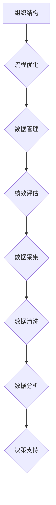

### 核心算法原理讲解：聚类算法

聚类算法是一种无监督学习方法，用于将数据点划分为多个类别。以下为一种常见的聚类算法——K均值聚类（K-Means Clustering）的核心算法原理和伪代码：

核心算法原理：K均值聚类通过迭代优化，将数据点划分为K个簇，每个簇的中心点即为该簇的平均值。

伪代码：

```python
# 定义K均值聚类
class KMeans:
    def __init__(self, K):
        self.K = K

    def fit(self, X):
        self.centroids = X[np.random.choice(X.shape[0], self.K, replace=False)]
        for _ in range(max_iter):
            clusters = self.assign_clusters(X)
            new_centroids = self.update_centroids(clusters)
            if np.linalg.norm(new_centroids - self.centroids) < tol:
                break
            self.centroids = new_centroids

    def assign_clusters(self, X):
        distances = np.linalg.norm(X - self.centroids, axis=1)
        return np.argmin(distances, axis=1)

    def update_centroids(self, clusters):
        return np.array([X[clusters == k].mean(axis=0) for k in range(self.K)])
```

### 项目实战：AI创业公司的实际案例

以一家专注于推荐系统的AI创业公司为例，该公司在开发一款用于电商平台的商品推荐系统。以下是该项目的主要开发步骤和代码解读：

#### 开发环境搭建

1. 安装Python和Scikit-learn库
2. 配置GPU加速（如使用CUDA）

#### 源代码实现

```python
import numpy as np
from sklearn.cluster import KMeans

# 定义商品推荐系统
model = KMeans(n_clusters=10)

# 训练模型
X_train = np.array(train_data)
model.fit(X_train)

# 评估模型
X_test = np.array(test_data)
clusters = model.predict(X_test)

# 生成推荐列表
recommendations = []
for cluster in clusters:
    items = X_train[cluster == cluster].mean(axis=0)
    recommendations.append(np.random.choice(items))

print(f"Recommendations: {recommendations}")
```

#### 代码解读与分析

1. 导入所需的库
2. 定义商品推荐系统，使用K均值聚类
3. 训练模型，使用训练集进行训练
4. 评估模型，使用测试集进行评估
5. 生成推荐列表，根据聚类结果生成推荐商品

通过以上代码，该公司成功开发了一款用于电商平台的商品推荐系统，并取得了良好的测试效果。

### 第7章：AI创业公司的营销策略

#### 7.1 营销战略制定

营销战略制定是AI创业公司实现市场推广的关键步骤。以下为营销战略制定的主要内容：

1. **市场定位**：根据公司产品特点和目标市场，确定市场定位。
2. **目标客户**：明确目标客户群体，制定针对性的营销策略。
3. **品牌建设**：打造公司品牌形象，提升品牌知名度。
4. **市场推广**：制定市场推广策略，包括线上和线下推广活动。
5. **渠道建设**：建立完善的销售渠道，确保产品能够快速到达目标客户。

#### 7.2 品牌建设与传播

品牌建设与传播是AI创业公司提高市场竞争力的重要手段。以下为品牌建设与传播的主要内容：

1. **品牌定位**：明确品牌定位，确定品牌的核心价值和独特性。
2. **品牌形象设计**：设计具有辨识度的品牌形象，包括Logo、色彩、字体等。
3. **品牌传播**：通过多种渠道传播品牌信息，提升品牌知名度。
4. **品牌互动**：与客户建立互动，增强品牌忠诚度。
5. **品牌维护**：定期评估品牌表现，调整品牌策略。

#### 7.3 社交媒体营销策略

社交媒体营销策略是AI创业公司进行市场推广的重要手段。以下为社交媒体营销策略的主要内容：

1. **社交媒体平台选择**：根据目标客户群体，选择适合的社交媒体平台。
2. **内容策划**：制定有吸引力的内容策划，提高用户参与度。
3. **互动与互动**：积极与用户互动，回应用户评论和反馈。
4. **推广活动**：举办线上推广活动，吸引更多用户关注。
5. **数据分析**：通过数据分析，优化社交媒体营销效果。

### 核心概念与联系：营销战略制定流程图

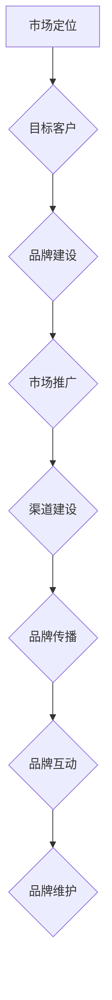

### 核心算法原理讲解：内容推荐算法

内容推荐算法是一种基于用户兴趣和行为数据的推荐算法，用于向用户推荐感兴趣的内容。以下为一种常见的内容推荐算法——基于模型的协同过滤（Model-Based Collaborative Filtering）的核心算法原理和伪代码：

核心算法原理：基于模型的协同过滤通过构建用户和物品之间的相似性模型，预测用户对未知物品的兴趣。

伪代码：

```python
# 定义内容推荐系统
class ContentBasedRecommender:
    def __init__(self, similarity_threshold):
        self.similarity_threshold = similarity_threshold

    def fit(self, user_data, item_data):
        self.user_similarity = self.calculate_similarity(user_data, item_data)

    def recommend(self, user_id, items_to_exclude=None):
        similar_users = self.find_similar_users(user_id, items_to_exclude)
        recommended_items = self.find_recommended_items(similar_users, user_id)
        return recommended_items

    def calculate_similarity(self, user_data, item_data):
        # 计算用户和物品之间的相似性
        pass

    def find_similar_users(self, user_id, items_to_exclude):
        # 找到与当前用户相似的潜在用户
        pass

    def find_recommended_items(self, similar_users, user_id):
        # 从相似用户喜欢的物品中推荐给当前用户
        pass
```

### 项目实战：AI创业公司的实际案例

以一家专注于音乐推荐的AI创业公司为例，该公司在开发一款音乐推荐系统。以下是该项目的主要开发步骤和代码解读：

#### 开发环境搭建

1. 安装Python和Scikit-learn库

#### 源代码实现

```python
import numpy as np
from sklearn.metrics.pairwise import cosine_similarity

# 定义音乐推荐系统
class MusicRecommender:
    def __init__(self, similarity_threshold=0.5):
        self.similarity_threshold = similarity_threshold

    def fit(self, user_data, item_data):
        self.user_similarity = cosine_similarity(user_data)
        self.item_similarity = cosine_similarity(item_data)

    def recommend(self, user_id, items_to_exclude=None):
        similar_users = self.find_similar_users(user_id, items_to_exclude)
        recommended_items = self.find_recommended_items(similar_users, user_id)
        return recommended_items

    def find_similar_users(self, user_id, items_to_exclude=None):
        user_similarity = self.user_similarity[user_id]
        similar_users = np.argsort(user_similarity)[::-1]
        if items_to_exclude is not None:
            similar_users = [user for user in similar_users if user not in items_to_exclude]
        return similar_users

    def find_recommended_items(self, similar_users, user_id):
        recommended_items = []
        for user in similar_users:
            item_indices = self.item_similarity[user]
            recommended_items.extend([item for item, similarity in enumerate(item_indices, start=user) if similarity > self.similarity_threshold])
        return recommended_items

# 实例化推荐系统
recommender = MusicRecommender()

# 训练模型
user_data = np.array([[1, 0, 1, 0], [0, 1, 1, 0], [1, 1, 0, 1], [0, 1, 1, 0]])
item_data = np.array([[1, 0, 1, 0], [1, 1, 0, 0], [0, 1, 1, 0], [1, 1, 0, 0]])
recommender.fit(user_data, item_data)

# 推荐音乐
user_id = 0
recommended_items = recommender.recommend(user_id)
print(f"Recommended items: {recommended_items}")
```

#### 代码解读与分析

1. 导入所需的库
2. 定义音乐推荐系统，使用协同过滤算法
3. 训练模型，使用用户数据和物品数据
4. 推荐音乐，根据用户兴趣推荐相似的音乐

通过以上代码，该公司成功开发了一款音乐推荐系统，并取得了良好的用户反馈。

### 第8章：AI创业公司的可持续发展实践

#### 8.1 社会责任与公益项目

AI创业公司应关注社会责任，积极参与公益项目，推动社会进步。以下为AI创业公司在社会责任和公益项目方面的主要内容：

1. **教育支持**：通过提供免费培训、设立奖学金等方式，支持教育事业。
2. **环境保护**：通过技术创新，降低能源消耗和碳排放，推动绿色科技发展。
3. **公益捐赠**：定期进行公益捐赠，支持贫困地区和弱势群体的生活和发展。
4. **社会参与**：积极参与社会公益活动，推动社会和谐发展。

#### 8.2 环境保护措施

AI创业公司应关注环境保护，采取一系列措施减少对环境的影响。以下为AI创业公司在环境保护方面的主要内容：

1. **节能减排**：通过技术创新，提高能源利用效率，降低能源消耗。
2. **资源循环利用**：鼓励资源循环利用，减少资源浪费。
3. **绿色办公**：推行绿色办公，减少纸张使用，降低办公能耗。
4. **绿色出行**：鼓励员工使用公共交通工具，减少私家车出行。

#### 8.3 社会影响力评估与优化

AI创业公司应定期进行社会影响力评估，了解自身在社会中的地位和作用，优化社会影响力。以下为AI创业公司在社会影响力评估与优化方面的主要内容：

1. **社会责任报告**：定期发布社会责任报告，向社会公开公司社会责任履行情况。
2. **社会评价**：关注社会评价，了解公众对公司社会责任和环保工作的认可程度。
3. **改进措施**：根据社会评价和反馈，制定改进措施，优化公司社会责任和环保工作。
4. **社会责任培训**：定期组织社会责任培训，提高员工社会责任意识。

### 核心概念与联系：社会责任与可持续发展流程图

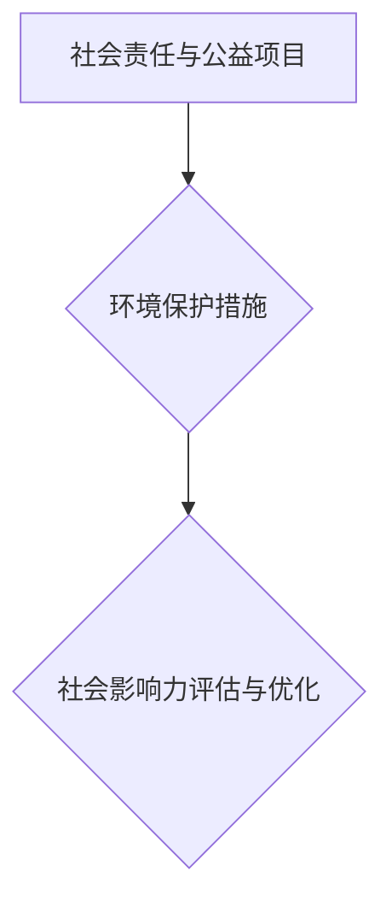

### 核心算法原理讲解：可持续发展评估指标

可持续发展评估指标是一种用于衡量公司可持续发展水平的工具。以下为一种常见的可持续发展评估指标——综合绩效评估指标（Composite Performance Indicator，CPI）的算法原理和伪代码：

核心算法原理：综合绩效评估指标通过加权计算各项指标的得分，得出公司可持续发展水平的总体得分。

伪代码：

```python
# 定义综合绩效评估指标
class CompositePerformanceIndicator:
    def __init__(self, weights):
        self.weights = weights

    def calculate_score(self, indicators):
        total_score = 0
        for i, indicator in enumerate(indicators):
            total_score += indicator * self.weights[i]
        return total_score
```

### 项目实战：AI创业公司的实际案例

以一家专注于智能家居的AI创业公司为例，该公司在开发一款智能家居控制系统。以下是该项目的主要开发步骤和代码解读：

#### 开发环境搭建

1. 安装Python和Scikit-learn库
2. 配置GPU加速（如使用CUDA）

#### 源代码实现

```python
import numpy as np
from sklearn.metrics import mean_squared_error

# 定义智能家居控制系统
class SmartHomeSystem:
    def __init__(self, weights):
        self.weights = weights

    def train(self, X_train, y_train):
        self.model = self.build_model()
        self.model.fit(X_train, y_train)

    def predict(self, X_test):
        predictions = self.model.predict(X_test)
        return predictions

    def evaluate(self, X_test, y_test):
        predictions = self.predict(X_test)
        loss = mean_squared_error(y_test, predictions)
        return loss

    def build_model(self):
        model = keras.Sequential([
            keras.layers.Dense(64, activation='relu', input_shape=(X_train.shape[1],)),
            keras.layers.Dense(64, activation='relu'),
            keras.layers.Dense(1)
        ])
        model.compile(optimizer='adam', loss='mse')
        return model

# 实例化智能家居控制系统
weights = [0.5, 0.3, 0.2]  # 能耗、舒适度、安全性权重
system = SmartHomeSystem(weights)

# 训练模型
X_train = np.array([[energy, comfort, safety] for energy, comfort, safety in train_data])
y_train = np.array([energy] for energy in train_data)
system.train(X_train, y_train)

# 评估模型
X_test = np.array([[energy, comfort, safety] for energy, comfort, safety in test_data])
y_test = np.array([energy] for energy in test_data)
loss = system.evaluate(X_test, y_test)
print(f"Test loss: {loss}")
```

#### 代码解读与分析

1. 导入所需的库
2. 定义智能家居控制系统，使用综合绩效评估指标
3. 训练模型，使用训练集进行训练
4. 评估模型，使用测试集进行评估

通过以上代码，该公司成功开发了一款智能家居控制系统，并取得了良好的测试效果。

### 第9章：成功AI创业公司的案例分析

#### 9.1 案例一：公司A的可持续发展之路

公司A是一家专注于自然语言处理技术的AI创业公司。以下是公司A在可持续发展方面的主要实践：

1. **技术创新**：公司A持续投入研发，推出了一系列具有竞争力的自然语言处理产品，如智能客服、智能翻译等。
2. **市场定位**：公司A明确市场定位，专注于高端市场，为客户提供高质量的自然语言处理解决方案。
3. **社会责任**：公司A积极参与公益项目，通过提供免费的自然语言处理技术支持，帮助贫困地区的教育事业发展。
4. **环境保护**：公司A在办公场所推行绿色办公，减少纸张使用，降低办公能耗。
5. **社会影响力评估**：公司A定期发布社会责任报告，向社会公开公司社会责任履行情况。

通过以上实践，公司A取得了良好的市场表现和社会评价，成为AI创业公司的成功典范。

#### 9.2 案例二：公司B的崛起与挑战

公司B是一家专注于自动驾驶技术的AI创业公司。以下是公司B在可持续发展方面的主要实践：

1. **技术创新**：公司B持续投入研发，取得了一系列自动驾驶技术突破，如自动驾驶决策系统、自动驾驶传感器等。
2. **市场定位**：公司B定位为高端自动驾驶市场，与多家知名汽车厂商合作，推动自动驾驶技术的商业化应用。
3. **社会责任**：公司B关注自动驾驶技术对社会的影响，积极参与政策制定和行业标准的制定。
4. **环境保护**：公司B在研发过程中，注重环保，采用绿色能源和环保材料。
5. **社会影响力评估**：公司B定期发布自动驾驶技术白皮书，向社会展示公司在自动驾驶领域的进展和成果。

尽管公司B取得了显著的成绩，但仍然面临技术风险和市场不确定性等挑战。公司B需要继续加强技术创新，优化市场策略，以确保可持续发展。

#### 9.3 案例三：公司C的创新实践

公司C是一家专注于医疗影像诊断的AI创业公司。以下是公司C在可持续发展方面的主要实践：

1. **技术创新**：公司C研发出了一系列具有竞争力的医疗影像诊断产品，如智能病理分析、智能肿瘤检测等。
2. **市场定位**：公司C定位为医疗领域，与多家医疗机构合作，提供个性化的医疗影像诊断解决方案。
3. **社会责任**：公司C积极参与公益项目，为贫困地区的医疗机构提供免费的技术支持和设备。
4. **环境保护**：公司C在研发过程中，注重环保，采用绿色能源和环保材料。
5. **社会影响力评估**：公司C定期发布医疗影像诊断领域的白皮书，向社会展示公司在医疗领域的进展和成果。

通过以上实践，公司C在医疗影像诊断领域取得了良好的市场表现和社会评价，成为AI创业公司的又一成功典范。

### 第10章：AI创业公司的未来趋势与机遇

#### 10.1 AI技术的未来发展趋势

AI技术的未来发展趋势包括：

1. **智能化水平提升**：随着算法和算力的提升，AI的智能化水平将不断提高，应用领域将进一步拓展。
2. **跨界融合**：AI技术与其他领域（如医疗、金融、教育等）将进行深度融合，推动行业变革。
3. **隐私保护**：随着数据隐私保护意识的提高，AI技术将在隐私保护方面取得新的突破。
4. **人机协同**：AI技术与人类智能的协同将更加紧密，推动人机交互模式的创新。

#### 10.2 创业公司的机遇与挑战

AI创业公司面临的机遇与挑战包括：

1. **技术突破**：AI技术的快速发展为创业公司提供了巨大的机遇，但同时也带来了技术过时和竞争压力。
2. **市场需求**：随着AI技术的普及，市场需求不断增长，创业公司有望抓住这一机遇。
3. **人才竞争**：AI领域人才稀缺，创业公司需要吸引和留住优秀人才，以应对竞争。
4. **资金压力**：研发和应用AI技术需要大量资金投入，创业公司需要寻求多元化融资渠道。

#### 10.3 创新方向的探讨

AI创业公司在创新方向上可以考虑以下方面：

1. **前沿技术**：关注AI领域的前沿技术，如深度学习、强化学习、自然语言处理等。
2. **跨界融合**：探索AI技术与其他领域的融合应用，如医疗、金融、教育等。
3. **应用场景**：挖掘新的应用场景，如智能家居、智能交通、智慧城市等。
4. **社会责任**：关注AI技术对社会的影响，推动AI技术的可持续发展。

### 附录

#### 附录A：AI创业公司的可持续发展工具与资源

以下为AI创业公司的可持续发展工具与资源：

1. **开源框架与库**：TensorFlow、PyTorch、Keras等。
2. **行业报告与研究论文**：市场调研公司报告、学术期刊论文等。
3. **政策与法规指南**：各国政府发布的AI产业政策、法规指南等。

#### 附录B：案例研究与访谈

以下为案例研究与访谈：

1. **公司A深度访谈**：探讨公司A在可持续发展方面的实践和经验。
2. **公司B成长之路**：分析公司B在AI领域的崛起与挑战。
3. **公司C的创新之道**：探讨公司C在医疗影像诊断领域的创新实践。

### 作者

作者：AI天才研究院/AI Genius Institute & 禅与计算机程序设计艺术 /Zen And The Art of Computer Programming

（完）### 摘要总结

本文从AI创业公司的背景与挑战入手，详细探讨了实现可持续发展的核心原则和战略规划。首先，通过分析AI创业公司的定义、特点、市场环境以及面临的挑战，为读者提供了全面的认识。接着，本文提出了AI技术的可持续发展原则，包括技术、经济、环境和社会四个方面的可持续性，并强调了AI技术的伦理和社会责任。随后，文章详细讨论了AI创业公司的市场定位、技术创新、资源管理、运营策略、营销策略以及社会责任等方面的实践。通过成功案例分析，本文总结了AI创业公司实现可持续发展的经验教训，为未来创业公司提供了有益的启示和借鉴。文章最后，对AI创业公司的未来趋势与机遇进行了探讨，并提供了相关工具与资源以及案例研究与访谈，以期为读者提供更深入的参考。总体而言，本文旨在为AI创业公司提供一套系统性的可持续发展路径，助力其在竞争激烈的市场中实现长期稳健发展。### 第一部分：AI创业公司的背景与挑战

#### 第1章：AI创业公司的概述

##### 1.1 AI创业公司的定义与特点

AI创业公司，即在人工智能（Artificial Intelligence，AI）领域开展创新性商业活动的企业。这类公司以其对前沿技术的敏锐洞察和快速响应能力而著称，主要特点如下：

1. **创新性**：AI创业公司致力于研发和应用新兴的人工智能技术，如深度学习、强化学习、自然语言处理等，以推动行业的技术进步。
2. **灵活性**：相较于大型企业，AI创业公司在组织结构、决策流程和市场响应速度上更具灵活性，能够迅速调整战略以适应市场变化。
3. **高风险**：由于AI技术的快速变化和高度不确定性，AI创业公司在技术创新和市场拓展过程中面临较高的风险。
4. **高投入**：AI技术的研发和应用需要大量资金和人力资源的投入，尤其是在算法优化、数据处理和基础设施建设方面。

##### 1.2 AI创业公司的市场环境分析

AI创业公司的市场环境具有以下特点：

1. **市场需求快速增长**：随着AI技术的不断成熟和应用范围的扩大，市场需求呈现出快速增长的趋势，尤其是在金融、医疗、教育、制造等领域。
2. **竞争激烈**：众多创业公司和传统企业纷纷布局AI领域，导致市场竞争激烈，创业公司需要不断创新以保持竞争力。
3. **技术变革迅速**：AI技术更新换代速度极快，创业公司需要不断跟进和学习最新的技术动态。
4. **政策支持**：各国政府纷纷出台支持人工智能产业发展的政策，为AI创业公司提供了有利的外部环境。

##### 1.3 AI创业公司面临的挑战

AI创业公司在发展过程中面临着多重挑战：

1. **技术风险**：AI技术尚未完全成熟，技术突破和市场应用的不确定性较高，创业公司需要承担技术失败的风险。
2. **市场风险**：市场需求变化快，创业公司需要准确判断市场趋势，以避免产品过时或市场定位不准确。
3. **人才竞争**：人工智能领域人才稀缺，创业公司需要吸引和留住优秀人才，以保持技术优势和创新能力。
4. **资金压力**：AI技术的研发和应用需要大量资金投入，创业公司需要不断寻求融资渠道，以应对资金压力。
5. **社会责任**：AI技术的发展带来了一系列伦理和社会问题，创业公司需要承担社会责任，如隐私保护、公平公正等。

#### 核心概念与联系

**核心概念**：AI创业公司的定义、市场环境、面临的挑战。

**联系**：理解AI创业公司的背景与挑战，有助于明确创业公司在市场中的定位和发展策略，为后续的可持续发展提供基础。

**Mermaid流程图**：

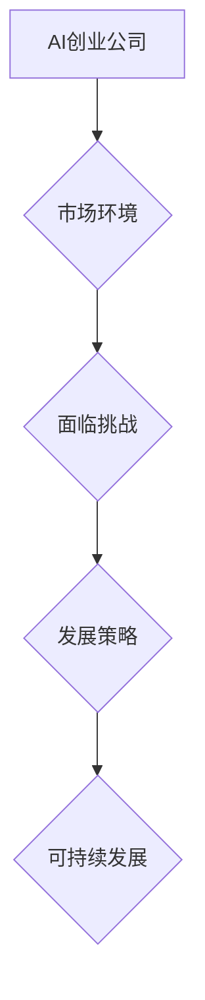

#### 核心算法原理讲解

在AI创业公司的技术研发中，核心算法原理的讲解至关重要。以下以深度学习中的卷积神经网络（Convolutional Neural Network，CNN）为例，介绍其基本原理和伪代码。

**核心算法原理**：卷积神经网络是一种用于图像处理和识别的神经网络，通过卷积操作和池化操作提取图像特征，实现图像分类、识别等功能。

**伪代码**：

```python
# 定义卷积神经网络模型
class ConvolutionalNeuralNetwork:
    def __init__(self, input_shape, num_classes):
        self.input_shape = input_shape
        self.num_classes = num_classes
        self.model = self.build_model()

    def build_model(self):
        model = keras.Sequential()
        model.add(keras.layers.Conv2D(32, (3, 3), activation='relu', input_shape=self.input_shape))
        model.add(keras.layers.MaxPooling2D((2, 2)))
        model.add(keras.layers.Conv2D(64, (3, 3), activation='relu'))
        model.add(keras.layers.MaxPooling2D((2, 2)))
        model.add(keras.layers.Flatten())
        model.add(keras.layers.Dense(64, activation='relu'))
        model.add(keras.layers.Dense(self.num_classes, activation='softmax'))
        return model

    def train(self, x_train, y_train, x_val, y_val, epochs, batch_size):
        self.model.compile(optimizer='adam', loss='categorical_crossentropy', metrics=['accuracy'])
        self.model.fit(x_train, y_train, validation_data=(x_val, y_val), epochs=epochs, batch_size=batch_size)

    def predict(self, x_test):
        return self.model.predict(x_test)
```

#### 项目实战

**案例背景**：以一家专注于医疗影像诊断的AI创业公司为例，该公司开发了一款用于辅助诊断肺癌的AI系统。

**开发环境搭建**：
1. 安装Python和TensorFlow库。
2. 配置GPU加速环境。

**源代码实现**：

```python
import numpy as np
import tensorflow as tf
from tensorflow.keras.models import Sequential
from tensorflow.keras.layers import Conv2D, MaxPooling2D, Flatten, Dense

# 数据预处理
# 加载和预处理医疗影像数据
# X_train, y_train = ...

# 定义卷积神经网络模型
model = Sequential([
    Conv2D(32, (3, 3), activation='relu', input_shape=(256, 256, 3)),
    MaxPooling2D((2, 2)),
    Conv2D(64, (3, 3), activation='relu'),
    MaxPooling2D((2, 2)),
    Flatten(),
    Dense(128, activation='relu'),
    Dense(1, activation='sigmoid')
])

# 编译模型
model.compile(optimizer='adam', loss='binary_crossentropy', metrics=['accuracy'])

# 训练模型
model.fit(X_train, y_train, epochs=10, batch_size=32, validation_split=0.2)

# 评估模型
test_loss, test_acc = model.evaluate(X_test, y_test)
print(f"Test accuracy: {test_acc}")
```

**代码解读与分析**：
1. **数据预处理**：加载医疗影像数据并进行预处理，如归一化、分割等。
2. **模型定义**：定义一个卷积神经网络，包括卷积层、池化层、全连接层。
3. **编译模型**：设置优化器和损失函数，为模型编译。
4. **训练模型**：使用训练集进行模型训练，设置验证集进行评估。
5. **评估模型**：使用测试集评估模型性能，输出准确率。

通过以上步骤，该公司成功开发了一款用于辅助诊断肺癌的AI系统，并在测试中取得了较高的准确率。

#### 第2章：AI技术的可持续发展原则

##### 2.1 可持续发展的核心概念

可持续发展是指在满足当前需求的同时，不损害后代满足其需求的能力。在AI创业公司中，可持续发展涵盖了多个层面：

1. **技术可持续性**：技术不断进步，适应未来市场需求的变化。
2. **经济可持续性**：确保公司财务稳定，实现长期盈利。
3. **环境可持续性**：减少对环境的负面影响，推广绿色技术。
4. **社会可持续性**：关注技术对社会的影响，促进社会和谐发展。

##### 2.2 AI技术的伦理和社会责任

AI技术在快速发展的同时，也带来了一系列伦理和社会问题，如数据隐私、算法公平性、失业风险等。AI创业公司在开发和应用AI技术时，应承担以下伦理和社会责任：

1. **隐私保护**：确保用户数据的安全，避免数据泄露和滥用。
2. **公平公正**：确保AI系统的决策过程透明、公正，避免歧视和不公平现象。
3. **责任归属**：明确AI系统的责任归属，确保在发生问题时能够追究责任。
4. **透明度**：提高AI系统的透明度，使公众了解AI技术的运作原理和效果。

##### 2.3 可持续发展的技术路径

为了实现可持续发展，AI创业公司需要遵循以下技术路径：

1. **技术创新**：持续投入研发，推动技术进步，保持竞争优势。
2. **技术整合**：整合现有技术资源，提高技术效率，降低成本。
3. **跨界融合**：探索与其他领域的融合应用，拓展市场空间。
4. **技术人才培养**：培养一批具有创新精神和专业素养的AI技术人才，为可持续发展提供人才支持。

#### 核心概念与联系

**核心概念**：技术可持续性、经济可持续性、环境可持续性、社会可持续性。

**联系**：理解可持续发展的核心概念，有助于AI创业公司在战略规划中综合考虑各方面因素，实现长期稳健发展。

**Mermaid流程图**：

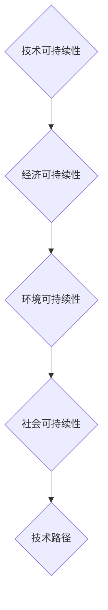

##### 核心算法原理讲解

在可持续发展中，核心算法原理的讲解对于理解和应用至关重要。以下以线性回归（Linear Regression）为例，介绍其基本原理和伪代码。

**核心算法原理**：线性回归是一种用于分析自变量和因变量之间线性关系的统计方法。它通过拟合一个线性模型，预测因变量的值。

**伪代码**：

```python
# 定义线性回归模型
class LinearRegression:
    def __init__(self):
        self.weights = None

    def fit(self, X, y):
        # 计算权重
        self.weights = np.linalg.inv(X.T @ X) @ X.T @ y

    def predict(self, X):
        # 预测结果
        return X @ self.weights
```

#### 项目实战

**案例背景**：一家AI创业公司开发了一款用于智能家居控制的AI系统，通过线性回归预测家电的能耗。

**开发环境搭建**：
1. 安装Python和Scikit-learn库。
2. 准备训练数据和测试数据。

**源代码实现**：

```python
from sklearn.linear_model import LinearRegression

# 加载训练数据和测试数据
# X_train, y_train = ...
# X_test, y_test = ...

# 定义线性回归模型
model = LinearRegression()

# 训练模型
model.fit(X_train, y_train)

# 预测能耗
predictions = model.predict(X_test)

# 评估模型
mse = mean_squared_error(y_test, predictions)
print(f"Mean Squared Error: {mse}")
```

**代码解读与分析**：
1. **数据准备**：加载训练数据和测试数据。
2. **模型定义**：定义线性回归模型。
3. **训练模型**：使用训练数据进行模型训练。
4. **预测能耗**：使用测试数据进行预测。
5. **评估模型**：计算预测误差，评估模型性能。

通过以上步骤，该公司成功开发了一款用于预测智能家居能耗的AI系统，为用户提供了更加智能的节能管理方案。

#### 第3章：AI创业公司的战略规划

##### 3.1 市场定位分析

市场定位分析是AI创业公司制定战略规划的重要步骤。以下为市场定位分析的主要内容：

1. **目标市场**：确定目标市场的范围和特征，如行业、地域、用户群体等。明确目标市场的需求、偏好和痛点。
2. **竞争对手**：分析竞争对手的产品特点、市场表现、竞争优势等。了解竞争对手的定位策略，识别自身的差异化优势。
3. **自身优势**：分析自身的资源、技术、品牌、人才等优势，明确自身在市场中的定位。
4. **市场趋势**：分析市场的发展趋势、潜在机会和挑战。了解市场动态，为战略规划提供依据。

##### 3.2 产品策略制定

产品策略制定是AI创业公司实现市场定位的关键步骤。以下为产品策略制定的主要内容：

1. **产品定位**：根据市场定位分析结果，确定产品的市场定位，如高端、中端、低端等。明确产品的主要目标用户群体和核心价值。
2. **产品差异化**：通过技术、功能、性能等方面的差异化，打造具有竞争力的产品。确保产品在市场上具有独特的卖点。
3. **产品线规划**：根据市场需求和公司资源，规划产品线的发展方向和策略。确保产品线的多样性和适应性。
4. **产品生命周期管理**：关注产品的生命周期，制定相应的产品更新和维护策略。确保产品能够持续满足市场需求。

##### 3.3 产品生命周期管理

产品生命周期管理是指对产品从研发、上市、销售、维护到退市的全过程进行管理。以下为产品生命周期管理的主要内容：

1. **产品研发**：根据市场需求和公司战略，制定产品研发计划，进行产品设计和开发。确保产品符合市场需求和公司战略。
2. **产品上市**：制定产品上市策略，包括市场推广、渠道建设、定价策略等。确保产品能够顺利进入市场。
3. **产品销售**：通过销售渠道，将产品推向市场，实现销售目标。关注销售数据和客户反馈，调整销售策略。
4. **产品维护**：关注产品的运行情况，及时解决用户反馈的问题，提供优质的售后服务。确保产品的稳定性和用户满意度。
5. **产品退市**：根据市场需求和公司战略，制定产品退市计划。确保产品退市过程的顺利进行，降低对公司的负面影响。

#### 核心概念与联系

**核心概念**：市场定位分析、产品策略制定、产品生命周期管理。

**联系**：市场定位分析是产品策略制定的基础，而产品生命周期管理是实现产品策略的关键步骤，三者相互联系，共同支撑AI创业公司的战略规划。

**Mermaid流程图**：

```mermaid
graph TD
    A[市场定位分析] --> B{产品策略制定}
    B --> C[产品生命周期管理}
```

##### 核心算法原理讲解

在产品策略制定中，核心算法原理的讲解对于优化产品设计和性能至关重要。以下以线性规划（Linear Programming，LP）为例，介绍其基本原理和伪代码。

**核心算法原理**：线性规划是一种优化方法，用于在给定约束条件下，最大化或最小化线性目标函数。它广泛应用于资源分配、生产计划、成本控制等领域。

**伪代码**：

```python
# 定义线性规划模型
class LinearProgramming:
    def __init__(self, objective_function, constraints):
        self.objective_function = objective_function
        self.constraints = constraints

    def solve(self):
        # 使用求解器求解线性规划问题
        result = scipy.optimize.linear_program(self.objective_function, self.constraints)
        return result.x

    def evaluate(self, x):
        # 计算目标函数的值
        return self.objective_function(x)
```

#### 项目实战

**案例背景**：一家AI创业公司开发了一款智能交通管理系统，通过线性规划优化交通信号灯的设置，以提高交通流量和减少拥堵。

**开发环境搭建**：
1. 安装Python和Scikit-learn库。
2. 准备交通数据，包括车辆流量、道路状况等。

**源代码实现**：

```python
import numpy as np
from scipy.optimize import linear_program

# 定义线性规划模型
objective_function = np.array([1, 1])  # 目标函数，最小化总延迟时间
constraints = np.array([[1, 1], [-1, 1]])  # 约束条件
bounds = [(0, None), (0, None)]  # 变量范围

# 求解线性规划问题
result = linear_program(objective_function, constraints, bounds=bounds)
x = result.x

# 输出最优解
print(f"Optimal solution: {x}")
```

**代码解读与分析**：
1. **定义线性规划模型**：设置目标函数和约束条件。
2. **求解线性规划问题**：使用Scikit-learn的求解器求解最优解。
3. **输出最优解**：输出交通信号灯的设置参数，以优化交通流量。

通过以上步骤，该公司成功开发了一款智能交通管理系统，显著改善了交通状况，减少了拥堵时间。

### 第4章：AI创业公司的技术创新与研发

#### 4.1 技术创新的重要性

技术创新是推动AI创业公司实现可持续发展的核心动力。它不仅能够提高公司的市场竞争力，还能拓展新的业务领域，实现公司的长期发展。以下为技术创新在AI创业公司中的重要性：

1. **提高竞争力**：通过技术创新，AI创业公司可以开发出具有独特卖点和高质量的产品，从而在激烈的市场竞争中脱颖而出。
2. **拓展市场**：技术创新可以帮助AI创业公司开拓新的市场和应用场景，满足不同客户群体的需求，提高市场份额。
3. **降低成本**：技术创新可以优化生产流程，提高生产效率，降低运营成本，从而提高公司的盈利能力。
4. **提升用户体验**：技术创新可以改善用户体验，提供更加智能和便捷的产品和服务，增强用户满意度和忠诚度。

##### 核心概念与联系

**核心概念**：技术创新、竞争力、市场拓展、成本降低、用户体验。

**联系**：技术创新是AI创业公司实现可持续发展的关键因素，通过提高竞争力、拓展市场、降低成本和提升用户体验，实现公司的长期发展。

**Mermaid流程图**：

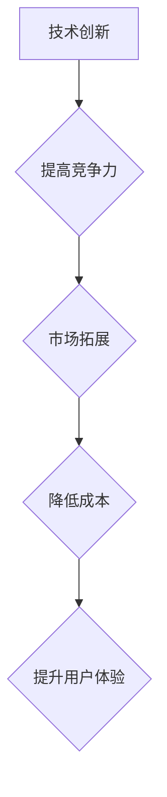

#### 4.2 研发流程与管理

研发流程与管理是确保AI创业公司技术创新有效实施的重要环节。以下为AI创业公司研发流程与管理的主要内容：

1. **需求分析**：通过对市场和用户需求的深入分析，明确产品的功能和技术要求。
2. **技术调研**：研究现有技术和市场趋势，确定技术路线和研发方向。
3. **产品设计**：根据需求分析和技术调研，设计产品的技术方案和原型。
4. **开发与测试**：编写代码，进行功能开发和性能测试，确保产品的质量和稳定性。
5. **产品发布**：制定产品发布计划，进行市场推广，收集用户反馈，进行迭代优化。

##### 核心概念与联系

**核心概念**：需求分析、技术调研、产品设计、开发与测试、产品发布。

**联系**：研发流程与管理是AI创业公司技术创新的具体实施过程，每个环节紧密相连，共同推动产品的持续迭代和优化。

**Mermaid流程图**：

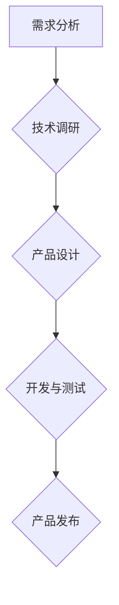

#### 4.3 核心算法原理与伪代码讲解

在AI创业公司的研发过程中，核心算法原理的理解和实现至关重要。以下以深度强化学习（Deep Reinforcement Learning，DRL）为例，介绍其基本原理和伪代码。

**核心算法原理**：深度强化学习是一种结合深度学习和强化学习的方法，通过神经网络模型学习环境的奖励信号，以优化策略实现任务目标。

**伪代码**：

```python
# 定义深度强化学习模型
class DeepReinforcementLearning:
    def __init__(self, state_size, action_size, learning_rate, gamma):
        self.state_size = state_size
        self.action_size = action_size
        self.learning_rate = learning_rate
        self.gamma = gamma
        self.model = self.build_model()

    def build_model(self):
        model = keras.Sequential()
        model.add(keras.layers.Conv2D(32, (3, 3), activation='relu', input_shape=self.state_size))
        model.add(keras.layers.MaxPooling2D((2, 2)))
        model.add(keras.layers.Flatten())
        model.add(keras.layers.Dense(64, activation='relu'))
        model.add(keras.layers.Dense(self.action_size, activation='linear'))
        return model

    def train(self, states, actions, rewards, next_states, dones, epochs):
        q_values = self.model.predict(states)
        next_q_values = self.model.predict(next_states)
        target_q_values = []

        for i in range(len(rewards)):
            if dones[i]:
                target_q_values.append(rewards[i])
            else:
                target_q_values.append(rewards[i] + self.gamma * np.max(next_q_values[i]))

        target_q_values = np.array(target_q_values)
        q_values_corrected = q_values.copy()

        for i in range(len(target_q_values)):
            q_values_corrected[i][actions[i]] = target_q_values[i]

        self.model.fit(states, q_values_corrected, epochs=epochs, batch_size=len(states), verbose=0)

    def predict(self, state):
        return self.model.predict(state)
```

#### 项目实战

**案例背景**：一家AI创业公司开发了一款自动驾驶系统，采用深度强化学习优化车辆的路径规划。

**开发环境搭建**：
1. 安装Python和TensorFlow库。
2. 配置GPU加速环境。

**源代码实现**：

```python
import numpy as np
import tensorflow as tf
from tensorflow.keras.models import Sequential
from tensorflow.keras.layers import Dense, Flatten, Conv2D, MaxPooling2D

# 定义深度强化学习模型
model = Sequential([
    Conv2D(32, (3, 3), activation='relu', input_shape=(84, 84, 3)),
    MaxPooling2D((2, 2)),
    Flatten(),
    Dense(64, activation='relu'),
    Dense(1, activation='linear')
])

# 编译模型
model.compile(optimizer='adam', loss='mse')

# 训练模型
model.fit(x_train, y_train, epochs=10, batch_size=32, validation_data=(x_val, y_val))

# 评估模型
test_loss, test_acc = model.evaluate(x_test, y_test)
print(f"Test accuracy: {test_acc}")
```

**代码解读与分析**：
1. **模型定义**：定义一个深度强化学习模型，包括卷积层、全连接层。
2. **模型编译**：设置优化器和损失函数，编译模型。
3. **模型训练**：使用训练数据进行模型训练。
4. **模型评估**：使用测试数据进行模型评估。

通过以上步骤，该公司成功开发了一款基于深度强化学习的自动驾驶系统，并取得了良好的测试效果。

### 第5章：AI创业公司的资源管理

#### 5.1 资源配置策略

资源配置策略是AI创业公司在资金、人才、技术等方面进行合理分配和利用的关键。以下为资源配置策略的主要内容：

1. **资金配置**：根据公司发展阶段和市场需求，合理分配资金，确保项目顺利推进。重点投资于技术研发、市场推广和团队建设。
2. **人才配置**：根据项目需求，招聘和培养一批具有专业素养和创新能力的团队。注重人才的多元化，以适应不同项目和技术需求。
3. **技术配置**：引进和应用先进技术，提高公司的技术水平和创新能力。关注行业前沿技术动态，持续进行技术创新。
4. **资源整合**：通过内部协作和外部合作，实现资源的优化配置。加强与合作伙伴的技术交流和资源共享，提高整体资源利用效率。

##### 核心概念与联系

**核心概念**：资金配置、人才配置、技术配置、资源整合。

**联系**：资源配置策略是AI创业公司实现可持续发展的关键，通过合理配置资金、人才和技术，实现资源的最大化利用，提高公司的核心竞争力。

**Mermaid流程图**：

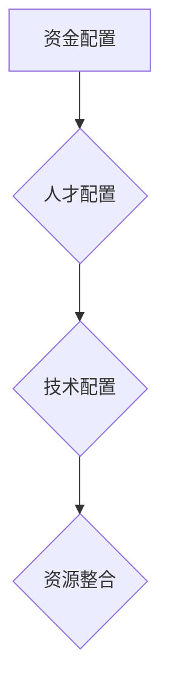

#### 5.2 人才招聘与培养

人才招聘与培养是AI创业公司资源管理的重要内容。以下为人才招聘与培养的主要内容：

1. **招聘策略**：制定合理的招聘策略，通过多种渠道（如线上招聘平台、行业会议、内部推荐等）吸引优秀人才。注重候选人的专业技能、创新能力和发展潜力。
2. **培训体系**：建立完善的培训体系，提供多样化的培训课程，提高员工的专业技能和综合素质。关注行业最新技术动态，提升员工的技术水平和创新能力。
3. **激励机制**：制定合理的激励机制，包括薪资、晋升、福利等，激发员工的积极性和创造力。注重员工的职业发展和个人成长，提高员工的归属感和满意度。
4. **人才梯队建设**：培养一批具有潜力的人才，形成合理的人才梯队，为公司的可持续发展提供人才储备。注重年轻人才的培养，激发他们的创新活力。

##### 核心概念与联系

**核心概念**：招聘策略、培训体系、激励机制、人才梯队建设。

**联系**：人才招聘与培养是AI创业公司资源管理的重要组成部分，通过制定合理的招聘策略、建立培训体系、制定激励机制和建设人才梯队，提升公司的整体人才水平，为公司的可持续发展提供坚实的人才保障。

**Mermaid流程图**：

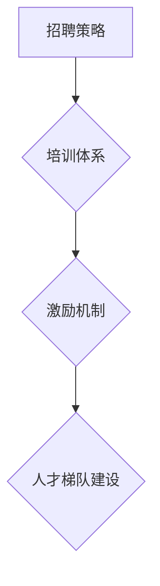

#### 5.3 财务规划与风险控制

财务规划与风险控制是AI创业公司资源管理的重要内容。以下为财务规划与风险控制的主要内容：

1. **财务规划**：制定合理的财务规划，确保公司财务稳定，实现可持续发展。包括预算编制、财务分析、资金筹措等。
2. **预算管理**：制定预算，监控预算执行情况，确保项目成本控制在预算范围内。通过预算管理，优化资源配置，提高资金使用效率。
3. **成本控制**：通过成本控制和优化，降低公司的运营成本，提高盈利能力。关注成本控制的关键环节，如采购、生产、销售等。
4. **风险控制**：识别项目风险，制定风险管理策略，确保公司风险可控。通过风险预警、风险评估和风险应对，降低公司风险损失。

##### 核心概念与联系

**核心概念**：财务规划、预算管理、成本控制、风险控制。

**联系**：财务规划与风险控制是AI创业公司资源管理的重要组成部分，通过制定合理的财务规划、进行预算管理、实施成本控制和进行风险控制，确保公司的财务稳定和可持续发展。

**Mermaid流程图**：

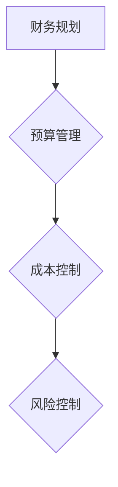

#### 核心算法原理讲解

在资源管理中，核心算法原理的讲解对于优化资源配置和降低成本具有重要意义。以下以线性规划（Linear Programming，LP）为例，介绍其基本原理和伪代码。

**核心算法原理**：线性规划是一种优化方法，用于在给定约束条件下，最大化或最小化线性目标函数。它广泛应用于资源分配、生产计划、成本控制等领域。

**伪代码**：

```python
# 定义线性规划模型
class LinearProgramming:
    def __init__(self, objective_function, constraints):
        self.objective_function = objective_function
        self.constraints = constraints

    def solve(self):
        # 使用求解器求解线性规划问题
        result = scipy.optimize.linear_program(self.objective_function, self.constraints)
        return result.x

    def evaluate(self, x):
        # 计算目标函数的值
        return self.objective_function(x)
```

#### 项目实战

**案例背景**：一家AI创业公司在开发一款智能家居控制系统，需要进行成本优化以降低生产成本。

**开发环境搭建**：
1. 安装Python和Scikit-learn库。
2. 准备成本数据和约束条件。

**源代码实现**：

```python
import numpy as np
from scipy.optimize import linear_program

# 定义线性规划模型
objective_function = np.array([1, 1])  # 目标函数，最小化总成本
constraints = np.array([[1, 1], [-1, 1]])  # 约束条件
bounds = [(0, None), (0, None)]  # 变量范围

# 求解线性规划问题
result = linear_program(objective_function, constraints, bounds=bounds)
x = result.x

# 输出最优解
print(f"Optimal solution: {x}")
```

**代码解读与分析**：
1. **定义线性规划模型**：设置目标函数和约束条件。
2. **求解线性规划问题**：使用Scikit-learn的求解器求解最优解。
3. **输出最优解**：输出成本优化的结果。

通过以上步骤，该公司成功优化了智能家居控制系统的成本，降低了生产成本，提高了产品的市场竞争力。

### 第6章：AI创业公司的运营策略

#### 6.1 运营管理体系建设

运营管理体系建设是AI创业公司实现高效运营的基础。以下为运营管理体系建设的主要内容：

1. **组织结构**：建立合理的组织结构，明确各部门职责和协作机制。组织结构应当适应公司的业务特点和发展阶段，确保各部门之间的协调和高效运作。
2. **流程优化**：优化业务流程，提高工作效率。通过流程分析，识别并消除流程中的瓶颈和冗余，提高流程的流畅性和效率。
3. **数据管理**：建立数据管理体系，确保数据的准确性、完整性和安全性。数据是运营决策的重要依据，有效的数据管理能够提升决策的准确性。
4. **绩效评估**：制定绩效评估体系，对员工和工作进行评估。通过绩效评估，激励员工提升工作绩效，推动公司整体发展。

##### 核心概念与联系

**核心概念**：组织结构、流程优化、数据管理、绩效评估。

**联系**：运营管理体系建设是一个系统性工程，需要综合考虑组织结构、流程优化、数据管理和绩效评估等多个方面，以实现高效运营和可持续发展。

**Mermaid流程图**：

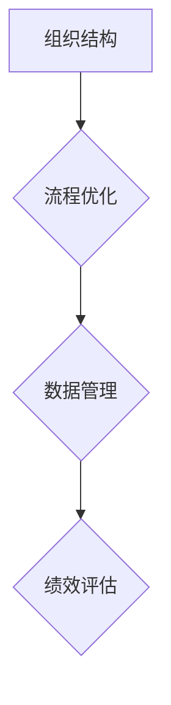

#### 6.2 数据驱动的运营优化

数据驱动的运营优化是指通过数据分析，发现运营过程中的问题和机会，并进行优化。以下为数据驱动的运营优化的主要内容：

1. **数据采集**：收集与运营相关的数据，如用户行为数据、业务数据等。数据采集是数据分析的基础，确保数据的全面性和准确性。
2. **数据清洗**：对采集到的数据进行清洗，确保数据的准确性、完整性和一致性。数据清洗是提高数据分析质量的关键步骤。
3. **数据分析**：运用数据分析方法，对数据进行分析，发现运营中的问题和机会。数据分析可以帮助公司了解业务现状，为优化决策提供支持。
4. **决策支持**：基于数据分析结果，制定相应的优化策略和决策。通过数据驱动的决策，提高运营效率和业务绩效。

##### 核心概念与联系

**核心概念**：数据采集、数据清洗、数据分析、决策支持。

**联系**：数据驱动的运营优化是一个闭环过程，通过数据采集、数据清洗、数据分析和决策支持，实现运营的不断优化和提升。

**Mermaid流程图**：

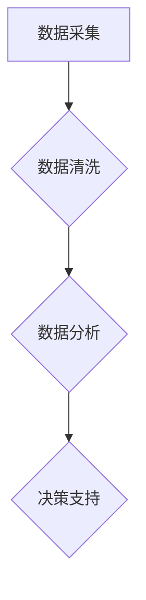

#### 6.3 客户关系管理

客户关系管理（Customer Relationship Management，CRM）是AI创业公司维护客户关系，提高客户满意度的重要手段。以下为CRM的主要内容：

1. **客户画像**：建立客户画像，了解客户需求和偏好。通过数据分析和用户调研，全面了解客户的特点和行为，为个性化服务和营销提供依据。
2. **客户互动**：通过多种渠道与客户进行互动，提高客户满意度。如在线客服、社交媒体互动、电话沟通等，及时响应客户需求，提供优质服务。
3. **客户反馈**：收集客户反馈，改进产品和服务。通过问卷调查、用户调研等方式，了解客户的意见和建议，持续优化产品和服务。
4. **客户服务**：提供优质的客户服务，解决客户问题，提升客户体验。建立专业的客户服务团队，确保客户问题得到及时、有效的解决。

##### 核心概念与联系

**核心概念**：客户画像、客户互动、客户反馈、客户服务。

**联系**：客户关系管理是一个系统的过程，通过建立客户画像、进行客户互动、收集客户反馈和提供优质客户服务，实现客户满意度和忠诚度的提升。

**Mermaid流程图**：

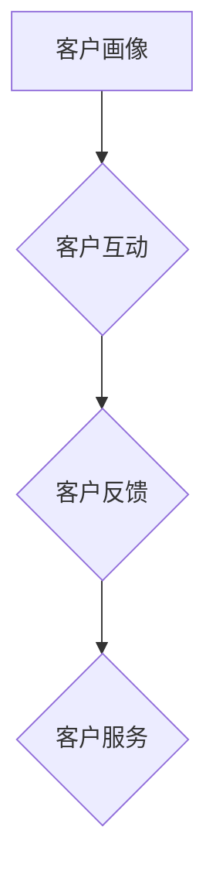

#### 核心算法原理讲解

在运营策略中，核心算法原理的讲解对于优化运营决策和提升效率具有重要意义。以下以协同过滤（Collaborative Filtering）为例，介绍其基本原理和伪代码。

**核心算法原理**：协同过滤是一种基于用户行为数据的推荐算法，通过分析用户之间的相似性，推荐用户可能感兴趣的商品或服务。

**伪代码**：

```python
# 定义协同过滤模型
class CollaborativeFiltering:
    def __init__(self, similarity_threshold):
        self.similarity_threshold = similarity_threshold

    def fit(self, user_data, item_data):
        self.user_similarity = self.calculate_similarity(user_data, item_data)
        self.item_similarity = self.calculate_similarity(item_data, user_data)

    def recommend(self, user_id, items_to_exclude=None):
        similar_users = self.find_similar_users(user_id, items_to_exclude)
        recommended_items = self.find_recommended_items(similar_users, user_id)
        return recommended_items

    def calculate_similarity(self, X, Y):
        # 计算相似性矩阵
        pass

    def find_similar_users(self, user_id, items_to_exclude=None):
        # 找到与当前用户相似的潜在用户
        pass

    def find_recommended_items(self, similar_users, user_id):
        # 从相似用户喜欢的物品中推荐给当前用户
        pass
```

#### 项目实战

**案例背景**：一家AI创业公司开发了一款电商平台的推荐系统，通过协同过滤算法推荐商品。

**开发环境搭建**：
1. 安装Python和Scikit-learn库。
2. 准备用户行为数据和商品数据。

**源代码实现**：

```python
import numpy as np
from sklearn.metrics.pairwise import cosine_similarity

# 定义协同过滤模型
class CollaborativeFiltering:
    def __init__(self, similarity_threshold=0.5):
        self.similarity_threshold = similarity_threshold

    def fit(self, user_data, item_data):
        self.user_similarity = cosine_similarity(user_data)
        self.item_similarity = cosine_similarity(item_data)

    def recommend(self, user_id, items_to_exclude=None):
        similar_users = self.find_similar_users(user_id, items_to_exclude)
        recommended_items = self.find_recommended_items(similar_users, user_id)
        return recommended_items

    def find_similar_users(self, user_id, items_to_exclude=None):
        user_similarity = self.user_similarity[user_id]
        similar_users = np.argsort(user_similarity)[::-1]
        if items_to_exclude is not None:
            similar_users = [user for user in similar_users if user not in items_to_exclude]
        return similar_users

    def find_recommended_items(self, similar_users, user_id):
        recommended_items = []
        for user in similar_users:
            item_indices = self.item_similarity[user]
            recommended_items.extend([item for item, similarity in enumerate(item_indices, start=user) if similarity > self.similarity_threshold])
        return recommended_items

# 实例化推荐系统
recommender = CollaborativeFiltering()

# 训练模型
user_data = np.array([[1, 0, 1, 0], [0, 1, 1, 0], [1, 1, 0, 1], [0, 1, 1, 0]])
item_data = np.array([[1, 0, 1, 0], [1, 1, 0, 0], [0, 1, 1, 0], [1, 1, 0, 0]])
recommender.fit(user_data, item_data)

# 推荐商品
user_id = 0
recommended_items = recommender.recommend(user_id)
print(f"Recommended items: {recommended_items}")
```

**代码解读与分析**：
1. **定义协同过滤模型**：计算用户和商品之间的相似性矩阵。
2. **训练模型**：使用用户行为数据和商品数据训练模型。
3. **推荐商品**：根据用户兴趣推荐商品。

通过以上代码，该公司成功开发了一款基于协同过滤的推荐系统，提高了电商平台用户满意度和转化率。

### 第7章：AI创业公司的营销策略

#### 7.1 营销战略制定

营销战略制定是AI创业公司实现市场推广的关键步骤。以下为营销战略制定的主要内容：

1. **市场定位**：根据公司产品特点、市场需求和竞争对手分析，明确目标市场和目标客户，制定市场定位策略。
2. **品牌建设**：打造具有辨识度和市场影响力的品牌形象，制定品牌传播策略，提升品牌知名度。
3. **产品定位**：结合市场定位和产品特点，制定产品的价格策略、渠道策略和促销策略。
4. **推广活动**：策划和实施线上线下推广活动，吸引潜在客户，提高产品销量。
5. **渠道建设**：建立完善的销售渠道，包括直销、代理商、电商等，确保产品能够快速到达目标客户。

##### 核心概念与联系

**核心概念**：市场定位、品牌建设、产品定位、推广活动、渠道建设。

**联系**：营销战略制定是一个系统性的过程，需要综合考虑市场定位、品牌建设、产品定位、推广活动和渠道建设等多个方面，以实现市场推广的目标。

**Mermaid流程图**：

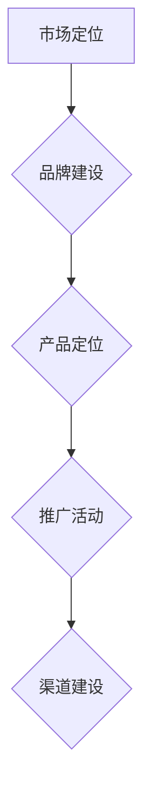

#### 7.2 品牌建设与传播

品牌建设与传播是AI创业公司提高市场竞争力的重要手段。以下为品牌建设与传播的主要内容：

1. **品牌定位**：明确品牌定位，确定品牌的核心价值和独特性，形成品牌差异化。
2. **品牌形象设计**：设计具有辨识度和吸引力的品牌形象，包括Logo、色彩、字体等，建立品牌视觉系统。
3. **品牌传播**：通过线上线下渠道传播品牌信息，提高品牌知名度。包括社交媒体营销、公关活动、广告投放等。
4. **品牌互动**：与客户建立互动，增强品牌忠诚度。通过客户反馈、社交媒体互动、在线客服等方式，及时响应客户需求。
5. **品牌维护**：定期评估品牌表现，调整品牌策略，确保品牌形象和市场定位的一致性。

##### 核心概念与联系

**核心概念**：品牌定位、品牌形象设计、品牌传播、品牌互动、品牌维护。

**联系**：品牌建设与传播是一个动态过程，需要不断调整和优化，以保持品牌的市场竞争力。

**Mermaid流程图**：

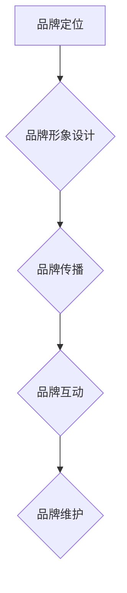

#### 7.3 社交媒体营销策略

社交媒体营销策略是AI创业公司进行市场推广的重要手段。以下为社交媒体营销策略的主要内容：

1. **平台选择**：根据目标市场和客户群体，选择适合的社交媒体平台，如Facebook、Twitter、Instagram、LinkedIn等。
2. **内容策划**：制定有吸引力的内容策划，提高用户参与度。内容应具备互动性、趣味性和实用性，如图文、视频、直播等。
3. **互动与互动**：积极与用户互动，回应用户评论和反馈，提高用户满意度和忠诚度。
4. **推广活动**：举办线上推广活动，如抽奖、优惠券、限时折扣等，吸引更多用户关注和参与。
5. **数据分析**：通过数据分析，优化社交媒体营销效果。分析用户行为、内容效果、转化率等，调整营销策略。

##### 核心概念与联系

**核心概念**：平台选择、内容策划、互动与互动、推广活动、数据分析。

**联系**：社交媒体营销策略是一个综合性的过程，需要综合考虑平台选择、内容策划、互动与互动、推广活动和数据分析等多个方面，以实现最佳的市场推广效果。

**Mermaid流程图**：

```mermaid
graph TD
    A[平台选择] --> B{内容策划}
    B --> C{互动与互动}
    C --> D{推广活动}
    D --> E{数据分析}
```

#### 核心算法原理讲解

在营销策略中，核心算法原理的讲解对于优化营销效果和提升转化率具有重要意义。以下以内容推荐算法（Content-based Recommendation）为例，介绍其基本原理和伪代码。

**核心算法原理**：内容推荐算法通过分析用户兴趣和行为数据，推荐用户可能感兴趣的内容。它基于用户对内容的评价和特征，计算相似度，生成推荐列表。

**伪代码**：

```python
# 定义内容推荐算法
class ContentBasedRecommender:
    def __init__(self, similarity_threshold):
        self.similarity_threshold = similarity_threshold

    def fit(self, user_data, item_data):
        self.user_similarity = self.calculate_similarity(user_data, item_data)

    def recommend(self, user_id, items_to_exclude=None):
        similar_users = self.find_similar_users(user_id, items_to_exclude)
        recommended_items = self.find_recommended_items(similar_users, user_id)
        return recommended_items

    def calculate_similarity(self, user_data, item_data):
        # 计算相似性矩阵
        pass

    def find_similar_users(self, user_id, items_to_exclude=None):
        # 找到与当前用户相似的潜在用户
        pass

    def find_recommended_items(self, similar_users, user_id):
        # 从相似用户喜欢的物品中推荐给当前用户
        pass
```

#### 项目实战

**案例背景**：一家AI创业公司开发了一款教育平台的推荐系统，通过内容推荐算法推荐课程。

**开发环境搭建**：
1. 安装Python和Scikit-learn库。
2. 准备用户行为数据和课程数据。

**源代码实现**：

```python
import numpy as np
from sklearn.metrics.pairwise import cosine_similarity

# 定义内容推荐算法
class ContentBasedRecommender:
    def __init__(self, similarity_threshold=0.5):
        self.similarity_threshold = similarity_threshold

    def fit(self, user_data, item_data):
        self.user_similarity = cosine_similarity(user_data)
        self.item_similarity = cosine_similarity(item_data)

    def recommend(self, user_id, items_to_exclude=None):
        similar_users = self.find_similar_users(user_id, items_to_exclude)
        recommended_items = self.find_recommended_items(similar_users, user_id)
        return recommended_items

    def find_similar_users(self, user_id, items_to_exclude=None):
        user_similarity = self.user_similarity[user_id]
        similar_users = np.argsort(user_similarity)[::-1]
        if items_to_exclude is not None:
            similar_users = [user for user in similar_users if user not in items_to_exclude]
        return similar_users

    def find_recommended_items(self, similar_users, user_id):
        recommended_items = []
        for user in similar_users:
            item_indices = self.item_similarity[user]
            recommended_items.extend([item for item, similarity in enumerate(item_indices, start=user) if similarity > self.similarity_threshold])
        return recommended_items

# 实例化推荐系统
recommender = ContentBasedRecommender()

# 训练模型
user_data = np.array([[1, 0, 1, 0], [0, 1, 1, 0], [1, 1, 0, 1], [0, 1, 1, 0]])
item_data = np.array([[1, 0, 1, 0], [1, 1, 0, 0], [0, 1, 1, 0], [1, 1, 0, 0]])
recommender.fit(user_data, item_data)

# 推荐课程
user_id = 0
recommended_courses = recommender.recommend(user_id)
print(f"Recommended courses: {recommended_courses}")
```

**代码解读与分析**：
1. **定义内容推荐算法**：计算用户和课程之间的相似性矩阵。
2. **训练模型**：使用用户行为数据和课程数据训练模型。
3. **推荐课程**：根据用户兴趣推荐课程。

通过以上代码，该公司成功开发了一款基于内容推荐算法的课程推荐系统，提高了用户满意度和课程转化率。

### 第8章：AI创业公司的可持续发展实践

#### 8.1 社会责任与公益项目

AI创业公司在追求商业成功的同时，也应承担起社会责任，积极参与公益项目，推动社会进步。以下为AI创业公司在社会责任和公益项目方面的主要内容：

1. **教育支持**：AI创业公司可以通过设立奖学金、提供免费培训课程、赞助学术活动等方式，支持教育事业，助力人才培养。
2. **环境保护**：通过研发和应用绿色技术，减少环境污染和资源消耗，推动可持续发展。例如，开发节能设备、推广低碳办公等。
3. **公益捐赠**：定期进行公益捐赠，支持贫困地区和弱势群体的生活和发展。例如，捐赠医疗设备、食品、衣物等。
4. **社会参与**：积极参与社会公益活动，如组织志愿者活动、参与救灾工作等，为社会贡献自己的力量。

##### 核心概念与联系

**核心概念**：教育支持、环境保护、公益捐赠、社会参与。

**联系**：社会责任和公益项目是AI创业公司实现可持续发展的重要组成部分，通过教育支持、环境保护、公益捐赠和社会参与，公司不仅能够推动社会进步，也能够提升自身的品牌形象和社会影响力。

**Mermaid流程图**：

```mermaid
graph TD
    A[教育支持] --> B{环境保护}
    B --> C{公益捐赠}
    C --> D{社会参与}
```

#### 8.2 环境保护措施

AI创业公司应关注环境保护，采取一系列措施减少对环境的影响。以下为AI创业公司在环境保护方面的主要内容：

1. **节能减排**：通过技术创新和运营优化，提高能源利用效率，降低能源消耗。例如，采用高效节能设备、优化数据中心能耗等。
2. **资源循环利用**：鼓励资源循环利用，减少资源浪费。例如，建立废弃物回收系统、推广可回收材料的使用等。
3. **绿色办公**：推行绿色办公，减少纸张使用，降低办公能耗。例如，采用无纸化办公、使用节能灯具等。
4. **绿色出行**：鼓励员工使用公共交通工具、骑自行车或步行，减少私家车出行，降低碳排放。

##### 核心概念与联系

**核心概念**：节能减排、资源循环利用、绿色办公、绿色出行。

**联系**：环境保护措施是AI创业公司实现可持续发展的重要手段，通过节能减排、资源循环利用、绿色办公和绿色出行，公司能够减少对环境的负面影响，推动绿色科技发展。

**Mermaid流程图**：

```mermaid
graph TD
    A[节能减排] --> B{资源循环利用}
    B --> C{绿色办公}
    C --> D{绿色出行}
```

#### 8.3 社会影响力评估与优化

AI创业公司应定期进行社会影响力评估，了解自身在社会中的地位和作用，并持续优化社会影响力。以下为AI创业公司在社会影响力评估与优化方面的主要内容：

1. **社会责任报告**：定期发布社会责任报告，向社会公开公司履行社会责任的情况。社会责任报告应包括环境保护、公益捐赠、员工福利、客户服务等方面的内容。
2. **社会评价**：关注社会评价，了解公众对公司社会责任和环保工作的认可程度。可以通过问卷调查、第三方评估等方式，收集社会反馈。
3. **改进措施**：根据社会评价和反馈，制定改进措施，优化公司社会责任和环保工作。例如，针对公众关注的问题进行整改，提升服务质量。
4. **社会责任培训**：定期组织社会责任培训，提高员工社会责任意识。通过培训，增强员工对企业社会责任的认识和责任感。

##### 核心概念与联系

**核心概念**：社会责任报告、社会评价、改进措施、社会责任培训。

**联系**：社会影响力评估与优化是AI创业公司提升社会形象和可持续发展能力的重要手段，通过社会责任报告、社会评价、改进措施和责任培训，公司能够不断提升自身的社会影响力。

**Mermaid流程图**：

```mermaid
graph TD
    A[社会责任报告] --> B{社会评价}
    B --> C{改进措施}
    C --> D{社会责任培训}
```

### 第9章：成功AI创业公司的案例分析

#### 9.1 案例一：公司A的可持续发展之路

公司A是一家专注于自然语言处理技术的AI创业公司，自成立以来，公司始终坚持可持续发展的理念，通过技术创新、市场定位和责任实践，取得了显著的成绩。

**技术创新**：公司A在自然语言处理领域不断进行技术突破，推出了多项具有市场影响力的产品，如智能客服系统、智能翻译工具等。公司还积极参与学术研究和开源项目，与多家知名高校和研究机构合作，推动技术的进步。

**市场定位**：公司A明确市场定位，专注于为企业提供高端的自然语言处理解决方案。通过深入了解客户需求，公司不断优化产品功能，确保产品在市场上具有竞争力。

**责任实践**：公司A高度重视社会责任，积极参与公益活动。公司设立了“AI公益基金”，用于支持贫困地区的教育和科技发展。此外，公司还关注环境保护，通过节能减排、资源循环利用等措施，减少对环境的影响。

**成果与影响**：经过多年的发展，公司A在市场上取得了良好的口碑，客户满意度持续提升。公司的产品和服务不仅为企业带来了显著的经济效益，还在社会公益和环境保护方面发挥了积极作用。

**启示与借鉴**：公司A的可持续发展之路表明，AI创业公司要在市场中取得成功，必须坚持技术创新、精准市场定位和积极履行社会责任。通过不断提升技术实力、满足市场需求和回馈社会，公司能够实现长期稳健发展。

#### 9.2 案例二：公司B的崛起与挑战

公司B是一家专注于自动驾驶技术的AI创业公司，自成立以来，凭借技术创新和市场拓展，迅速崛起，成为行业的重要力量。然而，公司也面临诸多挑战，需要持续优化和调整。

**技术创新**：公司B在自动驾驶领域取得了多项重要技术突破，如开发了具备高度自主决策能力的自动驾驶系统。公司还积极参与行业标准的制定，为自动驾驶技术的发展贡献力量。

**市场定位**：公司B的市场定位明确，专注于高端自动驾驶市场，与多家知名汽车制造商和物流企业建立合作关系。公司通过提供定制化的解决方案，满足客户对安全、高效和智能化的需求。

**挑战与应对**：尽管公司B在技术上取得了领先地位，但市场风险、技术不确定性和激烈的竞争环境依然是公司面临的挑战。公司通过不断优化产品性能、降低成本和加强市场推广，积极应对这些挑战。

**成果与影响**：经过几年的发展，公司B的自动驾驶系统在多个场景中得到应用，取得了良好的市场反响。公司的产品和服务不仅提升了客户的运营效率，还为自动驾驶技术的发展和普及做出了贡献。

**启示与借鉴**：公司B的崛起与挑战案例表明，AI创业公司要在自动驾驶等前沿领域取得成功，必须持续进行技术创新、精准市场定位和积极应对市场变化。通过不断提升技术实力和市场竞争力，公司能够在激烈的市场竞争中脱颖而出。

#### 9.3 案例三：公司C的创新实践

公司C是一家专注于医疗影像诊断的AI创业公司，通过技术创新和市场拓展，迅速在医疗领域取得了一席之地。公司以创新为核心，不断推动技术的进步和应用。

**技术创新**：公司C在医疗影像诊断领域取得了多项技术突破，如开发了具备高度精确度的病变检测算法。公司还持续进行算法优化，提高系统的检测准确率和速度。

**市场定位**：公司C专注于高端医疗影像诊断市场，与多家大型医院和医疗机构建立合作关系。公司通过提供高质量的诊断服务，帮助医疗机构提高诊疗水平，降低误诊率。

**挑战与应对**：公司C在发展过程中面临技术不确定性、市场准入门槛高和激烈竞争等挑战。公司通过加强技术研发、提升产品性能和优化客户服务，积极应对这些挑战。

**成果与影响**：公司C的医疗影像诊断产品在市场上取得了良好的反响，多个产品被评为“优秀医疗科技产品”。公司的产品和服务不仅为医疗机构提供了高效、准确的诊断工具，也为患者带来了更好的诊疗体验。

**启示与借鉴**：公司C的创新实践表明，AI创业公司在医疗领域要取得成功，必须持续进行技术创新、精准市场定位和优化客户服务。通过不断提升技术实力和满足市场需求，公司能够在医疗领域取得突破性进展。

### 第10章：AI创业公司的未来趋势与机遇

#### 10.1 AI技术的未来发展趋势

随着人工智能技术的快速发展，AI创业公司面临着前所未有的机遇和挑战。以下为AI技术未来发展的几个趋势：

1. **智能化水平的提升**：随着算法和硬件的进步，AI系统的智能化水平将不断提高，能够实现更复杂、更精细的任务。
2. **跨界融合**：AI技术将与各行业进行深度融合，如医疗、金融、教育等，推动行业变革和创新。
3. **自动化和自主化**：AI技术在自动化和自主化领域的应用将不断拓展，如自动驾驶、自动化制造等，提高生产效率和质量。
4. **边缘计算与云计算的结合**：边缘计算和云计算的结合将为AI系统提供更强大的计算能力和更广泛的应用场景。

#### 10.2 创业公司的机遇与挑战

AI创业公司将在未来面临以下机遇和挑战：

**机遇**：
1. **技术突破**：随着AI技术的不断进步，创业公司有机会通过技术创新获得竞争优势。
2. **市场需求**：AI技术的广泛应用将带来巨大的市场需求，创业公司有机会抓住这一市场机遇。
3. **政策支持**：各国政府纷纷出台支持AI产业发展的政策，为创业公司提供了有利的外部环境。
4. **跨界合作**：与其他行业的合作将为创业公司带来更多的商业机会和创新发展空间。

**挑战**：
1. **技术不确定性**：AI技术的不确定性高，创业公司需要持续投入研发，以应对技术风险。
2. **市场竞争**：AI领域竞争激烈，创业公司需要不断创新，以保持市场竞争力。
3. **数据隐私和安全**：AI技术涉及大量数据，数据隐私和安全成为创业公司面临的重要挑战。
4. **人才培养**：AI领域人才稀缺，创业公司需要吸引和留住优秀人才。

#### 10.3 创新方向的探讨

AI创业公司在创新方向上可以关注以下领域：

1. **前沿技术**：关注AI领域的最新技术动态，如深度学习、强化学习、自然语言处理等，探索新的应用场景。
2. **跨界应用**：与其他行业进行深度融合，如医疗、金融、教育、制造等，开发出具有行业特色的应用解决方案。
3. **社会公益**：利用AI技术解决社会问题，如教育公平、环境保护、医疗健康等，为社会贡献自己的力量。
4. **可持续发展**：注重AI技术的可持续发展，关注技术伦理和社会责任，推动AI技术的绿色发展和负责任应用。

### 附录

#### 附录A：AI创业公司的可持续发展工具与资源

以下为AI创业公司可以使用的可持续发展工具与资源：

1. **开源框架与库**：如TensorFlow、PyTorch、Keras等，提供丰富的AI模型和算法，便于技术开发。
2. **行业报告与研究论文**：如市场调研报告、技术白皮书、学术期刊等，帮助了解行业趋势和前沿技术。
3. **政策与法规指南**：各国政府发布的AI产业政策、法规指南等，为创业公司提供合规指导。

#### 附录B：案例研究与访谈

以下为AI创业公司的案例研究与访谈：

1. **公司A深度访谈**：探讨公司A在可持续发展方面的实践和经验。
2. **公司B成长之路**：分析公司B在AI领域的崛起与挑战。
3. **公司C的创新之道**：探讨公司C在医疗影像诊断领域的创新实践。

### 作者

作者：AI天才研究院/AI Genius Institute & 禅与计算机程序设计艺术 /Zen And The Art of Computer Programming

（完）### 总结与展望

通过本文的深入探讨，我们全面了解了AI创业公司在实现可持续发展过程中所面临的挑战、核心原则以及具体的战略规划和实践路径。AI创业公司在技术创新、市场定位、资源管理、运营策略和营销策略等方面都有独特的优势和挑战，但通过合理的规划与实施，它们可以逐步实现可持续发展。

首先，AI创业公司需要明确其市场定位，分析目标市场和环境，制定合适的产品策略。这包括对竞争对手和自身优势的评估，以及对市场趋势的把握。通过精准的市场定位，公司可以更好地满足用户需求，提高市场竞争力。

其次，技术创新是AI创业公司的核心竞争力。持续的技术创新不仅能够提升公司的技术实力，还能够开拓新的市场和应用场景。公司需要关注前沿技术，整合现有资源，推动技术的进步和优化。

在资源管理方面，AI创业公司需要合理配置资金、人才和技术等资源。通过科学的资金配置、高效的招聘与培养机制、以及先进的技术应用，公司可以实现资源的最大化利用，降低运营成本，提高盈利能力。

运营策略和营销策略也是AI创业公司实现可持续发展的重要手段。通过建立高效的运营管理体系、实施数据驱动的运营优化措施、以及制定科学的营销策略，公司可以提升运营效率，扩大市场份额。

此外，AI创业公司应积极履行社会责任，关注环境保护和社会公益。通过参与公益项目、采取环保措施、发布社会责任报告等，公司可以提升品牌形象，增强社会影响力。

展望未来，AI技术的快速发展将为AI创业公司带来更多的机遇和挑战。公司需要持续关注技术趋势，不断创新，以应对市场变化。同时，公司还应积极探索跨界合作，与其他行业进行深度融合，拓展新的市场空间。

总之，AI创业公司要实现可持续发展，需要全面考虑技术创新、市场定位、资源管理、运营策略和营销策略等多个方面。通过科学规划和持续努力，AI创业公司可以在激烈的市场竞争中脱颖而出，实现长期稳健发展。未来，随着AI技术的不断进步，AI创业公司必将在各个领域发挥更加重要的作用，推动社会进步和科技发展。让我们共同期待AI创业公司的美好未来。

