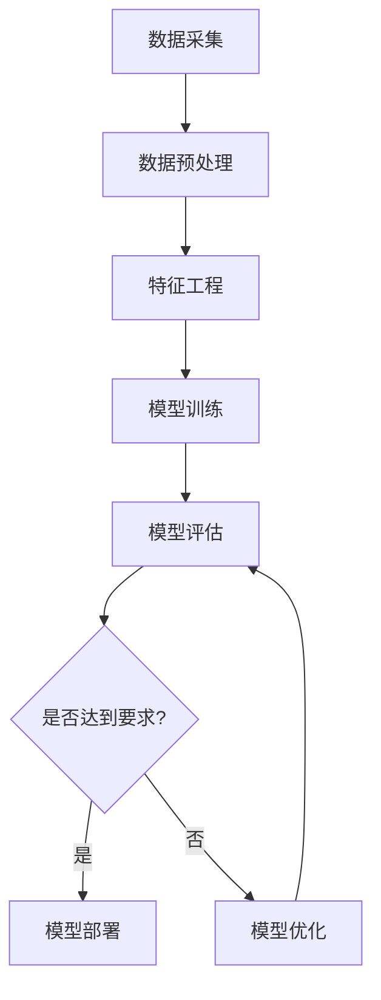

                 

### 《AI创业：数据管理的策略分析》

> **关键词**：人工智能创业、数据管理、策略分析、数据隐私、数据质量、数据价值

> **摘要**：
在这篇文章中，我们将深入探讨人工智能（AI）创业领域中的关键问题：数据管理。随着AI技术的迅猛发展，创业者面临着前所未有的机遇和挑战。有效的数据管理策略不仅能够提高创业项目的成功率，还能为企业带来长期的竞争优势。本文将系统地分析数据管理的基础概念、策略制定、以及实际案例，帮助AI创业者更好地理解和应对数据管理的挑战，实现数据价值的最大化。

---

#### 第一部分：AI创业概述

**第1章 AI创业：背景与机遇**

##### 1.1 AI发展现状与趋势

###### 1.1.1 AI技术革命

人工智能技术正在全球范围内引发一场前所未有的技术革命。从自动驾驶到智能医疗，从智能制造到金融科技，AI技术已经深刻地影响了多个行业，并持续推动着这些领域的创新和发展。AI技术的核心在于机器学习和深度学习算法，这些算法能够从大量数据中自动提取模式和知识，从而实现智能决策和自动化操作。

###### 1.1.2 AI在各行业的应用

在医疗领域，AI技术被用于疾病诊断、药物研发和医疗影像分析，大大提高了诊疗效率和准确性。在金融行业，AI被用于风险评估、欺诈检测和客户服务，提高了业务效率和客户满意度。在制造领域，AI被用于生产优化、质量控制和管理决策，提高了生产效率和产品质量。在零售行业，AI被用于个性化推荐、库存管理和供应链优化，提升了运营效率和客户体验。

###### 1.1.3 创业者眼中的AI

对于AI创业者来说，AI技术不仅是一个工具，更是一种改变游戏规则的变革力量。许多创业者看到了AI技术在解决复杂问题和创造新商业模式方面的巨大潜力，纷纷投身于AI创业的大潮中。AI创业的机遇在于：

- **创新空间广阔**：AI技术的广泛应用为创业者提供了丰富的创新空间，无论是产品创新还是商业模式创新，都有机会获得成功。

- **市场需求巨大**：随着AI技术的普及，各行业对AI解决方案的需求日益增长，创业者有机会抓住这一市场需求，创造巨大的商业价值。

- **投资热情高涨**：全球范围内的风险投资家对AI领域的投资热情高涨，为创业者提供了充足的资金支持。

##### 1.2 创业环境与挑战

###### 1.2.1 创业环境分析

AI创业环境的不断优化，为创业者提供了有利条件：

- **政策支持**：各国政府纷纷出台政策，支持AI技术研发和应用，为创业者提供了良好的政策环境。

- **技术创新**：AI技术的快速迭代和创新，为创业者提供了丰富的技术选择和解决方案。

- **市场成熟**：随着AI技术的普及和应用，市场对AI解决方案的需求逐渐成熟，为创业者提供了广阔的市场空间。

###### 1.2.2 AI创业面临的主要挑战

尽管AI创业环境日益优化，但创业者仍然面临着一系列挑战：

- **技术壁垒**：AI技术的复杂性和专业性，使得创业者需要具备深厚的专业知识和技能，这对于很多初创公司来说是一个巨大的挑战。

- **数据资源**：有效的数据管理是AI创业的核心，但获取高质量的数据资源往往需要付出巨大的成本和时间。

- **市场竞争**：AI领域的竞争激烈，创业者需要不断创新和优化，才能在竞争中脱颖而出。

###### 1.2.3 突破创业障碍的策略

为了突破AI创业的障碍，创业者可以采取以下策略：

- **技术创新**：通过技术创新，提高产品或服务的竞争力，实现差异化竞争。

- **资源整合**：整合外部资源，如技术合作伙伴、资金支持、人才引进等，提高创业成功率。

- **市场定位**：明确市场定位，专注于某一细分市场，实现精准营销。

##### 1.3 AI创业成功的要素

AI创业成功不仅需要技术创新，还需要一系列其他要素的支持：

###### 1.3.1 创业团队的构成

一个优秀的创业团队是AI创业成功的关键。团队应该具备以下特点：

- **多样性**：团队成员应具备不同的技能和背景，形成多元化的团队结构。

- **互补性**：团队成员之间应具备互补性，能够共同解决各种问题。

- **协同性**：团队成员应具备良好的协同能力，能够高效地合作。

###### 1.3.2 创业资金的筹集

创业资金的筹集是AI创业的重要环节。创业者可以通过以下途径筹集资金：

- **风险投资**：通过风险投资获取资金支持，风险投资家通常关注技术潜力、市场前景和团队实力。

- **天使投资**：通过天使投资获取资金支持，天使投资者通常关注创业者的个人能力和项目潜力。

- **政府资助**：通过政府资助获取资金支持，政府通常关注社会效益和技术创新。

###### 1.3.3 创新与持续发展

创新是AI创业的核心动力，创业者应持续关注技术创新和市场动态，不断优化产品和服务。同时，创业者还应关注企业的可持续发展，通过合理的管理和运营，实现企业的长期增长和稳定发展。

---

在本章中，我们初步探讨了AI创业的背景、机遇、挑战以及成功要素。在接下来的章节中，我们将进一步深入探讨数据管理的基础、策略分析、实际案例以及前沿技术，帮助AI创业者更好地理解和应对数据管理的挑战，实现数据价值的最大化。

---

#### 第二部分：数据管理基础

**第2章 数据管理基础**

##### 2.1 数据管理的基本概念

###### 2.1.1 数据定义与分类

数据是信息的载体，是AI创业的基础资源。根据数据的来源、类型和用途，可以对数据进行不同的分类：

- **结构化数据**：指具有明确结构和格式（如表格、数据库）的数据，易于存储、查询和管理。

- **半结构化数据**：指具有一定结构但格式不固定的数据（如XML、JSON），需要特定的工具和方法进行处理。

- **非结构化数据**：指没有明确结构和格式的数据（如图像、音频、视频、文本），处理难度较大。

###### 2.1.2 数据质量

数据质量是数据管理的重要指标，高质量的数据是AI创业成功的关键。数据质量包括以下几个方面：

- **准确性**：数据是否真实、可靠、无误。

- **完整性**：数据是否完整、无缺失。

- **一致性**：数据在不同时间、地点和系统之间是否保持一致。

- **时效性**：数据是否能够及时更新、反映当前情况。

###### 2.1.3 数据治理

数据治理是指通过制定规则、流程和技术手段，确保数据质量、安全和合规的一系列管理活动。数据治理包括以下几个方面：

- **数据战略**：明确数据在企业中的战略地位和目标。

- **数据架构**：定义数据的结构、分类、命名和存储规则。

- **数据安全**：确保数据的安全性、隐私性和合规性。

- **数据管理**：制定数据管理流程、规范和标准，确保数据的准确性和可用性。

##### 2.2 数据管理体系构建

###### 2.2.1 数据管理体系架构

一个完善的数据管理体系需要从组织结构、流程和技术三个方面进行构建：

- **组织结构**：建立专门的数据管理部门或团队，负责数据管理相关工作。

- **流程**：制定数据管理流程，包括数据采集、存储、处理、分析、共享等环节。

- **技术**：采用合适的数据管理工具和技术，如数据库管理系统、数据仓库、大数据平台等。

###### 2.2.2 数据生命周期管理

数据生命周期管理是指对数据从生成、存储、处理、共享到销毁的全过程进行管理。数据生命周期管理包括以下几个方面：

- **数据生成**：明确数据的来源和类型，确保数据生成过程的准确性。

- **数据存储**：选择合适的数据存储方案，确保数据的安全性、完整性和可恢复性。

- **数据处理**：对数据进行清洗、转换、整合和分析，提高数据质量。

- **数据共享**：制定数据共享策略，确保数据在不同部门和系统之间的流通和共享。

- **数据销毁**：根据数据隐私和合规要求，对不再需要的或过期数据进行安全销毁。

###### 2.2.3 数据仓库与数据湖

数据仓库和数据湖是数据管理的重要工具，用于存储、管理和分析大量数据。

- **数据仓库**：数据仓库是一个集中存储、管理和分析企业内部历史数据的系统，通常用于支持决策支持系统和商务智能。

- **数据湖**：数据湖是一个分布式、弹性可扩展的数据存储平台，可以存储海量结构化、半结构化和非结构化数据，适用于数据探索和分析。

##### 2.3 数据管理工具与技术

###### 2.3.1 数据库管理系统

数据库管理系统（DBMS）是数据管理的基础工具，用于创建、存储、检索和管理数据。常见的数据库管理系统包括关系型数据库（如MySQL、Oracle）和NoSQL数据库（如MongoDB、Cassandra）。

###### 2.3.2 大数据技术栈

大数据技术栈是一套用于处理海量数据的工具和平台，包括数据采集、存储、处理、分析和可视化等环节。常见的大数据技术栈包括Hadoop、Spark、Flink、HBase等。

###### 2.3.3 数据分析工具

数据分析工具用于对数据进行清洗、转换、分析和可视化，帮助创业者从海量数据中提取有价值的信息。常见的数据分析工具包括Excel、Tableau、Python（Pandas、NumPy、Scikit-learn等库）。

---

在本章中，我们详细介绍了数据管理的基本概念、管理体系构建以及相关工具和技术。在接下来的章节中，我们将进一步探讨数据管理策略分析，帮助创业者更好地制定和实施数据管理策略。

---

#### 第三部分：策略分析

**第3章 数据管理策略分析**

##### 3.1 数据管理策略概述

###### 3.1.1 数据管理策略的重要性

数据管理策略是企业在数据管理过程中制定的一系列规划和行动方案，旨在确保数据的准确性、可用性、安全性和合规性。有效的数据管理策略对企业具有以下几个重要意义：

- **提高数据质量**：通过制定明确的数据标准和流程，确保数据的准确性、完整性和一致性，提高数据质量。

- **降低数据风险**：通过数据治理和合规性管理，降低数据泄露、丢失和滥用的风险，保护企业利益。

- **提升业务效率**：通过数据管理和分析，为业务决策提供有力支持，提高业务效率和竞争力。

- **创造商业价值**：通过数据资产化，将数据转化为商业价值，为企业的可持续发展提供动力。

###### 3.1.2 数据管理策略的核心要素

数据管理策略的核心要素包括以下几个方面：

- **数据治理**：明确数据管理的目标、职责和流程，确保数据的安全、合规和有效利用。

- **数据架构**：设计数据架构，包括数据模型、数据仓库和数据湖等，为数据管理和分析提供基础。

- **数据安全**：制定数据安全策略，包括数据加密、访问控制和审计等，确保数据的安全和隐私。

- **数据分析**：建立数据分析平台，支持数据清洗、转换、分析和可视化，为业务决策提供支持。

- **数据合规**：遵循相关法律法规和行业标准，确保数据管理过程的合规性。

###### 3.1.3 数据管理策略的制定流程

制定有效的数据管理策略需要遵循以下流程：

1. **需求分析**：了解企业业务需求，确定数据管理目标和关键业务领域。

2. **现状评估**：评估现有数据管理情况，包括数据质量、安全性和合规性等方面。

3. **策略规划**：根据需求分析和现状评估，制定数据管理策略，包括数据治理、数据架构、数据安全、数据分析等。

4. **实施方案**：制定具体的实施方案，包括组织结构、流程、技术工具等。

5. **实施与监控**：执行数据管理策略，并对实施过程进行监控和评估，确保策略的有效性和持续改进。

##### 3.2 数据隐私与合规

###### 3.2.1 数据隐私保护原则

数据隐私保护是数据管理的重要方面，需要遵循以下原则：

- **数据最小化原则**：只收集和处理必要的数据，避免过度收集。

- **数据匿名化原则**：对敏感数据进行匿名化处理，确保数据隐私。

- **数据安全原则**：采取数据加密、访问控制和审计等技术手段，确保数据安全。

- **用户知情权原则**：告知用户数据的收集、使用和目的，尊重用户隐私。

- **用户控制权原则**：用户有权决定其数据的收集、使用和共享，并可以撤回同意。

###### 3.2.2 数据合规要求

数据合规要求是企业进行数据管理的重要依据，需要遵循以下法规和标准：

- **GDPR（通用数据保护条例）**：欧盟的隐私保护法规，对数据的收集、存储、处理和传输提出了严格的要求。

- **CCPA（加州消费者隐私法案）**：美国的隐私保护法规，对消费者的数据隐私保护提出了更高的要求。

- **ISO/IEC 27001**：国际标准化组织制定的信息安全管理体系标准，对数据安全管理提供了全面的指导。

- **行业特定标准**：如金融行业的PCI-DSS、医疗行业的HIPAA等，对特定行业的数据隐私和合规性提出了具体要求。

###### 3.2.3 数据隐私保护技术

数据隐私保护技术包括以下几种：

- **数据加密**：使用加密算法对数据进行加密，确保数据在传输和存储过程中的安全。

- **访问控制**：通过访问控制机制，限制对数据的访问权限，确保数据安全。

- **匿名化**：对敏感数据进行匿名化处理，消除个人身份信息，保护隐私。

- **数据脱敏**：对敏感数据进行脱敏处理，如替换、掩码等，确保数据可用性。

- **区块链技术**：利用区块链技术的去中心化和不可篡改性，保护数据隐私。

##### 3.3 数据质量管理

###### 3.3.1 数据质量评价标准

数据质量评价标准是评估数据质量的重要依据，通常包括以下几个方面：

- **准确性**：数据是否真实、可靠、无误。

- **完整性**：数据是否完整、无缺失。

- **一致性**：数据在不同时间、地点和系统之间是否保持一致。

- **及时性**：数据是否能够及时更新、反映当前情况。

- **可用性**：数据是否能够方便地查询和使用。

- **相关性**：数据与业务目标之间的相关性。

- **可追溯性**：数据来源和变更记录是否可追溯。

###### 3.3.2 数据质量问题分析

数据质量问题分析是数据质量管理的重要环节，需要从以下几个方面进行分析：

- **数据收集**：分析数据收集过程的准确性、完整性和及时性。

- **数据存储**：分析数据存储的安全性和可靠性。

- **数据传输**：分析数据传输的完整性和及时性。

- **数据清洗**：分析数据清洗的效果，包括数据去重、缺失值处理、异常值处理等。

- **数据一致性**：分析数据在不同系统、时间和地点之间的一致性。

- **数据更新**：分析数据更新的及时性和准确性。

###### 3.3.3 数据质量改进策略

数据质量改进策略包括以下几个方面：

- **数据标准**：制定明确的数据标准和规范，确保数据质量。

- **数据治理**：建立数据治理机制，明确数据管理的职责和流程。

- **数据清洗**：定期对数据进行清洗，消除数据中的错误、缺失和异常。

- **数据监控**：建立数据监控机制，实时监控数据质量，发现问题及时处理。

- **培训与宣传**：加强数据质量管理培训，提高员工的数据质量意识。

- **技术支持**：采用先进的数据质量管理工具和技术，提高数据质量管理的效率。

##### 3.4 数据价值最大化

###### 3.4.1 数据价值评估方法

数据价值评估方法是衡量数据对企业业务贡献的重要手段，通常包括以下几个方面：

- **直接价值**：数据直接带来的业务收益，如销售收入、成本节约等。

- **间接价值**：数据对业务决策的支持作用，如提高决策效率、降低风险等。

- **潜在价值**：数据在未来可能带来的潜在收益，如新市场、新产品等。

数据价值评估方法包括以下几种：

- **成本法**：根据数据收集、存储、处理等成本计算数据价值。

- **收益法**：根据数据对企业业务的直接和间接收益计算数据价值。

- **比较法**：通过对比同行业数据价值计算数据价值。

###### 3.4.2 数据驱动的决策支持系统

数据驱动的决策支持系统（DSS）是利用数据分析技术为企业提供决策支持的系统，主要包括以下几个方面：

- **数据采集**：从各种数据源收集数据，包括内部数据和外部数据。

- **数据预处理**：对数据进行清洗、转换、整合等预处理操作，提高数据质量。

- **数据分析**：利用数据分析技术对数据进行挖掘和分析，提取有价值的信息。

- **决策支持**：根据分析结果提供决策支持，辅助企业做出更明智的决策。

数据驱动的决策支持系统主要包括以下类型：

- **预测分析**：根据历史数据预测未来趋势，为决策提供预测依据。

- **回归分析**：根据自变量和因变量的关系进行回归分析，找出最佳决策方案。

- **聚类分析**：将相似数据归为一类，为决策提供分类依据。

- **关联规则分析**：分析数据之间的关联关系，为决策提供关联性依据。

###### 3.4.3 数据资产化策略

数据资产化是将数据转化为企业资产的过程，主要包括以下几个方面：

- **数据确权**：明确数据归属，确保数据权属清晰。

- **数据标准化**：制定统一的数据标准和规范，提高数据质量。

- **数据流通**：建立数据流通机制，促进数据在不同部门和系统之间的共享和利用。

- **数据交易**：通过数据交易市场，实现数据资产的流通和变现。

- **数据创新**：通过数据创新，挖掘数据价值，为业务提供新思路和新方案。

---

在本章中，我们详细分析了数据管理策略的概述、数据隐私与合规、数据质量管理以及数据价值最大化。这些策略对于AI创业者来说至关重要，能够帮助他们在数据管理方面取得成功。在下一章中，我们将通过实际案例进一步探讨数据管理策略在AI创业中的应用和实践。

---

#### 第四部分：AI创业实践

**第4章 AI创业实践案例**

##### 4.1 案例研究1：数据驱动的初创公司

###### 4.1.1 公司简介

ABC科技公司是一家专注于利用人工智能技术提供个性化健康解决方案的初创公司。公司成立于2018年，总部位于硅谷，核心团队由来自斯坦福大学和加州大学伯克利分校的顶级研究人员和工程师组成。公司主要产品是一款基于人工智能的个性化健康监测和疾病预测应用，旨在帮助用户实时监测健康状况，预测潜在疾病风险，并提供个性化的健康建议。

###### 4.1.2 数据管理实践

ABC科技公司高度重视数据管理，将其视为公司发展的基石。以下是公司在数据管理方面的主要实践：

1. **数据采集与整合**：公司通过多种渠道收集用户数据，包括用户生理指标、生活习惯、遗传信息等。数据来源包括智能穿戴设备、健康监测应用、医疗记录等。公司采用数据清洗和整合技术，确保数据的准确性和一致性。

2. **数据存储与安全**：公司采用分布式数据库系统，确保数据的可靠性和安全性。同时，公司采用数据加密和访问控制技术，保护用户隐私和敏感信息。

3. **数据分析与挖掘**：公司利用机器学习和深度学习技术，对用户数据进行深入分析，提取有价值的信息。通过数据挖掘，公司能够发现用户健康状况和疾病风险之间的关联，为用户提供个性化的健康建议。

4. **数据治理与合规**：公司建立完善的数据治理机制，包括数据质量评估、数据安全和合规性管理。公司遵循GDPR和CCPA等法规，确保数据管理过程的合规性。

###### 4.1.3 创业成果与挑战

ABC科技公司在数据管理的支持下，取得了显著的创业成果：

- **用户增长迅速**：公司产品在市场上获得广泛关注，用户数量快速增长，为公司的持续发展奠定了基础。

- **市场影响力提升**：公司通过数据驱动的个性化健康解决方案，赢得了众多用户的信任和好评，市场影响力不断提升。

- **商业价值实现**：公司通过数据资产化，将用户数据转化为商业价值，实现了盈利和可持续发展。

然而，公司在数据管理方面也面临一些挑战：

- **数据隐私保护**：随着用户数据的增加，数据隐私保护成为一个重要挑战。公司需要不断优化数据加密和访问控制技术，确保用户隐私。

- **数据质量保障**：数据质量是公司成功的关键，公司需要持续优化数据清洗和整合流程，确保数据质量。

- **合规性管理**：公司需要不断关注相关法规和标准的变化，确保数据管理过程的合规性。

##### 4.2 案例研究2：AI技术在医疗行业的应用

###### 4.2.1 案例背景

XYZ医疗科技公司成立于2019年，总部位于波士顿，专注于利用人工智能技术改善医疗诊断和治疗方案。公司核心团队由来自麻省理工学院和哈佛医学院的专家组成，旨在通过AI技术提高医疗诊断的准确性和效率，为患者提供更优质的医疗服务。

###### 4.2.2 数据管理策略

XYZ医疗科技公司高度重视数据管理，制定了以下数据管理策略：

1. **数据采集**：公司通过多种渠道收集医学影像、患者病历、基因数据等，包括医院、诊所、实验室等。公司采用自动化数据采集工具，确保数据的准确性和完整性。

2. **数据存储与安全**：公司采用分布式存储系统，确保数据的可靠性和安全性。同时，公司采用数据加密和访问控制技术，保护患者隐私和敏感信息。

3. **数据清洗与整合**：公司利用数据清洗技术，消除数据中的错误、缺失和异常。通过数据整合，将不同来源的数据进行整合，提高数据质量。

4. **数据分析与挖掘**：公司采用机器学习和深度学习技术，对医疗数据进行深入分析，提取有价值的信息。通过数据挖掘，公司能够发现疾病诊断和治疗方案之间的关联，为医生提供辅助决策。

5. **数据治理与合规**：公司建立数据治理机制，确保数据质量、安全和合规。公司遵循HIPAA等法规，确保数据管理过程的合规性。

###### 4.2.3 项目实施与效果

XYZ医疗科技公司通过数据管理策略的实施，取得了以下项目效果：

- **诊断准确率提高**：通过AI技术分析医疗数据，公司产品能够提供更准确的诊断结果，提高了医生诊断的准确性。

- **治疗方案优化**：公司产品能够为医生提供更个性化的治疗方案，提高了治疗方案的有效性。

- **患者满意度提升**：通过AI技术的应用，患者能够获得更优质的医疗服务，患者满意度显著提升。

然而，公司在数据管理方面也面临一些挑战：

- **数据隐私保护**：随着患者数据的增加，数据隐私保护成为一个重要挑战。公司需要不断优化数据加密和访问控制技术，确保患者隐私。

- **数据质量保障**：数据质量是公司成功的关键，公司需要持续优化数据清洗和整合流程，确保数据质量。

- **合规性管理**：公司需要不断关注相关法规和标准的变化，确保数据管理过程的合规性。

##### 4.3 案例研究3：AI在金融领域的创新

###### 4.3.1 案例背景

DEF金融科技公司成立于2020年，总部位于伦敦，专注于利用人工智能技术提供智能投顾和风险管理服务。公司核心团队由来自牛津大学和伦敦商学院的专家组成，旨在通过AI技术帮助用户实现资产增值和风险控制。

###### 4.3.2 数据管理策略

DEF金融科技公司高度重视数据管理，制定了以下数据管理策略：

1. **数据采集**：公司通过多种渠道收集金融数据，包括市场行情、用户交易记录、新闻资讯等。公司采用自动化数据采集工具，确保数据的准确性和完整性。

2. **数据存储与安全**：公司采用分布式存储系统，确保数据的可靠性和安全性。同时，公司采用数据加密和访问控制技术，保护用户隐私和敏感信息。

3. **数据清洗与整合**：公司利用数据清洗技术，消除数据中的错误、缺失和异常。通过数据整合，将不同来源的数据进行整合，提高数据质量。

4. **数据分析与挖掘**：公司采用机器学习和深度学习技术，对金融数据进行深入分析，提取有价值的信息。通过数据挖掘，公司能够发现市场趋势、风险因素等，为用户提供建议。

5. **数据治理与合规**：公司建立数据治理机制，确保数据质量、安全和合规。公司遵循相关金融法规和标准，确保数据管理过程的合规性。

###### 4.3.3 项目实施与效果

DEF金融科技公司通过数据管理策略的实施，取得了以下项目效果：

- **投资收益提升**：通过AI技术分析市场数据和用户交易记录，公司产品能够提供更精准的投资建议，提高了用户的投资收益。

- **风险管理能力增强**：公司产品能够实时监测市场风险，为用户提供有效的风险控制建议，提高了用户的风险管理水平。

- **用户满意度提升**：通过AI技术的应用，用户能够获得更专业的金融服务，用户满意度显著提升。

然而，公司在数据管理方面也面临一些挑战：

- **数据隐私保护**：随着用户数据的增加，数据隐私保护成为一个重要挑战。公司需要不断优化数据加密和访问控制技术，确保用户隐私。

- **数据质量保障**：数据质量是公司成功的关键，公司需要持续优化数据清洗和整合流程，确保数据质量。

- **合规性管理**：公司需要不断关注相关法规和标准的变化，确保数据管理过程的合规性。

---

在本章中，我们通过三个实际案例，详细介绍了数据管理在AI创业中的应用和实践。这些案例展示了数据管理策略在AI创业中的重要性，以及创业者如何应对数据管理的挑战，实现数据价值的最大化。在下一章中，我们将进一步探讨前沿技术，包括自动驾驶技术、智能制造和区块链与AI的结合，为AI创业者提供更多的创新思路和实践指导。

---

#### 第五部分：前沿技术探讨

**第5章 前沿技术探讨**

##### 5.1 自动驾驶技术

###### 5.1.1 自动驾驶技术的概述

自动驾驶技术是指通过计算机视觉、传感器融合、机器学习和控制理论等技术，使车辆能够自主完成驾驶任务。自动驾驶技术按照自动化程度可分为以下几类：

- **L0：无自动化**：车辆完全由人类驾驶员控制。

- **L1：驾驶员辅助**：车辆具备某些自动化功能，如自适应巡航控制、车道保持等。

- **L2：部分自动化**：车辆在特定条件下能够实现部分驾驶任务，如高速公路自动驾驶。

- **L3：有条件自动化**：车辆在特定场景下能够完全自动驾驶，但在某些情况下仍需人类驾驶员接管。

- **L4：高度自动化**：车辆在绝大多数情况下能够实现自动驾驶，但某些特殊场景（如极端天气）可能需要人类驾驶员介入。

- **L5：完全自动化**：车辆在任何情况下都能实现自动驾驶，无需人类驾驶员干预。

###### 5.1.2 数据管理在自动驾驶中的应用

自动驾驶技术依赖于大量数据，数据管理在整个系统中扮演关键角色。以下是数据管理在自动驾驶中的应用：

1. **传感器数据采集**：自动驾驶车辆配备多种传感器，如摄像头、激光雷达、雷达、GPS等，用于采集环境信息。

2. **数据预处理**：对采集到的传感器数据进行预处理，包括去噪、滤波、数据整合等，提高数据质量。

3. **数据存储**：采用分布式存储系统，确保数据的可靠性和安全性。同时，利用数据湖技术存储海量结构化、半结构化和非结构化数据。

4. **数据分析和挖掘**：通过机器学习和深度学习技术，对传感器数据进行实时分析和挖掘，提取有价值的信息，如道路标识、行人、车辆等。

5. **决策支持**：基于分析结果，自动驾驶系统做出实时决策，如车速调整、车道切换等，确保行驶安全。

6. **数据反馈与优化**：将自动驾驶系统的运行数据反馈至数据中心，用于模型优化和系统更新。

###### 5.1.3 自动驾驶技术的挑战与未来

自动驾驶技术面临一系列挑战：

- **数据隐私**：自动驾驶车辆采集大量个人隐私数据，如行人和车辆的位置、行为等。如何保护这些隐私数据是一个重要问题。

- **数据质量**：传感器数据的准确性和一致性是自动驾驶系统的关键。如何确保数据质量，提高系统的可靠性，是一个亟待解决的挑战。

- **数据存储和处理能力**：自动驾驶系统需要处理海量数据，如何高效地存储、传输和处理这些数据，是一个重要问题。

自动驾驶技术的未来发展趋势包括：

- **5G通信技术**：5G通信技术的广泛应用将显著提高自动驾驶车辆的数据传输速度和可靠性，为实时数据分析和决策提供支持。

- **边缘计算**：边缘计算技术将数据处理的计算能力从云端转移到车辆本身，降低延迟，提高系统响应速度。

- **人工智能与云计算的结合**：通过将人工智能与云计算相结合，实现更强大的数据处理和分析能力，为自动驾驶系统提供更精准的决策支持。

##### 5.2 智能制造

###### 5.2.1 智能制造的基本概念

智能制造是指利用先进的信息技术和制造技术，实现制造过程的智能化和自动化。智能制造的核心技术包括：

- **物联网（IoT）**：通过物联网技术，实现设备、系统和资源的互联互通，实现制造过程的实时监控和智能调度。

- **大数据**：通过大数据技术，对生产过程中的海量数据进行采集、存储、分析和挖掘，实现生产过程的优化和预测。

- **云计算**：通过云计算技术，提供强大的计算能力和数据存储能力，支持智能制造系统的运行和数据处理。

- **人工智能（AI）**：通过人工智能技术，实现制造过程的自动化、智能化和自适应，提高生产效率和产品质量。

- **机器人技术**：通过机器人技术，实现制造过程的自动化和智能化，提高生产效率和产品质量。

- **数字孪生**：通过数字孪生技术，创建制造过程的虚拟模型，实现对制造过程的实时监控和仿真分析。

###### 5.2.2 数据管理在智能制造中的关键作用

数据管理在智能制造中扮演关键角色，主要包括以下几个方面：

- **数据采集与传输**：通过传感器、设备等采集生产过程中的数据，利用物联网技术实现数据实时传输，为智能制造提供数据基础。

- **数据存储与安全**：采用分布式存储系统，确保数据的可靠性和安全性。同时，利用数据加密技术，保护数据隐私和安全。

- **数据分析与挖掘**：通过大数据技术，对生产过程中的数据进行分析和挖掘，提取有价值的信息，为生产过程的优化提供支持。

- **数据可视化**：通过数据可视化技术，将生产过程中的数据以图表、仪表板等形式展示，帮助管理人员实时了解生产情况。

- **数据决策支持**：基于数据分析结果，为生产过程提供决策支持，如生产计划调整、设备维护等。

- **数据闭环反馈**：将生产过程中的数据反馈至数据中心，用于数据分析和模型优化，实现数据闭环反馈。

###### 5.2.3 智能制造的未来趋势

智能制造的未来趋势包括：

- **工业互联网**：工业互联网将物联网、云计算、大数据、人工智能等技术与制造业深度融合，实现制造过程的智能化和数字化转型。

- **个性化定制**：通过大数据和人工智能技术，实现生产过程的个性化定制，满足消费者个性化需求。

- **智能制造生态**：通过建立智能制造生态，实现不同企业、行业之间的协同与共享，提高整体制造业的竞争力。

- **绿色制造**：通过智能制造技术，实现生产过程的绿色化和节能化，减少资源消耗和环境污染。

##### 5.3 区块链与AI

###### 5.3.1 区块链技术介绍

区块链技术是一种去中心化、分布式、不可篡改的数据库技术。区块链由一系列按时间顺序排列的区块组成，每个区块包含一定数量的交易记录。区块链的主要特点包括：

- **去中心化**：区块链不依赖于中心化的机构或服务器，所有节点都可以参与数据的存储和验证。

- **分布式**：区块链的数据分布在所有节点上，每个节点都存储完整的区块链数据。

- **不可篡改**：区块链的数据一旦记录，就不可篡改，保证了数据的安全性和可信度。

- **透明性**：区块链的数据对所有节点都是透明的，任何节点都可以查看和验证数据。

###### 5.3.2 区块链在数据管理中的应用

区块链技术可以应用于数据管理，主要优势包括：

- **数据安全**：区块链的分布式存储和加密技术，确保数据的安全性。

- **数据可信**：区块链的不可篡改特性，确保数据的可信度。

- **隐私保护**：区块链的匿名性，保护用户隐私。

- **数据共享**：区块链的分布式存储和共享机制，实现数据的便捷共享和协作。

区块链在数据管理中的应用场景包括：

- **数据存储**：将数据存储在区块链上，确保数据的安全性和可信度。

- **数据审计**：利用区块链的不可篡改特性，实现数据的审计和追溯。

- **隐私保护**：利用区块链的匿名性，实现数据隐私保护。

- **数据交易**：利用区块链的分布式共享机制，实现数据交易和共享。

###### 5.3.3 区块链与AI结合的潜在价值

区块链与AI技术的结合具有以下潜在价值：

- **数据信任**：利用区块链的不可篡改性和AI的智能分析能力，实现数据的可信管理和利用。

- **隐私保护**：利用区块链的匿名性和AI的隐私保护技术，实现数据的隐私保护和安全共享。

- **自动化执行**：利用区块链的智能合约和AI的自动化决策能力，实现业务流程的自动化和高效执行。

- **协同创新**：利用区块链的分布式共享机制和AI的创新技术，实现跨行业、跨区域的协同创新。

区块链与AI结合的应用场景包括：

- **智能合约**：利用区块链的智能合约，实现自动化、透明化的合同执行。

- **供应链管理**：利用区块链技术，实现供应链数据的可信管理和透明追踪。

- **数字身份**：利用区块链和AI技术，实现数字身份的建立和管理，提高网络安全和隐私保护。

- **金融科技**：利用区块链和AI技术，实现金融业务的自动化、智能化和高效执行。

---

在本章中，我们探讨了自动驾驶技术、智能制造和区块链与AI结合的前沿技术。这些技术为AI创业者提供了丰富的创新思路和实践指导。在下一章中，我们将深入探讨AI创业中的数据管理挑战与解决方案，帮助创业者更好地应对数据管理的挑战，实现数据价值的最大化。

---

#### 第六部分：创业与数据管理

**第6章 AI创业中的数据管理挑战与解决方案**

##### 6.1 数据管理在创业公司中的特殊挑战

###### 6.1.1 数据采集与整合

对于AI创业公司来说，数据采集与整合是一个特殊且具有挑战性的任务。由于创业公司通常资源有限，无法像大型企业那样获得大量的数据资源。因此，创业者需要通过以下策略来有效采集和整合数据：

1. **合作与共享**：通过与合作伙伴、研究机构、公共服务机构等建立合作关系，共享数据资源，提高数据采集的效率和质量。

2. **开源数据集**：利用现有的开源数据集进行数据采集，这些数据集通常涵盖各种领域，有助于快速获取所需数据。

3. **数据爬取**：利用爬虫技术从互联网上收集数据，但需注意数据合规性和隐私保护。

4. **API调用**：通过调用第三方API接口，获取公开的数据资源，适用于特定领域的数据采集。

5. **数据清洗与整合**：在数据采集后，创业者需要投入大量时间和精力进行数据清洗和整合，确保数据的准确性和一致性。采用自动化工具和算法，提高数据处理的效率。

###### 6.1.2 数据安全与隐私保护

数据安全与隐私保护是AI创业公司面临的重要挑战。由于AI系统依赖于大量数据，如何保护这些数据的安全和隐私成为一个关键问题。以下是一些解决方案：

1. **数据加密**：采用数据加密技术，对敏感数据进行加密，确保数据在传输和存储过程中的安全性。

2. **访问控制**：通过访问控制机制，限制对数据的访问权限，确保数据仅被授权用户访问。

3. **数据匿名化**：对敏感数据进行匿名化处理，消除个人身份信息，保护隐私。

4. **隐私保护算法**：利用隐私保护算法，如差分隐私、同态加密等，在数据分析过程中保护用户隐私。

5. **合规性管理**：遵循相关法规和标准，如GDPR、CCPA等，确保数据管理过程的合规性。

6. **安全教育**：加强员工的数据安全意识和培训，提高数据安全防护能力。

###### 6.1.3 数据质量保障

数据质量是AI创业成功的关键因素。对于创业公司来说，由于资源和时间有限，如何保障数据质量成为一个挑战。以下是一些解决方案：

1. **数据质量标准**：制定明确的数据质量标准，包括准确性、完整性、一致性、时效性等。

2. **数据质量监控**：建立数据质量监控机制，实时监控数据质量，及时发现和解决数据质量问题。

3. **数据清洗工具**：采用自动化数据清洗工具，提高数据清洗的效率和质量。

4. **数据治理**：建立数据治理机制，明确数据管理的职责和流程，确保数据质量。

5. **数据质量评估**：定期进行数据质量评估，识别和改进数据质量问题。

6. **用户反馈**：鼓励用户反馈数据质量问题，及时改进和优化数据质量。

##### 6.2 数据管理解决方案

###### 6.2.1 数据管理工具选择

选择合适的数据管理工具对于创业公司至关重要。以下是一些常见的数据管理工具及其特点：

1. **数据库管理系统（DBMS）**：如MySQL、PostgreSQL、MongoDB等，适用于结构化数据存储和管理。

2. **数据仓库**：如Amazon Redshift、Google BigQuery、Snowflake等，适用于大规模数据存储和分析。

3. **大数据平台**：如Apache Hadoop、Apache Spark、Flink等，适用于处理海量结构化、半结构化和非结构化数据。

4. **数据集成工具**：如Apache NiFi、Talend、Informatica等，适用于数据采集、清洗、转换和加载。

5. **数据分析工具**：如Tableau、Power BI、Python（Pandas、NumPy、Scikit-learn等库），适用于数据分析和可视化。

6. **数据治理平台**：如Informatica Data Governance、Alation、Collibra等，适用于数据治理和管理。

创业者需要根据业务需求和数据特点，选择合适的数据管理工具，确保数据管理的效率和质量。

###### 6.2.2 数据管理流程优化

优化数据管理流程是提高数据管理效率和质量的重要措施。以下是一些常见的优化策略：

1. **标准化流程**：制定统一的数据管理流程，确保数据采集、存储、处理、分析和共享等环节的标准化和规范化。

2. **自动化流程**：采用自动化工具和技术，提高数据管理流程的自动化程度，减少人为干预和错误。

3. **数据治理流程**：建立数据治理流程，明确数据管理的职责和权限，确保数据质量、安全和合规。

4. **监控与反馈流程**：建立数据质量监控和反馈机制，实时监控数据质量，及时发现和解决问题。

5. **培训与宣传**：加强数据管理培训，提高员工的数据管理意识和技能，促进数据管理流程的优化。

6. **持续改进**：定期评估和改进数据管理流程，根据业务需求和实际情况进行调整，确保数据管理流程的持续优化。

###### 6.2.3 数据管理团队建设

建立高效的数据管理团队是创业公司成功的关键。以下是一些建议：

1. **多元化团队**：组建多元化团队，包括数据科学家、数据工程师、数据分析师、数据治理专家等，形成跨职能团队，提高数据管理能力。

2. **技能培训**：提供持续的数据管理技能培训，提高团队成员的数据分析、数据治理和数据安全能力。

3. **经验分享**：鼓励团队成员分享经验和最佳实践，提高整体团队的数据管理水平。

4. **激励机制**：建立合理的激励机制，鼓励团队成员积极参与数据管理项目，提高团队凝聚力和工作效率。

5. **文化建设**：营造积极向上的数据管理文化，强调数据驱动决策、数据质量至上和数据安全意识，提高团队的数据管理意识。

##### 6.3 创业公司数据管理的最佳实践

###### 6.3.1 成功案例分享

以下是一些AI创业公司在数据管理方面的成功案例：

- **案例1**：一家AI医疗公司通过建立完善的数据治理机制，实现了数据的高质量管理和有效利用，成功开发出一款智能诊断产品，赢得了广泛的市场认可。

- **案例2**：一家金融科技公司通过采用区块链和人工智能技术，实现了数据的安全存储、传输和共享，提高了金融服务的效率和用户体验。

- **案例3**：一家自动驾驶公司通过建立高效的数据采集、清洗和分析流程，实现了自动驾驶系统的实时决策和高效运行，取得了显著的商业成功。

这些成功案例展示了数据管理在AI创业中的关键作用，以及创业者如何通过有效的数据管理策略实现商业成功。

###### 6.3.2 失败案例分析

以下是一些AI创业公司在数据管理方面的失败案例：

- **案例1**：一家AI初创公司在数据采集和整合方面存在严重问题，导致数据质量低下，影响了模型训练和业务决策，最终导致公司破产。

- **案例2**：一家金融科技公司由于数据安全漏洞，导致大量客户数据泄露，遭受了巨大的声誉损失和法律诉讼，最终倒闭。

- **案例3**：一家自动驾驶公司由于数据隐私保护措施不当，引发了用户隐私担忧，影响了产品的市场接受度和品牌形象。

这些失败案例提醒创业者，数据管理在AI创业中的重要性，以及忽视数据管理的风险和后果。

###### 6.3.3 数据管理经验总结

通过成功和失败案例的总结，我们可以得出以下数据管理经验：

1. **重视数据质量**：高质量的数据是AI创业成功的基础，创业者需要投入足够的资源和精力进行数据质量管理和优化。

2. **数据安全与隐私保护**：数据安全和隐私保护是数据管理的核心，创业者需要采取有效的技术和管理措施，确保数据的安全和合规。

3. **数据治理与合规**：建立完善的数据治理机制和合规性管理，确保数据管理过程的规范化和合规性。

4. **团队建设与培训**：建立高效的数据管理团队，提供持续的技能培训和文化建设，提高团队的数据管理能力和意识。

5. **持续改进与创新**：数据管理是一个持续的过程，创业者需要不断优化数据管理流程和策略，以适应不断变化的业务需求和技术发展。

---

在本章中，我们深入探讨了AI创业公司在数据管理方面面临的特殊挑战和解决方案，通过成功和失败案例的总结，为创业者提供了宝贵的经验教训。在下一章中，我们将展望AI创业与数据管理的未来发展趋势，为创业者提供更多的创新思路和实践指导。

---

#### 第七部分：未来展望

**第7章 AI创业与数据管理的未来**

##### 7.1 数据管理发展趋势

数据管理作为AI创业的核心环节，随着技术的不断进步和应用场景的扩展，其发展趋势呈现出以下几个特点：

###### 7.1.1 新兴数据管理技术

随着人工智能、云计算、大数据等技术的发展，新兴数据管理技术不断涌现，如：

- **联邦学习**：通过分布式计算和协作学习，实现多方数据的安全共享和协同训练。

- **分布式存储与计算**：利用分布式架构，提高数据存储和计算的效率和可靠性。

- **边缘计算**：在靠近数据源的地方进行计算，降低数据传输延迟，提高实时性。

- **区块链技术**：通过区块链技术实现数据的分布式存储、共享和加密，提高数据的安全性和透明性。

这些新兴技术为数据管理提供了更多可能性，创业者可以借助这些技术实现数据价值的最大化。

###### 7.1.2 数据管理领域的创新

数据管理领域的创新主要表现在以下几个方面：

- **智能化数据管理**：通过引入人工智能技术，实现数据管理的自动化和智能化，提高数据管理的效率和质量。

- **数据治理与合规**：随着法规的不断完善，数据治理与合规将成为数据管理的重要方向，创业者需要关注相关法规的变化，确保数据管理过程的合规性。

- **数据资产管理**：通过建立数据资产管理体系，将数据作为企业的重要资产进行管理和运营，提高数据的商业价值。

- **数据可视化与交互**：通过数据可视化技术和交互设计，提高数据理解的深度和广度，促进数据驱动决策。

这些创新将推动数据管理领域的不断发展和进步。

###### 7.1.3 数据管理在AI创业中的未来角色

数据管理在AI创业中的未来角色将更加重要，主要体现在以下几个方面：

- **核心基础设施**：数据管理将成为AI创业的核心基础设施，为AI算法和应用提供高质量的数据支持。

- **战略资源**：数据将成为企业战略资源，创业者需要重视数据的管理和运营，实现数据价值的最大化。

- **决策支持**：通过数据分析和挖掘，数据管理将为创业者提供有力的决策支持，帮助企业在竞争激烈的市场中脱颖而出。

- **可持续发展**：数据管理将推动企业的可持续发展，通过数据驱动的创新和优化，实现企业的长期增长和稳定发展。

##### 7.2 AI创业的未来前景

AI创业在未来具有广阔的发展前景，以下是一些潜在热点领域：

- **医疗健康**：AI技术在医疗健康领域的应用日益广泛，如疾病诊断、精准医疗、药物研发等，未来将有更多的创业公司进入这一领域。

- **金融科技**：金融科技是AI创业的重要领域，如智能投顾、风险管理、反欺诈等，随着金融市场的不断变化，这一领域的创业机会将不断涌现。

- **智能制造**：智能制造是AI创业的重要方向，如智能工厂、智能供应链、智能物流等，随着工业4.0的推进，这一领域将有更多的创业机会。

- **自动驾驶**：自动驾驶是AI创业的热点领域，如无人驾驶汽车、无人驾驶卡车等，随着技术的不断进步，这一领域的创业公司将有更多的发展空间。

- **智能家居**：智能家居是AI创业的重要领域，如智能音箱、智能家电、智能安防等，随着物联网和人工智能技术的普及，这一领域的创业机会将不断增多。

##### 7.3 数据管理在AI创业中的战略地位

数据管理在AI创业中的战略地位日益凸显，以下是一些关键点：

- **核心竞争力**：高质量的数据是AI创业的核心竞争力，创业者需要重视数据的管理和运营，确保数据的准确性和可用性。

- **战略资源**：数据将成为企业的战略资源，创业者需要制定明确的数据管理策略，确保数据的安全和合规。

- **决策支持**：数据管理将为创业者提供有力的决策支持，帮助企业在竞争激烈的市场中做出明智的决策。

- **协同发展**：数据管理将与AI技术、业务战略等协同发展，共同推动企业的创新和进步。

##### 7.4 AI创业与数据管理的协同发展

AI创业与数据管理的协同发展将推动企业的创新和进步，以下是一些协同发展的策略：

- **数据驱动的创新**：通过数据分析和挖掘，发现业务需求和市场机会，推动数据驱动的创新。

- **数据资产化**：将数据作为企业的重要资产进行管理和运营，实现数据资产化，提高数据的商业价值。

- **数据共享与协作**：通过数据共享和协作，实现跨部门、跨行业的协同发展，提高整体创新效率。

- **数据合规与安全**：确保数据管理过程的合规性和安全性，降低数据风险，为企业的可持续发展提供保障。

---

在本章中，我们展望了AI创业与数据管理的未来发展趋势，探讨了AI创业的未来前景，以及数据管理在AI创业中的战略地位和协同发展策略。在未来的AI创业中，数据管理将发挥更加重要的作用，成为企业创新和发展的关键驱动力。

---

#### 附录

**附录A：参考资料与推荐阅读**

- **相关书籍推荐**
  - 《大数据时代：生活、工作与思维的大变革》作者：维克托·迈尔-舍恩伯格
  - 《深度学习》作者：伊恩·古德费洛、约书亚·本吉奥、亚伦·库维尔
  - 《人工智能：一种现代的方法》作者：斯图尔特·罗素、彼得·诺维格

- **学术论文精选**
  - "Deep Learning" by Yann LeCun, Yoshua Bengio, and Geoffrey Hinton (2015)
  - "Big Data: A Revolution That Will Transform How We Live, Work, and Think" by Viktor Mayer-Schönberger and Kenneth Cukier (2013)
  - "Blockchain: Blueprint for a New Economy" by Melanie Swan (2015)

- **网络资源汇总**
  - [Kaggle](https://www.kaggle.com)：提供大量开源数据集和竞赛平台
  - [TensorFlow](https://www.tensorflow.org)：谷歌开源的机器学习框架
  - [PyTorch](https://pytorch.org)：Facebook开源的机器学习库

**附录B：AI大模型架构Mermaid流程图**

以下是一个Mermaid流程图示例，用于描述一个典型的人工智能大模型架构：



**附录C：数据管理策略数学模型与公式**

以下是一些常用的数据管理策略数学模型和公式：

- **数据质量评估模型**
  - 准确性（Accuracy）: \[Accuracy = \frac{TP + TN}{TP + TN + FP + FN}\]
  - 精确率（Precision）: \[Precision = \frac{TP}{TP + FP}\]
  - 召回率（Recall）: \[Recall = \frac{TP}{TP + FN}\]
  - F1分数（F1 Score）: \[F1 Score = \frac{2 \times Precision \times Recall}{Precision + Recall}\]

- **数据隐私保护模型**
  - 同态加密（Homomorphic Encryption）: \[C = E_{pub}(m_1 \oplus m_2)\]
  - 加密算法（Encryption Algorithm）: \[C = E_{key}(m)\]
  - 解密算法（Decryption Algorithm）: \[m = D_{key}(C)\]

**附录D：AI创业项目实战案例代码解析**

以下是一个AI创业项目实战案例代码解析，用于描述一个简单的自动驾驶数据处理过程：

```python
# 导入库
import pandas as pd
import numpy as np

# 读取数据集
data = pd.read_csv('data.csv')

# 数据预处理
# 数据清洗
data.dropna(inplace=True)
data[data['speed'] < 0] = np.nan
data.fillna(data.mean(), inplace=True)

# 特征工程
# 提取特征
features = data[['speed', 'distance', 'angle']]
labels = data['brake']

# 模型训练
from sklearn.ensemble import RandomForestClassifier
model = RandomForestClassifier()
model.fit(features, labels)

# 模型评估
from sklearn.metrics import accuracy_score
predictions = model.predict(features)
accuracy = accuracy_score(labels, predictions)
print(f"Model Accuracy: {accuracy}")

# 模型优化
from sklearn.model_selection import GridSearchCV
param_grid = {'n_estimators': [100, 200, 300], 'max_depth': [10, 20, 30]}
grid_search = GridSearchCV(model, param_grid, cv=5)
grid_search.fit(features, labels)
best_model = grid_search.best_estimator_
```

通过以上代码，创业者可以了解如何进行数据采集、预处理、特征工程、模型训练、模型评估和模型优化，从而为自动驾驶项目提供技术支持。在实践过程中，创业者可以根据实际需求调整代码，实现更加复杂和精确的自动驾驶数据处理。

---

**作者：AI天才研究院/AI Genius Institute & 禅与计算机程序设计艺术 /Zen And The Art of Computer Programming**

本文通过深入探讨AI创业与数据管理的关系，系统地分析了数据管理的基础、策略以及实践案例，为AI创业者提供了宝贵的经验和指导。在未来的AI创业中，数据管理将继续发挥关键作用，成为企业创新和发展的核心驱动力。希望本文能为广大AI创业者带来启示，助力他们在数据管理的道路上取得成功。**

